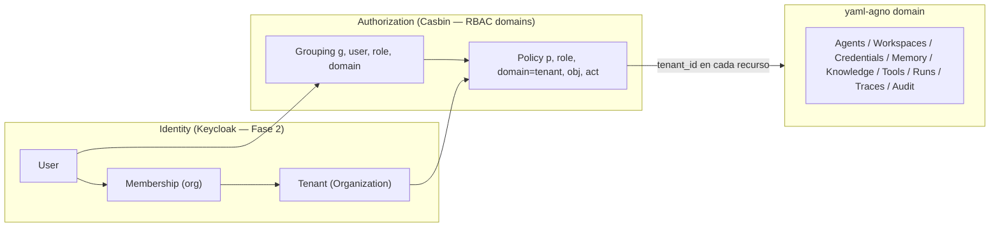
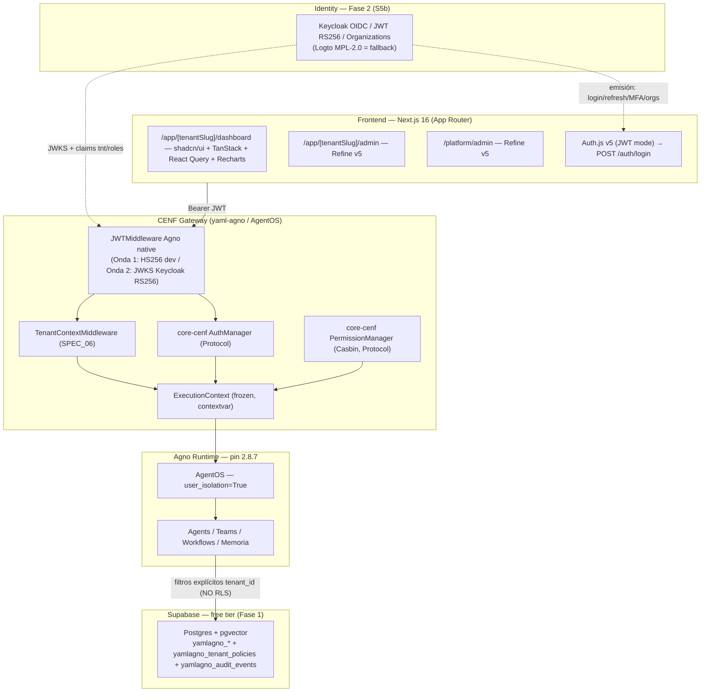
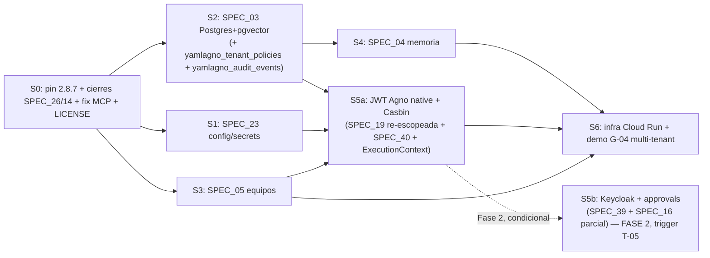

# FINAL Integrated Plan: yaml-agno Platform — R3

> **Fecha**: 2026-08-11 · **Autor**: Strategic Gestion Team (orquestador — Strategic Project Manager)
> **Propósito**: integración definitiva de 3 rondas de investigación (R1: EXECUTION-PLAN; R2: COMPETITOR-STRATEGY + KEYCLOAK-CASBIN-INTEGRATION-DESIGN + AUTH-INTEGRATION-READINESS; R3: audit real de Agno + stack UI + comparativa OSS). Este documento **integra, no re-descubre**: sintetiza y referencia; los documentos fuente siguen siendo la verdad técnica por sección.
> **Fuentes (leyenda de citas)**:
> - F1 = `perplexity-Capacidades_multitenant_nativas_Agno_AgentOS 2.8.x.md` (audit real de Agno, 375 líneas)
> - F2 = `perplexity-stack_recomendado.md` (stack UI, 280 líneas)
> - F3 = `chatgpt-comparar-repositorios-open-source.md` (lín. 1700-2093)
> - F4 = `.management/strategy/COMPETITOR-STRATEGY.md` (194 líneas)
> - F5 = `.management/technical/KEYCLOAK-CASBIN-INTEGRATION-DESIGN.md` (671 líneas)
> - F6 = `.management/quality/AUTH-INTEGRATION-READINESS.md` (263 líneas)
> - F7 = `.management/EXECUTION-PLAN.md` (232 líneas)

---

## 1. Veredicto Final (score + reconciliación)

### 1.1 Score ponderado por dimensión

Escala: 0-10 por dimensión; pesos en función del objetivo de Fase 1 (G-04 + frontera de seguridad L-03 + proteger revenue path ArcaMCP).

| Dimensión | Peso | Score | Justificación (con fuente) |
|---|---|---|---|
| Viabilidad técnica | 25% | **8.0** | Agno native JWT/RBAC/user_isolation **verificado contra docs oficiales en R3** (F1 §2-3) → resuelve GAP-4 de R2 (F4 §Fuentes). core-cenf AuthManager + PermissionManager **ya existen** (F5 §1.3/§10.1, F6 §2.2) → golden rule sin re-crear. Bajan el score: R1 CRITICAL (no-op silencioso de `AuthorizationConfig`, F6 §4 R1) y núcleo SPEC_19 ~40% no implementado (F6 §2.5 R3). Arquitectura ports/adapter lista para recibir la integración (F6 §2.6 GO REAL) |
| PMF | 20% | **7.0** | laburen valida disposición a pagar PyME AR/LATAM $19-$1.500/mes (F4 §PMF) pero no compite con la librería — compite con el PRODUCTO CENF; diferenciadores reales: vertical AFIP/ARCA + self-hosted/data sovereignty + metodología 34-SPEC + OSS como canal (F4 §Lectura estratégica). Baja: CENF tiene 0 clientes externos hoy |
| Riesgo | 25% | **5.5** | R-A (laburen 5x 2026 → puede llegar a facturación AFIP antes que ArcaMCP) es CRÍTICO y **no mitigable con código** (F4 §Riesgos R-A, §Riesgos críticos). R1 CRITICAL = fail-open silencioso en el plano declarativo (F6 §6A OWASP). R-G drift Agno sigue riesgo técnico #1 (mitigado: pin 2.8.7 + G-05/G-06, F7). R-D Liquibase→FSL: vigilar, no blocking (F4 R-D, F5 ADR-01) |
| Costo | 15% | **8.0** | Burn real $134/mes y bajando (vs $401 del roadmap — F7 §Correcciones); infra Fase 1 free tier $0-15/mes (F7 S6); tokens Fase 1 con S5a ≈ $130-270 (supuesto, §4.4); Keycloak solo Fase 2 y solo si cliente externo (F5 §8.3, ADR-01) |
| Timing | 15% | **7.5** | Semanas, no meses (1.5-2.5 semanas, F7). S5a en Fase 1 agrega ~3.5-6 d-a pero desbloquea G-04 multi-tenant real (F5 §9.1). El costo real es tiempo humano (operar Keycloak), no cash (F4 §Costos) |

**Score ponderado = 8.0·0.25 + 7.0·0.20 + 5.5·0.25 + 8.0·0.15 + 7.5·0.15 = 7.10 / 10**

**Veredicto: GO CONDICIONAL — confianza 0.75**

Condiciones (todas verificables en gates):
1. **S5a (Agno native + Casbin) se ejecuta en Fase 1**; L-03 (0 fugas cross-tenant) es gate **bloqueante** antes de cualquier cliente externo.
2. **S5b (Keycloak) se ejecuta en Fase 2**, gatillado por cliente externo / T-05 — no se opera Keycloak para 3 usuarios internos.
3. R1 (no-op silencioso) resuelto en S0 con mapeo explícito de campos + test de contrato (F6 §4 R1 mitigación).
4. Prioridad de producto = **ArcaMCP** (R-A); yaml-agno no roba días-agente al revenue path (F4 §Próximos pasos 4).
5. Pin Agno unificado a 2.8.7 en S0 (F7 S0.1) — confirma D1 del readiness (F6 §3 D1).

### 1.2 Reconciliación del conflicto central (Fase 1 vs Fase 2)

**Conflicto**: F4 (COMPETITOR-STRATEGY, R2) decide **postergar** Keycloak+Casbin y SPEC_19 completa a Fase 2 (BUY, no MAKE) con spike OIDC de-risking en Fase 1. F5 (KEYCLOAK-CASBIN, R2) **revoca** la postergación: G-04 se redefine a multi-tenant real demostrable → S5a (Agno native + Casbin) + S5b (Keycloak) **en Fase 1** (F5 §9.4, §1.1). F6 (readiness, R2) confirma viabilidad (GO) con 5 bloqueantes.

**Decisión del orquestador**: **S5a en Fase 1 + S5b en Fase 2.** No ambas en Fase 1. Fundamentación:

| Argumento | Peso en la decisión |
|---|---|
| **G-04 se redefine a multi-tenant real** (F5 §9.1) → la frontera de seguridad NO es diferible: sin user_isolation + filtros + Casbin no hay demo honesta de 2+ tenants con 0 fugas. L-03 se adelanta a S5a.1 (F5 §9.1) | Fuerte a favor de S5a en F1 |
| **S5a no requiere operar Keycloak**: JWT HS256 dev + user_isolation + Casbin in-process = cero servicios nuevos en Fase 1 (F5 ADR-02, F4 R-C). Casbin es embebible, no rompe el perfil free-tier (F5 ADR-03) | Fuerte a favor de S5a en F1 |
| **Keycloak es JVM pesada** (~1GB RAM, DB propia, cold start; F4 R-C, F5 §4.1). Operarlo para 3 usuarios internos viola la lógica del free tier. Su valor (login/refresh/MFA/organizations B2B, F1 §7.2, F3:1854) solo se justifica con cliente externo → T-05 es el trigger natural (F5 §9.1) | Fuerte a favor de S5b en F2 |
| **R-A (laburen)**: la urgencia no es auth — es PRODUCTO (ArcaMCP). S5b en F1 consumiría 3-5 d-a que ArcaMCP necesita (F4 §Decisión 6) | Fuerte a favor de S5b en F2 |
| **Spike OIDC de-risking ($5-10, Fase 1)** se mantiene: valida el round-trip Keycloak ↔ yaml-agno ANTES de comprometer el diseño de Fase 2 (F4 §Decisión 1) — desbloquea S5b sin bloquear el sprint | Refuerza el plan |
| **F5 no es descartado**: sus ADRs 1-5, SPECs 39/40/41 y el diseño de ExecutionContext se **ratifican**; solo cambia el timing de S5b (Fase 2) y el DAG | Reconciliación, no override |

**Reconciliación formal**: F4 gana en **timing** (S5b a Fase 2, BUY); F5 gana en **alcance** (S5a en Fase 1, re-escopeo de S5, G-04 multi-tenant, L-03 adelantado, revocación de "SPEC_19 postergable"). Ambas coinciden en lo esencial: BUY (Keycloak) no MAKE, Casbin antes que OpenFGA, ports en core-cenf, no sandbox en MVP. La única tensión residual (¿S5b en F1?) se resuelve por el principio de **costo de oportunidad de ArcaMCP** (R-A) y por **no operar servicios que nadie consume todavía**.

**Validación fractal (reflejada en el score)**: complejidad previa 14/16 (>10/16, F4 §Validación fractal) — la complejidad está en el SISTEMA objetivo (5 capas + servicios), no en el código actual. Tras R3 (audit real de Agno, F1) y F6 (readiness): el audit **confirma** cobertura nativa (user_isolation sobre sesiones/memoria/trazas, F1 §3.1) y **reduce incertidumbre de diseño**, pero F6 revela que la incertidumbre se trasladó a **ejecución**: R1 (no-op silencioso) + núcleo SPEC_19 ausente (~40%, F6 §2.5). Neto: la viabilidad técnica se **mantiene** (8.0), el riesgo no baja (5.5) porque el factor dominante (R-A) es competitivo, no técnico. GAP-4 de R2 (claims Agno no re-verificados) **queda resuelto** por F1 (verificado contra docs oficiales, §9).

### 1.3 Decision Card (resumen ejecutivo)

| Tipo | Contenido | Confianza | Escalamiento |
|---|---|---|---|
| **Evidencia licencia/provenance** | Agno Apache-2.0 (~40k stars, F3:1759); Keycloak Apache-2.0 CNCF Incubating; Casbin Apache-2.0 ASF Incubating; OpenFGA Apache-2.0 CNCF Incubating (concentración Okta); gVisor Apache-2.0; OpenShell Apache-2.0 pero ALPHA (no usar); Logto MPL-2.0 fallback (F4 §Provenance, verificado 2026-08-11). ⚠️ Excepción: Liquibase→FSL en Keycloak (issue #43391) — vigilar, no blocking (F4 R-D) | Alta (verificación contra fuentes primarias) | G-06 trimestral (nov 2026) |
| **Supuestos financieros** | Tokens Fase 1 con S5a ≈ $130-270 (supuesto aritmético: core $90-180 + S5a $40-90); con S5a+S5b en F1 ≈ $130-250 (F5 §9.1). Infra F1 $0-15/mes; Keycloak F2 +$15-50/mes (o $0-15 free; si >$15/mes → Logto, F5 ADR-01). Spike OIDC $5-10. Costo día-agente $10-20 con cache 92-96% (histórico SDD, no garantizado). Operación Keycloak = horas humanas, NO cash (F4 §Costos) | Media (rangos derivados, no cotizaciones) | Re-validar en G-05 y en el gate de Fase 2 |
| **Conclusiones estratégicas** | GO CONDICIONAL: S5a en F1 (frontera L-03), S5b en F2 (trigger T-05/cliente externo), ArcaMCP prioridad absoluta (R-A), apertura OSS post-Fase 1 sin acelerar por laburen | 0.75 | [DECISIÓN GONZALO] §5 |

---

## 2. Top 10 Learnings (3 rondas)

| # | Hallazgo | Fuente |
|---|---|---|
| 1 | **Agno AgentOS 2.8.x tiene JWT centralizado + RBAC jerárquico por scopes** (`resource:action`, `resource:<id>:action`, wildcard, `agent_os:admin`) cubriendo agentes, teams, workflows, sesiones, memoria, conocimiento, métricas, evals, trazas, schedules y approvals | F1 §2.2-2.3 |
| 2 | **`user_isolation=True` aisla por `sub` (user_id) sesiones, memoria y trazas** — verificado; NO documentado para knowledge, files, MCP, approvals, evals ("requiere verificación en código") | F1 §3.1-3.2 |
| 3 | **El modelo de tenant en Agno es IMPLÍCITO**: no hay jerarquía org→team→user; `sub` = user ID, nunca tenant_id; tenant se modela fuera (IdP o capa de negocio) | F1 §4 |
| 4 | **Agno VALIDA tokens pero NO EMITE**: sin IdP no hay login/refresh/MFA/organizations B2B → Keycloak es emisor (Onda 2), Agno validador | F1 §7.2, F3:1854-1901 |
| 5 | **Agno corrigió un IDOR en MCP** (bind user_id al JWT subject, fix #9379) → evidencia de trabajo real en aislamiento, no solo marketing; también issues abiertos (JWT hardcodeado, SQLi, SSRF) → "Agno multitenant ≠ boundary SaaS completo"; auditar dónde se impone tenant_id | F3:1750, F3:1957-1975 |
| 6 | **laburen.com NO compite con yaml-agno (librería); compite con el PRODUCTO CENF (ArcaMCP + Agente Instalador)**. Competir en metodología + vertical AFIP/ARCA + self-hosted + OSS como canal, NUNCA en features | F4 §PMF |
| 7 | **core-cenf-py YA tiene AuthManager (JWT+JWKS, TokenClaims con tenant_id/principal_id) y PermissionManager (Casbin RBAC domains + CasbinPermissionAdapter)** — verificados v0.1.0/v0.1.2. NO extraer, NO re-crear; yaml-agno consume los Protocols (golden rule) | F5 §1.3/§10.1, F6 §2.2 |
| 8 | **R1 CRITICAL: `AuthorizationConfig` ignora silenciosamente `basic_auth`/`config`** (no-op silencioso, verificado por ejecución en agno 2.8.3) → cualquier config de seguridad que no se refleje en runtime es fail-open declarativo | F6 §4 R1 |
| 9 | **Drift de pin agno (2.6.22 vs 2.8.3 instalada) se resuelve en S0 unificando a 2.8.7** (0 breaking, 22 commits aditivos, fix MCP #9379 + rehydration #9395) | F7 S0.1, F6 §3 D1 |
| 10 | **Keycloak es JVM pesada de operar** (~1GB RAM, DB, cold start) → es la razón por la que S5b va a Fase 2; reversión a Logto si >$15/mes infra, >1 d-a/mes operación o p95 login >3s | F4 R-C, F5 ADR-01 |

**GAPs escalados (evidencia ausente, no inventada)**: GAP-1 knowledge_graph mojibake (estructura legible, contenido no verificable, F4); GAP-2 stack interno laburen no verificado (F4); GAP-3 números enterprise laburen son de prensa ($1.500/mes, 95% facturación — infonegocios, no oficial) (F4); **GAP-4 resuelto** (claims Agno re-verificados por F1 en R3); GAP-5 costo operación Keycloak a 12 meses no cuantificado; GAP-6 SBOM/headers stack actual pendiente (F4 §GAPs).

---

## 3. Arquitectura Final (backend + auth + frontend + infra)

### 3.1 Backend — yaml-agno sobre Agno (pin 2.8.7)

Patrón `YAML → Pydantic *Config → Factory → Agno Objects` (F7, AGENTS.md). Reglas inviolables que la arquitectura respeta: user_id composite `{tenant_id}:{principal_id}` vía `resolve_user_id()` único resolver (nunca bare, nunca en YAML); NO-RLS con filtros explícitos `WHERE tenant_id = ?` en tablas `yamlagno_*` (Decisión 2.9, F7); storage Agno aislado por user_id; `asyncio.TaskGroup` (nunca gather); SecretManager de core-cenf (nunca os.environ).

Componentes de seguridad: `ExecutionContext` @dataclass(frozen=True) construido SOLO de claims JWT validados (AuthManager→TokenClaims) + decisiones de PolicyEnforcer (PermissionManager→PermissionDecision), propagado por contextvar, `user_id` como property derivada vía resolve_user_id() (F5 ADR-05, §7).

### 3.2 Auth — 2 ondas (S5a Fase 1 → S5b Fase 2)

**Onda 1 (S5a, Fase 1)**: JWTMiddleware de Agno activado (`authorization=True`, `AuthorizationConfig(user_isolation=True)`, JWT HS256 dev — documentado como transición, F5 ADR-02) + TenantContextMiddleware existente (SPEC_06) + **Casbin vía core-cenf PermissionManager** (RBAC domains, dom=tenant_id) para autorización resource-level (F5 ADR-03). Cero servicios nuevos; Casbin es in-process (F4 R-C).

**Onda 2 (S5b, Fase 2, trigger T-05/cliente externo)**: Keycloak como emisor (OIDC Authorization Code, JWT RS256 vía JWKS, `refresh_jwks()` cada 60 min con TaskGroup), token mapper para claim `tnt` (R4: Keycloak NO emite `tnt` por defecto → mapper obligatorio, anti-spoofing 401, F6 §4 R4), mapeo claims `sub`→principal_id, `tnt`→tenant_id, `scopes/roles`→scopes validado con Pydantic TokenClaims (F5 §6.1). Reversión a Logto sin tocar yaml-agno si excede presupuesto (F5 ADR-01).

**Modelo de datos de seguridad** (F5 §4.3):

Autorización = decisión Casbin; aislamiento de datos = composite user_id (user_isolation nativa) + WHERE explícito en `yamlagno_*` (NO RLS) (F5 §4.3).

### 3.3 Frontend — Next.js 16 + shadcn/ui + Refine v5 (F2)

- **Capa común**: Next.js 16 (App Router) + React 19 + TS + Tailwind v4 + shadcn/ui (gold standard B2B SaaS 2026, F2 §1).
- **Admin**: Refine v5 embebido (headless, dentro de Next, MIT core sin EE de pago, ~35.4k stars) para platform admin + tenant admin (F2 §2). React-Admin descartado (RBAC/audit en EE pago); AdminJS descartado (servidor Node separado) (F2 §2).
- **Dashboard cliente + onboarding**: Next + shadcn/ui puro + TanStack Table + React Query + Recharts (producto diferenciador, máximo control) (F2 §1).
- **Auth**: Auth.js v5 modo JWT — provider credenciales → backend Python `/auth/login` → guarda `token.jwt` + `tenantId` + `role` en callbacks jwt/session; `auth()` unifica protección de server actions; **nunca confiar en tenantId del cliente** — validar server-side (F2 §5).
- **Rutas**: `/(marketing)`, `/app/[tenantSlug]/dashboard`, `/app/[tenantSlug]/admin`, `/platform/admin` (F2 §3).
- **Aislamiento**: tenant context server-side (slug + claims JWT), React Query keys incluyen tenantId (`['agents', tenantId]`), helpers tenant-by-default + tests de leak (crítico por decisión NO-RLS) (F2 §3).

### 3.4 Infra — Cloud Run + Supabase (F7 S6)

Cloud Run (servicio API) + Supabase (Postgres + pgvector). Free tier Fase 1 ≈ $0-15/mes (F7). Keycloak en Cloud Run Fase 2: +$15-50/mes o $0-15 free tier; si >$15/mes → Logto (F5 ADR-01). **Reconciliación de infra**: el plan vigente (F7) manda Cloud Run + Supabase free tier; una observación de infra previa ("Supabase Pro + Logto") queda **descartada para Fase 1** y solo resurgiría como alternativa Fase 2 si Keycloak excede presupuesto — no es el plan vigente. NO Fly.io, NO Qdrant (pgvector + JSONB, F7 §Correcciones). Sandbox de procesos NO en MVP: solo `SandboxPort` + `NoopSandboxAdapter` (F5 ADR-04); OpenShell es ALPHA (F4 R-B), gVisor maduro pero operación compleja (Fase 3+).

### 3.5 Diagrama de capas

---

## 4. Execution Plan Revisado (S0-S6)

### 4.1 DAG (reconciliado de F7 §DAG + F5 §9.2)

**Ruta crítica Fase 1**: S0 → S2 → S4 → S6 (core, sin cambios) **+ S0 → S2 → S5a → S6** (nueva rama de seguridad; desbloquea G-04 multi-tenant, F5 §9.2). S5a corre en paralelo con S3/S4 una vez S2 está.

### 4.2 Fases (con decisiones D1-D5 del readiness resueltas)

| Fase | Contenido | Días-agente | Tokens est. | Gate |
|---|---|---|---|---|
| **S0** Pre-flight | **D1 resuelto**: unificar pin a 2.8.7 (0 breaking, 22 commits aditivos — F7 S0.1; confirma decisión (a) de F6 D1). **R1 resuelto**: mapeo explícito de campos AuthorizationConfig + test de contrato (F6 §4 R1 mitigación) — validar contra 2.8.7 ya instalado. Cerrar SPEC_26 (A2A round-trip) y SPEC_14 (fallback models free) + fix 6 tests MCP + crear LICENSE Apache-2.0 (F7 S0.2-0.6) | 2 | ~$20-30 (incluye R1) | **G-01** |
| **S1** SPEC_23 | Config/secrets: hot-reload ConfigManager, FeatureFlagManager, SecretManager async, clasificación env vs runtime (F7 S1) | 1-2 | $15-30 | — |
| **S2** SPEC_03 | Persistencia: DbRegistry, PgAgentStorage/PgTeamStorage, PgVectorDb (pgvector+JSONB), health check real, **tablas nuevas `yamlagno_tenant_policies` + `yamlagno_audit_events`** (F5 §5.3, F7 S2) | 3-5 | $30-60 | **G-05** |
| **S3** SPEC_05 | Equipos: TeamFactory E2E (TeamMode), workflows YAML/DAGs, tests de integración reales, gotcha enable_agentic_memory vs user_memory (F7 S3) | 2-4 | $20-45 | **G-05** |
| **S4** SPEC_04 | Memoria Agno native (LearningMachine): validar contra 2.8.7, integración sesión 1→2, filtro tenant_id en recuperación (F7 S4) | 1-2 | $10-25 | **G-05** |
| **S5a** (F1) | **D4 resuelto**: ExecutionContext (a) AHORA (slice S5a.2) — vector que thread-ea authz/audit sin parsear strings (F6 D4). **D2 resuelto**: modelo (c) híbrido — scopes claims-based en API (ScopeEnforcer, provider-agnóstico) + Casbin para resource-level (F6 D2). **D3 resuelto**: ports en core-cenf (a) — consumir AuthManager/PermissionManager existentes; adapters nuevos (KeycloakAuthAdapter, CasbinSyncAdapter, SandboxPort) viven en core-cenf v0.2.0 (F6 D3). **D5 resuelto**: en F1 el slice es JWT native + Casbin JUNTOS (L-03 exige ambos); el slice "Identity primero" aplica a la Onda 2 (F6 D5). SPEC_19 re-escopeada (parte 1) + SPEC_40 slice A (PolicyEnforcer + seeds políticas) + S5c: SandboxPort declarado + NoopSandboxAdapter (SPEC_41) | 3.5-6 | $40-90 | **L-03** (gate de S5a.1, F5 §9.1) |
| **S5b** (F2, condicional) | Keycloak: realm/client/JWKS cache, claims mapping tnt/roles (SPEC_39), policy checks en approvals (SPEC_16 parcial), audit_events con policy_id, tenant provisioning Keycloak↔yamlagno_tenants. **Trigger**: T-05/cliente externo — NO en F1 (decisión §1.2) | 3-5 | $35-75 + spike OIDC $5-10 (F1) | **L-03b** (0 decisiones de authz fuera de Casbin) |
| **S6** Infra + Demo | Cloud Run + Supabase, CI mínimo (test+lint+mypy+gitleaks+pip-audit), core-cenf privada (GIT_AUTH_TOKEN), **demo G-04**: equipo yaml-agno real (facturación/email) con modelos free + **2+ tenants, 0 fugas (L-03)** | 1-2 | $10-20 + $0-15 infra | **G-04** |

**G-04 redefinido** (F5 §9.1): demo interna de equipo CENF (facturación/email) sobre Postgres + Agno 2.8.7 con mejora medible (F7) **+ multi-tenant real demostrable**: 2+ tenants en la misma instancia con 0 fugas cross-tenant (L-03). Es un gate compuesto: G-04 = demo de producto + frontera de seguridad.

### 4.3 Estimaciones consolidadas (supuestos financieros explícitos)

| Escenario | Días-agente | Tokens | Infra/mes |
|---|---|---|---|
| Fase 1 core (S0-S4, S6) | 10-17 | $90-180 | $0-15 |
| **Fase 1 con S5a (recomendado)** | **13.5-23** | **~$130-270** (supuesto aritmético: core + S5a $40-90) | $0-15 |
| Fase 1 con S5a+S5b (agresivo, no recomendado) | 14-25 | ~$130-250 (F5 §9.1) | +$15-50 (Keycloak) |
| Fase 2: S5b (Keycloak) | 3-5 | $35-75 + spike $5-10 | +$15-50 (o Logto fallback) |

Operación Keycloak (backups, upgrades, key rotation) = horas humanas (Gonzalo/Pablo/Flor), NO cash (F4 §Costos). Días-agente = 20-24hs efectivas (F7).

### 4.4 Gates de decisión (reconciliados)

| Gate | Después de | Criterio GO | Fuente |
|---|---|---|---|
| **G-01** | S0 | Round-trip A2A PASS contra agno 2.8.7 real | F7 |
| **G-05** | por SPEC runtime | Integration test contra Agno REAL (S2/S3/S4) | F7 |
| **L-03** | S5a.1 | 0 fugas cross-tenant (2+ tenants, misma instancia) — bloqueante antes de clientes externos | F7/F5 |
| **G-04** | S6 | Demo equipo interno (facturación/email) real + multi-tenant demostrable (L-03) | F7/F5 |
| **G-03** | semanal (viernes) | Burn CENF ≤$300/mes (hoy $134 ✅), yaml-agno ≤$160/mes | F7 |
| **G-06** | trimestral (nov 2026) | Revisión pin Agno + vigilancia Liquibase/FSL #43391, OpenShell madurez, laburen facturación AFIP | F7/F4 |
| **T-05** | si G-04 externo / cliente #1 | Retainer firmado antes de procesar datos reales — gatilla S5b | F7/F5 |

---

## 5. Decisiones para Gonzalo (máx 5)

> Cada fork real necesita al humano. Marcar las que bloquean el sprint. **Las decisiones (a), (c) bloquean S0/S5a.**

**[DECISIÓN GONZALO 1] — Alcance de seguridad en Fase 1: ¿S5a en F1 + S5b en F2 (recomendado) o ambas en F1?**
- Opción recomendada: **S5a en Fase 1** (JWT Agno native + user_isolation + Casbin, gate L-03) + **S5b en Fase 2** (Keycloak, trigger T-05/cliente externo). Trade-off: la demo G-04 multi-tenant es honesta con frontera de seguridad real sin operar JVM; S5b se demora hasta que haya cliente externo que lo justifique. Alternativa (ambas en F1): +3-5 d-a y +$35-75 en Fase 1, +Keycloak $15-50/mes desde ya, pero consume días que ArcaMCP necesita (R-A).
- Deadline: **bloquea S5a** — antes de fin de S0 (2026-08-14). Fuente: F4 vs F5 §9.4.

**[DECISIÓN GONZALO 2] — Prioridad de producto: ArcaMCP vs features de yaml-agno (R-A)**
- Opción recomendada: **ArcaMCP/Agente Instalador = prioridad absoluta**; yaml-agno no roba días-agente al revenue path; solo S5a (seguridad, bloqueante) entra en Fase 1 de yaml-agno. Trade-off: yaml-agno avanza más lento en features no críticas (scheduling/monitoring quedan Fase 2, F4 §Decisión 6) pero el beachhead real (estudio contable #C0001) avanza contra laburen.
- Deadline: inmediato (define el sprint). Fuente: F4 R-A.

**[DECISIÓN GONZALO 3] — D1 readiness: reconciliar pin agno (ya resuelta por S0 — confirmar)**
- Opción recomendada: **confirmar (a): unificar a 2.8.7 en S0** (0 breaking, 22 commits aditivos, fix MCP #9379 + rehydration #9395, F7 S0.1). Trade-off: exige re-verificar AuthorizationConfig en 2.8.7 (R1) y los 6 fails MCP; congelar en 2.6.22 perdería los fixes de aislamiento (IDOR MCP #9379) — no recomendado.
- Deadline: **bloquea S0** (2026-08-14). Fuente: F6 §3 D1, F7 S0.

**[DECISIÓN GONZALO 4] — Modelo de roles: mapear roles→scopes vs extender TokenClaims con roles (SPEC_39 abierta)**
- Opción recomendada: **híbrido pragmático** — `TokenClaims` extendido con `roles: list[str]` en core-cenf v0.2.0 (F5 §10.3) Y mapeo roles→scopes en el KeycloakAuthAdapter (scopes_claim) para que ScopeEnforcer siga siendo el gate de API; Casbin consume roles por domain. Trade-off: +1 campo en TokenClaims vs depender solo del mapeo de scopes (pierde información de rol para decisiones resource-level).
- Deadline: antes de sdd-spec de SPEC_39 (no bloquea S5a). Fuente: F5 §6.1/§10.3, F5 §13.1c.

**[DECISIÓN GONZALO 5] — Apertura OSS post-Fase 1: ratificar condiciones STRATEGIC §8.1**
- Opción recomendada: **ratificar** apertura post-Fase 1 con las 6 condiciones medibles (§7) y NO acelerar por laburen (no compite en el plano OSS; el driver sigue siendo el riesgo de absorción de Agno T-01, F4 §Decisión 6). Trade-off: abrir antes = quemar el repo sin CI/comunidad (decisión previa D-05, confianza 0.7, se mantiene).
- Deadline: revisión en el gate de Fase 2 (post-G-04). Fuente: F4 §Decisión 6, STRATEGIC §8.1.

---

## 6. Laburen vs CENF (tabla honesta)

| Dimensión | **laburen.com** | **CENF** | Lectura honesta |
|---|---|---|---|
| Modelo | SaaS no-code managed "Empleados de IA" (cerrado) | Librería OSS (yaml-agno) + producto self-hosted (ArcaMCP/Agente Instalador) | Laburen: plataforma lista; CENF: librería + metodología |
| Tracción | 400+ empresas, 3.000+ agentes activos, LATAM+USA (F4 §PMF) | 0 clientes externos; yaml-agno OSS pre-apertura | **Asimetría grande** — laburen ya ganó la carrera de distribución |
| Pricing | Pro $19, Business $99, Growth $499, enterprise ~$1.500/mes (95% facturación — **prensa, no oficial**) | Sin pricing definido (a definir en Fase 2) | Laburen valida la disposición a pagar; CENF aún no tiene curva |
| Integraciones | 1.000+ (WhatsApp, Tokko, Kommo, Odoo, HubSpot, Salesforce...) | Agno runtime + 134 tools builtin (SPEC_11) + MCP | Laburen gana en conectividad out-of-the-box hoy |
| Vertical regulatorio AR | **Sin evidencia de facturación AFIP/ARCA** (GAP por ausencia) | **ArcaMCP = dominio contable-impositivo AR** (beachhead estudio contable #C0001) | **Donde CENF gana**: profundidad regulatoria + datos del cliente |
| Soberanía de datos | Cloud managed (data en nube laburen) | Self-hosted / "data stays in VPC" (posicionamiento Agno) | **Donde CENF gana**: PII/Ley 25.326/estudios contables |
| Gobernanza declarativa | Sin capa declarativa visible | YAML declarativo + 34-SPEC governance + metodología | **Donde CENF gana**: reproducible, auditable, distribuible |
| OSS | Cerrado | Apache-2.0 (apertura post-Fase 1) | CENF captura implementadores técnicos que laburen no sirve |
| Fundación | 2023, Córdoba AR, Sebastián Rinaldi, NVIDIA Inception + MS for Startups | CENF: Gonzalo/Pablo/Flor + agentes IA (burn $134/mes) | Laburen tiene capital externo y equipo; CENF tiene velocidad de agentes |
| 2026 | Plan 5x, foco Chile/México/Perú (F4) | Fase 1 → G-04 interno → ArcaMCP | Carrera de ejecución; R-A es el riesgo estratégico #1 |

**Conclusión**: laburen ya ganó en distribución, features y tracción; CENF gana en vertical regulatorio AR, soberanía de datos y gobernanza/metodología. **Competir en metodología + vertical, nunca en features** (F4). La tabla NO es un llamado a copiar — es el mapa de dónde no perder tiempo (features) y dónde invertir (ArcaMCP, self-hosted, OSS canal).

---

## 7. Open Source: Decisión Final

**Decisión: ratificar apertura post-Fase 1 con 6 condiciones medibles; NO acelerar por laburen** (F4 §Decisión 6).

Justificación: laburen no compite en el plano OSS (yaml-agno es librería, laburen es SaaS cerrado) → no es driver del timing. El driver real sigue siendo el riesgo de absorción de Agno (T-01) y la construcción de comunidad: la apertura ES la distribución de la metodología CENF (F4). Abrir antes de Fase 1/CI = quemar el repo (D-05, confianza 0.7, se mantiene).

**6 condiciones medibles (STRATEGIC §8.1, ratificadas)**:
1. Fase 1 completa (G-04 PASS).
2. ≥20/34 SPECs cerradas (hoy 10 completas + 5 parciales → 16/34 a fin de Fase 1, F7).
3. CI/CD público (test + lint + mypy + gitleaks + pip-audit; hoy CI mínimo con GIT_AUTH_TOKEN, F7 S6.2).
4. Desacople core-cenf (hoy solo 17 líneas de import en 6 archivos; NO extraer interface — mantener dependencia privada con docs de instalación para OSS, F7).
5. Artefactos legales (LICENSE Apache-2.0 creado en S0.6; NOTICE, CONTRIBUTING, SBOM post-G-04, F7 S6.2/Out of scope).
6. Budget de mantenimiento (issues, PRs, releases) aprobado.

**Provenance del stack (verificado 2026-08-11, F4 §Provenance)**: Agno Apache-2.0; Keycloak Apache-2.0 (CNCF Incubating); Casbin Apache-2.0 (ASF Incubating); OpenFGA Apache-2.0 (CNCF Incubating — concentración Okta, solo post-MVP ReBAC); gVisor Apache-2.0 (Fase 3+); Logto **MPL-2.0** (fallback Keycloak); **excepción a vigilar**: Liquibase→FSL en la distribución de Keycloak (issue #43391 — no blocking, F4 R-D); OpenShell Apache-2.0 pero **ALPHA** (excluido de Fase 1-2). Todo compatible con la apertura Apache-2.0 de yaml-agno (excepto Logto, que nunca entraría al core de yaml-agno sino como adapter opcional).

---

## 8. Dashboard + Onboarding: SPECs nuevas (Fase 2, post-G-04)

Stack base (F2 §1): Next.js 16 + React 19 + TS + Tailwind v4 + shadcn/ui + Auth.js v5 (JWT mode, token.jwt/tenantId/role en callbacks) + tenant context server-side. **Refine v5 solo en administración** (commodity CRUD/RBAC); **shadcn/ui puro para el producto diferenciador** (dashboard cliente + onboarding) (F2 §2). Fase objetivo: **Fase 2 post-G-04** (ninguna de estas SPECs entra a Fase 1; el colchón de Fase 1 es solo la demo interna sin UI).

| SPEC | Título | Scope | Stack / componentes | Dependencias | Fase |
|---|---|---|---|---|---|
| **SPEC_42** | DASHBOARD_UI | Customer dashboard del tenant: gestión de agentes, sesiones, usage, billing, resultados del diagnóstico | shadcn/ui + TanStack Table + React Query + Recharts; rutas `/app/[tenantSlug]/dashboard`; SSE/WebSocket `useAgentStream` con Bearer JWT; React Query keys con tenantId | SPEC_06 (API), SPEC_05 (equipos), SPEC_03 (DB), core-cenf AuthManager | **F2** (post-G-04) |
| **SPEC_43** | ONBOARDING_WIZARD | Wizard de diagnóstico: progressive profiling, aha moment 3-5 acciones, endowed progress | shadcn/ui puro (diferenciador, no Refine); motor heurístico en backend Python (yaml-agno); pasos: **0** Perfil (email/rol/tamaño/objetivo) → **1** Procesos+volumen → **2** Dolor/fricción/SLA → **3** Inventario datos → **4** Diagnóstico: 2-3 perfiles de madurez, 3-7 agentes recomendados con complejidad, ROI en horas ahorradas → CTA (F2 §4) | SPEC_42 (sesión), SPEC_06, SPEC_03 | **F2** |
| **SPEC_44** | PLATFORM_ADMIN_REFINE | Platform admin + tenant admin: tenants CRUD, planes, catálogo de agentes globales, métricas agregadas, auditoría; tenant admin: usuarios, agentes locales, límites de plan | **Refine v5 embebido** (headless, MIT core) + TanStack Table; rutas `/app/[tenantSlug]/admin` + `/platform/admin`; RBAC por rol (platform_admin / tenant_admin / user) | SPEC_40 (Casbin authz), SPEC_03, SPEC_06 | **F2** |

Principios onboarding integrados (F2 §4): progressive profiling (solo datos esenciales al inicio; preguntas sensibles después), aha moment rápido (diagnóstico concreto + 1-2 agentes con ROI), micro-wizards 3-5 pasos <2 min con barra de progreso y endowed progress, métricas de monitorización (tasa de inicio/completado, drop-off por paso, diagnóstico→activar ≥1 agente). Nota de evidencia: los "% de mejora de conversión" vienen de blogs de growth, no de estudios longitudinales — tratar como orientativos (F2 §6).

---

## 9. Next Actions (esta semana)

| # | Acción | Dueño | Plazo | Costo est. | Fuente |
|---|---|---|---|---|---|
| 1 | **Registrar veredicto + reconciliación en DECISIONES.md y `.chats/decisions.yaml` (VQ010-VQ015 propuestas)** — incluye revocación formal de "postergar SPEC_19 si G-04 interno" (F5 §9.4) y activación de S5a | Orquestador + usuario | 2026-08-14 | $0 | F5 §11, F4 §Próximos pasos 1 |
| 2 | **Resolver R1 (no-op silencioso AuthorizationConfig) + D1 (pin 2.8.7) en S0** — mapeo explícito de campos + test de contrato; confirmar pin | Dev team (sdd-apply) | 2026-08-14 (bloquea S5a) | $5-10 | F6 §4 R1, F7 S0 |
| 3 | **Spike OIDC de-risking** — round-trip Keycloak ↔ yaml-agno (login → JWT → claims → Casbin enforce) para fijar diseño de Fase 2; resultado → DECISIONES.md | Orquestador + dev | Fase 1 (1-2 d-a) | $5-10 | F4 §Decisión 1 |
| 4 | **Definir contrato `IdentityProvider`/`AuthorizationProvider` en core-cenf-py** (Ports; extender TokenClaims con roles; SandboxPort + Noop adapter) — 1 d-a, desacoplado del runtime | Orquestador + core-cenf | 2026-08-18 | ~$10-20 | F4 §Próximos pasos 2, F5 §10 |
| 5 | **sdd-propose: SPEC_39 (Keycloak) + SPEC_40 (Casbin) + SPEC_41 (Sandbox Port) + mods 19/16/03/14** — proposals y specs nuevas | Orquestador SDD | 2026-08-20 | ~$10-20 | F5 §13.2-13.3 |
| 6 | **Monitorizar laburen: facturación AFIP/ARCA** (integración billing/Odoo → camino a facturación) — trimestral, primera revisión nov 2026 | Orquestador | nov 2026 (G-06) | $0 | F4 GAP-3, R-A |
| 7 | **Actualizar EXECUTION-PLAN.md con el DAG S5a/S5b** y las estimaciones §4.3 de este documento | Code Architect | 2026-08-16 | $0 | F5 §9.1 |

---

## Decision Card (cierre — distinguir evidencia, supuestos y conclusiones)

- **Evidencia de licencia/provenance (verificada 2026-08-11)**: stack central Apache-2.0 (Agno, Keycloak, Casbin, OpenFGA, gVisor); Logto MPL-2.0 fallback; excepción Liquibase→FSL (Keycloak #43391, vigilar); OpenShell ALPHA excluido. PASS-CON-CONDICIONES (F4 §Provenance).
- **Supuestos financieros (NO evidencia)**: tokens Fase 1 con S5a ≈ $130-270 (aritmético); infra $0-15/mes; Keycloak F2 +$15-50/mes; spike OIDC $5-10; costo día-agente $10-20 con cache 92-96% (histórico SDD). Todo marcado como supuesto.
- **Conclusiones estratégicas (confianza 0.75)**: GO CONDICIONAL 7.10/10 — S5a en Fase 1 (L-03 bloqueante), S5b en Fase 2 (trigger T-05), ArcaMCP prioridad absoluta (R-A), apertura OSS post-Fase 1 sin acelerar por laburen.
- **Escalamiento**: R-A (laburen → facturación AFIP antes que ArcaMCP) NO mitigable con código — requiere [DECISIÓN GONZALO 2]; R1 CRITICAL → mitigación en S0 (acción 2); GAPs 1/2/3/5/6 de evidencia escalados y no asumidos como verdades.

---

*FINAL Integrated Plan — Strategic Gestion Team (Strategic Project Manager) · 2026-08-11 · Integra F1-F7. Fuente de verdad de ejecución sigue siendo EXECUTION-PLAN.md + DECISIONES.md actualizados conforme a las acciones de §9.*
