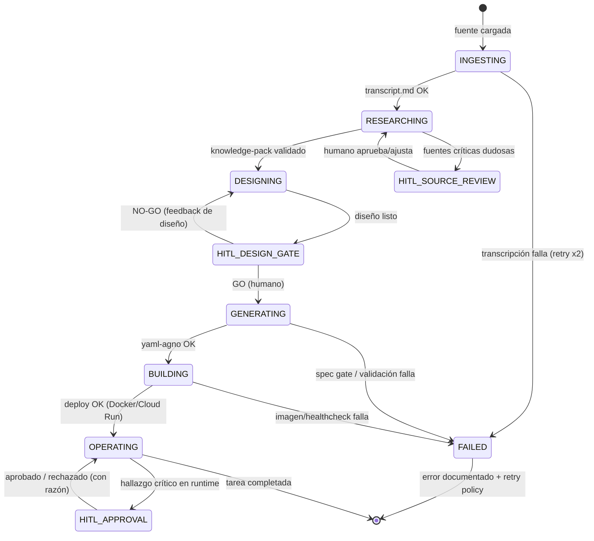
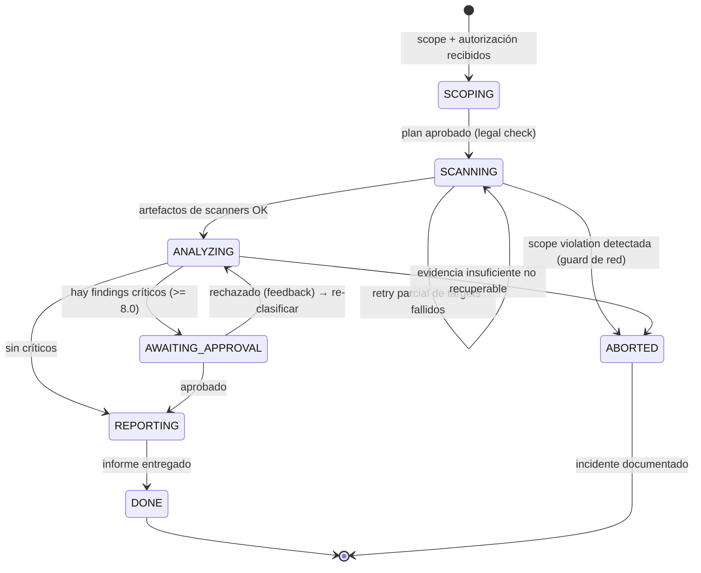

# AGENTIC TEAM ARCHITECTURE — Workflow Knowledge→Agent, Patrones SOTA y Caso Cybersecurity Audit

> **Autor**: @team-prompting (Prompting Knowledge Engineer)
> **Fecha**: 2026-08-09
> **Fuentes**: agent-prompting-knowledge-base (53 archivos SOTA), Engram (#2776 workflow pattern, #2772 visión yaml-agno, #2775 project map, #1247 spec yaml-agno), VISION.md yaml-agno, SPEC Index (34 SPECs), research SOTA 2026 (Azure Architecture Center, LangChain, Microsoft ISE, TURION.AI, agentmodeai).
> **Estado**: Diseño v1.0 — listo para implementar vía SDD.

---

## 0. Resumen Ejecutivo

Gonzalo (CENF) quiere transformar **conocimiento humano experto** (videos, papers, charlas) en **equipos agénticos autónomos** desplegados vía `yaml-agno` + Docker. Este documento entrega:

1. **El workflow repetible** `@k2a` (Knowledge-to-Agent) — nombre, diagrama, etapas, conexiones entre equipos, puntos HITL.
2. **El catálogo de patrones de arquitectura agéntica SOTA 2026** con la regla de selección, y el modelo de división de responsabilidades (mission / tools / knowledge / memory), state machines y comunicación A2A.
3. **El caso de uso concreto**: Cybersecurity Audit Team para PyMEs (scanner determinista + analyzer IA + reporter IA + human-reviewer).
4. **La integración con yaml-agno**: YAML declarativo del equipo, mapeo a las 34 SPECs existentes y los **5 gaps de SPECs** que faltan para que el equipo funcione.

**Decisión de diseño central**: la IA no reemplaza lo determinista. **Scanner = determinista (sin LLM), analyzer/reporter = IA con juicio, humano = solo juicio cognitivo de alto valor** (aprobar hallazgos críticos). Máquinas de estado explícitas en cada nivel minimizan el margen de error.

---

## 1. Arquitectura del Workflow Repetible: `@k2a`

### 1.1 Nombre e invocación

| Campo | Valor |
|---|---|
| **Nombre canónico** | `@k2a` |
| **Nombre largo** | `@knowledge-to-agent` |
| **Descripción** | "Knowledge-to-Agentic-Team pipeline: transforma conocimiento experto (video/paper/charla) en un equipo agéntico desplegado vía yaml-agno + Docker. Repetible por dominio." |
| **Alias sugeridos** | `@know2agent`, `@expert-pipeline` |
| **Dónde registrarlo** | `opencode.json` como workflow/agent invocable (patrón de los 7 equipos CENF, memoria #2039) + `C:\Dropbox\DOC.RECA\.amBotHs\workflows\modules\k2a-pipeline.yaml` |

**Filosofía del nombre**: corto, googleable, invocable con `@`, y captura el *qué* (knowledge) → *hacia dónde* (agent). La memoria #2776 ya lo pedía: "Este workflow necesita un nombre — Gonzalo pide que lo podamos llamar con un @ para mejorarlo iterativamente."

### 1.2 Diagrama de flujo completo

```
┌─────────────────────────────────────────────────────────────────────────────┐
│                           FUENTE DE CONOCIMIENTO                            │
│   Video YouTube · Paper · Charla de experto · Entrevista · Documento PDF     │
└──────────────────────────────────┬──────────────────────────────────────────┘
                                   ▼
┌─────────────────────────────────────────────────────────────────────────────┐
│ E1 · CAPTURA E INGESTA            [audio-transcriber / whisper / markitdown] │
│     Output: transcript.md + metadatos (autor, fecha, dominio, claims)        │
└──────────────────────────────────┬──────────────────────────────────────────┘
                                   ▼
┌─────────────────────────────────────────────────────────────────────────────┐
│ E2 · DEEP RESEARCH               [research agent — verificación y ampliación]│
│     Valida claims, agrega fuentes SOTA, detecta gaps y sesgos del experto    │
│     Output: knowledge-pack.md (texto técnico validado + fuentes + GLOSARIO)  │
│     ◀────── HITL-1 (opcional): humano valida fuentes críticas                │
└──────────────────────────────────┬──────────────────────────────────────────┘
                                   ▼
┌─────────────────────────────────────────────────────────────────────────────┐
│ E3 · PROMPTING & DISEÑO DEL EQUIPO  [@team-prompting + @team-development]     │
│     Clasifica el problema (A/B/C/D) · mide complejidad 4D · elige arquitectura│
│     · diseña roles (identidad, misión, tools, knowledge, restricciones)       │
│     · valida contra los 32 patrones universales · inyecta Communication       │
│     Contract CENF · escribe workflow YAML (estado, DAG, HITL, recovery)       │
│     Output: prompts por agente + diseño de equipo + workflow.yaml             │
│     ◀────── HITL-2 (obligatorio): GO/NO-GO del diseño ANTES de construir      │
└──────────────────────────────────┬──────────────────────────────────────────┘
                                   ▼
┌─────────────────────────────────────────────────────────────────────────────┐
│ E4 · GENERACIÓN DECLARATIVA      [yaml-agno]                                  │
│     YAML → env-var → Pydantic v2 → Registry → Factory → objetos Agno          │
│     Output: equipo agéntico ejecutable (agents + team + workflow)             │
└──────────────────────────────────┬──────────────────────────────────────────┘
                                   ▼
┌─────────────────────────────────────────────────────────────────────────────┐
│ E5 · DEPLOY & AISLAMIENTO        [SPEC_20 Docker / Cloud Run]                 │
│     Imagen Docker por equipo · aislamiento de red y secrets · endpoint        │
│     Output: equipo autónomo repetible (caja negra input/output)               │
└──────────────────────────────────┬──────────────────────────────────────────┘
                                   ▼
┌─────────────────────────────────────────────────────────────────────────────┐
│ E6 · OPERACIÓN                   [runtime + HITL + observabilidad + mejora]   │
│     El equipo atiende tareas reales. Hallazgos críticos → approval gate       │
│     humano. Métricas → iteración del prompt (no del workflow).                │
│     ◀────── HITL-3 (por ejecución): approval gates en decisiones críticas     │
└─────────────────────────────────────────────────────────────────────────────┘
```

### 1.3 Etapas y roles de cada equipo en el pipeline

| Etapa | Equipo/rol agéntico | Naturaleza | Artefacto de salida | Criterio de éxito |
|---|---|---|---|---|
| **E1** | Transcripción (`audio-transcriber`, `markitdown`) | **Determinista + tooling** | `transcript.md` | Fidelidad ≥ 95% al audio/texto; timestamps |
| **E2** | Research agent | IA (razonamiento) | `knowledge-pack.md` | Cada claim con fuente; gaps documentados |
| **E3** | `@team-prompting` (análisis → arquitectura → roles → comunicación → prompts → validación) + `@team-development` (solo si el diseño requiere código custom) | IA (diseño) | Prompts ×N + `team-design.md` + `workflow.yaml` | 32 patrones validados; sin placeholders; contract inyectado |
| **E4** | `yaml-agno` pipeline | **Determinista** (validación) | Objetos Agno + `project.yaml` | Spec gate 0 violaciones; TDD ≥ 80% |
| **E5** | Docker build / Cloud Run | **Determinista** | Imagen + endpoint | Imagen ≤ tamaño objetivo; healthcheck OK |
| **E6** | Equipo agéntico en runtime | Mixto (determinista + IA + humano) | Resultados de negocio | Acceptance criteria del dominio; logs trazables |

**Regla de oro E3** (de la knowledge base): el prompt define la calidad, el workflow define el flujo. Si el equipo produce basura → se arregla el prompt, NO el workflow.

### 1.4 Cómo se conectan los equipos entre sí

Cada etapa es una **caja negra con contrato** (VISION.md §7.4):

```
caja negra = { input_schema, output_schema, mission, dependencies, protocolos }
```

- **Transporte**: A2A nativo de Agno entre etapas remotas (SPEC_26, `a2a_config.py`); MCP para tools.
- **Semántica**: los **4 artifacts CENF** (Human Brief, Decision Card, Evidence Package, Handoff Contract) viajan como `task.message` + `task.metadata` — el `agent-communication-standard.md` mapea cada artifact a A2A.
- **Contrato entre E2→E3**: `knowledge-pack.md` + `input_schema` del dominio. **E3→E4**: prompts + `workflow.yaml` + manifest `project.yaml`. **E4→E5**: paquete validado. **E5→E6**: endpoint.
- **Interconocimiento cognitivo** (VISION §7.1): el orquestador de E6 conoce todos los equipos agénticos disponibles y para qué sirve cada uno (AgentCard + `cognitive_profile`).

### 1.5 Dónde entra el humano (HITL)

| Punto | Momento | Tipo | Obligatoriedad | Riesgo que mitiga |
|---|---|---|---|---|
| **HITL-1** | E2 — validación de fuentes críticas | Revisión (feedback) | Opcional | Fuentes falsas/sesgadas contaminan el knowledge pack |
| **HITL-2** | E3 — GO/NO-GO del diseño del equipo | Aprobación (gate) | **Obligatorio** | Construir un equipo mal diseñado (costo alto, frankenstein) |
| **HITL-3** | E6 — approval gates por ejecución | Aprobación (gate) | Por política (crítico) | Juicio humano en decisiones de alto impacto |

**Reglas de diseño de HITL (SOTA 2026, Azure)**:
1. Un **gate obligatorio** vuelve la orquestación síncrona en ese punto → **persistir el estado** del workflow en ese checkpoint para reanudar sin re-ejecutar etapas previas (SPEC_29 / `on_error: pause`).
2. Distinguir **aprobación** (avanza) vs **feedback** (vuelve al agente a refinar).
3. Scope de HITL a **invocaciones de tool sensibles** (ej: ejecutar un scanner ofensivo), no a la salida completa del agente.
4. El humano es el **referente último** sobre alcance y decisiones estratégicas (VISION.md §12).

### 1.6 Máquina de estados del workflow `@k2a`



Transición con evento + estado siguiente siempre determinista. Esto es la regla CENF de state machines (core-cenf): dado estado + evento → transición predecible, rollback natural, cada transición es un test case.

### 1.7 Artefactos por etapa (para trazabilidad)

```
.k2a/{dominio}/
├── 01-source/           # video/pdf/audio original + metadatos
├── 02-transcript/       # transcript.md (E1)
├── 03-knowledge-pack/   # knowledge-pack.md + fuentes (E2)
├── 04-team-design/      # team-design.md + prompts ×N + workflow.yaml (E3)
├── 05-config/           # project.yaml + manifest (E4)
├── 06-deploy/           # Dockerfile + compose + endpoint (E5)
└── 07-operations/       # runs, logs, informes, approvals (E6)
```

---

## 2. Patrones de Arquitectura de Equipos Agénticos (SOTA 2026)

### 2.1 Catálogo de patrones

| Patrón | Estructura | Cuándo usar (2026) | Gobernanza | Riesgo |
|---|---|---|---|---|
| **Orchestrator-Workers** (supervisor+specialists) | Un supervisor planifica, delega a workers aislados, sintetiza | Plan **data-dependent** (no conocido hasta ver input); equipos 3-7 | ✅ Accountability concentrada; gates interpuestos en el orquestador | Orquestador = punto único de compromiso; **contexto del orquestador = recurso escaso** |
| **Pipeline** (sequential specialists) | Flujo fijo: researcher → writer → editor | Subtareas conocidas, fijas y secuenciales con expertise distinta | Mínima coordinación; cada stage es una caja | Latencia acumulativa; un fallo detiene todo |
| **Router / Dispatcher** | Clasifica y despacha en paralelo a especialistas; sintetiza | Verticales distintas; queries multi-fuente; alto volumen | Router como SPOF; estateless = consistente por request | Router complejo; workers no colaboran |
| **Swarm / Group Chat** | N agentes comparten hilo; un manager elige quién habla | Exploración, review multi-perspectiva, adversarial | Emergente; requiere manager | Caro (N×N llamadas), difícil de debuggear |
| **Negotiator** (2 agentes) | Proposer + Critic negocian hasta consenso | Adversarial, eval, red-team | Simétrico | Lento; deadlock sin tiebreaker |
| **Handoff** | Transferencia de control state-driven entre agentes | Flujos multi-etapa con usuario presente; precondiciones que se desbloquean | **Ahorra 40-50% llamadas** en requests repetidos (stateful) | Loops infinitos; rutas impredecibles |
| **Coordinator** (microservicios) | Coordinadores orquestan domain-agents independientes (servicios) | Reuso cross-system; ownership por dominio | Gateway centraliza auth/tracing | Overhead real de latencia (medido por Microsoft ISE) |
| **Broker-mediated** | Broker central loguea/transforma todo mensaje entre agentes | **Alto riesgo** (EU AI Act Annex III, regulado) | Auditoría nativa por mensaje (provenance, confianza) | SPOF + bottleneck; caro |

### 2.2 Reglas de oro SOTA 2026 (no negociables)

De los learnings de producción (TURION, Azure, LangChain, agentmodeai):

1. **El supervisor + specialists es el patrón más confiable** de 2026. "Even a thin supervisor" es mejor que peer-to-peer puro.
2. **Context isolation es la columna vertebral**: los workers reportan *resúmenes compactos*, nunca el transcript completo, o el contexto del orquestador se llena y el sistema se degrada.
3. **Model tiering**: modelo fuerte solo para orquestador + síntesis; modelos chicos/baratos para workers estrechos (clasificación, extracción, formateo). "Match model strength to task difficulty per call".
4. **Cap al fan-out**: máximo de workers por request y presupuesto por tarea (turns, tokens, $). Sin cap = costo desbocado.
5. **Loop detection**: mismo estado 3 veces = loop → escalar a humano.
6. **Observabilidad multi-agente**: trace IDs con `user_task_id`, `agent_id`, `agent_role`, `parent_agent_id` en cada span.
7. **Estado persistido en cada checkpoint HITL** — reanudar sin replay.
8. **Gobernanza por riesgo**: low/medium → jerárquico; alto riesgo → broker-mediated. **Peer-to-peer NO en producción** (opacidad fundamental, inyección cross-agent amplia).
9. **Determinista vs no-determinista**: no uses patrones no-deterministas donde el flujo es determinista, ni viceversa.
10. **Empieza simple**: "Add tools before adding agents. Graduate to multi-agent patterns only when you hit clear limits."

### 2.3 Cómo se dividen responsabilidades (mission / tools / knowledge / memory)

Cada agente de un equipo se define con 4 ejes + identidad + restricciones (knowledge base `diseno-roles-agentes.md`):

| Eje | Qué define | Ejemplo (Cybersecurity Audit) |
|---|---|---|
| **Mission** | Por qué existe; qué NO hace (boundaries) | `vuln-analyzer`: correlaciona findings y clasifica severidad. NO escanea, NO reporta. |
| **Tools** | Qué puede invocar; minimal tools; tool-role fit; safety limits | `network-scanner`: nmap, nuclei, testssl — con filtros `include` y sandbox |
| **Knowledge** | Qué sabe, a qué nivel (básico/intermedio/avanzado) | `vuln-analyzer`: OWASP Top 10 (avanzado), CVSS v4 (avanzado), ISO 27001 (intermedio) |
| **Memory** | Qué recuerda entre runs (session, working, long-term) | Contexto de la empresa auditada; historial de findings previos; lecciones de runs anteriores |
| **Identity** | Quién es, credibilidad | "Analista de vulnerabilidades senior, 10+ años" |
| **Constraints** | Restricciones de capacidad, rol, decisión y comunicación | "NO ejecuta scanners", "NO aprueba hallazgos críticos (eso es el humano)" |

**Anti-patrones de roles a evitar**: role too broad, role overlap, role vague, role without tools, role without constraints.

### 2.4 State machines para control de flujo

Regla CENF (core-cenf): **todo flujo con más de 2 pasos o más de 1 agente DEBE definirse como máquina de estado** antes de implementarse.

Tres niveles de máquinas de estado:

```
Nivel 1 · WORKFLOW (@k2a / pipeline de auditoría)
  idle → scanning → analyzing → awaiting_approval → reporting → done
  └── cada transición = {estado, evento, guard, siguiente, on_error}

Nivel 2 · TEAM (coordinación Agno)
  team_states: idle → delegating → workers_running → synthesizing → done/failed
  └── TeamMode: coordinate | route | collaborate | talk_to_all | talk_to_one

Nivel 3 · AGENT (ciclo de vida del agente)
  agent_states: idle → waiting_input → processing → tool_call → done → error
  └── persistido en DB de sesiones (SPEC_04) — reanudable tras crash
```

Beneficios: determinismo (nada de "quizás"), comunicación agente↔código sin ambigüedad, rollback natural, y **cada transición es un test case**.

### 2.5 Comunicación A2A entre equipos

```
┌─────────────────────────────────────────────────────┐
│ CAPA 1: Workflow YAML (orquestación)                │
│   steps → depends_on → inputs/outputs → CEL         │
├─────────────────────────────────────────────────────┤
│ CAPA 2: Agent Communication Standard CENF v1.0      │
│   Human Brief · Decision Card · Evidence Package ·  │
│   Handoff Contract (semántica)                      │
├─────────────────────────────────────────────────────┤
│ CAPA 3: Agno A2A (transporte) — SPEC_26             │
│   AgentCard · Task · TaskState · REST endpoints     │
└─────────────────────────────────────────────────────┘
```

- **Discovery**: cada equipo publica su **AgentCard** (capacidades, endpoints, input/output schemas) — implementado en `a2a_config.py` (`expose: [{kind: team, ref: ...}]`).
- **Task state**: `working → input_required → done → failed`; `input_required` = HITL del receptor.
- **Mapeo CENF→A2A**: Human Brief → `task.message`; Decision Card → `task.metadata.decision_card`; Evidence Package → `task.metadata.evidence_package` (array); Handoff Contract → `task.metadata.handoff_contract`.
- **Validación**: el orquestador valida que los 4 artifacts estén presentes antes de pasar al siguiente agente (CEL expressions en el workflow).
- **Regla**: el workflow YAML no necesita saber de A2A — el orquestador traduce `outputs` ↔ `task.metadata` automáticamente.

### 2.6 Matriz de selección de patrón (rápida)

```
¿El flujo es FIJO y conocido antes del runtime?
  SÍ → ¿Etapas con expertise distinta y secuencial?  → PIPELINE
       ¿Independente, mismo tipo?                    → PARALLEL
  NO → ¿El plan depende del input?                   → ORCHESTRATOR-WORKERS
       ¿Tipos de tarea claramente distintos?         → ROUTER
       ¿Alta incertidumbre, perspectivas múltiples?  → DEBATE/SWARM
       ¿Flujo multi-etapa con usuario presente?      → HANDOFF
       ¿Alto riesgo regulado?                        → BROKER-MEDIATED
```

---

## 3. Caso de Uso: Cybersecurity Audit Team (PyMEs)

### 3.1 Análisis del problema

| Dimensión | Valor | Justificación |
|---|---|---|
| **Clasificación** | **C — Multi-dominio** | Red (scan), vulnerabilidades, compliance (ISO/OWASP), reporting; herramientas heterogéneas |
| Complejidad algorítmica | **Alta** | Scanners deterministas + correlación de findings + triage CVSS |
| Complejidad de dominio | **Alta** | Seguridad ofensiva + defensiva + normativa (NIST, OWASP, ISO 27001) |
| Complejidad de coordinación | **Media-alta** | Pipeline secuencial con paralelismo en scan; gates de aprobación |
| Complejidad de incertidumbre | **Media** | Findings del scanner son deterministas; el juicio de severidad y el contexto de negocio tienen ambigüedad |
| **Total** | **12-13/16** | → **Equipo mediano (4-5 agentes), arquitectura híbrida** |

### 3.2 Arquitectura seleccionada

**Híbrida: Pipeline + Orchestrator ligero + HITL gate.**

```
                    ┌────────────────────────────┐
                    │   audit-orchestrator (IA)  │
                    │  interpreta scope, arma    │
                    │  plan de scan, sintetiza,  │
                    │  delega a workers          │
                    └───────────┬────────────────┘
                                │
        ┌───────────────────────┼───────────────────────┐
        ▼                       ▼                       ▼
┌───────────────┐      ┌───────────────┐      ┌──────────────────┐
│network-scanner│      │web-scanner    │      │config-scanner    │
│ (determinista)│      │ (determinista)│      │ (determinista)    │
│ nmap, sslyze  │      │ nuclei, nikto │      │ testssl, openssl │
└───────┬───────┘      └───────┬───────┘      └────────┬─────────┘
        └──────────┬───────────┴───────────────────────┘
                   ▼
        ┌───────────────────────┐
        │   vuln-analyzer (IA)  │   correlaciona, clasifica CVSS v4,
        │   + knowledge         │   triage, dedupe, contexto de negocio
        └───────────┬───────────┘
                    ▼
        ┌────────────────────────────────────────┐
        │  HITL GATE — human-reviewer (HUMANO)   │  ← aprueba hallazgos
        │  "¿Confirmo estos findings críticos    │     críticos (CVSS≥8.0
        │   antes de que se reporten al cliente?"│     o impacto confirmado)
        └───────────┬────────────────────────────┘
                    ▼
        ┌───────────────────────┐
        │  report-renderer (IA) │   síntesis final: informe ejecutivo +
        │                       │   informe técnico JSON estructurado
        └───────────────────────┘
```

**Justificación**: los scanners son **deterministas** (no LLM — la IA no adivina puertos). La IA entra donde hay **juicio**: correlación, severidad, contexto de negocio, redacción del informe. El humano entra **solo** donde hay **juicio cognitivo de alto valor**: confirmar un hallazgo crítico antes de que salga de la organización.

### 3.3 Roles del equipo

| Rol | Naturaleza | Misión | Tools | Knowledge | Restricciones |
|---|---|---|---|---|---|
| **audit-orchestrator** | IA | Interpreta el scope del cliente, arma el plan de scan, delega a scanners, recibe findings, decide qué pasa al gate y qué al informe | Scheduling, control del pipeline, MCP de orquestación | Plan de auditoría, alcance legal del pentest, legislación (ley 25.326 / hacking ético) | NO ejecuta scanners directamente; NO aprueba hallazgos críticos |
| **network-scanner** | **Determinista** (sin LLM) | Descubre hosts, puertos, servicios y versiones en el rango autorizado | `nmap`, `masscan` (filtrado), `sslyze` | — (es un wrapper determinista con parser de salida) | Solo rango autorizado; rate-limit; timeouts; sin escritura |
| **web-scanner** | **Determinista** | Detecta vulnerabilidades web y de infra expuesta | `nuclei` (templates OWASP/CVE), `nikto`, `curl` | — | Solo targets del scope; modo pasivo por defecto; templates filtradas |
| **vuln-analyzer** | IA | Correlaciona findings crudos, deduplica, clasifica severidad CVSS v4, traduce a riesgo de negocio, sugiere remediación | `web_search` (advisories), lectura de artefactos de scanners | **OWASP Top 10 (avanzado) · CVSS v4 (avanzado) · NIST SP 800-115 (intermedio) · ISO 27001 Annex A (intermedio)** | NO ejecuta scanners; NO decide el approve final; cada afirmación con evidencia |
| **report-renderer** | IA | Sintetiza el informe final: ejecutivo (MD) + técnico (JSON estructurado) + evidencia | Write, formateo, plantillas | Estructura de informes de auditoría, redacción técnica | NO inventa hallazgos; todo finding rastrea a evidencia del scanner |
| **human-reviewer** | **Humano** | Aprueba/rechaza hallazgos críticos antes de reportar; feedback de contexto de negocio | Interfaz de approval (HITL) | Juicio humano, contexto del cliente | Es el único que puede liberar findings críticos |

**Regla de roles**: complementariedad sin overlap (single responsibility). El analyzer NO toca herramientas del scanner; el scanner NO razona; el humano NO escanea.

### 3.4 Knowledge base declarativa (contexto)

El analyzer y el orchestrator cargan conocimiento como **contexto declarativo** (SPEC_10 Knowledge & RAG), versionado y con confianza por fuente:

| Fuente | Uso | Nivel requerido | Confianza |
|---|---|---|---|
| NIST SP 800-115 (Technical Guide to Information Security Testing) | Metodología de evaluación | Intermedio | Alta (estándar federal) |
| OWASP Top 10 2021 + ASVS | Clasificación de hallazgos web | Avanzado | Alta |
| OWASP WSTG | Procedimientos de testing | Intermedio | Alta |
| CVSS v4.0 spec | Scoring | Avanzado | Alta |
| ISO/IEC 27001:2022 Annex A | Mapeo a controles | Intermedio | Alta (norma certificable) |
| Ley 25.326 + legislación hacking ético AR | Alcance legal | Básico | Alta (jurídica) |

Cada doc chunked + vectorizado; el analyzer hace **retrieval por finding** (¿a qué control de ISO 27001 mapea? ¿qué CWE es?) — no "sabe" la norma de memoria, la consulta con fuente.

### 3.5 Tools: scanners reales + judgment IA

- **Herramientas deterministas** (registry custom via SPEC_11 `ref://tools/...` o MCP): `nmap`, `nuclei`, `testssl.sh`, `sslyze`, `nikto`, `openssl`, `curl`, `masscan` (restringido).
- **Filtros de tool** ya soportados por yaml-agno (`filters: {include: [...], exclude: [...]}`) — el scanner SOLO expone funciones whitelisteadas.
- **Sandbox** (gap — ver §4.3 SPEC-35): red de destino autorizada, timeouts, rate-limit, sin acceso a credenciales de producción, artefactos parseados a schema Pydantic.
- **Model tiering** (SPEC_14): orchestrator/report con modelo fuerte; scanner = sin LLM; analyzer con modelo medio (correlación) — el report-renderer con modelo fuerte (redacción).

### 3.6 HITL: aprobación de hallazgos críticos

```
flujo del gate:
  vuln-analyzer emite findings → orchestrator clasifica:
    ├─ severity < 8.0 o informativo → va directo a report-renderer
    └─ severity ≥ 8.0 o impacto confirmado → HITL APPROVAL GATE
         → state: awaiting_approval (persistido — SPEC_29)
         → human-reviewer aprueba / rechaza (con razón) / pide más evidencia
         → aprobado  → pasa a report-renderer
         → rechazado → vuelve a analyzer con feedback (nunca se elimina: se
                       marca rejected con trazabilidad)
```

Regla: **un hallazgo rechazado no desaparece** — queda como `rejected` con la razón del humano (auditoría + aprendizaje). Esto materializa el patrón CENF de los 4 artifacts: la aprobación genera una **Decision Card** con la razón.

### 3.7 Output: informe de auditoría estructurado

```
Informe (2 entregables + 1 machine-readable):
├── informe-ejecutivo.md       # para dirección PyME: resumen ejecutivo, top riesgos,
│                              # score general (0-100), plan de remediación priorizado
├── informe-tecnico.json       # findings completos con evidencia, CVSS, CWE,
│                              # referencias NIST/OWASP/ISO, comandos de reproducción
└── package de evidencia/      # salidas crudas de scanners (nmap -oX, nuclei -json)
```

Schema del finding (Pydantic — output_schema del equipo):

```yaml
Finding:
  id: string
  title: string
  severity: {critical, high, medium, low, info}      # por CVSS v4 + contexto
  cvss_score: number
  cvss_vector: string
  cwe: [string]
  asset: {host, port, service, version}
  evidence: [ {tool, command, raw_output_ref} ]      # siempre apunta al artefacto
  remediation: string
  mapping: { nist: [string], owasp: [string], iso27001: [string] }
  status: {pending, approved, rejected, reported}
  approval: {by, at, reason} | null                  # Decision Card del gate
```

### 3.8 State machine del equipo de auditoría



---

## 4. Integración con yaml-agno

### 4.1 Cómo se expresa este equipo en YAML (declarativo)

Sobre la base de las 34 SPECs (models/config SSOT = SPEC_02, factories = SPEC_01, registry = SPEC_32, ref:// = CC-01, env interpolation = CC-02):

```yaml
# ============================================================
# project.yaml — Cybersecurity Audit Team (multi-file project)
# ============================================================
project: cyber-audit-pyme
version: 1.0.0
includes:
  - agents/audit-orchestrator.yaml
  - agents/vuln-analyzer.yaml
  - agents/report-renderer.yaml
  - tools/scanners.yaml
  - knowledge/security-standards.yaml
  - teams/audit-team.yaml
  - workflows/audit-pipeline.yaml
```

```yaml
# ============================================================
# agents/vuln-analyzer.yaml — IA con conocimiento declarativo
# ============================================================
name: vuln-analyzer
description: "Correlaciona findings de scanners, clasifica severidad CVSS v4 y mapea a NIST/OWASP/ISO 27001."
model: "openrouter:anthropic/claude-sonnet-4"     # modelo medio: correlación
fallback_models: ["openrouter:google/gemini-2.5-flash"]
instructions: |
  Eres el Analista de Vulnerabilidades de un equipo de auditoría de seguridad para PyMEs.
  ...
knowledge:
  ref://knowledge/security-standards          # OWASP + CVSS + NIST + ISO (SPEC_10)
knowledge_filters: {category: "vuln-analysis"}
tools:
  - name: web_search                          # solo para advisories/CVEs nuevos
  - ref://tools/parse_scan_artifacts          # función custom (registry)
memory_manager: ref://memory/session_memory   # contexto de la empresa auditada
output_schema: Finding
guardrails:                                   # SPEC_16 — pre/post hooks
  post: [ref://guardrails/evidence_required]  # todo finding con evidencia
```

```yaml
# ============================================================
# teams/audit-team.yaml — el equipo completo
# ============================================================
name: cyber-audit-team
mode: coordinate                              # orchestrator lidera (SPEC_05)
members:
  - ref://agent/audit-orchestrator
  - ref://agent/vuln-analyzer
  - ref://agent/report-renderer
add_team_history_to_members: true
max_iterations: 8
cognitive_profile:                            # VISION §7.4 → AgentCard (SPEC_26)
  mission: "Auditar la postura de seguridad de una PyME y producir informe accionable"
  capabilities:
    - "Descubrimiento y escaneo de red autorizado (determinista)"
    - "Correlación y clasificación CVSS v4 de vulnerabilidades"
    - "Mapeo de hallazgos a NIST / OWASP / ISO 27001"
    - "Informe ejecutivo + técnico con evidencia"
  input_schema: AuditScope
  output_schema: AuditReport
  dependencies:
    - team: "compliance-checker"              # opcional fase 2
      reason: "Verificación de controles ISO 27001"
  communication_protocols:
    - type: "A2A"
      method: "run_audit"                     # endpoint expuesto (SPEC_26)
```

```yaml
# ============================================================
# workflows/audit-pipeline.yaml — orquestación + HITL gate
# ============================================================
name: audit-pipeline
description: "Pipeline de auditoría: scope → scan → analyze → approve → report"
steps:
  - type: Step
    name: scope-validation
    agent: ref://agent/audit-orchestrator
    human_review:                              # HITL-1: autorización legal (SPEC_29)
      requires_confirmation: true
      confirmation_message: "Autorizar alcance de la auditoría (rango IP, targets web, modo activo/pasivo)"
      on_reject: cancel
  - type: Parallel                              # scanners deterministas (SPEC_05)
    steps:
      - {type: Step, name: network-scan,   agent: ref://agent/network-scanner}
      - {type: Step, name: web-scan,       agent: ref://agent/web-scanner}
      - {type: Step, name: config-scan,    agent: ref://agent/config-scanner}
  - type: Step
    name: analyze
    agent: ref://agent/vuln-analyzer
    inputs: [network-scan, web-scan, config-scan]
    on_error: pause
  - type: Condition                            # HITL gate (SPEC_29)
    name: critical-gate
    evaluator: "outputs.analyze.has_critical_findings == true"
    steps:
      - type: Step
        name: human-approval
        agent: ref://agent/human-reviewer      # agente "humano" = interfaz HITL
        human_review:
          requires_confirmation: true
          confirmation_message: "Se encontraron findings críticos (CVSS >= 8.0). ¿Confirmás antes de reportarlos?"
          on_reject: feedback                  # vuelve a analyzer
    else_steps:
      - type: Step
        name: skip-gate
        description: "Sin críticos — el gate se omite"
  - type: Step
    name: report
    agent: ref://agent/report-renderer
    on_error: pause
```

```yaml
# ============================================================
# tools/scanners.yaml — tools deterministas registradas
# ============================================================
# Registradas como funciones custom (SPEC_11) con filtros estrictos
tools:
  - name: nmap
    params: {binary: "/usr/bin/nmap", timeout_s: 300}
    filters:
      include: ["-sV", "-O", "-oX"]           # SOLO estos flags
  - name: nuclei
    params: {binary: "/usr/bin/nuclei", templates_dir: "/opt/nuclei-templates", severity_filter: "low,medium,high,critical"}
    filters:
      exclude: ["-dast", "-it"]               # prohibir modos ofensivos/activos
  - name: testssl
    params: {binary: "/usr/bin/testssl.sh", timeout_s: 120}
```

```yaml
# ============================================================
# knowledge/security-standards.yaml — RAG declarativo (SPEC_10)
# ============================================================
knowledge:
  - name: security-standards
    vector_db: {type: pgvector, params: {connection_string: "${DB_URL}", table_name: "sec_standards"}}
    embeddings: {type: openai, params: {model: "text-embedding-3-small", dimensions: 1536}}
    documents:
      - {path: "./knowledge/owasp-top10-2021.md",    category: "vuln-analysis", confidence: high}
      - {path: "./knowledge/cvss-v4.md",             category: "vuln-analysis", confidence: high}
      - {path: "./knowledge/nist-sp800-115.md",      category: "methodology",   confidence: high}
      - {path: "./knowledge/iso27001-annex-a.md",    category: "compliance",    confidence: high}
      - {path: "./knowledge/ley-25326.md",           category: "legal",         confidence: high}
```

### 4.2 Mapeo a SPECs existentes

| Necesidad del equipo | SPEC existente | Estado |
|---|---|---|
| Schema YAML (Agent/Team/Workflow/Step) | **SPEC_02** (SSOT) | ✅ publicada |
| Factories (Agent/Team/Workflow) | **SPEC_01** | ✅ publicada |
| Modes de equipo (coordinate, route, collaborate) | **SPEC_05** | ✅ publicada (`team-factory`) |
| Step types (Step, Parallel, Condition, Router, Loop) | **SPEC_05** | ✅ publicada (`workflow-factory`) |
| Tools registry + filtros + MCP | **SPEC_11** | ✅ publicada (134 builtins + `ToolFactory`) |
| Knowledge & RAG (vector DB, embeddings, chunkers) | **SPEC_10** | ✅ publicada |
| Model + fallbacks + tiering | **SPEC_14** | ✅ publicada |
| Memory (session, user_id compuesto) | **SPEC_04** | ✅ publicada |
| A2A (expose/remote, AgentCard) | **SPEC_26** | ✅ implementada (`a2a_config.py`) |
| HITL params en steps (`human_review`, `on_error: pause`) | **SPEC_29** / **WF-03** | ⚠️ spec'd — **módulo `hitl/` VACÍO en src** |
| Guardrails pre/post hooks | **SPEC_16** | ⚠️ spec'd — parcial |
| RBAC / per-user isolation (approvals) | **SPEC_19** | ⚠️ spec'd |
| Scheduler / retry / background | **SPEC_13** | ✅ publicada |
| Docker build (aislamiento del equipo) | **SPEC_20** | ✅ publicada |
| Tracing / observabilidad multi-agente | **SPEC_09/27** | ✅ publicada |
| Templates heredables (proyectos repetibles) | **SPEC_33** | ✅ publicada |

### 4.3 Gaps: qué falta en yaml-agno para que este equipo funcione

| # | Gap | Qué falta | Por qué es crítico | SPEC propuesta |
|---|---|---|---|---|
| **G-1** | **HITL runtime** | `src/yaml_agno/hitl/` está vacío. Falta el runtime del approval gate: `awaiting_approval` persistido, API de aprobación con RBAC (SPEC_19), reanudación del workflow tras la respuesta humana (`on_reject: feedback` que retorne al paso anterior), auditoría del gate con Decision Card | Sin esto, el gate del human-reviewer no puede existir: el hallazgo crítico se reportaría sin aprobación | **SPEC_34_HITL_GATE_RUNTIME** (extiende SPEC_16 + SPEC_29): ApprovalGate (estado persistido, resume, RBAC, audit trail) |
| **G-2** | **Sandbox de tools deterministas** | Ejecutar `nmap`/`nuclei` desde un agente requiere: whitelist de comandos y flags, restricción de red (solo scope autorizado), timeouts, rate-limit, parseo de salida a schema Pydantic, prohibición de acceso a secrets | Un scanner sin sandbox es un riesgo de seguridad en sí mismo (scope violation, exfiltración, fuga de credenciales) | **SPEC_35_DETERMINISTIC_TOOL_SANDBOX**: determinism layer (sin LLM), `tool_filters` reforzados, parser → schema, network guard |
| **G-3** | **Budget y fan-out control** | Falta cap por run: máx. workers por tarea, máx. turns por agente, budget de tokens/$, loop detection (mismo estado 3× → escalar a humano) | Sin caps, un análisis con muchos findings dispara costos y loops infinitos (lección #4 y #5 SOTA) | **SPEC_36_BUDGET_FANOUT_CONTROL**: per-run budget, fan-out cap, loop detection, escalation |
| **G-4** | **Cognitive Profile → AgentCard** | VISION §7.4 define `cognitive_profile` (mission, capabilities, input/output schema, dependencies, protocols) pero no está materializado como parte del AgentCard A2A (SPEC_26) | Sin esto, el orquestador externo (Gus/Cloud/@k2a E6) no puede **descubrir y validar contratos** entre cajas negras ("interconocimiento cognitivo") | **SPEC_37_COGNITIVE_PROFILE_AGENTCARD**: slot en AgentConfig (SPEC_02) + publicación en AgentCard (SPEC_26) + validator de contratos |
| **G-5** | **Ingesta de conocimiento declarativo** | Los docs NIST/OWASP/ISO deben pasar por un pipeline de ingesta: descarga → limpieza → chunking → vectorización → versionado con `confidence` por fuente | Sin versionado + confianza, el knowledge del analyzer queda obsoleto y sin trazabilidad (¿qué versión de OWASP aplicó?) | **SPEC_38_KNOWLEDGE_INGEST_PIPELINE**: ingesta + chunking + versionado + confidence metadata (extiende SPEC_10) |

**Además** (no bloqueante, mejora):
- **G-6**: Modelo de tiering por rol declarado en config (ya parcial en SPEC_14 con `model` por agente — falta una directiva `tier: {plan, reason, extract}` para automatizar la selección).
- **G-7**: Validación CENF de los 4 artifacts en el control plane (SPEC_12) — materializar el `agent-communication-standard.md` como middleware de validación de `task.message`/`task.metadata`.
- **G-8**: Dashboard de approvals (SPEC_07) para que el human-reviewer tenga UI del gate.

### 4.4 Orden sugerido de implementación

```
1. G-1 SPEC_34 HITL Gate Runtime     ← bloquea el caso de uso completo
2. G-2 SPEC_35 Deterministic Sandbox ← sin esto NO correr nmap/nuclei
3. G-3 SPEC_36 Budget & Fan-out      ← protección de costos en producción
4. G-5 SPEC_38 Knowledge Ingest      ← alimenta al analyzer
5. G-4 SPEC_37 Cognitive Profile     ← interconexión de equipos (E3→E6)
6. G-7 artifacts CENF en control plane ← calidad de comunicación
```

---

## 5. Decisiones abiertas y próximos pasos

### Decisiones abiertas (para Gonzalo)

| # | Decisión | Opciones | Recomendación |
|---|---|---|---|
| D-1 | **Nombre definitivo del workflow** | `@k2a` / `@knowledge-to-agent` / `@know2agent` | `@k2a` (corto) con alias largo |
| D-2 | **Ámbito del primer piloto** | Cybersec audit (este doc) / facturación ARCA / Excel contable | Cybersec audit — demuestra el patrón determinista+IA+HITL mejor que los otros |
| D-3 | **Modo de scan por defecto** | Pasivo / activo con autorización | Pasivo por defecto; activo solo con HITL-1 aprobado (autorización legal) |
| D-4 | **Dónde corre el sandbox de scanners** | Sidecar Docker / host separado / servicio MCP | Sidecar Docker (aislamiento de red + specs G-2) |
| D-5 | **compliance-checker como rol propio** (ISO 27001 mapper) | En el analyzer / rol separado fase 2 | Rol separado en fase 2 (mantiene roles estrechos) |

### Próximos pasos (SDD)

1. `sdd-propose` para `@k2a` workflow (registro en `opencode.json` + `workflows/modules/k2a-pipeline.yaml`).
2. SDD para **SPEC_34 → SPEC_38** (5 changes, en el orden de §4.4) — strict TDD, commits granulares, PRs encadenados.
3. Construir el **knowledge ingest** de NIST/OWASP/ISO/CVSS/Ley 25.326 como primer paquete de conocimiento (G-5).
4. Implementar el Cybersecurity Audit Team como **primer equipo end-to-end** del pipeline `@k2a`, validando contra un sandbox de práctica (DVWA/OWASP Juice Shop).
5. Iterar el prompt del analyzer con los resultados de las primeras auditorías reales (lección: se arregla el prompt, no el workflow).

---

## Apéndice A — Fuentes SOTA 2026 consultadas

- Azure Architecture Center — *AI Agent Orchestration Patterns* (2026-02): HITL gates, persistencia en checkpoints, antipatrones, costos por patrón.
- LangChain — *Choosing the Right Multi-Agent Architecture* (2026-01): subagents, skills, handoffs, routers; insights de llamadas y tokens.
- Microsoft ISE — *Orchestration Patterns for Multi-Agent Systems* (2026-06): coordinator pattern, gateway, overhead real de latencia.
- Vantaige — *Orchestrator-Workers Multi-Agent Pattern 2026*: context isolation, model tiering, fan-out cap.
- TURION.AI — *Multi-Agent Orchestration Infrastructure* (2026-03): supervisor+specialists como patrón más confiable, budgets, loop detection, observabilidad multi-span.
- agentmodeai — *Multi-Agent Architecture Playbook* (2026-04): gobernanza por riesgo, broker-mediated, peer-to-peer fuera de producción.
- agent-prompting-knowledge-base (53 archivos): clasificación A/B/C/D, 7 arquitecturas, diseño de roles 7 componentes, 32 patrones universales, Communication Contract CENF.

## Apéndice B — Trazabilidad con memorias Engram

- **#2776** — Workflow pattern: expert knowledge → agentic team pipeline (origen del `@k2a`)
- **#2772** — Vision correction: yaml-agno = capa de abstracción declarativa, gobernanza declarativa > YAML-first
- **#2775** — CENF project map: yaml-agno depende de core-cenf; productos sobre yaml-agno
- **#1247** — yaml-agno Full Specification (dominios 1-10, WF-03 HITL, CC-01 ref://)
- **#2039** — Patrón de registro de workflows/agentes con @ en opencode.json

---

*Documento generado por @team-prompting — listo para revisión de Gonzalo y entrada a SDD.*
