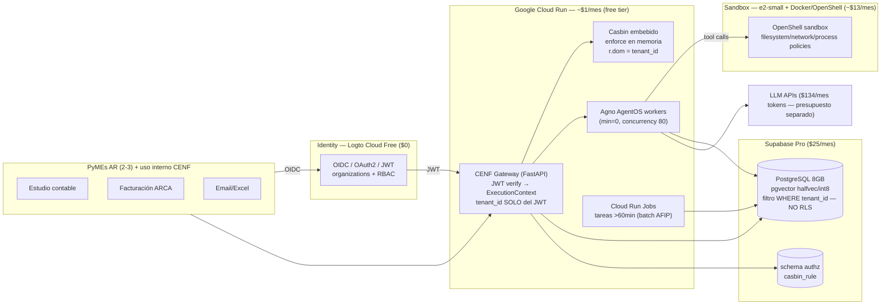

# Reporte de Infraestructura: Plataforma Multitenant CENF (yaml-agno)

> **Fecha**: 2026-08-11
> **Autor**: Infrastructure Platform Team (orquestador + cloud-engineer + finops + sre + devsecops)
> **Fuentes**: chatgpt-comparar-repositorios-open-source.md (2026-08-11), INFRA_yaml-agno.md (2026-08-08 — **SUPERSEDIDO**), EXECUTION-PLAN.md (2026-08-10), precios providers ago-2026, docs GCP/Supabase/Keycloak/Logto
> **Arquitectura evaluada**: Keycloak (identity) → CENF Gateway → Agno AgentOS + Casbin (authz) → Docker/OpenShell Sandbox
> **Corrección base**: infra = **Google Cloud Run + Supabase (PostgreSQL + pgvector)**. NO Fly.io, NO VPS, NO Qdrant, NO RLS (Decisión 2.9 inviolable).

---

## 1. Resumen Ejecutivo (para Gerencia)

| Concepto | Valor |
|---|---|
| **Proveedor recomendado** | **Google Cloud Run** (serverless, dockerizado) + **Supabase Pro** (PostgreSQL + pgvector) |
| **Costo mensual Fase 1** (interno + 3 PyME) | **~$40/mes** (rango $33-45; con Keycloak: ~$52-55) |
| **Costo mensual Fase 2** (10 tenants) | **~$70-83/mes** |
| **Costo anual (12m)** | **~$700-780** infra (tokens $134/mes aparte) |
| **Identity MVP** | **Logto Cloud Free ($0)** — Keycloak es el upgrade de Fase 2 (adapter listo) |
| **Sandbox** | **Compute Engine e2-small + Docker/OpenShell (~$13/mes, $6.60 spot)** — Cloud Run NO tiene Docker-in-Docker |
| **SLOs propuestos** | Disponibilidad **99% horario hábil**, tareas agénticas ≥95%, p95 API <5s, vector p95 <300ms, RPO ≤24h, RTO ≤24h |
| **Escalabilidad** | Horizontal (Cloud Run scale-out + Jobs para >60min); **10+ tenants cómodos antes de GKE** |
| **¿GKE es necesario en Fase 1?** | **NO** — trigger documentado (§7); el más fuerte: HA de Keycloak / tenants no confiables |
| **¿Infra compite con tokens?** | **No**: ~$40/mes = 30% del burn ($134/mes), presupuesto separado |

### Decisiones del equipo

| # | Decisión | Racional | Confidence |
|---|---|---|---|
| M-01 | **Logto Cloud Free para identity MVP** ($0, 50K MAU vs ~30 usuarios) en vez de Keycloak | Keycloak en Cloud Run cuesta ~$13-57/mes con cold starts JVM 30-90s y sesiones efímeras; Logto es 4-6x más rápido de arranque, cero operación, Organizations gratis en OSS. Adapter `AuthProvider` (ya propuesto) permite swap a Keycloak en Fase 2 sin tocar código | 0.75 |
| M-02 | **Supabase Pro ($25/mes) desde el primer deploy con datos reales** | Free tier (500MB) pausa el proyecto a los 7 días de inactividad y no tiene backups — dealbreaker con datos de clientes PyME. Migración dump/restore doble = más cara que el plan | 0.85 |
| M-03 | **Casbin embebido en el CENF Gateway** con SQLAlchemy adapter a Supabase — **complementa** el filtro `WHERE tenant_id`, NO lo reemplaza | Casbin decide "¿puede intentar?", el filtro garantiza "¿qué filas ve?". $0 incremental, enforce en memoria ~µs. Escritura de policies solo por admin path + policy-as-code | 0.9 |
| M-04 | **Sandbox = e2-small con Docker/OpenShell** (~$13/mes) para Fase 1; Cloud Run sandboxes (Preview) como alternativa serverless con spike previo; **E2B (Firecracker) o GKE+gVisor para Fase 2** (tenants no confiables) | Cloud Run NO permite Docker-in-Docker ni privileged; OpenShell requiere Docker daemon. E2B ya está integrado en Agno (`E2BTools`) | 0.8 |
| M-05 | **Multi-tenancy de 1 servicio Cloud Run** (aislamiento lógico por composite user_id + filtro tenant_id + Casbin); **NO service-per-tenant** | 10 servicios con min-instance = $100-650/mes vs $0 marginal de uno solo. Service-per-tenant solo si tenants ejecutan código arbitrario o >50 tenants | 0.9 |
| M-06 | **Vectores cuantizados (halfvec/int8) desde el inicio** | float4: 1M vectores = 6GB → se rompe a ~6-7 tenants; int8 = 1.5GB → 25+ tenants. Corrección al reporte previo: halfvec ≈ 3GB, int8 ≈ 1.5GB | 0.8 |
| M-07 | **SLO 99% horario hábil, NO 99.5%** | Sin on-call 24/7 y con Supabase Pro SIN SLA contractual, 99% = 2.75h de error budget/mes es honesto y medible con $0 (Grafana Cloud free) | 0.7 |

---

## 2. Respuestas a las 8 Preguntas

### Q1. ¿Keycloak puede correr en Cloud Run o necesita GKE?

**SÍ, Cloud Run es viable para Fase 1 — como nodo único con limitaciones explícitas. GKE es un day-2 problem, no day-1.**

| Requisito | Realidad | Implicancia |
|---|---|---|
| Runtime | Quarkus (JVM 21), contenedor OCI estándar | Corre en gen2 sin drama |
| RAM | ~700MB base; Red Hat recomienda **1.25GB con caches** | **2 GiB mínimo recomendado** (1 GiB = OOM-risky) |
| Persistencia | Realms/config en DB externa (`KC_DB_URL`) | **Supabase sirve como DB** — usar pooler Supavisor (6543), nunca 5432 directo |
| Filesystem | Config en DB, no en disco | Filesystem efímero de Cloud Run es irrelevante |
| Sesiones | Caché Infinispan local en nodo único | **OK nodo único**; 2+ nodos en Cloud Run = frágil (sin multicast, churn en recycle) → **HA multi-nodo = GKE** |
| Health | `/health/ready` en management port **9000** | Gotcha real: exponer port 9000 o redirigir al 8080 — **requiere spike** |
| Cold start | JVM 30-90s; con `kc.sh build` + `start --optimized` → 5-15s | min-instances=1 para clientes que dependen del login |

**Config mínima viable**: 1 vCPU / 2 GiB, `min-instances=1`, `max-instances=1-2`, sesiones aceptadas como efímeras (re-login tras recycle — aceptable con cientos de logins/mes), JWT cortos (5-15 min) para que la API no dependa de la sesión de Keycloak.

**Costo**: ~$19/mes (request-based idle) a ~$57/mes (always-on). Con scale-to-zero: $0-1 pero 30-90s por login — inaceptable para demos de cliente.

### Q2. ¿Casbin en PostgreSQL? ¿Funciona con Supabase?

**SÍ, sin limitaciones.** El `casbin_sqlalchemy_adapter` usa SQLAlchemy contra PostgreSQL estándar; Supabase ES PostgreSQL managed — solo necesita una tabla `casbin_rule` (DDL plano), sin superuser, schemas custom ni FDW.

**Patrón recomendado: embebido en el CENF Gateway** (no servicio separado):
- Enforce en memoria (cache local, ~µs) con `LoadPolicy()` al arranque; TTL 30-60s o refresh on-write para invalidación.
- **NUNCA enforce con query a DB por request** (1-3ms + presión al pooler).
- Multitenancy nativa del modelo: **`r.dom = tenant_id`** (RBAC con dominios de Casbin).
- Compatible 100% con composite user_id: `sub = "{tenant_id}:{principal_id}"` como string opaca.
- **Complementa, NO reemplaza** el filtro `WHERE tenant_id` (Decisión 2.9). Casbin = capa de decisión; el filtro = capa de datos. Casbin no es row-level security.
- Escala: 10k policies → 10-50µs/check. Irrelevante hasta ~100k policies (Fase 3 recién).

**Seguridad del policy store**: schema `authz` separado con rol DB propio de solo lectura para la app; escritura solo por admin path interno (sin ingress público); **policy-as-code** (políticas en git, aplicadas por CI con review PR); checksum/versión con detección de tampering. Integridad > confidencialidad.

### Q3. ¿Sandbox (Docker/OpenShell) en Cloud Run?

**NO hay Docker-in-Docker en Cloud Run** (sin privileged, sin `/var/run/docker.sock`, filesystem read-only salvo tmpfs). `DockerTools` de Agno no funcionan ahí, y OpenShell requiere Docker daemon.

**Aclaración crítica**: el runtime gen2 de Cloud Run aísla TU servicio (frontera de host), NO el código no confiable que tu servicio ejecuta.

| Opción | Aislamiento | Fase 1 | Fase 2 | Costo |
|---|---|---|---|---|
| **e2-small + Docker/OpenShell** ⭐ | VM real + Docker + policies OpenShell (Landlock/seccomp/red deny) | **RECOMENDADA** | Intermedia | **~$13/mes** (spot $6.60) |
| Cloud Run sandboxes (`--sandbox-launcher`, Preview/BETA) | Procesos aislados first-party, egress deny-by-default, sin env del host | Alternativa serverless — **spike 1-2 días primero** (Preview) | Intermedia | CPU/RAM host (no publicado) |
| E2B (managed) | **Firecracker microVMs** — aislamiento VM real; Agno tiene `E2BTools` first-class | Alternativa ya disponible | **Recomendada para tenants no confiables** | ~$0.000014/s |
| GKE + GKE Sandbox (gVisor) | gVisor runsc | Overkill | **Sí, si se necesita** | ~$25-35+ + ops K8s |
| Cloud Run Jobs | Job aislado por ejecución, hasta 168h | Batch largos OK | No interactivo | ~$5-10 |
| Service-per-tenant con min-instances | Peor que Jobs | ❌ | ❌ | ~$98/mes (10 tenants) |

**Contexto Agno 2.8.7**: `PythonTools`/`ShellTools` ejecutan en el host del proceso (OWASP agentic audit 73/100 FAIL; issue #7103 RCE CVSS 9.8). El sandboxing local de Agno (sandlock, #7194) sigue abierto → la capa de sandbox es obligatoria, no opcional.

### Q4. Costos mensuales estimados

| Componente | Fase 1 (~$40) | Fase 2 (~$83) |
|---|---|---|
| Identity (Logto Cloud Free / Keycloak) | **$0** / $13-19 | $0-15 / $13-19 |
| Cloud Run (Gateway + Agno workers, min=0) | ~$0.50-1 (free tier) | ~$13-15 |
| Supabase Pro (8GB, pgvector) | **$25** + overage $0-1 | $25 + ~$2 |
| Sandbox (e2-small ×1 / ×2) | **$13** (spot $6.60) | **$26** (spot $13.20) |
| Egress + Misc (Secrets, Artifact Registry) | ~$1.20 | ~$4-8 |

**Supabase Free vs Pro**: Free ($0, 500MB) **solo dev/staging** — pausa por 7 días de inactividad (un finde largo = proyecto caído) + cero backups. Pro ($25) desde el día 1 de producción. >8GB: cuantizar → overage barato hasta ~50GB → compute Medium ($60) solo si queries lentas → >30GB evaluar Cloud SQL/Neon. **PITR = +$100/mes, no contratar en Fase 1** (daily backups alcanzan).

### Q5. ¿Logto en vez de Keycloak para MVP rápido?

**SÍ — Logto Cloud Free ($0) es la decisión correcta para el MVP.** El adapter `AuthProvider` (KeycloakAdapter/LogtoAdapter) hace el swap trivial si Fase 2 lo exige.

| Dimensión | Keycloak en Cloud Run | Logto Cloud Free | Logto self-hosted |
|---|---|---|---|
| Costo | $0 (scale-to-zero) / ~$13-19 (min=1) | **$0** | ~$10 (512MB min=1) |
| Cold start | **30-90s** (JVM) | n/a | **5-15s** (Node) |
| RAM | ~700MB-1.25GB | n/a | ~200-300MB |
| MAU free | ilimitado | **50K** (usás 0.06%) | ilimitado |
| Multi-tenancy | Realms (manual, operación pesada) | Organizations Pro $24/mes | **Organizations gratis (OSS)** |
| SAML/enterprise | ✅ maduro | Enterprise | limitado |
| Operación | alta (tuning JVM, parches) | **nula** | media |
| Licencia | Apache-2.0 | MPL-2.0 | MPL-2.0 |

**Límites a vigilar en Logto Free**: 3 apps (Gateway + Admin + 1 M2M = justo; la 4ª app empuja a Pro $24/mes) y 1 custom domain. Seguridad: **sin diferencia material en Fase 1** — el riesgo es la misconfiguración, no el producto.

**Keycloak solo si**: cliente exige SAML enterprise, LDAP/AD federation, o expertise Keycloak en el equipo. Para PyME AR con SSO Google/email + RBAC por tenant, Keycloak es más peso muerto que valor a $13-57/mes.

### Q6. Network topology: aislamiento de tenants a nivel red con Cloud Run

**Realidad: no existe aislamiento de RED entre tenants en Cloud Run.** No hay IP por tenant, firewall por tenant ni VPC por tenant. Cloud Run es multitenant de plataforma — la frontera entre tenant A y B **la pone tu aplicación**, no la red. gVisor protege el host de tu código, no a tus tenants entre sí.

**Topología recomendada Fase 1**:
```
Internet → Cloud Load Balancer + Cloud Armor (WAF) → Cloud Run (Gateway multi-tenant)
                                                         ├── Casbin embebido (Supabase, schema authz)
                                                         ├── Supabase Pro (pooler 6543, SSL)
                                                         ├── Logto Cloud (OIDC)
                                                         └── e2-small (Docker/OpenShell sandbox)
```
- **Supabase**: IP pública + SSL + **pooler Supavisor (6543)** obligatorio (sin pooler, el scale-out de Cloud Run agota las conexiones del plan: Micro=200 pooler). Hardening barato: VPC connector (~$15-20/mes) + Cloud NAT (~$4/mes) para egress estático con IP allowlist.
- **PrivateLink**: **NO aplica a GCP** (AWS-only via VPC Lattice, Team/Enterprise) — no-opción hoy.
- **Service-per-tenant**: solo si >50 tenants con tráfico sostenido, tenants no confiables con código arbitrario (ahí es project-per-tenant + Global LB + Service Extensions), o requisito regulatorio. Nunca por "aislamiento" en Fase 1: 10 servicios con min-instance = $100-650/mes.
- **Ingress**: servicios internos con `ingress=internal`; público SOLO el Gateway.

### Q7. ¿Cuántos tenants caben antes de GKE?

**10-15 tenants caben CÓMODOS en 1 servicio Cloud Run + Supabase Pro.** La matemática:

| Dimensión | Capacidad | Quiebre real |
|---|---|---|
| Vectores float4 (1M = 6GB) | ~1.3M ≈ 8GB | **~6-7 tenants** |
| Vectores halfvec (1M = 3GB) | ~2.6M | ~13-15 tenants |
| Vectores int8 (1M = 1.5GB) | ~5M | ~25+ tenants |
| Pooler conexiones (200) | 20-50 usadas | ~100+ instancias |
| Cloud Run throughput (100 inst × 80 conc) | 8,000 concurrentes | lejísimos |
| Casbin enforce (memoria) | ~1M policies | lejísimos |
| Request timeout HTTP | 60 min | tareas >60min → **Cloud Run Jobs (hasta 7 días)** |

**Condiciones**: vectores cuantizados, pool SQLAlchemy chico (5-10, max_overflow 0), min-instances=1 en Gateway, tareas largas a Cloud Run Jobs (168h) antes que a GKE.

**Triggers GKE ACTUALIZADOS** (reemplazan §5.2 del reporte Fly.io):
- **HARD**: (1) **Keycloak HA** — el más fuerte: Infinispan multi-nodo no funciona en Cloud Run (stateless, sin multicast); en Cloud Run queda single-instance + session affinity, OK Fase 1 (failover = restart 10-30s + re-login); (2) SLA contractual ≥99.9% end-to-end — ojo: **Supabase Pro NO tiene SLA** (solo Enterprise 99.9%), la opción es Supabase Enterprise o self-host, no GKE por sí solo; (3) tenants no confiables con código arbitrario → E2B o GKE+gVisor.
- **SOFT** (2 de 3): ≥10 tenants Y vectores >4GB o compute >Micro; bill >$100/mes sostenido; 3+ personas tocando infra.
- **REVISADOS (ya NO son trigger)**: GPU (Cloud Run ya tiene **NVIDIA L4**, 99.5% SLA no-zonal — solo A100/H100/multi-GPU → GKE); ≥10 tenants solos (no rompe nada); egress >250GB (→ GCS/CDN, no GKE); 8GB DB (→ upgrade compute/disk Supabase primero).

### Q8. Comparativa Cloud Run vs GKE por componente

| Componente | ¿Cloud Run suficiente? | Limitación concreta | Trigger → GKE |
|---|---|---|---|
| **Keycloak/Logto** | ⚠️ Sí con límite | Nodo único (min=1); sesiones efímeras; Logto: sin HA | **HA multi-nodo, distributed cache, failover <30s** |
| **CENF Gateway (FastAPI)** | ✅ Sí, sin límite | Stateless; timeout 60 min; WebSockets ~60 min | WebSocket fan-out masivo / service mesh |
| **Agno workers** | ✅ Sí | Timeout 60 min servicios → **Jobs hasta 168h** cubren batch; 8 vCPU/32 GiB | Cola masiva con HPA avanzado; GPU A100/H100 |
| **Sandbox** | ⚠️ Sí con límite (Preview o e2-small) | Sin Docker-in-Docker; Cloud Run sandboxes en Preview | **Tenants no confiables → GKE+gVisor o E2B** |
| **Casbin** | ✅ Sí — embebido | Librería, no servicio; servicio separado = latencia sin beneficio | Nunca, salvo 10x escala / multi-lenguaje |
| **Supabase** | N/A (externo managed) | PrivateLink AWS-only; público + SSL en GCP | No migra a GKE (self-host no recomendado) |

**Veredicto**: GKE queda reservado como day-2 — HA de identity y aislamiento VM para tenants no confiables. Nada en Fase 1-2 lo exige.

---

## 3. Arquitectura Objetivo (Fase 1)



**Flujo de seguridad en 4 capas (regla de oro CENF)**:
1. **Authentication** (Logto): ¿quién es? → JWT firmado, `tenant_id` claim
2. **Authorization** (Casbin): ¿puede intentar? → `r.dom = tenant_id`, RBAC con dominios
3. **Runtime policy** (OpenShell): ¿qué puede invocar el agente? → allowlist de tools, egress deny-by-default
4. **Sandbox** (Docker/gVisor): ¿qué puede tocar el proceso físicamente? → FS/red/procesos

---

## 4. Desglose de Costos

### 4.1 Fijo vs Variable (Fase 1 recomendada)

| Categoría | Fijo/mes | Variable/mes | Proyección 12m |
|---|---|---|---|
| Identity (Logto Cloud Free) | $0 | $0 | $0 |
| Cloud Run (Gateway + workers) | $0 (min=0) | ~$0.50-1 | ~$6-12 |
| Supabase Pro (8GB + pgvector) | $25 | $0-1 | $300-312 |
| Sandbox e2-small (spot) | $6.60-13 | ~$0 | $80-156 |
| Egress | $0 | ~$0.50 | ~$6 |
| Misc (Secrets + Artifact Registry) | ~$0.70 | $0 | ~$8 |
| **TOTAL Fase 1** | **~$32-39** | **~$1-2.5** | **~$400-490** |
| **TOTAL Fase 2 (10 tenants)** | **~$65** | **~$5-18** | **~$700-780** |

### 4.2 Comparativa con alternativas

| Escenario | Costo/mes | Veredicto |
|---|---|---|
| **Recomendado** (Logto Cloud + Supabase Pro + e2-small spot) | **~$33-40** | ✅ Target $30-80, ideal <$50 |
| Con Keycloak (min=1, 2GiB) en vez de Logto | ~$52-55 | ⚠️ Sigue en target, más operación |
| Con Keycloak always-on (2GiB) | ~$75-80 | ⚠️ Borde superior del target |
| Con GKE Autopilot para sandbox | ~$100+ | ❌ Sobre-ingeniería para 200 runs/día |
| Escenario adverso (Keycloak min=1 + on-demand + PITR) | ~$85 F1 / ~$130 F2 | ❌ Evitable con M-01..M-04 |

### 4.3 Costos ocultos (los que rompen presupuestos)

| Costo oculto | Mitigación |
|---|---|
| **Free tier Cloud Run COMPARTIDO** entre servicios de la billing account | Presupuesto + alerta de anomalía (20% sobre esperado) |
| **min-instances=1** por servicio (~$10-13 c/u aunque nadie lo use) | min=0 salvo identity; cold starts de FastAPI son 2-5s |
| Cloud Run **sin disco >512MB** (/tmp cuenta contra RAM) — Keycloak escribe caches a disco | Logging a stdout; Keycloak en e2-small si OOM |
| **Egress Cloud Run → Supabase** (internet) | Región cercana; cachear; GCS para media/files |
| **Cold starts facturan** como tiempo activo; jobs cobran mín. 1 min | Concurrency alta; keep-warm con ping |
| **GKE free tier $74.40** cubre solo el cluster fee, no el compute | No usar Autopilot para esto |
| **PITR Supabase = +$100/mes** | No contratar en F1; daily backups alcanzan |
| **Percepciones AR** ~30-35% sobre USD con tarjeta AR; recuperable parcialmente vía SIRADIG | **Confirmar con contador** (hasta 75% de la factura en juego) |
| OpenShell requiere **Docker daemon** — invalida la opción "serverless barata" | e2-small (M-04) |

---

## 5. Controles de Seguridad Mínimos (para que NO-RLS sea defendible)

**Decisión explícita**: sin RLS (Decisión 2.9), la frontera de tenant es de capa aplicación. Esto es defendible SOLO con los 7 controles, si no, es un agujero del tamaño de un bug de autorización.

| # | Control | Detalle |
|---|---|---|
| 1 | **tenant_id SOLO desde JWT verificado** | Claim firmado por Logto/Keycloak, validado con JWKS (issuer+audience+exp). NUNCA del body/header/query. Claim ausente → 401 |
| 2 | **Repos centralizados con filtro obligatorio** | Capa única de acceso; `WHERE tenant_id` compuesto en el repository base. Enforced por **tests de arquitectura en CI** (AST scan: query sin tenant = build fail) |
| 3 | **Tests de fuga cross-tenant en CI** | Seed de 2 tenants; test que intenta leer/escribir del otro tenant en CADA endpoint y tool del agente. En cada PR. Un fallo = no deploy |
| 4 | **Redacción de secrets/PII en logs** | Nunca bodies crudos; mask Authorization, tokens, CUIT/AFIP creds, sueldos |
| 5 | **Output guard PII** | La respuesta del agente se valida contra el tenant de la sesión antes de devolverla |
| 6 | **Audit log inmutable** | actor + tenant_id + timestamp + acción → BigQuery. Base de defensa 25.326 |
| 7 | **Quotas y rate limit por tenant_id** (no por IP) | Alerting de anomalías por tenant |

**Riesgo crítico #0 (devsecops)**: **exposición directa de datos vía Supabase** — con NO-RLS, si cualquier tabla queda accesible por anon key/PostgREST, se anula TODO el aislamiento. Regla: todo acceso a datos pasa por el backend FastAPI; deshabilitar PostgREST expuesto; **service_role NUNCA en cliente ni en app runtime** (solo migraciones, en Secret Manager, rotado).

**Threat model top 5**: (1) acceso cross-tenant (IDOR/BOLA) → controles 1-3; (2) exfiltración de secrets por el modelo → env vacío en sandbox + egress deny-by-default + redacción; (3) prompt injection vía tools/datos → input externo = datos, no instrucciones + HITL en tools de alto riesgo; (4) credenciales de cliente comprometidas → Secret Manager + cifrado por tenant + rotación; (5) abuso del sandbox → gVisor + OpenShell + timeouts + quotas.

**Secrets/IAM**: Secret Manager siempre (nunca env vars); SA por servicio con roles mínimos (`secretAccessor` + `run.invoker`); workload identity, cero keys largas; rotación automatizada en CI.

---

## 6. SLOs Propuestos (Fase 1 — sin on-call 24/7)

| SLI | SLO | Error budget/mes | Alerta |
|---|---|---|---|
| Disponibilidad (horario hábil 275h/mes) | **99.0%** | 2.75h | Burn rate 2 |
| Tareas agénticas exitosas (excluye caída LLM) | **≥95%** | 5% de tareas | ≥10% en 6h |
| Latencia API p95 (excluye streaming LLM) | **<5s** | 5% de requests | p95 >5s en 6h |
| Latencia búsqueda vectorial p95 | **<300ms** | — | p95 >300ms en 6h |
| RPO backups | **≤24h** (diario Supabase) | — | Backup fallido = incidente |
| RTO restore | **≤24h** (manual, horario hábil) | — | Prueba de restore mensual |

**Medición $0**: Grafana Cloud Free (10k series, 3 users) + blackbox probes del `/healthz` + canary task agéntica (echo ~5s cada 15 min vía Cloud Scheduler) + métricas nativas Cloud Run remote-write. Alertas → Slack, no pager.

**Justificación honesta**: Supabase Pro NO tiene SLA contractual → 99% hábil, no 99.5%. Tareas al 95% es honesto con LLM externos + retry automático (máquina de estado `pending → running → failed → retry → done`).

---

## 7. Escalabilidad (resumen de triggers)

```
Fase 1 (interno + 3 PyME):  Cloud Run multi-tenant + Supabase Pro + Logto Cloud + e2-small · ~$40/mes
Fase 2 (10+ tenants):        Misma arquitectura · vectores int8 · Jobs para batch · ~$70-83/mes
Trigger HARD ──► GKE:        Keycloak HA · SLA ≥99.9% end-to-end · tenants no confiables (o E2B)
Trigger SOFT (2 de 3):       ≥10 tenants Y vectores >4GB · bill >$100/mes sostenido · 3+ personas en infra
```

**Regla**: GKE resuelve aislamiento VM y HA de identity, NO tamaño. La matemática muestra 10+ tenants cómodos sin Kubernetes. Antes de GKE: cuantización, Cloud Run Jobs, upgrade de compute Supabase.

---

## 8. Ley 25.326 (lo que BLOQUEA conectar clientes)

| Obligación | Qué bloquea si falta | Implicancia |
|---|---|---|
| **Contrato de encargado + NDA** | Tratamiento ilegal del encargado | **Sin contrato, la plataforma no puede operar**. Incluir: finalidad, datos, subprocesadores (LLMs), SCC |
| **Consentimiento** | Tratamiento sin base | Sueldos/balances = datos personales (no "sensibles" art. 2) → consentimiento libre, expreso e informado en onboarding del tenant |
| **RNBD** (art. 22) | Bases no registradas = infracción AAIP | Registrar bases ante AAIP (10 días de crear la base) |
| **ARCO** (arts. 14-16) | Derechos no atendidos (plazo 10 días hábiles) | **Diseñar el delete por tenant YA** — borrado en cascada + backups con retención acotada |
| **Transferencia internacional** (art. 12) | **GCP (US) + Supabase (US/EU) = transferencia internacional** | Consentimiento informado + cláusulas contractuales (SCC) + aviso en privacidad. Documentar la cadena completa |

**Nota 2026**: 3 proyectos de reforma en el Congreso (Carro, Doñate, Yeza) — probablemente exigirán notificación de brechas, DPO y sanciones % de facturación. Diseñar ya notificación de incidentes y registro de tratamientos para no retrabajar.

---

## 9. Riesgos

| Riesgo | Prob | Impacto | Mitigación | Costo |
|---|---|---|---|---|
| **Exposición directa de datos vía Supabase (anon key/PostgREST)** | MEDIA | 🔴 CRÍTICA — anula TODO el aislamiento | Todo acceso por backend; anon key deshabilitada para datos; service_role solo migraciones | $0 |
| **Fuga cross-tenant por filtro faltante (IDOR)** | MEDIA | 🔴 PII de otro cliente (breach 25.326) | Controles 1-3 (§5) + tests cross-tenant en CI obligatorios | $0 |
| **Exfiltración de secrets por el modelo** | MEDIA | 🔴 AFIP/email creds de todos los tenants | Env vacío en sandbox + egress deny-by-default + OpenShell | ~$13/mes (sandbox) |
| **Keycloak/Logto single-instance** (sesiones efímeras, sin HA) | ALTA | Re-login en recycle; failover 10-30s | Aceptado Fase 1; trigger GKE documentado; JWT cortos | $0 |
| **Supabase Pro sin SLA** (caída de DB = caída de todo) | BAJA | Caída total | SLO 99% lo absorbe; runbook de restore probado mensual | 1h/mes |
| **Muro de vectores float4** a ~6-7 tenants | MEDIA | Fase 2 salta de plan | halfvec/int8 desde el inicio (M-06); alerta disco 70% | $0 |
| **Cloud Run sandboxes en Preview** (si se elige esa vía) | MEDIA | Feature "as is" | Spike 1-2 días; plan B e2-small/E2B | $0 |
| **Cold start JVM Keycloak** 30-90s | ALTA | Demo de cliente inaceptable | Logto (5-15s) o min-instances=1; `start --optimized` | $0-13/mes |
| **Pooler de conexiones agotado** | MEDIA | 503s | pool_size 5-10, max_overflow 0, Supavisor 6543 | $0 |
| **Percepciones AR ~30-35%** sobre USD | ALTA | Caja real 1.3-1.75x | Confirmar con contador; SIRADIG si CENF exporta | tiempo contador |

---

## 10. Supuestos y Referencias

- Precios verificados ago-2026: cloud.google.com/run/pricing, cloud.google.com/kubernetes-engine/pricing, supabase.com/pricing, logto.io/pricing, keycloak.org (sizing Red Hat)
- **Corrección vectorial** (vs INFRA_yaml-agno.md): 1M vectores 1536-dim ≈ 6GB float4, ~3GB halfvec, ~1.5GB int8
- **Cloud Run**: SLA 99.95% no-GPU, GPU NVIDIA L4 disponible (99.5% no-zonal), Jobs hasta 168h, 8 vCPU/32GiB máx
- **Supabase**: Pro sin SLA (Enterprise 99.9% solo), conexiones Micro=200 pooler, egress 250GB/mes Pro (una fuente dice 50GB — validar en consola), PITR +$100/mes
- **Supavisor (pooler) obligatorio**: conexión IPv6-only directa; usar puerto 5432 (session) o 6543 (transaction)
- **Discrepancias declaradas**: Logto Pro $24/mes (una fuente mar-2026 dice $16); egress Pro 50 vs 250GB; soporte Keycloak on Cloud Run basado en discusión comunitaria #23458 (no hay guía oficial Google)
- Horas dev $50/h; Fase 1 = ~30 usuarios, 3-6K ejecuciones/mes, ~15s promedio (si fuera 60s, el compute de workers se multiplica ~4x)
- Este reporte **SUPERSEDE** INFRA_yaml-agno.md (2026-08-08, Fly.io/Qdrant) — los triggers K8s y el modelo de costos se actualizan aquí

*Reporte generado por Infrastructure Platform Team — 2026-08-11*
*Siguiente paso: spike de 1-2 días para (1) health checks de identity en Cloud Run, (2) pgvector real con vectores cuantizados, (3) OpenShell en e2-small con egress allowlist por tenant; luego load test 2 semanas para calibrar SLOs y triggers.*
