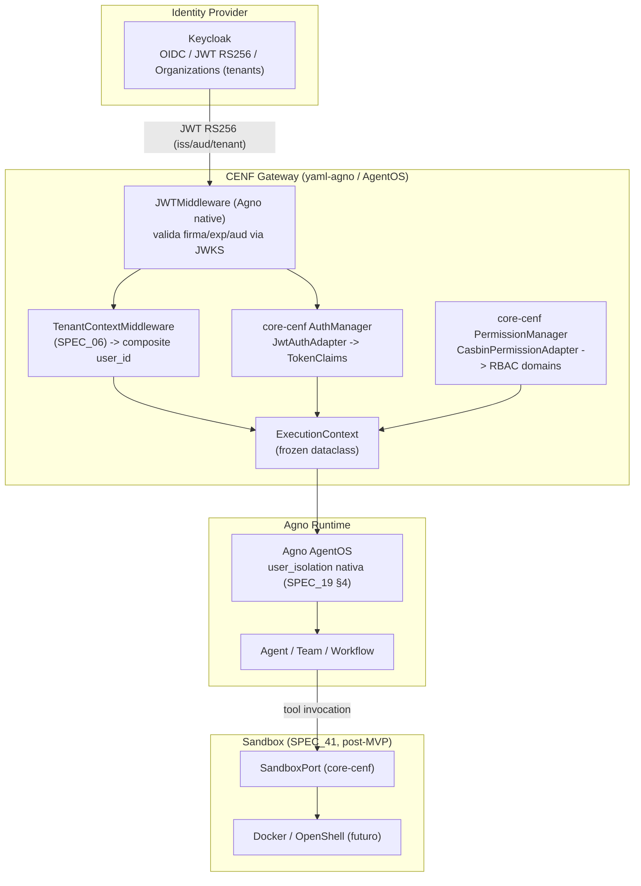
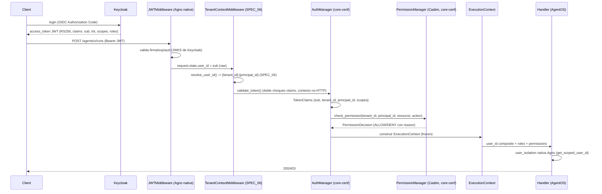
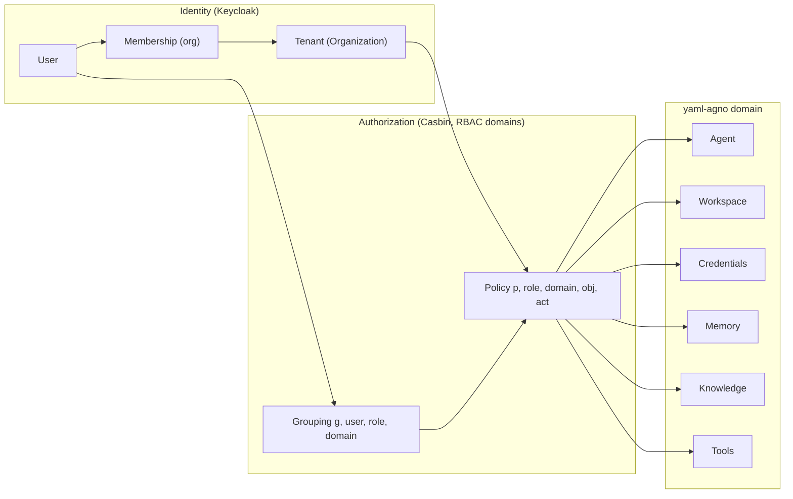
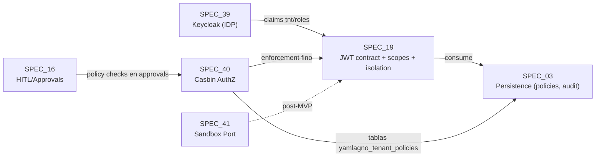
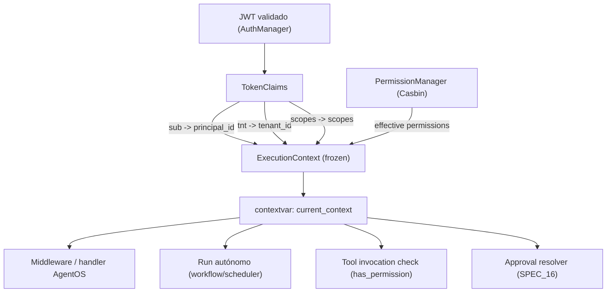
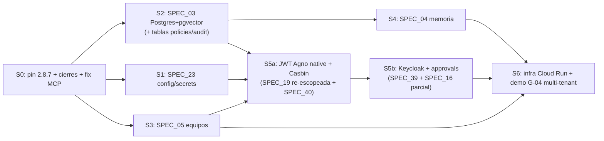
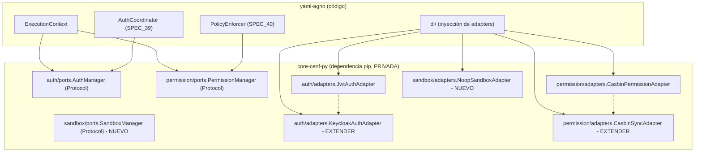

# Technical Design: Integración Keycloak (OIDC/JWT) + Casbin (RBAC domains) en yaml-agno

> **Fecha**: 2026-08-11 · **Autor**: Code Architect (development-team, CENF)
> **Fase SDD**: design · **Entregable**: plan de diseño técnico (NO implementación)
> **Fuentes**: análisis comparativo ChatGPT (chatgpt-comparar-repositorios-open-source.md, 1713 líneas), EXECUTION-PLAN.md (2026-08-10), DECISIONES.md (§2 decisiones inviolables, §7 gate decisions.yaml), AGENTS.md, SPEC_19/16/03/14/06, código actual (`tenant/resolver.py`, `api/middleware/tenant_context.py`, `ports/agentos_ports.py`, `memory/user_identity.py`, `di/agno_resolver.py`) y **verificación directa de core-cenf-py v0.1.0** (`src/core_infrastructure/{auth,permission}/`).
>
> **Estado**: Draft v1 para validación del orquestador. Snippets de código = contrato ilustrativo, NO implementación.

---

## 1. Contexto

### 1.1 Por qué esto ahora

- **S5 (SPEC_19) era condicional** en EXECUTION-PLAN (2026-08-10): "postergar a Fase 2 si G-04 es interno" (3 personas CENF no necesitan JWT/RBAC externo).
- **Irrupción de laburen.com como competidor** → el auth externo multi-tenant pasa a ser prioridad MVP. G-04 se redefine hacia multi-tenant real con frontera de seguridad demostrable (L-03).
- El análisis comparativo (ChatGPT, 2026-08-11) concluye: **NO construir auth desde cero**, **NO meter Keycloak+Ory+Casbin+OpenFGA juntos**, y que para MVP **Keycloak + Agno + Casbin + Docker/gVisor** es suficiente. Migrar Casbin → OpenFGA solo si la complejidad de permisos lo justifica post-MVP.

### 1.2 Principio de diseño rector

**NO meter seguridad de implementación en los YAMLs.** El YAML describe **intención**, no implementación:

```yaml
agent:
  security:
    authorization:
      policy: invoice.create
    sandbox:
      profile: restricted
```

Por detrás, Ports/Adapters resuelven Keycloak/Casbin/Sandbox. La seguridad es una **property derivada de claims del JWT validado + políticas Casbin**, nunca de config YAML mutable por el cliente. Esto respeta: decisión inviolable 1 (user_id composite, NUNCA en YAML), 9 (NO RLS), 7 (NO os.environ), 11 (sanitización backend MANDATORY).

### 1.3 Estado verificado del código (2026-08-11)

| Componente | Estado | Archivo |
|---|---|---|
| Composite user_id resolver | ✅ hecha | `memory/user_identity.py` (resolve_user_id, SPEC_04) |
| Parse composite | ✅ hecha (73 líneas) | `tenant/resolver.py` (TenantResolver, SPEC_03) |
| TenantContextMiddleware (extrae tenant + delega resolve_user_id) | ✅ hecha | `api/middleware/tenant_context.py` (SPEC_06) |
| JWTMiddleware real / Casbin / ScopeEnforcer implementado | 🔴 **NO existe** | — (SPEC_19 es Draft Semilla) |
| Ports/Adapters core-cenf: **AuthManager (JWT+JWKS) y PermissionManager (Casbin)** | ✅ **YA EXISTEN** | core-cenf-py `auth/` y `permission/` |
| SandboxPort en core-cenf | 🔴 **NO existe** | — |

### 1.4 Descubrimiento clave que cambia el diseño

**core-cenf-py v0.1.0 YA PROVEE los dos ports de seguridad** que el análisis ChatGPT recomendaba crear:

- `core_infrastructure/auth/ports.py` → `AuthManager` Protocol: `validate_token()`, `get_claims()`, `refresh_jwks()`, `validate_scopes()`. Adapters: `JwtAuthAdapter` (HS256/RS256 vía JWKS), `StaticAuthAdapter` (tests). `TokenClaims` ya modela `tenant_id` y `principal_id` (además de sub/iss/aud/exp/iat/nbf/scopes).
- `core_infrastructure/permission/ports.py` → `PermissionManager` Protocol: `check_permission()`, `check_delegation()`, `list_effective_permissions()`, `get_json_schema()`. Adapters: `CasbinPermissionAdapter` (pycasbin con RBAC domains multi-tenant), `InMemoryPermissionAdapter` (tests). `PrincipalType` = human|agent|team, `Action` = read|write|create|delete|invoke|delegate.

**Implicancia**: NO se diseñan `AuthProviderPort`/`PolicyEnforcerPort` desde cero. El trabajo de core-cenf es **verificar y extender** lo existente (añadir adapter Keycloak, mapeo roles→scopes, SandboxPort). La regla de oro se respeta tal cual: yaml-agno depende de los Protocols de core-cenf, inyecta Adapters.

---

## 2. Propuesta de Stack

### 2.1 Arquitectura objetivo (Fase 1 MVP)



### 2.2 Flujo de un request autenticado



### 2.3 Decisiones NO negociables que el stack respeta

| Decisión inviolable (DECISIONES.md §2) | Cómo la respeta este diseño |
|---|---|
| 1. user_id composite `{tenant_id}:{principal_id}`, único resolver `resolve_user_id()` | ExecutionContext **deriva** `user_id` vía `resolve_user_id()`; el `sub` del JWT NUNCA se usa bare |
| 2. YamlAgentOS(AgentOS) | Keycloak/Casbin NO montan endpoints propios; se integran como middleware/adapter sobre `get_app()` |
| 7. NO os.environ; SecretManager | `JWT_VERIFICATION_KEY` / Keycloak client secret / JWKS URL via SecretManager (core-cenf) |
| 9. NO RLS; tenant_id solo en `yamlagno_*`; WHERE explícito | Casbin usa domains (tenant) como **dimensión de autorización**; la DB sigue con filtros explícitos. Las políticas Casbin viven en tablas `yamlagno_*` (nuevas) |
| 10. asyncio.TaskGroup | JWKS refresh / policy reload / validate_token paralelos usan TaskGroup |
| 11. Sanitización backend MANDATORY | Claims mapeados → Pydantic `TokenClaims`/`ExecutionContext` con validación estricta |

---

## 3. Decisiones (ADRs)

### ADR-01: Keycloak como Identity Provider del MVP (recomendación: **Keycloak**)

> Ver entregable 3 — comparación completa Keycloak vs Logto vs Agno-native en §4 (sección dedicada).

**Decisión**: Keycloak (Apache-2.0) como IDP del MVP, con el camino "Agno native JWT/RBAC primero" como plan B operacional.

**Alternativas consideradas**:
1. **Logto** (MPL-2.0): mejor DX, alineado User→Organization→Agent→Permissions. Descartado para MVP por MPL-2.0 (no permisiva pura; política corporativa CENF prefiere Apache/MIT) y por menor masa crítica (~12k stars vs ~35k).
2. **Agno native JWT/RBAC primero, Keycloak después**: viable como **fase intermedia** (ver ADR-02), no como destino. Agno valida JWT pero NO emite tokens: sin Keycloak no hay login/refresh/MFA/organizations.
3. **Ory Kratos+Keto**: descartado — 2 servidores extra, más complejo que Keycloak solo, y Keto (Zanzibar) es overkill para MVP.

**Criterio de reversión**: si la operación de Keycloak en Cloud Run excede el presupuesto (ver §8.3: >$15/mes infra o >1 d-a/mes operación), migrar a Logto **sin tocar yaml-agno** (el contrato `AuthManager` no cambia; solo cambia el adapter).

**Evidencia**: análisis comparativo §3 y §16-22 (score CENF Keycloak 9.4/10, "el componente que menos me preocuparía tener detrás de CENF"; MVP = Keycloak + Agno + Casbin + Docker).

---

### ADR-02: Orden de integración — Agno native JWT primero, Keycloak como fuente de claims

**Decisión**: la integración es **incremental en 2 ondas**:

- **Onda 1 (S5a, MVP inmediato)**: JWTMiddleware de Agno activado con `JWT_VERIFICATION_KEY` (decisión "Secret JWT", DECISIONES.md) + `user_isolation=True` + TenantContextMiddleware (ya existe) + **Casbin vía core-cenf PermissionManager** para autorización fina. Esto **no espera a Keycloak**: el JWT puede ser emitido por Keycloak o por un emisor de desarrollo (HS256) para arrancar.
- **Onda 2 (S5b)**: JWKS de Keycloak como `verification_keys`/`jwks_file`, claims `tnt`/`roles` mapeados, provisioning de realm+clients, token lifetime/refresh.

**Por qué**: el análisis ChatGPT §2 ("Agno ya resuelve parte del problema" — JWT/RBAC/multi-user/multi-tenant/audit) + el gate G-04 redefinido (multi-tenant real) exigen frontera de seguridad YA, sin bloquearse en la operación de Keycloak. Agno aporta: validación de firma, exp, aud, scopes, user_isolation. Keycloak aporta: **emisión** de tokens, login, refresh, MFA, organizations (tenants B2B). Son capas distintas: **JWT ≠ Authorization ≠ Sandbox** (análisis §20).

**Trade-off aceptado**: la Onda 1 usa JWT emitido con clave simétrica (HS256) en dev → la Onda 2 lo reemplaza por RS256+JWKS de Keycloak. Documentar que `JWT_VERIFICATION_KEY` (HS256) es solo dev/transición; prod = Keycloak RS256.

---

### ADR-03: Casbin como motor de autorización (NO OpenFGA en MVP)

**Decisión**: **Casbin** (pycasbin, Apache-2.0) con **RBAC + domains** (dom = tenant_id). El adapter YA existe en core-cenf (`CasbinPermissionAdapter`).

**Por qué NO OpenFGA**: el análisis §5-6 dice Casbin 9.5/10 vs OpenFGA 9.2/10, y §16: "Para MVP Casbin es suficiente; migrar a OpenFGA solo si la complejidad de permisos lo justifica". Casbin es **embebible** (no requiere servidor adicional — crítico para Cloud Run) y su modelo `p, role, domain, resource, action` + `g, user, role, domain` mapea 1:1 a tenant-aware RBAC.

**Migración futura**: el contrato es `PermissionManager` (core-cenf). Un `OpenFgaPermissionAdapter` futuro implementa el mismo Protocol sin tocar yaml-agno. Se documenta como tech-debt deliberado.

**Mapeo Casbin (sub/domain/obj/act)**:

| Casbin | Valor | Fuente |
|---|---|---|
| `sub` | `principal_id` | JWT `sub` claim |
| `domain` | `tenant_id` | JWT `tnt` claim / TenantResolver |
| `obj` | `resource_type:resource_id` (ej. `agent:invoice-agent`) | Request path/config |
| `act` | `action` (run/read/write/delete/invoke) | Operation |

---

### ADR-04: Sandbox NO se implementa en esta iteración — solo se declara el Port

**Decisión**: SPEC_41 declara `SandboxPort` + `SandboxConfig` en YAML (intención: `security.sandbox.profile: restricted`), con adapter **NoopSandboxAdapter** (dev) y el contrato preparado para Docker/OpenShell/gVisor post-MVP.

**Por qué**: análisis §8-12 (OpenShell es alpha single-player; Docker solo no es frontera segura; gVisor/Firecracker = operación compleja). Para el MVP con 3-10 tenants internos + competidor externo, la frontera de seguridad que importa es **authz (Casbin) + isolation (user_id composite + user_isolation nativa)**, no el sandbox de procesos. Cloud Run ya aísla procesos por instancia; el sandbox de tools (OpenShell) es Fase 2/3.

---

### ADR-05: ExecutionContext como propiedad derivada — nunca en YAML, nunca mutable

**Decisión**: `ExecutionContext` es un `@dataclass(frozen=True)` construido ÚNICAMENTE desde claims JWT validados + decisiones de PolicyEnforcer. Se propaga por `contextvar` (ver §6). NUNCA se serializa a YAML ni se acepta de input de cliente.

**Por qué**: decisión inviolable 1 (user_id nunca en YAML) + análisis §19 (tenant_id es propiedad de seguridad, no filtro SQL) + análisis §1706 (ExecutionContext explícito evita parsear strings). El composite `user_id` se **deriva** (property) de `tenant_id` + `principal_id`, no se almacena — respeta `resolve_user_id()` como único constructor del string.

---

## 4. Architecture Decision: Keycloak vs Logto (entregable 3)

### 4.1 Comparación objetiva

| Dimensión | **Keycloak** | **Logto** | Veredicto |
|---|---|---|---|
| **Licencia** | Apache-2.0 (permisiva pura) | MPL-2.0 (file-level copyleft) | ✅ Keycloak (política CENF prefiere permisiva pura) |
| **Stars / comunidad** | ~35k / 8.5k forks | ~12k / 805 forks | ✅ Keycloak |
| **Madurez** | 5/5 (enterprise, 100+ releases) | 4/5 (83 releases) | ✅ Keycloak |
| **Seguridad** | 5/5 (MFA, brokering, fine-grained authz) | 4/5 | ✅ Keycloak |
| **Multi-tenancy** | Organizations (B2B/CIAM nativo) | Organizations + member management | ⚖️ Empate (distinto modelo) |
| **Facilidad de integración** | 4/5 (grande, JVM, realm management) | 5/5 (DX superior, MCP, agent architectures) | ✅ Logto |
| **Operación en Cloud Run** | Pesado (JVM, ~512MB+ RAM, cold start) | Liviano (Node) | ✅ Logto |
| **Fit conceptual CENF (User→Org→Agent→Perm)** | Clásico IAM empresarial (requiere mapeo) | **Nativo** de su modelo | ✅ Logto |
| **OIDC/OAuth2/SAML** | OIDC+OAuth2+SAML+JWT | OIDC+OAuth2.1+SAML | ⚖️ Empate |
| **Costo operacional estimado** | Medio-alto (JVM, realm admin, tuning) | Bajo | ✅ Logto |
| **CENF score (análisis)** | **9.4/10** | 9.1/10 | ✅ Keycloak |

### 4.2 Recomendación final: **Keycloak** para MVP, con reversión documentada

**Justificación**:
1. **Licencia**: Apache-2.0 pura — alineada con la política de licencias del proyecto (todo el stack CENF es Apache/MIT; Logto MPL-2.0 arrastra obligaciones de archivo si se forkeara, aunque como dependencia es aceptable). Para un proyecto que va a OSS (G-02), es la decisión de menor fricción legal.
2. **Madurez/seguridad**: Keycloak es el componente que "menos me preocuparía tener detrás de CENF" (análisis §214). Organizations cubre el modelo B2B multi-tenant que el competidor laburen.com fuerza como prioridad.
3. **Reversión barata**: el contrato `AuthManager` de core-cenf ya existe → Logto es un `LogtoAuthAdapter` nuevo, yaml-agno NO cambia. La apuesta por Keycloak no es irreversible.
4. **El punto débil (peso operativo)** se mitiga: despliegue mínimo (realm único, client por tenant, JWKS cache), y el auth se delega a un servicio aparte que NO está en el hot path de los runs.

**Criterio de reversión a Logto** (si se activa, revisar ADR-01):
- Operación de Keycloak en Cloud Run > **$15/mes** de infra, O
- Mantenimiento de realm > **1 d-a por mes**, O
- Cold start de JVM degrada el login por encima del SLO (p95 login > 3s).

**La opción "Agno native JWT/RBAC primero"** NO se descarta: es exactamente la **Onda 1** del ADR-02. La diferencia con el análisis ChatGPT es que Agno native **solo valida** — no emite tokens ni gestiona tenants B2B. Para 3 usuarios CENF internos alcanza; para el MVP frente a laburen.com, Keycloak se integra como emisor (Onda 2) **sin reescribir** la Onda 1.

### 4.3 Modelo de datos de seguridad (propiedad, no filtro)



Todo recurso CENF (agents, workspaces, credentials, memory, knowledge, tools, runs, traces, audit_events) lleva `tenant_id` cuando corresponde (análisis §19 §1101-1119). La **autorización** se decide contra Casbin; la **aislamiento de datos** se decide con el composite `user_id` (user_isolation nativa) + WHERE explícito en `yamlagno_*` (NO RLS).

---

## 5. SPECs MODIFICADAS (entregable 1)

### 5.1 SPEC_19_SECURITY_AUTH_API_SURFACE — **modificación MAYOR** (v0.3.0-iter5)

| Sección | Cambio | Por qué |
|---|---|---|
| §1.3 JWT Authorization | `build_jwt_middleware` gana el flujo JWKS de Keycloak: `jwks_file`/`verification_keys` resueltos desde SecretManager (URL JWKS del realm); claims `tnt` (tenant_id) y `roles` mapeados explícitamente | Es el punto de integración Keycloak (ADR-01/02). El `sub` sigue siendo principal; `tnt` → TenantResolver |
| §2.3 ScopeEnforcer | Se mantiene como capa fina PERO delega la decisión a `PermissionManager.check_permission()` de core-cenf cuando `authz_provider=casbin`; scopes del JWT siguen siendo el gate de API | Evita duplicar lógica de permisos: Casbin es el policy engine, ScopeEnforcer solo traduce request→chequeo |
| §3 RBACManager / ROLE_SCOPES | El mapeo rol→scopes estático (dict Python) pasa a **políticas Casbin** (SPEC_40). RBACManager se conserva solo para compat/tests unitarios | RBAC con domains es nativo de Casbin; el dict Python no escala a multi-tenant dinámico |
| §3.3 Custom Roles (YAML) | El YAML `security.rbac.roles` pasa a **declarar intención** (seeds iniciales), no la fuente de verdad runtime. La verdad runtime = política Casbin en DB (`yamlagno_policies`, SPEC_40) | "El código debe coincidir con el YAML, no al revés" (gate decisions.yaml) — pero las políticas de tenant son datos de ejecución, no config estática |
| §4 Per-user isolation | Sin cambios de concepto: se reafirma nativa AgentOS. Se agrega que el ExecutionContext (SPEC_39/40) alimenta `get_scoped_user_id` sin parsear strings | ADR-05 |
| §7 Audit trail | `AuditEvent` gana `decision_id`/`policy_id` (traza del PolicyEnforcer) y `tenant_id` explícito | Auditoría de decisiones de autorización (analysis §19: audit_events con tenant_id) |
| §8.1 Schema security | Se agregan los campos `authorization.policy` (intención declarativa) y `sandbox.profile` (referencia a SPEC_41); `jwt.jwks_url` y `authz_provider: casbin` | YAML describe intención, Ports resuelven |
| §13 Pregunta 1 (Key rotation) | Se responde: **JWKS + kid** (Keycloak rota automáticamente; `refresh_jwks()` de AuthManager cada 60 min) | Keycloak hace la rotación; no inventar lista manual |

### 5.2 SPEC_16_HITL_APPROVALS_GUARDRAILS — **modificación menor**

| Sección | Cambio | Por qué |
|---|---|---|
| §2 HITL / §3.4 Approvals | **Policy checks en approvals**: antes de resolver un approval (confirm/reject), el resolver consulta `PermissionManager.check_permission(tenant, approver, "approval:<id>", "resolve")`; el approver debe tener `approvals:resolve` en el tenant | Un approval es una acción privilegiada: resolverlo requiere autorización propia, no solo autenticación. Cierra el bypass "si podés ver el approval, podés resolverlo" |
| §1.1 Capa 3 HITL | El diagrama gana un nodo `PolicyEnforcer` entre "Admin/User" y "Continue" | Alineación con la cadena Auth → Authz → Runtime policy (análisis §20) |

### 5.3 SPEC_03_PERSISTENCE_ARCHITECTURE — **modificación menor (tablas nuevas)**

| Sección | Cambio | Por qué |
|---|---|---|
| §3.x nueva tabla `yamlagno_tenant_policies` | Políticas Casbin por tenant: `(tenant_id, policy_type, policy_data JSONB, version, is_active)` — source of truth runtime de autorización | Las políticas Casbin se cargan en memoria al boot/por tenant (CasbinSyncAdapter); NO policy.csv estático multi-tenant |
| §3.x nueva tabla `yamlagno_audit_events` (o ampliar §3.6 config_change_log) | `audit_events` con `tenant_id`, `user_id`, `event_type`, `decision`, `policy_id` — separada del config_change_log | Audit de seguridad ≠ audit de config (SPEC_19 §7.1 lo exige; hoy solo existe config_change_log) |
| §5.2 TenantResolver | Se reafirma: TenantResolver **parsea**; ExecutionContext (SPEC_40) es el nuevo consumidor que evita el parse | ADR-05 — TenantResolver se mantiene para compat y para sistemas que solo tienen el string |

### 5.4 SPEC_14_MODEL_RESILIENCE_AND_CONFIG — **modificación mínima**

| Sección | Cambio | Por qué |
|---|---|---|
| §1.2 tabla fronteras | Se agrega fila: "Scope per provider (modelos permitidos por tenant/plan)" → dueño **SPEC_40** | La política "qué modelos puede usar un tenant" es decisión de autorización (Casbin obj=`model:<id>` act=`use`), no de resiliencia. SPEC_14 solo referencia |
| Sin cambios de código | — | El hot path (fallback/circuit breaker) NO cambia; el ExecutionContext viaja como contexto, no altera la cadena de fallback |

---

## 6. SPECs NUEVAS (entregable 2)

### 6.1 SPEC_39_KEYCLOAK_INTEGRATION (nueva)

- **Title**: "Keycloak Integration - OIDC, JWKS, Tenant Provisioning and Claims Mapping"
- **Alcance**: integración del IDP Keycloak como emisor de tokens:
  - Config del realm/client (issuer, audience, JWKS URL) vía SecretManager (nunca env directo).
  - `refresh_jwks()` periódico (TaskGroup, no gather) → cache de claves públicas.
  - **Claims mapping**: `sub`→principal_id, `tnt`→tenant_id, `scopes`/`roles`→scopes, `aud`→audience. Mapeo validado con Pydantic (`TokenClaims` de core-cenf).
  - **Tenant provisioning**: creación de Organization/tenant en Keycloak (API admin) al crear `yamlagno_tenants` row (SPEC_03). Flujo declarado, no implementado en esta iteración (se documenta el endpoint y el contrato).
  - Login flow: **delegado a Keycloak** (Authorization Code); yaml-agno NO implementa login/refresh/MFA propios.
- **Dueño**: sdd-apply (fase apply), Target_Agent: sdd-apply. **Dependencias**: SPEC_06, SPEC_19, SPEC_23, core-cenf `auth/`.
- **Relación con SPEC_19**: SPEC_19 define el **contrato del middleware** (cómo se valida y qué puebla `request.state`). SPEC_39 define **de dónde vienen los tokens** y cómo se provisionan tenants. SPEC_19 §1.3 referencia a SPEC_39.

### 6.2 SPEC_40_CASBIN_AUTHZ (nueva)

- **Title**: "Casbin Authorization - RBAC with Domains, Policy Store and Enforcement"
- **Alcance**:
  - Modelo Casbin RBAC con domains (tenant): `model.conf` canónico (seeder) + políticas por tenant en `yamlagno_tenant_policies` (SPEC_03).
  - **CasbinSyncAdapter** (core-cenf o yaml-agno thin): carga políticas por tenant al boot + invalida por versión (sin reload global).
  - `PermissionManager.check_permission(tenant_id, principal_id, resource_type, resource_id, action)` — el port YA existe; este SPEC define el **modelo de recursos** (`agent`, `team`, `workflow`, `model`, `tool`, `approval`, `memory`, `knowledge`, ...) y el **catálogo de acciones** (`run`, `read`, `write`, `delete`, `invoke`, `resolve`).
  - **Default deny** si el enforcer no responde (regla de core-cenf).
  - Delegación temporal (`check_delegation`, TTL ≤24h) — ya en core-cenf; este SPEC la habilita para agentes que ejecutan en nombre de usuarios (`on_behalf_of`).
- **Dueño**: sdd-apply. **Dependencias**: SPEC_03 (tablas), SPEC_19 (scopes), core-cenf `permission/`.
- **Relación con SPEC_19**: absorbe la lógica de RBAC (§3) y el enforcement fino (§2.3) de SPEC_19. SPEC_19 queda como catálogo de scopes del API + isolación; SPEC_40 es el motor.

### 6.3 SPEC_41_SANDBOX (nueva)

- **Title**: "Sandbox Port and Profiles - Declarative Isolation Contract"
- **Alcance**: **solo declara el Port** (no implementa Docker/OpenShell en esta iteración):
  - `SandboxPort` en core-cenf (`sandbox/ports.py`): `create_sandbox(profile, tenant_id)`, `execute(handle, command, timeout)`, `destroy(handle)`.
  - `SandboxConfig` en YAML: `security.sandbox.profile: restricted | standard | none` (intención declarativa).
  - Adapter MVP: `NoopSandboxAdapter` (dev, no aísla) + contrato para `DockerSandboxAdapter` (Fase 2/3, documentado como stub).
  - Perfiles mínimos: `restricted` (sin red, read-only FS, sin secrets), `standard` (red salida, FS limitado), `none` (dev).
- **Dueño**: sdd-apply. **Dependencias**: SPEC_02 (schema), core-cenf `sandbox/` (nuevo port).
- **Decisión de alcance**: NO cubre OpenShell/Docker en esta iteración — el MVP protege con authz (Casbin) + isolation (user_isolation) + Cloud Run; el sandbox de procesos hostiles es Fase 2/3 (análisis §8-12: OpenShell alpha, gVisor complejo).

### 6.4 Relación entre SPECs (diagrama)



---

## 7. ExecutionContext Design (entregable 4)

### 7.1 El dataclass

```python
# yaml-agno/src/security/execution_context.py  (contrato de diseño, NO implementación)

from __future__ import annotations

from dataclasses import dataclass, field
from typing import Any


@dataclass(frozen=True, slots=True)
class ExecutionContext:
    """Identidad + autorización de una ejecución (request o run autónomo).

    Inmutable por diseño. Construido ÚNICAMENTE desde claims JWT validados
    (core-cenf AuthManager -> TokenClaims) + decisiones de autorización
    (core-cenf PermissionManager). NUNCA desde input de cliente, NUNCA en YAML.

    El composite user_id (decisión inviolable 1) se DERIVA como property vía
    resolve_user_id() (SPEC_04) — este dataclass nunca construye el string
    inline y nunca lo persiste como campo.
    """

    tenant_id: str
    principal_id: str
    roles: tuple[str, ...] = ()
    permissions: tuple[str, ...] = ()          # effective permissions (PolicyEnforcer)
    scopes: tuple[str, ...] = ()               # claims del JWT (gate de API)
    agent_id: str | None = None
    session_id: str | None = None
    request_id: str | None = None

    @property
    def user_id(self) -> str:
        """Composite {tenant_id}:{principal_id} — DELEGA en resolve_user_id()."""
        from yaml_agno.memory.user_identity import resolve_user_id  # SPEC_04
        return resolve_user_id(
            memory_cfg=None,
            principal_id=self.principal_id,
            tenant_id=self.tenant_id,
            context={"request_id": self.request_id},
        )

    def has_permission(self, resource_type: str, resource_id: str, action: str) -> bool:
        """Chequeo sincrónico contra la tupla de permissions efectivas.

        Para decisiones de hot path (no bloqueantes) sin I/O. El chequeo
        autoritativo (con I/O a Casbin) lo hace PolicyEnforcer antes de
        construir este contexto.
        """
        return f"{resource_type}:{resource_id}:{action}" in self.permissions
```

**Decisiones de diseño**:

| Aspecto | Decisión | Justificación |
|---|---|---|
| **Inmutabilidad** | `frozen=True, slots=True` | Un contexto de seguridad NO debe mutarse en mitad de un run; evita "privilege escalation por referencia mutable" |
| **Construcción** | Solo desde `TokenClaims` (JWT validado) + `PermissionDecision` | La autorización se deriva de claims confiables del JWT (análisis §133), nunca de datos que el cliente pueda modificar |
| **Propagación** | `contextvar` (core-cenf `common/context.py` ya tiene el patrón `set_tenant_id`) | Evita threadear el contexto como parámetro por toda la firma de AgentOS; `TaskGroup` copia contextvars por task automáticamente |
| **Consumo por Casbin** | `sub=principal_id`, `domain=tenant_id`, `obj=resource_type:resource_id`, `act=action` | Mapeo directo de `check_permission()` (core-cenf) — ver ADR-03 |
| **Relación con composite user_id** | `user_id` es **property derivada** que delega en `resolve_user_id()` (SPEC_04); el dataclass lleva `tenant_id`/`principal_id` **separados** | El composite sigue siendo el único string persistido (Agno), pero el código NO parsea strings (análisis §1706); TenantResolver queda solo para compat |
| **`has_permission` sync** | Chequeo en memoria (tupla de permissions efectivas) | Hot path sin I/O; el enforcement autoritativo ya ocurrió al construir el contexto |
| **request_id** | Trazabilidad (correlación con audit/ObservabilityManager) | Auditoría de decisiones de seguridad |

### 7.2 Construcción y propagación (flujo)



---

## 8. Timeline de integración (entregable 5)

> Días-agente = 20-24hs efectivas (unidad de EXECUTION-PLAN). Costos en $ tokens derivados del burn real ($134/mes, ~$90-180 Fase 1 completa).

### 8.1 Opción A: Integrar Keycloak + Casbin (recomendada)

| Fase | Contenido | Días-agente | Costo est. |
|---|---|---|---|
| **S5a.1** | JWTMiddleware Agno activado (`user_isolation=True`, `JWT_VERIFICATION_KEY` dev) + TenantContextMiddleware E2E + tests L-03 (0 fugas cross-tenant) | 1-2 | $15-30 |
| **S5a.2** | `ExecutionContext` + PolicyEnforcer delegando a `PermissionManager` (Casbin) con RBAC domains + seeds de políticas (SPEC_40 slice A) | 2-3 | $20-45 |
| **S5b.1** | Keycloak deploy mínimo (realm, client, JWKS cache, refresh_jwks) + claims mapping `tnt`/`roles` (SPEC_39 slice A) | 2-3 | $20-45 |
| **S5b.2** | Policy checks en approvals (SPEC_16) + audit_events con policy_id + tenant provisioning Keycloak↔`yamlagno_tenants` (SPEC_39 slice B) | 1-2 | $15-30 |
| **S5c** | SandboxPort declarado + NoopSandboxAdapter (SPEC_41) + gate L-03 completo | 0.5-1 | $5-15 |
| **Total integración** | | **6.5-11** | **$75-165** |

### 8.2 Opción B: Construir SPEC_19 desde cero (JWT+RBAC+scopes propios, SIN IDP)

| Fase | Contenido | Días-agente | Costo est. |
|---|---|---|---|
| JWTMiddleware + BasicAuth + ScopeEnforcer + EndpointRegistry | SPEC_19 §11 TASK_001-006 | 1-2 | $15-30 |
| RBACManager propio (dict roles) + custom roles YAML | SPEC_19 TASK_007 + §3 | 0.5-1 | $5-15 |
| user_isolation integración + audit + CORS/headers | SPEC_19 TASK_008-011 | 1-2 | $15-30 |
| **SUB-TOTAL (sin IDP)** | | **2.5-5** | **$35-75** |
| **+ IDP propio (login/refresh/MFA/organizations)** | ⚠️ NO recomendado (análisis §16: "trabajo innecesario y peligroso") | +10-20 | +$100-250 |
| **Total desde cero con IDP** | | **12.5-25** | **$135-325** |

### 8.3 Comparación

| Métrica | A: Keycloak+Casbin | B: desde cero (SPEC_19) | B: desde cero + IDP propio |
|---|---|---|---|
| Días-agente | **6.5-11** | 2.5-5 | 12.5-25 |
| Costo tokens | $75-165 | $35-75 | $135-325 |
| Login/refresh/MFA | ✅ incluido (Keycloak) | ❌ | ✅ (reinventado) |
| Organizations (tenants B2B) | ✅ nativo | ❌ | ✅ (reinventado) |
| Provisioning de clientes externos | ✅ | ❌ | ⚠️ |
| Riesgo de seguridad | Bajo (componente maduro) | Medio (lógica propia) | **Alto** (auth = crypto, no DIY) |
| Infra extra | +1 servicio (Keycloak, ~$0-15/mes en Cloud Run free) | $0 | $0 (pero deuda) |

**Veredicto**: la Opción A cuesta ~2-3x que la B en el arranque, pero la B **no cubre el MVP frente a laburen.com** (necesita IDP para clientes externos). Y la sub-opción "B + IDP propio" es explícitamente peligrosa (análisis §961-976). **Recomendación: Opción A**, ejecutada en ondas (S5a primero → frontera de seguridad YA; S5b Keycloak después → B2B).

> **Nota**: el costo $35-75 de SPEC_19 "desde cero" del EXECUTION-PLAN (S5: 3-5 d-a, $30-60) cubre SOLO el middleware sin IDP. Este diseño lo integra con Keycloak en vez de dejarlo huérfano.

---

## 9. Impacto en el Execution Plan (entregable 6)

### 9.1 Cambios de estado

| Ítem EXECUTION-PLAN | Antes | Después (este diseño) |
|---|---|---|
| **S5 SPEC_19** | Condicional: "postergar a Fase 2 si G-04 interno" | **SE EJECUTA** (ya no condicional). Se re-escopea: S5a (Agno native + Casbin) + S5b (Keycloak) |
| **G-04** | "nuestros agentes programan/analizan/deciden mejor" (demo interna) | Se redefine hacia **multi-tenant real**: demo con 2+ tenants en la misma instancia, 0 fugas cross-tenant (L-03) + demo de equipo interno |
| **T-05** (retainer si G-04 externo) | Condicional | Sigue vigente; con competidor externo, la presión por cliente #1 sube → T-05 se monitorea más temprano |
| **L-03** (0 fugas cross-tenant) | Gate de S5 si se ejecutaba | **Gate de S5a.1** — se adelanta y es bloqueante del MVP externo |
| **SPEC_16 HITL** | Fase 2 (stub vacío) | **Parcial en Fase 1**: solo policy checks en approvals (S5b.2). El resto (guardrails PII, hooks) sigue Fase 2 |
| **Días-agente Fase 1** | 10-17 (13-22 con SPEC_19) | **~14-25** (integración Keycloak+Casbin agrega ~4-8 d-a a la estimación con SPEC_19) |
| **Costo tokens Fase 1** | $90-180 | **~$130-250** (S5 pasa de $30-60 a $75-165) |
| **Infra** | Cloud Run + Supabase (~$0-15/mes) | + Keycloak en Cloud Run (~$0-15/mes free tier; si no alcanza, Logto como fallback) |

### 9.2 Nuevo DAG



**Ruta crítica**: S0 → S2 → S4 → S6 (sin cambios) **+ S0 → S2 → S5a → S5b → S6** (nueva rama de seguridad, desbloquea G-04 multi-tenant).

**Paralelismo**: S5a (authz) corre en paralelo con S3/S4 una vez que S2 (Postgres) está; S5b (Keycloak) depende de S5a y puede solaparse con S6.

### 9.3 Qué se acelera / posterga / cancela

- **Se acelera**: S5 (SPEC_19) deja de ser postergable → pasa a ejecutarse como S5a+S5b. SPEC_16 (parcial: approvals) entra a Fase 1. El cierre de SPEC_19 pasa de "nota en DECISIONES.md" a implementación real.
- **Se posterga**: nada se cancela; SPEC_10 RAG, SPEC_13 scheduler, SPEC_20/22/24 (Docker/CI/monitoring formal), SPEC_41 sandbox de procesos (solo Port) → Fase 2. El sandbox real (OpenShell/Docker) se confirma Fase 2/3.
- **Se cancela**: la decisión "postergar SPEC_19 si G-04 interno" **se revoca** (G-04 se redefine). La extracción de interface core-cenf sigue NO (EXECUTION-PLAN: dependencia privada).

### 9.4 Decisión sobre "postergar SPEC_19 si G-04 interno"

**Se revoca formalmente**. Motivo: la irrupción de laburen.com como competidor cambia el gate de "demo interna" a "plataforma multi-tenant demostrable". El auth externo ya NO es requerimiento diferido — es condición para competir. Esta revocación se registra en DECISIONES.md y en `.chats/decisions.yaml` (VQ nueva: `authz_provider` / `jwt_mode` — ver §11).

---

## 10. core-cenf role: Ports/Adapters (entregable 7)

### 10.1 Lo que YA existe (verificado en v0.1.0 — NO re-crear)

| Módulo core-cenf | Port | Adapters existentes | Uso en yaml-agno |
|---|---|---|---|
| `auth/` | `AuthManager` (validate_token, get_claims, refresh_jwks, validate_scopes) | `JwtAuthAdapter` (HS256 + JWKS RS256), `StaticAuthAdapter` | Validación de claims para `ExecutionContext` (no-HTTP y doble chequeo) |
| `permission/` | `PermissionManager` (check_permission, check_delegation, list_effective_permissions) | `CasbinPermissionAdapter` (pycasbin RBAC domains), `InMemoryPermissionAdapter` | Motor de autorización (SPEC_40) |

**Regla de oro**: yaml-agno importa SOLO `from core_infrastructure.auth.ports import AuthManager` y `from core_infrastructure.permission.ports import PermissionManager` (Protocols). Los Adapters se inyectan vía DI (`di/agno_resolver.py` patrón existente).

### 10.2 Lo que core-cenf necesita NUEVO (diseño)

| Port nuevo | Contrato propuesto (ilustrativo) | Adapter | Prioridad |
|---|---|---|---|
| **`sandbox/ports.py` → `SandboxManager`** | `create(profile, tenant_id)`, `execute(handle, command, timeout)`, `destroy(handle)`, `status(handle)` | `NoopSandboxAdapter` (dev); `DockerSandboxAdapter` (Fase 2/3, stub declarado) | **Alta** (declarar el port ya; implementar después) |

### 10.3 Lo que core-cenf necesita EXTENDER (verificar/ajustar)

| Aspecto | Estado en v0.1.0 | Acción |
|---|---|---|
| **TokenClaims.roles** | Solo `scopes`; sin `roles` ni `realm_access` | **Extender** `TokenClaims` con `roles: list[str]` + `realm: str` (o mapear roles→scopes en el adapter Keycloak). Decidir en SPEC_39 |
| **AuthConfig multi-realm** | Un solo `issuer`/`audience`/`jwks_url` | Verificar si alcanza para 1 realm CENF (sí para MVP: 1 realm, tenants = Organizations dentro del realm). Multi-realm = post-MVP |
| **KeycloakAuthAdapter** | Existe `JwtAuthAdapter` (JWKS genérico) | Verificar que cubre Keycloak (issuer/aud/JWKS URL). Si el mapeo `tnt`/`roles` requiere lógica Keycloak-específica, añadir `KeycloakAuthAdapter` que extiende/usa `JwtAuthAdapter` + mapper de claims |
| **CasbinPermissionAdapter persistente** | Carga `model.conf`/`policy.csv` por path | **Extender** con `CasbinSyncAdapter` que carga políticas por tenant desde `yamlagno_tenant_policies` (SPEC_03) + invalida por versión — o mantener file-based para MVP y cargar per-tenant en memoria |
| **Audit de decisiones** | `PermissionDecision.reason()`/`attributes()` ya existen | Conectar con `AuditLogger` de SPEC_19 (§7) vía ObservabilityManager (no duplicar) |

### 10.4 Diagrama de dependencias (regla de oro)



**Regla**: yaml-agno depende de **Protocols** (`ports.*`); los **adapters** se inyectan por DI. core-cenf sigue siendo dependencia pip privada (NO extraer interface — EXECUTION-PLAN §reconciliación). Todo nuevo port/extension de core-cenf se hace **en el repo core-cenf-py** (nueva version v0.2.0), no replicado en yaml-agno.

---

## 11. Gate decisions.yaml — nuevas VQs propuestas

| VQ | Decisión | Check propuesto (rg/python) | Expected |
|---|---|---|---|
| VQ010 | Authz via core-cenf PermissionManager | `rg 'import.*permission' src/yaml_agno/` → solo `from core_infrastructure.permission.ports import` | ZERO imports de adapters directos en business logic |
| VQ011 | JWT verification via SecretManager (no env) | `rg 'os\.environ.*JWT' src/yaml_agno/` | ZERO |
| VQ012 | ExecutionContext frozen | `python -c "from yaml_agno.security.execution_context import ExecutionContext; assert ExecutionContext.__dataclass_params__.frozen"` | frozen=True |
| VQ013 | user_id NUNCA bare desde JWT | `rg 'state\.user_id\s*=\s*sub' src/yaml_agno/` | ZERO (siempre composite vía resolve_user_id) |
| VQ014 | NO RLS | `rg -i 'row.*level.*security\|enable_row_level' src/` | ZERO |
| VQ015 | Sandbox declarado, no hardcodeado | `rg 'DockerSandboxAdapter' src/yaml_agno/` | ZERO en yaml-agno (vive en core-cenf) |

> El orquestador NO edita decisions.yaml — lo propone al usuario, quien actualiza el snapshot.

---

## 12. Riesgos y Mitigaciones

| Riesgo | Prob | Impacto | Mitigación |
|---|---|---|---|
| **Keycloak pesado en Cloud Run** (JVM, cold start, RAM) | Media | Costo infra + latencia login | Realm único + client por tenant; JWKS cache; **reversión a Logto** si >$15/mes o p95 login >3s (ADR-01) |
| **Drift de claims** (Keycloak cambia claim names: `tnt`/`roles` vs `realm_access`) | Media | 401/403 erróneos | Mapeo de claims explícito y testeado en SPEC_39; contract test contra realm de dev |
| **Casbin sync** (políticas por tenant en DB vs archivo) | Media | Policy staleness → permisos incorrectos | `CasbinSyncAdapter` con versionado (`yamlagno_tenant_policies.version`) + invalidation; default deny si el enforcer no responde |
| **Falsa sensación de seguridad** (Casbin sin sandbox) | Alta | Ejecución hostil de tools | Documentar límite: MVP = authz + isolation; sandbox de procesos (SPEC_41) Fase 2/3. Cloud Run aísla procesos por instancia |
| **JWT_VERIFICATION_KEY HS256 en prod** (dev key filtrada a prod) | Media | Tokens forjados | Gate: prod requiere RS256+JWKS Keycloak (Onda 2); VQ011 prohíbe env directo; test que falla si `auth_mode=jwt` y `jwks_url` vacío en prod |
| **Competidor laburen.com** acelera scope → riesgo de cut corners | Media | Deuda en la frontera de seguridad | L-03 (0 fugas cross-tenant) es gate bloqueante ANTES de conectar clientes externos; T-05 (retainer) |

---

## 13. Próximos pasos

1. **Validar con el usuario**: (a) revocación de "postergar SPEC_19 si G-04 interno", (b) despliegue de Keycloak en Cloud Run vs Supabase vs docker-compose local para dev, (c) mapeo `roles`→scopes vs `TokenClaims.roles` (SPEC_39 decisión abierta).
2. **sdd-propose**: crear proposals para SPEC_39 (Keycloak), SPEC_40 (Casbin AuthZ), SPEC_41 (Sandbox Port) + modify proposals para SPEC_19/16/03/14.
3. **sdd-spec**: escribir las 3 SPECs nuevas y actualizar las 4 modificadas (cambios de §5/§6).
4. **sdd-design + sdd-tasks**: descomponer S5a/S5b en slices TDD (ExecutionContext, PolicyEnforcer, KeycloakAuthAdapter, CasbinSyncAdapter, audit).
5. **core-cenf v0.2.0**: extender `TokenClaims` (roles), `SandboxManager` port + Noop adapter, `KeycloakAuthAdapter`, `CasbinSyncAdapter` — en el repo core-cenf-py.
6. **Actualizar EXECUTION-PLAN.md** con el nuevo DAG (S5a/S5b) y las nuevas estimaciones (§9).
7. **Actualizar `.chats/decisions.yaml`** con VQ010-VQ015 propuestas (lo decide el usuario).
8. **Engram**: archivar este diseño con topic `yaml-agno/security-design`.

---

*Documento de diseño — NO implementación. Code Architect (development-team, CENF) · 2026-08-11. Fuente de verdad de ejecución sigue siendo EXECUTION-PLAN.md + DECISIONES.md; este documento propone su evolución.*
