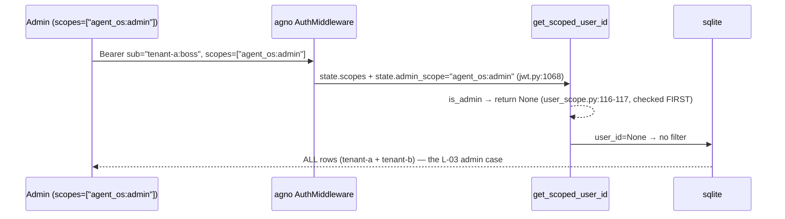

# Design: auth-jwt-native-isolation (S5a.1)

## Technical Approach

Ratified **Option C** (proposal): identity arrives IN the JWT — a dev/test issuer mints `sub="{tenant_id}:{principal_id}"` via `resolve_user_id()` — and Agno 2.8.7's native pipeline does ALL scoping: `AuthMiddleware` validates and stamps `request.state.user_id = sub` (`jwt.py:1039,1060`), `user_isolation=True` makes `get_scoped_user_id()` thread it on every user-scoped read/write (`user_scope.py:105-132`), admins (`agent_os:admin`) short-circuit to `None` = see all (`user_scope.py:116-117`). **Zero yaml-agno code on the JWT path.** `TenantContextMiddleware` shrinks to the dev/no-JWT contract (`authorization=False` + `X-Tenant-Id`), and JD-01 becomes structural exclusion: JWT mode cannot construct with the middleware mounted. Verified evidence against installed agno 2.8.7: `AuthorizationConfig` = exactly 7 fields (`os/config.py:121-139`); AgentOS itself mounts `AuthMiddleware` from the config (`os/app.py:1366-1370`) and fail-fasts on `authorization=True` without a key (`os/app.py:1387-1393`); reserved principals `sa:`/`__scheduler__`/`__oauth__:` rejected at `jwt.py:1048-1050`; escape hatch `user_id_claim` (`jwt.py:547`) documented for S5b.

## Architecture Decisions

| Decision | Options / tradeoff | Choice + rationale |
|---|---|---|
| JD-01 middleware exclusion | (a) silently skip mount (b) fail-fast guard (c) runtime precedence | **(b)** `YamlAgentOS(authorization=True, mount_tenant_context=True)` raises `ValueError`. Silent skip = the R1 fail-open class this repo rejects; the guard makes exclusion structural — JWT mode cannot exist with the header middleware. |
| VQ010 always-on location | (a) `YamlAgentOS.__init__` guard (b) `run_server` entrypoint guard (c) agno-native only | **(b) + (c)**. `run_server` refuses to start unless `authorization=True` (explicit opt-in; production entrypoint). agno already refuses `authorization=True` without a key (`os/app.py:1387`). Dev/test seam stays `YamlAgentOS`/`create_app` with documented NO-production `authorization=False`. |
| Dev issuer home | (a) src/ utility (b) tests/integration/helpers/ | **(b)** Test-only by construction; import-path unreachable from src/. Signing key = pytest fixture (`secrets.token_urlsafe(48)`), never a literal, never in src/. |
| Reserved-principal check | (a) re-implement prefix list (b) import agno's public `is_reserved_principal` | **(b)** BUILD ON TOP; zero drift with `jwt.py:1048`. |
| L-03 DB | (a) sqlite native auto-provision (b) postgres testcontainers | **(a)** — see Testing Strategy. |
| admin_scope | rename vs native default | Native `agent_os:admin` (`jwt.py:736`); zero renames (S5b untouched). |

## Data Flow — the three flows

### (a) JWT active (production / L-03)

```mermaid
sequenceDiagram
    participant C as Client (Bearer sub="tenant-a:alice")
    participant AM as agno AuthMiddleware (native, jwt.py)
    participant R as Native routers (session/memory/agents-runs)
    participant GS as get_scoped_user_id (user_scope.py)
    participant DB as sqlite (auto-provisioned)
    C->>AM: POST/GET + Authorization: Bearer <HS256>
    AM->>AM: verify sig+exp (HS256); reject reserved sub (jwt.py:1048)
    AM->>AM: state.user_id="tenant-a:alice", scopes, admin_scope, user_isolation_enabled=True
    AM->>R: request (TenantContextMiddleware NOT in stack)
    R->>GS: get_scoped_user_id(request)
    GS-->>R: "tenant-a:alice" (non-admin, isolation on)
    R->>DB: read/write WHERE user_id = "tenant-a:alice"
    DB-->>C: only tenant-a:alice rows (cross-tenant id → 404)
```

### (b) Dev, no JWT (authorization=False — documented NO-production)

```mermaid
sequenceDiagram
    participant C as Client (X-Tenant-Id: tenant-a)
    participant TC as TenantContextMiddleware (outermost, ONLY middleware path)
    participant RU as resolve_user_id (SPEC_04)
    participant R as Native routers
    participant DB as sqlite
    C->>TC: request + X-Tenant-Id: tenant-a
    TC->>RU: resolve_user_id(memory_cfg, principal, tenant_id="tenant-a")
    RU-->>TC: "tenant-a:<system_user_id|principal>"
    TC->>R: state.user_id = composite (attribution via resolve_run_user_id case 2, user_scope.py:161)
    R->>DB: writes attributed to composite; listings unscoped (isolation off = accepted dev semantics)
```

### (c) Admin



## Dev Issuer Contract (test helper)

`tests/integration/helpers/dev_jwt_issuer.py` — `DevJwtIssuer(signing_key)`:

- `mint(tenant_id, principal_id, *, scopes=(), expires_delta=10min) -> str`
  1. Fail-fast if `":" in tenant_id` or `":" in principal_id` (composite must stay 2-part parseable).
  2. `sub = resolve_user_id(memory_cfg=None, principal_id=..., tenant_id=...)` — VQ012, no inline composites.
  3. Fail-fast if `is_reserved_principal(sub)` (imported from `agno.os.middleware.jwt`) — covers `tenant_id.startswith("sa:")`, `"__scheduler__"`, `"__oauth__:"`.
  4. `jwt.encode({"sub": sub, "scopes": [...], "iat": now, "exp": now+delta}, key, algorithm="HS256")` — claim name `scopes` matches agno default `scopes_claim` (`jwt.py:546`).
- `auth_header(token) -> {"Authorization": f"Bearer {token}"}`.
- Key: session-scoped fixture `dev_jwt_signing_key` in `tests/integration/helpers/` (or conftest) using `secrets.token_urlsafe(48)`. Same key feeds `AuthorizationConfig(verification_keys=[key], algorithm="HS256", user_isolation=True)`. PyJWT 2.12.1 already available (agno dep).

## YamlAgentOS Wiring

- `YamlAgentOS.__init__` gains explicit `authorization_config: AuthorizationConfig | None = None` (typed, forwarded to `super().__init__` — public agno param, `os/app.py:245`). YAML path unchanged: `AgentOSFactory` already sets `authorization=True` + adapter-built config (S5a.0).
- Mutual-exclusion guard: `authorization=True and mount_tenant_context=True` → `ValueError` (JD-01 structural).
- `get_app()`: mount `TenantContextMiddleware` only under the existing `self._mount_tenant_context` (now unreachable in JWT mode by construction).
- `run_server`: first statement — refuse (`RuntimeError`) unless `authorization=True`; agno then enforces key presence natively. `create_app` stays pure/dev seam.

## File Changes

| File | Action | Description |
|---|---|---|
| `src/yaml_agno/api/app.py` | Modify | Explicit `authorization_config` kwarg; JD-01 guard; docstring rewrite (production via run_server) |
| `src/yaml_agno/runtime/server.py` | Modify | VQ010 refuse-to-start guard in `run_server` |
| `src/yaml_agno/api/middleware/tenant_context.py` | Modify | Dev-only contract: drop `tenant_claim`/`user_sub` extraction (dead attrs in 2.8.7); header + `resolve_user_id` only |
| `tests/integration/helpers/__init__.py`, `dev_jwt_issuer.py`, `static_reply_model.py` | Create | Issuer + key fixture + no-network `Model` subclass (public `agno.models.base.Model` extension point) |
| `tests/integration/api/test_jwt_isolation_l03.py` | Create | L-03 E2E suite (matrix below) |
| `tests/unit/api/test_app_jwt_mode.py`, `tests/unit/runtime/test_run_server_auth.py` | Create | JD-01 + VQ010 contract tests (RED first) |
| `tests/unit/api/test_tenant_context.py` (existing) | Modify | Remove tests of the deleted claim extraction |
| `specs/SPEC_06_API_AND_AX.md`, `specs/SPEC_19_SECURITY_AUTH_API_SURFACE.md` | Modify | Contract rewrite (below) |

## SPEC_06 / SPEC_19 Contract Changes

- **SPEC_06 §3.1**: approach rewrite — the composite is minted INTO `sub` at issuance (dev issuer now; Keycloak mapper or `user_id_claim` in S5b); Agno threads it natively; delete the "middleware extracts `tnt`" narrative.
- **SPEC_06 §3.2**: middleware contract = dev/no-JWT only (`authorization=False` + `X-Tenant-Id` → `resolve_user_id`); remove `tenant_claim`/`user_sub` code; add JD-01 mutual exclusion. §2 `get_app` snippet updated; §5 dev-header test snippets unchanged.
- **SPEC_19**: supersede `build_jwt_middleware` narrative with AuthorizationAdapter (S5a.0) + agno native `build_jwt_middleware_kwargs` (`jwt.py:397`); delete "TenantContextMiddleware resolves sub→composite before isolation"; admin flow = native `agent_os:admin` default; reference S5b escape hatch `user_id_claim` (`jwt.py:547`).

## Testing Strategy

| Layer | What | How |
|---|---|---|
| Unit (RED first) | JD-01 guard; VQ010 refusal; issuer contract (reserved principal, colon, claims) | contract tests, fake server factory |
| Integration L-03 | isolation matrix (below) | one `YamlAgentOS` app, `TestClient`, sqlite auto-provision (`db=None`), `StaticReplyModel` |
| E2E | dev-header regression | existing suite stays green unchanged |

**L-03 matrix** (2 tenants A/B, same principal `alice` both, one instance): (T1) disjoint session buckets per composite; (T2) alice/B reads A's session id → **404** (native masking); (T3) memories isolated (B list/read of A's → empty/404); (T4) alice/B fetches A's run in session → **404**; (T5) admin (`agent_os:admin`) lists both tenants' sessions; (T6) dev-header app (separate instance) still green; (T7) negatives: no/invalid/expired token → 401.

**DB decision: SQLite** (agno native auto-provision). Isolation is enforced ABOVE the driver — `get_scoped_user_id` threads `user_id` into the same filters for every backend — and the repo has zero postgres/testcontainers infrastructure today. L-03 proves LOGIC isolation (D-F1-11). Residual driver-specific risk (`postgres.py` NULL-bucket upsert clauses) is covered by `user_isolation` guaranteeing non-None writes; suite keeps the db injectable to re-point at postgres later as smoke.

## Threat Matrix

N/A — no shell, subprocess, VCS/PR automation, executable classification, or process-integration boundary. (HTTP auth middleware mounting is covered by the L-03 adversarial cases T2/T4/T7.)

## Migration / Rollout

No schema/data migration. Pure code revert restores slice-A behavior. Rollout = this slice only; MCP gate and Casbin follow in S5a.2+.

## Risks

| Risk | Mitigation |
|---|---|
| Dev issuer/key escapes to production | Helper lives only under `tests/`; key generated per session by fixture; CI grep gate: `DevJwtIssuer` absent from `src/`; prod keys only via SecretManager → adapter |
| agno drift on `request.state` attrs (`user_id`, `scopes`, `admin_scope`, `user_isolation_enabled`) | agno pinned `==2.8.7`; L-03 suite doubles as drift canary — an upgrade that moves attributes breaks T1-T7 loudly |
| Composite ambiguity if tenant/principal contain `":"` | Issuer fail-fast (2-part invariant); hardening `resolve_user_id` itself = open question |
| Keycloak S5b `sub`=UUID vs composite | Documented escape hatch `user_id_claim` (`jwt.py:547`); S5b design owns the decision (deferred by design) |
| SQLite vs Postgres clause divergence | user_isolation guarantees non-None `user_id` writes; optional postgres re-run of L-03 later |

## Open Questions

- [ ] Harden `resolve_user_id` to reject `":"` in components (small SPEC_04 delta) — now, or keep issuer-side only?
- [ ] Should `run_server` also accept `AuthorizationSettings` (YAML path) directly, or stay `AuthorizationConfig`-only until the S3 CLI wiring?
