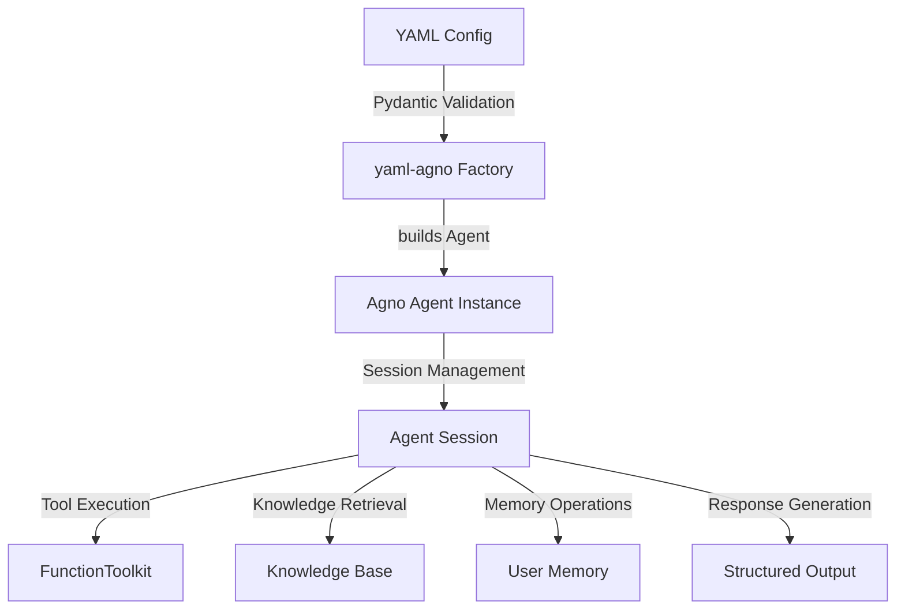
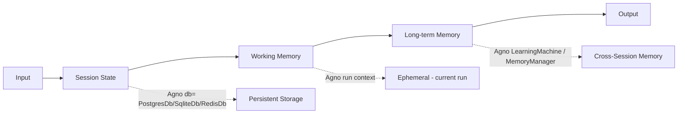
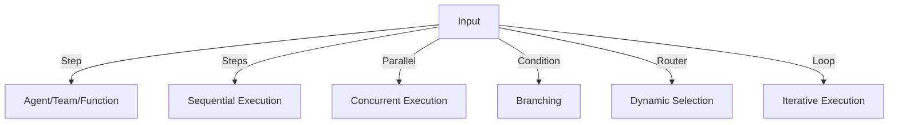

# SPEC_01_AGNO_RUNTIME_ARCHITECTURE

> **Propósito**: Definir la infraestructura de agentes y orquestación en runtime para yaml-agno, incluyendo configuración del ciclo de vida (soporte dual `run()`/`arun()`), contratos de equipos especializados, gobernanza de estado y disparadores de workflows cognitivos.

> **@ai-directive**: El código Python de este SPEC es **pseudo-código esquemático** que ilustra el PATRÓN de factory (YAML → Agno Objects), NO la implementación completa. El `AgentFactory`/`TeamFactory`/`WorkflowFactory` mapean los **80+ parámetros** del constructor de Agno, delegando la construcción detallada de cada sub-sistema a su SPEC dedicado: tools → SPEC_11, knowledge → SPEC_10, memory → SPEC_04, session/storage → SPEC_03 + SPEC_13, models → SPEC_14, guardrails/HITL → SPEC_16. Este SPEC es **una sola fuente de verdad para el runtime core** y NO duplica el contenido de los SPECs dedicados.

---

## 1. RUNTIME CORE CONFIGURATION

### 1.1 Ciclo de Vida de Ejecución de Agentes

El runtime de yaml-agno se construye SOBRE Agno Framework, no reimplementa sus internos. La configuración YAML se traduce a objetos Agno mediante el patrón Factory.

#### Componentes del Runtime



#### Contrato de Factory: YAML → Agno Objects

**Responsabilidad**: Traducir YAML validado a instancias de Agno Framework sin modificar el framework core.

**@ai-directive**: El siguiente `AgentFactory` es **pseudo-código esquemático**. Muestra el patrón de delegación. El `AgentConfig` **contiene los 80+ parámetros** del constructor `Agent()` de Agno; aquí solo se ilustran los fields core y la delegación a factories de sub-sistemas. La lista completa de parámetros y su mapeo YAML↔Agno vive en este SPEC (sección 1.2) y en los SPECs dedicados (tools/knowledge/memory/model/guardrails). **No cargar todos los imports de Agno al tope del módulo**: usar carga perezosa vía `DependencyManager` (ver sección 1.3).

```python
# yaml-agno/src/factories/agent_factory.py
# SCHEMATIC: illustrates the factory + delegation pattern, not the full 80+ param impl.

from typing import Any
from pydantic import BaseModel, Field
from yaml_agno.di import DependencyManager   # dynamic, lazy, allowlisted loading

class AgentConfig(BaseModel):
    """
    Configuration for an Agno Agent, loaded from YAML.
    @ai-directive: This model holds the 80+ constructor parameters of agno.Agent.
    Only core fields shown here; advanced fields (tools, knowledge, memory, session,
    model, guardrails, hitl, multimodal) are nested configs delegated to their specs.
    """
    # --- core identity ---
    name: str = Field(..., description="Unique agent name")
    model: str = Field(..., description="Model string 'provider:id' (see SPEC_14)")
    instructions: str | None = Field(None, description="System prompt")
    description: str | None = Field(None, description="Agent description")
    role: str | None = Field(None, description="Agent role (used in teams)")

    # --- delegated sub-systems (each is a nested config built by its own factory) ---
    tools: list[dict[str, Any]] = Field(default_factory=list, description="See SPEC_11")
    knowledge: dict[str, Any] | None = Field(None, description="See SPEC_10")
    memory: dict[str, Any] | None = Field(None, description="See SPEC_04")
    learning: dict[str, Any] | None = Field(None, description="LearningMachine config (see SPEC_04)")
    session: dict[str, Any] | None = Field(None, description="See SPEC_03 + SPEC_13")
    guardrails: dict[str, Any] | None = Field(None, description="See SPEC_16")
    hitl: dict[str, Any] | None = Field(None, description="See SPEC_16")
    multimodal: dict[str, Any] | None = Field(None, description="See SPEC_17")
    context: dict[str, Any] | None = Field(None, description="add_*_to_context flags (see SPEC_15)")

    # --- runtime behavior (subset; full list in section 1.2) ---
    # @ai-directive: Agno defaults markdown=False (agent.py:460). yaml-agno does NOT
    # override this; declare markdown: true in YAML to enable.
    markdown: bool = False
    add_history_to_context: bool = False
    num_history_runs: int | None = Field(
        None,
        description="Mutually exclusive with num_history_messages. Agno defaults to 3 "
        "when BOTH are None (agent.py:572-573); set explicitly to override.",
    )
    num_history_messages: int | None = None
    # ... remaining 80+ params mapped in section 1.2 table ...


class AgentFactory:
    """Factory: validated YAML (AgentConfig) -> agno.Agent instance."""

    def __init__(self, deps: DependencyManager):
        self.deps = deps   # resolves providers/tools/dbs lazily + allowlisted

    async def create(self, config: AgentConfig) -> "Agent":
        """
        Build an agno.Agent from validated config.

        @ai-directive: delegates each sub-system to its factory; only the provider
        referenced in YAML is imported (lazy), not all 30+ providers.
        """
        # lazy model resolution via DependencyManager (registry + importlib + allowlist)
        model = await self.deps.resolve_model(config.model)          # SPEC_14

        # delegated sub-system factories (lazy-resolved, allowlisted)
        tools = await self.deps.build_tools(config.tools)            # SPEC_11
        knowledge = await self.deps.build_knowledge(config.knowledge)# SPEC_10
        memory = await self.deps.build_memory(config.memory)         # SPEC_04
        learning = await self.deps.build_learning(config.learning)   # SPEC_04
        db = await self.deps.build_db(                               # SPEC_03
            config.session.storage_type,
            config.session.connection_string,
        )
        guardrails = await self.deps.build_guardrails(config.guardrails)  # SPEC_16

        # The Agent class itself is resolved lazily via DependencyManager too.
        # resolve_class is SYNC (lru_cache); do NOT await it.
        Agent = self.deps.resolve_class("agno.agent", "Agent")

        agent = Agent(
            name=config.name,
            model=model,
            instructions=config.instructions,
            tools=tools,
            knowledge=knowledge,
            memory_manager=memory,
            learning=learning,
            db=db,
            pre_hooks=guardrails,  # guardrails mount as Agent pre_hooks (agent.py:438)
            markdown=config.markdown,
            add_history_to_context=config.add_history_to_context,
            num_history_runs=config.num_history_runs,
            # ... remaining params spread from config ...
        )
        return agent
```

#### 1.2 Mapeo completo de parámetros (80+)

La tabla siguiente mapea los grupos de parámetros del constructor `Agent()` de Agno a su ubicación de especificación. **Cada grupo tiene su SPEC dedicado** que define el YAML schema exacto; este SPEC define únicamente cómo el factory los ensambla.

| Grupo de parámetros | Ejemplos de params Agno | Especificación | Nivel abstracción |
|---------------------|-------------------------|----------------|-------------------|
| Identity | `name`, `model`, `instructions`, `description`, `role`, `agent_id` | SPEC_01 | ABSTRAER (core) |
| Model / resilience | `model` (string/provider), `fallback_models`, `retries`, cache | SPEC_14 | ABSTRAER |
| Tools / MCP | `tools`, `tool_call_limit`, toolkits, MCPTools | SPEC_11 | ABSTRAER |
| Knowledge / RAG | `knowledge`, `knowledge_filters`, `search_knowledge` | SPEC_10 | ABSTRAER |
| Memory | `memory_manager`, `enable_agentic_memory`, `update_memory_on_run`, `add_memories_to_context` | SPEC_04 | ABSTRAER flags / REFERENCIAR manager |
| Learning | `learning` (LearningMachine: 6 stores) | SPEC_04 | REFERENCIAR |
| Session/storage | `db`, `session_id`, `user_id`, `session_state` | SPEC_03 + SPEC_13 | ABSTRAER |
| History | `add_history_to_context`, `num_history_runs`, `num_history_messages`, `max_tool_calls_from_history` | SPEC_01 (§1.4) | ABSTRAER |
| Context engineering | `add_datetime_to_context`, `add_dependencies_to_context`, `dependencies`, `additional_context`, `compress_tool_results` | SPEC_15 | ABSTRAER |
| Guardrails / hooks | `pre_hooks`, `post_hooks`, guardrails | SPEC_16 | ABSTRAER guardrails / REFERENCIAR hooks |
| HITL | `requires_confirmation`, `requires_user_input` (step-level) | SPEC_16 | ABSTRAER flags |
| Multimodal | `images`, `audio`, `videos`, `files`, `send_media_to_model` | SPEC_17 | REFERENCIAR |
| Reasoning | `reasoning`, `reasoning_model`, `reasoning_effort` | SPEC_14 | ABSTRAER |
| Reasoning / debug | `debug_mode`, `debug_level`, `show_tool_calls`, `telemetry`, `markdown` | SPEC_01 (§1.2.1) | ABSTRAER |

##### 1.2.1 Parámetros de runtime/debug (residentes en este SPEC)

> **@ai-directive (verificado en Agno v2.6.22, `agno/agent/agent.py:460,497-499`)**: los
> defaults listados abajo son los **defaults reales del constructor `Agent()`**, no valores
> arbitrarios de yaml-agno. `show_tool_calls` fue removido: **no existe** en Agno (cero
> coincidencias en `libs/agno/agno/`). Para ver tool calls en output, usar `debug_mode: true`
> o `debug_level: 2`.

| Parámetro YAML | Agno equivalent | Default Agno | Descripción |
|----------------|-----------------|--------------|-------------|
| `markdown` | `Agent.markdown` (agent.py:460) | `false` | Render markdown en la respuesta. yaml-agno **no** overridea; declarar `markdown: true` en YAML para habilitar |
| `debug_mode` | `Agent.debug_mode` / `run(debug_mode=)` (agent.py:497,1414) | `false` | Logs de ejecución detallados (constructor + kwarg por-run) |
| `debug_level` | `Agent.debug_level` (agent.py:498) | `1` | Nivel de detalle, `Literal[1, 2]` (Agno fuerza a 1 si el valor es inválido) |
| `telemetry` | `Agent.telemetry` (agent.py:499) | `true` | Telemetría anónima (ver SPEC_09) |

> **`show_tool_calls` REMOVIDO**: parámetro inventado en iteraciones previas. No existe en
> el constructor `Agent()` ni en `run()`/`arun()` de Agno v2.6.22. Usar `debug_mode` en su lugar.

#### Loop de Eventos y Sesión

Agno maneja el loop de eventos internamente. yaml-agno expone configuración de parámetros:

```yaml
agent:
  name: "facturacion"
  model: openai/gpt-4o
  instructions: "Process invoices..."
  
  session:
    # @ai-directive: user_id is NOT declared in YAML. It is injected at RUNTIME
    # by TenantContextMiddleware (SPEC_06) as the composite
    # "{tenant_id}:{principal_id}" from resolve_user_id() (SPEC_04).
    session_name: "facturacion"
    storage_type: postgres  # any Agno DB: sqlite|postgres|memory|redis|mongo|... (see §1.3)

  execution:
    stream: false
    debug_mode: false   # set true (or debug_level: 2) to see tool calls; show_tool_calls is NOT an Agno param
```

**Parámetros de Session expuestos** (mapeados a Agno `Agent.run()` / `Agent.arun()`):

La tabla lista los parámetros de sesión que efectivamente existen en la API de Agno v2.6.22 (firma real de `run()` verificada en `agno/agent/agent.py:1391-1416`; `arun()` en `1444-1498`). **No se inventan parámetros.**

> **@ai-directive (user_id is runtime-only)**: `user_id` aparece en la API de Agno
> como `run(user_id=...)`, pero en yaml-agno NO es un campo YAML. Lo inyecta
> `TenantContextMiddleware` (SPEC_06) en cada request a partir del contexto
> autenticado, como el composite `"{tenant_id}:{principal_id}"` que produce
> `resolve_user_id()` (SPEC_04). Declararlo en YAML permitiría spoofing de
> identidad; por eso se omite de la tabla de parámetros declarables.

| Parámetro YAML | Agno equivalent | Tipo | Validación |
|----------------|-----------------|------|------------|
| `session_id` | `run(session_id=...)` (agent.py:1398) | `str \| None` | Continúa sesión existente (autogenerada si None) |
| `session_state` | `run(session_state=...)` / Agent attr (agent.py:394,1399) | `dict` | Estado persistente entre turns |
| `storage_type` | `db=` (SqliteDb/PostgresDb/RedisDb/...) (agent.py:407) | `str` | Resuelto vía DependencyManager (§1.3) |
| `add_history_to_context` | `run(add_history_to_context=...)` (agent.py:1407) | `bool` | Inyecta historial en contexto |
| `add_session_state_to_context` | `run(add_session_state_to_context=...)` (agent.py:1409) | `bool` | Inyecta session_state en contexto |
| `add_dependencies_to_context` | `run(add_dependencies_to_context=...)` (agent.py:1408) | `bool` | Inyecta dependencies en contexto |
| `metadata` | `run(metadata=...)` (agent.py:1411) | `dict` | Metadata adjunta al run |

> **`max_iterations` REMOVIDO**: **no existe** como parámetro de `run()`/`arun()` en Agno
> v2.6.22 (verificado en `agno/agent/agent.py:1391-1416,1444-1498`; cero coincidencias de
> `max_iterations` en `libs/agno/agno/agent/`). El loop interno del agente se gobierna con
> `tool_call_limit` (constructor, SPEC_11) y `retries`/`delay_between_retries`
> (constructor, SPEC_14). Si yaml-agno necesita un budget global de iteraciones por request,
> será una **extensión propia** sobre Agno (no un mapeo directo). Por ahora no se expone.

> **@ai-directive (retention — FEATURE FUTURA)**: Agno **NO** tiene `retention_days` nativo ni un job de limpieza periódico listo. Hallazgos verificados en Agno v2.6.22:
> - **`Curator.prune(max_age_days=)`** (parte de `LearningMachine`, `agno/learn/curate.py:36`) solo limpia el store `user_profile`, **no** las memorias generales. Es síncrono y standalone (no requiere agente corriendo).
> - **`RedisDb(expire=N)`**: TTL de backend Redis, borra claves solas al expirar (solo si el backend es Redis).
> - **Scheduler de Agno** (`ScheduleManager`/`SchedulePoller`/`ScheduleExecutor`) **NO sirve directo** para purge: está acoplado a ejecutar runs HTTP de agents/teams/workflows (no funciones Python arbitrarias ni SQL de mantenimiento) y requiere AgentOS corriendo.
>
> **Decisión**: la retención/purge automática es **feature futura de yaml-agno, no bloqueante para el MVP core**. Cuando se implemente, requerirá: (a) función de purge que opere sobre las memorias correctas (no solo user_profile), y (b) un mecanismo de programación propio o envolver el purge en un endpoint HTTP para usar el scheduler de Agno. Por ahora yaml-agno **no expone** `retention_days` como nativo de Agno (porque no lo es).

### 1.3 DependencyManager (carga dinámica segura de providers/DBs/primitives)

**@ai-directive**: yaml-agno **NO** carga todos los providers de Agno (modelos, DBs, primitivas de workflow) al importar el módulo. Eso gastaría memoria innecesariamente. En su lugar, un **`DependencyManager`** resuelve cada dependencia de forma **perezosa, validada y con cache**, siguiendo el patrón SOTA de Python 3.12 para plugin loading seguro.

**Patrón**: registry declarativo (dict validado) + `importlib.import_module` perezoso + **allowlist** de módulos (nunca input directo del usuario, mitiga path traversal) + cache de instancias + **entry_points** (`importlib.metadata.entry_points`) para extensión de terceros. Inspirado en el `ReaderFactory` de Agno (que sí usa importlib) y mejorado con allowlist + entry_points.

```python
# yaml-agno/src/di/dependency_manager.py
# SCHEMATIC: dynamic, lazy, allowlisted dependency resolution.

import importlib
from functools import lru_cache
from importlib.metadata import entry_points

# Declarative registry: key -> (module_path, class_name). Validated, allowlisted.
# Users reference keys in YAML; they can NEVER inject arbitrary module paths.
MODEL_REGISTRY: dict[str, tuple[str, str]] = {
    "openai":      ("agno.models.openai", "OpenAIChat"),
    "anthropic":   ("agno.models.anthropic", "Claude"),
    "google":      ("agno.models.google", "Gemini"),
    "ollama":      ("agno.models.ollama", "Ollama"),
    "openrouter":  ("agno.models.openrouter", "OpenRouter"),
    # ... remaining providers; extensible via entry_points ...
}

STORAGE_REGISTRY: dict[str, tuple[str, str]] = {
    # @ai-directive: module paths verified against Agno v2.6.22 layout:
    #   agno/db/sqlite/sqlite.py, agno/db/postgres/postgres.py,
    #   agno/db/redis/redis.py, agno/db/in_memory/in_memory_db.py.
    # Note: the in-memory module is agno.db.in_memory (NOT agno.db.memory, which
    # does not exist).
    "sqlite":  ("agno.db.sqlite", "SqliteDb"),
    "postgres":("agno.db.postgres", "PostgresDb"),
    "redis":   ("agno.db.redis", "RedisDb"),
    "memory":  ("agno.db.in_memory", "InMemoryDb"),
    # ... extensible via entry_points ...
}

class DependencyManager:
    """
    Resolves Agno providers/DBs/primitives lazily and safely.
    @ai-directive: only the key referenced in YAML is imported, not all providers.
    """

    def __init__(self, model_reg=MODEL_REGISTRY, storage_reg=STORAGE_REGISTRY):
        self._model_reg = model_reg
        self._storage_reg = storage_reg
        self._merge_entry_points()  # 3rd-party plugins register here

    def _merge_entry_points(self) -> None:
        """Allow 3rd-party packages to register new providers/DBs safely."""
        for ep in entry_points(group="yaml_agno.models"):
            self._model_reg[ep.name] = (ep.value, ep.load)  # validated by packaging metadata

    @lru_cache(maxsize=128)
    def resolve_class(self, module_path: str, class_name: str):
        """
        Import module_path and return class_name. Cached. SYNC (not async).
        @ai-directive: module_path must be in an allowlist registry; never user input.
        Callers invoke this WITHOUT await (it is a regular cached function).
        """
        module = importlib.import_module(module_path)   # raises ImportError if missing
        return getattr(module, class_name)

    async def resolve_model(self, model_str: str):
        """'openai/gpt-4o' -> OpenAIChat(id='gpt-4o'). Only openai is imported."""
        provider, _, model_id = model_str.partition("/")
        if provider not in self._model_reg:
            raise ValueError(f"Unknown model provider: {provider}")
        module_path, class_name = self._model_reg[provider]
        ModelCls = self.resolve_class(module_path, class_name)
        return ModelCls(id=model_id)

    async def build_db(self, storage_type: str, connection_string: str | None):
        """storage_type -> Agno DB instance. Only that DB module is imported."""
        if storage_type not in self._storage_reg:
            raise ValueError(f"Unknown storage_type: {storage_type}")
        module_path, class_name = self._storage_reg[storage_type]
        DbCls = self.resolve_class(module_path, class_name)
        return DbCls(connection_string) if connection_string else DbCls()

    async def is_known_storage(self, storage_type: str) -> bool:
        return storage_type in self._storage_reg

    async def list_storage_types(self) -> list[str]:
        return list(self._storage_reg.keys())

    async def storage_needs_connection(self, storage_type: str) -> bool:
        return storage_type not in ("sqlite", "memory")  # heuristic; refined per-DB

    async def resolve_workflow_primitive(self, step_type: str):
        """step_type -> Agno workflow primitive class (Step/Parallel/Condition/Router/Loop)."""
        registry = {
            "parallel": ("agno.workflow", "Parallel"),
            "condition":("agno.workflow", "Condition"),
            "router":   ("agno.workflow", "Router"),
            "loop":     ("agno.workflow", "Loop"),
        }
        if step_type not in registry:
            raise ValueError(f"Unsupported step type: {step_type}")
        module_path, class_name = registry[step_type]
        return self.resolve_class(module_path, class_name)
```

**Do's & Don'ts**:
- ✅ Registry declarativo + allowlist: el YAML referencia **keys**, nunca paths de módulo
- ✅ Import perezoso: solo se importa el provider/DB/primitiva referenciado
- ✅ Cache (`lru_cache`): instancias de clase reusadas
- ✅ `entry_points`: extensión segura de terceros (plugins instalados via pip)
- ❌ NUNCA `importlib.import_module` con input directo del usuario (path traversal)
- ❌ NUNCA importar todos los providers al inicio del módulo

---

## 2. SPECIALIZED TEAMS CONTRACTS

### 2.1 Contrato de Team Configuration

Los Teams en yaml-agno se mapean a `agno.team.Team` con todos sus modos y configuraciones.

#### Modos de Team Soportados

`TeamMode` en Agno v2.6.22 define **4 modos** (verificado en `agno/team/mode.py:6-23`). **No existe `coroutine`** (era un error de versiones previas de este SPEC).

| Modo YAML | Agno `TeamMode` | Descripción |
|-----------|-----------------|-------------|
| `coordinate` | `TeamMode.coordinate` | Supervisor coordina miembros (default) |
| `route` | `TeamMode.route` | Router dirige al miembro adecuado (equivale al flag legacy `respond_directly`) |
| `broadcast` | `TeamMode.broadcast` | Broadcast a todos los miembros (equivale al flag legacy `delegate_to_all_members`) |
| `tasks` | `TeamMode.tasks` | Ejecución autónoma basada en tareas |

#### Team YAML Schema

```yaml
team:
  name: "facturacion_workflow"
  mode: coordinate  # coordinate|route|broadcast|tasks (4 modes, no 'coroutine')
  instructions: |
    You orchestrate invoice processing across specialized agents.
  
  members:
    - member: validator
      agent: validator_agent
      role: "Validate invoice structure and data"
    
    - member: processor
      agent: processor_agent
      role: "Process validated invoices"
    
    - member: notifier
      agent: notification_agent
      role: "Send notifications"
  
  workflows:
    - workflow: invoice_processing
      description: "Main invoice processing pipeline"
      # Ver sección 4 para primitivas de workflow
```

#### TeamFactory Implementation

```python
# yaml-agno/src/factories/team_factory.py
# SCHEMATIC: illustrates the factory + delegation pattern. TeamConfig holds the 25+
# Team() constructor params; only core fields shown. Advanced members (callable
# factories), caching keys, orchestration flags -> delegated to SPEC_05.

from typing import Any
from pydantic import BaseModel, Field
from yaml_agno.di import DependencyManager

class TeamConfig(BaseModel):
    """Configuration for an Agno Team from YAML."""
    name: str
    mode: str = "coordinate"  # coordinate|route|broadcast|tasks (4 modes, no coroutine)
    instructions: str | None = None
    members: list[dict[str, Any]] = Field(default_factory=list, description="Members or callable factory ref")
    workflows: list[dict[str, Any]] = Field(default_factory=list)
    # ... remaining Team() params (callable_members_cache_key, share_member_interactions,
    #     determine_input_for_members, stream_member_events, etc.) -> SPEC_05 ...

class TeamFactory:
    """Factory: validated YAML (TeamConfig) -> agno.Team instance."""

    def __init__(self, deps: DependencyManager):
        self.deps = deps

    async def create(self, config: TeamConfig, agents: dict[str, "Agent"]) -> "Team":
        """
        Build an agno.Team from validated config.
        @ai-directive: validates mode against the 4 real TeamMode values.
        """
        Team, TeamMode = self.deps.resolve_team_symbols()  # lazy import

        if config.mode not in {"coordinate", "route", "broadcast", "tasks"}:
            raise ValueError(
                f"Invalid team mode: {config.mode}. "
                f"Valid: coordinate|route|broadcast|tasks (no 'coroutine')."
            )

        members = []
        for member_config in config.members:
            agent_name = member_config.get("agent")
            if agent_name not in agents:
                raise ValueError(f"Agent not found: {agent_name}")
            members.append(agents[agent_name])

        team = Team(
            name=config.name,
            mode=TeamMode(config.mode),
            members=members,
            instructions=config.instructions,
        )
        return team
```

---

## 3. SESSION AND AGENT STATE GOVERNANCE

### 3.1 Arquitectura de Session Storage

yaml-agno **no hardcodea** un enum cerrado de storage types. Cualquier DB soportada por Agno se declara en YAML y se instancia en runtime vía `DependencyManager` (ver §1.3). La tabla muestra las más comunes; la lista completa la provee el registry.

| Storage Type | YAML key | Agno class | Use Case |
|--------------|----------|------------|----------|
| **SQLite** | `storage_type: sqlite` | `agno.db.sqlite.SqliteDb` | Desarrollo local |
| **PostgreSQL** | `storage_type: postgres` | `agno.db.postgres.PostgresDb` / `AsyncPostgresDb` | Producción multi-tenant |
| **Memory** | `storage_type: memory` | `agno.db.memory.InMemoryDb` | Tests y stateless |
| **Redis** | `storage_type: redis` | `agno.db.redis.RedisDb` (+ `expire` TTL) | Cache / TTL / pub-sub cancellation |
| *(extensible)* | `storage_type: <registry>` | entry_points (3rd-party) | Plugins |

> **@ai-directive**: la abstracción clave es que el `storage_type` en YAML es una **key del registry**, no un enum cerrado. `DependencyManager` resuelve la clase Agno correspondiente, la importa perezosamente (solo esa, no todas) y la instancia con los params del YAML. Esto permite usar **cualquier DB de Agno** sin tocar código yaml-agno.

#### Session Configuration YAML

```yaml
agent:
  name: "my_agent"
  # ...

  session:
    # Identification (Agno first-class isolation keys)
    # @ai-directive: user_id is NOT a YAML field. It is a RUNTIME value injected by
    # TenantContextMiddleware (SPEC_06) as the composite "{tenant_id}:{principal_id}"
    # resolved by resolve_user_id() (SPEC_04). Declaring it in YAML would let a
    # caller forge identity; it must come from authenticated request context only.
    session_id: "my_session_${run.user_id}"

    # Storage (resolved via DependencyManager; any Agno DB)
    storage_type: postgres
    connection_string: "${DB_URL}"  # from SecretManager, never env in prod

    # Metadata (tenant_id is NOT a first-class Agno key; modeled as claim/metadata,
    # resolved by Core Infra TenantResolver - see SPEC_00 §7.2)
    metadata:
      tenant_id: "${user_db.tenant_id}"
      environment: "${ENV}"
```

> **@ai-directive**: no hay `retention_days` ni `auto_cleanup` nativos de Agno. La limpieza/retención se modela como **extensión propia** de yaml-agno (un job del scheduler SPEC_13 que invoca `LearningMachine`/Curator `prune(max_age_days=...)`, o el TTL de `RedisDb(expire=...)`).

#### Session Manager Contract

```python
# yaml-agno/src/core/session_manager.py
# SCHEMATIC: validates session config and delegates DB resolution to DependencyManager.

from pydantic import BaseModel, Field
from yaml_agno.di import DependencyManager

class SessionConfig(BaseModel):
    """Session config from YAML. No closed storage enum; validated against registry.

    @ai-directive: user_id is NOT a field here. It is a RUNTIME value injected by
    TenantContextMiddleware (SPEC_06) as the composite "{tenant_id}:{principal_id}"
    from resolve_user_id() (SPEC_04). Keeping it out of the YAML model prevents a
    caller from declaring/overriding identity at config time.
    """
    session_id: str | None = None          # Agno first-class key
    storage_type: str = "sqlite"           # registry key, not enum
    connection_string: str | None = None   # from SecretManager, never env in prod
    metadata: dict = Field(default_factory=dict)

class SessionManager:
    """Validates session config and builds the Agno db= via DependencyManager."""

    def __init__(self, deps: DependencyManager):
        self.deps = deps

    async def validate(self, config: SessionConfig) -> None:
        """
        @ai-directive: validates storage_type against the DependencyManager registry
        (allowlisted), and that connection_string is present for DBs that require it.
        """
        if not await self.deps.is_known_storage(config.storage_type):
            raise ValueError(
                f"Unknown storage_type: {config.storage_type}. "
                f"Known: {await self.deps.list_storage_types()}"
            )
        if await self.deps.storage_needs_connection(config.storage_type) and not config.connection_string:
            raise ValueError(f"connection_string required for {config.storage_type}")

    async def build_db(self, config: SessionConfig):
        """Resolve the Agno DB instance lazily (only this provider is imported)."""
        return await self.deps.build_db(config.storage_type, config.connection_string)
```

### 3.2 Agent State Governance

El estado de agente se divide en 3 capas, todas mapeadas a **primitivas nativas de Agno** (no se inventan stores):



> **@ai-directive**: aclaraciones técnicas verificadas en Agno v2.6.22:
> - **Long-term memory es 100% Agno native**: el runtime core de yaml-agno usa **`LearningMachine`** (6 stores: user_profile, user_memory, session_context, entity_memory, learned_knowledge, decision_log) o, más simple, **`MemoryManager`/`UserMemory`**. NO existe ningún adapter de Engram, ningún `LongTermMemoryPort`, ni mención a Engram en el runtime. SPEC_04 es el dueño de la memoria Agno-native.
> - **Redis SÍ es de Agno**: `agno.db.redis.RedisDb` (DB de sessions/memory con `expire` TTL), `agno.vectordb.redis.RedisDB` (vector DB) y `RedisRunCancellationManager` (cancelación pub-sub). La etiqueta anterior "Redis/Agno" era imprecisa: Redis es una opción de backend Agno, no un cache genérico nuestro.
> - **`learning` y `culture`**: `learning` = `LearningMachine` (sistema unificado de aprendizaje). `culture` = `CultureManager` (experimental, "shared cultural knowledge"). Ambos son de Agno. Memory (MemoryManager) ≠ Learning (LearningMachine es la evolución más rica). Ver SPEC_04 para detalle.

#### Capas de Estado (mapeadas a Agno nativo)

| Capa | Agno primitive | Storage Agno | Responsabilidad |
|------|----------------|--------------|-----------------|
| **Session State** | `db=` + `session_id`/`user_id` | PostgresDb / SqliteDb / RedisDb | Historial de runs, tool calls |
| **Working Memory** | run context (interno Agno) | (efímero, run actual) | Contexto del run actual |
| **Long-term Memory** | `LearningMachine` (o `MemoryManager`) | db= (misma DB) | Observaciones cross-session; 100% Agno native (SPEC_04) |

#### State Persistence YAML

```yaml
agent:
  # ...
  
  state:
    # Session persistence
    session:
      store_history: true
      # @ai-directive: num_history_messages is an Agno Agent attribute (agent.py:421),
      # mutually exclusive with num_history_runs (agent.py:420). NOT max_history_messages.
      # When BOTH are None Agno defaults num_history_runs to 3 (agent.py:572-573).
      # These params are chatbot-oriented (multi-turn). For agentic single-shot flows
      # set add_history_to_context: false and omit them.
      add_history_to_context: true
      num_history_messages: 100   # OR num_history_runs: 3  (never both)
      max_tool_calls_from_history: 20

    # Working memory (compression is Agno CompressionManager, see SPEC_15)
    working:
      compress_tool_results: true
      compression_ratio_threshold: 0.5

    # Long-term memory (Agno native LearningMachine/MemoryManager - SPEC_04)
    memory:
      # Agno native options (mutually exclusive strategies):
      enable_agentic_memory: true       # agent decides when to store/recall (efficient)
      # update_memory_on_run: true      # alternative: store after every run (higher latency)
      add_memories_to_context: true

    # Learning (Agno LearningMachine - richer than memory; see SPEC_04)
    learning:
      enabled: false   # opt-in; 6 stores (user_profile, user_memory, ...)
      # type: learning_machine   # native Agno
```

---

## 4. COGNITIVE WORKFLOW TRIGGERS

### 4.1 Workflow Primitives

yaml-agno abstrae las 6 primitivas de workflow de Agno:



#### Primitiva: Step

Unidad básica de ejecución. Puede ser Agent, Team, Function, o Workflow anidado.

```yaml
workflow:
  name: "simple_workflow"
  
  steps:
    - step: extract_data
      type: agent  # agent|team|function|workflow
      agent: data_extractor
      execute: true  # true|false para deshabilitar
    
    - step: validate
      type: agent
      agent: validator
      
    - step: cleanup
      type: function
      function: cleanup_resources
      finally: true  # Ejecutar siempre
```

#### Primitiva: Steps

Ejecución secuencial de steps.

```yaml
workflow:
  name: "linear_pipeline"
  
  steps:
    - step: step1
      type: agent
      agent: agent1
    
    - step: step2
      type: agent
      agent: agent2
      
    - step: step3
      type: team
      team: processor_team
```

#### Primitiva: Parallel

Ejecución concurrente con merge de estado.

```yaml
workflow:
  name: "parallel_processing"
  
  steps:
    - step: parallel_validation
      type: parallel
      steps:
        - step: validate_structure
          type: agent
          agent: structure_validator
        
        - step: validate_content
          type: agent
          agent: content_validator
        
        - step: validate_format
          type: agent
          agent: format_validator
      
      # Merge strategy (opcional)
      merge_strategy: all  # all|first|last|custom
```

#### Primitiva: Condition

Branching condicional con CEL o callable.

```yaml
workflow:
  name: "conditional_flow"
  
  steps:
    - step: check_amount
      type: condition
      
      # CEL expression (Common Expression Language)
      condition: "${input.amount > 1000}"
      
      # O callable (referencia a función Python)
      # condition: "custom_functions.check_amount_threshold"
      
      if_true: senior_approval
      if_false: auto_process
    
    - step: senior_approval
      type: agent
      agent: senior_approver
      
    - step: auto_process
      type: agent
      agent: auto_processor
```

#### Primitiva: Router

Selección dinámica de step basada en input.

```yaml
workflow:
  name: "dynamic_routing"
  
  steps:
    - step: route_by_category
      type: router
      
      # CEL expression para evaluación
      expression: "${input.category}"
      
      cases:
        "billing": billing_agent
        "support": support_agent
        "sales": sales_agent
        "*": default_agent  # Wildcard
    
    - step: billing_agent
      type: agent
      agent: billing_processor
      
    # ... other cases
```

#### Primitiva: Loop

Ejecución iterativa con condición de fin.

```yaml
workflow:
  name: "retry_workflow"
  
  steps:
    - step: retry_operation
      type: loop
      
      # CEL condition para terminar
      end_condition: "${result.success == true || iteration_count >= 5}"
      
      # O callable
      # end_condition: "custom_functions.should_stop_retry"
      
      max_iterations: 10
      step: attempt_operation
    
    - step: attempt_operation
      type: agent
      agent: operation_agent
```

### 4.2 Workflow Factory

> **@ai-directive (lazy imports)**: el factory **NO importa todas las primitivas de Agno al tope del módulo**. `DependencyManager` resuelve perezosamente solo la primitiva referenciada en cada step del YAML. Esto evita cargar el árbol completo de imports cuando no se usan.

```python
# yaml-agno/src/factories/workflow_factory.py
# SCHEMATIC: lazy primitive resolution via DependencyManager.

from typing import Any
from pydantic import BaseModel, Field
from yaml_agno.di import DependencyManager

class WorkflowConfig(BaseModel):
    """Configuration for an Agno Workflow from YAML."""
    name: str
    description: str | None = None
    steps: list[dict[str, Any]] = Field(default_factory=list)

class WorkflowFactory:
    """Factory: validated YAML (WorkflowConfig) -> agno.Workflow instance."""

    def __init__(self, deps: DependencyManager):
        self.deps = deps

    async def create(self, config: WorkflowConfig, agents: dict, teams: dict) -> "Workflow":
        # resolve_class is SYNC (lru_cache); resolve_workflow_primitive IS async.
        Workflow = self.deps.resolve_class("agno.workflow", "Workflow")  # lazy, no await
        workflow = Workflow(name=config.name, description=config.description)

        for step_config in config.steps:
            step = await self._build_step(step_config, agents, teams)
            workflow.add_step(step)
        return workflow

    async def _build_step(self, step_config: dict, agents: dict, teams: dict):
        """Build a step; primitive class resolved lazily based on step type."""
        step_type = step_config.get("type", "agent")

        # Agent/Team are the most common; their classes resolve lazily too.
        # resolve_class is sync (lru_cache) -> do NOT await.
        if step_type == "agent":
            agent_name = step_config.get("agent")
            if agent_name not in agents:
                raise ValueError(f"Agent not found: {agent_name}")
            Step = self.deps.resolve_class("agno.workflow", "Step")
            return Step(agent=agents[agent_name], execute=step_config.get("execute", True))

        if step_type == "team":
            team_name = step_config.get("team")
            if team_name not in teams:
                raise ValueError(f"Team not found: {team_name}")
            Step = self.deps.resolve_class("agno.workflow", "Step")
            return Step(team=teams[team_name])

        # Parallel / Condition / Router / Loop: only the referenced primitive is imported.
        primitive_cls = await self.deps.resolve_workflow_primitive(step_type)  # lazy + allowlisted
        return primitive_cls(**step_config.get("params", {}))
```

---

## 5. BEHAVIOR DELTA - BDD SCENARIOS

### 5.1 Escenarios de Aceptación (Gherkin)

#### Scenario 1: Golden Path - Agent Creation from YAML

```gherkin
GIVEN a valid YAML agent configuration
  """
  agent:
    name: "test_agent"
    model: "openai/gpt-4o"
    instructions: "You are a test agent"
  """
AND the YAML is validated against AgentConfig schema
WHEN the agent factory creates the instance
THEN an Agno Agent object is returned
AND the agent.name equals "test_agent"
AND the agent.model.id equals "gpt-4o" (only openai module imported)
AND the agent.instructions match the YAML value
```

#### Scenario 2: Golden Path - Team Creation with Members

```gherkin
GIVEN a valid YAML team configuration
  """
  team:
    name: "test_team"
    mode: coordinate
    members:
      - member: member1
        agent: agent1
  """
AND agent1 is already instantiated
WHEN the team factory creates the instance
THEN an Agno Team object is returned
AND the team.mode equals TeamMode.coordinate
AND the team.members list contains agent1
```

#### Scenario 3: Error Case - Invalid Team Mode

```gherkin
GIVEN a YAML team configuration with invalid mode
  """
  team:
    name: "test_team"
    mode: "invalid_mode"
  """
WHEN the team factory attempts to create the instance
THEN a ValueError is raised
AND the error message contains "Invalid team mode"
```

#### Scenario 4: Error Case - Missing Agent Reference

```gherkin
GIVEN a YAML team configuration
  """
  team:
    name: "test_team"
    mode: coordinate
    members:
      - member: missing_member
        agent: "nonexistent_agent"
  """
AND the agents dictionary does NOT contain "nonexistent_agent"
WHEN the team factory attempts to create the instance
THEN a ValueError is raised
AND the error message contains "Agent not found: nonexistent_agent"
```

### 5.2 Matriz de Comportamiento ante Errores

| Error | Tipo | Excepción | Recuperación |
|-------|------|-----------|--------------|
| **Invalid model_id** | Permanente | `ValueError` | Corregir YAML |
| **Invalid team mode** | Permanente | `ValueError` | Corregir YAML |
| **Missing agent reference** | Permanente | `ValueError` | Corregir YAML |
| **Missing connection_string** | Permanente | `ValueError` | Proveer DB_URL |
| **Invalid CEL expression** | Transitorio | `ConditionEvaluationError` | Reintentar (3x) |
| **Agent runtime failure** | Transitorio | `AgentExecutionError` | Reintentar con backoff |

---

## 6. TDD MICRO-TASK EXECUTION PROTOCOL

### 6.1 Protocolo de Ejecución

1. **RED**: Escribir test que falla con implementación vacía
2. **GREEN**: Implementación mínima para pasar el test
3. **REFACTOR**: Limpieza de código sin cambiar comportamiento
4. **COMMIT**: Mensaje descriptivo del cambio

### 6.2 Cascading Task Checklist

#### TASK_001: Define AgentConfig Pydantic Model

- **File**: `yaml-agno/src/models/agent.py`
- **Test**: `tests/unit/test_agent_models.py`
- **RED**:
  ```python
  def test_agent_config_validation():
      config = AgentConfig(name="test", model="openai/gpt-4o")
      assert config.name == "test"
  ```
- **GREEN**: Implementar `AgentConfig` con Pydantic V2
- **Commit**: `feat: add AgentConfig Pydantic model`

#### TASK_002: Implement AgentFactory.create()

- **File**: `yaml-agno/src/factories/agent_factory.py`
- **Test**: `tests/unit/test_agent_factory.py`
- **RED**:
  ```python
  async def test_agent_factory_creates_agent():
      config = AgentConfig(name="test", model="openai/gpt-4o")
      agent = await AgentFactory(deps).create(config)
      assert agent.name == "test"
  ```
- **GREEN**: Implementar `AgentFactory.create()` async básico
- **Commit**: `feat: implement AgentFactory.create()`

#### TASK_003: Add Model Resolution Logic (via DependencyManager)

- **File**: `yaml-agno/src/factories/agent_factory.py`
- **Test**: `tests/unit/test_agent_factory.py`
- **RED**:
  ```python
  async def test_openai_model_resolution():
      config = AgentConfig(name="test", model="openai/gpt-4o")
      agent = await AgentFactory(deps).create(config)
      assert agent.model.id == "gpt-4o"   # only openai module imported
  ```
- **GREEN**: Implementar resolución de modelo vía `DependencyManager.resolve_model()`
- **Commit**: `feat: add model resolution via DependencyManager`

#### TASK_004: Define TeamConfig Pydantic Model

- **File**: `yaml-agno/src/models/team.py`
- **Test**: `tests/unit/test_team_models.py`
- **RED**:
  ```python
  def test_team_config_validation():
      config = TeamConfig(name="test", mode="coordinate")
      assert config.mode == "coordinate"
  ```
- **GREEN**: Implementar `TeamConfig`
- **Commit**: `feat: add TeamConfig Pydantic model`

#### TASK_005: Implement TeamFactory.create() (async)

- **File**: `yaml-agno/src/factories/team_factory.py`
- **Test**: `tests/unit/test_team_factory.py`
- **RED**:
  ```python
  async def test_team_factory_creates_team():
      config = TeamConfig(name="test", mode="coordinate", members=[])
      team = await TeamFactory(deps).create(config, agents={})
      assert team.name == "test"
  ```
- **GREEN**: Implementar `TeamFactory.create()` async básico
- **Commit**: `feat: implement TeamFactory.create()`

#### TASK_006: Add Team Mode Mapping (4 modes, no coroutine)

- **File**: `yaml-agno/src/factories/team_factory.py`
- **Test**: `tests/unit/test_team_factory.py`
- **RED**:
  ```python
  async def test_team_mode_mapping():
      config = TeamConfig(name="test", mode="coordinate", members=[])
      team = await TeamFactory(deps).create(config, agents={})
      assert team.mode == TeamMode.coordinate

  async def test_coroutine_mode_rejected():
      config = TeamConfig(name="test", mode="coroutine", members=[])
      with pytest.raises(ValueError, match="no 'coroutine'"):
          await TeamFactory(deps).create(config, agents={})
  ```
- **GREEN**: Implementar validación contra los 4 modos reales (`coordinate|route|broadcast|tasks`)
- **Commit**: `feat: add team mode mapping (4 modes)`

#### TASK_007: Define SessionConfig Pydantic Model

- **File**: `yaml-agno/src/models/session.py`
- **Test**: `tests/unit/test_session_models.py`
- **RED**:
  ```python
  def test_session_config_validation():
      # user_id is NOT a field; it is injected at runtime by the middleware.
      config = SessionConfig(session_id="test")
      assert config.storage_type == "sqlite"  # registry key, not enum
      assert not hasattr(config, "user_id")   # not a YAML field
  ```
- **GREEN**: Implementar `SessionConfig` (storage_type como string/registry key, sin user_id)
- **Commit**: `feat: add SessionConfig Pydantic model`

#### TASK_008: Implement SessionManager (async validate via DependencyManager)

- **File**: `yaml-agno/src/core/session_manager.py`
- **Test**: `tests/unit/test_session_manager.py`
- **RED**:
  ```python
  async def test_session_manager_validates_unknown_storage():
      # @ai-directive: user_id is NOT a SessionConfig field (runtime-only, SPEC_04/06).
      config = SessionConfig(session_id="test", storage_type="unknown_db")
      with pytest.raises(ValueError, match="Unknown storage_type"):
          await SessionManager(deps).validate(config)
  ```
- **GREEN**: Implementar `SessionManager.validate()` (delega validación a DependencyManager registry)
- **Commit**: `feat: implement SessionManager validation`

---

## 7. SUPUESTOS TÉCNICOS ADOPTADOS

### [Decisión 1] Uso de Pydantic V2 para Validación

**Justificación**: Pydantic V2 ofrece validación de runtime 5-10x más rápida que V1, integración nativa con Python 3.12+ type hints, y soporte para `model_serializer`/`model_validator` que simplifican la validación compleja de YAML.

### [Decisión 2] Mapeo Directo a Agno Framework sin Wrapper

**Justificación**: Construir SOBRE Agno en lugar de re-implementar sus internals reduce deuda técnica, garantiza compatibilidad con updates de Agno, y permite acceso a 80+ parámetros de Agent/Team sin reimplementación.

### [Decisión 3] CEL (Common Expression Language) para Workflows

**Justificación**: CEL es estándar de industria para expresiones configurables, tipo-seguro, y permite sandboxing de condiciones evaluadas en runtime sin `eval()` de Python.

---

## 8. PREGUNTAS DE CALIBRACIÓN ESTRATÉGICA

### [Pregunta 1] Escalabilidad de Session Storage

**Objetivo declarado: productos escalables.** No sabemos el volumen exacto de antemano, pero apuntamos a que el sistema escale sin rediseño.

Umbral de diseño (para no re-arquitecturar tarde):
- **< 100 sesiones activas simultáneas** → PostgreSQL single instance es suficiente (estado actual, MVP)
- **10,000+ sesiones** → connection pooling (PgBouncer) + revisar índices
- **100,000+ sesiones** → particionamiento/sharding (por `user_id`/tenant)

Implica: empezar con PostgreSQL single instance (SPEC_03 ya define partitioning opcional), y dejar documentados los umbrales para escalar horizontalmente cuando el uso lo exija.

### [Pregunta 2] Consistencia de Workflow State (¿qué es ACID?) — FEATURE FUTURA

**Aclaración del concepto (preguntado por el usuario)**: **ACID** son las 4 garantías transaccionales de una base de datos relacional:
- **A**tomicidad: una operación de varios pasos se completa entera o se revierte entera (no queda a medias). Si un workflow de 5 steps falla en el paso 3, los pasos 1-2 se deshacen.
- **C**onsistencia: la DB pasa de un estado válido a otro estado válido (respeta constraints/claves).
- **I**solación: transacciones concurrentes no interfieren entre sí (una no ve cambios a medias de otra).
- **D**urabilidad: una vez confirmada (commit), el cambio sobrevive a crashes/cortes de luz.

**@ai-directive (hallazgo verificado en Agno v2.6.22)**: ACID **NO viene por defecto** en Agno. Agno persiste el workflow como **un `upsert_session` de la sesión completa** (una escritura atómica, pero de toda la sesión junta, no step por step). **Si falla el step 3, los steps 1-2 NO se revierten**: quedan committed y el run se marca `cancelled`/`partial`. **No existe parámetro** `transactional`/`atomic` para controlarlo. (Verificado: cero coincidencias de `transaction|atomic|rollback` en `agno/workflow/`).

**Decisión**: ACID entre steps es una **extensión nuestra** sobre Agno, **no bloqueante para el MVP core**. Se implementa cuando tengamos workflows críticos (financieros/legales) que lo requieran. Ejemplo del valor: workflow facturación (validar → debitar → notificar); con ACID, si falla "notificar", se revierten "validar" y "debitar" (estado siempre consistente); sin ACID (Agno default), el débito queda hecho y hay que reconciliar a mano.

- **ACID (extensión propia futura)**: envolver los steps críticos en una transacción de nuestra DB (vía Core `DatabaseManager.transaction()`). Máxima integridad. Post-MVP.
- **Agno default (MVP)**: consistencia por upsert de sesión completa; aceptable mientras no haya workflows críticos.
- **No existe en Agno**: consistencia eventual vía Redis + write-behind (eso sería otra extensión propia, no necesaria por ahora).

### [Pregunta 3] Cacheo de Agent/Team Instances (¿de qué se trata?)

**Aclaración del concepto (preguntado por el usuario)**: cada vez que llega un request HTTP, el `AgentFactory` puede **reconstruir** el objeto `Agent` desde el YAML (leer YAML, validar Pydantic, resolver modelo, construir tools, etc.). Eso cuesta ~5ms por agente. La pregunta es: ¿vale la pena **guardar en memoria** ("cachear") el objeto `Agent` ya construido y reusarlo en requests siguientes del mismo tenant/config, en vez de reconstruirlo cada vez?

Implica:
- **Sin cache (reconstruir cada request)**: simple, sin problemas de estado compartido, pero ~5ms de overhead por request + CPU.
- **Con cache LRU (reusar instancias)**: menos overhead y CPU; pero (a) consume memoria RAM por instancia cacheada, (b) si cambia el YAML (hot-reload) hay que **invalidar** el cache para que la próxima request use la config nueva.
- **Trade-off**: memoria + complejidad de invalidación vs CPU/latencia.

**Recomendación tentativa**: cachear LRU por `tenant_id + config_hash`, con invalidación automática en hot-reload (el hash del YAML cambia → cache miss → reconstruye). El `DependencyManager` ya provee `lru_cache` a nivel de **clase**; esto extiende el cache a nivel de **instancia de Agent/Team**.

---