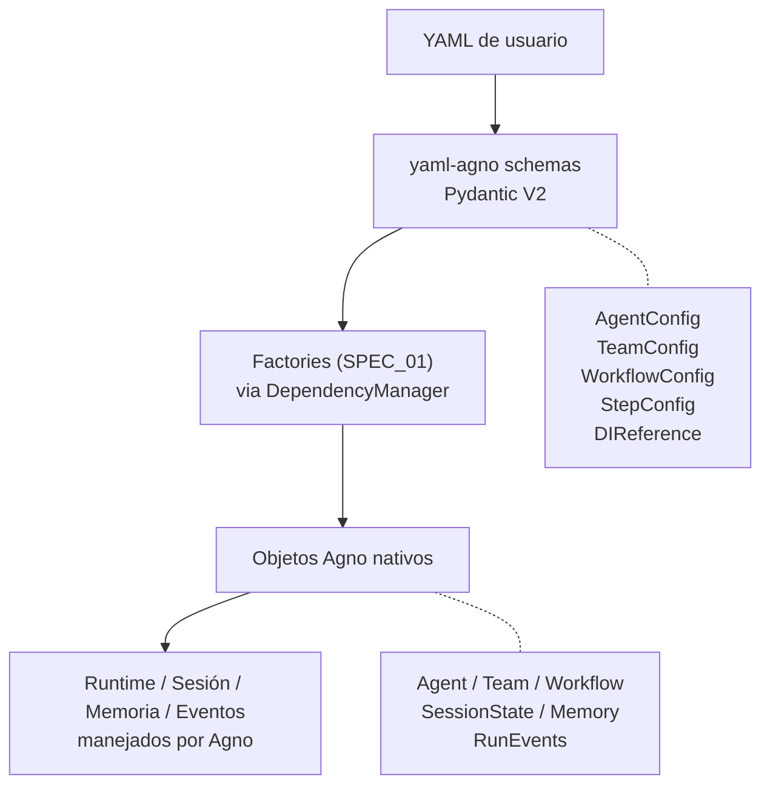

# SPEC_02_DOMAIN_MODEL

> **Propósito**: Declarar los **schemas de configuración YAML** (Pydantic V2) que constituyen el único modelo de datos propio de yaml-agno: `AgentConfig`, `TeamConfig`, `WorkflowConfig`, `StepConfig` y el value object `DIReference` (sintaxis `${provider.key}` propia de yaml-agno).

> **@ai-directive (alcance del modelo propio de yaml-agno)**: yaml-agno **no tiene** su propio modelo de runtime, sesión, memoria ni eventos. Esos los maneja **Agno nativamente** (principio "Build ON TOP" de SPEC_00). El único modelo propio son los **schemas que validan el YAML de configuración** antes de pasarlo a los factories (SPEC_01). Todo lo que aquí se define es **un único lugar de verdad** para la forma de los YAML; ninguna otra parte del código redefine estos schemas, enums ni constantes (principio DRY, ver SPEC_01 §1.3 DependencyManager y §1.2 mapeo de parámetros).

> **@ai-directive (enums y constantes de Agno)**: los enums/constantes que ya define Agno (ej. `TeamMode`, tipos de storage) **se referencian importándolos de Agno**, no se redefinen en yaml-agno. Así yaml-agno evoluciona con Agno sin desincronizarse. Solo se define en yaml-agno lo que es **sintaxis propia** y no existe en Agno (ej. `DIReference`).

---

## 1. ALCANCE DEL MODELO

### 1.1 Qué define yaml-agno vs qué delega a Agno



### 1.2 Principios del modelo

- **Single source of truth**: cada schema se define **una sola vez** aquí. Factories (SPEC_01), persistencia (SPEC_03) y API (SPEC_06) **importan y reutilizan** estos schemas, nunca los redefinen.
- **Pydantic V2**: validación en frontera, type hints PEP 695, `field_validator`, `model_config`.
- **Enums de Agno referenciados**: se importan de Agno, no se duplican.
- **Solo sintaxis propia**: yaml-agno define exclusivamente lo que Agno no tiene (sintaxis `${provider.key}`, la forma del YAML). No inventa runtime/session/memory/events propios.

### 1.3 Schema: AgentConfig

**Responsabilidad**: Validar la configuración de un agente declarada en YAML (la raíz `agent:` del archivo).

```python
# yaml-agno/src/models/config/agent_config.py
"""Agent configuration schema (YAML root: agent). Single source of truth for the
agent YAML shape. Enums and provider resolution are delegated to Agno and to the
DependencyManager (SPEC_01); this module only defines the YAML schema and validates
syntax that is OWN to yaml-agno (e.g. the DIReference syntax)."""

import re
from typing import Any
from pydantic import BaseModel, ConfigDict, Field, field_validator

# @ai-directive: type aliases PEP 695 for readability. These are the ONLY type
# aliases; reused everywhere, never redefined.
type Instructions = str
type ModelReference = str
type ToolConfig = dict[str, Any]
type Tag = str


class AgentConfig(BaseModel):
    """Schema for the ``agent:`` YAML root.

    Validates the declarative configuration of a single Agno agent before the
    AgentFactory (SPEC_01) resolves providers via the DependencyManager and builds
    the native ``agno.Agent``.

    Invariants enforced at the boundary:
        - ``name`` is non-empty and uses only safe characters.
        - ``model`` follows the ``provider/id`` string format (Agno model-as-string).

    Note:
        - Provider and model resolution is delegated to the DependencyManager
          (SPEC_01 §1.3) and the Agno model factory (SPEC_14). This schema does
          NOT enumerate providers (Agno already does) to avoid duplication.
        - Nested config blocks (tools, knowledge, memory, session, reasoning,
          skills, human_review, culture, persistence) are validated by their own
          schemas in dedicated SPECs (11/10/04/03+13/28/29/30/31) and are
          referenced here as opaque dicts consumed by the factory. AgentConfig is
          the aggregate that names these slots; it does NOT enumerate their
          internals (DRY/SSOT).
    """

    model_config = ConfigDict(extra="forbid")

    # Identity
    name: str = Field(..., min_length=1, max_length=100, description="Unique agent name.")
    model: ModelReference = Field(..., description="Model as string 'provider/id' (e.g. openai/gpt-4o). See SPEC_14.")

    # Behavior
    instructions: Instructions | None = Field(None, max_length=50000, description="System prompt.")
    description: str | None = Field(None, description="Human-readable description.")

    # Delegated sub-systems (opaque dicts; built by dedicated factories, see SPEC_01 §1.2)
    tools: list[ToolConfig] = Field(default_factory=list, max_length=50, description="Tools config. See SPEC_11.")
    knowledge: dict[str, Any] | None = Field(None, description="Knowledge/RAG config. See SPEC_10.")
    memory: dict[str, Any] | None = Field(None, description="Memory config. See SPEC_04.")
    session: dict[str, Any] | None = Field(None, description="Session/storage config. See SPEC_03 + SPEC_13.")

    # @ai-directive: Each slot below is an OPAQUE dict validated by its owner SPEC
    # (SSOT per feature); AgentConfig is the aggregate that REFERENCES them, it does
    # NOT enumerate the feature internals (DRY/SSOT regla 9). This keeps extra="forbid"
    # consistent: every Agno feature surfaced in YAML has a named slot here, so no
    # feature needs to leak through `extra`.
    reasoning: dict[str, Any] | None = Field(None, description="Reasoning/chain-of-thought config. See SPEC_28.")
    skills: dict[str, Any] | None = Field(None, description="Agent skills config. See SPEC_30.")
    human_review: dict[str, Any] | None = Field(None, description="Human-in-the-loop review config. See SPEC_29.")
    culture: dict[str, Any] | None = Field(None, description="Culture/locale/persona config. See SPEC_31.")
    persistence: dict[str, Any] | None = Field(None, description="Persistence config. See SPEC_03.")

    # Organization
    tags: list[Tag] = Field(default_factory=list, max_length=20, description="Tags for organization.")
    metadata: dict[str, Any] = Field(default_factory=dict, description="Free-form metadata.")

    @field_validator("name")
    @classmethod
    def validate_name_characters(cls, v: str) -> str:
        """Ensure the name only contains safe characters.

        Args:
            v: The candidate agent name.

        Returns:
            The validated name.

        Raises:
            ValueError: If the name contains characters outside [A-Za-z0-9_-].
        """
        if not re.match(r"^[A-Za-z0-9_-]+$", v):
            raise ValueError(
                f"Invalid agent name: {v}. Only alphanumeric, underscore and hyphen allowed."
            )
        return v

    @field_validator("model")
    @classmethod
    def validate_model_format(cls, v: str) -> str:
        """Ensure the model follows the 'provider/id' string format.

        Only the SYNTAX is validated here; whether the provider is known is
        resolved later by the DependencyManager against the Agno registry.

        Args:
            v: The candidate model reference.

        Returns:
            The validated reference.

        Raises:
            ValueError: If the reference is not 'provider/id'.
        """
        if "/" not in v:
            raise ValueError(f"Invalid model format: {v}. Expected 'provider/id'.")
        provider, _, model_id = v.partition("/")
        if not provider or not model_id:
            raise ValueError(f"Invalid model format: {v}. Expected 'provider/id'.")
        return v
```

### 1.4 Schema: TeamConfig

**Responsabilidad**: Validar la configuración de un equipo (la raíz `team:` del YAML).

```python
# yaml-agno/src/models/config/team_config.py
"""Team configuration schema (YAML root: team). Single source of truth for the
team YAML shape. TeamMode is imported from Agno (not redefined) so yaml-agno
evolves with Agno."""

from typing import Any
from pydantic import BaseModel, ConfigDict, Field, field_validator, model_validator

# @ai-directive: TeamMode is Agno's enum (agno/team/mode.py). IMPORTED, never redefined.
# If Agno adds/renames a mode, yaml-agno inherits it with zero code changes.
from agno.team.mode import TeamMode


class TeamMemberConfig(BaseModel):
    """Schema for one member entry in a team YAML."""

    member: str = Field(..., description="Unique member id within the team.")
    agent: str = Field(..., description="Name of the referenced AgentConfig.")
    role: str | None = Field(None, description="Role of the member in the team.")


class TeamConfig(BaseModel):
    """Schema for the ``team:`` YAML root.

    Validates the declarative configuration of an Agno team before the
    TeamFactory (SPEC_01) builds the native ``agno.Team``.

    Invariants enforced at the boundary:
        - ``name`` is non-empty.
        - ``mode`` is a valid ``agno.team.TeamMode`` value.
        - member ids are unique.
        - mode-specific minimum member counts hold (route/broadcast need >= 2).

    Note:
        - The native ``TeamMode`` enum is imported from Agno; Pydantic validates the
          YAML value against the enum members automatically.
    """

    model_config = ConfigDict(extra="forbid")

    # Identity
    name: str = Field(..., min_length=1, max_length=100, description="Unique team name.")
    mode: TeamMode = Field(default=TeamMode.coordinate, description="Team execution mode (Agno enum).")

    # Behavior
    instructions: str | None = Field(None, max_length=50000, description="Team system prompt.")

    # Composition
    members: list[TeamMemberConfig] = Field(default_factory=list, description="Team members.")

    # Delegated
    workflows: list[dict[str, Any]] = Field(default_factory=list, description="Workflows. See SPEC_01 §4.")

    # Organization
    description: str | None = None
    tags: list[str] = Field(default_factory=list, max_length=20)
    metadata: dict[str, Any] = Field(default_factory=dict)

    @field_validator("members")
    @classmethod
    def validate_members_unique(cls, v: list[TeamMemberConfig]) -> list[TeamMemberConfig]:
        """Ensure member ids are unique within the team.

        Args:
            v: The list of member configs.

        Returns:
            The validated list.

        Raises:
            ValueError: If duplicate member ids are detected.
        """
        member_ids = [m.member for m in v]
        if len(member_ids) != len(set(member_ids)):
            raise ValueError("Duplicate member ids detected.")
        return v

    @model_validator(mode="after")
    def validate_mode_requirements(self) -> "TeamConfig":
        """Enforce mode-specific minimum member counts.

        Returns:
            The validated config (self).

        Raises:
            ValueError: If route/broadcast modes have fewer than 2 members.
        """
        n = len(self.members)
        if self.mode in (TeamMode.route, TeamMode.broadcast) and n < 2:
            raise ValueError(f"{self.mode.value} mode requires at least 2 members.")
        return self
```

### 1.5 Schema: WorkflowConfig

**Responsabilidad**: Validar la configuración de un workflow (la raíz `workflow:` del YAML), incluyendo las primitivas de Agno.

> **@ai-directive (StepConfig es una abstracción YAML, NO un mapeo 1:1 a Agno)**:
> Agno modela los componentes de workflow como clases separadas: `Step`, `Condition`,
> `Router`, `Loop`, `Parallel`, `Steps` (cada uno con su propio constructor en
> `agno/workflow/`). yaml-agno los unifica en un **único `StepConfig`** discriminado
> por el campo `type` (valor del enum `agno.workflow.types.StepType`). El
> `WorkflowFactory` (SPEC_01 §4) traduce cada `StepConfig` al componente Agno correcto:
>
> | Campo StepConfig (yaml-agno)   | Componente Agno y campo nativo                              |
> | ------------------------------- | ---------------------------------------------------------- |
> | `type`                          | `StepType` enum (importado, no redefinido)                  |
> | `agent`/`team`/`workflow`       | `Step(agent=...)` / `Step(team=...)` / `Step(workflow=...)` |
> | `function`                      | `Step(executor=...)` — Agno llama `executor`, yaml-agno `function` |
> | `steps`                         | `Parallel(*steps)` / `Steps(steps=...)` / `Condition(steps=...)` |
> | `condition`                     | `Condition(evaluator=...)` — str CEL o callable             |
> | `if_true`/`if_false`            | ramas `steps`/`else_steps` de `Condition` (yaml-agno nombra el paso destino; el factory resuelve el paso Agno) |
> | `expression`                    | `Router(selector=...)` — str CEL                            |
> | `cases`                         | `Router(choices=...)` + mapeo valor→paso                    |
> | `max_iterations`/`end_condition`| `Loop(max_iterations=...)` / `Loop(end_condition=...)`      |
> | `human_review`                  | `HumanReview(...)` de Agno (slot opaco, validado por SPEC_29) |
> | `execute`/`finally_`            | **propios de yaml-agno** (control de flujo del factory); NO existen en Agno |
>
> Esta tabla es normativa: si un campo StepConfig no aparece aquí como nativo de
> Agno, es una abstracción que el `WorkflowFactory` debe traducir. Verificar siempre
> contra el constructor Agno correspondiente antes de agregar campos nuevos.

```python
# yaml-agno/src/models/config/workflow_config.py
"""Workflow configuration schema (YAML root: workflow). Single source of truth for
the workflow YAML shape. StepType is imported from Agno (not redefined)."""

from typing import Any
from pydantic import BaseModel, ConfigDict, Field, field_validator, model_validator

# @ai-directive: StepType is Agno's enum (agno/workflow/types.py). IMPORTED, never
# redefined. Its values are capitalized ("Function", "Step", "Steps", "Loop",
# "Parallel", "Condition", "Router", "Workflow"). The YAML must use those values.
from agno.workflow.types import StepType


class StepConfig(BaseModel):
    """Schema for one step entry in a workflow YAML.

    The YAML ``type`` value must match an ``agno.workflow.types.StepType`` member.
    Step-specific fields are validated against the step type.

    Note:
        - This schema is a yaml-agno abstraction that UNIFIES the distinct Agno
          workflow components (Step, Condition, Router, Loop, Parallel, Steps)
          into one shape discriminated by ``type``. The WorkflowFactory (SPEC_01
          §4) translates each StepConfig into the corresponding Agno component;
          the field-name mapping is normative (see the @ai-directive table above
          this code block). Fields not native to Agno (e.g. ``execute``,
          ``finally_``, ``function``, ``condition``, ``if_true``, ``if_false``,
          ``expression``, ``cases``) are yaml-agno YAML syntax translated by the
          factory and MUST NOT be assumed to exist on Agno constructors.
    """

    model_config = ConfigDict(extra="forbid")

    step: str = Field(..., description="Unique step id within the workflow.")
    type: StepType = Field(default=StepType.STEP, description="Agno StepType (capitalized value).")
    description: str | None = None

    # Executor reference (used by Step/Steps/workflow-function executors).
    # @ai-directive: Agno's Step calls this `executor`; yaml-agno surfaces it as
    # `function` in YAML and the WorkflowFactory maps it to Step(executor=...).
    agent: str | None = Field(None, description="Referenced AgentConfig name (executor).")
    team: str | None = Field(None, description="Referenced TeamConfig name (executor).")
    function: str | None = Field(None, description="Callable reference (maps to Agno Step executor).")
    workflow: str | None = Field(None, description="Nested workflow name (workflow executor).")

    # Execution control — yaml-agno own syntax (NOT Agno native). The
    # WorkflowFactory honors `execute=False` to skip and `finally_=True` to mark
    # a cleanup step; Agno has no equivalent fields on Step.
    execute: bool = Field(default=True, description="Enable/disable the step (yaml-agno own).")
    finally_: bool = Field(default=False, alias="finally", description="Run always as cleanup (yaml-agno own).")

    # Human-in-the-loop review gate for this step (SPEC_29 workflow HITL).
    # @ai-directive: opaque dict; the owner SPEC (29) validates its internals.
    # Referenced as StepConfig.human_review by the workflow executor to pause for
    # human approval before/after the step runs.
    human_review: dict[str, Any] | None = Field(None, description="Per-step human-review gate config. See SPEC_29.")

    # Type-specific fields (yaml-agno abstraction; the WorkflowFactory maps each
    # to the corresponding Agno component field — see the @ai-directive table).
    steps: list[dict[str, Any]] = Field(default_factory=list, description="Nested steps (Parallel/Steps/Condition).")
    condition: str | None = Field(None, description="CEL or callable expression (maps to Agno Condition.evaluator).")
    if_true: str | None = Field(None, description="Step id when condition is true (Agno Condition steps branch).")
    if_false: str | None = Field(None, description="Step id when condition is false (Agno Condition else_steps branch).")
    expression: str | None = Field(None, description="CEL expression (maps to Agno Router.selector).")
    cases: dict[str, str] = Field(default_factory=dict, description="value -> step id (maps to Agno Router.choices).")
    end_condition: str | None = Field(None, description="Loop end condition (maps to Agno Loop.end_condition).")
    max_iterations: int | None = Field(None, ge=1, description="Loop max iterations (maps to Agno Loop.max_iterations).")

    @model_validator(mode="after")
    def validate_type_specific_fields(self) -> "StepConfig":
        """Ensure type-specific fields are only set for the matching step type.

        Returns:
            The validated step (self).

        Raises:
            ValueError: If a type-specific field is set on an incompatible type
                (e.g. nested steps on a non-Parallel/Steps/Condition type,
                router fields on a Loop, loop fields on a Router, etc.).
        """
        t = self.type
        # Nested steps apply to Parallel, Steps and Condition (Condition wraps
        # steps/else_steps in Agno).
        if self.steps and t not in (StepType.PARALLEL, StepType.STEPS, StepType.CONDITION):
            raise ValueError("Nested steps only allowed for Parallel/Steps/Condition types.")
        # Condition-only fields.
        if any(v is not None for v in (self.condition, self.if_true, self.if_false)) and t != StepType.CONDITION:
            raise ValueError("condition/if_true/if_false only allowed for Condition type.")
        # Router-only fields.
        if (self.expression is not None or self.cases) and t != StepType.ROUTER:
            raise ValueError("expression/cases only allowed for Router type.")
        # Loop-only fields.
        if (self.end_condition is not None or self.max_iterations is not None) and t != StepType.LOOP:
            raise ValueError("end_condition/max_iterations only allowed for Loop type.")
        return self


class WorkflowConfig(BaseModel):
    """Schema for the ``workflow:`` YAML root.

    Validates the declarative configuration of an Agno workflow before the
    WorkflowFactory (SPEC_01 §4) builds the native ``agno.Workflow``.

    Invariants enforced at the boundary:
        - ``name`` is non-empty.
        - step ids are unique.
        - branch references (if_true/if_false/cases) point to existing step ids.
    """

    model_config = ConfigDict(extra="forbid")

    name: str = Field(..., min_length=1, max_length=100, description="Unique workflow name.")
    description: str | None = None
    steps: list[StepConfig] = Field(..., min_length=1, description="Workflow steps.")
    metadata: dict[str, Any] = Field(default_factory=dict)

    @model_validator(mode="after")
    def validate_steps_integrity(self) -> "WorkflowConfig":
        """Ensure step ids are unique and branch references are valid.

        Returns:
            The validated workflow (self).

        Raises:
            ValueError: On duplicate step ids or dangling branch references.
        """
        step_ids = [s.step for s in self.steps]
        if len(step_ids) != len(set(step_ids)):
            raise ValueError("Duplicate step ids detected in workflow.")
        valid = set(step_ids)
        for s in self.steps:
            for ref in (s.if_true, s.if_false, *s.cases.values()):
                if ref and ref not in valid:
                    raise ValueError(f"Branch references non-existent step: {ref}")
        return self
```

---

## 2. VALUE OBJECT: DIReference

**Responsabilidad**: Validar la sintaxis propia de yaml-agno para inyección de dependencias (`${provider.key}`) dentro de los valores del YAML. Es el **único** value object del modelo, porque esa sintaxis **no existe en Agno** (es propia de yaml-agno).

```python
# yaml-agno/src/models/value_objects/di_reference.py
"""DIReference value object. Validates the OWN yaml-agno syntax `${provider.key}`
used to inject dynamic values into YAML fields. This syntax does not exist in
Agno, so it is the single value object defined by yaml-agno."""

import re
from typing import Any
from pydantic import BaseModel, ConfigDict, Field, field_validator


class DIReference(BaseModel):
    """Value object for a yaml-agno dependency-injection reference.

    Represents a string containing one or more `${provider.key}` templates that
    are resolved at runtime by the DIFactory (SPEC_00 DI System) against the
    configured providers (database, env, api, file).

    Invariant:
        - ``template`` contains at least one well-formed `${provider.key}` token.

    Attributes:
        template: The raw string with `${provider.key}` tokens.

    Example:
        >>> ref = DIReference(template="Hello ${user_db.name}")
        >>> ref.tokens
        [('user_db', 'name')]
        >>> ref.resolve({"user_db.name": "Alice"})
        'Hello Alice'
    """

    model_config = ConfigDict(frozen=True)

    template: str = Field(..., description="String with ${provider.key} tokens.")

    @field_validator("template")
    @classmethod
    def validate_format(cls, v: str) -> str:
        """Ensure the template contains at least one ${provider.key} token.

        Args:
            v: The candidate template string.

        Returns:
            The validated template.

        Raises:
            ValueError: If no well-formed ${provider.key} token is present.
        """
        if not re.search(r"\$\{[a-z_]+(\.[a-z0-9_]+)*\}", v):
            raise ValueError(f"Invalid DI reference format: {v}. Expected ${{provider.key}}.")
        return v

    @property
    def tokens(self) -> list[tuple[str, str]]:
        """Extract all (provider, key) tokens found in the template.

        Returns:
            A list of (provider, full_key) tuples, in order of appearance.
        """
        return [
            (m.group(1), m.group(2))
            for m in re.finditer(r"\$\{([a-z_]+)\.([a-z0-9_.]+)\}", self.template)
        ]

    def resolve(self, resolved_values: dict[str, Any]) -> str:
        """Replace every ${provider.key} token with its resolved value.

        Args:
            resolved_values: Mapping of "provider.key" -> resolved value.

        Returns:
            The template with all tokens substituted by their string values.

        Raises:
            KeyError: If a token has no resolved value.
        """
        out = self.template
        for provider, key in self.tokens:
            full_key = f"{provider}.{key}"
            if full_key not in resolved_values:
                raise KeyError(f"Unresolved DI reference: ${{{full_key}}}")
            out = out.replace(f"${{{full_key}}}", str(resolved_values[full_key]))
        return out
```

> **@ai-directive (por qué DIReference sí es propio)**: a diferencia de `ModelId` o `SessionKey` (que duplicaban conceptos que Agno ya maneja como strings / `user_id`+`session_id`), la sintaxis `${provider.key}` es **invención de yaml-agno** (no existe en Agno). Por eso se modela como value object con validación propia. La resolución de los valores la hace el DIFactory (SPEC_00 DI System).

---

## 3. BEHAVIOR DELTA - BDD SCENARIOS

### 3.1 Escenarios de Aceptacion

#### Scenario 1: Golden Path - AgentConfig Validation

```gherkin
GIVEN a YAML string with valid agent configuration
  """
  agent:
    name: "test_agent"
    model: "openai/gpt-4o"
    instructions: "You are helpful"
  """
WHEN the YAML is parsed and validated against AgentConfig
THEN an AgentConfig instance is created
AND config.name equals "test_agent"
AND config.model equals "openai/gpt-4o"
```

#### Scenario 2: Golden Path - TeamConfig with Members (mode from Agno enum)

```gherkin
GIVEN a YAML string with valid team configuration
  """
  team:
    name: "test_team"
    mode: coordinate
    members:
      - member: m1
        agent: agent1
      - member: m2
        agent: agent2
  """
WHEN the YAML is parsed and validated against TeamConfig
THEN a TeamConfig instance is created
AND config.mode equals TeamMode.coordinate (imported from agno.team)
AND config.members has exactly 2 items
AND all member ids are unique
```

#### Scenario 3: Error Case - Invalid Model Format (syntax only)

```gherkin
GIVEN a YAML string with an invalid model format
  """
  agent:
    name: "test"
    model: "invalid-format"
  """
WHEN the YAML is parsed and validated
THEN a ValidationError is raised
AND the error message mentions "Invalid model format"
```

#### Scenario 4: Error Case - Duplicate Step ids (Agno StepType)

```gherkin
GIVEN a YAML string with duplicate step ids
  """
  workflow:
    name: "test"
    steps:
      - step: step1
        type: Step
        agent: a1
      - step: step1
        type: Step
        agent: a2
  """
WHEN the YAML is parsed and validated
THEN a ValidationError is raised
AND the error message mentions "Duplicate step ids"
```

#### Scenario 5: Golden Path - DIReference token parsing

```gherkin
GIVEN a YAML field containing a DI template "Hello ${user_db.name}"
WHEN the field is parsed as a DIReference
THEN ref.tokens returns [("user_db", "name")]
AND ref.resolve({"user_db.name": "Alice"}) equals "Hello Alice"
```

---

## 4. TDD MICRO-TASK EXECUTION PROTOCOL

### 4.1 Protocolo de Ejecucion

1. **RED**: Escribir test que falla con implementacion vacia.
2. **GREEN**: Implementacion minima para pasar el test.
3. **REFACTOR**: Limpieza de codigo sin cambiar comportamiento.
4. **COMMIT**: Mensaje descriptivo del cambio (convencional).

### 4.2 Cascading Task Checklist

#### TASK_001: Define AgentConfig Schema

- **File**: `yaml-agno/src/models/config/agent_config.py`
- **Test**: `tests/unit/models/test_agent_config.py`
- **RED**:
  ```python
  def test_agent_config_creation():
      config = AgentConfig(name="test", model="openai/gpt-4o")
      assert config.name == "test"
      assert config.model == "openai/gpt-4o"
  ```
- **GREEN**: Implementar `AgentConfig` (Pydantic V2, `extra="forbid"`, validadores).
- **Commit**: `feat: add AgentConfig schema`

#### TASK_002: Add Model Format + Name Validation

- **File**: `yaml-agno/src/models/config/agent_config.py`
- **Test**: `tests/unit/models/test_agent_config.py`
- **RED**:
  ```python
  def test_invalid_model_format_raises_error():
      with pytest.raises(ValidationError):
          AgentConfig(name="test", model="no-slash")

  def test_invalid_name_raises_error():
      with pytest.raises(ValidationError):
          AgentConfig(name="bad name!", model="openai/gpt-4o")
  ```
- **GREEN**: Implementar `@field_validator("model")` y `@field_validator("name")`.
- **Commit**: `feat: add model format and name validation`

#### TASK_003: Define TeamConfig (with Agno TeamMode)

- **File**: `yaml-agno/src/models/config/team_config.py`
- **Test**: `tests/unit/models/test_team_config.py`
- **RED**:
  ```python
  def test_team_config_creation():
      config = TeamConfig(name="test", mode="coordinate")
      assert config.mode == TeamMode.coordinate  # imported from agno.team

  def test_invalid_mode_rejected():
      with pytest.raises(ValidationError):
          TeamConfig(name="test", mode="coroutine")  # not an Agno TeamMode
  ```
- **GREEN**: Implementar `TeamConfig` importando `TeamMode` de Agno (no redefinir).
- **Commit**: `feat: add TeamConfig with Agno TeamMode`

#### TASK_004: Add Member Uniqueness + Mode Requirements

- **File**: `yaml-agno/src/models/config/team_config.py`
- **Test**: `tests/unit/models/test_team_config.py`
- **RED**:
  ```python
  def test_duplicate_members_raise_error():
      with pytest.raises(ValidationError):
          TeamConfig(name="test", mode="coordinate", members=[
              TeamMemberConfig(member="m1", agent="a1"),
              TeamMemberConfig(member="m1", agent="a2"),
          ])

  def test_route_mode_requires_two_members():
      with pytest.raises(ValidationError):
          TeamConfig(name="test", mode="route", members=[
              TeamMemberConfig(member="m1", agent="a1"),
          ])
  ```
- **GREEN**: Implementar `validate_members_unique` y `validate_mode_requirements`.
- **Commit**: `feat: add member and mode validations`

#### TASK_005: Define WorkflowConfig + StepConfig (with Agno StepType)

- **File**: `yaml-agno/src/models/config/workflow_config.py`
- **Test**: `tests/unit/models/test_workflow_config.py`
- **RED**:
  ```python
  def test_workflow_config_creation():
      step = StepConfig(step="s1", type="Step", agent="a1")  # Agno StepType value
      config = WorkflowConfig(name="test", steps=[step])
      assert len(config.steps) == 1

  def test_duplicate_step_ids_raise_error():
      steps = [StepConfig(step="s1", type="Step", agent="a1"),
               StepConfig(step="s1", type="Step", agent="a2")]
      with pytest.raises(ValidationError):
          WorkflowConfig(name="test", steps=steps)
  ```
- **GREEN**: Implementar `WorkflowConfig` y `StepConfig` importando `StepType` de Agno.
- **Commit**: `feat: add WorkflowConfig with Agno StepType`

#### TASK_006: Add Branch Reference Validation

- **File**: `yaml-agno/src/models/config/workflow_config.py`
- **Test**: `tests/unit/models/test_workflow_config.py`
- **RED**:
  ```python
  def test_dangling_branch_reference_raises_error():
      steps = [
          StepConfig(step="s1", type="Condition", condition="${x}", if_true="missing"),
          StepConfig(step="s2", type="Step", agent="a1"),
      ]
      with pytest.raises(ValidationError):
          WorkflowConfig(name="test", steps=steps)
  ```
- **GREEN**: Implementar `validate_steps_integrity` (ids unicos + refs validas).
- **Commit**: `feat: add step branch reference validation`

#### TASK_007: Define DIReference Value Object

- **File**: `yaml-agno/src/models/value_objects/di_reference.py`
- **Test**: `tests/unit/value_objects/test_di_reference.py`
- **RED**:
  ```python
  def test_di_reference_tokens():
      ref = DIReference(template="Hello ${user_db.name}")
      assert ref.tokens == [("user_db", "name")]

  def test_di_reference_resolve():
      ref = DIReference(template="${user_db.name}")
      assert ref.resolve({"user_db.name": "Alice"}) == "Alice"

  def test_invalid_di_format_raises_error():
      with pytest.raises(ValidationError):
          DIReference(template="no-token-here")
  ```
- **GREEN**: Implementar `DIReference` (frozen, validacion de formato, `tokens`, `resolve`).
- **Commit**: `feat: add DIReference value object`

---

## 5. SUPUESTOS TECNICOS ADOPTADOS

### [Decision 1] Pydantic V2 para los schemas de YAML

**Justificacion**: Pydantic V2 ofrece validacion de runtime 5-10x mas rapida que V1, type hints nativos de Python 3.12, y `field_validator`/`model_validator` para validacion compleja de YAML.

### [Decision 2] Enums y constantes referenciados de Agno (no duplicados)

**Justificacion**: `TeamMode`, `StepType` y demas enums se importan directamente de Agno. Asi yaml-agno evoluciona con Agno (si Agno agrega/renombra un valor, yaml-agno lo hereda sin tocar codigo) y se evita la desincronizacion que produce duplicarlos.

### [Decision 3] Single source of truth: los schemas se definen una sola vez aqui

**Justificacion**: factories (SPEC_01), persistencia (SPEC_03) y API (SPEC_06) **importan** estos schemas, no los redefinen. Cambiar la forma de un YAML se hace en un unico lugar, evitando el error de tener que modificar la misma variable en varias partes del codigo.

### [Decision 4] Sin modelo de runtime/sesion/memoria/eventos propio

**Justificacion**: esos los maneja Agno nativamente (principio "Build ON TOP" de SPEC_00). yaml-agno solo define los schemas que validan el YAML y el value object de su sintaxis propia (`DIReference`). Inventar entidades de runtime propias duplicaria Agno y generaria deuda tecnica.

### [Decision 5] DIReference como unico value object (frozen=True)

**Justificacion**: la sintaxis `${provider.key}` no existe en Agno (es propia de yaml-agno), por lo que se modela con validacion propia e inmutable (`frozen=True`). Los demas value objects (`ModelId`, `SessionKey`) se eliminan porque duplican conceptos que Agno ya maneja como strings.

### [Decision 6] StepConfig unifica los componentes de workflow de Agno

**Justificacion**: Agno modela los componentes de workflow como clases separadas con constructores propios (`Step`, `Condition`, `Router`, `Loop`, `Parallel`, `Steps` en `agno/workflow/`). yaml-agno los unifica en un unico `StepConfig` discriminado por `type` para ofrecer una sintaxis YAML mas simple. El `WorkflowFactory` (SPEC_01 §4) traduce cada `StepConfig` al componente Agno correcto. Los campos de `StepConfig` que no existen en Agno (`execute`, `finally_`, `condition`, `if_true`, `if_false`, `expression`, `cases`) son **abstracciones de yaml-agno** y se documentan como tales en la tabla @ai-directive de la seccion 1.5. Esto evita la trampa de asumir que mapean 1:1 con constructores Agno.

---

*Deseas profundizar la especificacion tecnica al **Nivel 6** de algun componente especifico o autorizar la ejecucion de estas tareas por parte del equipo de agentes?*
