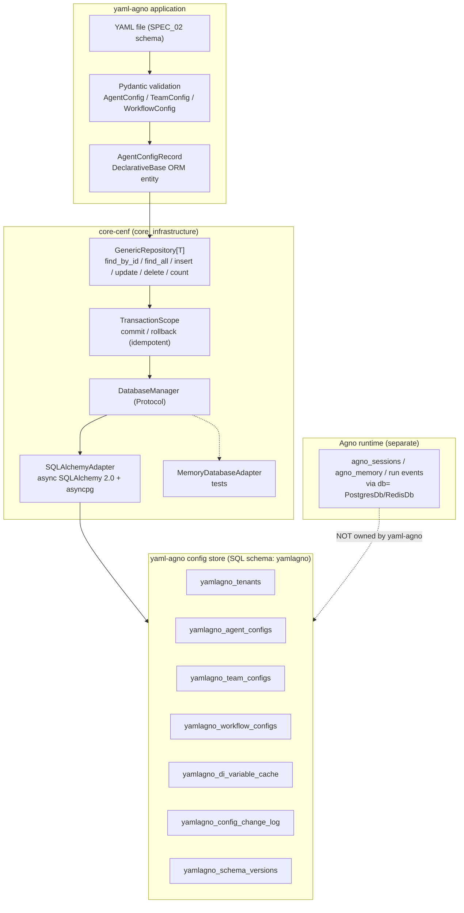

# SPEC_03_PERSISTENCE_ARCHITECTURE

> **Purpose**: Define the physical persistence schema of the **yaml-agno control-plane config store** and how it is built **on top of the core-cenf `DatabaseManager`**. Runtime persistence of agents/sessions/memory/run events is owned by Agno (in `agno_*`); yaml-agno does not persist runtime state. yaml-agno only persists declarative configs (tenants, `*_configs`, DI cache, audit) and consumes the core-cenf transaction/repository abstractions instead of reimplementing them.

---

## 1. PERSISTENCE STRATEGY AND BOUNDARY

### 1.1 Three-layer frontier (no overlap)

| Layer | Owner | Tables | What it stores |
|-------|-------|--------|----------------|
| **core-cenf DatabaseManager** | `core_infrastructure` package | (none of its own) | Async SQLAlchemy 2.0 engine, `TransactionScope`, `GenericRepository[T]`. yaml-agno depends on the **Protocol**, never on the concrete adapter. |
| **yaml-agno config store** | this SPEC | `yamlagno_*` (dedicated SQL schema) | Tenants, `agent/team/workflow_configs`, `di_variable_cache`, `config_change_log`, `yamlagno_schema_versions`. Declarative ORM (`DeclarativeBase`) required by the core adapter. |
| **Agno runtime** | Agno framework | `agno_*` (its own schema) | Sessions (`agno_sessions`), memory, run events, evals, metrics, schedules. Provisioned by Agno via `db=` / `auto_provision_dbs`. |

> **@ai-directive (no reimplementation)**: SPEC_03 does **not** define a `TransactionManager`, a `BaseRepository`, or raw `AsyncSession` usage. yaml-agno calls `async with db.transaction() as tx:` and `db.get_repository(EntityType)` from core-cenf. The only thing this SPEC defines is **ORM models** (the `DeclarativeBase` entities the generic repository operates on) and the **schema lifecycle** (auto-provisioning). Everything else is consumed from `core_infrastructure`.

### 1.2 Storage architecture (mermaid)



> **@ai-directive**: `db.get_repository(T)` MUST be called **inside** `async with db.transaction()` because the core `SQLAlchemyAdapter` binds the session to a contextvar. The repository is obtained per-transaction; it is not a long-lived singleton.

### 1.3 Data-to-storage mapping (config store only)

| Data type | Primary storage | Backup | Retention | Justification |
|-----------|-----------------|--------|-----------|----------------|
| Tenant metadata | `yamlagno_tenants` | Git | Permanent | Identity root for the config store |
| Agent / Team / Workflow configs | `yamlagno_*_configs` | Git (YAML) | Permanent | Config store; JSONB validated against SPEC_02 |
| DI variable cache | `yamlagno_di_variable_cache` | Source DB/API | TTL (1h default) | Cached resolved values with expiry |
| Config audit log | `yamlagno_config_change_log` | S3 archive (future) | `retention_days` (future) | Mutable/append-heavy; compacted eventually |
| Schema version tracking | `yamlagno_schema_versions` | - | Permanent | Auto-provisioning bookkeeping |

> Runtime data (sessions, messages, memory, run events) is NOT mapped here. It lives in `agno_*`, owned by Agno. yaml-agno does not retain, mirror or partition it.

---

## 2. ENVIRONMENT vs EXECUTION VARIABLES

> **@ai-directive (variable classification rule)**: Every configuration knob belongs to exactly one of two classes. **Environment** knobs describe *where and how the process runs* (resolved at bootstrap via `ConfigManager`/`SecretManager` from `core_infrastructure`, never read directly from `os.environ`). **Execution** knobs describe *operational behavior of running agents* and are themselves persisted **in the config store** (DB rows), not in environment variables.

| Variable (config key) | Class | Resolved via | Scope | Notes |
|-----------------------|-------|--------------|-------|-------|
| `database.dsn` | **Environment** | `config.get_string` / `SecretManager` | Process | Postgres async DSN consumed by `SQLAlchemyAdapter` |
| `database.pool_size`, `database.max_overflow` | **Environment** | `config.get_number` | Process | Engine pool tuning |
| `app.env` (dev/staging/prod) | **Environment** | `config.get_string` | Process | Selects adapter, gates dotenv secret adapter |
| `log.level` | **Environment** | `config.get_string` | Process | Forwarded to core logging |
| `tenant.resolution_mode` | **Environment** | `config.get_string` | Process | `org` / `org_user_roles` / `user` (§5); selects which tenant-hierarchy level config rows scope to. The composite user_id itself is built by resolve_user_id() (SPEC_04); this knob only selects scoping, not identity. |
| `secrets.*` (DB password, vault token) | **Environment** | `SecretManager.get_secret` | Process | Never in env vars; Zero-Trust |
| `configstore.auto_provision` | **Environment** | `config.get_bool` | Process | `true` (default) = `checkfirst` create; `false` = managed schema (§6) |
| `configstore.schema` | **Environment** | `config.get_string` | Process | SQL schema name (`yamlagno`); separate from Agno's |
| `configstore.replication_mode` | **Environment** | `config.get_string` | Process | `sync` (default) / `async`; see §9 |
| `configstore.retention_days` | **Environment** | `config.get_int` | Process | Future: drop partitions older than N days (§8) |
| Agent/team/workflow YAML configs | **Execution** | DB rows (`yamlagno_*_configs`) | Per-tenant | Persisted JSONB; the actual agent behavior |
| `is_active` flag on a config | **Execution** | DB column | Per-row | Enable/disable a config without deleting |
| DI cache TTL per provider | **Execution** | `yamlagno_di_variable_cache.expires_at` | Per-row | Cached value lifetime |
| `tags` / `metadata` on a config | **Execution** | DB columns | Per-row | Organization of persisted configs |

> **Rule**: a value that changes agent **behavior** (model, instructions, tools, retention of a specific agent's logs) is **Execution** and lives in the DB. A value that changes **how the process boots and connects** (DSN, env name, pool size, resolution mode) is **Environment** and lives in `ConfigManager`/`SecretManager`.

---

## 3. SCHEMA: config-store tables (DeclarativeBase)

> **@ai-directive (declarative ORM is mandatory)**: The core `SQLAlchemyAdapter` requires entities to be `DeclarativeBase` subclasses (SQLAlchemy 2.0 ORM). This differs from Agno, which builds its `agno_*` tables with **SQLAlchemy Core** (raw `Table` + dicts). yaml-agno must use declarative ORM because it rides on the core adapter; do not attempt to mimic Agno's Core-only approach for these tables.

> **@ai-directive (prefix + schema)**: Every config-store table uses the prefix `yamlagno_` and lives in the dedicated SQL schema `yamlagno` — distinct from Agno's `agno_*` tables and schema. This prevents any collision when both stores share the same Postgres database. The prefix is the single source of truth for table names in repositories and auto-provisioning.

> **@ai-directive (SSOT for the JSONB payload)**: Each `*_configs` table has a `config_jsonb` column. That JSONB MUST validate against the corresponding Pydantic schema from **SPEC_02** (`AgentConfig` / `TeamConfig` / `WorkflowConfig`), which is **imported, never redefined** here. The ORM entity below is the **persistence record** (`AgentConfigRecord`), not the Pydantic `AgentConfig`. They are different objects by design.

### 3.1 Table: `yamlagno_tenants`

**Purpose**: Tenant metadata (organizations / direct users). Root identity for the config store and the anchor for multi-tenant isolation (§5).

```sql
-- SQL schema: yamlagno
CREATE TABLE yamlagno.yamlagno_tenants (
    id            UUID PRIMARY KEY DEFAULT gen_random_uuid(),
    name          VARCHAR(255) NOT NULL,
    slug          VARCHAR(100) NOT NULL UNIQUE,

    -- Multi-tenant model columns (§5); modeled from day 1, enforced post-MVP.
    tenant_kind   VARCHAR(20)  NOT NULL DEFAULT 'org',
        -- 'org' | 'org_user_roles' | 'user'
    parent_org_id UUID REFERENCES yamlagno.yamlagno_tenants(id) ON DELETE SET NULL,
    settings      JSONB        NOT NULL DEFAULT '{}',

    created_at    TIMESTAMPTZ  NOT NULL DEFAULT NOW(),
    updated_at    TIMESTAMPTZ  NOT NULL DEFAULT NOW(),

    CONSTRAINT slug_format      CHECK (slug ~ '^[a-z0-9-]+$'),
    CONSTRAINT valid_tenant_kind CHECK (tenant_kind IN ('org','org_user_roles','user')),
    -- An 'org' has no parent; 'org_user_roles'/'user' point to their parent org.
    -- @ai-directive: cycle prevention (A->B->A) cannot be expressed in a CHECK
    -- constraint; it MUST be validated at the application layer (TenantResolver /
    -- TenantService) before insert/update. The CHECK only enforces kind<->parent
    -- consistency, not acyclicity.
    CONSTRAINT org_has_no_parent CHECK (
        tenant_kind <> 'org' OR parent_org_id IS NULL
    )
);
CREATE INDEX idx_yamlagno_tenants_slug ON yamlagno.yamlagno_tenants(slug);
CREATE INDEX idx_yamlagno_tenants_parent ON yamlagno.yamlagno_tenants(parent_org_id);

**ORM model**:

```python
# yaml-agno/src/db/models/tenant.py
"""Tenant ORM entity for the yaml-agno config store (DeclarativeBase). Consumed by
core-cenf GenericRepository[TenantRecord]; yaml-agno does not manage its own session."""

from __future__ import annotations
from datetime import datetime
from typing import Any
from uuid import UUID, uuid4

from sqlalchemy import CheckConstraint, ForeignKey, String, text
from sqlalchemy.dialects.postgresql import JSONB, UUID as PgUUID
from sqlalchemy.orm import DeclarativeBase, Mapped, mapped_column


class Base(DeclarativeBase):
    """Shared declarative base for all yamlagno_ ORM entities."""


class TenantRecord(Base):
    """Persistence record for a tenant row (yamlagno_tenants).

    Attributes:
        id: Primary key (UUID v4).
        name: Human-readable tenant name.
        slug: URL-safe unique slug.
        tenant_kind: Multi-tenant strategy level (§5): org | org_user_roles | user.
        parent_org_id: Parent organization when tenant_kind is org_user_roles/user.
        settings: Free-form tenant settings JSONB.
    """

    __tablename__ = "yamlagno_tenants"
    __table_args__ = (
        CheckConstraint("slug ~ '^[a-z0-9-]+$'", name="slug_format"),
        CheckConstraint(
            "tenant_kind IN ('org','org_user_roles','user')", name="valid_tenant_kind"
        ),
        {"schema": "yamlagno"},
    )

    id: Mapped[UUID] = mapped_column(PgUUID(as_uuid=True), primary_key=True, default=uuid4)
    name: Mapped[str] = mapped_column(String(255), nullable=False)
    slug: Mapped[str] = mapped_column(String(100), nullable=False, unique=True)
    tenant_kind: Mapped[str] = mapped_column(String(20), nullable=False, default="org")
    parent_org_id: Mapped[UUID | None] = mapped_column(
        PgUUID(as_uuid=True), ForeignKey("yamlagno.yamlagno_tenants.id", ondelete="SET NULL"),
        nullable=True,
    )
    settings: Mapped[dict[str, Any]] = mapped_column(JSONB, nullable=False, default=dict)
    created_at: Mapped[datetime] = mapped_column(
        server_default=text("NOW()"), nullable=False,
    )
    updated_at: Mapped[datetime] = mapped_column(
        server_default=text("NOW()"), onupdate=text("NOW()"), nullable=False,
    )
```

**Example JSON row**:
```json
{
  "id": "8b1c...e4",
  "name": "CENF",
  "slug": "cenf",
  "tenant_kind": "org",
  "parent_org_id": null,
  "settings": {"plan": "internal", "default_model": "openai/gpt-4o"},
  "created_at": "2026-06-17T10:00:00Z",
  "updated_at": "2026-06-17T10:00:00Z"
}
```

**Illustrative query**:
```sql
-- Resolve a tenant row by slug for the TenantResolver (§5).
SELECT id, tenant_kind, parent_org_id, settings
FROM yamlagno.yamlagno_tenants
WHERE slug = :slug;
```

### 3.2 Table: `yamlagno_agent_configs`

**Purpose**: Persisted agent configurations per tenant. The `config_jsonb` payload validates against the Pydantic `AgentConfig` from SPEC_02 (SSOT, imported).

```sql
CREATE TABLE yamlagno.yamlagno_agent_configs (
    id            UUID PRIMARY KEY DEFAULT gen_random_uuid(),
    tenant_id     UUID NOT NULL REFERENCES yamlagno.yamlagno_tenants(id) ON DELETE CASCADE,

    name          VARCHAR(100) NOT NULL,
    version       INTEGER NOT NULL DEFAULT 1,

    config_yaml   TEXT   NOT NULL,
    config_jsonb  JSONB  NOT NULL,

    description   TEXT,
    tags          TEXT[] NOT NULL DEFAULT '{}',
    metadata      JSONB  NOT NULL DEFAULT '{}',

    created_at    TIMESTAMPTZ NOT NULL DEFAULT NOW(),
    updated_at    TIMESTAMPTZ NOT NULL DEFAULT NOW(),
    created_by    VARCHAR(255),

    is_active     BOOLEAN NOT NULL DEFAULT TRUE,

    CONSTRAINT ya_agent_tenant_name_unique UNIQUE (tenant_id, name),
    CONSTRAINT ya_agent_version_positive  CHECK (version >= 1)
);

CREATE INDEX idx_yamlagno_agent_configs_tenant_name
    ON yamlagno.yamlagno_agent_configs(tenant_id, name);
CREATE INDEX idx_yamlagno_agent_configs_tags
    ON yamlagno.yamlagno_agent_configs USING GIN(tags);
CREATE INDEX idx_yamlagno_agent_configs_active
    ON yamlagno.yamlagno_agent_configs(tenant_id, is_active);
```

**ORM model** (excerpt; same `Base` as §3.1):

```python
# yaml-agno/src/db/models/agent_config.py
"""AgentConfigRecord ORM entity. config_jsonb validates against the Pydantic
AgentConfig (SPEC_02, imported). This is the persistence row, NOT the schema."""

from __future__ import annotations
from datetime import datetime
from typing import Any
from uuid import UUID, uuid4

from sqlalchemy import ARRAY, Boolean, CheckConstraint, ForeignKey, Integer, String, text
from sqlalchemy.dialects.postgresql import JSONB, UUID as PgUUID
from sqlalchemy.orm import Mapped, mapped_column

from yaml_agno.db.models.tenant import Base


class AgentConfigRecord(Base):
    """Persistence record for yamlagno_agent_configs.

    The Pydantic ``AgentConfig`` (SPEC_02) is the validator for ``config_jsonb``;
    this class only maps the row. Do not duplicate schema fields here.
    """

    __tablename__ = "yamlagno_agent_configs"
    __table_args__ = (
        CheckConstraint("version >= 1", name="ya_agent_version_positive"),
        {"schema": "yamlagno"},
    )

    id: Mapped[UUID] = mapped_column(PgUUID(as_uuid=True), primary_key=True, default=uuid4)
    tenant_id: Mapped[UUID] = mapped_column(
        PgUUID(as_uuid=True),
        ForeignKey("yamlagno.yamlagno_tenants.id", ondelete="CASCADE"),
        nullable=False,
    )
    name: Mapped[str] = mapped_column(String(100), nullable=False)
    version: Mapped[int] = mapped_column(Integer, nullable=False, default=1)
    config_yaml: Mapped[str] = mapped_column(nullable=False)
    config_jsonb: Mapped[dict[str, Any]] = mapped_column(JSONB, nullable=False)
    description: Mapped[str | None] = mapped_column(default=None)
    tags: Mapped[list[str]] = mapped_column(ARRAY(String), nullable=False, default=list)
    # @ai-directive: the Python attribute is `metadata_` (trailing underscore) because
    # `metadata` collides with DeclarativeBase.metadata (the SQLAlchemy MetaData). The
    # underlying column is named `metadata`. Access config metadata via record.metadata_,
    # NEVER via record.metadata (that returns the ORM MetaData, not the JSONB payload).
    metadata_: Mapped[dict[str, Any]] = mapped_column("metadata", JSONB, nullable=False, default=dict)
    created_at: Mapped[datetime] = mapped_column(server_default=text("NOW()"), nullable=False)
    updated_at: Mapped[datetime] = mapped_column(
        server_default=text("NOW()"), onupdate=text("NOW()"), nullable=False,
    )
    created_by: Mapped[str | None] = mapped_column(String(255), default=None)
    is_active: Mapped[bool] = mapped_column(Boolean, nullable=False, default=True)
```

**Example JSON row** (`config_jsonb` payload validates against `AgentConfig`):
```json
{
  "id": "a1f...c2",
  "tenant_id": "8b1c...e4",
  "name": "facturacion_afip",
  "version": 1,
  "config_yaml": "agent:\n  name: facturacion_afip\n  model: openai/gpt-4o\n",
  "config_jsonb": {"agent": {"name": "facturacion_afip", "model": "openai/gpt-4o"}},
  "tags": ["fiscal", "afip"],
  "is_active": true,
  "created_at": "2026-06-17T10:05:00Z",
  "updated_at": "2026-06-17T10:05:00Z"
}
```

**Illustrative query**:
```sql
-- Active config lookup by tenant + name (used by AgentFactory via the repository).
SELECT id, config_yaml, config_jsonb
FROM yamlagno.yamlagno_agent_configs
WHERE tenant_id = :tenant_id AND name = :name AND is_active = TRUE;
-- Expected: Index Scan using idx_yamlagno_agent_configs_tenant_name + filter is_active.
```

### 3.3 Table: `yamlagno_team_configs`

**Purpose**: Persisted team configurations per tenant. `config_jsonb` validates against `TeamConfig` (SPEC_02, imported).

```sql
CREATE TABLE yamlagno.yamlagno_team_configs (
    id            UUID PRIMARY KEY DEFAULT gen_random_uuid(),
    tenant_id     UUID NOT NULL REFERENCES yamlagno.yamlagno_tenants(id) ON DELETE CASCADE,

    name          VARCHAR(100) NOT NULL,
    version       INTEGER NOT NULL DEFAULT 1,

    config_yaml   TEXT   NOT NULL,
    config_jsonb  JSONB  NOT NULL,

    description   TEXT,
    tags          TEXT[] NOT NULL DEFAULT '{}',
    metadata      JSONB  NOT NULL DEFAULT '{}',

    created_at    TIMESTAMPTZ NOT NULL DEFAULT NOW(),
    updated_at    TIMESTAMPTZ NOT NULL DEFAULT NOW(),
    is_active     BOOLEAN NOT NULL DEFAULT TRUE,

    CONSTRAINT ya_team_tenant_name_unique UNIQUE (tenant_id, name),
    CONSTRAINT ya_team_version_positive  CHECK (version >= 1)
);

CREATE INDEX idx_yamlagno_team_configs_tenant_name
    ON yamlagno.yamlagno_team_configs(tenant_id, name);
CREATE INDEX idx_yamlagno_team_configs_tags
    ON yamlagno.yamlagno_team_configs USING GIN(tags);
```

**ORM model**: `TeamConfigRecord(Base)` mirrors `AgentConfigRecord` (§3.2) with `__tablename__ = "yamlagno_team_configs"` and `schema="yamlagno"`. Omitted for brevity; same column set.

**Example JSON row**:
```json
{
  "id": "t7d...91",
  "tenant_id": "8b1c...e4",
  "name": "fiscal_team",
  "config_jsonb": {"team": {"name": "fiscal_team", "mode": "coordinate", "members": [
    {"member": "m1", "agent": "facturacion_afip"},
    {"member": "m2", "agent": "consultor_iva"}
  ]}},
  "is_active": true
}
```

**Illustrative query**:
```sql
-- List active teams for a tenant, newest first.
SELECT id, name, config_jsonb
FROM yamlagno.yamlagno_team_configs
WHERE tenant_id = :tenant_id AND is_active = TRUE
ORDER BY updated_at DESC;
```

### 3.4 Table: `yamlagno_workflow_configs`

**Purpose**: Persisted workflow configurations per tenant. `config_jsonb` validates against `WorkflowConfig` (SPEC_02, imported).

```sql
CREATE TABLE yamlagno.yamlagno_workflow_configs (
    id            UUID PRIMARY KEY DEFAULT gen_random_uuid(),
    tenant_id     UUID NOT NULL REFERENCES yamlagno.yamlagno_tenants(id) ON DELETE CASCADE,

    name          VARCHAR(100) NOT NULL,
    version       INTEGER NOT NULL DEFAULT 1,

    config_yaml   TEXT   NOT NULL,
    config_jsonb  JSONB  NOT NULL,

    description   TEXT,
    metadata      JSONB  NOT NULL DEFAULT '{}',

    created_at    TIMESTAMPTZ NOT NULL DEFAULT NOW(),
    updated_at    TIMESTAMPTZ NOT NULL DEFAULT NOW(),
    is_active     BOOLEAN NOT NULL DEFAULT TRUE,

    CONSTRAINT ya_wf_tenant_name_unique UNIQUE (tenant_id, name),
    CONSTRAINT ya_wf_version_positive   CHECK (version >= 1)
);

CREATE INDEX idx_yamlagno_workflow_configs_tenant_name
    ON yamlagno.yamlagno_workflow_configs(tenant_id, name);
```

**ORM model**: `WorkflowConfigRecord(Base)`, `__tablename__ = "yamlagno_workflow_configs"`, `schema="yamlagno"`. Mirrors §3.2 (no `tags` column).

**Example JSON row**:
```json
{
  "id": "w2a...77",
  "tenant_id": "8b1c...e4",
  "name": "emitir_factura_flow",
  "config_jsonb": {"workflow": {"name": "emitir_factura_flow", "steps": [
    {"step": "s1", "type": "Step", "agent": "facturacion_afip"}
  ]}},
  "is_active": true
}
```

**Illustrative query**:
```sql
-- Fetch a workflow config for the WorkflowFactory.
SELECT config_jsonb
FROM yamlagno.yamlagno_workflow_configs
WHERE tenant_id = :tenant_id AND name = :name AND is_active = TRUE;
```

### 3.5 Table: `yamlagno_di_variable_cache`

**Purpose**: Cache of resolved DI variable values (database / API / file providers, see SPEC_00 DI System). TTL-bounded.

```sql
CREATE TABLE yamlagno.yamlagno_di_variable_cache (
    id             UUID PRIMARY KEY DEFAULT gen_random_uuid(),
    tenant_id      UUID NOT NULL REFERENCES yamlagno.yamlagno_tenants(id) ON DELETE CASCADE,

    provider_name  VARCHAR(100) NOT NULL,   -- user_db | config_api | app_config
    variable_key   VARCHAR(255) NOT NULL,   -- name | email | preferences

    variable_value JSONB NOT NULL,
    metadata       JSONB NOT NULL DEFAULT '{}',

    created_at     TIMESTAMPTZ NOT NULL DEFAULT NOW(),
    expires_at     TIMESTAMPTZ NOT NULL,

    CONSTRAINT ya_di_tenant_provider_key_unique UNIQUE (tenant_id, provider_name, variable_key),
    CONSTRAINT ya_di_expires_future CHECK (expires_at > created_at)
);

CREATE INDEX idx_yamlagno_di_cache_tenant_provider
    ON yamlagno.yamlagno_di_variable_cache(tenant_id, provider_name);
CREATE INDEX idx_yamlagno_di_cache_expires
    ON yamlagno.yamlagno_di_variable_cache(expires_at);
```

**ORM model**: `DiVariableCacheRecord(Base)`, `__tablename__ = "yamlagno_di_variable_cache"`, `schema="yamlagno"`. Columns mirror the DDL.

**Example JSON row**:
```json
{
  "id": "d9c...03",
  "tenant_id": "8b1c...e4",
  "provider_name": "user_db",
  "variable_key": "name",
  "variable_value": {"raw": "Alice"},
  "expires_at": "2026-06-17T11:05:00Z",
  "created_at": "2026-06-17T10:05:00Z"
}
```

**Illustrative query**:
```sql
-- Resolve a DI value if not expired (DIFactory hot path).
SELECT variable_value
FROM yamlagno.yamlagno_di_variable_cache
WHERE tenant_id = :tenant_id
  AND provider_name = :provider
  AND variable_key = :key
  AND expires_at > NOW();
```

### 3.6 Table: `yamlagno_config_change_log`

**Purpose**: Audit log of changes to the config store (config create/update/delete, flag toggles, secret-audit events). This is a **config-store audit log only**; it does NOT replicate Agno RunEvents.

```sql
CREATE TABLE yamlagno.yamlagno_config_change_log (
    id            UUID PRIMARY KEY DEFAULT gen_random_uuid(),

    event_type    VARCHAR(255) NOT NULL,          -- config.created | config.updated | config.deleted | flag.toggled
    event_version VARCHAR(50)  NOT NULL DEFAULT '1.0',
    payload       JSONB NOT NULL,

    tenant_id     UUID NOT NULL REFERENCES yamlagno.yamlagno_tenants(id) ON DELETE CASCADE,
    correlation_id UUID,
    causation_id   UUID,

    created_at          TIMESTAMPTZ NOT NULL DEFAULT NOW(),
    processed_at        TIMESTAMPTZ,
    processing_attempts INTEGER NOT NULL DEFAULT 0,

    CONSTRAINT ya_ccl_positive_attempts CHECK (processing_attempts >= 0)
);

CREATE INDEX idx_yamlagno_ccl_type        ON yamlagno.yamlagno_config_change_log(event_type);
CREATE INDEX idx_yamlagno_ccl_tenant      ON yamlagno.yamlagno_config_change_log(tenant_id);
CREATE INDEX idx_yamlagno_ccl_created     ON yamlagno.yamlagno_config_change_log(created_at DESC);
CREATE INDEX idx_yamlagno_ccl_correlation ON yamlagno.yamlagno_config_change_log(correlation_id);
CREATE INDEX idx_yamlagno_ccl_pending
    ON yamlagno.yamlagno_config_change_log(processed_at) WHERE processed_at IS NULL;
```

**Example JSON row**:
```json
{
  "id": "e3b...ad",
  "event_type": "config.created",
  "payload": {"table": "yamlagno_agent_configs", "name": "facturacion_afip", "by": "ops"},
  "tenant_id": "8b1c...e4",
  "created_at": "2026-06-17T10:05:00Z",
  "processed_at": null,
  "processing_attempts": 0
}
```

**Illustrative query**:
```sql
-- Drain pending audit events for the outbox processor.
SELECT id, event_type, payload
FROM yamlagno.yamlagno_config_change_log
WHERE processed_at IS NULL
ORDER BY created_at ASC
LIMIT 100;
-- Expected: Index Scan using idx_yamlagno_ccl_pending.
```

### 3.7 Table: `yamlagno_schema_versions`

**Purpose**: Track which schema version is provisioned. The table NAME echoes Agno's `agno_schema_versions` convention, but the MECHANISM differs: Agno ships a full `MigrationManager` (versioned up/down migrations in `agno/db/migrations/`), whereas yaml-agno MVP only records that a version was applied (gating `checkfirst` re-runs in §6). Reversible migrations are a future addition (§6.2).

```sql
CREATE TABLE yamlagno.yamlagno_schema_versions (
    component      VARCHAR(100) NOT NULL,        -- 'config_store'
    version        VARCHAR(50)  NOT NULL,        -- '0.3.0'
    applied_at     TIMESTAMPTZ NOT NULL DEFAULT NOW(),
    PRIMARY KEY (component, version)
);
```

**Example JSON row**:
```json
{"component": "config_store", "version": "0.3.0", "applied_at": "2026-06-17T10:00:00Z"}
```

**Illustrative query**:
```sql
-- Auto-provisioning gate: has this version already been provisioned?
SELECT 1 FROM yamlagno.yamlagno_schema_versions
WHERE component = 'config_store' AND version = :version;
```

---

## 4. INDEXES AND PERFORMANCE

### 4.1 Justified indexes

| Index | Table | Columns | Type | Justification |
|-------|-------|---------|------|---------------|
| `idx_yamlagno_agent_configs_tenant_name` | agent_configs | (tenant_id, name) | B-tree | Primary config lookup per tenant |
| `idx_yamlagno_agent_configs_tags` | agent_configs | tags | GIN | Tag-based config discovery |
| `idx_yamlagno_agent_configs_active` | agent_configs | (tenant_id, is_active) | B-tree | Active-only listing |
| `idx_yamlagno_di_cache_expires` | di_variable_cache | expires_at | B-tree | Expired-entry eviction |
| `idx_yamlagno_ccl_pending` | config_change_log | processed_at WHERE NULL | B-tree partial | Outbox: pending audit events |
| `idx_yamlagno_ccl_created` | config_change_log | created_at DESC | B-tree | Time-windowed audit queries |

### 4.2 Partitioning (FUTURE, non-blocking)

Time-based partitioning of the append-heavy `yamlagno_config_change_log` (by `created_at`, monthly) and `yamlagno_di_variable_cache` (by `expires_at`, daily) is a **future extension** triggered by a documented row-count threshold. MVP ships with well-designed single-partition indexes (tenant_id, created_at, FKs). See §8 for the retention/compaction roadmap.

---

## 5. MULTI-TENANT MODEL (three levels, modeled not MVP)

> **@ai-directive**: Agno isolates by `user_id` + `session_id` only — it has **no `tenant_id` concept** and **no native RLS**. yaml-agno, riding on Core Infra, models a richer three-level tenant hierarchy in `yamlagno_tenants.tenant_kind`. The columns and the extraction interface are defined **from day 1**, but enforcement (filters wired into every repository call, role checks) is **post-MVP**. Isolation is done at the **application layer via WHERE clauses** (like Agno), NOT via native Postgres RLS.

> **@ai-directive (single seam rule)**: `resolve_user_id()` (SPEC_04) is the SINGLE source of the composite `user_id` that reaches every consumer; that composite is `{tenant_id}:{principal_id}`. The `TenantResolver` defined here is NOT a second seam that derives a tenant FROM a raw user_id — that would be conceptually inverted. Its ONLY job is to **parse `tenant_id` out of the already-resolved composite** so it can be used as the explicit `WHERE tenant_id = ?` filter on `yamlagno_*` config rows and as the telemetry `set_tenant_id` value. Never build a composite here; never derive tenant from a raw Agno `user_id`. The 3-level `org/org_user_roles/user` MODEL below is a legitimate design surface for **config-row scoping** (which level of the tenant hierarchy a config belongs to), not for "resolving a tenant from identity".

### 5.1 The three levels

| Level | `tenant_kind` | Isolation unit | Example |
|-------|---------------|----------------|---------|
| (a) Organization | `org` | Whole organization shares one tenant | CENF internal deployment |
| (b) Org + user + roles | `org_user_roles` | Org-scoped, per-user rows, RBAC | Multi-team SaaS: users within an org see their own rows + shared org rows by role |
| (c) Direct user | `user` | Each user is its own tenant | Personal single-user deployment |

### 5.2 TenantResolver interface (parses tenant_id out of the composite user_id)

```python
# yaml-agno/src/tenant/resolver.py
"""TenantResolver PARSES the tenant_id component out of the composite user_id
that resolve_user_id() (SPEC_04) has ALREADY built. This is a yaml-agno domain
addition; Agno has no tenant concept.

The composite format is owned by SPEC_04: ``{tenant_id}:{principal_id}``. This
module NEVER builds a composite and NEVER derives a tenant from a raw Agno
user_id. It only extracts the tenant_id prefix so it can be used as the explicit
WHERE filter on yamlagno_* config rows and as the telemetry set_tenant_id value.

The three-level model (org / org_user_roles / user) configured by the Environment
variable tenant.resolution_mode selects which level of the tenant hierarchy a
config row is scoped to; it does NOT redefine the composite user_id format."""

from __future__ import annotations
from typing import Protocol

from core_infrastructure.common.context import set_tenant_id


class TenantResolver(Protocol):
    """Parse tenant_id out of the composite user_id built by resolve_user_id()."""

    def extract_tenant(self, composite_user_id: str) -> str:
        """Return the tenant_id parsed from the composite user_id.

        The composite is ``{tenant_id}:{principal_id}`` (SPEC_04). This method
        returns the substring before the first ``":"``. It does NOT validate that
        the tenant exists in yamlagno_tenants; callers that need existence use the
        repository (§7.2).

        Args:
            composite_user_id: The already-resolved composite user_id from
                resolve_user_id() (SPEC_04). Must contain a ``":"`` separator.

        Returns:
            The tenant_id prefix of the composite.

        Raises:
            ValueError: If the composite does not contain ``":"``.

        Side effect: callers are expected to invoke ``set_tenant_id(tenant_id)``
        afterwards for **logging/tracing correlation** only. That contextvar does
        NOT scope DB queries automatically — callers MUST still pass tenant_id
        explicitly in repository ``filters`` (see §5.3).
        """
        ...

    def scope_level(self, composite_user_id: str) -> str:
        """Return the tenant_kind ('org' | 'org_user_roles' | 'user') that
        config rows for this composite are scoped to.

        Selection is driven by the Environment variable tenant.resolution_mode.
        This governs WHICH level of the yamlagno_tenants hierarchy a config row
        belongs to; it does NOT rebuild the composite user_id.
        """
        ...
```

> **@ai-directive**: `tenant_id` is a **Core Infra** column, present on every `yamlagno_*` row. It is **not** an Agno-native column and is **not** added to any `agno_*` table. `resolve_user_id()` (SPEC_04) is the single seam that builds the composite; the TenantResolver here only CONSUMES it. Never present this resolver as a competing identity seam.

### 5.3 Isolation mechanism (explicit WHERE filter, no native RLS)

```python
# Every config-store query is scoped by an EXPLICIT tenant_id filter.
# This mirrors Agno's app-layer isolation (WHERE user_id=?); Postgres RLS is
# NOT used (MVP). The core GenericRepository does NOT auto-scope by the tenant
# contextvar, so tenant_id MUST be a filter on every read/write.
#
# tenant_id here is PARSED out of the composite user_id by TenantResolver (§5.2);
# the composite itself is built by resolve_user_id() (SPEC_04).
#
# Note on `tx` and set_tenant_id:
#   - `db.get_repository(T)` is called on the DatabaseManager, NOT on the scope;
#     the scope is only used for tx.commit()/rollback(). The contextvar _active_session
#     (set by transaction()) is what binds the repo to the right session.
#   - set_tenant_id() is normally invoked by core-cenf Auth adapters (jwt/static) on
#     authentication. Calling it here too is DEFENSIVE (covers paths without Auth);
#     it drives logging/tracing correlation only and does NOT scope DB queries.
composite_user_id = resolve_user_id(...)           # SPEC_04 owns the composite format
tenant_id = tenant_resolver.extract_tenant(composite_user_id)  # parse prefix before ":"

async with db.transaction() as tx:                 # core-cenf TransactionScope
    set_tenant_id(tenant_id)                       # telemetry/correlation only (redundant if Auth set it)
    repo = db.get_repository(AgentConfigRecord)    # on DatabaseManager, bound via _active_session
    # find_all filters are exact-match by column; tenant_id scoping is EXPLICIT.
    rows = await repo.find_all(filters={"tenant_id": tenant_id, "is_active": True})
    # rows are AgentConfigRecord ORM entities (SQLAlchemyAdapter) or dicts (MemoryAdapter);
    # do NOT assume dict access — use attribute access on ORM, or normalize at the boundary.
    await tx.commit()
```

---

## 6. AUTO-PROVISIONING (checkfirst, mirroring Agno)

> **@ai-directive**: yaml-agno replicates Agno's on-demand provisioning pattern (`Table.create(checkfirst=True)` equivalent) for the `yamlagno_*` schema, gated by the Environment flag `configstore.auto_provision` (default `true`). When `false`, the schema is expected to be managed externally (migration tooling) and provisioning is skipped — this matches Agno's `auto_provision_dbs=False` for managed DBs.

### 6.1 Provisioner

```python
# yaml-agno/src/db/provisioner.py
"""Schema provisioner for the yamlagno config store. Uses SQLAlchemy ORM
metadata.create_all(checkfirst=True). Version-tracked in yamlagno_schema_versions.
This is the ONLY place yaml-agno touches DDL; core-cenf owns sessions/transactions."""

from __future__ import annotations
from sqlalchemy import inspect, select
from sqlalchemy.ext.asyncio import AsyncEngine

from core_infrastructure import ConfigManager
from yaml_agno.db.models.tenant import Base
from yaml_agno.db.models.schema_version import SchemaVersionRecord

CONFIG_STORE_VERSION = "0.3.0"


class ConfigStoreProvisioner:
    """Creates the yamlagno schema and tables on demand.

    Attributes:
        config: ConfigManager (Environment variables: configstore.auto_provision,
            configstore.schema).
    """

    def __init__(self, config: ConfigManager) -> None:
        self._config = config

    async def provision(self, engine: AsyncEngine) -> None:
        """Create schema + tables if missing and not already versioned.

        Args:
            engine: Core-cenf async engine (same DSN as DatabaseManager).

        Note:
            checkfirst=True makes this idempotent. When configstore.auto_provision
            is False, this method is a no-op (externally managed schema).
        """
        if not self._config.get_bool("configstore.auto_provision", default=True):
            return  # schema managed externally; do not touch DDL

        schema = self._config.get_string("configstore.schema", default="yamlagno")
        async with engine.begin() as conn:
            await conn.exec_driver_sql(f'CREATE SCHEMA IF NOT EXISTS "{schema}"')
            await conn.run_sync(
                lambda c: Base.metadata.create_all(c, checkfirst=True)
            )
            await self._mark_version(conn)

    async def _mark_version(self, conn) -> None:
        # @ai-directive: this runs during SCHEMA BOOTSTRAP, before the core
        # DatabaseManager/GenericRepository is ready. It uses the raw connection
        # directly (Core-style insert), not db.get_repository() — that is intentional
        # and NOT a violation of the "consume core" rule (the core does not exist yet
        # at provisioning time).
        exists = await conn.execute(
            select(SchemaVersionRecord).where(
                SchemaVersionRecord.component == "config_store",
                SchemaVersionRecord.version == CONFIG_STORE_VERSION,
            )
        )
        if exists.first() is None:
            await conn.execute(
                SchemaVersionRecord.__table__.insert().values(
                    component="config_store", version=CONFIG_STORE_VERSION,
                )
            )
```

### 6.2 Gap: Alembic not in core

> **@ai-directive (gap)**: core-cenf does **not** ship an Alembic migration runner. yaml-agno therefore manages its own `yamlagno_*` schema lifecycle via the provisioner above (`create_all(checkfirst=True)`) plus the `yamlagno_schema_versions` table. For environments that require reversible migrations (`configstore.auto_provision=false`), an Alembic layer scoped to the `yamlagno` schema is a **future** addition; MVP relies on idempotent `create_all`.

---

## 7. CONSUMING core-cenf (no reimplementation)

> **@ai-directive**: yaml-agno imports `DatabaseManager`, `TransactionScope`, `GenericRepository`, `ConfigManager` and `SecretManager` from `core_infrastructure`. It does NOT define its own `TransactionManager`, `BaseRepository`, or session factory. All persistence code is written against the **Protocol**, so the concrete `SQLAlchemyAdapter` (prod) and `MemoryDatabaseAdapter` (tests) are swappable without code changes.

### 7.1 Imports and bootstrap

```python
# yaml-agno/src/db/bootstrap.py
"""Bootstrap for the yaml-agno config store on top of core-cenf. yaml-agno only
declares ORM models and asks DatabaseManager for a repository; it never opens
a raw session and never reimplements the TransactionScope."""

from __future__ import annotations
import asyncio

from core_infrastructure import ConfigManager, DatabaseManager, SecretManager
from core_infrastructure.bootstrap import BootstrapOrchestrator  # asyncio.TaskGroup


async def build_database_manager(
    config: ConfigManager, secrets: SecretManager
) -> DatabaseManager:
    """Return a configured DatabaseManager (Protocol).

    The core SQLAlchemyAdapter reads the DSN from config.get_string("database.dsn");
    secrets (password) come from SecretManager. yaml-agno does NOT build the engine.
    """
    # BootstrapOrchestrator wires managers with dependency ordering (asyncio.TaskGroup).
    orchestrator = BootstrapOrchestrator(config, secrets)
    managers = await orchestrator.start()
    return managers.database  # DatabaseManager (Protocol)
```

### 7.2 Repository usage pattern (config store only)

```python
# yaml-agno/src/repositories/agent_config_repository.py
"""AgentConfigRepository wraps the core-cenf GenericRepository for the config store.
yaml-agno does NOT subclass a BaseRepository or manage transactions directly."""

from __future__ import annotations
from typing import Any
from uuid import UUID

from core_infrastructure import DatabaseManager
from core_infrastructure.common.context import set_tenant_id

from yaml_agno.db.models.agent_config import AgentConfigRecord
# Pydantic validator (SSOT) imported, not redefined:
from yaml_agno.models.config.agent_config import AgentConfig


class AgentConfigRepository:
    """CRUD over yamlagno_agent_configs using core-cenf GenericRepository.

    Note:
        - get_repository() MUST be called inside `async with db.transaction()`
          because the core adapter binds the session to a contextvar.
        - config_jsonb is validated against the imported Pydantic AgentConfig
          (SPEC_02) before insert; this class performs no schema redefinition.
    """

    def __init__(self, db: DatabaseManager) -> None:
        self._db = db

    async def create(self, tenant_id: UUID, record: AgentConfigRecord) -> UUID:
        """Insert an agent config row inside a core-cenf transaction."""
        set_tenant_id(tenant_id)  # telemetry/correlation only (redundant if Auth set it)
        async with self._db.transaction() as tx:
            # get_repository() is on DatabaseManager (core ports.py), NOT on the scope.
            # The scope `tx` is used only for commit()/rollback(). The repo is bound to
            # the transaction's session via the _active_session contextvar set by
            # transaction(); calling get_repository() outside the `async with` raises
            # RuntimeError (see sqlalchemy_adapter.py).
            repo = self._db.get_repository(AgentConfigRecord)  # GenericRepository[T]
            await repo.insert(record)  # returns the entity with id populated (flush)
            await tx.commit()
            return record.id

    async def get_active_by_name(
        self, tenant_id: UUID, name: str
    ) -> AgentConfigRecord | None:
        """Return the active config AgentConfigRecord for a tenant+name, or None.

        Note: the SQLAlchemyAdapter returns ORM entities; the MemoryDatabaseAdapter
        returns plain dicts. Callers that need a stable shape should normalize at the
        boundary (e.g. project to a Pydantic model) rather than assuming one form.
        """
        set_tenant_id(tenant_id)  # telemetry/correlation only (redundant if Auth set it)
        async with self._db.transaction() as tx:
            repo = self._db.get_repository(AgentConfigRecord)
            # Multi-tenant isolation is EXPLICIT here: the core GenericRepository
            # does NOT auto-scope by the tenant contextvar, so tenant_id MUST be a
            # filter. (The contextvar above drives logging/tracing, not DB scoping.)
            rows = await repo.find_all(
                filters={"tenant_id": tenant_id, "name": name, "is_active": True},
                limit=1,
            )
            await tx.commit()
            return rows[0] if rows else None
```

### 7.3 Do's and Don'ts (core-cenf AGENTS.md rules)

- ALWAYS `async with db.transaction()`; NEVER open raw sessions.
- Call `db.get_repository(EntityType)` (on `DatabaseManager`, NOT on the `TransactionScope`) **inside** the `async with` block. The SQLAlchemyAdapter raises `RuntimeError` if `get_repository()` is called outside a transaction (no active `_active_session`).
- Use the `tx` binding only for `commit()`/`rollback()`; the repository comes from `db.get_repository()`.
- Depend on the `DatabaseManager` Protocol; NEVER import `SQLAlchemyAdapter` directly in domain code.
- Read the DSN via `config.get_string("database.dsn")`; NEVER read `os.environ` directly (only via `ConfigManager`).
- Secrets via `await secrets.get_secret(key)`; NEVER in env vars or logs.
- Multi-tenant isolation is **explicit**: ALWAYS pass `tenant_id` in the `filters={}` dict. The core `GenericRepository` does NOT auto-scope by the tenant contextvar. `set_tenant_id()` (contextvar) drives **logging/tracing** only — never assume it scopes DB queries. (Core-cenf Auth adapters already call `set_tenant_id` on authentication; repository-level calls are defensive.)
- Treat repository return types as adapter-dependent: `SQLAlchemyAdapter` returns ORM entities, `MemoryDatabaseAdapter` returns plain dicts. Normalize at a boundary if a stable shape is needed.
- Use `asyncio.TaskGroup` for concurrent bootstrap; NEVER `asyncio.gather`.

### 7.4 DbRegistry — runtime `db_ref` resolution (owner: SPEC_03)

<!-- @ai-directive OWNER: yaml_agno.persistence.registry.DbRegistry is OWNED by
     SPEC_03 (src/persistence/registry.py). Consumed by SPEC_31 (CultureManager)
     and SPEC_32 (RegistryPopulator) to resolve YAML `db_ref` / `vector_db` refs
     to live Agno DbDb / VectorDb objects. yaml-agno does NOT re-implement Agno's
     Db/VectorDb construction; it builds them from config and registers them by ref. -->

yaml-agno agents/teams reference named databases via `db_ref` (e.g. `primary_pg`,
`kb_vectors`). The `DbRegistry` is the single resolver that turns a ref string
into the live Agno object. It is constructed once at bootstrap from the
`databases` / `vector_databases` config blocks and exposed to SPEC_31 / SPEC_32.
It does NOT own connections itself — it holds already-built Agno `Db` /
`VectorDb` instances (built via the same core-cenf DSN/secret contract as §7.1).

```python
# yaml-agno/src/persistence/registry.py
"""Runtime db_ref resolver. Owner: SPEC_03.

Turns YAML `db_ref` / `vector_db` strings into the live Agno Db / VectorDb they
reference. Instances are built once at bootstrap (see build_db_registry) and
held by ref. This is a pure lookup table — no connection management, no SQL.
"""
from __future__ import annotations
from typing import Protocol

class DbRegistry(Protocol):
    """Resolves named database refs to live Agno objects.

    Implementations hold pre-built agno.db.Db and agno.vectordb.VectorDb
    instances keyed by their YAML ref. Lookup is O(1); a missing ref raises
    ValueError naming the ref (consumed by SPEC_31 / SPEC_32 fail-fast paths).
    """

    def get(self, db_ref: str):
        """Return the agno.db.Db registered under db_ref.

        Args:
            db_ref: the YAML ref string (e.g. "primary_pg").

        Returns:
            The live agno.db.Db instance.

        Raises:
            ValueError: if db_ref was not registered.
        """
        ...

    def get_vector_db(self, db_ref: str):
        """Return the agno.vectordb.VectorDb registered under db_ref.

        Args:
            db_ref: the YAML ref string (e.g. "kb_vectors").

        Returns:
            The live agno.vectordb.VectorDb instance.

        Raises:
            ValueError: if db_ref was not registered.
        """
        ...


class InMemoryDbRegistry:
    """Default DbRegistry implementation: two dicts keyed by ref.

    Built once at bootstrap from config; immutable afterwards. Thread/async
    safe because it is read-only after construction.
    """

    def __init__(self) -> None:
        self._dbs: dict[str, object] = {}
        self._vector_dbs: dict[str, object] = {}

    def register_db(self, db_ref: str, db) -> None:
        self._dbs[db_ref] = db

    def register_vector_db(self, db_ref: str, vector_db) -> None:
        self._vector_dbs[db_ref] = vector_db

    def get(self, db_ref: str):
        if db_ref not in self._dbs:
            raise ValueError(f"Unknown db_ref: {db_ref!r} (not registered)")
        return self._dbs[db_ref]

    def get_vector_db(self, db_ref: str):
        if db_ref not in self._vector_dbs:
            raise ValueError(f"Unknown vector_db ref: {db_ref!r} (not registered)")
        return self._vector_dbs[db_ref]
```

> **Bootstrap wiring**: `build_db_registry(config, secrets)` iterates the
> `databases` and `vector_databases` config blocks, builds each Agno `Db` /
> `VectorDb` from its DSN (ConfigManager) + password (SecretManager), and
> registers it under its ref. The resulting `DbRegistry` is a singleton passed
> to SPEC_31 `CultureManager` and SPEC_32 `RegistryPopulator`. A `db_ref`
> absent from the registry fails fast with a `ValueError` naming the ref.

---

## 8. RETENTION AND COMPACTION (future feature)

> **@ai-directive**: Retention, time-based partitioning and S3 archiving are a **future feature**, not MVP. MVP ships with the indexes defined in §4.2. This section documents the intended design and the trigger threshold so the schema is forward-compatible.

### 8.1 Roadmap

1. **MVP**: single-partition tables, indexes on `tenant_id`, `created_at`, FKs. No background jobs.
2. **Trigger**: when `yamlagno_config_change_log` exceeds a documented threshold (e.g. > 5M rows or > 90 days of data), enable monthly time-based partitioning by `created_at`.
3. **Retention**: a background job drops partitions older than `configstore.retention_days` (Environment, configurable, read via `ConfigManager`). Dropping a partition is O(1) versus row-by-row DELETE.
4. **Compaction / archiving (event sourcing + snapshotting)**: keep the latest snapshot + the N most recent deltas in Postgres; compress and ship older deltas to S3. Restoring a historical state replays deltas forward from the nearest snapshot.

### 8.2 Configurable retention knob

| Variable | Class | Default | Notes |
|----------|-------|---------|-------|
| `configstore.retention_days` | **Environment** | `365` | Days of `config_change_log` to keep before partition drop. Read via `config.get_int`. Future feature; ignored by MVP. |

---

## 9. REPLICATION

> **@ai-directive**: `configstore.replication_mode` is an **infrastructure/operations** knob, NOT something the yaml-agno process reads or enforces in code. It is documented here so operators know the **recommended** deployment topology. Replication is configured at the Postgres/infra layer (e.g. Cloud SQL read replicas), never inside the application.

| Mode | Postgres/infra setting | Trade-off | When to use |
|------|------------------------|-----------|-------------|
| **Synchronous (recommended)** | Single primary, sync replicas | Strong consistency, higher write latency | Production config store (default) |
| Asynchronous | Async replicas | Eventual consistency, lower latency | Read-heavy multi-region tolerating brief staleness |

**Recommendation**: config rows are low-volume, high-consistency artifacts. A stale replica serving the wrong agent definition is a correctness bug, so **synchronous** replication is the default posture for the config store. yaml-agno treats the primary as the source of truth and does not read from replicas.

> Runtime replication (Agno `agno_*` sessions/memory) is governed by Agno's own `db=` settings and is out of scope here.

---

## 10. BEHAVIOR DELTA - BDD SCENARIOS

### 10.1 Acceptance scenarios

#### Scenario 1: Golden Path - Persist AgentConfig via core repository

```gherkin
GIVEN a validated AgentConfig (Pydantic, SPEC_02) for tenant T
AND a core-cenf DatabaseManager bound to the yamlagno schema
WHEN AgentConfigRepository.create(tenant_id=T, record) is called
THEN an AgentConfigRecord row exists in yamlagno_agent_configs
AND the row tenant_id equals T
AND the row config_jsonb round-trips through AgentConfig validation
AND the transaction was committed via the core TransactionScope
```

#### Scenario 2: Golden Path - Read active configs within a transaction

```gherkin
GIVEN tenant T has 5 agent configs and 2 are is_active=false
WHEN get_active_by_name is called inside async with db.transaction()
THEN only active configs are returned
AND the repository was obtained from db.get_repository(AgentConfigRecord)
```

#### Scenario 3: Error Case - Duplicate config name

```gherkin
GIVEN tenant T has an existing config named "my_agent"
WHEN inserting another config with the same name
THEN the unique constraint ya_agent_tenant_name_unique is violated
AND the core TransactionScope rolls back (idempotent rollback)
AND no partial row is persisted
```

#### Scenario 4: Boundary - Invalid JSONB rejected before insert

```gherkin
GIVEN a config_jsonb that fails AgentConfig validation (SPEC_02)
WHEN the repository attempts to insert
THEN validation raises before any SQL is issued
AND no transaction is left open
```

#### Scenario 5: Multi-tenant isolation via WHERE (no native RLS)

```gherkin
GIVEN tenant A and tenant B each have configs
AND resolve_user_id() (SPEC_04) returned composite "A:principal1" for the caller
AND TenantResolver.extract_tenant("A:principal1") returned "A"
AND set_tenant_id("A") was called for telemetry correlation
WHEN listing configs via find_all with filters tenant_id = "A"
THEN only tenant A rows are returned
AND tenant B rows are never read (app-layer WHERE, not Postgres RLS)
```

#### Scenario 6: Auto-provisioning is idempotent and flag-gated

```gherkin
GIVEN configstore.auto_provision = true
WHEN ConfigStoreProvisioner.provision runs twice
THEN the yamlagno schema and tables exist
AND yamlagno_schema_versions records exactly one row for the version
AND the second run performs no DDL (checkfirst=True)

GIVEN configstore.auto_provision = false
WHEN provision runs
THEN no DDL is executed (schema managed externally)
```

---

## 11. TDD MICRO-TASK EXECUTION PROTOCOL

### 11.1 Cascading task checklist

> **@ai-directive**: Tasks reflect the consume-core model. There is NO task to implement a `TransactionManager` — that comes from core-cenf. Tasks focus on ORM models, auto-provisioning, repository wrappers over `GenericRepository`, and the TenantResolver interface.

#### TASK_001: Define ORM Base + TenantRecord

- **File**: `yaml-agno/src/db/models/tenant.py`
- **Test**: `tests/unit/db/test_tenant_model.py`
- **RED**:
  ```python
  def test_tenant_record_maps_table():
      assert TenantRecord.__tablename__ == "yamlagno_tenants"
      assert TenantRecord.__table__.schema == "yamlagno"
      assert TenantRecord(name="CENF", slug="cenf").slug == "cenf"
  ```
- **GREEN**: Implement `Base(DeclarativeBase)` and `TenantRecord` (§3.1).
- **Commit**: `feat: add yamlagno_tenants ORM model`

#### TASK_002: Define AgentConfigRecord

- **File**: `yaml-agno/src/db/models/agent_config.py`
- **Test**: `tests/unit/db/test_agent_config_model.py`
- **RED**:
  ```python
  def test_agent_config_record_maps_table():
      assert AgentConfigRecord.__tablename__ == "yamlagno_agent_configs"
      assert AgentConfigRecord.__table__.schema == "yamlagno"
  ```
- **GREEN**: Implement `AgentConfigRecord` (§3.2). Validate `config_jsonb` against the imported Pydantic `AgentConfig` (SPEC_02).
- **Commit**: `feat: add yamlagno_agent_configs ORM model`

#### TASK_003: Define Team/Workflow/DiVariable/ConfigChangeLog/SchemaVersion records

- **File**: `yaml-agno/src/db/models/*.py`
- **Test**: `tests/unit/db/test_models.py`
- **RED**: assert `__tablename__` + `schema == "yamlagno"` for each.
- **GREEN**: Implement the remaining ORM entities (§3.3–§3.7).
- **Commit**: `feat: add remaining yamlagno_ ORM models`

#### TASK_004: Auto-provisioning with checkfirst

- **File**: `yaml-agno/src/db/provisioner.py`
- **Test**: `tests/integration/test_provisioner.py`
- **RED**:
  ```python
  async def test_provision_creates_schema_and_tables(memory_db, config):
      prov = ConfigStoreProvisioner(config)
      await prov.provision(memory_db.engine)
      assert await table_exists(memory_db.engine, "yamlagno_tenants")

  async def test_provision_skips_when_disabled(memory_db, config_disabled):
      prov = ConfigStoreProvisioner(config_disabled)
      await prov.provision(memory_db.engine)  # no-op
  ```
- **GREEN**: Implement `ConfigStoreProvisioner` (§6.1) using `Base.metadata.create_all(checkfirst=True)` and `yamlagno_schema_versions`.
- **Commit**: `feat: add config-store auto-provisioner`

#### TASK_005: Repository wrapper over core GenericRepository

- **File**: `yaml-agno/src/repositories/agent_config_repository.py`
- **Test**: `tests/integration/repositories/test_agent_config_repository.py`
- **RED**:
  ```python
  async def test_create_uses_core_transaction(db_manager, tenant_id):
      repo = AgentConfigRepository(db_manager)
      rid = await repo.create(tenant_id, record)
      assert rid is not None

  async def test_get_active_by_name(db_manager, tenant_id):
      repo = AgentConfigRepository(db_manager)
      got = await repo.get_active_by_name(tenant_id, "x")
      assert got is None or got["name"] == "x"
  ```
- **GREEN**: Implement `AgentConfigRepository` (§7.2) using `async with db.transaction()` + `db.get_repository(AgentConfigRecord)` (on `DatabaseManager`, inside the transaction scope).
- **Commit**: `feat: add AgentConfigRepository over core GenericRepository`

#### TASK_006: TenantResolver interface (parses tenant from composite user_id)

- **File**: `yaml-agno/src/tenant/resolver.py`
- **Test**: `tests/unit/tenant/test_resolver.py`
- **RED**:
  ```python
  def test_extract_tenant_parses_composite_prefix(resolver):
      # resolve_user_id() (SPEC_04) has ALREADY built "{tenant_id}:{principal_id}".
      # TenantResolver only PARSES tenant_id out of it; it does NOT build it.
      assert resolver.extract_tenant("acme:principal1") == "acme"

  def test_extract_tenant_rejects_non_composite(resolver):
      import pytest
      with pytest.raises(ValueError):
          resolver.extract_tenant("no-colon-here")

  def test_scope_level_uses_resolution_mode(resolver):
      # tenant.resolution_mode selects which level of yamlagno_tenants a config
      # row is scoped to; it does NOT rebuild the composite user_id.
      assert resolver.scope_level("acme:principal1") in ("org", "org_user_roles", "user")
  ```
- **GREEN**: Implement `TenantResolver` (§5.2) — `extract_tenant` parses the prefix before the first `":"` of the composite user_id built by SPEC_04; `scope_level` reads `tenant.resolution_mode`. Never build a composite here; never derive tenant from a raw Agno user_id.
- **Commit**: `feat: add TenantResolver parsing tenant_id from composite user_id (SPEC_04 seam)`

#### TASK_007: Bootstrap on core-cenf DatabaseManager

- **File**: `yaml-agno/src/db/bootstrap.py`
- **Test**: `tests/integration/test_bootstrap.py`
- **RED**: `build_database_manager(config, secrets)` returns an object satisfying the `DatabaseManager` Protocol.
- **GREEN**: Wire `BootstrapOrchestrator` (§7.1) using `asyncio.TaskGroup`; DSN via `config.get_string("database.dsn")`.
- **Commit**: `feat: bootstrap config store on core-cenf DatabaseManager`

---

## 12. TECHNICAL ASSUMPTIONS AND CALIBRATION

### 12.1 Assumptions adopted

- **[A1] Consume core-cenf, do not reimplement**: yaml-agno declares ORM models and consumes `DatabaseManager`/`TransactionScope`/`GenericRepository[T]`. No local transaction manager or base repository.
- **[A2] Declarative ORM mandatory**: the core `SQLAlchemyAdapter` requires `DeclarativeBase` entities, so yaml-agno uses ORM (unlike Agno's Core-only `agno_*` tables).
- **[A3] `yamlagno_*` prefix + dedicated schema**: avoids collision with `agno_*` when both share one Postgres.
- **[A4] Three-level tenant model from day 1**: columns and resolver interface defined now; enforcement post-MVP.
- **[A5] App-layer WHERE isolation, no native RLS**: mirrors Agno; `tenant_id` is a Core Infra column on `yamlagno_*` only.

### 12.2 Calibration questions

- **[Q1] Retention horizon**: is `retention_days=365` for `config_change_log` adequate, or do compliance needs require longer? (Future feature; MVP ignores.)
- **[Q2] Partition trigger threshold**: at what row count / age should monthly partitioning of `config_change_log` switch on? Proposed: 5M rows or 90 days.
- **[Q3] Synchronous replication latency**: is sync replication acceptable for the config store write path in every target deployment, or do multi-region read-heavy setups need async?

> **RESOLVED (audit Wave-1) — tenant isolation model**: the three isolation
> questions that used to orbit the TenantResolver seam are closed by the
> composite user_id contract:
> - **Identity seam**: `resolve_user_id()` (SPEC_04) is the SINGLE source of the
>   composite `{tenant_id}:{principal_id}`. `TenantResolver` (§5.2) only PARSES
>   `tenant_id` out of it; it never builds a composite and never derives a tenant
>   from a raw Agno `user_id`.
> - **Isolation mechanism**: explicit `WHERE tenant_id = ?` on every `yamlagno_*`
>   read/write (§5.3). No native Postgres RLS. The core `GenericRepository` does
>   NOT auto-scope by the tenant contextvar.
> - **Telemetry-only contextvar**: `set_tenant_id(tenant_id)` drives
>   logging/tracing correlation only; it is NEVER assumed to scope DB queries.
> - **No tenant column on `agno_*`**: tenant lives ONLY on `yamlagno_*` config
>   rows; Agno runtime tables are untouched by yaml-agno.

---

*Do you want to deepen the technical specification to **Level 6** for a specific component (e.g. the TenantResolver strategies or the retention/compaction job), or authorize execution of these tasks by the agent team?*
