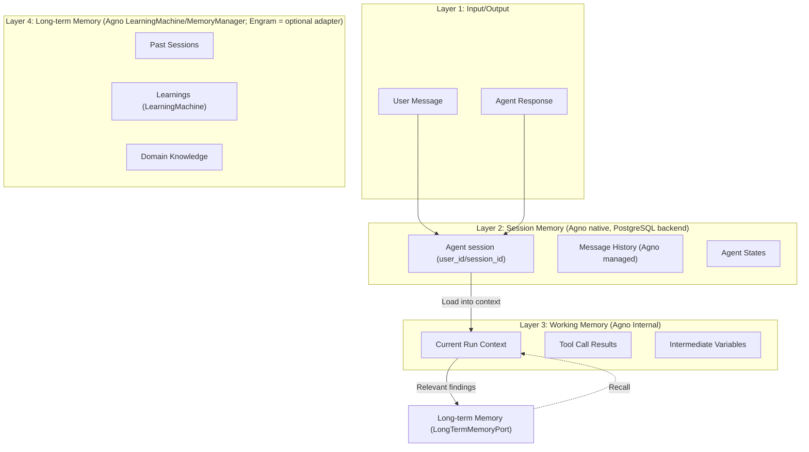

# SPEC_04_MEMORY_ARCHITECTURE

> **Purpose**: Define the memory MODEL for yaml-agno: the memory layers (session, working memory, long-term memory), the `LongTermMemoryPort` abstraction, and how yaml-agno CONFIGURES Agno's native memory. yaml-agno does NOT own a session/runtime.
>
> @ai-directive: SPEC_04 is the memory MODEL only. Context compression OPERATION lives in **SPEC_15** (context engineering). PII and secret masking GUARDRAILS live in **SPEC_16**. Retention/purge is a post-MVP extension. Do not re-implement those concerns here.

---

## 1. MEMORY LAYERS AND TOKENS LIMITS

### 1.1 Arquitectura de Memoria



### 1.2 Memory by Layer

| Layer | Storage | TTL | Max Tokens | Responsibility |
|-------|---------|-----|------------|----------------|
| **Session Memory** | PostgreSQL (Agno `DbSession`/`UserMemo`) | Agno-managed (per session) | 100K tokens | Full conversation history managed natively by Agno |
| **Working Memory** | Agno internal | 1 run | 8K tokens | Context of the current run |
| **Long-term Memory** | Agno `LearningMachine` / `MemoryManager` (default) | Permanent | ∞ (deduplicated) | Cross-session learning via `LongTermMemoryPort` |

> @ai-directive: yaml-agno does NOT own a session runtime. The session, history, and working memory above are Agno's native concepts (configured via the Agent constructor and `MemoryManager`). yaml-agno only CONFIGURES them from YAML and, optionally, plugs a long-term memory adapter (Engram) through `LongTermMemoryPort`.
>
> @ai-directive: Automatic retention/purge (`retention_days`) is a NON-BLOCKING post-MVP extension. Agno has no native retention; it will be implemented as a scheduled job that invokes `Curator.prune`. Do NOT treat retention as effective MVP configuration.

### 1.3 Memory Configuration (YAML)

```yaml
agent:
  name: "my_agent"
  # ...

  memory:
    # Session/working memory is NATIVE to Agno; yaml-agno only configures it.
    # These flags map to the Agent constructor (see SPEC_02 *Config schemas, SSOT).
    enable_agentic_memory: true      # Agno agentic memory on/off
    update_memory_on_run: true       # Persist learnings after each run
    add_memories_to_context: true    # Inject recalled memories into the prompt
    num_history_runs: 5              # Agno-managed history window (runs)
    num_history_messages: 50         # Agno-managed history window (messages)

    session:
      storage_type: postgres         # sqlite|postgres|memory (Agno session DB)
      max_messages: 100              # Agno native cap on recalled history

    working:
      max_context_tokens: 8000
      compression_threshold: 6000    # Compression op lives in SPEC_15
      include_tool_calls: true

    # Long-term memory via the LongTermMemoryPort.
    # Default backend is Agno native (LearningMachine rich / MemoryManager simple).
    # Engram is an OPTIONAL adapter that implements the same port.
    long_term:
      enabled: true
      backend: agno                  # agno (default) | engram (optional adapter)

      # Engram adapter settings (only used when backend == engram)
      engram:
        project: "yaml-agno"
        scope: project               # project|personal
        recall_on_start: true
        recall_keywords: ["previous", "past", "learned", "remembered"]
        save_on_decision: true
        save_on_discovery: true
        save_on_bugfix: true

      # @ai-directive: post-MVP, non-blocking. No native Agno retention.
      # retention_days: 30           # future: scheduled job -> Curator.prune
```

---

## 2. CONTEXT COMPRESSION AND DEDUPLICATION

### 2.1 Context Compression (owned by SPEC_15)

> @ai-directive: Context compression is a context-engineering OPERATION, not a memory-model concern. The `ContextCompressor` / `CompressionManager` lives in **SPEC_15** (context engineering & compression), including its threshold policy, important-message identification, and summarization strategy. SPEC_04 only references the memory-side configuration surface (`working.compression_threshold`) and treats the history as Agno-managed.
>
> Reference: see SPEC_15 for the full compression algorithm, token thresholds, and the summarization pipeline. Do not duplicate the implementation here.

### 2.2 Long-Term Memory — Port, Default (Agno) and Optional Engram Adapter

**Strategy**: yaml-agno defines a `LongTermMemoryPort` abstraction. The **default implementation is Agno native** — the rich `LearningMachine` (6 stores) or the simpler `MemoryManager`/`UserMemory`, selected via the `long_term.backend` config (`agno` default | `engram` optional). `EngramMemoryManager` is an **optional adapter** that implements the same port for teams that want an external MCP-backed store. Engram is NOT a native Agno layer and is NOT the only path.

```python
# yaml-agno/src/memory/long_term_port.py

from typing import Protocol, Any, List, runtime_checkable

@runtime_checkable
class LongTermMemoryPort(Protocol):
    """Hexagonal port for long-term (cross-session) memory.

    Implementations:
      * AgnoLearningMemoryAdapter  (default) -> Agno LearningMachine / MemoryManager
      * EngramMemoryManager        (optional) -> Engram MCP external store
    """

    async def save_decision(self, title: str, content: str, where: str,
                            learned: str | None = None) -> None: ...

    async def save_discovery(self, title: str, content: str,
                             where: str | None = None) -> None: ...

    async def save_bugfix(self, title: str, content: str,
                          where: str | None = None) -> None: ...

    async def search_relevant(self, query: str, limit: int = 5) -> List[dict[str, Any]]: ...
```

```python
# yaml-agno/src/memory/agno_memory_adapter.py
# @ai-directive: DEFAULT implementation. Delegates to Agno native memory.

class AgnoLearningMemoryAdapter:
    """LongTermMemoryPort backed by Agno native memory.

    Wraps Agno's LearningMachine (rich, 6 stores) when configured, or falls
    back to MemoryManager/UserMemory for the simple path. yaml-agno does NOT
    reimplement Agno memory; it routes saves/recalls through this adapter so
    the rest of the system depends on the Port, not on a concrete backend.
    """

    def __init__(self, agent, project: str):
        self._agent = agent          # Agno Agent with enable_agentic_memory=True
        self.project = project

    async def save_decision(self, title: str, content: str, where: str,
                            learned: str | None = None) -> None:
        """Persist an architectural decision via Agno native memory."""
        ...  # route to Agno LearningMachine / UserMemory

    async def save_discovery(self, title: str, content: str,
                             where: str | None = None) -> None:
        """Persist a technical discovery via Agno native memory."""
        ...

    async def save_bugfix(self, title: str, content: str,
                          where: str | None = None) -> None:
        """Persist a bug fix (root cause + resolution) via Agno native memory."""
        ...

    async def search_relevant(self, query: str, limit: int = 5):
        """Recall relevant memories via Agno native memory."""
        ...  # Agno native memory recall (add_memories_to_context / mem search)
```

```python
# yaml-agno/src/memory/engram_manager.py
# @ai-directive: OPTIONAL adapter, only active when long_term.backend == "engram".

from typing import List

class EngramMemoryManager:
    """Optional LongTermMemoryPort adapter backed by the Engram MCP store.

    Engram is an EXTERNAL MCP server, not an Agno layer. It is selected only
    via the YAML config (long_term.backend: engram) and provides the same
    contract as the default Agno adapter. Deduplication is automatic by
    topic_key on the Engram side.
    """

    def __init__(self, project: str, session_id: str):
        self.project = project
        self.session_id = session_id

    async def save_decision(self, title: str, content: str, where: str,
                            learned: str | None = None) -> None:
        """Persist an architectural decision via Engram (upsert by topic_key)."""
        from .engram_utils import mem_save  # MCP tool

        await mem_save(
            title=title,
            type="decision",
            content=f"**What**: {content}\n**Where**: {where}\n**Learned**: {learned or ''}",
            project=self.project,
            session_id=self.session_id,
        )

    async def save_discovery(self, title: str, content: str,
                             where: str | None = None) -> None:
        """Persist a technical discovery via Engram."""
        from .engram_utils import mem_save

        await mem_save(
            title=title,
            type="discovery",
            content=f"**What**: {content}\n**Where**: {where or 'Unknown'}",
            project=self.project,
            session_id=self.session_id,
        )

    async def search_relevant(self, query: str, limit: int = 5) -> List[dict]:
        """Recall relevant memories from Engram for the current context."""
        from .engram_utils import mem_search, mem_get_observation

        results = await mem_search(query=query, project=self.project, limit=limit)

        memories = []
        for result in results:
            full_obs = await mem_get_observation(id=result["id"])
            memories.append(full_obs)

        return memories
```

---

## 3. MEMORY GOVERNANCE AND SECURITY RULES

### 3.1 Isolation Policies

> @ai-directive: yaml-agno does NOT own a session runtime or a `session_contexts` model. Session, user and message isolation are provided **natively by Agno** via its `user_id` + `session_id` keys, and tenant isolation is provided by **Core Infra** (`TenantResolver` / RLS, see SPEC_00 §7.2). yaml-agno only declares which Agno-native isolation keys are in force; it does not re-implement them.

| Policy | Mechanism (Agno native / Core) | Enforcement |
|--------|-------------------------------|-------------|
| **Tenant Isolation** | Core Infra `TenantResolver` + RLS on the Agno DB (`tenant_id` in all queries) | `assert resolved_tenant_id == current_tenant` |
| **User Isolation** | Agno `user_id` key (scope of memory/sessions) | Memory queries scoped by `user_id` |
| **Session Isolation** | Agno `session_id` key (unique per session) | Agno guarantees `session_id` uniqueness |

### 3.2 PII De-identification (owned by SPEC_16)

> @ai-directive: PII sanitization (`PIISanitizer`, international patterns, masking rules) is a GUARDRAIL and lives in **SPEC_16** (guardrails), where it is owned and configured (`allow_pii` flag). SPEC_04 only states that, when PII guardrails are enabled, anything persisted to the long-term memory port must already be sanitized by the SPEC_16 guardrail. Do not duplicate the `PIISanitizer` implementation here.
>
> Reference: see SPEC_16 for the PII detection patterns, masking strategy, and the configurable `allow_pii` toggle.

### 3.3 Secret Masking (owned by SPEC_16)

> @ai-directive: Secret detection and masking (`SecretSanitizer`, `SecureMemoryManager`, `SecretManager` integration) lives in **SPEC_16** (guardrails). SPEC_04 only states that memory persistence must receive already-masked secrets from the SPEC_16 guardrail layer. Do not duplicate the secret-masking implementation here.
>
> Reference: see SPEC_16 for secret patterns, the Zero-Trust `SecretManager` abstraction, and the masking policy.

### 3.4 Retention Rules (GDPR) — post-MVP, non-blocking

> @ai-directive: Automatic retention/purge is a NON-BLOCKING post-MVP extension. Agno has NO native retention. The table below is the target policy that a future scheduled job (invoking `Curator.prune`) will enforce; it is NOT effective MVP configuration. The MVP relies on Agno-managed session lifetime plus always-on PII/secret masking (SPEC_16).

| Data Type | Target Retention | Justification |
|-----------|------------------|---------------|
| **Session messages** | 30 days (future) | GDPR - right to be forgotten; enforced by a post-MVP purge job |
| **Agent execution logs** | 90 days (future) | Debugging, compliance |
| **Domain events** | 7 days (future) | Event sourcing window |
| **Long-term memory** | Permanent (default) | Cross-session learning via `LongTermMemoryPort` (Agno default / Engram adapter) |
| **PII data** | Always masked | Privacy by design (SPEC_16) |

---

## 4. MEMORY ACCESS PATTERNS

### 4.1 Pattern: Configuring Agno Memory on Session Start

> @ai-directive: yaml-agno does NOT own a session runtime or a `SessionContext` model. The session, message history, and FIFO eviction are managed NATIVELY by Agno. yaml-agno only CONFIGURES Agno memory from YAML (constructor flags + `MemoryManager`) and, optionally, wires a long-term recall through the `LongTermMemoryPort`.

```python
# yaml-agno/src/memory/agno_memory_config.py
# @ai-directive: Build the Agno memory configuration FROM the YAML *Config (SPEC_02 SSOT).
#                The paths below MATCH the YAML block defined in section 1.3 exactly.
#                Do not invent a parallel SessionContext/session_state model.

def build_memory_config(memory_cfg) -> dict:
    """Translate the YAML memory block into Agno Agent constructor flags.

    These flags are what make Agno manage the session/history/working memory:
      enable_agentic_memory, update_memory_on_run,
      add_memories_to_context, num_history_runs, num_history_messages.
    """
    return {
        "enable_agentic_memory": memory_cfg.enable_agentic_memory,
        "update_memory_on_run": memory_cfg.update_memory_on_run,
        "add_memories_to_context": memory_cfg.add_memories_to_context,
        "num_history_runs": memory_cfg.num_history_runs,
        "num_history_messages": memory_cfg.num_history_messages,
    }


async def recall_on_start(port: "LongTermMemoryPort",
                          memory_cfg,
                          user_id: str) -> list[dict]:
    """Optional cross-session recall through the LongTermMemoryPort.

    Triggered when memory_cfg.long_term.recall_on_start is true, regardless of
    the backend (agno default or engram adapter). The port's default
    implementation is Agno native (LearningMachine / MemoryManager).
    """
    return await port.search_relevant(
        query=f"user:{user_id} past sessions decisions",
        limit=10,
    )
```

### 4.2 Pattern: Save-on-Decision

> @ai-directive: Autosave depends on the `LongTermMemoryPort`, not on a concrete backend. The default backend is Agno native (LearningMachine / MemoryManager); the Engram adapter is only injected when `long_term.backend == engram`.

```python
# yaml-agno/src/memory/autosave.py

class AutosaveManager:
    """Auto-saves decisions, discoveries, and bug fixes through the LongTermMemoryPort."""

    def __init__(self, port: "LongTermMemoryPort", config):
        self.port = port        # Agno default | Engram adapter
        self.config = config

    async def on_agent_decision(self, agent_name: str, decision: str,
                                reasoning: str) -> None:
        """Callback fired when an agent takes a decision."""
        if not self.config.long_term.save_on_decision:
            return

        await self.port.save_decision(
            title=f"Decision by {agent_name}",
            content=decision,
            where=agent_name,
            learned=reasoning,
        )

    async def on_discovery(self, title: str, content: str,
                           where: str | None = None) -> None:
        """Callback fired when a discovery is made."""
        if not self.config.long_term.save_on_discovery:
            return

        await self.port.save_discovery(title=title, content=content, where=where)
```

---

## 5. BEHAVIOR DELTA - BDD SCENARIOS

### 5.1 Acceptance Scenarios

#### Scenario 1: Golden Path - Agno Memory Configuration from YAML

```gherkin
GIVEN a YAML memory block with enable_agentic_memory=true
AND add_memories_to_context=true
AND num_history_messages=50
WHEN the Agent is built from the *Config (SPEC_02)
THEN the Agno Agent is constructed with those memory flags
AND Agno manages the session/history natively (no yaml-agno SessionContext)
AND the LongTermMemoryPort is resolved to the configured backend (agno default)
AND no custom session_state model is created by yaml-agno
```

#### Scenario 2: Golden Path - Context Compression

```gherkin
GIVEN a session with 150 messages (exceeding threshold)
AND the context exceeds 8000 tokens
WHEN compression is triggered
THEN the message history is reduced
AND recent messages (last 5) are preserved
AND tool_call messages are preserved
AND intermediate messages are summarized
AND the compressed context is under 4000 tokens
```

#### Scenario 3: PII Masking Delegated to SPEC_16

```gherkin
GIVEN a message containing PII "user@example.com"
AND the SPEC_16 PII guardrail is enabled
WHEN the message is saved to the long-term memory port
THEN the email is sanitized by the SPEC_16 guardrail to "u***@example.com"
AND only the sanitized version reaches the LongTermMemoryPort
AND the original email is NOT persisted
```

#### Scenario 4: Golden Path - Long-term Recall via Port

```gherkin
GIVEN a user with past decisions in long-term memory
AND recall_on_start is enabled
WHEN a new session starts
THEN past decisions are recalled through the LongTermMemoryPort
AND relevant memories are injected into context (add_memories_to_context)
AND the agent has awareness of past work
AND the backend is Agno native by default (Engram only if configured)
```

---

## 6. TDD MICRO-TASK EXECUTION PROTOCOL

### 6.1 Cascading Task Checklist

> @ai-directive: yaml-agno does NOT own a session runtime. There is no `SessionContext` model, no `add_message()` FIFO, no `SessionState` — those are Agno native. Tasks below configure/extend Agno memory, not replace it. Compression tasks live in SPEC_15; PII/secret tasks live in SPEC_16.

#### TASK_001: Define LongTermMemoryPort

- **File**: `yaml-agno/src/memory/long_term_port.py`
- **Test**: `tests/unit/memory/test_long_term_port.py`
- **RED**:
  ```python
  def test_port_contract_is_protocol():
      # LongTermMemoryPort is a typing.Protocol; concrete adapters satisfy it.
      assert hasattr(LongTermMemoryPort, "save_decision")
      assert hasattr(LongTermMemoryPort, "save_discovery")
      assert hasattr(LongTermMemoryPort, "search_relevant")
  ```
- **GREEN**: Define `LongTermMemoryPort` Protocol (save_decision/save_discovery/save_bugfix/search_relevant)
- **Commit**: `feat: add LongTermMemoryPort abstraction`

#### TASK_002: Implement Default Agno Memory Adapter

- **File**: `yaml-agno/src/memory/agno_memory_adapter.py`
- **Test**: `tests/unit/memory/test_agno_memory_adapter.py`
- **RED**:
  ```python
  async def test_agno_adapter_satisfies_port(fake_agent):
      adapter = AgnoLearningMemoryAdapter(agent=fake_agent, project="yaml-agno")
      assert isinstance(adapter, LongTermMemoryPort)  # structural typing
      await adapter.save_decision(title="t", content="c", where="w")
      fake_agent.memory.add.assert_called_once()
  ```
- **GREEN**: Implement `AgnoLearningMemoryAdapter` delegating to Agno LearningMachine/MemoryManager
- **Commit**: `feat: add default Agno long-term memory adapter`

#### TASK_003: Translate YAML Memory Block to Agno Constructor Flags

- **File**: `yaml-agno/src/memory/agno_memory_config.py`
- **Test**: `tests/unit/memory/test_agno_memory_config.py`
- **RED**:
  ```python
  def test_build_memory_config_maps_flags(memory_cfg):
      flags = build_memory_config(memory_cfg)
      assert flags["enable_agentic_memory"] is True
      assert flags["add_memories_to_context"] is True
      assert flags["num_history_messages"] == 50
  ```
- **GREEN**: Implement `build_memory_config()` mapping YAML -> Agno constructor flags
- **Commit**: `feat: map YAML memory config to Agno flags`

#### TASK_004: Implement Long-term Recall on Start (via Port)

- **File**: `yaml-agno/src/memory/agno_memory_config.py`
- **Test**: `tests/integration/memory/test_recall_on_start.py`
- **RED**:
  ```python
  async def test_recall_on_start_uses_port(fake_port):
      memories = await recall_on_start(fake_port, user_id="u1")
      fake_port.search_relevant.assert_awaited_once()
      assert isinstance(memories, list)
  ```
- **GREEN**: Implement `recall_on_start()` through the `LongTermMemoryPort`
- **Commit**: `feat: add port-based long-term recall on start`

#### TASK_005: Implement Engram Adapter (optional backend)

- **File**: `yaml-agno/src/memory/engram_manager.py`
- **Test**: `tests/integration/memory/test_engram_manager.py`
- **RED**:
  ```python
  async def test_engram_adapter_satisfies_port(engram_manager):
      assert isinstance(engram_manager, LongTermMemoryPort)
      await engram_manager.save_decision(
          title="Test Decision", content="content", where="test.py"
      )
      results = await engram_manager.search_relevant("test decision")
      assert len(results) >= 1
  ```
- **GREEN**: Implement `EngramMemoryManager` as an optional `LongTermMemoryPort` adapter
- **Commit**: `feat: add optional Engram long-term memory adapter`

#### TASK_006: Implement Save-on-Decision via Port

- **File**: `yaml-agno/src/memory/autosave.py`
- **Test**: `tests/unit/memory/test_autosave.py`
- **RED**:
  ```python
  async def test_autosave_uses_port(fake_port, memory_cfg):
      mgr = AutosaveManager(port=fake_port, config=memory_cfg)
      await mgr.on_agent_decision(agent_name="a", decision="d", reasoning="r")
      fake_port.save_decision.assert_awaited_once()
  ```
- **GREEN**: Implement `AutosaveManager` depending on the `LongTermMemoryPort`
- **Commit**: `feat: add port-based autosave manager`

> @ai-directive: Compression (`ContextCompressor`), PII sanitization (`PIISanitizer`) and secret masking (`SecretSanitizer`) are NOT tasks in SPEC_04. They are owned by SPEC_15 (compression) and SPEC_16 (PII/secret guardrails). See those specs for their task breakdown.

---

## 7. ADOPTED TECHNICAL ASSUMPTIONS

### [Decision 1] Session Memory is Agno Native (PostgreSQL backend)

**Rationale**:
- yaml-agno does NOT own a session runtime; Agno manages the session/history natively.
- PostgreSQL provides ACID transactions, JSONB flexibility, and partitioning.
- Better than Redis for persistence (>30 days) once the post-MVP retention job exists.

### [Decision 2] Long-term Memory via Port — default Agno, Engram optional

**Rationale**:
- A `LongTermMemoryPort` keeps the system decoupled from any concrete backend.
- The **default** implementation is Agno native: `LearningMachine` (rich, 6 stores) or `MemoryManager`/`UserMemory` (simple). Learning (`learning`) and culture (`culture`) are Agno native concepts.
- `EngramMemoryManager` is an OPTIONAL adapter (external MCP server, not an Agno layer) selected only via `long_term.backend: engram`. It survives context compaction, deduplicates by `topic_key`, and provides semantic search.

### [Decision 3] Compression by Importance (owned by SPEC_15)

**Rationale**:
- Compression is a context-engineering operation (SPEC_15), not a memory-model concern.
- Preserves last N messages (recency), tool_call results (debugging), and summarizes intermediate messages.

---

## 8. STRATEGIC CALIBRATION QUESTIONS

### [Question 1] Compression Threshold (defer to SPEC_15)

**Is 6000 tokens (75% of 8000) the optimal compression threshold?**

This is a context-engineering question owned by **SPEC_15**. It implies:
- **Too low**: frequent compression, context loss
- **Too high**: risk of exceeding the model limit
- **Trade-off**: compression frequency vs context depth

### [Question 2] Long-term Memory Retention (post-MVP)

**Should there be a maximum retention for long-term memory (e.g. 1000 memories per user)?**

Retention/purge is a post-MVP extension (Agno has no native retention). It implies:
- **Yes**: limits storage cost, forces relevance
- **No**: unlimited memory, better for discovery
- **Trade-off**: storage cost vs recall capacity

### [Question 3] Cross-Tenant Memory Sharing

**Should memory sharing between tenants of the same client be allowed?**

It implies:
- **Yes**: requires opt-in, weaker isolation
- **No**: strict isolation, stronger security
- **Trade-off**: flexibility vs security

---

*Do you want to deepen the technical specification to Level 6 for a specific component, or authorize the execution of these tasks by the agent team?*
