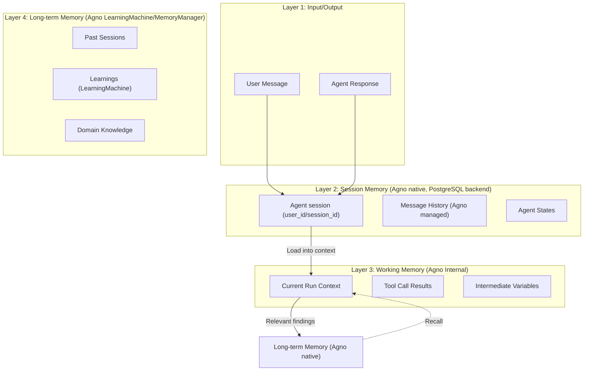

# SPEC_04_MEMORY_ARCHITECTURE

> **Purpose**: Define the memory MODEL for yaml-agno: the memory layers (session, working memory, long-term memory), and how yaml-agno CONFIGURES Agno's native memory. yaml-agno does NOT own a session/runtime and adds NO memory layer of its own — long-term memory is Agno native (`LearningMachine` / `MemoryManager`).
>
> @ai-directive: SPEC_04 is the memory MODEL only. Context compression OPERATION lives in **SPEC_15** (context engineering). PII and secret masking GUARDRAILS live in **SPEC_16**. Retention/purge is a post-MVP extension. Do not re-implement those concerns here.

---

## 1. MEMORY LAYERS AND TOKENS LIMITS

### 1.1 Arquitectura de Memoria



### 1.2 Memory by Layer

| Layer | Storage | TTL | Max Tokens | Responsibility |
|-------|---------|-----|------------|----------------|
| **Session Memory** | PostgreSQL (Agno `DbSession`/`UserMemo`) | Agno-managed (per session) | 100K tokens | Full conversation history managed natively by Agno |
| **Working Memory** | Agno internal | 1 run | 8K tokens | Context of the current run |
| **Long-term Memory** | Agno `LearningMachine` / `MemoryManager` (native) | Permanent | ∞ (deduplicated) | Cross-session learning via Agno native memory |

> @ai-directive: yaml-agno does NOT own a session runtime. The session, history, working memory and long-term memory above are Agno's native concepts (configured via the Agent constructor and `MemoryManager`/`LearningMachine`). yaml-agno only CONFIGURES them from YAML; it adds NO memory layer of its own.
>
> @ai-directive: Automatic retention/purge (`retention_days`) is a NON-BLOCKING post-MVP extension. Agno has no native retention; it will be implemented as a scheduled job that invokes `Curator.prune`. Do NOT treat retention as effective MVP configuration.

### 1.3 Memory Configuration (YAML)

```yaml
agent:
  name: "my_agent"
  # ...

  memory:
    # Session/working memory is NATIVE to Agno; yaml-agno only configures it.
    # These flags map to the Agent constructor (see SPEC_02 *Config schemas, SSOT).
    enable_agentic_memory: true      # Agno agentic memory on/off
    update_memory_on_run: true       # Persist learnings after each run
    add_memories_to_context: true    # Inject recalled memories into the prompt
    num_history_runs: 5              # Agno-managed history window (runs)
    num_history_messages: 50         # Agno-managed history window (messages)

    session:
      storage_type: postgres         # sqlite|postgres|memory (Agno session DB)
      max_messages: 100              # Agno native cap on recalled history

    working:
      max_context_tokens: 8000
      compression_threshold: 6000    # Compression op lives in SPEC_15
      include_tool_calls: true

    # Long-term memory is NATIVE to Agno; yaml-agno only configures it.
    # These knobs map to the Agno LearningMachine (rich, 6 stores) when enabled,
    # and to the MemoryManager / UserMemory simple path otherwise.
    # See SPEC_02 *Config schemas (SSOT). No Port, no adapters.
    learning:
      enabled: true                  # Turn on Agno LearningMachine (cross-session learning)
      recall_on_start: true          # Inject recalled learnings when a session starts
      save_on_decision: true         # Persist decisions through Agno native memory
      save_on_discovery: true        # Persist discoveries through Agno native memory
      save_on_bugfix: true           # Persist bug fixes through Agno native memory

    # @ai-directive: post-MVP, non-blocking. No native Agno retention.
    # retention_days: 30             # future: scheduled job -> Curator.prune
```

---

## 2. CONTEXT COMPRESSION AND DEDUPLICATION

### 2.1 Context Compression (owned by SPEC_15)

> @ai-directive: Context compression is a context-engineering OPERATION, not a memory-model concern. The `ContextCompressor` / `CompressionManager` lives in **SPEC_15** (context engineering & compression), including its threshold policy, important-message identification, and summarization strategy. SPEC_04 only references the memory-side configuration surface (`working.compression_threshold`) and treats the history as Agno-managed.
>
> Reference: see SPEC_15 for the full compression algorithm, token thresholds, and the summarization pipeline. Do not duplicate the implementation here.

### 2.2 Long-Term Memory — Agno Native (LearningMachine / MemoryManager)

**Strategy**: Long-term memory is 100% Agno native. yaml-agno does NOT define a `LongTermMemoryPort`, does NOT add adapters, and does NOT introduce an external memory backend. The rich `LearningMachine` (6 stores) or the simpler `MemoryManager` / `UserMemory` are Agno components that yaml-agno only CONFIGURES from YAML: the Agent constructor flags (`enable_agentic_memory`, `update_memory_on_run`, `add_memories_to_context`) plus the `learning:` block. All saves and recalls go straight through Agno native memory.

```python
# yaml-agno/src/memory/agno_memory_config.py
# @ai-directive: Build the Agno memory configuration FROM the YAML *Config (SPEC_02 SSOT).
#                There is NO Port and NO adapter. yaml-agno only configures Agno native memory.

def build_memory_config(memory_cfg) -> dict:
    """Translate the YAML memory block into Agno Agent constructor flags.

    These flags are what make Agno manage the session/history/working memory AND
    the long-term learning memory natively:
      enable_agentic_memory, update_memory_on_run,
      add_memories_to_context, num_history_runs, num_history_messages.
    """
    return {
        "enable_agentic_memory": memory_cfg.enable_agentic_memory,
        "update_memory_on_run": memory_cfg.update_memory_on_run,
        "add_memories_to_context": memory_cfg.add_memories_to_context,
        "num_history_runs": memory_cfg.num_history_runs,
        "num_history_messages": memory_cfg.num_history_messages,
    }


def build_learning_config(learning_cfg) -> dict:
    """Translate the YAML learning block into Agno LearningMachine configuration.

    When learning.enabled is true, the Agno Agent is wired with a LearningMachine
    (rich, 6 stores: user_profile, user_memory, session_context, entity_memory,
    learned_knowledge, decision_log) exposed as ``agent.learning_machine``.
    When learning.enabled is false, recall/writes fall back to the simpler
    ``MemoryManager`` (``agent.memory``) backed by ``UserMemory`` rows.
    recall_on_start and the save_on_* flags below are yaml-agno knobs that decide
    when to drive the corresponding Agno component (recall on session start,
    autosave of decisions / discoveries / bug fixes). No abstraction sits between
    yaml-agno and Agno native memory.
    """
    return {
        "enabled": learning_cfg.enabled,
        "recall_on_start": learning_cfg.recall_on_start,
        "save_on_decision": learning_cfg.save_on_decision,
        "save_on_discovery": learning_cfg.save_on_discovery,
        "save_on_bugfix": learning_cfg.save_on_bugfix,
    }
```

> @ai-directive: There is no `LongTermMemoryPort`, no `AgnoLearningMemoryAdapter`, and no `EngramMemoryManager`. Long-term memory is configured, not implemented. The decision/discovery/bugfix autosave and the start-of-session recall operate directly on Agno native memory (`LearningMachine` / `MemoryManager`), driven by the `learning:` flags above.

---

## 3. MEMORY GOVERNANCE AND SECURITY RULES

### 3.1 Isolation Policies

> @ai-directive: yaml-agno does NOT own a session runtime or a `session_contexts` model. Session, user and message isolation are provided **natively by Agno** via its `user_id` + `session_id` keys (app-layer WHERE filters, NO Postgres RLS). Tenant isolation is **explicit** (Core Infra `TenantResolver`; `tenant_id` lives on `yamlagno_*` config rows only, NEVER added to `agno_*` tables). See SPEC_03 §5.

| Policy | Mechanism (Agno native / Core) | Enforcement |
|--------|-------------------------------|-------------|
| **Tenant Isolation** | Core Infra `TenantResolver` + explicit `tenant_id` WHERE filter on `yamlagno_*` rows (NO RLS, NO tenant_id on `agno_*`) | `assert resolved_tenant_id == current_tenant` |
| **User Isolation** | Agno `user_id` key (scope of memory/sessions) | Memory queries scoped by `user_id` |
| **Session Isolation** | Agno `session_id` key (unique per session) | Agno guarantees `session_id` uniqueness |

### 3.2 PII De-identification (owned by SPEC_16)

> @ai-directive: PII sanitization (`PIISanitizer`, international patterns, masking rules) is a GUARDRAIL and lives in **SPEC_16** (guardrails), where it is owned and configured (`allow_pii` flag). SPEC_04 only states that, when PII guardrails are enabled, anything persisted to the long-term memory port must already be sanitized by the SPEC_16 guardrail. Do not duplicate the `PIISanitizer` implementation here.
>
> Reference: see SPEC_16 for the PII detection patterns, masking strategy, and the configurable `allow_pii` toggle.

### 3.3 Secret Masking (owned by SPEC_16)

> @ai-directive: Secret detection and masking (`SecretSanitizer`, `SecureMemoryManager`, `SecretManager` integration) lives in **SPEC_16** (guardrails). SPEC_04 only states that memory persistence must receive already-masked secrets from the SPEC_16 guardrail layer. Do not duplicate the secret-masking implementation here.
>
> Reference: see SPEC_16 for secret patterns, the Zero-Trust `SecretManager` abstraction, and the masking policy.

### 3.4 Retention Rules (GDPR) — post-MVP, non-blocking

> @ai-directive: Automatic retention/purge is a NON-BLOCKING post-MVP extension. Agno has NO native retention. The table below is the target policy that a future scheduled job (invoking `Curator.prune`) will enforce; it is NOT effective MVP configuration. The MVP relies on Agno-managed session lifetime plus always-on PII/secret masking (SPEC_16).

| Data Type | Target Retention | Justification |
|-----------|------------------|---------------|
| **Session messages** | 30 days (future) | GDPR - right to be forgotten; enforced by a post-MVP purge job |
| **Agent execution logs** | 90 days (future) | Debugging, compliance |
| **Domain events** | 7 days (future) | Event sourcing window |
| **Long-term memory** | Permanent (default) | Cross-session learning via Agno native memory (`LearningMachine` / `MemoryManager`) |
| **PII data** | Always masked | Privacy by design (SPEC_16) |

---

## 4. MEMORY ACCESS PATTERNS

### 4.1 Pattern: Configuring Agno Memory on Session Start

> @ai-directive: yaml-agno does NOT own a session runtime or a `SessionContext` model. The session, message history, and FIFO eviction are managed NATIVELY by Agno. yaml-agno only CONFIGURES Agno memory from YAML (constructor flags + `MemoryManager` / `LearningMachine`). There is no Port and no adapter; recall and autosave operate directly on Agno native memory.

```python
# yaml-agno/src/memory/agno_memory_config.py
# @ai-directive: Build the Agno memory configuration FROM the YAML *Config (SPEC_02 SSOT).
#                The paths below MATCH the YAML block defined in section 1.3 exactly.
#                Do not invent a parallel SessionContext/session_state model.

def build_memory_config(memory_cfg) -> dict:
    """Translate the YAML memory block into Agno Agent constructor flags.

    These flags are what make Agno manage the session/history/working memory:
      enable_agentic_memory, update_memory_on_run,
      add_memories_to_context, num_history_runs, num_history_messages.
    """
    return {
        "enable_agentic_memory": memory_cfg.enable_agentic_memory,
        "update_memory_on_run": memory_cfg.update_memory_on_run,
        "add_memories_to_context": memory_cfg.add_memories_to_context,
        "num_history_runs": memory_cfg.num_history_runs,
        "num_history_messages": memory_cfg.num_history_messages,
    }


async def recall_on_start(agent,
                          learning_cfg,
                          user_id: str,
                          message: str | None = None) -> list[dict]:
    """Optional cross-session recall through Agno native memory.

    Triggered when learning_cfg.recall_on_start is true. yaml-agno only decides
    WHEN to recall; the HOW is delegated to the Agno component selected by the
    ``learning.enabled`` flag:

      * learning.enabled is True  -> ``agent.learning_machine.arecall(...)`` from
        ``agno.learn.machine``. Returns a dict mapping each of the 6 store names
        (user_profile, user_memory, session_context, entity_memory,
        learned_knowledge, decision_log) to its recalled data.
      * learning.enabled is False -> ``agent.memory.aget_user_memories(user_id)``
        from ``agno.memory.manager``. Returns a list of ``UserMemory`` objects.

    Args:
        agent: Agno Agent with native memory configured.
        learning_cfg: YAML ``learning:`` block (SPEC_02 *Config).
        user_id: Agno user id used to scope recall.
        message: Optional query string forwarded to LearningMachine.arecall
            (ignored on the simple MemoryManager path).

    Returns:
        A list of dict entries; each entry is normalized for context injection
        regardless of the underlying Agno component.
    """
    if learning_cfg.enabled:
        # Rich path: LearningMachine.arecall returns a dict per store.
        # See agno/learn/machine.py (Agno v2.6.14).
        recalled = await agent.learning_machine.arecall(
            user_id=user_id,
            message=message,
        )
        # ``recalled`` is Dict[store_name, Any]; flatten the stores yaml-agno
        # cares about (learned_knowledge, decision_log) into a list of dicts.
        return [
            {"store": store_name, "data": payload}
            for store_name, payload in recalled.items()
            if payload
        ]

    # Simple path: MemoryManager.aget_user_memories returns List[UserMemory].
    # See agno/memory/manager.py (Agno v2.6.14).
    memories = await agent.memory.aget_user_memories(user_id=user_id)
    return [
        {"store": "user_memory", "data": {"memory": m.memory, "input": m.input}}
        for m in (memories or [])
    ]
```

### 4.2 Pattern: Save-on-Decision

> @ai-directive: Autosave operates directly on Agno native memory (`LearningMachine` / `MemoryManager`). There is no Port and no adapter; the `learning:` flags decide WHEN yaml-agno drives a save.

```python
# yaml-agno/src/memory/autosave.py
# @ai-directive: Write routes are selected by the learning.enabled flag and by
#                artifact type. There is NO Port and NO adapter; yaml-agno calls
#                the real Agno v2.6.14 APIs directly.

from uuid import uuid4

from agno.db.schemas.memory import UserMemory
from agno.learn.schemas import DecisionLog


class AutosaveManager:
    """Auto-saves decisions, discoveries, and bug fixes through Agno native memory.

    The Agent must be configured with Agno native memory (enable_agentic_memory,
    or a LearningMachine). yaml-agno only decides when to persist each artifact
    based on the learning.* flags. The write target is selected as follows:

      * learning.enabled is True  -> LearningMachine stores, routed by artifact
        type: decisions -> ``decision_log_store.asave(decision=DecisionLog(...))``
        (agno/learn/stores/decision_log.py), discoveries/bug fixes ->
        ``learned_knowledge_store.asave(title=..., learning=..., ...)``
        (agno/learn/stores/learned_knowledge.py).
      * learning.enabled is False -> ``MemoryManager.add_user_memory(memory=UserMemory(...), user_id)``
        (agno/memory/manager.py). NOTE: this method is SYNCHRONOUS in Agno
        v2.6.14 (no async variant), so it is called WITHOUT await.
    """

    def __init__(self, agent, learning_cfg, user_id: str | None = None):
        self.agent = agent          # Agno Agent with native memory configured
        self.learning_cfg = learning_cfg
        self.user_id = user_id

    async def on_agent_decision(self, agent_name: str, decision: str,
                                reasoning: str) -> None:
        """Callback fired when an agent takes a decision.

        Args:
            agent_name: Name of the Agno agent that emitted the decision.
            decision: The decision text to persist.
            reasoning: Why the decision was made; stored alongside it.
        """
        if not self.learning_cfg.save_on_decision:
            return

        if self.learning_cfg.enabled:
            # Rich path: DecisionLogStore.asave takes a DecisionLog object
            # (id and decision are required; reasoning optional). The required
            # scalar is ``decision`` (NOT ``content``). See agno/learn/stores/
            # decision_log.py and agno/learn/schemas.py (Agno v2.6.14).
            await self.agent.learning_machine.decision_log_store.asave(
                decision=DecisionLog(
                    id=str(uuid4()),
                    decision=decision,
                    reasoning=reasoning,
                    agent_id=agent_name,
                    user_id=self.user_id,
                )
            )
            return

        # Simple path: MemoryManager.add_user_memory is SYNCHRONOUS in Agno
        # v2.6.14 (no async variant). Call it without await.
        self.agent.memory.add_user_memory(
            memory=UserMemory(
                memory=f"Decision by {agent_name}: {decision}",
                input=reasoning,
            ),
            user_id=self.user_id,
        )

    async def on_discovery(self, title: str, content: str,
                           where: str | None = None) -> None:
        """Callback fired when a discovery or bug fix is made.

        Args:
            title: Short label for the discovery.
            content: The discovery body to persist (stored as the ``learning``).
            where: Optional origin (agent name, tool, etc.) used as ``namespace``.
        """
        if not self.learning_cfg.save_on_discovery:
            return

        if self.learning_cfg.enabled:
            # Rich path: LearnedKnowledgeStore.asave signature is
            # (title, learning, context=None, tags=None, user_id=None,
            #  agent_id=None, team_id=None, namespace=None).
            # See agno/learn/stores/learned_knowledge.py (Agno v2.6.14).
            await self.agent.learning_machine.learned_knowledge_store.asave(
                title=title,
                learning=content,
                namespace=where,
                user_id=self.user_id,
            )
            return

        # Simple path: MemoryManager.add_user_memory is SYNCHRONOUS in Agno
        # v2.6.14 (no async variant). Call it without await.
        self.agent.memory.add_user_memory(
            memory=UserMemory(memory=f"{title}: {content}"),
            user_id=self.user_id,
        )
```

---

## 5. BEHAVIOR DELTA - BDD SCENARIOS

### 5.1 Acceptance Scenarios

#### Scenario 1: Golden Path - Agno Memory Configuration from YAML

```gherkin
GIVEN a YAML memory block with enable_agentic_memory=true
AND add_memories_to_context=true
AND num_history_messages=50
AND learning.enabled=true
WHEN the Agent is built from the *Config (SPEC_02)
THEN the Agno Agent is constructed with those memory flags
AND the LearningMachine is wired onto the Agent (Agno native long-term memory)
AND Agno manages the session/history natively (no yaml-agno SessionContext)
AND no Port, no adapter, and no custom session_state model are created by yaml-agno
```

#### Scenario 2: Golden Path - Context Compression

```gherkin
GIVEN a session with 150 messages (exceeding threshold)
AND the context exceeds 8000 tokens
WHEN compression is triggered
THEN the message history is reduced
AND recent messages (last 5) are preserved
AND tool_call messages are preserved
AND intermediate messages are summarized
AND the compressed context is under 4000 tokens
```

#### Scenario 3: PII Masking Delegated to SPEC_16

```gherkin
GIVEN a message containing PII "user@example.com"
AND the SPEC_16 PII guardrail is enabled
WHEN the message is saved to long-term memory
THEN the email is sanitized by the SPEC_16 guardrail to "u***@example.com"
AND only the sanitized version reaches Agno native memory
AND the original email is NOT persisted
```

#### Scenario 4: Golden Path - Long-term Recall via Agno Native Memory

```gherkin
GIVEN a user with past decisions in long-term memory
AND learning.recall_on_start is enabled
WHEN a new session starts
THEN past decisions are recalled through Agno native memory (LearningMachine)
AND relevant memories are injected into context (add_memories_to_context)
AND the agent has awareness of past work
AND no Port or adapter is involved
```

---

## 6. TDD MICRO-TASK EXECUTION PROTOCOL

### 6.1 Cascading Task Checklist

> @ai-directive: yaml-agno does NOT own a session runtime. There is no `SessionContext` model, no `add_message()` FIFO, no `SessionState` — those are Agno native. Tasks below configure/extend Agno memory, not replace it. Compression tasks live in SPEC_15; PII/secret tasks live in SPEC_16.

#### TASK_001: Translate YAML Memory Block to Agno Constructor Flags

- **File**: `yaml-agno/src/memory/agno_memory_config.py`
- **Test**: `tests/unit/memory/test_agno_memory_config.py`
- **RED**:
  ```python
  def test_build_memory_config_maps_flags(memory_cfg):
      flags = build_memory_config(memory_cfg)
      assert flags["enable_agentic_memory"] is True
      assert flags["add_memories_to_context"] is True
      assert flags["num_history_messages"] == 50
  ```
- **GREEN**: Implement `build_memory_config()` mapping YAML -> Agno constructor flags
- **Commit**: `feat: map YAML memory config to Agno flags`

#### TASK_002: Translate YAML Learning Block to LearningMachine Config

- **File**: `yaml-agno/src/memory/agno_memory_config.py`
- **Test**: `tests/unit/memory/test_learning_config.py`
- **RED**:
  ```python
  def test_build_learning_config_maps_flags(learning_cfg):
      cfg = build_learning_config(learning_cfg)
      assert cfg["enabled"] is True
      assert cfg["recall_on_start"] is True
      assert cfg["save_on_decision"] is True
  ```
- **GREEN**: Implement `build_learning_config()` mapping the `learning:` block to Agno LearningMachine configuration (no Port, no adapter)
- **Commit**: `feat: map YAML learning block to Agno LearningMachine config`

#### TASK_003: Implement Long-term Recall on Start (Agno native)

- **File**: `yaml-agno/src/memory/agno_memory_config.py`
- **Test**: `tests/integration/memory/test_recall_on_start.py`
- **RED**:
  ```python
  async def test_recall_on_start_uses_learning_machine_arecall(fake_agent_learning):
      # learning.enabled is True -> LearningMachine.arecall must be used.
      memories = await recall_on_start(
          fake_agent_learning,
          learning_cfg=fake_cfg_enabled,
          user_id="u1",
          message="past decisions",
      )
      fake_agent_learning.learning_machine.arecall.assert_awaited_once()
      assert isinstance(memories, list)

  async def test_recall_on_start_uses_memory_manager_aget(fake_agent_simple):
      # learning.enabled is False -> MemoryManager.aget_user_memories must be used.
      memories = await recall_on_start(
          fake_agent_simple,
          learning_cfg=fake_cfg_disabled,
          user_id="u1",
      )
      fake_agent_simple.memory.aget_user_memories.assert_awaited_once()
      assert isinstance(memories, list)
  ```
- **GREEN**: Implement `recall_on_start()` routing to `LearningMachine.arecall`
  (learning.enabled=true) or `MemoryManager.aget_user_memories` (learning.enabled=false)
- **Commit**: `feat: add Agno native long-term recall on start`

#### TASK_004: Implement Save-on-Decision (Agno native)

- **File**: `yaml-agno/src/memory/autosave.py`
- **Test**: `tests/unit/memory/test_autosave.py`
- **RED**:
  ```python
  async def test_autosave_decision_routes_to_decision_log(fake_agent_learning):
      # learning.enabled is True -> decision_log_store.asave(DecisionLog) must be used.
      mgr = AutosaveManager(
          agent=fake_agent_learning,
          learning_cfg=fake_cfg_enabled,
          user_id="u1",
      )
      await mgr.on_agent_decision(agent_name="a", decision="d", reasoning="r")
      fake_agent_learning.learning_machine.decision_log_store.asave.assert_awaited_once()

  async def test_autosave_decision_routes_to_user_memory(fake_agent_simple):
      # learning.enabled is False -> MemoryManager.add_user_memory (SYNC, no await).
      mgr = AutosaveManager(
          agent=fake_agent_simple,
          learning_cfg=fake_cfg_disabled,
          user_id="u1",
      )
      await mgr.on_agent_decision(agent_name="a", decision="d", reasoning="r")
      fake_agent_simple.memory.add_user_memory.assert_called_once()
      # NOTE: assert_called_once (NOT assert_awaited_once) because
      # MemoryManager.add_user_memory is synchronous in Agno v2.6.14.
  ```
- **GREEN**: Implement `AutosaveManager` routing writes to LearningMachine stores
  (`decision_log_store.asave(DecisionLog(...))` / `learned_knowledge_store.asave(...)`)
  when learning.enabled=true, or to the SYNCHRONOUS
  `MemoryManager.add_user_memory(UserMemory(...), user_id)` (no await) when
  learning.enabled=false
- **Commit**: `feat: add Agno native autosave manager`

> @ai-directive: Compression (`ContextCompressor`), PII sanitization (`PIISanitizer`) and secret masking (`SecretSanitizer`) are NOT tasks in SPEC_04. They are owned by SPEC_15 (compression) and SPEC_16 (PII/secret guardrails). See those specs for their task breakdown.

---

## 7. ADOPTED TECHNICAL ASSUMPTIONS

### [Decision 1] Session Memory is Agno Native (PostgreSQL backend)

**Rationale**:
- yaml-agno does NOT own a session runtime; Agno manages the session/history natively.
- PostgreSQL provides ACID transactions, JSONB flexibility, and partitioning.
- Better than Redis for persistence (>30 days) once the post-MVP retention job exists.

### [Decision 2] Long-term Memory is Agno Native (configured, not implemented)

**Rationale**:
- yaml-agno builds ON TOP of Agno and adds NO memory layer of its own. Long-term memory is 100% Agno native.
- The rich `LearningMachine` (6 stores) or the simpler `MemoryManager` / `UserMemory` are Agno components configured from YAML (Agent constructor flags + `learning:` block).
- There is no `LongTermMemoryPort`, no adapter, and no external backend. An external memory store (e.g. an MCP server) is out of scope for yaml-agno; it is not modeled here.

### [Decision 3] Compression by Importance (owned by SPEC_15)

**Rationale**:
- Compression is a context-engineering operation (SPEC_15), not a memory-model concern.
- Preserves last N messages (recency), tool_call results (debugging), and summarizes intermediate messages.

---

## 8. STRATEGIC CALIBRATION QUESTIONS

### [Question 1] Compression Threshold (defer to SPEC_15)

**Is 6000 tokens (75% of 8000) the optimal compression threshold?**

This is a context-engineering question owned by **SPEC_15**. It implies:
- **Too low**: frequent compression, context loss
- **Too high**: risk of exceeding the model limit
- **Trade-off**: compression frequency vs context depth

### [Question 2] Long-term Memory Retention (post-MVP)

**Should there be a maximum retention for long-term memory (e.g. 1000 memories per user)?**

Retention/purge is a post-MVP extension (Agno has no native retention). It implies:
- **Yes**: limits storage cost, forces relevance
- **No**: unlimited memory, better for discovery
- **Trade-off**: storage cost vs recall capacity

### [Question 3] Cross-Tenant Memory Sharing

**Should memory sharing between tenants of the same client be allowed?**

It implies:
- **Yes**: requires opt-in, weaker isolation
- **No**: strict isolation, stronger security
- **Trade-off**: flexibility vs security

---