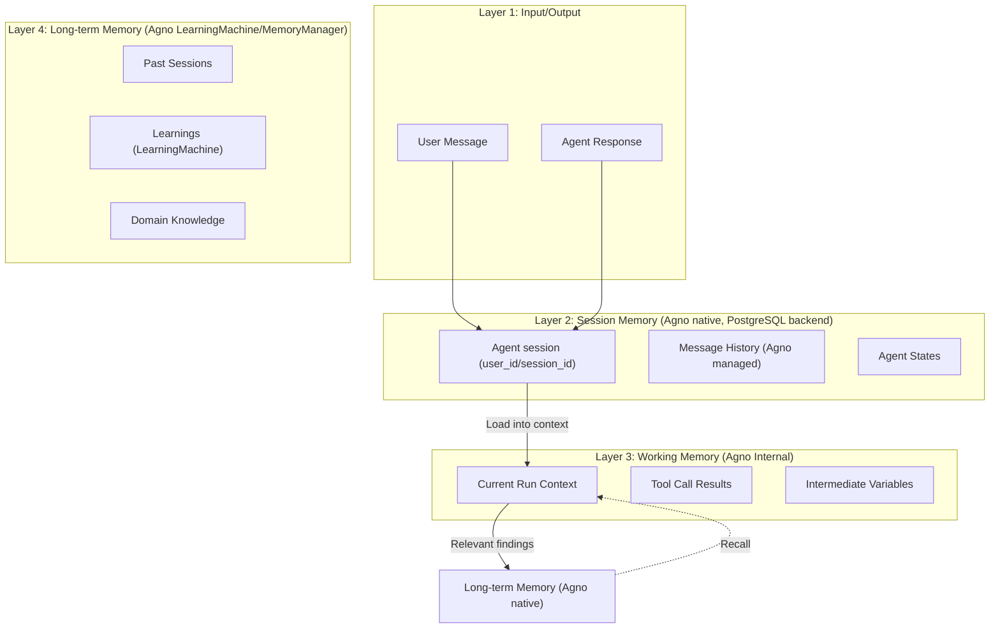

# SPEC_04_MEMORY_ARCHITECTURE

> **Purpose**: Define the memory MODEL for yaml-agno: the memory layers (session, working memory, long-term memory), and how yaml-agno CONFIGURES Agno's native memory. yaml-agno does NOT own a session/runtime and adds NO memory layer of its own — long-term memory is Agno native (`LearningMachine` / `MemoryManager`).

> **@ai-directive (CANONICAL — single source of truth for what does NOT exist and where each concern LIVES)**:
>
> **What does NOT exist in yaml-agno's memory model** (taxative list — do NOT invent any of these anywhere in this SPEC):
> - NO Engram integration (Engram is an unrelated tool; never referenced from yaml-agno memory).
> - NO `LongTermMemoryPort`, NO `AgnoLearningMemoryAdapter`, NO `EngramMemoryManager`.
> - NO external memory backend and NO memory Port/adapter of ANY kind.
> - NO custom `SessionContext` / `SessionState` / `add_message()` FIFO model — the session is Agno native.
> - NO reimplemented runtime, history, or working-memory layer — those are Agno native.
>
> **Where each related concern LIVES (owner SPEC — do not duplicate here)**:
> - **Context compression OPERATION** (algorithm, summarization prompt, threshold policy, `ContextCompressor`) → **SPEC_15** (context engineering). SPEC_04 only exposes the memory-side config surface (`working.compression_threshold`); the VALUE is task-dependent and configurable per agent, owned by SPEC_15.
> - **PII sanitization + secret masking + the `allow_pii` toggle** → **SPEC_16** (guardrails). When SPEC_16 guardrails are enabled, memory persistence receives already-sanitized/already-masked data; SPEC_04 never re-implements `PIISanitizer`, `SecretSanitizer`, or `SecureMemoryManager`.
> - **Retention / purge** → **post-MVP**. Agno has NO native TTL/retention on sessions/messages/`UserMemory`. Retention is a yaml-agno-owned scheduled job with configurable values (this SPEC, §3.4). The only Agno-native prune is `Curator.prune`, which ONLY prunes `user_profile.memories`.
>
> Every section below assumes the above is settled. Do NOT restate these negations in the body — only short one-line pointers to the owner SPEC where a section still needs one.

---

## 1. MEMORY LAYERS AND TOKENS LIMITS

### 1.1 Arquitectura de Memoria



### 1.2 Memory by Layer

| Layer | Storage | TTL | Max Tokens | Responsibility |
|-------|---------|-----|------------|----------------|
| **Session Memory** | PostgreSQL (Agno `DbSession`/`UserMemo`) | Agno-managed (per session) | 100K tokens | Full conversation history managed natively by Agno |
| **Working Memory** | Agno internal | 1 run | 8K tokens | Context of the current run |
| **Long-term Memory** | Agno `LearningMachine` / `MemoryManager` (native) | Permanent | ∞ (deduplicated) | Cross-session learning via Agno native memory |

> The session, history, working memory and long-term memory above are Agno's native concepts (configured via the Agent constructor and `MemoryManager`/`LearningMachine`). Retention is configurable per project — see §3.4.

### 1.3 Memory Configuration (YAML)

```yaml
agent:
  name: "my_agent"
  # ...

  memory:
    # Session/working memory is NATIVE to Agno; yaml-agno only configures it.
    # These flags map to the Agent constructor (see SPEC_02 *Config schemas, SSOT).
    enable_agentic_memory: true      # Agno agentic memory on/off
    update_memory_on_run: true       # Persist learnings after each run
    add_memories_to_context: true    # Inject recalled memories into the prompt
    num_history_runs: 5              # Agno-managed history window (runs)
    num_history_messages: 50         # Agno-managed history window (messages)

    # User identity (see §1.4). yaml-agno NEVER lets user_id fall through to
    # Agno's literal "default" bucket. system_user_id is the PRINCIPAL part of
    # the composite user_id used when there is no human user (agent-to-agent,
    # autonomous workflows). At resolve time, resolve_user_id() prefixes the
    # tenant_id: the effective Agno user_id becomes "{tenant_id}:{system_user_id}"
    # (e.g. "acme:agent:my_agent"). Accepts an explicit string OR a derivation
    # template resolved at config-build time.
    system_user_id: "agent:my_agent"      # principal part; tenant prefixed at resolve
    # system_user_id: "workflow:{workflow_id}"  # OR a derivation template
    # tenant_id is resolved from the HTTP request (TenantContextMiddleware,
    # SPEC_06) or, for autonomous runs with no HTTP request, from the
    # agent/workflow YAML config (tenant_id field). If neither tenant_id nor a
    # principal resolves, yaml-agno FAILS FAST (never None, never bare).

    session:
      storage_type: postgres         # sqlite|postgres|memory (Agno session DB)
      max_messages: 100              # Agno native cap on recalled history

    working:
      max_context_tokens: 8000       # EXAMPLE default, fully configurable per agent/task
      compression_threshold: 6000    # EXAMPLE default, configurable; op+methodology owned by SPEC_15
      include_tool_calls: true

    # Long-term memory is NATIVE to Agno; yaml-agno only configures it.
    # These knobs map to the Agno LearningMachine (rich, 6 stores) when enabled,
    # and to the MemoryManager / UserMemory simple path otherwise.
    # See SPEC_02 *Config schemas (SSOT). No Port, no adapters.
    learning:
      enabled: true                  # Turn on Agno LearningMachine (cross-session learning)
      recall_on_start: true          # Inject recalled learnings when a session starts
      save_on_decision: true         # Persist decisions through Agno native memory
      save_on_discovery: true        # Persist discoveries through Agno native memory
      save_on_bugfix: true           # Persist bug fixes through Agno native memory

      # Memory scope -> Agno namespace mapping (see §1.5). Affects the stores
      # that accept a free-string namespace: learned_knowledge + entity_memory.
      # The other 4 stores have FIXED scopes (user_id/session_id/agent_id).
      scope: "tenant:acme"           # top-level namespace, inherited by entity_memory
      learned_knowledge:
        scope: "tenant:acme"         # MUST be set explicitly (NOT inherited; see §1.5 gotcha)
      entity_memory:
        scope: "tenant:acme"         # inherits top-level scope when omitted

    # Retention is CONFIGURABLE per project (post-MVP job; Agno has no native
    # retention). Values below are EXAMPLE defaults, not architecture constants.
    retention:
      enabled: false                 # post-MVP; non-blocking for MVP
      max_age_days:
        sessions: 30                 # session messages TTL (example)
        user_memory: 180             # UserMemory/UserMemo TTL (example)
        learned_knowledge: 365       # learned_knowledge namespace TTL (example)
      # WARNING: do NOT use MemoryManager.clear() / db.clear_memories() in the
      # purge job — they are global nukes with NO user/tenant filter (see §3.4).
```

### 1.4 User Identity & Memory Scoping — composite user_id, no anonymous "default" bucket

**Footgun (verified against Agno v2.6.18 source).** `user_id` is `Optional[str]=None` in `Agent.run`/`arun` (agno/agent/agent.py:1288,1342,1448) and in `Workflow.run`/`arun` (agno/workflow/workflow.py:405,468,495). When `user_id` is `None`, `MemoryManager` converts it to the literal string `"default"` in EVERY method (agno/memory/manager.py:177,191,205,239...). The result: **all anonymous runs across ALL agents in the process read/write the SAME shared `"default"` memory bucket**. This is cross-talk. Agno has NO concept of a "system user" or "agent user"; the only special `user_id` is `"default"` (the `None` fallback).

**yaml-agno rule — ONE composite user_id EVERYWHERE.** yaml-agno has a SINGLE user_id mechanism: the composite `"{tenant_id}:{principal_id}"`, ALWAYS. There is no bare principal and no tenant-less `system_user_id` reaching Agno. The composite flows through Agno's native `user_isolation` (SPEC_06), so tenant isolation covers BOTH HTTP requests AND autonomous/workflow runs (which carry their config's `tenant_id` into the composite).

- **principal_id** = the human user id, OR `memory.system_user_id` (e.g. `"agent:facturacion"`, `"workflow:{workflow_id}"`) when there is no human.
- **tenant_id** = resolved from the HTTP request (`TenantContextMiddleware`, SPEC_06) OR, for autonomous/workflow runs with no HTTP request, from the agent/workflow YAML `tenant_id` field.

`resolve_user_id()` (below) is THE single resolver used EVERYWHERE in yaml-agno — HTTP and non-HTTP. The `TenantContextMiddleware` (SPEC_06) CALLS `resolve_user_id()` to build the composite; it does NOT duplicate the format inline. If neither tenant_id nor a principal resolves, yaml-agno **FAILS FAST** — never `None`, never a bare `"default"` bucket.

```python
# yaml-agno/src/memory/user_identity.py
# @ai-directive: THE single user_id resolver for ALL of yaml-agno (HTTP + non-HTTP).
#                Returns the COMPOSITE "{tenant_id}:{principal_id}", NEVER a bare
#                principal, NEVER None. TenantContextMiddleware (SPEC_06) calls
#                this instead of building the composite inline.
#                Verified against Agno v2.6.18: MemoryManager coerces user_id=None
#                to the literal "default" string (agno/memory/manager.py:177,191,
#                205,239...), causing cross-talk between anonymous runs.

from typing import Any


class UserIdentityResolutionError(RuntimeError):
    """Raised when user_id cannot be resolved and Agno's 'default' is disallowed."""


def resolve_user_id(memory_cfg: Any,
                    principal_id: str | None,
                    tenant_id: str | None,
                    context: dict | None = None) -> str:
    """Resolve the effective Agno user_id as the composite "{tenant_id}:{principal_id}".

    This is THE single resolver used everywhere in yaml-agno (HTTP requests via
    TenantContextMiddleware, and autonomous/workflow runs). The composite format
    lives ONLY here; callers MUST NOT build ``f"{tenant}:{user}"`` inline.

    Selection of the principal:
      1. ``principal_id`` (the human user id, when a human is present).
      2. ``memory_cfg.system_user_id``, after expanding derivation templates such
         as ``"workflow:{workflow_id}"`` or ``"agent:{agent_id}"`` against
         ``context``.
      3. Nothing else — there is NO silent fallback to Agno's ``"default"``.

    Args:
        memory_cfg: YAML ``memory:`` block (SPEC_02 *Config). Carries
            ``system_user_id`` (a literal string or a ``{placeholder}`` template)
            used as the principal when no human is present.
        principal_id: Human user id when the run has one; ``None`` otherwise
            (the ``system_user_id`` is then used as the principal).
        tenant_id: Tenant id. For HTTP requests it comes from the JWT/header
            (TenantContextMiddleware, SPEC_06); for autonomous/workflow runs it
            comes from the agent/workflow YAML ``tenant_id`` field.
        context: Optional dict used to expand templates (``workflow_id``,
            ``agent_id``, etc.).

    Returns:
        The composite ``"{tenant_id}:{principal_id}"`` string (never ``None``,
        never a bare principal).

    Raises:
        UserIdentityResolutionError: if ``tenant_id`` is missing, or if neither a
            human principal nor a ``system_user_id`` resolves. The caller MUST
            surface this at config-build/run time rather than passing
            ``user_id=None`` to Agno.
    """
    if not tenant_id:
        raise UserIdentityResolutionError(
            "tenant_id is required to build the composite user_id "
            "'{tenant_id}:{principal_id}'. For HTTP requests it comes from the "
            "TenantContextMiddleware (SPEC_06); for autonomous runs set the "
            "agent/workflow YAML 'tenant_id' field. Refusing to build a "
            "tenant-less user_id (would break tenant isolation)."
        )

    if principal_id:
        resolved_principal = principal_id
    else:
        template = getattr(memory_cfg, "system_user_id", None)
        if not template:
            raise UserIdentityResolutionError(
                "No principal resolves (no human user and no "
                "memory.system_user_id). Refusing to fall through to Agno's "
                "shared 'default' memory bucket; set memory.system_user_id or "
                "pass an explicit principal_id."
            )
        if "{" in template and "}" in template:
            if context is None:
                raise UserIdentityResolutionError(
                    f"system_user_id template {template!r} needs a context dict "
                    f"(workflow_id/agent_id/...) to expand."
                )
            try:
                resolved_principal = template.format(**context)
            except KeyError as exc:
                raise UserIdentityResolutionError(
                    f"system_user_id template {template!r} references missing "
                    f"key {exc}. Provide it in the run context."
                ) from exc
        else:
            resolved_principal = template

    return f"{tenant_id}:{resolved_principal}"
```

### 1.5 Memory Scopes & Sharing — namespace mapping

**Agno namespace facts (verified v2.6.18).** Of the 6 `LearningMachine` stores, only **`learned_knowledge`** and **`entity_memory`** accept a free-string `namespace` (`agno/learn/machine.py:88`, default `"global"`; configurable on `LearnedKnowledgeConfig.namespace` at config.py:272 and `EntityMemoryConfig.namespace` at config.py:347). The other 4 stores have FIXED scopes: `user_profile`/`user_memory` → `user_id`; `session_context` → `session_id`; `decision_log` → `agent_id`. For `namespace="user"` WITHOUT a `user_id`, Agno does **NOT** raise — it logs a warning and returns `False` (silent drop), so yaml-agno MUST validate before calling.

**Gotcha.** `LearningMachine.namespace` (top-level) is inherited by `entity_memory` but **NOT** by `learned_knowledge` (which defaults back to `"global"`). If YAML sets a top-level `namespace`/`scope`, it MUST also be set explicitly on `learned_knowledge.scope`, or the two stores diverge silently.

**yaml-agno scope taxonomy → Agno namespace mapping.**

| yaml-agno scope | Agno target | Notes |
|-----------------|-------------|-------|
| `org` | `namespace: "org:{org_id}"` | Free-string namespace on learned_knowledge + entity_memory. |
| `tenant` | `namespace: "tenant:{tenant_id}"` | Same stores. Tenant_id is also kept as yaml-agno audit metadata (Agno rows have no tenant_id). |
| `agent` | `decision_log` store (fixed `agent_id`) **or** `namespace: "agent:{agent_id}"` on the free-string stores | Fixed store preferred when only agent-scoped decisions matter. |
| `user` | `user_profile` + `user_memory` stores (fixed `user_id`) **or** `namespace: "user"` (requires a non-None `user_id`) | yaml-agno validates `user_id` is set BEFORE calling with `namespace: "user"` (Agno silently drops otherwise). |
| `team` | `namespace: "team:{team_id}"` | No native team scope; `team_id` stored as audit metadata only. |

**Validation rule.** yaml-agno validates the namespace against the resolved user identity (§1.4) BEFORE calling Agno. A `scope: "user"` or `namespace: "user"` without a resolved `user_id` is rejected at config-build time rather than silently dropped by Agno.

---

## 2. CONTEXT COMPRESSION AND DEDUPLICATION

### 2.1 Context Compression (owned by SPEC_15)

> @ai-directive: Context compression is a context-engineering OPERATION, not a memory-model concern. The `ContextCompressor` / `CompressionManager` lives in **SPEC_15** (context engineering & compression), including its threshold policy, important-message identification, and summarization strategy. SPEC_04 only references the memory-side configuration surface (`working.compression_threshold`) and treats the history as Agno-managed.
>
> The threshold VALUE (`compression_threshold` / `max_context_tokens`) and the summarization prompt/methodology are **task-dependent and owned by SPEC_15** — the example numbers in §1.3 are configurable per agent/task defaults, NOT architecture-fixed constants dictated by SPEC_04.
>
> Reference: see SPEC_15 for the full compression algorithm, token thresholds, and the summarization pipeline. Do not duplicate the implementation here.

### 2.2 Long-Term Memory — Agno Native (LearningMachine / MemoryManager)

**Strategy**: Long-term memory is 100% Agno native. The rich `LearningMachine` (6 stores) or the simpler `MemoryManager` / `UserMemory` are Agno components that yaml-agno only CONFIGURES from YAML: the Agent constructor flags (`enable_agentic_memory`, `update_memory_on_run`, `add_memories_to_context`) plus the `learning:` block. All saves and recalls go straight through Agno native memory. (No Port/adapter/external backend — see the canonical directive at the top.)

```python
# yaml-agno/src/memory/agno_memory_config.py
# @ai-directive: Build the Agno memory configuration FROM the YAML *Config (SPEC_02 SSOT).
#                There is NO Port and NO adapter. yaml-agno only configures Agno native memory.

def build_memory_config(memory_cfg) -> dict:
    """Translate the YAML memory block into Agno Agent constructor flags.

    These flags are what make Agno manage the session/history/working memory AND
    the long-term learning memory natively:
      enable_agentic_memory, update_memory_on_run,
      add_memories_to_context, num_history_runs, num_history_messages.
    """
    return {
        "enable_agentic_memory": memory_cfg.enable_agentic_memory,
        "update_memory_on_run": memory_cfg.update_memory_on_run,
        "add_memories_to_context": memory_cfg.add_memories_to_context,
        "num_history_runs": memory_cfg.num_history_runs,
        "num_history_messages": memory_cfg.num_history_messages,
    }


def build_learning_config(learning_cfg) -> dict:
    """Translate the YAML learning block into Agno LearningMachine configuration.

    When learning.enabled is true, the Agno Agent is wired with a LearningMachine
    (rich, 6 stores: user_profile, user_memory, session_context, entity_memory,
    learned_knowledge, decision_log) exposed as ``agent.learning_machine``.
    When learning.enabled is false, recall/writes fall back to the simpler
    ``MemoryManager`` (``agent.memory``) backed by ``UserMemory`` rows.
    recall_on_start and the save_on_* flags below are yaml-agno knobs that decide
    when to drive the corresponding Agno component (recall on session start,
    autosave of decisions / discoveries / bug fixes). No abstraction sits between
    yaml-agno and Agno native memory.
    """
    return {
        "enabled": learning_cfg.enabled,
        "recall_on_start": learning_cfg.recall_on_start,
        "save_on_decision": learning_cfg.save_on_decision,
        "save_on_discovery": learning_cfg.save_on_discovery,
        "save_on_bugfix": learning_cfg.save_on_bugfix,
    }
```

> The decision/discovery/bugfix autosave and the start-of-session recall operate directly on Agno native memory (`LearningMachine` / `MemoryManager`), driven by the `learning:` flags above.

---

## 3. MEMORY GOVERNANCE AND SECURITY RULES

### 3.1 Isolation Policies

> @ai-directive: yaml-agno does NOT own a session runtime or a `session_contexts` model. Session, user and message isolation are provided **natively by Agno** via its `user_id` + `session_id` keys (app-layer WHERE filters, NO Postgres RLS). Tenant isolation is **explicit** (Core Infra `TenantResolver`; `tenant_id` lives on `yamlagno_*` config rows only, NEVER added to `agno_*` tables). See SPEC_03 §5.

| Policy | Mechanism (Agno native / Core) | Enforcement |
|--------|-------------------------------|-------------|
| **Tenant Isolation** | Core Infra `TenantResolver` + explicit `tenant_id` WHERE filter on `yamlagno_*` rows (NO RLS, NO tenant_id on `agno_*`) | `assert resolved_tenant_id == current_tenant` |
| **User Isolation** | Agno `user_id` key (scope of memory/sessions) | Memory queries scoped by `user_id` |
| **Session Isolation** | Agno `session_id` key (unique per session) | Agno guarantees `session_id` uniqueness |

### 3.2 PII De-identification (owned by SPEC_16)

> PII sanitization is owned by **SPEC_16**; when enabled, memory persistence receives already-sanitized data. See SPEC_16 for the `allow_pii` toggle and detection patterns.

### 3.3 Secret Masking (owned by SPEC_16)

> Secret masking is owned by **SPEC_16**; when enabled, memory persistence receives already-masked secrets. See SPEC_16 for secret patterns and the masking policy.

### 3.4 Retention Rules (GDPR) — configurable, post-MVP

> Retention is a **configurable** yaml-agno concern, driven by the `memory.retention:` YAML block (§1.3). Each project decides its own values; the table below shows EXAMPLE defaults, NOT fixed architecture constants. Agno has **NO native TTL/retention** on sessions/messages/`UserMemory`; the only Agno-native prune is `Curator.prune`, which ONLY prunes `user_profile.memories` (agno/learn/curate.py:36). Any broader retention is a yaml-agno-owned scheduled job (post-MVP, non-blocking for MVP).

| Data Type | Example `max_age_days` | Mechanism | Justification |
|-----------|------------------------|-----------|---------------|
| **Session messages** | 30 (example) | yaml-agno purge job, scoped by tenant in yaml-agno's OWN metadata | GDPR — right to be forgotten |
| **User memory / UserMemo** | 180 (example) | yaml-agno purge job | Cross-session user learning TTL |
| **Learned knowledge (namespace)** | 365 (example) | yaml-agno purge job + optional `Curator.prune` for `user_profile.memories` | Relevance vs storage cost |
| **Long-term memory (profile)** | Permanent (default) | Agno native (`LearningMachine` / `MemoryManager`) | Cross-session learning |
| **PII / secrets** | Always masked at write | SPEC_16 guardrails (always-on) | Privacy by design |

> **WARNING (multi-tenant purge).** Agno rows carry NO `tenant_id`. A purge job MUST key off yaml-agno's OWN metadata (tenant resolution from §3.1), and MUST NOT use `MemoryManager.clear()` or `db.clear_memories()` — both are **global nukes with NO user/tenant filter** and would wipe every tenant's memory at once.

---

## 4. MEMORY ACCESS PATTERNS

### 4.1 Pattern: Configuring Agno Memory on Session Start

> The session, message history, and FIFO eviction are managed NATIVELY by Agno. yaml-agno only CONFIGURES Agno memory from YAML (constructor flags + `MemoryManager` / `LearningMachine`). Recall and autosave operate directly on Agno native memory.

```python
# yaml-agno/src/memory/agno_memory_config.py
# @ai-directive: Build the Agno memory configuration FROM the YAML *Config (SPEC_02 SSOT).
#                The paths below MATCH the YAML block defined in section 1.3 exactly.
#                Do not invent a parallel SessionContext/session_state model.

def build_memory_config(memory_cfg) -> dict:
    """Translate the YAML memory block into Agno Agent constructor flags.

    These flags are what make Agno manage the session/history/working memory:
      enable_agentic_memory, update_memory_on_run,
      add_memories_to_context, num_history_runs, num_history_messages.
    """
    return {
        "enable_agentic_memory": memory_cfg.enable_agentic_memory,
        "update_memory_on_run": memory_cfg.update_memory_on_run,
        "add_memories_to_context": memory_cfg.add_memories_to_context,
        "num_history_runs": memory_cfg.num_history_runs,
        "num_history_messages": memory_cfg.num_history_messages,
    }


async def recall_on_start(agent,
                          learning_cfg,
                          user_id: str,
                          message: str | None = None) -> list[dict]:
    """Optional cross-session recall through Agno native memory.

    Triggered when learning_cfg.recall_on_start is true. yaml-agno only decides
    WHEN to recall; the HOW is delegated to the Agno component selected by the
    ``learning.enabled`` flag:

      * learning.enabled is True  -> ``agent.learning_machine.arecall(...)`` from
        ``agno.learn.machine``. Returns a dict mapping each of the 6 store names
        (user_profile, user_memory, session_context, entity_memory,
        learned_knowledge, decision_log) to its recalled data.
      * learning.enabled is False -> ``agent.memory.aget_user_memories(user_id)``
        from ``agno.memory.manager``. Returns a list of ``UserMemory`` objects.

    Args:
        agent: Agno Agent with native memory configured.
        learning_cfg: YAML ``learning:`` block (SPEC_02 *Config).
        user_id: Agno user id used to scope recall.
        message: Optional query string forwarded to LearningMachine.arecall
            (ignored on the simple MemoryManager path).

    Returns:
        A list of dict entries; each entry is normalized for context injection
        regardless of the underlying Agno component.
    """
    if learning_cfg.enabled:
        # Rich path: LearningMachine.arecall returns a dict per store.
        # See agno/learn/machine.py (Agno v2.6.18).
        recalled = await agent.learning_machine.arecall(
            user_id=user_id,
            message=message,
        )
        # ``recalled`` is Dict[store_name, Any]; flatten the stores yaml-agno
        # cares about (learned_knowledge, decision_log) into a list of dicts.
        return [
            {"store": store_name, "data": payload}
            for store_name, payload in recalled.items()
            if payload
        ]

    # Simple path: MemoryManager.aget_user_memories returns List[UserMemory].
    # See agno/memory/manager.py (Agno v2.6.18).
    memories = await agent.memory.aget_user_memories(user_id=user_id)
    return [
        {"store": "user_memory", "data": {"memory": m.memory, "input": m.input}}
        for m in (memories or [])
    ]
```

### 4.2 Pattern: Save-on-Decision

> Autosave operates directly on Agno native memory (`LearningMachine` / `MemoryManager`). The `learning:` flags decide WHEN yaml-agno drives a save; `memory.scope` / `memory.system_user_id` (§1.4, §1.5) decide the namespace/user scope.

```python
# yaml-agno/src/memory/autosave.py
# @ai-directive: Write routes are selected by the learning.enabled flag and by
#                artifact type. There is NO Port and NO adapter; yaml-agno calls
#                the real Agno v2.6.18 APIs directly.

from uuid import uuid4

from agno.db.schemas.memory import UserMemory
from agno.learn.schemas import DecisionLog


class AutosaveManager:
    """Auto-saves decisions, discoveries, and bug fixes through Agno native memory.

    The Agent must be configured with Agno native memory (enable_agentic_memory,
    or a LearningMachine). yaml-agno only decides when to persist each artifact
    based on the learning.* flags. The write target is selected as follows:

      * learning.enabled is True  -> LearningMachine stores, routed by artifact
        type: decisions -> ``decision_log_store.asave(decision=DecisionLog(...))``
        (agno/learn/stores/decision_log.py), discoveries/bug fixes ->
        ``learned_knowledge_store.asave(title=..., learning=..., ...)``
        (agno/learn/stores/learned_knowledge.py).
      * learning.enabled is False -> ``MemoryManager.add_user_memory(memory=UserMemory(...), user_id)``
        (agno/memory/manager.py). NOTE: this method is SYNCHRONOUS in Agno
        v2.6.18 (no async variant), so it is called WITHOUT await.
    """

    def __init__(self, agent, learning_cfg, user_id: str | None = None):
        self.agent = agent          # Agno Agent with native memory configured
        self.learning_cfg = learning_cfg
        self.user_id = user_id

    async def on_agent_decision(self, agent_name: str, decision: str,
                                reasoning: str) -> None:
        """Callback fired when an agent takes a decision.

        Args:
            agent_name: Name of the Agno agent that emitted the decision.
            decision: The decision text to persist.
            reasoning: Why the decision was made; stored alongside it.
        """
        if not self.learning_cfg.save_on_decision:
            return

        if self.learning_cfg.enabled:
            # Rich path: DecisionLogStore.asave takes a DecisionLog object
            # (id and decision are required; reasoning optional). The required
            # scalar is ``decision`` (NOT ``content``). See agno/learn/stores/
            # decision_log.py and agno/learn/schemas.py (Agno v2.6.18).
            await self.agent.learning_machine.decision_log_store.asave(
                decision=DecisionLog(
                    id=str(uuid4()),
                    decision=decision,
                    reasoning=reasoning,
                    agent_id=agent_name,
                    user_id=self.user_id,
                )
            )
            return

        # Simple path: MemoryManager.add_user_memory is SYNCHRONOUS in Agno
        # v2.6.18 (no async variant). Call it without await.
        self.agent.memory.add_user_memory(
            memory=UserMemory(
                memory=f"Decision by {agent_name}: {decision}",
                input=reasoning,
            ),
            user_id=self.user_id,
        )

    async def on_discovery(self, title: str, content: str,
                           where: str | None = None) -> None:
        """Callback fired when a discovery or bug fix is made.

        Args:
            title: Short label for the discovery.
            content: The discovery body to persist (stored as the ``learning``).
            where: Optional origin (agent name, tool, etc.) used as ``namespace``.
        """
        if not self.learning_cfg.save_on_discovery:
            return

        if self.learning_cfg.enabled:
            # Rich path: LearnedKnowledgeStore.asave signature is
            # (title, learning, context=None, tags=None, user_id=None,
            #  agent_id=None, team_id=None, namespace=None).
            # See agno/learn/stores/learned_knowledge.py (Agno v2.6.18).
            await self.agent.learning_machine.learned_knowledge_store.asave(
                title=title,
                learning=content,
                namespace=where,
                user_id=self.user_id,
            )
            return

        # Simple path: MemoryManager.add_user_memory is SYNCHRONOUS in Agno
        # v2.6.18 (no async variant). Call it without await.
        self.agent.memory.add_user_memory(
            memory=UserMemory(memory=f"{title}: {content}"),
            user_id=self.user_id,
        )
```

---

## 5. BEHAVIOR DELTA - BDD SCENARIOS

### 5.1 Acceptance Scenarios

#### Scenario 1: Golden Path - Agno Memory Configuration from YAML

```gherkin
GIVEN a YAML memory block with enable_agentic_memory=true
AND add_memories_to_context=true
AND num_history_messages=50
AND learning.enabled=true
WHEN the Agent is built from the *Config (SPEC_02)
THEN the Agno Agent is constructed with those memory flags
AND the LearningMachine is wired onto the Agent (Agno native long-term memory)
AND Agno manages the session/history natively (no yaml-agno SessionContext)
AND no Port, no adapter, and no custom session_state model are created by yaml-agno
```

#### Scenario 2: Golden Path - Context Compression

```gherkin
GIVEN a session with 150 messages (exceeding threshold)
AND the context exceeds 8000 tokens
WHEN compression is triggered
THEN the message history is reduced
AND recent messages (last 5) are preserved
AND tool_call messages are preserved
AND intermediate messages are summarized
AND the compressed context is under 4000 tokens
```

#### Scenario 3: PII Masking Delegated to SPEC_16

```gherkin
GIVEN a message containing PII "user@example.com"
AND the SPEC_16 PII guardrail is enabled
WHEN the message is saved to long-term memory
THEN the email is sanitized by the SPEC_16 guardrail to "u***@example.com"
AND only the sanitized version reaches Agno native memory
AND the original email is NOT persisted
```

#### Scenario 4: Golden Path - Long-term Recall via Agno Native Memory

```gherkin
GIVEN a user with past decisions in long-term memory
AND learning.recall_on_start is enabled
WHEN a new session starts
THEN past decisions are recalled through Agno native memory (LearningMachine)
AND relevant memories are injected into context (add_memories_to_context)
AND the agent has awareness of past work
AND no Port or adapter is involved
```

---

## 6. TDD MICRO-TASK EXECUTION PROTOCOL

### 6.1 Cascading Task Checklist

> @ai-directive: yaml-agno does NOT own a session runtime. There is no `SessionContext` model, no `add_message()` FIFO, no `SessionState` — those are Agno native. Tasks below configure/extend Agno memory, not replace it. Compression tasks live in SPEC_15; PII/secret tasks live in SPEC_16.

#### TASK_001: Translate YAML Memory Block to Agno Constructor Flags

- **File**: `yaml-agno/src/memory/agno_memory_config.py`
- **Test**: `tests/unit/memory/test_agno_memory_config.py`
- **RED**:
  ```python
  def test_build_memory_config_maps_flags(memory_cfg):
      flags = build_memory_config(memory_cfg)
      assert flags["enable_agentic_memory"] is True
      assert flags["add_memories_to_context"] is True
      assert flags["num_history_messages"] == 50
  ```
- **GREEN**: Implement `build_memory_config()` mapping YAML -> Agno constructor flags
- **Commit**: `feat: map YAML memory config to Agno flags`

#### TASK_002: Translate YAML Learning Block to LearningMachine Config

- **File**: `yaml-agno/src/memory/agno_memory_config.py`
- **Test**: `tests/unit/memory/test_learning_config.py`
- **RED**:
  ```python
  def test_build_learning_config_maps_flags(learning_cfg):
      cfg = build_learning_config(learning_cfg)
      assert cfg["enabled"] is True
      assert cfg["recall_on_start"] is True
      assert cfg["save_on_decision"] is True
  ```
- **GREEN**: Implement `build_learning_config()` mapping the `learning:` block to Agno LearningMachine configuration (no Port, no adapter)
- **Commit**: `feat: map YAML learning block to Agno LearningMachine config`

#### TASK_003: Implement Long-term Recall on Start (Agno native)

- **File**: `yaml-agno/src/memory/agno_memory_config.py`
- **Test**: `tests/integration/memory/test_recall_on_start.py`
- **RED**:
  ```python
  async def test_recall_on_start_uses_learning_machine_arecall(fake_agent_learning):
      # learning.enabled is True -> LearningMachine.arecall must be used.
      memories = await recall_on_start(
          fake_agent_learning,
          learning_cfg=fake_cfg_enabled,
          user_id="u1",
          message="past decisions",
      )
      fake_agent_learning.learning_machine.arecall.assert_awaited_once()
      assert isinstance(memories, list)

  async def test_recall_on_start_uses_memory_manager_aget(fake_agent_simple):
      # learning.enabled is False -> MemoryManager.aget_user_memories must be used.
      memories = await recall_on_start(
          fake_agent_simple,
          learning_cfg=fake_cfg_disabled,
          user_id="u1",
      )
      fake_agent_simple.memory.aget_user_memories.assert_awaited_once()
      assert isinstance(memories, list)
  ```
- **GREEN**: Implement `recall_on_start()` routing to `LearningMachine.arecall`
  (learning.enabled=true) or `MemoryManager.aget_user_memories` (learning.enabled=false)
- **Commit**: `feat: add Agno native long-term recall on start`

#### TASK_004: Implement Save-on-Decision (Agno native)

- **File**: `yaml-agno/src/memory/autosave.py`
- **Test**: `tests/unit/memory/test_autosave.py`
- **RED**:
  ```python
  async def test_autosave_decision_routes_to_decision_log(fake_agent_learning):
      # learning.enabled is True -> decision_log_store.asave(DecisionLog) must be used.
      mgr = AutosaveManager(
          agent=fake_agent_learning,
          learning_cfg=fake_cfg_enabled,
          user_id="u1",
      )
      await mgr.on_agent_decision(agent_name="a", decision="d", reasoning="r")
      fake_agent_learning.learning_machine.decision_log_store.asave.assert_awaited_once()

  async def test_autosave_decision_routes_to_user_memory(fake_agent_simple):
      # learning.enabled is False -> MemoryManager.add_user_memory (SYNC, no await).
      mgr = AutosaveManager(
          agent=fake_agent_simple,
          learning_cfg=fake_cfg_disabled,
          user_id="u1",
      )
      await mgr.on_agent_decision(agent_name="a", decision="d", reasoning="r")
      fake_agent_simple.memory.add_user_memory.assert_called_once()
      # NOTE: assert_called_once (NOT assert_awaited_once) because
      # MemoryManager.add_user_memory is synchronous in Agno v2.6.18.
  ```
- **GREEN**: Implement `AutosaveManager` routing writes to LearningMachine stores
  (`decision_log_store.asave(DecisionLog(...))` / `learned_knowledge_store.asave(...)`)
  when learning.enabled=true, or to the SYNCHRONOUS
  `MemoryManager.add_user_memory(UserMemory(...), user_id)` (no await) when
  learning.enabled=false
- **Commit**: `feat: add Agno native autosave manager`

#### TASK_005: Resolve composite user_id (single resolver, {tenant}:{principal})

- **File**: `yaml-agno/src/memory/user_identity.py`
- **Test**: `tests/unit/memory/test_user_identity.py`
- **RED**:
  ```python
  def test_resolve_user_id_composite_for_human(memory_cfg):
      # Human principal + tenant -> composite "{tenant}:{human}".
      uid = resolve_user_id(
          memory_cfg,
          principal_id="human_1",
          tenant_id="acme",
          context=None,
      )
      assert uid == "acme:human_1"

  def test_resolve_user_id_composite_for_system_principal(memory_cfg):
      # system_user_id becomes the principal part; tenant prefixed at resolve time.
      uid = resolve_user_id(
          memory_cfg,
          principal_id=None,
          tenant_id="acme",
          context=None,
      )
      assert uid == "acme:agent:my_agent"

  def test_resolve_user_id_expands_template_composite(memory_cfg_template):
      # system_user_id = "workflow:{workflow_id}" -> composite "acme:workflow:wf_42".
      uid = resolve_user_id(
          memory_cfg_template,
          principal_id=None,
          tenant_id="acme",
          context={"workflow_id": "wf_42"},
      )
      assert uid == "acme:workflow:wf_42"

  def test_resolve_user_id_fails_fast_when_tenant_missing(memory_cfg):
      # No tenant_id -> fail fast (never a tenant-less user_id).
      import pytest
      with pytest.raises(UserIdentityResolutionError):
          resolve_user_id(
              memory_cfg,
              principal_id="human_1",
              tenant_id=None,
              context=None,
          )

  def test_resolve_user_id_fails_fast_when_no_principal(memory_cfg_empty):
      # Neither human principal nor system_user_id -> fail fast, never None.
      import pytest
      with pytest.raises(UserIdentityResolutionError):
          resolve_user_id(
              memory_cfg_empty,
              principal_id=None,
              tenant_id="acme",
              context=None,
          )
  ```
- **GREEN**: Implement `resolve_user_id()` returning the composite `"{tenant_id}:{principal_id}"` (human principal → `memory_cfg.system_user_id` template → fail fast). It MUST NEVER return `None`, NEVER return a bare principal, and MUST fail fast if `tenant_id` is missing. This is THE single resolver for all of yaml-agno (HTTP and autonomous); `TenantContextMiddleware` (SPEC_06) calls it instead of building the composite inline.
- **Commit**: `feat: resolve composite user_id {tenant}:{principal} (single resolver)`

#### TASK_006: Validate Memory Scope / Namespace Mapping

- **File**: `yaml-agno/src/memory/scope_mapping.py`
- **Test**: `tests/unit/memory/test_scope_mapping.py`
- **RED**:
  ```python
  def test_scope_org_maps_to_namespace(memory_cfg_scope):
      ns = map_scope_to_namespace(memory_cfg_scope, scope="org", context={"org_id": "acme"})
      assert ns == "org:acme"

  def test_scope_user_requires_user_id(memory_cfg_scope):
      # namespace="user" without a resolved user_id must be REJECTED here, not
      # silently dropped by Agno (Agno logs a warning and returns False).
      import pytest
      with pytest.raises(ScopeValidationError):
          map_scope_to_namespace(
              memory_cfg_scope, scope="user", context={}, user_id=None
          )

  def test_learned_knowledge_scope_not_inherited_from_top_level(memory_cfg_scope):
      # Gotcha: LearningMachine.namespace is inherited by entity_memory but NOT by
      # learned_knowledge. yaml-agno must set learned_knowledge.scope explicitly.
      cfg = build_scope_config(memory_cfg_scope)
      assert cfg["learned_knowledge_namespace"] == memory_cfg_scope.learned_knowledge.scope
      assert cfg["entity_memory_namespace"] == memory_cfg_scope.learned_knowledge.scope
  ```
- **GREEN**: Implement `map_scope_to_namespace()` (yaml-agno scope taxonomy → Agno free-string namespace) and `build_scope_config()`. Validate `scope: "user"` requires a resolved `user_id` BEFORE calling Agno. Surface the entity_memory/learned_knowledge namespace-inheritance gotcha by deriving `learned_knowledge_namespace` from its OWN explicit `scope`, never from the top-level namespace.
- **Commit**: `feat: map memory scope to Agno namespace with validation`

> @ai-directive: Compression (`ContextCompressor`), PII sanitization (`PIISanitizer`) and secret masking (`SecretSanitizer`) are NOT tasks in SPEC_04. They are owned by SPEC_15 (compression) and SPEC_16 (PII/secret guardrails). See those specs for their task breakdown.

---

## 7. ADOPTED TECHNICAL ASSUMPTIONS

### [Decision 1] Session Memory is Agno Native (PostgreSQL backend)

**Rationale**:
- yaml-agno does NOT own a session runtime; Agno manages the session/history natively.
- PostgreSQL provides ACID transactions, JSONB flexibility, and partitioning.
- Better than Redis for persistence (>30 days) once the post-MVP retention job exists.

### [Decision 2] Long-term Memory is Agno Native (configured, not implemented)

**Rationale**:
- yaml-agno builds ON TOP of Agno and adds NO memory layer of its own. Long-term memory is 100% Agno native.
- The rich `LearningMachine` (6 stores) or the simpler `MemoryManager` / `UserMemory` are Agno components configured from YAML (Agent constructor flags + `learning:` block).
- There is no `LongTermMemoryPort`, no adapter, and no external backend. An external memory store (e.g. an MCP server) is out of scope for yaml-agno; it is not modeled here.

### [Decision 3] Compression by Importance (owned by SPEC_15)

**Rationale**:
- Compression is a context-engineering operation (SPEC_15), not a memory-model concern.
- Preserves last N messages (recency), tool_call results (debugging), and summarizes intermediate messages.

---

## 8. STRATEGIC CALIBRATION QUESTIONS (RESOLVED in iter3)

### [Q1] Compression Threshold — RESOLVED

**Original concern**: Is 6000 tokens (75% of 8000) the optimal compression threshold?

**Resolution**: The threshold VALUE is **configurable per agent/task**, NOT an architecture-fixed constant. The `working.compression_threshold` / `working.max_context_tokens` numbers in §1.3 are EXAMPLE defaults. The threshold value AND the summarization prompt/methodology are **owned by SPEC_15** (context engineering), because they depend on the task.

**Where configured**: `memory.working.compression_threshold` in the YAML block (§1.3); algorithm and prompt in SPEC_15.

### [Q2] Long-term Memory Retention — RESOLVED

**Original concern**: Should there be a maximum retention for long-term memory (e.g. 1000 memories per user)?

**Resolution**: Retention is **configurable per project** via the `memory.retention:` YAML block (§1.3) with a `max_age_days` map per data category (sessions, user_memory, learned_knowledge). Agno has no native retention; this is a post-MVP yaml-agno-owned scheduled job. Multi-tenant purge MUST key off yaml-agno's own tenant metadata (Agno rows have no tenant_id) and MUST NOT use the global-nuke `MemoryManager.clear()` / `db.clear_memories()`.

**Where configured**: `memory.retention.max_age_days.*` in the YAML block (§1.3); purge-job semantics in §3.4.

### [Q3] Cross-Tenant Memory Sharing — RESOLVED

**Original concern**: Should memory sharing between tenants of the same client be allowed?

**Resolution**: Cross-scope sharing is expressed through the **namespace mapping** in §1.5 (org/tenant/agent/user/team scope → Agno free-string namespace on `learned_knowledge` + `entity_memory`). Sharing is opt-in by configuring a shared namespace string (e.g. `"tenant:acme"`); strict isolation is the default by keeping per-tenant namespaces. `namespace="user"` requires a resolved `user_id` (validated by yaml-agno before calling, since Agno silently drops otherwise).

**Where configured**: `memory.learning.scope` and per-store `learned_knowledge.scope` / `entity_memory.scope` in the YAML block (§1.3); mapping and the namespace-inheritance gotcha in §1.5.

---