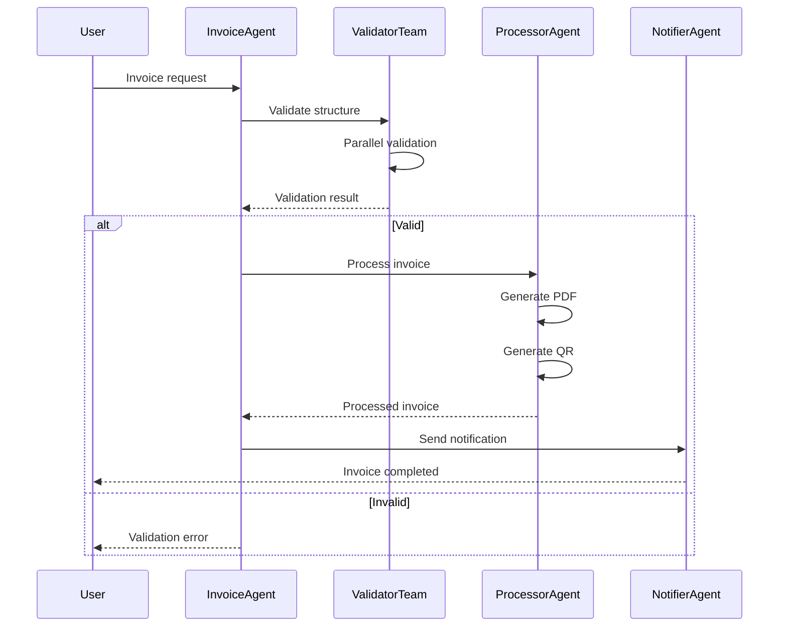
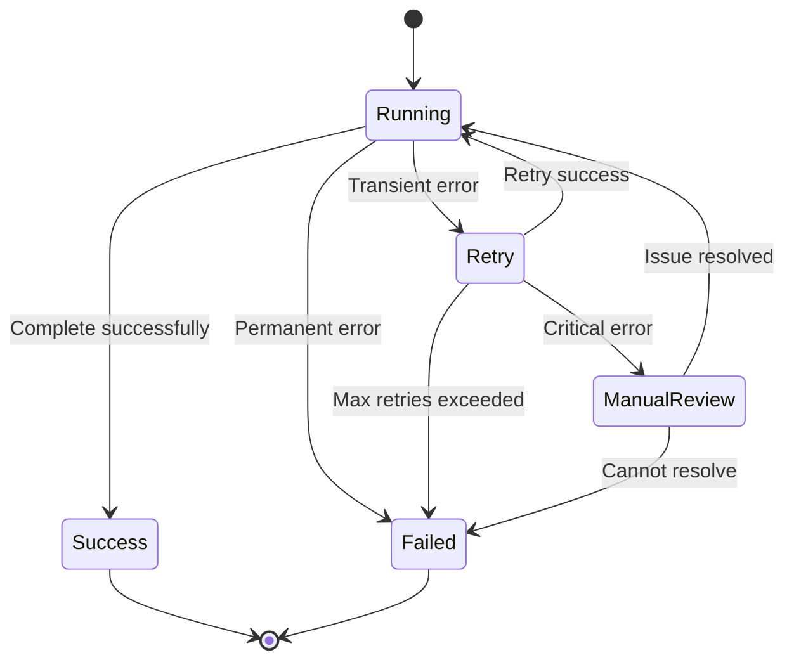

# SPEC_05_WORKFLOWS_AND_TEAMS

> **Purpose**: Define how yaml-agno declares complex runtime workflows (via the schemas in SPEC_02), how it delegates their execution/coordination to Agno natively, the interaction contracts between distinct teams, and the orchestrator-level error recovery strategy. yaml-agno does NOT reimplement Agno's workflow runtime; it declares and orchestrates on top of it.

---

## 1. COMPLEX RUNTIME WORKFLOWS

> @ai-directive: yaml-agno does NOT implement a workflow runtime. It declares workflows using `WorkflowConfig` / `StepConfig` (defined as SSOT in SPEC_02) and delegates execution/coordination to Agno natively. The examples in this section are USAGE of those schemas, not their definition. `StepType` values follow Agno's capitalized enum (`Step`, `Parallel`, `Condition`, `Router`, `Loop`, `Function`, `Workflow`, `Steps`).

### 1.1 Sequence Diagram - Invoice Workflow



### 1.2 Workflow YAML Example

> @ai-directive: The authoritative shape of this YAML (`WorkflowConfig`, `StepConfig`, `StepType`, `merge_strategy`, `condition`, `if_true`/`if_false`, parallel sub-steps) is defined as SSOT in SPEC_02. The snippet below is an illustrative USAGE of those schemas. All `type` values use Agno's capitalized `StepType` enum.

```yaml
workflow:
  name: "invoice_processing"
  description: "Complete invoice processing workflow"
  
  steps:
    # Step 1: Receive request
    - step: receive_request
      type: Step
      agent: invoice_receiver
      description: "Receive and parse invoice request"
    
    # Step 2: Parallel validation
    - step: validate_invoice
      type: Parallel
      description: "Validate all aspects in parallel"
      steps:
        - step: validate_structure
          type: Step
          agent: structure_validator
        - step: validate_content
          type: Step
          agent: content_validator
        - step: validate_format
          type: Step
          agent: format_validator
      
      merge_strategy: all  # All must succeed
    
    # Step 3: Conditional routing
    - step: check_validation
      type: Condition
      condition: "${result.all_valid == true}"
      if_true: process_invoice
      if_false: return_error
    
    # Step 4: Process (if valid)
    - step: process_invoice
      type: Step
      agent: invoice_processor
      description: "Generate PDF and QR code"
    
    # Step 5: Send notification
    - step: send_notification
      type: Step
      agent: notification_sender
      
    # Step 6: Error handler
    - step: return_error
      type: Step
      agent: error_handler
      description: "Return validation errors to user"
```

---

## 2. TEAM INTERACTION CONTRACTS

> @ai-directive: Within a single Agno Team, message passing and member coordination are handled natively by Agno. The contracts in this section concern coordination BETWEEN distinct teams (cross-team boundaries), which Agno does not orchestrate for yaml-agno's composed workflows.

### 2.1 Information Passing Protocol

**Contract**: Distinct teams exchange information via `cognitive_profile` schemas at cross-team boundaries.

```yaml
# Input/Output schemas contract
cognitive_profile:
  invoice_validator:
    input_schema:
      type: object
      properties:
        invoice_data: { type: object }
        client_id: { type: string }
    
    output_schema:
      type: object
      properties:
        is_valid: { type: boolean }
        errors: { type: array }
        warnings: { type: array }
  
  invoice_processor:
    input_schema:
      type: object
      properties:
        validated_invoice: { type: object }
        client_profile: { type: object }
    
    output_schema:
      type: object
      properties:
        invoice_pdf: { type: string }  # Base64 or URL
        qr_code: { type: string }
        processing_time_ms: { type: number }
```

### 2.2 Message Passing Protocol (Cross-Team)

> @ai-directive: This protocol applies ONLY to coordination between distinct teams at workflow boundaries. Intra-team messaging (members of the same Agno Team) is handled natively by Agno and is NOT reimplemented here. If a single workflow only spans one team, this protocol is not exercised.

```python
# yaml-agno/src/workflows/message_protocol.py

from pydantic import BaseModel, Field
from typing import Any, Dict
from enum import Enum

class MessageType(str, Enum):
    REQUEST = "request"
    RESPONSE = "response"
    ERROR = "error"
    NOTIFICATION = "notification"

class TeamMessage(BaseModel):
    """Cross-team message exchanged between distinct teams at workflow boundaries.

    Attributes:
        message_id: Unique message identifier.
        message_type: Semantic type of the message.
        sender_team: Name of the sending team.
        receiver_team: Name of the receiving team.
        payload_schema: Name of the schema validating the payload.
        payload: Actual payload data.
        correlation_id: Optional correlation id for request-response pairing.
        conversation_id: Conversation thread identifier.
        timestamp: ISO8601 timestamp.
        metadata: Arbitrary metadata bag.
    """

    # Header
    message_id: str = Field(..., description="Unique message ID")
    message_type: MessageType = Field(..., description="Type of message")
    sender_team: str = Field(..., description="Sender team name")
    receiver_team: str = Field(..., description="Receiver team name")

    # Payload
    payload_schema: str = Field(..., description="Schema name for payload")
    payload: Dict[str, Any] = Field(..., description="Actual payload data")

    # Context
    correlation_id: str | None = Field(None, description="Correlation for request-response")
    conversation_id: str = Field(..., description="Conversation thread ID")

    # Metadata
    timestamp: str = Field(..., description="ISO8601 timestamp")
    metadata: Dict[str, Any] = Field(default_factory=dict)

    def validate_payload(self, schema: type[BaseModel]) -> BaseModel:
        """Validate the payload against the provided schema.

        Args:
            schema: Pydantic model class used to validate the payload.

        Returns:
            The validated model instance.
        """
        return schema(**self.payload)
```

---

## 3. ERROR HANDLING COMPOSITION AT THE WORKFLOW LEVEL

> @ai-directive: yaml-agno does NOT reimplement error classification, ExceptionGroup handling, or single-call retry. Agno v2.6.14 already provides retry/error handling in its runtime for individual model/tool calls. yaml-agno CONSUMES the Core Infra `ErrorHandlingManager` (SPEC_00) for classification + reporting, and COMPOSES a step-level retry on top of Agno ONLY for workflow steps that Agno does not already cover. Resilience primitives (e.g. CircuitBreaker) are owned by SPEC_09 and referenced, not duplicated.

### 3.1 Consume Core Infra ErrorHandlingManager

**Responsibility**: classify, report, and decide the technical handling of failures. This is owned by Core Infra (SPEC_00) and consumed by the workflow orchestrator.

**Port (Protocol)** — owned by SPEC_00, referenced here:
```python
from typing import Protocol
from enum import Enum

class ErrorCategory(str, Enum):
    TRANSIENT = "transient"      # Retry possible
    PERMANENT = "permanent"      # Fail-fast
    VALIDATION = "validation"    # Input error
    AUTH = "auth"                # Authentication/authorization
    RATE_LIMIT = "rate_limit"    # Backoff required
    CRITICAL = "critical"        # Manual review

class ErrorHandlingManager(Protocol):
    def categorize_error(self, error: Exception) -> ErrorCategory: ...
    def should_retry(self, error: Exception) -> bool: ...
    async def report_error(self, error: Exception, context: dict) -> None: ...
```

### 3.2 Compose Step-Level Retry Above Agno

> @ai-directive: `RetryPolicy` here is a STEP-LEVEL retry composed by the yaml-agno workflow orchestrator when a step is NOT already covered by Agno's own retry. It does NOT replace Agno's model/tool call retry. Classification and reporting are delegated to the Core Infra `ErrorHandlingManager`. ExceptionGroup flattening is owned by Core Infra and is NOT reimplemented here.

```python
# yaml-agno/src/workflows/error_aware_executor.py

import asyncio

class ErrorAwareWorkflowExecutor:
    """Composes step-level retry on top of Agno's runtime.

    This executor does NOT re-run single model/tool calls that Agno already
    retries; it applies a workflow-level retry around a whole step when that
    step is not covered by Agno's built-in retry. Classification and reporting
    are delegated to the Core Infra ErrorHandlingManager (SPEC_00).
    """

    def __init__(self, error_manager: ErrorHandlingManager):
        self.error_manager = error_manager

    async def execute_workflow_step(
        self,
        step: WorkflowStep,
        retry_policy: RetryPolicy
    ) -> Result:
        """Execute a workflow step with step-level retry composition.

        Args:
            step: The workflow step to execute (delegates actual run to Agno).
            retry_policy: Step-level retry policy (backoff + jitter).

        Returns:
            The step result on success.

        Raises:
            The last error after retries are exhausted, or immediately for
            non-retryable errors as decided by ErrorHandlingManager.
        """
        last_error = None

        for attempt in range(retry_policy.max_retries + 1):
            try:
                return await step.execute()

            except Exception as e:
                last_error = e

                # Classify via Core Infra
                category = self.error_manager.categorize_error(e)

                # Report via Core Infra
                await self.error_manager.report_error(e, {
                    "step_name": step.name,
                    "attempt": attempt,
                    "category": category,
                })

                # Decide retry via Core Infra
                if not self.error_manager.should_retry(e):
                    raise  # Fail-fast for permanent errors

                if attempt < retry_policy.max_retries:
                    delay = retry_policy.calculate_delay(attempt)
                    await asyncio.sleep(delay)

        raise last_error  # Exhausted retries
```

**Do's & Don'ts**:
- DO classify and report errors through the Core Infra `ErrorHandlingManager` (SPEC_00).
- DO compose step-level retry with backoff + jitter only when Agno does not cover the step.
- DO reference resilience primitives from SPEC_09 (e.g. CircuitBreaker) instead of reimplementing them.
- DO NOT reimplement ExceptionGroup flattening (Core Infra owns it).
- DO NOT swallow errors without reporting them.
- DO NOT decide business retries (only technical retries).

**Dependencies**: ErrorHandlingManager (SPEC_00), RetryPolicy (this spec, step-level), ObservabilityManager, SPEC_09 resilience primitives.

---

## 4. ORCHESTRATOR-LEVEL ERROR RECOVERY

> @ai-directive: This state machine describes the yaml-agno WORKFLOW ORCHESTRATOR's recovery behavior (step-level retry + manual review routing on top of Agno), NOT Agno's internal runtime state. yaml-agno does not own a workflow execution runtime or a workflow lifecycle state machine; Agno executes steps natively.

### 4.1 Orchestrator Recovery State Machine



### 4.2 Error Categories

| Error Type | Category | Recovery Strategy | Max Retries |
|------------|----------|-------------------|-------------|
| **Network timeout** | Transient | Exponential backoff (2, 4, 8s) | 3 |
| **API rate limit** | Transient | Wait + retry (60s) | 5 |
| **Invalid input** | Permanent | Return error, no retry | 0 |
| **Agent failure** | Transient | Retry with fresh context | 3 |
| **Database timeout** | Transient | Retry with new connection | 2 |
| **Configuration error** | Permanent | Fail fast, alert admin | 0 |

### 4.3 Step-Level Retry Policy Implementation

> @ai-directive: `RetryPolicy` is a STEP-LEVEL policy composed by the yaml-agno workflow orchestrator on top of Agno. It does NOT replace Agno's retry for individual model/tool calls. Error classification is delegated to the Core Infra `ErrorHandlingManager` (SPEC_00); the local `ErrorCategory` enum is kept only as a lightweight retry signal. No `asyncio.gather`; concurrency uses `asyncio.TaskGroup` (see §5 TDD and parallel steps).

```python
# yaml-agno/src/workflows/retry_policy.py

from enum import Enum
from typing import Callable, Any
import asyncio

class ErrorCategory(str, Enum):
    """Lightweight retry signal used by the step-level retry policy.

    Full classification (validation, auth, rate_limit, critical, ...) is owned
    by the Core Infra ErrorHandlingManager (SPEC_00).
    """
    TRANSIENT = "transient"
    PERMANENT = "permanent"
    CRITICAL = "critical"

class RetryPolicy:
    """Step-level retry policy with exponential backoff + jitter.

    This policy is composed at the workflow-step boundary by the yaml-agno
    orchestrator when a step is not already covered by Agno's own retry.
    """

    def __init__(
        self,
        max_retries: int = 3,
        base_delay: float = 2.0,
        max_delay: float = 60.0,
        jitter: bool = True
    ):
        self.max_retries = max_retries
        self.base_delay = base_delay
        self.max_delay = max_delay
        self.jitter = jitter

    def is_retryable(self, error: Exception, error_manager: ErrorHandlingManager) -> bool:
        """Decide whether a step error is retryable.

        @ai-directive: classification is DELEGATED to the Core Infra
        ErrorHandlingManager (no local classifier). yaml-agno only asks the
        coarse retry question (transient -> retryable).

        Args:
            error: The raised exception.
            error_manager: Core Infra ErrorHandlingManager that classifies errors.

        Returns:
            True if the error is transient (retryable), False otherwise.
        """
        category = error_manager.categorize_error(error)  # Core Infra, SPEC_00
        return category == ErrorCategory.TRANSIENT

    async def execute_with_retry(
        self,
        func: Callable[..., Any],
        error_manager: ErrorHandlingManager,
        *args: Any,
        **kwargs: Any
    ) -> Any:
        """Execute a step-level callable with the retry policy.

        @ai-directive: retry is step-level (above Agno); it does NOT replace
        Agno's model-level retry. Classification delegated to Core Infra.

        Args:
            func: Async callable to execute.
            error_manager: Core Infra ErrorHandlingManager (SPEC_00).
            *args: Positional arguments forwarded to func.
            **kwargs: Keyword arguments forwarded to func.

        Returns:
            The result of func on success.

        Raises:
            The last error after retries are exhausted, or immediately for
            non-retryable errors.
        """
        last_error = None

        for attempt in range(self.max_retries + 1):
            try:
                return await func(*args, **kwargs)

            except Exception as e:
                last_error = e

                if not self.is_retryable(e, error_manager):
                    raise  # Non-retryable: do not retry

                if attempt < self.max_retries:
                    delay = self.calculate_delay(attempt)
                    await asyncio.sleep(delay)

        raise last_error  # Exhausted retries

    def calculate_delay(self, attempt: int) -> float:
        """Compute the delay with exponential backoff + jitter.

        @ai-directive: PUBLIC so ErrorAwareWorkflowExecutor can call it.

        Args:
            attempt: Zero-based attempt index.

        Returns:
            Delay in seconds, capped at max_delay, with optional +/-50% jitter.
        """
        delay = min(self.base_delay * (2 ** attempt), self.max_delay)

        if self.jitter:
            import random
            delay = delay * (0.5 + random.random())  # ±50%

        return delay
```

---

## 5. BEHAVIOR DELTA - BDD SCENARIOS

### 5.1 Acceptance Scenarios

#### Scenario 1: Golden Path - Parallel Workflow Execution

```gherkin
GIVEN a workflow with parallel validation steps
AND all validation agents are available
WHEN the workflow executes
THEN all validation steps run concurrently
AND the workflow waits for all to complete
AND the merge_strategy="all" requires all success
AND the workflow proceeds to the next step
```

#### Scenario 2: Error Case - Transient Error with Retry

```gherkin
GIVEN a workflow step that calls an external API
AND the API returns a timeout error
WHEN the retry policy is active
THEN the step is retried after 2 seconds
AND the retry uses exponential backoff
AND after 3 attempts the step succeeds
AND the workflow continues
```

#### Scenario 3: Error Case - Permanent Error Fails Fast

```gherkin
GIVEN a workflow step with invalid input
AND the validation raises a ValidationError
WHEN the step executes
THEN the error is categorized as PERMANENT
AND no retry is attempted
AND the workflow fails immediately
AND the error is returned to the user
```

#### Scenario 4: Golden Path - Team Message Passing

```gherkin
GIVEN two teams with defined cognitive profiles
AND Team A sends a message to Team B
WHEN the message is delivered
THEN the payload is validated against Team B's input schema
AND Team B processes the message
AND Team B responds with its output schema
AND the correlation_id matches the request
```

---

## 6. TDD MICRO-TASK EXECUTION PROTOCOL

### 6.1 Cascading Task Checklist

> @ai-directive: yaml-agno declares workflows via `WorkflowConfig` / `StepConfig` (SSOT in SPEC_02) and delegates execution to Agno. These tasks cover DECLARATION + delegation + step-level retry composition, NOT a proprietary workflow runtime/state machine. `StepType` values are Agno's capitalized enum (`Step`, `Parallel`, `Condition`, `Router`, `Loop`). Parallel steps use `asyncio.TaskGroup`, never `asyncio.gather`.

#### TASK_001: Declare Workflow via WorkflowConfig/StepConfig (SPEC_02)

- **File**: `yaml-agno/src/workflows/models.py`
- **Test**: `tests/unit/workflows/test_models.py`
- **RED**:
  ```python
  def test_workflow_config_declaration():
      wf = WorkflowConfig(
          name="test",
          steps=[StepConfig(step="s1", type=StepType.STEP, agent="a1")],
      )
      assert wf.name == "test"
      assert wf.steps[0].type == StepType.STEP
  ```
- **GREEN**: Build a `WorkflowConfig` from parsed YAML, referencing the SSOT schemas from SPEC_02. Do NOT introduce a `WorkflowExecution` / `WorkflowState` lifecycle model.
- **Commit**: `feat: declare workflow via WorkflowConfig/StepConfig (SPEC_02)`

#### TASK_002: Implement Step Executor (delegates to Agno)

- **File**: `yaml-agno/src/workflows/step_executor.py`
- **Test**: `tests/unit/workflows/test_step_executor.py`
- **RED**:
  ```python
  async def test_execute_step_delegates_to_agno():
      executor = StepExecutor()
      result = await executor.execute_step(
          step_config=StepConfig(step="s1", type=StepType.STEP, agent="test"),
          agents={"test": mock_agent}
      )
      assert result is not None
  ```
- **GREEN**: Implement `StepExecutor.execute_step()` delegating the actual run to Agno.
- **Commit**: `feat: add step execution delegating to Agno`

#### TASK_003: Implement Parallel Step Executor

- **File**: `yaml-agno/src/workflows/step_executor.py`
- **Test**: `tests/unit/workflows/test_step_executor.py`
- **RED**:
  ```python
  async def test_execute_parallel_steps():
      executor = StepExecutor()
      result = await executor.execute_parallel_step(
          steps=[...],
          agents=...
      )
      assert result.merge_strategy == "all"
  ```
- **GREEN**: Implement `execute_parallel_step()` with asyncio.TaskGroup (NOT asyncio.gather).
- **Commit**: `feat: add parallel step execution`

#### TASK_004: Implement Condition Evaluator

- **File**: `yaml-agno/src/workflows/condition_evaluator.py`
- **Test**: `tests/unit/workflows/test_condition_evaluator.py`
- **RED**:
  ```python
  def test_evaluate_cel_condition():
      evaluator = ConditionEvaluator()
      result = evaluator.evaluate("${input.amount > 1000}", {"amount": 1500})
      assert result is True
  ```
- **GREEN**: Implement CEL evaluation.
- **Commit**: `feat: add CEL condition evaluation`

#### TASK_005: Implement Step-Level Retry Policy

- **File**: `yaml-agno/src/workflows/retry_policy.py`
- **Test**: `tests/unit/workflows/test_retry_policy.py`
- **RED**:
  ```python
  async def test_retry_on_transient_error():
      policy = RetryPolicy(max_retries=3)
      attempts = [0]

      async def failing_func():
          attempts[0] += 1
          if attempts[0] < 3:
              raise TimeoutError()
          return "success"

      result = await policy.execute_with_retry(failing_func)
      assert result == "success"
      assert attempts[0] == 3
  ```
- **GREEN**: Implement step-level `execute_with_retry()` (backoff + jitter) composed above Agno; delegate full classification to Core Infra ErrorHandlingManager.
- **Commit**: `feat: add step-level retry with exponential backoff`

#### TASK_006: Implement Retry Decision (classification delegated to Core Infra)

- **File**: `yaml-agno/src/workflows/retry_policy.py`
- **Test**: `tests/unit/workflows/test_retry_policy.py`
- **RED**:
  ```python
  def test_transient_error_is_retryable():
      policy = RetryPolicy()
      # Classification is delegated to Core Infra ErrorHandlingManager (SPEC_00),
      # NOT reimplemented locally.
      assert policy.is_retryable(TimeoutError(), error_manager) is True
  ```
- **GREEN**: Implement `is_retryable()` that asks the Core Infra `ErrorHandlingManager.categorize_error()` and treats `TRANSIENT` as retryable.
- **Commit**: `feat: add retry decision delegated to Core Infra`

#### TASK_007: Implement Team Message Protocol

- **File**: `yaml-agno/src/workflows/message_protocol.py`
- **Test**: `tests/unit/workflows/test_message_protocol.py`
- **RED**:
  ```python
  def test_team_message_creation():
      msg = TeamMessage(
          message_id="m1",
          message_type=MessageType.REQUEST,
          sender_team="A",
          receiver_team="B",
          payload_schema="InvoiceRequest",
          payload={"data": "test"},
          conversation_id="conv1",
          timestamp="2026-06-13T10:00:00Z"
      )
      assert msg.sender_team == "A"
  ```
- **GREEN**: Implement `TeamMessage` with Pydantic (cross-team boundary only).
- **Commit**: `feat: add cross-team message protocol`

#### TASK_008: Verify Agno Delegation (No Proprietary Workflow Runtime)

- **File**: N/A (verification task)
- **Test**: `tests/unit/workflows/test_no_workflow_runtime.py`
- **RED**:
  ```python
  def test_no_proprietary_workflow_runtime_classes():
      # yaml-agno must NOT introduce its own workflow execution runtime
      # or workflow lifecycle state machine; Agno executes steps natively.
      import yaml_agno.workflows as w
      assert not hasattr(w, "WorkflowExecution")
      assert not hasattr(w, "WorkflowState")
      assert not hasattr(w, "WorkflowStateMachine")
  ```
- **GREEN**: Ensure workflows are DECLARED via `WorkflowConfig`/`StepConfig` (SPEC_02) and execution is delegated to Agno. No proprietary workflow runtime/state machine is introduced.
- **Commit**: `test: assert no proprietary workflow runtime (Agno delegates)`

---

## 7. ADOPTED TECHNICAL ASSUMPTIONS

### [Decision 1] CEL for Conditions

**Rationale**:
- Industry standard for configurable expressions
- Type-safe and sandboxable
- Supported by Agno Framework

### [Decision 2] Exponential Backoff with Jitter (Step-Level)

**Rationale**:
- Prevents the thundering-herd problem
- Jitter (+/-50%) spreads retries over time
- Better than fixed delay for distributed systems
- Applied at the workflow-step level above Agno (does not replace Agno's call-level retry)

### [Decision 3] Correlation ID for Cross-Team Request-Response

**Rationale**:
- Traces requests across distinct teams
- Enables distributed debugging
- Required for observability

---

## 8. STRATEGIC CALIBRATION QUESTIONS

### [Question 1] Per-Workflow-Step Timeout

**Should there be a global timeout per workflow step (e.g. 5 minutes)?**

Implications:
- **Yes**: Prevents hung workflows, better UX
- **No**: Flexibility for long tasks (e.g. large PDF generation)
- **Trade-off**: Safety vs flexibility

### [Question 2] Deadlock Detection in Parallel Steps

**How to detect and resolve deadlocks in workflows with cyclic dependencies?**

Implications:
- **Detect**: Topological sort before execution
- **Resolve**: Explicit error + graph visualization
- **Trade-off**: Upfront validation vs runtime discovery

### [Question 3] Orchestration vs Choreography

**Should workflows be orchestrated (central controller) or choreographed (event-driven)?**

Implications:
- **Orchestration**: Simpler, easier debugging
- **Choreography**: More scalable, better for distributed teams
- **Trade-off**: Simplicity vs scalability

---

*Do you want to deepen the technical specification to **Level 6** for a specific component, or authorize the execution of these tasks by the agent team?*
