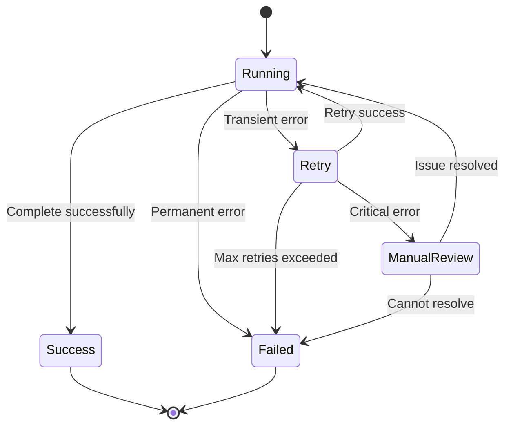

# SPEC_05_WORKFLOWS_AND_TEAMS

> **Propósito**: Definir workflows complejos de runtime, contratos de interacción entre teams y máquina de estados para recuperación de errores.

---

## 1. COMPLEX RUNTIME WORKFLOWS

### 1.1 Diagrama de Secuencia - Workflow de Facturación

```mermaid
sequenceDiagram
    participant User
    participant InvoiceAgent
    participant ValidatorTeam
    participant ProcessorAgent
    participantNotifierAgent
    
    User->>InvoiceAgent: Invoice request
    InvoiceAgent->>ValidatorTeam: Validate structure
    ValidatorTeam->>ValidatorTeam: Parallel validation
    ValidatorTeam-->>InvoiceAgent: Validation result
    
    alt Valid
        InvoiceAgent->>ProcessorAgent: Process invoice
        ProcessorAgent->>ProcessorAgent: Generate PDF
        ProcessorAgent->>ProcessorAgent: Generate QR
        ProcessorAgent-->>InvoiceAgent: Processed invoice
        InvoiceAgent->>NotifierAgent: Send notification
        NotifierAgent-->>User: Invoice completed
    else Invalid
        InvoiceAgent-->>User: Validation error
    end
```

### 1.2 Workflow YAML Complejo

```yaml
workflow:
  name: "invoice_processing"
  description: "Complete invoice processing workflow"
  
  steps:
    # Step 1: Receive request
    - step: receive_request
      type: agent
      agent: invoice_receiver
      description: "Receive and parse invoice request"
    
    # Step 2: Parallel validation
    - step: validate_invoice
      type: parallel
      description: "Validate all aspects in parallel"
      steps:
        - step: validate_structure
          type: agent
          agent: structure_validator
        - step: validate_content
          type: agent
          agent: content_validator
        - step: validate_format
          type: agent
          agent: format_validator
      
      merge_strategy: all  # All must succeed
    
    # Step 3: Conditional routing
    - step: check_validation
      type: condition
      condition: "${result.all_valid == true}"
      if_true: process_invoice
      if_false: return_error
    
    # Step 4: Process (if valid)
    - step: process_invoice
      type: agent
      agent: invoice_processor
      description: "Generate PDF and QR code"
    
    # Step 5: Send notification
    - step: send_notification
      type: agent
      agent: notification_sender
      
    # Step 6: Error handler
    - step: return_error
      type: agent
      agent: error_handler
      description: "Return validation errors to user"
```

---

## 2. TEAM INTERACTION CONTRACTS

### 2.1 Protocolo de Paso de Información

**Contract**: Teams intercambian información vía `cognitive_profile` schemas

```yaml
# Input/Output schemas contract
cognitive_profile:
  invoice_validator:
    input_schema:
      type: object
      properties:
        invoice_data: { type: object }
        client_id: { type: string }
    
    output_schema:
      type: object
      properties:
        is_valid: { type: boolean }
        errors: { type: array }
        warnings: { type: array }
  
  invoice_processor:
    input_schema:
      type: object
      properties:
        validated_invoice: { type: object }
        client_profile: { type: object }
    
    output_schema:
      type: object
      properties:
        invoice_pdf: { type: string }  # Base64 or URL
        qr_code: { type: string }
        processing_time_ms: { type: number }
```

### 2.2 Message Passing Protocol

```python
# yaml-agno/src/workflows/message_protocol.py

from pydantic import BaseModel, Field
from typing import Any, Dict
from enum import Enum

class MessageType(str, Enum):
    REQUEST = "request"
    RESPONSE = "response"
    ERROR = "error"
    NOTIFICATION = "notification"

class TeamMessage(BaseModel):
    """Mensaje entre teams"""
    
    # Header
    message_id: str = Field(..., description="Unique message ID")
    message_type: MessageType = Field(..., description="Type of message")
    sender_team: str = Field(..., description="Sender team name")
    receiver_team: str = Field(..., description="Receiver team name")
    
    # Payload
    payload_schema: str = Field(..., description="Schema name for payload")
    payload: Dict[str, Any] = Field(..., description="Actual payload data")
    
    # Context
    correlation_id: str | None = Field(None, description="Correlation for request-response")
    conversation_id: str = Field(..., description="Conversation thread ID")
    
    # Metadata
    timestamp: str = Field(..., description="ISO8601 timestamp")
    metadata: Dict[str, Any] = Field(default_factory=dict)
    
    def validate_payload(self, schema: type[BaseModel]) -> BaseModel:
        """Valida payload contra schema"""
        return schema(**self.payload)
```

---

## 3. ERROR RECOVERY STATE MACHINE

### 3.1 Máquina de Estados para Recovery



### 3.2 Error Categories

| Error Type | Category | Recovery Strategy | Max Retries |
|------------|----------|-------------------|-------------|
| **Network timeout** | Transient | Exponential backoff (2, 4, 8s) | 3 |
| **API rate limit** | Transient | Wait + retry (60s) | 5 |
| **Invalid input** | Permanent | Return error, no retry | 0 |
| **Agent failure** | Transient | Retry with fresh context | 3 |
| **Database timeout** | Transient | Retry with new connection | 2 |
| **Configuration error** | Permanent | Fail fast, alert admin | 0 |

### 3.3 Retry Policy Implementation

```python
# yaml-agno/src/workflows/retry_policy.py

from enum import Enum
from typing import Callable, Any
import asyncio

class ErrorCategory(str, Enum):
    TRANSIENT = "transient"
    PERMANENT = "permanent"
    CRITICAL = "critical"

class RetryPolicy:
    """Política de retry con exponential backoff"""
    
    def __init__(
        self,
        max_retries: int = 3,
        base_delay: float = 2.0,
        max_delay: float = 60.0,
        jitter: bool = True
    ):
        self.max_retries = max_retries
        self.base_delay = base_delay
        self.max_delay = max_delay
        self.jitter = jitter
    
    def categorize_error(self, error: Exception) -> ErrorCategory:
        """Categoriza error para decidir retry"""
        error_type = type(error).__name__
        
        # Transient errors
        if error_type in ["TimeoutError", "ConnectionError", "RateLimitError"]:
            return ErrorCategory.TRANSIENT
        
        # Permanent errors
        elif error_type in ["ValueError", "ValidationError", "AuthenticationError"]:
            return ErrorCategory.PERMANENT
        
        # Critical errors
        elif error_type in ["DatabaseConnectionError", "SystemFailure"]:
            return ErrorCategory.CRITICAL
        
        return ErrorCategory.PERMANENT  # Default
    
    async def execute_with_retry(
        self,
        func: Callable[..., Any],
        *args: Any,
        **kwargs: Any
    ) -> Any:
        """Ejecuta función con retry policy"""
        last_error = None
        
        for attempt in range(self.max_retries + 1):
            try:
                return await func(*args, **kwargs)
            
            except Exception as e:
                last_error = e
                category = self.categorize_error(e)
                
                if category == ErrorCategory.PERMANENT:
                    raise  # No retry for permanent errors
                
                if category == ErrorCategory.CRITICAL:
                    # TODO: Trigger manual review
                    raise
                
                if attempt < self.max_retries:
                    delay = self._calculate_delay(attempt)
                    await asyncio.sleep(delay)
        
        raise last_error  # Exhausted retries
    
    def _calculate_delay(self, attempt: int) -> float:
        """Calcula delay con exponential backoff + jitter"""
        delay = min(self.base_delay * (2 ** attempt), self.max_delay)
        
        if self.jitter:
            import random
            delay = delay * (0.5 + random.random())  # ±50%
        
        return delay
```

---

## 4. BEHAVIOR DELTA - BDD SCENARIOS

### 4.1 Escenarios de Aceptación

#### Scenario 1: Golden Path - Parallel Workflow Execution

```gherkin
GIVEN a workflow with parallel validation steps
AND all validation agents are available
WHEN the workflow executes
THEN all validation steps run concurrently
AND the workflow waits for all to complete
AND the merge_strategy="all" requires all success
AND the workflow proceeds to the next step
```

#### Scenario 2: Error Case - Transient Error with Retry

```gherkin
GIVEN a workflow step that calls an external API
AND the API returns a timeout error
WHEN the retry policy is active
THEN the step is retried after 2 seconds
AND the retry uses exponential backoff
AND after 3 attempts the step succeeds
AND the workflow continues
```

#### Scenario 3: Error Case - Permanent Error Fails Fast

```gherkin
GIVEN a workflow step with invalid input
AND the validation raises a ValidationError
WHEN the step executes
THEN the error is categorized as PERMANENT
AND no retry is attempted
AND the workflow fails immediately
AND the error is returned to the user
```

#### Scenario 4: Golden Path - Team Message Passing

```gherkin
GIVEN two teams with defined cognitive profiles
AND Team A sends a message to Team B
WHEN the message is delivered
THEN the payload is validated against Team B's input schema
AND Team B processes the message
AND Team B responds with its output schema
AND the correlation_id matches the request
```

---

## 5. TDD MICRO-TASK EXECUTION PROTOCOL

### 5.1 Cascading Task Checklist

#### TASK_001: Define Workflow Execution Model

- **File**: `yaml-agno/src/workflows/models.py`
- **Test**: `tests/unit/workflows/test_models.py`
- **RED**:
  ```python
  def test_workflow_execution_creation():
      exec = WorkflowExecution(workflow_name="test")
      assert exec.state == WorkflowState.CREATED
  ```
- **GREEN**: Implementar `WorkflowExecution` con lifecycle
- **Commit**: `feat: add WorkflowExecution model`

#### TASK_002: Implement Step Executor

- **File**: `yaml-agno/src/workflows/step_executor.py`
- **Test**: `tests/unit/workflows/test_step_executor.py`
- **RED**:
  ```python
  async def test_execute_agent_step():
      executor = StepExecutor()
      result = await executor.execute_step(
          step_config=StepConfig(step="s1", type=StepType.AGENT, agent="test"),
          agents={"test": mock_agent}
      )
      assert result is not None
  ```
- **GREEN**: Implementar `StepExecutor.execute_step()`
- **Commit**: `feat: add agent step execution`

#### TASK_003: Implement Parallel Step Executor

- **File**: `yaml-agno/src/workflows/step_executor.py`
- **Test**: `tests/unit/workflows/test_step_executor.py`
- **RED**:
  ```python
  async def test_execute_parallel_steps():
      executor = StepExecutor()
      result = await executor.execute_parallel_step(
          steps=[...],
          agents=...
      )
      assert result.merge_strategy == "all"
  ```
- **GREEN**: Implementar `execute_parallel_step()` con asyncio.gather
- **Commit**: `feat: add parallel step execution`

#### TASK_004: Implement Condition Evaluator

- **File**: `yaml-agno/src/workflows/condition_evaluator.py`
- **Test**: `tests/unit/workflows/test_condition_evaluator.py`
- **RED**:
  ```python
  def test_evaluate_cel_condition():
      evaluator = ConditionEvaluator()
      result = evaluator.evaluate("${input.amount > 1000}", {"amount": 1500})
      assert result is True
  ```
- **GREEN**: Implementar CEL evaluation
- **Commit**: `feat: add CEL condition evaluation`

#### TASK_005: Implement Retry Policy

- **File**: `yaml-agno/src/workflows/retry_policy.py`
- **Test**: `tests/unit/workflows/test_retry_policy.py`
- **RED**:
  ```python
  async def test_retry_on_transient_error():
      policy = RetryPolicy(max_retries=3)
      attempts = [0]
      
      async def failing_func():
          attempts[0] += 1
          if attempts[0] < 3:
              raise TimeoutError()
          return "success"
      
      result = await policy.execute_with_retry(failing_func)
      assert result == "success"
      assert attempts[0] == 3
  ```
- **GREEN**: Implementar `execute_with_retry()`
- **Commit**: `feat: add retry with exponential backoff`

#### TASK_006: Implement Error Categorization

- **File**: `yaml-agno/src/workflows/retry_policy.py`
- **Test**: `tests/unit/workflows/test_retry_policy.py`
- **RED**:
  ```python
  def test_categorize_transient_error():
      policy = RetryPolicy()
      category = policy.categorize_error(TimeoutError())
      assert category == ErrorCategory.TRANSIENT
  ```
- **GREEN**: Implementar `categorize_error()`
- **Commit**: `feat: add error categorization`

#### TASK_007: Implement Team Message Protocol

- **File**: `yaml-agno/src/workflows/message_protocol.py`
- **Test**: `tests/unit/workflows/test_message_protocol.py`
- **RED**:
  ```python
  def test_team_message_creation():
      msg = TeamMessage(
          message_id="m1",
          message_type=MessageType.REQUEST,
          sender_team="A",
          receiver_team="B",
          payload_schema="InvoiceRequest",
          payload={"data": "test"},
          conversation_id="conv1",
          timestamp="2026-06-13T10:00:00Z"
      )
      assert msg.sender_team == "A"
  ```
- **GREEN**: Implementar `TeamMessage` con Pydantic
- **Commit**: `feat: add team message protocol`

#### TASK_008: Implement Workflow State Machine

- **File**: `yaml-agno/src/workflows/state_machine.py`
- **Test**: `tests/unit/workflows/test_state_machine.py`
- **RED**:
  ```python
  def test_workflow_state_transitions():
      sm = WorkflowStateMachine()
      sm.transition_to(WorkflowState.RUNNING)
      assert sm.state == WorkflowState.RUNNING
  ```
- **GREEN**: Implementar `WorkflowStateMachine` con validación
- **Commit**: `feat: add workflow state machine`

---

## 6. SUPUESTOS TÉCNICOS ADOPTADOS

### [Decisión 1] CEL para Condiciones

**Justificación**:
- Standard de industria para expressions configurables
- Type-safe y sandboxeable
- Soportado por Agno Framework

### [Decisión 2] Exponential Backoff con Jitter

**Justificación**:
- Previene thundering herd problem
- Jitter (±50%) distribuye retries en el tiempo
- Mejor que fixed delay para distributed systems

### [Decisión 3] Correlation ID para Request-Response

**Justificación**:
- Traza requests a través de múltiples teams
- Habilita debugging distribuido
- Necesario para observabilidad

---

## 7. PREGUNTAS DE CALIBRACIÓN ESTRATÉGICA

### [Pregunta 1] Timeout por Workflow Step

**¿Debería haber timeout global por workflow step (ej: 5 minutos)?**

Implica:
- **Sí**: Previene hung workflows, mejor UX
- **No**: Flexibilidad para tareas largas (ej: generación de PDFs grandes)
- **Trade-off**: Safety vs flexibilidad

### [Pregunta 2] Deadlock Detection en Parallel Steps

**¿Cómo detectar y resolver deadlocks en workflows con cyclic dependencies?**

Implica:
- **Detect**: Topological sort antes de ejecutar
- **Resolver**: Error explícito + graph visualization
- **Trade-off**: Validación upfront vs runtime discovery

### [Pregunta 3] Orchestration vs Choreography

**¿Workflows deben ser orchestrated (central controller) o choreographed (event-driven)?**

Implica:
- **Orchestration**: Más simple, debugging más fácil
- **Choreography**: Más scalable, mejor para distributed teams
- **Trade-off**: Simplicidad vs escalabilidad

---

*¿Deseas profundizar la especificación técnica al **Nivel 6** de algún componente específico o autorizar la ejecución de estas tareas por parte del equipo de agentes?*
