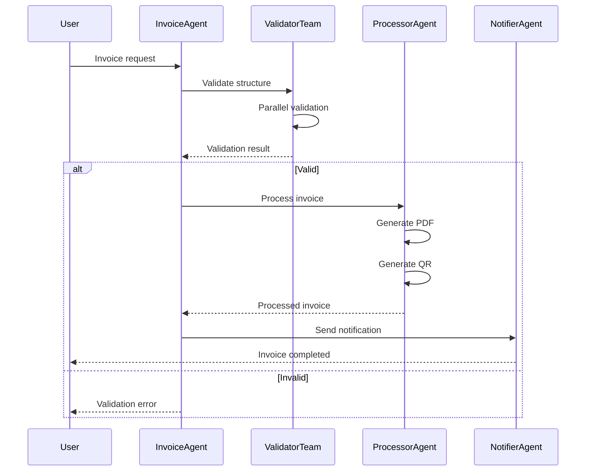
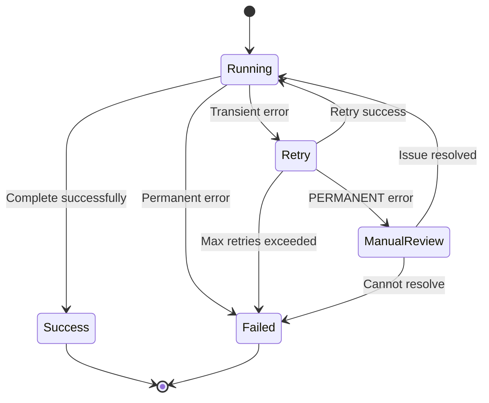

# SPEC_05_WORKFLOWS_AND_TEAMS

> **Purpose**: Define how yaml-agno declares complex runtime workflows (via the schemas in SPEC_02), how it delegates their execution/coordination to Agno natively, the interaction contracts between distinct teams, and the orchestrator-level error recovery strategy. yaml-agno does NOT reimplement Agno's workflow runtime; it declares and orchestrates on top of it.

> @ai-directive: Full `core-cenf-py` ↔ Agno integration audit is deferred and happens AFTER all SPECs are corrected (per user decision). This SPEC only consumes the already-verified `ErrorHandlingManager` real API from `core_infrastructure.errors` (`ports.py:30`). Do NOT invent additional core-cenf ports here; any new integration surface is out of scope until the post-correction audit.

---

## 1. COMPLEX RUNTIME WORKFLOWS

> @ai-directive: yaml-agno does NOT implement a workflow runtime. It declares workflows using `WorkflowConfig` / `StepConfig` (defined as SSOT in SPEC_02) and delegates execution/coordination to Agno natively. The examples in this section are USAGE of those schemas, not their definition. `StepType` values follow Agno's capitalized enum (`Step`, `Parallel`, `Condition`, `Router`, `Loop`, `Function`, `Workflow`, `Steps`).

### 1.1 Sequence Diagram - Invoice Workflow



### 1.2 Workflow YAML Example

> @ai-directive: The authoritative shape of this YAML (`WorkflowConfig`, `StepConfig`, `StepType`, `merge_strategy`, `condition`, `if_true`/`if_false`, parallel sub-steps) is defined as SSOT in SPEC_02. The snippet below is an illustrative USAGE of those schemas. All `type` values use Agno's capitalized `StepType` enum.

```yaml
workflow:
  name: "invoice_processing"
  description: "Complete invoice processing workflow"
  
  steps:
    # Step 1: Receive request
    - step: receive_request
      type: Step
      agent: invoice_receiver
      description: "Receive and parse invoice request"
    
    # Step 2: Parallel validation
    - step: validate_invoice
      type: Parallel
      description: "Validate all aspects in parallel"
      steps:
        - step: validate_structure
          type: Step
          agent: structure_validator
        - step: validate_content
          type: Step
          agent: content_validator
        - step: validate_format
          type: Step
          agent: format_validator
      
      merge_strategy: all  # All must succeed
    
    # Step 3: Conditional routing
    - step: check_validation
      type: Condition
      condition: "${result.all_valid == true}"
      if_true: process_invoice
      if_false: return_error
    
    # Step 4: Process (if valid)
    - step: process_invoice
      type: Step
      agent: invoice_processor
      description: "Generate PDF and QR code"
    
    # Step 5: Send notification
    - step: send_notification
      type: Step
      agent: notification_sender
      
    # Step 6: Error handler
    - step: return_error
      type: Step
      agent: error_handler
      description: "Return validation errors to user"
```

---

## 2. TEAM INTERACTION CONTRACTS

> @ai-directive: yaml-agno does NOT define its own inter-agent or inter-team wire protocol. It standardizes on Agno's native **A2A** (Agent-to-Agent, Google's protocol). Cross-team / cross-agent communication at workflow boundaries is delegated to A2A. Intra-team coordination (members of one Agno Team) is also owned by Agno (LLM-router `TeamMode` coordinate/route/broadcast/tasks; leader delegates via tool-call `member_agent.run`). yaml-agno does NOT reimplement any of this; it only CONFIGURES Agno's A2A surface from YAML.

### 2.1 Information Passing Protocol

**Contract**: Distinct teams exchange information via `cognitive_profile` schemas at cross-team boundaries, validated against A2A agent cards.

```yaml
# Input/Output schemas contract (validated at A2A boundaries)
cognitive_profile:
  invoice_validator:
    input_schema:
      type: object
      properties:
        invoice_data: { type: object }
        client_id: { type: string }

    output_schema:
      type: object
      properties:
        is_valid: { type: boolean }
        errors: { type: array }
        warnings: { type: array }

  invoice_processor:
    input_schema:
      type: object
      properties:
        validated_invoice: { type: object }
        client_profile: { type: object }

    output_schema:
      type: object
      properties:
        invoice_pdf: { type: string }  # Base64 or URL
        qr_code: { type: string }
        processing_time_ms: { type: number }
```

### 2.2 Inter-Team / Inter-Agent Wire Protocol: Agno A2A (delegated)

> @ai-directive: yaml-agno does NOT ship a custom `message_protocol.py` and does NOT model `TeamMessage` / `MessageType`. The wire protocol is Agno's native **A2A**:
> - **Server**: `agno/os/interfaces/a2a/a2a.py` `class A2A(BaseInterface)` (accepts agents / teams / workflows). Router mounts `/.well-known/agent-card.json`, `POST .../v1/message:send`, `.../v1/message:stream`, plus tasks `get` / `cancel`.
> - **Client**: `agno/client/a2a/client.py` `A2AClient` with `send_message` / `stream_message` / `get_agent_card`.
> - **Remotes**: `agno/{agent,team,workflow}/remote.py` — `RemoteAgent` / `RemoteTeam` / `RemoteWorkflow` with `protocol="a2a"`.
> - **AgentOS flag**: `a2a_interface: bool` (depends on external `a2a-sdk`).
>
> **ACP is NOT supported.** Agno has zero ACP code; yaml-agno does not invent it. A2A is the only inter-agent protocol yaml-agno configures.

yaml-agno exposes a thin YAML config surface that maps onto Agno's real A2A flags/classes (it does NOT reimplement the protocol):

```yaml
# yaml-agno exposes / consumes A2A endpoints declaratively
a2a:
  # Server side: enable Agno's A2A interface on the AgentOS app
  enable_interface: true            # maps to app.py `a2a_interface: bool`
  expose:
    - kind: agent
      ref: invoice_receiver
      description: "Receives and parses invoice requests"
    - kind: team
      ref: validator_team
      description: "Parallel invoice validation team"
    - kind: workflow
      ref: invoice_processing
      description: "End-to-end invoice workflow"

  # Client side: consume remote A2A endpoints via Agno Remote* classes
  remote:
    - name: remote_notifiers
      kind: team                     # -> agno/team/remote.py RemoteTeam
      endpoint: "https://notifiers.example.com"
      protocol: a2a                  # only "a2a" is supported
    - name: remote_archive_agent
      kind: agent                    # -> agno/agent/remote.py RemoteAgent
      endpoint: "https://archive.example.com"
      protocol: a2a
```

**Do's & Don'ts**:
- DO enable Agno's `a2a_interface` and list exposed agents/teams/workflows via the `a2a.expose` block.
- DO consume remote endpoints via `a2a.remote` (maps to `RemoteAgent` / `RemoteTeam` / `RemoteWorkflow` with `protocol="a2a"`).
- DO NOT define `TeamMessage`, `MessageType`, or any custom wire envelope.
- DO NOT add an ACP adapter (Agno has no ACP; nothing to map).
- DO NOT reimplement agent-card serialization, `message:send`, or `message:stream` (owned by Agno `A2A` / `A2AClient`).

**Dependencies**: Agno `A2A(BaseInterface)`, `A2AClient`, `RemoteAgent` / `RemoteTeam` / `RemoteWorkflow`, external `a2a-sdk`.

---

## 3. ERROR HANDLING COMPOSITION AT THE WORKFLOW LEVEL

> @ai-directive: yaml-agno does NOT reimplement error classification, ExceptionGroup handling, or single-call retry. Agno v2.6.18 already provides retry/error handling in its runtime:
> - **Model layer (mature, owned by Agno)**: `agno/models/base.py` exposes `retries`, `delay_between_retries`, `exponential_backoff`, `retry_with_guidance`, `retry_with_guidance_limit`. yaml-agno MAPS YAML onto these `Model.*` fields and does NOT reimplement model-level retry.
> - **Step layer (naive — THE REAL GAP)**: `agno/workflow/step.py` `Step.max_retries=3` uses a bare `except Exception` loop with immediate re-run — no backoff, no delay, no jitter, no per-exception classification. yaml-agno's `RetryPolicy` FILLS THIS GAP at the step layer only.
> - **HITL retry (native, do not rebuild)**: Agno owns `OnReject(skip|retry)`, `OnError(fail|skip|pause)`, `ErrorRequirement`, `hitl_max_retries`, and the `OnReject.retry` path.
>
> yaml-agno CONSUMES the real `core_infrastructure.errors.ErrorHandlingManager` (Protocol at `core-cenf-py/src/core_infrastructure/errors/ports.py:30`) for classification + reporting, and COMPOSES a step-level retry on top of Agno ONLY for the step-layer gap. The two layers are COMPLEMENTARY (core-cenf classifies+reports transversally and ALWAYS re-raises; Agno retries internally) — NOT conflicting. Resilience primitives (e.g. CircuitBreaker) are owned by SPEC_09 and referenced, not duplicated.

### 3.1 Consume real core-cenf-py ErrorHandlingManager

> @ai-directive: yaml-agno CONSUMES the real `core_infrastructure.errors.ErrorHandlingManager` — do NOT redefine the Protocol or the enum here (SSOT is `core-cenf-py`). The API below is a REFERENCE, not a yaml-agno declaration.
>
> Real API (`core-cenf-py/src/core_infrastructure/errors/ports.py:30`):
> - `classify(error: Exception) -> ErrorClassification`
> - `report(error: Exception, context: dict | None = None) -> None`  (SYNC — NOT async)
> - `handle(error: Exception, context: dict | None = None) -> ErrorReport`  (classify + report in one call)
> - `handle_errors(**decorator_opts) -> Callable[[F], F]`  (decorator factory, ALWAYS re-raises, NEVER swallows)
>
> There is NO `should_retry()` method — the retry decision is the CONSUMER's responsibility (yaml-agno's `RetryPolicy.is_retryable` asks `classify()` and treats `TRANSIENT` / `RATE_LIMIT` as retryable).
>
> `ErrorClassification` enum (`core-cenf-py/src/core_infrastructure/errors/models.py:23`): `TRANSIENT`, `PERMANENT`, `VALIDATION`, `AUTH`, `RATE_LIMIT`. There is NO `CRITICAL` value.
>
> `ErrorReport` (`models.py:63`): `error_type`, `message`, `source`, `correlation_id`, `tenant_id`.
>
> **Complementarity note**: Agno has NO equivalent `ErrorHandlingManager` — its retry is internal to the Model / Step. core-cenf `ErrorHandlingManager` classifies + reports transversally and ALWAYS re-raises (never swallows); Agno retries internally. They operate at different layers and do NOT conflict. yaml-agno composes a step-level retry policy that ASKS `classify()` whether an error is `TRANSIENT` to decide retry.

```python
# Reference only — SSOT is core-cenf-py. Imported, NOT redefined.
from core_infrastructure.errors import ErrorHandlingManager, ErrorClassification, ErrorReport
# ErrorHandlingManager methods: classify / report (sync) / handle / handle_errors
# ErrorClassification: TRANSIENT, PERMANENT, VALIDATION, AUTH, RATE_LIMIT  (no CRITICAL)
```

### 3.2 Compose Step-Level Retry Above Agno (the real gap)

> @ai-directive: `RetryPolicy` here is a STEP-LEVEL retry composed by the yaml-agno workflow orchestrator to fill Agno's step-layer gap (`step.py` naive immediate re-run with no backoff/jitter/classification). It does NOT replace Agno's model-level retry (`Model.retries` etc.) nor Agno's HITL retry. Classification is delegated to core-cenf `ErrorHandlingManager.classify()` (returning `ErrorClassification`); reporting uses the SYNC `report()`. No `should_retry()` exists and is NOT called.

```python
# yaml-agno/src/workflows/error_aware_executor.py

import asyncio
from core_infrastructure.errors import ErrorHandlingManager, ErrorClassification

class ErrorAwareWorkflowExecutor:
    """Composes step-level retry on top of Agno's runtime.

    This executor does NOT re-run single model/tool calls that Agno already
    retries (model layer); it applies a step-level retry around a whole step
    to fill Agno's naive step-layer gap (no backoff/jitter/classification).
    Classification uses core-cenf ErrorHandlingManager.classify(); reporting
    uses the SYNC report() (NOT awaited). HITL retry stays Agno-native.
    """

    def __init__(self, error_manager: ErrorHandlingManager):
        self.error_manager = error_manager

    async def execute_workflow_step(
        self,
        step: WorkflowStep,
        retry_policy: RetryPolicy
    ) -> Result:
        """Execute a workflow step with step-level retry composition.

        Args:
            step: The workflow step to execute (delegates actual run to Agno).
            retry_policy: Step-level retry policy (backoff + jitter).

        Returns:
            The step result on success.

        Raises:
            The last error after retries are exhausted, or immediately for
            non-retryable errors (PERMANENT / VALIDATION / AUTH).
        """
        last_error = None

        for attempt in range(retry_policy.max_retries + 1):
            try:
                return await step.execute()

            except Exception as e:
                last_error = e

                # Classify via core-cenf (real API; no should_retry exists)
                classification = self.error_manager.classify(e)

                # Report via core-cenf (SYNC call — NOT awaited)
                self.error_manager.report(e, {
                    "step_name": step.name,
                    "attempt": attempt,
                    "classification": classification,
                })

                # Retry decision is the CONSUMER's responsibility
                if classification not in (
                    ErrorClassification.TRANSIENT,
                    ErrorClassification.RATE_LIMIT,
                ):
                    raise  # Fail-fast for PERMANENT / VALIDATION / AUTH

                if attempt < retry_policy.max_retries:
                    delay = retry_policy.calculate_delay(attempt)
                    await asyncio.sleep(delay)

        raise last_error  # Exhausted retries
```

**Do's & Don'ts**:
- DO classify via `ErrorHandlingManager.classify()` (returns `ErrorClassification`) and report via the SYNC `report()`.
- DO treat `TRANSIENT` and `RATE_LIMIT` as retryable; fail-fast on `PERMANENT` / `VALIDATION` / `AUTH`.
- DO compose step-level retry with backoff + jitter ONLY to fill Agno's step-layer gap.
- DO map model-level retry onto Agno `Model.retries` / `delay_between_retries` / `exponential_backoff` (do NOT reimplement).
- DO reference resilience primitives from SPEC_09 (e.g. CircuitBreaker) instead of reimplementing them.
- DO NOT call `should_retry()` (does not exist) or `categorize_error()` (does not exist).
- DO NOT `await report(...)` (it is synchronous).
- DO NOT introduce a local `CRITICAL` category (no such value in `ErrorClassification`).
- DO NOT reimplement ExceptionGroup flattening (core-cenf owns it).
- DO NOT swallow errors without reporting them.
- DO NOT decide business retries (only technical retries).

**Dependencies**: `core_infrastructure.errors.ErrorHandlingManager` (ports.py:30), `ErrorClassification`, `ErrorReport`, `RetryPolicy` (this spec, step-level), ObservabilityManager, SPEC_09 resilience primitives.

---

## 4. ORCHESTRATOR-LEVEL ERROR RECOVERY

> @ai-directive: This state machine describes the yaml-agno WORKFLOW ORCHESTRATOR's recovery behavior (step-level retry + manual review routing on top of Agno), NOT Agno's internal runtime state. yaml-agno does not own a workflow execution runtime or a workflow lifecycle state machine; Agno executes steps natively.

### 4.1 Orchestrator Recovery State Machine



### 4.2 Retry Configuration (per-category, configurable from YAML)

> @ai-directive: The values below are CONFIGURABLE EXAMPLES per project, driven from a `retry:` block in the workflow YAML — NOT hardcoded architecture constants. Each project tunes `max_retries` / `base_delay` / `max_delay` / `jitter` per `ErrorClassification`. yaml-agno does NOT bake these into code.

**Example mapping (`ErrorClassification` → default-ish values; tune per project)**:

| ErrorClassification | Retryable | Recovery Strategy | Example max_retries | Example base_delay |
|---------------------|-----------|--------------------|---------------------|--------------------|
| `TRANSIENT` (network timeout, agent failure, DB timeout) | Yes | Exponential backoff + jitter | 3 | 2.0s |
| `RATE_LIMIT` (API throttling) | Yes | Longer backoff (respect Retry-After when present) | 5 | 10.0s |
| `PERMANENT` (invalid input, config error) | No | Fail-fast, no retry | 0 | n/a |
| `VALIDATION` (schema / input error) | No | Fail-fast, return to user | 0 | n/a |
| `AUTH` (authn / authz failure) | No | Fail-fast, alert admin | 0 | n/a |

```yaml
# yaml-agno workflow retry configuration — EXAMPLE values, tune per project
workflow:
  name: "invoice_processing"
  retry:
    default:                    # applies when no per-category override matches
      max_retries: 3
      base_delay: 2.0           # seconds
      max_delay: 60.0           # seconds, backoff cap
      jitter: true              # +/-50%
    by_classification:
      TRANSIENT:
        max_retries: 3
        base_delay: 2.0
        max_delay: 60.0
        jitter: true
      RATE_LIMIT:
        max_retries: 5
        base_delay: 10.0
        max_delay: 300.0
        jitter: true
      # PERMANENT / VALIDATION / AUTH -> max_retries: 0 (fail-fast) by default
  steps:
    - step: call_external_api
      type: Step
      agent: invoice_receiver
      retry:                    # per-step override (same shape as workflow.retry)
        max_retries: 4
        base_delay: 1.5
        max_delay: 30.0
        jitter: true
```

> @ai-directive: Precedence: step-level `retry:` > workflow `retry.by_classification[classification]` > workflow `retry.default`. Each project tunes these; the table above is illustrative, not normative.

### 4.3 Step-Level Retry Policy Implementation

> @ai-directive: `RetryPolicy` is a STEP-LEVEL policy composed by the yaml-agno workflow orchestrator to fill Agno's step-layer gap (`agno/workflow/step.py` naive immediate re-run). It does NOT replace Agno's model-level retry (`Model.retries` / `delay_between_retries` / `exponential_backoff` / `retry_with_guidance`) nor Agno's HITL retry (`OnReject.retry` / `hitl_max_retries`). Classification is delegated to core-cenf `ErrorHandlingManager.classify()`; there is NO local `ErrorCategory` enum duplication — yaml-agno references `core_infrastructure.errors.ErrorClassification` directly. There is NO `should_retry()` call. Reporting uses the SYNC `report()`. No `asyncio.gather`; concurrency uses `asyncio.TaskGroup` (see §5 TDD and parallel steps).

```python
# yaml-agno/src/workflows/retry_policy.py

from typing import Callable, Any
import asyncio
import random
from core_infrastructure.errors import ErrorHandlingManager, ErrorClassification

# Retryable classifications (no local ErrorCategory enum — use core-cenf's)
_RETRYABLE_CLASSIFICATIONS = frozenset({
    ErrorClassification.TRANSIENT,
    ErrorClassification.RATE_LIMIT,
})

class RetryPolicy:
    """Step-level retry policy with exponential backoff + jitter.

    This policy is composed at the workflow-step boundary by the yaml-agno
    orchestrator to fill Agno's naive step-layer gap. Model-level retry is
    owned by Agno (Model.* fields); HITL retry is Agno-native. Classification
    is delegated to core-cenf ErrorHandlingManager.classify(); there is no
    local ErrorCategory enum and no should_retry() call.
    """

    def __init__(
        self,
        max_retries: int = 3,
        base_delay: float = 2.0,
        max_delay: float = 60.0,
        jitter: bool = True
    ):
        self.max_retries = max_retries
        self.base_delay = base_delay
        self.max_delay = max_delay
        self.jitter = jitter

    def is_retryable(self, error: Exception, error_manager: ErrorHandlingManager) -> bool:
        """Decide whether a step error is retryable.

        @ai-directive: classification is DELEGATED to core-cenf
        ErrorHandlingManager.classify() (no local classifier, no should_retry).
        Retry decision is the CONSUMER's responsibility (this method).

        Args:
            error: The raised exception.
            error_manager: core-cenf ErrorHandlingManager that classifies errors.

        Returns:
            True if classification is TRANSIENT or RATE_LIMIT, False otherwise.
        """
        classification = error_manager.classify(error)
        return classification in _RETRYABLE_CLASSIFICATIONS

    async def execute_with_retry(
        self,
        func: Callable[..., Any],
        error_manager: ErrorHandlingManager,
        *args: Any,
        **kwargs: Any
    ) -> Any:
        """Execute a step-level callable with the retry policy.

        @ai-directive: step-level retry ONLY (fills Agno's step-layer gap);
        does NOT replace Agno's model-level retry. Classification delegated
        to core-cenf. Reporting uses SYNC report() — NOT awaited.

        Args:
            func: Async callable to execute.
            error_manager: core-cenf ErrorHandlingManager.
            *args: Positional arguments forwarded to func.
            **kwargs: Keyword arguments forwarded to func.

        Returns:
            The result of func on success.

        Raises:
            The last error after retries are exhausted, or immediately for
            non-retryable errors (PERMANENT / VALIDATION / AUTH).
        """
        last_error = None

        for attempt in range(self.max_retries + 1):
            try:
                return await func(*args, **kwargs)

            except Exception as e:
                last_error = e

                # Report via core-cenf SYNC API (NOT awaited)
                error_manager.report(e, {
                    "attempt": attempt,
                    "max_retries": self.max_retries,
                })

                if not self.is_retryable(e, error_manager):
                    raise  # Non-retryable: fail-fast

                if attempt < self.max_retries:
                    delay = self.calculate_delay(attempt)
                    await asyncio.sleep(delay)

        raise last_error  # Exhausted retries

    def calculate_delay(self, attempt: int) -> float:
        """Compute the delay with exponential backoff + jitter.

        @ai-directive: PUBLIC so ErrorAwareWorkflowExecutor can call it.

        Args:
            attempt: Zero-based attempt index.

        Returns:
            Delay in seconds, capped at max_delay, with optional +/-50% jitter.
        """
        delay = min(self.base_delay * (2 ** attempt), self.max_delay)

        if self.jitter:
            delay = delay * (0.5 + random.random())  # +/-50%

        return delay
```

---

## 5. BEHAVIOR DELTA - BDD SCENARIOS

### 5.1 Acceptance Scenarios

#### Scenario 1: Golden Path - Parallel Workflow Execution

```gherkin
GIVEN a workflow with parallel validation steps
AND all validation agents are available
WHEN the workflow executes
THEN all validation steps run concurrently
AND the workflow waits for all to complete
AND the merge_strategy="all" requires all success
AND the workflow proceeds to the next step
```

#### Scenario 2: Error Case - Transient Error with Retry

```gherkin
GIVEN a workflow step that calls an external API
AND the API returns a timeout error
WHEN the retry policy is active
THEN the step is retried after 2 seconds
AND the retry uses exponential backoff
AND after 3 attempts the step succeeds
AND the workflow continues
```

#### Scenario 3: Error Case - Permanent Error Fails Fast

```gherkin
GIVEN a workflow step with invalid input
AND the validation raises a ValidationError
WHEN the step executes
THEN core-cenf ErrorHandlingManager.classify() returns PERMANENT
AND no retry is attempted
AND the workflow fails immediately
AND the error is reported via the SYNC report() and returned to the user
```

#### Scenario 4: Golden Path - A2A Inter-Agent / Inter-Team Communication

```gherkin
GIVEN a yaml-agno app with a2a.enable_interface=true
AND a remote team declared under a2a.remote with protocol=a2a
WHEN the workflow reaches a cross-boundary step
THEN yaml-agno resolves the remote via Agno RemoteTeam (protocol=a2a)
AND Agno's A2AClient sends message:send to the remote agent-card endpoint
AND the remote responds on message:stream
AND the response is validated against the declared cognitive_profile output_schema
AND no custom TeamMessage / MessageType envelope is used
```

---

## 6. TDD MICRO-TASK EXECUTION PROTOCOL

### 6.1 Cascading Task Checklist

> @ai-directive: yaml-agno declares workflows via `WorkflowConfig` / `StepConfig` (SSOT in SPEC_02) and delegates execution to Agno. These tasks cover DECLARATION + delegation + step-level retry composition, NOT a proprietary workflow runtime/state machine. `StepType` values are Agno's capitalized enum (`Step`, `Parallel`, `Condition`, `Router`, `Loop`). Parallel steps use `asyncio.TaskGroup`, never `asyncio.gather`.

#### TASK_001: Declare Workflow via WorkflowConfig/StepConfig (SPEC_02)

- **File**: `yaml-agno/src/workflows/models.py`
- **Test**: `tests/unit/workflows/test_models.py`
- **RED**:
  ```python
  def test_workflow_config_declaration():
      wf = WorkflowConfig(
          name="test",
          steps=[StepConfig(step="s1", type=StepType.STEP, agent="a1")],
      )
      assert wf.name == "test"
      assert wf.steps[0].type == StepType.STEP
  ```
- **GREEN**: Build a `WorkflowConfig` from parsed YAML, referencing the SSOT schemas from SPEC_02. Do NOT introduce a `WorkflowExecution` / `WorkflowState` lifecycle model.
- **Commit**: `feat: declare workflow via WorkflowConfig/StepConfig (SPEC_02)`

#### TASK_002: Implement Step Executor (delegates to Agno)

- **File**: `yaml-agno/src/workflows/step_executor.py`
- **Test**: `tests/unit/workflows/test_step_executor.py`
- **RED**:
  ```python
  async def test_execute_step_delegates_to_agno():
      executor = StepExecutor()
      result = await executor.execute_step(
          step_config=StepConfig(step="s1", type=StepType.STEP, agent="test"),
          agents={"test": mock_agent}
      )
      assert result is not None
  ```
- **GREEN**: Implement `StepExecutor.execute_step()` delegating the actual run to Agno.
- **Commit**: `feat: add step execution delegating to Agno`

#### TASK_003: Implement Parallel Step Executor

- **File**: `yaml-agno/src/workflows/step_executor.py`
- **Test**: `tests/unit/workflows/test_step_executor.py`
- **RED**:
  ```python
  async def test_execute_parallel_steps():
      executor = StepExecutor()
      result = await executor.execute_parallel_step(
          steps=[...],
          agents=...
      )
      assert result.merge_strategy == "all"
  ```
- **GREEN**: Implement `execute_parallel_step()` with asyncio.TaskGroup (NOT asyncio.gather).
- **Commit**: `feat: add parallel step execution`

#### TASK_004: Implement Condition Evaluator

- **File**: `yaml-agno/src/workflows/condition_evaluator.py`
- **Test**: `tests/unit/workflows/test_condition_evaluator.py`
- **RED**:
  ```python
  def test_evaluate_cel_condition():
      evaluator = ConditionEvaluator()
      result = evaluator.evaluate("${input.amount > 1000}", {"amount": 1500})
      assert result is True
  ```
- **GREEN**: Implement CEL evaluation.
- **Commit**: `feat: add CEL condition evaluation`

#### TASK_005: Implement Step-Level Retry Policy

- **File**: `yaml-agno/src/workflows/retry_policy.py`
- **Test**: `tests/unit/workflows/test_retry_policy.py`
- **RED**:
  ```python
  async def test_retry_on_transient_error():
      policy = RetryPolicy(max_retries=3)
      attempts = [0]

      async def failing_func():
          attempts[0] += 1
          if attempts[0] < 3:
              raise TimeoutError()
          return "success"

      result = await policy.execute_with_retry(failing_func)
      assert result == "success"
      assert attempts[0] == 3
  ```
- **GREEN**: Implement step-level `execute_with_retry()` (backoff + jitter) composed above Agno to fill the step-layer gap; delegate classification to core-cenf `ErrorHandlingManager.classify()` and report via the SYNC `report()`. No `should_retry()`, no model-level retry reimplementation.
- **Commit**: `feat: add step-level retry filling Agno step-layer gap`

#### TASK_006: Implement Retry Decision (classification via core-cenf real API)

- **File**: `yaml-agno/src/workflows/retry_policy.py`
- **Test**: `tests/unit/workflows/test_retry_policy.py`
- **RED**:
  ```python
  def test_transient_error_is_retryable():
      policy = RetryPolicy()
      # Classification delegated to core-cenf ErrorHandlingManager.classify()
      # (returns ErrorClassification; no should_retry, no categorize_error).
      assert policy.is_retryable(TimeoutError(), error_manager) is True
  ```
- **GREEN**: Implement `is_retryable()` that calls `error_manager.classify(error)` (real core-cenf API) and treats `ErrorClassification.TRANSIENT` and `RATE_LIMIT` as retryable. No `should_retry()`, no `categorize_error()`, no local `ErrorCategory` enum.
- **Commit**: `feat: add retry decision via core-cenf ErrorHandlingManager.classify`

#### TASK_007: Configure A2A from YAML (delegate inter-agent protocol to Agno)

- **File**: `yaml-agno/src/workflows/a2a_config.py`
- **Test**: `tests/unit/workflows/test_a2a_config.py`
- **RED**:
  ```python
  def test_a2a_config_parses_expose_and_remote():
      cfg = parse_a2a_config({
          "enable_interface": True,
          "expose": [{"kind": "team", "ref": "validator_team"}],
          "remote": [{"name": "r1", "kind": "team",
                      "endpoint": "https://x.example.com", "protocol": "a2a"}],
      })
      assert cfg.enable_interface is True
      assert cfg.expose[0].ref == "validator_team"
      assert cfg.remote[0].protocol == "a2a"

  def test_a2a_config_rejects_acp():
      # ACP is NOT supported — Agno has zero ACP code.
      with pytest.raises(ValidationError):
          parse_a2a_config({"remote": [{"name": "r1", "kind": "team",
                                       "endpoint": "https://x", "protocol": "acp"}]})
  ```
- **GREEN**: Map `a2a.enable_interface` onto Agno's `a2a_interface` flag, `a2a.expose` onto the A2A server surface (agents/teams/workflows), and `a2a.remote` onto `RemoteAgent` / `RemoteTeam` / `RemoteWorkflow` with `protocol="a2a"`. Reject any protocol other than `a2a` (ACP unsupported). Do NOT implement a wire protocol — only the YAML config surface.
- **Commit**: `feat: configure Agno A2A interface and remotes from YAML`

#### TASK_008: Verify Agno Delegation (No Proprietary Workflow Runtime)

- **File**: N/A (verification task)
- **Test**: `tests/unit/workflows/test_no_workflow_runtime.py`
- **RED**:
  ```python
  def test_no_proprietary_workflow_runtime_classes():
      # yaml-agno must NOT introduce its own workflow execution runtime
      # or workflow lifecycle state machine; Agno executes steps natively.
      import yaml_agno.workflows as w
      assert not hasattr(w, "WorkflowExecution")
      assert not hasattr(w, "WorkflowState")
      assert not hasattr(w, "WorkflowStateMachine")
  ```
- **GREEN**: Ensure workflows are DECLARED via `WorkflowConfig`/`StepConfig` (SPEC_02) and execution is delegated to Agno. No proprietary workflow runtime/state machine is introduced.
- **Commit**: `test: assert no proprietary workflow runtime (Agno delegates)`

---

## 7. ADOPTED TECHNICAL ASSUMPTIONS

### [Decision 1] CEL for Conditions

**Rationale**:
- Industry standard for configurable expressions
- Type-safe and sandboxable
- Supported by Agno Framework

### [Decision 2] Exponential Backoff with Jitter (Step-Level)

**Rationale**:
- Prevents the thundering-herd problem
- Jitter (+/-50%) spreads retries over time
- Better than fixed delay for distributed systems
- Applied at the workflow-step level above Agno (does not replace Agno's call-level retry)

### [Decision 3] Correlation ID for Cross-Team Request-Response

**Rationale**:
- Traces requests across distinct teams
- Enables distributed debugging
- Required for observability

---

## 8. RESOLVED STRATEGIC QUESTIONS

> @ai-directive: All three questions are RESOLVED against verified Agno v2.6.18 evidence. They are kept as documented decisions, not open trade-off lists.

### [Question 1] Per-Workflow-Step Timeout — RESOLVED (configurable per step)

**Decision**: Timeouts are CONFIGURABLE per step in YAML via a `timeout:` field on `StepConfig`. There is NO global fixed value. This supports long-running autonomous agents (e.g. large PDF generation) while still allowing per-step bounds where a project wants them.

```yaml
workflow:
  steps:
    - step: generate_large_pdf
      type: Step
      agent: invoice_processor
      timeout: 1800          # seconds, per-step; omitted -> no explicit bound (long-running)
    - step: quick_validation
      type: Step
      agent: structure_validator
      timeout: 30            # seconds
```

> @ai-directive: `timeout:` is a per-step YAML surface mapped onto Agno's step execution; a missing `timeout:` means the step runs unbounded (autonomous-agent friendly). Each project tunes per step.

### [Question 2] Deadlock Detection in Parallel Steps — RESOLVED (no arbitrary graph; rely on Agno)

**Decision**: yaml-agno does NOT add its own topological-sort / deadlock detector. Verified evidence: Agno workflows are a DAG of Steps (a Step executor is exactly one of `agent` | `team` | `executor(callable)` | `workflow`, validated at `step.py:652`); steps compose linearly / conditionally / in parallel, so arbitrary cyclic dependencies are NOT naturally expressible. If a user builds a `Loop` step, Agno owns loop semantics. The relevant safety bound is the nested-workflow depth guard `_MAX_NESTED_WORKFLOW_DEPTH=10` (`step.py:82-86`, enforced via contextvars in `_execute_nested_workflow`). yaml-agno surfaces that depth limit as a configuration/documentation note, not a custom detector.

> @ai-directive: No `topological_sort()`, no `detect_deadlock()` in yaml-agno. Nested-workflow depth is bounded by Agno at 10; document this as the effective cyclic-recursion guard.

### [Question 3] Orchestration vs Choreography — RESOLVED (Agno orchestrates; MCP self-orchestration available)

**Decision**: yaml-agno uses Agno's ORCHESTRATION model (central Step executor). Verified evidence:
- Agno workflows are orchestrated around a central Step executor.
- **Nested workflows** are first-class via `Step(workflow=Optional[Workflow])` (`step.py:112`), dispatched by `_execute_nested_workflow` (`step.py:2394`), so "workflow-in-workflow" maps directly onto `Step(workflow=...)` — no custom orchestrator needed.
- **Self-orchestration / runtime workflow-launch** is available via Agno's MCP builtin `run_workflow` (`agno/os/mcp.py:253`: `workflow_id, message, user_id, session_id -> workflow.arun`) and the REST router (`os/routers/workflows/router.py:973`: run / continue / cancel / resume / stream). yaml-agno exposes these by enabling Agno's `run_workflow` MCP tool and the workflows REST router — it does NOT build its own orchestrator.

> @ai-directive: "workflow-in-workflow" -> `Step(workflow=...)` (depth-bounded at 10). Runtime workflow launch -> enable Agno MCP `run_workflow` + REST workflows router. yaml-agno declares and delegates; it does not orchestrate.

---

*Do you want to deepen the technical specification to **Level 6** for a specific component, or authorize the execution of these tasks by the agent team?*
