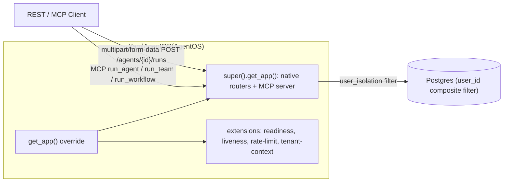

# SPEC_06_API_AND_AX

> **Purpose**: yaml-agno is a THIN INHERITANCE LAYER over AgentOS (Agno 2.8.3). It does NOT build a parallel FastAPI app, does NOT ship its own `/run`, `/sessions`, `/agents` config, `/health`, or middleware classes that duplicate AgentOS. Instead yaml-agno defines **`class YamlAgentOS(AgentOS)`** — a subclass — and overrides `get_app()` to register the few extensions AgentOS genuinely lacks. Everything yaml-agno adds is mounted on the app returned by `super().get_app()`, preserving AgentOS lifespan, exception handlers, DB auto-discovery, JWT/RBAC, and the full native router set.
>
> yaml-agno adds ONLY what AgentOS lacks:
>
> 1. **Wiring YAML -> AgentOS** — translate YAML files into the `agents=[...]` / `teams=[...]` / `workflows=[...]` lists that `YamlAgentOS(...)` consumes. This is yaml-agno's CORE job. Config is loaded via `core-cenf-py` `ConfigManager` (no direct `os.environ`).
> 2. **Multi-tenant via composite user_id + native user_isolation** — in production JWT mode (`authorization=True`), the composite `"{tenant_id}:{principal_id}"` is minted into the JWT `sub` at issuance (via `resolve_user_id()`, SPEC_04 §1.4; VQ012); Agno's native `AuthMiddleware` validates the token and stamps `request.state.user_id = sub`, and `AuthorizationConfig(user_isolation=True)` threads that composite through every scoped DB read/write (zero yaml-agno code on the JWT path). In dev/non-JWT mode (`authorization=False` + `mount_tenant_context=True`), `TenantContextMiddleware` extracts `tenant_id` from the `X-Tenant-Id` header and delegates to `resolve_user_id()`. JD-01 enforces structural mutual exclusion between JWT mode and `TenantContextMiddleware`. `authorization=True` + `user_isolation=True` are ALWAYS ON in production (enforced at startup by `run_server`, VQ010) to avoid the NULL-bucket footgun.
> 3. **Readiness + Liveness routers** — AgentOS ships only `GET /health`. yaml-agno adds DB-gated readiness and process liveness as factory routers (`get_readiness_router` / `get_liveness_router`) in the SAME style as `get_health_router`.
> 4. **Rate-limit middleware** — AgentOS has zero rate limiting. yaml-agno adds `RateLimitMiddleware` keyed on the composite user_id.
>
> *Config schemas (`*Config`) are the SSOT defined in SPEC_02; this API imports and validates against them rather than redefining them. `MediaInput` is owned by SPEC_17 (Multimodal I/O) and is only referenced by a one-line pointer here.*

---

## 1. NATIVE AGENTOS ENDPOINTS (mounted via inheritance, NOT reimplemented)

`YamlAgentOS` inherits `AgentOS.__init__` and passes `agents=`, `teams=`, `workflows=`, `db=`, `authorization=`, `mcp_server=`, `a2a_interface=` to `super().__init__()`. `super().get_app()` mounts every native router via `_add_built_in_routes` / `_add_router` (`os/app.py:509`, `app.py:1182`, ~22 routers). Native endpoints are far more complete than anything yaml-agno could clone: streaming, background runs, SSE resume, checkpoints, fork, continue, cancel, multimodal upload (~1744 lines in `agents/router.py` alone).

### 1.1 Native run / session / config / health endpoints

| yaml-agno role | AgentOS native endpoint | file:line (2.8.3) |
|---|---|---|
| Mount, do NOT reimplement | `POST /agents/{agent_id}/runs` | `agents/router.py:551` |
| Mount, do NOT reimplement | `GET /agents/{agent_id}`, `GET /agents`, `GET /config` | `agents/router.py:1320`, `agents/router.py:1216`, `os/router.py:79` |
| Mount, do NOT reimplement | `POST /teams/{team_id}/runs` | `teams/router.py:527` |
| Mount, do NOT reimplement | `POST /workflows/{workflow_id}/runs` | `workflows/router.py:1118` |
| Mount, do NOT reimplement | `GET /sessions/{session_id}` | `session/session.py:331` |
| Mount, do NOT reimplement | `DELETE /sessions/{session_id}` | `session/session.py:804` |
| Mount, do NOT reimplement | `GET /health` | `health.py:13` |

> @ai-directive: yaml-agno MUST NOT define its own `/run`, `/sessions`, `/agents` config, or `/health` routers. It subclasses `AgentOS` (see §2) and the inherited `get_app()` mounts all native routers. The ONLY routers yaml-agno adds itself are the extensions in §4, registered inside the overridden `get_app()` AFTER `super().get_app()`. A contract test (§6, TASK_007) asserts the app's router list contains NO `/run`, `/sessions`, or `/agents` config route owned by yaml-agno.

### 1.2 Wire contract (MUST document, do NOT invent)

> @ai-directive: AgentOS run endpoints are **`multipart/form-data`** (`Form` fields + `UploadFile`), NOT JSON. Path params are `{agent_id}` / `{team_id}` / `{workflow_id}` (numeric/string IDs from the resolved config), NOT `{name}`. yaml-agno MUST NOT invent a JSON-body + `{name}` path contract; doing so would require an adapter shim that diverges from Agno's real API surface and breaks native streaming/upload/SSE semantics. yaml-agno clients call the native form API directly.

For multimodal input on native run endpoints, clients attach `images` / `audio` / `videos` / `files` as `UploadFile` parts in the SAME multipart request, plus the boolean form fields `send_media_to_model` / `store_media`. The media reference model is `MediaInput`, owned by **SPEC_17** — see that spec for the full multimodal pipeline (validation, storage, `ToolResult`). yaml-agno does not redefine it here.

### 1.3 Backend sanitization and validation (MANDATORY, global rule)

> @ai-directive: EVERY API request body, query parameter, path parameter, and JSON payload that enters yaml-agno MUST be sanitized and validated in the backend BEFORE it reaches Agno handlers or the database. This is non-negotiable security. Concretely: (1) Pydantic models validate every input (strict types, `max_length`, regex constrains, no arbitrary `Any` on the boundary); (2) input sanitization strips/escapes control characters, null bytes, and dangerous Unicode before the value is forwarded; (3) no raw or untrusted data ever reaches an Agno `run`/`session`/`config` handler or a SQL/ORM call. This rule applies to every native route mounted via inheritance AND to every extension route in §4. yaml-agno code MUST follow AgentOS's own patterns for this (factory routers, Pydantic response/request models, Google docstrings).

---

## 2. YamlAgentOS(AgentOS) — THE EXTENSION MECHANISM

### 2.1 Why inheritance, not composition

`AgentOS` (`agno/os/app.py:221`) is an open class (no `@final`) with single-underscore overridable methods (`get_app`, `_add_built_in_routes`, `_add_router`, `_add_jwt_middleware`). Its `get_app()` (`app.py:884`) builds the router list as a LOCAL variable (`app.py:969-1010`), not as an overridable factory. Therefore the correct, faithful extension pattern is:

1. `class YamlAgentOS(AgentOS)` — subclass.
2. Override `get_app()`: call `super().get_app()` (returns a fully wired `FastAPI` with lifespan, exception handlers, DB auto-discovery, JWT/RBAC, CORS, trailing-slash), THEN register yaml-agno extensions on the returned app via `app.include_router(...)` and `app.add_middleware(...)`.
3. Pass native toggles (`authorization`, `mcp_server`, `a2a_interface`, `mcp_config`, `scheduler`, `telemetry`, `registry`) to `super().__init__()` — do NOT extend `AgnoAPISettings` for those toggles (the useful switches live on `__init__`, not on settings).

> @ai-directive: yaml-agno MUST follow AgentOS's design and coding patterns exactly — not merely "equivalent" ones. That means: factory routers `get_*_router(...) -> APIRouter`, Google-style docstrings, `async` + `sync` where Agno uses them, `_add_router`-style mounting, and the same Pydantic-model-on-the-boundary discipline Agno uses.

### 2.2 Config loading consumes core-cenf-py ConfigManager

yaml-agno does NOT reimplement config loading and does NOT read `os.environ` directly. All config access goes through the `ConfigManager` provided by `core-cenf-py` (imported as `core_infrastructure`). Dot-notation lookup (`get_string`, `get_section`) is the only supported access path.

```python
# yaml-agno/src/config/loader.py
"""Config facade delegating to core-cenf-py ConfigManager.

yaml-agno never reads os.environ directly. All config access flows through the
core-cenf-py ConfigManager (imported as core_infrastructure), using dot-notation
get_string/get_section lookups.
"""

from typing import Any

from core_infrastructure import ConfigManager  # core-cenf-py

from yaml_agno.factory.agent_factory import build_agents      # SPEC_01
from yaml_agno.factory.team_factory import build_teams         # SPEC_01
from yaml_agno.factory.workflow_factory import build_workflows # SPEC_01


def load_site_from_config(cfg: ConfigManager) -> dict[str, Any]:
    """Load the YAML site description via the core-cenf-py ConfigManager.

    Args:
        cfg: The core-cenf-py ConfigManager instance.

    Returns:
        A resolved site dict consumed by the SPEC_01 factories.

    @ai-directive: os.environ MUST NOT be read here or anywhere in yaml-agno.
    All environment-backed values come through ConfigManager.
    """
    yaml_root = cfg.get_string("yaml_agno.site.root")
    # ...additional dot-notation lookups via cfg.get_string / cfg.get_section...
    raise NotImplementedError("Wired against core-cenf-py ConfigManager; see SPEC_02.")
```

### 2.3 YamlAgentOS subclass

```python
# yaml-agno/src/api/app.py
\"\"\"YamlAgentOS: yaml-agno's AgentOS subclass (SPEC_06 slice A+B, S5a.1).

Inherits AgentOS (agno/os/app.py:221). Overrides get_app() to register the few
extensions AgentOS lacks (§4) AFTER super().get_app() has mounted every native
router. Native toggles (authorization, mcp_server, a2a_interface) are
passed to super().__init__, NOT to AgnoAPISettings.
\"\"\"

from typing import Any, Optional

from agno.app import AgentOS
from agno.os.config import AuthorizationConfig
from fastapi import Request
from fastapi.responses import JSONResponse

from yaml_agno.config.loader import load_site_from_config
from yaml_agno.factory.agent_factory import build_agents
from yaml_agno.factory.team_factory import build_teams
from yaml_agno.factory.workflow_factory import build_workflows
from yaml_agno.db.session import resolve_agentos_db          # SPEC_03
from yaml_agno.api.health import get_readiness_router, get_liveness_router
from yaml_agno.api.middleware.tenant_context import TenantContextMiddleware
from yaml_agno.api.middleware.rate_limit import RateLimitMiddleware
from yaml_agno.memory.user_identity import UserIdentityResolutionError


class YamlAgentOS(AgentOS):
    \"\"\"yaml-agno's subclass of AgentOS.

    Inherits every native router, middleware, and behaviour from AgentOS and
    adds only the genuine extensions (multi-tenant context, readiness/liveness,
    rate-limit).

    Supports two mutually exclusive authentication and tenant isolation modes (JD-01):
    1. JWT Mode (Production / L-03): authorization=True and authorization_config
       passed with user_isolation=True. Native Agno AuthMiddleware validates JWT
       and scopes operations from composite sub. TenantContextMiddleware is NOT mounted.
    2. Dev Header Mode (Non-production): authorization=False + mount_tenant_context=True.
       TenantContextMiddleware extracts X-Tenant-Id header and delegates to resolve_user_id.

    @ai-directive: this class MUST NOT define its own /run, /sessions, or
    /agents config routes. All execution routes come from the inherited
    AgentOS.get_app(). Extensions are registered in get_app() after super().
    \"\"\"

    def __init__(
        self,
        cfg=None,
        *,
        agents: Any = None,
        config_path: str | None = None,
        authorization: bool = False,
        authorization_config: AuthorizationConfig | None = None,
        mount_health: bool = True,
        mount_tenant_context: bool = True,
        memory_cfg: Any = None,
        base_app: Any = None,
        **agentos_kwargs: Any,
    ) -> None:
        \"\"\"Initialize YamlAgentOS from ConfigManager or agent sources.

        Args:
            cfg: core-cenf-py ConfigManager (never os.environ).
            agents: Optional list of pre-built agents.
            config_path: Optional path to YAML agent definitions.
            authorization: Enable native AgentOS JWT authorization.
            authorization_config: AuthorizationConfig with user_isolation=True.
            mount_health: Mount /health/liveness and /health/readiness.
            mount_tenant_context: Mount TenantContextMiddleware (dev only).
            memory_cfg: YAML memory block for principal fallback.
            base_app: Optional base FastAPI app.
            **agentos_kwargs: Forwarded to super().__init__.

        @ai-directive: in production, authorization=True and user_isolation=True
        are NON-NEGOTIABLE and ALWAYS ON (enforced by run_server, VQ010). Letting
        user_id be None triggers the NULL-bucket footgun (§3). JD-01 enforces
        mutual exclusion: authorization=True with mount_tenant_context=True raises
        ValueError.
        \"\"\"
        if authorization and mount_tenant_context:
            raise ValueError(
                "JD-01 mutual exclusion: 'authorization=True' (JWT mode) and "
                "'mount_tenant_context=True' (dev-header middleware) cannot be used together."
            )

        if cfg is not None:
            site = load_site_from_config(cfg)
            agents = build_agents(site)
            teams = build_teams(site)
            workflows = build_workflows(site)
            agentos_db = resolve_agentos_db(site)
            enable_mcp = cfg.get_string("yaml_agno.mcp.enabled") == "true"
            enable_a2a = cfg.get_string("yaml_agno.a2a.enabled") == "true"
        else:
            teams = agentos_kwargs.pop("teams", None)
            workflows = agentos_kwargs.pop("workflows", None)
            agentos_db = agentos_kwargs.pop("db", None)
            enable_mcp = agentos_kwargs.pop("mcp_server", False)
            enable_a2a = agentos_kwargs.pop("a2a_interface", False)

        self._mount_health = mount_health
        self._mount_tenant_context = mount_tenant_context
        self._memory_cfg = memory_cfg

        super().__init__(
            agents=agents,
            teams=teams,
            workflows=workflows,
            db=agentos_db,
            mcp_server=enable_mcp,
            a2a_interface=enable_a2a,
            authorization=authorization,
            authorization_config=authorization_config,
            base_app=base_app,
            **agentos_kwargs,
        )

    def get_app(self) -> Any:
        \"\"\"Return the FastAPI app with native routers plus yaml-agno extensions.

        Overrides AgentOS.get_app (app.py:884). Calls super().get_app() so the
        inherited lifespan, exception handlers, DB auto-discovery, JWT/RBAC,
        CORS, and trailing-slash middleware are preserved, then registers the
        extensions AgentOS lacks.

        In dev mode (authorization=False, mount_tenant_context=True),
        TenantContextMiddleware is mounted. In JWT mode (authorization=True),
        Agno's native AuthMiddleware handles auth and user isolation, and
        TenantContextMiddleware is NOT mounted (JD-01).

        @ai-directive: register extensions ONLY here, AFTER super().get_app().
        Do NOT override _add_built_in_routes or _add_router — those are
        AgentOS internals and super().get_app() already calls them.
        \"\"\"
        app = super().get_app()

        # Extension routers (factory style, same pattern as get_health_router).
        if self._mount_health:
            app.include_router(get_readiness_router(db=self.db))
            app.include_router(get_liveness_router())

        # Extension middleware.
        app.add_middleware(RateLimitMiddleware)

        # TenantContextMiddleware mounted ONLY in dev/non-JWT mode (JD-01).
        if self._mount_tenant_context and not self.authorization:
            app.add_middleware(TenantContextMiddleware, memory_cfg=self._memory_cfg)

            @app.exception_handler(UserIdentityResolutionError)
            async def _tenant_context_error_handler(
                request: Request, exc: UserIdentityResolutionError
            ) -> JSONResponse:
                return JSONResponse(
                    status_code=401,
                    content={"detail": str(exc)},
                )

        return app
```

> @ai-directive: the subclass MUST keep `AgentOS` as the single source of execution. yaml-agno never instantiates its own run/session handlers; it only feeds `super().__init__()` and lightly extends the returned app inside `get_app()`.

---

## 3. MULTI-TENANT VIA COMPOSITE user_id + NATIVE user_isolation

### 3.1 The approach (chosen, FODA-documented)

Agno has NO `tenant_id` column anywhere; its own idiom (`teams/_session.py:52` docstring) calls `user_id` "the user_id for tenant isolation", and `user_id` is used as an opaque equality filter throughout the data layer (~40x in `postgres.py`). Therefore yaml-agno reuses `user_id` as the tenant boundary — but makes it COMPOSITE: `user_id = f"{tenant_id}:{principal_id}"`.

Under the ratified **Option C (hybrid)** architecture (S5a.1):
1. **JWT Mode (Production / L-03)**: The composite identity `"{tenant_id}:{principal_id}"` is **MINTED in the `sub` claim of the JWT at emission time** via `resolve_user_id(memory_cfg=None, principal_id=..., tenant_id=...)` (SPEC_04 §1.4; VQ012).
   - In dev/integration tests, `tests/integration/helpers/dev_jwt_issuer.py` mints HS256 tokens with `sub="{tenant_id}:{principal_id}"` + scopes (`scopes=["..."]`).
   - In production (S5b), identity providers like Keycloak will configure a token mapper or use Agno's `user_id_claim` parameter (`jwt.py:547`) to emit the composite identity.
   - Agno 2.8.7's native `AuthMiddleware` (`jwt.py:1039,1060`) validates the JWT signature/expiration, rejects reserved principals (`sa:`, `__scheduler__`, `__oauth__:`), and stamps `request.state.user_id = sub`.
   - `AuthorizationConfig(user_isolation=True)` activates `get_scoped_user_id(request)` (`user_scope.py:105-132`), which threads `request.state.user_id` into EVERY user-scoped DB read and write.
   - Admin principals (`scopes=["agent_os:admin"]`) short-circuit `get_scoped_user_id()` to `None` (`user_scope.py:116-117`), granting unscoped access across all tenants.
   - **Zero yaml-agno code in the JWT path**: no custom JWT middleware, no claim rewriting, no monkeypatching. The obsolete narrative where middleware parsed a custom tenant claim from JWT or extracted identity claims is completely eliminated.
2. **Dev Header Mode (Non-production)**: When JWT auth is disabled (`authorization=False` + `mount_tenant_context=True`), `TenantContextMiddleware` extracts `tenant_id` from the `X-Tenant-Id` header and delegates to `resolve_user_id()`.
3. **JD-01 Structural Mutual Exclusion**: `YamlAgentOS(authorization=True, mount_tenant_context=True)` raises `ValueError`. When `authorization=True` is active, `TenantContextMiddleware` is NEVER mounted in the ASGI stack.

#### FODA

| | Item |
|---|---|
| **Fortalezas** | (1) Zero schema change — no new column, no migration. (2) Zero yaml-agno code in the JWT path — reuses Agno 2.8.7 native `AuthMiddleware` + `user_isolation` pipeline directly. (3) Single composite resolver — `resolve_user_id()` (SPEC_04) is the single source of truth for composite `{tenant_id}:{principal_id}` (VQ012). (4) Reuses AgentOS ownership machinery: `user_isolation` coerces `user_id` on writes, enforces session/run ownership, threads the JWT sub on every user-scoped read. |
| **Oportunidades** | (1) Future-proof against Agno upgrades because it builds on top of public contracts (`sub` claim, `AuthorizationConfig`, `user_isolation`). (2) S5b Keycloak integration cleanly plugs in via standard token mappers or `user_id_claim` (`jwt.py:547`). (3) Works uniformly across agents/teams/workflows/sessions/memory routers. |
| **Debilidades** | (1) No native tenant-level aggregation or prefix queries — an admin UI sees each `tenant:user` as a distinct row (no GROUP BY tenant without application-level splitting). (2) Composite string is a presentation leak; dashboards must split on `:` themselves. |
| **Amenazas** | (1) **NULL-bucket footgun (CRITICAL)**: Agno upsert conflict clauses use `(user_id == X) OR (user_id IS NULL)` (`postgres.py:1023,1062,1101,1197,1256,1315`). A row whose `user_id` is NULL matches EVERY tenant. This is why `run_server` enforces `authorization=True` at startup (VQ010) and `user_isolation=True` MUST be ALWAYS ON — user_isolation guarantees the JWT sub is threaded on every write, so user_id is NEVER None. (2) Reserved-principal collision: composite `sub` must not collide with reserved principals (`sa:`, `__scheduler__`, `__oauth__:`), enforced via `is_reserved_principal` at issuance. |

### 3.2 TenantContextMiddleware (Dev / No-JWT Path ONLY)

In dev mode (`authorization=False` and `mount_tenant_context=True`), `TenantContextMiddleware` extracts `tenant_id` from the `X-Tenant-Id` header, then DELEGATES composite construction to the shared `resolve_user_id()` (SPEC_04 §1.4) so that the composite format lives in ONE place.

In production JWT mode (`authorization=True`), this middleware is NOT mounted (JD-01 structural mutual exclusion). Agno 2.8.7's native `AuthMiddleware` validates the JWT and stamps `request.state.user_id` directly from the composite `sub` claim, and `user_isolation=True` scopes native operations.

```python
# yaml-agno/src/api/middleware/tenant_context.py
"""TenantContextMiddleware: dev-only composite user_id resolver (SPEC_06 §3.2, S5a.1).

In dev mode (authorization=False and mount_tenant_context=True), this
middleware extracts tenant_id from the X-Tenant-Id header and DELEGATES
composite construction to the shared resolve_user_id() (SPEC_04 §1.4) so that
the composite format lives in ONE place.

In production JWT mode (authorization=True), this middleware is NOT mounted
(JD-01 structural mutual exclusion). Agno 2.8.7's native AuthMiddleware validates
the JWT and stamps request.state.user_id directly from the composite sub
claim, and user_isolation=True scopes native operations.

@ai-directive: this middleware is for dev/non-JWT paths only. It extracts
tenant_id from the X-Tenant-Id header, then DELEGATES to the shared
resolve_user_id() (SPEC_04) to build the composite. It does NOT construct
f"{tenant_id}:{raw_user_id}" inline — resolve_user_id is the single source
of truth for the composite format. It does NOT add a tenant_id column to
agno_* tables (Agno does not support one), does NOT apply Postgres RLS, and
does NOT open a DB session. Per SPEC_03 §5 and SPEC_04 §3.3: tenant isolation of
yaml-agno's OWN config rows is explicit WHERE filters on yamlagno_* tables;
tenant_id on agno_* tables is the composite user_id only.
"""

from typing import Any, Optional
from collections.abc import Awaitable, Callable

from fastapi import Request, Response
from fastapi.responses import JSONResponse
from starlette.middleware.base import BaseHTTPMiddleware

from yaml_agno.memory.user_identity import (  # SPEC_04 §1.4
    UserIdentityResolutionError,
    resolve_user_id,
)


class TenantContextMiddleware(BaseHTTPMiddleware):
    """Set request.state.user_id to the composite "{tenant_id}:{principal_id}".

    This middleware extracts tenant_id from the X-Tenant-Id header, then
    DELEGATES to the shared resolve_user_id() (SPEC_04) to build the
    composite. The composite format lives ONLY in resolve_user_id; this
    middleware never builds f"{tenant_id}:{raw_user_id}" inline.

    Used ONLY in dev/non-JWT mode. Mutually exclusive with JWT authorization
    (JD-01).

    Attributes:
        memory_cfg: YAML memory: block (SPEC_02 *Config). Carries
            system_user_id used by resolve_user_id as the principal.
    """

    def __init__(self, app: Any, memory_cfg: Any = None) -> None:
        """Initialize with the YAML memory block (for system_user_id fallback).

        Args:
            app: The ASGI app (passed by add_middleware).
            memory_cfg: YAML memory: block (SPEC_02 *Config). Carries
                system_user_id used by resolve_user_id when no human
                principal is present on the request.
        """
        super().__init__(app)
        self.memory_cfg = memory_cfg

    async def dispatch(
        self, request: Request, call_next: Callable[[Request], Awaitable[Response]]
    ) -> Response:
        """Delegate to resolve_user_id and stamp request.state.

        A missing/empty tenant_id is an authentication failure: the
        composite user_id cannot be built and a NULL bucket must never
        reach Agno. resolve_user_id raises UserIdentityResolutionError in
        that case. We catch it HERE and return 401 with a structured JSON body.

        Args:
            request: Incoming request carrying X-Tenant-Id header.
            call_next: Next ASGI handler.

        Returns:
            The downstream response, or a 401 JSONResponse when the
            tenant cannot be resolved.
        """
        tenant_id = self._extract_tenant_id(request)

        # Single source of truth: resolve_user_id (SPEC_04) builds the
        # composite and fails fast if tenant_id is missing. Never None.
        try:
            request.state.user_id = resolve_user_id(
                memory_cfg=self.memory_cfg,
                principal_id=None,
                tenant_id=tenant_id,
                context=None,
            )
        except UserIdentityResolutionError as exc:
            return JSONResponse(
                status_code=401,
                content={"detail": str(exc)},
            )
        return await call_next(request)

    @staticmethod
    def _extract_tenant_id(request: Request) -> Optional[str]:
        """Extract tenant_id from X-Tenant-Id header."""
        return request.headers.get("X-Tenant-Id")
```

> **Cross-ref**: `resolve_user_id` is shared with SPEC_04 (memory); same composite `"{tenant_id}:{principal_id}"` for HTTP and autonomous runs. The middleware is the HTTP entry point; autonomous/workflow runs call `resolve_user_id` directly with the YAML `tenant_id` field.

### 3.3 Rules carried from SPEC_03 / SPEC_04 (unchanged)

> @ai-directive: tenant isolation is **explicit** via WHERE filters on `yamlagno_*` config rows only (SPEC_03 §5, SPEC_04 §3.3). `tenant_id` is NEVER added as a column to `agno_*` tables. Postgres RLS is NOT used. The `set_tenant_id` contextvar (SPEC_03) is **telemetry-only** — it never gates a query. The composite `user_id` is the SOLE tenant boundary on `agno_*` tables, enforced by Agno's native `user_isolation`.

---

## 4. EXTENSIONS REGISTERED IN get_app() (no gaps/ folder)

All routers below are FACTORIES returning `APIRouter`, mirroring `agno/os/routers/health.py:get_health_router` (`health.py:8`). They live under `src/api/` with SOTA names — there is NO `gaps/` folder. Mounting uses `app.include_router(...)` inside the overridden `get_app()`.

### 4.1 Readiness + Liveness routers (AgentOS ships only `GET /health`)

```python
# yaml-agno/src/api/health.py
"""Readiness and liveness routers, mirroring get_health_router structure.

AgentOS ships only a simple GET /health (health.py:8-13). yaml-agno adds
DB-gated readiness (Kubernetes removes the pod from rotation when not ready)
and a process liveness probe. Both are factory routers in the same style as
agno/os/routers/health.py.
"""

from typing import Dict

from fastapi import APIRouter
from pydantic import BaseModel, Field


class LivenessResponse(BaseModel):
    """Liveness probe response (process alive?)."""

    status: str = Field(..., description="alive | dead")


class ReadinessResponse(BaseModel):
    """Readiness probe response (ready to receive traffic?)."""

    status: str = Field(..., description="ready | not_ready")
    checks: Dict[str, bool] = Field(
        default_factory=dict,
        description="Per-dependency readiness. Only MANDATORY deps gate status.",
    )


def get_liveness_router(liveness_endpoint: str = "/health/liveness") -> APIRouter:
    """Build the liveness router (factory, mirrors get_health_router).

    Args:
        liveness_endpoint: Path for the liveness probe.

    Returns:
        An APIRouter exposing the liveness probe.
    """
    router = APIRouter(tags=["Health"])

    @router.get(
        liveness_endpoint,
        operation_id="liveness_check",
        summary="Liveness Check",
        response_model=LivenessResponse,
    )
    async def liveness_check() -> LivenessResponse:
        """Return liveness; Kubernetes restarts the pod on failure."""
        return LivenessResponse(status="alive")

    return router


def get_readiness_router(
    db=None,
    readiness_endpoint: str = "/health/readiness",
) -> APIRouter:
    """Build the readiness router (factory, mirrors get_health_router).

    Args:
        db: The AgentOS DB to ping (resolved in SPEC_03).
        readiness_endpoint: Path for the readiness probe.

    Returns:
        An APIRouter exposing the readiness probe.

    @ai-directive: Only MANDATORY dependencies gate readiness. A readiness probe
    MUST NOT depend on optional external MCP adapters; a missing optional
    adapter config never flips status to not_ready. Optional dependencies are
    intentionally absent from the check set so they can never force not_ready.
    """
    router = APIRouter(tags=["Health"])

    @router.get(
        readiness_endpoint,
        operation_id="readiness_check",
        summary="Readiness Check",
        response_model=ReadinessResponse,
        responses={503: {"description": "Not ready"}},
    )
    async def readiness_check() -> ReadinessResponse:
        """Return readiness; Kubernetes removes the pod from rotation when not ready."""
        checks: Dict[str, bool] = {
            "postgres": await _ping_postgres(db),
        }
        mandatory_ready = all(checks.values())
        return ReadinessResponse(
            status="ready" if mandatory_ready else "not_ready",
            checks=checks,
        )

    return router


async def _ping_postgres(db) -> bool:
    """Ping the AgentOS DB. Returns True if reachable."""
    # Implemented in SPEC_03 (DB session layer).
    raise NotImplementedError("Wired in SPEC_03; see resolve_agentos_db.")
```

### 4.2 Rate-limit middleware (AgentOS has NONE)

AgentOS ships no rate limiting (`grep ratelimit|throttle|slowapi` in `os/` = 0 hits; only 3 native middlewares exist — CORS, JWT/RBAC when `authorization=True`, TrailingSlash). yaml-agno adds `RateLimitMiddleware` keyed on the composite `request.state.user_id`. It runs BEFORE the native run endpoints (registered as outer middleware in `get_app()`), so it protects `POST /agents/{agent_id}/runs`, `POST /teams/{team_id}/runs`, and `POST /workflows/{workflow_id}/runs` without yaml-agno owning those routes.

```python
# yaml-agno/src/api/middleware/rate_limit.py
"""Rate-limit middleware keyed on composite user_id (+ client IP fallback).

AgentOS ships no rate limiting. This middleware protects every mounted native
router by running on the request before AgentOS handlers see it.
"""

import time
from typing import Dict, Tuple

from fastapi import Request, Response
from starlette.middleware.base import BaseHTTPMiddleware
from starlette.responses import JSONResponse


class RateLimitMiddleware(BaseHTTPMiddleware):
    """Token-bucket rate limit per composite user_id and per client IP.

    Attributes:
        user_buckets: composite user_id -> (window_start, count).
        ip_buckets: client_ip -> (window_start, count).
        user_limit: Max requests per window per composite user_id.
        ip_limit: Max requests per window per IP.
        window: Window size in seconds.
    """

    def __init__(
        self,
        app,
        user_limit: int = 100,
        ip_limit: int = 20,
        window: int = 60,
    ) -> None:
        """Initialize the middleware with per-user and per-IP limits.

        Args:
            app: The ASGI app (passed by add_middleware).
            user_limit: Max requests per window per composite user_id.
            ip_limit: Max requests per window per IP.
            window: Window size in seconds.
        """
        super().__init__(app)
        self.user_buckets: Dict[str, Tuple[int, int]] = {}
        self.ip_buckets: Dict[str, Tuple[int, int]] = {}
        self.user_limit = user_limit
        self.ip_limit = ip_limit
        self.window = window

    async def dispatch(self, request: Request, call_next) -> Response:
        """Apply composite-user + IP limits; return 429 on breach.

        Args:
            request: Incoming request (user_id set by TenantContextMiddleware).
            call_next: Next ASGI handler.

        Returns:
            The downstream response, or 429 JSON on rate-limit breach.
        """
        user_id = getattr(request.state, "user_id", None) or "anonymous"
        client_ip = request.client.host if request.client else "unknown"
        now = int(time.time())

        if not self._allow(self.user_buckets, user_id, now, self.user_limit):
            return JSONResponse(
                status_code=429,
                content={"detail": f"User rate limit exceeded: {self.user_limit} req/{self.window}s"},
            )
        if not self._allow(self.ip_buckets, client_ip, now, self.ip_limit):
            return JSONResponse(
                status_code=429,
                content={"detail": f"IP rate limit exceeded: {self.ip_limit} req/{self.window}s"},
            )
        return await call_next(request)

    def _allow(
        self,
        buckets: Dict[str, Tuple[int, int]],
        key: str,
        now: int,
        limit: int,
    ) -> bool:
        """Return True if the bucket allows one more request."""
        window_start, count = buckets.get(key, (now, 0))
        if now - window_start >= self.window:
            window_start, count = now, 0
        if count >= limit:
            buckets[key] = (window_start, count)
            return False
        buckets[key] = (window_start, count + 1)
        return True
```

---

## 5. AX DISCOVERY = NATIVE MCP SERVER

AgentOS exposes `run_agent` / `run_team` / `run_workflow` ONLY over its native MCP server (`os/mcp.py:227-264`), enabled by `mcp_server=True` on `AgentOS.__init__`. yaml-agno enables the native MCP server (passed to `super().__init__()` in §2.3) for agent/tool discovery. There is NO parallel `GET /ax/tools` REST endpoint — that would reinvent MCP.

> @ai-directive: the supported AX discovery path is the NATIVE MCP server. yaml-agno enables it via `mcp_server=True` and does NOT add its own REST discovery endpoint. A thin REST JSON-schema surface is OPTIONAL and supported ONLY for non-MCP clients; if ever added it MUST be a read-only factory router that publishes the same callable names as the MCP surface, never an execution path. Execution stays on the native AgentOS run endpoints (§1) or MCP.



---

## 6. BDD SCENARIOS

### 6.1 Acceptance Scenarios

#### Scenario 1: YamlAgentOS produces a mounted AgentOS app with native /run working

```gherkin
GIVEN a YAML site with one agent definition
WHEN YamlAgentOS(cfg).get_app() is called
THEN the returned FastAPI app includes the native route POST /agents/{agent_id}/runs
AND the app includes the native route GET /health
AND the app includes yaml-agno's GET /health/readiness
AND the app includes yaml-agno's GET /health/liveness
AND no yaml-agno-owned /run route exists in the app's router list
```

#### Scenario 2: Readiness gates on the DB only

```gherkin
GIVEN the service is running
AND PostgreSQL is reachable
WHEN GET /health/readiness is called
THEN the response status is 200
AND the status field is "ready"
AND checks.postgres is true
AND there is no optional-adapter key in checks

GIVEN the service is running
BUT PostgreSQL is disconnected
WHEN GET /health/readiness is called
THEN the response status is 503
AND the status field is "not_ready"
AND checks.postgres is false
```

#### Scenario 3: JWT-native multi-tenant isolation and Dev Header fallback

```gherkin
GIVEN a request carries a valid JWT with composite sub="tenant_42:user_7"
AND YamlAgentOS is initialized with authorization=True and authorization_config with user_isolation=True
WHEN Agno's native AuthMiddleware processes the request
THEN request.state.user_id is set to "tenant_42:user_7" directly from the JWT sub claim
AND TenantContextMiddleware is NOT mounted in the application stack (JD-01)
AND no tenant_id column is added to agno_* tables
AND no RLS policy is applied
AND get_scoped_user_id returns "tenant_42:user_7" for non-admins
AND downstream native handlers scope data to "tenant_42:user_7"

GIVEN a request arrives with header X-Tenant-Id: tenant_42 without JWT auth
AND YamlAgentOS is initialized in dev mode (authorization=False, mount_tenant_context=True)
WHEN TenantContextMiddleware processes the request
THEN the middleware extracts tenant_42 from the X-Tenant-Id header
AND delegates to the shared resolve_user_id() (SPEC_04 §1.4)
AND request.state.user_id is set to "tenant_42:<system_user_id>"
AND the middleware does NOT construct the composite inline
```

#### Scenario 4: Rate limit protects native runs

```gherkin
GIVEN composite user_id tenant_42:user_7 has a limit of 100 requests per 60 seconds
WHEN the 101st request from tenant_42:user_7 arrives at POST /agents/{agent_id}/runs
THEN the response status is 429
AND the response detail mentions "User rate limit exceeded"
```

#### Scenario 5: AX discovery is via native MCP

```gherkin
GIVEN YamlAgentOS is initialized with mcp_server=True
WHEN a client connects to the MCP server
THEN the client can discover run_agent, run_team, and run_workflow tools
AND yaml-agno exposes NO parallel GET /ax/tools REST endpoint
```

#### Scenario 6: Wire contract is native (no invented JSON/{name})

```gherkin
GIVEN the mounted native AgentOS app
WHEN a client calls POST /agents/{agent_id}/runs
THEN the request content-type is multipart/form-data
AND the path uses {agent_id} (NOT {name})
AND yaml-agno exposes NO POST /agents/{name}/run JSON endpoint
```

#### Scenario 7: Multi-tenant isolation is always on (NULL-bucket guard)

```gherkin
GIVEN YamlAgentOS is initialized
THEN authorization is True
AND AuthorizationConfig.user_isolation is True
AND no code path can set request.state.user_id to None
AND every user-scoped DB read carries the composite user_id filter
```

---

## 7. TDD MICRO-TASK EXECUTION PROTOCOL

### 7.1 Cascading Task Checklist

#### TASK_001: Implement YamlAgentOS(AgentOS) subclass

- **File**: `yaml-agno/src/api/app.py`
- **Test**: `tests/integration/api/test_yaml_agent_os.py`
- **RED**:
  ```python
  async def test_yaml_agent_os_mounts_native_run_route(tmp_yaml_site, cfg):
      os_app = YamlAgentOS(cfg)
      app = os_app.get_app()
      routes = {r.path for r in app.routes}
      assert "/agents/{agent_id}/runs" in routes
      assert "/health" in routes

  async def test_yaml_agent_os_has_no_owned_run_route(tmp_yaml_site, cfg):
      app = YamlAgentOS(cfg).get_app()
      routes = {r.path for r in app.routes}
      assert "/api/v1/agents/{name}/run" not in routes

  async def test_yaml_agent_os_authorization_always_on(cfg):
      os_app = YamlAgentOS(cfg)
      assert os_app.authorization is True
  ```
- **GREEN**: Implement `YamlAgentOS.__init__` calling `super().__init__(authorization=True, authorization_config=AuthorizationConfig(user_isolation=True), ...)` and override `get_app()`.
- **Commit**: `feat: add YamlAgentOS(AgentOS) subclass with native router inheritance`

#### TASK_002: Implement config loader consuming core-cenf-py ConfigManager

- **File**: `yaml-agno/src/config/loader.py`
- **Test**: `tests/unit/config/test_loader_uses_config_manager.py`
- **RED**:
  ```python
  def test_loader_does_not_read_os_environ(monkeypatch, cfg):
      monkeypatch.delenv("yaml_agno_site_root", raising=False)
      # loader MUST go through ConfigManager, never os.environ.
      site = load_site_from_config(cfg)
      assert site is not None
  ```
- **GREEN**: Implement `load_site_from_config` delegating to `core_infrastructure.ConfigManager` (dot-notation `get_string`/`get_section`).
- **Commit**: `feat: config loader delegates to core-cenf-py ConfigManager`

#### TASK_003: Implement readiness + liveness routers (factory style)

- **File**: `yaml-agno/src/api/health.py`
- **Test**: `tests/integration/api/test_readiness.py`
- **RED**:
  ```python
  async def test_liveness_returns_alive(client):
      resp = await client.get("/health/liveness")
      assert resp.status_code == 200
      assert resp.json()["status"] == "alive"

  async def test_readiness_has_only_mandatory_keys(client):
      resp = await client.get("/health/readiness")
      data = resp.json()
      assert set(data["checks"]).issubset({"postgres"})
  ```
- **GREEN**: Implement `get_readiness_router` / `get_liveness_router` factories.
- **Commit**: `feat: add readiness and liveness factory routers`

#### TASK_004: Implement rate-limit middleware keyed on composite user_id

- **File**: `yaml-agno/src/api/middleware/rate_limit.py`
- **Test**: `tests/unit/api/middleware/test_rate_limit.py`
- **RED**:
  ```python
  async def test_rate_limit_429_after_breach(app_with_rate_limit):
      client = app_with_rate_limit(user_limit=2)
      await client.get("/health", headers={"X-Tenant-Id": "t1"})
      await client.get("/health", headers={"X-Tenant-Id": "t1"})
      resp = await client.get("/health", headers={"X-Tenant-Id": "t1"})
      assert resp.status_code == 429
  ```
- **GREEN**: Implement `RateLimitMiddleware` (token bucket per composite user_id + IP).
- **Commit**: `feat: add rate-limit middleware keyed on composite user_id`

#### TASK_005: Implement TenantContextMiddleware (dev header mode) and JD-01 guard

- **File**: `yaml-agno/src/api/middleware/tenant_context.py`, `yaml-agno/src/api/app.py`
- **Test**: `tests/unit/api/middleware/test_tenant_context.py`, `tests/unit/api/test_app_jwt_mode.py`
- **RED**:
  ```python
  async def test_tenant_context_composes_user_id(app_with_tenant_context):
      client = app_with_tenant_context()
      await client.get(
          "/health",
          headers={"X-Tenant-Id": "tenant_42"},
      )
      # request.state.user_id must be "tenant_42:{system_user_id}"

  def test_jd01_mutual_exclusion_raises_error():
      # JD-01: authorization=True with mount_tenant_context=True must raise ValueError
      with pytest.raises(ValueError, match="JD-01"):
          YamlAgentOS(authorization=True, mount_tenant_context=True)
  ```
- **GREEN**: Implement `TenantContextMiddleware` extracting `tenant_id` from `X-Tenant-Id` header and DELEGATING to `resolve_user_id()` (SPEC_04 §1.4). Add JD-01 mutual exclusion check in `YamlAgentOS.__init__`.
- **Commit**: `feat: add TenantContextMiddleware (dev header mode) with JD-01 exclusion`

#### TASK_006: Document native wire contract (no JSON/{name})

- **File**: `yaml-agno/docs/api_contract.md`
- **Test**: `tests/contract/test_native_wire_contract.py`
- **RED**:
  ```python
  def test_native_run_endpoint_is_multipart_form(cfg):
      app = YamlAgentOS(cfg).get_app()
      run_route = next(r for r in app.routes if r.path.endswith("/agents/{agent_id}/runs"))
      assert "multipart/form-data" in str(run_route.body_field)
  ```
- **GREEN**: Document the multipart/{id} contract; assert no invented JSON/{name} shim.
- **Commit**: `docs: document native AgentOS multipart/{id} wire contract`

#### TASK_007: Verify yaml-agno defines NO own /run, /sessions, or /agents config routes

- **File**: `tests/contract/test_no_duplicate_routes.py`
- **RED**:
  ```python
  def test_yamlagno_has_no_owned_run_or_sessions_router(cfg):
      app = YamlAgentOS(cfg).get_app()
      paths = {r.path for r in app.routes}
      forbidden_yamlagno_owned = {
          "/api/v1/agents/{name}/run",
          "/api/v1/sessions/{id}",
          "/api/v1/agents/{name}",
      }
      assert forbidden_yamlagno_owned.isdisjoint(paths)
  ```
- **GREEN**: Confirm all execution routes come from inherited `AgentOS.get_app()`; no yaml-agno duplicate.
- **Commit**: `test: assert no yaml-agno-owned duplicate execution routes`

#### TASK_008: Assert user_isolation always on + native JWT isolation (L-03 gate)

- **File**: `tests/integration/api/test_jwt_isolation_l03.py`, `src/yaml_agno/runtime/server.py`
- **RED**:
  ```python
  def test_run_server_refuses_without_authorization():
      # VQ010: run_server must refuse to start unless authorization=True
      with pytest.raises(RuntimeError, match="authorization=True"):
          run_server(agents=[])

  def test_l03_cross_tenant_isolation_404(l03_client, token_alice_a, token_alice_b):
      # Alice under tenant B attempting to access tenant A's session receives 404
      pass
  ```
- **GREEN**: `run_server` enforces `authorization=True` (VQ010). L-03 matrix proves zero cross-tenant leaks with Agno 2.8.7 native scoping.
- **Commit**: `test: assert multi-tenant isolation and VQ010 run_server refusal`

---

## 8. STRATEGIC QUESTIONS (RESOLVED)

### [Pregunta 1] Streaming Response — RESUELTO: nativo (no rebuild)

**¿El endpoint /run debe soportar Server-Sent Events (SSE) para streaming?**

**Resolución**: AgentOS YA hace streaming nativamente en `POST /agents/{agent_id}/runs` (SSE resume, background runs, checkpoints, fork, continue, cancel). `YamlAgentOS` hereda ese endpoint vía `super().get_app()`; yaml-agno NO reconstruye streaming. Reconstruirlo sería duplicar ~1744 líneas de `agents/router.py` y romper la semántica nativa de upload/SSE.

### [Pregunta 2] Rate Limiting — RESUELTO: SÍ, middleware en el subclass

**¿Debería haber rate limiting por tenant/user en los endpoints?**

**Resolución**: SÍ. AgentOS no trae nada de rate limiting (`grep` en `os/` = 0 hits; sólo 3 middlewares nativos: CORS, JWT/RBAC, TrailingSlash). `YamlAgentOS.get_app()` registra `RateLimitMiddleware` (§4.2) como middleware outer, keyed en el composite `user_id`. Protege TODOS los routers nativos heredados sin que yaml-agno los posea.

### [Pregunta 3] API Versioning — RESUELTO: defer a las convenciones nativas de AgentOS

**¿Estrategia de versioning: /api/v1/ vs Accept header?**

**Resolución**: yaml-agno NO introduce su propio namespace `/api/v1/`. Hereda los routers nativos de AgentOS tal cual (`POST /agents/{agent_id}/runs`, etc.). Inventar un prefijo `/api/v1/` own crearía un shim de re-ruteo innecesario y rompería la fidelidad al sistema. Las extensiones propias (readiness, liveness) se montan sin prefijo de versión, siguiendo el mismo estilo de AgentOS (p. ej. `GET /health` no lleva versión).

### [Pregunta 4] Multi-tenancy — RESUELTO: composite user_id in JWT sub + native user_isolation (S5a.1)

**¿Cómo aislar datos por tenant sin tocar el schema de Agno?**

**Resolución**: En producción (JWT activo), el composite `user_id = f"{tenant_id}:{principal_id}"` se emite directamente en el claim `sub` del JWT (VQ012). Agno 2.8.7 `AuthMiddleware` valida el token y estampa `request.state.user_id = sub`, y `AuthorizationConfig(user_isolation=True)` filtra automáticamente cada consulta user-scoped por ese composite (cero código yaml-agno en el path JWT). En entornos dev sin JWT (`authorization=False`), `TenantContextMiddleware` resuelve `X-Tenant-Id` delegando a `resolve_user_id()`. Ambas modalidades son mutuamente excluyentes (JD-01). Sin columna `tenant_id` en tablas `agno_*`, sin RLS, sin migraciones. Ver FODA en §3.1 y la advertencia del NULL-bucket.

### [Pregunta 5] AX discovery — RESUELTO: native MCP server

**¿Cómo descubrir herramientas/agentes llamables?**

**Resolución**: yaml-agno habilita el MCP server nativo de AgentOS (`mcp_server=True` en `super().__init__()`), que expone `run_agent` / `run_team` / `run_workflow` (`os/mcp.py:227-264`). No se agrega un endpoint REST paralelo de AX — eso sería reinventar MCP. Una superficie REST opcional read-only se menciona sólo para clientes non-MCP, pero el path soportado es MCP.

---

*¿Deseas profundizar la especificación técnica al **Nivel 6** de algún componente específico o autorizar la ejecución de estas tareas por parte del equipo de agentes?*
