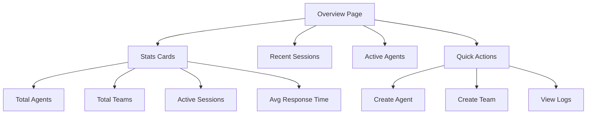

# SPEC_07_DASHBOARD_ARCHITECTURE

> **Propósito**: Especificar arquitectura frontend, interfaz reactiva, estados visuales y UX rules para el dashboard de yaml-agno.

---

## 1. FRONTEND STACK AND CONFIGURATION

### 1.1 Stack Tecnológico

| Componente | Tecnología | Versión | Justificación |
|------------|-----------|---------|---------------|
| **Framework** | React | 18+ | Component-based, gran ecosistema |
| **Build Tool** | Vite | 5+ | Fast HMR, optimizado |
| **UI Components** | shadcn/ui | Latest | Radix UI + Tailwind, accesible |
| **Styling** | Tailwind CSS | 3+ | Utility-first, consistente |
| **State Management** | Zustand | 4+ | Simple, sin boilerplate |
| **Data Fetching** | React Query | 5+ | Caching, revalidación |
| **Routing** | React Router | 6+ | Client-side routing |
| **Type Safety** | TypeScript | 5+ | Type safety en frontend |

### 1.2 Estructura de Proyecto

```
dashboard/
├── src/
│   ├── components/
│   │   ├── ui/              # shadcn/ui components
│   │   ├── agents/          # Agent-related components
│   │   ├── teams/           # Team-related components
│   │   ├── workflows/       # Workflow-related components
│   │   └── sessions/        # Session-related components
│   ├── pages/
│   │   ├── overview.tsx     # Dashboard overview
│   │   ├── agents.tsx       # Agents list/detail
│   │   ├── teams.tsx        # Teams list/detail
│   │   └── sessions.tsx     # Active sessions
│   ├── store/
│   │   ├── agentStore.ts    # Zustand agent store
│   │   ├── teamStore.ts     # Zustand team store
│   │   └── sessionStore.ts # Zustand session store
│   ├── lib/
│   │   ├── api.ts           # API client
│   │   └── utils.ts        # Utilities
│   └── types/
│       └── api.ts           # TypeScript types from API
├── tailwind.config.js
├── vite.config.ts
└── tsconfig.json
```

---

## 2. VIEW MODULES AND INTERFACES

### 2.1 Overview Page



### 2.2 Agent Detail Page

- **Header**: Agent name, status, version
- **Config Section**: YAML config viewer/editor
- **Execution Section**: Run agent form
- **History Section**: Past executions table
- **Metrics Section**: Response time, success rate

### 2.3 Session Detail Page

- **Header**: Session ID, user, status
- **Chat Interface**: Message history display
- **Metadata Section**: Session timing, iteration count
- **Actions Section**: Pause, resume, close session

---

## 3. STATE MANAGEMENT AND CACHING

### 3.1 Zustand Store Structure

```typescript
// dashboard/src/store/agentStore.ts

import { create } from 'zustand';
import { AgentConfig, AgentExecution } from '@/types/api';

interface AgentStore {
  // State
  agents: AgentConfig[];
  selectedAgent: AgentConfig | null;
  executions: AgentExecution[];
  isLoading: boolean;
  error: string | null;
  
  // Actions
  fetchAgents: () => Promise<void>;
  selectAgent: (id: string) => void;
  runAgent: (name: string, input: string) => Promise<void>;
  deleteAgent: (id: string) => Promise<void>;
  
  // Actions (internal)
  setLoading: (loading: boolean) => void;
  setError: (error: string | null) => void;
}

export const useAgentStore = create<AgentStore>((set, get) => ({
  // Initial state
  agents: [],
  selectedAgent: null,
  executions: [],
  isLoading: false,
  error: null,
  
  // Actions implementation
  fetchAgents: async () => {
    set({ isLoading: true, error: null });
    try {
      const response = await fetch('/api/v1/agents');
      const data = await response.json();
      set({ agents: data.agents, isLoading: false });
    } catch (error) {
      set({ error: 'Failed to fetch agents', isLoading: false });
    }
  },
  
  selectAgent: (id: string) => {
    const agent = get().agents.find(a => a.id === id);
    set({ selectedAgent: agent || null });
  },
  
  runAgent: async (name: string, input: string) => {
    set({ isLoading: true, error: null });
    try {
      const response = await fetch(`/api/v1/agents/${name}/run`, {
        method: 'POST',
        headers: { 'Content-Type': 'application/json' },
        body: JSON.stringify({ input, user_id: 'current_user' })
      });
      const data = await response.json();
      set({ 
        executions: [data, ...get().executions],
        isLoading: false 
      });
    } catch (error) {
      set({ error: 'Failed to run agent', isLoading: false });
    }
  },
  
  deleteAgent: async (id: string) => {
    set({ isLoading: true, error: null });
    try {
      await fetch(`/api/v1/agents/${id}`, { method: 'DELETE' });
      set({ 
        agents: get().agents.filter(a => a.id !== id),
        isLoading: false 
      });
    } catch (error) {
      set({ error: 'Failed to delete agent', isLoading: false });
    }
  },
  
  setLoading: (loading: boolean) => set({ isLoading: loading }),
  setError: (error: string | null) => set({ error }),
}));
```

### 3.2 React Query Configuration

```typescript
// dashboard/src/lib/api.ts

import { QueryClient, QueryCache } from '@tanstack/react-query';

export const queryClient = new QueryClient({
  queryCache: new QueryCache({
    onError: (error) => {
      console.error('Query error:', error);
    },
  }),
  defaultOptions: {
    queries: {
      staleTime: 5 * 60 * 1000, // 5 minutes
      gcTime: 10 * 60 * 1000, // 10 minutes
      refetchOnWindowFocus: false,
      retry: 1,
    },
  },
});
```

---

## 4. UX RULES AND OPTIMISTIC UI

### 4.1 Dark Mode

**Strategy**: System preference + manual toggle

```typescript
// dashboard/src/components/theme-provider.tsx

import { createContext, useContext, useEffect, useState } from 'react';

type Theme = 'dark' | 'light' | 'system';

interface ThemeContextType {
  theme: Theme;
  setTheme: (theme: Theme) => void;
}

const ThemeContext = createContext<ThemeContextType | undefined>(undefined);

export function ThemeProvider({ children }: { children: React.ReactNode }) {
  const [theme, setTheme] = useState<Theme>('system');
  
  useEffect(() => {
    const root = window.document.documentElement;
    root.classList.remove('light', 'dark');
    
    if (theme === 'system') {
      const systemTheme = window.matchMedia('(prefers-color-scheme: dark)').matches
        ? 'dark'
        : 'light';
      root.classList.add(systemTheme);
    } else {
      root.classList.add(theme);
    }
  }, [theme]);
  
  return (
    <ThemeContext.Provider value={{ theme, setTheme }}>
      {children}
    </ThemeContext.Provider>
  );
}
```

### 4.2 Optimistic Updates

```typescript
// dashboard/src/components/agents/agent-list.tsx

import { useAgentStore } from '@/store/agentStore';

export function AgentList() {
  const { agents, deleteAgent } = useAgentStore();
  
  const handleDelete = async (id: string) => {
    // Optimistic update
    const previousAgents = useAgentStore.getState().agents;
    useAgentStore.setState({ 
      agents: agents.filter(a => a.id !== id) 
    });
    
    try {
      await deleteAgent(id);
    } catch (error) {
      // Rollback on error
      useAgentStore.setState({ agents: previousAgents });
    }
  };
  
  return (
    // ... render
  );
}
```

---

## 5. BEHAVIOR DELTA - BDD SCENARIOS

### 5.1 Escenarios de Aceptación

#### Scenario 1: Golden Path - View Agent List

```gherkin
GIVEN the user navigates to /agents
AND agents exist in the database
WHEN the page loads
THEN the agent list is displayed
AND each agent shows name, model, status
AND the list is sorted by name alphabetically
```

#### Scenario 2: Golden Path - Run Agent

```gherkin
GIVEN the user is on the agent detail page
AND the agent is active
WHEN the user enters input and clicks "Run"
THEN a loading spinner appears
AND the agent execution starts
AND upon completion the result is displayed
AND the execution is added to history
```

#### Scenario 3: Error Case - Agent Execution Fails

```gherkin
GIVEN the user attempts to run an agent
AND the agent execution fails
WHEN the error occurs
THEN an error toast notification appears
AND the error message is descriptive
AND the loading spinner is removed
AND the user can retry
```

#### Scenario 4: Golden Path - Dark Mode Toggle

```gherkin
GIVEN the user is on any page
AND the current theme is light
WHEN the user clicks the theme toggle
THEN the theme changes to dark
AND all components reflect the dark theme
AND the preference is persisted to localStorage
```

---

## 6. TDD MICRO-TASK EXECUTION PROTOCOL

### 6.1 Cascading Task Checklist

#### TASK_001: Setup Project with Vite

- **File**: `dashboard/package.json`
- **Test**: Verify `npm run dev` starts successfully
- **RED**: `npm run dev` fails (project doesn't exist)
- **GREEN**: Initialize Vite + React + TypeScript project
- **Commit**: `feat: initialize dashboard with Vite`

#### TASK_002: Configure Tailwind CSS

- **File**: `dashboard/tailwind.config.js`
- **Test**: Verify Tailwind classes work in component
- **RED**: Tailwind classes have no effect
- **GREEN**: Configure Tailwind with shadcn/ui
- **Commit**: `feat: configure Tailwind CSS and shadcn/ui`

#### TASK_003: Create AgentStore

- **File**: `dashboard/src/store/agentStore.ts`
- **Test**: `tests/unit/store/test_agent_store.test.ts`
- **RED**:
  ```typescript
  test('agentStore initial state', () => {
    const store = useAgentStore.getState();
    expect(store.agents).toEqual([]);
  });
  ```
- **GREEN**: Implement Zustand store
- **Commit**: `feat: add agent store with Zustand`

#### TASK_004: Create Overview Page

- **File**: `dashboard/src/pages/overview.tsx`
- **Test**: Component renders without crashing
- **RED**: Component doesn't exist
- **GREEN**: Implement overview page with stats cards
- **Commit**: `feat: add overview page`

#### TASK_005: Create Agent List Page

- **File**: `dashboard/src/pages/agents.tsx`
- **Test**: Component renders list of agents
- **RED**: Component doesn't exist
- **GREEN**: Implement agents page with table
- **Commit**: `feat: add agents list page`

#### TASK_006: Implement API Client

- **File**: `dashboard/src/lib/api.ts`
- **Test**: `tests/unit/lib/test_api.test.ts`
- **RED**:
  ```typescript
  test('fetchAgents returns data', async () => {
    const agents = await fetchAgents();
    expect(Array.isArray(agents)).toBe(true);
  });
  ```
- **GREEN**: Implement `fetchAgents()` function
- **Commit**: `feat: add API client functions`

#### TASK_007: Implement Theme Provider

- **File**: `dashboard/src/components/theme-provider.tsx`
- **Test**: Theme toggle switches dark/light
- **RED**: Theme doesn't toggle
- **GREEN**: Implement theme provider with toggle
- **Commit**: `feat: add theme provider and toggle`

---

## 7. SUPUESTOS TÉCNICOS ADOPTADOS

### [Decisión 1] Client-Side Routing

**Justificación**:
- Mejor UX (no page reload)
- Navegación más rápida
- Estado preservado entre páginas

### [Decisión 2] Zustand sobre Redux

**Justificación**:
- Menos boilerplate
- Más simple para apps medianas
- TypeScript friendly

### [Decisión 3] shadcn/ui sobre Material-UI

**Justificación**:
- Componentes accesibles (Radix UI)
- Customizable con Tailwind
- No runtime overhead

---

## 8. PREGUNTAS DE CALIBRACIÓN ESTRATÉGICA

### [Pregunta 1] Real-time Updates

**¿El dashboard debe soportar actualizaciones en tiempo real (WebSocket)?**

Implica:
- **Sí**: WebSocket connection, más complejidad
- **No**: Polling o refresh manual
- **Trade-off**: Freshness vs complejidad

### [Pregunta 2] Offline Support

**¿Debe haber soporte offline con service worker?**

Implica:
- **Sí**: PWA, cache, más complejidad
- **No**: Online-only, más simple
- **Trade-off**: UX vs complejidad

### [Pregunta 3] Mobile Responsiveness

**¿Prioridad mobile-first o desktop-first?**

Implica:
- **Mobile-first**: Diseño para mobile, expande a desktop
- **Desktop-first**: Diseño para desktop, adapta a mobile
- **Trade-off**: UX mobile vs effort

---

*¿Deseas profundizar la especificación técnica al **Nivel 6** de algún componente específico o autorizar la ejecución de estas tareas por parte del equipo de agentes?*
