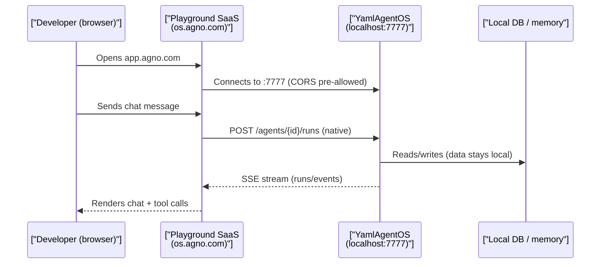
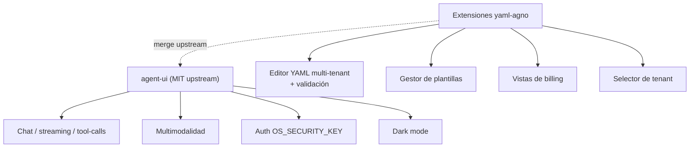

# SPEC_07_DASHBOARD_ARCHITECTURE

> **Propósito**: Definir la estrategia de UI de yaml-agno. yaml-agno **no construye** un frontend en el MVP: expone `YamlAgentOS` (SPEC_06) y consume las superficies de UI que Agno ya provee. Estrategia en dos fases: (1) **Playground SaaS gratuito** para MVP/dev/interno, y (2) **fork de `agent-ui` (MIT)** auto-alojado para whitelabel POST-MVP.

@ai-directive: Do NOT build a custom React/Vue/Svelte dashboard that duplicates agent-ui or calls the eliminated `/api/v1/agents/{name}/run` endpoints. Those endpoints were removed in SPEC_06; AgentOS serves native `POST /agents/{agent_id}/runs`. The only frontend code yaml-agno owns is POST-MVP extensions layered on the MIT agent-ui fork.

---

## 1. LA JERARQUÍA DE SUPERFICIES DE UI (EXISTENTES — NO RECONSTRUIR)

yaml-agno **hereda** tres superficies de UI de Agno y no construye ninguna de ellas. Esta sección las cataloga para que ningún agente intente duplicarlas.

### 1.1 Tabla de superficies existentes

| Superficie | Tipo | Origen | Cómo se activa | Uso en yaml-agno |
|------------|------|--------|----------------|------------------|
| **Swagger / OpenAPI** | Nativa, local | `AgentOS` router + `/docs` | `AgnoAPISettings.docs_enabled=True` (os/settings.py:18) | Debug de API en dev. Sin custo. |
| **Playground SaaS** | Hosteada, web app | `os.agno.com` (Agno Inc.) | `YamlAgentOS.serve()` arranca la API local en :7777 e imprime el link al SaaS | **MVP / dev / interno** (Plan Free). |
| **agent-ui** | MIT, auto-alojable | `github.com/agno-agi/agent-ui` | `npx create-agent-ui@latest` → apunta a `http://localhost:7777` | **POST-MVP**: fork whitelabel para clientes. |

@ai-directive: yaml-agno construye **cero** de estas tres superficies. La única UI que yaml-agno posee son las extensiones POST-MVP (editor YAML multi-tenant, plantillas, billing) que se montan **sobre el fork de agent-ui**, no desde cero.

### 1.2 Aclaración: AGUI NO es una UI

`AGUI` (en `os/interfaces/agui/`) es un **adaptador de protocolo** AG-UI (`POST /agui` con SSE para un agente/equipo individual), opt-in vía `interfaces=[AGUI(agent=...)]`. Es un protocolo, no una aplicación. **No confundir** AGUI con el Playground ni con agent-ui.

@ai-directive: When a spec or task says "AGUI", it refers to the SSE protocol adapter, not to any frontend. Do not route UI work through AGUI unless an explicit AG-UI-protocol consumer requires it (out of MVP scope).

### 1.3 Hechos verificados sobre el empaquetado de Agno

- El paquete `agno` **no incluye** archivos HTML ni estáticos. `GET /` devuelve JSON.
- No existe el kwarg `enable_playground` en `AgentOS`. El Playground es un SaaS externo, no un flag.
- CORS ya viene preconfigurado para los dominios de Agno (os/settings.py:36-44): `localhost:3000`, `agno.com`, `www.agno.com`, `app.agno.com`, `os-stg.agno.com`, `os.agno.com`. yaml-agno no necesita tocar CORS para conectar el Playground SaaS.

---

## 2. FASE 1 (MVP) — PLAYGROUND SaaS GRATUITO

### 2.1 Cómo se habilita

```python
# yaml_agno/runtime/server.py
"""Server bootstrap: serve YamlAgentOS on port 7777.

The hosted Playground (os.agno.com) connects back to this local API.
No frontend code is shipped by yaml-agno.
"""
from yaml_agno.runtime.agentos import YamlAgentOS


def serve(host: str = "0.0.0.0", port: int = 7777) -> None:
    """Start the YamlAgentOS JSON API.

    Args:
        host: Bind address.
        port: Port for the Playground/agent-ui to connect to.
    """
    app = YamlAgentOS()  # subclasses AgentOS, no get_app() override
    app.serve(host=host, port=port)  # prints the Playground link
```



### 2.2 Qué cubre el Plan Free

Pricing verificado el **2026-07-02 en agno.com/pricing — recheck antes de decisiones de producción**:

| Recurso | Plan Free ($0) |
|---------|----------------|
| Construir sistemas multi-agente | ✅ |
| Ejecutar con AgentOS | ✅ |
| **Control Plane para AgentOS LOCAL** | ✅ |
| **Chatear con agents / teams / workflows** | ✅ |
| **Monitoreo de sesiones y métricas** | ✅ |
| **Gestión de conocimiento y memoria** | ✅ |
| Soporte | Comunitario |

Planes superiores (referencia, **no** usados en MVP): **Pro ($150/mes)** añade Control Plane para AgentOS *LIVE* + **$95/mes por conexión en vivo**; **Enterprise** permite self-hosted Control Plane (whitelabel).

@ai-directive: For MVP, CENF internal/dev use, and any scenario where data privacy requires the SaaS to be only a panel (not a data store), the Free plan is sufficient. **"No data ever leaves your system"** — los datos viven en la DB local; el SaaS es solo el panel.

### 2.3 Cuándo NO usar el SaaS Free

Para **datos reales de clientes** (amBOTHS u otros), se prefiere la Fase 2 (agent-ui self-hosted) porque, aunque el SaaS no almacena datos, el tráfico de chat pasa por el navegador hacia un dominio de terceros. La Fase 2 elimina esa dependencia de red hacia os.agno.com.

---

## 3. FASE 2 (POST-MVP) — FORK DE agent-ui (MIT)

### 3.1 Por qué fork en vez de construir desde cero

| Criterio | Construir desde cero (plan viejo iter1) | Fork de agent-ui (MIT) |
|----------|------------------------------------------|------------------------|
| Esfuerzo | Meses de desarrollo | Días para arrancar |
| Chat streaming + tool-calls | Implementar a mano | **Ya construido** |
| Multimodalidad (imagen/video/audio) | Implementar a mano | **Ya construido** |
| Pasos de razonamiento / referencias | Implementar a mano | **Ya construido** |
| Dark mode | Implementar a mano | **Ya construido** |
| Auth (`OS_SECURITY_KEY`) | Implementar a mano | **Ya construido** |
| Whitelabel sin Enterprise | Imposible (requiere plan Enterprise del SaaS) | **Permitido por licencia MIT** |
| Fidelidad a la API de Agno | Riesgo de desviación | **Garantizada** (es la UI oficial) |

@ai-directive: The build-vs-reuse decision is RESOLVED in favor of REUSE (fork agent-ui, MIT). Do not open a new greenfield frontend project.

### 3.2 Stack heredado del fork

agent-ui usa exactamente el stack que el plan iter1 proponía construir desde cero:

| Componente | Tecnología | Notas |
|------------|-----------|-------|
| Framework app | Next.js 15 + React 18 | SSR + ruteo |
| Lenguaje | TypeScript | Type safety |
| Estilos | Tailwind CSS | Utility-first |
| Componentes UI | shadcn/ui (Radix) | Accesible |
| Estado | Zustand | Sin boilerplate |
| Animación | Framer Motion | Transiciones |
| Compatibilidad | Agno v2.x (`main` branch) | Match con AgentOS 2.6.18 |

@ai-directive: When extending the fork, follow agent-ui's existing stack and patterns (Zustand stores, shadcn primitives, Tailwind tokens). Do not introduce a competing state library or UI kit.

### 3.3 Qué añade yaml-agno sobre el fork



Extensiones específicas de yaml-agno (POST-MVP, no bloquean el MVP):

1. **Editor YAML multi-tenant** — editor CodeMirror/Monaco con validación contra `AgentConfig`/`TeamConfig` (SPEC_02), scoped al tenant activo.
2. **Gestor de plantillas** — CRUD de plantillas YAML, versionado.
3. **Selector de tenant** — switch de contexto multi-cliente.
4. **Vistas de billing** — sólo si el producto lo requiere (amBOTHS).

### 3.4 Riesgo: mantenimiento del merge con upstream

El fork diverge del `main` de agent-ui. Mitigaciones:

- Mantener las extensiones en rutas aisladas (`app/yaml-agno/*`) para minimizar conflictos.
- Sincronizar con upstream mensual; `git merge upstream/main` + resolver.
- Tests E2E (Playwright) sobre el chat base para detectar regresiones tras cada merge.

---

## 4. CONEXIÓN DE LA UI CON YamlAgentOS

### 4.1 Contrato de transporte

La UI (Playground o agent-ui) habla con la **API nativa de AgentOS** expuesta por `YamlAgentOS`:

- **Base URL**: `http://localhost:7777` (dev) o HTTPS en prod.
- **Wire contract**: multipart / `{id}` nativo de AgentOS (ver SPEC_06 § contrato de transporte).
- **Auth**: header `Authorization: Bearer ${OS_SECURITY_KEY}`.
- **Endpoints nativos consumidos**: `POST /agents/{agent_id}/runs`, `GET /sessions`, etc.

@ai-directive: The UI must call NATIVE AgentOS endpoints only. The yaml-agno-specific `/api/v1/agents/{name}/run` endpoint does NOT exist (eliminated in SPEC_06) and must never appear as a frontend target. A contract test (§6) enforces this.

### 4.2 YamlAgentOS no rompe el pipeline de AgentOS

`YamlAgentOS(AgentOS)` (SPEC_06) **no** debe sobreescribir `get_app()` sin llamar `super().get_app()` — eso dropearía routers, middleware y exception handlers nativos. Playground y agent-ui se conectan al `AgentOS` que `YamlAgentOS` produce; no se requiere manejo especial.

```python
# yaml_agno/runtime/agentos.py
"""YamlAgentOS: thin subclass, delegates app assembly to AgentOS."""
from agno.os import AgentOS


class YamlAgentOS(AgentOS):
    """AgentOS configured from YAML. Does NOT override get_app()."""

    # ... YAML-loading init per SPEC_06 ...
    # get_app() is inherited unchanged so all routers/middleware survive.
```

---

## 5. BEHAVIOR DELTA — ESCENARIOS BDD

### 5.1 Escenarios de aceptación

#### Scenario 1: MVP — servir YamlAgentOS y chatear vía Playground Free

```gherkin
Feature: MVP UI via hosted Playground (Free plan)
  Scenario: Developer chats with a YAML-defined agent through os.agno.com
    GIVEN a YamlAgentOS configured from specs/examples/hello_agent.yaml
    AND the OS_SECURITY_KEY is set in the environment
    WHEN the developer runs `yaml-agno serve`
    THEN the JSON API starts on port 7777
    AND the console prints a link to os.agno.com
    WHEN the developer opens the Playground and points it at localhost:7777
    THEN CORS allows the connection (pre-configured by Agno)
    AND the agent appears in the Playground agent list
    WHEN the developer sends a chat message
    THEN the response streams back over SSE
    AND session data is stored in the local DB (data does not leave the system)
```

#### Scenario 2: La UI usa endpoints nativos de AgentOS (no eliminados)

```gherkin
  Scenario: No frontend calls the eliminated yaml-agno run endpoint
    GIVEN the yaml-agno codebase and any future agent-ui fork
    WHEN a static scan searches for "/api/v1/agents/" as a fetch target
    THEN it finds zero active calls
    AND the only run endpoint referenced is POST /agents/{agent_id}/runs (native AgentOS)
```

#### Scenario 3: POST-MVP — fork de agent-ui y extensión

```gherkin
Feature: POST-MVP whitelabel UI (agent-ui fork)
  Scenario: Fork agent-ui and connect to local AgentOS
    GIVEN a developer has cloned the agent-ui MIT repo via create-agent-ui
    AND set the AgentOS base URL to http://localhost:7777
    AND set OS_SECURITY_KEY in the fork's env
    WHEN the developer runs `pnpm dev`
    THEN the Next.js app boots
    AND chat with a YAML-defined agent renders streaming responses
    AND tool-call visualizations and reasoning steps render correctly
  Scenario: yaml-agno YAML editor layered on the fork
    GIVEN the forked agent-ui with yaml-agno extensions mounted at app/yaml-agno/*
    WHEN the developer opens the YAML editor route
    THEN a multi-tenant YAML editor loads with validation against AgentConfig
    AND saving persists the YAML to the tenant-scoped store
```

---

## 6. TDD MICRO-TASK EXECUTION PROTOCOL

### 6.1 Tareas MVP (bloqueantes)

#### TASK_001: Smoke — YamlAgentOS serve expone la API

- **File**: `tests/runtime/test_serve_smoke.py`
- **RED**:
  ```python
  def test_serve_opens_port_and_prints_playground_link(monkeypatch, capsys):
      monkeypatch.setenv("OS_SECURITY_KEY", "test-key")
      served = {}
      def fake_serve(self, host, port):
          served["host"] = host
          served["port"] = port
      monkeypatch.setattr("agno.os.AgentOS.serve", fake_serve)
      from yaml_agno.runtime.server import serve
      serve()
      out = capsys.readouterr().out
      assert served["port"] == 7777
      assert "os.agno.com" in out or "agno.com" in out
  ```
- **GREEN**: Implementar `serve()` que instancia `YamlAgentOS` y llama `.serve()`.
- **Commit**: `feat: serve YamlAgentOS and print Playground link`

#### TASK_002: Contrato — ningún frontend llama a `/api/v1/agents/`

- **File**: `tests/contracts/test_no_eliminated_endpoints.py`
- **RED**:
  ```python
  def test_no_frontend_calls_eliminated_run_endpoint():
      """The UI must NOT call the eliminated /api/v1/agents/{name}/run.
      Only native AgentOS endpoints (POST /agents/{id}/runs) are allowed.
      """
      import pathlib
      eliminated = "/api/v1/agents/"
      offenders = []
      for path in pathlib.Path("dashboard").rglob("*.{ts,tsx,js,jsx}"):
          if eliminated in path.read_text(encoding="utf-8"):
              offenders.append(str(path))
      assert not offenders, f"found eliminated endpoint in: {offenders}"
  ```
- **GREEN**: Asegurar que el codebase (y el futuro fork) sólo referencia endpoints nativos.
- **Commit**: `test: contract gate against eliminated run endpoint`

### 6.2 Tareas POST-MVP (NO bloqueantes — marcadas explícitamente)

> @ai-directive: These tasks are POST-MVP. They must NOT block the MVP release. They live here to document the agent-ui fork path.

#### TASK_003 (POST-MVP): Scaffold del fork agent-ui

- Acción: `npx create-agent-ui@latest`, commit del scaffold.
- Config: `.env.local` con `AGENTOS_URL=http://localhost:7777`, `OS_SECURITY_KEY=...`.
- **Test**: `pnpm dev` levanta la app y el chat responde a un agente YAML.

#### TASK_004 (POST-MVP): Vista Editor YAML multi-tenant

- **File**: `app/yaml-agno/yaml-editor/page.tsx` (dentro del fork)
- **Test**: Carga un YAML, valida contra `AgentConfig` (SPEC_02), guarda.
- **Commit**: `feat(post-mvp): multi-tenant YAML editor view`

---

## 7. SUPUESTOS Y DECISIONES ADOPTADAS

### [Decisión 1] Sin frontend custom en el MVP

**Decisión**: yaml-agno **no construye** frontend en el MVP. Usa el Playground SaaS Free.

**Justificación**:
- Cero trabajo de frontend, cero costo.
- El Free plan cubre chat, sesiones, métricas, memoria y conocimiento.
- "No data ever leaves your system" — los datos viven en la DB local.

### [Decisión 2] POST-MVP = fork de agent-ui (MIT), no build-from-scratch

**Decisión**: Para whitelabel POST-MVP se forkea `agent-ui` (licencia MIT).

**Justificación**:
- Ahorra meses de trabajo (chat/tool-calls/multimodal ya construidos).
- Whitelabel sin necesidad del plan Enterprise del SaaS.
- Fidelidad garantizada a la API de Agno (es la UI oficial).

### [Decisión 3] Los datos se quedan locales (privacidad)

**Decisión**: Tanto el Playground como el fork apuntan a la API local; la DB nunca se replica en el SaaS.

**Justificación**: Cumple requisitos de privacidad de CENF y clientes. El SaaS es sólo un panel.

### [Decisión 4] Seguir el stack y patrones de agent-ui al extender

**Decisión**: Las extensiones POST-MVP usan el mismo stack del fork (Zustand, shadcn, Tailwind).

**Justificación**: Fidelidad al sistema, mínimos conflictos en merges con upstream.

---

## 8. PREGUNTAS DE CALIBRACIÓN — RESUELTAS

### [Pregunta 1] ¿Actualizaciones en tiempo real (WebSocket)?

**Resuelto**: SÍ, nativo. Tanto el Playground como agent-ui ya implementan streaming en tiempo real (SSE/WebSocket sobre la API de AgentOS). yaml-agno no añade nada.

### [Pregunta 2] ¿Soporte offline?

**Resuelto**: No es objetivo del MVP. agent-ui requiere conexión al AgentOS. Se pospone indefinidamente.

### [Pregunta 3] ¿Mobile responsiveness?

**Resuelto**: agent-ui ya es responsive. Se adopta su comportamiento; no se hace trabajo mobile-first específico.

### [Pregunta 4 — implícita] ¿Construir o reutilizar?

**Resuelto**: **REUTILIZAR**. Se forkea agent-ui (MIT) en vez de construir desde cero. Esta es la decisión central de este SPEC.

---

*Estrategia cerrada: MVP = Playground SaaS Free; POST-MVP = fork agent-ui MIT whitelabel. yaml-agno no posee frontend propio hasta la Fase 2, y aun entonces son extensiones sobre el fork.*
