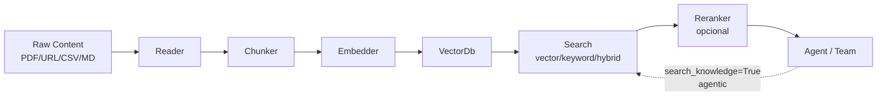
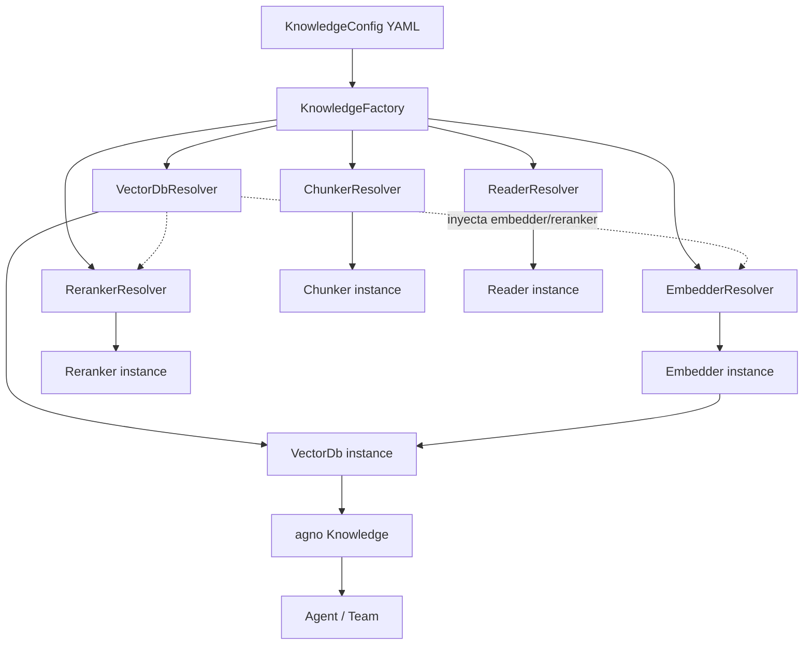

# SPEC_10_KNOWLEDGE_AND_RAG

> **Propósito**: Abstraer a YAML la totalidad de la superficie `Knowledge` de Agno (vector databases, embedders, chunkers, readers, search types, rerankers y filters) mediante schemas Pydantic V2 con union discriminada, resolvers y factories que construyen objetos Agno listos para inyectar en Agents/Teams.

---

## 1. ARQUITECTURA GENERAL DE KNOWLEDGE

### 1.1 El objeto `Knowledge` de Agno

Agno expone `agno.knowledge.knowledge.Knowledge`, un aggregate que orquesta cuatro capas:



Constructor canónico:

```python
from agno.knowledge.knowledge import Knowledge
from agno.vectordb.pgvector import PgVector, SearchType

knowledge = Knowledge(
    vector_db=PgVector(
        table_name="docs", db_url=db_url, search_type=SearchType.hybrid,
        # embedder y reranker se configuran DENTRO del vector_db, no en Knowledge
    ),
    contents_db=None,          # opcional: BaseDb/AsyncBaseDb para tracking de contenido
    name="docs_kb",
    description="KB de producto",
    max_results=5,
)
```

> **Frontera de responsabilidades**: `Knowledge` NO acepta `reader`, `chunker`,
> `embedder` ni `reranker` como params directos. El `embedder` y el `reranker`
> viven en el `vector_db` (e.g. `PgVector(embedder=..., reranker=...)`); los
> `reader` se pasan por llamada a `insert(content, reader=...)` o via el dict
> `readers`; el chunker se configura dentro de cada reader/vector_db. El método
> público de búsqueda es `search(query, ...)` / async `asearch` (NO
> `search_knowledge`; ese es el nombre del tool generado para el agent).

### 1.2 Capas y responsabilidades

| Capa | Rol Agno | Schema yaml-agno | Notas |
|------|----------|-------------------|-------|
| Reader | Parsea PDF/DOCX/CSV/MD/URL/PPTX/JSON | `ReaderConfig` | Auto-detect por extension |
| Chunker | Divide contenido en chunks | `ChunkerConfig` (union) | 9 estrategias |
| Embedder | Texto a vector | `EmbedderConfig` (union) | 17 proveedores |
| VectorDb | Almacena y busca vectores | `VectorDbConfig` (union discriminada) | 20+ backends |
| Reranker | Reordena resultados | `RerankerConfig` (union) | Cohere / Infinity / LightRAG |
| Filter | Restringe busqueda | `KnowledgeFilterConfig` | Manual y agentic |

### 1.3 Boundary del aggregate en yaml-agno

`KnowledgeConfig` es la raiz Pydantic V2 que valida el bloque `knowledge:` de un Agent o Team. Es un aggregate DDD: sus value objects (`VectorDbConfig`, `EmbedderConfig`, etc.) son inmutables y validan en el boundary.

```python
# yaml-agno/src/yaml_agno/knowledge/schema.py  (PEP 695)
from typing import Literal, Annotated
from pydantic import BaseModel, Field

type KnowledgeId = str  # nombre logico de la KB

class KnowledgeConfig(BaseModel):
    """yaml-agno aggregate config for the `knowledge:` block.

    Note on the Agno boundary: `reader`, `chunker`, `embedder`, and `reranker`
    are YAML-agno conveniences. They are NOT forwarded to the `Knowledge(...)`
    constructor (which does not accept them). The KnowledgeFactory injects
    `embedder`/`reranker` into the `vector_db`, resolves `reader` per insert
    call, and wires `chunker` into the reader/vector_db. `search_knowledge`
    is an Agent-level flag (forwarded to `Agent(search_knowledge=...)`),
    not a Knowledge method.
    """
    model_config = {"extra": "forbid"}
    name: str = Field(..., max_length=120)
    description: str | None = Field(default=None, max_length=500)
    vector_db: VectorDbConfig
    contents_db: ContentsDbConfig | None = None
    reader: ReaderConfig | None = None
    chunker: ChunkerConfig | None = None
    embedder: EmbedderConfig | None = None
    reranker: RerankerConfig | None = None
    max_results: int = Field(default=5, ge=1, le=200)
    search_knowledge: bool = False      # agentic RAG on/off
    knowledge_filters: list[KnowledgeFilterConfig] | None = None


class ContentsDbConfig(BaseModel):
    """Tracking table for ingested content (dedupe, reprocessing).

    The physical table (default `knowledge_contents`) is a yamlagno.* config-store
    table: schema `yamlagno`, a non-null `tenant_id` column, and explicit
    `WHERE tenant_id = ...` on every query (authoritative decision A.9/A.11).
    It is NOT a reuse of Agno runtime `agno_*` tables — those cannot carry
    tenant_id and would leak across tenants. The DSN comes from ConfigManager;
    any password is resolved via SecretManager (no ambient credentials).
    """
    model_config = {"extra": "forbid"}
    db_url: str = Field(..., description="DSN injected via ConfigManager/SecretManager")
    table_name: str = Field(default="knowledge_contents", max_length=120)
    schema: str = Field(default="yamlagno", description="yamlagno config-store schema")
```

---

## 2. VECTOR DATABASES - UNION DISCRIMINADA

### 2.1 Patron de schema (discriminator `type`)

yaml-agno modela los 20+ vector DBs como una union discriminada por el campo `type`. Cada variante es un value object Pydantic V2 que mapea 1:1 a la clase Agno correspondiente.

```python
type VectorDbConfig = Annotated[
    PgVectorConfig
    | PineconeConfig
    | QdrantConfig
    | WeaviateConfig
    | MilvusConfig
    | ChromaConfig
    | MongoConfig
    | RedisConfig
    | CouchbaseConfig
    | CassandraConfig
    | SurrealDbConfig
    | LanceDbConfig
    | UpstashConfig
    | SingleStoreConfig
    | ClickHouseConfig
    | LightRagConfig
    | LangChainVectorConfig
    | LlamaIndexVectorConfig,
    Field(discriminator="type"),
]
```

### 2.2 Tabla maestra de backends

| `type` | Clase Agno | Hybrid | Async | Auth | Notas |
|--------|-----------|--------|-------|------|-------|
| `pgvector` | `agno.vectordb.pgvector.PgVector` | si (`SearchType.hybrid`) | si | db_url | Default recomendado produccion |
| `pinecone` | `agno.vectordb.pineconedb.PineconeDb` | si (`use_hybrid_search`) | si | api_key | Usar v5.4.2 (no v6.x) |
| `qdrant` | `agno.vectordb.qdrant.Qdrant` | si | si | api_key | Local o cloud |
| `weaviate` | `agno.vectordb.weaviate.Weaviate` | si | si | api_key/cloud | Modulos |
| `milvus` | `agno.vectordb.milvus.Milvus` | si | si | uri/token | Escala |
| `chroma` | `agno.vectordb.chroma.ChromaDb` | no | si | settings | Local / Chroma Cloud |
| `mongo` | `agno.vectordb.mongodb.MongoDb` | si | si | uri | Atlas vector search |
| `redis` | `agno.vectordb.redis.RedisDB` | si | si | host/port/password | In-memory (alias `RedisVectorDb`) |
| `couchbase` | `agno.vectordb.couchbase.CouchbaseSearch` | no | si | connection_string | NoSQL (vector search) |
| `cassandra` | `agno.vectordb.cassandra.Cassandra` | no | si | keyspace/contact_points | Distribuido |
| `surrealdb` | `agno.vectordb.surrealdb.SurrealDb` | si | si | url/ns/db | Multi-modelo |
| `lancedb` | `agno.vectordb.lancedb.LanceDb` | si (`SearchType.hybrid`) | si | uri (local) | Local serverless, dev |
| `upstash` | `agno.vectordb.upstashdb.UpstashVectorDb` | no | si | url/token | Serverless redis |
| `singlestore` | `agno.vectordb.singlestore.SingleStore` | si | si | db_url | Real-time analytics |
| `clickhouse` | `agno.vectordb.clickhouse.Clickhouse` | si | si | host/port/username | Analytical |
| `lightrag` | `agno.vectordb.lightrag.LightRag` | si | si | api_key | Graph-based RAG + reranker |
| `langchain` | `agno.vectordb.langchaindb.LangChainVectorDb` | segun provider | si | wrapper | Cualquier vector store LC |
| `llamaindex` | `agno.vectordb.llamaindex.LlamaIndexVectorDb` | segun provider | si | wrapper | Cualquier VS de LI |

> **Nota sobre backends removidos**: `azure_cosmos`/`AzureCosmosMongoDb` figuraba en
> iteraciones previas pero NO existe como backend en Agno v2.6.22 (no hay módulo
> `agno.vectordb.azure_cosmos_mongodb`). Removido. Para Cosmos DB vCore, usar el
> wrapper `type: mongo` con un URI de Cosmos o `type: langchain` con el vectorstore
> de LangChain correspondiente.

### 2.3 Schemas YAML por backend

#### 2.3.1 PgVector

```yaml
knowledge:
  name: "recipes_kb"
  description: "KB de recetas tailandesas"
  max_results: 5
  search_knowledge: true
  vector_db:
    type: pgvector
    table_name: "recipes"
    db_url: "${PGVECTOR_DB_URL}"      # inyectado por SecretManager
    schema_: "ai"                      # 'schema' es palabra reservada
    search_type: hybrid                # vector | keyword | hybrid
    vector_score_weight: 0.5           # peso vector vs keyword (Agno PgVector param)
    embedder:
      type: openai
      id: "text-embedding-3-large"
      dimensions: 3072
```

Modelo:

```python
class PgVectorConfig(BaseModel):
    model_config = {"extra": "forbid"}
    type: Literal["pgvector"]
    table_name: str = Field(..., max_length=120)
    db_url: SecretStr
    schema_: str = Field(default="ai", alias="schema")
    search_type: Literal["vector", "keyword", "hybrid"] = "vector"
    # Agno PgVector uses `vector_score_weight` (NOT hybrid_search_ratio) for the
    # vector-vs-keyword blend weight in hybrid search.
    vector_score_weight: float = Field(default=0.5, ge=0.0, le=1.0)
    embedder: EmbedderConfig | None = None
    reranker: RerankerConfig | None = None
```

#### 2.3.2 Pinecone

```yaml
vector_db:
  type: pinecone
  name: "thai-recipe-index"
  dimension: 1536
  metric: cosine                     # cosine | euclidean | dotproduct
  spec:
    serverless:
      cloud: aws
      region: us-east-1
  api_key: "${PINECONE_API_KEY}"
  use_hybrid_search: true
  hybrid_alpha: 0.5
```

```python
class PineconeConfig(BaseModel):
    model_config = {"extra": "forbid"}
    type: Literal["pinecone"]
    name: str
    dimension: int = Field(..., ge=1, le=20000)
    metric: Literal["cosine", "euclidean", "dotproduct"] = "cosine"
    spec: dict[str, Any]
    api_key: SecretStr
    use_hybrid_search: bool = False
    hybrid_alpha: float = Field(default=0.5, ge=0.0, le=1.0)
    embedder: EmbedderConfig | None = None
```

#### 2.3.3 Qdrant

```yaml
vector_db:
  type: qdrant
  collection: "thai-recipe-index"
  url: "${QDRANT_URL}"
  api_key: "${QDRANT_API_KEY}"
  # local path alternativo: path: "tmp/qdrant"
  search_type: hybrid
  embedder:
    type: openai
```

#### 2.3.4 Chroma

```yaml
vector_db:
  type: chroma
  collection: "vectors"
  path: "tmp/chromadb"
  persistent_client: true
  # Chroma Cloud:
  # settings:
  #   chroma_api_impl: "chromadb.api.fastapi.FastAPI"
  #   chroma_server_host: "your-tenant.api.trychroma.com"
  #   chroma_server_http_port: 443
  #   chroma_server_ssl_enabled: true
  #   chroma_client_auth_provider: "chromadb.auth.token_authn.TokenAuthClientProvider"
  #   chroma_client_auth_credentials: "${CHROMA_TOKEN}"
```

#### 2.3.5 Weaviate

```yaml
vector_db:
  type: weaviate
  collection: "docs"
  url: "${WEAVIATE_URL}"
  api_key: "${WEAVIATE_API_KEY}"
  search_type: hybrid
  hybrid_alpha: 0.5
```

#### 2.3.6 Milvus

```yaml
vector_db:
  type: milvus
  collection: "docs"
  uri: "${MILVUS_URI}"           # localhost:19530 o Zilliz cloud
  token: "${MILVUS_TOKEN}"
  search_type: hybrid
```

#### 2.3.7 MongoDB (Atlas)

```yaml
vector_db:
  type: mongo
  collection_name: "docs"
  database: "knowledge"
  uri: "${MONGO_URI}"
  index_name: "vector_index"
  vector_index_type: "vectorSearch"   # ANN search
  embedder:
    type: openai
```

#### 2.3.8 Redis

```yaml
vector_db:
  type: redis
  index_name: "docs"
  host: "${REDIS_HOST}"
  port: 6379
  password: "${REDIS_PASSWORD}"
  dimension: 1536
  search_type: hybrid
```

#### 2.3.9 Couchbase

```yaml
vector_db:
  type: couchbase
  bucket: "knowledge"
  collection_name: "docs"
  index_name: "vector_index"
  connection_string: "${COUCHBASE_CONN}"
  username: "${COUCHBASE_USER}"
  password: "${COUCHBASE_PASS}"
```

#### 2.3.10 Cassandra

```yaml
vector_db:
  type: cassandra
  table_name: "docs"
  keyspace: "knowledge"
  contact_points: ["127.0.0.1:9042"]
  username: "${CASS_USER}"
  password: "${CASS_PASS}"
```

#### 2.3.11 SurrealDB

```yaml
vector_db:
  type: surrealdb
  collection: "docs"
  url: "${SURREAL_URL}"
  namespace: "knowledge"
  database: "kb"
  username: "${SURREAL_USER}"
  password: "${SURREAL_PASS}"
```

#### 2.3.12 LanceDB (local, dev)

```yaml
vector_db:
  type: lancedb
  uri: "tmp/lancedb"
  table_name: "docs"
  search_type: hybrid
  embedder:
    type: cohere
    id: "embed-v4.0"
  reranker:
    type: cohere
    model: "rerank-v3.5"
```

#### 2.3.13 Upstash (serverless)

```yaml
vector_db:
  type: upstash
  index_name: "docs"
  url: "${UPSTASH_URL}"
  api_key: "${UPSTASH_API_KEY}"
  dimension: 1536
```

#### 2.3.14 SingleStore

```yaml
vector_db:
  type: singlestore
  table_name: "docs"
  db_url: "${SINGLESTORE_DB_URL}"
  search_type: hybrid
```

#### 2.3.15 ClickHouse

```yaml
vector_db:
  type: clickhouse
  table_name: "docs"
  host: "${CLICKHOUSE_HOST}"
  port: 8443
  username: "${CH_USER}"
  password: "${CH_PASS}"
  search_type: hybrid
```

#### 2.3.16 LightRAG (graph-based RAG + reranker)

```yaml
vector_db:
  type: lightrag
  api_key: "${LIGHTRAG_API_KEY}"
  base_url: "${LIGHTRAG_BASE_URL}"
  search_type: hybrid
  reranker:
    type: infinity
```

#### 2.3.17 LangChain wrapper

```yaml
vector_db:
  type: langchain
  provider: faiss                       # cualquier vectorstore de LC
  provider_config:
    folder_path: "tmp/faiss"
  embedder:
    type: openai
```

#### 2.3.18 LlamaIndex wrapper

```yaml
vector_db:
  type: llamaindex
  provider: faiss
  provider_config: {}
  embedder:
    type: openai
```

---

## 3. EMBEDDERS - 17 PROVEEDORES

### 3.1 Union discriminada

```python
type EmbedderConfig = Annotated[
    OpenAIEmbedderConfig | OpenAILikeEmbedderConfig | CohereEmbedderConfig
    | GeminiEmbedderConfig | MistralEmbedderConfig | VoyageEmbedderConfig
    | TogetherEmbedderConfig | FireworksEmbedderConfig | HuggingfaceCustomEmbedderConfig
    | SentenceTransformersEmbedderConfig | OllamaEmbedderConfig | VllmEmbedderConfig
    | AwsBedrockEmbedderConfig | AzureOpenAIEmbedderConfig | JinaEmbedderConfig
    | LangDbEmbedderConfig | NebiusEmbedderConfig | FastEmbedEmbedderConfig,
    Field(discriminator="type"),
]
```

### 3.2 Tabla maestra de embedders

| `type` | Clase Agno | Default id | Default dims | Batch | Auth |
|--------|-----------|-----------|--------------|-------|------|
| `openai` | `OpenAIEmbedder` | `text-embedding-3-small` | 1536 | si | api_key |
| `openai_like` | `OpenAILikeEmbedder` | - | - | si | api_key/base_url |
| `cohere` | `CohereEmbedder` | - | - | si | api_key |
| `gemini` | `GeminiEmbedder` | - | - | si | api_key |
| `mistral` | `MistralEmbedder` | - | - | si | api_key |
| `voyageai` | `VoyageAIEmbedder` | - | - | si | api_key |
| `together` | `TogetherEmbedder` | - | - | si | api_key |
| `fireworks` | `FireworksEmbedder` | - | - | si | api_key |
| `huggingface` | `HuggingfaceCustomEmbedder` | - | - | si | api_key |
| `sentence_transformers` | `SentenceTransformerEmbedder` | - | - | no | local |
| `ollama` | `OllamaEmbedder` | - | - | si | host |
| `vllm` | `VLLMEmbedder` | - | - | si | host |
| `aws_bedrock` | `AwsBedrockEmbedder` | - | - | si | aws creds |
| `azure_openai` | `AzureOpenAIEmbedder` | - | - | si | api_key/endpoint |
| `jina` | `JinaEmbedder` | - | - | si | api_key |
| `langdb` | `LangDBEmbedder` | - | - | si | api_key |
| `nebius` | `NebiusEmbedder` | - | - | si | api_key |
| `fastembed` | `FastEmbedEmbedder` | - | - | no | local |

> **Nota**: agno v2.6.22 expone 18 embedders (no 17). `OpenAILikeEmbedder` y
> `FastEmbedEmbedder` (antes referido como `QdrantFastEmbedEmbedder`) son los
> ajustes de nombre; `OpenAIEmbedder.id` defaultea a `text-embedding-3-small`
> (no `text-embedding-ada-002`); las dimensiones se infieren en runtime
> (3072 para `text-embedding-3-large`, 1536 en caso contrario).

### 3.3 Schema OpenAI (default)

```python
class OpenAIEmbedderConfig(BaseModel):
    model_config = {"extra": "forbid"}
    type: Literal["openai"]
    id: str = "text-embedding-3-small"
    dimensions: int | None = None   # runtime: 3072 for -3-large, else 1536
    encoding_format: Literal["float", "base64"] = "float"
    user: str | None = None
    api_key: SecretStr | None = None
    organization: str | None = None
    base_url: str | None = None
    request_params: dict[str, Any] | None = None
    client_params: dict[str, Any] | None = None
    enable_batch: bool = False
    batch_size: int = Field(default=100, ge=1, le=1000)
```

### 3.4 YAML examples

```yaml
# Local / gratis
embedder:
  type: sentence_transformers
  id: "sentence-transformers/all-MiniLM-L6-v2"

# Ollama local
embedder:
  type: ollama
  id: "nomic-embed-text"
  host: "http://localhost:11434"

# AWS Bedrock
embedder:
  type: aws_bedrock
  id: "amazon.titan-embed-text-v2:0"
  aws_access_key_id: "${AWS_ACCESS_KEY_ID}"
  aws_secret_access_key: "${AWS_SECRET_ACCESS_KEY}"
  region_name: "us-east-1"
```

---

## 4. CHUNKERS - 9 ESTRATEGIAS

### 4.1 Union discriminada

```python
type ChunkerConfig = Annotated[
    FixedSizeChunkerConfig | DocumentChunkerConfig | RecursiveChunkerConfig
    | SemanticChunkerConfig | MarkdownChunkerConfig | CsvRowChunkerConfig
    | CodeChunkerConfig | AgenticChunkerConfig | CustomChunkerConfig,
    Field(discriminator="type"),
]
```

### 4.2 Tabla de estrategias

| `type` | Clase Agno | Cuándo usar |
|--------|-----------|-------------|
| `fixed_size` | `FixedSizeChunking` | MVP, texto plano, control simple |
| `document` | `DocumentChunking` | Un chunk = un documento entero |
| `recursive` | `RecursiveChunking` | Texto largo jerarquico |
| `semantic` | `SemanticChunking` | Agrupa por significado (embeddings) |
| `markdown` | `MarkdownChunking` | Docs `.md` por headers |
| `csv_row` | `RowChunking` | Un chunk = una fila CSV |
| `code` | `CodeChunking` | Source code por funciones/clases |
| `agentic` | `AgenticChunking` | LLM decide los cortes |
| `custom` | subclass | Chunker propio del usuario |

### 4.3 Schemas y YAML

```yaml
chunker:
  type: fixed_size
  chunk_size: 1000
  overlap: 100
  separator: "\n\n"

# Semantic (necesita embedder)
chunker:
  type: semantic
  embedder:
    type: openai
  threshold: 0.5

# Markdown
chunker:
  type: markdown
  split_on_headings: true
  max_chunk_size: 1200

# Agentic (usa un modelo LLM)
chunker:
  type: agentic
  model:
    provider: openai
    id: "gpt-4o-mini"
```

```python
class FixedSizeChunkerConfig(BaseModel):
    model_config = {"extra": "forbid"}
    type: Literal["fixed_size"]
    chunk_size: int = Field(default=1000, ge=100, le=100000)
    overlap: int = Field(default=0, ge=0, le=10000)
    separator: str = "\n\n"

class CustomChunkerConfig(BaseModel):
    """Chunker definido por el usuario via import path.

    `extra="allow"` is intentional: custom chunkers may declare arbitrary
    constructor keyword arguments in `init_args`, and YAML authors pass those
    kwargs as siblings of `module`/`init_args` at the same level. The loader
    collects every non-reserved key into `init_args` before instantiating the
    imported class (the reserved keys are `type`, `module`, `init_args`).
    This is the documented escape hatch for custom flows; built-in chunker
    variants above all use `extra="forbid"`.
    """
    model_config = {"extra": "allow"}
    type: Literal["custom"]
    module: str = Field(..., max_length=300)   # myapp.chunkers.MyChunker
    init_args: dict[str, Any] = Field(default_factory=dict)
```

---

## 5. SEARCH TYPES Y RERANKING

### 5.1 Cuatro modos de retrieval

| Modo | Campo | Mecanismo | Mejor para |
|------|-------|-----------|------------|
| **vector** | `search_type: vector` | Embedding similarity | Semantic matching |
| **keyword** | `search_type: keyword` | Full-text / BM25 | Terminos exactos, IDs, codigos |
| **hybrid** | `search_type: hybrid` | Vector + keyword + ranked fusion | Lo mas comun en produccion |
| **reranking** | `reranker:` + `search_type: hybrid` | Cross-encoder reordena top-K | Alta precision |

### 5.2 Reranker schema

```python
type RerankerConfig = Annotated[
    CohereRerankerConfig | InfinityRerankerConfig | LightragRerankerConfig,
    Field(discriminator="type"),
]

class CohereRerankerConfig(BaseModel):
    model_config = {"extra": "forbid"}
    type: Literal["cohere"]
    model: str = "rerank-v3.5"
    api_key: SecretStr | None = None
```

### 5.3 Agentic RAG vs Traditional RAG

| Aspecto | Traditional RAG | Agentic RAG |
|---------|----------------|-------------|
| Trigger | Siempre busca | Agente decide cuando buscar |
| Query | Query original del usuario | Agente reformula la query |
| Flag | (none) | `search_knowledge: true` |
| Filtros | Estaticos | `knowledge_filters` agentic |
| Multi-RAG | No | Itera busquedas si respuesta insuficiente |

```yaml
# Agentic RAG completo
agent:
  name: "support_agent"
  knowledge: "recipes_kb"          # ref a KB definida en catalogs/knowledge/
  search_knowledge: true           # el agente decide cuando buscar
  read_chat_history: true          # permite follow-ups sobre la KB
```

### 5.4 Custom y async retriever

yaml-agno soporta referenciar un retriever custom del usuario (sync o async):

```yaml
vector_db:
  type: pgvector
  table_name: "docs"
  db_url: "${PGVECTOR_DB_URL}"
  retriever:
    kind: async
    module: "myapp.retrievers.hybrid_pipeline"
    init_args:
      k: 20
      min_score: 0.75
```

```python
class RetrieverConfig(BaseModel):
    model_config = {"extra": "forbid"}
    kind: Literal["sync", "async"]
    module: str
    init_args: dict[str, Any] = Field(default_factory=dict)
```

---

## 6. KNOWLEDGE FILTERS

### 6.1 Tipos de filtro

| Tipo | Campo | Cuándo |
|------|-------|--------|
| Manual | `knowledge_filters[].manual` | Filtros fijos por sesion/usuario |
| Agentic | `knowledge_filters[].agentic` | LLM extrae criterios del query |
| On-load | `reader.metadata_filters` | Metadata al insertar |

### 6.2 Schema y YAML

```python
class ManualFilter(BaseModel):
    model_config = {"extra": "forbid"}
    mode: Literal["manual"]
    key: str
    value: str | int | bool
    operator: Literal["==", "!=", ">", "<", ">=", "<=", "in", "contains"] = "=="

class AgenticFilter(BaseModel):
    model_config = {"extra": "forbid"}
    mode: Literal["agentic"]
    description: str               # el LLM lee esto para saber que extraer
    key: str
    possible_values: list[str] | None = None

type KnowledgeFilterConfig = Annotated[
    ManualFilter | AgenticFilter, Field(discriminator="mode")
]
```

```yaml
knowledge:
  name: "cvs_kb"
  vector_db:
    type: pgvector
    table_name: "cvs"
    db_url: "${DB_URL}"
  knowledge_filters:
    - mode: agentic
      description: "El usuario que pidio la consulta"
      key: "user_id"
      possible_values: ["jordan_mitchell", "taylor_brooks"]
    - mode: manual
      key: "document_type"
      value: "cv"
    - mode: manual
      key: "year"
      value: 2025
```

---

## 7. CONTENTS DB, READERS Y CLOUD STORAGE

### 7.1 Contents DB

Tracking de contenido ingerido (dedupe, reprocesamiento). La tabla física
(default `knowledge_contents`) es una tabla **yamlagno.\*** (schema `yamlagno`,
columna `tenant_id` NOT NULL, `WHERE tenant_id = ...` explícito en cada query),
provisionada por `ConfigStoreProvisioner` (SPEC_03 §6) — NO es un reuse de las
tablas runtime `agno_*` de Agno (esas no pueden llevar `tenant_id` y filtrarían
cruz-tenant; autoritative decisions A.9/A.11). El DSN se lee via ConfigManager;
el password via SecretManager (sin credenciales ambientales). Schema:
`ContentsDbConfig` (§1.3, `db_url`, `table_name`, `schema`).

```yaml
knowledge:
  contents_db:
    db_url: "${CONTENTS_DB_URL}"        # ConfigManager/SecretManager
    table_name: "knowledge_contents"    # -> yamlagno.knowledge_contents
    schema: "yamlagno"                  # default; yamlagno config-store schema
```

### 7.2 Readers (auto-detect por extension)

| Extension / fuente | Reader | Async |
|--------------------|--------|-------|
| `.pdf` | PDFReader | si |
| `.pdf` (password) | PDFReader(password=...) | si |
| `.docx` | DocxReader / DoclingReader | si |
| `.xlsx` | ExcelReader | si |
| `.csv` | CSVReader | si |
| `.json` | JSONReader | si |
| `.md` / `.txt` | MarkdownReader / TextReader | si |
| `.pptx` | PPTXReader | si |
| URL sitio | WebsiteReader | si |
| arxiv | ArxivReader | si |
| wikipedia | WikipediaReader | si |
| youtube | YouTubeReader | si |
| llms.txt | LLMsTxtReader | - |
| web search | WebSearchReader / TavilyReader | si |
| firecrawl | FirecrawlReader | si |
| docling | DoclingReader | - |
| field-labeled csv | FieldLabeledCSVReader | - |
| S3 | S3Reader | si |
| PDF con imágenes | PDFImageReader | si |

> **Nota**: el soporte de PDF con password NO es una clase separada — es el
> argumento `password=` del `PDFReader` (BasePDFReader). Agno v2.6.22 expone
> ~20 readers; la lista cubre los más usados.

```yaml
reader:
  type: pdf            # omitir para auto-detect
  strict: true
```

### 7.3 Cloud storage como fuente de insert

```yaml
knowledge:
  vector_db:
    type: pgvector
    table_name: "docs"
    db_url: "${DB_URL}"
  sources:                           # ingerir al bootstrap
    - url: "s3://my-bucket/docs/spec.pdf"
      metadata: { doc_type: "spec", team: "platform" }
    - path: "./local/manual.pdf"
    - url: "https://example.com/faq"
```

### 7.4 Knowledge for Teams (isolate vector search)

Cada Team puede tener su propia KB; los members heredan busqueda aislada por metadata `team_id`:

```yaml
team:
  mode: coordinate
  knowledge: "platform_kb"
  knowledge_isolation:
    enabled: true
    metadata_key: "team_id"
    value: "platform"        # filtro manual inyectado a todas las busquedas
```

---

## 8. RESOLUCION YAML → AGNO OBJECTS

### 8.1 Arquitectura de factories



### 8.2 Ports (Protocols)

```python
# yaml-agno/src/yaml_agno/knowledge/ports.py
from typing import Protocol

class VectorDbResolver(Protocol):
    def resolve(self, config: VectorDbConfig, embedder: object | None) -> object: ...

class EmbedderResolver(Protocol):
    def resolve(self, config: EmbedderConfig) -> object: ...

class ChunkerResolver(Protocol):
    def resolve(self, config: ChunkerConfig) -> object: ...

class KnowledgeFactory(Protocol):
    def build(self, config: KnowledgeConfig) -> object: ...
```

### 8.3 Adapter: PgVector (referencia)

```python
# yaml-agno/src/yaml_agno/knowledge/adapters/pgvector.py
from agno.vectordb.pgvector import PgVector, SearchType

class PgVectorAdapter:
    def resolve(self, config: PgVectorConfig, embedder, reranker):
        search_type = SearchType(config.search_type)
        return PgVector(
            table_name=config.table_name,
            db_url=config.db_url.get_secret_value(),
            schema=config.schema_,
            search_type=search_type,
            vector_score_weight=config.vector_score_weight,
            embedder=embedder,
            reranker=reranker,
        )
```

---

## 9. SUPUESTOS TÉCNICOS ADOPTADOS

### 9.1 [Decision] Discriminator `type` en todas las unions
**Justificación**: Pydantic V2 con `Field(discriminator="type")` da errores claros y validacion en O(1). Evita ambiguity cuando dos backends comparten campos (`table_name`).

### 9.2 [Decision] `schema_` con alias `schema`
**Justificación**: `schema` es palabra reservada en el modelo Pydantic. Usamos `schema_: str = Field(alias="schema")` para que el YAML use `schema:` y el Python use `config.schema_`.

### 9.3 [Decision] Secrets como `SecretStr`, resueltos por SecretManager
**Justificación**: Ningun secret vive en el YAML plano. Todos los `${VAR}` se reemplazan via `SecretManager` (SPEC_03) antes de construir el objeto Agno.

### 9.4 [Decision] `search_knowledge` vive en el Agent, no en la KB
**Justificación**: En Agno el flag agentic es del Agent (`Agent(knowledge=..., search_knowledge=True)`). La KB solo define almacenamiento. yaml-agno lo refleja igual: la KB no tiene `search_knowledge`; el agent si.

### 9.5 [Decision] Async obligatorio para inserts masivos
**Justificación**: Usar `ainsert` / `asearch` con `asyncio.TaskGroup` (NO `asyncio.gather`) para inserts de multiples fuentes. Evita blocking en pipelines grandes.

### 9.6 [Decision] Pinecone v5.4.2 pinned
**Justificación**: Agno no soporta Pinecone v6.x. El resolver valida la version del cliente instalado y advierte.

### 9.7 [Decision] Reader auto-detect por defecto
**Justificación**: Si `reader` es null, yaml-agno infiere por extension/protocolo (`.pdf` → PDFReader, `http(s)://` → WebsiteReader, `s3://` → cloud reader). Reduces boilerplate.

---

## 10. BEHAVIOR DELTA - BDD SCENARIOS

### 10.1 Escenarios de Aceptacion

#### Scenario 1: Golden Path - KB PgVector hybrid con agentic RAG
```gherkin
GIVEN un archivo agents/support.yaml con knowledge.vector_db.type = "pgvector" y search_type = "hybrid"
AND un agente con knowledge = "support_kb" y search_knowledge = true
WHEN KnowledgeFactory.build(config) se ejecuta
THEN se instancia un agno Knowledge con PgVector(search_type=SearchType.hybrid)
AND el embedder por defecto es OpenAIEmbedder
AND Agent.knowledge apunta a esa instancia
AND al ejecutar agent.run("cual es la politica de devolucion?") el agente busca la KB
```

#### Scenario 2: Filtro manual aislamiento por usuario
```gherkin
GIVEN una KB con knowledge_filters conteniendo un ManualFilter key="user_id" value="alice"
WHEN el agente busca
THEN el query enviado al vector_db incluye el filtro metadata user_id=alice
AND no se retornan chunks de otros usuarios
```

#### Scenario 3: Filtro agentic extrae criterio del query
```gherkin
GIVEN una KB con un AgenticFilter description="usuario solicitante" key="user_id"
WHEN el usuario pregunta "mostrame el CV de jordan_mitchell"
THEN el agente extrae user_id="jordan_mitchell" del texto
AND la busqueda se filtra por user_id=jordan_mitchell
```

#### Scenario 4: Multi-vector (Knowledge for Teams)
```gherkin
GIVEN un Team con knowledge_isolation.enabled = true y metadata_key = "team_id"
AND dos members cada uno con knowledge distinto
WHEN cada member busca
THEN cada busqueda se filtra por su team_id respectivo
AND no hay fuga de resultados entre teams
```

#### Scenario 5: Reranking mejora orden
```gherkin
GIVEN una KB LanceDb con reranker type="cohere" model="rerank-v3.5"
WHEN se busca y hybrid retorna 20 resultados
THEN el reranker reordena los 20 por relevancia cross-encoder
AND los top-5 reordenados difieren del orden crudo de hybrid
```

#### Scenario 6: Chunker invalido rechazado
```gherkin
GIVEN un YAML con chunker.type = "semantik" (typo)
WHEN KnowledgeConfig.model_validate(yaml_dict)
THEN se levanta ValidationError con mensaje apuntando a los literales validos
```

#### Scenario 7: Async insert con TaskGroup
```gherkin
GIVEN una KB con 3 sources URLs
WHEN se ejecuta el bootstrap de ingest
THEN se usa asyncio.TaskGroup para lanzar los 3 ainsert concurrentemente
AND NO se usa asyncio.gather
AND si una source falla, se cancelan las demas (ExceptionGroup)
```

#### Scenario 8: Secret inyectado por SecretManager
```gherkin
GIVEN db_url = "${PGVECTOR_DB_URL}" en el YAML
WHEN VectorDbResolver resuelve
THEN SecretManager.get("PGVECTOR_DB_URL") retorna el valor real
Y PgVector recibe el db_url plano (no la referencia)
```

---

## 11. TDD MICRO-TASK EXECUTION PROTOCOL

### 11.1 Cascading Task Checklist

#### TASK_001: Schema base KnowledgeConfig
- **File**: `yaml-agno/src/yaml_agno/knowledge/schema.py`
- **Test**: `tests/unit/knowledge/test_schema.py`
- **RED**:
```python
def test_knowledge_config_minimal():
    cfg = KnowledgeConfig.model_validate({
        "name": "kb", "vector_db": {
            "type": "pgvector", "table_name": "t", "db_url": "x"
        }
    })
    assert cfg.vector_db.type == "pgvector"
    assert cfg.max_results == 5
```
- **GREEN**: Implementar `KnowledgeConfig` + `PgVectorConfig` con `extra="forbid"`.
- **Commit**: `feat(knowledge): add KnowledgeConfig schema with pgvector variant`

#### TASK_002: Union discriminada VectorDbConfig
- **File**: `yaml-agno/src/yaml_agno/knowledge/schema.py`
- **Test**: `tests/unit/knowledge/test_vector_db_union.py`
- **RED**: validar que `type="qdrant"` rutea a `QdrantConfig` y que typo levanta error.
- **GREEN**: agregar todas las variantes del 2.2 con `Field(discriminator="type")`.
- **Commit**: `feat(knowledge): add discriminated VectorDbConfig union (20 backends)`

#### TASK_003: EmbedderConfig union (17 proveedores)
- **File**: `yaml-agno/src/yaml_agno/knowledge/schema.py`
- **Test**: `tests/unit/knowledge/test_embedder_union.py`
- **RED**: cada `type` valida defaults (openai dims=1536, sentence_transformers sin auth).
- **GREEN**: implementar todas las variantes.
- **Commit**: `feat(knowledge): add EmbedderConfig union (17 embedders)`

#### TASK_004: ChunkerConfig union (9 estrategias)
- **File**: `yaml-agno/src/yaml_agno/knowledge/schema.py`
- **Test**: `tests/unit/knowledge/test_chunker_union.py`
- **RED**: fixed_size valida `chunk_size >= overlap`; agentic requiere `model`.
- **GREEN**: implementar variantes.
- **Commit**: `feat(knowledge): add ChunkerConfig union (9 chunkers)`

#### TASK_005: EmbedderResolver + adapter OpenAI
- **File**: `yaml-agno/src/yaml_agno/knowledge/resolvers/embedder.py`
- **Test**: `tests/unit/knowledge/test_embedder_resolver.py`
- **RED**: `resolve(OpenAIEmbedderConfig)` retorna `OpenAIEmbedder(id=..., dimensions=...)`.
- **GREEN**: adapter que mapea config → `agno.knowledge.embedder.openai.OpenAIEmbedder`.
- **Commit**: `feat(knowledge): add EmbedderResolver with OpenAI adapter`

#### TASK_006: ChunkerResolver
- **File**: `yaml-agno/src/yaml_agno/knowledge/resolvers/chunker.py`
- **Test**: `tests/unit/knowledge/test_chunker_resolver.py`
- **RED**: fixed_size → `FixedSizeChunking(chunk_size=, overlap=)`.
- **GREEN**: implementar con mapping `type → clase`.
- **Commit**: `feat(knowledge): add ChunkerResolver`

#### TASK_007: VectorDbResolver con PgVectorAdapter
- **File**: `yaml-agno/src/yaml_agno/knowledge/resolvers/vector_db.py`
- **Test**: `tests/unit/knowledge/test_vector_db_resolver.py`
- **RED**: dado `PgVectorConfig(search_type="hybrid")` retorna `PgVector(search_type=SearchType.hybrid)`.
- **GREEN**: adapter que resuelve embedder + reranker y los inyecta.
- **Commit**: `feat(knowledge): add VectorDbResolver with pgvector adapter`

#### TASK_008: VectorDbResolver extiende a 20 backends
- **File**: `yaml-agno/src/yaml_agno/knowledge/resolvers/vector_db.py`
- **Test**: `tests/unit/knowledge/test_vector_db_backends.py`
- **RED**: cada backend tiene un test parametrizado que valida construccion.
- **GREEN**: un adapter por backend, registro en `RESOLVER_REGISTRY`.
- **Commit**: `feat(knowledge): register 20 vector db adapters`

#### TASK_009: KnowledgeFactory orquestador
- **File**: `yaml-agno/src/yaml_agno/knowledge/factory.py`
- **Test**: `tests/unit/knowledge/test_knowledge_factory.py`
- **RED**: dado `KnowledgeConfig` retorna `agno.knowledge.knowledge.Knowledge` con vector_db + embedder + chunker + max_results.
- **GREEN**: orquestar resolvers en orden (embedder → chunker → vector_db → Knowledge).
- **Commit**: `feat(knowledge): add KnowledgeFactory orchestrator`

#### TASK_010: KnowledgeFilterConfig (manual + agentic)
- **File**: `yaml-agno/src/yaml_agno/knowledge/filters/schema.py`
- **Test**: `tests/unit/knowledge/test_filters.py`
- **RED**: ManualFilter con operator="in" valida `value` como lista.
- **GREEN**: union discriminada `mode`.
- **Commit**: `feat(knowledge): add manual and agentic knowledge filters`

#### TASK_011: RerankerConfig + resolver
- **File**: `yaml-agno/src/yaml_agno/knowledge/reranker/`
- **Test**: `tests/unit/knowledge/test_reranker.py`
- **RED**: cohere reranker valida `model`.
- **GREEN**: resolver retorna `CohereReranker` / `InfinityReranker`.
- **Commit**: `feat(knowledge): add reranker config and resolver`

#### TASK_012: Async insert via TaskGroup
- **File**: `yaml-agno/src/yaml_agno/knowledge/ingest.py`
- **Test**: `tests/unit/knowledge/test_async_ingest.py`
- **RED**: 3 sources → TaskGroup lanza 3 `ainsert`; una falla → `ExceptionGroup`.
- **GREEN**: implementar `async def ingest(knowledge, sources)` con `asyncio.TaskGroup`.
- **Commit**: `feat(knowledge): async ingest with TaskGroup`

#### TASK_013: Knowledge for Teams isolation
- **File**: `yaml-agno/src/yaml_agno/knowledge/team_isolation.py`
- **Test**: `tests/unit/knowledge/test_team_isolation.py`
- **RED**: isolation inyecta ManualFilter metadata_key=value en toda busqueda del team.
- **GREEN**: wrapper que intercepta `search` del agno Knowledge.
- **Commit**: `feat(knowledge): team-level vector search isolation`

#### TASK_014: Integration test end-to-end
- **File**: `tests/integration/test_knowledge_e2e.py`
- **Test**: levanta PgVector en docker, inserta PDF, busca, verifica chunks.
- **RED**: assert que `knowledge.search("...")` retorna chunks con score.
- **GREEN**: test marcado `@pytest.mark.integration`.
- **Commit**: `test(knowledge): add e2e integration test`

---

## 12. PREGUNTAS DE CALIBRACIÓN ESTRATÉGICA

### 12.1 [Pregunta] ¿Un Knowledge por Agent o KBs compartidas por referencia?
**¿Definir KBs inline en cada agent o en un catalog `catalogs/knowledge/*.yaml` referenciado por nombre?**
Implica: catalog = reutilizacion y consistencia; inline = simplicidad pero duplicacion. Propuesta: catalog con `$ref`, inline como fallback.

### 12.2 [Pregunta] ¿Validacion de dimensiones embedder vs vector_db?
**¿Forzar consistencia entre `embedder.dimensions` y `vector_db.dimension` (Pinecone/Redis) en el schema?**
Implica: validar previene errores en runtime pero acopla layers; omitir da flexibilidad. Propuesta: warning, no hard fail (algunos backends infieren).

### 12.3 [Pregunta] ¿Re-ingest automatica en bootstrap o explicita?
**¿Al cargar yaml-agno, reinsertar todas las `sources` siempre o solo si contents_db no las registra?**
Implica: dedupe via contents_db = eficiente; siempre = simple pero costoso. Propuesta: dedupe por hash en contents_db.

### 12.4 [Pregunta] ¿Circuit breaker en vector_db?
**¿Envolver vector_db ops en Circuit Breaker (failure_threshold, recovery_timeout) como en SPEC_09?**
Implica: resiliencia ante vector_db caido; overhead. Propuesta: opcional via `vector_db.circuit_breaker:` heredando el patron de SPEC_09.

### 12.5 [Pregunta] ¿Custom chunker/reader via import path seguro?
**¿Permitir `module: "myapp.chunkers.X"` sin restricciones o whitelist de modulos?**
Implica: import libre = poder; seguridad = riesgo de code injection en YAML. Propuesta: whitelist configurable en ConfigManager, fail closed.
