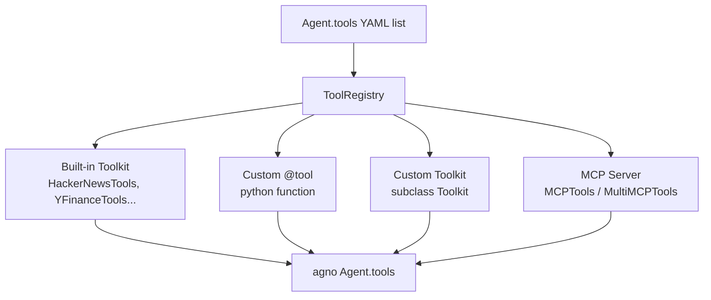
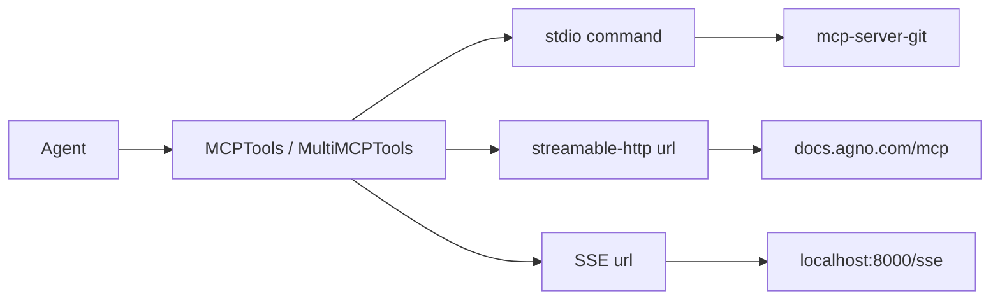
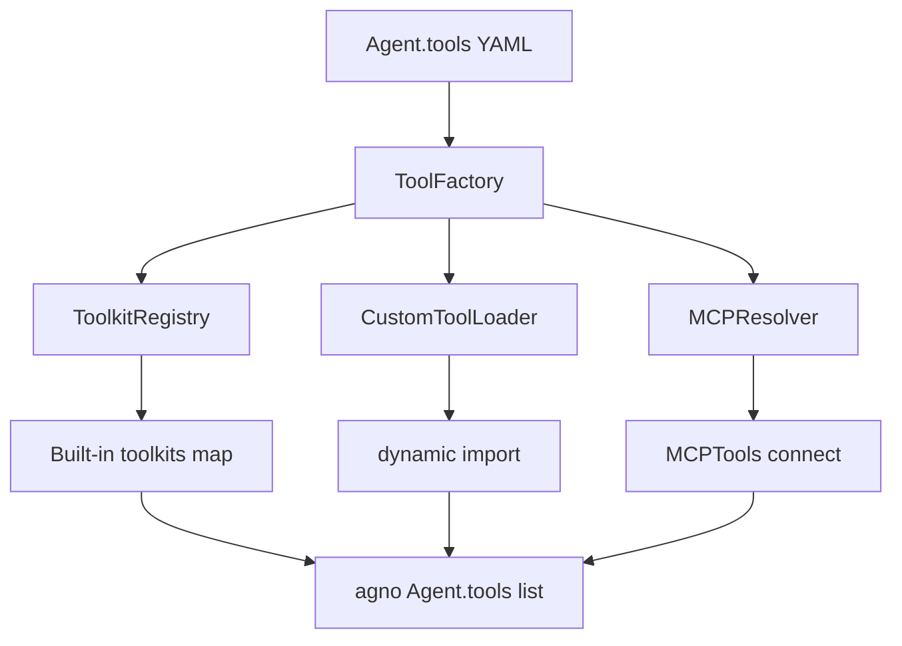

# SPEC_11_TOOLS_AND_MCP

> **Propósito**: Abstraer a YAML la totalidad de la superficie de Tools de Agno: toolkits built-in (120+), custom Python functions via `@tool`, toolkits custom, herramientas de reasoning/memory/knowledge/workflow, y la integración MCP (stdio / streamable-http / SSE) con `MCPTools` y `MultiMCPTools`. Definir un ToolRegistry que resuelve referencias YAML a objetos Agno.

---

## 1. TAXONOMIA DE TOOLS EN AGNO

### 1.1 Cuatro orígenes de herramientas



| Origen | YAML `kind` | Mecanismo Agno | Caso |
|--------|-------------|----------------|------|
| Built-in toolkit | `builtin` | clase en `agno.tools.*` | Catalogo 120+ |
| Custom function | `function` | `@tool` decorator o funcion plana | Logica propia |
| Custom toolkit | `toolkit_class` | subclass de `agno.tools.Toolkit` | Bundle reusable |
| MCP server (single) | `mcp` | `MCPTools` | Un servidor externo via protocolo MCP |
| MCP servers (multi) | `mcp_multi` | `MultiMCPTools` | Varios servidores MCP en una sola instancia |

### 1.2 Boundary del aggregate

`ToolSetConfig` es la lista validada en el boundary. Cada item es una union discriminada por `kind`:

```python
# yaml-agno/src/yaml_agno/tools/schema.py  (PEP 695)
from typing import Annotated, Callable
from pydantic import BaseModel, Field

type ToolRef = str   # nombre de toolkit builtin o ref a catalog

class ToolSetConfig(BaseModel):
    model_config = {"extra": "forbid"}
    tools: list[ToolConfig] = Field(default_factory=list)
    tool_call_limit: int | None = Field(default=None, ge=1, le=100)
    cache_callables: bool = True            # cachea factories de tools
    callable_tools_cache_key: str | None = None

type ToolConfig = Annotated[
    BuiltinToolConfig | CustomToolConfig | CustomToolkitConfig
    | McpToolConfig | McpMultiToolConfig,
    Field(discriminator="kind"),
]
```

> **`kind` taxonomy (5 variants)**: `builtin` | `function` | `toolkit_class` | `mcp`
> (single server, `McpToolConfig`) | `mcp_multi` (multiple servers in one entry,
> `McpMultiToolConfig`). `mcp_multi` maps to Agno `MultiMCPTools` (§6.10, TASK_008).

---

## 2. TOOLKITS BUILT-IN (CATÁLOGO 120+)

### 2.1 Categorización

| Categoría | Carpeta Agno | Ejemplos destacados | Cantidad |
|-----------|-------------|---------------------|----------|
| **database** | `tools/database` | Postgres, DuckDB, Pandas, BigQuery, Neo4j, Redshift, SQL, CSV, Zep | 9 |
| **file-generation** | `tools/file_generation` | FileGenerationTools | 1 |
| **local** | `tools/local` | Calculator, Python, Shell, File, LocalFileSystem, Docker, Coding, Sleep, Workspace | 9 |
| **models** | `tools/models` | OpenAI, AzureOpenAI, Gemini, Groq, Morph, Nebius | 6 |
| **search** | `tools/search` | WebSearch, DuckDuckGo, HackerNews, YFinance, Arxiv, PubMed, Wikipedia, Exa, Tavily, Serpapi, Serper, BraveSearch, BaiduSearch, Perplexity, Linkup, You.com, SearxNG, Parallel, Seltz, Valyu | 19 |
| **social** | `tools/social` | Slack, Discord, Email, Gmail, Reddit, Telegram, Twilio, Webex, WhatsApp, X, Zoom | 11 |
| **web-scrape** | `tools/web-scrape` | Website, Firecrawl, JinaReader, Newspaper, Newspaper4k, AgentQL, BrightData, Browserbase, Crawl4ai, Oxylabs, ScrapeGraph, Spider, Trafilatura | 13 |
| **others** | `tools/*` (varios) | GitHub, GitLab, Jira, Linear, Notion, Confluence, Trello, ClickUp, GoogleDrive, GoogleMaps, GoogleSheets, GoogleSlides, GoogleCalendar, YouTube, OpenWeather, Spotify, Shopify, Salesforce, Zendesk, Resend, AWSSes, AwsLambda, Airflow, Apify, Replicate, Fal, Dalle, MoviePy, OpenCV, Visualization, Reasoning, Knowledge, Memory, Scheduler, WebBrowser, E2B, Daytona, Mem0, OpenBB, FinancialDatasets, Dalle, ElevenLabs, Cartesia, EVM, Giphy, Brandfetch, CalCom, Composio, Bitbucket, DesiVocal, MlxTranscribe, NanoBanana, Lumalabs, ModelsLabs, UserControlFlow, UserFeedback, WebTools, LlmsTxt, Antigravity, CustomApi, Docling | 55+ |

**Total catalogado: 120+** (Agno añade toolkits frecuentemente; el ToolRegistry debe ser extensible).

### 2.2 Tabla de toolkits destacados con params

| Toolkit | Clase Agno | Params clave |
|---------|-----------|--------------|
| `hackernews` | `HackerNewsTools` | `cache_results` |
| `yfinance` | `YFinanceTools` | `stock_price`, `company_info`, `company_news`, `analyst_prices`, `income_statement`, `cache_results` |
| `duckdb` | `DuckDbTools` | `db_path`, `schemas`, `semantic_models`, `cache_results` |
| `calculator` | `CalculatorTools` | `include_tools`, `exclude_tools` |
| `duckduckgo` | `DuckDuckGoTools` | `fixed_max_results`, `cache_results` |
| `slack` | `SlackTools` | `slack_bot_token`, `slack_app_token`, `cache_results` |
| `postgres` | `PostgresTools` | `db_url`, `schemas`, `tables`, `cache_results` |
| `python` | `PythonTools` | `base_dir`, `run_code`, `save_and_run`, `list_files`, `read_file` |
| `shell` | `ShellTools` | `run_shell_command` |
| `reasoning` | `ReasoningTools` | `enable_think`, `enable_analyze`, `instructions`, `add_instructions`, `add_few_shot`, `few_shot_examples` |
| `github` | `GithubTools` | `access_token`, `cache_results` |
| `firecrawl` | `FirecrawlTools` | `api_key`, `formats` |
| `googledrive` | `GoogleDriveTools` | `credentials_path`, `token_path` |
| `website` | `WebsiteTools` | `max_results`, `cache_results` |

### 2.3 Schema BuiltinToolConfig

```python
class BuiltinToolConfig(BaseModel):
    model_config = {"extra": "allow"}   # params especificos del toolkit fluyen
    kind: Literal["builtin"]
    name: str = Field(..., description="Toolkit id: hackernews, yfinance...")
    cache_results: bool = False
    include_tools: list[str] | None = None
    exclude_tools: list[str] | None = None
    add_instructions: bool | None = None
```

### 2.4 YAML - toolkits built-in

```yaml
agent:
  name: "analyst"
  tools:
    - kind: builtin
      name: yfinance
      stock_price: true
      company_news: true
      cache_results: true
    - kind: builtin
      name: hackernews
      cache_results: true
    - kind: builtin
      name: duckduckgo
      fixed_max_results: 5
  tool_call_limit: 3
```

```yaml
# Toolkit con include/exclude
- kind: builtin
  name: calculator
  include_tools: ["add", "multiply", "exponentiate"]
```

---

## 3. CUSTOM @tool FUNCTIONS

### 3.1 El decorator `@tool`

Agno permite cualquier funcion Python como tool. El decorator `@tool` controla el comportamiento:

| Param | Tipo | Default | Descripción |
|-------|------|---------|-------------|
| `name` | `str` | nombre funcion | Custom name |
| `description` | `str` | docstring | Custom description |
| `requires_confirmation` | `bool` | `False` | Pedir confirmacion al usuario (HITL) |
| `requires_user_input` | `bool` | `False` | Pedir input antes de ejecutar |
| `user_input_fields` | `list[str]` | `[]` | Campos que requieren input |
| `external_execution` | `bool` | `False` | Se ejecuta fuera del control del agente |
| `show_result` | `bool` | `True` | Mostrar resultado en la respuesta |
| `stop_after_tool_call` | `bool` | `False` | Detener el run tras la llamada |
| `tool_hooks` | `list[Callable]` | `[]` | Hooks pre/post |
| `cache_results` | `bool` | `False` | Cachear resultado |
| `cache_dir` | `str` | - | Dir de cache |
| `cache_ttl` | `int` | - | TTL en segundos |

### 3.2 Built-in params inyectados

Agno inyecta automaticamente estos parametros en la firma de la tool:

- `run_context: RunContext` - session state, deps, metadata
- `agent: Agent` - instancia contextual del agente
- `team: Team` - instancia contextual del team
- Params media: `images`, `videos`, `audio`, `audio_history` (multimodal, SPEC_17)

### 3.3 Schema CustomToolConfig

```python
class CustomToolConfig(BaseModel):
    model_config = {"extra": "forbid"}
    kind: Literal["function"]
    module: str = Field(..., max_length=400)    # "myapp.tools.fetch_order"
    name: str | None = None                     # override del function name
    description: str | None = None
    requires_confirmation: bool = False
    requires_user_input: bool = False
    user_input_fields: list[str] = Field(default_factory=list)
    external_execution: bool = False
    show_result: bool = True
    stop_after_tool_call: bool = False
    cache_results: bool = False
    cache_dir: str | None = None
    cache_ttl: int | None = Field(default=None, ge=1)
    tool_hooks: list[ToolHookRef] = Field(default_factory=list)
```

```python
class ToolHookRef(BaseModel):
    """Referencia a un hook definido por el usuario."""
    module: str = Field(..., max_length=400)
```

### 3.4 YAML - custom @tool

```yaml
agent:
  name: "order_agent"
  tools:
    - kind: function
      module: "myapp.tools.fetch_order"
      requires_confirmation: true
      cache_results: true
      cache_ttl: 3600
      stop_after_tool_call: false
      tool_hooks:
        - module: "myapp.hooks.audit_log"
        - module: "myapp.hooks.rate_limit"
```

Donde `myapp/tools.py` contiene:

```python
from agno.tools import tool
from agno.run import RunContext

@tool(requires_confirmation=True, cache_results=True)
def fetch_order(run_context: RunContext, order_id: str) -> str:
    """Fetch an order by ID.

    Args:
        order_id: The order identifier.
    Returns:
        Order details as JSON string.
    """
    user_id = run_context.user_id
    ...
```

---

## 4. CUSTOM TOOLKIT (subclass)

### 4.1 Patrón Agno

Un Toolkit es una clase que hereda `agno.tools.Toolkit` y agrupa funciones relacionadas que comparten estado interno.

```python
class ShellTools(Toolkit):
    def __init__(self, working_directory: str = "/", **kwargs):
        self.working_directory = working_directory
        super().__init__(name="shell_tools", tools=[self.run_shell_command], **kwargs)

    def run_shell_command(self, command: str) -> str:
        ...
```

### 4.2 Schema CustomToolkitConfig

```python
class CustomToolkitConfig(BaseModel):
    model_config = {"extra": "allow"}     # init_args fluyen
    kind: Literal["toolkit_class"]
    module: str = Field(..., max_length=400)   # "myapp.toolkits.ShellTools"
    init_args: dict[str, Any] = Field(default_factory=dict)
    cache_results: bool = False
    include_tools: list[str] | None = None
    exclude_tools: list[str] | None = None
```

```yaml
- kind: toolkit_class
  module: "myapp.toolkits.ShellTools"
  init_args:
    working_directory: "/workspace"
  cache_results: true
  exclude_tools: ["rm"]
```

---

## 5. TOOLKIT CLASS: instructions, async y concurrencia

### 5.1 Toolkit params comunes

| Param | Aplica a | Descripción |
|-------|----------|-------------|
| `add_instructions` | Toolkit | Auto-inyecta instrucciones de uso al agente |
| `instructions` | Toolkit | Instrucciones custom |
| `cache_results` | Toolkit | Cachear todos los metodos |
| `include_tools` / `exclude_tools` | Toolkit | Subseleccionar funciones |

### 5.2 Async tools y concurrencia

Las tools pueden ser `async def`. yaml-agno requiere que el CustomToolLoader detecte si la funcion es corrutina (`asyncio.iscoroutinefunction`) y la registre como async. La ejecucion concurrente de multiples tool calls dentro de un run usa `asyncio.TaskGroup` (NO `asyncio.gather`).

```python
@tool
async def fetch_async(url: str) -> str:
    async with httpx.AsyncClient() as client:
        r = await client.get(url)
        return r.text
```

### 5.3 Tool result caching

```yaml
agent:
  tools:
    - kind: builtin
      name: yfinance
      cache_results: true       # cache on disk
    - kind: builtin
      name: hackernews
      cache_results: true
```

El cache persiste en disco (`cache_dir`). Evita recomputar en dev/test y reducir rate limits y costos.

### 5.4 tool_call_limit

```yaml
agent:
  tools: [...]
  tool_call_limit: 1     # el agente no hara mas de 1 tool call en el run
```

Reglas (de la doc Agno):
- Si el agente intenta mas calls de las permitidas a la vez, solo se ejecutan las permitidas.
- El limite se aplica **a lo largo de todo el run**, no por request individual.

---

## 6. MCP - MODEL CONTEXT PROTOCOL (CRÍTICO)

### 6.1 MCPTools y MultiMCPTools

`agno.tools.mcp.MCPTools` conecta un agente a un servidor MCP. `MultiMCPTools` conecta a varios.



### 6.2 Tres transports

| Transport | Param | Cuándo | Headers |
|-----------|-------|--------|---------|
| **stdio** (default) | `command` | Integraciones locales (`uvx mcp-server-git`) | no soporta |
| **streamable-http** (recomendado) | `url` | Servidores remotos HTTP | si |
| **SSE** (deprecado) | `url`, `transport="sse"` | Redes restringidas | si |

### 6.3 Stdio example

```python
mcp_tools = MCPTools(command="uvx mcp-server-git")
await mcp_tools.connect()
try:
    agent = Agent(tools=[mcp_tools])
    await agent.aprint_response("What is the license?", stream=True)
finally:
    await mcp_tools.close()
```

### 6.4 Streamable-http / SSE

```python
# streamable-http
mcp = MCPTools(transport="streamable-http", url="https://docs.agno.com/mcp")
# SSE
mcp = MCPTools(url="http://localhost:8000/sse", transport="sse")
```

### 6.5 Server params (headers, timeouts)

```python
from agno.tools.mcp import MCPTools, SSEClientParams

server_params = SSEClientParams(
    url=...,
    headers=...,
    timeout=...,
    sse_read_timeout=...,
)
mcp = MCPTools(server_params=server_params, transport="sse")
```

### 6.6 Dynamic headers via header_provider

Para inyectar info del run (user id, session, auth) en cada request MCP:

```python
def header_provider(run_context, agent=None, team=None) -> dict:
    return {
        "X-User-ID": run_context.user_id or "unknown",
        "X-Session-ID": run_context.session_id or "unknown",
        "X-Run-ID": run_context.run_id,
        "X-Agent-Name": agent.name if agent else None,
    }

mcp = MCPTools(url="http://localhost:8000/mcp", header_provider=header_provider)
```

Solo aplica a transports HTTP (`streamable-http`, `sse`). stdio no soporta headers.

### 6.7 Multiple servers

Dos enfoques: varias instancias `MCPTools` o una sola `MultiMCPTools`.

```python
# MultiMCPTools
async with MultiMCPTools(
    commands=[
        "npx -y @openbnb/mcp-server-airbnb --ignore-robots-txt",
        "npx -y @modelcontextprotocol/server-google-maps",
    ],
    env=env,
) as mcp_tools:
    agent = Agent(tools=[mcp_tools])
    await agent.aprint_response(message, stream=True)
```

### 6.8 refresh_connection

Reconectar automaticamente si la conexion MCP se cae.

### 6.9 Schema McpToolConfig

```python
type McpTransport = Literal["stdio", "streamable-http", "sse"]

class StdioMcpConfig(BaseModel):
    model_config = {"extra": "forbid"}
    transport: Literal["stdio"] = "stdio"
    command: str = Field(..., max_length=500)
    env: dict[str, str] | None = None

class HttpMcpConfig(BaseModel):
    model_config = {"extra": "forbid"}
    transport: Literal["streamable-http", "sse"]
    url: str
    headers: dict[str, str] | None = None
    timeout: float | None = Field(default=None, ge=1)
    sse_read_timeout: float | None = Field(default=None, ge=1)
    header_provider: str | None = Field(default=None, description="module path to header_provider fn")
    refresh_connection: bool = False

type McpToolConfig = Annotated[
    StdioMcpConfig | HttpMcpConfig,
    Field(discriminator="transport"),
]

class McpMultiToolConfig(BaseModel):
    """Multiple MCP servers aggregated into a single Agno MultiMCPTools entry.

    Discriminated by `kind: "mcp_multi"` in the ToolConfig union. Each entry in
    `servers` is a single-server McpToolConfig (stdio or http). The resolver
    builds one agno MultiMCPTools instance owning all servers (§6.10, TASK_008).
    """
    model_config = {"extra": "forbid"}
    kind: Literal["mcp_multi"]
    servers: list[McpToolConfig] = Field(..., min_length=1)
    cache_results: bool = False
```

> Nota: `McpToolConfig` se anida bajo `kind: "mcp"` (single server) y
> `McpMultiToolConfig` bajo `kind: "mcp_multi"` (multiple servers), ambas
> dentro de `ToolConfig`.

### 6.10 YAML - MCP

```yaml
# stdio
- kind: mcp
  transport: stdio
  command: "uvx mcp-server-git"
  env:
    GIT_REPO_PATH: "/repo"

# streamable-http con dynamic headers
- kind: mcp
  transport: streamable-http
  url: "https://docs.agno.com/mcp"
  refresh_connection: true
  header_provider: "myapp.mcp_headers.run_headers"
```

```yaml
# MultiMCPTools (varios servers en un solo tool entry)
agent:
  tools:
    - kind: mcp_multi
      servers:
        - transport: stdio
          command: "npx -y @openbnb/mcp-server-airbnb --ignore-robots-txt"
        - transport: stdio
          command: "npx -y @modelcontextprotocol/server-google-maps"
          env:
            GOOGLE_MAPS_API_KEY: "${GMAPS_KEY}"
```

---

## 7. REASONING, MEMORY, KNOWLEDGE Y WORKFLOW TOOLS

### 7.1 ReasoningTools

```python
# agno.tools.reasoning.ReasoningTools
# Funciones: think, analyze
# Params: enable_think, enable_analyze, instructions, add_instructions, add_few_shot, few_shot_examples
```

```yaml
- kind: builtin
  name: reasoning
  enable_think: true
  enable_analyze: true
  add_instructions: true
  add_few_shot: true
  few_shot_examples: "..."
```

### 7.2 Knowledge tools

```yaml
- kind: builtin
  name: knowledge
  knowledge_ref: "recipes_kb"     # ref a KB del catalog (SPEC_10)
  max_results: 5
```

### 7.3 Memory tools

```yaml
- kind: builtin
  name: memory
  add_history: true               # tool para leer chat history
  add_memories: true              # tool para gestionar long-term memories
  memory_db_ref: "default"
```

### 7.4 Workflow tools

Permiten invocar workflows definidos (SPEC_05) como tools desde un agente orquestador.

```yaml
- kind: builtin
  name: workflow
  workflow_ref: "research_workflow"
  as_tool: true
```

---

## 8. TOOL HOOKS, EXCEPTIONS Y CALLABLE CACHING

### 8.1 Tool hooks (pre/post)

Un hook es una funcion `(function_name, function_call, arguments)` que envuelve la ejecucion. Parametros inyectables: `agent`, `team`, `run_context`.

```python
def logger_hook(function_name, function_call, arguments):
    start = time.time()
    result = function_call(**arguments)
    logger.info(f"{function_name} took {time.time()-start:.2f}s")
    return result
```

```yaml
- kind: function
  module: "myapp.tools.fetch_order"
  tool_hooks:
    - module: "myapp.hooks.logger_hook"
    - module: "myapp.hooks.confirmation_hook"
```

### 8.2 Exceptions y retries

| Excepcion | Efecto |
|-----------|--------|
| `RetryAgentRun` | Feedback al modelo para reintentar el tool call dentro del run actual |
| `StopAgentRun` | Sale del loop de tool calls; run marcado COMPLETED (no cancelado) |

yaml-agno permite declarar exceptions custom via `module`, pero el protocolo recomienda usar las built-in de `agno.exceptions`.

### 8.3 Callable factories y caching

Para evitar reconstruir factories de tools en cada run, `cache_callables` y `callable_tools_cache_key` controlan la cache de la construccion de tools:

```yaml
agent:
  tools:
    - kind: function
      module: "myapp.tools.fetch_order"
      cache_results: true
  tool_call_limit: 5
  cache_callables: true                 # cachea la factoria construida
  callable_tools_cache_key: "fetch_order_v1"
```

- `cache_callables: true` reutiliza el objeto tool construido entre runs con la misma key.
- `callable_tools_cache_key` define la clave (default: hash del `module`).

---

## 9. TOOLREGISTRY - RESOLUCION YAML → AGNO

### 9.1 Arquitectura



### 9.2 Ports (Protocols)

```python
# yaml-agno/src/yaml_agno/tools/ports.py
from typing import Protocol

class ToolkitRegistry(Protocol):
    def get(self, name: str, params: dict) -> object: ...
    def register(self, name: str, factory: Callable[..., object]) -> None: ...

class CustomToolLoader(Protocol):
    def load(self, config: CustomToolConfig) -> Callable: ...

class MCPResolver(Protocol):
    async def resolve(self, config: McpToolConfig) -> object: ...

class ToolFactory(Protocol):
    def build(self, tool_set: ToolSetConfig) -> list: ...
```

### 9.3 Adapter: YFinanceTools (referencia)

```python
# yaml-agno/src/yaml_agno/tools/adapters/yfinance.py
from agno.tools.yfinance import YFinanceTools

class YFinanceAdapter:
    def build(self, params: dict) -> YFinanceTools:
        known = {"stock_price", "company_info", "company_news",
                 "analyst_prices", "income_statement", "cache_results"}
        kwargs = {k: v for k, v in params.items() if k in known}
        return YFinanceTools(**kwargs)
```

### 9.4 ToolkitRegistry built-in map

```python
# yaml-agno/src/yaml_agno/tools/registry.py
BUILTIN_REGISTRY: dict[str, Callable[..., object]] = {
    "hackernews": HackerNewsAdapter,
    "yfinance": YFinanceAdapter,
    "duckduckgo": DuckDuckGoAdapter,
    "calculator": CalculatorAdapter,
    "slack": SlackAdapter,
    "duckdb": DuckDbAdapter,
    "postgres": PostgresAdapter,
    "python": PythonAdapter,
    "shell": ShellAdapter,
    "reasoning": ReasoningAdapter,
    "knowledge": KnowledgeAdapter,
    "memory": MemoryAdapter,
    "website": WebsiteAdapter,
    "firecrawl": FirecrawlAdapter,
    # ... 120+ entries
}
```

### 9.5 CustomToolLoader con import dinamico y whitelist

```python
import importlib
# @ai-directive: is_module_allowed + the import whitelist are OWNED by SPEC_11
# (src/yaml_agno/security.py, see §9.5.1). They satisfy backend-sanitization
# (authoritative rule 10): ConfigManager loads the whitelist, fail closed.
from yaml_agno.security import is_module_allowed

class CustomToolLoaderImpl:
    """Loads a custom Python callable referenced by `module` in YAML.

    This loader returns the RAW callable. It does NOT apply the `@tool`
    decorator or any config flags (requires_confirmation, cache_results,
    cache_ttl, tool_hooks). The ToolFactory is responsible for wrapping the
    returned callable with `@tool(**config_flags)` so that Scenario 2's
    assertions (flags applied, result cached) hold. Keeping the two concerns
    separated (import vs decoration) is what lets `cache_callables` cache the
    final decorated object and lets the whitelist guard the import boundary.
    """

    def load(self, config: CustomToolConfig) -> Callable:
        if not is_module_allowed(config.module):
            raise SecurityError(f"Module {config.module} not in import whitelist")
        mod_path, _, fn_name = config.module.rpartition(".")
        fn = getattr(importlib.import_module(mod_path), fn_name)
        return fn
```

### 9.5.1 Import Whitelist (backend sanitization, owner: SPEC_11)

<!-- @ai-directive OWNER: yaml_agno.security (is_module_allowed + whitelist) is
     OWNED by SPEC_11. No other SPEC defines it. ConfigManager key:
     `security.import_whitelist` (list[str] of module-path prefixes, e.g.
     ["myapp.tools.", "myapp.hooks."]). Default is EMPTY (fail closed); an
     empty whitelist rejects every custom module path, so custom tools are
     opt-in by explicit configuration. This satisfies authoritative
     decision 10 (backend sanitization/validation MANDATORY) for the
     dynamic-import attack surface (YAML `module:` → code execution). -->

```python
# yaml-agno/src/yaml_agno/security.py
from core.config import ConfigManager  # core-cenf (no os.environ)

def _whitelist() -> list[str]:
    """Load the import whitelist from ConfigManager (key: security.import_whitelist).

    Returns a list of module-path prefixes. Default empty (fail closed).
    """
    return ConfigManager.get("security.import_whitelist", default=[]) or []

def is_module_allowed(module_path: str) -> bool:
    """Return True iff module_path starts with an allowed prefix.

    Fail closed: empty whitelist rejects everything. Prefix match supports
    whole-package allowlisting (e.g. "myapp.tools." allows any submodule).
    """
    return any(module_path == p or module_path.startswith(p)
               for p in _whitelist())

class SecurityError(Exception):
    """Raised when a YAML-referenced module is not in the import whitelist."""
```

### 9.6 MCPResolver async

```python
from agno.tools.mcp import MCPTools, MultiMCPTools

class MCPResolverImpl:
    async def resolve_single(self, config: McpToolConfig) -> MCPTools:
        if config.transport == "stdio":
            tools = MCPTools(command=config.command, env=config.env)
        else:
            tools = MCPTools(url=config.url, transport=config.transport,
                             headers=config.headers, timeout=config.timeout,
                             refresh_connection=config.refresh_connection)
        await tools.connect()
        return tools

    async def resolve_multi(self, servers: list) -> MultiMCPTools:
        mcp = MultiMCPTools(commands=[s.command for s in servers if s.transport=="stdio"])
        await mcp.connect()
        return mcp
```

---

## 10. SUPUESTOS TÉCNICOS ADOPTADOS

### 10.1 [Decision] Union discriminada por `kind`
**Justificación**: `kind` distingue los cuatro origenes (builtin/function/toolkit_class/mcp) y `transport` distingue dentro de MCP. Errores claros, dispatch en O(1).

### 10.2 [Decision] MCP es siempre async
**Justificación**: `MCPTools.connect()` es coroutine. El ToolFactory debe ser async-aware. Las tool lists mixtas (sync + async) se normalizan; Agno maneja ambas en runtime.

### 10.3 [Decision] Import whitelist para custom tools/toolkits/hooks
**Justificación**: YAML con `module: "os.system"` es code injection. ConfigManager mantiene una whitelist; fail closed si el modulo no esta permitido.

### 10.4 [Decision] `cache_callables` default true
**Justificación**: Reconstruir factories (especialmente MCP connections) en cada run es costoso. Cachear por `callable_tools_cache_key` (default hash del module/command).

### 10.5 [Decision] stdio no soporta headers
**Justificación**: Restriccion del protocolo MCP (confirmado en doc Agno). El schema `StdioMcpConfig` no acepta `headers`; validacion falla si se intentan poner.

### 10.6 [Decision] `tool_call_limit` vive en el Agent
**Justificación**: En Agno es `Agent(tool_call_limit=N)`. Se aplica a todo el run. yaml-agno lo refleja en `ToolSetConfig.tool_call_limit` que se forwardea al Agent.

### 10.7 [Decision] async concurrent tool calls via TaskGroup
**Justificación**: Cuando el agente lanza varios tool calls en paralelo, yaml-agno garantiza uso de `asyncio.TaskGroup` (NO `asyncio.gather`) para propagacion correcta de ExceptionGroup.

### 10.8 [Decision] `extra="allow"` en BuiltinToolConfig
**Justificación**: Cada toolkit tiene params propios (`stock_price`, `company_news`...). Forzar un schema por toolkit seria 120+ modelos. `extra="allow"` deja fluirlos y el adapter filtra los conocidos. Los desconocidos se ignoran con warning.

---

## 11. BEHAVIOR DELTA - BDD SCENARIOS

### 11.1 Escenarios de Aceptacion

#### Scenario 1: Golden Path - toolkits built-in
```gherkin
GIVEN un YAML agent.tools con kind=builtin name=yfinance stock_price=true cache_results=true
WHEN ToolFactory.build(tool_set) se ejecuta
THEN se instancia YFinanceTools(stock_price=True, cache_results=True)
Y se incluye en la lista de tools del agno Agent
```

#### Scenario 2: Custom @tool con confirmacion y cache
```gherkin
GIVEN un YAML con kind=function module=myapp.tools.fetch_order requires_confirmation=true cache_results=true cache_ttl=3600
WHEN CustomToolLoader.load(config)
THEN se importa myapp.tools.fetch_order (modulo en whitelist)
Y se aplica el decorator @tool con requires_confirmation y cache configurados
Y al ejecutar la tool se cachea el resultado por 3600s
```

#### Scenario 3: MCP server stdio
```gherkin
GIVEN un YAML con kind=mcp transport=stdio command="uvx mcp-server-git"
WHEN MCPResolver.resolve_single(config) (async)
THEN se crea MCPTools(command="uvx mcp-server-git")
Y connect() establece la conexion
Y las tools del servidor git quedan disponibles para el agente
Y al finalizar el run se llama close()
```

#### Scenario 4: MCP streamable-http con dynamic headers
```gherkin
GIVEN un YAML con transport=streamable-http url=... header_provider=myapp.mcp_headers.run_headers
WHEN se ejecuta un tool MCP
THEN header_provider se invoca con run_context, agent, team
Y los headers X-User-ID X-Session-ID se inyectan en cada request HTTP
```

#### Scenario 5: MultiMCPTools - multiples servers
```gherkin
GIVEN un YAML con kind=mcp_multi servers=[airbnb, google_maps]
WHEN MCPResolver.resolve_multi(servers)
THEN se crea MultiMCPTools con ambos commands
Y el agente accede a tools de ambos servidores en una sola instancia
```

#### Scenario 6: Tool fallback con RetryAgentRun
```gherkin
GIVEN una custom tool que levanta RetryAgentRun cuando el input es invalido
WHEN el agente llama la tool con input invalido
THEN el mensaje de la excepcion se pasa al modelo como error de tool call
Y el modelo reintentara con input corregido en la siguiente iteracion del loop
```

#### Scenario 7: tool_call_limit aplicado al run completo
```gherkin
GIVEN tool_call_limit=1 y un agente que intenta 2 tool calls
THEN solo se ejecuta el primer tool call
Y el segundo falla graceful sin lanzar excepcion al usuario
```

#### Scenario 8: Seguridad - modulo no whitelisteado
```gherkin
GIVEN un YAML con module=os.system (no en whitelist)
WHEN CustomToolLoader.load(config)
THEN se levanta SecurityError
Y no se realiza el import
```

#### Scenario 9: Async tools concurrentes via TaskGroup
```gherkin
GIVEN un agente con 3 async tools y un run que requiere las 3
WHEN el agente ejecuta los 3 calls concurrentemente
THEN se usa asyncio.TaskGroup (no asyncio.gather)
Y si una tool falla, el ExceptionGroup propaga
```

#### Scenario 10: MCP stdio rechaza headers
```gherkin
GIVEN un YAML con transport=stdio y headers={X-Custom: 1}
WHEN StdioMcpConfig.model_validate
THEN ValidationError indicando que headers no aplica a stdio
```

---

## 12. TDD MICRO-TASK EXECUTION PROTOCOL

### 12.1 Cascading Task Checklist

#### TASK_001: Schema base ToolSetConfig + union ToolConfig
- **File**: `yaml-agno/src/yaml_agno/tools/schema.py`
- **Test**: `tests/unit/tools/test_schema.py`
- **RED**:
```python
def test_tool_set_minimal():
    ts = ToolSetConfig.model_validate({
        "tools": [{"kind": "builtin", "name": "calculator"}]
    })
    assert ts.tools[0].kind == "builtin"
    assert ts.cache_callables is True
```
- **GREEN**: implementar union discriminada por `kind`.
- **Commit**: `feat(tools): add ToolSetConfig with discriminated ToolConfig union`

#### TASK_002: ToolkitRegistry con adapters built-in
- **File**: `yaml-agno/src/yaml_agno/tools/registry.py`
- **Test**: `tests/unit/tools/test_registry.py`
- **RED**: `registry.get("yfinance", {"stock_price": True})` retorna `YFinanceTools(stock_price=True)`.
- **GREEN**: implementar `BUILTIN_REGISTRY` + adapters yfinance, hackernews, calculator, duckduckgo.
- **Commit**: `feat(tools): add ToolkitRegistry with core adapters`

#### TASK_003: Expandir registry a 120+ toolkits
- **File**: `yaml-agno/src/yaml_agno/tools/registry.py`
- **Test**: `tests/unit/tools/test_registry_full.py` (parametrizado)
- **RED**: cada toolkit name del catalog construye su clase Agno.
- **GREEN**: un adapter por toolkit; param filtering con `known` set.
- **Commit**: `feat(tools): register 120+ built-in toolkit adapters`

#### TASK_004: CustomToolLoader con whitelist
- **File**: `yaml-agno/src/yaml_agno/tools/custom_loader.py`
- **Test**: `tests/unit/tools/test_custom_loader.py`
- **RED**: modulo whitelisteado se importa; `os.system` levanta `SecurityError`.
- **GREEN**: implementar `is_module_allowed` + import dinamico.
- **Commit**: `feat(tools): add CustomToolLoader with import whitelist`

#### TASK_005: ToolHookRef resolver
- **File**: `yaml-agno/src/yaml_agno/tools/hooks.py`
- **Test**: `tests/unit/tools/test_hooks.py`
- **RED**: dado `ToolHookRef(module=...)` retorna el callable del hook.
- **GREEN**: reusar CustomToolLoader infra para imports.
- **Commit**: `feat(tools): add tool hook resolver`

#### TASK_006: MCPResolver - stdio
- **File**: `yaml-agno/src/yaml_agno/tools/mcp_resolver.py`
- **Test**: `tests/unit/tools/test_mcp_stdio.py`
- **RED**: dado `StdioMcpConfig(command=...)` retorna MCPTools conectado (mock connect).
- **GREEN**: implementar `resolve_single` async.
- **Commit**: `feat(tools): add MCPResolver stdio support`

#### TASK_007: MCPResolver - http + dynamic headers
- **File**: `yaml-agno/src/yaml_agno/tools/mcp_resolver.py`
- **Test**: `tests/unit/tools/test_mcp_http.py`
- **RED**: `HttpMcpConfig` con `header_provider` resuelve el provider y lo inyecta.
- **GREEN**: resolver `header_provider` via import, pasar a MCPTools.
- **Commit**: `feat(tools): add MCP http transport with dynamic headers`

#### TASK_008: MCPResolver - MultiMCPTools
- **File**: `yaml-agno/src/yaml_agno/tools/mcp_resolver.py`
- **Test**: `tests/unit/tools/test_mcp_multi.py`
- **RED**: 2 servers stdio → `MultiMCPTools(commands=[...])`.
- **GREEN**: implementar `resolve_multi`.
- **Commit**: `feat(tools): add MultiMCPTools resolver`

#### TASK_009: MCP stdio rechaza headers (validacion)
- **File**: `yaml-agno/src/yaml_agno/tools/schema.py`
- **Test**: `tests/unit/tools/test_mcp_schema.py`
- **RED**: `StdioMcpConfig` con `headers` levanta ValidationError.
- **GREEN**: `StdioMcpConfig` con `extra="forbid"`.
- **Commit**: `feat(tools): enforce stdio rejects headers`

#### TASK_010: ToolFactory orquestador
- **File**: `yaml-agno/src/yaml_agno/tools/factory.py`
- **Test**: `tests/unit/tools/test_tool_factory.py`
- **RED**: dado `ToolSetConfig` mixto (builtin + function + mcp) retorna lista de agno tools.
- **GREEN**: orquestar registry, custom_loader, mcp_resolver; aplicar `cache_callables`.
- **Commit**: `feat(tools): add ToolFactory orchestrator`

#### TASK_011: tool_call_limit forwarding
- **File**: `yaml-agno/src/yaml_agno/tools/factory.py`
- **Test**: `tests/unit/tools/test_tool_call_limit.py`
- **RED**: el factory expone `tool_call_limit` para que el AgentBuilder (SPEC_01) lo inyecte en `Agent`.
- **GREEN**: propagar `ToolSetConfig.tool_call_limit`.
- **Commit**: `feat(tools): forward tool_call_limit to agent`

#### TASK_012: Async concurrent tool calls via TaskGroup
- **File**: `yaml-agno/src/yaml_agno/tools/executor.py`
- **Test**: `tests/unit/tools/test_concurrent_tools.py`
- **RED**: 3 async tools → TaskGroup; una falla → ExceptionGroup.
- **GREEN**: implementar `async def run_tools_concurrently(tools, args)` con TaskGroup.
- **Commit**: `feat(tools): concurrent async tool execution with TaskGroup`

#### TASK_013: Callable caching
- **File**: `yaml-agno/src/yaml_agno/tools/cache.py`
- **Test**: `tests/unit/tools/test_callable_cache.py`
- **RED**: dos builds con mismo `callable_tools_cache_key` retornan la misma instancia.
- **GREEN**: cache LRU por key.
- **Commit**: `feat(tools): add callable tools caching`

#### TASK_014: Integration test - agent con tools mixtas
- **File**: `tests/integration/test_tools_e2e.py`
- **Test**: levanta agente con calculator + custom tool + MCP mock, ejecuta run, verifica tool calls.
- **RED**: assert que el agente usa las tools correctamente.
- **GREEN**: `@pytest.mark.integration`.
- **Commit**: `test(tools): add e2e integration test`

---

## 13. PREGUNTAS DE CALIBRACIÓN ESTRATÉGICA

### 13.1 [Pregunta] ¿Cierre automatico de MCP connections?
**¿Quien es responsable de `await mcp_tools.close()` al final del run: el ToolFactory con un context manager, o el AgentBuilder via lifecycle hook?**
Implica: context manager = mas seguro pero acopla scopes; lifecycle hook = mas flexible. Propuesta: el AgentBuilder registra un `on_run_end` hook (SPEC_01) que cierra todas las MCP instances tracked.

### 13.2 [Pregunta] ¿`extra="allow"` vs schema estricto por toolkit?
**¿Mantener `BuiltinToolConfig` con `extra="allow"` o generar 120+ modelos Pydantic especificos?**
Implica: allow = menos codigo pero errores tipeados pasan; estricto = type safety completo. Propuesta: hibrido, modelos especificos para los 20 toolkits mas usados, allow para el resto.

### 13.3 [Pregunta] ¿Whitelist de imports global o por proyecto?
**¿La whitelist de custom tools/hooks/MCP header_providers es global o por config de proyecto?**
Implica: global = una sola fuente de verdad; por proyecto = flexibilidad pero superficie de ataque varia. Propuesta: ConfigManager mergea global defaults + override por proyecto.

### 13.4 [Pregunta] ¿Retry policy para tool calls que fallan?
**¿Envolver cada tool call en Circuit Breaker o solo reintentar via RetryAgentRun?**
Implica: Circuit Breaker (SPEC_09) protege backends externos; RetryAgentRun es feedback al modelo. Propuesta: ambos capas, Circuit Breaker a nivel adapter para tools de red (Slack, GitHub, MCP), RetryAgentRun para logica de negocio.

### 13.5 [Pregunta] ¿Versionado del catalog de toolkits?
**¿Como manejar toolkits que Agno añade/cambia frecuentemente sin romper YAMLs existentes?**
Implica: pin de version de agno (SPEC_01) + registry tolerante a desconocidos (warning, no fail). Propuesta: `BUILTIN_REGISTRY` carga lazy; toolkit desconocido genera warning y se expone como `kind=function` fallback si el usuario provee un import path.
