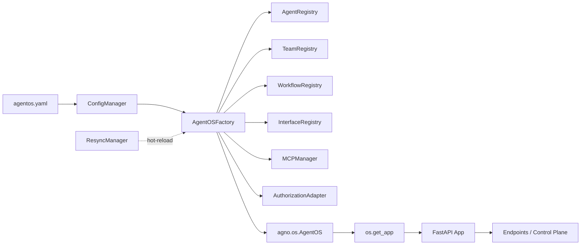
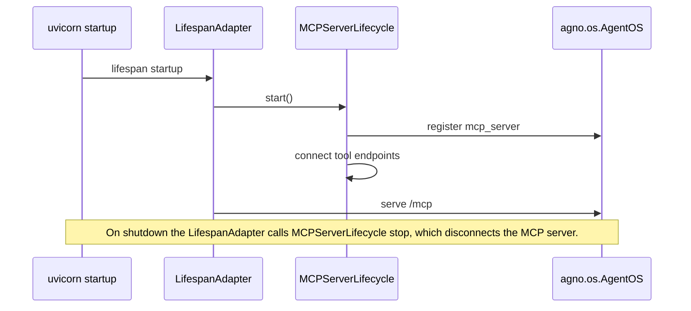
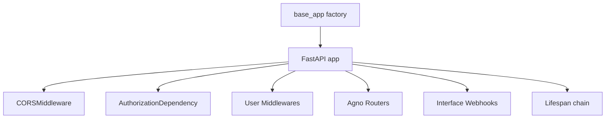

# SPEC_12_AGENTOS_CONTROL_PLANE

> **Propósito**: Abstraer el constructor completo de `AgentOS` (18 parámetros), sus métodos (`get_app`, `serve`, `resync`), el sistema de interfaces (AG-UI, Slack, WhatsApp, Telegram, A2A), el modo MCP server, los endpoints del control plane, la autorización RBAC y el mecanismo de resync a una config YAML-first sobre Clean Architecture en yaml-agno.

---

## 1. ARQUITECTURA DEL CONTROL PLANE

### 1.1 Posicionamiento en yaml-agno

`AgentOS` es el runtime de producción que transforma agents/teams/workflows en una API FastAPI lista para servir. En yaml-agno, `AgentOS` se construye **exclusivamente** desde YAML: el usuario declara un documento `agentos:` y el `AgentOSFactory` resuelve cada parámetro del constructor a través de adapters.



### 1.2 Capas Clean Architecture

| Capa | Componente | Responsabilidad |
|------|-----------|-----------------|
| Domain | `AgentOSConfig` (aggregate root), `InterfaceType` (VO), `EndpointGroup` (VO) | Reglas de validación del plano de control |
| Ports | `AgentOSFactoryPort`, `InterfaceRegistryPort`, `MCPServerPort`, `ResyncPort` | Contratos que los adapters implementan |
| Adapters | `AgentOSFactory`, `InterfaceRegistry`, `MCPServerLifecycle`, `ResyncManager`, `FastAPIAppBuilder` | Traducen YAML -> objetos Agno |
| Infra | `agno.os.AgentOS`, FastAPI, `ObservabilityManager`, `SecretManager` | Framework externo |

### 1.3 Principios YAML-First

1. Todo parámetro del constructor de `AgentOS` tiene un camino YAML explícito o un default documentado.
2. Nunca se instancia `AgentOS(...)` con kwargs literales fuera del `AgentOSFactory`.
3. Los endpoints se registran automáticamente desde el `EndpointGroup` declarado, no se hardcodean.
4. `resync()` es la única vía legítima de hot-reload de agentes/teams/workflows post-deploy.

---

## 2. AGENTOS CONSTRUCTOR - LOS 18 PARÁMETROS

### 2.1 Tabla Maestra de Parámetros

Cada parámetro mapea a un campo del aggregate `AgentOSConfig`. La columna "YAML path" indica dónde vive en `agentos.yaml`.

| # | Parámetro Agno | Tipo Agno | Default | YAML path | Adapter responsable |
|---|----------------|-----------|---------|-----------|---------------------|
| 1 | `name` | `str` | `None` | `agentos.name` | `AgentOSFactory` |
| 2 | `agents` | `List[Agent]` | `None` | `agentos.agents[]` (refs) | `AgentRegistry` |
| 3 | `teams` | `List[Team]` | `None` | `agentos.teams[]` | `TeamRegistry` |
| 4 | `workflows` | `List[Workflow]` | `None` | `agentos.workflows[]` | `WorkflowRegistry` |
| 5 | `db` | `BaseDb` | `None` | `agentos.db` | `DatabaseManager` (SPEC_03) |
| 6 | `knowledge` | `List[Knowledge]` | `None` | `agentos.knowledge[]` | `KnowledgeRegistry` (SPEC_10) |
| 7 | `interfaces` | `List[BaseInterface]` | `None` | `agentos.interfaces[]` | `InterfaceRegistry` |
| 8 | `config` | `str \| AgentOSConfig` | `None` | `agentos.config` (path) | `ConfigManager` |
| 9 | `base_app` | `FastAPI` | `None` | `agentos.base_app` (factory ref) | `FastAPIAppBuilder` |
| 10 | `lifespan` | `Any` | `None` | `agentos.lifespan` | `LifespanAdapter` |
| 11 | `authorization` | `bool` | `False` | `agentos.authorization.enabled` | `AuthorizationAdapter` |
| 12 | `authorization_config` | `AuthorizationConfig` | `None` | `agentos.authorization.config` | `AuthorizationAdapter` |
| 13 | `enable_mcp_server` | `bool` | `False` | `agentos.mcp.enabled` | `MCPServerLifecycle` |
| 14 | `cors_allowed_origins` | `List[str]` | `None` | `agentos.cors_allowed_origins` | `FastAPIAppBuilder` |
| 15 | `auto_provision_dbs` | `bool` | `True` | `agentos.auto_provision_dbs` | `DatabaseManager` |
| 16 | `run_hooks_in_background` | `bool` | `False` | `agentos.run_hooks_in_background` | `HookAdapter` (SPEC_09) |
| 17 | `tracing` | `bool` | `False` | `agentos.tracing` | `ObservabilityManager` (SPEC_09) |
| 18 | `scheduler` / `scheduler_poll_interval` | `bool` / `int` | `False` / - | `agentos.scheduler.*` | delegado a SPEC_13 |

> Nota: `scheduler` y `scheduler_poll_interval` se tratan en SPEC_13. Aquí solo se documenta el passthrough desde `AgentOSConfig`.

### 2.2 Aggregate Root: `AgentOSConfig` (Pydantic V2)

> @ai-directive: `ResyncSettings` MUST be defined ABOVE `AgentOSConfig`. The
> `resync` field uses `Field(default_factory=ResyncSettings)`, which Pydantic
> evaluates eagerly at class-body execution — a forward reference (string
> annotation alone) is NOT enough and raises `NameError` at import. All nested
> settings models (`AuthorizationSettings`, `MCPServerSettings`,
> `SchedulerSettings`, `ResyncSettings`) are therefore declared first.

```python
# yaml-agno/src/domain/agentos/agentos_config.py
from __future__ import annotations
from typing import Any, Optional
from pydantic import BaseModel, Field, model_validator, model_dump

class AuthorizationSettings(BaseModel):
    enabled: bool = False
    config: Optional[dict[str, Any]] = None  # AuthorizationConfig resolved by adapter
    basic_auth: Optional[dict[str, str]] = None  # {api_key: ...} resolved via SecretManager

class MCPServerSettings(BaseModel):
    enabled: bool = False
    name: Optional[str] = None
    instructions: Optional[str] = None
    tools_to_expose: list[str] = Field(default_factory=list)  # agent/tool ids
    port: Optional[int] = None

class SchedulerSettings(BaseModel):
    enabled: bool = False
    poll_interval: int = 15  # seconds

class ResyncSettings(BaseModel):
    """Hot-reload settings. Defined here (above AgentOSConfig) so the
    `resync` field's default_factory resolves at class-body execution time."""
    enabled: bool = False
    watch: bool = False          # filesystem watch
    debounce_ms: int = 500
    max_concurrent: int = 1
    # SPEC_09 rate-based CircuitBreaker params. failure_threshold is a
    # PERCENTAGE (0.0-100.0) of failures that trips the breaker; min_requests
    # is the minimum sample size before the rate is evaluated.
    failure_threshold: float = 50.0   # % of failures to open the circuit
    min_requests: int = 5             # min requests before rate is evaluated
    recovery_timeout: int = 30        # seconds before HALF_OPEN probe

class AgentOSConfig(BaseModel):
    model_config = {"extra": "forbid"}

    name: str
    agents: list[str] = Field(default_factory=list)        # registry refs
    teams: list[str] = Field(default_factory=list)
    workflows: list[str] = Field(default_factory=list)
    db: Optional[str] = None                                # db ref -> DatabaseManager
    knowledge: list[str] = Field(default_factory=list)
    interfaces: list[dict[str, Any]] = Field(default_factory=list)
    config: Optional[str] = None                            # external YAML path
    base_app: Optional[str] = None                          # factory ref
    lifespan: Optional[str] = None                          # factory ref
    authorization: AuthorizationSettings = Field(default_factory=AuthorizationSettings)
    mcp: MCPServerSettings = Field(default_factory=MCPServerSettings)
    cors_allowed_origins: Optional[list[str]] = None
    auto_provision_dbs: bool = True
    run_hooks_in_background: bool = False
    tracing: bool = False
    scheduler: SchedulerSettings = Field(default_factory=SchedulerSettings)
    resync: ResyncSettings = Field(default_factory=ResyncSettings)

    @model_validator(mode="after")
    def _validate(self) -> "AgentOSConfig":
        if not self.agents and not self.teams and not self.workflows:
            raise ValueError("AgentOS requires at least one of agents, teams, or workflows")
        return self

    def to_agno_kwargs(self) -> dict[str, Any]:
        """Produce the kwargs passed to agno.os.AgentOS(**kwargs).

        Booleans and primitives are emitted directly; complex objects are
        injected by the AgentOSFactory AFTER resolution from registries.

        Returns:
            The kwargs dict for the AgentOS constructor.
        """
        return model_dump(self, exclude_none=False, exclude_unset=False)
```

### 2.3 `name`

```yaml
agentos:
  name: "research-os-prod"
```
- Usado en trazas, logs de lifecycle y títulos del UI.
- Si se omite, el factory deriva `name` del nombre del archivo YAML (sin extensión) y emite WARNING.

### 2.4 `agents` / `teams` / `workflows`

Refs a registros declarados en el mismo `agentos.yaml` (o archivos incluidos vía `includes:`).

```yaml
agentos:
  agents: [researcher, summarizer]
  teams: [research_team]
  workflows: [content_pipeline]
```
- El factory resuelve refs contra `AgentRegistry`, `TeamRegistry`, `WorkflowRegistry`.
- Refs duplicados -> `ValueError` en validación (idempotencia).
- Refs inexistentes -> falla fast en build (no en runtime).

### 2.5 `db`

```yaml
agentos:
  db: postgres_primary   # ref -> DatabaseManager (SPEC_03)
```
- `auto_provision_dbs: true` (default) delega el `create_all()` de tablas de sesión, memoria, evals, métricas, schedules.
- `auto_provision_dbs: false` requiere que el schema exista; el factory verifica con `db.check_schema()` y eleva error estructurado si falta.

### 2.6 `knowledge`

```yaml
agentos:
  knowledge: [company_docs, support_kb]   # refs -> KnowledgeRegistry (SPEC_10)
```
- Habilita los endpoints `/knowledge/*` y el UI de Knowledge Management.

### 2.7 `interfaces`

Lista de definiciones de interface (ver Sección 4). Cada dict se normaliza a una `InterfaceSpec` y luego a un `BaseInterface` Agno.

### 2.8 `config`

Ruta a un YAML de configuración secundario (`AgentOSConfig` Agno), o dict inline.

```yaml
agentos:
  config: ./configs/os-display.yaml
```

```yaml
agentos:
  config:
    prompt: "You are operating inside Research OS."
    display_name: "Research OS"
```

### 2.9 `base_app`

Ref a un factory Python que devuelve una `FastAPI` preconfigurada. Habilita custom middleware, routers y settings heredados.

```yaml
agentos:
  base_app: "myapp.factories:build_custom_app"   # import path
```
- Resuelto por `FastAPIAppBuilder` mediante import dinámico.
- El factory Agno *monta* sus routers sobre este app en lugar de crear uno nuevo.

### 2.10 `lifespan`

Ref a un context manager async (`asynccontextmanager`) que envuelve el startup/shutdown de la app.

```yaml
agentos:
  lifespan: "myapp.lifecycle:os_lifespan"
```
- Se encadena con el lifespan interno de Agno (MCP connect, scheduler start, observability init).

### 2.11 / 2.12 `authorization` y `authorization_config`

RBAC con JWT. Ver Sección 9. Integración con SPEC_19.

### 2.13 `enable_mcp_server`

Ver Sección 5 (MCP server mode).

### 2.14 `cors_allowed_origins`

```yaml
agentos:
  cors_allowed_origins:
    - "https://os.agno.com"
    - "https://app.internal.corp"
```
- Inyectado en el `CORSMiddleware` de la app. `["*"]` está prohibido cuando `authorization.enabled=true` (validador).

### 2.15 `auto_provision_dbs`

Bool. Afecta el `DatabaseManager`. Default `True`.

### 2.16 `run_hooks_in_background`

Cuando `True`, los hooks marcados `run_in_background=True` se ejecutan fuera del request path. Requiere que `db` esté configurado (persistencia de hooks).

### 2.17 `tracing`

`True` persiste traces de runs al `db` de AgentOS. Consume `ObservabilityManager` para correlación con OTel.

### 2.18 `scheduler` / `scheduler_poll_interval`

Passthrough a SPEC_13. El factory emite `scheduler=bool` y `scheduler_poll_interval=int` en los kwargs.

---

## 3. MÉTODOS DE AgentOS

### 3.1 `get_app() -> FastAPI`

Construye (o devuelve cacheada) la app FastAPI con todos los routers del control plane.

```python
# yaml-agno/src/adapters/agentos/fastapi_app_builder.py
class FastAPIAppBuilder:
    def __init__(self, config: AgentOSConfig, registries, mcp, auth):
        self._config = config
        ...

    def build(self) -> FastAPI:
        app = self._resolve_base_app()
        self._apply_cors(app)
        self._apply_lifespan(app)
        self._mount_routers(app)
        self._mount_interfaces(app)
        return app
```

### 3.2 `serve()`

Arranca uvicorn. yaml-agno expone un CLI thin wrapper.

| Parámetro | Default yaml-agno | YAML override |
|-----------|-------------------|---------------|
| `app` | derivado | `agentos.serve.app` |
| `host` | `localhost` | `agentos.serve.host` |
| `port` | `7777` | `agentos.serve.port` |
| `workers` | `None` | `agentos.serve.workers` |
| `reload` | `False` | `agentos.serve.reload` |

```bash
yaml-agno serve --config agentos.yaml --host 0.0.0.0 --port 7777
```

### 3.3 `resync()`

Recarga agents/teams/workflows/knowledge desde la fuente sin reiniciar el proceso. Ver Sección 10.

---

## 4. INTERFACES (CRÍTICO)

### 4.1 InterfaceRegistry y InterfaceType

```python
# yaml-agno/src/domain/agentos/interface_spec.py
from enum import Enum
from pydantic import BaseModel, Field, model_validator

class InterfaceType(str, Enum):
    AGUI = "agui"
    SLACK = "slack"
    WHATSAPP = "whatsapp"
    TELEGRAM = "telegram"
    A2A = "a2a"

class InterfaceSpec(BaseModel):
    model_config = {"extra": "forbid"}
    type: InterfaceType
    target: str                       # agent / team / workflow ref
    config: dict = Field(default_factory=dict)

    @model_validator(mode="after")
    def _required_config(self) -> "InterfaceSpec":
        InterfaceSpec._check(self.type, self.config)
        return self
```

### 4.2 InterfaceRegistry

```python
# yaml-agno/src/adapters/agentos/interface_registry.py
from typing import Protocol

class InterfaceRegistryPort(Protocol):
    def build_all(self, specs: list[InterfaceSpec], registries) -> list: ...

class InterfaceRegistry:
    def __init__(self):
        self._builders: dict[InterfaceType, Callable] = {
            InterfaceType.AGUI: self._build_agui,
            InterfaceType.SLACK: self._build_slack,
            InterfaceType.WHATSAPP: self._build_whatsapp,
            InterfaceType.TELEGRAM: self._build_telegram,
            InterfaceType.A2A: self._build_a2a,
        }

    def build_all(self, specs, registries):
        interfaces = []
        for spec in specs:
            target = registries.resolve_target(spec.target)
            interfaces.append(self._builders[spec.type](target, spec.config))
        return interfaces
```

### 4.3 AG-UI

Interfaz de chat web compatible con el AgentOS UI.

```yaml
agentos:
  interfaces:
    - type: agui
      target: researcher
      config:
        chat: true
        create_session_on_chat: true
        session_id: null
```

```python
from agno.os.interfaces.agui import AGUI
def _build_agui(self, target, cfg):
    return AGUI(agent=target) if isinstance(target, Agent) else AGUI(team=target)
```

### 4.4 Slack

```yaml
agentos:
  interfaces:
    - type: slack
      target: support_agent
      config:
        bot_token: "${SECRET:SLACK_BOT_TOKEN}"
        app_token: "${SECRET:SLACK_APP_TOKEN}"
        signing_secret: "${SECRET:SLACK_SIGNING_SECRET}"
```
- Tokens resueltos vía `SecretManager`. Nunca literales en YAML versionado.
- El adapter valida la triada de credenciales antes de instanciar.

### 4.5 WhatsApp

```yaml
agentos:
  interfaces:
    - type: whatsapp
      target: notifier_agent
      config:
        phone_number_id: "${SECRET:WA_PHONE_NUMBER_ID}"
        access_token: "${SECRET:WA_ACCESS_TOKEN}"
        verify_token: "${SECRET:WA_VERIFY_TOKEN}"
        webhook_secret: "${SECRET:WA_WEBHOOK_SECRET}"
```

### 4.6 Telegram

```yaml
agentos:
  interfaces:
    - type: telegram
      target: ops_agent
      config:
        token: "${SECRET:TELEGRAM_BOT_TOKEN}"
        webhook_url: "https://corp.example.com/telegram/webhook"
```

### 4.7 A2A (Agent-to-Agent)

Protocolo de interoperabilidad entre runtimes.

```yaml
agentos:
  interfaces:
    - type: a2a
      target: research_team
      config:
        endpoint: "https://corp.example.com/a2a"
        agent_card:
          name: "Research Team"
          description: "Multi-agent research capability"
          capabilities: ["streaming", "tools"]
```

### 4.8 Resolución de targets

`target` puede ser un `agent`, `team`, o `workflow` ref. El registry despacha al builder correcto según el tipo de objeto resuelto (no según el string).

---

## 5. MCP SERVER MODE

### 5.1 MCPServerLifecycle

```python
# yaml-agno/src/adapters/agentos/mcp_server_lifecycle.py
from typing import Protocol

class MCPServerPort(Protocol):
    def enable(self, agentos, settings: MCPServerSettings) -> None: ...
    def start(self) -> None: ...
    def stop(self) -> None: ...

class MCPServerLifecycle:
    """When enable_mcp_server=True, AgentOS itself is exposed as an MCP server,
    so external MCP clients can invoke its agents/teams/tools."""

    def enable(self, agentos, settings: MCPServerSettings) -> None:
        if settings.enabled and agentos.mcp_server is None:
            agentos.mcp_server = self._build_server(settings)
```

### 5.2 YAML config MCP

```yaml
agentos:
  mcp:
    enabled: true
    name: "research-os-mcp"
    instructions: "Exposes research agents and tools over MCP."
    tools_to_expose: [search_web, summarize]
    port: 8000
```

### 5.3 Lifecycle hooking

- `start()` se conecta en el `lifespan` de startup.
- `stop()` se invoca en shutdown.
- Si `run_hooks_in_background` y `enable_mcp_server` están ambos activos, el MCP server reusa el bus de hooks para notificaciones.



---

## 6. CUSTOM FASTAPI, LIFESPAN, MIDDLEWARE, FACTORIES

### 6.1 Cadena de construcción



### 6.2 Middlewares custom

```yaml
agentos:
  middleware:
    - factory: "myapp.middleware:request_id"
    - factory: "myapp.middleware:tenant_context"
      kwargs: {header: "X-Tenant"}
```

### 6.3 Lifespan composition

El `LifespanAdapter` encadena:
1. lifespan del `base_app` (si existe).
2. MCP connect/disconnect.
3. Scheduler start/stop (SPEC_13).
4. Observability init/flush.
5. User lifespan (si declarado).

Se usa `contextlib.AsyncExitStack` para apilar los context managers. Nunca `asyncio.gather`.

---

## 7. AGENTOS YAML CONFIG SCHEMA (COMPLETO)

### 7.1 Documento raíz

```yaml
# agentos.yaml
version: "1.0"
includes:
  - ./agents/*.yaml
  - ./teams/*.yaml
  - ./workflows/*.yaml

databases:
  postgres_primary:
    type: postgres
    host: "${SECRET:DB_HOST}"
    port: 5432
    database: agentos

knowledge:
  company_docs:
    type: text
    vector_db: pgvector_primary

agents:
  - name: researcher
    # ... SPEC_02 domain
teams:
  - name: research_team
    # ... SPEC_05
workflows:
  - name: content_pipeline
    # ... SPEC_05

agentos:
  name: "research-os-prod"
  agents: [researcher, summarizer]
  teams: [research_team]
  workflows: [content_pipeline]
  db: postgres_primary
  knowledge: [company_docs]
  interfaces:
    - { type: agui, target: researcher }
    - type: slack
      target: support_agent
      config: { bot_token: "${SECRET:SLACK_BOT_TOKEN}", app_token: "${SECRET:SLACK_APP_TOKEN}", signing_secret: "${SECRET:SLACK_SIGNING_SECRET}" }
  mcp:
    enabled: true
    name: "research-os-mcp"
  authorization:
    enabled: true
    config:
      jwt_secret_ref: "${SECRET:JWT_SECRET}"
      algorithm: "HS256"
  cors_allowed_origins: ["https://os.agno.com"]
  auto_provision_dbs: true
  run_hooks_in_background: true
  tracing: true
  scheduler:
    enabled: true
    poll_interval: 15
  resync:
    enabled: true
    watch: true
    debounce_ms: 500
  serve:
    host: "0.0.0.0"
    port: 7777
    workers: 1
    reload: false
```

### 7.2 ResyncSettings

> @ai-directive: `ResyncSettings` is defined ONCE in section 2.2 (above
> `AgentOSConfig`, to satisfy the eager `default_factory` resolution). The
> physical module is `yaml-agno/src/domain/agentos/agentos_config.py` (re-export
> from `resync_settings.py` is optional). It is NOT redefined here — this section
> only documents the YAML shape and the rate-based CircuitBreaker semantics.

```yaml
agentos:
  resync:
    enabled: true
    watch: true
    debounce_ms: 500
    max_concurrent: 1
    # SPEC_09 rate-based CircuitBreaker. failure_threshold is a PERCENTAGE of
    # failures (not a raw count); min_requests gates when the rate is evaluated.
    failure_threshold: 50.0   # % failures -> open (matches ResyncSettings default)
    min_requests: 5
    recovery_timeout: 30
```

### 7.3 Validación de referencias cruzadas

`AgentOSConfig` valida (en `model_validator`) que cada ref en `agents/teams/workflows/db/knowledge` exista en el documento. Falla fast con mensaje estructurado `{ref, kind, available}`.

---

## 8. API ENDPOINTS DEL CONTROL PLANE

### 8.1 Grupos de endpoints

yaml-agno modela los endpoints como un `EndpointGroup` registry. Los routers se montan automáticamente; el usuario **no** declara endpoints manuales salvo routers custom vía `base_app`.

| Grupo | Path base | Operaciones |
|-------|-----------|-------------|
| Agents | `/agents` | run (sync/stream), list, get |
| Teams | `/teams` | run, list, get |
| Workflows | `/workflows` | run, list, get |
| Sessions | `/sessions` | create, list, get, update, delete |
| Knowledge | `/knowledge` | add, search, list, get, delete |
| Memory | `/memories` | create, list, get, update, delete |
| Metrics | `/metrics` | get, refresh |
| Evals | `/evals` | create, list, get, update, delete |
| Approvals | `/approvals` | create, list, resolve (HITL, SPEC_16) |
| Schedules | `/schedules` | create, list, trigger, enable, disable, delete (SPEC_13) |
| Registry | `/registry` | list components |
| Components | `/components` | introspect |
| A2A | `/a2a` | agent-to-agent (JSON-RPC) |
| AGUI | `/agui` | chat |
| Slack | `/slack/events` | webhook |
| WhatsApp | `/whatsapp/webhook` | webhook |
| Telegram | `/telegram/webhook` | webhook |
| Traces | `/traces` | when `tracing=true` |
| Health | `/health` | liveness/readiness |

### 8.2 EndpointGroup value object

```python
# yaml-agno/src/domain/agentos/endpoint_group.py
class EndpointGroup(BaseModel):
    name: str
    path: str
    requires_auth: bool = True
    requires_db: bool = False
    conditional: Optional[str] = None  # e.g. "tracing", "mcp.enabled"

HEALTH = EndpointGroup(name="health", path="/health", requires_auth=False, requires_db=False)
TRACES = EndpointGroup(name="traces", path="/traces", requires_db=True, conditional="tracing")
SCHEDULES = EndpointGroup(name="schedules", path="/schedules", requires_db=True, conditional="scheduler.enabled")
```

### 8.3 Conditional mounting

El factory monta `TRACES` solo si `tracing=true`, `SCHEDULES` solo si `scheduler.enabled=true`. Esto evita routers muertos en builds mínimos.

### 8.4 Health contract

```json
GET /health
{
  "status": "ok",
  "agentos": "research-os-prod",
  "db": "connected",
  "scheduler": "running",
  "mcp": "enabled",
  "uptime_seconds": 1284
}
```

---

## 9. AUTHORIZATION (RBAC + Basic)

### 9.1 AuthorizationAdapter

```python
# yaml-agno/src/adapters/agentos/authorization_adapter.py
class AuthorizationAdapter:
    def build(self, settings: AuthorizationSettings) -> tuple[bool, Any]:
        if not settings.enabled:
            return False, None
        cfg = self._resolve_config(settings)
        return True, AuthorizationConfig(**cfg)

    def _resolve_config(self, settings):
        # @ai-directive: ConfigManager/SecretManager are core-cenf instances
        # (injected via DI), NOT static classes. Resolve secrets via the injected
        # SecretManager instance: `await self._secrets.get_secret(key)`.
        cfg = dict(settings.config or {})
        for k, v in list(cfg.items()):
            if isinstance(v, str) and v.startswith("${SECRET:"):
                key = v[len("${SECRET:"):-1]
                cfg[k] = await self._secrets.get_secret(key)   # core-cenf instance
        return cfg
```

### 9.2 Modos

| Modo | Trigger | Detalle |
|------|---------|---------|
| Basic | `authorization.basic_auth.api_key` presente | Validación simple de header `Authorization` |
| RBAC | `authorization.config.jwt_secret_ref` presente | JWT con scopes; detalle fino en SPEC_19 |

### 9.3 Integración con SPEC_19

- El `AuthorizationConfig` producido se pasa como `authorization_config` a `AgentOS(...)`.
- Los scopes y políticas viven en SPEC_19; aquí solo se transporta la config.
- `cors_allowed_origins=["*"]` es rechazado cuando RBAC activo (politica de seguridad).

---

## 10. RESYNC MECHANISM (HOT-RELOAD)

### 10.1 ResyncManager

> @ai-directive: `ResyncManager.__init__` REQUIRES a `config: ConfigManager`
> param (core-cenf instance, injected via DI) and stores it as `self._config`.
> `resync_now()` calls `await self._config.reload()` — without the injected
> instance this raised `AttributeError`. The CircuitBreaker is the SPEC_09
> rate-based breaker: `failure_threshold` is a PERCENTAGE (float) and
> `min_requests` gates when the rate is evaluated — NOT a raw failure count.

```python
# yaml-agno/src/adapters/agentos/resync_manager.py
import asyncio, anyio
from pathlib import Path
from core_infrastructure.config import ConfigManager   # core-cenf instance (DI)

class ResyncManager:
    def __init__(
        self,
        config_path: Path,
        agentos,
        settings: ResyncSettings,
        obs,
        config: ConfigManager,
    ):
        self._cfg = config_path
        self._os = agentos
        self._settings = settings
        self._obs = obs
        self._config = config   # core-cenf ConfigManager; reload() is async
        # SPEC_09 rate-based CircuitBreaker. failure_threshold is a PERCENTAGE
        # (0.0-100.0); min_requests gates rate evaluation. Both come from
        # ResyncSettings so the YAML drives breaker behavior.
        self._breaker = CircuitBreaker(
            failure_threshold=settings.failure_threshold,   # % failures
            recovery_timeout=settings.recovery_timeout,
            min_requests=settings.min_requests,
        )
        self._sem = asyncio.Semaphore(settings.max_concurrent)

    async def watch(self):
        """Watch the config parent dir and debounce-change reload resyncs."""
        if not self._settings.watch:
            return
        async with anyio.Path(self._cfg).parent.watch() as events:
            async for ev in events:
                await self._debounce(ev)

    async def resync_now(self):
        """Reload config + re-sync agents/teams/workflows, breaker-guarded.

        Raises:
            ResyncBlockedError: if the SPEC_09 CircuitBreaker is OPEN.
        """
        async with self._sem:
            if not self._breaker.allow_request():   # SPEC_09 CircuitBreaker API
                raise ResyncBlockedError("circuit open")
            try:
                # ConfigManager is the injected core-cenf instance; reload is async.
                await self._config.reload()
                self._os.resync()  # agno re-loads agents/teams/workflows
                self._breaker.record_success()
            except Exception as e:
                self._breaker.record_failure()
                self._obs.error("resync.failed", error=str(e))
                raise
```

### 10.2 Semántica

- `resync()` recarga agents/teams/workflows/knowledge desde el `ConfigManager` inyectado. No reinicia el proceso ni pierde sessions.
- Endpoints y middleware **no** se reconstruyen (solo los objetos de dominio).
- Circuit breaker (SPEC_09, rate-based: `failure_threshold` % + `min_requests`) bloquea resyncs tras una tasa de fallos y reintenta tras `recovery_timeout`. `failure_threshold` NO es un conteo crudo.

### 10.3 Disparadores

| Trigger | Acción |
|---------|--------|
| File watch | debounced -> `resync_now()` |
| API `POST /registry/resync` | `resync_now()` (requiere RBAC scope `admin`) |
| SIGHUP (CLI) | `resync_now()` |

---

## 11. PORTS Y ADAPTERS RESUMEN

```python
# yaml-agno/src/ports/agentos_ports.py
from typing import Protocol, Any

class AgentOSFactoryPort(Protocol):
    def build(self, config: AgentOSConfig) -> Any: ...          # -> agno.os.AgentOS

class InterfaceRegistryPort(Protocol):
    def build_all(self, specs: list[InterfaceSpec], registries) -> list: ...

class MCPServerPort(Protocol):
    def enable(self, agentos, settings: MCPServerSettings) -> None: ...
    def start(self) -> None: ...
    def stop(self) -> None: ...

class ResyncPort(Protocol):
    async def resync_now(self) -> None: ...
    async def watch(self) -> None: ...
```

---

## 12. BEHAVIOR DELTA - BDD SCENARIOS

### 12.1 Escenarios de Aceptación

#### Scenario 1: Golden Path - Deploy AgentOS completo desde YAML

```gherkin
GIVEN un documento "agentos.yaml" con name="research-os", 2 agents, 1 team, db=postgres_primary
AND authorization.enabled=false
AND scheduler.enabled=false
WHEN se ejecuta "yaml-agno serve --config agentos.yaml"
THEN el AgentOSFactory construye un agno.os.AgentOS con los 18 parámetros resueltos
AND get_app() devuelve una FastAPI app con los routers de agents, teams, workflows, sessions, knowledge, memory, metrics, evals, health
AND el server escucha en 0.0.0.0:7777
AND GET /health responde 200 con status="ok"
```

#### Scenario 2: Interface connection (AG-UI + Slack)

```gherkin
GIVEN agentos.interfaces contiene [{type: agui, target: researcher}, {type: slack, target: support_agent}]
AND los secrets SLACK_BOT_TOKEN, SLACK_APP_TOKEN, SLACK_SIGNING_SECRET existen en SecretManager
WHEN el InterfaceRegistry.build_all ejecuta
THEN se instancian un AGUI(agent=researcher) y un Slack(agent=support_agent)
AND la app monta los routers /agui y /slack/events
AND los tokens Slack no aparecen literales en ningun log ni metric
```

#### Scenario 3: Slack con credenciales faltantes falla fast

```gherkin
GIVEN una interface slack cuya config referencia "${SECRET:SLACK_BOT_TOKEN}"
AND SecretManager no posee SLACK_BOT_TOKEN
WHEN se construye el AgentOS
THEN el build falla con InterfaceCredentialError listing el secret faltante
AND no se instancia ningun AgentOS parcial
```

#### Scenario 4: MCP server mode habilitado

```gherkin
GIVEN agentos.mcp.enabled=true con name="research-os-mcp"
WHEN get_app() construye la app
THEN el MCPServerLifecycle registra el mcp_server en el lifespan
AND en startup el servidor MCP se conecta y expone los tools_to_expose
AND en shutdown el servidor MCP se desconecta limpiamente
```

#### Scenario 5: RBAC activo bloquea CORS wildcard

```gherkin
GIVEN agentos.authorization.enabled=true
AND agentos.cors_allowed_origins=["*"]
WHEN se valida AgentOSConfig
THEN se levanta CorsPolicyError indicando que "*" esta prohibido bajo RBAC
```

#### Scenario 6: Resync hot-reload sin reinicio

```gherkin
GIVEN un AgentOS corriendo con resync.enabled=true y resync.watch=true
WHEN se edita agents/researcher.yaml y se guarda
THEN tras debounce_ms el ResyncManager invoca agentos.resync()
AND el agente researcher se recarga sin perder sesiones activas
AND GET /health sigue respondiendo 200 durante el reload
```

#### Scenario 7: Resync bloqueado por circuit breaker (rate-based, SPEC_09)

```gherkin
GIVEN un ResyncManager cuyo CircuitBreaker tiene failure_threshold=50.0 (% failures) y min_requests=4
AND han ocurrido 4 resyncs, todos fallidos (100% failures, >= min_requests y >= failure_threshold)
WHEN se dispara un quinto resync
THEN se lanza ResyncBlockedError("circuit open")
AND no se invoca agentos.resync()
AND tras recovery_timeout el breaker pasa a half-open y permite un intento
```

#### Scenario 8: Conditional endpoints (schedules solo si scheduler)

```gherkin
GIVEN agentos.scheduler.enabled=false
WHEN get_app() construye los routers
THEN el grupo /schedules NO se monta
AND GET /schedules responde 404
AND al activar scheduler.enabled=true y resync, el grupo se monta
```

---

## 13. TDD MICRO-TASK EXECUTION PROTOCOL

### 13.1 Cascading Task Checklist

#### TASK_001: AgentOSConfig aggregate (18 params)
- **File**: `yaml-agno/src/domain/agentos/agentos_config.py`
- **Test**: `tests/unit/domain/test_agentos_config.py`
- **RED**:
```python
def test_agentos_config_requires_at_least_one_target():
    import pytest
    from yaml_agno.domain.agentos.agentos_config import AgentOSConfig
    with pytest.raises(ValueError, match="at least one"):
        AgentOSConfig(name="x")

def test_cors_wildcard_forbidden_under_rbac():
    from yaml_agno.domain.agentos.agentos_config import AgentOSConfig, AuthorizationSettings
    cfg = AgentOSConfig(name="x", agents=["a"],
                        authorization=AuthorizationSettings(enabled=True),
                        cors_allowed_origins=["*"])
    with pytest.raises(Exception):
        cfg  # validator raises
```
- **GREEN**: Implementar aggregate + validators (al menos un target; CORS rule).
- **Commit**: `feat(agentos): AgentOSConfig aggregate with 18-param mapping and CORS guard`

#### TASK_002: AgentOSFactory.build -> agno.os.AgentOS
- **File**: `yaml-agno/src/adapters/agentos/agentos_factory.py`
- **Test**: `tests/unit/adapters/test_agentos_factory.py`
- **RED**:
```python
def test_factory_resolves_refs_and_builds_agentos(mocker):
    factory = AgentOSFactory(registries=..., db_mgr=...)
    mocker.patch.object(AgentOS, "__init__", return_value=None)
    os_obj = factory.build(config)
    AgentOS.__init__.assert_called_once()
    kwargs = AgentOS.__init__.call_args.kwargs
    assert kwargs["name"] == "research-os"
    assert kwargs["tracing"] is True
```
- **GREEN**: Resolver refs, delegar a registries, llamar `AgentOS(**resolved)`.
- **Commit**: `feat(agentos): AgentOSFactory resolves YAML refs into agno AgentOS`

#### TASK_003: InterfaceRegistry multi-tipo
- **File**: `yaml-agno/src/adapters/agentos/interface_registry.py`
- **Test**: `tests/unit/adapters/test_interface_registry.py`
- **RED**:
```python
def test_build_all_dispatches_by_target_type():
    reg = InterfaceRegistry()
    out = reg.build_all([InterfaceSpec(type="agui", target="researcher")], fake_registries)
    assert AGUI.__name__ in type(out[0]).__name__

def test_slack_missing_credential_raises():
    with pytest.raises(InterfaceCredentialError):
        reg.build_all([InterfaceSpec(type="slack", target="s", config={})], fake_registries)
```
- **GREEN**: Mapa de builders + validación de credenciales.
- **Commit**: `feat(agentos): InterfaceRegistry dispatches AGUI/Slack/WhatsApp/Telegram/A2A`

#### TASK_004: MCPServerLifecycle
- **File**: `yaml-agno/src/adapters/agentos/mcp_server_lifecycle.py`
- **Test**: `tests/unit/adapters/test_mcp_server_lifecycle.py`
- **RED**:
```python
async def test_mcp_lifespan_start_stop_called():
    lifecycle = MCPServerLifecycle()
    await lifecycle.start()
    assert lifecycle._started is True
    await lifecycle.stop()
    assert lifecycle._started is False
```
- **GREEN**: Implementar start/stop idempotentes con AsyncExitStack.
- **Commit**: `feat(agentos): MCPServerLifecycle start/stop hooks`

#### TASK_005: ResyncManager con circuit breaker (rate-based)
- **File**: `yaml-agno/src/adapters/agentos/resync_manager.py`
- **Test**: `tests/unit/adapters/test_resync_manager.py`
- **RED**:
```python
async def test_resync_blocks_after_failure_rate(mocker):
    # SPEC_09 rate-based breaker: failure_threshold is a PERCENTAGE, min_requests
    # gates rate evaluation. With failure_threshold=50.0 and min_requests=2,
    # two consecutive failures (100% rate, >= min_requests) trip the breaker.
    cfg = mocker.Mock()                 # ConfigManager (core-cenf instance)
    mgr = ResyncManager(
        config_path=Path("agentos.yaml"), agentos=mocker.Mock(), obs=mocker.Mock(),
        config=cfg,
        settings=ResyncSettings(enabled=True, failure_threshold=50.0,
                                min_requests=2, recovery_timeout=1),
    )
    mocker.patch.object(AgentOS, "resync", side_effect=RuntimeError)
    with pytest.raises(RuntimeError): await mgr.resync_now()
    with pytest.raises(RuntimeError): await mgr.resync_now()   # 2 fails -> 100% >= 50%
    with pytest.raises(ResyncBlockedError): await mgr.resync_now()
    cfg.reload.assert_awaited()   # injected ConfigManager is used (no AttributeError)
```
- **GREEN**: CircuitBreaker (SPEC_09 rate-based) + semaphore + debounce + injected `ConfigManager`.
- **Commit**: `feat(agentos): ResyncManager with rate-based breaker and injected ConfigManager`

#### TASK_006: FastAPIAppBuilder conditional routers
- **File**: `yaml-agno/src/adapters/agentos/fastapi_app_builder.py`
- **Test**: `tests/unit/adapters/test_fastapi_app_builder.py`
- **RED**:
```python
def test_schedules_router_not_mounted_when_scheduler_disabled():
    app = FastAPIAppBuilder(config_no_scheduler, ...).build()
    paths = [r.path for r in app.routes]
    assert not any(p.startswith("/schedules") for p in paths)
```
- **GREEN**: Conditional mounting desde EndpointGroup registry.
- **Commit**: `feat(agentos): conditional endpoint mounting based on config`

#### TASK_007: AuthorizationAdapter secret resolution
- **File**: `yaml-agno/src/adapters/agentos/authorization_adapter.py`
- **Test**: `tests/unit/adapters/test_authorization_adapter.py`
- **RED**:
```python
def test_jwt_secret_resolved_from_secret_manager(mocker):
    mocker.patch.object(SecretManager, "resolve", return_value="s3cret")
    settings = AuthorizationSettings(enabled=True, config={"jwt_secret_ref": "${SECRET:JWT_SECRET}"})
    enabled, cfg = AuthorizationAdapter().build(settings)
    assert enabled is True
    assert cfg.jwt_secret == "s3cret"
```
- **GREEN**: Resolver `${SECRET:...}` via SecretManager y construir AuthorizationConfig.
- **Commit**: `feat(agentos): AuthorizationAdapter resolves RBAC config from secrets`

#### TASK_008: Lifespan composition (no asyncio.gather)
- **File**: `yaml-agno/src/adapters/agentos/lifespan_adapter.py`
- **Test**: `tests/unit/adapters/test_lifespan_adapter.py`
- **RED**:
```python
async def test_lifespan_chains_mcp_scheduler_user():
    adapter = LifespanAdapter(...)
    started = []
    async with adapter.build(app) as _:
        started.append("in")
    assert started == ["in"]
    assert adapter.mcp_started and adapter.scheduler_started
```
- **GREEN**: AsyncExitStack apilando context managers; prohibido `asyncio.gather`.
- **Commit**: `feat(agentos): composed lifespan via AsyncExitStack (no gather)`

---

## 14. SUPUESTOS TÉCNICOS ADOPTADOS

### [Decisión 1] AgentOS como único punto de montaje FastAPI
**Justificación**: Agno depreca `Playground`, `FastAPIApp`, y los antiguos apps. yaml-agno adopta `AgentOS` como única superficie de serving. `base_app` permite custom sin bifurcar la fuente de verdad.

### [Decisión 2] Refs por string, no objetos embebidos
**Justificación**: El YAML del AgentOS solo referencia (`agents: [researcher]`); las definiciones completas viven en su propio documento. Mantiene el documento de control plano y reutilizable.

### [Decisión 3] Conditional endpoints en lugar de feature flags en runtime
**Justificación**: Montar routers muertos (`/schedules` sin scheduler) genera 404s confusos y acopla builds. El factory decide en build-time qué routers existen.

### [Decisión 4] Circuit breaker en resync, no retry infinito
**Justificación**: Un YAML roto puede disparar watch loops infinitos. El breaker protege el proceso. Consistente con el principio de resiliencia de SPEC_14.

### [Decisión 5] AsyncExitStack en lifespan, nunca `asyncio.gather`
**Justificación**: Los context managers de startup/shutdown tienen orden y dependencias; `gather` no garantiza cleanup inverso. El stack sí.

### [Decisión 6] Secrets nunca literales; siempre `${SECRET:...}`
**Justificación**: Tokens Slack/WhatsApp/JWT no pueden versionarse. `SecretManager` es el único resolver.

---

## 15. PREGUNTAS DE CALIBRACIÓN ESTRATÉGICA

### [Pregunta 1] ¿`base_app` reemplaza o se compone con la app de Agno?
**¿El factory monta routers Agno sobre el `base_app` del usuario, o el `base_app` reemplaza la app Agno?**
Implica: si reemplaza, perdemos routers automáticos del control plane. Decisión adoptada: **montar sobre**. El usuario aporta middleware/lifespan custom pero conserva el control plane.

### [Pregunta 2] ¿Granularidad del resync?
**¿Resync recarga todo el documento o solo los componentes cambiados?**
Implica: granularidad fina reduce costo pero exige diffing de YAML. MVP adopta resync total atómico (semántica Agno). Optimización diferencial se deja para post-MVP.

### [Pregunta 3] ¿A2A sobre el mismo puerto que la API REST?
**¿El endpoint A2A comparte puerto con `/agents` o requiere listener separado?**
Implica: compartir simplifica deploy; separar aísla tráfico inter-runtimes. MVP comparte puerto bajo `/a2a`.

### [Pregunta 4] ¿Tracing al mismo `db` del AgentOS o DB dedicada?
**¿`tracing=true` escribe al `db` principal o a una DB de observabilidad separada?**
Implica: misma DB simplifica joins; separada reduce contención. MVP usa la misma DB (semántica Agno). SPEC_09 puede derivar a OTel collector externo.

### [Pregunta 5] ¿RBAC habilitado por defecto en producción?
**¿El default de `authorization.enabled` cambia según entorno (dev=false, prod=true)?**
Implica: defaults seguros vs. fricción de setup. Decisión: default `false`, pero el CLI `serve --prod` fuerza `true` y falla si falta config.
