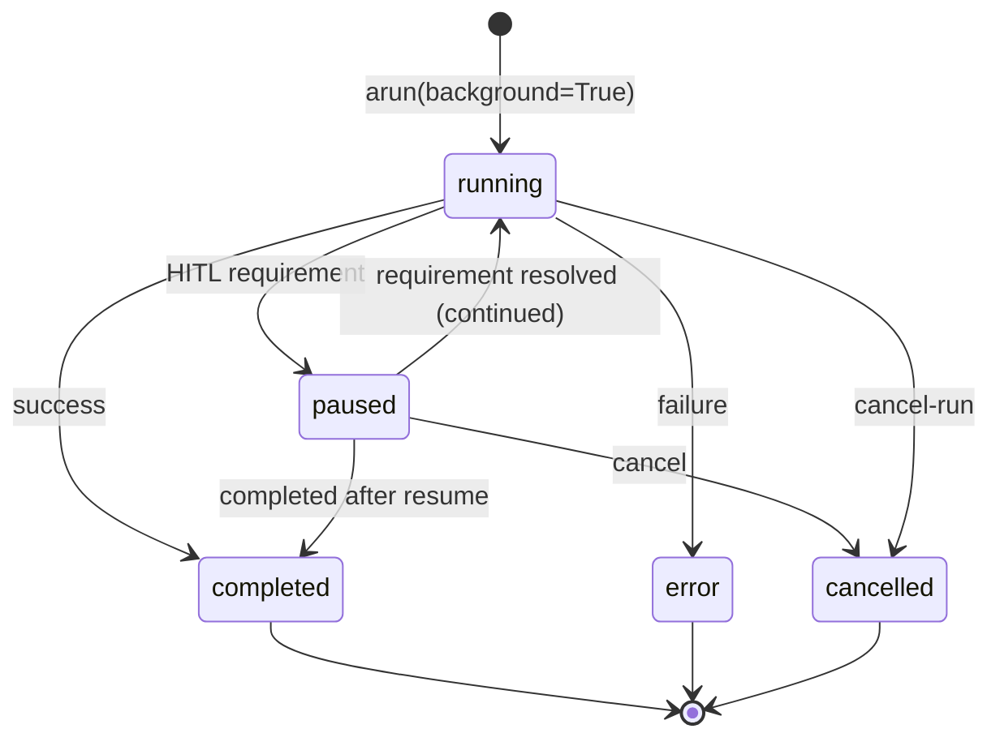
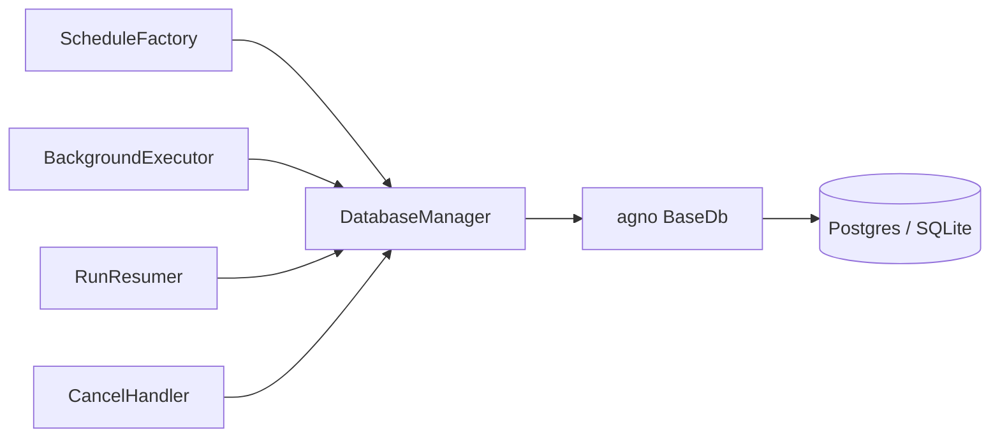

# SPEC_13_SCHEDULER_BACKGROUND_LIFECYCLE

> **Propósito**: Abstraer el Scheduler (ScheduleManager, SchedulePoller, ScheduleExecutor), la ejecución en background fire-and-forget con runs resumibles vía SSE, y el lifecycle completo de un run (`RunStatus`) incluyendo cancelación y persistencia de eventos, a config YAML-first sobre Clean Architecture en yaml-agno.

---

## 1. ARQUITECTURA GENERAL

### 1.1 Alcance

yaml-agno orquesta tres subsistemas que el SDK Agno expone de forma dispersa:

1. **Scheduler** (cron jobs, one-time, recurring) que dispara endpoints del AgentOS.
2. **Background execution** (`background=True`) para runs fire-and-forget con reanudación SSE.
3. **Run lifecycle** (`RunStatus` states) con cancelación y persistencia de eventos.

### 1.2 Componentes Agno referenciados

| Componente | Origen | Rol |
|------------|--------|-----|
| `ScheduleManager` | `agno.scheduler` | SDK: create/list/update/enable/disable/run history |
| `SchedulePoller` | `agno.scheduler` | Reclama schedules due y los ejecuta concurrentemente |
| `ScheduleExecutor` | `agno.scheduler` | Llama endpoints, maneja retries, escribe run records |
| `Scheduler API` | AgentOS | REST `/schedules/*` |
| `Workflow.arun(background=True)` | `agno.workflow` | Background fire-and-forget |
| `RunStatus` | `agno.run.base` | Enum de estados de run |

### 1.3 Capas Clean Architecture

```mermaid
flowchart TD
    YAML[schedules.yaml] --> CM[ConfigManager]
    CM --> SF[ScheduleFactory]
    SF --> SM[ScheduleManager adapter]
    SM --> DB[DatabaseManager - SPEC_03]
    SP[SchedulePoller adapter] --> SM
    SP --> SE[ScheduleExecutor adapter]
    SE --> HTTP[AgentOS HTTP endpoints]
    BE[BackgroundExecutor] --> RUN[agent/team/workflow arun]
    RUN --> BGP[BackgroundTask persistence]
    RR[RunResumer] --> SSE[/resume SSE endpoint]
    CH[CancelHandler] --> ST[RunStatus state machine]
    OBS[ObservabilityManager] -.metrics.-> SF
```

| Capa | Componente |
|------|-----------|
| Domain | `ScheduleConfig` (aggregate), `CronExpr` (VO), `ScheduleId`, `RunStatusState`, `BackgroundTask` |
| Ports | `ScheduleFactoryPort`, `SchedulePollerPort`, `BackgroundExecutorPort`, `RunResumerPort`, `CancelHandlerPort` |
| Adapters | `ScheduleFactory`, `SchedulePoller`, `ScheduleExecutor`, `BackgroundExecutor`, `RunResumer`, `CancelHandler` |
| Infra | `agno.scheduler.*`, `agno.db`, FastAPI SSE, `ObservabilityManager` |

---

## 2. SCHEDULER (CRÍTICO)

### 2.1 ScheduleConfig Aggregate (Pydantic V2)

```python
# yaml-agno/src/domain/scheduler/schedule_config.py
from __future__ import annotations
from datetime import datetime
from enum import Enum
from typing import Any, Optional
from pydantic import BaseModel, Field, model_validator
from pydantic import field_validator

class HttpMethod(str, Enum):
    GET="GET"; POST="POST"; PUT="PUT"; PATCH="PATCH"; DELETE="DELETE"

class IfExists(str, Enum):
    RAISE="raise"; SKIP="skip"; UPDATE="update"

class CronExpr(str):
    """5-field cron: minute hour day-of-month month day-of-week"""

class ScheduleConfig(BaseModel):
    model_config = {"extra": "forbid"}

    id: Optional[str] = None
    name: str
    cron: Optional[str] = None              # cron_expr (recurring)
    run_at: Optional[datetime] = None       # one-time
    endpoint: str                            # e.g. /agents/reporter/runs
    method: HttpMethod = HttpMethod.POST
    payload: dict[str, Any] = Field(default_factory=dict)
    timezone: str = "UTC"
    timeout_seconds: int = 3600
    max_retries: int = 0
    retry_delay_seconds: int = 60
    enabled: bool = True
    if_exists: IfExists = IfExists.RAISE

    @model_validator(mode="after")
    def _exactly_one_trigger(self) -> "ScheduleConfig":
        if bool(self.cron) == bool(self.run_at):
            raise ValueError("Provide exactly one of 'cron' or 'run_at'")
        return self

    @field_validator("cron")
    @classmethod
    def _valid_cron(cls, v):
        if v is None: return v
        CronValidator.assert_valid(v)   # 5-field parser
        return v

    @field_validator("timezone")
    @classmethod
    def _valid_tz(cls, v):
        zoneinfo.ZoneInfo(v)  # raises ZoneInfoNotFoundError -> ValueError
        return v
```

### 2.2 Schedule Fields (tabla de referencia Agno)

| Campo | Default | Notas |
|-------|---------|-------|
| `method` | `POST` | GET, POST, PUT, PATCH, DELETE |
| `timezone` | `UTC` | String IANA |
| `timeout_seconds` | `3600` | Timeout de request y polling |
| `max_retries` | `0` | Retries tras primer fallo |
| `retry_delay_seconds` | `60` | Delay entre intentos |
| `cron` | - | 5-field: min hour dom month dow |

### 2.3 Behavior (referencia Agno)

| Tema | Comportamiento |
|------|----------------|
| Formato cron | Standard 5-field |
| Endpoint | Path como `/agents/greeter/runs` |
| Validación | Cron/tz inválido -> `ValueError` (SDK) o `422` (API) |
| Duplicado | `if_exists`: raise / skip / update |
| Trigger manual | `POST /schedules/{id}/trigger` o `SchedulePoller.trigger()` |
| Run history | status, attempt, timings, error, input, output, requirements |

### 2.4 ScheduleFactory

```python
# yaml-agno/src/adapters/scheduler/schedule_factory.py
from agno.scheduler import ScheduleManager

class ScheduleFactory:
    def __init__(self, db_mgr: DatabaseManager, obs: ObservabilityManager):
        self._db = db_mgr
        self._obs = obs

    def build_manager(self) -> ScheduleManager:
        return ScheduleManager(db=self._db.agno_db())

    def seed(self, manager: ScheduleManager, configs: list[ScheduleConfig]) -> list:
        seeded = []
        for cfg in configs:
            created = manager.create(
                name=cfg.name,
                cron=cfg.cron,
                endpoint=cfg.endpoint,
                payload=cfg.payload,
                timezone=cfg.timezone,
                max_retries=cfg.max_retries,
                retry_delay_seconds=cfg.retry_delay_seconds,
                if_exists=cfg.if_exists.value,
            )
            seeded.append(created)
            self._obs.gauge("schedule.seeded", labels={"name": cfg.name})
        return seeded
```

### 2.5 SchedulePoller

```python
# yaml-agno/src/adapters/scheduler/schedule_poller.py
import asyncio

class SchedulePoller:
    """Claims due schedules on an interval and executes them concurrently."""

    def __init__(self, manager: ScheduleManager, poll_interval: int, executor: ScheduleExecutor):
        self._mgr = manager
        self._interval = poll_interval
        self._exec = executor
        self._task: asyncio.Task | None = None

    async def start(self):
        self._task = asyncio.create_task(self._loop())

    async def stop(self):
        if self._task:
            self._task.cancel()
            await asyncio.wait([self._task])

    async def _loop(self):
        while True:
            due = self._mgr.claim_due()   # atomic claim, marks executing
            if due:
                async with asyncio.TaskGroup() as tg:   # NO gather
                    for s in due:
                        tg.create_task(self._exec.run(s))
            await asyncio.sleep(self._interval)

    async def trigger(self, schedule_id: str):
        await self._exec.run(self._mgr.get(schedule_id))
```

> Concurrent execution usa **`asyncio.TaskGroup`** (Python 3.12). Si una ejecución lanza, el grupo cancela hermanas y propaga; el executor atrapa internamente y escribe run record, evitando cancelación cruzada en casos controlados.

### 2.6 ScheduleExecutor

```python
# yaml-agno/src/adapters/scheduler/schedule_executor.py
class ScheduleExecutor:
    """Calls schedule endpoints, handles retries, writes run records."""

    def __init__(self, base_url: str, http: AsyncHTTPClient, db, obs, breaker):
        self._base = base_url
        self._http = http
        self._db = db
        self._obs = obs
        self._breaker = breaker

    async def run(self, schedule) -> dict:
        attempt = 0
        last_err = None
        while attempt <= schedule.max_retries:
            try:
                if not self._breaker.allow_request():   # SPEC_09 CircuitBreaker API
                    raise CircuitOpenError()
                resp = await self._http.request(
                    method=schedule.method,
                    url=self._base + schedule.endpoint,
                    json=schedule.payload,
                    timeout=schedule.timeout_seconds,
                )
                self._breaker.record_success()
                record = self._write_record(schedule, attempt, resp, status="completed")
                return record
            except Exception as e:
                last_err = e
                self._breaker.record_failure()
                attempt += 1
                if attempt <= schedule.max_retries:
                    await asyncio.sleep(schedule.retry_delay_seconds)
        record = self._write_record(schedule, attempt - 1, None, status="error", error=str(last_err))
        self._obs.counter("schedule.failed", labels={"name": schedule.name})
        return record
```

### 2.7 scheduler_poll_interval

- Definido en `agentos.scheduler.poll_interval` (default `15`s).
- El poller duermen ese intervalo entre ciclos de claim.
- Valor bajo (1-2s) aumenta reactividad pero incrementa carga de DB. Valor alto (>60s) puede retrasar jobs de minuto.

---

## 3. SCHEDULE PERSISTENCE (DB / DDL)

### 3.1 Integración con DatabaseManager (SPEC_03)

El `ScheduleManager` requiere un `BaseDb`. yaml-agno lo obtiene del `DatabaseManager` (Core Infra) referenciado por `agentos.db`.

```python
db = SqliteDb(id="scheduler-demo", db_file="tmp/scheduler.db")
mgr = ScheduleManager(db)
```

### 3.2 Schedule tables (owned by Agno, illustrative schema)

> @ai-directive: the `schedules` and `schedule_runs` tables are **owned and auto-provisioned by Agno** (`agno.scheduler` + `agno_scheduler` schema via `auto_provision_dbs`), exactly like `agno_sessions`. yaml-agno does NOT create them, does NOT manage their DDL, and does NOT prefix them `yamlagno_*` (they are runtime tables of Agno). The DDL below is shown only to illustrate the real shape that `ScheduleManager` operates on; it is NOT a yaml-agno provisioning task. yaml-agno only instantiates `ScheduleManager(db)` over a `BaseDb` obtained from the core `DatabaseManager` and configures schedules from YAML.

```sql
-- Illustrative schema (provisioned by Agno; do NOT create from yaml-agno).
-- Agno manages these tables; yaml-agno only reads/writes via ScheduleManager.
CREATE TABLE IF NOT EXISTS schedules (
    id            TEXT PRIMARY KEY,
    name          TEXT UNIQUE NOT NULL,
    cron_expr     TEXT,
    endpoint      TEXT NOT NULL,
    method        TEXT NOT NULL DEFAULT 'POST',
    payload       JSON,
    timezone      TEXT NOT NULL DEFAULT 'UTC',
    timeout_seconds   INTEGER NOT NULL DEFAULT 3600,
    max_retries       INTEGER NOT NULL DEFAULT 0,
    retry_delay_seconds INTEGER NOT NULL DEFAULT 60,
    enabled       BOOLEAN NOT NULL DEFAULT TRUE,
    next_run_at   TIMESTAMP,
    created_at    TIMESTAMP NOT NULL DEFAULT NOW(),
    updated_at    TIMESTAMP NOT NULL DEFAULT NOW()
);

CREATE INDEX IF NOT EXISTS idx_schedules_due ON schedules(next_run_at) WHERE enabled = TRUE;

CREATE TABLE IF NOT EXISTS schedule_runs (
    id            TEXT PRIMARY KEY,
    schedule_id   TEXT NOT NULL REFERENCES schedules(id) ON DELETE CASCADE,
    status        TEXT NOT NULL,        -- running, completed, error, cancelled
    attempt       INTEGER NOT NULL DEFAULT 0,
    started_at    TIMESTAMP NOT NULL,
    finished_at   TIMESTAMP,
    error         TEXT,
    input         JSON,
    output        JSON,
    requirements  JSON,
    created_at    TIMESTAMP NOT NULL DEFAULT NOW()
);

CREATE INDEX IF NOT EXISTS idx_schedule_runs_sched ON schedule_runs(schedule_id, created_at DESC);
```

### 3.3 Claim atómico

`claim_due()` selecciona filas donde `enabled=true AND next_run_at <= now()` y, en una transacción, marca `next_run_at` al siguiente firing (cron next). Esto evita doble-ejecución entre réplicas. En SQLite usa `BEGIN IMMEDIATE`; en Postgres usa `SELECT ... FOR UPDATE SKIP LOCKED`.

---

## 4. SCHEDULE YAML CONFIG SCHEMA

### 4.1 Cron recurring

```yaml
schedules:
  - name: "weekday-report"
    cron: "0 9 * * 1-5"
    endpoint: "/agents/reporter/runs"
    method: POST
    payload:
      message: "Generate morning report"
    timezone: "America/Argentina/Buenos_Aires"
    timeout_seconds: 3600
    max_retries: 2
    retry_delay_seconds: 30
    if_exists: skip
```

### 4.2 One-time

```yaml
schedules:
  - name: "one-shot-migration"
    run_at: "2026-06-15T03:00:00Z"
    endpoint: "/workflows/migrate/runs"
    method: POST
    payload: { batch_id: 42 }
    timezone: UTC
```

### 4.3 Disabled by default

```yaml
schedules:
  - name: "nightly-eval"
    cron: "0 2 * * *"
    endpoint: "/evals/run"
    enabled: false
```

### 4.4 CronValidator

```python
# yaml-agno/src/domain/scheduler/cron_validator.py
class CronValidator:
    FIELDS = 5
    @staticmethod
    def assert_valid(expr: str) -> None:
        parts = expr.split()
        if len(parts) != CronValidator.FIELDS:
            raise ValueError(f"cron must have {CronValidator.FIELDS} fields, got {len(parts)}")
        # delegate field-range checks to croniter
        from croniter import croniter
        croniter(expr)  # raises ValueError if invalid
```

---

## 5. BACKGROUND EXECUTION

### 5.1 `background=True` (fire-and-forget)

`Workflow.arun(..., background=True)` retorna un `WorkflowRunOutput` con `run_id` para polling.

```python
bg = await workflow.arun(input="AI trends 2026", background=True)
# bg.status == RunStatus.running, bg.run_id available
while not bg.has_completed():
    await asyncio.sleep(2)
    bg = workflow.get_run(bg.run_id)
```

### 5.2 BackgroundExecutor

```python
# yaml-agno/src/adapters/runs/background_executor.py
class BackgroundExecutor:
    def __init__(self, db: DatabaseManager, obs: ObservabilityManager):
        self._db = db
        self._obs = obs

    async def run_workflow(self, workflow, input_msg: str) -> BackgroundTask:
        out = await workflow.arun(input=input_msg, background=True)
        task = BackgroundTask(run_id=out.run_id, kind="workflow", status=RunStatus.running)
        self._db.save_background_task(task)
        return task

    async def run_agent(self, agent, input_msg, **kw) -> BackgroundTask: ...
    async def run_team(self, team, input_msg, **kw) -> BackgroundTask: ...
```

### 5.3 BackgroundTask (Pydantic V2 + DB)

```python
# yaml-agno/src/domain/runs/background_task.py
class BackgroundTask(BaseModel):
    model_config = {"extra": "forbid"}
    run_id: str
    kind: str                            # agent | team | workflow
    target_ref: str                      # registry ref
    status: RunStatus = RunStatus.running
    started_at: datetime
    finished_at: Optional[datetime] = None
    input: Optional[dict] = None
    output: Optional[Any] = None
    error: Optional[str] = None
    events: list[dict] = Field(default_factory=list)
    last_event_index: int = 0            # for resumable SSE
```

### 5.4 Multi-container & sticky sessions

- En multi-container, los events se persisten en DB (no en memoria). Cualquier réplica puede servir `/resume`.
- **Sticky sessions** son opcionales: el load balancer puede enrutar `/resume` a la réplica que inició el run (optimización para streaming). Si la réplica murió, el resumer reconstruye desde DB.
- No se requiere afinidad para correctitud; sólo para baja latencia de tail.

### 5.5 Event storage

| Setting | Default | Efecto |
|---------|---------|--------|
| `store_events` | `True` | Persistir eventos del run en DB |
| `events_to_skip` | `[]` | Eventos a no persistir (por nombre) |

```yaml
workflows:
  - name: content_pipeline
    store_events: true
    events_to_skip: ["debug_log"]
```

---

## 6. RESUMABLE RUN (SSE `/resume`)

### 6.1 Endpoint

```
GET /agents/{agent_id}/runs/{run_id}/resume?event_index={n}
GET /teams/{team_id}/runs/{run_id}/resume?event_index={n}
GET /workflows/{workflow_id}/runs/{run_id}/resume?event_index={n}
```

### 6.2 RunResumer

```python
# yaml-agno/src/adapters/runs/run_resumer.py
from fastapi.responses import StreamingResponse

class RunResumer:
    def __init__(self, db: DatabaseManager, obs: ObservabilityManager):
        self._db = db
        self._obs = obs

    async def stream(self, run_id: str, event_index: int):
        task = self._db.get_background_task(run_id)
        if task is None:
            raise HTTPException(404, "run not found")
        # 1. replay persisted events from event_index
        for ev in task.events[event_index:]:
            yield self._sse(ev)
        # 2. if still running, tail new events live
        if task.status == RunStatus.running:
            async for ev in self._tail(run_id, len(task.events)):
                yield self._sse(ev)
        else:
            yield self._sse({"event": "run_completed", "status": task.status})

    async def _tail(self, run_id, start):
        # uses asyncio.Queue fed by run lifecycle hook; NO gather
        ...
```

### 6.3 event_index semantics

- `event_index` permite al cliente reconectar sin perder eventos ni duplicar.
- El servidor retorna eventos `[event_index:]` y luego continúa en vivo.
- Index es monótono creciente y se persiste con el run.

### 6.4 Resumable run state machine



---

## 7. RUN LIFECYCLE - RunStatus

### 7.1 States

| State | Significado |
|-------|-------------|
| `running` | Ejecución en curso |
| `paused` | Pausado (HITL / requirement pendiente) |
| `continued` | Señal de que un run pausado fue continuado (`RunContinued` event) |
| `cancelled` | Cancelado por API o thread |
| `completed` | Finalizó con éxito |
| `error` | Finalizó con error |

> `continued` es un evento/transitorio; el estado estacionario post-resume vuelve a `running`.

### 7.2 RunStatusState value object

```python
# yaml-agno/src/domain/runs/run_status.py
# @ai-directive: RunStatus is IMPORTED from Agno (agno.run.base), never redefined.
# Members (Agno v2.6.18): pending, running, completed, paused, cancelled, error.
# yaml-agno does NOT invent extra states (e.g. no "continued"); pause -> running
# transition is handled by Agno's continue_run, not a separate status.
from agno.run.base import RunStatus

TERMINAL = {RunStatus.completed, RunStatus.error, RunStatus.cancelled}
```

### 7.3 Run cancellation

Endpoints del AgentOS:

| Path | Método |
|------|--------|
| `/agents/{agent_id}/runs/{run_id}/cancel` | POST |
| `/teams/{team_id}/runs/{run_id}/cancel` | POST |
| `/workflows/{workflow_id}/runs/{run_id}/cancel` | POST |

### 7.4 CancelHandler

```python
# yaml-agno/src/adapters/runs/cancel_handler.py
class CancelHandler:
    def __init__(self, db: DatabaseManager, obs: ObservabilityManager):
        self._db = db
        self._obs = obs

    async def cancel(self, kind: str, target_id: str, run_id: str) -> dict:
        task = self._db.get_background_task(run_id)
        if task is None:
            raise HTTPException(404)
        if task.status in TERMINAL:
            return {"run_id": run_id, "status": task.status, "cancelled": False}
        # cooperative cancel: set flag, the run loop observes it
        self._db.mark_cancel_requested(run_id)
        self._obs.counter("run.cancel_requested", labels={"kind": kind})
        return {"run_id": run_id, "status": RunStatus.cancelled, "cancelled": True}
```

- Cancelación **cooperativa**: se setea flag `cancel_requested`; el loop del run lo observa entre pasos y aborta limpiamente.
- Para runs streaming, el cliente recibe un evento terminal `RunCancelled` con `status=RunStatus.cancelled`.

### 7.5 Paused / continued (HITL)

- Runs que requieren confirmación retornan `status=RunStatus.paused` y `requirements` en el output.
- El cliente resuelve requirements (SPEC_16) y dispara `continue`.
- El evento `RunContinued` señala la transición.

---

## 8. INTEGRACIÓN CON DatabaseManager CORE INFRA

### 8.1 Diagrama de responsabilidad



### 8.2 Contrato DatabaseManager (extraído de SPEC_03)

```python
class DatabaseManager:
    def agno_db(self): ...                       # -> agno BaseDb (shared with AgentOS)
    def save_background_task(self, t): ...
    def get_background_task(self, run_id) -> BackgroundTask | None: ...
    def mark_cancel_requested(self, run_id) -> None: ...
    def append_event(self, run_id, event) -> int: ...  # returns new event_index
```

### 8.3 Shared DB

El scheduler, el background executor y el AgentOS **comparten** el mismo `db` ref (`agentos.db`). Esto permite que `/resume`, `/cancel`, `/schedules`, y los runs usen tablas coherentes.

---

## 9. PORTS RESUMEN

```python
# yaml-agno/src/ports/runs_ports.py
from typing import Protocol

class ScheduleFactoryPort(Protocol):
    def build_manager(self): ...
    def seed(self, manager, configs: list) -> list: ...

class SchedulePollerPort(Protocol):
    async def start(self) -> None: ...
    async def stop(self) -> None: ...
    async def trigger(self, schedule_id: str) -> None: ...

class BackgroundExecutorPort(Protocol):
    async def run_workflow(self, workflow, input_msg: str): ...
    async def run_agent(self, agent, input_msg: str): ...
    async def run_team(self, team, input_msg: str): ...

class RunResumerPort(Protocol):
    async def stream(self, run_id: str, event_index: int): ...

class CancelHandlerPort(Protocol):
    async def cancel(self, kind: str, target_id: str, run_id: str) -> dict: ...
```

---

## 10. BEHAVIOR DELTA - BDD SCENARIOS

### 10.1 Escenarios de Aceptación

#### Scenario 1: Golden Path - Schedule cron job

```gherkin
GIVEN schedules.yaml define weekday-report con cron="0 9 * * 1-5", endpoint="/agents/reporter/runs"
AND agentos.scheduler.enabled=true, poll_interval=15
WHEN el AgentOS arranca
THEN el ScheduleFactory hace seed del schedule via ScheduleManager
AND el SchedulePoller reclama el schedule a las 09:00 America/Argentina/Buenos_Aires
AND el ScheduleExecutor hace POST al endpoint con el payload
AND se escribe un schedule_runs con status="completed"
```

#### Scenario 2: Cron invalido falla fast

```gherkin
GIVEN un schedule con cron="not-a-cron"
WHEN se valida ScheduleConfig
THEN se levanta ValueError("cron must have 5 fields")
AND no se persiste ningun schedule
```

#### Scenario 3: Duplicate name con if_exists=skip

```gherkin
GIVEN existe un schedule "weekday-report"
AND se hace seed de otro con name="weekday-report" e if_exists=skip
THEN el ScheduleManager.create no lanza error
AND el schedule existente se mantiene sin cambios
AND se registra un log info "schedule skipped"
```

#### Scenario 4: Background execution fire-and-forget

```gherkin
GIVEN un workflow content_pipeline con store_events=true
WHEN se llama BackgroundExecutor.run_workflow(content_pipeline, "AI trends 2026")
THEN el workflow.arun(background=True) retorna un run_id
AND se persiste un BackgroundTask con status=running
AND el llamador recibe el run_id inmediatamente sin bloquear
```

#### Scenario 5: Resume run via SSE desde event_index

```gherkin
GIVEN un background run activo con 5 eventos persistidos
WHEN el cliente hace GET /workflows/content_pipeline/runs/{run_id}/resume?event_index=3
THEN el servidor hace stream de los eventos 3 y 4 ya persistidos
AND luego hace tail en vivo de los nuevos eventos hasta run_completed
AND ningun evento se duplica ni se omite
```

#### Scenario 6: Cancel run

```gherkin
GIVEN un background run con status=running
WHEN se hace POST /agents/{id}/runs/{run_id}/cancel
THEN se setea cancel_requested en DB
AND el loop del run observa el flag y aborta limpiamente
AND el BackgroundTask pasa a status=cancelled
AND el cliente streaming recibe un evento terminal RunCancelled
```

#### Scenario 7: Cancel de run ya terminal

```gherkin
GIVEN un background run con status=completed
WHEN se hace POST .../cancel
THEN se responde 200 con cancelled=false
AND el estado no cambia
```

#### Scenario 8: Retry del ScheduleExecutor

```gherkin
GIVEN un schedule con max_retries=2, retry_delay_seconds=30
AND el endpoint falla 2 veces y luego exitos
WHEN el ScheduleExecutor.run ejecuta
THEN se hacen 3 intentos totales (1 + 2 retries)
AND el schedule_runs final tiene status=completed y attempt=2
AND el circuit breaker no abre (exito)
```

#### Scenario 9: Poller usa TaskGroup no gather

```gherkin
GIVEN 3 schedules due simultaneamente
WHEN el SchedulePoller._loop los ejecuta
THEN se usa asyncio.TaskGroup para concurrent execution
AND no aparece asyncio.gather en el stack
AND si una ejecucion controlada falla (error registrado), las otras no se cancelan
```

---

## 11. TDD MICRO-TASK EXECUTION PROTOCOL

### 11.1 Cascading Task Checklist

#### TASK_001: ScheduleConfig aggregate
- **File**: `yaml-agno/src/domain/scheduler/schedule_config.py`
- **Test**: `tests/unit/domain/test_schedule_config.py`
- **RED**:
```python
def test_exactly_one_trigger():
    import pytest
    from yaml_agno.domain.scheduler.schedule_config import ScheduleConfig
    with pytest.raises(ValueError, match="exactly one"):
        ScheduleConfig(name="x", endpoint="/a/runs")
    with pytest.raises(ValueError, match="exactly one"):
        ScheduleConfig(name="x", endpoint="/a/runs", cron="* * * * *", run_at="2026-01-01T00:00:00Z")

def test_invalid_cron_rejected():
    import pytest
    with pytest.raises(ValueError):
        ScheduleConfig(name="x", endpoint="/a/runs", cron="bad")
```
- **GREEN**: Aggregate + validators + CronValidator.
- **Commit**: `feat(scheduler): ScheduleConfig aggregate with cron/tz validation`

#### TASK_002: ScheduleFactory.build_manager + seed
- **File**: `yaml-agno/src/adapters/scheduler/schedule_factory.py`
- **Test**: `tests/unit/adapters/test_schedule_factory.py`
- **RED**:
```python
def test_seed_creates_schedules(mocker):
    fake_mgr = mocker.Mock()
    fake_mgr.create = mocker.Mock(return_value=Mock(id="s1"))
    factory = ScheduleFactory(db_mgr=..., obs=...)
    out = factory.seed(fake_mgr, [ScheduleConfig(name="x", endpoint="/a/runs", cron="* * * * *")])
    assert len(out) == 1
    fake_mgr.create.assert_called_once()
```
- **GREEN**: Delegar a `ScheduleManager.create` con `if_exists`.
- **Commit**: `feat(scheduler): ScheduleFactory seeds schedules from YAML`

#### TASK_003: SchedulePoller con TaskGroup
- **File**: `yaml-agno/src/adapters/scheduler/schedule_poller.py`
- **Test**: `tests/unit/adapters/test_schedule_poller.py`
- **RED**:
```python
async def test_poller_executes_due_concurrently(mocker):
    exec_mock = mocker.AsyncMock()
    poller = SchedulePoller(manager=Mock(claim_due=lambda: [1,2,3]), poll_interval=0, executor=exec_mock)
    task = asyncio.create_task(poller._loop_once())
    await task
    assert exec_mock.run.await_count == 3
```
- **GREEN**: Implementar loop con `asyncio.TaskGroup`; prohibir `asyncio.gather`.
- **Commit**: `feat(scheduler): SchedulePoller concurrent claim/execute via TaskGroup`

#### TASK_004: ScheduleExecutor con retries
- **File**: `yaml-agno/src/adapters/scheduler/schedule_executor.py`
- **Test**: `tests/unit/adapters/test_schedule_executor.py`
- **RED**:
```python
async def test_retry_until_success(mocker):
    http = mocker.AsyncMock(side_effect=[RuntimeError, RuntimeError, Mock(status=200)])
    exec_ = ScheduleExecutor("http://x", http, db=Mock(), obs=Mock(), breaker=Mock(allow=lambda:True, record_success=lambda:None, record_failure=lambda:None))
    sched = Mock(name="x", method="POST", endpoint="/a/runs", payload={}, timeout_seconds=1, max_retries=2)
    rec = await exec_.run(sched)
    assert rec["status"] == "completed"
    assert http.request.await_count == 3
```
- **GREEN**: Loop de retries + run record.
- **Commit**: `feat(scheduler): ScheduleExecutor with bounded retries and run records`

#### TASK_005: BackgroundExecutor + BackgroundTask
- **File**: `yaml-agno/src/adapters/runs/background_executor.py`
- **Test**: `tests/unit/adapters/test_background_executor.py`
- **RED**:
```python
async def test_run_workflow_returns_immediately(mocker):
    wf = mocker.AsyncMock(); wf.arun.return_value = Mock(run_id="r1", status="running")
    db = mocker.Mock()
    be = BackgroundExecutor(db=db, obs=Mock())
    task = await be.run_workflow(wf, "msg")
    assert task.run_id == "r1"
    assert task.status == "running"
    db.save_background_task.assert_called_once()
```
- **GREEN**: Persistir BackgroundTask con status running.
- **Commit**: `feat(runs): BackgroundExecutor fire-and-forget with persistence`

#### TASK_006: RunResumer SSE con event_index
- **File**: `yaml-agno/src/adapters/runs/run_resumer.py`
- **Test**: `tests/unit/adapters/test_run_resumer.py`
- **RED**:
```python
async def test_resume_replays_then_tails():
    db = Mock(); db.get_background_task.return_value = BackgroundTask(
        run_id="r1", kind="workflow", target_ref="w", status=RunStatus.running,
        started_at=datetime.utcnow(), events=[{"i":0},{"i":1},{"i":2},{"i":3}])
    resumer = RunResumer(db=db, obs=Mock())
    out = [e async for e in resumer._replay_and_tail("r1", event_index=2)]
    assert out[0]["i"] == 2 and out[1]["i"] == 3
```
- **GREEN**: Replay `[event_index:]` + tail vivo.
- **Commit**: `feat(runs): RunResumer resumable SSE honoring event_index`

#### TASK_007: CancelHandler cooperativo
- **File**: `yaml-agno/src/adapters/runs/cancel_handler.py`
- **Test**: `tests/unit/adapters/test_cancel_handler.py`
- **RED**:
```python
async def test_cancel_terminal_run_is_noop():
    db = Mock(); db.get_background_task.return_value = BackgroundTask(
        run_id="r1", kind="agent", target_ref="a", status=RunStatus.completed, started_at=datetime.utcnow())
    ch = CancelHandler(db=db, obs=Mock())
    res = await ch.cancel("agent", "a", "r1")
    assert res["cancelled"] is False
    db.mark_cancel_requested.assert_not_called()

async def test_cancel_running_run_sets_flag():
    db = Mock(); db.get_background_task.return_value = BackgroundTask(
        run_id="r1", kind="agent", target_ref="a", status=RunStatus.running, started_at=datetime.utcnow())
    ch = CancelHandler(db=db, obs=Mock())
    res = await ch.cancel("agent", "a", "r1")
    assert res["cancelled"] is True
    db.mark_cancel_requested.assert_called_once_with("r1")
```
- **GREEN**: Lógica terminal vs cooperativa.
- **Commit**: `feat(runs): CancelHandler cooperative cancellation respecting terminal states`

#### TASK_008: CronValidator 5-field
- **File**: `yaml-agno/src/domain/scheduler/cron_validator.py`
- **Test**: `tests/unit/domain/test_cron_validator.py`
- **RED**:
```python
def test_valid_crons():
    for c in ["* * * * *", "0 9 * * 1-5", "*/5 * * * *"]:
        CronValidator.assert_valid(c)

def test_invalid_field_count():
    import pytest
    with pytest.raises(ValueError): CronValidator.assert_valid("* * * *")
```
- **GREEN**: Parser delegado a croniter + validación de 5 campos.
- **Commit**: `feat(scheduler): CronValidator 5-field cron syntax`

#### TASK_009: Schedule tables are Agno-owned (no yaml-agno DDL)
- **File**: (none — removed `schedule_ddl.py`)
- **Test**: `tests/unit/adapters/test_no_schedule_ddl.py`
- **RED**:
```python
def test_yaml_agno_does_not_create_schedule_tables():
    # @ai-directive: schedules/schedule_runs are Agno runtime tables, auto-
    # provisioned by agno.scheduler + auto_provision_dbs. yaml-agno must NOT
    # ship a ScheduleDDL provisioner (that would duplicate Agno's responsibility).
    import yaml_agno.adapters.scheduler as mod
    assert not hasattr(mod, "ScheduleDDL")
```
- **GREEN**: Ensure no `schedule_ddl.py` / `ScheduleDDL` exists in yaml-agno; schedules are created by Agno when `ScheduleManager(db)` is used. yaml-agno only configures schedules from YAML.
- **Commit**: `refactor(scheduler): drop schedule DDL provisioning (Agno owns it)`

---

## 12. SUPUESTOS TÉCNICOS ADOPTADOS

### [Decisión 1] Shared DB entre scheduler, background y AgentOS
**Justificación**: Reusar `agentos.db` mantiene runs, schedules y events coherentes y simplifica `/resume` y `/cancel` multi-container. Una DB separada fragmentaría la verdad.

### [Decisión 2] TaskGroup en lugar de asyncio.gather
**Justificación**: `TaskGroup` provee cancelación estructurada y propagación de errores consistente con Python 3.12+. `gather` no garantiza cleanup en cancelaciones parciales.

### [Decisión 3] Cancelación cooperativa vía flag, no abort forzado
**Justificación**: Matar un run a mitad de un tool call externo deja estado inconsistente. El loop observa `cancel_requested` entre pasos y aborta limpiamente, escribiendo run record.

### [Decisión 4] event_index persistido, no derivado en runtime
**Justificación**: Multi-container exige que el index viva en DB para que cualquier réplica sirva `/resume` sin duplicar ni omitir eventos.

### [Decisión 5] Sticky sessions opcionales
**Justificación**: Correctitud no depende de afinidad, sólo latencia. El resumer reconstruye desde DB si la réplica original murió.

### [Decisión 6] Circuit breaker en ScheduleExecutor
**Justificación**: Un endpoint caído no debe disparar retries infinitos. El breaker abre tras N fallos y permite recovery tras timeout. Consistente con SPEC_14.

### [Decisión 7] `continued` como estado/evento transitorio
**Justificación**: Refleja la semántica Agno (`RunContinued`). El estado estacionario post-resume es `running`; `continued` señala la transición para logs/UI.

---

## 13. PREGUNTAS DE CALIBRACIÓN ESTRATÉGICA

### [Pregunta 1] ¿Claim distribuido por DB o por lock externo?
**¿La atomicidad de `claim_due` descansa en `FOR UPDATE SKIP LOCKED` (Postgres) o requiere un lock distribuido (Redis)?**
Implica: Postgres nativo escala sin infra extra; SQLite no soporta concurrencia multi-réplica. Decisión MVP: Postgres con SKIP LOCKED. Redis se considera para multi-DB.

### [Pregunta 2] ¿Granularidad de `events_to_skip`?
**¿Se filtra por nombre de evento o por tipo?**
Implica: nombre es explícito pero rígido; tipo es flexible pero requiere taxonomía. MVP adopta nombre.

### [Pregunta 3] ¿Polling vs. event-driven para schedules?
**¿El poller es la única vía o se contempla un bus de eventos?**
Implica: polling es simple y robusto; event-driven reduce latencia pero suma dependencias. MVP adopta polling (semántica Agno `scheduler_poll_interval`).

### [Pregunta 4] ¿Background run expiry?
**¿Los BackgroundTask persisten indefinidamente o hay TTL?**
Implica: indefinido permite auditoría infinita pero crece la DB. Decisión MVP: sin TTL, pero se provee endpoint de purge administrativo (`/registry/purge-runs?older_than=...`).

### [Pregunta 5] ¿`continued` debe persistir como estado terminal?
**¿El estado `continued` es una marca efímera o un estado persistible consultable?**
Implica: persistirlo permite trazabilidad fina; pero puede confundir al cliente que espera `running`. Decisión: se persiste como **evento** (`RunContinued`), no como estado estacionario en BackgroundTask.
