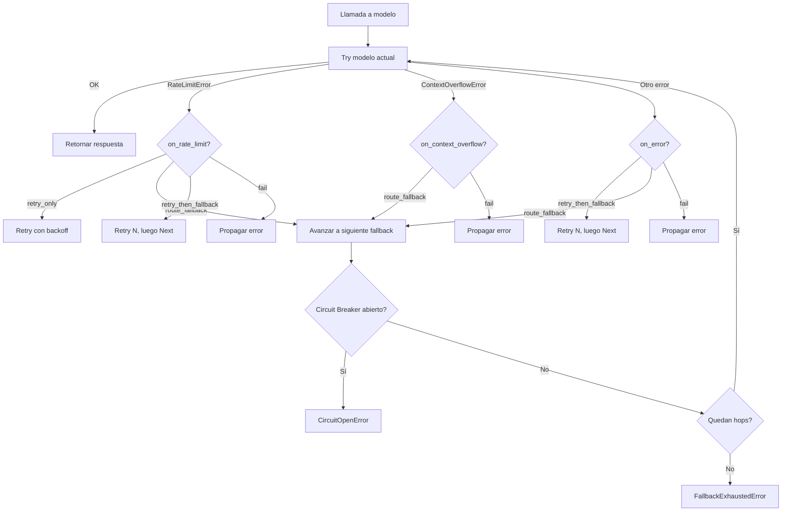
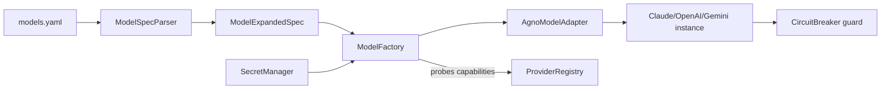

# SPEC_14_MODEL_RESILIENCE_AND_CONFIG

> **Propósito**: Define cómo yaml-agno abstrae TODO el catálogo de modelos de Agno SDK (30+ providers), su configuración paramétrica, caching, fallback inteligente con routing de errores, retries con backoff, y modelos de razonamiento a una capa YAML-first con validación Pydantic V2 y resiliencia operacional integrada con el Circuit Breaker de SPEC_09 y el `RetryPolicy` de SPEC_05.

---

## 1. ALCANCE Y FRONTERA

### 1.1 Qué cubre este SPEC
- Catálogo completo de providers de modelos (nativos, locales, cloud, gateways).
- Sintaxis `provider:id` (model-as-string) y su parser.
- Parámetros de configuración del modelo (`temperature`, `max_tokens`, `top_p`, `reasoning_effort`).
- `cache_response` (caching de respuestas a nivel modelo).
- Fallback de modelos con routing de errores (`on_rate_limit`, `on_context_overflow`, `on_error`) y callback.
- Retries a nivel modelo (`retries`, `retry_delay`, `exponential_backoff`).
- Modelos de razonamiento/thinking y structured output (`response_model`, JSON mode).
- Matriz de compatibilidad por provider.
- Referencia a entrada multimodal (detalle operativo en SPEC_17).

### 1.2 Qué NO cubre (frontera con otros SPECs)
| Tema | Dueño | Referencia cruzada |
|------|-------|--------------------|
| Circuit Breaker operativo (estados, half-open, métricas) | SPEC_09 | Se REUTILIZA, no se duplica |
| Retry/backoff a nivel executor / workflow step | SPEC_05 | Nivel orchestrator, distinto al modelo (`RetryPolicy`) |
| Dependencies / context building / CompressionManager | SPEC_15 | Operación de contexto |
| Multimodal input parsing (image/audio/video bytes) | SPEC_17 | Este SPEC solo mapea el flag de capacidad |
| ConfigManager / SecretManager (API keys) | SPEC_23 | Resuelve credenciales |
| Observability de llamadas a modelo (traces, métricas) | SPEC_09 | Se instrumenta, no se define aquí |

### 1.3 Principios yaml-agno
- **YAML-First**: todo config en YAML, nunca en código.
- **Clean Architecture**: `ModelPort` (domain) + `AgnoModelAdapter` (infra). La fábrica es el puerto.
- **Pydantic V2 boundary**: validación con union discriminada en el parser YAML.
- **No duplicar resiliencia**: el Circuit Breaker vive en SPEC_09 y el `RetryPolicy` en SPEC_05. Aquí se referencian y se enchufan.
- **asyncio.TaskGroup**: nunca `asyncio.gather` para llamadas de modelo paralelas (ej. fallback probing).

---

## 2. CATÁLOGO DE PROVIDERS

### 2.1 Taxonomía

yaml-agno organiza los providers en 4 familias. El YAML usa el `provider_id` como clave de dispatch.

```mermaid
graph TD
    Root[Model Config YAML]
    Root --> Native[Native SDK Providers]
    Root --> Local[Local / Self-hosted]
    Root --> Cloud[Cloud Managed]
    Root --> Gateways[API Gateways / Routers]

    Native --> N1[Anthropic]
    Native --> N2[OpenAI Chat]
    Native --> N3[OpenAI Responses]
    Native --> N4[Google Gemini]
    Native --> N5[Mistral]
    Native --> N6[DeepSeek]
    Native --> N7[Cohere]
    Native --> N8[Perplexity]
    Native --> N9[xAI Grok]
    Native --> N10[Meta]
    Native --> N11[DashScope]
    Native --> N12[Vercel]
    Native --> N13[Cerebras]
    Native --> N14[Cloudflare]
    Native --> N15[DeepInfra]
    Native --> N16[HuggingFace]
    Native --> N17[IBM]
    Native --> N18[Inception]
    Native --> N19[InternLM]
    Native --> N20[Minimax]
    Native --> N21[Moonshot]
    Native --> N22[N1N]
    Native --> N23[Neosantara]
    Native --> N24[Nexus]
    Native --> N25[NVIDIA]
    Native --> N26[SiliconFlow]
    Native --> N27[Xiaomi]

    Local --> L1[Ollama]
    Local --> L2[LlamaCpp]
    Local --> L3[LM Studio]
    Local --> L4[vLLM]

    Cloud --> C1[AWS Bedrock]
    Cloud --> C2[Azure OpenAI]
    Cloud --> C3[GCP Vertex]

    Gateways --> G1[OpenRouter]
    Gateways --> G2[Together]
    Gateways --> G3[Groq]
    Gateways --> G4[Fireworks]
    Gateways --> G5[LangDB]
    Gateways --> G6[Nebius]
    Gateways --> G7[LiteLLM]
    Gateways --> G8[Portkey]
    Gateways --> G9[Requesty]
    Gateways --> G10[SambaNova]
    Gateways --> G11[TokenLab]
    Gateways --> G12[TuningEngines]
```



### 2.2 Matriz maestra de providers

| Familia | `provider_id` | Clase Agno | API key env var (sugerida) | Multimodal | Structured | Native tool use | Local |
|---------|---------------|------------|----------------------------|------------|------------|-----------------|-------|
| Native | `anthropic` | `agno.models.anthropic.Claude` | `ANTHROPIC_API_KEY` | yes | yes | yes | no |
| Native | `openai_chat` | `agno.models.openai.OpenAIChat` | `OPENAI_API_KEY` | yes | yes | yes | no |
| Native | `openai_responses` | `agno.models.openai.OpenAIResponses` | `OPENAI_API_KEY` | yes | yes | yes | no |
| Native | `google` | `agno.models.google.Gemini` | `GOOGLE_API_KEY` | yes | yes | yes | no |
| Native | `mistral` | `agno.models.mistral.MistralChat` | `MISTRAL_API_KEY` | partial | yes | yes | no |
| Native | `deepseek` | `agno.models.deepseek.DeepSeek` | `DEEPSEEK_API_KEY` | no | yes | yes | no |
| Native | `cohere` | `agno.models.cohere.Cohere` | `COHERE_API_KEY` | no | yes | partial | no |
| Native | `perplexity` | `agno.models.perplexity.Perplexity` | `PERPLEXITY_API_KEY` | no | no | no | no |
| Native | `xai` | `agno.models.xai.xAI` | `XAI_API_KEY` | yes | yes | yes | no |
| Native | `meta` | `agno.models.meta.Llama` | `META_API_KEY` | partial | yes | yes | no |
| Native | `dashscope` | `agno.models.dashscope.DashScope` | `DASHSCOPE_API_KEY` | partial | yes | yes | no |
| Native | `vercel` | `agno.models.vercel.V0` | `VERCEL_API_KEY` | partial | yes | yes | no |
| Local | `ollama` | `agno.models.ollama.Ollama` | (none) | partial | yes | yes | yes |
| Local | `llamacpp` | `agno.models.llama_cpp.LlamaCpp` | (none) | no | partial | partial | yes |
| Local | `lm_studio` | `agno.models.lmstudio.LMStudio` | (none) | no | yes | yes | yes |
| Local | `vllm` | `agno.models.vllm.VLLM` | (none) | partial | yes | yes | yes |
| Cloud | `bedrock` | `agno.models.aws.AwsBedrock` | `AWS_ACCESS_KEY_ID` + secret | yes | yes | yes | no |
| Cloud | `azure` | `agno.models.azure.AzureOpenAI` | `AZURE_OPENAI_API_KEY` | yes | yes | yes | no |
| Cloud | `vertex` | `agno.models.vertexai.Claude` (Vertex AI hostea Anthropic Claude; Gemini-on-Vertex se usa vía `agno.models.google.Gemini`) | `GCP service account JSON` | yes | yes | yes | no |
| Gateway | `openrouter` | `agno.models.openrouter.OpenRouter` | `OPENROUTER_API_KEY` | yes | yes | yes | no |
| Gateway | `together` | `agno.models.together.Together` | `TOGETHER_API_KEY` | partial | yes | yes | no |
| Gateway | `groq` | `agno.models.groq.Groq` | `GROQ_API_KEY` | no | yes | yes | no |
| Gateway | `fireworks` | `agno.models.fireworks.Fireworks` | `FIREWORKS_API_KEY` | partial | yes | yes | no |
| Gateway | `langdb` | `agno.models.langdb.LangDB` | `LANGDB_API_KEY` | yes | yes | yes | no |
| Gateway | `nebius` | `agno.models.nebius.Nebius` | `NEBIUS_API_KEY` | partial | yes | yes | no |
| Gateway | `litellm` | `agno.models.litellm.LiteLLM` | `LITELLM_API_KEY` | partial | yes | yes | no |
| Gateway | `portkey` | `agno.models.portkey.Portkey` | `PORTKEY_API_KEY` | partial | yes | yes | no |
| Gateway | `requesty` | `agno.models.requesty.Requesty` | `REQUESTY_API_KEY` | partial | yes | yes | no |
| Gateway | `sambanova` | `agno.models.sambanova.SambaNova` | `SAMBANOVA_API_KEY` | partial | yes | yes | no |
| Gateway | `tokenlab` | `agno.models.tokenlab.TokenLab` | `TOKENLAB_API_KEY` | partial | yes | yes | no |
| Gateway | `tuning_engines` | `agno.models.tuning_engines.TuningEngines` | `TUNING_ENGINES_API_KEY` | partial | yes | yes | no |
| Native | `aimlapi` | `agno.models.aimlapi.AimlApi` | `AIMLAPI_API_KEY` | partial | yes | yes | no |
| Native | `cerebras` | `agno.models.cerebras.Cerebras` | `CEREBRAS_API_KEY` | no | yes | yes | no |
| Native | `cloudflare` | `agno.models.cloudflare.Cloudflare` | `CLOUDFLARE_API_KEY` | partial | yes | yes | no |
| Native | `cometapi` | `agno.models.cometapi.CometApi` | `COMETAPI_API_KEY` | partial | yes | yes | no |
| Native | `deepinfra` | `agno.models.deepinfra.DeepInfra` | `DEEPINFRA_API_KEY` | partial | yes | yes | no |
| Native | `huggingface` | `agno.models.huggingface.HuggingFace` | `HF_API_KEY` | no | yes | yes | no |
| Native | `ibm` | `agno.models.ibm.IBM` | `IBM_API_KEY` | no | yes | yes | no |
| Native | `inception` | `agno.models.inception.Inception` | `INCEPTION_API_KEY` | no | yes | yes | no |
| Native | `internlm` | `agno.models.internlm.InternLM` | `INTERNLM_API_KEY` | partial | yes | yes | no |
| Native | `minimax` | `agno.models.minimax.MiniMax` | `MINIMAX_API_KEY` | partial | yes | yes | no |
| Native | `moonshot` | `agno.models.moonshot.Moonshot` | `MOONSHOT_API_KEY` | no | yes | yes | no |
| Native | `n1n` | `agno.models.n1n.N1N` | `N1N_API_KEY` | no | yes | yes | no |
| Native | `neosantara` | `agno.models.neosantara.Neosantara` | `NEOSANTARA_API_KEY` | partial | yes | yes | no |
| Native | `nexus` | `agno.models.nexus.Nexus` | `NEXUS_API_KEY` | no | yes | yes | no |
| Native | `nvidia` | `agno.models.nvidia.NVIDIA` | `NVIDIA_API_KEY` | partial | yes | yes | no |
| Native | `siliconflow` | `agno.models.siliconflow.SiliconFlow` | `SILICONFLOW_API_KEY` | partial | yes | yes | no |
| Native | `xiaomi` | `agno.models.xiaomi.Xiaomi` | `XIAOMI_API_KEY` | no | yes | yes | no |
| Native | `mistral_gateway` | (alias mistral via gateway) | `MISTRAL_API_KEY` | partial | yes | yes | no |

> **v2.8.x note**: 46 providers total (was 26 in v2.6.18). `models/defaults.py` was removed upstream; per-model defaults are class-level. New providers from v2.7+: aimlapi, cerebras, cloudflare, cometapi, deepinfra, huggingface, ibm, inception, internlm, litellm, minimax, moonshot, n1n, neosantara, nexus, nvidia, portkey, requesty, sambanova, siliconflow, tokenlab, tuning_engines, xiaomi. Caps listed as `partial` are best-effort; verified per-provider docs.

### 2.3 Capabilities matrix (resolución declarativa)

Cada provider expone un set de capacidades. El validador YAML puede rechazar configs que piden capacidades no soportadas (ej. `structured_output: strict` en Perplexity).

```yaml
# Resuelto en runtime por el ModelFactory
capabilities:
  multimodal: ["image", "audio"]      # o false
  structured_output: ["json_mode", "strict", "response_model"]
  tool_use: native                     # native | partial | none
  streaming: true
  caching: true                        # soporta cache_response
  reasoning: true                      # soporta thinking / reasoning_effort
```

---

## 3. MODEL-AS-STRING (PARSER `provider:id`)

### 3.1 Sintaxis

Agno soporta (v2.2.6+) la forma compacta `"provider:model_id"`. yaml-agno la adopta como primer ciudadano.

```yaml
# Shortcut
model: "anthropic:claude-sonnet-4-5"

# Equivalente expandido
model:
  provider: anthropic
  id: claude-sonnet-4-5
```

### 3.2 Gramática del parser

```text
model_string  ::= provider ":" model_id ( ":" alias )?
provider       ::= [a-z_]+
model_id       ::= [a-zA-Z0-9.\-_]+
alias          ::= [a-z0-9\-]+         # opcional, para referencia en fallback
```

### 3.3 Casos especiales
- `provider:id:alias` permite nombrar el modelo para referenciarlo en `fallback_models`.
- Strings sin `:` son inválidos a menos que el provider tenga un default (rechazado por el parser; error explícito).
- `provider:DEFAULT` resuelve al modelo default del provider declarado en `config/defaults.yaml`.

### 3.4 Pydantic V2 model (union discriminada)

```python
from typing import Annotated, Literal, Union
from pydantic import BaseModel, Field, field_validator

class ModelStringSpec(BaseModel):
    """Compact form: 'provider:id' or 'provider:id:alias'."""
    raw: str

    @field_validator("raw")
    @classmethod
    def _validate(cls, v: str) -> str:
        parts = v.split(":")
        if len(parts) < 2 or len(parts) > 3:
            raise ValueError(
                f"Model string must be 'provider:id' or 'provider:id:alias', got {v!r}"
            )
        provider, model_id = parts[0], parts[1]
        if provider not in SUPPORTED_PROVIDERS:
            raise ValueError(f"Unknown provider {provider!r}")
        return v

# FallbackConfig MUST be defined before ModelExpandedSpec so the latter can
# reference it via the `fallback` field (Pydantic forward refs are avoided).
FallbackRef = Union[str, dict]   # "provider:id" string | {"alias": ...} | expanded dict

class FallbackConfig(BaseModel):
    """Ordered fallback chain + per-error routing strategy.

    Each entry in ``fallback_models`` is resolved by ``ProviderResolver``
    (string, alias dict, or expanded dict) in ``build_fallback_chain``.
    """
    fallback_models: list[FallbackRef] = Field(default_factory=list)
    on_rate_limit: Literal["retry_only", "route_fallback", "retry_then_fallback", "fail"] = "route_fallback"
    on_context_overflow: Literal["retry_only", "route_fallback", "retry_then_fallback", "fail"] = "route_fallback"
    on_error: Literal["retry_only", "route_fallback", "retry_then_fallback", "fail"] = "retry_then_fallback"
    fallback_callback: str | None = None   # import path to async callable
    max_fallback_hops: int = Field(default=3, ge=1)
    propagate_session: bool = True

class ModelExpandedSpec(BaseModel):
    """Expanded form with full parameters."""
    provider: Literal[
        "anthropic", "openai_chat", "openai_responses", "google", "mistral",
        "deepseek", "cohere", "perplexity", "xai", "meta", "dashscope", "vercel",
        "ollama", "llamacpp", "lm_studio", "vllm",
        "bedrock", "azure", "vertex",
        "openrouter", "together", "groq", "fireworks", "langdb", "nebius",
        "mistral_gateway",
    ]
    id: str
    alias: str | None = None

    # Generation params (section 4)
    temperature: float | None = Field(default=None, ge=0.0, le=2.0)
    max_tokens: int | None = Field(default=None, ge=1)
    top_p: float | None = Field(default=None, ge=0.0, le=1.0)
    top_k: int | None = Field(default=None, ge=0)
    stop_sequences: list[str] | None = None
    seed: int | None = None

    # Reasoning (section 8)
    reasoning_effort: Literal["minimal", "low", "medium", "high"] | None = None
    thinking: bool | None = None

    # Caching (section 5)
    cache_response: bool = False

    # Model-level retry (section 7). @ai-directive: only `retries` and
    # `exponential_backoff` are forwarded verbatim to Agno `Model.*`. `retry_delay`
    # is the yaml-agno user-facing name and is forwarded to Agno as
    # `delay_between_retries` (Agno has NO `retry_delay` field). `wait_on_rate_limit`
    # and `retry_jitter` are yaml-agno-only knobs (no Agno equivalent) consumed by
    # the fallback-probe path and the Retry-After handling. These fields are NOT
    # consumed by compute_delay/RetryPolicy (that path is fallback-probe only;
    # see section 7.3 @ai-directive).
    retries: int = Field(default=0, ge=0, le=10)
    retry_delay: float = Field(default=1.0, ge=0.0)
    exponential_backoff: bool = True
    wait_on_rate_limit: bool = False
    # Jitter applied to the model-level retry delay (fraction in [0.0, 1.0]).
    # yaml-agno-only (Agno has no retry_jitter field); applied by the
    # fallback-probe path. Default 0.2 matches section 7.4.
    retry_jitter: float = Field(default=0.2, ge=0.0, le=1.0)

    # Fallback chain (section 6). Without this field, build_fallback_chain()
    # was unreachable (it reads spec.fallback / spec.fallback.fallback_models).
    fallback: FallbackConfig | None = None

    # Provider-specific kwargs
    provider_kwargs: dict = Field(default_factory=dict)

    # Client-level override (timeout, base_url)
    timeout: float | None = Field(default=None, gt=0.0)
    base_url: str | None = None

ModelSpec = Annotated[
    Union[ModelStringSpec, ModelExpandedSpec],
    Field(discriminator=None),  # discriminación por tipo (str vs dict)
]
```

### 3.5 Resolución str vs dict en YAML

```python
def parse_model(node) -> ModelExpandedSpec:
    if isinstance(node, str):
        spec = ModelStringSpec(raw=node)
        return expand_model_string(spec.raw)         # -> ModelExpandedSpec
    if isinstance(node, dict):
        return ModelExpandedSpec(**node)
    raise TypeError(f"model must be str or dict, got {type(node)}")
```

---

## 4. PARÁMETROS DE CONFIGURACIÓN

### 4.1 Tabla de parámetros generados

| Parámetro | Tipo | Rango | Default | Descripción |
|-----------|------|-------|---------|-------------|
| `temperature` | float | 0.0-2.0 | provider default | Aleatoriedad. 0 = determinista. |
| `max_tokens` | int | >=1 | provider default | Máx tokens de salida. |
| `top_p` | float | 0.0-1.0 | provider default | Nucleus sampling. |
| `top_k` | int | >=0 | provider default | Top-k sampling (Alá Gemma/Llama). |
| `stop_sequences` | list[str] | - | [] | Secuencias que cortan la generación. |
| `seed` | int | - | none | Semilla para reproducibilidad (no todos los providers). |
| `timeout` | float | >0 | provider default | Timeout HTTP en segundos. |
| `base_url` | str | - | provider default | Override del endpoint (útil para gateways/proxies). |

### 4.2 Provider-specific kwargs

yaml-agno permite pasar kwargs nativos del provider sin romper la abstracción, bajo la clave `provider_kwargs`. El validador emite WARNING si una clave no está en la whitelist del provider.

```yaml
model:
  provider: anthropic
  id: claude-sonnet-4-5
  provider_kwargs:
    betas: ["interleaved-thinking-2025-05-14"]
    default_headers:
      anthropic-beta: "prompt-caching-2024-07-31"
```

### 4.3 YAML completo de ejemplo

```yaml
models:
  primary:
    provider: anthropic
    id: claude-sonnet-4-5
    alias: main
    temperature: 0.7
    max_tokens: 4096
    cache_response: true
    retries: 2
    retry_delay: 1
    exponential_backoff: true
    wait_on_rate_limit: true

  fast:
    provider: groq
    id: llama-3.3-70b-versatile
    alias: cheap-fast
    temperature: 0.2
    max_tokens: 2048

  fallback_a:
    provider: openai_responses
    id: gpt-4o
    alias: fb-openai
    temperature: 0.7
    max_tokens: 4096
```

---

## 5. CACHE_RESPONSE (RESPONSE CACHING)

### 5.1 Semántica

`cache_response=True` activa el caching de respuestas a nivel modelo. La primera llamada hittea la API y cachea; llamadas idénticas subsiguientes devuelven el resultado cacheado. Reduce costo y latencia para prompts repetidos.

> Fuente: Agno docs, "Cache Response". `model=Claude(id="claude-sonnet-4-5", cache_response=True)`.

### 5.2 Clave de cache (determinismo)

yaml-agno define la clave de cache como hash canónico de:
```
sha256(
  provider + model_id
  + temperature + top_p + top_k
  + serialized_messages (estables, ordenadas)
  + tool_definitions_hash
  + response_model_schema_hash
)
```

Mensajes con timestamps dinámicos (`add_datetime_to_context`, SPEC_15) **rompen** la cache por diseño. El CacheManager emite WARNING cuando detecta que un modelo con `cache_response=True` tiene `add_datetime_to_context=True`.

### 5.3 YAML

```yaml
model:
  provider: openai_responses
  id: gpt-4o
  cache_response: true       # bool, default false
```

### 5.4 Invalidation

yaml-agno NO invalida la cache de Agno por defecto (es responsabilidad del provider). El `CacheManager` interno solo registra hits/misses para observabilidad (SPEC_09). Invalidación manual vía `POST /admin/cache/invalidate` (SPEC_06) solo afecta caches propias de yaml-agno (no la de Agno SDK).

---

## 6. FALLBACK MODELS (CRÍTICO)

### 6.1 Concepto

El fallback permite declarar modelos alternativos a los que yaml-agno enruta automáticamente cuando el modelo primario falla. El routing es **selectivo por tipo de error**.

### 6.2 FallbackConfig YAML

```yaml
model:
  provider: anthropic
  id: claude-sonnet-4-5
  fallback:
    # Lista ordenada de modelos de respaldo
    fallback_models:
      - "openai_responses:gpt-4o"           # referencia por string
      - alias: fb-openai                      # referencia por alias declarado arriba
      - provider: google
        id: gemini-2.5-pro

    # Routing por tipo de error
    on_rate_limit: route_fallback             # route_fallback | retry_only | fail
    on_context_overflow: route_fallback       # típico: cambiar a modelo con ventana mayor
    on_error: retry_then_fallback             # retry_then_fallback | route_fallback | fail

    # Callback opcional
    fallback_callback: myapp.callbacks.on_model_fallback

    # Metadata de routing
    max_fallback_hops: 3                      # límite de saltos por run
    propagate_session: true                   # mantener session_id al saltar
```

### 6.3 Routing strategies (enum)

| Valor | `on_rate_limit` | `on_context_overflow` | `on_error` |
|-------|-----------------|----------------------|------------|
| `retry_only` | retry local (respeta `wait_on_rate_limit`) | n/a | retry local |
| `route_fallback` | salta al siguiente fallback | salta a fallback (preferir ventana mayor) | salta a fallback |
| `retry_then_fallback` | retry N veces, luego fallback | n/a | retry N, luego fallback |
| `fail` | propaga `RateLimitError` | propaga `ContextOverflowError` | propaga error original |

### 6.4 Routing policy resolution



### 6.5 Callback contract

```python
from typing import Awaitable

async def on_model_fallback(
    *,
    failed_model_alias: str,
    failed_model_id: str,
    error: Exception,
    error_kind: Literal["rate_limit", "context_overflow", "error"],
    next_model_alias: str,
    next_model_id: str,
    hop: int,
    run_context: "RunContext",
) -> bool:
    """
    Retorna True para confirmar el fallback, False para abortar y propagar.
    Llamada vía await; debe ser async-safe.
    """
```

yaml-agno resuelve `fallback_callback` desde un registro de callables cargado al boot (mismo mecanismo que tools, SPEC_11). Si el callback lanza, se loguea (WARNING) y se procede con el fallback.

### 6.6 Integración con Circuit Breaker (SPEC_09)

**No se duplica.** El Circuit Breaker de SPEC_09 es el único dueño del estado del circuito. yaml-agno lo consulta antes de cada intento:

```python
from yaml_agno.infra.resilience import get_circuit_breaker

async def call_with_fallback(spec: ModelExpandedSpec, prompt, ctx):
    cb = get_circuit_breaker(f"model:{spec.alias or spec.id}")
    fallback_chain = build_fallback_chain(spec)
    for hop, candidate in enumerate(fallback_chain):
        if not cb.allow_request():
            log.warning("circuit_open", extra={"model": candidate.alias})
            continue
        try:
            async with cb.guard(candidate.alias):
                return await invoke_model(candidate, prompt, ctx)
        except (RateLimitError, ContextOverflowError) as e:
            await notify_fallback_callback(spec, candidate, e, ctx, hop)
            continue
    raise FallbackExhaustedError(spec.alias)
```

Estados del Circuit Breaker (definidos en SPEC_09):
- `CLOSED`: normal, permite requests.
- `OPEN`: bloquea, espera cooldown.
- `HALF_OPEN`: permite un probe request.

yaml-agno registra los siguientes eventos como fallos para el CB:
- `RateLimitError`
- `ContextOverflowError`
- `asyncio.TimeoutError` (timeout HTTP)
- Errores 5xx del provider.

Errores 4xx de cliente (excepto 429) NO cuentan contra el CB (son bugs de config, no fallos transitorios).

---

## 7. RETRIES Y BACKOFF (NIVEL MODELO)

### 7.1 Frontera de niveles

| Nivel | Dueño | Qué reintenta | Default |
|-------|-------|---------------|---------|
| **Modelo** | SPEC_14 (este) | Una sola llamada HTTP al provider | `retries=0` |
| **Executor / Run** | SPEC_05 | El run completo del agent/team/workflow | `retries=0` (configurable en YAML del agent) |

Ambos niveles pueden coexistir. El reintentar el run completo implica reintentar el modelo N veces (potencialmente costoso). yaml-agno advierte en validación si ambos están altos.

### 7.2 Parámetros a nivel modelo

```yaml
model:
  provider: openai_chat
  id: gpt-4o
  retries: 2                    # intentos adicionales tras el primero
  retry_delay: 1                # segundos
  exponential_backoff: true     # delay se duplica cada retry
  wait_on_rate_limit: true      # respeta Retry-After del provider
```

> Fuente Agno: `OpenAIResponses(id="gpt-4o", retries=2, delay_between_retries=1, exponential_backoff=True)`.
> Agno `Model` base fields: `retries`, `delay_between_retries`, `exponential_backoff` (NO `retry_delay`,
> NO `wait_on_rate_limit` — those are yaml-agno user-facing names; see section 7.2 mapping).
> También soportado a nivel Agent/Team: `retries=3, delay_between_retries=1, exponential_backoff=True`.

### 7.3 Cálculo de delay

> @ai-directive: `compute_delay` and the model-layer `RetryPolicy` (TASK_010) are
> used **ONLY** by the fallback-probe path — i.e. inside `call_with_fallback`
> (section 6.6) when a hop fails with a retryable error and the routing strategy
> is `retry_only` / `retry_then_fallback`. They do NOT layer a second retry loop
> on top of Agno's model-level retry. Per decision A.7, model-level retry is
> owned by Agno `Model.*` fields (`retries` / `retry_delay` /
> `exponential_backoff` / `wait_on_rate_limit`), which `ProviderFactory` forwards
> verbatim. yaml-agno has exactly ONE retry abstraction at the step/executor
> layer (SPEC_05 `RetryPolicy`, backoff + jitter + `classify()`); the model layer
> does not duplicate it.

```python
def compute_delay(attempt: int, base: float, exponential: bool, jitter: float = 0.0) -> float:
    """Delay for a fallback-probe retry attempt (NOT a second model retry loop).

    Args:
        attempt: Zero-based attempt index within the fallback-probe path.
        base: Base delay in seconds (spec.retry_delay).
        exponential: Whether to double the delay per attempt.
        jitter: Jitter fraction in [0.0, 1.0]; 0 disables jitter.

    Returns:
        The computed delay in seconds.
    """
    delay = base * (2 ** attempt) if exponential else base
    if jitter > 0.0:
        delay *= 1.0 + random.uniform(-jitter, jitter)
    return delay
```

`wait_on_rate_limit=True` hace que, ante un 429 con header `Retry-After`, se respete ese valor por encima del cálculo (el mayor de los dos).

### 7.4 Jitter

yaml-agno añade jitter (±20%) al delay para evitar thundering herd en setups con muchos agentes concurrentes. Configurable:

```yaml
model:
  retry_jitter: 0.2   # fracción, default 0.2; 0 desactiva
```

---

## 8. RAZONAMIENTO, THINKING Y STRUCTURED OUTPUT

### 8.1 Reasoning / thinking models

Algunos providers (OpenAI o-series, Claude con extended thinking, DeepSeek-R1, Gemini 2.5) soportan razonamiento extendido. yaml-agno lo expone así:

```yaml
model:
  provider: openai_responses
  id: o3
  reasoning_effort: high        # minimal | low | medium | high

# O para Claude extended thinking
model:
  provider: anthropic
  id: claude-opus-4-1
  thinking: true
  provider_kwargs:
    thinking_budget_tokens: 8000
```

El validador comprueba que el `provider:id` declarado soporta razonamiento (capability `reasoning: true`). Si no, ERROR.

### 8.2 Structured output

```yaml
agent:
  response_model: myapp.schemas.StockAnalysis    # path importable a clase Pydantic
  structured_output:                             # o sub-bloque explícito
    mode: response_model                         # response_model | json_mode | strict
    strict: true                                 # valida schema estrictamente
```

| Modo | Descripción |
|------|-------------|
| `response_model` | Pasa una clase Pydantic como schema de salida. |
| `json_mode` | Fuerza JSON válido sin schema explícito. |
| `strict` | Valida contra el schema; lanza si el modelo se desvía. |

El `response_model` se resuelve desde un registro de schemas (similar a tools). Debe ser una clase Pydantic V2 con `model_config = ConfigDict(...)`. yaml-agno valida compatibilidad: si el provider no soporta structured output (ej. Perplexity), ERROR.

### 8.3 Compatibilidad reasoning + structured

No todos los modelos de razonamiento soportan structured output simultáneamente. El validador emite WARNING cuando se combinan y el provider es conocido por no soportarlo (tabla de compat).

---

## 9. MULTIMODAL (REFERENCIA)

yaml-agno solo valida la **capacidad** multimodal aquí. El parsing de bytes de imagen/audio/video, base64, URLs y validación MIME vive en SPEC_17.

```yaml
model:
  provider: google
  id: gemini-2.5-pro
  # capabilities.multimodal se infiere del catálogo (sección 2.2)
```

Cuando un mensaje incluye contenido multimodal y el provider no lo soporta, el error es de SPEC_17, pero la causa raíz (provider sin capacidad) se reporta desde aquí. yaml-agno encadena el error con contexto del ModelFactory.

---

## 10. YAML SCHEMA COMPLETO (PYDANTIC V2)

### 10.1 Top-level

```yaml
# config/models.yaml
models:
  # Declaraciones reutilizables por alias
  definitions:
    main:
      provider: anthropic
      id: claude-sonnet-4-5
      alias: main
      temperature: 0.7
      max_tokens: 4096
      cache_response: true

  # Defaults globales para cualquier modelo no especificado
  defaults:
    retries: 1
    retry_delay: 1
    exponential_backoff: true
    wait_on_rate_limit: true

  # Registry de API keys (resueltas por SecretManager, SPEC_23)
  # Solo referencia por nombre lógico; el valor NUNCA va en YAML.
```

### 10.2 ModelSpec Pydantic V2 (resumen de la unión)

```python
class ModelsConfig(BaseModel):
    definitions: dict[str, ModelExpandedSpec] = Field(default_factory=dict)
    defaults: ModelDefaults = Field(default_factory=ModelDefaults)

    @model_validator(mode="after")
    def _check_alias_uniqueness(self):
        aliases = [m.alias for m in self.definitions.values() if m.alias]
        if len(aliases) != len(set(aliases)):
            raise ValueError("Duplicate model aliases detected")
        return self
```

### 10.3 Validador de capacidades

```python
class ModelCapabilitiesValidator:
    @staticmethod
    def validate(spec: ModelExpandedSpec, requested: CapabilitiesRequest) -> list[str]:
        """Retorna lista de errores (vacía = OK)."""
        caps = PROVIDER_REGISTRY[spec.provider].capabilities
        errors = []
        if requested.structured_output == "strict" and "strict" not in caps.structured_output:
            errors.append(f"Provider {spec.provider} no soporta structured output strict")
        if requested.multimodal and not caps.multimodal:
            errors.append(f"Provider {spec.provider} no soporta multimodal input")
        if requested.reasoning and not caps.reasoning:
            errors.append(f"Model {spec.id} no soporta razonamiento")
        return errors
```

---

## 11. PROVIDERFACTORY PATTERN

### 11.1 Arquitectura



### 11.2 ProviderFactory

```python
import importlib
from typing import Any

# Lazy mapping: provider_id -> (module_path, class_name). Classes are imported
# on first use via importlib, NOT at module top-level — this avoids forcing 30+
# provider SDK dependencies when yaml-agno only uses one. Eager top-level imports
# of every provider would make `import yaml_agno` pull Anthropic, OpenAI, Google,
# AWS, etc. all at once.
class ProviderFactory:
    """
    Puerto de dominio (ModelPort) implementado como adapter sobre Agno SDK.
    Única responsabilidad: traducir ModelExpandedSpec -> instancia de modelo Agno.
    """

    _MAPPING: dict[str, tuple[str, str]] = {
        "anthropic": ("agno.models.anthropic", "Claude"),
        "openai_chat": ("agno.models.openai", "OpenAIChat"),
        "openai_responses": ("agno.models.openai", "OpenAIResponses"),
        "google": ("agno.models.google", "Gemini"),
        "mistral": ("agno.models.mistral", "MistralChat"),
        "deepseek": ("agno.models.deepseek", "DeepSeek"),
        "cohere": ("agno.models.cohere", "Cohere"),
        "perplexity": ("agno.models.perplexity", "Perplexity"),
        "xai": ("agno.models.xai", "xAI"),
        "meta": ("agno.models.meta", "Llama"),
        "dashscope": ("agno.models.dashscope", "DashScope"),
        "vercel": ("agno.models.vercel", "V0"),
        "ollama": ("agno.models.ollama", "Ollama"),
        "llamacpp": ("agno.models.llama_cpp", "LlamaCpp"),
        "lm_studio": ("agno.models.lmstudio", "LMStudio"),
        "vllm": ("agno.models.vllm", "VLLM"),
        "bedrock": ("agno.models.aws", "AwsBedrock"),
        "azure": ("agno.models.azure", "AzureOpenAI"),
        "vertex": ("agno.models.vertexai", "Claude"),
        "openrouter": ("agno.models.openrouter", "OpenRouter"),
        "together": ("agno.models.together", "Together"),
        "groq": ("agno.models.groq", "Groq"),
        "fireworks": ("agno.models.fireworks", "Fireworks"),
        "langdb": ("agno.models.langdb", "LangDB"),
        "nebius": ("agno.models.nebius", "Nebius"),
        # --- new in 2.7+/2.8.x (46 providers total) ---
        "aimlapi": ("agno.models.aimlapi", "AimlApi"),
        "cerebras": ("agno.models.cerebras", "Cerebras"),
        "cloudflare": ("agno.models.cloudflare", "Cloudflare"),
        "cometapi": ("agno.models.cometapi", "CometApi"),
        "deepinfra": ("agno.models.deepinfra", "DeepInfra"),
        "huggingface": ("agno.models.huggingface", "HuggingFace"),
        "ibm": ("agno.models.ibm", "IBM"),
        "inception": ("agno.models.inception", "Inception"),
        "internlm": ("agno.models.internlm", "InternLM"),
        "litellm": ("agno.models.litellm", "LiteLLM"),
        "minimax": ("agno.models.minimax", "MiniMax"),
        "moonshot": ("agno.models.moonshot", "Moonshot"),
        "n1n": ("agno.models.n1n", "N1N"),
        "neosantara": ("agno.models.neosantara", "Neosantara"),
        "nexus": ("agno.models.nexus", "Nexus"),
        "nvidia": ("agno.models.nvidia", "NVIDIA"),
        "portkey": ("agno.models.portkey", "Portkey"),
        "requesty": ("agno.models.requesty", "Requesty"),
        "sambanova": ("agno.models.sambanova", "SambaNova"),
        "siliconflow": ("agno.models.siliconflow", "SiliconFlow"),
        "tokenlab": ("agno.models.tokenlab", "TokenLab"),
        "tuning_engines": ("agno.models.tuning_engines", "TuningEngines"),
        "xiaomi": ("agno.models.xiaomi", "Xiaomi"),
    }
    _resolved: dict[str, type] = {}   # cache of already-imported classes

    def __init__(self, secret_manager: "SecretManager"):
        self._secrets = secret_manager

    def _resolve_class(self, provider: str) -> type:
        if provider in self._resolved:
            return self._resolved[provider]
        if provider not in self._MAPPING:
            raise UnknownProviderError(provider)
        module_path, class_name = self._MAPPING[provider]
        module = importlib.import_module(module_path)
        cls = getattr(module, class_name)
        self._resolved[provider] = cls
        return cls

    def build(self, spec: ModelExpandedSpec) -> "AgnoModel":
        cls = self._resolve_class(spec.provider)

        kwargs = self._compose_kwargs(spec)
        try:
            return cls(**kwargs)
        except TypeError as e:
            raise ModelConstructionError(spec.provider, spec.id, e) from e

    def _compose_kwargs(self, spec: ModelExpandedSpec) -> dict:
        kwargs = {"id": spec.id}
        if spec.temperature is not None: kwargs["temperature"] = spec.temperature
        if spec.max_tokens is not None: kwargs["max_tokens"] = spec.max_tokens
        if spec.top_p is not None: kwargs["top_p"] = spec.top_p
        if spec.top_k is not None: kwargs["top_k"] = spec.top_k
        if spec.seed is not None: kwargs["seed"] = spec.seed
        kwargs["cache_response"] = spec.cache_response
        kwargs["retries"] = spec.retries
        # yaml-agno `retry_delay` forwards to Agno `delay_between_retries`
        # (Agno Model has NO `retry_delay` field). `wait_on_rate_limit` and
        # `retry_jitter` are yaml-agno-only (no Agno equivalent) and are NOT
        # passed to the Agno constructor.
        kwargs["delay_between_retries"] = spec.retry_delay
        kwargs["exponential_backoff"] = spec.exponential_backoff
        if spec.reasoning_effort: kwargs["reasoning_effort"] = spec.reasoning_effort
        if spec.thinking is not None: kwargs["thinking"] = spec.thinking
        if spec.base_url: kwargs["base_url"] = spec.base_url

        # Resolución de API key vía SecretManager
        api_key = self._secrets.resolve(self._api_key_name(spec.provider))
        if api_key:
            kwargs["api_key"] = api_key

        # Merge provider-specific
        kwargs.update(spec.provider_kwargs)
        return kwargs

    @staticmethod
    def _api_key_name(provider: str) -> str:
        return PROVIDER_REGISTRY[provider].api_key_env
```

### 11.3 AgnoModelAdapter (Ports/Adapters)

```python
from yaml_agno.domain.ports import ModelPort

class AgnoModelAdapter(ModelPort):
    """Adapta una instancia de modelo Agno al puerto de dominio."""

    def __init__(self, factory: ProviderFactory):
        self._factory = factory
        self._cache: dict[str, Any] = {}

    def resolve(self, spec: ModelExpandedSpec) -> Any:
        key = spec.alias or f"{spec.provider}:{spec.id}"
        if key not in self._cache:
            self._cache[key] = self._factory.build(spec)
        return self._cache[key]
```

El adapter cachea instancias por alias para evitar reconstruir (y reautenticar) en cada run.

---

## 12. RESOLUCIÓN DE PROVIDERS (RESOLVER)

### 12.1 ProviderResolver

Responsable de resolver cualquier referencia (`string`, `alias`, o bloque expandido) a un `ModelExpandedSpec` normalizado.

```python
class ProviderResolver:
    def __init__(self, definitions: dict[str, ModelExpandedSpec]):
        self._defs = definitions
        self._by_alias = {m.alias: m for m in definitions.values() if m.alias}

    def resolve(self, ref: str | dict | ModelExpandedSpec) -> ModelExpandedSpec:
        if isinstance(ref, ModelExpandedSpec):
            return ref
        if isinstance(ref, dict):
            spec = ModelExpandedSpec(**ref)
            if spec.alias and spec.alias not in self._by_alias:
                raise UndefinedAliasError(spec.alias)
            return spec
        if isinstance(ref, str):
            return self._resolve_string(ref)
        raise TypeError(f"Unsupported model ref: {type(ref)}")

    def _resolve_string(self, s: str) -> ModelExpandedSpec:
        ModelStringSpec(raw=s)            # valida gramática
        provider, model_id, *alias = s.split(":")
        if provider not in PROVIDER_REGISTRY:
            raise UnknownProviderError(provider)
        return ModelExpandedSpec(provider=provider, id=model_id,
                                 alias=alias[0] if alias else None)

    def resolve_alias(self, alias: str) -> ModelExpandedSpec:
        if alias not in self._by_alias:
            raise UndefinedAliasError(alias)
        return self._by_alias[alias]
```

### 12.2 Resolución en fallback chain

```python
def build_fallback_chain(spec: ModelExpandedSpec) -> list[ModelExpandedSpec]:
    chain = [spec]
    if not spec.fallback:
        return chain
    for fb in spec.fallback.fallback_models:
        if isinstance(fb, dict) and "alias" in fb:
            chain.append(resolver.resolve_alias(fb["alias"]))
        else:
            chain.append(resolver.resolve(fb))
    return chain
```

---

## 13. MATRIZ DE COMPATIBILIDAD (DETALLE)

### 13.1 Tabla por feature

| Feature | Anthropic | OpenAI Chat | OpenAI Responses | Google | Mistral | DeepSeek | Cohere | Perplexity | xAI | Groq | Ollama | Bedrock | Azure | OpenRouter |
|---------|-----------|-------------|------------------|--------|---------|----------|--------|------------|-----|------|--------|---------|-------|------------|
| `cache_response` | yes | yes | yes | yes | partial | yes | yes | no | yes | partial | no | yes | yes | partial |
| `temperature` | yes | yes | yes | yes | yes | yes | yes | yes | yes | yes | yes | yes | yes | yes |
| `top_p` | yes | yes | yes | yes | yes | yes | yes | no | yes | yes | yes | yes | yes | yes |
| `top_k` | no | no | no | yes | yes | yes | yes | no | no | no | yes | yes | no | partial |
| `reasoning_effort` | no | yes (o-series) | yes | partial | no | yes (R1) | no | no | no | no | partial | partial | yes (o) | partial |
| structured `response_model` | yes | yes | yes | yes | yes | yes | yes | no | yes | yes | partial | yes | yes | yes |
| structured `strict` | yes | yes | yes | yes | partial | partial | no | no | partial | partial | no | partial | yes | partial |
| tool use | yes | yes | yes | yes | yes | yes | partial | no | yes | yes | yes | yes | yes | yes |
| multimodal image | yes | yes | yes | yes | partial | no | no | no | yes | no | partial | yes | yes | yes |
| streaming | yes | yes | yes | yes | yes | yes | yes | yes | yes | yes | yes | yes | yes | yes |

> `yes` = soportado nativamente. `partial` = soportado solo en algunos modelos del provider. `no` = no soportado. yaml-agno valida antes de construir el modelo y produce errores accionables.

---

## 14. SUPUESTOS TÉCNICOS ADOPTADOS

1. **Provider registry es estático en código**, no en YAML. Agno SDK define qué providers existen; yaml-agno los enumera. Nuevos providers requieren release de yaml-agno (no hot-reload de YAML).
2. **API keys NUNCA en YAML**. Solo referencia por nombre lógico; `SecretManager` (SPEC_23) resuelve. Esto es no-negociable.
3. **Cache key** usa serialización canónica de mensajes (stable sort de tool defs). Cualquier campo no determinista (timestamp, random) rompe la cache por diseño.
4. **Circuit Breaker es singleton por `model:alias`**. Compartido entre agentes que usan el mismo modelo (ruidos colectivos).
5. **Fallback callback es opcional y async**. Si no se declara, el routing procede silenciosamente (con log INFO).
6. **Retries a nivel modelo y nivel run pueden coexistir**. Validador advierte si ambos > 2 (riesgo de retry storms).
7. **`provider_kwargs` pasa directo a Agno**. yaml-agno no valida su contenido más allá de una whitelist recomendada (WARNING, no ERROR, para no bloquear uso de features nuevas).
8. **Multimodal solo se valida como capability aquí**. El parsing real es SPEC_17.
9. **Model instances se cachean por alias** en `AgnoModelAdapter` para evitar re-autenticación.
10. **asyncio.TaskGroup** para cualquier probing paralelo (health check de modelos). Nunca `asyncio.gather`.

---

## 15. BEHAVIOR DELTA - BDD SCENARIOS

### 15.1 Parser & Provider Resolution

#### Scenario 1: Model-as-string parsea correctamente
```gherkin
GIVEN un YAML con `model: "anthropic:claude-sonnet-4-5"`
WHEN el ModelSpecParser procesa el nodo
THEN el ProviderResolver retorna un ModelExpandedSpec
AND provider == "anthropic"
AND id == "claude-sonnet-4-5"
AND alias is None
```

#### Scenario 2: String con alias se resuelve
```gherkin
GIVEN un YAML con `model: "openai_responses:gpt-4o:fb-openai"`
WHEN se procesa
THEN el spec tiene alias == "fb-openai"
AND puede ser referenciado en fallback_models por "alias: fb-openai"
```

#### Scenario 3: Provider desconocido da error explícito
```gherkin
GIVEN un YAML con `model: "acme:gpt-x"`
WHEN el parser valida
THEN lanza UnknownProviderError con mensaje "Unknown provider 'acme'"
AND el error incluye la lista de providers soportados
```

#### Scenario 4: Alias duplicado es rechazado
```gherkin
GIVEN models.definitions con dos modelos alias="main"
WHEN ModelsConfig valida
THEN lanza ValueError "Duplicate model aliases detected"
```

### 15.2 Cache Response

#### Scenario 5: Cache hit en segunda llamada idéntica
```gherkin
GIVEN un modelo con cache_response=true
AND add_datetime_to_context=false
WHEN se llama dos veces con mensajes idénticos
THEN la primera llamada hittea el provider (cache miss)
AND la segunda retorna respuesta cacheada (cache hit)
AND solo se realiza UNA llamada HTTP al provider
```

#### Scenario 6: Cache invalidated por contexto dinámico
```gherkin
GIVEN un modelo con cache_response=true
AND add_datetime_to_context=true
WHEN se valida la config
THEN el validador emite WARNING "cache_response with dynamic context (datetime) will rarely hit"
```

### 15.3 Fallback Routing

#### Scenario 7: Fallback on rate limit
```gherkin
GIVEN un modelo primary anthropic con fallback on_rate_limit=route_fallback
AND fallback_models=["openai_responses:gpt-4o"]
WHEN el provider Anthropic devuelve RateLimitError (429)
THEN yaml-agno invoca el fallback_callback (si existe)
AND enruta al modelo OpenAI Responses
AND el run completa con respuesta de OpenAI
AND se registra evento de observabilidad "model.fallback"
```

#### Scenario 8: Fallback on context overflow cambia a ventana mayor
```gherkin
GIVEN primary con context window 100k
AND fallback a modelo con context window 1M
WHEN el primary lanza ContextOverflowError
THEN se enruta al fallback de ventana mayor
AND NO se trunca el prompt (se asume que cabe)
```

#### Scenario 9: Max fallback hops agotado
```gherkin
GIVEN fallback_models con 2 elementos y max_fallback_hops=1
WHEN todos fallan con on_error=route_fallback
THEN tras el primer hop se intenta el siguiente
AND al superar max_fallback_hops lanza FallbackExhaustedError
```

#### Scenario 10: Callback aborta el fallback
```gherkin
GIVEN un fallback_callback que retorna False
WHEN el modelo primario falla
THEN el callback es invocado con hop=0
AND yaml-agno NO enruta al fallback
AND propaga el error original al caller
```

#### Scenario 11: Circuit Breaker abierto salta modelo
```gherkin
GIVEN el Circuit Breaker de model:main está OPEN
WHEN se intenta llamar al modelo main
THEN cb.allow_request() retorna False
AND yaml-agno salta al siguiente fallback sin llamar
AND se loguea "circuit_open"
```

### 15.4 Retry con Backoff

#### Scenario 12: Exponential backoff duplica delay
```gherkin
GIVEN retries=2, retry_delay=1, exponential_backoff=true
WHEN la llamada falla con error transitorio
THEN el primer retry espera 1s (2^0)
AND el segundo retry espera 2s (2^1)
AND jitter añade variación de hasta ±20%
```

#### Scenario 13: wait_on_rate_limit respeta Retry-After
```gherkin
GIVEN wait_on_rate_limit=true y un 429 con header Retry-After: 30
WHEN ocurre el rate limit
THEN yaml-agno espera 30s (mayor que el delay calculado)
AND reintenta tras ese plazo
```

#### Scenario 14: Retry solo a nivel modelo, no a nivel run
```gherkin
GIVEN modelo con retries=2 y run con retries=0
WHEN la llamada HTTP falla 2 veces y la 3ra éxito
THEN el modelo reintenta internamente (3 intentos HTTP)
AND el run NO se re-ejecuta
```

### 15.5 Structured Output & Reasoning

#### Scenario 15: Strict structured output con provider incompatible falla en config
```gherkin
GIVEN response_model con mode=strict en provider=perplexity
WHEN el ModelCapabilitiesValidator valida
THEN lanza error "Provider perplexity no soporta structured output strict"
AND el error se produce al cargar config, no en runtime
```

#### Scenario 16: Reasoning effort en modelo compatible
```gherkin
GIVEN provider=openai_responses, id=o3, reasoning_effort=high
WHEN el factory construye el modelo
THEN pasa reasoning_effort="high" a OpenAIResponses
AND no lanza error (capability reasoning=true)
```

---

## 16. TDD MICRO-TASK EXECUTION PROTOCOL

> **Strict TDD**: cada tarea sigue RED (test falla) -> GREEN (mínima implementación) -> REFACTOR. Commit por tarea. Sin `asyncio.gather`.

### TASK_001: ProviderRegistry estático
- **File**: `src/yaml_agno/infra/models/registry.py`
- **Test**: `tests/infra/models/test_registry.py::test_all_providers_have_class_mapping`
- **RED**:
```python
def test_all_providers_have_class_mapping():
    from yaml_agno.infra.models.registry import PROVIDER_REGISTRY
    expected = {"anthropic", "openai_chat", "openai_responses", "google", "mistral",
                "deepseek", "cohere", "perplexity", "xai", "meta", "dashscope", "vercel",
                "ollama", "llamacpp", "lm_studio", "vllm",
                "bedrock", "azure", "vertex",
                "openrouter", "together", "groq", "fireworks", "langdb", "nebius"}
    assert expected.issubset(set(PROVIDER_REGISTRY.keys()))
    for pid, entry in PROVIDER_REGISTRY.items():
        assert entry.agno_class is not None or pid in {"mistral_gateway"}
        assert entry.api_key_env is None or isinstance(entry.api_key_env, str)
        assert hasattr(entry.capabilities, "structured_output")
```
- **GREEN**: Implementar `ProviderRegistryEntry` dataclass con `agno_class`, `api_key_env`, `capabilities`. Poblar las 26 entradas de la tabla 2.2.
- **Commit**: `feat(models): add static provider registry with 26 entries`

### TASK_002: ModelStringSpec parser
- **File**: `src/yaml_agno/domain/models/spec.py`
- **Test**: `tests/domain/models/test_spec.py::test_model_string_parsing`
- **RED**:
```python
import pytest
from yaml_agno.domain.models.spec import ModelStringSpec

def test_valid_provider_id():
    s = ModelStringSpec(raw="anthropic:claude-sonnet-4-5")
    assert s.raw == "anthropic:claude-sonnet-4-5"

def test_with_alias():
    s = ModelStringSpec(raw="openai_responses:gpt-4o:fb")
    assert s.raw.count(":") == 2

@pytest.mark.parametrize("bad", ["no_colon", "a:b:c:d", ":id", "acme:x"])
def test_invalid(bad):
    with pytest.raises(ValueError):
        ModelStringSpec(raw=bad)
```
- **GREEN**: Implementar `ModelStringSpec` con `field_validator` (sección 3.4).
- **Commit**: `feat(models): add ModelStringSpec parser with grammar validation`

### TASK_003: ModelExpandedSpec con validación
- **File**: `src/yaml_agno/domain/models/spec.py`
- **Test**: `tests/domain/models/test_spec.py::test_expanded_spec_ranges`
- **RED**:
```python
import pytest
from yaml_agno.domain.models.spec import ModelExpandedSpec

def test_temperature_range():
    ModelExpandedSpec(provider="anthropic", id="x", temperature=2.0)
    with pytest.raises(Exception):
        ModelExpandedSpec(provider="anthropic", id="x", temperature=2.5)

def test_top_p_range():
    with pytest.raises(Exception):
        ModelExpandedSpec(provider="google", id="x", top_p=1.5)

def test_retries_cap():
    with pytest.raises(Exception):
        ModelExpandedSpec(provider="openai_chat", id="x", retries=11)
```
- **GREEN**: Implementar `ModelExpandedSpec` con constraints `Field(ge=, le=)`.
- **Commit**: `feat(models): add ModelExpandedSpec with parameter range validation`

### TASK_004: ProviderResolver
- **File**: `src/yaml_agno/domain/models/resolver.py`
- **Test**: `tests/domain/models/test_resolver.py`
- **RED**:
```python
import pytest
from yaml_agno.domain.models.resolver import ProviderResolver, UndefinedAliasError
from yaml_agno.domain.models.spec import ModelExpandedSpec

def test_resolve_string():
    r = ProviderResolver({})
    spec = r.resolve("anthropic:claude-sonnet-4-5")
    assert spec.provider == "anthropic" and spec.id == "claude-sonnet-4-5"

def test_resolve_alias():
    main = ModelExpandedSpec(provider="anthropic", id="x", alias="main")
    r = ProviderResolver({"main": main})
    assert r.resolve_alias("main") is main

def test_resolve_alias_undefined():
    r = ProviderResolver({})
    with pytest.raises(UndefinedAliasError):
        r.resolve_alias("missing")
```
- **GREEN**: Implementar `ProviderResolver` (sección 12).
- **Commit**: `feat(models): add ProviderResolver for string/alias/dict refs`

### TASK_005: ProviderFactory build
- **File**: `src/yaml_agno/infra/models/factory.py`
- **Test**: `tests/infra/models/test_factory.py::test_build_anthropic`
- **RED**:
```python
from unittest.mock import MagicMock
from yaml_agno.domain.models.spec import ModelExpandedSpec
from yaml_agno.infra.models.factory import ProviderFactory

def test_build_anthropic_passes_kwargs():
    secrets = MagicMock()
    secrets.resolve.return_value = "sk-test"
    factory = ProviderFactory(secrets)
    spec = ModelExpandedSpec(provider="anthropic", id="claude-sonnet-4-5",
                             temperature=0.5, max_tokens=1024, cache_response=True)
    model = factory.build(spec)
    assert model.id == "claude-sonnet-4-5"
    assert model.temperature == 0.5
    assert model.max_tokens == 1024

def test_build_unknown_provider():
    secrets = MagicMock()
    factory = ProviderFactory(secrets)
    spec = ModelExpandedSpec(provider="nonexistent", id="x")
    import pytest
    with pytest.raises(Exception):
        factory.build(spec)
```
- **GREEN**: Implementar `ProviderFactory` con mapping (sección 11.2). Mock de secrets en tests.
- **Commit**: `feat(models): add ProviderFactory with Agno class mapping`

### TASK_006: CacheManager (cache_response tracking)
- **File**: `src/yaml_agno/infra/models/cache.py`
- **Test**: `tests/infra/models/test_cache.py`
- **RED**:
```python
import pytest
from yaml_agno.infra.models.cache import CacheKeyBuilder, CacheManager

def test_cache_key_stable():
    msgs = [{"role": "user", "content": "hi"}]
    k1 = CacheKeyBuilder.build("anthropic", "claude-sonnet-4-5", 0.7, msgs, [], None)
    k2 = CacheKeyBuilder.build("anthropic", "claude-sonnet-4-5", 0.7, msgs, [], None)
    assert k1 == k2

def test_cache_key_differs_on_temperature():
    msgs = [{"role": "user", "content": "hi"}]
    k1 = CacheKeyBuilder.build("a", "b", 0.7, msgs, [], None)
    k2 = CacheKeyBuilder.build("a", "b", 0.9, msgs, [], None)
    assert k1 != k2

def test_warn_on_dynamic_context():
    cm = CacheManager()
    issues = cm.check_compatibility(cache_response=True, add_datetime_to_context=True)
    assert any("dynamic context" in i for i in issues)
```
- **GREEN**: Implementar `CacheKeyBuilder` (sha256 canónico) y `CacheManager.check_compatibility`.
- **Commit**: `feat(models): add CacheManager with stable key and dynamic-context warnings`

### TASK_007: FallbackConfigValidator
- **File**: `src/yaml_agno/domain/models/fallback.py`
- **Test**: `tests/domain/models/test_fallback.py`
- **RED**:
```python
import pytest
from yaml_agno.domain.models.fallback import FallbackConfig, FallbackConfigValidator

def test_valid_fallback_config():
    fc = FallbackConfig(
        fallback_models=["openai_responses:gpt-4o"],
        on_rate_limit="route_fallback",
        on_context_overflow="route_fallback",
        on_error="retry_then_fallback",
        max_fallback_hops=3,
    )
    issues = FallbackConfigValidator().validate(fc)
    assert issues == []

def test_invalid_routing_value():
    with pytest.raises(Exception):
        FallbackConfig(fallback_models=[], on_rate_limit="banana")

def test_empty_fallback_models_with_route():
    fc = FallbackConfig(fallback_models=[], on_rate_limit="route_fallback")
    issues = FallbackConfigValidator().validate(fc)
    assert any("route_fallback" in i for i in issues)
```
- **GREEN**: Implementar `FallbackConfig` (Literal enums) y `FallbackConfigValidator`.
- **Commit**: `feat(models): add FallbackConfig with routing strategy validation`

### TASK_008: FallbackChainBuilder
- **File**: `src/yaml_agno/domain/models/fallback.py`
- **Test**: `tests/domain/models/test_fallback_chain.py`
- **RED**:
```python
from yaml_agno.domain.models.fallback import build_fallback_chain
from yaml_agno.domain.models.resolver import ProviderResolver
from yaml_agno.domain.models.spec import ModelExpandedSpec

def test_chain_resolves_aliases():
    main = ModelExpandedSpec(provider="anthropic", id="x", alias="main")
    fb = ModelExpandedSpec(provider="openai_chat", id="y", alias="fb")
    resolver = ProviderResolver({"main": main, "fb": fb})
    primary = main.model_copy()
    primary.fallback = ...  # config con alias ref
    chain = build_fallback_chain(primary, resolver)
    assert len(chain) == 2
    assert chain[1].alias == "fb"
```
- **GREEN**: Implementar `build_fallback_chain` (sección 12.2) con resolución lazy de refs.
- **Commit**: `feat(models): add fallback chain builder with alias resolution`

### TASK_009: Circuit Breaker integration (DEPENDE DE SPEC_09)
- **File**: `src/yaml_agno/infra/models/resilience.py`
- **Test**: `tests/infra/models/test_resilience.py::test_call_with_fallback_skips_open_circuit`
- **RED**:
```python
import pytest
from unittest.mock import AsyncMock, MagicMock
from yaml_agno.infra.models.resilience import call_with_fallback
from yaml_agno.infra.errors import FallbackExhaustedError

@pytest.mark.asyncio
async def test_skips_open_circuit():
    cb = MagicMock()
    cb.allow_request.return_value = False
    # ambos modelos con circuito abierto -> exhausted
    with pytest.raises(FallbackExhaustedError):
        await call_with_fallback(chain=[...], prompt="x", ctx=None,
                                 circuit_breaker_factory=lambda _: cb,
                                 invoke=AsyncMock())

@pytest.mark.asyncio
async def test_routes_on_rate_limit():
    # primary 429, fallback OK
    ...
```
- **GREEN**: Implementar `call_with_fallback` integrando `get_circuit_breaker` de SPEC_09 (sección 6.6). Usar `asyncio.TaskGroup` si hay probing.
- **Commit**: `feat(models): integrate fallback routing with Circuit Breaker (SPEC_09)`

### TASK_010: compute_delay y RetryPolicy (fallback-probe path ONLY)
- **File**: `src/yaml_agno/infra/models/retry.py`
- **Test**: `tests/infra/models/test_retry.py`
- **RED**:
```python
from yaml_agno.infra.models.retry import compute_delay, RetryPolicy

def test_exponential_backoff():
    assert compute_delay(0, 1.0, True) == 1.0
    assert compute_delay(1, 1.0, True) == 2.0
    assert compute_delay(2, 1.0, True) == 4.0

def test_linear():
    assert compute_delay(2, 1.5, False) == 1.5

def test_jitter_bounds():
    import random; random.seed(42)
    d = compute_delay(1, 1.0, True, jitter=0.2)
    assert 1.6 <= d <= 2.4   # 2.0 * (1 ± 0.2)
```
- **GREEN**: Implementar `compute_delay` y `RetryPolicy.respect_retry_after`. @ai-directive: este RetryPolicy es consumido SOLO por la ruta de fallback-probe (sección 6.6 `call_with_fallback`); NO es un segundo loop de retry sobre Agno `Model.retries` (decisión A.7). El retry a nivel step/executor es propiedad de SPEC_05.
- **Commit**: `feat(models): add fallback-probe retry delay with exponential backoff and jitter`

### TASK_011: ModelCapabilitiesValidator
- **File**: `src/yaml_agno/domain/models/capabilities.py`
- **Test**: `tests/domain/models/test_capabilities.py`
- **RED**:
```python
from yaml_agno.domain.models.capabilities import ModelCapabilitiesValidator, CapabilitiesRequest
from yaml_agno.domain.models.spec import ModelExpandedSpec

def test_strict_on_perplexity_fails():
    spec = ModelExpandedSpec(provider="perplexity", id="sonar")
    req = CapabilitiesRequest(structured_output="strict")
    errors = ModelCapabilitiesValidator.validate(spec, req)
    assert any("strict" in e for e in errors)

def test_multimodal_on_cohere_fails():
    spec = ModelExpandedSpec(provider="cohere", id="command-r")
    req = CapabilitiesRequest(multimodal=["image"])
    errors = ModelCapabilitiesValidator.validate(spec, req)
    assert any("multimodal" in e for e in errors)

def test_anthropic_supports_all():
    spec = ModelExpandedSpec(provider="anthropic", id="claude-sonnet-4-5")
    req = CapabilitiesRequest(structured_output="strict", multimodal=["image"], reasoning=True)
    assert ModelCapabilitiesValidator.validate(spec, req) == []
```
- **GREEN**: Implementar `ModelCapabilitiesValidator` consultando `PROVIDER_REGISTRY`.
- **Commit**: `feat(models): add capabilities validator against provider registry`

### TASK_012: AgnoModelAdapter (Port)
- **File**: `src/yaml_agno/infra/models/adapter.py`
- **Test**: `tests/infra/models/test_adapter.py::test_caches_by_alias`
- **RED**:
```python
from unittest.mock import MagicMock
from yaml_agno.infra.models.adapter import AgnoModelAdapter
from yaml_agno.domain.models.spec import ModelExpandedSpec

def test_caches_by_alias():
    factory = MagicMock()
    factory.build.return_value = "INSTANCE"
    adapter = AgnoModelAdapter(factory)
    spec = ModelExpandedSpec(provider="anthropic", id="x", alias="main")
    a = adapter.resolve(spec)
    b = adapter.resolve(spec)
    assert a is b
    assert factory.build.call_count == 1
```
- **GREEN**: Implementar `AgnoModelAdapter` con cache dict (sección 11.3).
- **Commit**: `feat(models): add AgnoModelAdapter with instance caching`

### TASK_013: ModelsConfig top-level con defaults
- **File**: `src/yaml_agno/domain/models/config.py`
- **Test**: `tests/domain/models/test_config.py`
- **RED**:
```python
from yaml_agno.domain.models.config import ModelsConfig

def test_defaults_applied():
    cfg = ModelsConfig.model_validate({
        "definitions": {"main": {"provider": "anthropic", "id": "x"}},
        "defaults": {"retries": 5, "retry_delay": 2}
    })
    main = cfg.definitions["main"]
    assert main.retries == 5 and main.retry_delay == 2  # heredados de defaults

def test_explicit_overrides_default():
    cfg = ModelsConfig.model_validate({
        "definitions": {"main": {"provider": "anthropic", "id": "x", "retries": 1}},
        "defaults": {"retries": 5}
    })
    assert cfg.definitions["main"].retries == 1
```
- **GREEN**: Implementar `ModelsConfig` con `model_validator(mode="after")` que aplica defaults y chequea alias únicos.
- **Commit**: `feat(models): add ModelsConfig with defaults inheritance`

### TASK_014: Fallback callback dispatch (async, TaskGroup-safe)
- **File**: `src/yaml_agno/infra/models/callbacks.py`
- **Test**: `tests/infra/models/test_callbacks.py`
- **RED**:
```python
import pytest
from unittest.mock import AsyncMock
from yaml_agno.infra.models.callbacks import dispatch_fallback_callback

@pytest.mark.asyncio
async def test_callback_true_proceeds():
    cb = AsyncMock(return_value=True)
    result = await dispatch_fallback_callback(cb, hop=0,
        failed_model_alias="main", failed_model_id="x",
        error=Exception("429"), error_kind="rate_limit",
        next_model_alias="fb", next_model_id="y", run_context=None)
    assert result is True

@pytest.mark.asyncio
async def test_callback_exception_does_not_abort():
    cb = AsyncMock(side_effect=RuntimeError("boom"))
    # callback que peta -> se loguea, fallback procede
    result = await dispatch_fallback_callback(cb, hop=0,
        failed_model_alias="main", failed_model_id="x",
        error=Exception("429"), error_kind="rate_limit",
        next_model_alias="fb", next_model_id="y", run_context=None)
    assert result is True  # no aborta por defecto
```
- **GREEN**: Implementar `dispatch_fallback_callback` con try/except que loguea WARNING.
- **Commit**: `feat(models): add async fallback callback dispatcher with fault tolerance`

### TASK_015: Health probe de modelos con TaskGroup
- **File**: `src/yaml_agno/infra/models/probe.py`
- **Test**: `tests/infra/models/test_probe.py::test_probe_all_in_parallel`
- **RED**:
```python
import pytest
from unittest.mock import AsyncMock
from yaml_agno.infra.models.probe import probe_models_health

@pytest.mark.asyncio
async def test_probe_returns_status_per_model():
    async def fake_call(spec):
        return True if spec.alias == "ok" else False
    results = await probe_models_health(
        specs=[{"alias": "ok"}, {"alias": "bad"}],
        invoke=fake_call,
    )
    assert results["ok"] is True
    assert results["bad"] is False
```
- **GREEN**: Implementar `probe_models_health` usando `asyncio.TaskGroup` (NO gather). Cada probe en su propia task.
- **Commit**: `feat(models): add parallel health probe using TaskGroup`

---

## 17. PREGUNTAS DE CALIBRACIÓN ESTRATÉGICA

1. **[RESUELTA] Cobertura de providers**: ¿MVP incluye los 26 providers del catálogo o solo un subset crítico (Anthropic, OpenAI Responses, Google, Ollama, Groq, OpenRouter)? Recomendaría subset en MVP, los demás detrás de feature flag. **Decisión adoptada**: subset crítico en MVP; el resto detrás de feature flag.
2. **[RESUELTA] Caching**: ¿yaml-agno implementa su propia capa de cache además de `cache_response` de Agno? Si sí, ¿qué backend (Redis, en-memoria)? Riesgo de inconsistencia. **Decisión adoptada** (§5): NO — yaml-agno usa únicamente el `cache_response` nativo de Agno; no añade capa de cache propia.
3. **Fallback callback sync vs async**: Agno admite callbacks. ¿yaml-agno fuerza async siempre? Implicación: callbacks legacy sync necesitarán wrapper.
4. **[RESUELTA] Circuit Breaker granularidad**: ¿un CB por `model:alias` o uno por `provider`? Por alias es más fino pero más estado. Por provider comparte ruido pero reduce cardinalidad. **Decisión adoptada** (§9 `get_circuit_breaker(f"model:{spec.alias or spec.id}")`): un CircuitBreaker por `model:alias`.
5. **Retries duales**: modelo + run. ¿Cuál es la política cuando ambos están set? ¿Model-level gana (más barato) o run-level (más robusto)? Validador debe decidir.
6. **Provider registry extensible**: ¿permitir registro de providers custom vía plugin (entry points) en post-MVP? Afecta el contrato del factory.
7. **Multimodal capability**: ¿la capability se declara estática en registry o se infiere de la response del provider en runtime (con cache)?
8. **Structured output strict**: ¿yaml-agno valida el schema contra el modelo antes de run (dry-run) o confía en Agno?
9. **Alias global vs por agent**: ¿los alias de modelos son globales al config o por-agent? Global simplifica pero acopla agentes al catálogo central.
10. **Health probe cadencia**: ¿se proben modelos al boot, periódicamente, o bajo demanda? Impacta latencia de primer run.

---

## 18. REFERENCIAS

- Agno docs: `models/model-as-string` (v2.2.6+), `models/cache-response`, `models/compatibility`.
- SPEC_01 (Agno Runtime Architecture): ModelPort, ciclo de vida.
- SPEC_05 (Workflows & Teams): retry a nivel executor (`RetryPolicy`).
- SPEC_08 (TDD Microtasks): convenciones de test.
- SPEC_09 (Observability & SRE): Circuit Breaker, trazas de modelo, métricas de fallback.
- SPEC_15 (Context Engineering): interacción con cache key.
- SPEC_17 (Multimodal I/O): parsing real de contenido multimodal.
- SPEC_23 (Config & Secrets): SecretManager para API keys.
