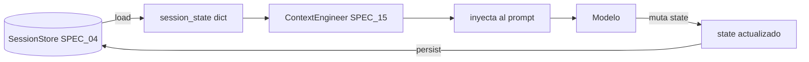
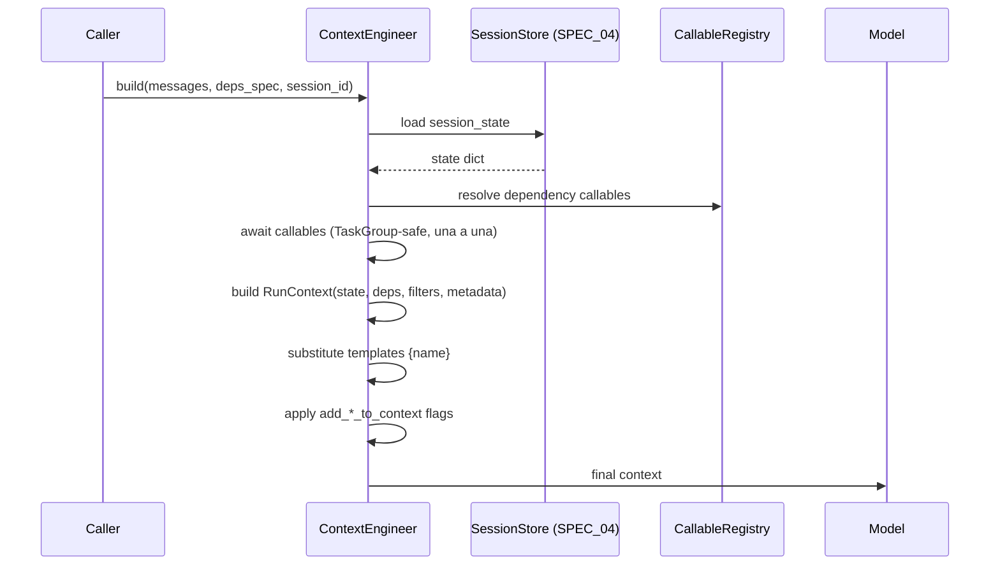
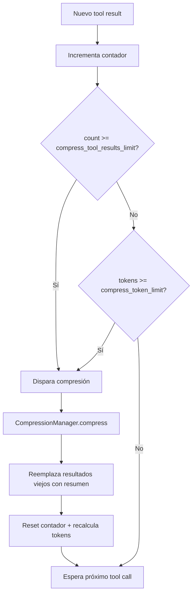
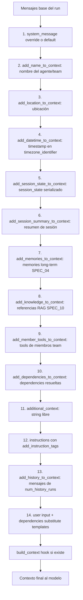

# SPEC_15_CONTEXT_ENGINEERING_AND_COMPRESSION

> **Propósito**: Define cómo yaml-agno construye y opera el contexto del prompt que se envía al modelo: todos los flags `add_*_to_context`, las `dependencies` con sustitución de templates, `session_state`, `RunContext`, el `additional_context`, y la OPERACIÓN de compresión (`CompressionManager`, `compress_tool_results`, `compress_token_limit`) movida desde SPEC_04 para mantener una frontera clara entre el MODELO de memoria (SPEC_04) y la OPERACIÓN de contexto (este SPEC).

---

## 1. ALCANCE Y FRONTERA (CRÍTICO)

### 1.1 Regla de oro: SPEC_04 vs SPEC_15

| Aspecto | SPEC_04 (MODELO de memoria) | SPEC_15 (OPERACIÓN de contexto) |
|---------|----------------------------|---------------------------------|
| Responsabilidad | QUÉ se guarda (capas session/working/long-term, Agno native) | QUÉ se carga al prompt y CÓMO se comprime |
| Componentes | SessionStore, WorkingMemory, Agno LearningMachine/MemoryManager | ContextBuilder, DependencyResolver, CompressionManager, TokenCounter |
| Compresión | NO (delegado aquí) | SÍ (dueño de `CompressionManager`, `compress_tool_results`) |
| `session_state` como dato | Define persistencia del estado | Define cómo se inyecta al prompt |
| PII sanitization | Referenciado | MOVIDO a SPEC_16 (guardrails) |
| `add_*_to_context` | NO | SÍ (todos los flags viven aquí) |

> **Decisión de arquitectura**: SPEC_04 originalmente contenía un `ContextCompressor` en `memory/compression.py` (TASK en líneas 673-698). Este SPEC LO MUEVE a `infra/context/compression.py`. SPEC_04 conserva solo el modelo de memoria; la operación de compresión vive aquí. La referencia cruzada es explícita.

### 1.2 Qué cubre este SPEC
- Todos los parámetros `add_*_to_context` de Agent, Team y WorkflowAgent.
- `dependencies` (dict, callables, sustitución de templates `{name}`).
- `additional_context` (string libre).
- `system_message` override y `build_context`.
- `session_state` (agent/team/workflow) y su persistencia de referencia.
- `RunContext` (session_state, dependencies, knowledge_filters, metadata).
- `CompressionManager` (dueño operativo: modelo, instrucciones, límites).
- `compress_tool_results`, `compress_tool_results_limit`, `compress_token_limit`.
- Token counting (`compression/token-counting`).
- Flujo de construcción de contexto (orden de inyección).

### 1.3 Qué NO cubre
| Tema | Dueño |
|------|-------|
| Agno LearningMachine/MemoryManager, capas session/working/long-term (qué se persiste) | SPEC_04 |
| PII sanitization en el contexto | SPEC_16 (guardrails) |
| Cache key del modelo (afectada por contexto dinámico) | SPEC_14 |
| Knowledge base retrieval (RAG) | SPEC_10 |
| Modelos de Agno / providers | SPEC_14 |

---

## 2. CONTEXT ENGINEERING: PARÁMETROS `add_*_to_context`

### 2.1 Catálogo completo de flags

yaml-agno expone TODOS los flags de context engineering de Agno. Cada uno controla qué se añade al prompt antes de enviarlo al modelo.

| Flag | Tipo | Default | Aplica a | Descripción |
|------|------|---------|----------|-------------|
| `add_history_to_context` | bool | true (con DB) | Agent, Team, Workflow | Incluye mensajes de runs previos en el contexto. |
| `num_history_runs` | int | 3 | Agent, Team, Workflow | Número de runs previos a incluir. |
| `read_chat_history` | bool | true | Agent | Lee el historial desde la DB antes del run. |
| `add_datetime_to_context` | bool | false | Agent, Team | Añade timestamp actual. Rompe cache del modelo. |
| `add_name_to_context` | bool | false | Agent, Team | Añade el nombre del agente/team. |
| `add_location_to_context` | bool | false | Agent, Team | Añade ubicación (location-aware). |
| `timezone_identifier` | str | none | Agent, Team | TZ DB identifier (ej. `America/Argentina/Buenos_Aires`). |
| `add_session_summary_to_context` | bool | false | Agent | Añade el resumen de sesión (session summaries). |
| `add_memories_to_context` | bool | true | Agent | Añade memories (long-term). `false` = recolecta sin inyectar. |
| `add_session_state_to_context` | bool | false | Agent, Team | Añade el `session_state` al contexto. |
| `add_dependencies_to_context` | bool | false | Agent, Team | Añade todas las dependencies al user message. |
| `add_member_tools_to_context` | bool | true | Team | Añade las tools de los miembros al contexto del team. |
| `add_knowledge_to_context` | bool | false | Agent, Team | Añade referencias RAG (knowledge base). |
| `add_instruction_tags` | bool | true | Agent, Team | Envuelve instructions en tags `<instructions>`. |
| `enable_agentic_knowledge_filters` | bool | false | Agent, Team | El agente infiere los knowledge filters del query. |

### 2.2 YAML schema (agent level)

```yaml
agent:
  name: "Researcher"
  context_engineering:
    add_history_to_context: true
    num_history_runs: 5
    read_chat_history: true
    add_datetime_to_context: true
    timezone_identifier: "America/Argentina/Buenos_Aires"
    add_name_to_context: true
    add_location_to_context: false
    add_session_summary_to_context: true
    add_memories_to_context: true
    add_session_state_to_context: true
    add_dependencies_to_context: true
    add_knowledge_to_context: true
    enable_agentic_knowledge_filters: true
    add_instruction_tags: false      # instructions as-is, sin XML tags
    additional_context: |
      The user prefers concise answers in Spanish (Rioplatense).
```

### 2.3 YAML schema (team level)

```yaml
team:
  context_engineering:
    add_history_to_context: true
    num_history_runs: 3
    add_datetime_to_context: true
    add_name_to_context: true
    add_member_tools_to_context: true
    add_session_state_to_context: true
    add_knowledge_to_context: true
```

### 2.4 YAML schema (workflow level)

```yaml
workflow:
  session_state:
    research_topic: "AI agents"
  context_engineering:
    add_history_to_context: true
    num_history_runs: 4         # WorkflowAgent ve 4 runs previos del workflow
```

> Fuente Agno: `WorkflowAgent(model=..., num_history_runs=4)`. El workflow agent necesita contexto de runs previos para decidir el próximo step.

### 2.5 Validaciones cruzadas

| Condición | Severidad | Mensaje |
|-----------|-----------|---------|
| `add_datetime_to_context=true` + modelo con `cache_response=true` | WARNING | "dynamic context (datetime) will rarely hit cache (SPEC_14)" |
| `num_history_runs > 10` | WARNING | "large history may overflow context; consider session summaries" |
| `add_memories_to_context=true` sin memoria configurada (SPEC_04) | ERROR | "add_memories_to_context requires memory layer (SPEC_04)" |
| `add_knowledge_to_context=true` sin knowledge base (SPEC_10) | ERROR | "requires knowledge base configuration (SPEC_10)" |
| `enable_agentic_knowledge_filters=true` sin `add_knowledge_to_context=true` | ERROR | "agentic filters require add_knowledge_to_context" |
| `timezone_identifier` inválido (no en TZ DB) | ERROR | "unknown timezone identifier" |

---

## 3. DEPENDENCIES

### 3.1 Concepto

`dependencies` es un dict de pares `name -> value_or_callable` que se hacen disponibles al agente. Pueden ser:
- **Valores estáticos**: strings, dicts, números.
- **Callables**: funciones sync o async que se evalúan al run.

Con `add_dependencies_to_context=true`, todas las dependencies resueltas se añaden al user message automáticamente.

### 3.2 Resolución de templates `{name}`

Instructions, additional_context y el input del usuario soportan sustitución de templates con `{dependency_name}`.

```yaml
agent:
  instructions: "You are a story writer. The current user is {name}."
  context_engineering:
    add_dependencies_to_context: true
  dependencies:
    name: "John Doe"        # valor estático
    user_profile: "myapp.deps.get_user_profile"   # callable path
```

Al run, `{name}` se sustituye por `"John Doe"` en las instructions. `{user_profile}` se resuelve llamando a `get_user_profile()`.

### 3.3 Callable resolution

Los callables se declaran como **paths importables** (strings) en YAML, nunca como funciones inline. yaml-agno los resuelve desde un registry (mismo mecanismo que tools, SPEC_11).

```python
# myapp/deps.py
def get_user_profile(run_context) -> dict:
    return {"id": run_context.user_id, "tier": "premium"}

async def get_top_hackernews_stories(run_context) -> list[str]:
    # callable async soportado
    ...
```

```yaml
dependencies:
  user_profile: "myapp.deps.get_user_profile"
  top_hackernews_stories: "myapp.deps.get_top_hackernews_stories"
```

### 3.4 Firma de callables

```python
# Sync
def dep_sync(run_context: RunContext) -> Any: ...

# Async
async def dep_async(run_context: RunContext) -> Any: ...
```

`RunContext` se inyecta automáticamente. yaml-agno detecta sync vs async y awaiting correctamente.

### 3.5 DependencyResolver

```python
import asyncio
from typing import Any

class DependencyResolver:
    """Resuelve el dict de dependencies, evaluando callables."""

    def __init__(self, registry: "CallableRegistry"):
        self._registry = registry

    async def resolve(self, deps: dict, run_context: "RunContext") -> dict[str, Any]:
        resolved: dict[str, Any] = {}
        for name, spec in deps.items():
            resolved[name] = await self._resolve_one(name, spec, run_context)
        return resolved

    async def _resolve_one(self, name, spec, run_context):
        if callable(spec):
            return await self._maybe_await(spec(run_context))
        if isinstance(spec, str) and self._registry.is_registered(spec):
            fn = self._registry.get(spec)
            return await self._maybe_await(fn(run_context))
        return spec  # valor estático

    @staticmethod
    async def _maybe_await(value):
        if asyncio.iscoroutine(value):
            return await value
        return value

    def substitute(self, template: str, resolved: dict[str, Any]) -> str:
        """Sustituye {key} en el template. KeyError si falta key."""
        return template.format_map(_SafeDict(resolved))
```

### 3.6 Template substitution segura

yaml-agno usa `str.format_map` con un dict que devuelve `{key}` literal si la key no existe (log WARNING), en vez de fallar. Esto evita que un template con llaves literales (ej. JSON en instructions) rompa el run.

```python
class _SafeDict(dict):
    def __missing__(self, key):
        log.warning("unresolved_dependency_template", extra={"key": key})
        return "{" + key + "}"
```

### 3.7 Comportamiento cuando una dependency callable falla

Si una dependency callable lanza:
- Si es requerida (default): el run falla con `DependencyResolutionError`.
- Si se declara `optional: true`: se sustituye por `None` y se loguea ERROR.

```yaml
dependencies:
  external_api:
    callable: "myapp.deps.fetch_external"
    optional: true      # falla graceful -> None
```

---

## 4. ADDITIONAL_CONTEXT Y SYSTEM_MESSAGE

### 4.1 additional_context

String libre que se inyecta al final del system prompt, antes de las instructions.

```yaml
agent:
  context_engineering:
    additional_context: |
      The user prefers concise answers.
      Today's product launch: Widget X.
```

Soporta sustitución de templates `{dependency_name}` como cualquier instructions.

### 4.2 system_message override

yaml-agno permite sobreescribir completamente el system message generado por Agno.

```yaml
agent:
  context_engineering:
    system_message: |
      You are {name}'s personal assistant.
      Follow these rules strictly.
```

Cuando se declara `system_message`, Agno NO genera su system message default; el override reemplaza. Las dependencies se sustituyen dentro del override.

### 4.3 build_context hook

Para casos donde la construcción del contexto requiere lógica custom, yaml-agno expone un hook:

```yaml
agent:
  context_engineering:
    build_context: "myapp.context.build_research_context"   # callable async
```

El callable recibe `(base_context: list[Message], run_context: RunContext)` y retorna la lista final de mensajes. Tiene precedencia sobre los flags individuales: si se declara, los flags se aplican primero y luego `build_context` puede transformar.

---

## 5. SESSION_STATE

### 5.1 Concepto

`session_state` es un dict de estado que persiste entre runs de la misma sesión (agent), entre members (team), o entre steps (workflow). No es memoria conversacional: es estado estructurado.

### 5.2 YAML (agent level)

```yaml
agent:
  session_state:
    research_topic: "AI agents"
    max_results: 10
    filters:
      language: "en"
```

### 5.3 YAML (team level)

El team state se comparte entre todos los miembros. Los miembros pueden leer y mutar.

```yaml
team:
  session_state:
    current_phase: "research"
    findings_count: 0
```

### 5.4 YAML (workflow level)

```yaml
workflow:
  session_state:
    research_topic: "AI agents"
    completed_steps: []
```

### 5.5 add_session_state_to_context

Cuando `add_session_state_to_context=true`, el `session_state` se serializa y se inyecta al contexto como bloque estructurado. yaml-agno lo formatea como JSON indentado o como bloque markdown configurable:

```yaml
agent:
  context_engineering:
    add_session_state_to_context: true
    session_state_format: json     # json | markdown (default json)
```

### 5.6 Persistencia (referencia a SPEC_04)

La PERSISTENCIA del session_state (cómo se guarda/recupera entre runs) es responsabilidad de SPEC_04 (SessionStore). Este SPEC solo define la INYECCIÓN al contexto. La frontera:



---

## 6. RUNCONTEXT

### 6.1 Estructura

`RunContext` es el objeto que se pasa a callables (dependencies, tools, build_context) con todo el contexto de ejecución.

```python
# @ai-directive: RunContext is IMPORTED from Agno (agno.run.base), never redefined.
# yaml-agno consumes it; Agno is the source of truth for its shape (which is richer
# than shown here: run_id, session_id, user_id, workflow_id, dependencies,
# knowledge_filters, metadata, session_state, output_schema, messages, tools, ...).
from agno.run.base import RunContext
```

### 6.2 Llenado del RunContext



### 6.3 knowledge_filters

Con `enable_agentic_knowledge_filters=true`, el agente infiere filtros de knowledge desde el query. yaml-agno expone esos filtros en `RunContext.knowledge_filters` para que tools y dependencies los usen.

```yaml
agent:
  context_engineering:
    add_knowledge_to_context: true
    enable_agentic_knowledge_filters: true
```

El detalle de cómo se infieren los filtros vive en SPEC_10 (Knowledge). Aquí solo se transportan en el RunContext.

---

## 7. COMPRESSIONMANAGER (CRÍTICO - DUEÑO OPERACIONAL)

### 7.1 Movimiento desde SPEC_04

SPEC_04 originalmente definía un `ContextCompressor` en `yaml-agno/src/memory/compression.py`. Por frontera arquitectónica, esa lógica operacional se MUEVE aquí:

| Antes (SPEC_04) | Ahora (SPEC_15) |
|-----------------|-----------------|
| `src/memory/compression.py` (`ContextCompressor`) | `src/infra/context/compression.py` (`CompressionManager`) |
| `should_compress(current_tokens)` | `should_compress(current_tokens, tool_call_count)` |
| `compress_history(messages)` | `compress(messages, run_context)` |
| `threshold_tokens` (único) | `compress_token_limit` + `compress_tool_results_limit` (dual) |

SPEC_04 conserva el `ContextCompressor` SOLO como referencia en el modelo de memoria (qué se descarta al persistir), pero la operación viva de compresión de tool results es SPEC_15.

### 7.2 Parámetros de compresión

| Parámetro | Tipo | Default | Descripción |
|-----------|------|---------|-------------|
| `compress_tool_results` | bool | false | Activa la compresión de resultados de tool calls. |
| `compress_tool_results_limit` | int \| None | 3 (si enabled) | N de resultados sin comprimir antes de disparar (count-based). |
| `compress_token_limit` | int \| None | none | Tokens antes de disparar (token-based). |
| `compress_tool_call_instructions` | str | default prompt | Prompt custom para el modelo de compresión. |

> Fuente Agno: `CompressionManager(model=..., compress_tool_results_limit=2, compress_tool_call_instructions="...")`.

### 7.3 CompressionManager YAML

```yaml
agent:
  compression:
    enabled: true                          # = compress_tool_results
    compress_tool_results_limit: 2         # count-based (default 3 si enabled)
    compress_token_limit: 5000             # token-based (opcional, coexiste)
    model: "groq:llama-3.3-70b-versatile"  # modelo más rápido/barato para comprimir
    instructions: |
      Summarize the tool results preserving: key facts, URLs, and any error messages.
      Discard: raw HTML, verbose logs, and duplicate content.
```

### 7.4 Model selection para compresión

Recomendación Agno: usar un modelo más rápido y barato (ej. `gpt-4o-mini`, Llama en Groq) para compresión, mientras el modelo principal del agente es más capaz. yaml-agno valida que el modelo de compresión soporte structured/text output.

```yaml
agent:
  model: "anthropic:claude-sonnet-4-5"     # principal, capaz
  compression:
    enabled: true
    model: "groq:llama-3.3-70b-versatile"  # compresión, rápido
```

### 7.5 Triggers duales (count-based + token-based)



Reglas:
- Si ninguno de los dos límites está set, `compress_tool_results_limit` default = 3.
- Si ambos están set, dispara con el que se cumpla primero (OR).
- El token counting incluye mensajes, tool definitions y output schemas.

### 7.6 CompressionManager implementation

```python
from typing import Any

class CompressionManager:
    """
    Dueño operacional de la compresión de contexto (movido desde SPEC_04).
    Comprime resultados de tool calls para mantener el contexto dentro de límites.
    """

    def __init__(
        self,
        model: Any,                                   # instancia de modelo (SPEC_14)
        compress_tool_results: bool = False,
        compress_tool_results_limit: int | None = None,
        compress_token_limit: int | None = None,
        compress_tool_call_instructions: str | None = None,
        token_counter: "TokenCounter | None" = None,
    ):
        if not compress_tool_results and (
            compress_tool_results_limit is None and compress_token_limit is None
        ):
            # sin nada set -> default count = 3
            compress_tool_results_limit = 3
        self.model = model
        self.enabled = compress_tool_results
        self.tool_results_limit = compress_tool_results_limit
        self.token_limit = compress_token_limit
        self.instructions = compress_tool_call_instructions or DEFAULT_COMPRESS_PROMPT
        self.token_counter = token_counter or TokenCounter()
        self._uncompressed_count = 0

    def should_compress(self, current_tokens: int) -> bool:
        if not self.enabled:
            return False
        if self.tool_results_limit is not None and self._uncompressed_count >= self.tool_results_limit:
            return True
        if self.token_limit is not None and current_tokens >= self.token_limit:
            return True
        return False

    async def compress(self, messages: list[dict], run_context) -> list[dict]:
        """Comprime los tool results viejos, preservando el más reciente."""
        if not self._has_tool_results(messages):
            return messages
        recent, to_compress = self._split_recent(messages)
        summary = await self._summarize(to_compress, run_context)
        self._uncompressed_count = 0
        return [{"role": "system", "content": summary}] + recent

    async def _summarize(self, tool_messages, run_context) -> str:
        # llama al modelo de compresión con self.instructions
        ...

    def register_tool_result(self):
        """Llamado tras cada tool result para incrementar el contador."""
        self._uncompressed_count += 1
```

### 7.7 DEFAULT_COMPRESS_PROMPT

```python
DEFAULT_COMPRESS_PROMPT = """\
Compress the following tool call results into a concise summary.
Preserve:
- Key facts and data points
- URLs and references
- Any error messages or warnings

Discard:
- Raw HTML or verbose logs
- Duplicate information
- Intermediate processing details

Return a structured summary that lets the agent continue its task effectively.
"""
```

---

## 8. TOKEN COUNTING

### 8.1 TokenCounter

> Fuente Agno: `compression/token-counting`. El conteo incluye messages, tool definitions y output schemas.

```python
class TokenCounter:
    """Estimación de tokens para decisions de compresión."""

    def __init__(self, encoding_name: str = "cl100k_base"):
        # lazy import tiktoken
        self._encoding_name = encoding_name
        self._enc = None

    def _ensure_encoding(self):
        if self._enc is None:
            import tiktoken
            self._enc = tiktoken.get_encoding(self._encoding_name)

    def count_messages(self, messages: list[dict]) -> int:
        self._ensure_encoding()
        total = 0
        for msg in messages:
            total += 4  # overhead por mensaje (role, delimiters)
            content = msg.get("content", "")
            if isinstance(content, str):
                total += len(self._enc.encode(content))
            elif isinstance(content, list):
                for part in content:
                    total += self.count_part(part)
        return total

    def count_part(self, part: Any) -> int:
        """Tokens of a single multimodal content part.

        Agno/LLM message `content` can be a list of parts (text, image, etc.).
        Text parts are encoded; non-text parts fall back to a char/4 estimate
        (image payloads carry no text tokens here).

        Args:
            part: A content part. A plain string, or a dict with a ``text`` key
                (OpenAI-style ``{"type": "text", "text": "..."}``).

        Returns:
            Estimated token count for the part.
        """
        if isinstance(part, str):
            self._ensure_encoding()
            return len(self._enc.encode(part))
        if isinstance(part, dict):
            text = part.get("text")
            if isinstance(text, str):
                self._ensure_encoding()
                return len(self._enc.encode(text))
            # Non-text part (image_url, input_audio, file, ...): approximate.
            return max(1, len(str(part)) // 4)
        return max(1, len(str(part)) // 4)

    def count_tools(self, tool_defs: list[dict]) -> int:
        """Tokens de las definiciones de tools (JSON schema)."""
        import json
        self._ensure_encoding()
        return sum(len(self._enc.encode(json.dumps(t))) for t in tool_defs)

    def count_schema(self, schema: dict) -> int:
        import json
        self._ensure_encoding()
        return len(self._enc.encode(json.dumps(schema)))
```

### 8.2 Total context tokens

```python
def total_context_tokens(
    messages: list[dict],
    tool_defs: list[dict],
    output_schema: dict | None,
) -> int:
    tc = TokenCounter()
    total = tc.count_messages(messages)
    total += tc.count_tools(tool_defs)
    if output_schema:
        total += tc.count_schema(output_schema)
    return total
```

### 8.3 Encoding por provider

Diferentes providers usan tokenizers distintos. yaml-agno usa `cl100k_base` como default (OpenAI-compatible). Para Anthropic/Gemini, la estimación es aproximada. El validador emite INFO cuando el provider no es OpenAI indicando que el conteo es estimado.

```yaml
agent:
  compression:
    token_counter_encoding: cl100k_base   # default; cl100k_base | p50k_base | ...
```

---

## 9. CONTEXTO BUILD FLOW (ORDEN DE INYECCIÓN)

### 9.1 Orden determinista

yaml-agno aplica los flags en un orden fijo para garantizar reproducibilidad y facilitar debugging.



### 9.2 Justificación del orden

1. **Identidad primero** (name, location, datetime): el modelo sabe quién/cuándo/dónde antes que nada.
2. **Estado estructurado** (session_state, summaries, memories): contexto estable.
3. **Conocimiento** (knowledge RAG): datos externos relevantes.
4. **Tools** (member tools): capacidades disponibles.
5. **Dependencies**: datos dinámicos resueltos.
6. **Instructions**: la guía operacional, al final del system block.
7. **Historial**: mensajes previos justo antes del input actual.
8. **Input**: el mensaje del usuario, con templates sustituidos.

### 9.3 ContextEngineer

```python
class ContextEngineer:
    """Orquesta la construcción del contexto según los flags."""

    def __init__(
        self,
        spec: ContextEngineeringSpec,
        dependency_resolver: DependencyResolver,
        session_store: "SessionStore",          # SPEC_04
        memory_manager: "MemoryManager | None",  # SPEC_04 (Agno native)
        knowledge_retriever: "KnowledgeRetriever | None",  # SPEC_10
        token_counter: TokenCounter,
    ):
        self.spec = spec
        self.deps = dependency_resolver
        self.store = session_store
        self.memory = memory_manager              # Agno MemoryManager/UserMemory
        self.knowledge = knowledge_retriever
        self.tokens = token_counter

    async def build(self, base_messages, run_context) -> list[dict]:
        ctx = list(base_messages)
        resolved_deps = await self.deps.resolve(run_context.dependencies, run_context)

        # pasos 1-12 en orden
        if self.spec.system_message:
            ctx = self._override_system(ctx, self.spec.system_message, resolved_deps)
        if self.spec.add_name_to_context:
            ctx = self._inject_name(ctx, run_context)
        if self.spec.add_location_to_context:
            ctx = self._inject_location(ctx, run_context)
        if self.spec.add_datetime_to_context:
            ctx = self._inject_datetime(ctx, self.spec.timezone_identifier)
        if self.spec.add_session_state_to_context:
            ctx = self._inject_session_state(ctx, run_context.session_state,
                                             self.spec.session_state_format)
        if self.spec.add_session_summary_to_context:
            ctx = self._inject_summary(ctx, run_context)
        if self.spec.add_memories_to_context and self.memory:
            ctx = await self._inject_memories(ctx, run_context)
        if self.spec.add_knowledge_to_context and self.knowledge:
            ctx = await self._inject_knowledge(ctx, run_context)
        if self.spec.add_member_tools_to_context and run_context.team_name:
            ctx = self._inject_member_tools(ctx, run_context)
        if self.spec.add_dependencies_to_context:
            ctx = self._inject_dependencies(ctx, resolved_deps)
        if self.spec.additional_context:
            ctx = self._inject_additional(ctx, self.spec.additional_context, resolved_deps)
        ctx = self._apply_instructions(ctx, self.spec, resolved_deps)
        if self.spec.add_history_to_context:
            ctx = self._inject_history(ctx, run_context, self.spec.num_history_runs)
        ctx = self._finalize_user_input(ctx, resolved_deps)

        if self.spec.build_context:
            builder = self._registry.get(self.spec.build_context)
            ctx = await builder(ctx, run_context)
        return ctx
```

### 9.4 Flags individuales vs build_context

`build_context` es el escape hatch: si se declara, corre DESPUÉS de los flags individuales y puede transformar el contexto resultante. No reemplaza los flags; los complementa. Esto permite lógica custom sin perder la conveniencia declarativa.

---

## 10. YAML SCHEMA COMPLETO (PYDANTIC V2)

### 10.1 ContextEngineeringSpec

```python
from typing import Literal
from pydantic import BaseModel, Field, model_validator

class ContextEngineeringSpec(BaseModel):
    # Historial
    add_history_to_context: bool = True
    num_history_runs: int = Field(default=3, ge=0, le=50)
    read_chat_history: bool = True

    # Identidad / tiempo / lugar
    add_datetime_to_context: bool = False
    add_name_to_context: bool = False
    add_location_to_context: bool = False
    timezone_identifier: str | None = None

    # Memoria y estado
    add_session_summary_to_context: bool = False
    add_memories_to_context: bool = True
    add_session_state_to_context: bool = False
    session_state_format: Literal["json", "markdown"] = "json"

    # Dependencies, tools, knowledge
    add_dependencies_to_context: bool = False
    add_member_tools_to_context: bool = True
    add_knowledge_to_context: bool = False
    enable_agentic_knowledge_filters: bool = False

    # Instructions
    add_instruction_tags: bool = True
    additional_context: str | None = None
    system_message: str | None = None
    build_context: str | None = None

    @model_validator(mode="after")
    def _cross_validate(self):
        import zoneinfo
        if self.timezone_identifier is not None:
            try:
                zoneinfo.ZoneInfo(self.timezone_identifier)
            except Exception:
                raise ValueError(f"unknown timezone_identifier {self.timezone_identifier!r}")
        if self.enable_agentic_knowledge_filters and not self.add_knowledge_to_context:
            raise ValueError("enable_agentic_knowledge_filters requires add_knowledge_to_context")
        return self
```

### 10.2 CompressionSpec

```python
class CompressionSpec(BaseModel):
    enabled: bool = False
    compress_tool_results_limit: int | None = Field(default=None, ge=1)
    compress_token_limit: int | None = Field(default=None, ge=100)
    model: str | None = None          # model-as-string (SPEC_14) para compresión
    instructions: str | None = None
    token_counter_encoding: str = "cl100k_base"

    @model_validator(mode="after")
    def _validate(self):
        if self.enabled and self.model is None:
            raise ValueError("compression.enabled requires a compression model")
        return self
```

### 10.3 AgentContextBlock (top-level en agent YAML)

```python
class AgentContextBlock(BaseModel):
    context_engineering: ContextEngineeringSpec = Field(default_factory=ContextEngineeringSpec)
    compression: CompressionSpec = Field(default_factory=CompressionSpec)
    dependencies: dict[str, Any] = Field(default_factory=dict)
    session_state: dict[str, Any] = Field(default_factory=dict)
```

---

## 11. SUPUESTOS TÉCNICOS ADOPTADOS

1. **Frontera estricta SPEC_04/SPEC_15**: el modelo de memoria (qué se guarda) es SPEC_04; la operación de contexto (qué se carga + compresión) es SPEC_15. La migración del `ContextCompressor` de `memory/compression.py` a `infra/context/compression.py` es obligatoria.
2. **PII sanitization NO va aquí**: se mueve a SPEC_16 (guardrails). El ContextEngineer no hace sanitization; los guardrails corren como un wrapper alrededor del contexto ya construido.
3. **Dependencies como paths importables**: nunca funciones inline en YAML. Resueltas desde CallableRegistry (mismo patrón que tools, SPEC_11).
4. **Template substitution segura**: `{key}` faltante NO rompe el run; se loguea y se deja literal.
5. **Orden de inyección es determinista y documentado** (sección 9). Cambiar el orden es breaking change.
6. **TokenCounter usa tiktoken con `cl100k_base`** default. Estimación aproximada para no-OpenAI providers (INFO log).
7. **Compresión es lazy**: solo dispara cuando un threshold se cumple. No pre-comprime al boot.
8. **`build_context` hook corre al final**, post-flags, y puede transformar el contexto completo.
9. **`session_state` inyección es JSON por default**; markdown como opción. La persistencia es SPEC_04.
10. **asyncio.TaskGroup** si se resuelven dependencies en paralelo (raro, pero soportado). Default: resolución secuencial para preservar orden de side effects.

---

## 12. BEHAVIOR DELTA - BDD SCENARIOS

### 12.1 Dependencies

#### Scenario 1: Template substitution con valor estático
```gherkin
GIVEN un agent con instructions "Hello {name}"
AND dependencies name="John Doe"
WHEN el DependencyResolver resuelve y sustituye
THEN las instructions se convierten en "Hello John Doe"
```

#### Scenario 2: Callable dependency se evalúa
```gherkin
GIVEN dependencies user_profile="myapp.deps.get_user_profile"
AND get_user_profile es una función async que retorna {"tier": "premium"}
WHEN se resuelve la dependency con un RunContext
THEN el valor resuelto es {"tier": "premium"}
AND la función fue awaited correctamente
```

#### Scenario 3: Template con key faltante no rompe
```gherkin
GIVEN instructions "Hello {missing_key}"
AND dependencies sin la key "missing_key"
WHEN se sustituye el template
THEN el resultado contiene literalmente "{missing_key}"
AND se loguea un WARNING "unresolved_dependency_template"
```

#### Scenario 4: Callable dependency optional que falla graceful
```gherkin
GIVEN dependencies external_api con optional=true
AND el callable fetch_external lanza ConnectionError
WHEN se resuelve
THEN el valor resuelto es None
AND se loguea ERROR pero el run continúa
```

#### Scenario 5: Callable dependency required que falla aborta run
```gherkin
GIVEN dependencies critical_data (no optional)
AND el callable lanza
WHEN se resuelve
THEN se lanza DependencyResolutionError
AND el run aborta
```

### 12.2 Context Ordering

#### Scenario 6: add_datetime_to_context inyecta timestamp en timezone
```gherkin
GIVEN add_datetime_to_context=true
AND timezone_identifier="America/Argentina/Buenos_Aires"
WHEN se construye el contexto a las 14:00 UTC
THEN el contexto contiene el timestamp en horario de Buenos Aires
```

#### Scenario 7: add_session_state_to_context serializa como JSON
```gherkin
GIVEN add_session_state_to_context=true
AND session_state_format=json
AND session_state={"topic": "AI", "count": 3}
WHEN se inyecta
THEN el contexto contiene un bloque con el JSON indentado de session_state
```

#### Scenario 8: add_member_tools_to_context solo aplica en team
```gherkin
GIVEN un agent (no team) con add_member_tools_to_context=true
WHEN se construye el contexto
THEN no hay inyección de member tools (no aplica a agentes standalone)
AND se loguea INFO "flag ignored for standalone agent"
```

#### Scenario 9: Orden de inyección respeta la secuencia
```gherkin
GIVEN todos los flags add_*=true
WHEN se construye el contexto
THEN el system block contiene los elementos en el orden: name, location, datetime, session_state, summary, memories, knowledge, member_tools, dependencies, additional_context, instructions
```

### 12.3 Compression

#### Scenario 10: Compress por count-based trigger
```gherkin
GIVEN compression.enabled=true
AND compress_tool_results_limit=2
WHEN se acumulan 2 tool results sin comprimir
THEN el siguiente tool result dispara la compresión
AND los 2 resultados viejos se reemplazan por un resumen
AND el contador se resetea
```

#### Scenario 11: Compress por token-based trigger
```gherkin
GIVEN compression.enabled=true
AND compress_token_limit=5000
AND compress_tool_results_limit=None
WHEN el contexto supera 5000 tokens
THEN se dispara la compresión
AND los tool results viejos se resumen
```

#### Scenario 12: Ningún límite set -> default count=3
```gherkin
GIVEN compression.enabled=true sin límites explícitos
WHEN se acumulan 3 tool results
THEN se dispara la compresión (default limit=3)
```

#### Scenario 13: Compresión usa modelo más rápido
```gherkin
GIVEN agent.model="anthropic:claude-sonnet-4-5"
AND compression.model="groq:llama-3.3-70b-versatile"
WHEN se dispara la compresión
THEN el resumen lo genera el modelo de Groq (no el principal)
AND se reducen latencia y costo
```

#### Scenario 14: Sin tool results no comprime
```gherkin
GIVEN compression.enabled=true
AND un run sin tool calls
WHEN se construye el contexto
THEN no se dispara compresión
AND el contexto se pasa intacto al modelo
```

### 12.4 Token Counting

#### Scenario 15: Conteo incluye tools y schema
```gherkin
GIVEN messages con 100 tokens
AND tool definitions con 50 tokens
AND output schema con 20 tokens
WHEN TokenCounter.total_context_tokens()
THEN retorna 170
```

#### Scenario 16: Provider no-OpenAI loguea estimación
```gherkin
GIVEN model.provider="anthropic"
WHEN se inicializa el TokenCounter con cl100k_base
THEN se loguea INFO "token count is estimated for non-OpenAI provider"
```

### 12.5 build_context hook

#### Scenario 17: build_context transforma el contexto
```gherkin
GIVEN build_context="myapp.context.custom_build"
AND flags add_*=true ya aplicados
WHEN se construye el contexto
THEN los flags se aplican primero
Y LUEGO custom_build transforma el resultado
AND el contexto final es lo que custom_build retorna
```

---

## 13. TDD MICRO-TASK EXECUTION PROTOCOL

> **Strict TDD**: RED -> GREEN -> REFACTOR. Commit por tarea. `asyncio.TaskGroup` (no gather).

### TASK_001: Migrar ContextCompressor desde SPEC_04
- **File**: `src/yaml_agno/infra/context/compression.py` (nuevo)
- **Test**: `tests/infra/context/test_compression.py`
- **RED**:
```python
from yaml_agno.infra.context.compression import CompressionManager

def test_should_compress_count_based():
    cm = CompressionManager(model=FakeModel(), compress_tool_results=True,
                            compress_tool_results_limit=2)
    cm._uncompressed_count = 2
    assert cm.should_compress(current_tokens=100) is True

def test_should_not_compress_below_limit():
    cm = CompressionManager(model=FakeModel(), compress_tool_results=True,
                            compress_tool_results_limit=3)
    cm._uncompressed_count = 1
    assert cm.should_compress(current_tokens=100) is False

def test_should_compress_token_based():
    cm = CompressionManager(model=FakeModel(), compress_tool_results=True,
                            compress_token_limit=5000)
    assert cm.should_compress(current_tokens=5001) is True
    assert cm.should_compress(current_tokens=4999) is False

def test_default_limit_3_when_nothing_set():
    cm = CompressionManager(model=FakeModel(), compress_tool_results=True)
    assert cm.tool_results_limit == 3

def test_disabled_never_compresses():
    cm = CompressionManager(model=FakeModel(), compress_tool_results=False)
    assert cm.should_compress(current_tokens=99999) is False
```
- **GREEN**: Implementar `CompressionManager` (sección 7.6). Mover lógica de `memory/compression.py` (SPEC_04) aquí. Marcar el archivo viejo como deprecated con redirect.
- **Commit**: `refactor(context): move CompressionManager from memory (SPEC_04) to context (SPEC_15)`

### TASK_002: TokenCounter
- **File**: `src/yaml_agno/infra/context/tokens.py`
- **Test**: `tests/infra/context/test_tokens.py`
- **RED**:
```python
from yaml_agno.infra.context.tokens import TokenCounter

def test_count_string_message():
    tc = TokenCounter()
    n = tc.count_messages([{"role": "user", "content": "hello world"}])
    assert n > 0

def test_count_includes_overhead():
    tc = TokenCounter()
    short = tc.count_messages([{"role": "user", "content": "a"}])
    assert short >= 5   # 4 overhead + al menos 1 token

def test_count_tools():
    tc = TokenCounter()
    n = tc.count_tools([{"name": "search", "description": "search the web"}])
    assert n > 0

def test_total_context_tokens():
    from yaml_agno.infra.context.tokens import total_context_tokens
    n = total_context_tokens(
        messages=[{"role": "user", "content": "hi"}],
        tool_defs=[{"name": "t"}],
        output_schema={"type": "object"},
    )
    assert n > 0
```
- **GREEN**: Implementar `TokenCounter` con tiktoken lazy import (sección 8).
- **Commit**: `feat(context): add TokenCounter with tiktoken-based estimation`

### TASK_003: DependencyResolver
- **File**: `src/yaml_agno/domain/context/dependencies.py`
- **Test**: `tests/domain/context/test_dependencies.py`
- **RED**:
```python
import pytest
from yaml_agno.domain.context.dependencies import DependencyResolver, _SafeDict

def test_resolve_static_value():
    r = DependencyResolver(registry=FakeRegistry())
    resolved = await_(r.resolve({"name": "John"}, run_ctx=None))
    assert resolved["name"] == "John"

def test_resolve_callable_sync():
    reg = FakeRegistry({"my.fn": lambda ctx: 42})
    r = DependencyResolver(reg)
    resolved = await_(r.resolve({"x": "my.fn"}, None))
    assert resolved["x"] == 42

@pytest.mark.asyncio
async def test_resolve_callable_async():
    async def fn(ctx): return "async-result"
    reg = FakeRegistry({"my.fn": fn})
    r = DependencyResolver(reg)
    resolved = await r.resolve({"x": "my.fn"}, None)
    assert resolved["x"] == "async-result"

def test_substitute_template():
    r = DependencyResolver(FakeRegistry())
    out = r.substitute("Hello {name}", {"name": "John"})
    assert out == "Hello John"

def test_substitute_missing_key_kept_literal():
    r = DependencyResolver(FakeRegistry())
    out = r.substitute("Hello {missing}", {})
    assert "{missing}" in out
```
- **GREEN**: Implementar `DependencyResolver` y `_SafeDict` (sección 3.5-3.6).
- **Commit**: `feat(context): add DependencyResolver with template substitution`

### TASK_004: Optional dependency graceful failure
- **File**: `src/yaml_agno/domain/context/dependencies.py`
- **Test**: `tests/domain/context/test_dependencies.py::test_optional_dependency_failure`
- **RED**:
```python
@pytest.mark.asyncio
async def test_optional_dependency_failure_returns_none():
    def boom(ctx): raise ConnectionError("down")
    reg = FakeRegistry({"ext": boom})
    r = DependencyResolver(reg)
    resolved = await r.resolve({"ext": {"callable": "ext", "optional": True}}, None)
    assert resolved["ext"] is None

@pytest.mark.asyncio
async def test_required_dependency_failure_raises():
    def boom(ctx): raise ConnectionError("down")
    reg = FakeRegistry({"ext": boom})
    r = DependencyResolver(reg)
    from yaml_agno.domain.context.errors import DependencyResolutionError
    with pytest.raises(DependencyResolutionError):
        await r.resolve({"ext": {"callable": "ext", "optional": False}}, None)
```
- **GREEN**: Añadir soporte de `optional` en `_resolve_one` con try/except.
- **Commit**: `feat(context): support optional dependencies with graceful failure`

### TASK_005: ContextEngineeringSpec con validación cruzada
- **File**: `src/yaml_agno/domain/context/spec.py`
- **Test**: `tests/domain/context/test_spec.py`
- **RED**:
```python
import pytest
from yaml_agno.domain.context.spec import ContextEngineeringSpec

def test_default_values():
    s = ContextEngineeringSpec()
    assert s.add_history_to_context is True
    assert s.num_history_runs == 3

def test_num_history_runs_bounds():
    with pytest.raises(Exception):
        ContextEngineeringSpec(num_history_runs=51)

def test_invalid_timezone():
    with pytest.raises(Exception):
        ContextEngineeringSpec(add_datetime_to_context=True,
                               timezone_identifier="Not/A_Real_Zone")

def test_valid_timezone():
    s = ContextEngineeringSpec(timezone_identifier="America/Argentina/Buenos_Aires")
    assert s.timezone_identifier == "America/Argentina/Buenos_Aires"

def test_agentic_filters_require_knowledge():
    with pytest.raises(Exception):
        ContextEngineeringSpec(enable_agentic_knowledge_filters=True,
                               add_knowledge_to_context=False)
```
- **GREEN**: Implementar `ContextEngineeringSpec` con `model_validator` (sección 10.1) usando `zoneinfo`.
- **Commit**: `feat(context): add ContextEngineeringSpec with cross-field validation`

### TASK_006: CompressionSpec
- **File**: `src/yaml_agno/domain/context/spec.py`
- **Test**: `tests/domain/context/test_spec.py::test_compression_spec`
- **RED**:
```python
import pytest
from yaml_agno.domain.context.spec import CompressionSpec

def test_enabled_requires_model():
    with pytest.raises(Exception):
        CompressionSpec(enabled=True, model=None)

def test_valid_with_model():
    s = CompressionSpec(enabled=True, model="groq:llama-3.3-70b-versatile")
    assert s.enabled is True

def test_disabled_without_model_ok():
    s = CompressionSpec(enabled=False)
    assert s.enabled is False
```
- **GREEN**: Implementar `CompressionSpec` con `model_validator` (sección 10.2).
- **Commit**: `feat(context): add CompressionSpec with model requirement`

### TASK_007: ContextEngineer build (orden de inyección)
- **File**: `src/yaml_agno/infra/context/engineer.py`
- **Test**: `tests/infra/context/test_engineer.py::test_injection_order`
- **RED**:
```python
import pytest
from unittest.mock import AsyncMock, MagicMock
from yaml_agno.infra.context.engineer import ContextEngineer
from yaml_agno.domain.context.spec import ContextEngineeringSpec

@pytest.mark.asyncio
async def test_injects_name_then_datetime_order():
    spec = ContextEngineeringSpec(add_name_to_context=True,
                                  add_datetime_to_context=True,
                                  timezone_identifier="UTC")
    engineer = ContextEngineer(spec, dep_resolver=MagicMock(),
                               session_store=MagicMock(),
                               memory_manager=None, knowledge_retriever=None,
                               token_counter=MagicMock())
    engineer._registry = MagicMock()
    ctx = await engineer.build(base_messages=[], run_context=fake_rc())
    # name debe aparecer antes que datetime en el system block
    name_idx = find_in_system(ctx, "name")
    dt_idx = find_in_system(ctx, "datetime")
    assert name_idx < dt_idx

@pytest.mark.asyncio
async def test_system_message_override_replaces_default():
    spec = ContextEngineeringSpec(system_message="Custom {name}")
    ...
```
- **GREEN**: Implementar `ContextEngineer.build` con los pasos 1-14 en orden (sección 9.3).
- **Commit**: `feat(context): add ContextEngineer with deterministic injection order`

### TASK_008: Session state injection (JSON/markdown)
- **File**: `src/yaml_agno/infra/context/engineer.py`
- **Test**: `tests/infra/context/test_engineer.py::test_session_state_format`
- **RED**:
```python
def test_session_state_json():
    block = inject_session_state({"topic": "AI"}, fmt="json")
    assert '"topic"' in block and "AI" in block

def test_session_state_markdown():
    block = inject_session_state({"topic": "AI", "count": 3}, fmt="markdown")
    assert "topic" in block and "AI" in block
    assert "- " in block or ":" in block   # formato markdown
```
- **GREEN**: Implementar `_inject_session_state` con json.dumps / formatter markdown.
- **Commit**: `feat(context): add session_state injection with json/markdown formats`

### TASK_009: build_context hook
- **File**: `src/yaml_agno/infra/context/engineer.py`
- **Test**: `tests/infra/context/test_engineer.py::test_build_context_hook`
- **RED**:
```python
@pytest.mark.asyncio
async def test_build_context_runs_after_flags():
    builder = AsyncMock(return_value=[{"role": "user", "content": "transformed"}])
    spec = ContextEngineeringSpec(add_name_to_context=True,
                                  build_context="myapp.ctx.build")
    engineer = ContextEngineer(spec, ...)
    engineer._registry = MagicMock()
    engineer._registry.get.return_value = builder
    ctx = await engineer.build([], fake_rc())
    assert builder.await_count == 1
    assert ctx == [{"role": "user", "content": "transformed"}]
```
- **GREEN**: Implementar el hook `build_context` al final de `build`.
- **Commit**: `feat(context): add build_context hook running after injection flags`

### TASK_010: Compresión async con TaskGroup-safe summarization
- **File**: `src/yaml_agno/infra/context/compression.py`
- **Test**: `tests/infra/context/test_compression.py::test_compress_replaces_old_results`
- **RED**:
```python
import pytest
from unittest.mock import AsyncMock
from yaml_agno.infra.context.compression import CompressionManager

@pytest.mark.asyncio
async def test_compress_replaces_old_results():
    model = AsyncMock()
    model.arun.return_value = "SUMMARY"
    cm = CompressionManager(model=model, compress_tool_results=True,
                            compress_tool_results_limit=2)
    messages = [
        {"role": "tool", "content": "result-1"},
        {"role": "tool", "content": "result-2"},
        {"role": "tool", "content": "result-3"},  # más reciente
    ]
    out = await cm.compress(messages, run_context=None)
    # el más reciente se preserva, los viejos se reemplazan por summary
    assert any("SUMMARY" in str(m.get("content", "")) for m in out)
    assert out[-1]["content"] == "result-3"

@pytest.mark.asyncio
async def test_compress_no_tool_results_returns_unchanged():
    cm = CompressionManager(model=AsyncMock(), compress_tool_results=True)
    msgs = [{"role": "user", "content": "hi"}]
    out = await cm.compress(msgs, None)
    assert out == msgs
```
- **GREEN**: Implementar `compress` con `_split_recent` y `_summarize` (sección 7.6).
- **Commit**: `feat(context): implement compression with recent-preservation and async summary`

### TASK_011: Cache interaction warning (con SPEC_14)
- **File**: `src/yaml_agno/domain/context/spec.py`
- **Test**: `tests/domain/context/test_spec.py::test_dynamic_context_cache_warning`
- **RED**:
```python
from yaml_agno.domain.context.spec import check_cache_compat

def test_datetime_breaks_cache_warns():
    issues = check_cache_compat(add_datetime_to_context=True, cache_response=True)
    assert any("dynamic context" in i for i in issues)

def test_no_warning_when_cache_off():
    issues = check_cache_compat(add_datetime_to_context=True, cache_response=False)
    assert issues == []
```
- **GREEN**: Implementar `check_cache_compat` que referencia SPEC_14 CacheManager.
- **Commit**: `feat(context): add cache compat checks for dynamic context flags`

### TASK_012: TokenCounter provider-aware estimation log
- **File**: `src/yaml_agno/infra/context/tokens.py`
- **Test**: `tests/infra/context/test_tokens.py::test_non_openai_logs_info`
- **RED**:
```python
def test_non_openai_logs_info(caplog):
    tc = TokenCounter()
    tc.warn_if_estimated(provider="anthropic")
    assert any("estimated" in r.message.lower() for r in caplog.records)

def test_openai_no_warning(caplog):
    tc = TokenCounter()
    tc.warn_if_estimated(provider="openai_chat")
    assert not any("estimated" in r.message.lower() for r in caplog.records)
```
- **GREEN**: Añadir `warn_if_estimated` con set de providers OpenAI-compatibles.
- **Commit**: `feat(context): log estimation warning for non-OpenAI providers`

### TASK_013: Knowledge injection integration (con SPEC_10, mock)
- **File**: `src/yaml_agno/infra/context/engineer.py`
- **Test**: `tests/infra/context/test_engineer.py::test_knowledge_injection`
- **RED**:
```python
@pytest.mark.asyncio
async def test_knowledge_injection():
    retriever = AsyncMock()
    retriever.retrieve.return_value = ["doc-1", "doc-2"]
    spec = ContextEngineeringSpec(add_knowledge_to_context=True)
    engineer = ContextEngineer(spec, ..., knowledge_retriever=retriever)
    ctx = await engineer.build([], fake_rc())
    assert retriever.retrieve.await_count == 1
    assert any("doc-1" in str(m.get("content","")) for m in ctx)
```
- **GREEN**: Implementar `_inject_knowledge` llamando al retriever (SPEC_10 contract).
- **Commit**: `feat(context): integrate knowledge retrieval injection (SPEC_10)`

### TASK_014: RunContext dataclass
- **File**: `src/yaml_agno/domain/context/run_context.py`
- **Test**: `tests/domain/context/test_run_context.py`
- **RED**:
```python
from yaml_agno.domain.context.run_context import RunContext

def test_defaults():
    rc = RunContext(session_id="s1", user_id="u1", run_id="r1")
    assert rc.session_state == {}
    assert rc.dependencies == {}
    assert rc.knowledge_filters == {}
    assert rc.metadata == {}

def test_carries_state():
    rc = RunContext(session_id="s1", user_id="u1", run_id="r1",
                    session_state={"topic": "AI"}, dependencies={"name": "J"})
    assert rc.session_state["topic"] == "AI"
    assert rc.dependencies["name"] == "J"
```
- **GREEN**: Implementar `RunContext` dataclass (sección 6.1).
- **Commit**: `feat(context): add RunContext dataclass for execution context`

### TASK_015: Deprecation redirect en memory/compression.py
- **File**: `src/yaml_agno/memory/compression.py` (modificar existente de SPEC_04)
- **Test**: `tests/memory/test_compression_deprecated.py`
- **RED**:
```python
import warnings
def test_old_import_emits_deprecation():
    with warnings.catch_warnings(record=True) as w:
        warnings.simplefilter("always")
        from yaml_agno.memory.compression import ContextCompressor  # old
        assert any(issubclass(x.category, DeprecationWarning) for x in w)
```
- **GREEN**: Reemplazar `memory/compression.py` con un shim que importe desde `infra/context/compression.py` y emita DeprecationWarning. Documentar la migración SPEC_04 -> SPEC_15.
- **Commit**: `refactor(context): deprecate memory.ContextCompressor, redirect to infra.context.CompressionManager`

---

## 14. PREGUNTAS DE CALIBRACIÓN ESTRATÉGICA

1. **Modelo de compresión default**: si `compression.model` no se declara, ¿yaml-agno usa el modelo principal del agente, o requiere declaración explícita? Recomendaría requerirla (validador ERROR) para forzar la decisión consciente de costo.
2. **Resolución de dependencies paralela**: ¿se resuelven secuencialmente (preserva side effects) o en paralelo con TaskGroup (más rápido)? Default secuencial; flag `parallel_deps: true` opt-in.
3. **`build_context` vs flags individuales**: ¿qué gana si hay conflicto? Decisión actual: build_context corre al final y puede sobreescribir. ¿Es eso lo más seguro o debería limitarse a añadir?
4. **session_state formato**: ¿JSON siempre, o markdown para modelos que rinden mejor con texto plano (Llama)? Default JSON; configurable.
5. **PII sanitization timing**: SPEC_16 corre como guardrail. ¿Antes o después del ContextEngineer? Si después, el contexto ya está completo para inspección. ¿Antes, para no loguear PII en traces?
6. **TokenCounter sin tiktoken**: si tiktoken no está instalado, ¿fallback a estimación por chars/4? Riesgo de compresión prematura/tardía.
7. **`num_history_runs` grande + sesión larga**: ¿se combina automáticamente con session summaries para evitar overflow, o es responsabilidad del usuario? Validador solo advierte.
8. **[RESUELTA] Compresión de historial vs tool results**: este SPEC comprime tool results. La compresión del historial conversacional, ¿es SPEC_04 (modelo de memoria) o SPEC_15? Clarificar frontera. **Decisión adoptada** (sección de decisión de arquitectura): la operación de compresión (incluido `compress_history`) vive en SPEC_15 (`infra/context/compression.py`); SPEC_04 conserva solo el modelo de memoria (qué se persiste).
9. **Dependencies mutables en team**: si dos miembros mutan la misma dependency callable, ¿hay race condition? ¿Se resuelve una sola vez por run y se cachea en RunContext?
10. **`add_memories_to_context=false`**: recolecta sin inyectar. ¿La recolección es fire-and-forget (asyncio.TaskGroup sin await) o blocking? Impacta latencia de run.

---

## 15. REFERENCIAS

- Agno docs: `dependencies/overview`, `compression/overview`, `compression/token-counting`, `state/overview`, parámetros `add_*_to_context` en Agent/Team reference.
- SPEC_02 (Domain Model): RunContext en el dominio.
- SPEC_04 (Memory Architecture): modelo de memoria (qué se persiste); PII referenciado a SPEC_16.
- SPEC_08 (TDD Microtasks): convenciones de test.
- SPEC_10 (Knowledge & RAG): `add_knowledge_to_context`, knowledge_filters.
- SPEC_14 (Model Resilience): modelo de compresión, interacción cache/context.
- SPEC_16 (HITL, Approvals & Guardrails): PII sanitization como guardrail.
```
