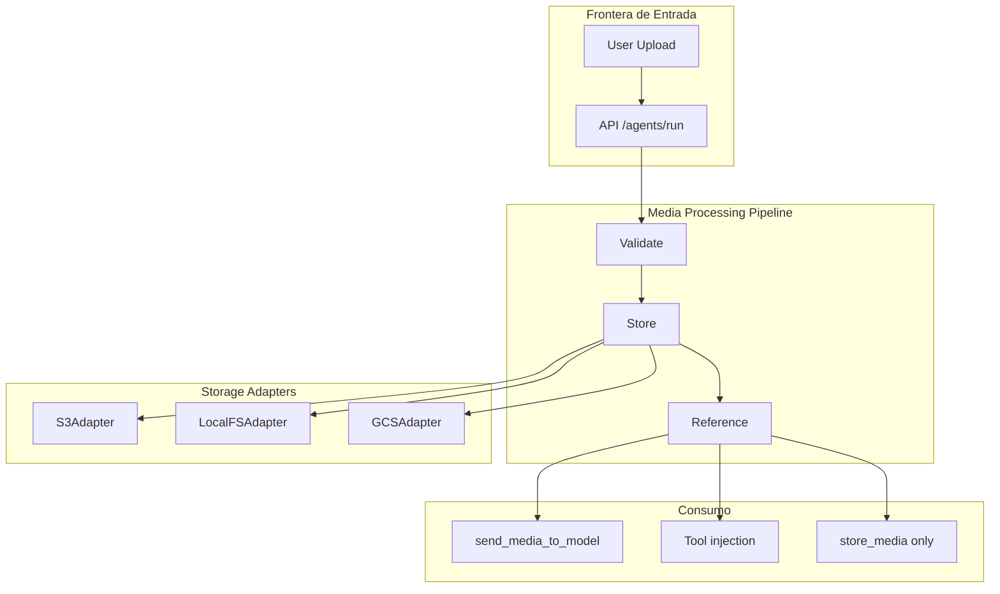
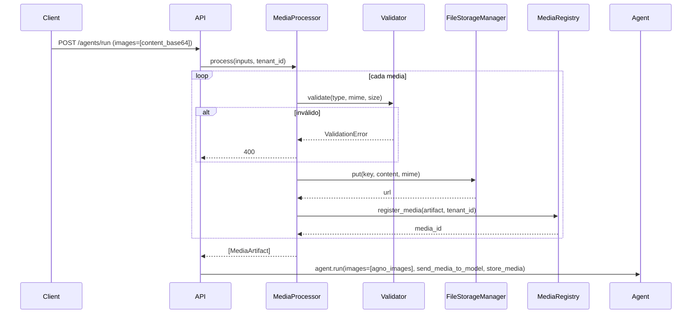

# SPEC_17_MULTIMODAL_IO

> **Propósito**: Definir cómo yaml-agno acepta, procesa, almacena y genera medios multimodales (imágenes, audio, video, archivos) integrando las clases `Image`/`Audio`/`Video`/`File` de Agno, el patrón `ToolResult` con media, y la persistencia a través del FileStorageManager de Core Infra.

> **NOTA DE DEPENDENCIA**: SPEC_11 (Tools & MCP Architecture) define el contrato base de tools y `ToolResult`. SPEC_17 especializa tools que producen/consumen media. SPEC_02 (Domain Model) define los value objects base; SPEC_17 añade el value object `MediaArtifact`.

---

## 1. ARQUITECTURA MULTIMODAL

### 1.1 Visión General

yaml-agno trata la media (imágenes, audio, video, archivos) como ciudadanos de primera clase del dominio. Una media tiene metadata, un origen, una estrategia de almacenamiento, y un ciclo de vida que cruza fronteras: upload, validación, persistencia, referencia en contexto, y eventual cleanup.



### 1.2 Clases de Media de Agno

yaml-agno envuelve las clases nativas de Agno sin reinventarlas. Las clases reales
(`agno/media.py`) tienen MÁS campos de los que yaml-agno expone en su mapeo; la tabla
lista el subset que `MediaConverter` popula desde `MediaInput`. Los campos extra reales
quedan como `None` o su default de Agno.

| Clase Agno | Subset que yaml-agno popula | Campos reales extra (no populados) | Uso típico |
|------------|------------------------------|------------------------------------|------------|
| `Image` | `url`, `filepath`, `content` (bytes), `id`, `original_prompt` | `format`, `mime_type`, `detail`, `revised_prompt`, `alt_text` | Análisis de imágenes, generación con DALL-E |
| `Audio` | `url`, `filepath`, `content`, `format`, `id` | `mime_type`, `duration`, `sample_rate`, `channels`, `transcript`, `expires_at` | Transcripción, sentiment, generación de speech |
| `Video` | `url`, `filepath`, `content`, `id` | `format`, `mime_type`, `duration`, `width`, `height`, `fps`, `eta`, `original_prompt`, `revised_prompt` | Análisis de video (Gemini), captions, shorts |
| `File` | `url`, `filepath`, `content`, `id` | `mime_type`, `file_type`, `filename`, `size`, `external`, `format`, `name`, `citations` | Documentos PDF, DOCX, etc. |

```python
from agno.media import Image, Audio, Video, File
```

### 1.3 Principios

1. **No reinventar Agno**: Usar `Image`/`Audio`/`Video`/`File` directamente. yaml-agno añade metadata y storage, no wrappers redundantes.
2. **Media como artifact con metadata**: Toda media persistida tiene un `MediaArtifact` (media_id, type, mime, url, size, dimensions). El `MediaStorage` es el registro de artifacts.
3. **`send_media_to_model` vs `store_media`**: dos modos ortogonales. `send_media_to_model` controla si la media va al LLM. `store_media` controla si se persiste para uso futuro (cross-run). Se pueden combinar.
4. **`ToolResult` para media de tools**: una tool que produce media retorna `ToolResult(images=[...])` / `ToolResult(videos=[...])` / `ToolResult(audios=[...])`. No devuelve URLs sueltas. **OJO**: en `ToolResult` el campo de audio es `audios` (plural), igual que `images`/`videos`/`files` (todos plurales). En cambio `Agent.run(audio=...)` recibe `audio` (singular). Ver §4.2 y `agno/tools/function.py:1352`.
5. **Injection automática**: las tools pueden declarar `images: Optional[Sequence[Image]]` y Agno inyecta la media disponible al run automáticamente (joint media access).
6. **FileStorage como Core Infra**: el storage de media es un manager (FileStorageManager) con adapters S3/LocalFS/GCS. No se acopla el dominio a un proveedor.

---

## 2. INPUT MEDIA

### 2.1 Modalidades de Entrada

yaml-agno acepta media de entrada en el endpoint de run NATIVO de AgentOS (`POST /agents/{agent_id}/runs`, multipart/form-data con `files`). yaml-agno NO tiene endpoint propio (SPEC_06 iter3).

<!-- @ai-directive SSOT: el endpoint /run es NATIVO de AgentOS (multipart/form-data,
     ver SPEC_06 iter3). NO existe AgentRunRequest/AgentRunResponse propios (eliminados).
     MediaInput es un modelo INTERNO de yaml-agno (owner compartido SPEC_06/SPEC_17) que
     valida el input y se mapea a las clases nativas agno.media.Image/Audio/Video/File.
     Los campos multimodales nativos del Agent.run() (images/audio/videos/files +
     send_media_to_model + store_media) se pasan directamente a AgentOS; esta sección
     solo documenta el modelo interno MediaInput y el mapeo. -->

```python
# yaml-agno/src/media/models.py
#
# NOTA: el endpoint /run es NATIVO de AgentOS (no propio). MediaInput es un
# modelo INTERNO de yaml-agno (no un DTO de endpoint) que se mapea a las
# clases nativas agno.media.Image/Audio/Video/File antes de delegar a AgentOS.
#
# Campos nativos del Agno Agent.run() que yaml-agno configura desde YAML / media:
#   images:  list[Image]   audio: list[Audio]
#   videos:  list[Video]   files: list[File]
#   send_media_to_model: bool = True
#   store_media: bool = False
```

### 2.2 MediaInput Model (Pydantic V2)

```python
# yaml-agno/src/media/models.py

from pydantic import BaseModel, Field, model_validator
from typing import Literal

class MediaInput(BaseModel):
    """Input de media desde el cliente. Una sola fuente a la vez."""
    id: str | None = None
    url: str | None = None
    filepath: str | None = None
    content_base64: str | None = None     # para upload inline
    format: str | None = None             # solo relevante para audio

    @model_validator(mode="after")
    def exactly_one_source(self):
        sources = [self.url, self.filepath, self.content_base64]
        if sum(1 for s in sources if s) != 1:
            raise ValueError("Exactly one of url|filepath|content_base64 required")
        return self
```

### 2.3 Conversión a Clases Agno

```python
# yaml-agno/src/media/converter.py

import base64
from agno.media import Image, Audio, Video, File
from .models import MediaInput

class MediaConverter:
    """Convierte MediaInput (API) -> clases Agno nativas."""

    def to_image(self, mi: MediaInput) -> Image:
        return Image(
            id=mi.id,
            url=mi.url,
            filepath=mi.filepath,
            content=self._decode(mi.content_base64),
        )

    def to_audio(self, mi: MediaInput) -> Audio:
        return Audio(
            id=mi.id,
            url=mi.url,
            filepath=mi.filepath,
            content=self._decode(mi.content_base64),
            format=mi.format,
        )

    def to_video(self, mi: MediaInput) -> Video:
        return Video(
            id=mi.id,
            url=mi.url,
            filepath=mi.filepath,
            content=self._decode(mi.content_base64),
        )

    def to_file(self, mi: MediaInput) -> File:
        return File(
            id=mi.id,
            url=mi.url,
            filepath=mi.filepath,
            content=self._decode(mi.content_base64),
        )

    @staticmethod
    def _decode(b64: str | None) -> bytes | None:
        if b64 is None:
            return None
        return base64.b64decode(b64)
```

---

## 3. SEND_MEDIA_TO_MODEL vs STORE_MEDIA

### 3.1 Dos Decisiones Ortogonales

| Setting | True | False |
|---------|------|-------|
| `send_media_to_model` | La media se incluye en el context del LLM | La media NO llega al LLM (solo disponible para tools) |
| `store_media` | La media se persiste para runs futuros (cross-run) | La media se descarta al terminar el run |

### 3.2 Matriz de Comportamiento

| send_media_to_model | store_media | Comportamiento | Caso de uso |
|---------------------|-------------|----------------|-------------|
| True | False | Media al LLM, descartada al fin del run | Análisis one-shot de imagen |
| True | True | Media al LLM y persistida | Análisis con memoria cross-run |
| False | True | NO al LLM, persistida. Tools acceden via injection | Procesamiento OCR sin saturar contexto del LLM |
| False | False | NO al LLM, NO persistida. Solo tools en este run | Procesamiento efímero en tool |

### 3.3 Ejemplo: OCR sin saturar LLM

El caso del doc de Agno: `send_media_to_model=False, store_media=True`. El PDF va a la tool (DocumentProcessingTools) pero no al contexto del LLM.

```python
agent = Agent(
    model=Gemini(id="gemini-2.5-pro"),
    tools=[DocumentProcessingTools()],
    send_media_to_model=False,
    store_media=True,
)
```

### 3.4 Cross-run Media Persistence

Con `store_media=True` y una DB configurada, la media está disponible en runs futuros del mismo agente/sesión. Esto habilita patrones como "genera una imagen, luego en otro turn analízala".

```python
# Run 1: genera
resp1 = agent.run(input="Generate an image of a cat")

# Run 2: la imagen generada sigue disponible para tools
resp2 = agent.run(input="Count available images and analyze them")
```

---

## 4. TOOLRESULT CON MEDIA

### 4.1 Contrato ToolResult

Cuando una tool produce media, DEBE retornar `ToolResult` con la media. Esto hace que la media generada esté disponible para el LLM y para runs subsiguientes.

```python
# yaml-agno/src/media/tools/image_tools.py

from agno.tools import tool
from agno.tools.function import ToolResult
from agno.media import Image

@tool
def generate_image(prompt: str) -> ToolResult:
    """Genera una imagen desde un prompt."""
    image_artifact = Image(
        id="img_123",
        url="https://cdn.example.com/generated.jpg",
        original_prompt=prompt,
    )
    return ToolResult(
        content=f"Generated image for: {prompt}",
        images=[image_artifact],
    )
```

### 4.2 Campos de ToolResult

| Campo | Tipo | Descripción |
|-------|------|-------------|
| `content` | `str` | Texto descriptivo del resultado (va al LLM como texto) |
| `images` | `list[Image]` | Imágenes generadas/referenciadas |
| `videos` | `list[Video]` | Videos generados/referenciados |
| `audios` | `list[Audio]` | Audio generado/referenciado (**plural**, no `audio`) |
| `files` | `list[File]` | Archivos generados/referenciados |
| `metadata` | `dict \| None` | Metadata opcional (campo real de ToolResult en Agno) |

### 4.3 ToolResult para Audio y Video

```python
@tool
def generate_speech(text: str) -> ToolResult:
    """Genera audio TTS."""
    audio_artifact = Audio(
        id="aud_1",
        url="https://cdn.example.com/speech.wav",
        format="wav",
    )
    return ToolResult(content="Speech generated.", audios=[audio_artifact])

@tool
def generate_short_video(prompt: str) -> ToolResult:
    """Genera un video corto (FAL)."""
    video_artifact = Video(
        id="vid_1",
        url="https://cdn.example.com/short.mp4",
    )
    return ToolResult(content=f"Video for: {prompt}", videos=[video_artifact])
```

### 4.4 Joint Media Access (Tool Injection)

Las tools pueden declarar parámetros `images`, `audio`, `videos`, `files` y Agno los inyecta automáticamente con la media disponible en el run. Esto permite que una tool analice media que otra tool generó en el mismo run.

```python
from typing import Optional, Sequence
from agno.media import Image

@tool
def analyze_images(images: Optional[Sequence[Image]] = None) -> str:
    """Analiza todas las imágenes disponibles (auto-inyectadas)."""
    if not images:
        return "No images available."
    return f"Found {len(images)} images"
```

---

## 5. MEDIA STORAGE STRATEGY

### 5.1 FileStorageManager (Core Infra)

```python
# yaml-agno/src/media/storage.py

from typing import Protocol, Literal

StorageBackend = Literal["s3", "local", "gcs"]

class FileStorageAdapter(Protocol):
    """Adapter para un backend de storage."""
    async def put(self, key: str, content: bytes, mime: str) -> str:
        """Guarda y retorna la URL pública/firmada."""
        ...
    async def get(self, key: str) -> bytes: ...
    async def delete(self, key: str) -> None: ...
    async def signed_url(self, key: str, expires_seconds: int) -> str: ...

class FileStorageManager:
    """Core Infra: registry de adapters por backend."""

    def __init__(self):
        self._adapters: dict[str, FileStorageAdapter] = {}

    def register(self, backend: StorageBackend, adapter: FileStorageAdapter) -> None:
        self._adapters[backend] = adapter

    def get(self, backend: StorageBackend) -> FileStorageAdapter:
        adapter = self._adapters.get(backend)
        if adapter is None:
            raise ValueError(f"No adapter registered for backend: {backend}")
        return adapter
```

### 5.2 Adapters

#### S3Adapter

```python
# yaml-agno/src/media/adapters/s3.py

import boto3
from .storage import FileStorageAdapter

class S3Adapter(FileStorageAdapter):
    """S3 storage adapter.

    AWS credentials (aws_access_key_id / aws_secret_access_key) MUST be passed
    explicitly at construction; they are resolved once at bootstrap from the
    SecretManager (SPEC_23 / SPEC_17 §13.3). This adapter NEVER relies on the
    boto ambient credential chain (no implicit env / IAM / profile fallback),
    so credentials are explicit and tenant-aware-auditable. See §13.3.
    """

    def __init__(
        self,
        bucket: str,
        region: str,
        prefix: str = "media/",
        *,
        aws_access_key_id: str,
        aws_secret_access_key: str,
    ):
        self.bucket = bucket
        self.region = region
        self.prefix = prefix
        self.client = boto3.client(
            "s3",
            region_name=region,
            aws_access_key_id=aws_access_key_id,
            aws_secret_access_key=aws_secret_access_key,
        )

    async def put(self, key: str, content: bytes, mime: str) -> str:
        full_key = f"{self.prefix}{key}"
        # boto3 es síncrono; envolver en run_in_executor en producción
        self.client.put_object(Bucket=self.bucket, Key=full_key, Body=content, ContentType=mime)
        return f"https://{self.bucket}.s3.{self.region}.amazonaws.com/{full_key}"

    async def signed_url(self, key: str, expires_seconds: int) -> str:
        full_key = f"{self.prefix}{key}"
        return self.client.generate_presigned_url(
            "get_object",
            Params={"Bucket": self.bucket, "Key": full_key},
            ExpiresIn=expires_seconds,
        )
```

#### LocalFSAdapter

```python
# yaml-agno/src/media/adapters/local.py

import os
from pathlib import Path
from .storage import FileStorageAdapter

class LocalFSAdapter(FileStorageAdapter):
    def __init__(self, base_dir: str, base_url: str):
        self.base_dir = Path(base_dir)
        self.base_url = base_url
        self.base_dir.mkdir(parents=True, exist_ok=True)

    async def put(self, key: str, content: bytes, mime: str) -> str:
        path = self.base_dir / key
        path.parent.mkdir(parents=True, exist_ok=True)
        path.write_bytes(content)
        return f"{self.base_url}/{key}"

    async def get(self, key: str) -> bytes:
        return (self.base_dir / key).read_bytes()

    async def delete(self, key: str) -> None:
        p = self.base_dir / key
        if p.exists():
            p.unlink()
```

#### GCSAdapter

```python
# yaml-agno/src/media/adapters/gcs.py

from google.cloud import storage
from .storage import FileStorageAdapter

class GCSAdapter(FileStorageAdapter):
    def __init__(self, bucket: str, prefix: str = "media/"):
        self.bucket_name = bucket
        self.prefix = prefix
        self.client = storage.Client()
        self.bucket = self.client.bucket(bucket)

    async def put(self, key: str, content: bytes, mime: str) -> str:
        blob = self.bucket.blob(f"{self.prefix}{key}")
        blob.upload_from_string(content, content_type=mime)
        return blob.public_url
```

### 5.3 Selección de Backend por Config

```yaml
media:
  storage:
    backend: s3              # s3 | local | gcs
    # NOTE: retention/TTL no es nativo de Agno; es una feature futura de yaml-agno.
    # Se documenta como configuración deseada; el enforcement queda pendiente (ver §13.2).
    default_ttl_seconds: 604800   # 7 días (feature futura - no nativo Agno)
    signed_url_expiry: 3600
    s3:
      bucket: "yaml-agno-media"
      region: "us-east-1"
      prefix: "media/"
    # local:
    #   base_dir: "/var/lib/yaml-agno/media"
    #   base_url: "https://media.internal"
    # gcs:
    #   bucket: "yaml-agno-media"
```

---

## 6. MEDIA ARTIFACT MODEL

### 6.1 MediaArtifact (Pydantic V2)

> **Value object del dominio**. Mapea 1:1 al registro persistente
> `MediaArtifactRecord` (schema `yamlagno`). Ver §6.3.

```python
# yaml-agno/src/media/models.py

from pydantic import BaseModel, Field
from typing import Literal
from datetime import datetime, timezone
import uuid

MediaType = Literal["image", "audio", "video", "file"]

class MediaArtifact(BaseModel):
    """Persistent record of a media artifact. Domain value object.

    Maps 1:1 to MediaArtifactRecord (yamlagno schema). See registry.py.
    """
    media_id: str = Field(default_factory=lambda: f"med_{uuid.uuid4().hex[:12]}")
    tenant_id: str                      # multi-tenant explicit (NOT NULL)
    run_id: str | None = None           # Agno run that produced/consumed it
    session_id: str | None = None
    media_type: MediaType
    mime: str                           # image/jpeg, audio/wav, video/mp4, application/pdf
    storage_uri: str                    # public/signed access URL
    sha256: str | None = None           # content digest (optional)
    bytes_size: int = Field(ge=0)
    width: int | None = None            # image/video only
    height: int | None = None           # image/video only
    duration_ms: int | None = None      # audio/video only (milliseconds)
    created_at: datetime = Field(default_factory=lambda: datetime.now(timezone.utc))
    expires_at: datetime | None = None  # feature futura (TTL no nativo de Agno)
    source: Literal["user_upload", "tool_generated", "agent_generated"] = "user_upload"
    storage_backend: str                # s3 | local | gcs
    storage_key: str                    # internal key in the backend
    original_prompt: str | None = None  # if generated

    def to_agno_image(self): ...
    def to_agno_audio(self): ...
    def to_agno_video(self): ...
    def to_agno_file(self): ...
```

### 6.2 MediaRegistry (Persistencia via Core GenericRepository)

<!-- @ai-directive BUILD ON TOP: MediaRegistry consumes core-cenf (DatabaseManager).
     NO raw SQL, NO db.execute bypass. The media_artifacts table lives in the
     yamlagno.* CONFIG STORE (schema="yamlagno"), provisioned by ConfigStoreProvisioner
     (SPEC_03 §6, create_all checkfirst), NOT by a local migration. Runtime tables
     belong to Agno (agno_*). This wrapper uses db.get_repository(MediaArtifactRecord)
     inside `async with db.transaction() as tx:` + tx.commit(). -->

```python
# yaml-agno/src/media/registry.py

from core.db.manager import DatabaseManager
from core.db.repository import GenericRepository
from .records import MediaArtifactRecord
from .models import MediaArtifact


class MediaRegistry:
    """Persists MediaArtifact records in the yamlagno.* config store.

    Thin wrapper over the core GenericRepository (core-cenf). The caller NEVER
    touches raw SQL. All operations run inside a core transaction:
    `async with db.transaction() as tx: ... tx.commit()`. Multi-tenant is
    explicit: every query filter includes tenant_id.
    """

    def __init__(self, db: DatabaseManager):
        self.db = db

    async def register_media(
        self, artifact: MediaArtifact, *, tenant_id: str
    ) -> str:
        """Insert a new media artifact record. Returns the media_id."""
        async with self.db.transaction() as tx:
            repo: GenericRepository[MediaArtifactRecord] = (
                self.db.get_repository(MediaArtifactRecord)
            )
            record = MediaArtifactRecord.from_vo(artifact, tenant_id=tenant_id)
            await repo.insert(record, session=tx)
            await tx.commit()
        return artifact.media_id

    async def get_media(
        self, media_id: str, *, tenant_id: str
    ) -> MediaArtifact | None:
        """Fetch a single artifact, scoped to the tenant."""
        async with self.db.transaction() as tx:
            repo = self.db.get_repository(MediaArtifactRecord)
            record = await repo.find_one(
                filters={"id": media_id, "tenant_id": tenant_id}, session=tx
            )
            await tx.commit()
        return record.to_vo() if record is not None else None

    async def list_by_run(
        self, run_id: str, *, tenant_id: str
    ) -> list[MediaArtifact]:
        """List all artifacts belonging to a run, scoped to the tenant."""
        async with self.db.transaction() as tx:
            repo = self.db.get_repository(MediaArtifactRecord)
            records = await repo.find_all(
                filters={"run_id": run_id, "tenant_id": tenant_id}, session=tx
            )
            await tx.commit()
        return [r.to_vo() for r in records]

    async def prune_expired(
        self, *, tenant_id: str | None = None, now: datetime | None = None
    ) -> int:
        """Delete artifacts whose expires_at has passed (feature futura).

        Returns the number of deleted rows. Tenant-scoped when tenant_id is given.
        """
        from datetime import datetime, timezone
        now = now or datetime.now(timezone.utc)
        async with self.db.transaction() as tx:
            repo = self.db.get_repository(MediaArtifactRecord)
            filters: dict = {"expires_at__lte": now}
            if tenant_id is not None:
                filters["tenant_id"] = tenant_id
            deleted = await repo.delete(filters=filters, session=tx)
            await tx.commit()
        return deleted
```

### 6.3 MediaArtifactRecord (DeclarativeBase, schema yamlagno)

> **Config store record**. Lives in schema `yamlagno` (prefijo lógico `yamlagno.*`),
> NOT in runtime (Agno owns `agno_*`). Provisioned by `ConfigStoreProvisioner`
> (SPEC_03 §6) via `create_all(checkfirst=True)` — there is NO local migration.

```python
# yaml-agno/src/media/records.py

from datetime import datetime, timezone
from sqlalchemy.orm import DeclarativeBase, Mapped, mapped_column
from sqlalchemy import String, BigInteger, Integer, DateTime, Text
from .models import MediaArtifact


class _YamlagnoBase(DeclarativeBase):
    """Shared DeclarativeBase for yaml-agno config-store tables (schema yamlagno)."""


class MediaArtifactRecord(_YamlagnoBase):
    """Persistent media artifact row in the yamlagno config store.

    Google-style: maps 1:1 to the MediaArtifact value object. Provisioned by
    ConfigStoreProvisioner (SPEC_03 §6), never by a per-spec migration.
    """

    __tablename__ = "yamlagno_media_artifacts"
    __table_args__ = {"schema": "yamlagno"}
    # @ai-directive: follows the SPEC_03 convention (schema + prefixed tablename),
    # so the physical table is yamlagno.yamlagno_media_artifacts.

    id: Mapped[str] = mapped_column(Text, primary_key=True)          # media_id
    tenant_id: Mapped[str] = mapped_column(Text, nullable=False, index=True)
    run_id: Mapped[str | None] = mapped_column(Text, nullable=True, index=True)
    session_id: Mapped[str | None] = mapped_column(Text, nullable=True, index=True)
    media_type: Mapped[str] = mapped_column(Text, nullable=False)
    mime: Mapped[str] = mapped_column(Text, nullable=False)
    storage_uri: Mapped[str] = mapped_column(Text, nullable=False)
    sha256: Mapped[str | None] = mapped_column(Text, nullable=True)
    bytes_size: Mapped[int] = mapped_column(BigInteger, nullable=False)
    width: Mapped[int | None] = mapped_column(Integer, nullable=True)
    height: Mapped[int | None] = mapped_column(Integer, nullable=True)
    duration_ms: Mapped[int | None] = mapped_column(Integer, nullable=True)
    created_at: Mapped[datetime] = mapped_column(
        DateTime(timezone=True), nullable=False,
        default=lambda: datetime.now(timezone.utc),
    )
    expires_at: Mapped[datetime | None] = mapped_column(
        DateTime(timezone=True), nullable=True
    )

    @classmethod
    def from_vo(cls, vo: MediaArtifact, *, tenant_id: str) -> "MediaArtifactRecord":
        return cls(
            id=vo.media_id, tenant_id=tenant_id, run_id=vo.run_id,
            session_id=vo.session_id, media_type=vo.media_type, mime=vo.mime,
            storage_uri=vo.storage_uri, sha256=vo.sha256,
            bytes_size=vo.bytes_size, width=vo.width, height=vo.height,
            duration_ms=vo.duration_ms, created_at=vo.created_at,
            expires_at=vo.expires_at,
        )

    def to_vo(self) -> MediaArtifact:
        return MediaArtifact(
            media_id=self.id, tenant_id=self.tenant_id, run_id=self.run_id,
            session_id=self.session_id, media_type=self.media_type,  # type: ignore[arg-type]
            mime=self.mime, storage_uri=self.storage_uri, sha256=self.sha256,
            bytes_size=self.bytes_size, width=self.width, height=self.height,
            duration_ms=self.duration_ms, created_at=self.created_at,
            expires_at=self.expires_at,
        )
```

> **Indexes** (`run_id`, `session_id`, `tenant_id`, composite `(tenant_id, created_at)`)
> are declared on the mapped columns above; `create_all(checkfirst=True)` provisions
> them together with the table. No `migrations/media_artifacts.sql` exists.

---

## 7. MEDIA PROCESSING PIPELINE

### 7.1 Pipeline: upload -> validate -> store -> reference



### 7.2 MediaProcessor

```python
# yaml-agno/src/media/processor.py

import asyncio
from .models import MediaInput, MediaArtifact
from .converter import MediaConverter
from .validator import MediaValidator
from .storage import FileStorageManager
from .registry import MediaRegistry

class MediaProcessor:
    """Orquesta validate -> store -> register."""

    def __init__(
        self,
        converter: MediaConverter,
        validator: MediaValidator,
        storage: FileStorageManager,
        registry: MediaRegistry,
    ):
        self.converter = converter
        self.validator = validator
        self.storage = storage
        self.registry = registry

    async def process_inputs(
        self,
        media_type: str,
        inputs: list[MediaInput],
        tenant_id: str,
        run_id: str,
        session_id: str | None,
        storage_backend: str = "s3",
    ) -> list[MediaArtifact]:
        artifacts = []
        # TaskGroup para concurrencia segura (NO asyncio.gather)
        async with asyncio.TaskGroup() as tg:
            tasks = [
                tg.create_task(
                    self._process_one(
                        m, media_type, tenant_id, run_id, session_id, storage_backend
                    )
                )
                for m in inputs
            ]
        for t in tasks:
            artifacts.append(t.result())
        return artifacts

    async def _process_one(self, mi, media_type, tenant_id, run_id, session_id, backend):
        content, mime = self._resolve_content(mi, media_type)
        self.validator.validate(media_type, mime, len(content))
        key = self._gen_key(media_type, mime)
        adapter = self.storage.get(backend)
        url = await adapter.put(key, content, mime)
        artifact = MediaArtifact(
            media_type=media_type, mime=mime, storage_uri=url,
            bytes_size=len(content), storage_backend=backend, storage_key=key,
            tenant_id=tenant_id, run_id=run_id, session_id=session_id,
        )
        await self.registry.register_media(artifact, tenant_id=tenant_id)
        return artifact

    def _resolve_content(self, mi: MediaInput, media_type: str) -> tuple[bytes, str]:
        # Implementa fetch por url / leer filepath / decodificar base64
        ...
```

### 7.3 MediaValidator

```python
# yaml-agno/src/media/validator.py

from typing import Literal

class MediaValidationError(Exception): ...

class MediaValidator:
    MAX_SIZE_MB = {
        "image": 25,
        "audio": 50,
        "video": 500,
        "file": 100,
    }
    ALLOWED_MIMES = {
        "image": {"image/jpeg", "image/png", "image/webp", "image/gif"},
        "audio": {"audio/wav", "audio/mpeg", "audio/mp3", "audio/ogg"},
        "video": {"video/mp4", "video/webm", "video/quicktime"},
        "file": {"application/pdf", "text/plain", "application/vnd.openxmlformats-...",
                 "application/msword"},
    }

    def validate(self, media_type: str, mime: str, size: int) -> None:
        if media_type not in self.MAX_SIZE_MB:
            raise MediaValidationError(f"Unknown media type: {media_type}")
        if mime not in self.ALLOWED_MIMES[media_type]:
            raise MediaValidationError(f"MIME {mime} not allowed for {media_type}")
        max_bytes = self.MAX_SIZE_MB[media_type] * 1024 * 1024
        if size > max_bytes:
            raise MediaValidationError(
                f"Size {size} exceeds max {max_bytes} for {media_type}"
            )
```

---

## 8. GENERATION CAPABILITIES

### 8.1 Generación de Media

yaml-agno soporta generación de image, audio y video vía tools de generación:

| Modalidad | Tool / Provider | Salida |
|-----------|----------------|--------|
| Image | `DalleTools`, `FalTools` (image-to-image) | `Image` artifact |
| Audio | TTS providers (OpenAI audio), music gen | `Audio` artifact |
| Video | FAL, Replicate, ModelLab | `Video` artifact |
| File | `FileGenerationTools` | `File` artifact |

### 8.2 ImageGenerationTool wrapper

```python
# yaml-agno/src/media/tools/image_generation.py

from agno.tools import tool
from agno.tools.function import ToolResult
from agno.media import Image
from agno.tools.dalle import DalleTools

class ImageGenerationTool:
    """Wrapper que registra DALL-E y expone generación como tool."""

    def __init__(self, registry, storage):
        self.registry = registry
        self.storage = storage
        self.dalle = DalleTools()

    @tool
    def generate_image(self, prompt: str) -> ToolResult:
        """Genera imagen con DALL-E y la persiste."""
        # DalleTools escribe a disco; leemos y persistimos
        image = self._generate_and_persist(prompt)
        return ToolResult(content=f"Generated image for: {prompt}", images=[image])

    def _generate_and_persist(self, prompt: str) -> Image:
        # Delegar a DalleTools y capturar URL/path generado
        ...
```

### 8.3 Misma-Run y Multi-turn

- **Same-run**: el agente genera una imagen con una tool y otra tool la analiza en el mismo run (joint media access).
- **Multi-turn**: en runs siguientes, con `store_media=True`, la media generada sigue disponible.

### 8.4 Helpers de Output

```python
# yaml-agno/src/media/output.py

from agno.utils.audio import write_audio_to_file

def extract_response_audio(response, filename: str) -> str:
    """Persiste el audio de respuesta del agente a disco."""
    if response.response_audio:
        write_audio_to_file(response.response_audio, filename)
        return filename
    return ""
```

---

## 9. MULTIMODAL TEAM COORDINATION

### 9.1 Patrones de Equipo Multimodal

En un team, un member genera media y otro la procesa:

| Patrón | Miembro A | Miembro B | Flujo |
|--------|-----------|-----------|-------|
| Generate-then-Analyze | `image_generator` (DALL-E) | `image_analyzer` (vision) | A genera, B describe |
| Transcribe-then-Summarize | `transcriber` (Whisper) | `summarizer` | A transcribe audio, B resume texto |
| Video-to-Shorts | `captioner` (video input) | `editor` (genera shorts) | A captions, B edita |

### 9.2 Ejemplo YAML de Team Multimodal

```yaml
team:
  name: "media_pipeline"
  mode: coordinate

  members:
    - name: image_generator
      model:
        provider: openai
        id: gpt-4o
      tools:
        - type: image_generation
          provider: dalle
      media:
        generates: [image]

    - name: image_analyzer
      model:
        provider: openai
        id: gpt-4o    # vision-capable
      media:
        consumes: [image]
      send_media_to_model: true
      instructions: "Describe images produced by image_generator."

  media:
    cross_member_access: true   # A's generated media available to B
    store_media: true
```

### 9.3 Cross-member Media Access

Con `cross_member_access: true`, la media generada por un member se registra en el `MediaRegistry` y queda disponible para otros members del mismo team run. La inyección en tools usa el mismo mecanismo joint media access.

---

## 10. MULTIMODAL INPUT MODELS (Providers)

### 10.1 Matriz Provider x Modalidad

| Provider | Image In | Audio In | Video In | File In | Image Out | Audio Out |
|----------|----------|----------|----------|---------|-----------|-----------|
| OpenAI (gpt-4o) | Sí | Sí (gpt-4o-audio-preview) | No | Sí (PDF) | Vía DALL-E tool | Sí (modalities=["audio"]) |
| Anthropic (Claude) | Sí | No | No | Sí (PDF) | No | No |
| Google (Gemini) | Sí | Sí | Sí | Sí | Vía tool | Vía tool |
| DALL-E | - | - | - | - | Sí (gen) | - |
| Whisper | - | Sí (transcribe) | - | - | - | - |

### 10.2 Declaración de Capacidades

yaml-agno valida que el modelo declarado soporta las modalidades solicitadas antes del run:

```python
# yaml-agno/src/media/capabilities.py

PROVIDER_CAPABILITIES = {
    "openai:gpt-4o": {"input": ["image", "audio", "file"], "output": ["text", "audio"]},
    "anthropic:claude-sonnet-4-5": {"input": ["image", "file"], "output": ["text"]},
    "google:gemini-2.5-pro": {"input": ["image", "audio", "video", "file"], "output": ["text"]},
}

class CapabilityChecker:
    def check_input(self, provider_model: str, media_type: str) -> None:
        caps = PROVIDER_CAPABILITIES.get(provider_model, {})
        if media_type not in caps.get("input", []):
            raise MediaValidationError(
                f"{provider_model} does not support {media_type} input"
            )
```

---

## 11. YAML CONFIG SCHEMA MULTIMODAL

### 11.1 Schema Completo

```yaml
agent:
  name: "vision_agent"
  model:
    provider: openai
    id: gpt-4o

  # ---- Multimodal config ----
  media:
    # Modos por defecto del agente
    send_media_to_model: true
    store_media: true
    cross_run_persistence: true

    # Storage
    storage:
      backend: s3
      default_ttl_seconds: 604800   # feature futura (TTL no nativo de Agno)
      signed_url_expiry: 3600
      s3:
        bucket: "yaml-agno-media"
        region: "us-east-1"

    # Validación
    validation:
      max_size_mb:
        image: 25
        audio: 50
        video: 500
        file: 100
      allowed_mimes:
        image: ["image/jpeg", "image/png", "image/webp"]
        audio: ["audio/wav", "audio/mpeg"]
        video: ["video/mp4", "video/webm"]
        file: ["application/pdf"]

    # Capacidades declaradas
    consumes: [image, audio, file]      # qué acepta como input
    generates: [image]                  # qué puede producir

  # ---- Tools de media ----
  tools:
    - type: image_generation
      provider: dalle
      enabled: true
      config:
        size: "1024x1024"
        quality: "standard"

    - type: image_analysis
      function: "yaml_agno.media.tools.analyze_images"
      enabled: true

    - type: audio_generation
      provider: openai_tts
      enabled: false
      config:
        voice: "alloy"
        format: "wav"
```

### 11.2 Pydantic V2 Models

```python
# yaml-agno/src/media/config.py

from pydantic import BaseModel, Field
from .models import MediaType  # SSOT: defined once in models.py

class S3StorageConfig(BaseModel):
    bucket: str
    region: str
    prefix: str = "media/"

class LocalStorageConfig(BaseModel):
    base_dir: str
    base_url: str

class GCSStorageConfig(BaseModel):
    bucket: str
    prefix: str = "media/"

class MediaStorageConfig(BaseModel):
    backend: Literal["s3", "local", "gcs"] = "s3"
    # @ai-directive FEATURE FUTURA: retention/TTL no es nativo de Agno.
    # default_ttl_seconds se define como configuración deseada, pero el enforcement
    # automático (cleanup job en SPEC_13 scheduler) es una feature futura de yaml-agno.
    default_ttl_seconds: int = 604800
    signed_url_expiry: int = 3600
    s3: S3StorageConfig | None = None
    local: LocalStorageConfig | None = None
    gcs: GCSStorageConfig | None = None

class MediaValidationConfig(BaseModel):
    max_size_mb: dict[MediaType, int] = Field(
        default_factory=lambda: {"image": 25, "audio": 50, "video": 500, "file": 100}
    )
    allowed_mimes: dict[MediaType, list[str]] = Field(default_factory=dict)

class MediaConfig(BaseModel):
    send_media_to_model: bool = True
    store_media: bool = False
    cross_run_persistence: bool = True
    storage: MediaStorageConfig = Field(default_factory=MediaStorageConfig)
    validation: MediaValidationConfig = Field(default_factory=MediaValidationConfig)
    consumes: list[MediaType] = Field(default_factory=list)
    generates: list[MediaType] = Field(default_factory=list)
```

---

## 12. MULTIMODAL AGENT BUILDER

### 12.1 Builder Integration

```python
# yaml-agno/src/media/builder.py

from agno.agent import Agent
from agno.media import Image, Audio, Video, File
from .config import MediaConfig
from .storage import FileStorageManager
from .registry import MediaRegistry
from .processor import MediaProcessor
from .converter import MediaConverter
from .validator import MediaValidator

class MultimodalAgentBuilder:
    """Aplica MediaConfig a un Agent."""

    def __init__(self, storage: FileStorageManager, registry: MediaRegistry):
        self.storage = storage
        self.registry = registry

    def build_processor(self, config: MediaConfig) -> MediaProcessor:
        return MediaProcessor(
            converter=MediaConverter(),
            validator=MediaValidator(config.validation.max_size_mb, config.validation.allowed_mimes),
            storage=self.storage,
            registry=self.registry,
        )

    def apply_to_agent(self, agent: Agent, config: MediaConfig) -> Agent:
        agent.send_media_to_model = config.send_media_to_model
        agent.store_media = config.store_media
        # Las tools de media se registran vía el builder de tools (SPEC_11)
        return agent
```

### 12.2 Flujo de un Run Multimodal

```python
# NOTE: there is NO AgentRunRequest DTO anymore (SPEC_06 iter3 removed it; the
# run endpoint is AgentOS native multipart/form-data). This helper receives the
# parsed media inputs and scoping ids directly (extracted from the native
# multipart form by the caller / AgentOS), not a request DTO.

async def run_multimodal_agent(
    agent,
    config: MediaConfig,
    images: list[MediaInput],
    audio: list[MediaInput],
    videos: list[MediaInput],
    files: list[MediaInput],
    input_text: str,
    user_id: str,
    run_id: str,
    session_id: str | None,
    tenant_id: str,
    processor: MediaProcessor,
):
    """Run an agent with multimodal inputs (no request DTO).

    Precondition: ``agent`` MUST already have ``send_media_to_model`` and
    ``store_media`` set via ``MultimodalAgentBuilder.apply_to_agent`` (§12.1).
    In Agno v2.6.22 these are Agent CONSTRUCTOR params (agent.py:218-220,423,450),
    NOT run()/arun() params, so they cannot be passed in this helper's arun() call.
    The ``config`` arg is kept for the storage backend and future per-run overrides.

    Args:
        agent: the Agno Agent instance (already configured with media flags by the builder).
        config: MediaConfig carrying storage backend (media flags read at build time).
        images: image MediaInputs (may be empty).
        audio: audio MediaInputs (may be empty).
        videos: video MediaInputs (may be empty).
        files: file MediaInputs (may be empty).
        input_text: textual prompt for the run.
        user_id: composite "{tenant_id}:{principal_id}" (SPEC_04).
        run_id: Agno run identifier (propagated to MediaArtifact.run_id).
        session_id: Agno session identifier, if any.
        tenant_id: tenant scope for MediaArtifact persistence.
        processor: MediaProcessor used to validate/store/register input media.

    Returns:
        The Agno run response.
    """
    # 1. Procesar media de entrada. process_inputs signature is
    #    (media_type, inputs, tenant_id, run_id, session_id, storage_backend):
    #    run_id MUST precede session_id and storage_backend.
    artifacts_by_type = {}
    if images:
        artifacts_by_type["image"] = await processor.process_inputs(
            "image", images, tenant_id, run_id, session_id,
            config.storage.backend,
        )
    if audio:
        artifacts_by_type["audio"] = await processor.process_inputs(
            "audio", audio, tenant_id, run_id, session_id,
            config.storage.backend,
        )
    if videos:
        artifacts_by_type["video"] = await processor.process_inputs(
            "video", videos, tenant_id, run_id, session_id,
            config.storage.backend,
        )
    if files:
        artifacts_by_type["file"] = await processor.process_inputs(
            "file", files, tenant_id, run_id, session_id,
            config.storage.backend,
        )

    # 2. Convertir artifacts a clases Agno
    converter = MediaConverter()
    agno_images = [a.to_agno_image() for a in artifacts_by_type.get("image", [])]
    agno_audio = [a.to_agno_audio() for a in artifacts_by_type.get("audio", [])]
    agno_videos = [a.to_agno_video() for a in artifacts_by_type.get("video", [])]
    agno_files = [a.to_agno_file() for a in artifacts_by_type.get("file", [])]

    # 3. Ejecutar. NOTE: send_media_to_model / store_media are NOT run() params
    #    in Agno — they are Agent CONSTRUCTOR params (agent.py:218-220,423,450).
    #    They MUST already be set on the agent via MultimodalAgentBuilder.apply_to_agent
    #    (see §12.1) before this helper is called. Here we only pass the media
    #    inputs and scoping ids that run()/arun() actually accept.
    #    No AgentRunRequest DTO (SPEC_06 iter3 removed it).
    response = await agent.arun(
        input=input_text,
        images=agno_images or None,
        audio=agno_audio or None,
        videos=agno_videos or None,
        files=agno_files or None,
        user_id=user_id,
        session_id=session_id,
    )
    return response
```

---

## 13. FILESTORAGE INTEGRATION CON CORE INFRA

### 13.1 Registro en Startup

`FileStorageManager` se registra en el composition root de yaml-agno (SPEC_01 runtime):

```python
# yaml-agno/src/runtime/bootstrap.py (extracto)

from core.secrets import SecretManager  # core-cenf

async def bootstrap_media(
    config: MediaStorageConfig, secret_manager: SecretManager
) -> tuple[FileStorageManager, FileStorageAdapter]:
    """Build the FileStorageManager and select the active adapter.

    S3 credentials are resolved ONCE here from the SecretManager (SPEC_23 /
    SPEC_17 §13.3) and passed explicitly to S3Adapter. No ambient chain.
    """
    manager = FileStorageManager()
    if config.backend == "s3" and config.s3:
        aws_key = await secret_manager.get_secret("AWS_S3_KEY")
        aws_secret = await secret_manager.get_secret("AWS_S3_SECRET")
        manager.register(
            "s3",
            S3Adapter(
                config.s3.bucket, config.s3.region, config.s3.prefix,
                aws_access_key_id=aws_key,
                aws_secret_access_key=aws_secret,
            ),
        )
    elif config.backend == "local" and config.local:
        manager.register("local", LocalFSAdapter(config.local.base_dir, config.local.base_url))
    elif config.backend == "gcs" and config.gcs:
        manager.register("gcs", GCSAdapter(config.gcs.bucket, config.gcs.prefix))
    return manager, manager.get(config.backend)
```

### 13.2 Lifecycle y Cleanup

- **TTL cleanup** *(feature futura)*: job periódico (SPEC_13 scheduler) elimina artifacts expirados según `default_ttl_seconds`. **NOTA**: la retention/TTL no es nativa de Agno; su enforcement automático es una feature futura de yaml-agno. Mientras tanto, `default_ttl_seconds` se acepta como configuración pero no se aplica automáticamente.
- **Session-scoped deletion**: al eliminar una sesión (SPEC_06 DELETE), se eliminan sus media artifacts via `MediaRegistry` (wrapper de `db.get_repository(MediaArtifactRecord)` dentro de transaction).
- **Signed URLs**: las URLs retornadas al cliente son firmadas con expiración `signed_url_expiry`.

<!-- @ai-directive SCHEMA PROVISIONING: the yamlagno.media_artifacts table is
     provisioned by ConfigStoreProvisioner (SPEC_03 §6) via create_all(checkfirst=True).
     There is NO migrations/media_artifacts.sql. yaml-agno config-store tables are
     declarative (DeclarativeBase, schema="yamlagno"); runtime tables belong to Agno. -->

### 13.3 SecretManager Integration

Las credenciales de storage (AWS keys, GCP service account) se obtienen vía `SecretManager` (SPEC_23), nunca en config plana:

```python
aws_key = await secret_manager.get_secret("AWS_S3_KEY")
aws_secret = await secret_manager.get_secret("AWS_S3_SECRET")
```

---

## 14. BEHAVIOR DELTA - BDD SCENARIOS

### 14.1 Escenarios de Aceptación

#### Scenario 1: Golden Path - Image Input sent to model

```gherkin
GIVEN an agent with send_media_to_model=true
AND consumes=[image]
WHEN the user uploads an image (content_base64)
THEN the MediaProcessor validates mime and size
AND the image is stored in the configured backend
AND a MediaArtifact is registered
AND the image is converted to agno.media.Image
AND the image is sent to the LLM in the run context
AND the agent can describe the image
```

#### Scenario 2: Golden Path - Image Generation via tool

```gherkin
GIVEN an agent with an image_generation tool (DALL-E)
WHEN the user asks "generate an image of a sunset"
THEN the agent calls the image_generation tool
AND the tool returns a ToolResult with images=[Image(...)]
AND the generated image is persisted in storage
AND a MediaArtifact with source="tool_generated" is registered
AND the agent response references the generated image URL
```

#### Scenario 3: Golden Path - ToolResult media available to LLM

```gherkin
GIVEN an agent with generate_image and analyze_images tools
WHEN the user asks to generate and analyze in the same run
THEN generate_image returns ToolResult(images=[img])
AND the analyze_images tool receives images via joint injection
AND analyze_images describes the generated image
AND both tools complete in the same run
```

#### Scenario 4: Golden Path - store_media cross-run persistence

```gherkin
GIVEN an agent with store_media=true
WHEN run 1 generates an image
THEN the MediaArtifact is persisted in the registry
WHEN run 2 (same agent/session) asks to count available images
THEN the analyze tool receives the image from run 1
AND the count is 1
```

#### Scenario 5: store_media only (no LLM)

```gherkin
GIVEN an agent with send_media_to_model=false and store_media=true
AND a DocumentProcessingTools that receives files
WHEN the user uploads a PDF
THEN the PDF is NOT sent to the LLM context
AND the PDF is available to DocumentProcessingTools via injection
AND the tool extracts text and returns it
AND the LLM responds based on the extracted text
```

#### Scenario 6: Error Case - unsupported provider for video

```gherkin
GIVEN an agent with model provider anthropic:claude-sonnet-4-5
AND consumes=[video]
WHEN the user uploads a video
THEN the CapabilityChecker detects anthropic does not support video input
AND the API returns 400 with "does not support video input"
AND the run does NOT start
```

#### Scenario 7: Error Case - oversized media

```gherkin
GIVEN an agent with max_size_mb.image=25
WHEN the user uploads a 30MB image
THEN MediaValidator raises MediaValidationError
AND the API returns 400 with size exceeded message
AND the media is NOT stored
```

#### Scenario 8: Error Case - disallowed mime

```gherkin
GIVEN an agent with allowed_mimes.image=[image/jpeg, image/png]
WHEN the user uploads an image with mime image/tiff
THEN MediaValidator rejects it
AND the API returns 400 "MIME image/tiff not allowed"
```

#### Scenario 9: Golden Path - Multimodal team (generate-then-analyze)

```gherkin
GIVEN a team with members image_generator and image_analyzer
AND cross_member_access=true
WHEN the user asks to generate and describe an image
THEN image_generator generates and returns ToolResult(images=[img])
AND the image is registered in MediaRegistry
AND image_analyzer receives the image via cross-member injection
AND image_analyzer returns a description
AND the team returns the final description
```

#### Scenario 10: Golden Path - Audio input transcription

```gherkin
GIVEN an agent with model gpt-4o-audio-preview and consumes=[audio]
WHEN the user uploads audio (format=wav)
THEN the audio is stored as MediaArtifact
AND the audio is sent to the model
AND the agent transcribes the audio
```

#### Scenario 11: Golden Path - Concurrent media processing with TaskGroup

```gherkin
GIVEN an upload of 3 images
WHEN MediaProcessor.process_inputs processes them
THEN all 3 are validated and stored concurrently via asyncio.TaskGroup
AND if one fails validation, the TaskGroup cancels the others
AND the API returns 400 for the batch
```

#### Scenario 12: Golden Path - Signed URL expiry

```gherkin
GIVEN a stored MediaArtifact
WHEN the client requests the URL
THEN the returned URL is signed with expiry=signed_url_expiry
AND after expiry the URL is invalid
AND a new signed URL can be generated from storage_key
```

---

## 15. TDD MICRO-TASK EXECUTION PROTOCOL

### 15.1 Cascading Task Checklist

> **Regla STRICT TDD**: RED -> GREEN -> REFACTOR. Commits atómicos. `asyncio.TaskGroup`, no `asyncio.gather`.

#### TASK_001: MediaInput exactly-one-source validator

- **File**: `yaml-agno/src/media/models.py`
- **Test**: `tests/unit/media/test_models.py`
- **RED**:
  ```python
  def test_media_input_requires_one_source():
      import pytest
      with pytest.raises(Exception):
          MediaInput()  # none
      with pytest.raises(Exception):
          MediaInput(url="x", filepath="y")  # two

  def test_media_input_accepts_url_only():
      mi = MediaInput(url="https://e.com/a.jpg")
      assert mi.url == "https://e.com/a.jpg"
  ```
- **GREEN**: Implementar `model_validator` en `MediaInput`.
- **Commit**: `feat: add MediaInput source validation`

#### TASK_002: MediaConverter to_image

- **File**: `yaml-agno/src/media/converter.py`
- **Test**: `tests/unit/media/test_converter.py`
- **RED**:
  ```python
  def test_convert_url_to_image():
      c = MediaConverter()
      img = c.to_image(MediaInput(url="https://e.com/a.jpg"))
      assert img.url == "https://e.com/a.jpg"

  def test_convert_base64_to_image():
      import base64
      c = MediaConverter()
      b64 = base64.b64encode(b"x").decode()
      img = c.to_image(MediaInput(content_base64=b64))
      assert img.content == b"x"
  ```
- **GREEN**: Implementar `to_image`, `_decode`.
- **Commit**: `feat: add MediaConverter image conversion`

#### TASK_003: MediaValidator mime and size

- **File**: `yaml-agno/src/media/validator.py`
- **Test**: `tests/unit/media/test_validator.py`
- **RED**:
  ```python
  def test_valid_image_passes():
      MediaValidator().validate("image", "image/jpeg", 1024)

  def test_invalid_mime_rejected():
      import pytest
      with pytest.raises(MediaValidationError):
          MediaValidator().validate("image", "image/tiff", 1024)

  def test_oversized_rejected():
      import pytest
      with pytest.raises(MediaValidationError):
          MediaValidator().validate("image", "image/jpeg", 30*1024*1024)
  ```
- **GREEN**: Implementar `validate`.
- **Commit**: `feat: add MediaValidator mime/size checks`

#### TASK_004: LocalFSAdapter put/get/delete

- **File**: `yaml-agno/src/media/adapters/local.py`
- **Test**: `tests/unit/media/test_local_adapter.py`
- **RED**:
  ```python
  async def test_local_put_returns_url(tmp_path):
      a = LocalFSAdapter(str(tmp_path), "https://media.local")
      url = await a.put("k1/img.jpg", b"data", "image/jpeg")
      assert url == "https://media.local/k1/img.jpg"
      assert (tmp_path / "k1" / "img.jpg").read_bytes() == b"data"

  async def test_local_get_and_delete(tmp_path):
      a = LocalFSAdapter(str(tmp_path), "https://m.local")
      await a.put("x.jpg", b"d", "image/jpeg")
      assert await a.get("x.jpg") == b"d"
      await a.delete("x.jpg")
      import pytest
      with pytest.raises(FileNotFoundError):
          await a.get("x.jpg")
  ```
- **GREEN**: Implementar `LocalFSAdapter`.
- **Commit**: `feat: add LocalFSAdapter`

#### TASK_005: FileStorageManager register/get

- **File**: `yaml-agno/src/media/storage.py`
- **Test**: `tests/unit/media/test_storage_manager.py`
- **RED**:
  ```python
  def test_register_and_get():
      m = FileStorageManager()
      fake = object()  # placeholder; usar fake adapter real
      m.register("local", fake)
      assert m.get("local") is fake

  def test_get_unknown_raises():
      import pytest
      m = FileStorageManager()
      with pytest.raises(ValueError):
          m.get("nope")
  ```
- **GREEN**: Implementar `FileStorageManager`.
- **Commit**: `feat: add FileStorageManager registry`

#### TASK_006: MediaArtifact model defaults

- **File**: `yaml-agno/src/media/models.py`
- **Test**: `tests/unit/media/test_models.py`
- **RED**:
  ```python
  def test_media_artifact_defaults():
      a = MediaArtifact(media_type="image", mime="image/jpeg", storage_uri="u",
                        bytes_size=10, storage_backend="local",
                        storage_key="k", tenant_id="t1")
      assert a.media_id.startswith("med_")
      assert a.source == "user_upload"
      assert a.created_at is not None
      assert a.run_id is None
      assert a.expires_at is None
  ```
- **GREEN**: Implementar `MediaArtifact` con defaults.
- **Commit**: `feat: add MediaArtifact value object`

#### TASK_007: MediaProcessor single media pipeline

- **File**: `yaml-agno/src/media/processor.py`
- **Test**: `tests/unit/media/test_processor.py`
- **RED**:
  ```python
  async def test_process_one_image(fake_storage, fake_registry):
      proc = MediaProcessor(MediaConverter(), MediaValidator(),
                            fake_storage, fake_registry)
      import base64
      b64 = base64.b64encode(b"imgdata").decode()
      arts = await proc.process_inputs(
          "image", [MediaInput(content_base64=b64)],
          tenant_id="t1", session_id="s1", storage_backend="local",
      )
      assert len(arts) == 1
      assert arts[0].type == "image"
      assert arts[0].size_bytes == 7
  ```
- **GREEN**: Implementar `_process_one`, `_resolve_content`.
- **Commit**: `feat: add MediaProcessor single pipeline`

#### TASK_008: MediaProcessor concurrent with TaskGroup

- **File**: `yaml-agno/src/media/processor.py`
- **Test**: `tests/unit/media/test_processor.py`
- **RED**:
  ```python
  async def test_process_multiple_concurrent(fake_storage, fake_registry):
      proc = MediaProcessor(MediaConverter(), MediaValidator(),
                            fake_storage, fake_registry)
      import base64
      b64 = base64.b64encode(b"x").decode()
      arts = await proc.process_inputs(
          "image", [MediaInput(content_base64=b64)] * 3,
          tenant_id="t1", session_id="s1", storage_backend="local",
      )
      assert len(arts) == 3
      assert len({a.media_id for a in arts}) == 3
  ```
- **GREEN**: Implementar `process_inputs` con `asyncio.TaskGroup`.
- **Commit**: `feat: add MediaProcessor concurrent processing`

#### TASK_009: ToolResult image from tool

- **File**: `yaml-agno/src/media/tools/image_tools.py`
- **Test**: `tests/unit/media/test_image_tools.py`
- **RED**:
  ```python
  def test_generate_image_returns_toolresult():
      result = generate_image.fn("a sunset")  # acceso a función decorada
      assert isinstance(result, ToolResult)
      assert result.content == "Generated image for: a sunset"
      assert len(result.images) == 1
  ```
- **GREEN**: Implementar `generate_image` tool retornando `ToolResult`.
- **Commit**: `feat: add image generation tool returning ToolResult`

#### TASK_010: CapabilityChecker input validation

- **File**: `yaml-agno/src/media/capabilities.py`
- **Test**: `tests/unit/media/test_capabilities.py`
- **RED**:
  ```python
  def test_anthropic_rejects_video():
      import pytest
      with pytest.raises(MediaValidationError):
          CapabilityChecker().check_input("anthropic:claude-sonnet-4-5", "video")

  def test_gemini_accepts_video():
      CapabilityChecker().check_input("google:gemini-2.5-pro", "video")  # no raise
  ```
- **GREEN**: Implementar `CapabilityChecker` con `PROVIDER_CAPABILITIES`.
- **Commit**: `feat: add CapabilityChecker`

#### TASK_011: MediaConfig Pydantic V2

- **File**: `yaml-agno/src/media/config.py`
- **Test**: `tests/unit/media/test_config.py`
- **RED**:
  ```python
  def test_media_config_defaults():
      c = MediaConfig()
      assert c.send_media_to_model is True
      assert c.store_media is False
      assert c.storage.backend == "s3"

  def test_media_config_consumes_validation():
      c = MediaConfig(consumes=["image", "audio"])
      assert "image" in c.consumes
  ```
- **GREEN**: Implementar models `MediaConfig`, `MediaStorageConfig`.
- **Commit**: `feat: add MediaConfig Pydantic models`

#### TASK_012: MediaRegistry register_media and get_media via core repo

- **File**: `yaml-agno/src/media/registry.py`
- **Test**: `tests/integration/media/test_registry.py`
- **RED**:
  ```python
  async def test_register_and_get(db_manager):  # core DatabaseManager
      reg = MediaRegistry(db_manager)
      a = MediaArtifact(media_type="image", mime="image/jpeg", storage_uri="u",
                        bytes_size=1, storage_backend="local",
                        storage_key="k", tenant_id="t1", run_id="r1")
      mid = await reg.register_media(a, tenant_id="t1")
      got = await reg.get_media(mid, tenant_id="t1")
      assert got is not None
      assert got.media_type == "image"
      # tenant isolation
      assert await reg.get_media(mid, tenant_id="other") is None
  ```
- **GREEN**: Implementar `register_media`/`get_media` como wrappers de
  `db.get_repository(MediaArtifactRecord)` dentro de `async with db.transaction() as tx:`
  + `tx.commit()`. Sin SQL crudo.
- **Commit**: `feat: add MediaRegistry persistence via core GenericRepository`

#### TASK_013: media_artifacts table provisioned via ConfigStoreProvisioner

- **File**: `yaml-agno/src/media/records.py` (MediaArtifactRecord DeclarativeBase, schema="yamlagno")
- **Test**: `tests/integration/media/test_schema.py`
- **RED**:
  ```python
  async def test_media_table_in_yamlagno_schema(db_manager):
      # Table is provisioned by ConfigStoreProvisioner (SPEC_03 §6) via create_all(checkfirst=True).
      # Assert it lands in schema 'yamlagno', NOT runtime/agno_*.
      async with db_manager.transaction() as tx:
          repo = db_manager.get_repository(MediaArtifactRecord)
          rec = MediaArtifactRecord.from_vo(
              MediaArtifact(media_type="image", mime="image/jpeg", storage_uri="u",
                            bytes_size=1, storage_backend="local", storage_key="k",
                            tenant_id="t1"),
              tenant_id="t1",
          )
          await repo.insert(rec, session=tx)
          await tx.commit()
      got = await db_manager.get_repository(MediaArtifactRecord).find_one(
          filters={"id": rec.id, "tenant_id": "t1"}
      )
      assert got is not None
      assert got.tenant_id == "t1"
  ```
- **GREEN**: Declarar `MediaArtifactRecord(DeclarativeBase)` con `__table_args__ = {"schema": "yamlagno"}`.
  El schema se provisiona via `ConfigStoreProvisioner` (`create_all(checkfirst=True)`); NO existe `migrations/media_artifacts.sql`.
- **Commit**: `feat: add MediaArtifactRecord DeclarativeBase in yamlagno config store`

- **File**: `yaml-agno/src/media/builder.py`
- **Test**: `tests/unit/media/test_builder.py`
- **RED**:
  ```python
  def test_apply_config_sets_flags(fake_agent):
      builder = MultimodalAgentBuilder(fake_storage, fake_registry)
      cfg = MediaConfig(send_media_to_model=False, store_media=True)
      builder.apply_to_agent(fake_agent, cfg)
      assert fake_agent.send_media_to_model is False
      assert fake_agent.store_media is True
  ```
- **GREEN**: Implementar `apply_to_agent`.
- **Commit**: `feat: add MultimodalAgentBuilder config apply`

#### TASK_015: MultimodalAgentBuilder build_processor

- **File**: `yaml-agno/src/media/builder.py`
- **Test**: `tests/unit/media/test_builder.py`
- **RED**:
  ```python
  def test_build_processor_wires_deps(fake_storage, fake_registry):
      builder = MultimodalAgentBuilder(fake_storage, fake_registry)
      proc = builder.build_processor(MediaConfig())
      assert proc.storage is fake_storage
      assert proc.registry is fake_registry
  ```
- **GREEN**: Implementar `build_processor`.
- **Commit**: `feat: add MultimodalAgentBuilder processor wiring`

#### TASK_016: ToolResult audio and video

- **File**: `yaml-agno/src/media/tools/audio_tools.py`, `video_tools.py`
- **Test**: `tests/unit/media/test_media_tools.py`
- **RED**:
  ```python
  def test_generate_speech_returns_audio():
      r = generate_speech.fn("hello")
      assert len(r.audios) == 1   # ToolResult field is `audios` (plural)
      assert r.audios[0].format == "wav"

  def test_generate_short_returns_video():
      r = generate_short_video.fn("prompt")
      assert len(r.videos) == 1
  ```
- **GREEN**: Implementar `generate_speech`, `generate_short_video`.
- **Commit**: `feat: add audio and video generation tools`

#### TASK_017: Integration - image input to model end-to-end

- **File**: `tests/integration/media/test_image_input_e2e.py`
- **Test**: propio
- **RED**:
  ```python
  async def test_image_input_reaches_model(mock_storage, mock_registry, mock_model):
      builder = MultimodalAgentBuilder(mock_storage, mock_registry)
      proc = builder.build_processor(MediaConfig(send_media_to_model=True))
      import base64
      b64 = base64.b64encode(b"img").decode()
      arts = await proc.process_inputs(
          "image", [MediaInput(content_base64=b64)],
          tenant_id="t1", session_id="s1", storage_backend="local",
      )
      imgs = [a.to_agno_image() for a in arts]
      sent = {}
      mock_model.captured_images = lambda i: sent.update({"imgs": i})
      agent = build_agent_with_mock_model(mock_model)
      await agent.arun(input="describe", images=imgs)
      assert len(sent["imgs"]) == 1
  ```
- **GREEN**: Cablear end-to-end (cubre builder + processor + converter).
- **Commit**: `feat: integrate multimodal image input pipeline`

---

## 16. SUPUESTOS TÉCNICOS ADOPTADOS

### [Decisión 1] Reusar clases Image/Audio/Video/File de Agno

yaml-agno no redefine media classes. Usa las nativas de `agno.media`. Añade `MediaArtifact` (metadata persistible) y `MediaRegistry` (registro), que son value objects del dominio, no wrappers de las clases Agno.

### [Decisión 2] send_media_to_model y store_media ortogonales

Estas dos flags son independientes. La matriz de 4 combinaciones cubre todos los casos de uso (one-shot, cross-run, OCR sin LLM, efímero). Esto respeta el modelo de Agno y evita configuraciones acopladas.

### [Decisión 3] FileStorageManager con adapters intercambiables

El storage es Core Infra con adapters S3/LocalFS/GCS detrás de un Protocol. El dominio depende del Protocol, no de un proveedor. Permite desarrollo local (LocalFS) y producción (S3/GCS) sin cambiar código de dominio.

### [Decisión 4] TaskGroup para procesamiento concurrente

Procesar N medias usa `asyncio.TaskGroup`, no `asyncio.gather`. TaskGroup propaga cancelación: si una media falla validación, las demás se cancelan, evitando storage parcial de batches inválidos.

### [Decisión 5] ToolResult obligatorio para media de tools

Una tool que produce media retorna `ToolResult(images=[...])`. No URLs sueltas en strings. Esto hace la media disponible al LLM y al joint media access de forma estructurada.

### [Decisión 6] CapabilityChecker previene runs inválidos

Antes de ejecutar un run con video input en un modelo que no lo soporta, el CapabilityChecker valida la matriz provider x modalidad. Fallar temprano (400) es mejor que fallar a mitad del run.

### [Decisión 7] MediaArtifact persistido en tabla dedicada

La tabla `yamlagno.media_artifacts` es dedicada (no se mezcla con sessions ni con runtime Agno `agno_*`). Vive en el config store de yaml-agno y se persiste via `MediaRegistry` (wrapper de `db.get_repository(MediaArtifactRecord)` dentro de transaction). Permite TTL cleanup, listado por run/sesión, y signed URLs regenerables desde `storage_key`.

---

## 17. PREGUNTAS DE CALIBRACIÓN ESTRATÉGICA

### [Pregunta 1] Default de store_media

**¿Debería `store_media` ser true o false por defecto?**

Implica:
- **true**: media persistida siempre, mejor cross-run, mayor cost de storage.
- **false**: media efímera por defecto, menor cost, peor UX para patrones multi-turn.
- **Trade-off**: Cost de almacenamiento vs experiencia multi-turn.

### [Pregunta 2] Strategy de signed URLs

**¿Deberían las URLs retornadas al cliente ser firmadas (con expiración) o públicas?**

Implica:
- **Firmadas**: seguridad, rotación automática, mayor complejidad.
- **Públicas**: simplicidad, riesgo de exposición, no apto para media sensible.
- **Trade-off**: Seguridad vs simplicidad operativa.

### [Pregunta 3] Límites de tamaño por defecto

**¿Son 25MB image / 50MB audio / 500MB video / 100MB file los límites correctos?**

Implica:
- **Altos**: permiten media rica, mayor bandwidth y cost.
- **Bajos**: protegen el sistema, frustran casos de uso legítimos.
- **Trade-off**: Flexibilidad de uso vs protección de recursos.

### [Pregunta 4] Cross-member media access en teams

**¿Debería la media generada por un member estar disponible por defecto a otros members?**

Implica:
- **Sí por defecto**: pipelines multimodales fluidos, riesgo de fuga entre members.
- **No por defecto**: aislamiento, requiere opt-in explícito.
- **Trade-off**: Fluidez de pipeline vs aislamiento por defecto.

### [Pregunta 5] Storage local para desarrollo

**¿Debería el LocalFSAdapter ser el default en desarrollo y S3 en producción, o forzar S3 siempre?**

Implica:
- **Local en dev**: zero-dependency local, divergencia con prod.
- **S3 siempre**: paridad dev/prod, requiere credenciales en dev.
- **Trade-off**: Ergonomía de desarrollo vs paridad con producción.

---

*¿Deseas profundizar la especificación técnica al **Nivel 6** de algún componente (MediaProcessor, FileStorageManager, MultimodalAgentBuilder) o autorizar la ejecución de las TDD micro-tasks por parte del equipo de agentes?*
