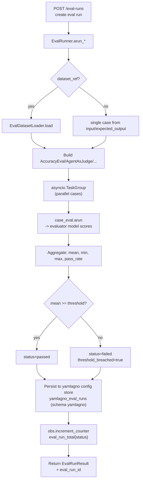
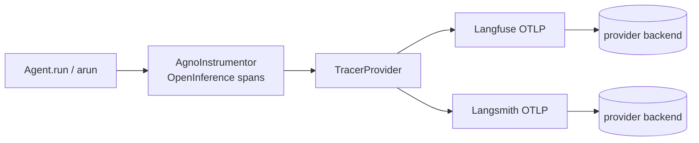

# SPEC_18_EVALS_AND_OBSERVABILITY

> **Propósito**: Especificar el sistema de evaluaciones Agno (accuracy, agent-as-judge, performance, reliability) y el catálogo de 16 providers de observabilidad OTel (export de traces hacia backends externos), todo mapeado desde YAML y orquestado por el `ObservabilityManager` de Core Infra. **SPEC_18 NO persiste traces en DB**; el tracing-to-DB es propiedad de SPEC_27.

---

## 0. FRONTERA CON SPEC_09 (LECTURA OBLIGATORIA)

Existe una frontera deliberada entre SPEC_09 y SPEC_18. Ambos tocan observabilidad, pero en capas distintas.

| Dimensión | SPEC_09 (Observability & SRE) | SPEC_18 (este documento) |
|-----------|-------------------------------|--------------------------|
| **Alcance** | Telemetría genérica interna (OTel metrics/tracing SRE) | Catálogo de providers Agno + sistema de evals |
| **Responsable** | `ObservabilityManager` + `LoggerManager` (Ports Core Infra) | `ObservabilityProviderRegistry` + `EvalRunner` (este SPEC) |
| **Contracto** | Port (Protocol): `start_span`, `increment_counter` | Adapter por provider (Langfuse, Langsmith, ...) + modelos de Eval |
| **Qué captura** | RED metrics, spans SRE propios de yaml-agno | Traces de LLM/tool/agent que Agno exporta via OpenInference/OpenLIT |
| **Circuit Breaker / Retry** | Sí (definido aquí referencia) | Hereda de SPEC_09 (no redefine) |
| **Datasets / Scoring** | No | Sí (AccuracyEval, AgentAsJudge, PerformanceEval, ReliabilityEval) |
| **Tracing to DB** | No | No (delegado a SPEC_27) |

**Regla de oro**:
- Si la pregunta es "¿qué span/métrica SRE emito cuando un agente falla?" → SPEC_09.
- Si la pregunta es "¿cómo persisto traces en una DB dedicada / query `GET /traces`?" → SPEC_27 (tracing-to-DB).
- Si la pregunta es "¿cómo activo Langfuse o corro un AccuracyEval?" → SPEC_18.

SPEC_18 **consume** el `ObservabilityManager` de SPEC_09 (Port) y le inyecta adapters concretos de cada provider. No redefine el Port. No redefine Circuit Breaker ni Retry (ver SPEC_09 secciones 3.1 y 3.2).

**Frontera de persistencia (SPEC_03 iter2)**: yaml-agno NO persiste runtime (eso es Agno = tablas `agno_*`). El tracing-to-DB es propiedad exclusiva de SPEC_27, que delega a `agno.tracing.setup_tracing` + `agno.tracing.DatabaseSpanExporter`. SPEC_18 cubre **únicamente** evals + la configuración de EXPORT de los 16 providers de observabilidad (Langfuse, Langsmith, Logfire, ...); nunca construye `trace_db`, `DbSpanExporter` ni `TraceExporter` propios, y no define `TRACE_DB_URL`.

**Referencia cruzada explícita**:
- Port `ObservabilityManager`: SPEC_09 §1.2.
- Métricas base (`agent_execution_*`): SPEC_09 §2.1.
- Circuit Breaker y `ResilientExecutor`: SPEC_09 §3.1, §3.3.
- Retención / sampling de spans: SPEC_09 §5 (preguntas de calibración).
- Tracing-to-DB (setup_tracing, DatabaseSpanExporter, `GET /traces`): SPEC_27.
- Frontera de persistencia y resolución de variables (ConfigManager / SecretManager, sin `os.environ` crudo): SPEC_03 §2 y SPEC_00.

---

## 1. EVALS - CATÁLOGO DE TIPOS DE EVALUACIÓN

### 1.1 Clasificación de Evals

Agno expone cuatro familias de evaluación. yaml-agno las mapea desde un bloque YAML `evals:`.

| Eval | Módulo Agno | Qué mide | Salida | Score |
|------|-------------|----------|--------|-------|
| **AccuracyEval** | `agno.eval.accuracy` | Coincidencia contra gold-standard (`expected_output`) vía LLM-as-judge | `AccuracyResult` con `avg_score` (0-10) | numérico |
| **AgentAsJudgeEval** | `agno.eval.agent_as_judge` | Criterios de calidad custom (tono, factualidad, usabilidad) | resultado con `scoring_strategy` numeric/binary | numérico o binario |
| **PerformanceEval** | `agno.eval.performance` | Latencia y huella de memoria | `PerformanceResult` (runtime, memory) | métrica |
| **ReliabilityEval** | `agno.eval.reliability` | Tool calls esperados, manejo de errores, rate limits | `ReliabilityResult` con `assert_passed()` | pass/fail |

### 1.2 AccuracyEval - LLM-as-Judge contra Gold Standard

Compara la respuesta real del agente contra `expected_output`. Un modelo evaluador (`model`) puntúa la coincidencia.

```python
# yaml-agno/src/evals/accuracy_adapter.py

from typing import Optional
from agno.eval.accuracy import AccuracyEval, AccuracyResult
from agno.run.agent import RunOutput

class AccuracyEvalAdapter:
    """
    Adapter de AccuracyEval.
    LLM-as-judge: un modelo puntúa cuán cerca está la respuesta del agente
    del expected_output, usando additional_guidelines opcional.
    """

    def __init__(
        self,
        name: str,
        evaluator_model: str,
        agent_ref: str,
        team_ref: Optional[str] = None,
        input: str = "",
        expected_output: str = "",
        additional_guidelines: Optional[str] = None,
        num_iterations: int = 1,
    ):
        self.name = name
        self.evaluator_model = evaluator_model
        self.agent_ref = agent_ref
        self.team_ref = team_ref
        self.input = input
        self.expected_output = expected_output
        self.additional_guidelines = additional_guidelines
        self.num_iterations = num_iterations

    def build(self, resolved_agent, resolved_model) -> AccuracyEval:
        return AccuracyEval(
            name=self.name,
            model=resolved_model,
            agent=resolved_agent,
            input=self.input,
            expected_output=self.expected_output,
            additional_guidelines=self.additional_guidelines,
            num_iterations=self.num_iterations,
        )

    def run_with_output(self, output: str, eval_obj: AccuracyEval) -> Optional[AccuracyResult]:
        """Permite evaluar contra una salida ya generada (sin re-ejecutar el agente)."""
        return eval_obj.run_with_output(output=output, print_results=False)
```

**Patrones soportados** (derivados de docs Agno):
- Eval con tools (`agent` con `CalculatorTools`).
- Eval contra output dado (`run_with_output`).
- Eval async (`arun`).
- Eval con Team (`team=` en lugar de `agent=`).
- Custom evaluator agent (`evaluator_agent=` con `output_schema=AccuracyAgentResponse`).

### 1.3 AgentAsJudgeEval - Criterios de Calidad Custom

Permite definir criterios arbitrarios ("tono profesional", "precisión factual") y un modelo juzga.

```python
# yaml-agno/src/evals/agent_as_judge_adapter.py

from typing import Optional, Union, List, Callable
from agno.eval.agent_as_judge import AgentAsJudgeEval

class AgentAsJudgeEvalAdapter:
    """
    Adapter de AgentAsJudgeEval.

    scoring_strategy: "numeric" (1-10) o "binary" (pass/fail).
    threshold: mínimo para pasar (solo numeric).
    on_fail: callback cuando el eval falla (para alertas/HITL).
    cases: lista de pares input/output para evaluación batch.
    """

    def __init__(
        self,
        name: str,
        criteria: str,
        scoring_strategy: str = "binary",   # "numeric" | "binary"
        threshold: int = 7,
        evaluator_model: Optional[str] = None,
        evaluator_agent_ref: Optional[str] = None,
        additional_guidelines: Optional[Union[str, List[str]]] = None,
        on_fail: Optional[Callable] = None,
        run_in_background: bool = False,
        debug_mode: bool = False,
    ):
        self.criteria = criteria
        self.scoring_strategy = scoring_strategy
        self.threshold = threshold
        self.evaluator_model = evaluator_model
        self.evaluator_agent_ref = evaluator_agent_ref
        self.additional_guidelines = additional_guidelines
        self.on_fail = on_fail
        self.run_in_background = run_in_background
        self.debug_mode = debug_mode

    def build(self, resolved_model, resolved_evaluator_agent) -> AgentAsJudgeEval:
        kwargs = dict(
            name=self.name,
            criteria=self.criteria,
            scoring_strategy=self.scoring_strategy,
            threshold=self.threshold,
            additional_guidelines=self.additional_guidelines,
            on_fail=self.on_fail,
            run_in_background=self.run_in_background,
            debug_mode=self.debug_mode,
        )
        if resolved_evaluator_agent is not None:
            kwargs["evaluator_agent"] = resolved_evaluator_agent
        elif resolved_model is not None:
            kwargs["model"] = resolved_model
        return AgentAsJudgeEval(**kwargs)
```

| Parámetro | Tipo | Default | Descripción |
|-----------|------|---------|-------------|
| `criteria` | `str` | `""` | Criterio de calidad (requerido) |
| `scoring_strategy` | `Literal["numeric","binary"]` | `"binary"` | Modo de puntaje |
| `threshold` | `int` | `7` | Mínimo para pasar (solo numeric) |
| `on_fail` | `Optional[Callable]` | `None` | Callback en fallo |
| `additional_guidelines` | `Optional[Union[str, List[str]]]` | `None` | Guías extra |
| `evaluator_agent` | `Optional[Agent]` | `None` | Agente evaluador custom |
| `run_in_background` | `bool` | `False` | Non-blocking |

**Nota**: `run(input=..., output=...)` para evaluación simple o `run(cases=[...])` para batch. Mutuamente excluyentes.

### 1.4 PerformanceEval - Latencia y Memoria

```python
# yaml-agno/src/evals/performance_adapter.py

from agno.eval.performance import PerformanceEval

class PerformanceEvalAdapter:
    """
    Mide runtime y memory footprint.
    num_iterations: repeticiones para promediar.
    warmup_runs: descartar N primeras.
    measure_runtime: si False, solo mide memoria (útil para memory_growth_tracking).
    memory_growth_tracking: detectar leaks en runs repetidos (Teams con memoria).
    """

    def __init__(
        self,
        name: str,
        func_ref: str,          # callable sync o async (agent factory / run fn)
        num_iterations: int = 1,
        warmup_runs: int = 0,
        measure_runtime: bool = True,
        memory_growth_tracking: bool = False,
        debug_mode: bool = False,
        is_async: bool = False,
    ):
        self.name = name
        self.func_ref = func_ref
        self.num_iterations = num_iterations
        self.warmup_runs = warmup_runs
        self.measure_runtime = measure_runtime
        self.memory_growth_tracking = memory_growth_tracking
        self.debug_mode = debug_mode
        self.is_async = is_async

    def build(self, resolved_func) -> PerformanceEval:
        return PerformanceEval(
            name=self.name,
            func=resolved_func,
            num_iterations=self.num_iterations,
            warmup_runs=self.warmup_runs,
            measure_runtime=self.measure_runtime,
            memory_growth_tracking=self.memory_growth_tracking,
            debug_mode=self.debug_mode,
        )
```

**Requiere**: Agno's `PerformanceEval` mide memoria con la stdlib `tracemalloc` (`agno/eval/performance.py`) — NO requiere `pip install memory_profiler`. El `func_ref` resuelve a una callable registrada (factory de agente o función `run_agent`).

### 1.5 ReliabilityEval - Tool Calls y Errores

```python
# yaml-agno/src/evals/reliability_adapter.py

from typing import Optional, List
from agno.eval.reliability import ReliabilityEval, ReliabilityResult
from agno.run.agent import RunOutput
from agno.run.team import TeamRunOutput

class ReliabilityEvalAdapter:
    """
    Verifica que el agente/team haga los tool calls esperados.
    Acepta agent_response (RunOutput) o team_response (TeamRunOutput).
    expected_tool_calls: lista de nombres de tools que debieron invocarse.

    @ai-directive (real API): ReliabilityEval.run()/arun() take ONLY ``print_results``
    (reliability.py:216, :302). The agent/team response is a CONSTRUCTOR field, NOT a
    run() kwarg. So the response must be passed to build() and a fresh ReliabilityEval
    is constructed per response (the eval is a dataclass, cheap to build).
    """

    def __init__(
        self,
        name: str,
        expected_tool_calls: List[str],
    ):
        self.name = name
        self.expected_tool_calls = expected_tool_calls

    def build(
        self,
        response: Optional[RunOutput | TeamRunOutput] = None,
    ) -> ReliabilityEval:
        """Build a ReliabilityEval wired with the response to score.

        Args:
            response: the RunOutput (agent) or TeamRunOutput (team) to evaluate.
                Required before run()/arun(); ReliabilityEval enforces exactly one of
                agent_response / team_response at run time.

        Returns:
            A ReliabilityEval with expected_tool_calls and the response set.
        """
        kwargs: dict = {
            "name": self.name,
            "expected_tool_calls": self.expected_tool_calls,
        }
        if isinstance(response, TeamRunOutput):
            kwargs["team_response"] = response
        elif isinstance(response, RunOutput):
            kwargs["agent_response"] = response
        return ReliabilityEval(**kwargs)

    def evaluate(
        self,
        response: RunOutput | TeamRunOutput,
    ) -> Optional[ReliabilityResult]:
        """Build a fresh eval wired to ``response`` and run it synchronously.

        Args:
            response: the RunOutput (agent) or TeamRunOutput (team) to evaluate.

        Returns:
            The ReliabilityResult, or None if the underlying eval returned None.
        """
        eval_obj = self.build(response=response)
        result = eval_obj.run(print_results=False)
        return result

    async def arun_evaluate(
        self,
        response: RunOutput | TeamRunOutput,
    ) -> Optional[ReliabilityResult]:
        """Async variant of evaluate()."""
        eval_obj = self.build(response=response)
        result = await eval_obj.arun(print_results=False)
        return result
```

**Para Teams**: `expected_tool_calls` puede incluir `delegate_task_to_member` (tool de delegación) además de tools de miembros.

### 1.6 Eval Datasets

Los datasets son conjuntos de casos (input/expected_output) cargados desde archivos.

```yaml
# yaml-agno/datasets/calculator_eval_dataset.yaml
name: calculator_eval_dataset
version: "1.0.0"
format: accuracy            # accuracy | agent_as_judge | reliability
cases:
  - id: case_001
    input: "What is 10*5 then to the power of 2? do it step by step"
    expected_output: "2500"
    additional_guidelines: "Output should include steps and final answer."
  - id: case_002
    input: "What is 10!?"
    expected_output: "3628800"
  - id: case_003
    input: "9.11 and 9.9 -- which is bigger?"
    expected_output: "9.9"
    additional_guidelines: "OK to include additional relevant text."
```

```python
# yaml-agno/src/evals/dataset_loader.py

from pathlib import Path
from typing import List
import yaml
from pydantic import BaseModel, Field

class EvalCase(BaseModel):
    id: str
    input: str
    expected_output: str | None = None
    additional_guidelines: str | None = None
    metadata: dict = Field(default_factory=dict)

class EvalDataset(BaseModel):
    name: str
    version: str = "1.0.0"
    format: str                # accuracy | agent_as_judge | reliability
    cases: List[EvalCase]

class EvalDatasetLoader:
    """Carga datasets YAML desde el directorio datasets/."""

    def __init__(self, datasets_dir: Path):
        self.datasets_dir = datasets_dir

    def load(self, dataset_name: str) -> EvalDataset:
        path = self.datasets_dir / f"{dataset_name}.yaml"
        if not path.exists():
            raise FileNotFoundError(f"Eval dataset not found: {path}")
        raw = yaml.safe_load(path.read_text(encoding="utf-8"))
        return EvalDataset.model_validate(raw)

    def list_datasets(self) -> List[str]:
        return [
            p.stem for p in self.datasets_dir.glob("*.yaml")
        ]
```

---

## 2. EVAL RUNS Y SCORING

### 2.1 EvalRun - Ejecución Orquestada

Un `EvalRun` itera sobre un dataset (o caso simple), ejecuta el eval, agrega scores y persiste el resultado.

```python
# yaml-agno/src/evals/runner.py

import asyncio
from dataclasses import dataclass, field
from datetime import datetime, timezone
from typing import Any, Optional
from uuid import uuid4

@dataclass
class EvalRunResult:
    run_id: str
    eval_name: str
    eval_type: str                 # accuracy | agent_as_judge | performance | reliability
    started_at: datetime
    finished_at: Optional[datetime] = None
    case_results: list[dict] = field(default_factory=list)
    aggregate: dict = field(default_factory=dict)
    status: str = "running"        # running | passed | failed | error
    threshold_breached: bool = False

class EvalRunner:
    """
    Runs an eval over one or several cases.
    Uses asyncio.TaskGroup to parallelize cases (NOT asyncio.gather).
    Persists eval-run results to the yamlagno.* config-store table
    `yamlagno_eval_runs` (NOT Agno `agno_*` — see §2.3).
    Trace persistence is NOT this component's concern (SPEC_27 owns tracing-to-DB).
    """

    def __init__(self, db, observability_manager):
        self.db = db
        self.obs = observability_manager

    async def _persist(self, run: EvalRunResult) -> None:
        """Persist an eval-run result to the yamlagno.* config store.

        When `self.db` is None (unit tests in TASK_005/TASK_012 that exercise
        scoring/span wiring, not persistence), this is a NO-OP: the run is
        returned in-memory and no row is written. When `self.db` is a real
        core-cenf DatabaseManager, the run is written to `yamlagno_eval_runs`
        (schema yamlagno, tenant_id NOT NULL, explicit WHERE) via
        `db.get_repository(EvalRunRecord)` inside `async with db.transaction()`.
        Tests that assert persistence MUST pass a fake db (or assert via the
        repository); tests that only assert scoring/spans pass `db=None`.
        """
        if self.db is None:
            return
        # real path: build EvalRunRecord(tenant_id=...) from `run` and insert
        # via db.get_repository(EvalRunRecord) inside async with self.db.transaction()

    async def arun_accuracy(
        self,
        eval_adapter,            # AccuracyEvalAdapter
        dataset: Optional[EvalDataset],
        resolved_agent,
        resolved_model,
        threshold: float = 8.0,
    ) -> EvalRunResult:
        run = EvalRunResult(
            run_id=str(uuid4()),
            eval_name=eval_adapter.name,
            eval_type="accuracy",
            started_at=datetime.now(timezone.utc),
        )

        try:
            async with self.obs.start_span("eval_run.accuracy") as span:
                span.set_attribute("eval.run_id", run.run_id)
                span.set_attribute("eval.threshold", threshold)

                cases = dataset.cases if dataset else [
                    EvalCase(id="single", input=eval_adapter.input,
                             expected_output=eval_adapter.expected_output,
                             additional_guidelines=eval_adapter.additional_guidelines)
                ]

                # Construir el eval base (compartido)
                base_eval = eval_adapter.build(resolved_agent, resolved_model)

                # Ejecutar casos en paralelo con TaskGroup
                results: list[dict] = []

                async def run_case(case: EvalCase):
                    case_eval = eval_adapter.build(resolved_agent, resolved_model)
                    case_eval.input = case.input
                    case_eval.expected_output = case.expected_output
                    if case.additional_guidelines:
                        case_eval.additional_guidelines = case.additional_guidelines
                    res = await case_eval.arun(print_results=False)
                    return {
                        "case_id": case.id,
                        "avg_score": getattr(res, "avg_score", None) if res else None,
                        "passed": (res and res.avg_score is not None and res.avg_score >= threshold),
                    }

                async with asyncio.TaskGroup() as tg:
                    tasks = [tg.create_task(run_case(c)) for c in cases]

                for t in tasks:
                    results.append(t.result())

                run.case_results = results
                scores = [r["avg_score"] for r in results if r["avg_score"] is not None]
                run.aggregate = {
                    "count": len(results),
                    "mean_score": sum(scores) / len(scores) if scores else 0.0,
                    "min_score": min(scores) if scores else 0.0,
                    "max_score": max(scores) if scores else 0.0,
                    "pass_rate": sum(1 for r in results if r["passed"]) / len(results) if results else 0.0,
                }
                run.threshold_breached = run.aggregate["mean_score"] < threshold
                run.status = "failed" if run.threshold_breached else "passed"
                run.finished_at = datetime.now(timezone.utc)

                # Métrica de resultado de eval
                self.obs.increment_counter(
                    "eval_run_total",
                    labels={
                        "eval_type": "accuracy",
                        "eval_name": run.eval_name,
                        "status": run.status,
                    },
                )

            await self._persist(run)
            return run

        except Exception as e:
            run.status = "error"
            run.finished_at = datetime.now(timezone.utc)
            self.obs.increment_counter(
                "eval_run_errors_total",
                labels={"eval_type": "accuracy", "error_type": type(e).__name__},
            )
            raise
```

### 2.2 Reglas de Scoring por Tipo

| Eval | Score | Pass cond | Threshold default |
|------|-------|-----------|-------------------|
| Accuracy | `avg_score` 0-10 | `avg_score >= threshold` | 8.0 |
| AgentAsJudge (numeric) | 1-10 | `score >= threshold` | 7 |
| AgentAsJudge (binary) | pass/fail | `result == pass` | n/a |
| Performance | runtime_ms, mem_mb | `runtime_ms <= p95_target` | configurable |
| Reliability | bool | `assert_passed()` no lanza | todos los tool calls presentes |

### 2.3 Persistencia de Eval Runs

<!-- @ai-directive TABLE OWNERSHIP: eval_runs is a yamlagno.* config-store table,
     NOT an Agno runtime agno_* table. Agno does NOT ship an eval_runs table, and
     agno_* tables cannot carry tenant_id (authoritative decision A.9/A.11), so
     reusing them would either not persist evals at all or leak them across
     tenants. The table is provisioned by ConfigStoreProvisioner (SPEC_03 §6). -->

Los eval runs se persisten en la tabla **yamlagno.\*** `yamlagno_eval_runs`
(schema `yamlagno`, columna `tenant_id` NOT NULL, `WHERE tenant_id = ...`
explícito en cada query). NO se persisten en tablas runtime `agno_*` de Agno:
Agno no tiene tabla `eval_runs`, y las `agno_*` no pueden llevar `tenant_id`
(decisiones A.9/A.11) — hacerlo filtraría eval runs cruz-tenant. El `db`
inyectado en `EvalRunner.__init__` es el `DatabaseManager` de core-cenf (el
mismo config store de SPEC_03); `_persist` lo escribe via
`db.get_repository(EvalRunRecord)` dentro de `async with db.transaction()`.
La persistencia de traces (spans) NO es responsabilidad de SPEC_18: es
propiedad de SPEC_27 (tracing-to-DB). yaml-agno expone endpoints REST
`GET/POST/PATCH/DELETE /eval-runs` (definido en SPEC_19).

```python
# yaml-agno/src/evals/records.py
# Config-store record (schema yamlagno), provisioned by ConfigStoreProvisioner.
from sqlalchemy.orm import DeclarativeBase, Mapped, mapped_column
from sqlalchemy import String, Text, DateTime
from datetime import datetime, timezone

class _EvalBase(DeclarativeBase):
    """Shared DeclarativeBase for yaml-agno eval tables (schema yamlagno)."""

class EvalRunRecord(_EvalBase):
    """Persistent eval-run row in the yamlagno config store.

    Google-style: provisioned by ConfigStoreProvisioner (SPEC_03 §6), never by
    a per-spec migration. Multi-tenant isolation is EXPLICIT: tenant_id is
    NOT NULL and every query filters by it (authoritative decisions A.9/A.11).
    """
    __tablename__ = "yamlagno_eval_runs"
    __table_args__ = {"schema": "yamlagno"}

    id: Mapped[str] = mapped_column(Text, primary_key=True)
    tenant_id: Mapped[str] = mapped_column(Text, nullable=False, index=True)
    eval_type: Mapped[str] = mapped_column(Text, nullable=False)
    eval_name: Mapped[str] = mapped_column(Text, nullable=False)
    agent_id: Mapped[str | None] = mapped_column(Text, nullable=True, index=True)
    team_id: Mapped[str | None] = mapped_column(Text, nullable=True)
    status: Mapped[str] = mapped_column(Text, nullable=False)
    aggregate_json: Mapped[str | None] = mapped_column(Text, nullable=True)
    case_results_json: Mapped[str | None] = mapped_column(Text, nullable=True)
    user_id: Mapped[str | None] = mapped_column(Text, nullable=True)
    created_at: Mapped[datetime] = mapped_column(
        DateTime(timezone=True), nullable=False,
        default=lambda: datetime.now(timezone.utc),
    )

# Conceptual columns:
#   id, tenant_id, eval_type, eval_name, agent_id, team_id, status,
#   aggregate_json, case_results_json, created_at, user_id
```

---

## 3. CATÁLOGO DE 16 OBSERVABILITY PROVIDERS

Todos los providers se integran vía OpenTelemetry (mayoría vía OpenInference `openinference-instrumentation-agno`) o via SDK propio. yaml-agno los abstrae detrás de un adapter uniforme.

### 3.1 Tabla Maestra de Providers

> La columna "Env Vars Clave" lista las variables que el **provider SDK** consume internamente.
> yaml-agno NO las lee de `os.environ` crudo: las resuelve vía `config.get_string` /
> `await secrets.get_secret` (core) y las inyecta al SDK (ver §3.2.0). Son referencia del
> catálogo, no un contrato de acceso directo al entorno.

| # | Provider | Captura | Env Vars Clave | Instalación | Estrategia |
|---|----------|---------|----------------|-------------|------------|
| 1 | **AgentOps** | agent runs, team coordination, tool usage, workflows | `AGENTOPS_API_KEY` | `agentops` | `agentops.init()` |
| 2 | **Arize Phoenix** | traces, LLM spans, performance | `ARIZE_PHOENIX_API_KEY`, `PHOENIX_COLLECTOR_ENDPOINT` | `arize-phoenix openinference-instrumentation-agno` | `phoenix.otel.register()` |
| 3 | **Atla** | monitoring, automated eval, analytics | `ATLA_API_KEY` | `atla-insights` | `configure()` + `instrument_agno()` |
| 4 | **LangDB** | AI gateway, agent runs, tool calls, perf metrics | `LANGDB_API_KEY`, `LANGDB_PROJECT_ID` | `pylangdb[agno]` | `pylangdb.agno.init()` |
| 5 | **Langfuse** | traces, model calls, cost | `LANGFUSE_PUBLIC_KEY`, `LANGFUSE_SECRET_KEY` | `langfuse openinference-instrumentation-agno` | OTLP + OpenInference/OpenLIT |
| 6 | **Langsmith** | traces, model calls | `LANGSMITH_API_KEY`, `LANGSMITH_PROJECT`, `LANGSMITH_ENDPOINT`, `LANGSMITH_TRACING` | `openinference-instrumentation-agno` | OTLP + headers `x-api-key` |
| 7 | **Langtrace** | traces, model calls | `LANGTRACE_API_KEY` | `langtrace-python-sdk` | `langtrace.init()` |
| 8 | **Langwatch** | traces, monitoring | `LANGWATCH_API_KEY` | `langwatch openinference-instrumentation-agno` | `langwatch.setup(instrumentors=[...])` |
| 9 | **Latitude** | traces, evals, token/cost/latency | `LATITUDE_API_KEY`, `LATITUDE_PROJECT` | `openinference-instrumentation-agno` | OTLP + OpenInference |
| 10 | **Logfire** | traces (Pydantic) | `LOGFIRE_WRITE_TOKEN` | `openinference-instrumentation-agno` | OTLP + Authorization header |
| 11 | **Maxim** | monitoring, eval, traces | `MAXIM_API_KEY`, `MAXIM_LOG_REPO_ID` | `maxim-py` | `maxim.logger.agno.instrument_agno()` |
| 12 | **MLflow** | GenAI traces | `MLFLOW_TRACKING_URI`, `MLFLOW_EXPERIMENT_NAME` | `mlflow openinference-instrumentation-agno` | `mlflow.agno.autolog()` |
| 13 | **OpenLIT** | LLM calls, tools, costs, perf, errors | `OTEL_EXPORTER_OTLP_ENDPOINT` | `openlit` | `openlit.init()` |
| 14 | **Traceloop** | agent exec, workflows, tool calls, tokens | `TRACELOOP_API_KEY` | `traceloop-sdk` | `Traceloop.init()` (OpenLLMetry) |
| 15 | **Weave (WandB)** | model calls, visualizations | `WANDB_API_KEY` | `weave` | `weave.init()` + `@weave.op()` |
| 16 | *(OpenTelemetry puro)* | generic OTel backend (Jaeger, Tempo, etc.) | `OTEL_EXPORTER_OTLP_ENDPOINT` | `opentelemetry-sdk opentelemetry-exporter-otlp` | `OTLPSpanExporter` directo |

### 3.2 Detalle por Provider - Config YAML

yaml-agno declara providers en `observability.providers`. Cada provider tiene una clave unificada que el `ObservabilityProviderRegistry` resuelve a un adapter.

#### 3.2.0 Contrato de resolución de credenciales (SPEC_03 iter2 / SPEC_00)

<!-- @ai-directive
Contract: provider adapters NEVER read `os.environ` directly for credentials/endpoints.
yaml-agno resolves them through the core ports and then injects them into the provider SDK:
  - non-secret config (region, endpoint, project, tracking uri) -> `config.get_string("observability.<provider>.<key>")` (ConfigManager, core, dot-notation).
  - secrets (api keys, tokens, secret keys) -> `await secrets.get_secret("<provider>_<key>")` (SecretManager, core).
The provider SDKs read their own env vars internally; the only `os.environ[...] = value`
writes that remain are a CONTROLLED injection so the SDK can pick the resolved value up.
That injection is documented per-adapter and must be the last step before SDK init.
No `os.environ.setdefault` bulk passthrough exists anywhere (removed from the registry).
-->

Every adapter's `configure()` is `async` and receives the core ports it needs:

```python
# Canonical signature (all adapters follow this).
async def configure(
    self,
    tracer_provider: TracerProvider,
    config: ConfigManager,      # core, SPEC_23
    secrets: SecretManager,     # core, SPEC_23
) -> None: ...
```

`ConfigManager.get_string` and `SecretManager.get_secret` are the ONLY sanctioned accessors
for Environment-class variables (SPEC_03 §2). Dot-notation keys are namespaced under
`observability.<provider>.*`.

#### 3.2.1 Langfuse

```yaml
observability:
  tracing: true
  providers:
    - provider: langfuse
      enabled: true
      region: us                  # us | eu | self_hosted
      self_hosted_endpoint: null  # if region=self_hosted
```

```python
# yaml-agno/src/observability/providers/langfuse_adapter.py

import base64
from opentelemetry.exporter.otlp.proto.http.trace_exporter import OTLPSpanExporter
from opentelemetry.sdk.trace import TracerProvider
from opentelemetry.sdk.trace.export import SimpleSpanProcessor

LANGFUSE_ENDPOINTS = {
    "us": "https://us.cloud.langfuse.com/api/public/otel",
    "eu": "https://eu.cloud.langfuse.com/api/public/otel",
    "self_hosted": "http://localhost:3000/api/public/otel",
}

class LangfuseAdapter:
    """Configures OTLP export to Langfuse with Basic auth (public:secret base64)."""

    def __init__(self, region: str = "us", self_hosted_endpoint: str | None = None):
        self.region = region
        self.self_hosted_endpoint = self_hosted_endpoint

    async def configure(
        self,
        tracer_provider: TracerProvider,
        config: "ConfigManager",
        secrets: "SecretManager",
    ) -> None:
        endpoint = (self.self_hosted_endpoint if self.region == "self_hosted"
                    else LANGFUSE_ENDPOINTS[self.region])
        # Resolve credentials through core ports (SPEC_03 §2). No raw os.environ reads.
        public_key = config.get_string("observability.langfuse.public_key")
        secret_key = await secrets.get_secret("langfuse_secret_key")
        auth = base64.b64encode(f"{public_key}:{secret_key}".encode()).decode()
        # Controlled injection: the SDK reads these env vars, so yaml-agno seeds them
        # with the already-resolved values. This is the ONLY os.environ write here.
        import os
        os.environ["OTEL_EXPORTER_OTLP_ENDPOINT"] = endpoint
        os.environ["OTEL_EXPORTER_OTLP_HEADERS"] = f"Authorization=Basic {auth}"
        tracer_provider.add_span_processor(SimpleSpanProcessor(OTLPSpanExporter()))

    @property
    def requires_openinference(self) -> bool:
        return True
```

#### 3.2.2 Langsmith

```yaml
observability:
  providers:
    - provider: langsmith
      enabled: true
      region: us                  # us | eu
```

```python
# yaml-agno/src/observability/providers/langsmith_adapter.py

from opentelemetry.exporter.otlp.proto.http.trace_exporter import OTLPSpanExporter
from opentelemetry.sdk.trace import TracerProvider
from opentelemetry.sdk.trace.export import SimpleSpanProcessor

LANGSMITH_ENDPOINTS = {
    "us": "https://api.smith.langchain.com/otel/v1/traces",
    "eu": "https://eu.api.smith.langchain.com/otel/v1/traces",
}

class LangsmithAdapter:
    """OTLP export with x-api-key and Langsmith-Project headers."""

    def __init__(self, region: str = "us"):
        self.region = region

    async def configure(
        self,
        tracer_provider: TracerProvider,
        config: "ConfigManager",
        secrets: "SecretManager",
    ) -> None:
        endpoint = LANGSMITH_ENDPOINTS[self.region]
        # Credentials resolved via core ports (SPEC_03 §2). Project is non-secret config;
        # the api key is a secret.
        project = config.get_string("observability.langsmith.project")
        api_key = await secrets.get_secret("langsmith_api_key")
        headers = {
            "x-api-key": api_key,
            "Langsmith-Project": project,
        }
        tracer_provider.add_span_processor(
            SimpleSpanProcessor(OTLPSpanExporter(endpoint=endpoint, headers=headers))
        )

    @property
    def requires_openinference(self) -> bool:
        return True
```

#### 3.2.3 Logfire

```yaml
observability:
  providers:
    - provider: logfire
      enabled: true
      region: eu                  # us | eu
```

```python
# yaml-agno/src/observability/providers/logfire_adapter.py

LOGFIRE_ENDPOINTS = {
    "us": "https://logfire-us.pydantic.dev",
    "eu": "https://logfire-eu.pydantic.dev",
}

class LogfireAdapter:
    def __init__(self, region: str = "eu"):
        self.region = region

    async def configure(self, tracer_provider, config: "ConfigManager",
                        secrets: "SecretManager") -> None:
        token = await secrets.get_secret("logfire_write_token")
        # Controlled injection for the OTLP SDK (last step before exporter init).
        import os
        os.environ["OTEL_EXPORTER_OTLP_ENDPOINT"] = LOGFIRE_ENDPOINTS[self.region]
        os.environ["OTEL_EXPORTER_OTLP_HEADERS"] = f"Authorization={token}"
        from opentelemetry.exporter.otlp.proto.http.trace_exporter import OTLPSpanExporter
        from opentelemetry.sdk.trace.export import SimpleSpanProcessor
        tracer_provider.add_span_processor(SimpleSpanProcessor(OTLPSpanExporter()))
```

#### 3.2.4 Arize Phoenix

```yaml
observability:
  providers:
    - provider: arize
      enabled: true
      mode: cloud                  # cloud | local
      project_name: agno-stock-agent
```

```python
# yaml-agno/src/observability/providers/arize_adapter.py

class ArizeAdapter:
    """Cloud: app.phoenix.arize.com. Local: phoenix serve -> localhost:6006."""

    def __init__(self, mode: str = "cloud", project_name: str = "default"):
        self.mode = mode
        self.project_name = project_name

    async def configure(self, tracer_provider, config: "ConfigManager",
                        secrets: "SecretManager") -> None:
        from phoenix.otel import register
        if self.mode == "cloud":
            api_key = await secrets.get_secret("arize_phoenix_api_key")
            # Controlled injection for the Phoenix SDK.
            import os
            os.environ["PHOENIX_CLIENT_HEADERS"] = f"api_key={api_key}"
            os.environ["PHOENIX_COLLECTOR_ENDPOINT"] = "https://app.phoenix.arize.com"
        else:
            import os
            os.environ["PHOENIX_COLLECTOR_ENDPOINT"] = "http://localhost:6006"
        register(project_name=self.project_name, auto_instrument=True)

    @property
    def requires_openinference(self) -> bool:
        return True
```

#### 3.2.5 AgentOps

```yaml
observability:
  providers:
    - provider: agentops
      enabled: true
```

```python
# yaml-agno/src/observability/providers/agentops_adapter.py

class AgentOpsAdapter:
    """Own SDK. agentops.init() instruments everything automatically."""

    async def configure(self, tracer_provider, config: "ConfigManager",
                        secrets: "SecretManager") -> None:
        api_key = await secrets.get_secret("agentops_api_key")
        import agentops
        agentops.init(api_key=api_key)

    @property
    def requires_openinference(self) -> bool:
        return False
```

#### 3.2.6 Atla

```yaml
observability:
  providers:
    - provider: atla
      enabled: true
      instrument_target: openai   # model to instrument
```

```python
# yaml-agno/src/observability/providers/atla_adapter.py

class AtlaAdapter:
    def __init__(self, instrument_target: str = "openai"):
        self.instrument_target = instrument_target

    async def configure(self, tracer_provider, config: "ConfigManager",
                        secrets: "SecretManager") -> None:
        from atla_insights import configure, instrument_agno
        token = await secrets.get_secret("atla_api_key")
        configure(token=token)
        # instrument_agno is invoked as a context manager at runtime.
        self._instrument = instrument_agno
```

#### 3.2.7 LangDB

```yaml
observability:
  providers:
    - provider: langdb
      enabled: true
```

```python
# yaml-agno/src/observability/providers/langdb_adapter.py

class LangDBAdapter:
    async def configure(self, tracer_provider, config: "ConfigManager",
                        secrets: "SecretManager") -> None:
        api_key = await secrets.get_secret("langdb_api_key")
        project_id = config.get_string("observability.langdb.project_id")
        from pylangdb.agno import init
        init(api_key=api_key, project_id=project_id)   # before agent creation
```

#### 3.2.8 Langtrace

```yaml
observability:
  providers:
    - provider: langtrace
      enabled: true
```

```python
# yaml-agno/src/observability/providers/langtrace_adapter.py

class LangtraceAdapter:
    async def configure(self, tracer_provider, config: "ConfigManager",
                        secrets: "SecretManager") -> None:
        api_key = await secrets.get_secret("langtrace_api_key")
        from langtrace_python_sdk import langtrace
        langtrace.init(api_key=api_key)
```

#### 3.2.9 Langwatch

```yaml
observability:
  providers:
    - provider: langwatch
      enabled: true
```

```python
# yaml-agno/src/observability/providers/langwatch_adapter.py

class LangwatchAdapter:
    async def configure(self, tracer_provider, config: "ConfigManager",
                        secrets: "SecretManager") -> None:
        api_key = await secrets.get_secret("langwatch_api_key")
        import langwatch
        from openinference.instrumentation.agno import AgnoInstrumentor
        langwatch.setup(api_key=api_key, instrumentors=[AgnoInstrumentor()])
```

#### 3.2.10 Latitude

```yaml
observability:
  providers:
    - provider: latitude
      enabled: true
```

```python
# yaml-agno/src/observability/providers/latitude_adapter.py

from opentelemetry.exporter.otlp.proto.http.trace_exporter import OTLPSpanExporter
from opentelemetry.sdk.trace import TracerProvider
from opentelemetry.sdk.trace.export import SimpleSpanProcessor

class LatitudeAdapter:
    async def configure(self, tracer_provider: TracerProvider,
                        config: "ConfigManager", secrets: "SecretManager") -> None:
        # OTLP ingestion endpoint for Latitude.
        api_key = await secrets.get_secret("latitude_api_key")
        # Controlled injection for the OTLP SDK.
        import os
        os.environ["OTEL_EXPORTER_OTLP_HEADERS"] = f"Authorization=Bearer {api_key}"
        tracer_provider.add_span_processor(SimpleSpanProcessor(OTLPSpanExporter()))

    @property
    def requires_openinference(self) -> bool:
        return True
```

#### 3.2.11 Maxim

```yaml
observability:
  providers:
    - provider: maxim
      enabled: true
```

```python
# yaml-agno/src/observability/providers/maxim_adapter.py

class MaximAdapter:
    async def configure(self, tracer_provider, config: "ConfigManager",
                        secrets: "SecretManager") -> None:
        api_key = await secrets.get_secret("maxim_api_key")
        log_repo_id = config.get_string("observability.maxim.log_repo_id")
        from maxim import Maxim
        from maxim.logger.agno import instrument_agno
        maxim = Maxim(api_key=api_key, log_repo_id=log_repo_id).init()
        instrument_agno(maxim)
```

#### 3.2.12 MLflow

```yaml
observability:
  providers:
    - provider: mlflow
      enabled: true
```

```python
# yaml-agno/src/observability/providers/mlflow_adapter.py

import mlflow

class MLflowAdapter:
    async def configure(self, tracer_provider, config: "ConfigManager",
                        secrets: "SecretManager") -> None:
        tracking_uri = config.get_string("observability.mlflow.tracking_uri")
        experiment = config.get_string("observability.mlflow.experiment_name")
        mlflow.set_tracking_uri(tracking_uri)
        mlflow.set_experiment(experiment)
        mlflow.agno.autolog()
```

#### 3.2.13 OpenLIT

```yaml
observability:
  providers:
    - provider: openlit
      enabled: true
      otlp_endpoint: http://127.0.0.1:4318
```

```python
# yaml-agno/src/observability/providers/openlit_adapter.py

class OpenLITAdapter:
    def __init__(self, otlp_endpoint: str = "http://127.0.0.1:4318"):
        self.otlp_endpoint = otlp_endpoint

    async def configure(self, tracer_provider, config: "ConfigManager",
                        secrets: "SecretManager") -> None:
        import openlit
        openlit.init(otlp_endpoint=self.otlp_endpoint,
                     tracer=tracer_provider.get_tracer(__name__), disable_batch=True)
```

#### 3.2.14 Traceloop

```yaml
observability:
  providers:
    - provider: traceloop
      enabled: true
      app_name: agno_agent
```

```python
# yaml-agno/src/observability/providers/traceloop_adapter.py

class TraceloopAdapter:
    def __init__(self, app_name: str = "agno_agent"):
        self.app_name = app_name

    async def configure(self, tracer_provider, config: "ConfigManager",
                        secrets: "SecretManager") -> None:
        api_key = await secrets.get_secret("traceloop_api_key")
        from traceloop.sdk import Traceloop
        Traceloop.init(app_name=self.app_name, api_key=api_key)
```

#### 3.2.15 Weave (WandB)

```yaml
observability:
  providers:
    - provider: weave
      enabled: true
      project: agno
```

```python
# yaml-agno/src/observability/providers/weave_adapter.py

class WeaveAdapter:
    def __init__(self, project: str = "agno"):
        self.project = project

    async def configure(self, tracer_provider, config: "ConfigManager",
                        secrets: "SecretManager") -> None:
        api_key = await secrets.get_secret("wandb_api_key")
        import weave
        weave.init(project_name=self.project, api_key=api_key)
        # Target functions are decorated with @weave.op() at runtime.
```

#### 3.2.16 OpenTelemetry puro (fallback genérico)

```yaml
observability:
  providers:
    - provider: opentelemetry
      enabled: true
      # Jaeger, Tempo, etc. Endpoint is non-secret config (ConfigManager).
```

```python
# yaml-agno/src/observability/providers/otel_adapter.py

class OtelAdapter:
    async def configure(self, tracer_provider, config: "ConfigManager",
                        secrets: "SecretManager") -> None:
        otlp_endpoint = config.get_string("observability.opentelemetry.otlp_endpoint")
        from opentelemetry.exporter.otlp.proto.http.trace_exporter import OTLPSpanExporter
        from opentelemetry.sdk.trace.export import BatchSpanProcessor
        exporter = OTLPSpanExporter(endpoint=otlp_endpoint)
        tracer_provider.add_span_processor(BatchSpanProcessor(exporter))
```

---

## 4. OBSERVABILITY PROVIDER REGISTRY

### 4.1 Registry - Resolución Declarativa

El registry mapea el string `provider:` del YAML a una clase adapter.

```python
# yaml-agno/src/observability/provider_registry.py

from typing import Protocol, Type
from pydantic import BaseModel, Field
from opentelemetry.sdk.trace import TracerProvider

class ObservabilityProvider(Protocol):
    """Contrato uniforme de todo adapter de provider.

    @ai-directive configure() is async and resolves every credential/endpoint via the
    core ports (ConfigManager.get_string / SecretManager.get_secret), NOT via os.environ.
    The only os.environ writes allowed are a controlled final injection into the provider
    SDK (see 3.2.0). No bulk env passthrough is performed by the registry.
    """
    async def configure(
        self,
        tracer_provider: TracerProvider,
        config: "ConfigManager",
        secrets: "SecretManager",
    ) -> None: ...
    @property
    def requires_openinference(self) -> bool: ...

class ProviderConfig(BaseModel):
    provider: str                 # langfuse | langsmith | ...
    enabled: bool = True
    region: str | None = None
    mode: str | None = None
    project_name: str | None = None
    project: str | None = None
    otlp_endpoint: str | None = None
    self_hosted_endpoint: str | None = None
    app_name: str | None = None
    instrument_target: str | None = None
    headers: dict = Field(default_factory=dict)

class ObservabilityProviderRegistry:
    """
    Registro declarativo de providers.
    Resuelve el string del YAML a un adapter concreto.
    Credentials/endpoints are resolved inside each adapter via the core ports
    (ConfigManager / SecretManager), never through os.environ bulk passthrough.
    """

    def __init__(self, dependency_manager: "DependencyManager"):
        # @ai-directive LAZY LOADING: NO se importan los adapters al construir el registry
        # (eso sería eager import de 16 providers de una vez).
        # En su lugar se registra un mapa provider -> ruta de import, y la import
        # real del adapter se difiere al primer resolve() de cada provider,
        # via el DependencyManager del Core (carga perezosa por provider).
        # Solo el provider efectivamente configurado en el YAML se carga en runtime.
        self._dependency_manager = dependency_manager   # Core Infra (SPEC_00)
        self._adapters: dict[str, Type[ObservabilityProvider]] = {}
        self._adapter_paths: dict[str, tuple[str, str]] = {}
        self._register_defaults()

    def _register_defaults(self) -> None:
        """Registra rutas de import (sin importar los módulos todavía)."""
        self._adapter_paths = {
            "langfuse":        (".providers.langfuse_adapter",   "LangfuseAdapter"),
            "langsmith":       (".providers.langsmith_adapter",  "LangsmithAdapter"),
            "logfire":         (".providers.logfire_adapter",    "LogfireAdapter"),
            "arize":           (".providers.arize_adapter",      "ArizeAdapter"),
            "agentops":        (".providers.agentops_adapter",   "AgentOpsAdapter"),
            "atla":            (".providers.atla_adapter",       "AtlaAdapter"),
            "langdb":          (".providers.langdb_adapter",     "LangDBAdapter"),
            "langtrace":       (".providers.langtrace_adapter",  "LangtraceAdapter"),
            "langwatch":       (".providers.langwatch_adapter",  "LangwatchAdapter"),
            "latitude":        (".providers.latitude_adapter",    "LatitudeAdapter"),
            "maxim":           (".providers.maxim_adapter",       "MaximAdapter"),
            "mlflow":          (".providers.mlflow_adapter",       "MLflowAdapter"),
            "openlit":         (".providers.openlit_adapter",      "OpenLITAdapter"),
            "traceloop":       (".providers.traceloop_adapter",    "TraceloopAdapter"),
            "weave":           (".providers.weave_adapter",        "WeaveAdapter"),
            "opentelemetry":   (".providers.otel_adapter",         "OtelAdapter"),
        }

    def _load_adapter(self, provider: str) -> Type[ObservabilityProvider]:
        """Lazy import: solo carga el módulo del provider solicitado (via DependencyManager)."""
        if provider in self._adapters:
            return self._adapters[provider]
        if provider not in self._adapter_paths:
            raise ValueError(f"Unknown observability provider: {provider}")
        module_path, class_name = self._adapter_paths[provider]
        # DependencyManager (Core) resuelve el import perezoso y cachea la clase.
        cls = self._dependency_manager.import_class(module_path, class_name)
        self._adapters[provider] = cls  # cache para llamadas subsiguientes
        return cls

    def resolve(self, config: ProviderConfig) -> ObservabilityProvider:
        # Lazy import of the adapter ONLY for the actually-configured provider.
        # @ai-directive: NO os.environ bulk passthrough here. Credentials and endpoints
        # are resolved inside adapter.configure() via the core ports (SPEC_03 §2).
        cls = self._load_adapter(config.provider)
        return self._instantiate(cls, config)

    def _instantiate(self, cls, config: ProviderConfig) -> ObservabilityProvider:
        kwargs = {}
        for f in ("region", "mode", "project_name", "project",
                  "otlp_endpoint", "self_hosted_endpoint",
                  "app_name", "instrument_target", "headers"):
            v = getattr(config, f, None)
            if v is not None:
                kwargs[f] = v
        return cls(**kwargs)

    def list_providers(self) -> list[str]:
        # Lista todos los providers registrados sin importarlos (lazy-safe).
        return sorted(self._adapter_paths.keys())
```

### 4.2 Integración con ObservabilityManager (Core Infra)

El `ObservabilityManager` de SPEC_09 es el Port. SPEC_18 le inyecta el TracerProvider configurado con los providers resueltos.

```python
# yaml-agno/src/observability/bootstrap.py

from opentelemetry.sdk.trace import TracerProvider
from opentelemetry import trace as trace_api

class ObservabilityBootstrap:
    """
    Builds the TracerProvider, registers every active provider, activates
    OpenInference if any provider requires it, and wires it into the
    ObservabilityManager (Port of SPEC_09).
    """

    def __init__(self, registry: ObservabilityProviderRegistry):
        self.registry = registry

    async def bootstrap(
        self,
        provider_configs: list[ProviderConfig],
        config: "ConfigManager",     # core, SPEC_23
        secrets: "SecretManager",    # core, SPEC_23
    ):
        provider = TracerProvider()
        needs_openinference = False

        for cfg in provider_configs:
            if not cfg.enabled:
                continue
            adapter = self.registry.resolve(cfg)
            # Adapters resolve credentials via the core ports; configure() is async.
            await adapter.configure(provider, config, secrets)
            if getattr(adapter, "requires_openinference", False):
                needs_openinference = True

        if needs_openinference:
            try:
                from openinference.instrumentation.agno import AgnoInstrumentor
                AgnoInstrumentor().instrument(tracer_provider=provider)
            except ImportError:
                # warn: OpenInference not installed but a provider requires it.
                pass

        trace_api.set_tracer_provider(provider)
        return provider
```

---

## 5. TRACING-TO-DB - DELEGACIÓN A SPEC_27

<!-- @ai-directive
Boundary (SPEC_03 iter2): yaml-agno does NOT persist runtime, and does NOT own
tracing-to-DB. SPEC_18 previously defined trace_db / DbSpanExporter / TraceExporter /
TraceDbConfig / TraceExportConfig / TRACE_DB_URL; ALL removed in iter2.
Tracing-to-DB is owned by SPEC_27, which delegates to:
  - agno.tracing.setup_tracing
  - agno.tracing.DatabaseSpanExporter
SPEC_18 keeps ONLY evals + the 16 observability provider EXPORT adapters (section 3).
It never constructs a trace database, never defines a traces/spans schema, and never
exposes GET /traces (that query surface lives in SPEC_27).
-->

### 5.1 Qué cubre SPEC_18 y qué NO

| Concern | Owner | Notes |
|---------|-------|-------|
| Eval execution (accuracy / agent-as-judge / performance / reliability) | **SPEC_18** | This document, sections 1, 2, 7. |
| Provider EXPORT configuration (Langfuse, Langsmith, ... 16 providers) | **SPEC_18** | This document, section 3. Adapters resolve credentials via core ConfigManager / SecretManager. |
| Tracing-to-DB (`setup_tracing`, `DatabaseSpanExporter`, dedicated trace DB) | **SPEC_27** | yaml-agno delegates; never redefines. |
| Trace query API (`GET /traces`, `GET /traces/search`) | **SPEC_27** | Not exposed by SPEC_18. |
| Traces/spans relational schema | **SPEC_27** / Agno | yaml-agno does not model it. |

### 5.2 Activación de tracing-to-DB (referencia, NO implementación aquí)

When `observability.tracing: true` is set in YAML, the bootstrap hands the configured
`TracerProvider` (with the active provider EXPORT processors from section 3) to SPEC_27,
which wires `agno.tracing.setup_tracing` and, if a dedicated trace database is configured
in SPEC_27, attaches `agno.tracing.DatabaseSpanExporter`. SPEC_18 does not hold a
reference to any trace database and does not define `TRACE_DB_URL`.

```python
# Conceptual hand-off (implemented in SPEC_27, referenced here for boundary clarity).
# SPEC_18 builds the provider TracerProvider; SPEC_27 owns trace persistence.
# from agno.tracing import setup_tracing, DatabaseSpanExporter   # SPEC_27
```

---

## 6. YAML SCHEMAS COMPLETOS

### 6.1 Schema Observability (providers + tracing)

```yaml
# yaml-agno/config/observability.yaml
observability:
  # Activar tracing OTel global (mapea a AgentOS(tracing=True))
  tracing: true

  # NOTE: trace_db / trace_export were removed in iter2. Tracing-to-DB is owned by
  # SPEC_27 (agno.tracing.setup_tracing + DatabaseSpanExporter). SPEC_18 only configures
  # provider EXPORT here. Credentials are resolved via core ConfigManager/SecretManager
  # (no `env:` passthrough block, no os.environ reads - see 3.2.0).

  # Multiple providers active simultaneously.
  providers:
    - provider: langfuse
      enabled: true
      region: us

    - provider: langsmith
      enabled: false
      region: us

    - provider: logfire
      enabled: false
      region: eu
```

### 6.2 Schema Evals

```yaml
# yaml-agno/config/evals.yaml
evals:
  # Thresholds globales (override por eval)
  defaults:
    accuracy_threshold: 8.0
    agent_as_judge_threshold: 7
    performance_p95_ms: 5000

  accuracy:
    - name: "Calculator Evaluation"
      agent_ref: calculator_agent
      evaluator_model: openai/gpt-4o
      input: "What is 10*5 then to the power of 2? do it step by step"
      expected_output: "2500"
      additional_guidelines: "Output should include steps and final answer."
      num_iterations: 3
      threshold: 8.0
      dataset_ref: null          # o nombre de dataset para batch

  agent_as_judge:
    - name: "Explanation Quality"
      agent_ref: tech_writer_agent
      criteria: "Explanation should be clear, beginner-friendly, use simple language"
      scoring_strategy: numeric
      threshold: 7
      evaluator_agent_ref: strict_evaluator_agent
      additional_guidelines:
        - "Must be technically accurate"
        - "Must use analogies"
      on_fail_ref: alert_on_fail   # nombre del handler registrado

  performance:
    - name: "Simple Performance Evaluation"
      func_ref: factories.run_calculator_agent   # callable registrado
      num_iterations: 10
      warmup_runs: 0
      measure_runtime: true
      memory_growth_tracking: false
      is_async: true

  reliability:
    - name: "Tool Call Reliability"
      agent_ref: calculator_agent
      expected_tool_calls:
        - factorial
      threshold: pass              # reliability es pass/fail
```

### 6.3 Pydantic Models de Config

```python
# yaml-agno/src/config/observability_config.py

from pydantic import BaseModel, Field

# NOTE (iter2): TraceDbConfig and TraceExportConfig were removed. Tracing-to-DB is
# owned by SPEC_27 (agno.tracing.setup_tracing + DatabaseSpanExporter); yaml-agno does
# not model a trace database here. TRACE_DB_URL is not defined by SPEC_18.

class ObservabilityConfig(BaseModel):
    tracing: bool = False
    providers: list[ProviderConfig] = Field(default_factory=list)
```

```python
# yaml-agno/src/config/evals_config.py

from pydantic import BaseModel, Field
from typing import Optional, Union, List

class AccuracyEvalConfig(BaseModel):
    name: str
    agent_ref: Optional[str] = None
    team_ref: Optional[str] = None
    evaluator_model: str
    input: str = ""
    expected_output: str = ""
    additional_guidelines: Optional[str] = None
    num_iterations: int = 1
    threshold: float = 8.0
    dataset_ref: Optional[str] = None

class AgentAsJudgeEvalConfig(BaseModel):
    name: str
    agent_ref: str
    criteria: str
    scoring_strategy: str = "binary"   # numeric | binary
    threshold: int = 7
    evaluator_model: Optional[str] = None
    evaluator_agent_ref: Optional[str] = None
    additional_guidelines: Optional[Union[str, List[str]]] = None
    on_fail_ref: Optional[str] = None
    run_in_background: bool = False

class PerformanceEvalConfig(BaseModel):
    name: str
    func_ref: str
    num_iterations: int = 1
    warmup_runs: int = 0
    measure_runtime: bool = True
    memory_growth_tracking: bool = False
    is_async: bool = False

class ReliabilityEvalConfig(BaseModel):
    name: str
    agent_ref: Optional[str] = None
    team_ref: Optional[str] = None
    expected_tool_calls: List[str]
    threshold: str = "pass"

class EvalDefaults(BaseModel):
    accuracy_threshold: float = 8.0
    agent_as_judge_threshold: int = 7
    performance_p95_ms: int = 5000

class EvalsConfig(BaseModel):
    defaults: EvalDefaults = Field(default_factory=EvalDefaults)
    accuracy: List[AccuracyEvalConfig] = Field(default_factory=list)
    agent_as_judge: List[AgentAsJudgeEvalConfig] = Field(default_factory=list)
    performance: List[PerformanceEvalConfig] = Field(default_factory=list)
    reliability: List[ReliabilityEvalConfig] = Field(default_factory=list)
```

---

## 7. EVAL EXECUTION FLOW

### 7.1 Flujo End-to-End



### 7.2 Flujo de Tracing (provider export; DB owned by SPEC_27)



> Trace persistence to a dedicated DB (`DatabaseSpanExporter`, `GET /traces`) is owned by
> SPEC_27 and is intentionally NOT shown here. SPEC_18 only configures provider EXPORT.

---

## 8. BEHAVIOR DELTA - BDD SCENARIOS

### 8.1 Eval Run

```gherkin
Scenario 1: Golden Path - AccuracyEval pasa sobre dataset
  GIVEN un dataset "calculator_eval_dataset" con 3 casos
  AND un agente "calculator_agent" registrado
  AND el modelo evaluador "openai/gpt-4o" disponible
  WHEN POST /eval-runs con {eval_type: accuracy, agent_ref: calculator_agent, dataset_ref: calculator_eval_dataset, threshold: 8.0}
  THEN se crea un eval_run con status "running"
  AND cada caso se ejecuta en paralelo via asyncio.TaskGroup
  AND el evaluator model puntúa cada respuesta contra expected_output
  AND el aggregate.mean_score >= 8.0
  AND el eval_run.status pasa a "passed"
  AND el resultado se persiste en la tabla yamlagno_eval_runs (schema yamlagno)
  AND la métrica eval_run_total{status=passed} se incrementa
```

```gherkin
Scenario 2: Eval Threshold Breach
  GIVEN un eval con threshold 8.0
  AND el mean_score resultante es 6.2
  WHEN el EvalRunner calcula el aggregate
  THEN eval_run.threshold_breached es true
  AND eval_run.status es "failed"
  AND la métrica eval_run_total{status=failed} se incrementa
  AND se emite un span con attribute eval.status=failed
```

```gherkin
Scenario 3: ReliabilityEval - tool call faltante
  GIVEN un agente que debería llamar "factorial"
  AND el agente no invocó ninguna herramienta
  WHEN ReliabilityEvalAdapter.evaluate ejecuta assert_passed()
  THEN se lanza AssertionError
  AND el resultado del caso es passed=false
```

```gherkin
Scenario 4: PerformanceEval mide latencia y memoria
  GIVEN un PerformanceEval con num_iterations=10
  WHEN performance_eval.arun() completa
  THEN el resultado incluye avg_runtime_ms
  AND el resultado incluye avg_memory_mb
  Y (si memory_growth_tracking=true) reporta memory_delta_mb
```

### 8.2 Provider Switch

```gherkin
Scenario 5: Activar Langfuse via YAML
  GIVEN un config observability.yaml con provider langfuse enabled=true
  AND LANGFUSE_PUBLIC_KEY y LANGFUSE_SECRET_KEY en entorno
  WHEN ObservabilityBootstrap.bootstrap() ejecuta
  THEN se crea un TracerProvider
  AND LangfuseAdapter.configure adjunta un OTLPSpanExporter
  Y el endpoint apunta a us.cloud.langfuse.com/api/public/otel
  Y el header Authorization=Basic <base64(pub:secret)> se setea
```

```gherkin
Scenario 6: Switch provider Langfuse -> Langsmith en caliente
  GIVEN el sistema corriendo con Langfuse activo
  WHEN el operador cambia provider a langsmith en config y recarga
  THEN ObservabilityBootstrap reconstruye el TracerProvider
  AND LangsmithAdapter.configure reemplaza el exporter
  Y los nuevos spans se exportan a smith.langchain.com/otel
  AND los spans antiguos ya exportados a Langfuse no se pierden
```

```gherkin
Scenario 7: Multiples providers simultaneos
  GIVEN config con langfuse y logfire ambos enabled=true
  WHEN bootstrap ejecuta
  THEN el TracerProvider tiene dos SpanProcessor
  Y cada span se exporta a ambos backends
  Y si alguno requiere OpenInference, AgnoInstrumentor se activa una sola vez
```

```gherkin
Scenario 8: Provider desconocido
  GIVEN config con provider "no_existe"
  WHEN ObservabilityProviderRegistry.resolve ejecuta
  THEN se lanza ValueError "Unknown observability provider: no_existe"
  Y el bootstrap aborta antes de iniciar el TracerProvider
```

### 8.3 Tracing Export (provider export only; tracing-to-DB delegated to SPEC_27)

```gherkin
Scenario 9: SPEC_18 no persiste traces (delegación a SPEC_27)
  GIVEN tracing=true y un provider activo (langfuse)
  WHEN un agente ejecuta Agent.run
  THEN SPEC_18 configura el TracerProvider con los processors de EXPORT del provider
  Y los spans se exportan al backend del provider
  PERO SPEC_18 no construye trace_db ni DbSpanExporter
  Y la persistencia de traces en DB dedicada es responsabilidad de SPEC_27 (setup_tracing + DatabaseSpanExporter)
  Y GET /traces es expuesto por SPEC_27, no por SPEC_18
```

```gherkin
Scenario 10: Sin tracing-to-DB propio en SPEC_18
  GIVEN el bootstrap de SPEC_18 ejecuta sin configuración de trace DB
  THEN no se emite ningún warning sobre "trace_db" (no existe esa noción aquí)
  Y SPEC_18 nunca toca una base de datos de traces
  Y la pregunta de DB de traces se resuelve enteramente en SPEC_27
```

---

## 9. TDD MICRO-TASK EXECUTION PROTOCOL

Strict TDD RED/GREEN/REFACTOR. Cada tarea: test primero, falla, implementación mínima, commit.

### TASK_001: EvalCase y EvalDataset models
- **File**: `yaml-agno/src/evals/dataset_loader.py`
- **Test**: `tests/unit/evals/test_dataset_loader.py`
- **RED**:
  ```python
  def test_eval_case_validation():
      c = EvalCase(id="c1", input="2+2?", expected_output="4")
      assert c.id == "c1"
      assert c.expected_output == "4"

  def test_eval_dataset_load(tmp_path):
      f = tmp_path / "d.yaml"
      f.write_text("name: d\nversion: '1'\nformat: accuracy\ncases:\n  - id: c1\n    input: q\n    expected_output: a\n")
      loader = EvalDatasetLoader(tmp_path)
      ds = loader.load("d")
      assert ds.name == "d"
      assert len(ds.cases) == 1
  ```
- **GREEN**: Implementar `EvalCase`, `EvalDataset`, `EvalDatasetLoader`.
- **Commit**: `feat(evals): add eval dataset models and loader`

### TASK_002: AccuracyEvalAdapter build
- **File**: `yaml-agno/src/evals/accuracy_adapter.py`
- **Test**: `tests/unit/evals/test_accuracy_adapter.py`
- **RED**:
  ```python
  def test_accuracy_adapter_build():
      a = AccuracyEvalAdapter(name="t", evaluator_model="m", agent_ref="x",
                              input="q", expected_output="4")
      e = a.build(resolved_agent=object(), resolved_model=object())
      assert e.input == "q"
      assert e.expected_output == "4"
  ```
- **GREEN**: Implementar adapter con `build()`.
- **Commit**: `feat(evals): add accuracy eval adapter`

### TASK_003: AgentAsJudgeEvalAdapter build (numeric + binary)
- **File**: `yaml-agno/src/evals/agent_as_judge_adapter.py`
- **Test**: `tests/unit/evals/test_agent_as_judge_adapter.py`
- **RED**:
  ```python
  def test_agent_as_judge_numeric():
      a = AgentAsJudgeEvalAdapter(name="t", criteria="clear", scoring_strategy="numeric", threshold=7)
      assert a.scoring_strategy == "numeric"

  def test_agent_as_judge_binary():
      a = AgentAsJudgeEvalAdapter(name="t", criteria="clear", scoring_strategy="binary")
      assert a.scoring_strategy == "binary"
  ```
- **GREEN**: Implementar con soporte evaluator_agent opcional.
- **Commit**: `feat(evals): add agent-as-judge adapter`

### TASK_004: PerformanceEvalAdapter y ReliabilityEvalAdapter
- **File**: `yaml-agno/src/evals/performance_adapter.py`, `reliability_adapter.py`
- **Test**: `tests/unit/evals/test_perf_reliability_adapter.py`
- **RED**:
  ```python
  def test_performance_adapter_defaults():
      a = PerformanceEvalAdapter(name="t", func_ref="f")
      assert a.num_iterations == 1
      assert a.is_async is False

  def test_reliability_adapter():
      a = ReliabilityEvalAdapter(name="t", expected_tool_calls=["factorial"])
      assert "factorial" in a.expected_tool_calls
  ```
- **GREEN**: Implementar ambos adapters.
- **Commit**: `feat(evals): add performance and reliability adapters`

### TASK_005: EvalRunner arun_accuracy con TaskGroup
- **File**: `yaml-agno/src/evals/runner.py`
- **Test**: `tests/integration/evals/test_runner.py`
- **NOTE**: `db=None` makes `_persist` a NO-OP (§2.3) — this task asserts
  scoring only, not persistence. A persistence-asserting test MUST pass a
  fake db and assert via the repository.
- **RED**:
  ```python
  async def test_runner_accuracy_pass(monkeypatch):
      runner = EvalRunner(db=None, observability_manager=FakeObs())
      # mockear AccuracyEval.arun para retornar avg_score 9.0
      result = await runner.arun_accuracy(adapter, dataset, agent, model, threshold=8.0)
      assert result.status == "passed"
      assert result.aggregate["mean_score"] >= 8.0

  async def test_runner_accuracy_breach(monkeypatch):
      # avg_score 5.0
      result = await runner.arun_accuracy(...)
      assert result.status == "failed"
      assert result.threshold_breached is True
  ```
- **GREEN**: Implementar `EvalRunner.arun_accuracy` con `asyncio.TaskGroup`.
- **Commit**: `feat(evals): add eval runner with taskgroup`

### TASK_006: ObservabilityProviderRegistry resolve
- **File**: `yaml-agno/src/observability/provider_registry.py`
- **Test**: `tests/unit/observability/test_registry.py`
- **RED**:
  ```python
  def test_registry_lists_all_providers():
      r = ObservabilityProviderRegistry()
      providers = r.list_providers()
      assert "langfuse" in providers
      assert "langsmith" in providers
      assert len(providers) == 16

  def test_registry_resolve_unknown():
      r = ObservabilityProviderRegistry()
      cfg = ProviderConfig(provider="nope")
      import pytest
      with pytest.raises(ValueError):
          r.resolve(cfg)
  ```
- **GREEN**: Implementar registry con los 16 adapters.
- **Commit**: `feat(observability): add provider registry with 16 adapters`

### TASK_007: LangfuseAdapter y LangsmithAdapter configure
- **File**: `yaml-agno/src/observability/providers/langfuse_adapter.py`, `langsmith_adapter.py`
- **Test**: `tests/unit/observability/test_langfuse_langsmith.py`
- **RED**:
  ```python
  async def test_langfuse_resolves_credentials_via_core_ports():
      # Credentials come from core ConfigManager/SecretManager, NOT os.environ reads.
      fake_config = FakeConfigManager({"observability.langfuse.public_key": "pk"})
      fake_secrets = FakeSecretManager({"langfuse_secret_key": "sk"})
      a = LangfuseAdapter(region="us")
      await a.configure(FakeTracerProvider(), fake_config, fake_secrets)
      import os
      # Controlled injection into the OTLP SDK (documented exception).
      assert "us.cloud.langfuse.com" in os.environ["OTEL_EXPORTER_OTLP_ENDPOINT"]
      assert "Basic" in os.environ["OTEL_EXPORTER_OTLP_HEADERS"]

  def test_langsmith_region_eu():
      assert LANGSMITH_ENDPOINTS["eu"].endswith("/traces")
  ```
- **GREEN**: Implementar ambos adapters.
- **Commit**: `feat(observability): add langfuse and langsmith adapters`

### TASK_008: Resto de adapters (14 providers)
- **File**: `yaml-agno/src/observability/providers/*.py`
- **Test**: `tests/unit/observability/test_all_providers.py`
- **RED**:
  ```python
  @pytest.mark.parametrize("provider_name", [
      "arize","agentops","atla","langdb","langtrace","langwatch",
      "latitude","maxim","mlflow","openlit","traceloop","weave","logfire","opentelemetry",
  ])
  def test_each_adapter_has_configure(provider_name):
      r = ObservabilityProviderRegistry()
      cfg = ProviderConfig(provider=provider_name)
      adapter = r.resolve(cfg)
      assert hasattr(adapter, "configure")
  ```
- **GREEN**: Implementar los 14 adapters restantes.
- **Commit**: `feat(observability): add remaining 14 provider adapters`

### TASK_009: ObservabilityBootstrap con OpenInference
- **File**: `yaml-agno/src/observability/bootstrap.py`
- **Test**: `tests/unit/observability/test_bootstrap.py`
- **RED**:
  ```python
  def test_bootstrap_activates_openinference_when_needed():
      r = ObservabilityProviderRegistry()
      b = ObservabilityBootstrap(r)
      provider = b.bootstrap([ProviderConfig(provider="langfuse", enabled=True)])
      assert provider is not None

  def test_bootstrap_skips_disabled():
      b = ObservabilityBootstrap(ObservabilityProviderRegistry())
      provider = b.bootstrap([ProviderConfig(provider="langfuse", enabled=False)])
      # provider creado sin processors de langfuse
      assert provider is not None
  ```
- **GREEN**: Implementar bootstrap con detección de `requires_openinference`.
- **Commit**: `feat(observability): add bootstrap with openinference detection`

### TASK_010: Boundary - SPEC_18 does NOT own tracing-to-DB
- **File**: `yaml-agno/src/observability/` (no new file)
- **Test**: `tests/unit/observability/test_no_trace_db.py`
- **RED**:
  ```python
  def test_spec18_has_no_trace_db_models():
      # SPEC_18 must NOT define TraceDbConfig, TraceExportConfig, DbSpanExporter,
      # TraceExporter, nor TRACE_DB_URL. Tracing-to-DB is owned by SPEC_27.
      import yaml_agno.src.config.observability_config as mod
      assert not hasattr(mod, "TraceDbConfig")
      assert not hasattr(mod, "TraceExportConfig")

  def test_spec18_has_no_trace_exporter_module():
      import importlib
      import pytest
      with pytest.raises(ModuleNotFoundError):
          importlib.import_module("yaml_agno.src.observability.trace_exporter")
  ```
- **GREEN**: Confirm the boundary holds - tracing-to-DB (`setup_tracing`,
  `DatabaseSpanExporter`, `GET /traces`) is implemented in SPEC_27, not here.
- **Commit**: `test(observability): assert SPEC_18 does not own tracing-to-DB`

### TASK_011: ObservabilityConfig y EvalsConfig Pydantic
- **File**: `yaml-agno/src/config/observability_config.py`, `evals_config.py`
- **Test**: `tests/unit/config/test_obs_evals_config.py`
- **RED**:
  ```python
  def test_observability_config_parse():
      cfg = ObservabilityConfig.model_validate({
          "tracing": True,
          "providers": [{"provider": "langfuse", "enabled": True, "region": "us"}],
      })
      assert cfg.tracing is True
      assert cfg.providers[0].provider == "langfuse"
      # trace_db / trace_export are NOT fields of ObservabilityConfig (SPEC_27 owns them).

  def test_evals_config_defaults():
      cfg = EvalsConfig.model_validate({"accuracy": [{"name":"x","evaluator_model":"m","agent_ref":"a","input":"q","expected_output":"a"}]})
      assert cfg.defaults.accuracy_threshold == 8.0
  ```
- **GREEN**: Implementar modelos de config (sin TraceDbConfig/TraceExportConfig).
- **Commit**: `feat(config): add observability and evals config models`

### TASK_012: Integración ObservabilityManager (Port SPEC_09)
- **File**: `yaml-agno/src/observability/integration.py`
- **Test**: `tests/integration/observability/test_integration.py`
- **NOTE**: `db=None` makes `_persist` a NO-OP (§2.3) — this task asserts
  span/counter wiring, not persistence.
- **RED**:
  ```python
  async def test_eval_run_uses_obs_manager_span():
      obs = FakeObservabilityManager()
      runner = EvalRunner(db=None, observability_manager=obs)
      await runner.arun_accuracy(adapter, dataset, agent, model, threshold=8.0)
      assert obs.spans_started == 1
      assert "eval_run.accuracy" in obs.span_names
      assert obs.counters["eval_run_total"] >= 1
  ```
- **GREEN**: Cablear el `ObservabilityManager` (Port SPEC_09) en EvalRunner y bootstrap.
- **Commit**: `feat(observability): integrate observability manager port`

---

## 10. SUPUESTOS TÉCNICOS ADOPTADOS

### [Decisión 1] OpenTelemetry como capa común
Todos los providers OTel-compatibles comparten el mismo `TracerProvider`. Los providers con SDK propio (AgentOps, Weave, Traceloop) se inicializan vía su `init()` pero el registry los trata uniformemente.

### [Decisión 2] asyncio.TaskGroup para eval batch (NO gather)
Los casos de un dataset se paralelizan con `asyncio.TaskGroup`. Cancelación estructurada. Si un caso falla catastróficamente, el TaskGroup propaga la excepción sin dejar tareas huérfanas.

### [Decisión 3] Tracing-to-DB delegado a SPEC_27 (no es propio de SPEC_18)
SPEC_18 NO define ni construye una DB dedicada de traces. La separación de traces de datos operacionales (sesiones, memoria) y la persistencia dedicada de spans (`DatabaseSpanExporter`, `setup_tracing`, `GET /traces`) es responsabilidad de SPEC_27. SPEC_18 se limita a evals + la configuración de EXPORT de los 16 providers (frontera SPEC_03 iter2).

### [Decisión 4] OpenInference como instrumentación base
`openinference-instrumentation-agno` es la instrumentación canónica. Se activa una sola vez en el bootstrap si algún provider lo requiere (no múltiples veces).

### [Decisión 5] Threshold breach no es error de sistema
Un eval que no supera el threshold retorna `status=failed` (no lanza excepción). Solo errores técnicos (modelo caído, dataset corrupto) resultan en `status=error`.

### [Decisión 6] Secrets via SecretManager del core, no en YAML ni os.environ crudo
Las claves (`LANGFUSE_SECRET_KEY`, etc.) NO se declaran como `${VAR}` en YAML ni se leen de `os.environ` crudo. yaml-agno las resuelve vía `await secrets.get_secret("<provider>_<key>")` (SecretManager del core, SPEC_23) y las inyecta al provider SDK. La config no-secreta (region, endpoint, project) se resuelve vía `config.get_string("observability.<provider>.<key>")` (ConfigManager del core). Nunca se hardcodean en config versionado. (SPEC_03 §2 / SPEC_00.)

---

## 11. PREGUNTAS DE CALIBRACIÓN ESTRATÉGICA

### [Pregunta 1] ¿Sampling para export a providers externos?
`100%` de traces a Langfuse puede ser costoso en alto volumen.
Implica:
- **100%**: máximo detalle, alto costo de export y almacenamiento en el provider.
- **10%**: balance. Pierde casos raros.
- **Parent-based + 10% root**: captura traces con error siempre, muestrea exit.
Trade-off: costo vs debuggability. SPEC_09 §5 ya plantea sampling para spans SRE; aquí se hereda la misma política.

### [Pregunta 2] ¿Eval on every run vs eval on demand?
¿Correr AgentAsJudge automáticamente tras cada `POST /agents/*/runs` (post-hook), o solo vía `POST /eval-runs`?
Implica:
- **Post-hook**: feedback continuo, costo de LLM por request.
- **On demand**: control del operador, sin overhead en hot path.
Los docs Agno muestran `AgentAsJudgeEval` como post-hook posible (`usage/agent-as-judge-post-hook`).

### [Pregunta 3] ¿Regresión automática en CI?
¿Correr los evals de accuracy/reliability en cada PR contra un dataset fijo y bloquear merge si `mean_score` baja?
Implica:
- **Sí**: detecta regresiones, pero los evals LLM son no-deterministas (flaky).
- **No**: evaluación manual periódica.
Trade-off: seguridad de calidad vs ruido de flakiness.

### [Pregunta 4] ¿Retención de eval runs en DB?
¿30/90/365 días de historial de eval runs?
Trade-off: capacidad de análisis de drift vs storage.

### [Pregunta 5] ¿Provider múltiple obligatorio o uno activo?
¿Permitir N providers exportando simultáneamente (duplicación de traces) o forzar uno activo?
Implica: el registry soporta N, pero el costo de export se multiplica.

---

*¿Deseas profundizar la especificación técnica al **Nivel 6** de algún componente (ej. scoring avanzado de AgentAsJudge, o el adapter de un provider específico) o autorizar la ejecución de estas tareas por parte del equipo de agentes?*
