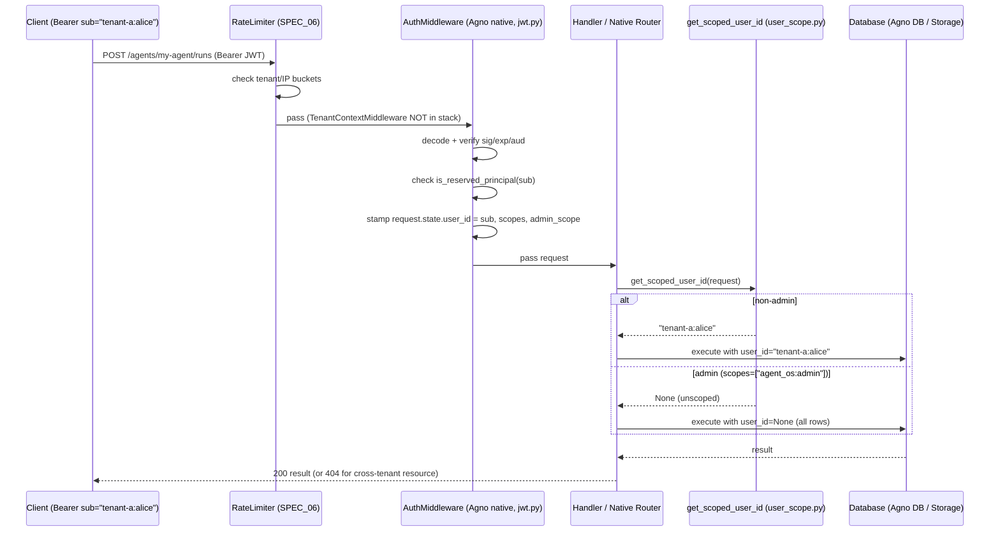

# SPEC_19_SECURITY_AUTH_API_SURFACE

> **Propósito**: Especificar el modelo de autorización JWT con scopes jerárquicos, RBAC, aislamiento per-user nativo de AgentOS, Basic Auth legacy, CORS, security headers, y el catálogo exhaustivo de endpoints del AgentOS API, todo mapeado desde YAML.

---

## 0. FRONTERA CON SPEC_06 (LECTURA OBLIGATORIA)

Existe una frontera deliberada entre SPEC_06 y SPEC_19. Ambos tocan API, pero en capas distintas.

| Dimensión | SPEC_06 (API and AX) | SPEC_19 (este documento) |
|-----------|----------------------|--------------------------|
| **Alcance** | Contratos REST genéricos de FastAPI + AX function calling | JWT/scopes/isolation + catálogo exhaustivo de endpoints AgentOS |
| **Endpoints cubiertos** | Thin layer sobre AgentOS (YamlAgentOS subclass; readiness/liveness, rate-limit, tenant middleware dev-only) — los `/run`, `/sessions`, config son nativos de AgentOS | Catálogo completo: agents, teams, workflows, sessions, memory, knowledge, metrics, evals, approvals, schedules, registry, components, a2a, agui, slack, whatsapp, traces, health |
| **Rate Limiting** | Sí (definido aquí, §1.4) | Referencia SPEC_06 §4 RateLimitMiddleware (NO duplica) |
| **Auth middleware** | No | Sí (Agno native `AuthMiddleware` / `JWTMiddleware` configurado vía `AuthorizationConfig` construido por `AuthorizationAdapter`, `BasicAuthMiddleware` dev-only, `ScopeEnforcer`, `RBACManager`) |
| **Health checks** | Liveness/readiness (aquí referencia) | Extiende con endpoints del AgentOS API surface |
| **AX schemas** | Sí (JSON schemas function calling) | No |

**Regla de oro**:
- Si la pregunta es "¿cómo implemento un endpoint `/run` o un health check?" → SPEC_06.
- Si la pregunta es "¿cómo valido un JWT, qué scope requiere `/agents/*/runs`, o cómo aíslo datos por usuario?" → SPEC_19.

SPEC_19 **extiende** SPEC_06: reutiliza el patrón FastAPI + el middleware de rate-limit de SPEC_06 (gaps sobre AgentOS) sin redefinirlo. Especifica las políticas de auth/authorization y el catálogo completo de endpoints del AgentOS.

**Referencia cruzada explícita**:
- `RateLimitMiddleware` (keyed on composite user_id; AgentOS has none): SPEC_06 §4.2.
- Liveness/Readiness probes: SPEC_06 §4.1.
- Run/session/config endpoints: NATIVE AgentOS (mounted via the `YamlAgentOS(AgentOS)` subclass `get_app()`; SPEC_06 §1–2). There is NO yaml-agno `AgentRunRequest`/`AgentRunResponse` DTO (removed; native wire contract is multipart/form-data with `{agent_id}`/`{team_id}`/`{workflow_id}`).
- Per-user / per-tenant isolation: NATIVE AgentOS `user_isolation` habilitado por `AuthorizationConfig(user_isolation=True)` con composite `"{tenant_id}:{principal_id}"` emitido directamente en el claim `sub` del JWT en emisión vía `resolve_user_id()` (SPEC_04 §1.4 / SPEC_06 §3.1). En dev/no-JWT mode, `TenantContextMiddleware` establece el `user_id` composite a partir del header `X-Tenant-Id` (SPEC_06 §3.2). JD-01 hace a ambos modos mutuamente excluyentes.
- Persistencia sessions/memoria (modelo filas con `user_id`): SPEC_03, SPEC_04.

---

## 1. MODELOS DE AUTENTICACIÓN

### 1.1 Dos Modos de Seguridad

AgentOS soporta dos modos. yaml-agno los mapea desde `security.auth_mode` o `agent_os.authorization` en YAML.

| Modo | Cuándo usar | Header | Config |
|------|-------------|--------|--------|
| **Basic Authentication** (`OS_SECURITY_KEY`) | Desarrollo, simple. **Deprecado** para prod. | `Authorization: Bearer <key>` | `OS_SECURITY_KEY` env var / `BasicAuthMiddleware` |
| **Authorization (JWT + RBAC)** | Producción, multi-tenant, fine-grained. | `Authorization: Bearer <jwt>` | `authorization=True` + `AuthorizationConfig` (vía `AuthorizationAdapter`) |

### 1.2 Basic Authentication (Legacy, dev-only)

> @ai-directive: Basic Auth is DEPRECATED and DEV-ONLY. It MUST NOT be enabled
> in production. There is no JWT, hence no tenant context, hence NO composite
> `{tenant_id}:{principal_id}` user_id. To stay consistent with the composite
> user_id contract (SPEC_04 resolve_user_id, enforced everywhere else), Basic
> Auth sets a DEV MARKER `user_id = "dev:basic-auth"` (NOT a bare "anonymous"
> literal and NEVER None). This marker is single-tenant by construction and
> MUST NOT reach production composite-user stores (sessions/memory persisted
> under it would be isolated only within a dev tenant). For multi-tenant prod,
> use JWT (§1.3) where the composite `{tenant_id}:{principal_id}` is minted
> directly at token issuance into the `sub` claim via `resolve_user_id()` (SPEC_04 / SPEC_06 §3.1).

```python
# yaml-agno/src/yaml_agno/security/basic_auth.py

from fastapi import Request, HTTPException

# Dev-only marker. Single tenant; never persisted in prod composite-user stores.
_DEV_BASIC_AUTH_USER_ID = "dev:basic-auth"

class BasicAuthMiddleware:
    """
    Validación de OS_SECURITY_KEY.
    Requests sin Authorization: Bearer <key> válido retornan 401.
    DEPRECADO para producción: usar JWT (sección 1.3).
    """

    HEADER_KEY = "Authorization"

    def __init__(self, security_key: str | None = None, secret_manager: "SecretManager | None" = None):
        # @ai-directive: OS_SECURITY_KEY is a SECRET — resolve it via the core-cenf
        # SecretManager (await secrets.get_secret("os_security_key")), NEVER via
        # os.environ directly. The constructor accepts a pre-resolved key for DI.
        self.security_key = security_key
        self._secrets = secret_manager

    async def __call__(self, request: Request) -> None:
        if not self.security_key:
            # No configurado = sin proteccion (solo dev)
            request.state.authenticated = False
            return

        auth_header = request.headers.get(self.HEADER_KEY, "")
        token = self._extract_bearer(auth_header)

        if token != self.security_key:
            raise HTTPException(
                status_code=401,
                detail="Invalid or missing security key",
                headers={"WWW-Authenticate": "Bearer"},
            )
        request.state.authenticated = True
        # Dev-only composite-shaped marker. Single tenant; NOT a bare principal
        # and NOT None.
        request.state.user_id = _DEV_BASIC_AUTH_USER_ID
        request.state.scopes = ["agent_os:admin"]   # basic auth = acceso total

    @staticmethod
    def _extract_bearer(header: str) -> str | None:
        if not header.startswith("Bearer "):
            return None
        return header[7:]
```

### 1.3 JWT Authorization (Recomendado — Nativo Agno + AuthorizationAdapter)

> @ai-directive SSOT / BUILD ON TOP: yaml-agno NO reimplementa JWTMiddleware ni
> define wrappers o shims de middleware para JWT.
> Agno 2.8.7 ya provee `AuthMiddleware` / `JWTMiddleware` (con validación de firma,
> JWKS, exp/aud, verificación de reserved principals y user_isolation) en
> `agno.os.middleware.jwt` (`jwt.py:1039,1060`), junto con el helper
> `build_jwt_middleware_kwargs` (`jwt.py:397`).
> `AgentOS` monta `AuthMiddleware` automáticamente en `AgentOS.get_app()`
> (`os/app.py:1366-1370`) cuando `authorization=True` y se pasa `authorization_config`.
>
> yaml-agno aporta **`AuthorizationAdapter`** (definido en
> `yaml_agno.agentos.authorization_adapter`, S5a.0 whitelist,
> `openspec/specs/agentos-authorization-build/spec.md`) para mapear de forma segura
> `AuthorizationSettings` desde el YAML a `AuthorizationConfig` de Agno,
> garantizando la whitelist de los 7 campos nativos (`verification_keys, jwks_file,
> algorithm, verify_audience, audience, admin_scope, user_isolation`), rechazando
> llaves desconocidas y `basic_auth`, e imponiendo el invariant inmutable
> `user_isolation=True`.

```python
# yaml-agno/src/yaml_agno/agentos/authorization_adapter.py
"""AuthorizationAdapter: fail-fast adapter from YAML settings to Agno's AuthorizationConfig."""

from typing import Any
from agno.os.config import AuthorizationConfig  # exactly 7 fields in Agno 2.8.7
from core_infrastructure import SecretManager


class AuthorizationBuildError(ValueError):
    """Raised when authorization configuration cannot be built or validated."""


class AuthorizationAdapter:
    """Builds Agno's AuthorizationConfig from declarative AuthorizationSettings.

    Applies strict field whitelist validation (rejects unknown keys and basic_auth),
    resolves ${SECRET:...} references against SecretManager, and enforces
    user_isolation=True as an immutable security invariant.
    """

    def __init__(self, secrets: SecretManager | None = None) -> None:
        self._secrets = secrets

    def build(self, settings: Any) -> tuple[bool, AuthorizationConfig | None]:
        """Build the (authorization_enabled, authorization_config) pair.

        Returns:
            (False, None) if settings.enabled is False.
            (True, AuthorizationConfig(...)) with user_isolation=True if enabled.
        """
        ...
```

#### Integración nativa con Agno 2.8.7 (`build_jwt_middleware_kwargs`)

Agno 2.8.7 traduce internamente `AuthorizationConfig` a los parámetros de `JWTMiddleware` mediante su helper nativo `build_jwt_middleware_kwargs(config)` (`jwt.py:397`):

```python
# Agno native helper reference (agno.os.middleware.jwt:397):
# def build_jwt_middleware_kwargs(config: AuthorizationConfig) -> dict[str, Any]:
#     return {
#         "verification_keys": config.verification_keys,
#         "jwks_file": config.jwks_file,
#         "algorithm": config.algorithm,
#         "verify_audience": config.verify_audience,
#         "audience": config.audience,
#         "admin_scope": config.admin_scope or "agent_os:admin",
#         "user_isolation": config.user_isolation,
#     }
```

#### Escape Hatch para Keycloak / IdPs Externos (S5b)

Por defecto, Agno 2.8.7 extrae la identidad del usuario del claim `sub` (donde el token issuer emite el composite `{tenant_id}:{principal_id}`). Si en S5b un IdP externo (como Keycloak) emite la identidad en un claim personalizado (por ejemplo `composite_sub` o `preferred_username`) y no se utiliza un token mapper en el IdP, el parámetro nativo `user_id_claim` de Agno (`JWTMiddleware(user_id_claim=...)`, `jwt.py:547`) actúa como escape hatch configurable sin modificar código de yaml-agno.

```python
# yaml-agno/src/yaml_agno/security/rbac.py
#
# RBAC y Scope enforcement por endpoint:
# Se ejecuta a partir de request.state (poblado por AuthMiddleware de Agno):
#   - EndpointRegistry.required_scopes(method, path) -> scopes requeridos por ruta
#   - Per-user isolation: para no-admins, Agno get_scoped_user_id() filtra recursos por composite user_id.

from typing import List


def required_scopes_for(
    method: str,
    path: str,
    scope_mappings: dict[str, List[str]] | None = None,
) -> List[str]:
    """Scope mappings propios primero; fallback al EndpointRegistry de yaml-agno."""
    pattern = f"{method} {path}"
    if scope_mappings and pattern in scope_mappings:
        return scope_mappings[pattern]
    from yaml_agno.api.endpoint_registry import EndpointRegistry
    return EndpointRegistry.required_scopes(method, path) or []


def has_any_scope(held: List[str], required: List[str]) -> bool:
    """Soporta wildcards `resource:*:action`."""
    if not required:
        return True
    held_set = set(held)
    for r in required:
        if r in held_set:
            return True
        parts = r.split(":")
        if len(parts) == 3:
            wildcard = f"{parts[0]}:*:{parts[2]}"
            if wildcard in held_set:
                return True
    return False


def extract_accessible_resource_ids(scopes: List[str]) -> set[str]:
    """Para scopes `resource:<id>:action`, colecciona los ids accesibles."""
    ids: set[str] = set()
    for s in scopes:
        parts = s.split(":")
        if len(parts) == 3 and parts[1] != "*":
            ids.add(parts[1])
    return ids
```

### 1.4 Request State tras el Middleware

| Atributo | Tipo | Descripción |
|----------|------|-------------|
| `authenticated` | `bool` | Si el usuario está autenticado |
| `user_id` | `Optional[str]` | Composite `{tenant_id}:{principal_id}` (emitido en el `sub` del JWT en issuance vía `resolve_user_id()`, SPEC_04 / SPEC_06 §3.1, y estampado por `AuthMiddleware`; en dev mode estampado por `TenantContextMiddleware`); NEVER a bare principal, NEVER None, NEVER "anonymous" |
| `session_id` | `Optional[str]` | Session ID del claim |
| `scopes` | `List[str]` | Scopes del token |
| `audience` | `Optional[str]` | Claim `aud` |
| `token` | `str` | JWT raw |
| `authorization_enabled` | `bool` | Si RBAC/Auth está activo |
| `user_isolation_enabled` | `bool` | Si aislamiento está activo (`user_isolation=True`) |
| `accessible_resource_ids` | `Set[str]` | IDs de recurso accesibles (listings) |
| `is_admin` | `bool` | Si tiene `admin_scope` (`agent_os:admin`) |

### 1.5 Respuestas de Error

| Status | Causa |
|--------|-------|
| `401 Unauthorized` | Token ausente o inválido (firma, formato) |
| `401 Unauthorized` | Token expirado (`exp` en el pasado) |
| `401 Unauthorized` | Audience inválido (token no es para este AgentOS) |
| `403 Forbidden` | Scopes insuficientes para la operación |
| `404 Not Found` | Recurso perteneciente a otro tenant (masking nativo con `user_isolation=True`) |

---

## 2. SCOPES - FORMATO Y CATÁLOGO

### 2.1 Formato Jerárquico de Scopes

Los scopes viven en el claim `scopes` del JWT. Son jerárquicos.

| Formato | Ejemplo | Descripción |
|---------|---------|-------------|
| `resource:action` | `agents:read` | Acceso a todos los recursos de un tipo |
| `resource:<id>:action` | `agents:my-agent:run` | Acceso a un recurso específico |
| `resource:*:action` | `agents:*:read` | Wildcard (equivale a global) |
| `agent_os:admin` | - | Acceso total a todos los endpoints y bypass de isolation (short-circuit a `None` en `get_scoped_user_id`) |

**Restricción**: el scoping per-recurso (`resource:<id>:action`) aplica **solo** a `agents`, `teams`, `workflows`. El resto (sessions, memories, knowledge, traces) usa scopes globales únicamente.

### 2.2 Catálogo Completo de Scopes del AgentOS

#### 2.2.1 Scopes del Control Plane (`os.agno.com`)

| Scope | Descripción |
|-------|-------------|
| `os:read` | Ver instancias AgentOS |
| `os:write` | Crear/actualizar instancias AgentOS |
| `os:delete` | Eliminar instancias AgentOS |
| `org:read` | Ver detalles de organización |
| `org:write` | Actualizar organización |
| `org:delete` | Eliminar organización |
| `org:members:read` | Ver miembros |
| `org:members:write` | Invitar/actualizar miembros |
| `org:roles:read` | Ver roles y scopes asignados |
| `org:roles:write` | Crear/actualizar scopes de roles |
| `org:roles:delete` | Eliminar roles |
| `billing:read` | Ver facturación |
| `billing:write` | Actualizar facturación |

#### 2.2.2 AgentOS Scopes (enforced por el servicio desplegado)

**Config**:
| Scope | Endpoint | Descripción |
|-------|----------|-------------|
| `config:read` | `GET /config` | Leer config del OS |
| `config:read` | `GET /models` | Listar modelos disponibles |
| `config:write` | `POST /databases/all/migrate` | Migrar todas las DBs |
| `config:write` | `POST /databases/*/migrate` | Migrar DB específica |

**Registry**:
| Scope | Endpoint | Descripción |
|-------|----------|-------------|
| `registry:read` | `GET /registry` | Ver registry (tools, models, databases) |

**Components** (versionado):
| Scope | Endpoint | Descripción |
|-------|----------|-------------|
| `components:read` | `GET /components`, `GET /components/*`, `GET /components/*/configs*`, `GET /components/*/configs/current` | Listar/ver componentes y configs |
| `components:write` | `POST /components`, `POST /components/*/configs`, `POST /components/*/configs/*/set-current`, `PATCH /components/*`, `PATCH /components/*/configs/*` | Crear/actualizar componentes |
| `components:delete` | `DELETE /components/*`, `DELETE /components/*/configs/*` | Eliminar componentes |

**Agents**:
| Scope | Endpoint | Descripción |
|-------|----------|-------------|
| `agents:read` | `GET /agents`, `GET /agents/*` | Listar/ver agentes |
| `agents:write` | `POST /agents`, `PATCH /agents/*` | Crear/actualizar agentes |
| `agents:delete` | `DELETE /agents/*` | Eliminar agentes |
| `agents:run` | `POST /agents/*/runs`, `POST /agents/*/runs/*/continue`, `POST /agents/*/runs/*/cancel` | Ejecutar, continuar, cancelar runs |

**Teams**:
| Scope | Endpoint | Descripción |
|-------|----------|-------------|
| `teams:read` | `GET /teams`, `GET /teams/*` | Listar/ver teams |
| `teams:write` | `POST /teams`, `PATCH /teams/*` | Crear/actualizar teams |
| `teams:delete` | `DELETE /teams/*` | Eliminar teams |
| `teams:run` | `POST /teams/*/runs`, `POST /teams/*/runs/*/continue`, `POST /teams/*/runs/*/cancel` | Ejecutar/continuar/cancelar |

**Workflows**:
| Scope | Endpoint | Descripción |
|-------|----------|-------------|
| `workflows:read` | `GET /workflows`, `GET /workflows/*` | Listar/ver workflows |
| `workflows:write` | `POST /workflows`, `PATCH /workflows/*` | Crear/actualizar workflows |
| `workflows:delete` | `DELETE /workflows/*` | Eliminar workflows |
| `workflows:run` | `POST /workflows/*/runs`, `POST /workflows/*/runs/*/continue`, `POST /workflows/*/runs/*/cancel` | Ejecutar/continuar/cancelar |

**Sessions**:
| Scope | Endpoint | Descripción |
|-------|----------|-------------|
| `sessions:read` | `GET /sessions`, `GET /sessions/*` | Listar/ver sesiones |
| `sessions:write` | `POST /sessions`, `POST /sessions/*/rename`, `PATCH /sessions/*` | Crear/renombrar/actualizar |
| `sessions:delete` | `DELETE /sessions`, `DELETE /sessions/*` | Eliminar (bulk e individual) |

**Memories**:
| Scope | Endpoint | Descripción |
|-------|----------|-------------|
| `memories:read` | `GET /memories`, `GET /memories/*`, `GET /memory_topics`, `GET /user_memory_stats` | Listar/ver memorias, topics, stats |
| `memories:write` | `POST /memories`, `PATCH /memories/*`, `POST /optimize-memories` | Crear/actualizar/optimize |
| `memories:delete` | `DELETE /memories`, `DELETE /memories/*` | Eliminar memorias |

**Knowledge**:
| Scope | Endpoint | Descripción |
|-------|----------|-------------|
| `knowledge:read` | `GET /knowledge/content`, `GET /knowledge/content/*`, `GET /knowledge/config`, `GET /knowledge/*/sources`, `GET /knowledge/*/sources/*/files`, `POST /knowledge/search` | Listar/ver/buscar knowledge |
| `knowledge:write` | `POST /knowledge/content`, `POST /knowledge/remote-content`, `PATCH /knowledge/content/*` | Añadir/actualizar content |
| `knowledge:delete` | `DELETE /knowledge/content`, `DELETE /knowledge/content/*` | Eliminar content |

**Metrics**:
| Scope | Endpoint | Descripción |
|-------|----------|-------------|
| `metrics:read` | `GET /metrics` | Ver métricas |
| `metrics:write` | `POST /metrics/refresh` | Refrescar métricas |

**Evals**:
| Scope | Endpoint | Descripción |
|-------|----------|-------------|
| `evals:read` | `GET /eval-runs`, `GET /eval-runs/*` | Listar/ver eval runs |
| `evals:write` | `POST /eval-runs`, `PATCH /eval-runs/*` | Crear/actualizar eval runs |
| `evals:delete` | `DELETE /eval-runs` | Eliminar eval runs (bulk) |

**Traces**:
| Scope | Endpoint | Descripción |
|-------|----------|-------------|
| `traces:read` | `GET /traces`, `GET /traces/*`, `GET /trace_session_stats`, `POST /traces/search` | Listar/ver/buscar traces |

**Schedules**:
| Scope | Endpoint | Descripción |
|-------|----------|-------------|
| `schedules:read` | `GET /schedules`, `GET /schedules/*`, `GET /schedules/*/runs`, `GET /schedules/*/runs/*` | Listar/ver schedules y runs |
| `schedules:write` | `POST /schedules`, `PATCH /schedules/*`, `POST /schedules/*/enable`, `POST /schedules/*/disable`, `POST /schedules/*/trigger` | CRUD/enable/disable/trigger |
| `schedules:delete` | `DELETE /schedules/*` | Eliminar schedule |

**Approvals**:
| Scope | Endpoint | Descripción |
|-------|----------|-------------|
| `approvals:read` | `GET /approvals`, `GET /approvals/count`, `GET /approvals/*`, `GET /approvals/*/status` | Listar/contar/ver approvals |
| `approvals:write` | `POST /approvals/*/resolve` | Resolver approval |
| `approvals:delete` | `DELETE /approvals/*` | Eliminar approval |

#### 2.2.3 Scopes de Prerrequisito (gating)

Sin estos, los scopes finos no tienen efecto porque el usuario no puede alcanzar los recursos.

| Scope | Sin él, el usuario no puede |
|-------|------------------------------|
| `org:read` | Acceder a la organización |
| `os:read` | Listar instancias AgentOS |
| `config:read` | Usar cualquier endpoint (la UI carga `/config` al inicio) |

### 2.3 ScopeEnforcer

```python
# yaml-agno/src/yaml_agno/security/scope_enforcer.py

from typing import List
from fastapi import Request, HTTPException

class ScopeEnforcer:
    """
    Verifica scopes requeridos contra los scopes del request.state.
    Soporta wildcard agents:*:action y admin bypass nativo.
    """

    def __init__(self, admin_scope: str = "agent_os:admin"):
        self.admin_scope = admin_scope

    def enforce(self, request: Request, required: List[str]) -> None:
        held = getattr(request.state, "scopes", [])
        if self.admin_scope in held:
            return
        if not self._satisfies(held, required):
            raise HTTPException(status_code=403, detail="Insufficient scopes")

    @staticmethod
    def _satisfies(held: List[str], required: List[str]) -> bool:
        if not required:
            return True
        held_set = set(held)
        for r in required:
            if r in held_set:
                return True
            parts = r.split(":")
            if len(parts) == 3:
                wildcard = f"{parts[0]}:*:{parts[2]}"
                base = f"{parts[0]}:{parts[2]}"
                if wildcard in held_set or base in held_set:
                    return True
        return False
```

---

## 3. ROLES Y RBAC

### 3.1 Roles por Defecto

Los roles son bundles de scopes asignados a usuarios. yaml-agno define los tres roles por defecto del control plane y permite roles custom.

| Capabilidad | Owner | Administrator | Member |
|-------------|:-----:|:-------------:|:------:|
| Run agents, teams, workflows | ✓ | ✓ | ✓ |
| Create/update AgentOS resources | ✓ | ✓ | ✓ |
| Delete AgentOS resources | ✓ | ✓ | |
| Create/update AgentOS instances | ✓ | ✓ | ✓ |
| Delete AgentOS instances | ✓ | | |
| Manage members and roles | ✓ | ✓ | |
| Update organization settings | ✓ | ✓ | |
| View billing | ✓ | ✓ | ✓ |
| Update billing | ✓ | | |
| Delete the organization | ✓ | | |

### 3.2 Mapeo Rol → Scopes

```python
# yaml-agno/src/yaml_agno/security/rbac.py

from typing import Dict, List, Set
from pydantic import BaseModel, Field

# Roles extendidos de yaml-agno (agrega developer y viewer al modelo Agno)
ROLE_SCOPES: Dict[str, Set[str]] = {
    "owner": {
        "agent_os:admin",
    },
    "administrator": {
        "os:read", "os:write",
        "org:read", "org:write", "org:members:read", "org:members:write",
        "org:roles:read", "org:roles:write",
        "billing:read", "billing:write",
        "config:read", "config:write",
        "registry:read", "components:read", "components:write", "components:delete",
        "agents:read", "agents:write", "agents:delete", "agents:run",
        "teams:read", "teams:write", "teams:delete", "teams:run",
        "workflows:read", "workflows:write", "workflows:delete", "workflows:run",
        "sessions:read", "sessions:write", "sessions:delete",
        "memories:read", "memories:write", "memories:delete",
        "knowledge:read", "knowledge:write", "knowledge:delete",
        "metrics:read", "metrics:write",
        "evals:read", "evals:write", "evals:delete",
        "traces:read",
        "schedules:read", "schedules:write", "schedules:delete",
        "approvals:read", "approvals:write", "approvals:delete",
    },
    "developer": {
        "config:read", "registry:read", "components:read", "components:write",
        "agents:read", "agents:write", "agents:run",
        "teams:read", "teams:write", "teams:run",
        "workflows:read", "workflows:write", "workflows:run",
        "sessions:read", "sessions:write",
        "memories:read", "memories:write",
        "knowledge:read", "knowledge:write",
        "metrics:read", "evals:read", "evals:write", "traces:read",
        "schedules:read", "schedules:write",
        "approvals:read", "approvals:write",
    },
    "member": {
        "config:read",
        "agents:read", "agents:run",
        "teams:read", "teams:run",
        "workflows:read", "workflows:run",
        "sessions:read", "sessions:write",
        "memories:read",
        "knowledge:read",
        "metrics:read", "evals:read", "traces:read",
        "billing:read",
    },
    "viewer": {
        "config:read",
        "agents:read", "teams:read", "workflows:read",
        "sessions:read", "memories:read", "knowledge:read",
        "metrics:read", "evals:read", "traces:read",
    },
}

class RoleMapping(BaseModel):
    role: str
    scopes: List[str] = Field(default_factory=list)
    description: str = ""

class RBACManager:
    """
    Resuelve roles a scopes.
    Permite roles custom definidos en YAML.
    """

    def __init__(self, custom_roles: Dict[str, Set[str]] | None = None):
        self.roles = {**ROLE_SCOPES}
        if custom_roles:
            self.roles.update(custom_roles)

    def scopes_for(self, roles: List[str]) -> Set[str]:
        result: Set[str] = set()
        for r in roles:
            result.update(self.roles.get(r, set()))
        return result

    def has_role(self, role: str) -> bool:
        return role in self.roles

    def list_roles(self) -> List[str]:
        return sorted(self.roles.keys())
```

### 3.3 Custom Roles

```yaml
security:
  rbac:
    roles:
      - name: data_scientist
        scopes:
          - config:read
          - agents:read
          - agents:*:run          # wildcard: correr cualquier agente
          - evals:read
          - evals:write
          - traces:read
        description: "DS con acceso a evals y traces"
      - name: ops_readonly
        scopes:
          - config:read
          - metrics:read
          - traces:read
          - traces:search
        description: "Solo observabilidad"
```

---

## 4. PER-USER DATA ISOLATION (NATIVE AgentOS)

> @ai-directive BUILD ON TOP: Per-user data isolation is OWNED by AgentOS, NOT
> reimplemented by yaml-agno. Verified in `agno/os/middleware/jwt.py` and
> `agno/os/middleware/user_scope.py` (agno 2.8.7):
>   - `AuthorizationConfig(user_isolation=True)` activates `AuthMiddleware` and sets `request.state.user_isolation_enabled`.
>   - `agno.os.middleware.user_scope` provides the native helpers every scoped endpoint
>     calls: `get_scoped_user_id(request)`, `resolve_db_and_scope(...)`,
>     `enforce_owner_on_entity(...)`.
> yaml-agno does NOT define its own `UserIsolationEnforcer` class. Zero yaml-agno code
> exists in the JWT authentication or scoping path.

### 4.1 Concepto y flujo nativo

La autorización controla **qué operaciones** puede hacer un caller. El
aislamiento per-user controla **qué filas** puede ver y escribir. En yaml-agno
`user_isolation=True` es un invariant inmutable impuesto por `AuthorizationAdapter` (S5a.0)
y requerido al arrancar en producción vía `run_server` (VQ010).

Flujo nativo (verified, `agno/os/middleware/user_scope.py` y `agno/os/middleware/jwt.py`):

1. **Composite en Token Emission**: El token issuer (dev helper en tests; Keycloak/IdP en S5b) emite la identidad composite `"{tenant_id}:{principal_id}"` directamente en el claim `sub` del JWT usando `resolve_user_id()` (SPEC_04 §1.4 / SPEC_06 §3.1; VQ012).
2. **Validación y Estampado Nativo**: `AuthMiddleware` de Agno (`jwt.py:1039,1060`) valida la firma del token, verifica que `sub` no sea un principal reservado (`is_reserved_principal`, `jwt.py:1048-1050`), y estampa `request.state.user_id = sub`.
3. **Ausencia de Middleware Intermedio**: `TenantContextMiddleware` NO se monta en el stack ASGI en modo JWT (JD-01 structural mutual exclusion).
4. **Threading en Consultas**: Cuando `user_isolation=True`, cada endpoint user-scoped llama a `get_scoped_user_id(request)` (`user_scope.py:105-132`), el cual devuelve el composite `request.state.user_id` para no-admins, o `None` para admins (`scopes=["agent_os:admin"]`).
5. **Aislamiento en DB**: Las consultas filtran `WHERE user_id = scoped_user_id`. Intentos de acceder a recursos de otro tenant devuelven 404 (masking nativo). Los writes ejecutan `enforce_owner_on_entity(...)` que coacciona `user_id` al composite del caller.

```python
# Example of an Agno endpoint using the NATIVE AgentOS helpers:
from agno.os.middleware.user_scope import get_scoped_user_id, resolve_db_and_scope

@router.get("/sessions")
async def list_sessions(request: Request, db = Depends(...)):
    scoped_user_id = get_scoped_user_id(request)   # None for admins / when off
    return await db.get_sessions(user_id=scoped_user_id)
```

### 4.2 Comportamiento por Operación (native)

| Operación | Comportamiento con `user_isolation=True` |
|-----------|------------------------------------------|
| Reads (sessions, memory, traces) | `get_scoped_user_id` devuelve el composite del caller; filas de otros no se retornan |
| Writes (sessions, memories, traces) | `enforce_owner_on_entity` coacciona el composite del caller; no se puede atribuir a otro |
| Cross-tenant session/run fetch | Devuelve 404 Not Found (native masking) |
| Cancel / resume / continue | Requiere `session_id` y `resolve_db_and_scope` verifica ownership del run |
| WebSocket reconnect | Requiere `session_id` (y `workflow_id`) para no-admins |

### 4.3 Admin Bypass (native)

`get_scoped_user_id` devuelve `None` cuando el caller tiene `admin_scope`
(default `agent_os:admin`, `jwt.py:736`, `user_scope.py:116-117`).
Con `None`, la query no se filtra por `user_id` y el admin ve todas las sesiones y recursos
de todos los tenants (comportamiento validado en L-03 T5).

### 4.4 Requisito de DB

El aislamiento requiere una DB que registre `user_id` composite en filas.
PostgreSQL recomendado para producción (ver SPEC_03); SQLite nativo auto-provisionado en tests. Sin `user_id` en filas, el aislamiento no tiene efecto.

### 4.5 Origen del composite user_id

> @ai-directive: el `user_id` que el aislamiento native usa SIEMPRE proviene del
> composite `{tenant_id}:{principal_id}` emitido en el claim `sub` del JWT en emisión
> mediante `resolve_user_id(memory_cfg=None, principal_id=..., tenant_id=...)` (SPEC_04 §1.4).
> yaml-agno nunca persiste un `sub` bare ni un "anonymous". Esto es consistente con VQ012.

---

## 5. CORS Y SECURITY HEADERS

<!-- @ai-directive BUILD ON TOP: AgentOS ya configura CORS y security headers
     cuando se levanta la app FastAPI/AgentOS. yaml-agno NO reimplementa
     CORSMiddleware (usa el nativo de starlette/fastapi) ni inventa su propio
     motor de headers. Su unica responsabilidad aqui es hacer MERGE de defaults
     propios (origenes permitidos del tenant, headers CSP/HSTS deseados) sobre
     la configuracion que AgentOS ya aplica. -->

### 5.1 CORS

```python
# yaml-agno/src/yaml_agno/security/cors.py

from fastapi.middleware.cors import CORSMiddleware

DEFAULT_AGNO_ORIGINS = [
    "https://os.agno.com",
]

class CorsConfigurator:
    """
    Configura CORSMiddleware.
    cors_allowed_origins se merguea con los dominios default de Agno.
    """

    def __init__(self, allowed_origins: list[str] | None = None):
        self.allowed_origins = list(set(DEFAULT_AGNO_ORIGINS + (allowed_origins or [])))

    def apply(self, app) -> None:
        app.add_middleware(
            CORSMiddleware,
            allow_origins=self.allowed_origins,
            allow_credentials=True,
            allow_methods=["*"],
            allow_headers=["*"],
            expose_headers=["*"],
        )
```

### 5.2 Security Headers Middleware

```python
# yaml-agno/src/yaml_agno/security/security_headers.py

from fastapi import Request
from starlette.middleware.base import BaseHTTPMiddleware

class SecurityHeadersMiddleware(BaseHTTPMiddleware):
    """
    Headers de seguridad HTTP estándar.
    HSTS, CSP, X-Frame-Options, X-Content-Type-Options, Referrer-Policy.
    """

    DEFAULT_HEADERS = {
        "Strict-Transport-Security": "max-age=63072000; includeSubDomains; preload",
        "X-Content-Type-Options": "nosniff",
        "X-Frame-Options": "DENY",
        "Referrer-Policy": "strict-origin-when-cross-origin",
        "Permissions-Policy": "geolocation=(), microphone=(), camera=()",
        "X-XSS-Protection": "1; mode=block",
    }

    def __init__(self, app, csp: str | None = None, extra: dict | None = None):
        super().__init__(app)
        self.headers = {**self.DEFAULT_HEADERS}
        if csp:
            self.headers["Content-Security-Policy"] = csp
        if extra:
            self.headers.update(extra)

    async def dispatch(self, request: Request, call_next):
        response = await call_next(request)
        for k, v in self.headers.items():
            response.headers[k] = v
        return response
```

| Header | Default | Descripción |
|--------|---------|-------------|
| `Strict-Transport-Security` | `max-age=63072000; includeSubDomains; preload` | HSTS 2 años |
| `X-Content-Type-Options` | `nosniff` | Anti-MIME sniffing |
| `X-Frame-Options` | `DENY` | Anti-clickjacking |
| `Referrer-Policy` | `strict-origin-when-cross-origin` | Control de referrer |
| `Permissions-Policy` | `geolocation=(), microphone=(), camera=()` | Deshabilita APIs sensibles |
| `Content-Security-Policy` | configurable | CSP (default none salvo config) |

---

## 6. CATÁLOGO EXHAUSTIVO DE ENDPOINTS

### 6.1 Resumen por Grupo

| Grupo | Qué permite |
|-------|-------------|
| **Runs** | Crear, listar, cancelar, continuar runs pausados, resumir streams. Stream SSE o background jobs |
| **Sessions** | Crear, listar, renombrar, actualizar, eliminar. Scoped por usuario |
| **Memory** | Crear, actualizar, eliminar memorias. Search, filter por topic, stats. Optimize |
| **Knowledge** | Upload files/text/URLs/S3/GCS/SharePoint/GitHub. Vector/keyword/hybrid search |
| **Evals** | Accuracy, agent-as-judge, performance, reliability. List/update/delete |
| **Traces** | Listar, buscar con filter DSL, ver span trees, group por session |
| **Metrics** | Agregados diarios: runs, sessions, users, tokens, breakdown por modelo |
| **Schedules** | CRUD, enable, disable, trigger now. Listar runs históricos |
| **Approvals** | Listar pendientes, resolver, contar por usuario |
| **Components** | Versionar agents/teams/workflows. Drafts, publish, rollback |
| **Database** | Migrar schemas a versión target |
| **Registry** | Ver registry code-defined (tools, models, databases) |
| **A2A** | Agent-to-Agent server |
| **AG-UI** | AG-UI interface |
| **Slack/WhatsApp** | Interfaces de mensajería |
| **Health** | Liveness, readiness, root |

### 6.2 Endpoints Detail (non-run groups ya en §2.2; aquí runs + interfaces)

#### Runs (Agents/Teams/Workflows comparten forma)

| Método | Endpoint | Descripción | Scope |
|--------|----------|-------------|-------|
| POST | `/agents/{id}/runs` | Crear run (multipart: text, files, media) | `agents:run` |
| POST | `/teams/{id}/runs` | Crear run de team | `teams:run` |
| POST | `/workflows/{id}/runs` | Crear run de workflow | `workflows:run` |
| POST | `/agents/{id}/runs/{run_id}/continue` | Continuar run pausado | `agents:run` |
| POST | `/agents/{id}/runs/{run_id}/cancel` | Cancelar run | `agents:run` |
| GET | `/agents/{id}/runs` | Listar runs | `agents:read` |

**Request shape** (multipart/form-data):
```bash
curl -X POST http://localhost:8000/agents/my-agent/runs \
  -F "message=Hello" \
  -F "user_id=alice" \
  -F "session_id=thread-42" \
  -F "stream=false" \
  -F "background=false"
```

**Response shape** (uniforme agent/team/workflow):
```json
{
  "run_id": "run_abc123",
  "session_id": "thread-42",
  "user_id": "alice",
  "agent_id": "my-agent",
  "status": "completed",
  "content": "Hi Alice!",
  "created_at": "2026-04-24T20:15:00Z"
}
```

`stream=true` → Server-Sent Events. `background=true` → run async + poll.

#### Interfaces

| Interfaz | Config | Descripción |
|----------|--------|-------------|
| REST | default on | `/agents/*/runs` etc. |
| SSE | default on | `stream=true` |
| MCP | `enable_mcp_server=True` | Model Context Protocol server |
| WebSocket | opt-in | Streaming bidireccional |
| A2A | `a2a_interface=True` | Agent-to-Agent server |
| AG-UI | opt-in | AG-UI interface |
| Slack | opt-in | Slack interface |
| WhatsApp | opt-in | WhatsApp interface |

### 6.3 EndpointRegistry

```python
# yaml-agno/src/yaml_agno/api/endpoint_registry.py

from typing import List, Optional
import re

class EndpointRegistry:
    """
    Catalogo de rutas -> scopes requeridos.
    Resuelve el scope de una ruta+metodo dado.
    Soporta wildcards (* y {param}).
    """

    # (method, pattern, scopes)
    _MAPPINGS = [
        # Config
        ("GET",    r"^/config$",                          ["config:read"]),
        ("GET",    r"^/models$",                           ["config:read"]),
        ("POST",   r"^/databases/all/migrate$",            ["config:write"]),
        ("POST",   r"^/databases/[^/]+/migrate$",          ["config:write"]),
        # Registry
        ("GET",    r"^/registry$",                         ["registry:read"]),
        # Components
        ("GET",    r"^/components$",                       ["components:read"]),
        ("GET",    r"^/components/[^/]+$",                 ["components:read"]),
        ("GET",    r"^/components/[^/]+/configs$",         ["components:read"]),
        ("GET",    r"^/components/[^/]+/configs/[^/]+$",   ["components:read"]),
        ("GET",    r"^/components/[^/]+/configs/current$", ["components:read"]),
        ("POST",   r"^/components$",                       ["components:write"]),
        ("POST",   r"^/components/[^/]+/configs$",         ["components:write"]),
        ("POST",   r"^/components/[^/]+/configs/[^/]+/set-current$", ["components:write"]),
        ("PATCH",  r"^/components/[^/]+$",                 ["components:write"]),
        ("PATCH",  r"^/components/[^/]+/configs/[^/]+$",   ["components:write"]),
        ("DELETE", r"^/components/[^/]+$",                 ["components:delete"]),
        ("DELETE", r"^/components/[^/]+/configs/[^/]+$",   ["components:delete"]),
        # Agents
        ("GET",    r"^/agents$",                           ["agents:read"]),
        ("GET",    r"^/agents/[^/]+$",                     ["agents:read"]),
        ("POST",   r"^/agents$",                           ["agents:write"]),
        ("PATCH",  r"^/agents/[^/]+$",                     ["agents:write"]),
        ("DELETE", r"^/agents/[^/]+$",                     ["agents:delete"]),
        ("POST",   r"^/agents/[^/]+/runs$",                ["agents:run"]),
        ("POST",   r"^/agents/[^/]+/runs/[^/]+/continue$", ["agents:run"]),
        ("POST",   r"^/agents/[^/]+/runs/[^/]+/cancel$",   ["agents:run"]),
        # Teams
        ("GET",    r"^/teams$",                            ["teams:read"]),
        ("GET",    r"^/teams/[^/]+$",                      ["teams:read"]),
        ("POST",   r"^/teams$",                            ["teams:write"]),
        ("PATCH",  r"^/teams/[^/]+$",                      ["teams:write"]),
        ("DELETE", r"^/teams/[^/]+$",                      ["teams:delete"]),
        ("POST",   r"^/teams/[^/]+/runs$",                 ["teams:run"]),
        ("POST",   r"^/teams/[^/]+/runs/[^/]+/continue$",  ["teams:run"]),
        ("POST",   r"^/teams/[^/]+/runs/[^/]+/cancel$",    ["teams:run"]),
        # Workflows
        ("GET",    r"^/workflows$",                        ["workflows:read"]),
        ("GET",    r"^/workflows/[^/]+$",                  ["workflows:read"]),
        ("POST",   r"^/workflows$",                        ["workflows:write"]),
        ("PATCH",  r"^/workflows/[^/]+$",                  ["workflows:write"]),
        ("DELETE", r"^/workflows/[^/]+$",                  ["workflows:delete"]),
        ("POST",   r"^/workflows/[^/]+/runs$",             ["workflows:run"]),
        ("POST",   r"^/workflows/[^/]+/runs/[^/]+/continue$", ["workflows:run"]),
        ("POST",   r"^/workflows/[^/]+/runs/[^/]+/cancel$",   ["workflows:run"]),
        # Sessions
        ("GET",    r"^/sessions$",                         ["sessions:read"]),
        ("GET",    r"^/sessions/[^/]+$",                   ["sessions:read"]),
        ("POST",   r"^/sessions$",                         ["sessions:write"]),
        ("POST",   r"^/sessions/[^/]+/rename$",            ["sessions:write"]),
        ("PATCH",  r"^/sessions/[^/]+$",                   ["sessions:write"]),
        ("DELETE", r"^/sessions$",                         ["sessions:delete"]),
        ("DELETE", r"^/sessions/[^/]+$",                   ["sessions:delete"]),
        # Memories
        ("GET",    r"^/memories$",                         ["memories:read"]),
        ("GET",    r"^/memories/[^/]+$",                   ["memories:read"]),
        ("GET",    r"^/memory_topics$",                    ["memories:read"]),
        ("GET",    r"^/user_memory_stats$",                ["memories:read"]),
        ("POST",   r"^/memories$",                         ["memories:write"]),
        ("PATCH",  r"^/memories/[^/]+$",                   ["memories:write"]),
        ("POST",   r"^/optimize-memories$",                ["memories:write"]),
        ("DELETE", r"^/memories$",                         ["memories:delete"]),
        ("DELETE", r"^/memories/[^/]+$",                   ["memories:delete"]),
        # Knowledge
        ("GET",    r"^/knowledge/content$",                ["knowledge:read"]),
        ("GET",    r"^/knowledge/content/[^/]+$",          ["knowledge:read"]),
        ("GET",    r"^/knowledge/config$",                 ["knowledge:read"]),
        ("GET",    r"^/knowledge/[^/]+/sources$",          ["knowledge:read"]),
        ("GET",    r"^/knowledge/[^/]+/sources/[^/]+/files$", ["knowledge:read"]),
        ("POST",   r"^/knowledge/search$",                 ["knowledge:read"]),
        ("POST",   r"^/knowledge/content$",                ["knowledge:write"]),
        ("POST",   r"^/knowledge/remote-content$",         ["knowledge:write"]),
        ("PATCH",  r"^/knowledge/content/[^/]+$",          ["knowledge:write"]),
        ("DELETE", r"^/knowledge/content$",                ["knowledge:delete"]),
        ("DELETE", r"^/knowledge/content/[^/]+$",          ["knowledge:delete"]),
        # Metrics
        ("GET",    r"^/metrics$",                          ["metrics:read"]),
        ("POST",   r"^/metrics/refresh$",                  ["metrics:write"]),
        # Evals
        ("GET",    r"^/eval-runs$",                        ["evals:read"]),
        ("GET",    r"^/eval-runs/[^/]+$",                  ["evals:read"]),
        ("POST",   r"^/eval-runs$",                        ["evals:write"]),
        ("PATCH",  r"^/eval-runs/[^/]+$",                  ["evals:write"]),
        ("DELETE", r"^/eval-runs$",                        ["evals:delete"]),
        # Traces
        ("GET",    r"^/traces$",                           ["traces:read"]),
        ("GET",    r"^/traces/[^/]+$",                     ["traces:read"]),
        ("GET",    r"^/trace_session_stats$",              ["traces:read"]),
        ("POST",   r"^/traces/search$",                    ["traces:read"]),
        # Schedules
        ("GET",    r"^/schedules$",                        ["schedules:read"]),
        ("GET",    r"^/schedules/[^/]+$",                  ["schedules:read"]),
        ("GET",    r"^/schedules/[^/]+/runs$",             ["schedules:read"]),
        ("GET",    r"^/schedules/[^/]+/runs/[^/]+$",       ["schedules:read"]),
        ("POST",   r"^/schedules$",                        ["schedules:write"]),
        ("PATCH",  r"^/schedules/[^/]+$",                  ["schedules:write"]),
        ("POST",   r"^/schedules/[^/]+/enable$",           ["schedules:write"]),
        ("POST",   r"^/schedules/[^/]+/disable$",          ["schedules:write"]),
        ("POST",   r"^/schedules/[^/]+/trigger$",          ["schedules:write"]),
        ("DELETE", r"^/schedules/[^/]+$",                  ["schedules:delete"]),
        # Approvals
        ("GET",    r"^/approvals$",                        ["approvals:read"]),
        ("GET",    r"^/approvals/count$",                  ["approvals:read"]),
        ("GET",    r"^/approvals/[^/]+$",                  ["approvals:read"]),
        ("GET",    r"^/approvals/[^/]+/status$",           ["approvals:read"]),
        ("POST",   r"^/approvals/[^/]+/resolve$",          ["approvals:write"]),
        ("DELETE", r"^/approvals/[^/]+$",                  ["approvals:delete"]),
    ]

    @classmethod
    def required_scopes(cls, method: str, path: str) -> Optional[List[str]]:
        for m, pattern, scopes in cls._MAPPINGS:
            if m == method and re.match(pattern, path):
                return scopes
        return None   # ruta no catalogada: default deny o custom mapping
```

### 6.4 Custom Scope Mappings

```python
# Aditivo a los defaults. Para override, especificar mismo patron.
scope_mappings = {
    "POST /custom/endpoint": ["custom:write"],
    "GET /custom/data":      ["custom:read"],
    "GET /public/stats":     [],   # sin scopes requeridos
}
```

---

## 7. AUDIT TRAIL

### 7.1 Security Audit Log

Todo evento de auth/authorization se registra para auditoría.

```python
# yaml-agno/src/yaml_agno/security/audit.py

from datetime import datetime, timezone
from typing import Optional
from uuid import uuid4
from pydantic import BaseModel, Field

class AuditEvent(BaseModel):
    id: str = Field(default_factory=lambda: str(uuid4()))
    timestamp: datetime = Field(default_factory=lambda: datetime.now(timezone.utc))
    event_type: str           # auth.success | auth.failed | authz.denied | isolation.coerced
    user_id: Optional[str] = None
    method: str = ""
    path: str = ""
    ip_address: Optional[str] = None
    scopes: list[str] = Field(default_factory=list)
    required_scopes: list[str] = Field(default_factory=list)
    status_code: int = 200
    details: dict = Field(default_factory=dict)

class AuditLogger:
    """Persiste eventos de seguridad en tabla audit_events."""

    def __init__(self, db):
        self.db = db

    async def log(self, event: AuditEvent) -> None:
        # INSERT en audit_events (ver SPEC_03)
        ...
```

### 7.2 Flujo de un Request con Auth



---

## 8. YAML SCHEMAS DE API SURFACE Y SECURITY

### 8.1 Schema Security Completo

```yaml
# yaml-agno/config/security.yaml
security:
  auth_mode: jwt               # jwt | basic | none

  basic_auth:
    security_key: ${OS_SECURITY_KEY}

  jwt:
    algorithm: RS256           # RS256 | HS256 | ES256 | ...
    verification_keys:
      - ${JWT_VERIFICATION_KEY}
    jwks_file: null            # path a JWKS si se usa
    validate: true
    authorization: true        # enforce scopes
    token_source: header       # header | cookie | both
    cookie_name: access_token
    scopes_claim: scopes
    user_id_claim: sub
    session_id_claim: session_id
    audience_claim: aud
    audience: my-agent-os
    verify_audience: false
    admin_scope: agent_os:admin
    user_isolation: true       # aislar datos por user_id
    excluded_routes:
      - /
      - /health
      - /liveness
      - /readiness
      - /docs
      - /openapi.json
    scope_mappings:
      "POST /custom/endpoint": ["custom:write"]
      "GET /public/stats": []

  cors:
    allowed_origins:
      - https://app.example.com
      - http://localhost:3000

  security_headers:
    csp: "default-src 'self'; script-src 'self'"
    hsts_max_age: 63072000

  audit:
    enabled: true
    log_denials: true
    log_coercions: true
```

### 8.2 Schema RBAC

```yaml
# (incluido en security.yaml o separado)
rbac:
  roles:
    - name: data_scientist
      scopes:
        - config:read
        - agents:read
        - agents:*:run          # wildcard: correr cualquier agente
        - evals:read
        - evals:write
        - traces:read
      description: "DS con acceso a evals y traces"
    - name: ops_readonly
      scopes:
        - config:read
        - metrics:read
        - traces:read
        - traces:search
      description: "Solo observabilidad"

  users:
    # user_id is the principal_id; tenant dimension is resolved at token issuance
    # (SPEC_04/SPEC_06) -> composite {tenant_id}:{principal_id} in sub.
    - user_id: alice@corp.com      # principal
      roles: [administrator]
    - user_id: bob@corp.com
      roles: [developer, data_scientist]
    - user_id: carol@corp.com
      roles: [viewer]
```

### 8.3 Schema API Surface

```yaml
# yaml-agno/config/api.yaml
api:
  version: v1
  base_path: ""                # AgentOS monta en raiz
  interfaces:
    rest: true
    sse: true
    websocket: false
    mcp_server: false          # enable_mcp_server
    a2a: false                 # a2a_interface
    agui: false
    slack: false
    whatsapp: false

  rate_limiting:
    enabled: true
    tenant_limit_per_min: 100  # ver SPEC_06 §4.2 (RateLimitMiddleware)
    ip_limit_per_min: 20

  run_defaults:
    stream: false
    background: false
```

### 8.4 Pydantic Models de Config

```python
# yaml-agno/src/yaml_agno/models/config/security_config.py

from typing import Optional, List, Union
from pydantic import BaseModel, Field

class BasicAuthConfig(BaseModel):
    security_key: Optional[str] = None

class JwtConfig(BaseModel):
    algorithm: str = "RS256"
    verification_keys: List[str] = Field(default_factory=list)
    jwks_file: Optional[str] = None
    validate: bool = True
    authorization: bool = False
    token_source: str = "header"
    cookie_name: str = "access_token"
    scopes_claim: str = "scopes"
    user_id_claim: str = "sub"
    session_id_claim: str = "session_id"
    audience_claim: str = "aud"
    audience: Optional[Union[str, List[str]]] = None
    verify_audience: bool = False
    admin_scope: str = "agent_os:admin"
    user_isolation: bool = True
    excluded_routes: List[str] = Field(default_factory=lambda: [
        "/", "/health", "/liveness", "/readiness",
        "/docs", "/redoc", "/openapi.json", "/docs/oauth2-redirect",
    ])
    scope_mappings: dict[str, List[str]] = Field(default_factory=dict)

class CorsConfig(BaseModel):
    allowed_origins: List[str] = Field(default_factory=list)

class SecurityHeadersConfig(BaseModel):
    csp: Optional[str] = None
    hsts_max_age: int = 63072000

class AuditConfig(BaseModel):
    enabled: bool = True
    log_denials: bool = True
    log_coercions: bool = True

class RoleDef(BaseModel):
    name: str
    scopes: List[str] = Field(default_factory=list)
    description: str = ""

class UserDef(BaseModel):
    user_id: str
    roles: List[str] = Field(default_factory=list)

class RbacConfig(BaseModel):
    roles: List[RoleDef] = Field(default_factory=list)
    users: List[UserDef] = Field(default_factory=list)

class SecurityConfig(BaseModel):
    auth_mode: str = "none"     # jwt | basic | none
    basic_auth: BasicAuthConfig = Field(default_factory=BasicAuthConfig)
    jwt: JwtConfig = Field(default_factory=JwtConfig)
    cors: CorsConfig = Field(default_factory=CorsConfig)
    security_headers: SecurityHeadersConfig = Field(default_factory=SecurityHeadersConfig)
    audit: AuditConfig = Field(default_factory=AuditConfig)
    rbac: RbacConfig = Field(default_factory=RbacConfig)
```

---

## 9. ALGORITMOS JWT SOPORTADOS

| Algoritmo | Tipo | Formato de Key |
|-----------|------|-----------------|
| `RS256` | Asimétrico (RSA) | Public key (PEM) |
| `RS384` | Asimétrico (RSA) | Public key (PEM) |
| `RS512` | Asimétrico (RSA) | Public key (PEM) |
| `HS256` | Simétrico (HMAC) | Shared secret |
| `HS384` | Simétrico (HMAC) | Shared secret |
| `HS512` | Simétrico (HMAC) | Shared secret |
| `ES256` | Asimétrico (ECDSA) | Public key (PEM) |
| `ES384` | Asimétrico (ECDSA) | Public key (PEM) |
| `ES512` | Asimétrico (ECDSA) | Public key (PEM) |

**Multiple issuers**: `verification_keys` es una lista. Se prueba cada key en orden hasta que una verifica. Útil para aceptar tokens del control plane + propio backend simultáneamente. Todas las keys deben usar el mismo `algorithm`.

**JWKS vs verification_keys**: alternativos, no se apilan. Si hay mix, JWKS primero (por `kid`), luego verification_keys como fallback.

---

## 10. BEHAVIOR DELTA - BDD SCENARIOS

### 10.1 JWT Auth

```gherkin
Scenario 1: Golden Path - JWT valido autoriza request
  GIVEN auth_mode=jwt y authorization=true
  AND un JWT firmado con HS256 conteniendo {sub: "tenant-a:alice", scopes: ["agents:run", "agents:read"]}
  WHEN POST /agents/my-agent/runs con header Authorization: Bearer <jwt>
  THEN AuthMiddleware de Agno extrae y verifica la firma
  AND request.state.user_id es "tenant-a:alice"
  AND request.state.scopes contiene "agents:run"
  AND get_scoped_user_id(request) devuelve "tenant-a:alice"
  AND el handler ejecuta scoped a "tenant-a:alice"
  AND la respuesta es 200
  Y se loguea audit event auth.success
```

```gherkin
Scenario 2: Token ausente -> 401
  GIVEN auth_mode=jwt y authorization=true
  WHEN POST /agents/my-agent/runs sin header Authorization
  THEN la respuesta es 401 Unauthorized
  AND el detalle menciona token ausente o inválido
  Y se loguea audit event auth.failed
```

```gherkin
Scenario 3: Token expirado -> 401
  GIVEN un JWT con exp en el pasado
  WHEN el request llega
  THEN la respuesta es 401 Unauthorized
  AND el detalle menciona expiración
```

```gherkin
Scenario 4: Audience invalido -> 401
  GIVEN verify_audience=true y audience="my-agent-os"
  AND un JWT con aud="otro-os"
  WHEN el request llega
  THEN la respuesta es 401 Unauthorized
  AND el detalle menciona "Invalid audience"
```

### 10.2 Scope Enforcement

```gherkin
Scenario 5: Scope suficiente permite
  GIVEN un JWT con scopes ["agents:read"]
  WHEN GET /agents
  THEN el ScopeEnforcer permite (required: agents:read)
  AND la respuesta es 200
```

```gherkin
Scenario 6: Scope insuficiente -> 403
  GIVEN un JWT con scopes ["agents:read"]
  WHEN POST /agents/my-agent/runs (required: agents:run)
  THEN la respuesta es 403 Forbidden
  AND el detalle menciona "Insufficient scopes"
  Y se loguea audit event authz.denied
```

```gherkin
Scenario 7: Wildcard agents:*:run satisface
  GIVEN un JWT con scopes ["agents:*:run"]
  WHEN POST /agents/my-agent/runs
  THEN el ScopeEnforcer permite (wildcard match)
  AND la respuesta es 200
```

```gherkin
Scenario 8: Per-resource scope permite solo ese recurso
  GIVEN un JWT con scopes ["agents:web-agent:run"]
  WHEN POST /agents/web-agent/runs
  THEN la respuesta es 200
  WHEN POST /agents/other-agent/runs
  THEN la respuesta es 403 Forbidden
```

```gherkin
Scenario 9: admin_scope bypassa verificacion
  GIVEN un JWT con scopes ["agent_os:admin"]
  WHEN POST /agents/my-agent/runs
  THEN el ScopeEnforcer bypassa (admin)
  AND la respuesta es 200
  Y user_isolation devuelve None (admin ve todo)
```

### 10.3 Per-User Isolation

```gherkin
Scenario 10: Non-admin solo ve sus sesiones (L-03 T1/T2)
  GIVEN authorization=true y user_isolation=true
  AND alice con token sub="tenant-a:alice" pide GET /sessions
  THEN solo se retornan sesiones con user_id="tenant-a:alice"
  AND las sesiones de "tenant-b:alice" no aparecen
  AND un GET a una sesion de tenant-b devuelve 404
```

```gherkin
Scenario 11: Writes atribuidos al caller composite sub
  GIVEN authorization=true y user_isolation=true
  AND alice con token sub="tenant-a:alice" ejecuta POST /agents/x/runs
  THEN la sesion y run se persisten con user_id="tenant-a:alice"
```

```gherkin
Scenario 12: Admin bypassa isolation (L-03 T5)
  GIVEN authorization=true y scopes=["agent_os:admin"]
  AND admin hace GET /sessions
  THEN get_scoped_user_id devuelve None y se retornan TODAS las sesiones de todos los tenants
```

```gherkin
Scenario 13: Cancel run requiere ownership
  GIVEN authorization=true y user_isolation=true
  AND alice hace POST /agents/x/runs/r1/cancel
  AND el run r1 pertenece a bob (tenant-b:bob)
  THEN la verificacion de ownership falla
  Y la respuesta es 404 o 403
```

### 10.4 Basic Auth y CORS

```gherkin
Scenario 14: Basic auth con key valido
  GIVEN auth_mode=basic y OS_SECURITY_KEY="secret123"
  WHEN request con Authorization: Bearer secret123
  THEN request.state.authenticated es true
  Y request.state.scopes contiene agent_os:admin (acceso total)
```

```gherkin
Scenario 15: CORS allowed origin
  GIVEN cors.allowed_origins=["https://app.example.com"]
  WHEN OPTIONS preflight desde https://app.example.com
  THEN la respuesta incluye Access-Control-Allow-Origin: https://app.example.com
  Y los dominios default de Agno tambien estan permitidos
```

```gherkin
Scenario 16: Security headers presentes
  GIVEN SecurityHeadersMiddleware activo
  WHEN cualquier response
  THEN incluye Strict-Transport-Security
  AND incluye X-Content-Type-Options: nosniff
  AND incluye X-Frame-Options: DENY
```

---

## 11. TDD MICRO-TASK EXECUTION PROTOCOL

Strict TDD RED/GREEN/REFACTOR.

### TASK_001: BasicAuthMiddleware
- **File**: `yaml-agno/src/yaml_agno/security/basic_auth.py`
- **Test**: `tests/unit/security/test_basic_auth.py`
- **RED**:
  ```python
  async def test_basic_auth_valid_key():
      mw = BasicAuthMiddleware(security_key="secret")
      req = FakeRequest(headers={"Authorization": "Bearer secret"})
      await mw(req)
      assert req.state.authenticated is True

  async def test_basic_auth_invalid_key():
      mw = BasicAuthMiddleware(security_key="secret")
      import pytest
      from fastapi import HTTPException
      req = FakeRequest(headers={"Authorization": "Bearer wrong"})
      with pytest.raises(HTTPException) as e:
          await mw(req)
      assert e.value.status_code == 401
  ```
- **GREEN**: Implementar `BasicAuthMiddleware`.
- **Commit**: `feat(security): add basic auth middleware`

### TASK_002: AuthorizationAdapter whitelist & Agno AuthorizationConfig build
- **@ai-directive**: yaml-agno does NOT reimplement JWTMiddleware (owned by `agno.os.middleware.jwt`). `AuthorizationAdapter` translates `AuthorizationSettings` into Agno's `AuthorizationConfig` with strict whitelist validation and `user_isolation=True` invariant (S5a.0 / `openspec/specs/agentos-authorization-build/spec.md`).
- **File**: `yaml-agno/src/yaml_agno/agentos/authorization_adapter.py`
- **Test**: `tests/unit/agentos/test_authorization_adapter.py`
- **RED**: Assert unknown keys raise `AuthorizationBuildError`, `basic_auth` is rejected with pointer to `BasicAuthMiddleware`, and valid config constructs `AuthorizationConfig(user_isolation=True)`.
- **GREEN**: Implement `AuthorizationAdapter` whitelist and secret resolution.
- **Commit**: `feat(agentos): add AuthorizationAdapter with strict whitelist`

### TASK_003: ScopeEnforcer
- **File**: `yaml-agno/src/yaml_agno/security/scope_enforcer.py`
- **Test**: `tests/unit/security/test_scope_enforcer.py`
- **RED**:
  ```python
  def test_enforce_sufficient():
      enforcer = ScopeEnforcer()
      req = FakeRequest(scopes=["agents:read"])
      enforcer.enforce(req, ["agents:read"])

  def test_enforce_insufficient_403():
      enforcer = ScopeEnforcer()
      req = FakeRequest(scopes=["agents:read"])
      with pytest.raises(HTTPException) as e:
          enforcer.enforce(req, ["agents:run"])
      assert e.value.status_code == 403
  ```
- **GREEN**: Implementar `ScopeEnforcer` con wildcard y admin bypass.
- **Commit**: `feat(security): add scope enforcer`

### TASK_004: EndpointRegistry required_scopes
- **File**: `yaml-agno/src/yaml_agno/api/endpoint_registry.py`
- **Test**: `tests/unit/api/test_endpoint_registry.py`
- **RED**:
  ```python
  def test_agents_runs_requires_run():
      assert EndpointRegistry.required_scopes("POST", "/agents/x/runs") == ["agents:run"]

  def test_sessions_get_requires_read():
      assert EndpointRegistry.required_scopes("GET", "/sessions") == ["sessions:read"]
  ```
- **GREEN**: Implementar catálogo de mappings.
- **Commit**: `feat(api): add endpoint scope registry`

### TASK_005: RBACManager scopes_for
- **File**: `yaml-agno/src/yaml_agno/security/rbac.py`
- **Test**: `tests/unit/security/test_rbac.py`
- **RED**:
  ```python
  def test_rbac_member_scopes():
      mgr = RBACManager()
      scopes = mgr.scopes_for(["member"])
      assert "agents:read" in scopes
      assert "agents:delete" not in scopes
  ```
- **GREEN**: Implementar `RBACManager` con roles default y custom.
- **Commit**: `feat(security): add rbac manager`

### TASK_006: CorsConfigurator
- **File**: `yaml-agno/src/yaml_agno/security/cors.py`
- **Test**: `tests/unit/security/test_cors.py`
- **RED**:
  ```python
  def test_cors_merges_with_agno_defaults():
      c = CorsConfigurator(allowed_origins=["https://app.example.com"])
      assert "https://os.agno.com" in c.allowed_origins
      assert "https://app.example.com" in c.allowed_origins
  ```
- **GREEN**: Implementar `CorsConfigurator`.
- **Commit**: `feat(security): add cors configurator`

### TASK_007: SecurityHeadersMiddleware
- **File**: `yaml-agno/src/yaml_agno/security/security_headers.py`
- **Test**: `tests/unit/security/test_security_headers.py`
- **RED**:
  ```python
  async def test_security_headers_present():
      app = build_test_app(SecurityHeadersMiddleware)
      resp = await app.get("/anything")
      assert resp.headers["X-Content-Type-Options"] == "nosniff"
      assert resp.headers["X-Frame-Options"] == "DENY"
      assert "Strict-Transport-Security" in resp.headers
  ```
- **GREEN**: Implementar `SecurityHeadersMiddleware`.
- **Commit**: `feat(security): add security headers middleware`

### TASK_008: Native AgentOS user_isolation integration
- **@ai-directive**: `user_isolation` is NATIVE to AgentOS via `AuthMiddleware` + `get_scoped_user_id` helpers (`agno.os.middleware.user_scope`). This task verifies that `AuthorizationConfig(user_isolation=True)` threads the composite `sub` into every user-scoped query, and that no local enforcer class exists.
- **File**: `yaml-agno/src/yaml_agno/api/app.py`
- **Test**: `tests/unit/api/test_app_jwt_mode.py`
- **RED**: Assert JD-01 mutual exclusion raises `ValueError`, `authorization_config` is forwarded, and `TenantContextMiddleware` is not mounted.
- **GREEN**: Wire `authorization_config` and JD-01 guard in `YamlAgentOS`.
- **Commit**: `feat(api): authorization_config kwarg + JD-01 guard`

### TASK_009: L-03 End-to-End JWT Multi-Tenant Isolation Suite
- **File**: `tests/integration/api/test_jwt_isolation_l03.py`
- **Test**: Matrix T1–T7 (disjoint session buckets, cross-tenant 404 masking, memory isolation, run masking, admin sees all, dev-header regression, 401 negatives).
- **RED**: Test scenarios against `YamlAgentOS(authorization=True, authorization_config=...)`.
- **GREEN**: All 7 integration scenarios pass against the native pipeline.
- **Commit**: `test(auth): L-03 multi-tenant isolation suite`

---

## 12. SUPUESTOS TÉCNICOS ADOPTADOS

### [Decisión 1] JWT como auth de producción; Basic Auth solo dev
`OS_SECURITY_KEY` está deprecado para producción. JWT con RS256/HS256 es el default porque permite verificación de firma y scoping sin compartir secretos de emisión.

### [Decisión 2] Scopes jerárquicos con wildcard solo en agents/teams/workflows
El scoping per-recurso (`resource:<id>:action`) aplica a los tres recursos ejecutables. Sessions/memories/knowledge/traces usan scopes globales + aislamiento per-user.

### [Decisión 3] user_isolation ALWAYS ON en producción (Opción C Híbrido, S5a.1)
El composite `user_id = f"{tenant_id}:{principal_id}"` se emite directamente en el claim `sub` del JWT en emisión mediante `resolve_user_id()` (VQ012). Agno 2.8.7 `AuthMiddleware` valida el token y estampa `request.state.user_id = sub`. `AuthorizationConfig(user_isolation=True)` es un invariant inmutable (VQ010) que garantiza que todas las queries se filtren por el composite, eliminando el NULL-bucket footgun sin código adicional de yaml-agno en el path JWT. S5b Keycloak escape hatch documentado vía `user_id_claim` (`jwt.py:547`).

### [Decisión 4] Admin bypass explícito nativo
`agent_os:admin` es el admin_scope nativo de Agno (`jwt.py:736`). `get_scoped_user_id` retorna `None` para callers con este scope (`user_scope.py:116-117`), permitiendo a los operadores ver sesiones y recursos de todos los tenants.

### [Decisión 5] CORS merged con defaults Agno
`cors_allowed_origins` se mergea con los dominios default de Agno (`os.agno.com`).

### [Decisión 6] Rate limiting delegado a SPEC_06
Se referencia SPEC_06 §4.2 (`RateLimitMiddleware`, 100 req/min tenant, 20 req/min IP) registrado en `YamlAgentOS.get_app()`.

### [Decisión 7] Audit trail siempre on para denegaciones
`auth.failed`, `authz.denied`, e `isolation.coerced` se loguean siempre.

---

## 13. PREGUNTAS DE CALIBRACIÓN ESTRATÉGICA

### [Pregunta 1] ¿Key rotation strategy?
`verification_keys` es una lista, pero la rotación real requiere proceso (JWKS con `kid` recomendado para rotación automática).

### [Pregunta 2] ¿Token lifetime?
JWTs de corta duración (15 min) + refresh token recomendado para producción multi-tenant.

### [Pregunta 3] ¿Custom scope mappings para IDP de terceros?
Agno soporta `scopes_claim` configurable; Keycloak mapea roles/scopes a claims estándar.

### [Pregunta 4] ¿Granularidad del audit trail?
Loguear denegaciones y coerciones como baseline; éxitos según configuración de carga.

### [Pregunta 5] ¿RBAC dinámico vs estático?
Roles base definidos en configuración; extensión dinámica delegada a Casbin/S5a.

### [Pregunta 6] ¿WebSocket auth?
El reconnect de WebSocket requiere `session_id` validado por ownership para no-admins.
