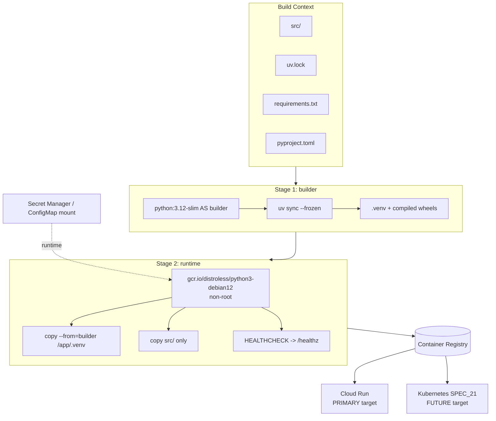
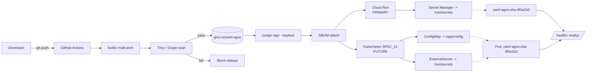

# SPEC_20_DOCKER_BUILD

> **Propósito**: Definir el pipeline de construcción de imágenes Docker para yaml-agno (Agno `AgentOS` runtime). Cubre Dockerfile multi-stage con layer caching óptimo, `.dockerignore`, health checks integrados con SPEC_06, integración con `ConfigManager` (config via mount YAML, NO env vars) y `SecretManager` (secrets via Docker secrets / mounted files), multi-arch buildx (amd64/arm64), labels OCI, compose dev, y estrategia de tagging semver+git-sha. La imagen final debe ser <200MB, non-root, y reproducible bit-a-bit desde `uv.lock`.

> @ai-directive **Dual deployment target (SPEC_00 §7.3)**: esta imagen OCI es **deploy-target-agnostic** por diseño (inmutable, sin config/secrets baked-in). Se despliega **PRIMARIAMENTE en Google Cloud Run** (serverless: prenden, trabajan, persisten en DB/storage, se apagan) y **FUTURAMENTE en Kubernetes** (SPEC_21, cuando se domine la gestión de servidores). El mismo `sha-<git>` corre en Cloud Run y K8s sin rebuild. Ver §17 para el ejemplo de deploy Cloud Run.

---

## 1. ARQUITECTURA DE BUILD

### 1.1 Posicionamiento en yaml-agno

El contenedor yaml-agno empaqueta el runtime `AgentOS` (SPEC_12) sobre FastAPI (AgentOS). La imagen NO empaqueta configuración: la config YAML se monta en runtime (`ConfigManager` lee `/app/config/agentos.yaml`), y los secrets se inyectan como archivos (`SecretManager` lee `/run/secrets/*` o paths declarados). Esto mantiene la imagen inmutable y promocionable dev→staging→prod sin rebuild.



### 1.2 Principios de la imagen

1. **Multi-stage estricto**: builder contiene compiladores/toolchain; runtime contiene solo artefactos.
2. **Layer caching**: dependencias (`uv.lock`/`requirements.txt`) en layer independiente y anterior al código fuente.
3. **Inmutable**: la imagen NO contiene config ni secrets. Misma imagen corre en dev/staging/prod.
4. **Non-root por defecto**: el entrypoint corre como UID 65532 (distroless default).
5. **Reproducible**: pinned por `uv.lock` + base image por digest (`@sha256:...`), no por tag flotante.
6. **Health nativo**: `HEALTHCHECK` apunta a `/healthz` y `/readyz` (SPEC_06).
7. **Pequeña**: objetivo <200MB; distroless runtime sin shell.

### 1.3 Stack y versiones pinneadas

| Componente | Versión | Rationale |
|------------|---------|-----------|
| Python | 3.12 |asyncio.TaskGroup estable, match Agno |
| Base builder | `python:3.12-slim` | toolchain completo para compilar wheels |
| Base runtime | `gcr.io/distroless/python3-debian12:nonroot` | sin shell, sin package manager, ~50MB |
| uv | 0.5.x (pinned) | resolver + installer 10-100x más rápido que pip |
| FastAPI | según `uv.lock` | via SPEC_12 |
| Agno | según `uv.lock` | |

---

## 2. ESTRUCTURA DE ARCHIVOS DE BUILD

```
yaml-agno/
├── Dockerfile                      # multi-stage (este spec)
├── .dockerignore                   # excluye tests, .git, venvs locales
├── docker-compose.yml              # dev: app + postgres + redis
├── docker-compose.override.yml     # dev overrides (hot-reload, mounts)
├── docker/
│   ├── entrypoint.sh               # wrapper: espera DB, arranca uvicorn
│   ├── healthcheck.py              # GET /healthz, /readyz con timeout
│   └── configs/
│       └── agentos.example.yaml    # config canónica de ejemplo
├── scripts/
│   └── docker-build.sh             # wrapper buildx multi-arch + tagging
└── .github/workflows/
    └── docker-publish.yml          # CI: build, scan, push (referencia)
```

---

## 3. DOCKERFILE MULTI-STAGE

### 3.1 Dockerfile completo

```dockerfile
# syntax=docker/dockerfile:1.7
# yaml-agno runtime image — SPEC_20
# Multi-stage: builder (toolchain) -> runtime (distroless, non-root)

ARG PYTHON_VERSION=3.12
ARG BASE_DIGEST=sha256:<pin-distroless-python3-debian12-nonroot>
ARG ENV=prod

############################
# Stage 1: builder
############################
FROM python:${PYTHON_VERSION}-slim AS builder

ARG UV_VERSION=0.5.11
ENV UV_LINK_MODE=copy \
    UV_COMPILE_BYTECODE=1 \
    UV_PYTHON_DOWNLOADS=never \
    PYTHONDONTWRITEBYTECODE=1 \
    PYTHONUNBUFFERED=1 \
    PIP_NO_CACHE_DIR=1

# Install uv (pinned)
RUN pip install --no-cache-dir uv==${UV_VERSION}

WORKDIR /app

# Layer caching: copy lockfile + manifest FIRST
COPY uv.lock pyproject.toml ./
# requirements.txt kept for fallback / scanners that expect it
COPY requirements.txt ./

# Resolve & install deps into .venv (frozen == reproducible)
RUN --mount=type=cache,target=/root/.cache/uv \
    uv sync --frozen --no-install-project --no-dev

# Now copy source (invalidates only this + downstream layer)
COPY src/ ./src/

# Install the project itself into the venv
RUN --mount=type=cache,target=/root/.cache/uv \
    uv sync --frozen --no-dev

############################
# Stage 2: runtime (distroless, non-root)
############################
FROM gcr.io/distroless/python3-debian12:nonroot@${BASE_DIGEST} AS runtime

ARG ENV=prod
ARG BUILD_DATE
ARG VCS_REF
ARG VERSION=0.0.0
ARG IMAGE_TITLE=yaml-agno
ARG IMAGE_DESC="yaml-agno AgentOS runtime"

# OCI labels (spec conformant)
LABEL org.opencontainers.image.title="${IMAGE_TITLE}" \
      org.opencontainers.image.description="${IMAGE_DESC}" \
      org.opencontainers.image.source="https://github.com/yaml-agno/yaml-agno" \
      org.opencontainers.image.version="${VERSION}" \
      org.opencontainers.image.revision="${VCS_REF}" \
      org.opencontainers.image.created="${BUILD_DATE}" \
      org.opencontainers.image.licenses="MIT" \
      org.opencontainers.image.base.name="gcr.io/distroless/python3-debian12:nonroot" \
      io.yaml-agno.env="${ENV}" \
      io.yaml-agno.component="agentos-runtime"

ENV PYTHONPATH=/app/src \
    PYTHONDONTWRITEBYTECODE=1 \
    PYTHONUNBUFFERED=1 \
    YAML_AGNO_ENV=${ENV} \
    YAML_AGNO_CONFIG_PATH=/app/config/agentos.yaml \
    YAML_AGNO_SECRETS_DIR=/run/secrets

WORKDIR /app

# Copy the resolved virtualenv from builder
COPY --from=builder /app/.venv /app/.venv
COPY --chown=65532:65532 src/ /app/src/
COPY --chown=65532:65532 docker/healthcheck.py /app/healthcheck.py

# Config + secrets are MOUNTED at runtime, never baked in.
# ConfigManager reads YAML_AGNO_CONFIG_PATH; SecretManager reads YAML_AGNO_SECRETS_DIR.
VOLUME ["/app/config", "/run/secrets"]

EXPOSE 8000

USER 65532:65532

# Distroless has no shell: use python directly for healthcheck
HEALTHCHECK --interval=30s --timeout=5s --start-period=30s --retries=3 \
    CMD ["/app/.venv/bin/python", "/app/healthcheck.py"]

ENTRYPOINT ["/app/.venv/bin/python", "-m", "uvicorn", \
            "src.yaml_agno.main:app", \
            "--host", "0.0.0.0", "--port", "8000", \
            "--proxy-headers", "--forwarded-allow-ips", "*", \
            "--workers", "1", "--loop", "uvloop", "--http", "httptools"]
```

> **Nota sobre `sllim` typo**: la versión previa de este SPEC mostraba `python:${PYTHON_VERSION}-sllim` en el Dockerfile canónico "como typo intencional para que hadolint lo atrape". Eso era incorrecto: el Dockerfile canónico debe ser siempre válido. El typo deliberado ahora vive en un **fixture de test separado** (`tests/build/fixtures/Dockerfile.bad-sllim`) que TASK_D01 usa como input negativo para validar la gate de hadolint.

#### 3.1.1 ENTRYPOINT y wrapper `main:app`

> @ai-directive El ENTRYPOINT arranca `uvicorn src.yaml_agno.main:app`. **`main:app` NO es una aplicación FastAPI propia de yaml-agno** — es un thin wrapper alrededor de `AgentOS.get_app()`. yaml-agno **construye ON TOP de Agno**, no reimplementa el servidor HTTP. El módulo `main.py` expone `app` delegando al ASGI app que Agno produce:

```python
# src/yaml_agno/main.py
"""ASGI entrypoint for yaml-agno.

yaml-agno builds ON TOP of Agno: it does NOT instantiate its own FastAPI app.
The `app` object exposed here is the ASGI app produced by `AgentOS.get_app()`,
optionally wrapped to mount yaml-agno-specific routers (/healthz, /readyz,
/metrics) that Agno does not provide. uvicorn imports `src.yaml_agno.main:app`.
"""
from __future__ import annotations

from agno.os import AgentOS

from yaml_agno.runtime.bootstrap import build_agentos, mount_health_routers


def _create_app():
    """Build the AgentOS instance and return its ASGI app, with yaml-agno
    health/readiness/metrics routers mounted (SPEC_06)."""
    agentos: AgentOS = build_agentos()        # wires ConfigManager, SecretManager, etc.
    app = agentos.get_app()                   # Agno serves HTTP here
    return mount_health_routers(app)          # adds /healthz /readyz /metrics


# uvicorn resolves `main:app` to this object at import time.
app = _create_app()
```

Si en algún momento se necesita un servidor propio (NO recomendado), debe justificarse frente a la directiva SPEC_00: yaml-agno NO reimplementa Agno; `AgentOS.get_app()` es la fuente del ASGI app.

### 3.2 Estrategia de layers y cache

| Orden | Contenido | Frecuencia de cambio | Cache hit |
|-------|-----------|----------------------|-----------|
| 1 | `pip install uv` | raro (pinned) | ~ siempre |
| 2 | `COPY uv.lock pyproject.toml requirements.txt` | al bump de deps | alto |
| 3 | `uv sync --frozen --no-install-project` | solo cuando cambia lock | alto |
| 4 | `COPY src/` | cada commit | bajo (esperado) |
| 5 | `uv sync --frozen` (instala proyecto) | cada commit | bajo |

Esto garantiza que un cambio de código NO reinstala dependencias (layer 3 intacto).

### 3.3 Build args

| Arg | Default | Uso |
|-----|---------|-----|
| `PYTHON_VERSION` | `3.12` | Permite probar 3.13 sin tocar Dockerfile |
| `BASE_DIGEST` | `sha256:<pin>` | Pin inmutable de la base runtime |
| `ENV` | `prod` | Etiqueta la imagen (`io.yaml-agno.env`); NO cambia código |
| `UV_VERSION` | `0.5.11` | Pinned para reproducibilidad |
| `VERSION` | `0.0.0` | Semver inyectado por CI (tag) |
| `VCS_REF` | git sha | OCI revision label |
| `BUILD_DATE` | RFC3339 | OCI created label |

---

## 4. `.dockerignore`

```gitignore
# Version control
.git
.gitignore
.gitattributes

# Python artifacts
**/__pycache__/
**/*.py[cod]
**/.pytest_cache/
**/.mypy_cache/
**/.ruff_cache/
**/*.egg-info/
**/.venv/
**/venv/
**/env/
**/.env

# Build / dist
build/
dist/
*.whl
*.tar.gz

# Tests & coverage (not needed in runtime image)
tests/
**/test_*.py
**/*_test.py
.coverage
htmlcov/
coverage.xml
.pytest_cache/

# Docs & specs (markdown, not runtime)
docs/
specs/
*.md
LICENSE

# CI / IDE
.github/
.vscode/
.idea/
*.swp
.DS_Store

# Docker meta (avoid recursive context bloat)
Dockerfile*
docker-compose*.yml
.docker/

# Local config & secrets — MUST never enter the image
config/
configs/local/
**/*.local.yaml
**/secrets/
**/.env.local
**/.env.*.local

# Databases / volumes
*.db
*.sqlite3
data/
```

> **Crítico**: `config/`, `secrets/`, `.env*` se ignoran para garantizar que NUNCA entre material sensible al contexto de build. La config/secrets viven fuera (mount), ver §10 y §11.

---

## 5. HEALTH CHECK

### 5.1 `docker/healthcheck.py`

Distroless no tiene shell ni `curl`. El healthcheck ejecuta Python contra los endpoints de SPEC_06 (`/healthz`, `/readyz`).

```python
# docker/healthcheck.py
"""Container HEALTHCHECK: probes /healthz then /readyz (SPEC_06).
Exit 0 = healthy, exit 1 = unhealthy. Designed for distroless (no curl/shell)."""
from __future__ import annotations
import os
import sys
import urllib.request

HOST = os.environ.get("HEALTH_HOST", "127.0.0.1")
PORT = os.environ.get("HEALTH_PORT", "8000")
READY = f"http://{HOST}:{PORT}/readyz"
LIVE = f"http://{HOST}:{PORT}/healthz"
TIMEOUT = 3.0


def _probe(url: str) -> bool:
    try:
        with urllib.request.urlopen(url, timeout=TIMEOUT) as r:
            return r.status == 200
    except Exception:
        return False


def main() -> int:
    # readiness is the stronger signal: app booted AND deps (DB, etc.) reachable
    if _probe(READY):
        return 0
    # fall back to liveness if readiness not yet green (startup)
    return 0 if _probe(LIVE) else 1


if __name__ == "__main__":
    sys.exit(main())
```

### 5.2 HEALTHCHECK directive

`HEALTHCHECK --interval=30s --timeout=5s --start-period=30s --retries=3 CMD ["/app/.venv/bin/python", "/app/healthcheck.py"]`

- `start-period=30s` da margen al arranque de uvicorn + AgentOS bootstrap.
- `retries=3` evita flapping por un probe puntual caído.

---

## 6. ENTRYPOINT Y GRACEFUL SHUTDOWN

### 6.1 `docker/entrypoint.sh` (opcional, solo si se requiere wait-for-db en imágenes con shell)

En distroless no hay shell, así que el wait-for-db se delega a Kubernetes (`initContainers`, SPEC_21) o a FastAPI startup. Si se usa `python:3.12-slim` runtime alternativo, este entrypoint aplica:

```bash
#!/usr/bin/env sh
set -euo pipefail

# Wait for postgres (best-effort; production uses initContainer/k8s)
: "${DATABASE_HOST:=postgres}"
: "${DATABASE_PORT:=5432}"

python - <<PY
import os, socket, sys, time
host, port = os.environ["DATABASE_HOST"], int(os.environ["DATABASE_PORT"])
deadline = time.time() + 30
while time.time() < deadline:
    try:
        with socket.create_connection((host, port), 2):
            print(f"[entrypoint] DB reachable at {host}:{port}")
            sys.exit(0)
    except OSError:
        time.sleep(1)
print("[entrypoint] DB not reachable, proceeding anyway", file=sys.stderr)
PY

exec "$@"
```

### 6.2 Graceful shutdown (uvicorn)

uvicorn captura `SIGTERM` y drena conexiones. El `terminationGracePeriodSeconds` (SPEC_21) debe ser > tiempo de drain esperado. No se necesita lógica adicional en el contenedor; FastAPI lifespan (SPEC_12) cierra pools DB y cancela `asyncio.TaskGroup` ordenadamente.

---

## 7. INTEGRACIÓN CON CONFIGMANAGER (CONFIG VIA MOUNT, NO ENV VARS)

### 7.1 Principio

`ConfigManager` (Core Infra) carga `agentos.yaml` desde `YAML_AGNO_CONFIG_PATH` (default `/app/config/agentos.yaml`). La imagen **NO** contiene este archivo; se monta en runtime:

- Docker Compose dev: bind mount `./config:/app/config:ro`
- Kubernetes prod: `ConfigMap` montado como volumen (SPEC_21 §15)

### 7.2 Por qué NO env vars directas

1. YAML es estructurado (agents[], teams[], workflows[]); flattener a env vars es frágil y propenso a errores de parsing.
2. Hot-reload (SPEC_12 resync) opera sobre el archivo montado, no sobre env vars (que son inmutables tras arranque).
3. Multi-tenant: un tenant = un ConfigMap montado, sin rebuild de imagen.
4. Auditoría: el ConfigMap es un objeto versionado en k8s; env vars en el pod spec son menos trazables.

### 7.3 Config de ejemplo (`docker/configs/agentos.example.yaml`)

```yaml
agentos:
  name: "yaml-agno-prod"
  agents: ["ref:researcher", "ref:writer"]
  teams: ["ref:content-team"]
  workflows: ["ref:content-pipeline"]
  db: "ref:pg-prod"
  interfaces: ["ref:agui", "ref:slack"]
  mcp:
    enabled: true
    tools_to_expose: ["ref:researcher"]
  authorization:
    enabled: true
  tracing: true
  scheduler:
    enabled: true
    poll_interval: 15
```

> El path `ref:` indica resolución por registry; ver SPEC_12 §2.1.

---

## 8. INTEGRACIÓN CON SECRETMANAGER (SECRETS VIA MOUNTED FILES)

### 8.1 Principio

`SecretManager` lee secretos desde `YAML_AGNO_SECRETS_DIR` (default `/run/secrets`), el estándar de Docker secrets. En k8s se emite vía `ExternalSecrets Operator` (SPEC_21 §16) a un `Secret` montado en el mismo path. La imagen nunca bakea un secret.

### 8.2 Secretes esperados (contract)

| Archivo en `/run/secrets` | Contenido | Consumidor |
|---------------------------|-----------|------------|
| `/run/secrets/database_url` | `postgresql+asyncpg://...` | DatabaseManager (SPEC_03) |
| `/run/secrets/openai_api_key` | `sk-...` | ModelRegistry (SPEC_14) |
| `/run/secrets/jwt_signing_key` | base64 | AuthorizationAdapter (SPEC_12) |
| `/run/secrets/redis_url` | `redis://...` | Cache/Sessions (SPEC_04) |

`SecretManager` expone `get("database_url")` que lee el archivo y cachea en memoria. Nunca loguea el valor.

### 8.3 Docker Compose secrets (dev)

```yaml
# docker-compose.yml (excerpt)
services:
  app:
    secrets:
      - database_url
      - openai_api_key
secrets:
  database_url:
    file: ./secrets/local/database_url.txt   # gitignored
  openai_api_key:
    file: ./secrets/local/openai_api_key.txt
```

Docker monta el archivo en `/run/secrets/<name>` automáticamente, matching el contract.

---

## 9. MULTI-ARCH BUILD (BUILDX)

### 9.1 `scripts/docker-build.sh`

```bash
#!/usr/bin/env bash
set -euo pipefail

REGISTRY="${REGISTRY:-ghcr.io/yaml-agno}"
IMAGE="${IMAGE:-yaml-agno}"
VERSION="${VERSION:-$(git describe --tags --always --dirty)}"
SHA="$(git rev-parse --short HEAD)"
PLATFORMS="${PLATFORMS:-linux/amd64,linux/arm64}"
BUILD_DATE="$(date -u +%Y-%m-%dT%H:%M:%SZ)"
BASE_DIGEST="${BASE_DIGEST:-$(docker buildx imagetools inspect gcr.io/distroless/python3-debian12:nonroot --format '{{.Manifest.Digest}}')}"

TAG_LATEST="${REGISTRY}/${IMAGE}:${VERSION}"
TAG_SHA="${REGISTRY}/${IMAGE}:sha-${SHA}"

echo "[build] version=${VERSION} sha=${SHA} platforms=${PLATFORMS}"

docker buildx build \
  --platform "${PLATFORMS}" \
  --build-arg PYTHON_VERSION=3.12 \
  --build-arg BASE_DIGEST="sha256:${BASE_DIGEST}" \
  --build-arg ENV="${ENV:-prod}" \
  --build-arg VERSION="${VERSION}" \
  --build-arg VCS_REF="${SHA}" \
  --build-arg BUILD_DATE="${BUILD_DATE}" \
  --label "io.yaml-agno.version=${VERSION}" \
  -t "${TAG_LATEST}" \
  -t "${TAG_SHA}" \
  -t "${REGISTRY}/${IMAGE}:latest" \
  --push \
  -f Dockerfile \
  .

# Provenance + SBOM (buildkit native)
# add: --provenance=true --sbom=true  (requires buildx >=0.13)
```

### 9.2 Multi-arch rationale

- `amd64`: default cloud (AWS/GCP/Azure x86).
- `arm64`: graviton / AWS Lambda container / Apple Silicon dev parity.

Buildx usa QEMU para cross-compile; en CI nativo (p.ej. GitHub Actions matrix) se construye sin emulación.

---

## 10. IMAGE TAGGING STRATEGY

| Tag | Cuándo | Ejemplo | Inmutable |
|-----|--------|---------|-----------|
| `:latest` | cada build main | `:latest` | NO |
| `:<semver>` | release tag | `:1.2.0` | SÍ |
| `:sha-<git short>` | cada commit | `:sha-9f3a1b2` | SÍ |
| `:<semver>-<env>` | env-specific | `:1.2.0-prod` | SÍ |
| `:pr-<n>` | CI PR build (descartable) | `:pr-42` | NO |

**Regla de oro**: producción deploys SIEMPRE por `sha-<git>` o `<semver>`, nunca `:latest`. Esto da rollback determinista (SPEC_21 §12).

---

## 11. DOCKER COMPOSE (DEV)

### 11.1 `docker-compose.yml`

```yaml
version: "3.9"

services:
  app:
    build:
      context: .
      dockerfile: Dockerfile
      args:
        PYTHON_VERSION: "3.12"
        ENV: "dev"
    image: yaml-agno:dev
    ports:
      - "8000:8000"
    environment:
      YAML_AGNO_ENV: dev
      YAML_AGNO_CONFIG_PATH: /app/config/agentos.yaml
      YAML_AGNO_SECRETS_DIR: /run/secrets
      OTEL_EXPORTER_OTLP_ENDPOINT: http://otel-collector:4317
    volumes:
      - ./config:/app/config:ro          # ConfigManager reads here
      - ./src:/app/src:ro                # source (override for IDE)
    secrets:
      - database_url
      - openai_api_key
      - redis_url
    depends_on:
      postgres:
        condition: service_healthy
      redis:
        condition: service_started
    healthcheck:
      test: ["CMD", "/app/.venv/bin/python", "/app/healthcheck.py"]
      interval: 15s
      timeout: 5s
      retries: 5
      start_period: 20s
    networks: [yaml-agno-net]

  postgres:
    image: postgres:16-alpine
    environment:
      POSTGRES_USER: yamlagno
      POSTGRES_PASSWORD: devpassword
      POSTGRES_DB: yamlagno
    ports: ["5432:5432"]
    volumes:
      - pgdata:/var/lib/postgresql/data
    healthcheck:
      test: ["CMD-SHELL", "pg_isready -U yamlagno -d yamlagno"]
      interval: 5s
      timeout: 3s
      retries: 10
    networks: [yaml-agno-net]

  redis:
    image: redis:7-alpine
    ports: ["6379:6379"]
    command: ["redis-server", "--save", "60", "1", "--appendonly", "yes"]
    volumes: [redisdata:/data]
    networks: [yaml-agno-net]

  otel-collector:
    image: otel/opentelemetry-collector-contrib:0.110.0
    command: ["--config=/etc/otelcol/config.yaml"]
    volumes: ["./docker/otelcol.yaml:/etc/otelcol/config.yaml:ro"]
    ports: ["4317:4317", "8888:8888"]
    networks: [yaml-agno-net]

secrets:
  database_url:
    file: ./secrets/local/database_url.txt
  openai_api_key:
    file: ./secrets/local/openai_api_key.txt
  redis_url:
    file: ./secrets/local/redis_url.txt

volumes:
  pgdata:
  redisdata:

networks:
  yaml-agno-net:
    driver: bridge
```

### 11.2 `docker-compose.override.yml` (hot-reload en dev)

```yaml
services:
  app:
    build:
      args:
        ENV: dev
    volumes:
      - ./src:/app/src            # rw for reload
      - ./config:/app/config:ro
    command:
      - "/app/.venv/bin/python"
      - "-m"
      - "uvicorn"
      - "src.yaml_agno.main:app"
      - "--host"
      - "0.0.0.0"
      - "--port"
      - "8000"
      - "--reload"
      - "--reload-dir"
      - "/app/src"
      - "--reload-dir"
      - "/app/config"
```

---

## 12. OPTIMIZACIÓN DE TAMAÑO (<200MB)

| Técnica | Ahorro estimado |
|---------|-----------------|
| distroless runtime (sin apt, sin shell) | ~ -200MB vs python:3.12 |
| `uv` con `UV_COMPILE_BYTECODE=1` y venv standalone | sin `.pyc` duplicados |
| `--no-dev` (excluye pytest/mypy/etc del runtime) | ~ -50MB |
| `.dockerignore` (tests/docs/specs fuera del contexto) | build context -60% |
| Multi-stage: toolchain queda solo en builder | -compiladores (~150MB) |
| Sin cache de pip/uv en la imagen final (cache mount) | -30MB |

**Meta verificable**: `docker image inspect` → `.Size` < 200 MiB (TASK_D04).

---

## 13. LABELS OCI (CONFORMANCIA)

La imagen publica:

```text
org.opencontainers.image.title
org.opencontainers.image.description
org.opencontainers.image.source
org.opencontainers.image.version
org.opencontainers.image.revision
org.opencontainers.image.created
org.opencontainers.image.licenses
org.opencontainers.image.base.name
io.yaml-agno.env
io.yaml-agno.component
io.yaml-agno.version
```

Validable con `docker buildx imagetools inspect  --format '{{json .}}'` (TASK_D05).

---

## 14. REFERENCIA AGNO DEPLOY (PATRONES OFICIALES)

> @ai-directive **Cherry-pick from `agent-platform-railway` (Apache-2.0)** per SPEC_07 §2.3: `agno-agi/agent-platform-railway` es la **plataforma de referencia oficial de Agno** para levantar AgentOS en producción segura. yaml-agno toma **selectivamente** los patrones de deploy/Docker que aplican a este SPEC y descarta el resto. Cada pieza tomada se revalida aquí. La licencia Apache-2.0 permite reusar los scripts/Dockerfile con atribución. Esta es **referencia de prácticas seguras**, NO una dependencia que se adopta completa.

Patrones tomados de agent-platform-railway (revalidados) y de la documentación oficial de Agno (sección "deploy" / "production"):

- Agno recomienda servir vía `AgentOS.serve()` o exponiendo `get_app()` detrás de un ASGI server (uvicorn/gunicorn).
- Producción: `gunicorn -k uvicorn.workers.UvicornWorker` para multi-worker. En k8s se prefiere 1 worker/pod + HPA (SPEC_21) sobre multi-worker/pod (simplifica drain y tracing).
- Health: Agno expone endpoints de play/playground; yaml-agno añade `/healthz`, `/readyz` (SPEC_06) para probes estándar.
- Secrets: Agno soporta `AGNO_API_KEY` etc.; yaml-agno los canaliza por `SecretManager` (mounted files), no env vars.
- DB: Agno `auto_provision_dbs=True` crea tablas al arranque; en prod se desactiva y se migra vía job (SPEC_21).
- **Non-root UID 65532** y **distroless runtime** (sin shell, sin package manager) revalidados contra agent-platform-railway; superficie de ataque mínima.
- **Trivy scan gate HIGH/CRITICAL** previo al push al registry (bloqueo de release) alineado con la práctica de agent-platform-railway de fail-closed en supply chain.

### 14.1 Deuda de naming: `jwt_signing_key` vs `JWT_VERIFICATION_KEY`

SPEC_07 §2.2 establece el contrato SSOT de refuse-to-start sobre `JWT_VERIFICATION_KEY` (o `JWT_JWKS_FILE`). Este SPEC y SPEC_21 montan el secret como `jwt_signing_key` (contract de `SecretManager`, §8.2). La dirección de la corrección (renombrar a `JWT_VERIFICATION_KEY` en SPEC_20+SPEC_21, o documentar el alias en SPEC_07) queda como **deuda explícita** que debe resolverse al corregir SPEC_19/SPEC_07 en conjunto, NO aislada en un único SPEC (rompería la consistencia SPEC_20↔SPEC_21).

---

## 15. COMPARATIVA DE BASE IMAGES

| Imagen | Tamaño | Shell | Apto prod | Notas |
|--------|--------|-------|-----------|-------|
| `python:3.12` | ~1GB | sí | NO | full debian, pesada |
| `python:3.12-slim` | ~150MB | sí | aceptable | fallback si distroless rompe algo |
| `python:3.12-alpine` | ~70MB | sí | cuidado | musl; wheels C a veces fallan |
| `gcr.io/distroless/python3-debian12:nonroot` | ~50MB | NO | **SÍ (default)** | sin package manager = superficie de ataque mínima |

Decisión: **distroless nonroot** por defecto; `python:3.12-slim` documentado como fallback si se requiere shell para debugging en staging.

---

## 16. DIAGRAMA DE TOPOLOGÍA DE BUILD/DEPLOY



---

## 17. DEPLOY EN GOOGLE CLOUD RUN (DESTINO PRIMARIO)

> @ai-directive Per SPEC_00 §7.3, **Cloud Run es el destino de deployment PRIMARIO**; Kubernetes (SPEC_21) es el destino FUTURO. La misma imagen OCI de §3 se despliega en Cloud Run sin rebuild. Cloud Run es serverless: las revisiones prenden bajo demanda, procesan, persisten en DB/storage y se apagan (scale-to-zero). Esto alinea con el modelo sin estado de yaml-agno.

### 17.1 Requisitos de la imagen para Cloud Run

| Requisito | Estado en este SPEC | Nota |
|-----------|---------------------|------|
| Escucha en `$PORT` (Cloud Run inyecta `PORT`, default 8080) | **Ajuste**: entrypoint debe leer `PORT` | Ver §17.3 |
| Non-root | ✅ `USER 65532:65532` (§3) | Compatible |
| Sin shell (distroless) | ✅ | Cloud Run no requiere shell |
| Imagen < 4 GB (límite Cloud Run) | ✅ <200MB (§12) | Amplio margen |
| Health HTTP | ✅ `/healthz`, `/readyz` | Cloud Run los puede usar como liveness |
| Secrets via mount | ✅ `/run/secrets` via Cloud Run secrets → Secret Manager | Ver §17.2 |

> Cloud Run pasa el puerto a escuchar en la variable `PORT` (default 8080). El Dockerfile de §3 fija `--port 8000`; para Cloud Run el entrypoint debe respetar `$PORT`. Opción recomendada: un build-arg `CLOUD_RUN=1` que sustituye el `ENTRYPOINT` por uno que use `${PORT}`, o un wrapper que lea `PORT`. Esto NO cambia la imagen base, sólo cómo se lanza.

### 17.2 Secrets y config en Cloud Run

- **Secrets**: Cloud Run monta versiones de **GCP Secret Manager** como archivos en un path elegido. Se monta cada secreto en `/run/secrets/<name>` para matchear el contract de `SecretManager` (§8). Equivalente serverless de ExternalSecrets en K8s.
- **Config**: `agentos.yaml` no se bakea. Opciones serverless: (a) montar el YAML desde un bucket GCS (sidecar/fuse) o como contenido de Secret Manager; (b) en versiones que soporten config por archivo, montar un Secret con el YAML. `ConfigManager` lee `YAML_AGNO_CONFIG_PATH=/app/config/agentos.yaml` igual que en K8s.

### 17.3 Ejemplo `gcloud run deploy`

```bash
#!/usr/bin/env bash
set -euo pipefail

# Deploy PRIMARY target: Google Cloud Run
# La imagen ya está firmada (cosign) y con SBOM en GHCR (SPEC_22).
REGION="${REGION:-europe-west1}"
PROJECT="${GCP_PROJECT:-yaml-agno-prod}"
SERVICE="yaml-agno"
IMAGE="ghcr.io/yaml-agno/yaml-agno:sha-$(git rev-parse --short HEAD)"

echo "[cloud-run] deploy ${IMAGE} -> ${SERVICE} (${REGION})"

gcloud run deploy "${SERVICE}" \
  --image "${IMAGE}" \
  --region "${REGION}" \
  --project "${PROJECT}" \
  --platform managed \
  --no-allow-unauthenticated \
  --port "${PORT:-8080}" \
  --set-env-vars "YAML_AGNO_ENV=prod,YAML_AGNO_CONFIG_PATH=/app/config/agentos.yaml,YAML_AGNO_SECRETS_DIR=/run/secrets" \
  --set-secrets "database_url=ya-db-url:latest,openai_api_key=ya-openai-key:latest,redis_url=ya-redis-url:latest,jwt_signing_key=ya-jwt-key:latest" \
  --set-cloudsql-instances "${PROJECT}:${REGION}:ya-pg-prod" \
  --min-instances 0 \
  --max-instances 20 \
  --cpu 1 \
  --memory 1Gi \
  --concurrency 80 \
  --timeout 300 \
  --ingress internal-and-cloud-load-balancing \
  --no-traffic \
  --tag "sha-$(git rev-parse --short HEAD)"

# Migrar tráfico gradualmente a la nueva revisión (canary manual en MVP).
gcloud run services update-traffic "${SERVICE}" \
  --region "${REGION}" --project "${PROJECT}" \
  --to-tags "sha-$(git rev-parse --short HEAD)=25"

# Validar SLO antes de promover a 100% (análogo al canary SLO check de K8s).
python scripts/canary_slo_check.py --window 10m --platform cloud-run --service "${SERVICE}"
```

### 17.4 Comparativa Cloud Run vs Kubernetes (cuándo migrar)

| Dimensión | Cloud Run (PRIMARIO) | Kubernetes (FUTURO, SPEC_21) |
|-----------|----------------------|------------------------------|
| Gestión de servidores | Ninguna (serverless) | Requerida (cluster ops) |
| Scale-to-zero | Nativo | Requiere KEDA/HPA + cold-start tuning |
| Secrets | Secret Manager mounts | ExternalSecrets Operator |
| Observabilidad | Cloud Monitoring / Managed Prometheus (SPEC_24) | kube-prometheus-stack (SPEC_24) |
| Hardening | IAM, egress control, no-privileged (SPEC_25) | PSS, NetworkPolicy, Kyverno, Falco (SPEC_25) |
| Rollback | `gcloud run services update-traffic` | `kubectl rollout undo` / ArgoCD |
| Migrar a K8s | Imagen idéntica, mismo `sha-<git>` | — |

> **Decisión (SPEC_00 §7.3)**: se adopta Cloud Run primero porque elimina la carga operativa de gestionar servidores; K8s se adopta cuando el equipo domine la gestión de clústeres y necesite control más fino (node pools dedicados, NetworkPolicy avanzada, service mesh). Hasta entonces, todos los SPEC de infra (20-25) reflejan Cloud Run como destino primario y K8s como futuro.

---

## 3. BEHAVIOR DELTA BDD (GHERKIN)

### Feature: Docker build success

```gherkin
Feature: Docker image builds reproducibly
  As a DevOps engineer
  I want the image to build from a clean context
  So that deployments are deterministic

  Scenario: Build succeeds with pinned uv.lock
    Given a clean checkout with a valid "uv.lock"
    When I run "docker buildx build --load -f Dockerfile ."
    Then the build exits with code 0
    And the image "yaml-agno:dev" exists locally
    And the layer for "uv sync --frozen" is cached on rebuild without code changes

  Scenario: Dockerfile lint rejects a malformed base image tag
    Given a Dockerfile containing "FROM python:3.12-sllim AS builder"
    When I run "hadolint Dockerfile"
    Then the command exits non-zero
    And the output references an invalid base image tag

  Scenario: Reproducible across two builds
    Given the same "uv.lock" and base digest
    When I build twice on the same host
    Then the resulting image digests are identical
```

### Feature: Health check passes

```gherkin
Feature: Container health check reflects app readiness
  As a platform operator
  I want HEALTHCHECK to report the real app state
  So that orchestrators route traffic only to healthy pods

  Scenario: Healthy pod reports healthy
    Given the app is running and "/readyz" returns 200
    When Docker runs the HEALTHCHECK command
    Then the exit code is 0
    And "docker inspect" shows "Status": "healthy"

  Scenario: Unhealthy app reports unhealthy
    Given the app process is up but "/readyz" returns 503
    When Docker runs the HEALTHCHECK command after "retries" attempts
    Then "docker inspect" shows "Status": "unhealthy"

  Scenario: Startup grace period avoids false negatives
    Given a freshly started container
    When the probe runs within "start-period" (30s)
    Then Docker does not mark the container unhealthy yet
```

### Feature: Non-root enforcement

```gherkin
Feature: Runtime never runs as root
  As a security reviewer
  I want the entrypoint to run as a non-root UID
  So that a container escape has reduced privileges

  Scenario: Effective UID is 65532
    Given the built image "yaml-agno:dev"
    When I run "docker run --rm --entrypoint '' ... id" equivalent via python
    Then the effective UID is 65532
    And the USER directive resolves to 65532:65532

  Scenario: No shell present in distroless runtime
    Given the built image
    When I attempt to run "/bin/sh"
    Then the command fails with "not found" or equivalent
```

### Feature: Multi-arch support

```gherkin
Feature: Image supports amd64 and arm64
  As a cloud engineer
  I want one manifest list serving both arches
  So that I can deploy to Graviton and x86 unchanged

  Scenario: Manifest list contains both platforms
    Given a multi-arch build pushed to registry
    When I run "docker buildx imagetools inspect "
    Then the output lists "linux/amd64" and "linux/arm64"
    And each platform has a distinct digest

  Scenario: arm64 image runs on arm64 host
    Given an arm64 node
    When I pull and run the image
    Then uvicorn starts and "/healthz" returns 200
```

### Feature: Image size budget

```gherkin
Feature: Final image stays under 200 MiB
  As a cost-conscious operator
  I want a small image
  So that pulls are fast and registry storage is cheap

  Scenario: Image size below threshold
    Given the built production image
    When I inspect its size
    Then ".Size" is less than 209715200 bytes (200 MiB)

  Scenario: No dev dependencies leaked
    Given the built image
    When I check for pytest/mypy in the venv
    Then they are absent
```

### Feature: Config/secrets never baked in

```gherkin
Feature: Image carries no tenant-specific material
  As a compliance officer
  I want the image free of configs and secrets
  So that it is environment-agnostic

  Scenario: No agentos.yaml inside the image
    Given the built image
    When I scan layers for "/app/config/agentos.yaml"
    Then it is absent

  Scenario: No secret material in any layer
    Given the built image
    When I run a secret scanner across layers
    Then zero high-confidence secret matches are found
```

---

## 4. TDD MICRO-TASK

> Modo Strict TDD activo. Cada tarea: RED (test falla) → GREEN (implementación mínima) → Commit. Test runner: `pytest`. Lint Dockerfile con `hadolint`; escanear con `trivy`.

### TASK_D01: Dockerfile lint gate (RED→GREEN)
- **File**: `Dockerfile`, `tests/build/test_dockerfile_lint.py`
- **Test**: test que corre `hadolint Dockerfile` y exige exit 0; falla si hay base image inválida (ej. `slim` mal escrito).
- **RED**: sin Dockerfile o con typo → test falla.
- **GREEN**: Dockerfile bien formado con base válida → test pasa.
- **Commit**: `feat(docker): add Dockerfile with hadolint gate`

### TASK_D02: Multi-stage build success (RED→GREEN)
- **File**: `Dockerfile`, `tests/build/test_build.py::test_build_succeeds`
- **Test**: invoca `docker buildx build --load` y verifica exit 0 + imagen existe; skip si Docker no disponible (`pytest.mark.skipif`).
- **RED**: sin Dockerfile → falla.
- **GREEN**: Dockerfile multi-stage completo → pasa.
- **Commit**: `feat(docker): multi-stage builder + distroless runtime`

### TASK_D03: `.dockerignore` excludes secrets (RED→GREEN)
- **File**: `.dockerignore`, `tests/build/test_dockerignore.py`
- **Test**: assert que `.dockerignore` contiene `config/`, `secrets/`, `.env*`, `tests/`, `*.md`.
- **RED**: archivo ausente o incompleto.
- **GREEN**: `.dockerignore` con todas las entradas requeridas.
- **Commit**: `chore(docker): complete .dockerignore`

### TASK_D04: Image size < 200 MiB (RED→GREEN)
- **File**: `tests/build/test_image_size.py`
- **Test**: `docker image inspect` → `.Size` < 209715200; skip si la imagen no existe.
- **RED**: imagen > 200 MiB (p.ej. sin `--no-dev`) → falla.
- **GREEN**: imagen optimizada pasa.
- **Commit**: `perf(docker): shrink runtime image under 200MiB`

### TASK_D05: OCI labels present (RED→GREEN)
- **File**: `Dockerfile`, `tests/build/test_oci_labels.py`
- **Test**: `docker inspect` → `Config.Labels` contiene las 11 keys OCI/yaml-agno.
- **RED**: labels faltantes.
- **GREEN**: todas las labels presentes y no vacías.
- **Commit**: `feat(docker): add OCI conformant labels`

### TASK_D06: Health check endpoint (RED→GREEN)
- **File**: `docker/healthcheck.py`, `tests/build/test_healthcheck.py`
- **Test**: monkeypatch `urllib.request.urlopen` → retorna mock 200 → exit 0; mock 503 → exit 1.
- **RED**: script ausente.
- **GREEN**: script implementado.
- **Commit**: `feat(docker): add distroless-compatible healthcheck`

### TASK_D07: HEALTHCHECK directive wired (RED→GREEN)
- **File**: `Dockerfile`, `tests/build/test_healthcheck_directive.py`
- **Test**: parsea el Dockerfile y verifica `HEALTHCHECK` con `interval`, `timeout`, `start-period`, `retries` y CMD apuntando a `healthcheck.py`.
- **RED**: sin directive.
- **GREEN**: directive completa.
- **Commit**: `feat(docker): wire HEALTHCHECK to /readyz /healthz`

### TASK_D08: Non-root USER enforcement (RED→GREEN)
- **File**: `Dockerfile`, `tests/build/test_nonroot.py`
- **Test**: `docker inspect` → `.Config.User == "65532:65532"` y no es `root`/`0`.
- **RED**: sin USER directive.
- **GREEN**: `USER 65532:65532` presente.
- **Commit**: `feat(docker): enforce non-root runtime user`

### TASK_D09: Multi-arch manifest (RED→GREEN)
- **File**: `scripts/docker-build.sh`, `tests/build/test_multiarch.py`
- **Test**: verifica que `--platform linux/amd64,linux/arm64` está en el script; si registry disponible, valida manifest list.
- **RED**: script sin multi-arch.
- **GREEN**: multi-arch presente.
- **Commit**: `feat(docker): add buildx multi-arch build script`

### TASK_D10: Compose dev stack up (RED→GREEN)
- **File**: `docker-compose.yml`, `docker-compose.override.yml`, `tests/build/test_compose.py`
- **Test**: `docker compose config` valida YAML; (smoke) `docker compose up -d` y probe a `http://localhost:8000/healthz` → 200 dentro de 60s; teardown.
- **RED**: compose roto.
- **GREEN**: stack levanta y responde healthy.
- **Commit**: `feat(docker): add dev compose (app+pg+redis+otel)`

### TASK_D11: Layer caching assertion (RED→GREEN)
- **File**: `Dockerfile`, `tests/build/test_layer_cache.py`
- **Test**: primer build, segundo build tras tocar solo `src/` → el layer `uv sync --frozen --no-install-project` se reporta como `CACHED` en el log de build.
- **RED**: reorden de layers rompe cache.
- **GREEN**: layers ordenados → cache hit.
- **Commit**: `perf(docker): order layers for dependency cache hit`

### TASK_D12: No secrets in image (RED→GREEN)
- **File**: `tests/build/test_no_baked_secrets.py`
- **Test**: `trivy image --scanners secret ` → 0 HIGH/CRITICAL; assert ausencia de `/app/config/agentos.yaml` en capas.
- **RED**: secreto o config dentro.
- **GREEN**: imagen limpia.
- **Commit**: `test(docker): assert no baked secrets/config`

### TASK_D13: Build args wired (RED→GREEN)
- **File**: `Dockerfile`, `tests/build/test_build_args.py`
- **Test**: build con `--build-arg VERSION=1.2.3 --build-arg VCS_REF=abc` → labels reflejan esos valores; `PYTHON_VERSION` default 3.12.
- **RED**: args ignorados.
- **GREEN**: labels inyectados.
- **Commit**: `feat(docker): wire build-args to OCI labels`

### TASK_D14: Entrypoint exec form (RED→GREEN)
- **File**: `Dockerfile`, `tests/build/test_entrypoint.py`
- **Test**: parsea Dockerfile → `ENTRYPOINT` en forma exec (`["...","..."]`), no shell form, para que sea PID 1 correcto y reciba SIGTERM.
- **RED**: shell form.
- **GREEN**: exec form.
- **Commit**: `fix(docker): use exec-form entrypoint as PID 1`

---

## 5. SUPUESTOS TÉCNICOS

1. Docker Engine 24+ con buildx plugin ≥ 0.13 (para `--provenance`, `--sbom`).
2. `uv.lock` commiteado y freezeado; `uv sync --frozen` falla si está desincronizado (deseado).
3. Distroless base pinneada por digest; el CI actualiza el digest vía Dependabot/Renovate con test.
4. Registry: ghcr.io por defecto; ECR/GCR/AzureCR soportados cambiando `REGISTRY`.
5. CI escanea con Trivy antes de push; bloqueo en HIGH/CRITICAL.
6. Cosign keyless signing (OIDC) en CI; verificación opcional en admission (SPEC_21).
7. `ConfigManager` y `SecretManager` ya implementan lectura desde paths (Core Infra); este spec asume ese contract.
8. Hot-reload (resync) se basa en watch del archivo montado, no en rebuild de imagen.
9. PostgreSQL y Redis son services externos en prod (managed); solo en dev viven en compose.

---

## 6. PREGUNTAS DE CALIBRACIÓN

1. ¿`gunicorn` con N workers uvicorn como entrypoint prod, o 1 worker/pod + HPA? (Recomendación SPEC: 1 worker/pod por simplicidad de drain/tracing.)
2. ¿Cosign keyless (OIDC) o con key KMS para firma? ¿Verificar firma en admission controller?
3. ¿Base digest auto-actualizada por Renovate, o freezeada manualmente por release?
4. ¿Tolerancia para `python:3.12-slim` fallback cuando se necesite shell en staging, o distroless estricto en todos los envs?
5. ¿SBOM formato CycloneDX o SPDX para compliance?
6. ¿Cache de buildx en CI via `type=gha` (GitHub Actions cache) o registry cache (`type=registry,ref=.../cache`)?
7. ¿`/readyz` debe considerar dependencias (DB/Redis) o solo arranque del proceso? (SPEC_06 define la semántica; confirmar depth.)
8. ¿Política de retención de tags `:pr-*` y `:sha-*` en registry (TTL, garbage collect)?
