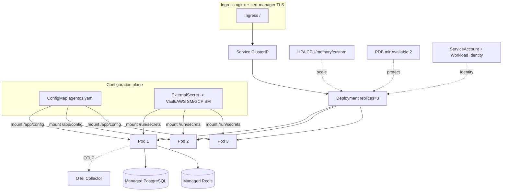
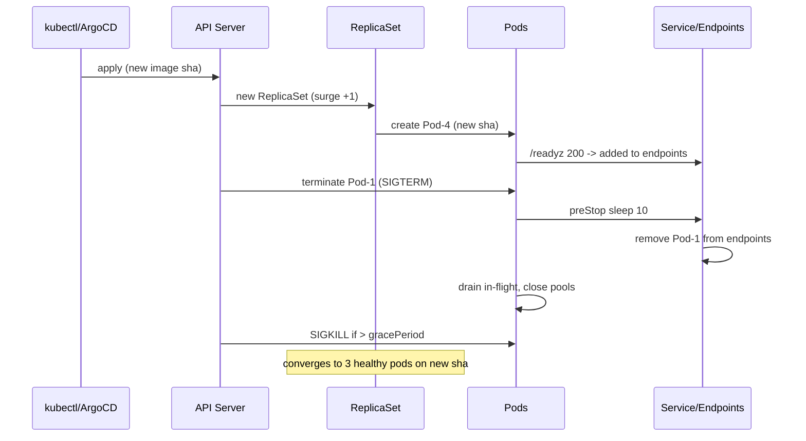

# SPEC_21_KUBERNETES_DEPLOYMENT

> @ai-directive **Este SPEC es la estrategia de deployment FUTURA de yaml-agno.** Per SPEC_00 §7.3, el destino de deployment **PRIMARIO actual es Google Cloud Run** (serverless; ver SPEC_20 §17). Kubernetes se adopta **cuando el equipo domine la gestión de servidores** y necesite control más fino (node pools dedicados, NetworkPolicy avanzada, service mesh). Hasta entonces, la precedencia es **Cloud Run > Kubernetes**: los manifests aquí definidos son válidos y se mantienen, pero NO son la vía de deploy activa en el MVP. La imagen OCI (SPEC_20) es la misma en ambos destinos.

> **Propósito**: Definir el deployment Kubernetes production-ready (FUTURO) para yaml-agno sobre la imagen de SPEC_20. Cubre manifests completos (Deployment/Service/Ingress/ConfigMap/Secret/HPA/PDB), probes (liveness/readiness/startup contra SPEC_06), graceful shutdown con preStop drain, affinity/anti-affinity, tolerations, namespace multi-tenant, Helm chart + Kustomize overlays, integración con `ConfigManager` (ConfigMap→YAML mount) y `SecretManager` (ExternalSecrets Operator), y estrategia de rollback (kubectl/ArgoCD). Multi-cloud agnostic (k8s estándar, sin CRDs propietarias salvo ExternalSecrets).

---

## 1. ARQUITECTURA DE DESPLIEGUE

### 1.1 Posicionamiento

yaml-agno corre como un Deployment sin estado sobre k8s. La imagen (SPEC_20) es inmutable; la variabilidad por ambiente vive en ConfigMap (config YAML) y ExternalSecret (secrets). El plano de datos (PostgreSQL, Redis) es un servicio externo gestionado (RDS/Cloud SQL/Azure Postgres / Elasticache) — NO se despliega dentro del cluster excepto en dev.



### 1.2 Principios

1. **Imagen inmutable**: mismo `sha-<git>` corre en dev/staging/prod; solo difieren ConfigMap/Secret.
2. **3 réplicas mínimo** para HA + PDB `minAvailable: 2`.
3. **Probes triples**: startup (no matar durante boot largo), liveness (reinicio si colgado), readiness (tráfico solo si listo).
4. **Graceful shutdown**: `preStop` duerme + `terminationGracePeriodSeconds` alto; FastAPI lifespan drena.
5. **Config como ConfigMap YAML** (ConfigManager), **secrets como ExternalSecrets** (SecretManager) — nunca env vars sensibles.
6. **Multi-tenant por namespace** con aislamiento (NetworkPolicy opcional), un ConfigMap por tenant.
7. **GitOps-first**: manifests via Helm/Kustomize; sync por ArgoCD/Flux opcional.
8. **Multi-cloud**: todo es k8s estándar + ExternalSecrets (AWS/GCP/Azure/Vault backends).

### 1.3 Topología de namespaces (multi-tenant)

| Estrategia | Pros | Contras | Decisión |
|------------|------|---------|----------|
| 1 namespace por tenant | aislamiento fuerte, RBAC simple, cuotas por ns | más manifests, overhead | **Default producción** |
| Shared namespace + labels | menos overhead | aislamiento débil, ruido entre tenants | Solo dev/small |

> En este spec se modela el namespace `yaml-agno-<tenant>` con Helm `--set tenant=<id>` generando el ConfigMap adecuado.

---

## 2. ESTRUCTURA DEL CHART HELM

```
deploy/helm/yaml-agno/
├── Chart.yaml
├── values.yaml                 # defaults (prod-like)
├── values-dev.yaml             # overlay dev
├── values-staging.yaml
├── values-prod.yaml
└── templates/
    ├── _helpers.tpl
    ├── namespace.yaml
    ├── serviceaccount.yaml
    ├── configmap.yaml          # agentos.yaml content
    ├── externalsecret.yaml     # ExternalSecret -> mounted /run/secrets
    ├── secret-provider.yaml    # alt: if not using ESO
    ├── deployment.yaml
    ├── service.yaml
    ├── ingress.yaml
    ├── hpa.yaml
    ├── pdb.yaml
    ├── networkpolicy.yaml
    ├── serviceentry-otel.yaml  # optional
    └── NOTES.txt
```

Kustomize overlays coexisten en `deploy/kustomize/`:

```
deploy/kustomize/
├── base/
│   ├── kustomization.yaml
│   ├── deployment.yaml
│   ├── service.yaml
│   └── configmap.yaml
└── overlays/
    ├── dev/
    │   ├── kustomization.yaml
    │   └── patch-replicas.yaml
    ├── staging/
    └── prod/
        ├── kustomization.yaml
        ├── patch-prod.yaml
        └── hpa.yaml
```

---

## 3. DEPLOYMENT MANIFEST

```yaml
# templates/deployment.yaml
apiVersion: apps/v1
kind: Deployment
metadata:
  name: {{ include "yaml-agno.fullname" . }}
  namespace: {{ .Release.Namespace }}
  labels:
    {{- include "yaml-agno.labels" . | nindent 4 }}
  annotations:
    deployment.kubernetes.io/revision: "1"
spec:
  replicas: {{ .Values.replicas }}
  revisionHistoryLimit: {{ .Values.revisionHistoryLimit | default 10 }}
  strategy:
    type: RollingUpdate
    rollingUpdate:
      maxUnavailable: 0        # never drop below replicas (PDB-aligned)
      maxSurge: 1
  selector:
    matchLabels:
      {{- include "yaml-agno.selectorLabels" . | nindent 6 }}
  template:
    metadata:
      labels:
        {{- include "yaml-agno.selectorLabels" . | nindent 8 }}
        app.kubernetes.io/component: agentos-runtime
      annotations:
        # force rollout when config or image changes
        checksum/config: {{ include (print $.Template.BasePath "/configmap.yaml") . | sha256sum }}
        checksum/secret: {{ include (print $.Template.BasePath "/externalsecret.yaml") . | sha256sum }}
        prometheus.io/scrape: "true"
        prometheus.io/port: "{{ .Values.service.metricsPort }}"
        prometheus.io/path: "/metrics"
    spec:
      serviceAccountName: {{ include "yaml-agno.serviceAccountName" . }}
      automountServiceAccountToken: true   # for Workload Identity / IRSA
      terminationGracePeriodSeconds: {{ .Values.terminationGracePeriodSeconds | default 60 }}
      affinity:
        podAntiAffinity:
          preferredDuringSchedulingIgnoredDuringExecution:
            - weight: 100
              podAffinityTerm:
                labelSelector:
                  matchLabels:
                    {{- include "yaml-agno.selectorLabels" . | nindent 20 }}
                topologyKey: kubernetes.io/hostname
        nodeAffinity:
          requiredDuringSchedulingIgnoredDuringExecution:
            nodeSelectorTerms:
              - matchExpressions:
                  - key: workload.yaml-agno.io/role
                    operator: In
                    values: ["agentos"]
      topologySpreadConstraints:
        - maxSkew: 1
          topologyKey: topology.kubernetes.io/zone
          whenUnsatisfiable: ScheduleAnyway
          labelSelector:
            matchLabels:
              {{- include "yaml-agno.selectorLabels" . | nindent 14 }}
      tolerations:
        - key: "workload.yaml-agno.io/dedicated"
          operator: "Equal"
          value: "agentos"
          effect: "NoSchedule"
      securityContext:
        runAsNonRoot: true
        runAsUser: 65532
        runAsGroup: 65532
        fsGroup: 65532
        seccompProfile:
          type: RuntimeDefault
      initContainers:
        - name: wait-for-db
          image: {{ .Values.initImage.repository }}:{{ .Values.initImage.tag }}
          command:
            - sh
            - -c
            - "until getent hosts ${DATABASE_HOST}; do echo waiting db; sleep 2; done"
          env:
            - name: DATABASE_HOST
              valueFrom:
                secretKeyRef:
                  name: {{ include "yaml-agno.fullname" . }}-secret
                  key: database_host
                  optional: true
      containers:
        - name: agentos
          image: "{{ .Values.image.repository }}:{{ .Values.image.tag | default .Chart.AppVersion }}"
          imagePullPolicy: IfNotPresent
          ports:
            - name: http
              containerPort: 8000
              protocol: TCP
            - name: metrics
              containerPort: {{ .Values.service.metricsPort }}
              protocol: TCP
          env:
            - name: YAML_AGNO_ENV
              value: {{ .Values.env | quote }}
            - name: YAML_AGNO_CONFIG_PATH
              value: /app/config/agentos.yaml
            - name: YAML_AGNO_SECRETS_DIR
              value: /run/secrets
            - name: OTEL_EXPORTER_OTLP_ENDPOINT
              value: {{ .Values.otel.endpoint | quote }}
            - name: OTEL_SERVICE_NAME
              value: {{ include "yaml-agno.fullname" . | quote }}
          envFrom:
            # non-sensitive reference values only
            - configMapRef:
                name: {{ include "yaml-agno.fullname" . }}-ref
          volumeMounts:
            - name: config
              mountPath: /app/config
              readOnly: true
            - name: secrets
              mountPath: /run/secrets
              readOnly: true
          startupProbe:
            httpGet:
              path: /healthz
              port: http
            failureThreshold: 30
            periodSeconds: 5          # ~150s max startup
          livenessProbe:
            httpGet:
              path: /healthz
              port: http
            periodSeconds: 10
            timeoutSeconds: 3
            failureThreshold: 3
          readinessProbe:
            httpGet:
              path: /readyz
              port: http
            periodSeconds: 5
            timeoutSeconds: 3
            failureThreshold: 2
            successThreshold: 1
          lifecycle:
            preStop:
              exec:
                # give ingress controller time to remove from endpoints;
                # then SIGTERM triggers FastAPI lifespan drain
                command: ["sleep", "10"]
          resources:
            {{- toYaml .Values.resources | nindent 12 }}
          securityContext:
            allowPrivilegeEscalation: false
            readOnlyRootFilesystem: true
            capabilities:
              drop: ["ALL"]
      volumes:
        - name: config
          configMap:
            name: {{ include "yaml-agno.fullname" . }}-config
        - name: secrets
          secret:
            secretName: {{ include "yaml-agno.fullname" . }}-secret
            defaultMode: 0440
```

### 3.1 Recursos (defaults)

Basado en profiling AgentOS (uvicorn single-worker, Pydantic V2, asyncio):

```yaml
resources:
  requests:
    cpu: "250m"
    memory: "512Mi"
  limits:
    cpu: "1000m"
    memory: "1Gi"
```

> `limits.cpu` presente para HPA-to-limit headroom; `memory.limit` para OOM protection. Se recomienda QoS Burstable; Guaranteed (requests=limits) si se quiere prioridad.

---

## 4. SERVICE

```yaml
# templates/service.yaml
apiVersion: v1
kind: Service
metadata:
  name: {{ include "yaml-agno.fullname" . }}
  namespace: {{ .Release.Namespace }}
  labels:
    {{- include "yaml-agno.labels" . | nindent 4 }}
spec:
  type: ClusterIP
  selector:
    {{- include "yaml-agno.selectorLabels" . | nindent 4 }}
  ports:
    - name: http
      port: {{ .Values.service.port }}
      targetPort: http
      protocol: TCP
    - name: metrics
      port: {{ .Values.service.metricsPort }}
      targetPort: metrics
      protocol: TCP
```

---

## 5. INGRESS (TLS via cert-manager)

```yaml
# templates/ingress.yaml
{{- if .Values.ingress.enabled }}
apiVersion: networking.k8s.io/v1
kind: Ingress
metadata:
  name: {{ include "yaml-agno.fullname" . }}
  namespace: {{ .Release.Namespace }}
  labels:
    {{- include "yaml-agno.labels" . | nindent 4 }}
  annotations:
    cert-manager.io/cluster-issuer: {{ .Values.ingress.clusterIssuer | quote }}
    nginx.ingress.kubernetes.io/proxy-body-size: "50m"
    nginx.ingress.kubernetes.io/proxy-read-timeout: "300"
    nginx.ingress.kubernetes.io/proxy-send-timeout: "300"
    nginx.ingress.kubernetes.io/backend-protocol: "HTTP"
    nginx.ingress.kubernetes.io/configuration-snippet: |
      proxy_buffering off;            # streaming / SSE for AG-UI
spec:
  ingressClassName: {{ .Values.ingress.className }}
  tls:
    - hosts:
        - {{ .Values.ingress.host | quote }}
      secretName: {{ include "yaml-agno.fullname" . }}-tls
  rules:
    - host: {{ .Values.ingress.host }}
      http:
        paths:
          - path: /
            pathType: Prefix
            backend:
              service:
                name: {{ include "yaml-agno.fullname" . }}
                port:
                  number: {{ .Values.service.port }}
{{- end }}
```

> `proxy_buffering off` es relevante para interfaces streaming (AG-UI, SSE) — ver SPEC_12.

---

## 6. CONFIGMAP (CONFIG YAML PARA CONFIGMANAGER)

```yaml
# templates/configmap.yaml
apiVersion: v1
kind: ConfigMap
metadata:
  name: {{ include "yaml-agno.fullname" . }}-config
  namespace: {{ .Release.Namespace }}
  labels:
    {{- include "yaml-agno.labels" . | nindent 4 }}
data:
  agentos.yaml: |
    {{- .Values.agentosConfig | toYaml | nindent 4 }}
---
apiVersion: v1
kind: ConfigMap
metadata:
  name: {{ include "yaml-agno.fullname" . }}-ref
data:
  LOG_LEVEL: {{ .Values.logLevel | quote }}
  OTEL_TRACES_SAMPLER_ARG: "0.1"
```

`ConfigManager` lee `/app/config/agentos.yaml` (mount). Cambios al ConfigMap + `checksum/config` annotation disparan rollout. Hot-reload sin rollout via SPEC_12 resync (watch del archivo).

### 6.1 Ejemplo `agentosConfig` en values.yaml

```yaml
agentosConfig:
  name: "yaml-agno-prod"
  agents: ["ref:researcher", "ref:writer"]
  teams: ["ref:content-team"]
  workflows: ["ref:content-pipeline"]
  db: "ref:pg-prod"
  interfaces: ["ref:agui"]
  mcp: { enabled: true }
  authorization: { enabled: true }
  tracing: true
  scheduler: { enabled: true, poll_interval: 15 }
```

---

## 7. SECRET + EXTERNALSECRETS (SECRETMANAGER)

### 7.1 Secret (consumido por el pod)

El pod monta un `Secret` `*-secret` en `/run/secrets`. Ese Secret es poblado por ExternalSecrets Operator desde el backend cloud (Vault/AWS SM/GCP SM).

```yaml
# templates/externalsecret.yaml
{{- if .Values.externalSecret.enabled }}
apiVersion: external-secrets.io/v1beta1
kind: ExternalSecret
metadata:
  name: {{ include "yaml-agno.fullname" . }}-es
  namespace: {{ .Release.Namespace }}
spec:
  refreshInterval: {{ .Values.externalSecret.refreshInterval | default "1h" }}
  secretStoreRef:
    name: {{ .Values.externalSecret.storeRef.name }}
    kind: {{ .Values.externalSecret.storeRef.kind | default "ClusterSecretStore" }}
  target:
    name: {{ include "yaml-agno.fullname" . }}-secret
    creationPolicy: Owner
    template:
      type: Opaque
      engineVersion: v2
      data:
        database_url: "{{`{{ .database_url }}`}}"
        database_host: "{{`{{ .database_host }}`}}"
        openai_api_key: "{{`{{ .openai_api_key }}`}}"
        jwt_signing_key: "{{`{{ .jwt_signing_key }}`}}"
        redis_url: "{{`{{ .redis_url }}`}}"
  data:
    - secretKey: database_url
      remoteRef:
        key: {{ .Values.externalSecret.path }}/database_url
    - secretKey: database_host
      remoteRef:
        key: {{ .Values.externalSecret.path }}/database_host
    - secretKey: openai_api_key
      remoteRef:
        key: {{ .Values.externalSecret.path }}/openai_api_key
    - secretKey: jwt_signing_key
      remoteRef:
        key: {{ .Values.externalSecret.path }}/jwt_signing_key
    - secretKey: redis_url
      remoteRef:
        key: {{ .Values.externalSecret.path }}/redis_url
{{- end }}
```

### 7.2 Contract con SecretManager

`SecretManager.get("database_url")` lee `/run/secrets/database_url`. ExternalSecrets materializa cada `secretKey` como un archivo individual en el Secret montado, matching el contract. Alternativa: un `dataField` que lee todo el JSON si el backend provee un blob.

---

## 8. HPA (HORIZONTAL POD AUTOSCALER)

```yaml
# templates/hpa.yaml
{{- if .Values.hpa.enabled }}
apiVersion: autoscaling/v2
kind: HorizontalPodAutoscaler
metadata:
  name: {{ include "yaml-agno.fullname" . }}
  namespace: {{ .Release.Namespace }}
spec:
  scaleTargetRef:
    apiVersion: apps/v1
    kind: Deployment
    name: {{ include "yaml-agno.fullname" . }}
  minReplicas: {{ .Values.hpa.minReplicas }}
  maxReplicas: {{ .Values.hpa.maxReplicas }}
  metrics:
    - type: Resource
      resource:
        name: cpu
        target:
          type: Utilization
          averageUtilization: {{ .Values.hpa.cpuTarget | default 65 }}
    - type: Resource
      resource:
        name: memory
        target:
          type: Utilization
          averageUtilization: {{ .Values.hpa.memoryTarget | default 75 }}
    {{- if .Values.hpa.customMetric.enabled }}
    - type: Pods
      pods:
        metric:
          name: {{ .Values.hpa.customMetric.name }}   # e.g. http_requests_per_second
        target:
          type: AverageValue
          averageValue: {{ .Values.hpa.customMetric.averageValue | quote }}
    {{- end }}
  behavior:
    scaleUp:
      stabilizationWindowSeconds: 60
      policies:
        - type: Percent
          value: 100
          periodSeconds: 30
    scaleDown:
      stabilizationWindowSeconds: 300
      policies:
        - type: Percent
          value: 50
          periodSeconds: 60
{{- end }}
```

### 8.1 Custom metrics (OpenTelemetry / Prom adapter)

Custom metric (p.ej. requests/s, tokens/s) requiere que el pipeline OTel→Prometheus→PrometheusAdapter (o keda) exponga el `PodsMetric`. Configuración del adapter fuera del scope de este chart; se asume `hpa.customMetric.name` ya resolvible por el API server.

---

## 9. PDB (POD DISRUPTION BUDGET)

```yaml
# templates/pdb.yaml
{{- if .Values.pdb.enabled }}
apiVersion: policy/v1
kind: PodDisruptionBudget
metadata:
  name: {{ include "yaml-agno.fullname" . }}
  namespace: {{ .Release.Namespace }}
spec:
  minAvailable: {{ .Values.pdb.minAvailable }}
  selector:
    matchLabels:
      {{- include "yaml-agno.selectorLabels" . | nindent 6 }}
{{- end }}
```

Default `minAvailable: 2` sobre `replicas: 3` → tolera 1 voluntary disruption.

---

## 10. PROBES — SEMÁNTICA (SPEC_06)

| Probe | Endpoint | `failureThreshold` | `periodSeconds` | Propósito |
|-------|----------|--------------------|------------------|-----------|
| startup | `/healthz` | 30 | 5 | No matar durante boot (Agno bootstrap puede tardar: model warmup, db provision) |
| liveness | `/healthz` | 3 | 10 | Reiniciar si proceso colgado |
| readiness | `/readyz` | 2 | 5 | Tráfico solo cuando deps (DB, Redis) alcanzables |

`/readyz` (SPEC_06) debe verificar conectividad a DB/Redis; si uno cae, el pod sale del endpoints y deja de recibir tráfico sin reiniciarse (mejor que liveness para blips transitorios).

---

## 11. GRACEFUL SHUTDOWN

1. Pod recibe `SIGTERM` (k8s delete / rolling update).
2. `preStop: sleep 10` da margen al ingress para sacarlo del endpoints (propagación eventual).
3. uvicorn captura `SIGTERM`, deja de aceptar nuevas conexiones, drena las activas.
4. FastAPI lifespan shutdown (SPEC_12): cierra pools DB, cancela `asyncio.TaskGroup`, flusha traces.
5. `terminationGracePeriodSeconds: 60` cubre el drenaje; k8s envía `SIGKILL` solo si excede.

---

## 12. ROLLBACK STRATEGY

### 12.1 kubectl nativo

```bash
# rollback al revision anterior
kubectl rollout undo deployment/yaml-agno -n yaml-agno-acme

# rollback a revision específica
kubectl rollout undo deployment/yaml-agno -n yaml-agno-acme --to-revision=3

# estado
kubectl rollout status deployment/yaml-agno -n yaml-agno-acme
kubectl rollout history deployment/yaml-agno -n yaml-agno-acme
```

`revisionHistoryLimit: 10` retiene history suficiente. Cada rollout = 1 revision (cambio de imagen o checksum config).

### 12.2 ArgoCD (GitOps)

- El estado deseado vive en Git (Helm values por env).
- Rollback = revert del commit + sync automático, o `argocd app rollback <app> <revision>`.
- ArgoCD muestra drift; prunes recursos huérfanos con `Prune: true`.
- `syncPolicy.automated` opcional; producción prefiere sync manual con `auto-prune + self-heal`.

### 12.3 Canary / Blue-Green

Fuera del chart base; vía Argo Rollouts o Flagger:

- **Canary**: 5% → 25% → 50% → 100% gateado por métricas (error rate, p99 latency).
- **Blue-Green**: dos Services (`-blue`, `-green`), switch de selector.

---

## 13. HELM CHART

### 13.1 `Chart.yaml`

```yaml
apiVersion: v2
name: yaml-agno
description: yaml-agno AgentOS runtime (SPEC_20 image)
type: application
version: 0.1.0            # chart version
appVersion: "0.1.0"       # matches image tag default
keywords: [yaml-agno, agno, agentos, fastapi]
maintainers:
  - name: yaml-agno-team
icon: https://yaml-agno.example/logo.png
dependencies: []
```

### 13.2 `values.yaml` (defaults prod-like)

```yaml
replicas: 3
revisionHistoryLimit: 10
env: prod
tenant: default
logLevel: INFO

image:
  repository: ghcr.io/yaml-agno/yaml-agno
  tag: ""                 # falls back to .Chart.AppVersion
  pullPolicy: IfNotPresent

initImage:
  repository: busybox
  tag: "1.36"

service:
  port: 80
  metricsPort: 9090

ingress:
  enabled: true
  className: nginx
  clusterIssuer: letsencrypt-prod
  host: yaml-agno.example.com

resources:
  requests: { cpu: "250m", memory: "512Mi" }
  limits:   { cpu: "1000m", memory: "1Gi" }

hpa:
  enabled: true
  minReplicas: 3
  maxReplicas: 12
  cpuTarget: 65
  memoryTarget: 75
  customMetric:
    enabled: false
    name: ""
    averageValue: "100"

pdb:
  enabled: true
  minAvailable: 2

terminationGracePeriodSeconds: 60

serviceAccount:
  create: true
  annotations: {}          # e.g. eks.amazonaws.com/role-arn / iam.gke.io/gcp-service-account

externalSecret:
  enabled: true
  refreshInterval: 1h
  storeRef:
    name: vault-backend
    kind: ClusterSecretStore
  path: kv/yaml-agno/prod

otel:
  endpoint: http://otel-collector.observability:4317

agentosConfig:
  name: "yaml-agno-prod"
  tracing: true

networkPolicy:
  enabled: false
```

### 13.3 `_helpers.tpl` (extracto)

```text
{{- define "yaml-agno.name" -}}{{ .Chart.Name }}{{- end -}}
{{- define "yaml-agno.fullname" -}}
{{- if .Values.tenant }}{{ .Release.Name }}-{{ .Values.tenant }}{{- else }}{{ .Release.Name }}{{- end -}}
{{- end -}}
{{- define "yaml-agno.labels" -}}
app.kubernetes.io/name: {{ include "yaml-agno.name" . }}
helm.sh/chart: {{ .Chart.Name }}-{{ .Chart.Version }}
app.kubernetes.io/instance: {{ .Release.Name }}
app.kubernetes.io/managed-by: {{ .Release.Service }}
app.kubernetes.io/part-of: yaml-agno
{{- end -}}
{{- define "yaml-agno.selectorLabels" -}}
app.kubernetes.io/name: {{ include "yaml-agno.name" . }}
app.kubernetes.io/instance: {{ .Release.Name }}
{{- end -}}
{{- define "yaml-agno.serviceAccountName" -}}
{{- if .Values.serviceAccount.create }}{{ include "yaml-agno.fullname" . }}{{- else }}{{ .Values.serviceAccount.name | default "default" }}{{- end -}}
{{- end -}}
```

---

## 14. KUSTOMIZE OVERLAYS

### 14.1 `deploy/kustomize/base/kustomization.yaml`

```yaml
apiVersion: kustomize.config.k8s.io/v1beta1
kind: Kustomization
resources:
  - deployment.yaml
  - service.yaml
  - configmap.yaml
commonLabels:
  app.kubernetes.io/part-of: yaml-agno
images:
  - name: ghcr.io/yaml-agno/yaml-agno
    newTag: sha-9f3a1b2
```

### 14.2 `overlays/prod/kustomization.yaml`

```yaml
apiVersion: kustomize.config.k8s.io/v1beta1
kind: Kustomization
namespace: yaml-agno-prod
resources:
  - ../../base
  - hpa.yaml
patches:
  - patch-replicas.yaml       # replicas: 3
  - patch-prod.yaml           # resources up, ingress host
configMapGenerator:
  - name: yaml-agno-config
    behavior: merge
    literals:
      - LOG_LEVEL=INFO
```

Dev/Staging son overlays análogos variando `namespace`, `replicas`, `resources`, `ingress.host`.

---

## 15. INTEGRACIÓN CONFIGMANAGER

- `ConfigManager` lee `/app/config/agentos.yaml` (mount del ConfigMap).
- Cambio de ConfigMap → `checksum/config` cambia → rollout automático.
- Hot-reload SIN rollout: el pod watchea el archivo (inotify) y dispara `AgentOS.resync()` (SPEC_12).
- Multi-tenant: cada namespace tiene su ConfigMap; el chart genera el YAML desde `values.yaml:agentosConfig` parametrizado por `tenant`.

---

## 16. INTEGRACIÓN SECRETMANAGER (EXTERNALSECRETS)

- `SecretManager.get(name)` lee `/run/secrets/<name>`.
- ExternalSecrets Operator (CRD `external-secrets.io`) sincroniza desde backend → `Secret` k8s → mount.
- Backends soportados (cloud-agnostic): AWS Secrets Manager, GCP Secret Manager, Azure Key Vault, HashiCorp Vault.
- `refreshInterval: 1h` rota el Secret montado sin redeploy; `SecretManager` relee el archivo en caché TTL.
- Workload Identity / IRSA: el ServiceAccount lleva la annotation del rol cloud para que el pod acceda al backend sin creds estáticas.

```yaml
serviceAccount:
  create: true
  annotations:
    # AWS IRSA
    eks.amazonaws.com/role-arn: arn:aws:iam::123456789012:role/yaml-agno-prod
    # GCP Workload Identity (alt)
    # iam.gke.io/gcp-service-account: yaml-agno-prod@project.iam.gserviceaccount.com
```

---

## 17. AFFINITY / TOLERATIONS / NODE POOLS

- **podAntiAffinity** `preferred` por hostname → spreading entre nodos.
- **topologySpreadConstraints** por zona → HA cross-AZ (`maxSkew: 1`).
- **nodeAffinity** requiere label `workload.yaml-agno.io/role=agentos` → node pool dedicado.
- **tolerations** para taint `workload.yaml-agno.io/dedicated=agentos:NoSchedule` → solo pods yaml-agno en ese pool.

---

## 18. PERSISTENT VOLUMES

yaml-agno es **stateless**. BD y Redis son servicios externos managed. Si se requiere SQLite local (solo dev/single-node Agno), se modela con PVC — pero **fuera del chart prod**:

```yaml
# only for dev/single-node edge case (NOT prod)
volumes:
  - name: data
    persistentVolumeClaim:
      claimName: yaml-agno-data
volumeMounts:
  - name: data
    mountPath: /app/data
```

**Decisión prod**: preferir RDS/Cloud SQL. PV local rompe HA y multi-tenant.

---

## 19. SERVICEACCOUNT + WORKLOAD IDENTITY

```yaml
# templates/serviceaccount.yaml
{{- if .Values.serviceAccount.create }}
apiVersion: v1
kind: ServiceAccount
metadata:
  name: {{ include "yaml-agno.serviceAccountName" . }}
  namespace: {{ .Release.Namespace }}
  labels:
    {{- include "yaml-agno.labels" . | nindent 4 }}
  {{- with .Values.serviceAccount.annotations }}
  annotations:
    {{- toYaml . | nindent 4 }}
  {{- end }}
{{- end }}
```

Cloud-agnostic: la annotation concreta (IRSA / WI / Federated) es un valor del chart por cloud. Sin creds estáticas en el manifiesto.

---

## 20. NETWORKPOLICY (OPCIONAL, MULTI-TENANT)

```yaml
{{- if .Values.networkPolicy.enabled }}
apiVersion: networking.k8s.io/v1
kind: NetworkPolicy
metadata:
  name: {{ include "yaml-agno.fullname" . }}-deny-ingress-other-tenants
  namespace: {{ .Release.Namespace }}
spec:
  podSelector:
    matchLabels:
      {{- include "yaml-agno.selectorLabels" . | nindent 6 }}
  policyTypes: [Ingress]
  ingress:
    - from:
        - namespaceSelector:
            matchLabels:
              tenant: {{ .Values.tenant | quote }}
        - podSelector: {}      # intra-namespace
    - from:
        - namespaceSelector:
            matchLabels:
              kubernetes.io/metadata.name: ingress-nginx
{{- end }}
```

---

## 21. DIAGRAMA ROLLING UPDATE



---

## 22. REFERENCIA AGNO DEPLOY

De `AGNO_COMPLETE_DOCS.md` (sección deploy/production):

- Agno recomienda `gunicorn -k uvicorn.workers.UvicornWorker -w <N>` en VMs; en k8s se prefiere **1 worker/pod** para simplificar probes, drain y métricas por-pod (mejor cardinalidad OTel).
- `auto_provision_dbs=True` es útil en dev; en prod se migra vía Job pre-deploy (Agno playground DB migrations) y se apaga en runtime.
- Agno expone `/playground` y endpoints de workflow/agent; yaml-agno añade `/healthz`, `/readyz`, `/metrics` (SPEC_06, SPEC_09).
- Tracing: `AgentOS(tracing=True)` emite a OTLP; el chart apunta `OTEL_EXPORTER_OTLP_ENDPOINT` al collector.

---

## 3. BEHAVIOR DELTA BDD (GHERKIN)

### Feature: Deployment becomes ready

```gherkin
Feature: Deployment reaches Ready state
  As a platform operator
  I want a fresh deploy to reach Ready
  So that traffic can be served

  Scenario: Rolling deploy with 3 replicas
    Given a namespace "yaml-agno-acme"
    When I run "helm upgrade --install yaml-agno ./deploy/helm/yaml-agno"
    Then within 180s all pods are "Running" and ready
    And the Deployment "yaml-agno" shows "Available=True"

  Scenario: Manifest validation passes
    Given the rendered manifests from "helm template"
    When I run "kubeconform" against them
    Then all resources validate against their schemas
    And no CRD is referenced that is not declared (except external-secrets)
```

### Feature: Probes drive traffic

```gherkin
Feature: Readiness gates traffic on deps
  As an operator
  I want pods without DB to leave the endpoints
  So that users are not routed to broken pods

  Scenario: Pod with DB down leaves endpoints
    Given a running Deployment with healthy pods
    When the database becomes unreachable
    Then "/readyz" returns 503 on the pods
    And the Service endpoints remove those pods
    But the pods are NOT restarted (liveness still healthy)

  Scenario: Hung process gets restarted
    Given a pod where the event loop is blocked
    When "/healthz" stops responding for "failureThreshold" probes
    Then k8s restarts the pod
```

### Feature: HPA scales on load

```gherkin
Feature: Horizontal scaling reacts to CPU
  As a capacity planner
  I want replicas to grow under load
  So that latency stays bounded

  Scenario: CPU above target scales up
    Given HPA enabled with cpuTarget=65 and maxReplicas=12
    When I apply load driving CPU to 90%
    Then within "scaleUp.stabilizationWindowSeconds" + 60s replicas increase
    And replicas never exceed maxReplicas

  Scenario: Idle scales down slowly
    Given replicas at 12 under load
    When load drops to 10% CPU
    Then scaleDown waits "300s" stabilization
    And then reduces replicas gradually (<=50% per 60s)
```

### Feature: Rolling update zero-downtime

```gherkin
Feature: Rolling update keeps serving
  As an SRE
  I want zero failed requests during rollout
  So that users do not notice deploys

  Scenario: maxUnavailable=0 keeps capacity
    Given a Deployment with replicas=3 and maxUnavailable=0
    When a rolling update starts
    Then at no point fewer than 3 ready pods serve
    And "/readyz" on the Service stays green throughout
```

### Feature: Rollback restores previous version

```gherkin
Feature: Rollback is deterministic
  As an SRE responding to a bad deploy
  I want to revert to the previous revision
  So that service is restored quickly

  Scenario: kubectl rollback
    Given revision 3 is healthy and revision 4 is bad
    When I run "kubectl rollout undo --to-revision=3"
    Then pods converge to the image of revision 3
    And "/readyz" returns 200

  Scenario: ArgoCD rollback via git revert
    Given ArgoCD managing the app
    When the bad commit is reverted in Git
    Then ArgoCD syncs and pods return to the previous sha
```

### Feature: Pod eviction respects PDB

```gherkin
Feature: Voluntary disruptions honor PDB
  As an operator draining a node
  I want PDB to keep quorum
  So that HA is maintained

  Scenario: Drain with minAvailable=2
    Given replicas=3 and PDB minAvailable=2
    When a node drain evicts one pod
    Then the eviction succeeds
    And at least 2 pods remain ready

  Scenario: Drain blocked when at minAvailable
    Given replicas=2 and PDB minAvailable=2
    When a node drain tries to evict a pod
    Then the eviction is denied by PDB
```

### Feature: Graceful shutdown drains

```gherkin
Feature: Terminating pods drain connections
  As an SRE
  I want no dropped in-flight requests on termination
  So that rolling updates are transparent

  Scenario: preStop + SIGTERM drain
    Given a pod serving long-lived requests
    When the pod is terminated
    Then preStop sleeps 10s
    And in-flight requests complete within "terminationGracePeriodSeconds"
    And no 5xx is returned to clients
```

### Feature: Config/secrets mounted, not baked

```gherkin
Feature: Runtime config and secrets come from mounts
  As a security reviewer
  I want the pod to read config and secrets from volumes
  So that the image stays environment-agnostic

  Scenario: ConfigMap mounted at /app/config
    Given the Deployment
    Then a volume "config" mounts the ConfigMap read-only at /app/config
    And YAML_AGNO_CONFIG_PATH points to /app/config/agentos.yaml

  Scenario: Secret mounted at /run/secrets
    Given the ExternalSecret populates the Secret
    Then the pod mounts it read-only at /run/secrets with mode 0440
    And no secret value appears in any env var in the pod spec
```

---

## 4. TDD MICRO-TASK

> Strict TDD. RED → GREEN → Commit. Tests en `tests/deploy/`. Herramientas: `helm lint`, `helm template`, `kubeconform`, `kubeval` (legacy), `kustomize build`, `kind`/`k3d` para smoke.

### TASK_K01: Helm chart lints (RED→GREEN)
- **File**: `deploy/helm/yaml-agno/Chart.yaml`, `templates/*`, `tests/deploy/test_helm_lint.py`
- **Test**: `helm lint deploy/helm/yaml-agno` exit 0.
- **RED**: chart ausente o con error de sintaxis.
- **GREEN**: chart válido.
- **Commit**: `feat(deploy): scaffold helm chart yaml-agno`

### TASK_K02: `helm template` renders all resources (RED→GREEN)
- **File**: `templates/deployment.yaml` etc., `tests/deploy/test_helm_template.py`
- **Test**: `helm template` produce Deployment, Service, ConfigMap, Secret/ExternalSecret, HPA, PDB, Ingress, ServiceAccount.
- **RED**: faltan recursos.
- **GREEN**: todos renderizan.
- **Commit**: `feat(deploy): render core manifests`

### TASK_K03: Manifests pass kubeconform (RED→GREEN)
- **File**: todos los manifests, `tests/deploy/test_kubeconform.py`
- **Test**: `helm template | kubeconform -strict` exit 0 contra schemas k8s 1.29.
- **RED**: schemas rotos.
- **GREEN**: válido.
- **Commit**: `test(deploy): kubeconform schema validation`

### TASK_K04: Probes triple present (RED→GREEN)
- **File**: `templates/deployment.yaml`, `tests/deploy/test_probes.py`
- **Test**: parsea Deployment renderizado → existen `startupProbe` (`/healthz`), `livenessProbe` (`/healthz`), `readinessProbe` (`/readyz`) con los thresholds del spec.
- **RED**: faltan.
- **GREEN**: presentes.
- **Commit**: `feat(deploy): add startup/liveness/readiness probes`

### TASK_K05: HPA spec valid (RED→GREEN)
- **File**: `templates/hpa.yaml`, `tests/deploy/test_hpa.py`
- **Test**: render HPA → `minReplicas`, `maxReplicas`, `metrics` (cpu+memory), `behavior.scaleDown.stabilizationWindowSeconds=300`.
- **RED**: sin HPA.
- **GREEN**: HPA completo.
- **Commit**: `feat(deploy): add HPA with cpu/mem/behavior`

### TASK_K06: PDB minAvailable honored (RED→GREEN)
- **File**: `templates/pdb.yaml`, `tests/deploy/test_pdb.py`
- **Test**: render PDB → `minAvailable: 2`, selector match labels.
- **RED**: sin PDB.
- **GREEN**: PDB presente.
- **Commit**: `feat(deploy): add PodDisruptionBudget`

### TASK_K07: Non-root security context (RED→GREEN)
- **File**: `templates/deployment.yaml`, `tests/deploy/test_security_context.py`
- **Test**: render → `runAsNonRoot=true`, `runAsUser=65532`, `readOnlyRootFilesystem=true`, `capabilities.drop=[ALL]`, `seccompProfile=RuntimeDefault`.
- **RED**: defaults inseguros.
- **GREEN**: hardened.
- **Commit**: `feat(deploy): enforce non-root hardened securityContext`

### TASK_K08: ConfigMap mount for ConfigManager (RED→GREEN)
- **File**: `templates/configmap.yaml`, `templates/deployment.yaml`, `tests/deploy/test_configmap_mount.py`
- **Test**: render → ConfigMap con `agentos.yaml`, volumen `config` montado RO en `/app/config`, `YAML_AGNO_CONFIG_PATH=/app/config/agentos.yaml`.
- **RED**: sin mount.
- **GREEN**: integrado.
- **Commit**: `feat(deploy): mount ConfigMap as agentos.yaml for ConfigManager`

### TASK_K09: ExternalSecret + Secret mount for SecretManager (RED→GREEN)
- **File**: `templates/externalsecret.yaml`, `templates/deployment.yaml`, `tests/deploy/test_secret_mount.py`
- **Test**: render ExternalSecret → target `*-secret`; volumen `secrets` montado RO `/run/secrets` defaultMode 0440; sin `secretKeyRef` que exponga valor en env.
- **RED**: sin ESO/mount.
- **GREEN**: integrado.
- **Commit**: `feat(deploy): ExternalSecret -> /run/secrets for SecretManager`

### TASK_K10: Graceful shutdown (preStop + grace) (RED→GREEN)
- **File**: `templates/deployment.yaml`, `tests/deploy/test_graceful_shutdown.py`
- **Test**: render → `lifecycle.preStop.exec.command=["sleep","10"]`, `terminationGracePeriodSeconds>=60`.
- **RED**: sin preStop.
- **GREEN**: presente.
- **Commit**: `feat(deploy): graceful shutdown preStop + grace period`

### TASK_K11: Rolling update maxUnavailable=0 (RED→GREEN)
- **File**: `templates/deployment.yaml`, `tests/deploy/test_strategy.py`
- **Test**: render → `strategy.type=RollingUpdate`, `maxUnavailable=0`, `maxSurge=1`.
- **RED**: sin strategy.
- **GREEN**: zero-downtime strategy.
- **Commit**: `feat(deploy): zero-downtime rolling update strategy`

### TASK_K12: Affinity + topology spread (RED→GREEN)
- **File**: `templates/deployment.yaml`, `tests/deploy/test_topology.py`
- **Test**: render → `podAntiAffinity` por hostname, `topologySpreadConstraints` por zona `maxSkew=1`, `tolerations` para taint dedicado.
- **RED**: sin affinity.
- **GREEN**: HA spreading.
- **Commit**: `feat(deploy): anti-affinity + topology spread + tolerations`

### TASK_K13: Kustomize overlays build (RED→GREEN)
- **File**: `deploy/kustomize/base/kustomization.yaml`, `overlays/{dev,staging,prod}`, `tests/deploy/test_kustomize.py`
- **Test**: `kustomize build deploy/kustomize/overlays/<env>` exit 0 y produce namespace correcto + imágenes tag distintas por env.
- **RED**: overlays rotos.
- **GREEN**: build limpio.
- **Commit**: `feat(deploy): kustomize base + dev/staging/prod overlays`

### TASK_K14: Smoke deploy on kind/k3d (RED→GREEN)
- **File**: `tests/deploy/test_smoke_kind.py`
- **Test**: levanta cluster kind, `helm install`, espera pods Ready, curl `/healthz`→200, teardown. Skip si no docker.
- **RED**: no despliega.
- **GREEN**: smoke verde.
- **Commit**: `test(deploy): kind smoke test for full deploy`

### TASK_K15: Rollback path works (RED→GREEN)
- **File**: `tests/deploy/test_rollback.py`
- **Test**: en kind, deploy rev1, upgrade a rev2 mala (imagen inexistente), `kubectl rollout undo --to-revision=1` → pods vuelven a Ready.
- **RED**: rollback no converge.
- **GREEN**: rollback exitoso.
- **Commit**: `test(deploy): verify kubectl rollout rollback`

### TASK_K16: ServiceAccount workload identity annotations (RED→GREEN)
- **File**: `templates/serviceaccount.yaml`, `tests/deploy/test_serviceaccount.py`
- **Test**: render → SA con annotations inyectadas desde values (IRSA/WI); no creds estáticas.
- **RED**: sin SA.
- **GREEN**: SA cloud-agnostic.
- **Commit**: `feat(deploy): ServiceAccount with workload identity annotations`

### TASK_K17: Ingress TLS (RED→GREEN)
- **File**: `templates/ingress.yaml`, `tests/deploy/test_ingress.py`
- **Test**: render → Ingress con `tls` + `clusterIssuer` annotation + host desde values.
- **RED**: sin ingress.
- **GREEN**: ingress TLS.
- **Commit**: `feat(deploy): ingress with cert-manager TLS`

---

## 5. SUPUESTOS TÉCNICOS

1. Cluster k8s ≥ 1.29 con IngressController (nginx/traefik) y cert-manager instalados.
2. ExternalSecrets Operator instalado con `ClusterSecretStore`/`SecretStore` apuntando al backend cloud.
3. Métricas: Prometheus + metrics-server (para HPA Resource); Prometheus Adapter o KEDA para custom metrics.
4. Plano de datos (PostgreSQL, Redis) es servicio managed externo; DNS/Secrets resueltos vía ExternalSecrets.
5. Imagen ya publicada en registry por SPEC_20; el chart referencia `sha-<git>` o `<semver>`.
6. Workload Identity / IRSA configurado en el cluster; el ServiceAccount asume el rol cloud.
7. OTel Collector desplegado en namespace `observability` y alcanzable.
8. GitOps (ArgoCD/Flux) opcional; los manifests Helm/Kustomize son la fuente de verdad.

---

## 6. PREGUNTAS DE CALIBRACIÓN

1. ¿1 worker/pod + HPA, o gunicorn multi-worker por pod? (Recomendación: 1 worker/pod.)
2. ¿Service type ClusterIP + Ingress siempre, o LoadBalancer en clouds sin Ingress controller propio?
3. ¿ExternalSecrets como hard dependency del chart, o conditional con fallback a `Secret` literal para entornos sin ESO?
4. ¿HPA custom metric (requests/s, tokens/s) vía Prometheus Adapter o KEDA ScaledObject?
5. ¿Canary/Blue-Green nativo (Argo Rollouts/Flagger) o solo RollingUpdate + rollback manual en MVP?
6. ¿Namespace por tenant vs namespace compartido con NetworkPolicy? ¿Cuántos tenants esperamos en MVP?
7. ¿`revisionHistoryLimit` 10 (default) suficiente, o subir para rollback más largo?
8. ¿Política de `readOnlyRootFilesystem` — algún componente de Agno escribe en FS (cache temp)? Si sí, montar `emptyDir` en `/tmp`.
9. ¿Budget de SLO para rolling update (max failed requests) que dispare auto-rollback?
10. ¿Mutualizar el OTel collector por namespace o cluster-wide?
