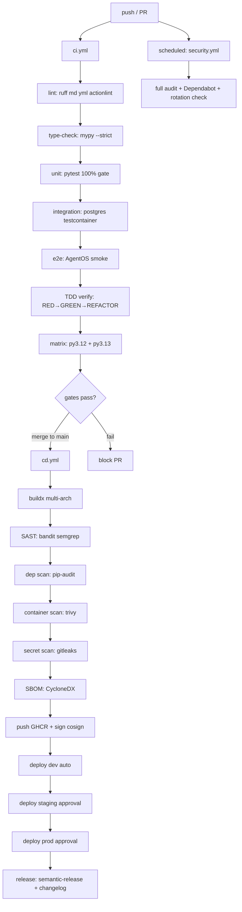

# SPEC_22_CICD_PIPELINE

> **Propósito**: Especificar el pipeline CI/CD completo de yaml-agno sobre GitHub Actions: lint, type-check, tests (unit/integration/e2e con TDD), build multi-arch, security scans (SAST/dependency/container/secret/SBOM), quality gates, deploy GitOps (Helm/Kustomize + ArgoCD) a dev→staging→prod, branch protection, matrix testing, y release automation. Integra la disciplina TDD (RED→GREEN→REFACTOR) como verificación de CI.

---

## 0. FRONTERA CON SPEC_20, SPEC_21, SPEC_23 Y SPEC_24

| Dimensión | SPEC_20 | SPEC_21 | SPEC_22 (este doc) | SPEC_23 | SPEC_24 |
|-----------|---------|---------|--------------------|---------|---------|
| **Alcance** | Docker Build (imagen OCI multi-stage) | Kubernetes Deployment (destino FUTURO) | Orquestación del pipeline que **produce** y **promueve** artefactos | Config & Secrets que el pipeline inyecta | Monitoring / Observability (stack externo) |
| **Compose/manifests** | Sí (Dockerfile, compose) | Sí (Helm/Kustomize) | Referencia (consume imagen de SPEC_20, deploya a Cloud Run + K8s) | No | No |
| **Dashboards/SLO** | No | No | No (CI emite métricas vía SPEC_24) | No | Sí |
| **Secrets** | No | No | Solo *consumo* (CI lee secretos via OIDC, no los define) | Definición completa | No |
| **Config env** | No | No | Inyecta env en deploy stage | Definición completa | No |

**Regla de oro**:
- "¿Cómo construyo la imagen Docker / Dockerfile / compose?" → **SPEC_20**.
- "¿Cómo defino un chart Helm o un manifiesto k8s?" → SPEC_21.
- "¿Cómo emito traces/métricas y defino dashboards/SLO/alertas?" → SPEC_24 (instrumentación interna: SPEC_09).
- "¿Cómo defino `ConfigManager`, `SecretManager`, feature flags?" → SPEC_23.
- "¿Cómo orquesto el flujo push→test→build→scan→deploy en GitHub Actions?" → **SPEC_22**.

SPEC_22 **consume** la imagen de SPEC_20, **deploya** a Cloud Run (primario, ref SPEC_20 §17) y a K8s (futuro, ref SPEC_21), **emite** telemetría a SPEC_24, e **inyecta** config/secrets de SPEC_23. No redefine ninguno.

**Referencia cruzada explícita**:
- Imagen OCI / Dockerfile / Cloud Run deploy: SPEC_20 (§17 Cloud Run).
- Helm charts / Kustomize / ArgoCD AppProject (K8s futuro): SPEC_21.
- Pipeline telemetry (OpenTelemetry exporter de jobs): SPEC_24 §2.6 (OTel Collector) / §2.7 (adapter).
- Inyección de `ConfigManager`/`SecretManager` en runtime images: SPEC_23.

---

## 1. VISIÓN GENERAL DEL PIPELINE

### 1.1 Diagrama Mermaid — Pipeline end-to-end



### 1.2 Workflows (resumen)

| Workflow | Trigger | Propósito |
|----------|---------|-----------|
| `ci.yml` | `push`, `pull_request` | Lint → type-check → test → TDD verify (matrix py 3.12/3.13) |
| `cd.yml` | `push` to `main` (merge), tags `v*` | Build image → scan (SAST/dep/container/secret/SBOM) → push GHCR → deploy dev/staging/prod |
| `security.yml` | `schedule` (cron diario) + `workflow_dispatch` | Audit completo: bandit, semgrep, pip-audit, trivy, gitleaks, SBOM |
| `release.yml` | `push` tags `v*`, `workflow_dispatch` | semantic-release, changelog, GitHub Release, GHCR tag estable |

### 1.3 Principios

1. **Shift-left security**: scans corren en PR, no solo en main.
2. **Zero-trust secrets**: CI usa OIDC federation, sin long-lived PATs.
3. **Fail-fast**: lint y type-check antes que tests (más baratos).
4. **TDD en CI**: existe un job que valida la traza RED→GREEN→REFACTOR.
5. **Artefactos firmados**: imágenes firmadas con cosign (keyless OIDC).
6. **GitOps**: deploy = commit a repo de manifiestos; ArgoCD reconcilia.
7. **Idempotencia**: cada job re-ejecutable sin efectos colaterales.

---

## 2. SUBSECCIONES DE WORKFLOWS

### 2.1 `.github/workflows/ci.yml`

```yaml
name: ci

on:
  push:
    branches: [main, develop]
  pull_request:
    branches: [main, develop]

concurrency:
  group: ci-${{ github.workflow }}-${{ github.ref }}
  cancel-in-progress: true

permissions:
  contents: read

env:
  PYTHON_VERSION_DEFAULT: "3.12"
  UV_VERSION: "0.5.11"

jobs:
  lint:
    name: Lint (ruff, markdown, yaml, actions)
    runs-on: ubuntu-24.04
    timeout-minutes: 10
    steps:
      - uses: actions/checkout@v4
        with:
          fetch-depth: 0
      - uses: actions/setup-python@v5
        with:
          python-version: ${{ env.PYTHON_VERSION_DEFAULT }}
      - name: Install ruff
        run: pipx install ruff==0.6.9
      - name: ruff check
        run: ruff check .
      - name: ruff format --check
        run: ruff format --check .
      - name: markdownlint
        uses: DavidAnson/markdownlint-cli2-action@v17
        with:
          globs: |
            **/*.md
            !CHANGELOG.md
      - name: yamllint
        run: |
          pip install yamllint==1.35.0
          yamllint -c .yamllint.yaml .
      - name: actionlint
        run: |
          bash <(curl https://raw.githubusercontent.com/rhysd/actionlint/main/scripts/download-actionlint.bash)
          ./actionlint -color

  type-check:
    name: Type-check (mypy --strict + Pydantic V2)
    runs-on: ubuntu-24.04
    needs: lint
    timeout-minutes: 15
    steps:
      - uses: actions/checkout@v4
      - uses: actions/setup-python@v5
        with:
          python-version: ${{ env.PYTHON_VERSION_DEFAULT }}
      - uses: actions/cache@v4
        with:
          path: ~/.cache/uv
          key: uv-mypy-${{ runner.os }}-${{ hashFiles('**/uv.lock') }}
      - name: Install uv
        run: pipx install uv==${{ env.UV_VERSION }}
      - name: Install deps (subset for mypy)
        run: |
          pip install "mypy==1.11.2"
          uv sync --frozen --no-dev
      - name: mypy --strict
        run: uv run mypy --strict yaml_agno
      - name: Pydantic V2 schema validation
        run: uv run python scripts/validate_pydantic_schemas.py

  test-unit:
    name: Unit tests (coverage gate)
    runs-on: ubuntu-24.04
    needs: type-check
    timeout-minutes: 20
    steps:
      - uses: actions/checkout@v4
      - uses: actions/setup-python@v5
        with:
          python-version: ${{ env.PYTHON_VERSION_DEFAULT }}
      - uses: actions/cache@v4
        with:
          path: ~/.cache/uv
          key: uv-test-${{ runner.os }}-${{ hashFiles('**/uv.lock') }}
      - name: Install uv
        run: pipx install uv==${{ env.UV_VERSION }}
      - run: uv sync --frozen
      - name: pytest unit
        run: |
          uv run pytest tests/unit -m "not integration and not e2e" \
            --cov=yaml_agno \
            --cov-branch \
            --cov-fail-under=100 \
            --cov-report=xml:coverage.xml \
            --cov-report=term-missing \
            --junitxml=junit.xml
      - name: Upload coverage
        if: always()
        uses: actions/upload-artifact@v4
        with:
          name: coverage-unit
          path: coverage.xml

  test-integration:
    name: Integration (postgres testcontainer)
    runs-on: ubuntu-24.04
    needs: test-unit
    timeout-minutes: 25
    services:
      postgres:
        image: postgres:16-alpine
        env:
          POSTGRES_USER: ya
          POSTGRES_PASSWORD: ya
          POSTGRES_DB: yaml_agno_test
        ports: ["5432:5432"]
        options: >-
          --health-cmd "pg_isready -U ya"
          --health-interval 5s
          --health-timeout 5s
          --health-retries 10
    steps:
      - uses: actions/checkout@v4
      - uses: actions/setup-python@v5
        with:
          python-version: ${{ env.PYTHON_VERSION_DEFAULT }}
      - name: Install uv
        run: pipx install uv==${{ env.UV_VERSION }}
      - run: uv sync --frozen
      - name: pytest integration
        env:
          DATABASE_URL: postgresql+asyncpg://ya:ya@localhost:5432/yaml_agno_test
        run: |
          uv run pytest tests/integration -m integration \
            --cov=yaml_agno --cov-branch --cov-fail-under=80 \
            --junitxml=junit-integration.xml

  test-e2e:
    name: E2E (AgentOS smoke)
    runs-on: ubuntu-24.04
    needs: test-integration
    timeout-minutes: 30
    steps:
      - uses: actions/checkout@v4
      - uses: actions/setup-python@v5
        with:
          python-version: ${{ env.PYTHON_VERSION_DEFAULT }}
      - name: Install uv
        run: pipx install uv==${{ env.UV_VERSION }}
      - run: uv sync --frozen
      - name: Spin AgentOS (compose)
        run: docker compose -f docker-compose.yml up -d --wait
      - name: pytest e2e smoke
        env:
          AGENTOS_URL: http://localhost:8000
        run: uv run pytest tests/e2e -m e2e --junitxml=junit-e2e.xml
      - if: always()
        run: docker compose -f docker-compose.yml down -v

  tdd-verify:
    name: TDD RED→GREEN→REFACTOR verification
    runs-on: ubuntu-24.04
    needs: test-unit
    timeout-minutes: 15
    steps:
      - uses: actions/checkout@v4
      - uses: actions/setup-python@v5
        with:
          python-version: ${{ env.PYTHON_VERSION_DEFAULT }}
      - name: Install uv
        run: pipx install uv==${{ env.UV_VERSION }}
      - run: uv sync --frozen
      - name: Verify TDD trace markers
        run: |
          uv run python scripts/tdd_verify.py \
            --repo . \
            --require-red-per-task \
            --require-commit-marker "TASK_" \
            --fail-on-missing-red
      - name: Assert commit history shows RED before GREEN
        run: |
          uv run python scripts/tdd_commit_lint.py \
            --base origin/main \
            --head HEAD \
            --require-red-green-pair

  matrix-test:
    name: Matrix (Python ${{ matrix.python }})
    needs: test-unit
    strategy:
      fail-fast: false
      matrix:
        python: ["3.12", "3.13"]
    runs-on: ubuntu-24.04
    timeout-minutes: 25
    steps:
      - uses: actions/checkout@v4
      - uses: actions/setup-python@v5
        with:
          python-version: ${{ matrix.python }}
      - name: Install uv
        run: pipx install uv==${{ env.UV_VERSION }}
      - run: uv sync --frozen
      - run: uv run pytest tests/unit -m "not integration and not e2e" -q
```

### 2.2 `.github/workflows/cd.yml`

```yaml
name: cd

on:
  push:
    branches: [main]
    tags: ["v*"]
  workflow_dispatch:
    inputs:
      environment:
        description: "Target environment"
        required: true
        type: choice
        default: dev
        options: [dev, staging, prod]

concurrency:
  group: cd-${{ github.ref }}
  cancel-in-progress: false   # nunca cancelar un deploy en curso

permissions:
  contents: read
  packages: write
  id-token: write             # OIDC para cosign keyless + GHCR
  attestations: write

env:
  REGISTRY: ghcr.io
  IMAGE_NAME: ${{ github.repository }}/yaml-agno

jobs:
  build:
    name: Build & push (multi-arch)
    runs-on: ubuntu-24.04
    timeout-minutes: 40
    outputs:
      digest: ${{ steps.meta.outputs.digest }}
      version: ${{ steps.meta.outputs.version }}
    steps:
      - uses: actions/checkout@v4
      - uses: docker/setup-qemu-action@v3
      - uses: docker/setup-buildx-action@v3
      - uses: docker/login-action@v3
        with:
          registry: ${{ env.REGISTRY }}
          username: ${{ github.actor }}
          password: ${{ secrets.GITHUB_TOKEN }}
      - id: meta
        uses: docker/metadata-action@v5
        with:
          images: ${{ env.REGISTRY }}/${{ env.IMAGE_NAME }}
          tags: |
            type=ref,event=branch
            type=semver,pattern={{version}}
            type=semver,pattern={{major}}.{{minor}}
            type=sha,format=long
      - name: Build & push
        id: build
        uses: docker/build-push-action@v6
        with:
          context: .
          file: Dockerfile
          platforms: linux/amd64,linux/arm64
          push: true
          tags: ${{ steps.meta.outputs.tags }}
          labels: ${{ steps.meta.outputs.labels }}
          cache-from: type=gha
          cache-to: type=gha,mode=max
          provenance: true
          sbom: true
      - name: Image size gate
        run: |
          SIZE_BYTES=$(docker manifest inspect ${{ env.REGISTRY }}/${{ env.IMAGE_NAME }}:sha-${GITHUB_SHA::7} \
            | python -c "import sys,json;d=json.load(sys.stdin);print(sum(l['size'] for m in d['manifests'] for l in m['layers']))")
          MB=$((SIZE_BYTES/1024/1024))
          echo "Image size: ${MB} MB"
          if [ "$MB" -gt 400 ]; then echo "::error::Image exceeds 400MB gate"; exit 1; fi

  sast:
    name: SAST (bandit, semgrep)
    runs-on: ubuntu-24.04
    needs: build
    timeout-minutes: 20
    permissions: { contents: read, security-events: write }
    steps:
      - uses: actions/checkout@v4
      - uses: actions/setup-python@v5
        with: { python-version: "3.12" }
      - name: Bandit
        run: |
          pip install bandit[toml]==1.7.10
          bandit -r yaml_agno -f sarif -o bandit.sarif -lll || true
      - name: Semgrep
        uses: returntocorp/semgrep-action@v1
        with:
          config: "p/python p/owasp-top-ten p/secrets"
          generateSarif: "1"
      - name: Upload SARIF
        uses: github/codeql-action/upload-sarif@v3
        with: { sarif_file: bandit.sarif }
      - name: Fail on HIGH/CRITICAL
        run: bandit -r yaml_agno -ll   # -ll = fail on HIGH+

  dependency-scan:
    name: Dependency scan (pip-audit)
    runs-on: ubuntu-24.04
    needs: build
    timeout-minutes: 15
    steps:
      - uses: actions/checkout@v4
      - uses: actions/setup-python@v5
        with: { python-version: "3.12" }
      - run: pip install pip-audit==2.7.3 uv==0.5.11
      - name: Export requirements
        run: uv export --format requirements-txt --output requirements.txt --no-hashes
      - name: pip-audit
        run: |
          pip-audit -r requirements.txt \
            --ignore-vuln GHSA-xxxx-placeholder \
            --format sarif -o pip-audit.sarif \
            --desc
      - name: Upload SARIF
        uses: github/codeql-action/upload-sarif@v3
        with: { sarif_file: pip-audit.sarif }

  container-scan:
    name: Container scan (trivy)
    runs-on: ubuntu-24.04
    needs: build
    timeout-minutes: 20
    permissions: { contents: read, security-events: write, packages: read }
    steps:
      - uses: actions/checkout@v4
      - uses: aquasecurity/trivy-action@master
        with:
          image-ref: ${{ env.REGISTRY }}/${{ env.IMAGE_NAME }}:sha-${{ github.sha }}
          format: sarif
          output: trivy.sarif
          severity: HIGH,CRITICAL
          exit-code: "1"
          ignore-unfixed: true
      - uses: github/codeql-action/upload-sarif@v3
        with: { sarif_file: trivy.sarif }

  secret-scan:
    name: Secret scan (gitleaks)
    runs-on: ubuntu-24.04
    needs: build
    timeout-minutes: 10
    permissions: { contents: read, security-events: write }
    steps:
      - uses: actions/checkout@v4
        with: { fetch-depth: 0 }
      - uses: gitleaks/gitleaks-action@v2
        env:
          GITHUB_TOKEN: ${{ secrets.GITHUB_TOKEN }}

  sbom:
    name: SBOM (CycloneDX)
    runs-on: ubuntu-24.04
    needs: build
    timeout-minutes: 15
    permissions: { contents: read, packages: read, attestations: write, id-token: write }
    steps:
      - uses: actions/checkout@v4
      - uses: actions/setup-python@v5
        with: { python-version: "3.12" }
      - run: pip install cyclonedx-bom==5.1.1 uv==0.5.11
      - name: Generate SBOM
        run: |
          uv export --format json --output sbom-input.json --no-hashes
          cyclonedx-py environment -o sbom.cdx.json --schema-version 1.5
      - name: Attest SBOM to image
        uses: actions/attest-sbom@v1
        with:
          subject-name: ${{ env.REGISTRY }}/${{ env.IMAGE_NAME }}
          subject-digest: ${{ needs.build.outputs.digest }}
          sbom-path: sbom.cdx.json
      - uses: actions/upload-artifact@v4
        with: { name: sbom, path: sbom.cdx.json }

  sign:
    name: Sign image (cosign keyless)
    runs-on: ubuntu-24.04
    needs: [build, sbom]
    timeout-minutes: 15
    permissions: { contents: read, packages: write, id-token: write }
    steps:
      - uses: sigstore/cosign-installer@v3
      - uses: docker/login-action@v3
        with:
          registry: ${{ env.REGISTRY }}
          username: ${{ github.actor }}
          password: ${{ secrets.GITHUB_TOKEN }}
      - name: cosign sign (keyless OIDC)
        env:
          COSIGN_EXPERIMENTAL: "1"
        run: |
          cosign sign --yes \
            ${{ env.REGISTRY }}/${{ env.IMAGE_NAME }}@${{ needs.build.outputs.digest }}

  deploy-dev:
    name: Deploy DEV (auto)
    needs: [sast, dependency-scan, container-scan, secret-scan, sbom, sign]
    runs-on: ubuntu-24.04
    environment:
      name: dev
      url: https://dev.yaml-agno.internal
    timeout-minutes: 15
    # @ai-directive: DEPLOY_TARGET controls the primary platform.
    #   cloud-run = PRIMARY (SPEC_00 §7.3); k8s = FUTURE (SPEC_21).
    #   Default: cloud-run. Each stage below runs the target's deploy script.
    env:
      DEPLOY_TARGET: ${{ vars.DEPLOY_TARGET || 'cloud-run' }}
    steps:
      - uses: actions/checkout@v4
      # --- PRIMARY: Google Cloud Run ---
      - name: Auth to GCP (OIDC, no long-lived key)
        if: env.DEPLOY_TARGET == 'cloud-run'
        id: auth
        uses: google-github-actions/auth@v2
        with:
          workload_identity_provider: ${{ secrets.GCP_WIF_PROVIDER }}
          service_account: ${{ secrets.GCP_DEPLOY_SA }}
      - name: Deploy to Cloud Run (dev)
        if: env.DEPLOY_TARGET == 'cloud-run'
        uses: google-github-actions/run-cloud-build@v2
        # or invoke scripts/cloud_run_deploy.sh (SPEC_20 §17.3) with env=dev
        env:
          YAML_AGNO_ENV: dev
        with:
          region: ${{ vars.GCP_REGION }}
          # delegates to scripts/cloud_run_deploy.sh (dev overlay, no-traffic -> 100%)
      # --- FUTURE: Kubernetes (Kustomize + ArgoCD) ---
      - name: Checkout gitops-manifests (K8s target)
        if: env.DEPLOY_TARGET == 'k8s'
        uses: actions/checkout@v4
        with: { repository: ${{ github.repository_owner }}/gitops-manifests, token: ${{ secrets.GITOPS_PAT }} }
      - name: Bump image tag in dev overlay (K8s)
        if: env.DEPLOY_TARGET == 'k8s'
        run: |
          pip install pyyaml==6.0.2
          python scripts/set_image_tag.py \
            --overlay overlays/dev \
            --image ${{ env.REGISTRY }}/${{ env.IMAGE_NAME }} \
            --digest ${{ needs.build.outputs.digest || github.sha }}
      - name: Commit + push (GitOps, K8s)
        if: env.DEPLOY_TARGET == 'k8s'
        run: |
          git config user.name "ci-bot"
          git config user.email "ci-bot@users.noreply.github.com"
          git commit -am "deploy(dev): yaml-agno@${{ github.sha }}"
          git push

  deploy-staging:
    name: Deploy STAGING (approval)
    needs: deploy-dev
    runs-on: ubuntu-24.04
    environment:
      name: staging
      url: https://staging.yaml-agno.internal
    timeout-minutes: 20
    env:
      DEPLOY_TARGET: ${{ vars.DEPLOY_TARGET || 'cloud-run' }}
    steps:
      - uses: actions/checkout@v4
      # --- PRIMARY: Google Cloud Run ---
      - name: Auth to GCP (OIDC)
        if: env.DEPLOY_TARGET == 'cloud-run'
        uses: google-github-actions/auth@v2
        with:
          workload_identity_provider: ${{ secrets.GCP_WIF_PROVIDER }}
          service_account: ${{ secrets.GCP_DEPLOY_SA }}
      - name: Deploy to Cloud Run (staging, canary 25%)
        if: env.DEPLOY_TARGET == 'cloud-run'
        env:
          YAML_AGNO_ENV: staging
        run: |
          scripts/cloud_run_deploy.sh   # SPEC_20 §17.3, traffic 25% on new tag
      # --- FUTURE: Kubernetes ---
      - name: Checkout gitops-manifests (K8s target)
        if: env.DEPLOY_TARGET == 'k8s'
        uses: actions/checkout@v4
        with: { repository: ${{ github.repository_owner }}/gitops-manifests, token: ${{ secrets.GITOPS_PAT }} }
      - if: env.DEPLOY_TARGET == 'k8s'
        run: |
          python scripts/set_image_tag.py --overlay overlays/staging \
            --image ${{ env.REGISTRY }}/${{ env.IMAGE_NAME }} --digest ${{ github.sha }}
          git config user.name "ci-bot" && git config user.email "ci-bot@users.noreply.github.com"
          git commit -am "deploy(staging): yaml-agno@${{ github.sha }}" && git push

  deploy-prod:
    name: Deploy PROD (approval + canary)
    needs: deploy-staging
    runs-on: ubuntu-24.04
    environment:
      name: prod
      url: https://yaml-agno.internal
    timeout-minutes: 30
    env:
      DEPLOY_TARGET: ${{ vars.DEPLOY_TARGET || 'cloud-run' }}
    steps:
      - uses: actions/checkout@v4
      # --- PRIMARY: Google Cloud Run ---
      - name: Auth to GCP (OIDC)
        if: env.DEPLOY_TARGET == 'cloud-run'
        uses: google-github-actions/auth@v2
        with:
          workload_identity_provider: ${{ secrets.GCP_WIF_PROVIDER }}
          service_account: ${{ secrets.GCP_DEPLOY_SA }}
      - name: Deploy to Cloud Run (prod canary 10%)
        if: env.DEPLOY_TARGET == 'cloud-run'
        env:
          YAML_AGNO_ENV: prod
        run: |
          scripts/cloud_run_deploy.sh --traffic 10   # SPEC_20 §17.3
      - name: Wait for canary SLO check (Cloud Run)
        if: env.DEPLOY_TARGET == 'cloud-run'
        run: uv run python scripts/canary_slo_check.py --window 10m --platform cloud-run
      - name: Promote Cloud Run to 100%
        if: env.DEPLOY_TARGET == 'cloud-run'
        run: scripts/cloud_run_promote.sh --traffic 100
      # --- FUTURE: Kubernetes ---
      - name: Checkout gitops-manifests (K8s target)
        if: env.DEPLOY_TARGET == 'k8s'
        uses: actions/checkout@v4
        with: { repository: ${{ github.repository_owner }}/gitops-manifests, token: ${{ secrets.GITOPS_PAT }} }
      - name: Promote to prod K8s (canary 10%)
        if: env.DEPLOY_TARGET == 'k8s'
        run: |
          python scripts/set_image_tag.py --overlay overlays/prod \
            --image ${{ env.REGISTRY }}/${{ env.IMAGE_NAME }} --digest ${{ github.sha }} \
            --strategy canary --weight 10
          git config user.name "ci-bot" && git config user.email "ci-bot@users.noreply.github.com"
          git commit -am "deploy(prod/canary): yaml-agno@${{ github.sha }}" && git push
      - name: Wait for canary SLO check (K8s)
        if: env.DEPLOY_TARGET == 'k8s'
        run: uv run python scripts/canary_slo_check.py --window 10m
      - name: Promote K8s to 100%
        if: env.DEPLOY_TARGET == 'k8s'
        run: |
          python scripts/set_image_tag.py --overlay overlays/prod \
            --image ${{ env.REGISTRY }}/${{ env.IMAGE_NAME }} --digest ${{ github.sha }} \
            --strategy rolling --weight 100
          git commit -am "deploy(prod/full): yaml-agno@${{ github.sha }}" && git push
```

### 2.3 `.github/workflows/security.yml`

```yaml
name: security

on:
  schedule:
    - cron: "17 4 * * *"     # diario 04:17 UTC
  workflow_dispatch:

permissions:
  contents: read
  security-events: write

jobs:
  full-audit:
    runs-on: ubuntu-24.04
    timeout-minutes: 45
    steps:
      - uses: actions/checkout@v4
      - uses: actions/setup-python@v5
        with: { python-version: "3.12" }
      - run: pip install bandit[toml]==1.7.10 pip-audit==2.7.3 cyclonedx-bom==5.1.1 uv==0.5.11
      - name: Bandit full
        run: bandit -r yaml_agno -f sarif -o bandit.sarif -ii
      - name: Semgrep full
        uses: returntocorp/semgrep-action@v1
        with: { config: "p/default p/ci p/dockerfile p/kubernetes" }
      - name: pip-audit full
        run: uv export --format requirements-txt --output req.txt --no-hashes && pip-audit -r req.txt --desc
      - name: Trivy fs + repo
        uses: aquasecurity/trivy-action@master
        with:
          scan-type: fs
          scan-ref: .
          severity: HIGH,CRITICAL
          format: sarif
          output: trivy-fs.sarif
      - name: gitleaks full history
        uses: gitleaks/gitleaks-action@v2
        env: { GITHUB_TOKEN: ${{ secrets.GITHUB_TOKEN }} }
      - name: SBOM drift vs last release
        run: scripts/sbom_diff.sh
      - name: Upload all SARIF
        uses: github/codeql-action/upload-sarif@v3
        with: { sarif_file: bandit.sarif }

  rotation-check:
    name: Secret rotation compliance (SPEC_23 §8)
    runs-on: ubuntu-24.04
    needs: full-audit
    steps:
      - uses: actions/checkout@v4
      - run: pipx install uv==0.5.11 && uv sync --frozen
      - run: uv run python scripts/rotation_compliance.py --alert-days 7
```

### 2.4 `.github/workflows/release.yml`

```yaml
name: release

on:
  push:
    tags: ["v*"]
  workflow_dispatch:

permissions:
  contents: write
  packages: write

jobs:
  semantic-release:
    runs-on: ubuntu-24.04
    steps:
      - uses: actions/checkout@v4
        with: { fetch-depth: 0 }
      - uses: actions/setup-python@v5
        with: { python-version: "3.12" }
      - uses: python-semantic-release/python-semantic-release@v9
        with:
          github_token: ${{ secrets.GITHUB_TOKEN }}
      - name: Publish GitHub Release
        uses: python-semantic-release/upload-to-gh-release@main
        with:
          github_token: ${{ secrets.GITHUB_TOKEN }}
          asset_paths: '["CHANGELOG.md"]'
```

---

## 3. BEHAVIOR DELTA BDD (Gherkin)

```gherkin
Feature: CI/CD Pipeline gates
  As a maintainer of yaml-agno
  I want deterministic gates in CI/CD
  So that broken code, vulnerabilities, and bad deploys never reach prod.

  # --- PR CHECK PASS ---
  Scenario: PR check passes on green code
    Given a pull request against main with valid Python 3.12 code
    When the "ci" workflow runs
    Then lint, type-check, unit (100% cov), integration and e2e all pass
    And the TDD RED→GREEN verification reports "no RED-less tasks"
    And the PR becomes "mergeable"

  Scenario: PR check fails when coverage < 100%
    Given a PR that adds a function "f" without unit tests
    When the "test-unit" job computes coverage
    Then the job fails with "--cov-fail-under=100"
    And the PR is blocked

  # --- TDD ENFORCEMENT ---
  Scenario: CI rejects a task commit without a preceding RED commit
    Given a TASK_045 commit "GREEN: implement X" with no prior "RED:" commit
    When the "tdd-verify" job runs tdd_commit_lint
    Then the job fails listing "TASK_045: missing RED commit"
    And the PR is blocked

  # --- SECURITY VULN BLOCK ---
  Scenario: HIGH vulnerability blocks the deploy
    Given the "cd" workflow built image sha-abc123
    And Trivy finds CVE-2026-9999 (HIGH) in the image
    When the "container-scan" job runs
    Then the job exits with code 1
    And the "deploy-dev" job is skipped
    And the image is NOT promoted to staging or prod

  Scenario: secret leak in commit blocks the PR
    Given a PR commit containing a hardcoded "sk-..." key
    When the "secret-scan" job runs gitleaks
    Then gitleaks reports a finding on the commit
    And the PR is blocked

  # --- IMAGE SIZE GATE ---
  Scenario: oversized image fails build
    Given a Dockerfile change that bloats the image to 480 MB
    When the "build" job runs the size gate
    Then the job fails with "Image exceeds 400MB gate"

  # --- DEPLOY ROLLBACK (GitOps) ---
  Scenario: deploy rollback by reverting the manifest commit
    Given prod is running yaml-agno@sha-abc123
    When an operator runs "git revert <prod commit>" in gitops-manifests
    Then ArgoCD detects the out-of-sync state
    And ArgoCD redeploys the previous digest sha-abc122
    And the prod rollout completes within 5 minutes

  Scenario: canary fails SLO and auto-halts full rollout
    Given prod canary at 10% has error-rate > 1% over 10m
    When the "canary_slo_check.py" runs in deploy-prod
    Then the check exits non-zero
    And the "Promote to 100%" step is skipped
    And prod remains on the previous stable digest

  # --- RELEASE PUBLISHED ---
  Scenario: tag push publishes a release
    Given the main branch is green and HEAD is "feat: add flag manager"
    When a maintainer pushes tag "v0.2.0"
    Then semantic-release computes the next version
    And CHANGELOG.md is updated
    And a GitHub Release "v0.2.0" is published
    And the GHCR image is tagged "v0.2.0" and "0.2"

  # --- CONCURRENCY ---
  Scenario: superseded CI runs are cancelled
    Given two pushes to the same PR in quick succession
    When the second push triggers "ci"
    Then the first run is cancelled by concurrency control
    And only the latest run completes

  # --- CACHING ---
  Scenario: uv cache speeds up type-check on rerun
    Given the "type-check" job ran once and cached ~/.cache/uv
    When the job runs again with an unchanged uv.lock
    Then the uv restore is a cache HIT
    And the job duration drops by at least 40%
```

---

## 4. TDD MICRO-TASKS

> Convención: cada TASK tiene `File`, `Test` (RED), `Green`, `Commit`. El job `tdd-verify` exige un commit `RED:` anterior al `GREEN:`.

```text
TASK_221 | File: scripts/tdd_verify.py
  Test: tests/unit/ci/test_tdd_verify.py::test_flags_task_without_red_commit
  RED:    run pytest → AssertionError "TASK_222 has no RED commit"
  Green:  implement RED detection over `git log --grep='^RED:'`
  Commit: "RED/GREEN: tdd_verify detects RED-less tasks (SPEC_22 §2.1)"

TASK_222 | File: scripts/tdd_commit_lint.py
  Test: .../test_tdd_commit_lint.py::test_requires_red_green_pair_per_task
  RED:    exit 1 when a TASK_XXX GREEN commit lacks matching RED
  Green:  pair detection via task id extraction from commit subject
  Commit: "RED/GREEN: tdd_commit_lint enforces RED→GREEN pairing"

TASK_223 | File: scripts/validate_pydantic_schemas.py
  Test: .../test_validate_pydantic_schemas.py::test_exits_nonzero_on_invalid_schema
  RED:    invalid model with wrong types → script exit 1
  Green:  load all yaml_agno BaseSettings subclasses, call model_validate on samples
  Commit: "RED/GREEN: pydantic schema validator gate"

TASK_224 | File: scripts/set_image_tag.py
  Test: .../test_set_image_tag.py::test_updates_kustomize_overlay_digest
  RED:    overlay kustomization image digest unchanged after run
  Green:  parse overlays/<env>/kustomization.yaml, rewrite newTag with digest
  Commit: "RED/GREEN: GitOps image tag bumper for overlays"

TASK_225 | File: scripts/canary_slo_check.py
  Test: .../test_canary_slo_check.py::test_fails_when_error_rate_exceeds_threshold
  RED:    2% error-rate → exit 1
  Green:  query Prometheus (SPEC_24) for canary vs baseline error-rate over window
  Commit: "RED/GREEN: canary SLO gate before full rollout"

TASK_226 | File: scripts/sbom_diff.sh
  Test: .../test_sbom_diff.py::test_reports_added_critical_packages
  RED:    new CVE-bearing package undetected
  Green:  diff CycloneDX JSON vs baseline, list added packages
  Commit: "RED/GREEN: SBOM drift reporter"

TASK_227 | File: scripts/rotation_compliance.py
  Test: .../test_rotation_compliance.py::test_flags_secrets_near_expiry
  RED:    secret expiring in 5d not flagged
  Green:  query secret_audit (SPEC_23 §9), flag secrets with rotated_at + ttl within window
  Commit: "RED/GREEN: secret rotation compliance checker"

TASK_228 | File: .github/workflows/ci.yml (coverage gate wiring)
  Test: .../test_ci_yaml.py::test_ci_has_cov_fail_under_100
  RED:    workflow missing --cov-fail-under
  Green:  assert YAML job step contains the flag (parse with PyYAML)
  Commit: "RED/GREEN: wire 100% coverage gate into ci.yml"

TASK_229 | File: .github/workflows/cd.yml (security gate wiring)
  Test: .../test_cd_yaml.py::test_deploy_depends_on_all_scans
  RED:    deploy-dev missing dependency on secret-scan
  Green:  assert needs: contains sast, dependency-scan, container-scan, secret-scan, sbom, sign
  Commit: "RED/GREEN: cd deploy gates depend on all security scans"

TASK_2210 | File: .github/workflows/security.yml (scheduled + rotation)
  Test: .../test_security_yaml.py::test_has_daily_cron_and_rotation_check
  RED:    missing cron or rotation-check job
  Green:  assert schedule cron + rotation-check job present
  Commit: "RED/GREEN: scheduled full security audit + rotation compliance"

TASK_2211 | File: scripts/image_size_gate (inside cd.yml)
  Test: .../test_image_size_gate.py::test_rejects_image_over_400mb
  RED:    480MB image not rejected
  Green:  manifest size sum > 400MB → exit 1
  Commit: "RED/GREEN: image size quality gate"

TASK_2212 | File: docker-compose.yml + e2e smoke
  Test: tests/e2e/test_agentos_smoke.py::test_health_endpoint_200
  RED:    AgentOS health returns non-200
  Green:  compose up --wait + GET /healthz → assert 200
  Commit: "RED/GREEN: e2e AgentOS smoke test"
```

---

## 5. SUPUESTOS TÉCNICOS

1. **GitHub Enterprise/Team** con: Environments, OIDC federation, GHCR, Dependabot, SARIF upload (Advanced Security o CodeQL gratis para públicos).
2. **Runner**: `ubuntu-24.04` managed; self-hosted ARM opcional para acelerar multi-arch (sustituye QEMU).
3. **OIDC sin PATs de larga vida**: el deploy a gitops-manifests usa `secrets.GITOPS_PAT` a corto plazo; idealmente migrar a `id-token: write` + GitHub App con token efímero (deuda técnica explícita).
4. **ArgoCD** ya desplegado en el cluster (definido en SPEC_21); este SPEC solo hace commits al repo de manifiestos.
5. **Canary** requiere Argo Rollouts (referenciado en SPEC_21); si no está disponible, fallback a rolling.
6. **Coverage 100%**: gate estricto. Exclusions via `# pragma: no cover` solo en bloques imposibles (`if TYPE_CHECKING`, `sys.exit` post-test).
7. **Semgrep + Bandit** complementarios: Bandit para Python AST; Semgrep para reglas cross-language y secretos.
8. **SBOM CycloneDX 1.5** mínimo; consumo por Dependabot y por `sbom_diff`.
9. **Matrix Python 3.12/3.13**: 3.13 como early-warning; no bloquear PR si solo falla en 3.13 (`continue-on-error` en matrix secundario, a discreción del equipo).
10. **Secretos en CI** (no confundir con SPEC_23 runtime secrets): `GITOPS_PAT`, tokens de registry. Almacenados en GitHub Secrets, rotados trimestralmente.
11. **Costo/Performance**: cache pip (`actions/cache`), cache Docker layer (`type=gha`), cancelación concurrente — reducen ~50% tiempo de pipeline.
12. **Multi-arch** (amd64 + arm64) por compatibilidad con nodos ARM (Graviton/Ampere) en k8s.
13. **TDD enforcement** es advisory + bloqueante: bloquea PR si hay TASK sin RED. Excepciones documentadas en `docs/tdd-exceptions.md`.

### 5.1 Branch Protection Rules (config manual en GitHub)

```
Branch: main
  Required reviews: 2 (incl. 1 codeowner)
  Dismiss stale approvals on new push: yes
  Require status checks:
    - "Lint (ruff, markdown, yaml, actions)"
    - "Type-check (mypy --strict + Pydantic V2)"
    - "Unit tests (coverage gate)"
    - "TDD RED→GREEN verification"
    - "container scan (trivy)"   # branch-protection antes del merge
  Require branches up-to-date before merge: yes
  Require signed commits: yes
  Require linear history: yes
  Require conversation resolution: yes
  Restrict pushes that create large files (>10MB): yes

Branch: develop
  Required reviews: 1
  Required status checks: lint, type-check, unit
```

### 5.2 Environments & Manual Gates

| Environment | Required reviewers | Wait timer | Deployment branch | URL |
|-------------|--------------------|------------|-------------------|-----|
| `dev` | ninguno (auto) | 0 | main | dev.yaml-agno.internal |
| `staging` | 1 (SRE) | 0 | main | staging.yaml-agno.internal |
| `prod` | 2 (1 SRE + 1 Eng Lead) | 5 min | tags `v*` | yaml-agno.internal |

### 5.3 Dependabot `.github/dependabot.yml`

```yaml
version: 2
updates:
  - package-ecosystem: pip
    directory: "/"
    schedule: { interval: weekly, day: monday }
    open-pull-requests-limit: 10
  - package-ecosystem: docker
    directory: "/"
    schedule: { interval: weekly }
  - package-ecosystem: github-actions
    directory: "/"
    schedule: { interval: weekly }
  - package-ecosystem: helm
    directory: "/deploy/helm"
    schedule: { interval: monthly }
```

---

## 6. PREGUNTAS DE CALIBRACIÓN

1. ¿`GITOPS_PAT` se sustituye por GitHub App OIDC en este MVP, o se documenta como deuda y se usa PAT corto rotado trimestralmente?
2. ¿La cobertura 100% aplica a `tests/integration` y `tests/e2e`, o solo a `tests/unit`? (Propuesta: 100% unit, 80% integration, smoke e2e sin gate.)
3. ¿Canary obligatorio en prod, o rolling simple para el MVP y canary como fast-follow?
4. ¿Matrix Python 3.13 bloquea el PR o es advisory (`continue-on-error`)?
5. ¿El job `tdd-verify` corre en PR o solo en main? (Propuesta: PR, para atrapar a tiempo.)
6. ¿Release automatizado por `semantic-release` desde commits convencionales, o releases manuales con tag? (Propuesta: automatizado.)
7. ¿SBOM se publica como artifact + attestation, o también se envía a un backend (Dependency-Track/Anchore)?
8. ¿Trivy `exit-code: 1` bloquea siempre, o se permite un baseline `trivyignore` revisado mensualmente?
9. ¿Branch protection exige `signed commits` GPG/Sigstore desde el día 1, o fast-follow?
10. ¿`security.yml` corre también `on push` a main además de cron, o solo cron + manual?

---

> **Cierre**: SPEC_22 transforma cada push en un veredicto binario (verde/bloqueado) con trazabilidad completa: lint, types, tests TDD, scans, SBOM firmado y deploy GitOps reversible. Cero PATs de larga vida, cero secretos hardcoded, cero imágenes no firmadas.
