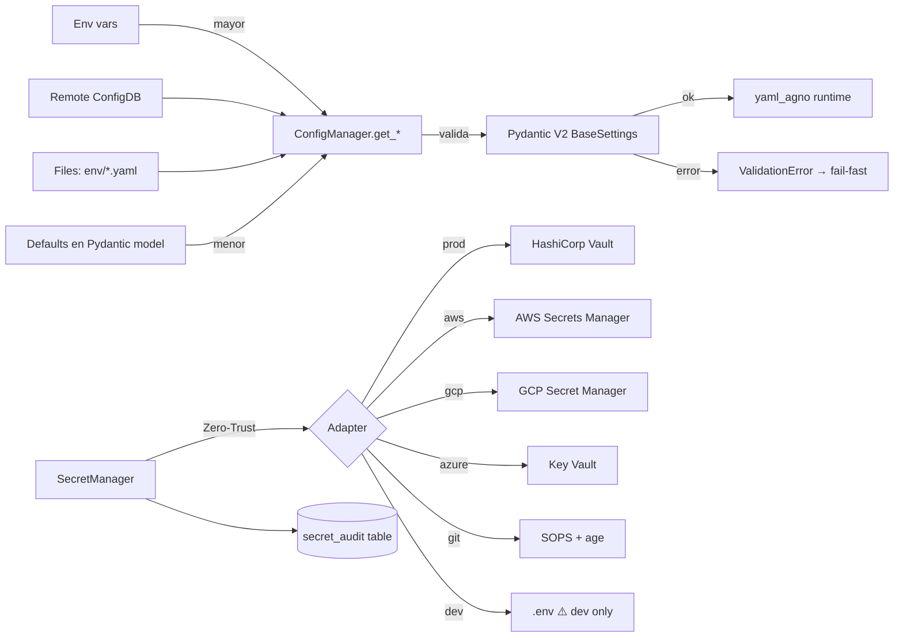

# SPEC_23_CONFIG_AND_SECRETS

> **Propósito**: Especificar la capa de Configuración y Secretos de yaml-agno como Infra Core: `ConfigManager` (Port), `SecretManager` (Port Zero-Trust con adapters Vault/AWS/GCP/Azure/SOPS/dotenv), `FlagManager` (feature flags), hot-reload (watchdog/polling/pubsub), multi-tenant config con ConfigDB, rotación con TTL y auditoría de accesos. Todo validado con Pydantic V2.

---

## 0. FRONTERA CON SPEC_03 Y SPEC_00

| Dimensión | SPEC_00 | SPEC_03 | SPEC_23 (este doc) |
|-----------|---------|---------|--------------------|
| **Alcance** | Estrategia, capas, convenciones | Persistencia (Postgres, sesiones, memoria, knowledge) | Config + Secrets + Flags como **Infra Core Ports** |
| **PostgreSQL** | No | Sí (DDL completo) | Sí, pero **solo** tablas `config_items`, `feature_flags`, `secret_audit` |
| **Multi-tenant** | Menciona | `tenant_id` en tablas de dominio | Override jerárquico: default ← tenant |
| **Secretos** | No | No | Definición completa (Zero-Trust) |
| **Pydantic V2** | Menciona | DTOs de dominio | Schemas estrictos de Settings/Config |

**Regla de oro**:
- "¿Cómo modelé sessions/memory/knowledge en Postgres?" → SPEC_03.
- "¿Cuál es la arquitectura por capas?" → SPEC_00.
- "¿Cómo leo una config, un secreto, o un flag, con qué precedencia y rotación?" → **SPEC_23**.

SPEC_23 **usa** el pool de Postgres de SPEC_03 para `ConfigDB` (3 tablas dedicadas), pero no duplica el modelo de dominio.

**Referencia cruzada explícita**:
- Pool async / `DATABASE_URL`: SPEC_03 §1.
- `tenant_id` en DTOs: SPEC_03 §2.
- Inyección de Config/Secret en runtime images: desplegado por SPEC_22, consumido por SPEC_23.
- Telemetría de accesos a secretos: exportada a SPEC_21 (audit events como traces).

---

## 1. VISIÓN GENERAL

### 1.1 Diagrama Mermaid — Precedencia de Config



### 1.2 Principios

1. **Config vs Secret**: config no es sensible (URLs, timeouts, feature toggles booleans); secret lo es (API keys, passwords, certificados). Nunca se mezclan.
2. **Zero-Trust Secrets**: nunca en env vars del proceso, nunca logueados, nunca listados en masa; acceso por nombre y registro audit.
3. **Precedencia explícita y predecible**: Env > Remote(ConfigDB) > Files > Defaults.
4. **Fail-fast**: config inválida = proceso no arranca (`ValidationError`).
5. **Hot-reload seguro**: cambios en runtime sin reinicio, con validación Pydantic previa a la aplicación.
6. **Multi-tenant por override**: cada tenant hereda defaults y sobreescribe selectivamente.
7. **Rotación con TTL**: secrets con expiración; alerta antes de vencer; nunca hardcodeados.
8. **Auditoría inmutable**: cada acceso a secreto registra quién/cuándo/qué/resultado.

---

## 2. SUBSECCIONES

### 2.1 Environment Configs (estructura YAML jerárquica)

```
config/
  defaults.yaml          # defaults compartidos (menor precedencia)
  environments/
    dev.yaml
    test.yaml
    staging.yaml
    prod.yaml
  tenants/
    tenant_acme.yaml     # overrides por tenant
    tenant_globex.yaml
```

`config/environments/prod.yaml`:
```yaml
app:
  name: yaml-agno
  env: prod
runtime:
  max_concurrent_agents: 50
  request_timeout_s: 30
persistence:
  pool_size: 20
  pool_max_overflow: 10
  statement_timeout_ms: 5000
observability:
  otlp_endpoint: http://otel-collector:4317
  sample_rate: 0.1
security:
  auth_mode: jwt
  token_ttl_minutes: 15
flags:
  enable_experimental_rag: false
```

### 2.2 Pydantic V2 Settings Schema (validación estricta)

```python
# yaml_agno/infra/config/schemas.py
from pydantic import BaseModel, Field, HttpUrl, SecretStr, field_validator
from pydantic_settings import BaseSettings, SettingsConfigDict

class AppConfig(BaseModel):
    name: str = Field(min_length=1, max_length=64)
    env: str = Field(pattern="^(dev|test|staging|prod)$")

class RuntimeConfig(BaseModel):
    max_concurrent_agents: int = Field(ge=1, le=500)
    request_timeout_s: int = Field(ge=1, le=600)

class PersistenceConfig(BaseModel):
    pool_size: int = Field(ge=1, le=100)
    pool_max_overflow: int = Field(ge=0, le=100)
    statement_timeout_ms: int = Field(ge=100, le=60000)

class ObservabilityConfig(BaseModel):
    otlp_endpoint: HttpUrl
    sample_rate: float = Field(ge=0.0, le=1.0)

class SecurityConfig(BaseModel):
    auth_mode: str = Field(pattern="^(basic|jwt)$")
    token_ttl_minutes: int = Field(ge=1, le=1440)

class FlagDefaults(BaseModel):
    enable_experimental_rag: bool = False

class YamlAgnoSettings(BaseSettings):
    model_config = SettingsConfigDict(
        env_prefix="YA_",
        env_nested_delimiter="__",
        case_sensitive=False,
        extra="forbid",            # fail-fast: clave desconocida → error
    )
    app: AppConfig
    runtime: RuntimeConfig
    persistence: PersistenceConfig
    observability: ObservabilityConfig
    security: SecurityConfig
    flags: FlagDefaults

    @field_validator("security")
    @classmethod
    def _jwt_required_in_prod(cls, v: SecurityConfig, info):
        env = info.data.get("app")
        if env and env.env == "prod" and v.auth_mode == "basic":
            raise ValueError("auth_mode=basic forbidden in prod")
        return v
```

### 2.3 ConfigManager (Port Protocol)

```python
# yaml_agno/infra/config/manager.py
from typing import Protocol, Any, runtime_checkable, AsyncIterator

@runtime_checkable
class ConfigPort(Protocol):
    async def get_env(self) -> str: ...
    async def get_string(self, key: str, default: str | None = None) -> str: ...
    async def get_number(self, key: str, default: float | None = None) -> float: ...
    async def get_boolean(self, key: str, default: bool | None = None) -> bool: ...
    async def get_json(self, key: str, default: Any = None) -> Any: ...
    async def get_section(self, section: str) -> dict[str, Any]: ...
    async def reload(self) -> None: ...
    def on_change(self, key: str, callback) -> None: ...

class ConfigManager(ConfigPort):
    """
    Precedence: Env vars > Remote(ConfigDB) > Files > Defaults.
    Valida con YamlAgnoSettings (Pydantic V2). Hot-reload vía watchers.
    """
    def __init__(self, env: str, tenant_id: str | None, *,
                 files: list[Path], configdb: "ConfigDB | None",
                 hot: "HotReloader | None"):
        self._layers = [
            EnvLayer(),                   # mayor precedencia
            RemoteLayer(configdb, tenant_id) if configdb else None,
            FileLayer(files),
            DefaultsLayer(),              # menor
        ]
        self._hot = hot
        self._cache: dict[str, Any] = {}
        self._listeners: dict[str, list] = {}
        ...

    async def reload(self) -> None:
        new = await self._materialize()
        validated = YamlAgnoSettings.model_validate(new)   # Pydantic V2
        diff = self._diff(self._cache, validated.model_dump())
        self._cache = validated.model_dump()
        for key, cb in self._listeners.items():
            if key in diff: await cb(diff[key])
        if self._hot: await self._hot.notify(diff)
```

### 2.4 SecretManager (Zero-Trust Port)

```python
# yaml_agno/infra/secrets/manager.py
from typing import Protocol, runtime_checkable
from datetime import datetime

@runtime_checkable
class SecretPort(Protocol):
    async def get_secret(self, name: str) -> str: ...
    async def get_secret_json(self, name: str) -> dict: ...
    async def list_names(self) -> list[str]: ...   # solo nombres, NUNCA valores

class SecretManager(SecretPort):
    """
    Zero-Trust: NUNCA persiste secrets en env vars del proceso.
    NUNCA expone listado con valores. Cachea en memoria solo por TTL corto.
    Cada acceso se audita.
    """
    def __init__(self, adapter: "SecretAdapter", *,
                 audit: "SecretAudit", ttl_s: int = 30):
        self._adapter = adapter
        self._audit = audit
        self._ttl_s = ttl_s
        self._cache: dict[str, tuple[str, float]] = {}

    async def get_secret(self, name: str) -> str:
        cached, exp = self._cache.get(name, (None, 0.0))
        if cached is not None and time.time() < exp:
            await self._audit.record(name, hit="cache")
            return cached
        value = await self._adapter.fetch(name)
        if value is None:
            await self._audit.record(name, hit="miss", ok=False)
            raise SecretNotFoundError(name)
        self._cache[name] = (value, time.time() + self._ttl_s)
        await self._audit.record(name, hit="remote", ok=True)
        return value

    async def get_secret_json(self, name: str) -> dict:
        raw = await self.get_secret(name)
        return json.loads(raw)   # ej: {"username":..,"password":..}
```

**Anti-patrones prohibidos** (checked por SAST Bandit/Semgrep, SPEC_22 §2.2):
```python
# ❌ PROHIBIDO
os.environ["DB_PASSWORD"] = secret.get_secret("db/password")   # persistir en env
logging.info("using key %s", key)                               # loguear valor
[name: secret.get_secret(n) for n in secret.list_names()]       # dumpear todos
```

### 2.5 Secret Adapters

```python
# yaml_agno/infra/secrets/adapters.py
class SecretAdapter(Protocol):
    async def fetch(self, name: str) -> str | None: ...

class VaultAdapter(SecretAdapter):       # HashiCorp Vault (KV v2)
    def __init__(self, addr: str, role_id: str, secret_id_ref: str): ...
    async def fetch(self, name: str) -> str | None:
        # mount=path/secret, auth AppRole, lease renewal
        ...

class AWSSecretsAdapter(SecretAdapter):  # AWS Secrets Manager
    ...
class GCPSecretAdapter(SecretAdapter):   # GCP Secret Manager
    ...
class AzureKVAdapter(SecretAdapter):     # Azure Key Vault
    ...
class SOPSAdapter(SecretAdapter):        # SOPS + age (git, cifrado en reposo)
    ...
class DotenvAdapter(SecretAdapter):      # ⚠️ DEV ONLY, assert env != prod
    def __init__(self, path: Path, env: str):
        assert env != "prod", "dotenv forbidden in prod"
        ...
```

### 2.6 FlagManager (Feature Flags)

```python
# yaml_agno/infra/flags/manager.py
@runtime_checkable
class FlagPort(Protocol):
    async def is_enabled(self, flag: str, *, tenant_id: str | None = None,
                         user_id: str | None = None) -> bool: ...
    async def get_variant(self, flag: str, *, tenant_id: str | None = None,
                          user_id: str | None = None) -> str: ...
    async def reload(self) -> None: ...

class FlagManager(FlagPort):
    """
    Adapters: LaunchDarkly | Unleash | Custom(Postgres).
    Soporta gradual rollout (porcentaje), A/B (variantes), targeting por tenant/user.
    Hot-reload de flags sin reinicio.
    """
    def __init__(self, adapter: "FlagAdapter"): self._a = adapter
    async def is_enabled(self, flag, *, tenant_id=None, user_id=None) -> bool:
        return await self._a.evaluate(flag, enabled=True,
                                      tenant_id=tenant_id, user_id=user_id)
```

Evaluación determinista de rollout (hash consistente):
```python
def _in_rollout(self, flag: str, user_id: str, percent: int) -> bool:
    h = int(sha256(f"{flag}:{user_id}".encode()).hexdigest()[:8], 16) % 100
    return h < percent
```

### 2.7 Hot-Reload Mechanism

```python
# yaml_agno/infra/config/hotreload.py
class HotReloader:
    """Estrategias: file watch (watchdog) | polling ConfigDB | pub/sub."""
    async def start(self): ...
    async def stop(self): ...
    async def notify(self, diff: dict): ...

class FileWatchStrategy(HotReloader):   # watchdog
    def __init__(self, paths: list[Path], cb): ...
class PollingStrategy(HotReloader):     # ConfigDB cada N segundos
    def __init__(self, configdb, interval_s: int): ...
class PubSubStrategy(HotReloader):      # LISTEN/NOTIFY Postgres / Redis
    def __init__(self, channel: str): ...
```

### 2.8 Multi-tenant Config (override)

Merge strategy `default ← tenant`:
```python
def _merge_tenant(default: dict, tenant: dict | None) -> dict:
    if not tenant: return default
    return _deep_merge(default, tenant)   # tenant gana en conflicto

def _deep_merge(base: dict, override: dict) -> dict:
    out = dict(base)
    for k, v in override.items():
        if isinstance(v, dict) and isinstance(out.get(k), dict):
            out[k] = _deep_merge(out[k], v)
        else:
            out[k] = v
    return out
```

### 2.9 Rotation & Audit

> @ai-directive **Rotación y retención de secrets son capabilities del Core de yaml-agno (`SecretManager` + `secret_audit`), NO nativas de Agno.** Agno no provee TTL de secretos, auditoría de accesos ni retención de logs de secretos; este SPEC los añade. Esta distinción es relevante para el alcance: cualquier feature de TTL/retención/rotation es mantenida por el equipo yaml-agno y referencia este SPEC, no a la librería Agno.

Rotación: cada secreto tiene `ttl_days`; `rotation_compliance.py` (SPEC_22 §4 TASK_227) alerta cuando `rotated_at + ttl - alert_days <= now`.

Auditoría (tabla `secret_audit`): insert inmutable, append-only, retention 365d.

---

## 3. BEHAVIOR DELTA BDD (Gherkin)

```gherkin
Feature: Config & Secrets management
  As the yaml-agno runtime
  I want deterministic config precedence, zero-trust secrets, hot-reload and flags
  So that runtime behavior is correct, auditable, and rotatable.

  # --- CONFIG PRECEDENCE ---
  Scenario: env var overrides remote, file and default
    Given default "runtime.request_timeout_s" = 30
    And file prod.yaml sets it to 20
    And ConfigDB sets it to 15
    And env var YA_RUNTIME__REQUEST_TIMEOUT_S = 5
    When ConfigManager.get_number("runtime.request_timeout_s") is called
    Then it returns 5

  Scenario: invalid config value fails fast at startup
    Given prod.yaml sets "runtime.max_concurrent_agents" = 0
    When the runtime boots
    Then YamlAgnoSettings.model_validate raises ValidationError
    And the process exits with code 1

  Scenario: basic auth forbidden in prod
    Given env=prod and security.auth_mode=basic
    When YamlAgnoSettings validates
    Then validation raises "auth_mode=basic forbidden in prod"

  # --- HOT-RELOAD ---
  Scenario: file change triggers reload and notifies listener
    Given ConfigManager loaded prod.yaml with request_timeout_s=30
    And a listener registered on "runtime.request_timeout_s"
    When prod.yaml is edited to request_timeout_s=45 on disk
    And the FileWatchStrategy detects the change
    Then reload() validates the new value with Pydantic
    And the listener callback receives {old:30, new:45}
    And the runtime uses 45 for new requests without restart

  Scenario: invalid hot-reload value is rejected, runtime keeps old value
    Given prod.yaml valid with pool_size=20
    When it is edited to pool_size=9999 (above max 100)
    Then model_validate raises ValidationError
    And the reload is aborted
    And the runtime keeps pool_size=20

  # --- ZERO-TRUST SECRETS ---
  Scenario: secret is fetched and cached within TTL
    Given SecretManager with ttl_s=30 and a VaultAdapter
    When get_secret("db/password") is called twice within 30s
    Then the adapter.fetch is called exactly once
    And secret_audit records two accesses (one cache, one remote)

  Scenario: secret not found is audited as failure and never cached
    Given VaultAdapter.fetch("missing") returns None
    When get_secret("missing") is called
    Then SecretNotFoundError is raised
    And secret_audit records ok=False
    And the cache does NOT contain "missing"

  Scenario: secrets are never persisted to env vars
    Given a SecretManager instance
    When any code path resolves a secret
    Then os.environ MUST NOT contain the secret value
    And no log line contains the secret value (Semgrep verified)

  # --- SECRET ROTATION ---
  Scenario: secret near expiry triggers rotation alert
    Given secret "model/openai_key" with ttl_days=90 and rotated_at=88 days ago
    And alert_days=7
    When rotation_compliance runs
    Then it flags "model/openai_key" as expiring in 2 days
    And an audit event is emitted

  # --- FEATURE FLAGS ---
  Scenario: flag disabled globally returns False
    Given flag "enable_experimental_rag" with enabled=false
    When FlagManager.is_enabled("enable_experimental_rag", tenant_id="acme")
    Then it returns False

  Scenario: 50% rollout is deterministic per user
    Given flag "new_rag_engine" with percent=50
    When is_enabled is called for user "u1" twice
    Then both calls return the same boolean
    And approximately 50% of 10000 synthetic users are in rollout

  Scenario: tenant override enables a globally disabled flag
    Given flag "new_rag_engine" enabled=false globally
    And tenant override for "tenant_acme" enables it
    When is_enabled("new_rag_engine", tenant_id="tenant_acme")
    Then it returns True

  Scenario: hot-reload of flags flips behavior without restart
    Given flag "new_rag_engine" enabled=false
    When the flag is flipped to true via pubsub
    Then the next is_enabled call returns True within 1s

  # --- MULTI-TENANT ---
  Scenario: tenant override merges over default
    Given default persistence.pool_size=20
    And tenant_globex.yaml sets persistence.pool_size=50
    When ConfigManager(tenant_id="tenant_globex").get_section("persistence")
    Then it returns {"pool_size": 50, ...other defaults}
```

---

## 4. TDD MICRO-TASKS

```text
TASK_231 | File: yaml_agno/infra/config/schemas.py
  Test: tests/unit/infra/test_schemas.py::test_rejects_zero_concurrent_agents
  RED:    YamlAgnoSettings accepts max_concurrent_agents=0
  Green:  add Field(ge=1, le=500) + extra=forbid
  Commit: "RED/GREEN: Pydantic V2 strict config schema (SPEC_23 §2.2)"

TASK_232 | File: yaml_agno/infra/config/manager.py (precedence)
  Test: .../test_config_manager.py::test_env_overrides_remote_over_files_over_defaults
  RED:    get_number returns file value (30) instead of env (5)
  Green:  implement ordered layers + materialize
  Commit: "RED/GREEN: ConfigManager precedence Env>Remote>Files>Defaults"

TASK_233 | File: yaml_agno/infra/config/manager.py (validation on reload)
  Test: .../test_config_manager.py::test_invalid_reload_aborts_keeps_old
  RED:    reload applies invalid value, runtime corrupted
  Green:  validate before swap, keep old on ValidationError
  Commit: "RED/GREEN: hot-reload validates before applying"

TASK_234 | File: yaml_agno/infra/secrets/manager.py (zero-trust + cache TTL)
  Test: .../test_secret_manager.py::test_fetch_caches_within_ttl_then_refetches
  RED:    adapter.fetch called twice within TTL
  Green:  memory cache with expiry tuple
  Commit: "RED/GREEN: SecretManager TTL cache"

TASK_235 | File: yaml_agno/infra/secrets/manager.py (not found audit)
  Test: .../test_secret_manager.py::test_missing_secret_audited_not_cached
  RED:    None result cached / not audited
  Green:  raise SecretNotFoundError, audit ok=False, skip cache
  Commit: "RED/GREEN: zero-trust miss handling + audit"

TASK_236 | File: yaml_agno/infra/secrets/adapters.py (VaultAdapter)
  Test: .../test_vault_adapter.py::test_fetch_returns_value_and_renews_lease
  RED:    fetch returns None / no lease renewal
  Green:  AppRole login, KV v2 read, lease renew before expiry
  Commit: "RED/GREEN: VaultAdapter AppRole + lease"

TASK_237 | File: yaml_agno/infra/secrets/adapters.py (DotenvAdapter prod guard)
  Test: .../test_dotenv_adapter.py::test_forbidden_in_prod
  RED:    DotenvAdapter instantiable with env=prod
  Green:  assert env != "prod" in __init__
  Commit: "RED/GREEN: dotenv dev-only guard"

TASK_238 | File: yaml_agno/infra/secrets/rotator.py
  Test: .../test_secret_rotator.py::test_flags_secret_near_expiry
  RED:    secret 88/90 days not flagged
  Green:  compute rotated_at + ttl - alert_days <= now
  Commit: "RED/GREEN: SecretRotator TTL compliance (SPEC_23 §2.9)"

TASK_239 | File: yaml_agno/infra/flags/manager.py
  Test: .../test_flag_manager.py::test_rollout_is_deterministic_per_user
  RED:    same user gets different result across calls
  Green:  consistent sha256 hash bucket per (flag,user)
  Commit: "RED/GREEN: deterministic rollout hash"

TASK_2310 | File: yaml_agno/infra/flags/manager.py (tenant override)
  Test: .../test_flag_manager.py::test_tenant_override_enables_globally_disabled
  RED:    tenant override ignored
  Green:  merge default + tenant flags before evaluate
  Commit: "RED/GREEN: tenant-specific flag override"

TASK_2311 | File: yaml_agno/infra/config/hotreload.py (file watch)
  Test: .../test_hotreload.py::test_file_change_notifies_listener
  RED:    edit file → no callback
  Green:  watchdog observer + debounce → notify
  Commit: "RED/GREEN: FileWatchStrategy hot-reload"

TASK_2312 | File: yaml_agno/infra/config/hotreload.py (pubsub)
  Test: .../test_hotreload.py::test_pubsub_flips_flag_under_1s
  RED:    flag change not reflected
  Green:  LISTEN/NOTIFY Postgres channel → reload
  Commit: "RED/GREEN: PubSubStrategy hot-reload"

TASK_2313 | File: yaml_agno/infra/config/merge.py (tenant deep merge)
  Test: .../test_merge.py::test_tenant_override_deep_merges
  RED:    tenant value replaces whole section instead of merging
  Green:  recursive deep merge
  Commit: "RED/GREEN: multi-tenant deep merge"

TASK_2314 | File: yaml_agno/infra/config/validator.py (ConfigValidator)
  Test: .../test_config_validator.py::test_extra_forbidden_key_rejected
  RED:    unknown top-level key accepted
  Green:  validate with extra=forbid → raise
  Commit: "RED/GREEN: ConfigValidator fail-fast on unknown keys"

TASK_2315 | File: yaml_agno/infra/config/configdb.py (DDL + access)
  Test: .../test_configdb.py::test_get_tenant_override_over_default (testcontainer)
  RED:    tenant row ignored
  Green:  query config_items WHERE tenant_id = ? OR tenant_id IS NULL ORDER BY tenant NULLS LAST
  Commit: "RED/GREEN: ConfigDB multi-tenant query"
```

---

## 5. DDL ConfigDB (PostgreSQL 16+)

```sql
-- migrations/V023__configdb.sql

CREATE TABLE config_items (
    id            BIGSERIAL PRIMARY KEY,
    tenant_id     UUID,                       -- NULL = default global
    section       TEXT NOT NULL,              -- 'runtime', 'persistence', ...
    key           TEXT NOT NULL,
    value         JSONB NOT NULL,
    schema_version SMALLINT NOT NULL DEFAULT 1,
    updated_at    TIMESTAMPTZ NOT NULL DEFAULT now(),
    updated_by    TEXT NOT NULL,
    CHECK (tenant_id IS NULL OR tenant_id <> '00000000-0000-0000-0000-000000000000')
);

CREATE UNIQUE INDEX uq_config_tenant_section_key
    ON config_items (COALESCE(tenant_id, '00000000-0000-0000-0000-000000000000'), section, key);

CREATE TABLE feature_flags (
    id            BIGSERIAL PRIMARY KEY,
    name          TEXT NOT NULL UNIQUE,
    tenant_id     UUID,                       -- NULL = default
    enabled       BOOLEAN NOT NULL DEFAULT FALSE,
    percent       SMALLINT NOT NULL DEFAULT 0 CHECK (percent BETWEEN 0 AND 100),
    variant_rules JSONB,                      -- A/B targeting
    description   TEXT,
    updated_at    TIMESTAMPTZ NOT NULL DEFAULT now(),
    updated_by    TEXT NOT NULL
);

CREATE INDEX ix_flags_tenant ON feature_flags (name, COALESCE(tenant_id, '00000000-0000-0000-0000-000000000000'));

CREATE TABLE secret_audit (
    id            BIGSERIAL PRIMARY KEY,
    secret_name   TEXT NOT NULL,
    actor         TEXT NOT NULL,              -- service/tenant/user
    tenant_id     UUID,
    hit           TEXT NOT NULL CHECK (hit IN ('cache','remote','miss')),
    ok            BOOLEAN NOT NULL,
    accessed_at   TIMESTAMPTZ NOT NULL DEFAULT now(),
    trace_id      TEXT                        -- cruza con SPEC_21
) PARTITION BY RANGE (accessed_at);

CREATE TABLE secret_audit_2026 PARTITION OF secret_audit
    FOR VALUES FROM ('2026-01-01') TO ('2027-01-01');

CREATE INDEX ix_audit_name_time ON secret_audit (secret_name, accessed_at DESC);
CREATE INDEX ix_audit_trace ON secret_audit (trace_id);

-- Append-only: revoke UPDATE/DELETE from app role
REVOKE UPDATE, DELETE ON secret_audit FROM yaml_agno_app;
GRANT INSERT, SELECT ON secret_audit TO yaml_agno_app;

-- Hot-reload notification channel
-- app runs: LISTEN config_changed;
-- admin after update: SELECT pg_notify('config_changed', json_build_object('section',section,'key',key)::text);
```

---

## 6. SUPUESTOS TÉCNICOS

1. **Vault como default prod adapter**; AWS/GCP/Azure según cloud. SOPS para secretos en repo (cifrado con `age`), dotenv **solo dev**.
2. **Cache de secrets en memoria, TTL 30s** — balance entre latencia y frescura tras rotación. Configurable via `secrets.cache_ttl_s`.
3. **ConfigDB comparte el pool de SPEC_03** pero con rol `yaml_agno_app` restringido; `secret_audit` es append-only.
4. **Pub/sub hot-reload** vía Postgres `LISTEN/NOTIFY` (mismo RDBMS, sin infra extra). Para sistemas distribuidos con varios pods, NOTIFY alcanza a todos los LISTEN conectados.
5. **Watchdog** para files en dev/staging; polling como fallback si watchdog no está disponible (containers read-only).
6. **Feature flags custom (Postgres)** es el adapter MVP; LaunchDarkly/Unleash como adapters futuros (mismo Port).
7. **Rollout determinista** con `sha256(flag:user) % 100 < percent` — estable entre reinicios y réplicas.
8. **Validación Pydantic V2** aplica tanto al boot como al hot-reload; error en hot-reload aborta y conserva el estado previo.
9. **`extra=forbid`** en settings: una key typo → fail-fast. Reduce config drift silencioso.
10. **Secrets no viajan como arg/CLI** (visible en `ps`); siempre via `SecretManager`.
11. **Audit retention 365d**; partición anual en `secret_audit`. Export a SIEM vía SPEC_21.
12. **Multi-tenant**: `tenant_id` opcional en todo lookup; `None` = default global. Override deep-merge nunca reemplaza secciones enteras salvo que el tenant defina la sección completa.
13. **Zero environment persistence**: SAST (SPEC_22) bloquea cualquier `os.environ[k] = secret...`.

---

## 7. PREGUNTAS DE CALIBRACIÓN

1. ¿Default prod adapter es Vault o AWS Secrets Manager? (Propuesta: Vault, con AWS/GCP según cloud del cliente.)
2. ¿TTL de cache de secrets 30s es aceptable, o se reduce a 10s para rotación más reactiva?
3. ¿Feature flags custom (Postgres) es suficiente para el MVP, o se integra Unleash desde el inicio?
4. ¿`secret_audit` se queda en Postgres particionado o se exporta a un SIEM dedicado (Elastic/OpenSearch)?
5. ¿Hot-reload via `LISTEN/NOTIFY` suficiente para N pods, o se requiere Redis Pub/Sub?
6. ¿`extra=forbid` desde el día 1 puede romper migraciones; se permite `extra=allow` en dev y `forbid` en prod?
7. ¿Rotación: automática (script rota y actualiza) o solo alerta para rotación manual? (Propuesta MVP: alerta.)
8. ¿ConfigDB es una DB lógica separada del dominio, o esquema `infra_config` en la misma DB de SPEC_03?
9. ¿Flags por usuario (targeting fino) se incluye en MVP o solo global + tenant + porcentaje?
10. ¿SOPS para qué secretos? ¿Solo los de bootstrap (Vault credentials), o también configs sensibles por ambiente?

---

> **Cierre**: SPEC_23 entrega una capa de Infra Core confiable: `ConfigManager` con precedencia predecible y validación Pydantic V2, `SecretManager` Zero-Trust con auditoría inmutable, `FlagManager` con rollout determinista y hot-reload seguro, todo multi-tenant. Ningún secreto en env vars, ninguna config inválida arranca, ningún flag cambia sin notificar.
