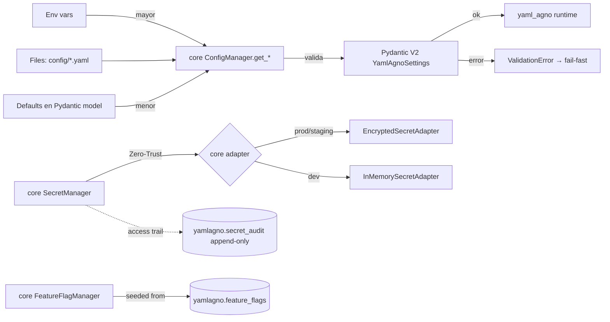

# SPEC_23_CONFIG_AND_SECRETS

> **Purpose**: Specify how yaml-agno **consumes** the core-cenf Config/Secret/FeatureFlag managers rather than reimplementing them. yaml-agno imports `from core_infrastructure import ConfigManager, SecretManager, FeatureFlagManager` (Clean Architecture ports, already implemented in core-cenf). yaml-agno owns only: (a) the DSN / env-name / secret-key wiring that feeds those managers, and (b) two yaml-agno-specific ORM tables (`yamlagno.feature_flags`, `yamlagno.secret_audit`) accessed via the core `GenericRepository`. Hot-reload uses the core's async `reload()`/`refresh()` mechanism. Secret rotation/retention remain a yaml-agno Core capability layered on top of the core `SecretManager`. All schemas validated with Pydantic V2.

---

## 0. FRONTERA CON CORE-CENF, SPEC_03 Y SPEC_00

| Dimensión | core-cenf | SPEC_00 | SPEC_03 | SPEC_23 (este doc) |
|-----------|-----------|---------|---------|--------------------|
| **Managers** | `ConfigManager`, `SecretManager`, `FeatureFlagManager` (Ports + adapters) | — | — | **Consumes** them via `from core_infrastructure import ...` |
| **Alcance** | Horizontal reusable infra | Estrategia, capas, convenciones | Persistencia (Postgres, sesiones, memoria, knowledge) | Wiring + 2 yaml-agno ORM tables |
| **PostgreSQL** | — | No | Sí (DDL completo) | Sí, pero **solo** tablas `yamlagno.feature_flags`, `yamlagno.secret_audit` |
| **Pool / engine** | `SQLAlchemyAdapter` (owns it) | — | Consume adapter | Consume adapter — **does NOT manage its own pool** |
| **Multi-tenant** | — | Menciona | `tenant_id` en tablas de dominio | Override jerárquico: default ← tenant |
| **Secretos** | `SecretManager` Port (Zero-Trust) | No | No | Wiring + rotation/retention + `yamlagno.secret_audit` |
| **Pydantic V2** | — | Menciona | DTOs de dominio | Schemas estrictos de Settings |

**Golden rules**:
- "How do I model sessions/memory/knowledge in Postgres?" → SPEC_03.
- "What is the layered architecture?" → SPEC_00.
- "Where is `ConfigManager` / `SecretManager` / `FeatureFlagManager` implemented?" → **core-cenf (`core_infrastructure`)**. yaml-agno consumes them.
- "How does yaml-agno read a config, a secret, or a flag — DSN, env name, secret keys, rotation, audit?" → **SPEC_23**.

@ai-directive (no reimplementation): SPEC_23 does **not** define `ConfigPort`, `SecretPort`, `FlagPort`, `EnvLayer`/`RemoteLayer`/`FileLayer`/`DefaultsLayer`, or any manager/pool of its own. Those Ports and adapters live in core-cenf. yaml-agno only (a) wires DSN/env/secret keys into the core managers and (b) owns two ORM tables consumed via the core `GenericRepository`.

**Cross-references**:
- Config/Secret/Flag managers and the async SQLAlchemy engine/pool: **core-cenf `core_infrastructure`** (`ConfigManager`, `SecretManager`, `FeatureFlagManager`, `SQLAlchemyAdapter`).
- yaml-agno config-store schema, `GenericRepository`, `DeclarativeBase`, `database.dsn` wiring: SPEC_03.
- `tenant_id` en DTOs: SPEC_03 §2.
- Inyección de Config/Secret en runtime images: desplegado por SPEC_22, consumido por SPEC_23.
- Telemetría de accesos a secretos: exportada a SPEC_21 / SPEC_27 (audit events como traces).

---

## 1. VISIÓN GENERAL

### 1.1 Diagrama Mermaid — Precedencia de Config



### 1.2 Principios

1. **Config vs Secret**: config no es sensible (URLs, timeouts, feature toggles booleans); secret lo es (API keys, passwords, certificados). Nunca se mezclan.
2. **Zero-Trust Secrets**: nunca en env vars del proceso, nunca logueados, nunca listados en masa; acceso por nombre y registro audit.
3. **Precedencia explícita y predecible**: Env > Files > Defaults (owned by core-cenf `PydanticConfigAdapter`). No RemoteLayer DB for config.
4. **Fail-fast**: config inválida = proceso no arranca (`ValidationError`).
5. **Hot-reload seguro**: cambios en runtime sin reinicio, con validación Pydantic previa a la aplicación.
6. **Multi-tenant por override**: cada tenant hereda defaults y sobreescribe selectivamente.
7. **Rotación con TTL**: secrets con expiración; alerta antes de vencer; nunca hardcodeados.
8. **Auditoría inmutable**: cada acceso a secreto registra quién/cuándo/qué/resultado.

---

## 2. SUBSECCIONES

### 2.1 Environment Configs (estructura YAML jerárquica)

```
config/
  defaults.yaml          # defaults compartidos (menor precedencia)
  environments/
    dev.yaml             # local development also maps here (local==dev)
    staging.yaml
    prod.yaml
  tenants/
    tenant_acme.yaml     # overrides por tenant
    tenant_globex.yaml
```

`config/environments/prod.yaml`:
```yaml
app:
  name: yaml-agno
  env: prod
runtime:
  max_concurrent_agents: 50
  request_timeout_s: 30
persistence:
  pool_size: 20
  pool_max_overflow: 10
  statement_timeout_ms: 5000
observability:
  otlp_endpoint: http://otel-collector:4317
  sample_rate: 0.1
security:
  auth_mode: jwt
  token_ttl_minutes: 15
flags:
  enable_experimental_rag: false
```

### 2.2 Pydantic V2 Settings Schema (validación estricta)

@ai-directive: the Env enum SSOT for yaml-agno is `dev|staging|prod`. There is no `local` and no `test` value; local development uses `env=dev` (document `local==dev`), and tests select adapters via `InMemorySecretAdapter` rather than a dedicated `test` env value.

> **Note on core divergence**: the core-cenf `Env` literal is wider
> (`Literal["local", "dev", "staging", "prod"]`, `config/ports.py`). yaml-agno
> INTENTIONALLY narrows it to `dev|staging|prod` via the Pydantic pattern below;
> a core value of `"local"` must be mapped to `"dev"` at the yaml-agno boundary
> (the wiring layer normalizes before validation). This is a deliberate project
> decision (Wave 5), not a drift from core-cenf.

```python
# yaml_agno/infra/config/schemas.py
from pydantic import BaseModel, Field, HttpUrl, SecretStr, field_validator
from pydantic_settings import BaseSettings, SettingsConfigDict

class AppConfig(BaseModel):
    name: str = Field(min_length=1, max_length=64)
    env: str = Field(pattern="^(dev|staging|prod)$")

class RuntimeConfig(BaseModel):
    max_concurrent_agents: int = Field(ge=1, le=500)
    request_timeout_s: int = Field(ge=1, le=600)

class PersistenceConfig(BaseModel):
    pool_size: int = Field(ge=1, le=100)
    pool_max_overflow: int = Field(ge=0, le=100)
    statement_timeout_ms: int = Field(ge=100, le=60000)

class ObservabilityConfig(BaseModel):
    otlp_endpoint: HttpUrl
    sample_rate: float = Field(ge=0.0, le=1.0)

class SecurityConfig(BaseModel):
    auth_mode: str = Field(pattern="^(basic|jwt)$")
    token_ttl_minutes: int = Field(ge=1, le=1440)

class FlagDefaults(BaseModel):
    enable_experimental_rag: bool = False

class YamlAgnoSettings(BaseSettings):
    model_config = SettingsConfigDict(
        env_prefix="YA_",
        env_nested_delimiter="__",
        case_sensitive=False,
        extra="forbid",            # fail-fast: clave desconocida → error
    )
    app: AppConfig
    runtime: RuntimeConfig
    persistence: PersistenceConfig
    observability: ObservabilityConfig
    security: SecurityConfig
    flags: FlagDefaults

    @field_validator("security")
    @classmethod
    def _jwt_required_in_prod(cls, v: SecurityConfig, info):
        env = info.data.get("app")
        if env and env.env == "prod" and v.auth_mode == "basic":
            raise ValueError("auth_mode=basic forbidden in prod")
        return v
```

### 2.3 ConfigManager — CONSUMED from core-cenf

yaml-agno does NOT define `ConfigPort` or `ConfigManager`. It imports the core Protocol and injects the `YamlAgnoSettings` Pydantic model via the core `PydanticConfigAdapter` (or `InMemoryConfigAdapter` in tests).

```python
# yaml_agno/infra/config/bootstrap.py
from core_infrastructure import (
    ConfigManager,            # Protocol — consumed, never redefined
    PydanticConfigAdapter,    # loads settings (YAML + env vars)
    InMemoryConfigAdapter,    # test double
)

def build_config_manager(env: str) -> ConfigManager:
    """Wire yaml-agno settings into the core ConfigManager Protocol.

    The core PydanticConfigAdapter materializes settings (YAML files under
    config/ + YA_ env vars), so precedence (Env > Files > Defaults) and
    Pydantic V2 validation live entirely in core-cenf. yaml-agno only supplies
    the env prefix and config path.

    Real core constructor: PydanticConfigAdapter(env_prefix="YA_",
    config_path=..., error_handler=None) — NOT (settings=..., env=...).
    """
    adapter = PydanticConfigAdapter(
        env_prefix="YA_",
        config_path=_resolve_config_path(env),
    )
    return adapter  # type: ConfigManager  (Protocol, runtime-checkable)
```

**Core API actually consumed** (`core_infrastructure.config.ports.ConfigManager`):

| Method | Signature | yaml-agno usage |
|--------|-----------|-----------------|
| `get_env()` | `-> Env` (`"dev"\|"staging"\|"prod"`) | branch on environment |
| `get_string(key, default_value=None)` | dot-notation, e.g. `"database.dsn"` | read DSN, endpoints |
| `get_number(key, default_value=None)` | `-> float` | timeouts, pool sizes |
| `get_boolean(key, default_value=None)` | `-> bool` | toggles |
| `get_json(key, default_value=None)` | deserialized object | nested blobs |
| `get_section(namespace)` | `-> dict[str, Any]` | whole section |
| `reload()` | `async` (guarded by `asyncio.Lock`) | hot-reload without restart |
| `get_json_schema()` | `-> dict` | AX / agent discovery |

> **@ai-directive (real param name)**: the core Protocol names the fallback
> parameter `default_value`, NOT `default` (`core_infrastructure/config/ports.py`).
> yaml-agno code MUST call `config.get_string("database.dsn", default_value=...)`,
> or pass it positionally; using `default=` will raise `TypeError`.

@ai-directive: all `get_*` are **synchronous** in the core Protocol (only `reload()` is async). yaml-agno code MUST call them synchronously; do not `await config.get_string(...)`. Validation against `YamlAgnoSettings` happens inside the core adapter, so yaml-agno never re-implements precedence or Pydantic validation.

### 2.4 SecretManager — CONSUMED from core-cenf

yaml-agno does NOT define `SecretPort` or `SecretManager`. It imports the core Protocol and uses the core encrypted/in-memory adapters.

```python
# yaml_agno/infra/secrets/bootstrap.py
from core_infrastructure import (
    SecretManager,              # Protocol — consumed, never redefined
    EncryptedSecretAdapter,    # prod: encrypted file/Vault-backed store
    InMemorySecretAdapter,     # test double
)
from core_infrastructure.secrets.models import SecretConfig

def build_secret_manager(env: str, config) -> SecretManager:
    """Wire the core SecretManager. yaml-agno never touches secret values.

    Real core constructors:
      EncryptedSecretAdapter(config: SecretConfig, secret_storage_path: str,
                             error_handler=None) — SecretConfig carries the
                             Fernet key (fernet_key field, models.py:149); the
                             storage_path is a SEPARATE ctor arg, resolved here
                             from yaml-agno config.
      InMemorySecretAdapter(config: SecretConfig | None = None) — dict-backed.
    """
    if env == "prod":
        # SecretConfig() defaults are fine; the Fernet key is injected via env
        # or a bootstrap secret per core-cenf security guidance.
        secret_config = SecretConfig()
        storage_path = config.get_string("secrets.storage_path", default_value=None)
        adapter = EncryptedSecretAdapter(
            config=secret_config,
            secret_storage_path=storage_path,
        )
    else:
        adapter = InMemorySecretAdapter()
    return adapter  # type: SecretManager  (Protocol, runtime-checkable)
```

**Core API actually consumed** (`core_infrastructure.secrets.ports.SecretManager`):

| Method | Signature | yaml-agno usage |
|--------|-----------|-----------------|
| `get_secret(key)` | `async -> str` (masked in `SecretValue.__repr__`) | resolve DSN password, model API keys |
| `invalidate_cache(key=None)` | sync | after rotation |
| `rotate_secret(key, new_value)` | `async` | rotation (§2.9) |
| `get_json_schema()` | `-> dict` | AX |

@ai-directive: `get_secret()` and `rotate_secret()` are the async accessors; `invalidate_cache()` and `get_json_schema()` are sync (`core_infrastructure/secrets/ports.py`). Cache TTL, masking, and fail-safe behavior are owned by core-cenf — yaml-agno does not re-implement the cache tuple or the miss/not-found logic. The core raises `ValidationError` (missing key) / `PermanentError` (backend unreachable); yaml-agno lets these propagate or wraps them via the core `ErrorHandlingManager`.

**Anti-patrones prohibidos** (checked por SAST Bandit/Semgrep, SPEC_22 §2.2):
```python
# ❌ PROHIBIDO
os.environ["DB_PASSWORD"] = await secrets.get_secret("db_password")  # persist to env
logging.info("using key %s", value)                                  # log the raw value
print(await secrets.get_secret(k))                                   # dump a resolved secret
```

### 2.5 Secret Adapters — CONSUMED from core-cenf

yaml-agno does NOT define `SecretAdapter`, `VaultAdapter`, `AWSSecretsAdapter`, etc. The core-cenf `core_infrastructure.secrets.adapters` provides:

| Core adapter | When | Source |
|--------------|------|--------|
| `EncryptedSecretAdapter` | prod / staging — encrypted file/Vault-backed | `core_infrastructure.secrets.adapters.encrypted_secret_adapter` |
| `InMemorySecretAdapter` | dev / tests — dict-backed | `core_infrastructure.secrets.adapters.in_memory_secret_adapter` |

@ai-directive: the dotenv-dev-only guard, AppRole/lease renewal, SOPS+age, and cloud-KV adapters are concerns of core-cenf adapters, NOT yaml-agno. yaml-agno selects the adapter based on `config.get_env()` and otherwise only resolves secret **keys** (e.g. `"db_password"`, `"model/openai_key"`). See §7 calibration questions for any adapter not yet shipped by core-cenf (raise as a core dependency, do not re-implement here).

### 2.6 FeatureFlagManager — CONSUMED from core-cenf

yaml-agno does NOT define `FlagPort` or `FlagManager`. The core provides `FeatureFlagManager` (Protocol) with in-memory and file adapters.

```python
# yaml_agno/infra/flags/bootstrap.py
from core_infrastructure import (
    FeatureFlagManager,           # Protocol — consumed, never redefined
    MemoryFeatureFlagAdapter,     # dev / tests
    FeatureFlag,                  # flag definition (set_flag accepts this)
    FlagContext,                  # evaluation context (tenant_id, environment, attributes)
)

def build_flag_manager(env: str, flags: list[FeatureFlag]) -> FeatureFlagManager:
    """Wire the core FeatureFlagManager. Flag definitions may be seeded from
    the yamlagno.feature_flags table (§5) into the memory adapter at boot.

    Real core constructor: MemoryFeatureFlagAdapter(config: FlagConfig | None).
    It does NOT accept a ``flags=`` list — flags are added one-by-one via
    ``adapter.set_flag(flag)`` after construction.
    """
    adapter = MemoryFeatureFlagAdapter()
    for flag in flags:
        adapter.set_flag(flag)
    return adapter  # type: FeatureFlagManager
```

**Core API actually consumed** (`core_infrastructure.feature_flags.ports.FeatureFlagManager`):

| Method | Signature | Notes |
|--------|-----------|-------|
| `is_enabled(flag_key, context=None)` | `-> bool` | **fail-safe: returns `False` for unknown flags, never raises** |
| `get_flag_value(flag_key, context=None, default=None)` | `-> Any` | payload on cache miss → default |
| `get_all_flags(context=None)` | `-> dict[str, bool]` | evaluate every flag against context |
| `refresh()` | `async` | hot-reload from provider (no-op for memory adapter) |

@ai-directive: `is_enabled()` is **synchronous** and `refresh()` is **async** in the core Protocol. Rule evaluation is owned by core-cenf (`"eq"` operator, all rules must match). yaml-agno does NOT re-implement rollout hashing or tenant override; it builds a `FlagContext(tenant_id=..., environment=...)` and passes it to the core. The `yamlagno.feature_flags` table (§5) is the yaml-agno-owned **source of flag definitions** seeded into the adapter at boot and on `refresh()` — it is not a reimplementation of the manager.

### 2.7 Hot-Reload Mechanism — uses core async reload/refresh

Hot-reload is driven by the core managers' async methods (`config.reload()`, `flags.refresh()`). yaml-agno only schedules the trigger and, on success, re-seeds the flag adapter from `yamlagno.feature_flags` if needed.

```python
# yaml_agno/infra/config/hotreload.py
import asyncio

class HotReloadCoordinator:
    """Triggers core reload()/refresh() on a schedule or external signal.

    The actual reload logic (Pydantic re-validation, cache swap, asyncio.Lock
    race protection) lives in core-cenf. yaml-agno only decides WHEN to call it.
    """

    def __init__(self, config, flags, *, interval_s: int = 30):
        self._config = config      # core ConfigManager Protocol
        self._flags = flags        # core FeatureFlagManager Protocol
        self._interval_s = interval_s
        self._task: asyncio.Task | None = None

    async def start(self) -> None:
        async def _loop():
            while True:
                await asyncio.sleep(self._interval_s)
                await self._config.reload()    # core: re-validate + swap
                await self._flags.refresh()    # core: refresh flag cache
        self._task = asyncio.create_task(_loop())

    async def stop(self) -> None:
        if self._task:
            self._task.cancel()
```

@ai-directive: yaml-agno MUST call the core `reload()`/`refresh()` coroutines; it MUST NOT re-implement watchers, polling strategies, or `LISTEN/NOTIFY` consumers as new manager code. If a Postgres `LISTEN/NOTIFY` signal is desired (§5), it simply invokes `await coordinator.reload_now()` which delegates to the core methods. Validation-before-swap and "keep old value on `ValidationError`" are guaranteed by the core adapter.

### 2.8 Multi-tenant Config (override)

Merge strategy `default ← tenant`:
```python
def _merge_tenant(default: dict, tenant: dict | None) -> dict:
    if not tenant: return default
    return _deep_merge(default, tenant)   # tenant gana en conflicto

def _deep_merge(base: dict, override: dict) -> dict:
    out = dict(base)
    for k, v in override.items():
        if isinstance(v, dict) and isinstance(out.get(k), dict):
            out[k] = _deep_merge(out[k], v)
        else:
            out[k] = v
    return out
```

### 2.9 Rotation & Audit

> @ai-directive **Rotación y retención de secrets son capabilities del Core de yaml-agno (`SecretManager` + `secret_audit`), NO nativas de Agno.** Agno no provee TTL de secretos, auditoría de accesos ni retención de logs de secretos; este SPEC los añade. Esta distinción es relevante para el alcance: cualquier feature de TTL/retención/rotation es mantenida por el equipo yaml-agno y referencia este SPEC, no a la librería Agno.

Rotación: cada secreto tiene `ttl_days`; `rotation_compliance.py` (SPEC_22 §4 TASK_227) alerta cuando `rotated_at + ttl - alert_days <= now`. The actual write-and-invalidate step delegates to the core `await secrets.rotate_secret(key, new_value)` (which stores the new value and evicts the cache). yaml-agno owns the TTL/compliance policy and the `yamlagno.secret_audit` trail, not the rotation primitive.

Auditoría (tabla `yamlagno.secret_audit`): insert inmutable, append-only, retention 365d. Accessed via the core `GenericRepository[SecretAuditRecord]` (DeclarativeBase), schema `yamlagno`.

---

## 3. BEHAVIOR DELTA BDD (Gherkin)

```gherkin
Feature: Config & Secrets management
  As the yaml-agno runtime
  I want deterministic config precedence, zero-trust secrets, hot-reload and flags
  So that runtime behavior is correct, auditable, and rotatable.

  # --- CONFIG PRECEDENCE (owned by core PydanticConfigAdapter) ---
  Scenario: env var overrides file and default
    Given default "runtime.request_timeout_s" = 30
    And file prod.yaml sets it to 20
    And env var YA_RUNTIME__REQUEST_TIMEOUT_S = 5
    When the core ConfigManager.get_number("runtime.request_timeout_s") is called
    Then it returns 5

  Scenario: invalid config value fails fast at startup
    Given prod.yaml sets "runtime.max_concurrent_agents" = 0
    When the runtime boots
    Then YamlAgnoSettings.model_validate raises ValidationError
    And the process exits with code 1

  Scenario: basic auth forbidden in prod
    Given env=prod and security.auth_mode=basic
    When YamlAgnoSettings validates
    Then validation raises "auth_mode=basic forbidden in prod"

  # --- HOT-RELOAD (delegates to core reload()) ---
  Scenario: trigger invokes core reload and runtime picks up new value
    Given the core ConfigManager loaded prod.yaml with request_timeout_s=30
    And prod.yaml is edited to request_timeout_s=45 on disk
    When the HotReloadCoordinator calls await config.reload()
    Then the core adapter validates the new value with Pydantic
    And the runtime uses 45 for new requests without restart

  Scenario: invalid hot-reload value is rejected, runtime keeps old value
    Given prod.yaml valid with pool_size=20
    When it is edited to pool_size=9999 (above max 100)
    Then the core reload() raises ValidationError
    And the reload is aborted
    And the runtime keeps pool_size=20

  # --- ZERO-TRUST SECRETS (delegates to core SecretManager) ---
  Scenario: secret is fetched and cached within TTL by the core
    Given a core SecretManager backed by EncryptedSecretAdapter
    When await get_secret("db/password") is called twice within the core TTL
    Then the backend fetch happens at most once
    And yamlagno.secret_audit records the access

  Scenario: secret not found raises a core error and is audited
    Given a core SecretManager where key "missing" is absent
    When await get_secret("missing") is called
    Then the core raises ValidationError
    And yamlagno.secret_audit records ok=False

  Scenario: secrets are never persisted to env vars
    Given a core SecretManager instance
    When any code path resolves a secret
    Then os.environ MUST NOT contain the secret value
    And no log line contains the secret value (Semgrep verified)

  # --- SECRET ROTATION (yaml-agno policy + core rotate) ---
  Scenario: secret near expiry triggers rotation alert
    Given secret "model/openai_key" with ttl_days=90 and rotated_at=88 days ago
    And alert_days=7
    When rotation_compliance runs
    Then it flags "model/openai_key" as expiring in 2 days
    And on rotate it calls await core secrets.rotate_secret(key, new_value)
    And yamlagno.secret_audit records an audit event

  # --- FEATURE FLAGS (delegates to core FeatureFlagManager) ---
  Scenario: flag disabled globally returns False
    Given flag "enable_experimental_rag" with enabled=false
    When the core FeatureFlagManager.is_enabled("enable_experimental_rag", FlagContext(tenant_id="acme"))
    Then it returns False

  Scenario: unknown flag fails safe to False
    Given the core FeatureFlagManager with no flag "does_not_exist"
    When is_enabled("does_not_exist") is called
    Then it returns False without raising

  Scenario: tenant override enables a globally disabled flag
    Given flag "new_rag_engine" enabled=false globally
    And a tenant override for "tenant_acme" enables it (seeded from yamlagno.feature_flags)
    When is_enabled("new_rag_engine", FlagContext(tenant_id="tenant_acme"))
    Then it returns True

  Scenario: hot-reload of flags flips behavior without restart
    Given flag "new_rag_engine" enabled=false
    When the HotReloadCoordinator receives a pg_notify signal and calls await flags.refresh()
    Then the next is_enabled call returns the new value without restart

  # --- MULTI-TENANT (YAML merge is yaml-agno wiring, fed to the core adapter) ---
  Scenario: tenant override merges over default
    Given default persistence.pool_size=20
    And tenant_globex.yaml sets persistence.pool_size=50
    When yaml-agno deep-merges the tenant YAML and feeds it to the core ConfigManager
    Then get_section("persistence") returns {"pool_size": 50, ...other defaults}
```

---

## 4. TDD MICRO-TASKS

```text
TASK_231 | File: yaml_agno/infra/config/schemas.py
  Test: tests/unit/infra/test_schemas.py::test_rejects_zero_concurrent_agents
  RED:    YamlAgnoSettings accepts max_concurrent_agents=0
  Green:  add Field(ge=1, le=500) + extra=forbid
  Commit: "RED/GREEN: Pydantic V2 strict config schema (SPEC_23 §2.2)"

TASK_232 | File: yaml_agno/infra/config/bootstrap.py (wire core ConfigManager)
  Test: .../test_config_bootstrap.py::test_env_overrides_files_over_defaults
  RED:    get_number returns file value (30) instead of env (5)
  Green:  inject YamlAgnoSettings into core PydanticConfigAdapter; precedence is owned by core
  Commit: "RED/GREEN: wire YamlAgnoSettings into core ConfigManager"

TASK_233 | File: yaml_agno/infra/config/bootstrap.py (validation on reload)
  Test: .../test_config_bootstrap.py::test_invalid_reload_aborts_keeps_old
  RED:    reload applies invalid value
  Green:  call core config.reload(); core validates-before-swap keeps old on ValidationError
  Commit: "RED/GREEN: hot-reload delegates validation to core"

TASK_234 | File: yaml_agno/infra/secrets/bootstrap.py (zero-trust via core)
  Test: .../test_secret_bootstrap.py::test_get_secret_delegates_to_core
  RED:    yaml-agno re-implements a secret cache
  Green:  import core SecretManager; call await secrets.get_secret(key); TTL/cache owned by core
  Commit: "RED/GREEN: SecretManager consumed from core (no local cache)"

TASK_235 | File: yaml_agno/infra/secrets/bootstrap.py (miss handling + audit)
  Test: .../test_secret_bootstrap.py::test_missing_secret_raises_and_audits
  RED:    missing key swallowed / not audited
  Green:  let core ValidationError propagate; record yamlagno.secret_audit ok=False via GenericRepository
  Commit: "RED/GREEN: zero-trust miss → core error + yamlagno audit"

TASK_236 | File: yaml_agno/infra/secrets/bootstrap.py (adapter selection)
  Test: .../test_secret_bootstrap.py::test_prod_uses_encrypted_adapter
  RED:    prod uses InMemorySecretAdapter
  Green:  select core EncryptedSecretAdapter when env==prod, InMemorySecretAdapter otherwise
  Commit: "RED/GREEN: select core secret adapter by environment"

TASK_237 | REMOVED (dotenv prod guard is a core-cenf adapter concern, not yaml-agno)

TASK_238 | File: yaml_agno/infra/secrets/rotator.py (TTL compliance + core rotate)
  Test: .../test_secret_rotator.py::test_flags_secret_near_expiry
  RED:    secret 88/90 days not flagged
  Green:  compute rotated_at + ttl - alert_days <= now; on rotate call await core secrets.rotate_secret(key, new_value)
  Commit: "RED/GREEN: SecretRotator TTL compliance delegating rotation to core (SPEC_23 §2.9)"

TASK_239 | File: yaml_agno/infra/flags/bootstrap.py (consume core FeatureFlagManager)
  Test: .../test_flag_bootstrap.py::test_is_enabled_delegates_to_core
  RED:    yaml-agno re-implements rollout hash
  Green:  import core FeatureFlagManager; build FlagContext; is_enabled() owned by core (fail-safe False)
  Commit: "RED/GREEN: FeatureFlagManager consumed from core (no local rollout)"

TASK_2310 | File: yaml_agno/infra/flags/bootstrap.py (tenant via FlagContext)
  Test: .../test_flag_bootstrap.py::test_tenant_override_via_context
  RED:    tenant override ignored
  Green:  seed tenant flags from yamlagno.feature_flags; pass FlagContext(tenant_id=...) to core
  Commit: "RED/GREEN: tenant flag override via core FlagContext"

TASK_2311 | File: yaml_agno/infra/config/hotreload.py (trigger core reload)
  Test: .../test_hotreload.py::test_trigger_invokes_core_reload
  RED:    coordinator re-implements materialize/swap
  Green:  HotReloadCoordinator calls await config.reload(); no local watchers/swap
  Commit: "RED/GREEN: HotReloadCoordinator delegates to core reload()"

TASK_2312 | File: yaml_agno/infra/config/hotreload.py (LISTEN/NOTIFY → core refresh)
  Test: .../test_hotreload.py::test_notify_invokes_core_refresh
  RED:    flag change not reflected
  Green:  on pg_notify signal call await flags.refresh() (core) + reseed from yamlagno.feature_flags
  Commit: "RED/GREEN: NOTIFY signal → core flags.refresh()"

TASK_2313 | File: yaml_agno/infra/config/merge.py (tenant deep merge for YAML wiring)
  Test: .../test_merge.py::test_tenant_override_deep_merges
  RED:    tenant value replaces whole section instead of merging
  Green:  recursive deep merge of tenant YAML before feeding core adapter
  Commit: "RED/GREEN: multi-tenant YAML deep merge (wiring)"

TASK_2314 | File: yaml_agno/infra/config/schemas.py (extra=forbid in YamlAgnoSettings)
  Test: .../test_schemas.py::test_extra_forbidden_key_rejected
  RED:    unknown top-level key accepted
  Green:  YamlAgnoSettings model_config extra=forbid (validated by core PydanticConfigAdapter)
  Commit: "RED/GREEN: YamlAgnoSettings fail-fast on unknown keys"

TASK_2315 | File: yaml_agno/infra/flags/repository.py (yamlagno.feature_flags via GenericRepository)
  Test: .../test_flag_repository.py::test_get_tenant_override_over_default (testcontainer)
  RED:    tenant row ignored
  Green:  GenericRepository[FeatureFlagRecord] query WHERE name=? AND (tenant_id=? OR tenant_id IS NULL) ORDER BY tenant_id NULLS LAST
  Commit: "RED/GREEN: yamlagno.feature_flags multi-tenant query via core GenericRepository"
```

---

## 5. DDL — yaml-agno config store tables (schema `yamlagno`)

These are the ONLY yaml-agno-owned tables for this SPEC. They live in schema `yamlagno`, are defined as `DeclarativeBase` ORM entities, and are accessed via the core `GenericRepository[T]` (concrete DDL is auto-provisioned by the core `SQLAlchemyAdapter` from the ORM models — the SQL below documents the resulting shape). The engine/pool is owned by the core `SQLAlchemyAdapter` (`config.get_string("database.dsn")`); yaml-agno does NOT create its own engine or pool.

> @ai-directive (no `config_items`): the previous `config_items` RemoteLayer table is REMOVED. yaml-agno consumes the core `ConfigManager` via `PydanticConfigAdapter`, so runtime config is resolved from YAML files + env vars (precedence owned by core-cenf). There is no RemoteLayer DB for config. Only feature-flag **definitions** and the secret **audit trail** are persisted by yaml-agno.

```sql
-- migrations/V023__yamlagno_flags_and_audit.sql
-- Resulting DDL auto-provisioned from DeclarativeBase ORM models.

CREATE SCHEMA IF NOT EXISTS yamlagno;

-- Feature flag DEFINITIONS (seeded into the core MemoryFeatureFlagAdapter at
-- boot and on refresh()). This is yaml-agno's source of flag truth, NOT a
-- reimplementation of FeatureFlagManager.
CREATE TABLE yamlagno.feature_flags (
    id            BIGSERIAL PRIMARY KEY,
    name          TEXT NOT NULL,
    tenant_id     UUID,                       -- NULL = default global
    enabled       BOOLEAN NOT NULL DEFAULT FALSE,
    percent       SMALLINT NOT NULL DEFAULT 0 CHECK (percent BETWEEN 0 AND 100),
    variant_rules JSONB,                      -- A/B targeting payload
    description   TEXT,
    updated_at    TIMESTAMPTZ NOT NULL DEFAULT now(),
    -- @ai-directive: stores the composite user_id form "{tenant}:{principal}" (SPEC_04 A.1), never a bare actor.
    updated_by    TEXT NOT NULL,
    UNIQUE (name, tenant_id)
);

CREATE INDEX ix_yamlagno_flags_tenant
    ON yamlagno.feature_flags (name, COALESCE(tenant_id, '00000000-0000-0000-0000-000000000000'));

-- Immutable append-only secret access trail. Accessed via
-- GenericRepository[SecretAuditRecord]. Retention 365d; partitioned by year.
CREATE TABLE yamlagno.secret_audit (
    id            BIGSERIAL,
    secret_name   TEXT NOT NULL,
    -- @ai-directive: stores the composite user_id form "{tenant}:{principal}" (SPEC_04 A.1), never a bare actor.
    actor         TEXT NOT NULL,
    tenant_id     UUID,
    hit           TEXT NOT NULL CHECK (hit IN ('cache','remote','miss')),
    ok            BOOLEAN NOT NULL,
    accessed_at   TIMESTAMPTZ NOT NULL DEFAULT now(),
    trace_id      TEXT,                       -- crosses with SPEC_21 / SPEC_27
    PRIMARY KEY (id, accessed_at)
) PARTITION BY RANGE (accessed_at);

CREATE TABLE yamlagno.secret_audit_2026 PARTITION OF yamlagno.secret_audit
    FOR VALUES FROM ('2026-01-01') TO ('2027-01-01');

CREATE INDEX ix_yamlagno_audit_name_time
    ON yamlagno.secret_audit (secret_name, accessed_at DESC);
CREATE INDEX ix_yamlagno_audit_trace ON yamlagno.secret_audit (trace_id);

-- Append-only: revoke UPDATE/DELETE from the app role.
REVOKE UPDATE, DELETE ON yamlagno.secret_audit FROM yaml_agno_app;
GRANT INSERT, SELECT ON yamlagno.secret_audit TO yaml_agno_app;

-- Hot-reload signal channel (optional): when an admin flips a flag row, a
-- trigger may pg_notify('yamlagno_flags_changed', ...). yaml-agno's
-- HotReloadCoordinator (§2.7) receives it and calls the core refresh(); it
-- does NOT own a LISTEN/NOTIFY manager implementation.
```

---

## 6. SUPUESTOS TÉCNICOS

1. **Secret adapters are owned by core-cenf** (`EncryptedSecretAdapter` for prod, `InMemorySecretAdapter` for dev/test). Any Vault/AWS/GCP/Azure/SOPS/dotenv backend not yet shipped by core-cenf is raised as a core dependency — yaml-agno does NOT re-implement adapters here.
2. **Secret cache TTL is owned by core-cenf** (short in-memory TTL, balance between latency and freshness after rotation).
3. **Pool/engine belongs to the core `SQLAlchemyAdapter`** (`config.get_string("database.dsn")`), consumed via the core `GenericRepository`. yaml-agno does NOT manage its own pool; the `yamlagno_*` tables live in the same Postgres as SPEC_03 under a restricted `yaml_agno_app` role, and `yamlagno.secret_audit` is append-only.
4. **Hot-reload** is driven by the core async `reload()` / `refresh()` methods; yaml-agno only schedules the trigger (and optionally listens for a Postgres `LISTEN/NOTIFY` signal that invokes those coroutines).
5. **Feature flags** are evaluated by the core `FeatureFlagManager` (`MemoryFeatureFlagAdapter` seeded from `yamlagno.feature_flags`); Unleash/LaunchDarkly are core adapters, not yaml-agno code.
6. **Rollout / rule evaluation is owned by core-cenf** (fail-safe `False` for unknown flags, `"eq"` rule operator). yaml-agno passes a `FlagContext`.
7. **Pydantic V2 validation** (boot and hot-reload, keep-old-on-error) is owned by the core `PydanticConfigAdapter`; yaml-agno supplies the `YamlAgnoSettings` model.
8. **`extra=forbid`** in `YamlAgnoSettings`: a typo'd key → fail-fast. Reduces silent config drift.
9. **Secrets never travel as CLI args** (visible in `ps`); always via the core `SecretManager`.
10. **Audit retention 365d**; yearly partition on `yamlagno.secret_audit`. Export to SIEM via SPEC_21 / SPEC_27.
11. **Multi-tenant**: `tenant_id` optional on every lookup; `None` = global default. Override deep-merge never replaces whole sections unless the tenant defines the full section.
12. **Zero environment persistence**: SAST (SPEC_22) blocks any `os.environ[k] = secret...`.

---

## 7. PREGUNTAS DE CALIBRACIÓN

1. ¿Default prod adapter es Vault o AWS Secrets Manager? (Propuesta: Vault, con AWS/GCP según cloud del cliente.)
2. ¿TTL de cache de secrets 30s es aceptable, o se reduce a 10s para rotación más reactiva?
3. ¿Feature flags custom (Postgres) es suficiente para el MVP, o se integra Unleash desde el inicio?
4. ¿`secret_audit` se queda en Postgres particionado o se exporta a un SIEM dedicado (Elastic/OpenSearch)?
5. ¿Hot-reload via `LISTEN/NOTIFY` suficiente para N pods, o se requiere Redis Pub/Sub?
6. ¿`extra=forbid` desde el día 1 puede romper migraciones; se permite `extra=allow` en dev y `forbid` en prod?
7. ¿Rotación: automática (script rota y actualiza) o solo alerta para rotación manual? (Propuesta MVP: alerta.)
8. ¿Las tablas `yamlagno.feature_flags` / `yamlagno.secret_audit` conviven en el schema `yamlagno` de la misma DB de SPEC_03, o se aislan en una DB lógica separada?
9. ¿Flags por usuario (targeting fino) se incluye en MVP o solo global + tenant + porcentaje? (La evaluación la hace el core; esto define qué `attributes` se pasan en `FlagContext`.)
10. ¿SOPS para qué secretos? ¿Solo los de bootstrap, o también configs sensibles por ambiente? (Si se necesita adapter SOPS en core-cenf, se levanta como dependencia del core.)

---

> **Cierre**: SPEC_23 define cómo yaml-agno **consume** los managers horizontales de core-cenf (`ConfigManager`, `SecretManager`, `FeatureFlagManager`) en vez de reimplementarlos. yaml-agno aporta el wiring (DSN, env name, secret keys), la política de rotación/TTL, el modelo `YamlAgnoSettings` (Pydantic V2) y dos tablas propias (`yamlagno.feature_flags`, `yamlagno.secret_audit`) vía el `GenericRepository` del core. El pool/engine pertenece al `SQLAlchemyAdapter` del core. Ningún secreto en env vars, ninguna config inválida arranca, ningún flag cambia sin notificar.
