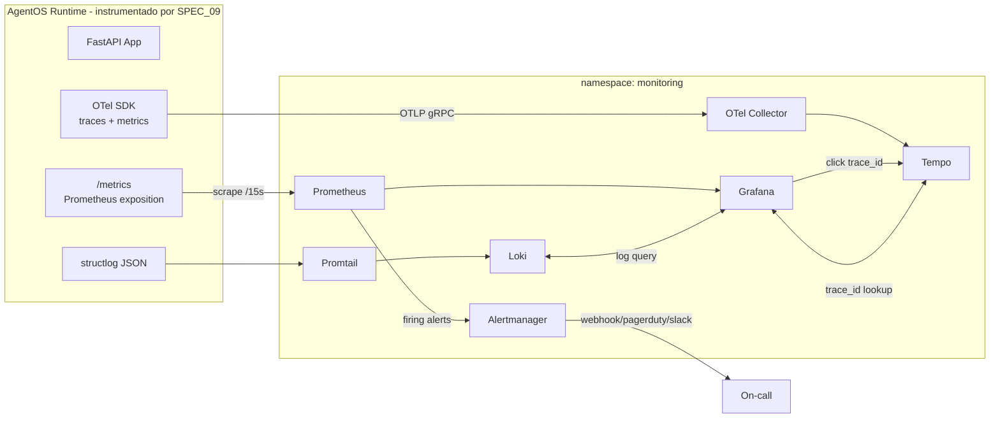
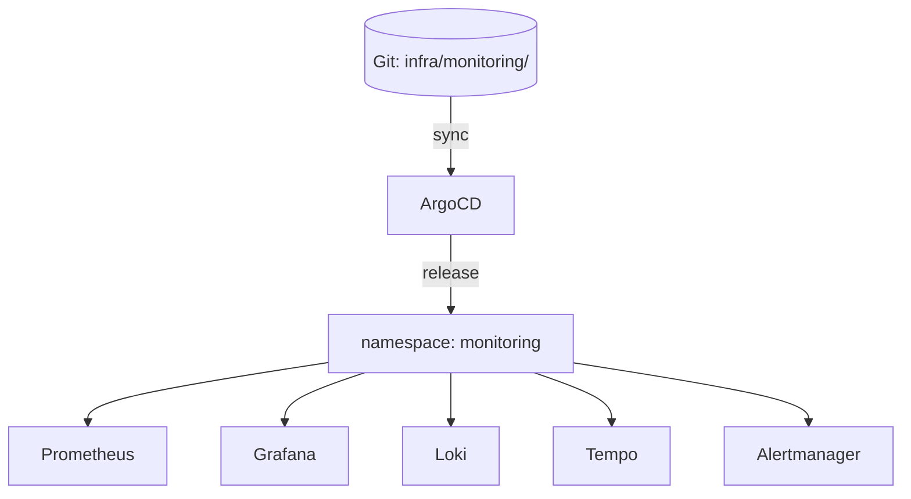

# SPEC_24_MONITORING_STACK

> **Propósito**: Especificar el stack de monitoring productivo de yaml-agno. Mientras **SPEC_09** define la instrumentación OpenTelemetry *interna* del runtime (spans, métricas RED, circuit breaker), este SPEC define el **stack externo** que recolecta, almacena, visualiza y alerta sobre esa telemetría: Prometheus, Grafana, Loki, Alertmanager y Tempo/Jaeger. Todo provisto como código (Helm) y con SLI/SLO explícitos.

---

## 0. Scope y Frontera con SPEC_09

| Aspecto | SPEC_09 (Instrumentación) | SPEC_24 (Stack de Monitoring) |
|---------|---------------------------|-------------------------------|
| ¿Quién produce? | El runtime Agno (Python, OTel SDK) | Infraestructura (Helm, kube-prometheus-stack) |
| ¿Qué? | Spans, métricas, logs estructurados | Scraping, almacenamiento, dashboards, alertas |
| ¿Dónde? | Dentro del pod AgentOS | Sidecars / pods dedicados del namespace `monitoring` |
| Contrato | `ObservabilityManager` Port | `ServiceMonitor`, `PrometheusRule`, Grafana JSON |

**Regla de oro**: SPEC_24 **no** introduce nueva instrumentación; **consume** la que SPEC_09 expone en `/metrics` y OTel pipeline. Si una métrica no existe en SPEC_09, primero se añade ahí.

### 0.1 Estrategia dual de observabilidad (Cloud Run primario, K8s futuro)

> @ai-directive Per SPEC_00 §7.3, **Cloud Run es el destino de deployment PRIMARIO**; Kubernetes (SPEC_21) es FUTURO. El backend de monitoring (dónde se recolecta/almacena/visualiza la telemetría) difiere por destino, pero la **instrumentación es la misma** (SPEC_09: OTel SDK + `/metrics` Prometheus exposition). El `ObservabilityManager` Port (SPEC_09) abstrae el backend.

| Destino | Backend de monitoring | Cómo se recolecta | Notas |
|---------|------------------------|-------------------|-------|
| **Cloud Run (PRIMARIO)** | **Google Cloud Monitoring** (Cloud Metrics) + **Managed Service for Prometheus** + **Cloud Logging** + **Cloud Trace** | (a) OTel SDK del runtime exporta OTLP → OTel Collector → Cloud Trace/Managed Prometheus; (b) `/metrics` Prometheus scraped por Managed Prometheus collector; (c) logs JSON → Cloud Logging. Dashboards en Cloud Monitoring; alertas vía Cloud Monitoring alert policies + Notification Channels. | Cloud Run **no tiene** Prometheus Operator, ni `ServiceMonitor`, ni `PrometheusRule`, ni Promtail. Las secciones §2.1.1-§2.4 de este SPEC (`ServiceMonitor`, `PrometheusRule`, kube-prometheus-stack) **aplican al destino K8s futuro**, NO a Cloud Run. |
| **Kubernetes (FUTURO)** | kube-prometheus-stack (Prometheus Operator) + Loki + Tempo + Alertmanager + Grafana | `ServiceMonitor` scrapea `/metrics`; Promtail → Loki; OTel Collector → Tempo. | Este es el modelo detallado en §2.1-§2.9. |

**Mapping de componentes por destino**:

| Componente (K8s futuro) | Equivalente Cloud Run (primario) |
|-------------------------|-----------------------------------|
| Prometheus + `ServiceMonitor` | Managed Service for Prometheus (collector gestionado) |
| `PrometheusRule` (alertas) | Cloud Monitoring alert policies (MQL/PromQL) |
| Alertmanager | Cloud Monitoring notification channels (PagerDuty/Slack/email) |
| Loki + Promtail | Cloud Logging (logs JSON estructurados, retention por bucket) |
| Tempo (traces) | Cloud Trace (OTLP / OTel Collector → Cloud Trace) |
| Grafana | Cloud Monitoring dashboards (o Grafana against Managed Prometheus) |

> **Métricas/traces/logs emitidos por SPEC_09 no cambian** entre destinos: mismas métricas RED, mismos span attributes (§2.6.3), mismo JSON de logs. Lo que cambia es el backend que los recibe. El adapter `PrometheusOtelObservabilityManager` (§2.7) es válido para ambos: en Cloud Run su export OTLP apunta al OTel Collector que enruta a Cloud Trace/Managed Prometheus; en K8s apunta al Collector que enruta a Tempo/Prometheus.



---

## 1. PRINCIPAL

El stack de monitoring de yaml-agno es **una sola unidad desplegable** (un release Helm) que entrega, sin configuración manual post-deploy:

1. **Recolección automática** de métricas, logs y traces de todos los workloads instrumentados.
2. **Dashboards listos** que responden las preguntas operativas del negocio (¿están corriendo los agentes?, ¿cuánto token gastamos?, ¿RAG responde rápido?).
3. **Alertas accionables** con runbooks adjuntos, sin ruido.
4. **Correlación unificada**: un `trace_id` navega logs → traces → métricas desde Grafana.
5. **SLI/SLO medidos** con error budget visible en dashboard dedicado.

**Stack elegido**: `kube-prometheus-stack` (Prometheus Operator) + Loki + Tempo + Alertmanager + Grafana. Toda la pila es CNCF, soporta OTel nativo, y existe como chart oficial mantenido.

---

## 2. SUBSECCIONES

### 2.1 Componentes del Stack

#### 2.1.1 Prometheus — Metrics Scraping

**Rol**: Time-series DB pull-based. Scrapea `/metrics` de AgentOS y almacena 15 días de retención por defecto.

**Config clave** (`values.yaml` de kube-prometheus-stack):

```yaml
prometheus:
  prometheusSpec:
    retention: 15d
    retentionSize: 50GB
    enableFeatures:
      - native-histograms
    serviceMonitorSelectorNilUsesHelmValues: false
    podMonitorSelectorNilUsesHelmValues: false
    ruleSelectorNilUsesHelmValues: false
    storageSpec:
      volumeClaimTemplate:
        spec:
          storageClassName: gp3
          resources:
            requests:
              storage: 100Gi
    resources:
      requests: { cpu: "1", memory: "2Gi" }
      limits: { cpu: "2", memory: "4Gi" }
```

**ServiceMonitor de AgentOS** (scrape cada 15s):

```yaml
apiVersion: monitoring.coreos.com/v1
kind: ServiceMonitor
metadata:
  name: agentos-metrics
  namespace: agentos
  labels:
    release: monitoring  # match prometheus.release
spec:
  selector:
    matchLabels:
      app.kubernetes.io/name: agentos
  endpoints:
    - port: http-metrics     # containerPort 9090
      path: /metrics
      interval: 15s
      scrapeTimeout: 10s
      honorLabels: true
      relabelings:
        - sourceLabels: [__meta_kubernetes_pod_label_tenant_id]
          targetLabel: tenant_id
        - sourceLabels: [__meta_kubernetes_namespace]
          targetLabel: namespace
      metricRelabelings:
        # Drop high-cardinality debug metrics in prod
        - sourceLabels: [__name__]
          regex: 'debug_.*'
          action: labeldrop
```

#### 2.1.2 Grafana — Dashboards

**Rol**: Visualización. Dashboards provistos como ConfigMaps JSON (GitOps), sin edición manual en UI.

```yaml
grafana:
  enabled: true
  adminPasswordKey: grafana-admin-password  # en Secret, via SPEC_23
  persistence:
    enabled: true
    size: 10Gi
  dashboardProviders:
    dashboardproviders.yaml:
      apiVersion: 1
      providers:
        - name: 'yaml-agno'
          folder: 'YAML-Agno'
          type: file
          disableDeletion: true
          updateIntervalSeconds: 30
          options:
            path: /var/lib/grafana/dashboards/yaml-agno
  dashboardsConfigMaps:
    yaml-agno: grafana-dashboards-yaml-agno
  grafana.ini:
    auth.anonymous:
      enabled: false
    server:
      root_url: https://grafana.yaml-agno.internal
```

#### 2.1.3 Loki — Log Aggregation

**Rol**: Almacena logs estructurados JSON. Recibe vía **Promtail** (DaemonSet que lee `/var/log/pods`).

Pipeline de parsing esperado para logs structlog de SPEC_09:

```yaml
# promtail scrapes por pod, parsea JSON de AgentOS
scrape_configs:
  - job_name: kubernetes-pods
    kubernetes_sd_configs:
      - role: pod
    relabel_configs:
      - source_labels: [__meta_kubernetes_pod_label_app_kubernetes_io_name]
        regex: agentos
        action: keep
    pipeline_stages:
      - json:
          expressions:
            level: level
            msg: message
            trace_id: trace_id
            span_id: span_id
            tenant_id: tenant_id
            correlation_id: correlation_id
            agent_name: agent_name
      - labels:
          level:
          tenant_id:
          agent_name:
      - output:
          source: msg
```

**Retención** (multi-tenant, tenant determina):

| Tenant tier | Retención Loki | motivo |
|-------------|---------------|--------|
| Free / Dev  | 7 días        | costo |
| Pro         | 30 días       | debug productivo |
| Enterprise  | 90 días       | compliance SOC 2 |

Configurado vía `compactor.retention_enabled: true` + `limits_config.retention_period`.

#### 2.1.4 Alertmanager — Alerting

**Rol**: Recibe alertas firing de Prometheus, agrupa, silencia, enruta a on-call.

```yaml
alertmanager:
  config:
    global:
      resolve_timeout: 5m
    route:
      receiver: default
      group_by: ['alertname', 'tenant_id', 'severity']
      group_wait: 30s
      group_interval: 5m
      repeat_interval: 4h
      routes:
        - matchers: ['severity="critical"']
          receiver: pagerduty-critical
          group_wait: 0s
        - matchers: ['severity="warning"']
          receiver: slack-warnings
        - matchers: ['tenant_id="enterprise-acme"']
          receiver: enterprise-dedicated
    receivers:
      - name: default
        slack_configs:
          - api_url_file: /etc/alertmanager/secrets/slack-webhook
            channel: '#yaml-agno-alerts'
      - name: pagerduty-critical
        pagerduty_configs:
          - routing_key_file: /etc/alertmanager/secrets/pd-routing-key
            severity: critical
      - name: slack-warnings
        slack_configs:
          - api_url_file: /etc/alertmanager/secrets/slack-webhook
            channel: '#yaml-agno-warnings'
```

#### 2.1.5 Tempo — Distributed Tracing Storage

**Rol**: Backend de almacenamiento para traces OTel (de SPEC_09). Reemplaza/mantiene compatibilidad con Jaeger.

```yaml
tempo:
  enabled: true
  config:
    storage:
      trace:
        backend: s3
        s3:
          bucket: yaml-agno-traces
          endpoint: s3.region.amazonaws.com
    distributor:
      receivers:
        otlp:
          protocols:
            grpc:
              endpoint: 0.0.0.0:4317
    metricsGenerator:
      enabled: true      # genera metrics RED a partir de spans
    server:
      http_tls_client_auth_type: RequireAndVerifyClientCert
```

**Integración con OTel Collector** (ver §2.6): el Collector recibe OTLP del runtime Agno y enruta a Tempo.

---

### 2.2 Métricas — Método RED + USE + Negocio

Toda métrica es **emitida por SPEC_09** (`ObservabilityManager.record_metric()`). Aquí definimos su contrato de nombres, labels y consultas PromQL.

#### 2.2.1 Métricas RED de Agent (Rate, Errors, Duration)

| Métrica (Prometheus) | Tipo | Labels | Descripción |
|----------------------|------|--------|-------------|
| `yaml_agno_agent_run_total` | counter | `agent_name`, `tenant_id`, `status` (success/error/timeout) | Runs iniciados/completados |
| `yaml_agno_agent_run_duration_seconds` | histogram | `agent_name`, `tenant_id` | Latencia de run completo |
| `yaml_agno_agent_errors_total` | counter | `agent_name`, `tenant_id`, `error_type` | Errores clasificados |

**Consultas RED**:

```promql
# Rate (req/s últimos 5m)
rate(yaml_agno_agent_run_total{status="success"}[5m])

# Error rate (%)
sum(rate(yaml_agno_agent_run_total{status=~"error|timeout"}[5m]))
  /
sum(rate(yaml_agno_agent_run_total[5m]))

# Duration p95 (s)
histogram_quantile(0.95,
  sum(rate(yaml_agno_agent_run_duration_seconds_bucket[5m])) by (le, agent_name)
)
```

#### 2.2.2 Métricas de Tokens y Costo

| Métrica | Tipo | Labels | Origen SPEC_09 |
|---------|------|--------|----------------|
| `yaml_agno_tokens_input_total` | counter | `agent_name`, `model`, `tenant_id` | `response.metrics.input_tokens` de Agno |
| `yaml_agno_tokens_output_total` | counter | `agent_name`, `model`, `tenant_id` | `response.metrics.output_tokens` |
| `yaml_agno_tokens_cache_total` | counter | `agent_name`, `model` | cached tokens |
| `yaml_agno_token_cost_usd` | counter | `tenant_id`, `model` | costo monetario acumulado |

#### 2.2.3 Métricas de Tools / MCP

| Métrica | Tipo | Labels |
|---------|------|--------|
| `yaml_agno_tool_call_total` | counter | `tool_name`, `status` |
| `yaml_agno_tool_duration_seconds` | histogram | `tool_name` |
| `yaml_agno_mcp_errors_total` | counter | `server`, `error_type` |

#### 2.2.4 Métricas de Model Provider y Resilencia (ref SPEC_14)

| Métrica | Tipo | Labels | Alerta asociada |
|---------|------|--------|-----------------|
| `yaml_agno_model_provider_latency_seconds` | histogram | `provider`, `model` | p95 > 8s |
| `yaml_agno_model_fallback_triggered_total` | counter | `from_model`, `to_model` | tasa creciente |
| `yaml_agno_circuit_breaker_state` | gauge | `breaker_name`, `state` (closed/open/half_open) | state==1 (open) |
| `yaml_agno_retry_total` | counter | `operation`, `attempt` | — |

#### 2.2.5 Métricas de Knowledge / RAG (ref SPEC_10)

| Métrica | Tipo | Labels |
|---------|------|--------|
| `yaml_agno_rag_search_duration_seconds` | histogram | `index` |
| `yaml_agno_rag_search_hit_rate` | gauge | `index` |
| `yaml_agno_rag_chunks_returned` | histogram | `index` |

#### 2.2.6 Métricas de Infra (USE method)

Recolectadas por `node-exporter` y `kube-state-metrics` (incluidos en kube-prometheus-stack): `node_cpu_seconds_total`, `node_memory_MemAvailable_bytes`, `kube_pod_status_phase`, `kube_deployment_status_replicas_unavailable`.

#### 2.2.7 Métricas de Negocio (custom)

| Métrica | Tipo | Labels | Dueño |
|---------|------|--------|-------|
| `yaml_agno_hitl_approval_pending` | gauge | `agent_name`, `tenant_id` | SPEC_16 |
| `yaml_agno_workflow_step_completed_total` | counter | `workflow`, `step` | SPEC_05 |
| `yaml_agno_eval_score` | histogram | `eval_set`, `metric` | SPEC_18 |

---

### 2.3 Dashboards (JSON provisioning)

Cuatro dashboards obligatorios, versionados en Git, desplegados como ConfigMap.

#### 2.3.1 AgentOS Overview

```json
{
  "title": "AgentOS Overview",
  "uid": "agentos-overview",
  "schemaVersion": 39,
  "templating": {
    "list": [
      { "name": "tenant", "type": "query", "datasource": "Prometheus",
        "query": "label_values(yaml_agno_agent_run_total, tenant_id)" }
    ]
  },
  "panels": [
    {
      "title": "Request Rate (req/s)",
      "type": "stat",
      "gridPos": { "h": 6, "w": 6, "x": 0, "y": 0 },
      "targets": [
        { "expr": "sum(rate(yaml_agno_agent_run_total{tenant_id=\"$tenant\"}[5m]))" }
      ]
    },
    {
      "title": "Error Rate (%)",
      "type": "stat",
      "thresholds": {
        "steps": [
          { "color": "green", "value": null },
          { "color": "orange", "value": 1 },
          { "color": "red", "value": 5 }
        ]
      },
      "targets": [
        { "expr": "100 * sum(rate(yaml_agno_agent_run_total{tenant_id=\"$tenant\",status=~\"error|timeout\"}[5m])) / sum(rate(yaml_agno_agent_run_total{tenant_id=\"$tenant\"}[5m]))" }
      ]
    },
    {
      "title": "Latency p50/p95/p99 (s)",
      "type": "timeseries",
      "targets": [
        { "expr": "histogram_quantile(0.50, sum(rate(yaml_agno_agent_run_duration_seconds_bucket{tenant_id=\"$tenant\"}[5m])) by (le))", "legendFormat": "p50" },
        { "expr": "histogram_quantile(0.95, sum(rate(yaml_agno_agent_run_duration_seconds_bucket{tenant_id=\"$tenant\"}[5m])) by (le))", "legendFormat": "p95" },
        { "expr": "histogram_quantile(0.99, sum(rate(yaml_agno_agent_run_duration_seconds_bucket{tenant_id=\"$tenant\"}[5m])) by (le))", "legendFormat": "p99" }
      ]
    }
  ]
}
```

#### 2.3.2 Agent Performance (tokens + costo)

Paneles: `tokens_input_total` por modelo, `tokens_output_total`, `token_cost_usd` acumulado por tenant, top-10 agentes por consumo.

#### 2.3.3 Knowledge / RAG

Paneles: `rag_search_duration_seconds` p95, `rag_search_hit_rate`, distribución de `chunks_returned`, índices lentos.

#### 2.3.4 Infrastructure

Paneles: CPU/memoria por pod (`container_cpu_usage_seconds_total`), pods no listos (`kube_pod_status_ready!=1`), restart count (`kube_pod_container_status_restarts_total`), PVC usage.

---

### 2.4 Reglas de Alerting (`PrometheusRule`)

Una sola `PrometheusRule` por namespace `agentos`, agrupada por severidad.

```yaml
apiVersion: monitoring.coreos.com/v1
kind: PrometheusRule
metadata:
  name: yaml-agno-alerts
  namespace: agentos
spec:
  groups:
    - name: yaml-agno.availability
      interval: 30s
      rules:
        - alert: HighErrorRate
          expr: |
            100 * sum(rate(yaml_agno_agent_run_total{status=~"error|timeout"}[5m])) by (tenant_id, agent_name)
              / sum(rate(yaml_agno_agent_run_total[5m])) by (tenant_id, agent_name)
              > 5
          for: 5m
          labels:
            severity: critical
            runbook: https://runbooks.yaml-agno/high-error-rate
          annotations:
            summary: "Error rate >5% for {{ $labels.agent_name }} (tenant {{ $labels.tenant_id }})"

        - alert: HighLatencyP95
          expr: |
            histogram_quantile(0.95,
              sum(rate(yaml_agno_agent_run_duration_seconds_bucket[5m])) by (le, agent_name)
            ) > 5
          for: 10m
          labels: { severity: warning }

    - name: yaml-agno.resilience
      rules:
        - alert: CircuitBreakerOpen
          expr: yaml_agno_circuit_breaker_state{state="open"} == 1
          for: 1m
          labels: { severity: critical }
          annotations:
            summary: "Circuit breaker OPEN: {{ $labels.breaker_name }}"

        - alert: ModelFallbackSpike
          expr: rate(yaml_agno_model_fallback_triggered_total[5m]) > 1
          for: 5m
          labels: { severity: warning }

    - name: yaml-agno.cost
      rules:
        - alert: TokenBudgetExceeded
          expr: |
            sum(increase(yaml_agno_token_cost_usd[1h])) by (tenant_id)
              > on(tenant_id) group_left yaml_agno_token_budget_usd * 0.9
          for: 15m
          labels: { severity: warning }
          annotations:
            summary: "Tenant {{ $labels.tenant_id }} al 90% del budget de tokens"

    - name: yaml-agno.infra
      rules:
        - alert: PodRestartLoop
          expr: increase(kube_pod_container_status_restarts_total[1h]) > 5
          for: 5m
          labels: { severity: critical }

        - alert: DBConnectionPoolExhausted
          expr: |
            yaml_agno_db_pool_in_use_connections
              / yaml_agno_db_pool_max_connections > 0.9
          for: 2m
          labels: { severity: critical }

        - alert: SLOBurnRateFast
          expr: |
            (1 - (sum(rate(yaml_agno_agent_run_total{status="success"}[1h]))
                   / sum(rate(yaml_agno_agent_run_total[1h])))) > 14.4
          for: 5m
          labels: { severity: critical, slo: "availability-99.9" }
          annotations:
            summary: "Burn rate 1h consume 2% del error budget en 5m"
```

**Regla de etiquetado**: toda alerta lleva `severity ∈ {warning, critical}` y `runbook` URL. Sin runbook, la alerta se rechaza en review (TASK_024_04 lo valida).

---

### 2.5 Log Aggregation

Definido por SPEC_09 (structlog JSON en perfil `prod`). Este SPEC garantiza:

1. **Niveles**: `DEBUG` solo en dev; `INFO` en prod; `WARNING`/`ERROR` siempre.
2. **Correlation IDs**: toda línea de log lleva `trace_id`, `span_id`, `tenant_id`, `correlation_id`. Promtail los extrae a labels (ver §2.1.3).
3. **Retention**: definida por tenant tier (tabla en §2.1.3).
4. **No PII en logs**: enforced por SPEC_16 (redacción). Validado por TASK_024_05 (LogShipper scrub check).

---

### 2.6 Distributed Tracing

#### 2.6.1 OTel Collector Pipeline

```yaml
apiVersion: opentelemetry.io/v1alpha1
kind: OpenTelemetryCollector
metadata:
  name: yaml-agno-otelcol
  namespace: monitoring
spec:
  mode: deployment
  config:
    receivers:
      otlp:
        protocols:
          grpc: { endpoint: 0.0.0.0:4317 }
          http: { endpoint: 0.0.0.0:4318 }
    processors:
      batch: { send_batch_size: 1024, timeout: 5s }
      memory_limiter: { check_interval: 1s, limit_percentage: 80, spike_limit_percentage: 25 }
      resource:
        attributes:
          - key: deployment.environment
            value: prod
            action: upsert
      # Tail sampling: muestreo inteligente post-ejecución
      tail_sampling:
        decision_wait: 10s
        policies:
          - { name: errors, type: status_code, status_code: { status_codes: [ERROR] } }
          - { name: slow, type: latency, latency: { threshold_ms: 2000 } }
          - { name: baseline, type: probabilistic, probabilistic: { sampling_percentage: 10 } }
    exporters:
      otlp/tempo:
        endpoint: tempo.monitoring.svc:4317
        tls: { insecure: false, cert_file: /tls/cert.pem }
      loki:
        endpoint: http://loki.monitoring.svc:3100/loki/api/v1/push
    service:
      pipelines:
        traces:
          receivers: [otlp]
          processors: [memory_limiter, resource, tail_sampling, batch]
          exporters: [otlp/tempo]
```

#### 2.6.2 Sampling — Head vs Tail

| Estrategia | Dónde | Regla | Cuándo |
|------------|-------|-------|--------|
| **Head** | SDK Agno (SPEC_09) | 100% traces locales en dev | dev/test |
| **Tail** | OTel Collector | 100% errores + 100% lentos (>2s) + 10% baseline | prod |

Justificación tail sampling: en prod un agente genera decenas de spans por request; muestrear 100% satura Tempo. Tail sampling preserva el 100% de traces diagnósticos (errores, lentos) y muestrea el resto.

#### 2.6.3 Atributos de Span estandarizados

TODO span de Agno lleva estos attributes (contrato con SPEC_09):

| Attribute | Ejemplo | Origen |
|-----------|---------|--------|
| `agent.name` | `support-classifier` | YAML definition |
| `tenant.id` | `enterprise-acme` | auth context |
| `session.id` | `sess_abc123` | AgentOS session |
| `model.name` | `gpt-4o` | SPEC_14 |
| `tool.name` | `web_search` | tool span |
| `tokens.input` / `tokens.output` | `1200` / `450` | response.metrics |
| `cost.usd` | `0.0023` | cost calc |

---

### 2.7 Integración con `ObservabilityManager` (Port SPEC_09)

SPEC_09 expone el Port `ObservabilityManager`. SPEC_24 provee el **Adapter productivo** que implementa ese Port y envía a Prometheus + OTel:

```python
# yaml-agno/src/infra/observability/prometheus_otel_adapter.py
from typing import Any
from prometheus_client import Counter, Histogram, Gauge
from opentelemetry import trace
from opentelemetry.exporter.otlp.proto.grpc.trace_exporter import OTLPSpanExporter
from opentelemetry.sdk.trace.export import BatchSpanProcessor

class PrometheusOtelObservabilityManager:
    """Adapter productivo: implementa ObservabilityManager (SPEC_09)
    y exporta a Prometheus (/metrics) + OTel Collector -> Tempo.

    @ai-directive (TracerProvider SSOT): this adapter does NOT call
    trace.set_tracer_provider(). The GLOBAL TracerProvider is registered ONCE
    by Agno's agno.tracing.setup_tracing (owned by SPEC_27, invoked at startup).
    Calling set_tracer_provider here would double-register and corrupt OTel
    state. This adapter only attaches a BatchSpanProcessor to the provider that
    setup_tracing already registered, then resolves a tracer from it.
    """

    def __init__(self, otel_endpoint: str):
        # Métricas Prometheus (registradas una sola vez)
        self._agent_run = Counter(
            "yaml_agno_agent_run_total", "Agent runs", ["agent_name", "tenant_id", "status"])
        self._agent_duration = Histogram(
            "yaml_agno_agent_run_duration_seconds", "Run latency",
            ["agent_name", "tenant_id"],
            buckets=(0.1, 0.25, 0.5, 1, 2.5, 5, 10, 30))
        # OTel tracer: resolve from the GLOBAL provider that SPEC_27 registered.
        # Add our OTLP exporter as a span processor on that provider — do NOT
        # replace the provider.
        provider = trace.get_tracer_provider()
        provider.add_span_processor(
            BatchSpanProcessor(OTLPSpanExporter(endpoint=otel_endpoint, insecure=False)))
        self._tracer = trace.get_tracer("yaml-agno")

    def increment_counter(self, name: str, value: float = 1.0, attributes: dict[str, Any] | None = None) -> None:
        """Counter increment. `attributes` matches the SPEC_09 Port signature."""
        attributes = attributes or {}
        getattr(self, f"_{name}").labels(**attributes).inc(value)

    def record_metric(self, name: str, value: float, attributes: dict[str, Any] | None = None) -> None:
        """Distribution/histogram observation. `attributes` matches the SPEC_09 Port signature."""
        attributes = attributes or {}
        getattr(self, f"_{name}").labels(**attributes).observe(value)

    def start_span(self, name: str):
        return self._tracer.start_as_current_span(name)
```

**Exports**: Prometheus (HTTP `/metrics`), OTel (OTLP gRPC → Collector → Tempo). Adapters alternativos (`DatadogObservabilityManager`, `NoopObservabilityManager`) viven detrás del mismo Port para tests.

> **@ai-directive (cross-ref)**: the global `TracerProvider` is the SSOT and is owned
> by SPEC_27 (`agno.tracing.setup_tracing`, called once at AgentOS startup). Both
> SPEC_24's adapter (here) and SPEC_09's dev span helper attach processors to that
> provider; neither calls `trace.set_tracer_provider()`. The startup ordering is
> enforced by the SPEC_12 `LifespanAdapter`: `setup_tracing` runs before any
> observability adapter that needs the tracer.

---

### 2.8 SLI / SLO

#### 2.8.1 Definición

| SLO | SLI | Objetivo | Ventana | Error Budget |
|-----|-----|----------|---------|--------------|
| **Disponibilidad** | % runs `status=success` | 99.9% | 30 días | 43.2 min/mes de fallo |
| **Latencia** | % runs p95 < 2s | 99% | 30 días | 1% requests > 2s |
| **RAG freshness** | % búsquedas < 500ms | 95% | 7 días | — |

#### 2.8.2 Burn rate multi-window (alerta temprana)

```promql
# Page (critical): 1h window consume 2% del budget
(
  1 - (sum(rate(yaml_agno_agent_run_total{status="success"}[1h]))
       / sum(rate(yaml_agno_agent_run_total[1h])))
) > 14.4
and
(
  1 - (sum(rate(yaml_agno_agent_run_total{status="success"}[5m]))
       / sum(rate(yaml_agno_agent_run_total[5m])))
) > 14.4
```

Umbral `14.4` = consume el budget mensual completo en ~2% del periodo (alerta de 1h quema 2%).

#### 2.8.3 Dashboard de Error Budget

Panel obligatorio: barra de progreso del error budget restante por SLO, con límites verde (hasta 50% consumido), amarillo (50-100%), rojo (>100% = SLO violado).

---

### 2.9 Monitoring as Code (Helm)

Un único `values.yaml` en Git para todo el stack:

```yaml
# infra/monitoring/values.yaml
kube-prometheus-stack:
  enabled: true
  prometheus:
    prometheusSpec:
      retention: 15d
  grafana:
    ingress:
      enabled: true
      hosts: [grafana.yaml-agno.internal]
      tls: [{ secretName: grafana-tls }]
  alertmanager:
    enabled: true

loki:
  enabled: true
  persistence: { size: 100Gi }

tempo:
  enabled: true
  metricsGenerator: { enabled: true }

# Deploy vía ArgoCD/Flux (SPEC_21 GitOps)
```



---

### 2.10 Runbooks

Cada `PrometheusRule` referencia un runbook Markdown. Estructura obligatoria:

```markdown
# Runbook: HighErrorRate

## Síntoma
Error rate >5% por >5m para un agente.

## Diagnóstico
1. Grafana → AgentOS Overview → filtra por `tenant_id` y `agent_name`.
2. Loki → busca `level=error agent_name=<X>` en la ventana.
3. Tempo → abre un trace fallido, revisa span raíz.

## Mitigación
- Si es modelo (SPEC_14): activar fallback, chequear `circuit_breaker_state`.
- Si es tool: revisar `tool_duration`, posible timeout.

## Escalado
On-call SRE. Si SLO comprometido, declarar incidente (SPEC_25 incident response).
```

Runbooks mínimos: HighErrorRate, HighLatencyP95, CircuitBreakerOpen, TokenBudgetExceeded, PodRestartLoop, DBConnectionPoolExhausted, SLOBurnRateFast.

---

## 3. BEHAVIOR DELTA BDD (Gherkin)

```cucumber
Feature: Operational Monitoring Stack
  As an on-call SRE
  I want the stack to detect, visualize and alert
  So that yaml-agno SLOs are protected

  # --- Alerts ---
  Scenario: Alert fires when error rate exceeds 5%
    Given an agent "classifier" with 6% of runs in error for 6 minutes
    When Prometheus evaluates the HighErrorRate rule
    Then the alert is "firing" with severity "critical"
    And Alertmanager routes to "pagerduty-critical"
    And the runbook URL is present in the notification

  Scenario: Alert does NOT fire on transient noise
    Given error rate of 8% for 2 minutes then <1%
    When Prometheus evaluates HighErrorRate with "for: 5m"
    Then the alert stays "pending" and NOT "firing"

  # --- Dashboards ---
  Scenario: AgentOS Overview dashboard renders with tenant variable
    Given the "agentos-overview" dashboard deployed as a ConfigMap
    When a user selects tenant "enterprise-acme"
    Then the 3 RED queries run with tenant_id filter
    And the "Latency p95" panel shows p50/p95/p99 series

  # --- Traces <-> logs correlation ---
  Scenario: trace_id correlates logs and traces in Grafana
    Given a run that produced trace_id "abc123"
    When the operator clicks the trace_id in a Loki logs panel
    Then Grafana opens Tempo with the full trace
    And the spans include agent.name, tenant.id, tokens.input

  # --- SLO breach ---
  Scenario: Consumed error budget triggers burn-rate alert
    Given availability drops below the 1h/5m burn-rate threshold
    When both windows exceed 14.4
    Then the SLOBurnRateFast alert is "firing"
    And the Error Budget dashboard shows consumption >2% in the hour

  Scenario: Available SLO meets the monthly target
    Given 30 days with 99.93% successful runs
    When the error budget is computed
    Then the availability SLO (99.9%) is reported as "met"
    And the remaining budget is >0%

  # --- Provisioning ---
  Scenario: New dashboard in Git appears in Grafana
    Given a commit adds ConfigMap "grafana-dashboards-yaml-agno"
    When ArgoCD syncs the monitoring namespace
    Then Grafana loads the dashboard with no manual intervention
    And UI editing is disabled (declarative provisioning)
```

---

## 4. TDD MICRO-TASK

Cada task sigue ciclo RED → GREEN → COMMIT. Prefijo repo `yaml-agno/`.

### TASK_024_01 — MetricsExporter
- **File**: `src/infra/observability/prometheus_otel_adapter.py`
- **Test**: `tests/infra/test_prometheus_otel_adapter.py`
- **RED**: test registra `agent_run_total` y observa métrica en `/metrics` expuesto; test que `record_metric` llama `.observe()` en histograma.
- **GREEN**: implementar `PrometheusOtelObservabilityManager` (§2.7).
- **Commit**: `feat(observability): prometheus+otel adapter for ObservabilityManager port`

### TASK_024_02 — AlertRuleValidator
- **File**: `tools/validate_alert_rules.py`
- **Test**: `tests/tools/test_alert_rule_validator.py`
- **RED**: regla sin `severity` → invalid; regla sin `runbook` → invalid; regla válida → ok.
- **GREEN**: parser del `PrometheusRule` YAML que valida etiquetas obligatorias y sintaxis PromQL con `promtool`.
- **Commit**: `test(observability): validate alert rules have severity+runbook`

### TASK_024_03 — DashboardProvisioner
- **File**: `infra/monitoring/dashboards/render.py`
- **Test**: `tests/infra/test_dashboard_provisioner.py`
- **RED**: cada JSON dashboard debe tener `uid`, `title`, al menos un panel con `expr` que compila en PromQL.
- **GREEN**: renderiza JSON desde templates + valida con `promtool parse` de cada expr.
- **Commit**: `feat(observability): dashboard provisioner with promql validation`

### TASK_024_04 — TraceSampler
- **File**: `infra/monitoring/otel-collector/sampling.py`
- **Test**: `tests/infra/test_tail_sampling_policy.py`
- **RED**: span ERROR → always sampled; span lento (>2s) → always sampled; span normal → 10% probabilístico determinístico.
- **GREEN**: política tail sampling conforme a §2.6.2.
- **Commit**: `feat(observability): tail sampling policy (errors+slow+baseline)`

### TASK_024_05 — LogShipper
- **File**: `infra/monitoring/promtail/values.gotmpl`
- **Test**: `tests/infra/test_log_shipper.py`
- **RED**: log con campo PII (regex email/DNI) → se rechaza o redacta antes de enviar a Loki (integración con SPEC_16).
- **GREEN**: stage de scrub en promtail + test de muestra de logs.
- **Commit**: `feat(observability): promtail shipper with PII scrub before Loki`

### TASK_024_06 — SLOBurnRateCalculator
- **File**: `src/sre/slo_burn_rate.py`
- **Test**: `tests/sre/test_slo_burn_rate.py`
- **RED**: dado 99.8% de éxito en 1h → burn rate = 2 × threshold (firing); 99.95% → no firing.
- **GREEN**: implementar cálculo multi-ventana de §2.8.2.
- **Commit**: `feat(sre): SLO burn-rate multi-window calculator`

---

## 5. SUPUESTOS TÉCNICOS

1. **SPEC_09 ya instrumenta** el runtime; SPEC_24 solo consume. Toda métrica nueva se añade en SPEC_09 primero.
2. **kube-prometheus-stack** como chart base; Loki y Tempo como charts independientes del namespace `monitoring`.
3. **GitOps** (ArgoCD/Flux, ref SPEC_21) despliega el stack; no `helm upgrade` manual en prod.
4. **Retención Prometheus 15 días**; para histórico largo, federar a Thanos/Mimir (out of scope MVP, futuro post-MVP).
5. **Tenant tier** determina retención de logs (§2.1.3) — requiere que el label `tenant_id` llegue a Loki.
6. **Tail sampling** requiere que el Collector sea `mode: deployment` con estado de decisión (`decision_wait`); no funciona en `mode: sidecar`.
7. **TLS** entre runtime Agno → Collector y Collector → Tempo; certs via cert-manager (ref SPEC_25).
8. **Costo de traces**: Tempo en S3; presupuestar ~$X/mes por tenant enterprise (TBD en calibración).
9. **Alertmanager silencios** gestionados vía UI/API con expiración obligatoria (max 7 días).
10. **Grafana SSO**: integrado con el IdP de SPEC_19 (OIDC), sin auth local en prod.

---

## 6. PREGUNTAS DE CALIBRACIÓN

1. ¿**Thanos/Mimir** para retención larga de métricas entra en MVP, o post-MVP con retención Prometheus 15d suficiente?
2. ¿**Tempo vs Jaeger**? Tempo elegido por integración nativa Grafana y S3; ¿confirmar o hay requisito Jaeger existente?
3. ¿**Tenant isolation en monitoring**? ¿Dashboards separados por tenant o filtrado por variable `$tenant`? (afecta multi-tenancy de Grafana).
4. ¿**Budget mensual** por tenant para traces en S3? Sin techo, costo puede escalar con tráfico.
5. ¿**Head sampling en dev** = 100% y tail en prod, o tail en ambos? (tail necesita Collector con estado).
6. ¿**PagerDuty obligatorio** para critical, o Slack suficiente en etapa MVP?
7. ¿**SLI de RAG** (búsquedas <500ms) se mide end-to-end o solo retrieve? Impacta dónde se instrumenta.
8. ¿**Runbooks** viven en repo Git o en wiki interna? Git = versionado con código (recomendado).
9. ¿**Falco** (runtime security, ref SPEC_25) también envía a Loki, o stack de security separado?
10. ¿**Cardenalidad de labels**: `tenant_id` + `agent_name` + `model` — ¿previsible para Prometheus, o limitar combos en prod?

---

**Dependencias hacia atrás**:
- **SPEC_09** (instrumentación OTel interna, `ObservabilityManager` Port) — REQUIRED.
- **SPEC_21** (GitOps/infra deploy) — REQUIRED para provisión declarativa.

**Dependencias hacia adelante**:
- **SPEC_25** (Security Hardening) — mutual TLS entre componentes del stack, Falco → Loki, PSS en pods de monitoring.
- **SPEC_22** (CI) — escaneo de imágenes de Prometheus/Grafana/Loki/Tempo.
- **SPEC_16** (PII guardrails) — scrub de logs antes de Loki.
