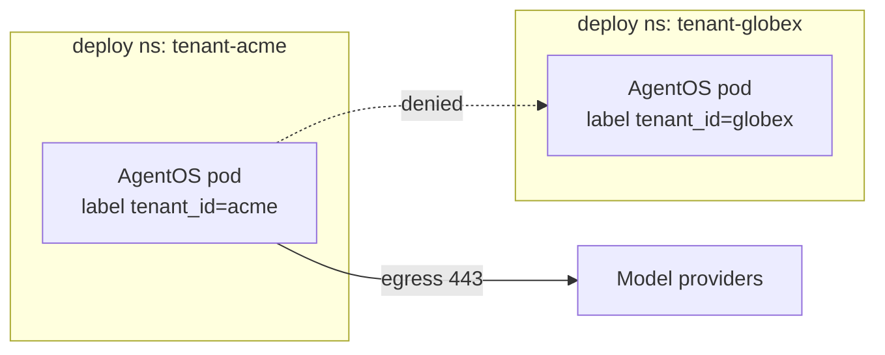
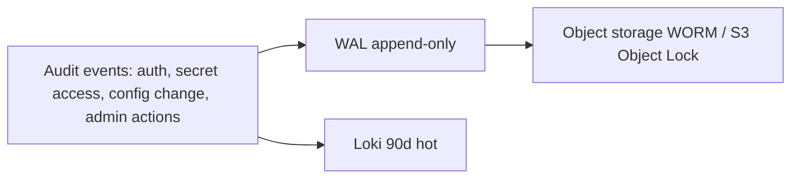
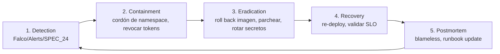

# SPEC_25_SECURITY_HARDENING

> **Propósito**: Endurecer el clúster y los workloads de yaml-agno bajo un modelo **Zero Trust**: definir Pod Security Standards (restricted), Network Policies (default-deny, segmentación por tenant y dirección), RBAC de mínimo privilegio, supply chain (Cosign + SBOM + Kyverno), gestión de secretos (ref SPEC_23), runtime security (Falco), y mapeo a frameworks de compliance (OWASP, GDPR, SOC 2, ISO 27001). Todo como política declarativa validada en admission.

---

## 0. Scope y Frontera con SPEC_19 / SPEC_23

| Aspecto | SPEC_19 (App Security) | SPEC_23 (Secrets) | SPEC_25 (Hardening) |
|---------|------------------------|--------------------|---------------------|
| Capa | API: authn/authz, JWT, scopes | Secretos: creación, rotación, ESO | Clúster: pods, red, RBAC, supply chain |
| Quién valida | FastAPI middleware | External Secrets Operator | Kubernetes admission (Kyverno/PSA) |
| Qué | "¿quién llama a la API?" | "¿dónde vive el secreto?" | "¿es seguro el pod y la red?" |

**Regla de oro**: SPEC_25 no re-implementa auth (SPEC_19) ni secretería (SPEC_23); **refuerza** que lo definido por esos SPECs se ejecute en infraestructura endurecida. Si un control lógico falta, se añade en su SPEC dueño.

```mermaid
flowchart TB
    subgraph ING[Edge]
        WAF[WAF / Rate Limit SPEC_06]
        ING[Nginx Ingress TLS 1.3]
    end

    subgraph AGN[namespace: agentos]
        POD[AgentOS Pod<br/>PSS restricted]
        SA[ServiceAccount<br/>IRSA/workload identity]
    end

    subgraph DATA[namespace: data]
        PG[(Postgres<br/>TDE + TLS)]
        RD[(Redis<br/>TLS + AUTH)]
    end

    subgraph EXT[egress controlado]
        MODEL[Model Providers<br/>egress 443]
    end

    subgraph ADM[Admission]
        KYV[Kyverno policies]
        PSA[Pod Security Admission<br/>enforce: restricted]
        COSIGN[Sigstore verify]
    end

    WAF --> ING --> POD
    POD -->|NetworkPolicy allow| PG
    POD -->|NetworkPolicy allow| RD
    POD -->|NetworkPolicy allow 443| MODEL
    POD -.->|default DENY| POD
    KYV --> POD
    PSA --> POD
    COSIGN --> POD
```

---

## 1. PRINCIPAL

yaml-agno opera bajo **Zero Trust**: ningún pod/confianza en otro por defecto, todo tráfico está cifrado y autorizado explícitamente, toda imagen está firmada y verificada, todo secreto proviene de un gestor externo, y todo acceso queda en auditoría inmutable. El hardening se entrega como **políticas declarativas** validadas en admission/deploys — no como checklists manuales.

### 1.1 Hardening dual: Cloud Run (PRIMARIO) vs Kubernetes (FUTURO)

> Per SPEC_00 §7.3, **Cloud Run es el destino PRIMARIO**; Kubernetes es FUTURO. Los controles K8s-native de §2.1-§2.6 (**Pod Security Standards, NetworkPolicy, Kyverno, Falco eBPF, RBAC de Kubernetes**) **NO existen en Cloud Run** (no hay Prometheus Operator, no hay admission controllers customizables, no hay CNI con NetworkPolicy, no hay pods persistentes para Falco). Esta subsección define los **equivalentes de hardening en Cloud Run** como destino primario. Los §2.1-§2.6 permanecen válidos para el destino K8s futuro.

| Control Zero Trust | K8s (FUTURO, §2.1-§2.6) | **Cloud Run (PRIMARIO)** equivalente |
|--------------------|--------------------------|--------------------------------------|
| Sin contenedor privileged | PSS `restricted` + Kyverno | Cloud Run **no permite privileged** por diseño; el runtime es gestionado y sandboxed. No hay flag `--privileged`. |
| Non-root | `runAsUser: 65532` (PSS) | Cloud Run ejecuta como **non-root** por defecto (UID del contenedor; SPEC_20 ya fuerza `USER 65532`). |
| ReadOnly root filesystem | `readOnlyRootFilesystem: true` | Cloud Run: `--no-cpu-boost` + `executionEnvironment` gen2; FS efímero por defecto (no persiste entre requests). |
| Capabilities drop ALL | PSS `capabilities.drop: [ALL]` | Cloud Run **ignora/limita capabilities**; no se pueden añadir. Equivalente implícito. |
| Network segmentation | `NetworkPolicy` default-deny + allowlist | **VPC connector + Serverless VPC Access**; egress controlado vía Cloud NAT + **egress settings** (`all-traffic` por VPC); allowlist de FQDN vía Cloud NAT routes / **egress-only** a model providers. Sin lateral movement (no hay red pod-to-pod). |
| RBAC least privilege | K8s `Role`/`RoleBinding`, SA | **IAM** de GCP: cada revision usa un **Service Account de GCP** con roles mínimos (`roles/run.invoker` mínimo, ningún rol de admin). Workload Identity federation para CI deploy. |
| Secretos no en env | Kyverno deny literal + ExternalSecrets | **Secret Manager** montado como archivo en `/run/secrets` (SPEC_23 contract); **nunca** en `--set-env-vars` con valor literal. |
| Imagen firmada verificada en admission | Kyverno `verifyImages` (cosign) | **Binary Authorization** con attestor cosign/Sigstore: la policy `deny` deniega desplegar revisiones cuya imagen no pase la verificación de firma. Equivalente serverless de Kyverno admission. |
| Runtime threat detection (shell/exec anómalo) | Falco eBPF | **Cloud Run no soporta eBPF ni Falco** (no hay kernel accesible). Equivalentes: **Cloud Logging audit**, **Eventarc** sobre la API de Cloud Run, y detección a nivel app (SPEC_09) + Container Analysis (vuln scan continuo). Shell/exec en distroless ya es imposible por diseño (sin shell, SPEC_20). |
| etcd encryption at rest | `EncryptionConfiguration` KMS | **CMEK** (Customer-Managed Encryption Keys) en Cloud SQL, GCS y Secret Manager; encryption at rest nativa. |
| mTLS pod-to-pod | service mesh (Linkerd/Istio) | Cloud Run expone HTTPS/TLS automáticamente (managed); entre revisiones no hay mTLS necesario (cada revision es un endpoint HTTPS). A Cloud SQL/Redis: TLS nativo del servicio gestionado. |
| Audit trail inmutable | S3 Object Lock WORM | **Cloud Logging** + export a **GCS bucket con retention policy + lock** (Bucket Lock); Cloud Audit Logs (Admin Activity = inmutable por GCP). |

**Binary Authorization como equivalente de Kyverno `require-signed-images`** (Cloud Run):

```bash
# Política: solo imágenes con atestación cosign válida pueden deployarse a Cloud Run.
gcloud container binauthz policy import policy.yaml \
  --project="${GCP_PROJECT}"

# policy.yaml (extracto)
# defaultAdmissionRule: ENFORCE
#   evaluationMode: REQUIRE_ATTESTATION
#   enforcementMode: ENFORCE_BLOCK_AND_AUDIT_LOG
# attestors: [ yaml-agno-cosign-attestor ]
# admissionRuleAdmissionRules (Cloud Run):
#   - name: "require-signed"
#     evaluationMode: REQUIRE_ATTESTATION
```

> **Sin shell = mitigation de runtime inherente**: SPEC_20 usa imagen distroless (sin `/bin/sh`). En Cloud Run esto significa que `Falco Shell Spawned in Container` (§2.6.1) es estructuralmente imposible — el control se cumple por diseño de la imagen, no por detección eBPF. Para K8s futuro se mantiene Falco como defensa en profundidad.

> **Egress a model providers**: en Cloud Run se controla vía **Serverless VPC connector** + Cloud NAT con rutas/allowlist, o **egress settings** que limitan el tráfico saliente. Equivalente funcional de las NetworkPolicies FQDN de §2.2.5.

---

## 2. SUBSECCIONES

> **@ai-directive (tenant boundary)**: K8s namespaces are a **DEPLOYMENT boundary**,
> NOT a tenant isolation boundary. Tenant isolation in yaml-agno is the **composite
> user_id** built by `resolve_user_id()` (SPEC_04) plus the **explicit `WHERE tenant_id = ?`**
> filter on every `yamlagno_*` config row (SPEC_03 §5.3). There is **no
> `tenant_id` column on any `agno_*` table** and **no namespace-per-tenant model**.
> A namespace may happen to host one tenant's workloads as a deployment choice
> (blast-radius, quota, network-segmentation convenience), but it MUST NOT be
> modelled as the tenant isolation boundary — that contract is owned by
> SPEC_03/SPEC_04. Do not model tenant-per-namespace; do not add a `tenant_id`
> label as a security boundary on pods.

### 2.1 Pod Security Standards (restricted profile)

#### 2.1.1 Política a nivel de namespace (PSA)

```yaml
apiVersion: v1
kind: Namespace
metadata:
  name: agentos
  labels:
    pod-security.kubernetes.io/enforce: restricted
    pod-security.kubernetes.io/enforce-version: latest
    pod-security.kubernetes.io/audit: restricted
    pod-security.kubernetes.io/audit-version: latest
    pod-security.kubernetes.io/warn: restricted
    pod-security.kubernetes.io/warn-version: latest
```

Todo pod que viole `restricted` es **denegado** en admission (`enforce`). Audit y warn también a `restricted` para visibilidad.

#### 2.1.2 Manifest canónico de Pod (todo workload AgentOS)

```yaml
apiVersion: apps/v1
kind: Deployment
metadata:
  name: agentos
  namespace: agentos
spec:
  template:
    spec:
      serviceAccountName: agentos-sa        # §2.3
      automountServiceAccountToken: false
      securityContext:
        # @ai-directive: 65532 is the SSOT non-root UID (matches SPEC_20 image USER 65532:65532).
        runAsNonRoot: true
        runAsUser: 65532
        runAsGroup: 65532
        fsGroup: 65532
        seccompProfile:
          type: RuntimeDefault
      containers:
        - name: agentos
          image: registry.yaml-agno.internal/agentos@sha256:<digest>   # digest, no tag
          imagePullPolicy: IfNotPresent
          securityContext:
            allowPrivilegeEscalation: false
            privileged: false
            readOnlyRootFilesystem: true
            runAsNonRoot: true
            runAsUser: 65532
            capabilities:
              drop: ["ALL"]
            seccompProfile:
              type: RuntimeDefault
          resources:
            requests: { cpu: "250m", memory: "512Mi" }
            limits: { cpu: "1", memory: "1Gi" }
          volumeMounts:
            - { name: tmp, mountPath: /tmp }
            - { name: cache, mountPath: /app/cache }
          ports:
            - { containerPort: 8000, name: http }
            - { containerPort: 9090, name: http-metrics }
      volumes:
        - name: tmp
          emptyDir: {}
        - name: cache
          emptyDir: { sizeLimit: 500Mi }
```

**Checklist restricted**:

| Control | Valor | Validado por |
|---------|-------|--------------|
| `privileged` | false | PSA + TASK_025_01 |
| `allowPrivilegeEscalation` | false | PSA |
| `runAsNonRoot` | true | PSA |
| `readOnlyRootFilesystem` | true | PSA |
| `capabilities.drop` | ALL | PSA |
| `seccompProfile` | RuntimeDefault | PSA |
| Image por digest | sha256 | Kyverno (§2.4) |
| `automountServiceAccountToken` | false | Kyverno |

---

### 2.2 Network Policies (CRÍTICO — Zero Trust)

#### 2.2.1 Default deny all (ingress + egress)

```yaml
apiVersion: networking.k8s.io/v1
kind: NetworkPolicy
metadata:
  name: default-deny-all
  namespace: agentos
spec:
  podSelector: {}            # todos los pods del namespace
  policyTypes: [Ingress, Egress]
```

A partir de este deny total, **solo** se abre lo explícitamente permitido.

#### 2.2.2 Allow Ingress → AgentOS (solo desde Ingress controller)

```yaml
apiVersion: networking.k8s.io/v1
kind: NetworkPolicy
metadata:
  name: allow-ingress-to-agentos
  namespace: agentos
spec:
  podSelector:
    matchLabels: { app.kubernetes.io/name: agentos }
  policyTypes: [Ingress]
  ingress:
    - from:
        - namespaceSelector:
            matchLabels: { kubernetes.io/metadata.name: ingress-nginx }
          podSelector:
            matchLabels: { app.kubernetes.io/name: ingress-nginx }
      ports:
        - protocol: TCP
          port: 8000
```

#### 2.2.3 Allow AgentOS → Postgres (namespace data, port 5432)

```yaml
apiVersion: networking.k8s.io/v1
kind: NetworkPolicy
metadata:
  name: allow-agentos-to-postgres
  namespace: agentos
spec:
  podSelector:
    matchLabels: { app.kubernetes.io/name: agentos }
  policyTypes: [Egress]
  egress:
    - to:
        - namespaceSelector:
            matchLabels: { kubernetes.io/metadata.name: data }
          podSelector:
            matchLabels: { app.kubernetes.io/name: postgres }
      ports:
        - { protocol: TCP, port: 5432 }
```

#### 2.2.4 Allow AgentOS → Redis (namespace data, port 6379)

```yaml
# igual estructura, podSelector postgres → redis, port 6379
```

#### 2.2.5 Allow AgentOS → Model Providers (egress 443 DNS)

```yaml
apiVersion: networking.k8s.io/v1
kind: NetworkPolicy
metadata:
  name: allow-agentos-egress-models
  namespace: agentos
spec:
  podSelector:
    matchLabels: { app.kubernetes.io/name: agentos }
  policyTypes: [Egress]
  egress:
    # DNS interno
    - to:
        - namespaceSelector: { matchLabels: { kubernetes.io/metadata.name: kube-system } }
      ports: [{ protocol: UDP, port: 53 }, { protocol: TCP, port: 53 }]
    # Model providers por FQDN (requiere Cilium o Calico con FQDN policies)
    - to:
        - ipBlock: { cidr: 0.0.0.0/0 }   # restringido por FQDN policy en Cilium
      ports: [{ protocol: TCP, port: 443 }]
```

> **Nota**: para control por FQDN (api.openai.com, api.anthropic.com) se requiere **Cilium** o **Calico Enterprise** con egress FQDN. MVP mínimo: egress 443 con allowlist de CIDNs por proveedor mantenida en Git; post-MVP migrar a FQDN policies.

#### 2.2.6 Deny lateral movement (pod-to-pod)

Ausencia de NetworkPolicy que permita `from: podSelector: {}` dentro del namespace `agentos` equivale a deny (dado el default-deny). Validado por TASK_025_02.

#### 2.2.7 Per-tenant network isolation (multi-tenant)



> **@ai-directive (deployment, not isolation)**: the namespace separation shown
> here (`tenant-acme`, `tenant-globex`) is a **deployment / blast-radius /
> network-segmentation convenience**, NOT the tenant isolation boundary. Tenant
> isolation is the composite `user_id` (SPEC_04) + explicit `WHERE tenant_id = ?`
> on `yamlagno_*` config rows (SPEC_03 §5.3). A namespace MAY host a single
> tenant's workloads, but the security contract that prevents tenant A from
> reading tenant B's config rows is the app-layer WHERE filter on the composite
> user_id — not the namespace boundary. Never model tenant-per-namespace as the
> isolation primitive; never rely on a pod `tenant_id` label as a security
> control.

Implementación: pods de tenants distintos en namespaces distintos (`tenant-acme`, `tenant-globex`) con default-deny por namespace, o mismo namespace con `NetworkPolicy` que solo permite `from` pods del mismo `tenant_id` label. Esta separación es una **decisión de despliegue** (blast-radius, cuotas, conveniencia de segmentación de red); el contrato de aislamiento de tenant real vive en SPEC_03/SPEC_04 (composite user_id + WHERE explícito en `yamlagno_*`, sin RLS nativo).

---

### 2.3 RBAC (least privilege)

#### 2.3.1 ServiceAccount por workload (no default)

```yaml
apiVersion: v1
kind: ServiceAccount
metadata:
  name: agentos-sa
  namespace: agentos
  annotations:
    # IRSA / workload identity — NO static creds
    eks.amazonaws.com/role-arn: arn:aws:iam::123456789012:role/agentos-role
automountServiceAccountToken: false
```

#### 2.3.2 Role mínima (solo lo que AgentOS necesita)

```yaml
apiVersion: rbac.authorization.k8s.io/v1
kind: Role
metadata:
  name: agentos-role
  namespace: agentos
rules:
  # Solo leer su propia config para reconfiguración en caliente
  - apiGroups: [""]
    resources: ["configmaps"]
    resourceNames: ["agentos-config"]
    verbs: ["get", "watch"]
  # NO pods, NO secrets, NO services dentro del rol de la app
---
apiVersion: rbac.authorization.k8s.io/v1
kind: RoleBinding
metadata:
  name: agentos-binding
  namespace: agentos
subjects:
  - kind: ServiceAccount
    name: agentos-sa
roleRef:
  kind: Role
  name: agentos-role
  apiGroup: rbac.authorization.k8s.io
```

#### 2.3.3 Reglas RBAC

- **ClusterRoles**: solo para controladores del plano (ArgoCD, External Secrets, Kyverno, Falco). La app AgentOS **nunca** recibe ClusterRole.
- **Sin credenciales estáticas**: IAM vía IRSA (AWS) / Workload Identity (GKE). Cero `aws_access_key_id` en env/secret.
- **`automountServiceAccountToken: false`** salvo justificación (ej: el pod habla con la API de K8s, raro en AgentOS).

---

### 2.4 Image Security & Supply Chain

#### 2.4.1 Scanning en CI (Trivy) — ref SPEC_22

```yaml
# .github/workflows/security.yml (extracto)
- name: Trivy scan
  uses: aquasecurity/trivy-action@master
  with:
    image-ref: registry.yaml-agno.internal/agentos:${{ github.sha }}
    severity: CRITICAL,HIGH
    fail-on-severity: CRITICAL
    exit-code: 1
```

Gate: pipeline **falla** si hay CRITICAL no fijado (`.trivyignore` auditable).

#### 2.4.2 Sigstore Cosign — firma de imágenes

```bash
# CI: firma con keyless (OIDC)
cosign sign --yes registry.yaml-agno.internal/agentos@sha256:$DIGEST

# Genera SBOM
syft registry.yaml-agno.internal/agentos@$DIGEST -o cyclonedx-json > sbom.cdx.json
cosign attach sbom --sbom sbom.cdx.json registry.yaml-agno.internal/agentos@$DIGEST
cosign sign --yes --attachment sbom registry.yaml-agno.internal/agentos@$DIGEST
```

#### 2.4.3 Kyverno — denegar imágenes NO firmadas (admission)

```yaml
apiVersion: kyverno.io/v1
kind: ClusterPolicy
metadata:
  name: require-signed-images
spec:
  validationFailureAction: Enforce
  webhookTimeoutSeconds: 20
  rules:
    - name: verify-signature
      match:
        resources:
          kinds: [Pod]
          namespaces: ["agentos", "tenant-*"]
      verifyImages:
        - imageReferences:
            - "registry.yaml-agno.internal/*"
          attestors:
            - entries:
                - keyless:
                    issuer: https://token.actions.githubusercontent.com
                    subject: https://github.com/yaml-agno/agentos/.github/workflows/*@refs/heads/main
          mutateDigest: true        # fuerza uso de digest
          required: true
```

Todo pod que use imagen sin firma válida → **denegado** en admission.

#### 2.4.4 SBOM verification (attestation)

```yaml
# Kyverno policy: exigir attestation SBOM
verifyImages:
  - imageReferences: ["registry.yaml-agno.internal/*"]
    attestations:
      - type: https://cyclonedx.org/bom
        attestors:
          - entries: [{ keyless: { issuer: https://token.actions.githubusercontent.com } }]
```

#### 2.4.5 Reglas de imagen

| Control | Valor |
|---------|-------|
| `imagePullPolicy` | IfNotPresent |
| Referencia por digest | sha256 (no tag mutable) |
| Registry privado | con `imagePullSecrets` (rotado via SPEC_23) |
| Imágenes base | distroless / chainguard cuando exista |
| Imágenes no firmadas | deny admission |

---

### 2.5 Secrets Security (ref SPEC_23)

| Control | Implementación |
|---------|----------------|
| Sin secretos en env vars/manifests | Kyverno deny `secret` env con valor literal |
| Fuente única | External Secrets Operator → Vault / AWS SM / GCP SM (SPEC_23) |
| etcd encryption at rest | `EncryptionConfiguration` con clave KMS |
| Rotación | `ExternalSecret.rotationPolicy` (SPEC_23) |
| Sin logging de secretos | structlog redacción (SPEC_09), test TASK_025_05 |

```yaml
# Kyverno: deny env var cuyo valor parezca secreto
apiVersion: kyverno.io/v1
kind: ClusterPolicy
metadata: { name: deny-plaintext-secrets-in-env }
spec:
  validationFailureAction: Enforce
  rules:
    - name: no-secret-env
      match: { resources: { kinds: [Pod] } }
      validate:
        message: "Secrets deben venir de ExternalSecret/SecretKeySelector, no de valor literal en env"
        pattern:
          spec:
            containers:
              - env: "?*"   # validación: ningún env[].value con patrón key/password/secret
```

---

### 2.6 Runtime Security

#### 2.6.1 Falco — detección de amenazas en runtime

```yaml
# Helm: falco + falcosidekick → alerta a Slack/Loki
falco:
  driver: { kind: ebpf }
  customRules:
    yaml-agno-rules.yaml: |-
      - rule: AgentOS Unexpected Outbound Connection
        desc: Pod AgentOS intenta conexión no a 443 de model providers
        condition: >
          evt.type=connect and container.name=agentos
          and not fd.sport in (8000, 9090)
          and not fd.sip.name in (api.openai.com, api.anthropic.com)
        output: "Unexpected connection from agentos (user=%user.name conn=%fd.name)"
        priority: WARNING
      - rule: Shell Spawned in Container
        desc: Shell abierta en contenedor de AgentOS (posible RCE)
        condition: evt.type=execve and container.name=agentos and proc.name in (bash, sh)
        output: "Shell spawned in agentos container (%proc.name)"
        priority: CRITICAL
  falcosidekick:
    enabled: true
    config:
      slack: { webhookurl_file: /etc/falco/secrets/slack-webhook }
      loki: { hostport: http://loki.monitoring.svc:3100 }
```

#### 2.6.2 seccomp / AppArmor

- `seccompProfile: RuntimeDefault` en todo pod (§2.1).
- Perfiles AppArmor custom: post-MVP; MVP usa default del runtime.

---

### 2.7 Compliance Frameworks

#### 2.7.1 OWASP Top 10 mapping

| OWASP LLM/App Top 10 | Control yaml-agno |
|----------------------|-------------------|
| LLM01 Prompt Injection | SPEC_16 guardrails, HITL |
| LLM02 Insecure Output | output validation Pydantic (SPEC_02) |
| LLM03 Training Data Poisoning | out of scope (no entrenamos) |
| LLM04 Model DoS | rate limit SPEC_06, quotas |
| LLM05 Supply Chain | Cosign + SBOM + Trivy (§2.4) |
| LLM06 Sensitive Disclosure | PII guardrails SPEC_16, redacción logs |
| LLM07 Insecure Plugin Design | tool sandboxing SPEC_11, allowlist |
| LLM08 Excessive Agency | least privilege RBAC (§2.3), scopes SPEC_19 |
| LLM09 Overreliance | HITL aprobaciones SPEC_16 |
| LLM10 Model Theft | egress FQDN, audit logging |

#### 2.7.2 GDPR

| Requisito | Implementación |
|-----------|----------------|
| Residencia de datos | tenant → región (Postgres regional, SPEC_03) |
| Derecho al olvido | borrado en cascada tenant_id (SPEC_16) |
| Minimización | solo PII necesaria, clasificación de datos (§2.8) |
| Portabilidad | export JSON por tenant |
| DPA / sub-procesadores | registro de model providers como sub-procesadores |
| Breach notification | incident response (§2.13), 72h |

#### 2.7.3 SOC 2

| Control SOC 2 | Implementación |
|---------------|----------------|
| Audit logging (CC) | trail inmutable (§2.11) → Loki (90d+ enterprise) |
| Access control (CC6) | SSO OIDC (SPEC_19), RBAC least privilege |
| Encryption (CC6.1) | at rest + in transit (§2.8) |
| Change management (CC8) | GitOps, PR review, firma de imágenes |
| Incident response (CC7) | plan §2.13 |
| Monitoring (CC7.2) | SPEC_24 stack |

#### 2.7.4 ISO 27001

Mapeo A.5–A.18 a controles anteriores: A.8 (assets) → inventario SBOM; A.9 (access) → RBAC §2.3; A.10 (crypto) → §2.8; A.12 (ops) → SPEC_24 monitoring; A.16 (incident) → §2.13. Detalle del Statement of Applicability: TBD en calibración.

---

### 2.8 PII / Data Protection (ref SPEC_16)

| Control | Implementación |
|---------|----------------|
| Encryption at rest (DB) | Postgres TDE (pgcrypto column-level para PII) + EBS/gp3 encryption |
| Volume encryption | StorageClass encrypted (KMS) |
| Encryption in transit | TLS 1.3 everywhere (ingress, pod-to-pod mTLS via service mesh/Linkerd, DB TLS) |
| Data classification | labels: `public`, `internal`, `confidential`, `restricted` (PII) |
| Retention policies | por tenant tier (SPEC_03), logs Loki (SPEC_24) |
| Field-level encryption | columnas PII cifradas con clave por tenant |

---

### 2.9 DDoS Protection

| Capa | Control | Ref |
|------|---------|-----|
| Edge | WAF (AWS WAF / Cloudflare) | — |
| Edge | Rate limiting global | SPEC_06 |
| CDN | estáticos cacheados | — |
| App | rate limit per-tenant | SPEC_06 (Redis token bucket) |
| Model | quotas + circuit breaker | SPEC_14 |

---

### 2.10 Vulnerability Management

| Actividad | Herramienta | Cadencia | Gate |
|-----------|-------------|----------|------|
| Image scan | Trivy | cada build (CI) | CRITICAL fail |
| Cluster benchmark | kube-bench (CIS) | semanal | score < umbral alerta |
| Cluster attacker view | kube-hunter | semanal | high findings alerta |
| CVE patching | Renovate/Dependabot | continuo | SLA por severidad |
| Runtime CVE | Falco + Trivy operator | continuo | — |

**CVE Patching SLA**:

| Severidad | SLA fix |
|-----------|---------|
| Critical (CVSS ≥ 9) | 7 días |
| High (7–8.9) | 30 días |
| Medium (4–6.9) | 90 días |
| Low (< 4) | próxima release |

---

### 2.11 Security Audit Trail (inmutabilidad)



- Todo evento de acceso (`who`, `what`, `when`, `from`) se registra (SPEC_19 auth + Kyverno admission events).
- Append-only: S3 Object Lock (Compliance mode) o bucket WORM.
- Hot query: Loki 90 días (enterprise).
- Quién hizo qué: join `user_id` (SPEC_19) con eventos de Kyverno/Kubernetes audit.

---

### 2.12 Penetration Testing Checklist

Checklist mínimo (ejecutar pre-go-live y trimestral):

- [ ] Reconocimiento: exposición de puertos, servicios públicos.
- [ ] Auth bypass: JWT forging, token replay (SPEC_19).
- [ ] IDOR: acceso cross-tenant (tenant_id manipulation).
- [ ] Prompt injection: LLM01 (SPEC_16).
- [ ] Container escape: intento de privileged pod (debe ser denegado).
- [ ] Lateral movement: pod-to-pod (debe ser bloqueado por NP).
- [ ] Secret leakage: dump de env, acceso a Secret API.
- [ ] Supply chain: desplegar imagen sin firma (debe ser denegada).
- [ ] DDoS: ráfaga de requests (debe activar rate limit).
- [ ] Runtime: ejecutar shell en contenedor (Falco CRITICAL).

---

### 2.13 Incident Response Plan



| Fase | Acciones | Owner | Herramienta |
|------|----------|-------|-------------|
| Detection | alerta Falco/Alertmanager se dispara | on-call | SPEC_24 |
| Containment | namespace cordoned, pods en cuarentena, revocación de tokens JWT (SPEC_19) | on-call SRE | kubectl, IdP |
| Eradication | rollback imagen (ArgoCD), rotar secretos (SPEC_23), parchear CVE | SRE + Security | ArgoCD, ESO |
| Recovery | re-deploy, validar SLO recuperado, cerrar alertas | SRE | SPEC_24 |
| Postmortem | blameless, dentro de 5 días hábiles, acción → runbook/policy | team | Git |

**Notificación de breach (GDPR)**: si afecta datos personales, notificar autoridad en **72h**; comunicación a afectados según riesgo.

---

## 3. BEHAVIOR DELTA BDD (Gherkin)

```cucumber
Feature: Security Hardening enforced
  As a Security architect
  I want controls to be enforced in admission
  So that Zero Trust is guaranteed without relying on manual discipline

  # --- Supply chain ---
  Scenario: Unsigned Cosign image is denied at admission
    Given a deployment with image "registry/agentos:v1.2.3" that is NOT signed
    When the manifest is applied in namespace agentos
    Then Kyverno policy "require-signed-images" denies the Pod
    And the event lands in the audit trail with reason "signature verification failed"

  Scenario: Signed image with SBOM is admitted
    Given an image signed by GitHub OIDC with a CycloneDX SBOM attestation
    When the manifest is applied
    Then the Pod is admitted and rewritten to a digest reference

  # --- Network policies ---
  Scenario: Network policy blocks lateral movement
    Given two "agentos" pods in namespace agentos with default-deny-all
    When pod A tries to connect to pod B on port 8000
    Then the connection is denied (no allow NetworkPolicy)

  Scenario: AgentOS can reach Postgres but not another tenant's Redis
    Given NetworkPolicy allow-agentos-to-postgres is applied
    When AgentOS connects to postgres.data.svc:5432
    Then the connection is allowed
    But when AgentOS tries to connect to redis in namespace tenant-globex
    Then the connection is denied

  # --- Pod Security ---
  Scenario: PSS restricted forbids a privileged pod
    Given namespace agentos with enforce=restricted
    When a Pod with securityContext.privileged=true is applied
    Then the Pod is rejected by Pod Security Admission
    And the message cites the violated restricted policy

  Scenario: Pod with readOnlyRootFilesystem=true and drop ALL is admitted
    Given a Pod compliant with the entire restricted profile
    When it is applied
    Then the Pod is admitted

  # --- Secrets ---
  Scenario: Literal secret in env var is denied
    Given a Pod with env var "API_KEY" with a literal value
    When Kyverno policy deny-plaintext-secrets-in-env evaluates
    Then the Pod is denied
    And the message requires using ExternalSecret/SecretKeySelector

  # --- RBAC ---
  Scenario: AgentOS ServiceAccount cannot list pods in the namespace
    Given ServiceAccount agentos-sa with Role agentos-role (configmaps get only)
    When agentos-sa runs "kubectl get pods"
    Then the API responds 403 Forbidden

  # --- Runtime ---
  Scenario: Falco detects a shell spawned in the AgentOS container
    Given Falco deployed with the "Shell Spawned in Container" rule
    When an attacker runs "sh" inside the agentos container
    Then Falco emits a CRITICAL alert
    And the event reaches Loki with CRITICAL priority

  # --- Audit trail ---
  Scenario: Every administrative action lands in an immutable trail
    Given S3 Object Lock in Compliance mode on the audit bucket
    When an administrator rotates a secret
    Then the event is written to the trail
    And the object CANNOT be deleted or overwritten before retention
```

---

## 4. TDD MICRO-TASK

### TASK_025_01 — PSSValidator
- **File**: `tools/security/validate_pod_security.py`
- **Test**: `tests/security/test_pss_validator.py`
- **RED**: pod con `privileged:true` → fail; pod con `runAsNonRoot:false` → fail; pod fully compliant → pass; pod sin `capabilities.drop: ALL` → fail.
- **GREEN**: parser de Pod manifiesto que aplica las 7 verificaciones del checklist §2.1.2 y reporta violaciones.
- **Commit**: `feat(security): PSS restricted profile validator`

### TASK_025_02 — NetworkPolicyChecker
- **File**: `tools/security/check_network_policies.py`
- **Test**: `tests/security/test_network_policy_checker.py`
- **RED**: namespace sin default-deny → fail; NP que permite `from: podSelector: {}` (lateral) → fail; NP sin `namespaceSelector` hacia data → warning; configuración correcta → pass.
- **GREEN**: analizador de NPs que valida el modelo Zero Trust de §2.2.
- **Commit**: `feat(security): zero-trust network policy checker`

### TASK_025_03 — ImageSignatureVerifier
- **File**: `tools/security/verify_image_signatures.py`
- **Test**: `tests/security/test_image_signature_verifier.py`
- **RED**: imagen sin firma → fail; imagen firmada por issuer no permitido → fail; imagen firmada por GitHub OIDC correcto → pass; imagen referenciada por tag (no digest) → warning.
- **GREEN**: wrapper de `cosign verify` + `cosign verify-attestation SBOM` con allowlist de issuers.
- **Commit**: `feat(security): cosign signature + SBOM attestation verifier`

### TASK_025_04 — RBACAuditor
- **File**: `tools/security/audit_rbac.py`
- **Test**: `tests/security/test_rbac_auditor.py`
- **RED**: Role con `resources: ["*"]` o `verbs: ["*"]` → fail; ClusterRoleBinding a ServiceAccount de app → fail; SA con `automountServiceAccountToken: true` sin justificación → warning; Role mínima → pass.
- **GREEN**: auditor de Role/RoleBinding/ClusterRole que detecta sobre-permisos.
- **Commit**: `feat(security): least-privilege RBAC auditor`

### TASK_025_05 — ComplianceChecker
- **File**: `tools/security/check_compliance.py`
- **Test**: `tests/security/test_compliance_checker.py`
- **RED**: dado inventario, reporta gaps vs OWASP LLM Top 10 / SOC 2 / ISO 27001 (mapeos §2.7); gap sin control → fail con referencia.
- **GREEN**: generador de matriz de compliance (control → evidencia → status).
- **Commit**: `feat(security): compliance matrix checker (OWASP/SOC2/ISO27001)`

### TASK_025_06 — SecretExposureScanner
- **File**: `tools/security/scan_secret_exposure.py`
- **Test**: `tests/security/test_secret_exposure_scanner.py`
- **RED**: Pod con `env.value` matching patrones `(?i)(password|secret|key|token)` → fail; secreto via `valueFrom.secretKeyRef` → pass; secreto via ExternalSecret → pass.
- **GREEN**: scanner de manifiestos que detecta secretos literales (alineado con Kyverno §2.5).
- **Commit**: `feat(security): plaintext secret exposure scanner`

### TASK_025_07 — KyvernoPolicyTestHarness
- **File**: `tools/security/test_kyverno_policies.py`
- **Test**: `tests/security/test_kyverno_harness.py`
- **RED**: feed de manifiestos Pods (maliciosos + compliant) → verificar que cada ClusterPolicy permite/deniega según lo esperado.
- **GREEN**: harness que ejecuta `kyverno apply` contra fixtures y compara con expectativas.
- **Commit**: `test(security): kyverno policy test harness with fixtures`

---

## 5. SUPUESTOS TÉCNICOS

1. **CNI con NetworkPolicy**: Calico o Cilium. FQDN egress policies (§2.2.5) requieren Cilium o Calico Enterprise; MVP mínimo con CIDN allowlist.
2. **Admission controller**: Kyverno elegido sobre OPA Gatekeeper por policies más declarativas y verifyImages nativo. Confirmable en calibración.
3. **Sigstore Cosign** con keyless (OIDC GitHub) — no claves long-lived.
4. **Falco en modo eBPF** (no se necesita device plugin en nodos modernos con kernel ≥ 5.8).
5. **etcd encryption at rest** habilitado a nivel de API server con KMS.
6. **mTLS pod-to-pod**: post-MVP vía service mesh (Linkerd/Istio). MVP: TLS solo en edge + DB.
7. **Namespace por tenant** como **decisión de despliegue / segmentación de red** (§2.2.7), NO como boundary de aislamiento de tenant. El aislamiento de tenant real es el composite `user_id` (SPEC_04) + `WHERE tenant_id = ?` explícito en `yamlagno_*` (SPEC_03); el namespace acota blast-radius y cuotas. Alternativo label-based, más complejo.
8. **Audit trail inmutable**: S3 Object Lock Compliance mode (no governance) para que ni root pueda borrar antes de retention.
9. **CVE SLA** medido desde disponibilidad de fix, no desde publicación del CVE.
10. **Trivy ignore file** (`.trivyignore`) auditado en PR; cada entrada con ticket y fecha de expiración.

---

## 6. PREGUNTAS DE CALIBRACIÓN

1. ¿**Kyverno vs OPA Gatekeeper**? Kyverno propuesto por verifyImages + policies YAML; ¿confirmar o preferencia existente por Gatekeeper/Rego?
2. ¿**Cilium vs Calico** para FQDN egress? Impacta alcance del control de egress a model providers.
3. ¿**Service mesh** (Linkerd/Istio) entra en MVP para mTLS pod-to-pod, o post-MVP con TLS solo en edge?
4. ¿**Namespace por tenant** vs **label-based** como **topología de despliegue / segmentación de red** (§2.2.7)? Namespace = más simple (blast-radius, cuotas) pero más recursos; label = más denso pero NPs más complejas. Nota: ninguna de las dos es el boundary de aislamiento de tenant — ese contrato vive en SPEC_03/SPEC_04 (composite user_id + WHERE explícito); esta pregunta es sólo sobre conveniencia operativa.
5. ¿**Postgres TDE** a nivel de cluster (EBS) basta para GDPR, o se requiere column-level (pgcrypto) para PII?
6. ¿**Keyless Cosign** (GitHub OIDC) o clave almacenada en KMS? Keyless más seguro pero acopla a CI.
7. ¿**Audit retention**: 90 días (Loki hot) + cuánto en WORM S3? SOC 2 sugiere 1 año; enterprise puede pedir más.
8. ¿**WAF managed rules**: AWS WAF, Cloudflare, o none en MVP? Costo vs protección.
9. ¿**Pen-test**: interno con checklist o externo certificado (ej. para SOC 2 Type II)?
10. ¿**GDPR residency**: ¿una región por tenant o región fija? Afecta arquitectura multi-región de SPEC_03.

---

**Dependencias hacia atrás**:
- **SPEC_19** (Security & Auth API Surface) — REQUIRED: authn/authz, scopes, JWT que este SPEC protege en infra.
- **SPEC_21** (Infra/GitOps) — REQUIRED: despliegue declarativo de policies, namespaces, admission.

**Referencias laterales**:
- **SPEC_23** (Secrets) — External Secrets, rotación, fuente única de verdad.
- **SPEC_16** (PII/HITL guardrails) — redacción, clasificación de datos, borrado.
- **SPEC_22** (CI) — Trivy scanning en pipeline, gate de CRITICAL.
- **SPEC_24** (Monitoring) — Falco → Loki, audit trail hot, alertas de seguridad.
- **SPEC_06** (API & AX) — rate limiting, DDoS edge.
- **SPEC_03** (Persistence) — multi-tenant, residencia de datos, encryption at rest DB.

**Dependencias hacia adelante**:
- Ninguna directa (SPEC_25 es capa de endurecimiento transversal). Toda feature nueva debe pasar los validadores TASK_025_01..07 en CI.
