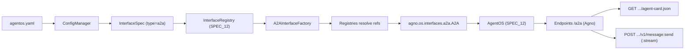
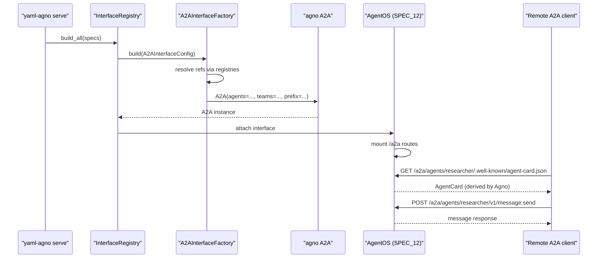

# SPEC_26_A2A_INTERFACE

> **Purpose**: Declare which agents, teams, and workflows in a yaml-agno document are publishable over the Agent-to-Agent (A2A) standard protocol, and delegate the actual protocol implementation to Agno's `A2A` interface mounted on the AgentOS control plane (SPEC_12). yaml-agno **references** the A2A protocol surface; it does NOT re-implement AgentCard resolution, the `:send`/`:stream` endpoints, or the JSON-RPC transport. The single contribution of this spec is a YAML-driven `A2AInterfaceFactory` that instantiates `agno.os.interfaces.a2a.A2A` from declarations and validates the publishable set.

---

## 1. ARCHITECTURE POSITIONING

### 1.1 What A2A is in yaml-agno

A2A is the standard inter-runtime interoperability protocol (distinct from MCP). It lets one AgentOS publish its agents/teams/workflows so that another runtime (Agno or otherwise) can discover them via an `AgentCard` and exchange messages over a well-known JSON-RPC surface. In yaml-agno, A2A is an **interface type** declared under `agentos.interfaces` and resolved by the `InterfaceRegistry` from SPEC_12.

yaml-agno's contract is narrow and intentionally so:

1. **Declare** which components are publishable (`agents`, `teams`, `workflows`).
2. **Validate** the publishable set (at least one component, all refs resolvable).
3. **Instantiate** `agno.os.interfaces.a2a.A2A` with those components.
4. **Delegate** the protocol mechanics (AgentCard derivation, endpoint mounting, `:send`/`:stream`) to Agno's interface and the AgentOS control plane.



### 1.2 Clean Architecture layers

| Layer | Component | Responsibility |
|-------|-----------|----------------|
| Domain | `A2AInterfaceConfig` (aggregate), `A2APrefix` (VO) | Validate the publishable declaration (refs, prefix, tags) |
| Ports | `A2AInterfaceFactoryPort` | Contract the adapter implements |
| Adapters | `A2AInterfaceFactory` | Resolve refs via registries, instantiate `agno.os.interfaces.a2a.A2A` |
| Infra | `agno.os.interfaces.a2a.A2A`, `a2a-sdk`, AgentOS (SPEC_12) | Protocol implementation, transport, endpoint mounting |

### 1.3 YAML-First principles (this spec)

1. The publishable set is declared in YAML; no Python is required to publish an agent over A2A.
2. yaml-agno never constructs an `AgentCard` directly — it is derived by Agno from the resolved component.
3. `A2A(...)` is instantiated exclusively inside `A2AInterfaceFactory`; never with literal kwargs elsewhere.
4. Endpoint paths are owned by Agno; yaml-agno only forwards `prefix` and `tags` and does not override route handlers.
5. A2A is one interface among many; its lifecycle is governed by the AgentOS lifespan (SPEC_12), not by a bespoke server.
6. **Two ways to publish A2A** (both native AgentOS, both supported): (a) the set-based path documented here (`agentos.interfaces[].type=a2a` -> `A2A(agents=...)`), which publishes an explicit subset; (b) the AgentOS top-level `a2a_interface=True` flag (SPEC_12 §2.13b), which publishes ALL agents/teams. yaml-agno recommends (a) for least-privilege publishing; (b) is a convenience for trusted internal deployments.

---

## 2. A2A INTERFACE API (VERIFIED)

### 2.1 Constructor

`agno.os.interfaces.a2a.A2A` subclasses `BaseInterface` (`type="a2a"`).

```python
A2A(
    agents: list[Agent | RemoteAgent | AgentProtocol] | None = None,
    teams: list[Team | RemoteTeam] | None = None,
    workflows: list[Workflow | RemoteWorkflow] | None = None,
    prefix: str = "/a2a",
    tags: list[str] | None = None,
)
```

Verified behavior:
- Accepts local `Agent`/`Team`/`Workflow` objects, `RemoteAgent`/`RemoteTeam`/`RemoteWorkflow` proxies, or `AgentProtocol` implementations.
- Requires at least one component across `agents | teams | workflows`; otherwise raises `ValueError`.
- `prefix` defaults to `"/a2a"` and namespaces all mounted A2A routes.
- `tags`: when `None`, Agno defaults to `["A2A"]` (verified, `a2a.py` line 34: `self.tags = tags or ["A2A"]`). When provided, the list is forwarded verbatim to OpenAPI route metadata.
- Requires the extra dependency `pip install a2a-sdk` (imported lazily by Agno).

### 2.2 Protocol surface (A2A SDK standard — NOT MCP)

A2A uses the A2A SDK standard JSON-RPC protocol, not MCP. The relevant `a2a.types`:

| Type | Role |
|------|------|
| `AgentCard` | Discoverable capability descriptor served at `.well-known/agent-card.json` |
| `AgentSkill` | A capability advertised within an `AgentCard` |
| `AgentCapabilities` | Flags such as `streaming`, `pushNotifications` |

### 2.3 Mounted endpoints (owned by Agno)

The `A2A` interface, once attached to AgentOS, mounts these route groups under `prefix`:

| Method | Path | Purpose | RBAC (AgentOS) |
|--------|------|---------|----------------|
| `GET` | `/{prefix}/agents/{id}/.well-known/agent-card.json` | Serve the `AgentCard` for agent `id` | **EXEMPT** (public discovery, see §2.4) |
| `POST` | `/{prefix}/agents/{id}/v1/message:send` | Send a message to agent `id` (non-streaming) | enforced (agent/team/workflow run scope) |
| `POST` | `/{prefix}/agents/{id}/v1/message:stream` | Stream a message exchange with agent `id` | enforced (agent/team/workflow run scope) |
| (replica) | `/{prefix}/teams/{id}/...` | Team variants of the above | enforced (except agent-card.json) |
| (replica) | `/{prefix}/workflows/{id}/...` | Workflow variants of the above | enforced (except agent-card.json) |

yaml-agno does not implement these handlers. It only ensures the underlying objects exist so Agno can mount them.

### 2.4 agent-card.json RBAC exemption contract

> @ai-directive (Wave audit ask): The `GET .../{id}/.well-known/agent-card.json`
> endpoint is **intentionally PUBLIC** in Agno. Verified in
> `agno/os/interfaces/a2a/router.py`: the `get_agent_card` / `get_team_card` /
> `get_workflow_card` handlers are registered WITHOUT a
> `Depends(require_resource_access(...))` dependency, whereas the `:send` and
> `:stream` handlers carry resource-access guards.

This is the A2A standard discovery contract: a runtime MUST be able to fetch a
peer's `AgentCard` without authenticating, so it can decide whether and how to
message that peer. The card advertises **capabilities** (streaming, skills),
not user data — it carries no PII and no session content. Therefore:

1. yaml-agno does NOT add an RBAC guard on `agent-card.json`.
2. The card's `name`, `description`, and `skills` are derived from the
   published component's metadata — architects must treat these as
   **publishable, non-sensitive** attributes. Do not put secrets or PII in
   agent/team/workflow `description` fields of A2A-published components.
3. `:send` and `:stream` remain fully RBAC-enforced (run scope required).
4. If a deployment needs discovery to be private (closed trust circle), the
   mitigation is network-level (private network / mTLS gateway), NOT a
   per-route RBAC override — that would diverge from the A2A standard and from
   Agno's verified behavior. This is documented as a calibration question
   (§12.6) rather than a yaml-agno feature.

---

## 3. DOMAIN MODEL

### 3.1 `A2AInterfaceConfig` aggregate (Pydantic V2)

```python
# yaml-agno/src/domain/interfaces/a2a_interface_config.py
from __future__ import annotations
from typing import Optional
from pydantic import BaseModel, Field, model_validator

class A2APrefix(BaseModel):
    """Value object: namespaced route prefix for A2A endpoints."""
    model_config = {"frozen": True}
    value: str = "/a2a"

    @model_validator(mode="after")
    def _must_start_with_slash(self) -> "A2APrefix":
        if not self.value.startswith("/"):
            raise ValueError("A2A prefix must start with '/'")
        return self

class A2AInterfaceConfig(BaseModel):
    """Aggregate root for an A2A interface declaration.

    yaml-agno REFERENCES the A2A protocol; it does not redefine AgentCard,
    AgentSkill, or AgentCapabilities (imported from a2a.types by Agno).
    """
    model_config = {"extra": "forbid"}

    agents: list[str] = Field(default_factory=list)      # registry refs
    teams: list[str] = Field(default_factory=list)       # registry refs
    workflows: list[str] = Field(default_factory=list)   # registry refs
    prefix: A2APrefix = Field(default_factory=A2APrefix)
    tags: Optional[list[str]] = None

    @model_validator(mode="after")
    def _at_least_one_component(self) -> "A2AInterfaceConfig":
        total = len(self.agents) + len(self.teams) + len(self.workflows)
        if total == 0:
            raise ValueError(
                "A2A interface requires at least one agent, team, or workflow"
            )
        return self

    def all_refs(self) -> dict[str, list[str]]:
        return {
            "agents": list(self.agents),
            "teams": list(self.teams),
            "workflows": list(self.workflows),
        }
```

> Note: The `ValueError` mirrors Agno's own guard on `A2A(...)`. yaml-agno fails fast at config-validation time rather than at AgentOS build time.

### 3.2 Reused types — imported, not redefined

- `InterfaceType.A2A` (SPEC_12 Section 4.1) — enum value `"a2a"`.
- `InterfaceSpec` (SPEC_12 Section 4.1) — `{type, target, config}`. For A2A, `config` carries the full `A2AInterfaceConfig` payload because A2A publishes a *set* of components, not a single `target`. The `InterfaceRegistry` recognizes `type=a2a` and routes to `A2AInterfaceFactory` instead of the single-target builders.
- `AgentCard`, `AgentSkill`, `AgentCapabilities` — referenced in documentation only; yaml-agno never instantiates them.

---

## 4. ADAPTER — `A2AInterfaceFactory`

### 4.1 Port

```python
# yaml-agno/src/ports/a2a_ports.py
from typing import Protocol, Any

class A2AInterfaceFactoryPort(Protocol):
    def build(self, config: "A2AInterfaceConfig", registries: Any) -> Any: ...
    # -> agno.os.interfaces.a2a.A2A
```

### 4.2 Implementation

```python
# yaml-agno/src/adapters/interfaces/a2a_interface_factory.py
from agno.os.interfaces.a2a import A2A
from yaml_agno.domain.interfaces.a2a_interface_config import A2AInterfaceConfig
from yaml_agno.domain.errors import A2AReferenceError

class A2AInterfaceFactory:
    """Instantiate agno.os.interfaces.a2a.A2A from a YAML declaration.

    yaml-agno only REFERENCES the A2A protocol. AgentCard derivation, the
    :send/:stream endpoints, and JSON-RPC transport are delegated to Agno.
    """

    def build(self, config: A2AInterfaceConfig, registries) -> A2A:
        agents = [registries.agents.resolve(r) for r in config.agents]
        teams = [registries.teams.resolve(r) for r in config.teams]
        workflows = [registries.workflows.resolve(r) for r in config.workflows]
        self._assert_no_missing(agents, teams, workflows, config)

        return A2A(
            agents=agents or None,
            teams=teams or None,
            workflows=workflows or None,
            prefix=config.prefix.value,
            tags=config.tags,
        )

    @staticmethod
    def _assert_no_missing(agents, teams, workflows, config) -> None:
        refs = config.all_refs()
        resolved = {
            "agents": len(agents), "teams": len(teams), "workflows": len(workflows),
        }
        for kind, declared in refs.items():
            if len(declared) != resolved[kind]:
                raise A2AReferenceError(
                    kind=kind,
                    declared=declared,
                    resolved=resolved[kind],
                )
```

### 4.3 Registry integration (SPEC_12)

`InterfaceRegistry._build_a2a` (added by this spec) handles the set-based declaration:

```python
# yaml-agno/src/adapters/agentos/interface_registry.py (extension)
def _build_a2a(self, _unused_target, cfg: dict, registries):
    # A2A publishes a SET, not a single target.
    config = A2AInterfaceConfig(**cfg)
    return A2AInterfaceFactory().build(config, registries)
```

Because A2A is set-based, the `InterfaceSpec.target` field is unused for `type=a2a` and may be omitted; the validator in SPEC_12 is extended to skip the `target` requirement when `type == "a2a"`.

---

## 5. YAML CONFIG SCHEMA

### 5.1 Minimal declaration

```yaml
agentos:
  interfaces:
    - type: a2a
      config:
        agents: [researcher, summarizer]
```

### 5.2 Full declaration

```yaml
agentos:
  interfaces:
    - type: a2a
      config:
        agents: [researcher, summarizer]
        teams: [research_team]
        workflows: [content_pipeline]
        prefix: "/a2a"
        tags: ["public", "research"]
```

### 5.3 Field reference

| Field | Type | Default | Notes |
|-------|------|---------|-------|
| `agents` | `list[str]` | `[]` | Registry refs (SPEC_02 domain) |
| `teams` | `list[str]` | `[]` | Registry refs (SPEC_05) |
| `workflows` | `list[str]` | `[]` | Registry refs (SPEC_05) |
| `prefix` | `str` | `"/a2a"` | Must start with `/`; namespaces mounted routes |
| `tags` | `list[str]` | `None` | Forwarded to OpenAPI route metadata |

### 5.4 Coexistence with other interfaces

A2A composes with AG-UI, Slack, etc. (SPEC_12 Section 4). Each interface entry is independent; the `InterfaceRegistry.build_all` iterates the list and dispatches per `type`.

```yaml
agentos:
  interfaces:
    - { type: agui, target: researcher }
    - type: a2a
      config:
        agents: [researcher, summarizer]
        teams: [research_team]
        prefix: "/a2a"
```

---

## 6. PUBLISH FLOW (REFERENCE-LEVEL)

### 6.1 Sequence



### 6.2 AgentCard derivation (delegated)

yaml-agno does NOT build the `AgentCard`. Agno derives it from the resolved `Agent`/`Team`/`Workflow` (name, description, declared skills, streaming capability). The factory's only responsibility is to hand Agno fully-resolved objects; if a ref is missing, the factory raises `A2AReferenceError` before Agno ever sees a broken card.

### 6.3 Endpoint ownership

| Concern | Owner |
|---------|-------|
| Route mounting under `prefix` | Agno `A2A` + AgentOS (SPEC_12) |
| `agent-card.json` generation | Agno |
| `:send` / `:stream` handlers | Agno |
| Authz on A2A routes | AgentOS RBAC (SPEC_12 Section 9) |
| Prefix / tags forwarding | yaml-agno (`A2AInterfaceConfig`) |

---

## 7. DEPENDENCY MANAGEMENT

### 7.1 Extra dependency

A2A requires `a2a-sdk`. yaml-agno declares it as an optional extra and surfaces a clear error if the interface is declared but the package is missing.

```toml
# pyproject.toml (excerpt)
[project.optional-dependencies]
a2a = ["a2a-sdk"]
```

### 7.2 Lazy import guard

```python
# yaml-agno/src/adapters/interfaces/a2a_interface_factory.py
def _require_a2a_sdk() -> None:
    try:
        import a2a  # noqa: F401
    except ImportError as e:  # pragma: no cover - import error path
        raise A2ADependencyError(
            "A2A interface declared but 'a2a-sdk' is not installed. "
            "Install with: pip install 'yaml-agno[a2a]'"
        ) from e
```

The factory calls `_require_a2a_sdk()` before instantiating `A2A`, so the failure is surfaced at build time with an actionable message, not as an opaque `ImportError` from Agno internals.

---

## 8. PORTS AND ADAPTERS SUMMARY

```python
# yaml-agno/src/ports/a2a_ports.py
from typing import Protocol, Any

class A2AInterfaceFactoryPort(Protocol):
    def build(self, config: "A2AInterfaceConfig", registries: Any) -> Any: ...
```

```python
# yaml-agno/src/domain/errors.py (extension)
class A2AReferenceError(Exception):
    """Raised when a declared A2A component ref cannot be resolved."""

class A2ADependencyError(Exception):
    """Raised when 'a2a-sdk' is required but not installed."""
```

---

## 9. BEHAVIOR DELTA — BDD SCENARIOS

### 9.1 Acceptance scenarios

#### Scenario 1: Publish an agent over A2A from YAML

```gherkin
Feature: A2A interface declaration
  As an architect
  I want to publish agents/teams/workflows over A2A from YAML
  So that other runtimes can discover and message them

  Scenario: Publish a single agent over A2A
    GIVEN a document "agentos.yaml" with an interface of type "a2a"
    AND config.agents = ["researcher"]
    AND the agent "researcher" is declared in the agents registry
    AND "a2a-sdk" is installed
    WHEN the InterfaceRegistry builds all interfaces
    THEN A2AInterfaceFactory resolves "researcher" to an Agent object
    AND agno.os.interfaces.a2a.A2A is instantiated with agents=[researcher]
    AND the A2A instance is attached to AgentOS
    AND routes are mounted under "/a2a"
```

#### Scenario 2: Obtain an AgentCard for a published agent

```gherkin
  Scenario: AgentCard is served at the well-known path
    GIVEN an AgentOS serving an A2A interface with agent "researcher"
    WHEN a client performs GET /a2a/agents/researcher/.well-known/agent-card.json
    THEN the response status is 200
    AND the body is a valid AgentCard derived by Agno from the resolved agent
    AND the card name matches the agent's name
```

#### Scenario 3: Send a message to a published agent

```gherkin
  Scenario: message:send invokes the published agent
    GIVEN an AgentOS serving an A2A interface with agent "researcher"
    WHEN a client POSTs to /a2a/agents/researcher/v1/message:send with a message body
    THEN the response contains the agent's reply
    AND the agent executed exactly one run
```

#### Scenario 4: At least one component required

```gherkin
  Scenario: Empty A2A declaration is rejected at validation
    GIVEN an interface of type "a2a" with config.agents, teams, and workflows all empty
    WHEN A2AInterfaceConfig is validated
    THEN validation fails with a ValueError matching "at least one agent, team, or workflow"
    AND no A2A instance is constructed
```

#### Scenario 5: Unresolvable ref fails fast

```gherkin
  Scenario: Missing registry ref surfaces A2AReferenceError
    GIVEN an interface of type "a2a" with config.agents = ["ghost"]
    AND no agent "ghost" exists in the agents registry
    WHEN A2AInterfaceFactory.build executes
    THEN A2AReferenceError is raised listing kind="agents" and declared=["ghost"]
    AND AgentOS construction aborts with no partial interface attached
```

#### Scenario 6: Custom prefix namespaces routes

```gherkin
  Scenario: Custom prefix is forwarded to A2A
    GIVEN an interface of type "a2a" with config.prefix = "/interop"
    WHEN A2A is instantiated
    THEN the A2A instance receives prefix="/interop"
    AND routes are mounted under "/interop" (not "/a2a")
```

#### Scenario 7: Missing a2a-sdk surfaces actionable error

```gherkin
  Scenario: Optional dependency missing
    GIVEN an interface of type "a2a" is declared
    AND "a2a-sdk" is NOT installed
    WHEN A2AInterfaceFactory.build executes
    THEN A2ADependencyError is raised with a message containing "pip install"
    AND no ImportError leaks from Agno internals
```

#### Scenario 8: A2A coexists with other interfaces

```gherkin
  Scenario: Multiple interfaces mounted together
    GIVEN agentos.interfaces contains an agui interface targeting "researcher"
    AND an a2a interface with agents=["researcher", "summarizer"]
    WHEN InterfaceRegistry.build_all executes
    THEN both an AGUI and an A2A instance are produced
    AND both are attached to AgentOS
    AND routes for /agui and /a2a are mounted independently
```

---

## 10. TDD MICRO-TASK EXECUTION PROTOCOL

### 10.1 Cascading task checklist

#### TASK_001: A2AInterfaceConfig aggregate
- **File**: `yaml-agno/src/domain/interfaces/a2a_interface_config.py`
- **Test**: `tests/unit/domain/test_a2a_interface_config.py`
- **RED**:
```python
import pytest
from yaml_agno.domain.interfaces.a2a_interface_config import (
    A2AInterfaceConfig, A2APrefix,
)

def test_requires_at_least_one_component():
    with pytest.raises(ValueError, match="at least one"):
        A2AInterfaceConfig()

def test_prefix_must_start_with_slash():
    with pytest.raises(ValueError, match="start with '/'"):
        A2APrefix(value="a2a")

def test_all_refs_lists_every_kind():
    cfg = A2AInterfaceConfig(agents=["a"], teams=["t"], workflows=["w"])
    assert cfg.all_refs() == {
        "agents": ["a"], "teams": ["t"], "workflows": ["w"],
    }

def test_extra_fields_forbidden():
    with pytest.raises(Exception):
        A2AInterfaceConfig(agents=["a"], unknown_field=1)
```
- **GREEN**: Implement aggregate, `A2APrefix` VO, validators.
- **Commit**: `feat(a2a): A2AInterfaceConfig aggregate with component and prefix validation`

#### TASK_002: A2AInterfaceFactory builds agno A2A
- **File**: `yaml-agno/src/adapters/interfaces/a2a_interface_factory.py`
- **Test**: `tests/unit/adapters/test_a2a_interface_factory.py`
- **RED**:
```python
def test_factory_instantiates_agno_a2a_with_resolved_refs(mocker):
    from yaml_agno.adapters.interfaces.a2a_interface_factory import A2AInterfaceFactory
    fake_a2a = mocker.patch("yaml_agno.adapters.interfaces.a2a_interface_factory.A2A")
    registries = mocker.Mock()
    registries.agents.resolve.side_effect = ["agent_obj"]
    cfg = A2AInterfaceConfig(agents=["researcher"], prefix=A2APrefix(value="/a2a"))

    A2AInterfaceFactory().build(cfg, registries)

    fake_a2a.assert_called_once()
    kwargs = fake_a2a.call_args.kwargs
    assert kwargs["agents"] == ["agent_obj"]
    assert kwargs["teams"] is None
    assert kwargs["prefix"] == "/a2a"

def test_factory_raises_on_unresolvable_ref(mocker):
    fake_a2a = mocker.patch("yaml_agno.adapters.interfaces.a2a_interface_factory.A2A")
    registries = mocker.Mock()
    registries.agents.resolve.side_effect = KeyError("ghost")
    cfg = A2AInterfaceConfig(agents=["ghost"])
    import pytest
    from yaml_agno.domain.errors import A2AReferenceError
    with pytest.raises(A2AReferenceError):
        A2AInterfaceFactory().build(cfg, registries)
    fake_a2a.assert_not_called()
```
- **GREEN**: Resolve refs via registries, assert none missing, instantiate `A2A`.
- **Commit**: `feat(a2a): A2AInterfaceFactory resolves refs and instantiates agno A2A`

#### TASK_003: a2a-sdk dependency guard
- **File**: `yaml-agno/src/adapters/interfaces/a2a_interface_factory.py`
- **Test**: `tests/unit/adapters/test_a2a_dependency_guard.py`
- **RED**:
```python
import sys
import pytest

def test_missing_sdk_raises_actionable_error(mocker):
    mocker.patch.dict(sys.modules, {"a2a": None})
    from yaml_agno.adapters.interfaces.a2a_interface_factory import _require_a2a_sdk
    from yaml_agno.domain.errors import A2ADependencyError
    with pytest.raises(A2ADependencyError, match="pip install"):
        _require_a2a_sdk()
```
- **GREEN**: `_require_a2a_sdk()` wraps the import and raises `A2ADependencyError`.
- **Commit**: `feat(a2a): lazy a2a-sdk import guard with actionable error`

#### TASK_004: InterfaceRegistry dispatch for type=a2a
- **File**: `yaml-agno/src/adapters/agentos/interface_registry.py` (extension)
- **Test**: `tests/unit/adapters/test_interface_registry_a2a.py`
- **RED**:
```python
def test_a2a_dispatch_uses_factory_not_single_target(mocker):
    from yaml_agno.adapters.agentos.interface_registry import InterfaceRegistry
    from yaml_agno.domain.agentos.interface_spec import InterfaceSpec
    factory = mocker.patch(
        "yaml_agno.adapters.interfaces.a2a_interface_factory.A2AInterfaceFactory"
    )
    reg = InterfaceRegistry()
    spec = InterfaceSpec(type="a2a", target=None, config={"agents": ["a"]})
    reg.build_all([spec], fake_registries)
    factory.return_value.build.assert_called_once()

def test_target_optional_for_a2a():
    # InterfaceSpec validator must skip the target requirement when type=a2a.
    from yaml_agno.domain.agentos.interface_spec import InterfaceSpec
    spec = InterfaceSpec(type="a2a", config={"agents": ["a"]})
    assert spec.type.value == "a2a"
```
- **GREEN**: Extend `InterfaceSpec` validator (skip `target` for a2a), add `_build_a2a`.
- **Commit**: `feat(a2a): InterfaceRegistry dispatches set-based A2A declaration`

#### TASK_005: Prefix forwarding and tags
- **File**: `yaml-agno/src/adapters/interfaces/a2a_interface_factory.py`
- **Test**: `tests/unit/adapters/test_a2a_prefix_tags.py`
- **RED**:
```python
def test_prefix_and_tags_forwarded(mocker):
    fake_a2a = mocker.patch("yaml_agno.adapters.interfaces.a2a_interface_factory.A2A")
    cfg = A2AInterfaceConfig(
        agents=["a"], prefix=A2APrefix(value="/interop"), tags=["public"]
    )
    A2AInterfaceFactory().build(cfg, fake_registries)
    kwargs = fake_a2a.call_args.kwargs
    assert kwargs["prefix"] == "/interop"
    assert kwargs["tags"] == ["public"]
```
- **GREEN**: Forward `prefix.value` and `tags` from the aggregate.
- **Commit**: `feat(a2a): forward prefix and tags to agno A2A`

---

## 11. ASSUMPTIONS

### [Decision 1] REFERENCIAR, not re-implement, the protocol
**Justification**: yaml-agno builds ON TOP of Agno. AgentCard derivation, the `:send`/`:stream` handlers, and JSON-RPC transport are stable, tested surfaces in Agno. Re-implementing them would duplicate logic and drift from upstream. yaml-agno's contribution is the YAML declaration and ref resolution only.

### [Decision 2] A2A is set-based, not single-target
**Justification**: Unlike AG-UI/Slack/WhatsApp/Telegram (one `target`), `A2A(agents=..., teams=..., workflows=...)` publishes a set. `InterfaceSpec.target` is therefore unused for `type=a2a`; the full declaration lives in `config`. The `InterfaceRegistry` is extended to recognize this asymmetry.

### [Decision 3] Fail fast at config validation, not at AgentOS build
**Justification**: Mirroring Agno's own `ValueError` guard inside `A2AInterfaceConfig` surfaces empty declarations during YAML load, before any registry resolution. This keeps errors localized and messages structured.

### [Decision 4] a2a-sdk as an optional extra
**Justification**: A2A is not needed by every deployment. Declaring it as an optional extra keeps the base install lean; the lazy import guard converts an opaque `ImportError` into an actionable `A2ADependencyError`.

### [Decision 5] Prefix and tags are forwarded, never overridden
**Justification**: Endpoint ownership belongs to Agno. yaml-agno only forwards `prefix` (default `"/a2a"`) and `tags`; it never registers custom route handlers under the A2A prefix.

### [Decision 6] RBAC on A2A routes is owned by AgentOS
**Justification**: A2A routes are mounted through AgentOS, so authorization (SPEC_12 Section 9 / SPEC_19) applies uniformly. yaml-agno adds no A2A-specific auth layer.

---

## 12. CALIBRATION QUESTIONS

### [Question 1] RemoteAgent / RemoteTeam discovery
**Should yaml-agno declare `RemoteAgent`/`RemoteTeam` proxies in YAML (peer runtime URLs) in addition to local components, and if so, what is the YAML shape for a remote ref?**
Implication: local refs resolve through registries; remote refs need a URL + auth. If supported, the factory must accept `RemoteAgent(...)` objects, not just local `Agent`. MVP limits declarations to local refs; remote discovery is deferred.

### [Question 2] AgentCard overrides
**Should yaml-agno allow overriding derived AgentCard fields (name, description, skills) from YAML, or always trust the resolved component?**
Implication: overrides require yaml-agno to construct/patch an `AgentCard`, which crosses the "reference, don't re-implement" boundary. MVP trusts Agno's derivation; overrides are post-MVP.

### [Question 3] Dedicated prefix per published component
**Should each published agent get its own sub-prefix (e.g. `/a2a/researcher`), or share the single `prefix` namespace with `{id}` path params?**
Implication: shared namespace matches Agno's `{id}` route design (verified). MVP adopts the shared namespace; per-component prefixes are not modeled.

### [Question 4] Streaming as opt-in per component
**Is the `streaming` capability derived from the component, or declared per-A2A-interface?**
Implication: Agno derives `AgentCapabilities.streaming` from the component. MVP does not model a YAML override; the `:stream` endpoint availability follows the derived capability.

### [Question 5] Health/readiness exposure of the A2A surface
**Should `/health` (SPEC_12 Section 8.4) report the count of published A2A components, or stay agnostic of interfaces?**
Implication: surfacing A2A counts aids ops but couples health to interface specifics. MVP keeps `/health` interface-agnostic; an optional `/a2a/.well-known/status` may be added later.

### [Question 6] Private A2A discovery (closed trust circle)
**The `agent-card.json` endpoint is PUBLIC by the A2A standard (§2.4). If a deployment needs discovery to be private, what is the supported mitigation?**
Implication: a per-route RBAC override would diverge from the A2A standard and from Agno's verified behavior. The supported mitigation is network-level (private network, mTLS gateway, or IP allowlist at the edge), NOT a yaml-agno authz flag on the card endpoint. This question is recorded to prevent a future "just add authz to agent-card.json" request that would break interop.
