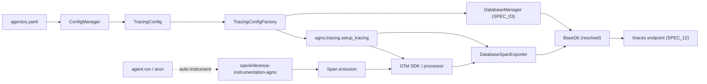
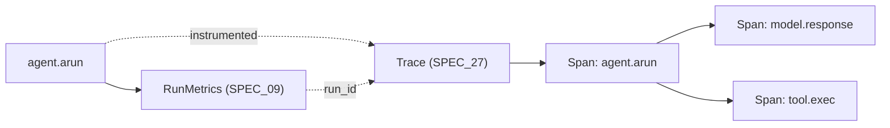
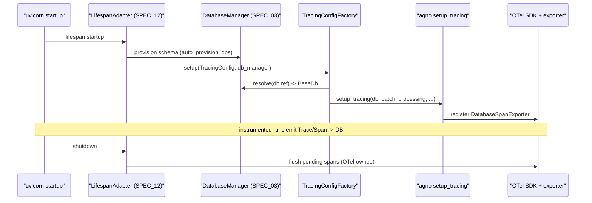
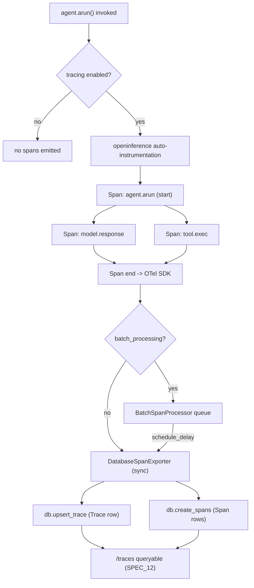

# SPEC_27_TRACING_ARCHITECTURE

> **Purpose**: Expose a YAML-driven tracing configuration that delegates to Agno's `setup_tracing` and persists structured distributed traces (`Trace`/`Span`) via the `DatabaseSpanExporter` to the AgentOS database. yaml-agno **references** the OpenTelemetry-standard tracing pipeline owned by Agno (instrument → export → persist); it does NOT re-implement the OTel SDK, the `openinference-instrumentation-agno` auto-instrumentation, or the `Trace`/`Span` schemas. The single contribution of this spec is a `TracingConfigFactory` that calls `setup_tracing` with YAML-resolved parameters and a clear frontier against SPEC_09's inline run metrics.

---

## 1. ARCHITECTURE POSITIONING

### 1.1 What tracing is in yaml-agno

Tracing is the post-hoc, structured, distributed-trace capability built on OpenTelemetry semantics and the OpenInference instrumentation for Agno. Where SPEC_09 captures *inline, per-execution metrics* (e.g. `RunMetrics` embedded in `RunOutput`, token counts, latency on the request path), SPEC_27 captures *structured `Trace`/`Span` trees persisted to the database* for later inspection, correlation, and analysis.

yaml-agno's contract is deliberately narrow:

1. **Declare** whether tracing is enabled, which DB it writes to, and the batching policy.
2. **Resolve** the DB reference (SPEC_03) into a live `BaseDb`.
3. **Delegate** to `agno.tracing.setup_tracing(db, batch_processing, batch_sizes...)`.
4. **Reference** the `Trace`/`Span` schemas (not redefine them) for documentation and the `/traces` endpoint.
5. **Correlate** `trace_id` with logs (SPEC_24) and inline metrics (SPEC_09) by shared identifiers.



### 1.2 Clean Architecture layers

| Layer | Component | Responsibility |
|-------|-----------|----------------|
| Domain | `TracingConfig` (aggregate), `BatchSettings` (VO) | Validate the tracing declaration (enabled, db ref, batch bounds) |
| Ports | `TracingConfigFactoryPort` | Contract the adapter implements |
| Adapters | `TracingConfigFactory` | Resolve DB ref, call `setup_tracing`, no-op when disabled |
| Infra | `agno.tracing.setup_tracing`, `DatabaseSpanExporter`, OTel SDK, `openinference-instrumentation-agno`, `BaseDb` | Protocol, instrumentation, persistence |

### 1.3 YAML-First principles (this spec)

1. Tracing is declared in YAML (`agentos.tracing`); no Python is needed to enable it.
2. yaml-agno never constructs a `Span`, a `Trace`, or an OTel exporter directly — `setup_tracing` does.
3. The DB is referenced by string (`db: postgres_primary`) and resolved by the `DatabaseManager` (SPEC_03); yaml-agno never opens a connection itself.
4. Batching parameters map 1:1 to `setup_tracing` arguments; no invented knobs.
5. When `enabled=false`, the factory is a no-op that emits a single INFO log; no exporter is registered.

---

## 2. AGNO TRACING API (VERIFIED)

### 2.1 `setup_tracing`

```python
agno.tracing.setup_tracing(
    db: BaseDb,
    batch_processing: bool = False,
    max_queue_size: int = 2048,
    max_export_batch_size: int = 512,
    schedule_delay_millis: int = 5000,
) -> None
```

Verified behavior:
- Registers a custom OTel `SpanExporter` (`DatabaseSpanExporter`) backed by `db`.
- `batch_processing=False` → spans are exported synchronously (simplest, higher per-request cost).
- `batch_processing=True` → spans are buffered and flushed by a `BatchSpanProcessor` governed by `max_queue_size`, `max_export_batch_size`, and `schedule_delay_millis`.
- Returns `None`; side-effecting global OTel registration.
- Must be called once at startup (lifespan), before any instrumented run executes.

### 2.2 `DatabaseSpanExporter`

`agno.tracing.DatabaseSpanExporter(db)` is a custom OTel `SpanExporter` that persists spans via the database:

| DB method | Purpose |
|-----------|---------|
| `db.upsert_trace(...)` | Insert/update the parent `Trace` row (totals, status, ids) |
| `db.create_spans(...)` | Bulk-insert the `Span` rows belonging to a trace |

### 2.3 Schemas (referenced, not redefined)

`agno.tracing` defines (yaml-agno imports/imports-for-docs only):

**`Trace`**
| Field | Type | Notes |
|-------|------|-------|
| `total_spans` | `int` | Count of spans in the trace |
| `error_count` | `int` | Number of spans in error status |
| `status` | `str` | Aggregate trace status |
| `run_id` | `str \| None` | Correlation with the run |
| `session_id` | `str \| None` | Agno session |
| `user_id` | `str \| None` | Agno user |
| `agent_id` | `str \| None` | Source agent |
| `team_id` | `str \| None` | Source team |
| `workflow_id` | `str \| None` | Source workflow |

**`Span`**
| Field | Type | Notes |
|-------|------|-------|
| `span_id` | `str` | Unique span id |
| `trace_id` | `str` | Parent trace id |
| `parent_span_id` | `str \| None` | Tree linkage |
| `name` | `str` | Span name (e.g. `agent.run`, `model.response`) |
| `span_kind` | `str` | OTel span kind |
| `status_code` | `str` | OTel status |
| `duration_ms` | `int` | Wall-clock duration |
| `attributes` | `dict` | OTel/OpenInference attributes |

### 2.4 Auto-instrumentation

Instrumentation is provided by `openinference-instrumentation-agno`, which captures (without yaml-agno writing any instrumentation code):

| Surface | Captured span name (illustrative) |
|---------|-----------------------------------|
| Agent run | `agent.run` / `agent.arun` |
| Model response | `model.response` |
| Tool execution | tool invocation spans |
| Team coordination | team coordination spans |
| Workflow steps | workflow step spans |

---

## 3. FRONTIER WITH SPEC_09 (CRITICAL)

### 3.1 Division of responsibility

| Aspect | SPEC_09 (inline metrics) | SPEC_27 (distributed tracing) |
|--------|--------------------------|-------------------------------|
| Timing | Inline, on the request path | Post-hoc, structured |
| Shape | `RunMetrics` in `RunOutput` | `Trace`/`Span` OTel trees |
| Storage | Carried in run output / metrics endpoints | Persisted to DB via `DatabaseSpanExporter` |
| Granularity | Per-run aggregate (tokens, latency) | Per-span tree (agent, model, tool, team, workflow) |
| Owner | yaml-agno `ObservabilityManager` | Agno `setup_tracing` + OTel SDK |
| Correlation key | `run_id` | `run_id`, `session_id`, `trace_id` |

### 3.2 Correlation contract

The two layers share `run_id` (and `session_id`/`user_id`). A run that produces `RunMetrics` (SPEC_09) also produces a `Trace` whose `run_id` matches, so an operator can pivot from an inline metric spike to the full span tree and back. yaml-agno does not synthesize this correlation — it is a property of Agno's instrumentation — but documents it as the integration contract.



---

## 4. DOMAIN MODEL

### 4.1 `TracingConfig` aggregate (Pydantic V2)

```python
# yaml-agno/src/domain/tracing/tracing_config.py
from __future__ import annotations
from typing import Optional
from pydantic import BaseModel, Field, model_validator

class BatchSettings(BaseModel):
    """Value object: OTel BatchSpanProcessor tuning.

    Maps 1:1 to setup_tracing args. No invented knobs.
    """
    model_config = {"extra": "forbid"}

    max_queue_size: int = 2048
    max_export_batch_size: int = 512
    schedule_delay_millis: int = 5000

    @model_validator(mode="after")
    def _positive_bounds(self) -> "BatchSettings":
        if self.max_queue_size <= 0:
            raise ValueError("max_queue_size must be positive")
        if self.max_export_batch_size <= 0:
            raise ValueError("max_export_batch_size must be positive")
        if self.max_export_batch_size > self.max_queue_size:
            raise ValueError(
                "max_export_batch_size must not exceed max_queue_size"
            )
        if self.schedule_delay_millis < 0:
            raise ValueError("schedule_delay_millis must be non-negative")
        return self

class TracingConfig(BaseModel):
    """Aggregate root for the tracing declaration.

    yaml-agno REFERENCES the OTel-standard tracing pipeline owned by Agno.
    Trace/Span schemas are NOT redefined here (see SPEC_27 Section 2.3).
    """
    model_config = {"extra": "forbid"}

    enabled: bool = False
    db: Optional[str] = None                 # ref -> DatabaseManager (SPEC_03)
    batch_processing: bool = False
    batch: BatchSettings = Field(default_factory=BatchSettings)

    @model_validator(mode="after")
    def _db_required_when_enabled(self) -> "TracingConfig":
        if self.enabled and not self.db:
            raise ValueError(
                "Tracing is enabled but no 'db' is configured; "
                "set agentos.tracing.db to a database ref"
            )
        return self

    def to_setup_kwargs(self) -> dict:
        """Produce kwargs for agno.tracing.setup_tracing.

        The resolved BaseDb is injected by TracingConfigFactory AFTER
        DatabaseManager resolution; it is NOT part of this dict.
        """
        return {
            "batch_processing": self.batch_processing,
            "max_queue_size": self.batch.max_queue_size,
            "max_export_batch_size": self.batch.max_export_batch_size,
            "schedule_delay_millis": self.batch.schedule_delay_millis,
        }
```

### 4.2 Reused types — imported, not redefined

- `BaseDb` (SPEC_03) — the live DB object resolved by `DatabaseManager`.
- `Trace`, `Span` — referenced in documentation and the `/traces` endpoint contract; yaml-agno never instantiates them.
- `DatabaseSpanExporter`, `setup_tracing` — called, not subclassed or wrapped.

---

## 5. ADAPTER — `TracingConfigFactory`

### 5.1 Port

```python
# yaml-agno/src/ports/tracing_ports.py
from typing import Protocol

class TracingConfigFactoryPort(Protocol):
    def setup(self, config: "TracingConfig", db_manager) -> None: ...
```

### 5.2 Implementation

```python
# yaml-agno/src/adapters/tracing/tracing_config_factory.py
from agno.tracing import setup_tracing
from yaml_agno.domain.tracing.tracing_config import TracingConfig
from yaml_agno.domain.errors import TracingDbError

class TracingConfigFactory:
    """Delegate to agno.tracing.setup_tracing with YAML-resolved params.

    yaml-agno only REFERENCES the OTel tracing pipeline. Instrumentation,
    the DatabaseSpanExporter, and Trace/Span persistence are owned by Agno.
    """

    def __init__(self, logger=None):
        self._logger = logger

    def setup(self, config: TracingConfig, db_manager) -> None:
        if not config.enabled:
            self._log("Tracing disabled; skipping setup_tracing")
            return

        db = db_manager.resolve(config.db)
        if db is None:
            raise TracingDbError(
                f"Cannot resolve tracing db ref '{config.db}' "
                f"via DatabaseManager"
            )

        kwargs = config.to_setup_kwargs()
        setup_tracing(db=db, **kwargs)
        self._log(
            f"Tracing enabled on db='{config.db}' "
            f"batch_processing={kwargs['batch_processing']}"
        )

    def _log(self, msg: str) -> None:
        if self._logger is not None:
            self._logger.info(msg)
```

### 5.3 Lifecycle integration (SPEC_12)

`setup` is invoked once during the AgentOS startup lifespan, after the `DatabaseManager` has provisioned the schema (`auto_provision_dbs`) and before any instrumented run. It is NOT called per-request. The `LifespanAdapter` (SPEC_12 Section 6.3) chains it via `AsyncExitStack`; on shutdown, the OTel SDK flushes pending spans (handled by Agno/OTel, not by yaml-agno).



---

## 6. YAML CONFIG SCHEMA

### 6.1 Minimal declaration

```yaml
agentos:
  tracing:
    enabled: true
    db: postgres_primary
```

### 6.2 Full declaration (batched)

```yaml
agentos:
  db: postgres_primary
  tracing:
    enabled: true
    db: postgres_primary
    batch_processing: true
    batch:
      max_queue_size: 4096
      max_export_batch_size: 1024
      schedule_delay_millis: 3000
```

### 6.3 Field reference

| Field | Type | Default | Maps to |
|-------|------|---------|---------|
| `enabled` | `bool` | `false` | whether `setup_tracing` is called |
| `db` | `str` | `None` | DB ref (SPEC_03); required when `enabled` |
| `batch_processing` | `bool` | `false` | `setup_tracing(batch_processing=...)` |
| `batch.max_queue_size` | `int` | `2048` | `setup_tracing(max_queue_size=...)` |
| `batch.max_export_batch_size` | `int` | `512` | `setup_tracing(max_export_batch_size=...)` |
| `batch.schedule_delay_millis` | `int` | `5000` | `setup_tracing(schedule_delay_millis=...)` |

### 6.4 Relationship to `agentos.db` and `agentos.tracing` (SPEC_12)

SPEC_12 Section 2.17 models `agentos.tracing` as a single boolean (passthrough to Agno's constructor). SPEC_27 *extends* that field into a richer object when the user opts into the full tracing declaration:

- If `agentos.tracing` is a scalar `true`, yaml-agno treats it as `enabled: true` with `db = agentos.db` (the AgentOS default DB) and default batch settings.
- If `agentos.tracing` is an object (`{enabled, db, batch_processing, batch}`), the full `TracingConfig` applies.

This keeps the SPEC_12 boolean as a shorthand while exposing the full knob set here. The `ConfigManager` normalizes both shapes to `TracingConfig` before validation.

---

## 7. TRACE/SPAN MODEL (REFERENCED)

### 7.1 What yaml-agno references

yaml-agno references the Agno/OTel `Trace` and `Span` schemas (Section 2.3) for:

1. The `/traces` endpoint contract (owned by SPEC_12, mounted conditionally on `tracing.enabled`).
2. Documentation of what operators will find when they query persisted traces.
3. The correlation keys (`run_id`, `session_id`, `user_id`, `agent_id`, `team_id`, `workflow_id`) shared with SPEC_09 inline metrics and SPEC_24 logs.

yaml-agno does NOT:
- Define its own `Trace`/`Span` dataclasses.
- Subclass `DatabaseSpanExporter`.
- Implement span enrichment beyond what `openinference-instrumentation-agno` provides.

### 7.2 Persistence surface (owned by Agno)

| Operation | DB method | Trigger |
|-----------|-----------|---------|
| Upsert parent trace | `db.upsert_trace(...)` | On span export |
| Bulk insert spans | `db.create_spans(...)` | On batch/sync flush |

### 7.3 `/traces` endpoint (reference to SPEC_12)

When `tracing.enabled=true`, the AgentOS mounts `/traces` (SPEC_12 Section 8.2, `EndpointGroup` `TRACES` with `conditional="tracing"`). yaml-agno does not implement the handler; it only ensures the conditional group mounts because `enabled` is true. Typical operations: list traces by `run_id`/`session_id`, fetch a trace with its span tree.

---

## 8. PIPELINE (REFERENCE-LEVEL)

### 8.1 End-to-end flow



### 8.2 Sync vs batch tradeoff (documented, not decided by yaml-agno)

| Mode | When to use | Cost |
|------|-------------|------|
| `batch_processing: false` | Dev, low-volume, simplest semantics | Higher per-request overhead (sync export) |
| `batch_processing: true` | Prod, high-throughput | Buffered; bounded by `max_queue_size`; risk of span loss on hard crash |

yaml-agno documents the tradeoff and forwards the choice; it does not impose a default beyond Agno's own (`batch_processing=False`).

---

## 9. CORRELATION WITH LOGS (SPEC_24)

`trace_id` and `span_id` are OTel-standard identifiers. yaml-agno ensures structured logs (SPEC_24, prod JSON profile) carry `trace_id` and `span_id` fields by relying on the OTel logging bridge configured by `setup_tracing`. The correlation is therefore:

- A log line for an instrumented operation includes the active `trace_id`/`span_id`.
- An operator pivots from a persisted `Trace` (SPEC_27) to its log lines (SPEC_24) via `trace_id`.
- An operator pivots from an inline metric spike (SPEC_09) to the `Trace` via `run_id`.

yaml-agno does not implement the logging bridge; it documents the contract so SPEC_24 can rely on it.

---

## 10. PORTS AND ADAPTERS SUMMARY

```python
# yaml-agno/src/ports/tracing_ports.py
from typing import Protocol

class TracingConfigFactoryPort(Protocol):
    def setup(self, config: "TracingConfig", db_manager) -> None: ...
```

```python
# yaml-agno/src/domain/errors.py (extension)
class TracingDbError(Exception):
    """Raised when tracing is enabled but the db ref cannot be resolved."""
```

---

## 11. BEHAVIOR DELTA — BDD SCENARIOS

### 11.1 Acceptance scenarios

#### Scenario 1: Enable tracing from YAML

```gherkin
Feature: Tracing declaration
  As an SRE
  I want to enable distributed tracing from YAML
  So that structured Trace/Span trees are persisted for post-hoc analysis

  Scenario: Enable tracing on the default db
    GIVEN a document "agentos.yaml" with agentos.tracing.enabled = true
    AND agentos.tracing.db = "postgres_primary"
    AND the database ref "postgres_primary" resolves via DatabaseManager
    WHEN the AgentOS startup lifespan runs
    THEN TracingConfigFactory.setup invokes agno.tracing.setup_tracing once
    AND setup_tracing receives db=<resolved BaseDb>
    AND setup_tracing receives batch_processing=false (default)
```

#### Scenario 2: Span is captured for an instrumented run

```gherkin
  Scenario: An agent run produces a persisted span tree
    GIVEN an AgentOS with tracing enabled on "postgres_primary"
    WHEN an agent executes agent.arun()
    THEN openinference-instrumentation-agno emits a span for "agent.arun"
    AND child spans are emitted for "model.response" and any tool execution
    AND the spans are exported via DatabaseSpanExporter
    AND db.create_spans is called with the span rows
    AND db.upsert_trace is called with total_spans matching the emitted count
```

#### Scenario 3: Persistence via upsert_trace and create_spans

```gherkin
  Scenario: Trace and spans are persisted
    GIVEN tracing is enabled and an instrumented run completes
    WHEN the exporter flushes
    THEN a Trace row exists with run_id matching the run
    AND the Trace row has total_spans and error_count populated
    AND Span rows exist with parent_span_id forming a tree rooted at the agent span
    AND GET /traces?run_id=<run_id> returns the trace with its span tree
```

#### Scenario 4: Disabled tracing is a no-op

```gherkin
  Scenario: Tracing disabled skips setup
    GIVEN agentos.tracing.enabled = false
    WHEN the startup lifespan runs
    THEN TracingConfigFactory.setup does NOT call agno.tracing.setup_tracing
    AND a single INFO log "Tracing disabled" is emitted
    AND no DatabaseSpanExporter is registered
```

#### Scenario 5: Enabled tracing without db fails fast

```gherkin
  Scenario: Missing db ref rejected at validation
    GIVEN agentos.tracing.enabled = true
    AND agentos.tracing.db is unset
    WHEN TracingConfig is validated
    THEN validation fails with a ValueError matching "no 'db' is configured"
    AND setup_tracing is never called
```

#### Scenario 6: Batched export uses provided knobs

```gherkin
  Scenario: Batch settings forwarded to setup_tracing
    GIVEN agentos.tracing.batch_processing = true
    AND batch.max_queue_size = 4096, max_export_batch_size = 1024, schedule_delay_millis = 3000
    WHEN setup executes
    THEN setup_tracing is called with batch_processing=true
    AND max_queue_size=4096, max_export_batch_size=1024, schedule_delay_millis=3000
```

#### Scenario 7: Unresolvable db ref surfaces TracingDbError

```gherkin
  Scenario: Bad db ref fails with structured error
    GIVEN agentos.tracing.enabled = true and agentos.tracing.db = "ghost_db"
    AND DatabaseManager cannot resolve "ghost_db"
    WHEN TracingConfigFactory.setup executes
    THEN TracingDbError is raised naming the ref "ghost_db"
    AND setup_tracing is never called
    AND AgentOS startup aborts cleanly
```

#### Scenario 8: Correlation with SPEC_09 inline metrics via run_id

```gherkin
  Scenario: Inline metrics and traces share run_id
    GIVEN an AgentOS with tracing enabled and SPEC_09 inline metrics active
    WHEN an agent run completes
    THEN RunOutput contains RunMetrics with run_id = R
    AND a persisted Trace exists with run_id = R
    AND an operator can pivot from RunMetrics to the Trace using run_id = R
```

---

## 12. TDD MICRO-TASK EXECUTION PROTOCOL

### 12.1 Cascading task checklist

#### TASK_001: TracingConfig aggregate
- **File**: `yaml-agno/src/domain/tracing/tracing_config.py`
- **Test**: `tests/unit/domain/test_tracing_config.py`
- **RED**:
```python
import pytest
from yaml_agno.domain.tracing.tracing_config import (
    TracingConfig, BatchSettings,
)

def test_enabled_requires_db():
    with pytest.raises(ValueError, match="no 'db' is configured"):
        TracingConfig(enabled=True)

def test_disabled_allows_missing_db():
    cfg = TracingConfig(enabled=False)
    assert cfg.db is None

def test_export_batch_must_not_exceed_queue():
    with pytest.raises(ValueError, match="must not exceed"):
        BatchSettings(max_queue_size=100, max_export_batch_size=200)

def test_positive_bounds():
    with pytest.raises(ValueError, match="max_queue_size must be positive"):
        BatchSettings(max_queue_size=0)

def test_to_setup_kwargs_excludes_db():
    cfg = TracingConfig(enabled=True, db="pg")
    kw = cfg.to_setup_kwargs()
    assert "db" not in kw
    assert kw["batch_processing"] is False
    assert kw["max_queue_size"] == 2048
```
- **GREEN**: Implement aggregate, `BatchSettings` VO, validators, `to_setup_kwargs`.
- **Commit**: `feat(tracing): TracingConfig aggregate with db-required and batch bounds`

#### TASK_002: TracingConfigFactory delegates to setup_tracing
- **File**: `yaml-agno/src/adapters/tracing/tracing_config_factory.py`
- **Test**: `tests/unit/adapters/test_tracing_config_factory.py`
- **RED**:
```python
def test_setup_calls_agno_setup_tracing_with_resolved_db(mocker):
    from yaml_agno.adapters.tracing.tracing_config_factory import TracingConfigFactory
    fake_setup = mocker.patch(
        "yaml_agno.adapters.tracing.tracing_config_factory.setup_tracing"
    )
    db_manager = mocker.Mock()
    db_manager.resolve.return_value = mocker.Mock(name="BaseDb")
    cfg = TracingConfig(enabled=True, db="postgres_primary")

    TracingConfigFactory().setup(cfg, db_manager)

    db_manager.resolve.assert_called_once_with("postgres_primary")
    fake_setup.assert_called_once()
    kwargs = fake_setup.call_args.kwargs
    assert kwargs["db"] is db_manager.resolve.return_value
    assert kwargs["batch_processing"] is False

def test_setup_disabled_is_noop(mocker):
    fake_setup = mocker.patch(
        "yaml_agno.adapters.tracing.tracing_config_factory.setup_tracing"
    )
    db_manager = mocker.Mock()
    TracingConfigFactory().setup(TracingConfig(enabled=False), db_manager)
    fake_setup.assert_not_called()
    db_manager.resolve.assert_not_called()
```
- **GREEN**: Resolve db, call `setup_tracing(db=..., **to_setup_kwargs())`, no-op when disabled.
- **Commit**: `feat(tracing): TracingConfigFactory delegates to agno setup_tracing`

#### TASK_003: Unresolvable db ref raises TracingDbError
- **File**: `yaml-agno/src/adapters/tracing/tracing_config_factory.py`
- **Test**: `tests/unit/adapters/test_tracing_db_error.py`
- **RED**:
```python
import pytest
def test_unresolvable_db_raises(mocker):
    from yaml_agno.adapters.tracing.tracing_config_factory import TracingConfigFactory
    from yaml_agno.domain.errors import TracingDbError
    fake_setup = mocker.patch(
        "yaml_agno.adapters.tracing.tracing_config_factory.setup_tracing"
    )
    db_manager = mocker.Mock()
    db_manager.resolve.return_value = None
    cfg = TracingConfig(enabled=True, db="ghost")
    with pytest.raises(TracingDbError, match="ghost"):
        TracingConfigFactory().setup(cfg, db_manager)
    fake_setup.assert_not_called()
```
- **GREEN**: Raise `TracingDbError` when `db_manager.resolve` returns `None`.
- **Commit**: `feat(tracing): raise TracingDbError on unresolvable db ref`

#### TASK_004: Batch settings forwarded
- **File**: `yaml-agno/src/adapters/tracing/tracing_config_factory.py`
- **Test**: `tests/unit/adapters/test_tracing_batch_forwarding.py`
- **RED**:
```python
def test_batch_knobs_forwarded(mocker):
    from yaml_agno.adapters.tracing.tracing_config_factory import TracingConfigFactory
    from yaml_agno.domain.tracing.tracing_config import BatchSettings
    fake_setup = mocker.patch(
        "yaml_agno.adapters.tracing.tracing_config_factory.setup_tracing"
    )
    db_manager = mocker.Mock(); db_manager.resolve.return_value = mocker.Mock()
    cfg = TracingConfig(
        enabled=True, db="pg", batch_processing=True,
        batch=BatchSettings(max_queue_size=4096, max_export_batch_size=1024,
                            schedule_delay_millis=3000),
    )
    TracingConfigFactory().setup(cfg, db_manager)
    kw = fake_setup.call_args.kwargs
    assert kw["batch_processing"] is True
    assert kw["max_queue_size"] == 4096
    assert kw["max_export_batch_size"] == 1024
    assert kw["schedule_delay_millis"] == 3000
```
- **GREEN**: Ensure `to_setup_kwargs` carries all four batch knobs.
- **Commit**: `feat(tracing): forward batch processing knobs to setup_tracing`

#### TASK_005: ConfigManager normalizes scalar + object tracing shapes
- **File**: `yaml-agno/src/adapters/config/config_manager.py` (extension)
- **Test**: `tests/unit/adapters/test_tracing_config_normalization.py`
- **RED**:
```python
def test_scalar_true_uses_default_db_and_batch():
    from yaml_agno.domain.tracing.tracing_config import TracingConfig
    cfg = TracingConfig.model_validate({
        "enabled": True, "db": "postgres_primary",
    })
    assert cfg.batch_processing is False
    assert cfg.batch.max_queue_size == 2048

def test_object_shape_validates():
    cfg = TracingConfig.model_validate({
        "enabled": True, "db": "pg", "batch_processing": True,
        "batch": {"max_queue_size": 8192},
    })
    assert cfg.batch.max_queue_size == 8192
```
- **GREEN**: Confirm both shapes validate via the aggregate; document the shorthand in `ConfigManager`.
- **Commit**: `feat(tracing): normalize scalar and object tracing declarations`

#### TASK_006: Conditional /traces mounting depends on enabled
- **File**: `yaml-agno/src/adapters/agentos/fastapi_app_builder.py` (extension)
- **Test**: `tests/unit/adapters/test_traces_conditional_mount.py`
- **RED**:
```python
def test_traces_router_mounted_when_tracing_enabled():
    app = FastAPIAppBuilder(config_tracing_enabled, ...).build()
    paths = [r.path for r in app.routes]
    assert any(p.startswith("/traces") for p in paths)

def test_traces_router_absent_when_tracing_disabled():
    app = FastAPIAppBuilder(config_tracing_disabled, ...).build()
    paths = [r.path for r in app.routes]
    assert not any(p.startswith("/traces") for p in paths)
```
- **GREEN**: Wire the `TRACES` `EndpointGroup` conditional (SPEC_12 Section 8.3) to `tracing.enabled`.
- **Commit**: `feat(tracing): mount /traces conditionally on tracing.enabled`

---

## 13. ASSUMPTIONS

### [Decision 1] REFERENCIAR, not re-implement, the OTel pipeline
**Justification**: yaml-agno builds ON TOP of Agno. `setup_tracing`, `DatabaseSpanExporter`, the OTel SDK, and `openinference-instrumentation-agno` are stable surfaces. Re-implementing them would duplicate logic and drift from upstream. yaml-agno's contribution is the YAML declaration and db resolution only.

### [Decision 2] Single startup call, not per-request
**Justification**: `setup_tracing` registers a global exporter. Calling it per request would leak exporters and corrupt OTel state. The `LifespanAdapter` (SPEC_12) calls it exactly once at startup.

### [Decision 3] Tracing config object extends SPEC_12 boolean shorthand
**Justification**: SPEC_12 models `agentos.tracing` as a boolean. SPEC_27 preserves that shorthand (`true` → enabled with `agentos.db` and defaults) while exposing the full knob set as an object. This avoids a breaking change to SPEC_12 and keeps both specs coherent.

### [Decision 4] Fail fast on enabled-without-db
**Justification**: `setup_tracing` requires a live `BaseDb`. Surfacing the missing ref at config-validation time (not at an opaque OTel error later) keeps failures structured and actionable.

### [Decision 5] Default batch_processing=false (Agno default)
**Justification**: yaml-agno forwards Agno's own default rather than imposing batching. Batching is a production-tuning decision; the tradeoff is documented (Section 8.2) but the default stays aligned with upstream.

### [Decision 6] OTel-standard schemas referenced, not redefined
**Justification**: `Trace`/`Span` are Agno/OTel types with OTel-standard fields (`trace_id`, `span_id`, `parent_span_id`, `span_kind`, `status_code`, `attributes`). Redefining them would break the `/traces` contract and the correlation with SPEC_09/SPEC_24. yaml-agno documents them as the integration contract.

---

## 14. CALIBRATION QUESTIONS

### [Question 1] Sampling strategy
**Should yaml-agno expose OTel sampling configuration (e.g. `ParentBased(TraceIdRatioBased(0.1))`) in the YAML, or delegate sampling entirely to Agno/OTel defaults?**
Implication: sampling drastically reduces span volume at scale but loses completeness. If exposed, yaml-agno must model a sampler type in `TracingConfig`, which edges toward OTel-knob surface area. MVP delegates to defaults (no sampling knob); head sampling is post-MVP.

### [Question 2] Dedicated observability DB vs the AgentOS DB
**Should `tracing.db` default to the AgentOS DB (`agentos.db`) or to a dedicated observability database?**
Implication: same DB simplifies joins with sessions/metrics; a separate DB reduces write contention on the hot path. SPEC_12 Question 4 adopts same-DB for MVP; SPEC_27 inherits that decision but allows an explicit `db` override. Confirm whether the override should be validated against a known observability DB role.

### [Question 3] Trace retention and TTL
**Does yaml-agno own a retention policy for persisted traces, or is that a DB-level concern?**
Implication: unbounded trace growth degrades query performance. If yaml-agno owns retention, it needs a scheduled cleanup (SPEC_13); if DB-level, it is out of scope. MVP treats retention as DB-level (out of scope); a future `tracing.retention` knob may delegate to a SPEC_13 job.

### [Question 4] Exporter failure mode
**On exporter failure (DB write error), should tracing degrade silently (drop spans) or propagate to the request path?**
Implication: OTel exporters typically log-and-drop to avoid breaking the request path. yaml-agno inherits OTel behavior, but operators may want a metric on dropped spans. MVP inherits OTel drop semantics; a dropped-span counter is post-MVP and may belong in SPEC_09.

### [Question 5] Streaming-runs span linkage
**For streaming agent runs, should each streamed chunk be a child span, or only the aggregate `agent.arun` span?**
Implication: per-chunk spans give fine-grained timing but explode span volume. The instrumentation (`openinference-instrumentation-agno`) decides this; yaml-agno only forwards the choice. Confirm whether a YAML hint should be passed to the instrumentation, or whether the instrumentation default is always trusted (MVP: trust the default).
