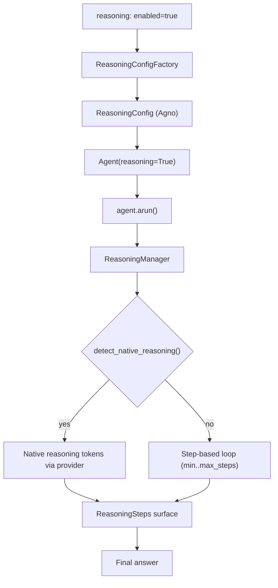

# SPEC_28_REASONING_ARCHITECTURE

> **Purpose**: Define how yaml-agno declaratively enables and configures model reasoning (chain-of-thought) on top of Agno's native `ReasoningManager` and `ReasoningConfig`. yaml-agno does NOT reimplement reasoning; it declares it in YAML and delegates execution to Agno. This SPEC is the single source of truth for the YAML-level `reasoning:` block and corrects a critical abstraction pitfall: `reasoning_effort` belongs under `model:`, not under `reasoning:`.

> @ai-directive: yaml-agno builds ON TOP of Agno. `ReasoningConfig`, `ReasoningManager`, `ReasoningStep`, `ReasoningSteps`, `NextAction`, and the `reasoning`/`reasoning_model`/`reasoning_agent`/`reasoning_min_steps`/`reasoning_max_steps` Agent params are ALL imported from Agno. yaml-agno adds only: a YAML `reasoning:` block (declared via `*Config` schemas from SPEC_02) and a `ReasoningConfigFactory` that materializes Agno's `ReasoningConfig`. Multi-tenant scoping is Core Infra. Lazy loading via DependencyManager.

---

## 1. ALCANCE Y FRONTERA

### 1.1 What reasoning is

Reasoning (a.k.a. chain-of-thought, extended thinking) is the mechanism by which a model produces intermediate "thinking" steps before emitting its final answer. Agno supports two distinct, non-exclusive modes:

1. **Step-based reasoning (Agno-managed loop)**: Agno drives a multi-step reasoning loop using a dedicated `reasoning_model` (or `reasoning_agent`). Each iteration produces a `ReasoningStep` and evaluates a `NextAction` (`continue` / `validate` / `final_answer` / `reset`). This works with ANY provider, even those without native thinking.
2. **Native model reasoning (provider-managed)**: The provider itself exposes a thinking channel (OpenAI o-series via `reasoning_effort`, Anthropic extended thinking, DeepSeek `reasoning_content`). Agno's `ReasoningManager` auto-detects these by provider and routes the native reasoning tokens through its `ReasoningSteps` surface so the consumer sees a uniform API.

yaml-agno declares which mode (or both) is active per-agent via the YAML `reasoning:` block, plus the model-level `reasoning_effort` under `model:`.

### 1.2 Qué cubre este SPEC
- The YAML `reasoning:` block: `enabled`, `min_steps`, `max_steps`, `reasoning_model`, `reasoning_agent`.
- The `model.reasoning_effort` field (CRITICAL: lives under `model:`, NOT under `reasoning:`).
- Mapping YAML -> Agno `ReasoningConfig` (the factory).
- The `ReasoningStep` / `ReasoningSteps` / `NextAction` surface that consumers read.
- Native reasoning detection by provider (OpenAI, Anthropic, etc.).
- Streaming of reasoning steps via `ReasoningEvent`.
- Compatibility matrix: which providers support native reasoning vs step-based only.

### 1.3 Qué NO cubre (frontera con otros SPECs)
| Tema | Dueño | Referencia cruzada |
|------|-------|--------------------|
| Model provider config, `reasoning_effort` validation per-provider capability | SPEC_14 | This SPEC only places `reasoning_effort` under `model:`; SPEC_14 owns provider capability matrix & factory |
| `*Config` SSOT schemas (AgentConfig, ModelConfig) | SPEC_02 | yaml-agno imports, does not redefine |
| Workflow-level step coordination | SPEC_05 | Reasoning lives INSIDE an agent run, not at workflow step level |
| Structured output (`response_model`, JSON mode) interaction | SPEC_14 | `use_json_mode` is a ReasoningConfig concern surfaced by Agno; SPEC_14 owns JSON mode at model level |
| Telemetry/traces of reasoning steps | SPEC_09 | Instrumented, not defined here |
| HITL pause during reasoning loop | SPEC_16 / SPEC_29 | A reasoning step may surface a tool approval; the pause semantics are owned by HITL |

### 1.4 Principios yaml-agno
- **YAML-First**: the `reasoning:` block is config, never code.
- **Build ON TOP**: `ReasoningConfig`/`ReasoningManager` imported from Agno. yaml-agno adds a declarative factory only.
- **The `reasoning_effort` rule is NON-NEGOTIABLE**: `reasoning_effort` is a property of the MODEL PROVIDER (`OpenAIResponses`, `OpenAIChat`, `DeepSeekChat`, `OpenRouter`), NOT of the Agent and NOT of `ReasoningConfig`. Placing it under `reasoning:` is a hard validation error.
- **Lazy loading**: the `reasoning_model` is materialized lazily through DependencyManager, only when reasoning is enabled and the agent actually runs.
- **Multi-tenant**: tenant scoping is applied at the infra layer (Core Infra), never leaked into `ReasoningConfig`.
- **asyncio.TaskGroup**: any concurrent reasoning-step probing (e.g. health probe of `reasoning_model`) uses TaskGroup, never `asyncio.gather`.

---

## 2. AGNO REASONING PRIMITIVES (IMPORTED)

> @ai-directive: Everything in this section is IMPORTED from `agno.reasoning` and `agno.agent.agent`. yaml-agno does NOT redefine these types. The code blocks below show the AGNO signatures for reference only; they are NOT yaml-agno source.

### 2.1 Agent parameters

Agno's `Agent` accepts the following reasoning-related constructor params:

```python
# agno/agent/agent.py (Agno source - imported, not reimplemented)
class Agent:
    reasoning: bool = False
    reasoning_model: Optional[Model] = None
    reasoning_agent: Optional[Agent] = None
    reasoning_min_steps: int = 1
    reasoning_max_steps: int = 10
```

- `reasoning` (bool): master switch. When `False`, no reasoning loop runs at all (native reasoning tokens, if any, are still surfaced by the provider as normal content unless the provider routes them separately).
- `reasoning_model` (Optional[Model]): a dedicated model used to generate reasoning steps. If `None`, the agent's primary model is reused for reasoning.
- `reasoning_agent` (Optional[Agent]): a nested Agent used as the reasoner. Mutually exclusive intent with `reasoning_model` (see Open Questions).
- `reasoning_min_steps` / `reasoning_max_steps`: bounds for the step-based reasoning loop. Agno clamps the loop between these.

### 2.2 ReasoningConfig

```python
# agno/reasoning/manager.py (Agno source - IMPORTED)
@dataclass
class ReasoningConfig:
    reasoning_model: Optional[Model] = None
    reasoning_agent: Optional[Agent] = None
    min_steps: int = 1
    max_steps: int = 10
    tools: Optional[List[Tool]] = None
    tool_call_limit: Optional[int] = 10
    use_json_mode: bool = False
    telemetry: bool = True
    debug_mode: bool = False
```

`ReasoningConfig` is the structured config Agno's `ReasoningManager` consumes. Note the ABSENCE of any `reasoning_effort` field — confirmation that effort is NOT a reasoning concern.

### 2.3 ReasoningStep, ReasoningSteps, NextAction

```python
# agno/reasoning/step.py and agno/reasoning/enums.py (IMPORTED)
class NextAction(Enum):
    continue          # keep reasoning
    validate          # validate the current chain
    final_answer      # stop, emit answer
    reset             # restart the chain

@dataclass
class ReasoningStep:
    title: str
    action: str
    result: str
    confidence: Optional[float] = None
    next_action: NextAction = NextAction.continue

@dataclass
class ReasoningSteps(BaseModel):
    steps: List[ReasoningStep]
```

### 2.4 ReasoningManager (native detection)

```python
# agno/reasoning/manager.py (IMPORTED)
class ReasoningManager:
    def __init__(self, config: ReasoningConfig, ...): ...
    def detect_native_reasoning(self) -> bool: ...
    # uses helpers: is_openai_reasoning_model, is_anthropic_reasoning_model,
    #               is_deepseek_reasoning_model, etc.
```

When `reasoning=True` and the primary (or `reasoning_model`) provider exposes native reasoning, the manager delegates to the provider's thinking channel and surfaces those tokens as `ReasoningStep`s. Otherwise it drives the step-based loop.

---

## 3. THE CRITICAL ABSTRACTION: `reasoning_effort` belongs under `model:`

> @ai-directive (CRITICAL TRAP): `reasoning_effort` is NOT a parameter of `Agent`, NOT a field of `ReasoningConfig`, and NOT a yaml-agno `reasoning:` block field. It is a provider-level parameter on specific MODEL classes:
> - `agno.models.openai.OpenAIResponses.reasoning_effort: Literal["minimal","low","medium","high"]`
> - `agno.models.openai.OpenAIChat.reasoning_effort` (o-series models)
> - `agno.models.deepseek.DeepSeekChat.reasoning_effort`
> - `agno.models.openrouter.OpenRouter.reasoning_effort` (when routing to reasoning-capable upstream)
>
> Placing `reasoning_effort` under the YAML `reasoning:` block MUST raise a hard validation error at config-load time. yaml-agno is opinionated here to prevent the single most common reasoning misconfiguration.

### 3.1 Why this trap exists

Developers intuitively group "everything reasoning" under one block. But Agno's API is explicit: `reasoning_effort` tunes how hard the PROVIDER thinks (a model-level dial), while the `reasoning:` block configures whether Agno drives a SEPARATE step-based loop on top. They are orthogonal:

- A model can have `reasoning_effort=high` with `reasoning: false` (provider thinks hard, no Agno loop).
- A model can have `reasoning: true` with a non-reasoning provider and `reasoning_effort` unset (Agno drives the loop itself).

yaml-agno makes this orthogonality STRUCTURAL in the YAML.

### 3.2 Correct vs incorrect YAML

```yaml
# CORRECT - reasoning_effort under model:, reasoning block is the Agno loop
agents:
  - name: "analyst"
    model:
      provider: "openai_responses"
      id: "o3"
      reasoning_effort: "high"   # <- model-level, correct
    reasoning:
      enabled: true
      min_steps: 1
      max_steps: 8

# WRONG - reasoning_effort under reasoning: -> hard validation error
agents:
  - name: "analyst"
    model:
      provider: "openai_responses"
      id: "o3"
    reasoning:
      enabled: true
      reasoning_effort: "high"   # <- FORBIDDEN, ReasoningEffortLocationError
```

### 3.3 Provider capability check

Even when `reasoning_effort` is correctly placed under `model:`, SPEC_14's `ModelCapabilitiesValidator` MUST confirm the provider supports it. Setting `reasoning_effort` on, e.g., `perplexity` is a capability error owned by SPEC_14. This SPEC only owns the STRUCTURAL placement rule.

---

## 4. YAML REASONING SCHEMA

> @ai-directive: The authoritative schema lives as SSOT in SPEC_02 (imported `*Config`). The block below is the declarative usage. `reasoning_model` accepts the same `provider:id` string syntax as SPEC_14, or an alias reference. Lazy materialization via DependencyManager.

### 4.1 Schema (referencing SPEC_02)

```yaml
agent:
  name: "deep_analyst"
  model:
    provider: "openai_responses"
    id: "o3"
    reasoning_effort: "medium"     # OPTIONAL, model-level (SPEC_14)

  reasoning:                       # OPTIONAL block, defaults to enabled=false
    enabled: true                  # bool, master switch -> Agent.reasoning
    min_steps: 1                   # int, -> reasoning_min_steps
    max_steps: 10                  # int, -> reasoning_max_steps
    reasoning_model: "anthropic:claude-sonnet-4-5"   # OPTIONAL, provider:id or alias
    reasoning_agent: "reasoner_agent"                 # OPTIONAL, nested agent name (see Open Questions)
```

### 4.2 Field mapping YAML -> Agno

| YAML path | Agno target | Notes |
|-----------|-------------|-------|
| `reasoning.enabled` | `Agent(reasoning=...)` | bool; `false` omits the rest |
| `reasoning.min_steps` | `Agent(reasoning_min_steps=...)` | default 1 |
| `reasoning.max_steps` | `Agent(reasoning_max_steps=...)` | default 10 |
| `reasoning.reasoning_model` | `Agent(reasoning_model=<Model>)` | resolved via SPEC_14 factory |
| `reasoning.reasoning_agent` | `Agent(reasoning_agent=<Agent>)` | resolved via agent registry |
| `model.reasoning_effort` | `<Model>(reasoning_effort=...)` | provider param, SPEC_14 |

### 4.3 Validation rules (yaml-agno)

1. If `reasoning.enabled == false`, all other `reasoning.*` fields are IGNORED (warning, not error).
2. `min_steps` MUST be >= 1; `max_steps` MUST be >= `min_steps`. Else `ReasoningBoundsError`.
3. `reasoning_model` and `reasoning_agent` are mutually exclusive. If both set -> `ReasoningConflictError`.
4. `reasoning_effort` under `reasoning:` -> `ReasoningEffortLocationError` (hard).
5. `reasoning_effort` under `model:` on an unsupported provider -> delegated to SPEC_14 capability check.
6. `max_steps` capped at 50 to avoid runaway loops (configurable via Core Infra).

---

## 5. NATIVE REASONING DETECTION

### 5.1 Provider matrix

| Provider | Native reasoning? | How Agno detects | `reasoning_effort` supported? |
|----------|-------------------|------------------|-------------------------------|
| `openai_responses` (o-series) | yes | `is_openai_reasoning_model` | yes (`minimal`/`low`/`medium`/`high`) |
| `openai_chat` (o-series) | yes | `is_openai_reasoning_model` | yes |
| `anthropic` (extended thinking) | yes | `is_anthropic_reasoning_model` | no (uses budget_tokens, SPEC_14) |
| `deepseek` | yes (`reasoning_content`) | `is_deepseek_reasoning_model` | yes (provider-specific) |
| `openrouter` (reasoning upstream) | conditional | routing-dependent | yes (passthrough) |
| `google`, `mistral`, `cohere`, `xai`, `meta`, etc. | no | n/a | step-based only |
| `ollama`, `llamacpp`, `lm_studio`, `vllm` | conditional | model-dependent | step-based fallback |

> @ai-directive: yaml-agno does NOT replicate `is_*_reasoning_model` helpers. It reads the boolean result from Agno's `ReasoningManager.detect_native_reasoning()` and reports it in the resolved agent's capabilities for telemetry. The detection logic is Agno's SSOT.

### 5.2 Detection flow



---

## 6. STREAMING REASONING EVENTS

When the agent streams its response, Agno emits `ReasoningEvent` chunks carrying partial `ReasoningStep` content. yaml-agno surfaces these uniformly.

```python
# yaml-agno usage (NOT Agno reimplementation)
async for event in agent.arun(message, stream=True):
    if event.event_type == "ReasoningEvent":
        # partial reasoning step chunk
        yield {"type": "reasoning", "content": event.content}
    elif event.event_type == "RunContent":
        yield {"type": "answer", "content": event.content}
```

> @ai-directive: `ReasoningEvent` is Agno's event type. yaml-agno only forwards/normalizes it to the consumer's transport (SPEC_06 API surface). No custom reasoning-event class is introduced.

### 6.1 Final reasoning steps access

After a run completes, the full chain is available on the run response:

```python
response = await agent.arun(message)
if response.reasoning_steps:
    for step in response.reasoning_steps.steps:   # ReasoningSteps (Agno)
        print(step.title, step.action, step.result, step.next_action)
```

---

## 7. ReasoningConfigFactory (yaml-agno Core Infra)

> @ai-directive: This is a yaml-agno domain addition. Agno provides `ReasoningConfig` and the Agent params; yaml-agno provides the FACTORY that materializes them from YAML, plus the lazy model resolution. The factory is multi-tenant safe (tenant passed by Core Infra, never embedded in `ReasoningConfig`). DependencyManager performs lazy loading of the `reasoning_model`.

```python
# yaml-agno/src/infra/reasoning/factory.py

from typing import Any, Mapping, Optional
from dataclasses import dataclass

from agno.reasoning.manager import ReasoningConfig
from agno.reasoning.enums import NextAction  # noqa: F401  (re-exported for consumers)

from yaml_agno.ports.models import ModelPort  # SPEC_14
from yaml_agno.infra.dependencies import DependencyManager


class ReasoningEffortLocationError(ValueError):
    """Raised when reasoning_effort is placed under the reasoning: block."""


class ReasoningBoundsError(ValueError):
    """Raised when min_steps/max_steps are inconsistent."""


class ReasoningConflictError(ValueError):
    """Raised when both reasoning_model and reasoning_agent are set."""


@dataclass(frozen=True)
class ReasoningBlock:
    """Declarative reasoning block parsed from YAML (mirrors SPEC_02 schema)."""
    enabled: bool = False
    min_steps: int = 1
    max_steps: int = 10
    reasoning_model: Optional[str] = None
    reasoning_agent: Optional[str] = None


class ReasoningConfigFactory:
    """Materializes Agno ReasoningConfig from a parsed reasoning YAML block.

    Build ON TOP of Agno: produces Agno's ReasoningConfig; does NOT redefine it.
    The reasoning_model is resolved LAZILY via DependencyManager so that a
    disabled reasoning block never pays the model construction cost.
    """

    def __init__(self, model_port: ModelPort, deps: DependencyManager) -> None:
        self._model_port = model_port
        self._deps = deps

    def build(
        self,
        block: Mapping[str, Any],
        *,
        tenant_id: str,
    ) -> ReasoningConfig:
        """Build an Agno ReasoningConfig from a YAML reasoning block.

        Args:
            block: the parsed `reasoning:` mapping (may be None / empty).
            tenant_id: multi-tenant scope (Core Infra; never stored in config).

        Returns:
            An Agno ReasoningConfig. When the block is disabled, returns a
            no-op config with default bounds; the caller still sets
            Agent.reasoning=False.

        Raises:
            ReasoningEffortLocationError: if reasoning_effort is found in block.
            ReasoningBoundsError: if min/max steps are inconsistent.
            ReasoningConflictError: if both reasoning_model and reasoning_agent set.
        """
        if not block:
            return ReasoningConfig()

        # CRITICAL structural guard (the trap).
        if "reasoning_effort" in block:
            raise ReasoningEffortLocationError(
                "reasoning_effort is a MODEL provider parameter, not a reasoning "
                "block field. Move it under model:. See SPEC_28 section 3."
            )

        rb = self._parse_block(block)

        # Lazy model resolution: only when reasoning is enabled AND a model is set.
        resolved_model = None
        if rb.enabled and rb.reasoning_model:
            resolved_model = self._deps.resolve_model(
                rb.reasoning_model, tenant_id=tenant_id
            )

        return ReasoningConfig(
            reasoning_model=resolved_model,
            reasoning_agent=None,  # nested agent resolved by agent registry (see Q1)
            min_steps=rb.min_steps,
            max_steps=rb.max_steps,
        )

    @staticmethod
    def _parse_block(block: Mapping[str, Any]) -> ReasoningBlock:
        enabled = bool(block.get("enabled", False))
        min_steps = int(block.get("min_steps", 1))
        max_steps = int(block.get("max_steps", 10))
        if min_steps < 1 or max_steps < min_steps:
            raise ReasoningBoundsError(
                f"Invalid reasoning bounds: min_steps={min_steps}, "
                f"max_steps={max_steps}"
            )
        if block.get("reasoning_model") and block.get("reasoning_agent"):
            raise ReasoningConflictError(
                "reasoning_model and reasoning_agent are mutually exclusive."
            )
        return ReasoningBlock(
            enabled=enabled,
            min_steps=min_steps,
            max_steps=max_steps,
            reasoning_model=block.get("reasoning_model"),
            reasoning_agent=block.get("reasoning_agent"),
        )
```

### 7.1 Wiring to AgentConfig (SPEC_02)

The `AgentConfig` schema (SPEC_02) carries an optional `reasoning` sub-mapping and the `model` mapping. The agent factory (Core Infra) calls:

```python
rcfg = reasoning_factory.build(agent_cfg.reasoning or {}, tenant_id=tenant_id)
agent = AgnoAgent(
    reasoning=rcfg is not None and (agent_cfg.reasoning or {}).get("enabled", False),
    reasoning_model=rcfg.reasoning_model,
    reasoning_agent=rcfg.reasoning_agent,
    reasoning_min_steps=rcfg.min_steps,
    reasoning_max_steps=rcfg.max_steps,
    ...,
)
```

---

## 8. INTERACTIONS

### 8.1 Reasoning + HITL

A reasoning step may decide to call a tool that requires approval (SPEC_16). The reasoning loop is conceptually INSIDE the agent run; when such a tool call surfaces a `needs_confirmation` requirement, the run pauses with `RunStatus.paused` (SPEC_16). On resume, the reasoning loop continues from the paused step. yaml-agno does NOT add reasoning-specific pause logic.

### 8.2 Reasoning + Structured output

`ReasoningConfig.use_json_mode` controls whether the reasoner emits steps in JSON. yaml-agno exposes this only as a passthrough flag in MVP (not in the YAML block) to keep the surface minimal; structured output at the model level is owned by SPEC_14.

### 8.3 Reasoning + Workflows (SPEC_05/29)

Reasoning is an agent-run concern. A workflow Step (SPEC_05) that delegates to an agent inherits whatever `reasoning:` that agent declares. Workflow-level HITL (SPEC_29) does not interact with reasoning steps directly.

---

## 9. BEHAVIOR DELTA - BDD SCENARIOS

### 9.1 Reasoning enable / disable

#### Scenario 1: Reasoning enabled drives the loop
```gherkin
GIVEN a YAML agent with reasoning.enabled=true and max_steps=8
WHEN the ReasoningConfigFactory builds the config
THEN the Agent is constructed with reasoning=True
AND reasoning_max_steps=8
AND Agno's ReasoningManager drives a step-based loop
```

#### Scenario 2: Reasoning disabled ignores sibling fields
```gherkin
GIVEN a YAML agent with reasoning.enabled=false and reasoning_model="anthropic:claude-sonnet-4-5"
WHEN the factory builds the config
THEN Agent.reasoning=False
AND reasoning_model is NOT resolved (no model construction cost)
AND a WARNING "reasoning disabled; reasoning_model ignored" is emitted
```

### 9.2 The reasoning_effort trap

#### Scenario 3: reasoning_effort under reasoning block is rejected
```gherkin
GIVEN a YAML agent with reasoning.reasoning_effort="high"
WHEN the factory validates the block
THEN it raises ReasoningEffortLocationError
AND the error message instructs to move it under model:
```

#### Scenario 4: reasoning_effort under model is accepted
```gherkin
GIVEN a YAML agent with model.reasoning_effort="high" and model.provider="openai_responses"
WHEN the config is loaded
THEN no structural error is raised by the reasoning factory
AND the SPEC_14 capability check passes (openai_responses supports reasoning_effort)
AND the factory passes reasoning_effort="high" to the OpenAIResponses model constructor
```

#### Scenario 5: reasoning_effort on unsupported provider (SPEC_14 owns)
```gherkin
GIVEN a YAML agent with model.reasoning_effort="high" and model.provider="perplexity"
WHEN the config is loaded
THEN the reasoning factory raises NO structural error
AND SPEC_14's ModelCapabilitiesValidator raises a capability error
```

### 9.3 Native reasoning detection

#### Scenario 6: Native reasoning provider detected
```gherkin
GIVEN an agent with reasoning=True and model provider=openai_responses id=o3
WHEN the agent runs
THEN ReasoningManager.detect_native_reasoning() returns True
AND reasoning tokens are surfaced as ReasoningSteps from the native channel
AND the step-based loop is not the primary driver
```

#### Scenario 7: Non-reasoning provider falls back to step-based loop
```gherkin
GIVEN an agent with reasoning=True and model provider=mistral
WHEN the agent runs
THEN detect_native_reasoning() returns False
AND Agno drives the step-based loop bounded by min_steps..max_steps
```

### 9.4 Bounds and conflicts

#### Scenario 8: Inverted bounds rejected
```gherkin
GIVEN a YAML reasoning block with min_steps=5 and max_steps=2
WHEN the factory parses the block
THEN it raises ReasoningBoundsError
```

#### Scenario 9: reasoning_model and reasoning_agent both set rejected
```gherkin
GIVEN a YAML reasoning block with reasoning_model and reasoning_agent both set
WHEN the factory parses the block
THEN it raises ReasoningConflictError
```

### 9.5 Streaming

#### Scenario 10: ReasoningEvent streamed before answer
```gherkin
GIVEN an agent with reasoning=True streaming a response
WHEN the consumer iterates the stream
THEN ReasoningEvent chunks arrive first (partial ReasoningStep content)
AND RunContent chunks arrive after with the final answer
```

### 9.6 Lazy loading

#### Scenario 11: Disabled reasoning never constructs reasoning_model
```gherkin
GIVEN a YAML agent with reasoning.enabled=false and reasoning_model="openai_responses:o3"
WHEN the agent is built
THEN DependencyManager.resolve_model is NEVER called for the reasoning_model
AND no API key is read for it
```

---

## 10. TDD MICRO-TASK EXECUTION PROTOCOL

> **Strict TDD**: each task follows RED (test fails) -> GREEN (minimal impl) -> REFACTOR. Commit per task. No `asyncio.gather`.

### TASK_001: ReasoningBlock parse + effort trap
- **File**: `src/yaml_agno/infra/reasoning/factory.py`
- **Test**: `tests/infra/reasoning/test_factory.py::test_effort_under_reasoning_block_raises`
- **RED**:
```python
import pytest
from yaml_agno.infra.reasoning.factory import (
    ReasoningConfigFactory, ReasoningEffortLocationError,
)

def test_effort_under_reasoning_block_raises():
    factory = ReasoningConfigFactory(model_port=FakeModelPort(), deps=FakeDeps())
    with pytest.raises(ReasoningEffortLocationError):
        factory.build({"enabled": True, "reasoning_effort": "high"}, tenant_id="t1")
```
- **GREEN**: implement the `reasoning_effort in block` guard before parsing.
- **Commit**: `feat(reasoning): reject reasoning_effort placed under reasoning block`

### TASK_002: Bounds validation
- **Test**: `tests/infra/reasoning/test_factory.py::test_inverted_bounds_raise`
- **RED**:
```python
def test_inverted_bounds_raise():
    factory = ReasoningConfigFactory(model_port=FakeModelPort(), deps=FakeDeps())
    from yaml_agno.infra.reasoning.factory import ReasoningBoundsError
    with pytest.raises(ReasoningBoundsError):
        factory.build({"enabled": True, "min_steps": 5, "max_steps": 2}, tenant_id="t1")
```
- **GREEN**: implement `_parse_block` bounds check.
- **Commit**: `feat(reasoning): validate reasoning step bounds`

### TASK_003: reasoning_model vs reasoning_agent conflict
- **Test**: `test_model_and_agent_conflict_raises`
- **RED**: assert `ReasoningConflictError` when both set.
- **GREEN**: implement mutual-exclusion check.
- **Commit**: `feat(reasoning): enforce reasoning_model/reasoning_agent exclusivity`

### TASK_004: Lazy model resolution
- **Test**: `test_disabled_reasoning_does_not_resolve_model`
- **RED**:
```python
def test_disabled_reasoning_does_not_resolve_model(monkeypatch):
    deps = FakeDeps()
    factory = ReasoningConfigFactory(model_port=FakeModelPort(), deps=deps)
    factory.build({"enabled": False, "reasoning_model": "openai_responses:o3"}, tenant_id="t1")
    assert deps.resolve_model_calls == []  # never resolved
```
- **GREEN**: gate `resolve_model` behind `rb.enabled and rb.reasoning_model`.
- **Commit**: `feat(reasoning): lazy-load reasoning_model only when enabled`

### TASK_005: Native detection passthrough (telemetry)
- **Test**: `test_native_detection_reported_from_agno`
- **RED**: build an agent, run, assert the resolved capabilities report `native_reasoning` matching `ReasoningManager.detect_native_reasoning()` (use a fake model Agno classifies as openai reasoning).
- **GREEN**: read Agno's detector result and store on capabilities; do NOT reimplement detection.
- **Commit**: `feat(reasoning): report native detection from Agno ReasoningManager`

### TASK_006: Concurrent reasoning_model health probe (TaskGroup)
- **File**: `src/yaml_agno/infra/reasoning/probe.py`
- **Test**: `tests/infra/reasoning/test_probe.py::test_probe_reasoning_models_concurrent`
- **RED**:
```python
@pytest.mark.asyncio
async def test_probe_reasoning_models_concurrent():
    async def fake_call(spec): return spec.endswith("ok")
    results = await probe_reasoning_models(
        specs=["openai_responses:o3:ok", "anthropic:bad"], invoke=fake_call,
    )
    assert results["ok"] is True and results["bad"] is False
```
- **GREEN**: implement `probe_reasoning_models` with `asyncio.TaskGroup` (NOT gather), one task per spec.
- **Commit**: `feat(reasoning): concurrent reasoning-model health probe via TaskGroup`

---

## 11. SUPUESTOS (ASSUMPTIONS)

1. **ABSTRAER**: yaml-agno exposes only `{enabled, min_steps, max_steps, reasoning_model, reasoning_agent}` in the YAML block. `tools`, `tool_call_limit`, `use_json_mode`, `telemetry`, `debug_mode` of Agno's `ReasoningConfig` are NOT exposed in MVP (they take Agno defaults).
2. **THE EFFORT TRAP**: `reasoning_effort` lives under `model:` only. This is enforced as a hard error, not a warning, because the silent failure mode (effort ignored) is worse than a loud config error.
3. **IMPORTED enums/types**: `ReasoningStep`, `ReasoningSteps`, `NextAction`, `ReasoningConfig`, `ReasoningManager` are IMPORTED from Agno. No yaml-agno mirror enum.
4. **Lazy resolution**: the `reasoning_model` is materialized via DependencyManager only when reasoning is enabled, avoiding cost (and API key reads) for disabled blocks.
5. **Multi-tenant**: `tenant_id` is passed by Core Infra to the factory but NEVER embedded in `ReasoningConfig` (which is Agno-owned and tenant-agnostic).
6. **Native detection SSOT**: Agno's `detect_native_reasoning()` is the single source. yaml-agno reports its result; it does not maintain its own provider matrix for detection (it does maintain a documentation matrix in section 5.1 only).
7. **Streaming**: `ReasoningEvent` is Agno's event; yaml-agno forwards it without a custom type.
8. **Bounds cap**: a global `max_steps` ceiling of 50 (Core Infra configurable) prevents runaway loops.

---

## 12. PREGUNTAS DE CALIBRACIÓN ESTRATÉGICA

1. **Nested `reasoning_agent`**: Agno allows `reasoning_agent` (a nested Agent as reasoner). Should yaml-agno expose `reasoning_agent` as a name reference resolved from the agent registry in MVP, or defer it to post-MVP given the complexity (recursive agent graphs, lifecycle ownership)? Recommend defer.
2. **Anthropic budget_tokens**: Anthropic uses `budget_tokens` (not `reasoning_effort`) for extended thinking. Should yaml-agno expose `model.thinking_budget` analogously, owned by SPEC_14? Affects schema symmetry.
3. **`use_json_mode` surface**: expose it in the YAML block in MVP, or keep passthrough-only? Exposing adds a knob most users will misconfigure.
4. **Step ceiling default**: is `max_steps=10` (Agno default) the right MVP default, or should yaml-agno ship a lower default (e.g. 6) to bound cost on expensive reasoning models?
5. **Reasoning + evals**: should reasoning steps feed SPEC_18 evals (reasoning-quality metrics) in MVP, or only be observable (SPEC_09)? Quality evals add scope.
6. **Provider matrix maintenance**: the matrix in 5.1 will drift as Agno adds providers. Should yaml-agno auto-derive it from Agno's `is_*_reasoning_model` helpers at runtime (single source) instead of a static doc table?
7. **Per-tenant reasoning defaults**: should tenants have org-level reasoning defaults (e.g. always cap max_steps) injected by Core Infra, or is the YAML always authoritative?

---

## 13. REFERENCIAS

- Agno source: `agno/reasoning/manager.py` (`ReasoningConfig`, `ReasoningManager`), `agno/reasoning/step.py` (`ReasoningStep`, `ReasoningSteps`), `agno/reasoning/enums.py` (`NextAction`), `agno/agent/agent.py` (reasoning params).
- Agno model providers: `agno/models/openai.py` (`OpenAIResponses.reasoning_effort`), `agno/models/deepseek.py`, `agno/models/openrouter.py`.
- SPEC_02 (Domain Model): `*Config` SSOT schemas, `reasoning` and `model` mappings.
- SPEC_14 (Model Resilience & Config): provider capability matrix, `reasoning_effort` validation, ModelPort, model factory.
- SPEC_05 (Workflows & Teams): step coordination; reasoning is agent-run scoped.
- SPEC_06 (API & AX): streaming event surface (`ReasoningEvent` forwarding).
- SPEC_09 (Observability & SRE): reasoning-step traces/metrics.
- SPEC_16 (HITL): pause semantics when a reasoning step triggers a tool approval.
- SPEC_08 (TDD Microtasks): test conventions.
