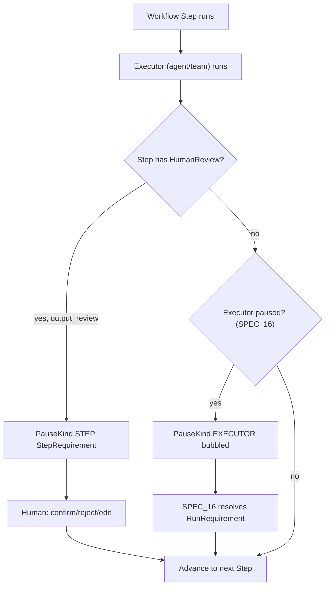

# SPEC_29_WORKFLOW_HITL

> **Purpose**: Define how yaml-agno declares Human-in-the-Loop at the WORKFLOW level (per Step / Loop / Router) on top of Agno's `HumanReview`, `StepRequirement`, `ErrorRequirement`, and `PauseKind` primitives. yaml-agno does NOT reimplement workflow HITL; it declares a `human_review:` block per workflow step and delegates pause/resume to Agno. This SPEC draws a hard frontier with SPEC_16: SPEC_16 owns tool/agent-run HITL (`RunRequirement`, `RunStatus.paused`); SPEC_29 owns whole-workflow HITL (`HumanReview` on a workflow step).

> @ai-directive: yaml-agno builds ON TOP of Agno. `HumanReview`, `StepRequirement`, `ErrorRequirement`, `PauseKind`, `ExecutorType`, and the enums `OnReject` / `OnTimeout` / `OnError` are ALL imported from `agno.workflow.types`. yaml-agno adds only: a YAML `human_review:` block (declared via `*Config` schemas from SPEC_02/05) and a `HumanReviewFactory` that materializes Agno's `HumanReview`. The CRITICAL constraint: `requires_output_review` as a Callable is NON-SERIALIZABLE, so only `bool` is allowed in YAML. Multi-tenant scoping is Core Infra. Lazy resolution via DependencyManager. asyncio.TaskGroup (no gather).

---

## 1. ALCANCE Y FRONTERA

### 1.1 What workflow-level HITL is

Workflow-level HITL means a whole workflow Step (or a Loop iteration, or a Router branch) pauses for human review BEFORE it proceeds. Unlike tool-level HITL (SPEC_16), which pauses inside a single agent run when a tool needs approval, workflow-level HITL pauses the ORCHESTRATION LAYER: a Step finishes its executor and a human must confirm/reject/edit the Step's output before the next Step runs. This is essential for high-stakes multi-step pipelines (compliance, finance, content publication) where each stage needs a gatekeeper.

Agno models this through the `HumanReview` dataclass attached to a Step's config, and surfaces runtime pause state through `StepRequirement` (and `ErrorRequirement` when `on_error="pause"`).

### 1.2 Qué cubre este SPEC
- The YAML `human_review:` block per Step / Loop / Router (attached to `StepConfig`, SPEC_02/05).
- Mapping YAML -> Agno `HumanReview` (the factory).
- The `OnReject` / `OnTimeout` / `OnError` enums and their YAML string mapping.
- The `StepRequirement` and `ErrorRequirement` runtime surfaces consumers read.
- `PauseKind.STEP` vs `PauseKind.EXECUTOR` (the bubbling frontier with SPEC_16).
- Compatibility matrix: which StepTypes support HITL (Parallel does NOT).
- The `requires_output_review` callable-vs-bool constraint (bool only in YAML).

### 1.3 Qué NO cubre (frontera con otros SPECs)
| Tema | Dueño | Referencia cruzada |
|------|-------|--------------------|
| Tool / agent-run HITL (`RunRequirement`, `needs_confirmation`, `RunStatus.paused`) | SPEC_16 | This SPEC references it ONLY via PauseKind.EXECUTOR bubbling |
| `StepConfig` / `WorkflowConfig` SSOT schemas | SPEC_02 / SPEC_05 | yaml-agno imports, does not redefine |
| Approval DB persistence & audit trail | SPEC_16 | `approvals` table is Agno-owned; SPEC_16 owns it |
| Guardrails (PII/secret masking) | SPEC_16 | Applied before review surfaces |
| Telemetry / traces of pauses | SPEC_09 | Instrumented, not defined here |
| Workflow execution runtime / state machine | SPEC_05 / Agno | yaml-agno declares, Agno executes |

### 1.4 The SPEC_16 vs SPEC_29 frontier (CRITICAL)

> @ai-directive: This is the single most important distinction in this SPEC. Memorize it.

| Aspect | SPEC_16 (tool / agent-run HITL) | SPEC_29 (workflow-level HITL) |
|--------|----------------------------------|-------------------------------|
| Granularity | A single tool call inside an agent run | A whole workflow Step / Loop / Router |
| Agno primitive | `RunRequirement` on `run_response.active_requirements` | `HumanReview` on `StepConfig`; `StepRequirement` / `ErrorRequirement` runtime |
| Pause anchor | `RunStatus.paused` (agno.run.base) | `PauseKind.STEP` (workflow pause) |
| Who pauses | The agent run | The workflow orchestrator |
| Where declared | Tool decorator `@approval`, agent run hooks | `human_review:` block on a Step |
| Bubbling | Tool pause surfaces as `PauseKind.EXECUTOR` when a Step wraps an agent that paused |

**The bridge**: when a workflow Step delegates to an Agent, and that Agent's tool triggers a SPEC_16 pause (`RunStatus.paused`), Agno bubbles that pause up to the workflow layer as `PauseKind.EXECUTOR`. The workflow consumer sees a workflow pause whose `executor_type=agent` and whose underlying cause is a tool-level requirement. yaml-agno does NOT translate this; it passes it through. SPEC_16 owns the resolution of the underlying requirement; SPEC_29 owns the workflow-level resume after the executor is resolved.

### 1.5 Principios yaml-agno
- **YAML-First**: `human_review:` is config, never code.
- **Build ON TOP**: `HumanReview` and friends are imported from Agno.
- **Parallel has NO HITL**: declaring `human_review:` on a `Parallel` step is a hard validation error.
- **Callable => bool**: `requires_output_review` may be a Callable in Agno for dynamic decisions. Callables are NON-SERIALIZABLE to YAML, so yaml-agno allows ONLY `bool` in YAML. Users needing dynamic review logic implement a hook (SPEC_16) instead.
- **Lazy resolution**: the factory resolves message templates and review schemas lazily via DependencyManager.
- **Multi-tenant**: tenant scoping is Core Infra; never embedded in `HumanReview`.
- **asyncio.TaskGroup**: concurrent pause-state probing uses TaskGroup.

---

## 2. AGNO WORKFLOW HITL PRIMITIVES (IMPORTED)

> @ai-directive: Everything here is IMPORTED from `agno.workflow.types`. yaml-agno does NOT redefine these. The code blocks show Agno signatures for reference; they are NOT yaml-agno source.

### 2.1 HumanReview dataclass

```python
# agno/workflow/types.py (IMPORTED)
@dataclass
class HumanReview:
    requires_confirmation: bool = False
    confirmation_message: Optional[str] = None
    requires_user_input: bool = False
    user_input_message: Optional[str] = None
    user_input_schema: Optional[Dict] = None
    requires_output_review: Union[bool, Callable] = False
    output_review_message: Optional[str] = None
    requires_iteration_review: bool = False
    iteration_review_message: Optional[str] = None
    on_reject: OnReject = OnReject.skip
    on_error: OnError = OnError.skip
    max_retries: int = 3
    timeout: Optional[float] = None
    on_timeout: OnTimeout = OnTimeout.cancel

    def to_dict(self) -> dict: ...
    @classmethod
    def from_dict(cls, data: dict) -> "HumanReview": ...
```

Key: `to_dict`/`from_dict` make `HumanReview` fully serializable to YAML (when `requires_output_review` is a bool, not a Callable).

### 2.2 Enums

```python
# agno/workflow/types.py (IMPORTED)
class OnReject(Enum):
    skip = "skip"        # skip the step, continue workflow
    cancel = "cancel"    # cancel the whole workflow
    else_ = "else"       # route to an else branch (Router)
    retry = "retry"      # retry the step

class OnTimeout(Enum):
    cancel = "cancel"    # cancel the workflow
    skip = "skip"        # skip the step
    approve = "approve"  # auto-approve and continue

class OnError(Enum):
    fail = "fail"        # fail the workflow
    skip = "skip"        # skip the step
    pause = "pause"      # pause for human decision (ErrorRequirement)
```

### 2.3 StepRequirement (runtime pause state)

```python
# agno/workflow/types.py (IMPORTED)
@dataclass
class StepRequirement:
    # runtime pause state for a paused Step
    def confirm(self) -> None: ...
    def reject(self, feedback: Optional[str] = None) -> None: ...
    def edit(self, new_output: Any) -> None: ...
    def select(self, *choices: Any) -> None: ...

    @property
    def needs_confirmation(self) -> bool: ...
    @property
    def needs_output_review(self) -> bool: ...
    @property
    def needs_executor_resolution(self) -> bool: ...
    @property
    def is_resolved(self) -> bool: ...
```

### 2.4 ErrorRequirement (on_error="pause")

```python
# agno/workflow/types.py (IMPORTED)
@dataclass
class ErrorRequirement:
    error_message: str
    error_type: str
    decision: Optional[str] = None
    def retry(self) -> None: ...
    def skip(self) -> None: ...
```

### 2.5 PauseKind, ExecutorType

```python
# agno/workflow/types.py (IMPORTED)
class PauseKind(Enum):
    STEP = "step"          # the Step itself paused (HumanReview)
    EXECUTOR = "executor"  # the executor (agent/team) paused, bubbled up

class ExecutorType(Enum):
    AGENT = "agent"
    TEAM = "team"
```

---

## 3. COMPATIBILITY MATRIX (which StepTypes support HITL)

> @ai-directive: This matrix is authoritative. Declaring `human_review:` on an unsupported StepType is a HARD validation error at config-load time.

| StepType | requires_confirmation | requires_user_input | requires_output_review | requires_iteration_review | HITL supported? |
|----------|----------------------|----------------------|------------------------|---------------------------|-----------------|
| `Step` | yes | yes | yes | no | YES |
| `Steps` | yes | yes | yes | no | YES (applies to the block) |
| `Condition` | no | no | no | no | NO (pure branching) |
| `Router` | yes | yes | yes | no | YES |
| `Loop` | yes | no | no | yes | YES (iteration review) |
| `Function` | yes | no | yes | no | YES |
| `Workflow` (nested) | yes | yes | yes | no | YES |
| `Parallel` | no | no | no | no | **NO** |

### 3.1 Why Parallel has no HITL

A `Parallel` step runs its sub-steps concurrently. HITL pause semantics require a single deterministic pause/resume point; parallel branches would need to coordinate partial resolution (some branches confirmed, others pending), which Agno does not model. Therefore:

- Declaring `human_review:` on a `Parallel` step -> `ParallelHitlNotSupportedError`.
- Needing human review on a parallel branch means restructuring: replace `Parallel` with sequential `Step`s, or wrap each branch's executor agent with tool-level HITL (SPEC_16) that bubbles as `PauseKind.EXECUTOR`.

---

## 4. YAML HUMAN_REVIEW SCHEMA

> @ai-directive: The authoritative schema lives as SSOT in SPEC_02/05 (imported `StepConfig`). The block below is the declarative usage attached to a Step. All enum values are lowercase strings mapping 1:1 to Agno enums. `requires_output_review` accepts ONLY a bool (a Callable is non-serializable).

### 4.1 Schema

```yaml
workflow:
  name: "publication_pipeline"
  steps:
    - name: "draft"
      type: "Step"
      agent: "writer_agent"
      human_review:                 # OPTIONAL block on Step/Router/Loop/Function
        requires_confirmation: true
        confirmation_message: "Approve draft before editing?"
        requires_user_input: false
        requires_output_review: true
        output_review_message: "Review the draft output; edit or reject."
        on_reject: "retry"          # skip | cancel | else | retry
        on_error: "pause"           # fail | skip | pause
        max_retries: 3
        timeout: 3600               # seconds; null = no timeout
        on_timeout: "cancel"        # cancel | skip | approve

    - name: "refine_loop"
      type: "Loop"
      loop_over: "$drafts"
      agent: "editor_agent"
      human_review:
        requires_iteration_review: true
        iteration_review_message: "Approve this iteration?"
        on_reject: "skip"
```

### 4.2 Field mapping YAML -> Agno HumanReview

| YAML field | Agno target | Notes |
|------------|-------------|-------|
| `requires_confirmation` | `HumanReview.requires_confirmation` | bool |
| `confirmation_message` | `HumanReview.confirmation_message` | str, optional |
| `requires_user_input` | `HumanReview.requires_user_input` | bool (Step/Router only) |
| `user_input_message` | `HumanReview.user_input_message` | str |
| `user_input_schema` | `HumanReview.user_input_schema` | JSON schema dict |
| `requires_output_review` | `HumanReview.requires_output_review` | **BOOL ONLY** |
| `output_review_message` | `HumanReview.output_review_message` | str |
| `requires_iteration_review` | `HumanReview.requires_iteration_review` | bool (Loop only) |
| `iteration_review_message` | `HumanReview.iteration_review_message` | str |
| `on_reject` | `HumanReview.on_reject` | string -> OnReject |
| `on_error` | `HumanReview.on_error` | string -> OnError |
| `max_retries` | `HumanReview.max_retries` | int, default 3 |
| `timeout` | `HumanReview.timeout` | float seconds, nullable |
| `on_timeout` | `HumanReview.on_timeout` | string -> OnTimeout |

### 4.3 Validation rules (yaml-agno)

1. `human_review:` on `Parallel` -> `ParallelHitlNotSupportedError` (hard).
2. `requires_user_input: true` on a `Loop` -> `UserInputOnLoopError` (Loop supports iteration review only).
3. `requires_iteration_review: true` on a non-`Loop` -> `IterationReviewOnNonLoopError`.
4. `requires_output_review` as a non-bool (string/callable shape) -> `OutputReviewMustBeBoolError`. (Callables are not representable in YAML; users needing dynamic review use a hook.)
5. Unknown enum string for `on_reject`/`on_error`/`on_timeout` -> `UnknownHumanReviewEnumError` listing valid values.
6. `max_retries < 0` -> `HumanReviewBoundsError`.
7. `timeout < 0` -> `HumanReviewBoundsError`.

---

## 5. PAUSE KINDS: STEP vs EXECUTOR (the bridge to SPEC_16)

### 5.1 PauseKind.STEP

A Step pauses because its OWN `HumanReview` triggered (e.g. `requires_output_review=true` and the executor finished). The consumer receives a `StepRequirement` with `needs_output_review=True`. Resolution: `confirm()` / `reject(feedback)` / `edit(new_output)`.

### 5.2 PauseKind.EXECUTOR (bubbling)

A Step delegates to an Agent (or Team) as its executor. That executor's run pauses due to a SPEC_16 tool-level requirement (`RunStatus.paused`, `needs_confirmation`). Agno bubbles this up: the workflow Step pauses with `PauseKind.EXECUTOR`, `executor_type=agent`, and the underlying `RunRequirement` is attached.

> @ai-directive: yaml-agno does NOT translate or re-wrap the bubbled requirement. SPEC_16 owns resolving the underlying tool-level requirement. SPEC_29 owns resuming the WORKFLOW once the executor is resolved. The `StepRequirement.needs_executor_resolution` flag is the signal that resolution must go through SPEC_16.

### 5.3 Flow



---

## 6. HumanReviewFactory (yaml-agno Core Infra)

> @ai-directive: yaml-agno domain addition. Agno provides `HumanReview` and the runtime types; yaml-agno provides the FACTORY that materializes `HumanReview` from YAML, the compatibility validator, and the enum mapping. Multi-tenant safe (tenant passed by Core Infra, never stored in `HumanReview`). Lazy message/schema resolution via DependencyManager.

```python
# yaml-agno/src/infra/workflow_hitl/factory.py

from typing import Any, Mapping, Optional
from dataclasses import dataclass

from agno.workflow.types import (
    HumanReview, OnReject, OnTimeout, OnError,
)

from yaml_agno.infra.dependencies import DependencyManager


class ParallelHitlNotSupportedError(ValueError):
    """Raised when human_review is declared on a Parallel step."""


class UserInputOnLoopError(ValueError):
    """Raised when requires_user_input is set on a Loop (iteration-only)."""


class IterationReviewOnNonLoopError(ValueError):
    """Raised when requires_iteration_review is set on a non-Loop step."""


class OutputReviewMustBeBoolError(ValueError):
    """Raised when requires_output_review is not a bool (Callable not serializable)."""


class UnknownHumanReviewEnumError(ValueError):
    """Raised when an on_reject/on_error/on_timeout string is not a valid enum."""


class HumanReviewBoundsError(ValueError):
    """Raised when max_retries/timeout are negative."""


_STEPTYPES_WITHOUT_HITL = {"Parallel"}
_STEPTYPES_USER_INPUT = {"Step", "Steps", "Router", "Workflow"}
_STEPTYPES_ITERATION = {"Loop"}


class HumanReviewFactory:
    """Materializes Agno HumanReview from a YAML human_review block.

    Build ON TOP of Agno: produces Agno's HumanReview; does NOT redefine it.
    Enforces the compatibility matrix (Parallel has no HITL), the
    requires_output_review-is-bool rule, and enum mapping. Lazy resolution of
    messages/schemas via DependencyManager. Multi-tenant safe: tenant_id is
    used for infra scoping only, never stored in HumanReview.
    """

    def __init__(self, deps: DependencyManager) -> None:
        self._deps = deps

    def build(
        self,
        block: Mapping[str, Any],
        *,
        step_type: str,
        tenant_id: str,
    ) -> Optional[HumanReview]:
        """Build an Agno HumanReview from a YAML human_review block.

        Args:
            block: the parsed human_review mapping (may be None).
            step_type: the Agno StepType name (capitalized, e.g. "Step",
                "Parallel", "Loop", "Router").
            tenant_id: multi-tenant scope (Core Infra; never stored in config).

        Returns:
            An Agno HumanReview, or None when no block is provided.

        Raises:
            ParallelHitlNotSupportedError, UserInputOnLoopError,
            IterationReviewOnNonLoopError, OutputReviewMustBeBoolError,
            UnknownHumanReviewEnumError, HumanReviewBoundsError.
        """
        if not block:
            return None

        self._validate_compatibility(block, step_type)

        on_reject = self._map_enum(block.get("on_reject", "skip"), OnReject)
        on_error = self._map_enum(block.get("on_error", "skip"), OnError)
        on_timeout = self._map_enum(block.get("on_timeout", "cancel"), OnTimeout)

        max_retries = int(block.get("max_retries", 3))
        timeout = block.get("timeout", None)
        if max_retries < 0 or (timeout is not None and float(timeout) < 0):
            raise HumanReviewBoundsError(
                f"Invalid human_review bounds: max_retries={max_retries}, "
                f"timeout={timeout}"
            )

        # CRITICAL: requires_output_review is BOOL ONLY (Callable not serializable).
        output_review = block.get("requires_output_review", False)
        if not isinstance(output_review, bool):
            raise OutputReviewMustBeBoolError(
                "requires_output_review must be a bool in YAML. Dynamic review "
                "logic requires a hook (SPEC_16), not a YAML callable."
            )

        return HumanReview(
            requires_confirmation=bool(block.get("requires_confirmation", False)),
            confirmation_message=block.get("confirmation_message"),
            requires_user_input=bool(block.get("requires_user_input", False)),
            user_input_message=block.get("user_input_message"),
            user_input_schema=block.get("user_input_schema"),
            requires_output_review=output_review,
            output_review_message=block.get("output_review_message"),
            requires_iteration_review=bool(block.get("requires_iteration_review", False)),
            iteration_review_message=block.get("iteration_review_message"),
            on_reject=on_reject,
            on_error=on_error,
            max_retries=max_retries,
            timeout=float(timeout) if timeout is not None else None,
            on_timeout=on_timeout,
        )

    @staticmethod
    def _validate_compatibility(block: Mapping[str, Any], step_type: str) -> None:
        if step_type in _STEPTYPES_WITHOUT_HITL:
            raise ParallelHitlNotSupportedError(
                f"StepType '{step_type}' does not support human_review. "
                "Restructure as sequential Steps or use tool-level HITL (SPEC_16)."
            )
        if block.get("requires_user_input") and step_type not in _STEPTYPES_USER_INPUT:
            raise UserInputOnLoopError(
                f"requires_user_input is not supported on StepType '{step_type}'."
            )
        if block.get("requires_iteration_review") and step_type not in _STEPTYPES_ITERATION:
            raise IterationReviewOnNonLoopError(
                f"requires_iteration_review is only supported on Loop, got '{step_type}'."
            )

    @staticmethod
    def _map_enum(value: str, enum_cls: type) -> Any:
        valid = {e.value for e in enum_cls}
        if value not in valid:
            raise UnknownHumanReviewEnumError(
                f"'{value}' is not a valid {enum_cls.__name__}. "
                f"Valid values: {sorted(valid)}."
            )
        return enum_cls(value)
```

### 6.1 Wiring to StepConfig (SPEC_02/05)

The `StepConfig` schema carries an optional `human_review` sub-mapping. The workflow factory (Core Infra) calls:

```python
hreview = hr_factory.build(step_cfg.human_review, step_type=step_cfg.type, tenant_id=tenant_id)
# Pass to Agno's Step/StepConfig constructor (Agno-owned API).
```

---

## 7. RUNTIME RESOLUTION SURFACE

### 7.1 Reading a paused Step (consumer side)

```python
# yaml-agno usage (NOT Agno reimplementation)
run = await workflow.arun(...)
for pause in run.step_pauses:           # Agno runtime surface
    if pause.pause_kind == PauseKind.STEP:
        req = pause.requirement         # StepRequirement
        if req.needs_output_review:
            # show output_review_message, collect decision
            ...
            req.confirm()               # or req.reject(feedback) / req.edit(new_output)
    elif pause.pause_kind == PauseKind.EXECUTOR:
        # bubbled from SPEC_16; delegate resolution
        req = pause.requirement
        if req.needs_executor_resolution:
            # SPEC_16 resolves the underlying RunRequirement
            ...
```

### 7.2 Error pause (on_error="pause")

```python
err_req: ErrorRequirement = pause.requirement   # when on_error triggered
# human decides: err_req.retry() or err_req.skip()
```

---

## 8. INTERACTIONS

### 8.1 Workflow HITL + SPEC_16 (the bubble)

The only overlap is `PauseKind.EXECUTOR`. yaml-agno forwards it; SPEC_16 resolves the underlying requirement. See section 5.

### 8.2 Workflow HITL + SPEC_05 (execution)

`HumanReview` is declared on a `StepConfig` (SPEC_02/05). Agno's workflow runtime honors it natively; yaml-agno declares, Agno executes. The workflow error-recovery / retry at orchestrator level (SPEC_05) interacts with `on_error`/`max_retries`: SPEC_05 owns the executor-level retry; `HumanReview.max_retries`/`on_reject="retry"` owns the review-loop retry. They are distinct retry axes.

### 8.3 Workflow HITL + Reasoning (SPEC_28)

A Step's executor agent may reason (SPEC_28). If a reasoning step triggers a tool approval (SPEC_16), it bubbles as `PauseKind.EXECUTOR`. No direct SPEC_28/SPEC_29 coupling.

### 8.4 Workflow HITL + Guardrails (SPEC_16)

Guardrails sanitize output BEFORE it reaches the review surface. The human reviews already-sanitized content.

---

## 9. BEHAVIOR DELTA - BDD SCENARIOS

### 9.1 Compatibility matrix

#### Scenario 1: human_review on Parallel is rejected
```gherkin
GIVEN a YAML workflow step with type="Parallel" and human_review.requires_confirmation=true
WHEN the HumanReviewFactory builds the block
THEN it raises ParallelHitlNotSupportedError
AND the error suggests restructuring as sequential Steps or using tool-level HITL
```

#### Scenario 2: requires_user_input on Loop is rejected
```gherkin
GIVEN a YAML workflow step with type="Loop" and human_review.requires_user_input=true
WHEN the factory validates compatibility
THEN it raises UserInputOnLoopError
```

#### Scenario 3: requires_iteration_review on Step is rejected
```gherkin
GIVEN a YAML workflow step with type="Step" and human_review.requires_iteration_review=true
WHEN the factory validates compatibility
THEN it raises IterationReviewOnNonLoopError
```

### 9.2 The callable-vs-bool constraint

#### Scenario 4: non-bool requires_output_review is rejected
```gherkin
GIVEN a YAML human_review with requires_output_review="strict" (a string)
WHEN the factory builds the block
THEN it raises OutputReviewMustBeBoolError
AND the error points to SPEC_16 hooks for dynamic review
```

#### Scenario 5: bool requires_output_review is accepted
```gherkin
GIVEN a YAML human_review with requires_output_review=true on a Step
WHEN the factory builds the block
THEN the Agno HumanReview.requires_output_review == True (bool)
AND to_dict() round-trips through from_dict() without loss
```

### 9.3 Step pause (output review)

#### Scenario 6: output review pauses the Step
```gherkin
GIVEN a workflow Step with human_review.requires_output_review=true
WHEN the Step's executor finishes producing output
THEN the workflow pauses with PauseKind.STEP
AND a StepRequirement is surfaced with needs_output_review=True
AND the next Step does NOT run until the human resolves it
```

#### Scenario 7: edit replaces the output
```gherkin
GIVEN a paused StepRequirement from Scenario 6
WHEN the human calls requirement.edit(new_output="sanitized")
THEN the Step's output is replaced by new_output
AND the workflow advances to the next Step with the edited output
```

### 9.4 Error pause

#### Scenario 8: on_error=pause surfaces ErrorRequirement
```gherkin
GIVEN a Step with human_review.on_error="pause"
WHEN the executor raises an exception
THEN the workflow does NOT fail immediately
AND it pauses with an ErrorRequirement carrying error_message and error_type
AND the human may retry() or skip()
```

### 9.5 Iteration review (Loop)

#### Scenario 9: iteration review pauses each loop iteration
```gherkin
GIVEN a Loop step with human_review.requires_iteration_review=true
WHEN each iteration completes
THEN the workflow pauses with iteration_review_message
AND requires the human to approve before the next iteration
AND on_reject="skip" skips that iteration but continues the loop
```

### 9.6 Executor bubbling

#### Scenario 10: tool-level pause bubbles to workflow
```gherkin
GIVEN a workflow Step delegating to an Agent
AND that Agent uses a tool requiring confirmation (SPEC_16)
WHEN the Agent run pauses with RunStatus.paused
THEN the workflow Step pauses with PauseKind.EXECUTOR
AND executor_type=agent
AND the StepRequirement.needs_executor_resolution is True
AND resolving the underlying RunRequirement (SPEC_16) resumes the workflow
```

### 9.7 Enum mapping

#### Scenario 11: unknown on_reject value is rejected
```gherkin
GIVEN a YAML human_review with on_reject="explode"
WHEN the factory maps the enum
THEN it raises UnknownHumanReviewEnumError listing skip/cancel/else/retry
```

### 9.8 Serialization round-trip

#### Scenario 12: HumanReview to_dict/from_dict round-trips
```gherkin
GIVEN an Agno HumanReview built from YAML with bool requires_output_review
WHEN to_dict() is called and fed back to from_dict()
THEN the resulting HumanReview equals the original
AND no field is lost
```

---

## 10. TDD MICRO-TASK EXECUTION PROTOCOL

> **Strict TDD**: RED -> GREEN -> REFACTOR. Commit per task. No `asyncio.gather`.

### TASK_001: Parallel rejection
- **File**: `src/yaml_agno/infra/workflow_hitl/factory.py`
- **Test**: `tests/infra/workflow_hitl/test_factory.py::test_parallel_rejected`
- **RED**:
```python
import pytest
from yaml_agno.infra.workflow_hitl.factory import (
    HumanReviewFactory, ParallelHitlNotSupportedError,
)

def test_parallel_rejected():
    factory = HumanReviewFactory(deps=FakeDeps())
    with pytest.raises(ParallelHitlNotSupportedError):
        factory.build(
            {"requires_confirmation": True}, step_type="Parallel", tenant_id="t1"
        )
```
- **GREEN**: implement `_validate_compatibility` with the Parallel guard.
- **Commit**: `feat(workflow-hitl): reject human_review on Parallel steps`

### TASK_002: Loop / iteration compatibility
- **Test**: `test_user_input_on_loop_rejected`, `test_iteration_review_on_non_loop_rejected`
- **RED**: assert `UserInputOnLoopError` and `IterationReviewOnNonLoopError`.
- **GREEN**: implement the two compatibility checks.
- **Commit**: `feat(workflow-hitl): enforce Loop/iteration HITL compatibility`

### TASK_003: requires_output_review is bool
- **Test**: `test_output_review_must_be_bool`
- **RED**:
```python
def test_output_review_must_be_bool():
    factory = HumanReviewFactory(deps=FakeDeps())
    from yaml_agno.infra.workflow_hitl.factory import OutputReviewMustBeBoolError
    with pytest.raises(OutputReviewMustBeBoolError):
        factory.build(
            {"requires_output_review": "strict"},
            step_type="Step", tenant_id="t1",
        )
```
- **GREEN**: add `isinstance(output_review, bool)` guard.
- **Commit**: `feat(workflow-hitl): enforce requires_output_review is bool`

### TASK_004: Enum mapping
- **Test**: `test_unknown_on_reject_rejected`, `test_valid_enums_mapped`
- **RED**: assert `UnknownHumanReviewEnumError` for "explode"; assert correct `OnReject`/`OnError`/`OnTimeout` instances for valid strings.
- **GREEN**: implement `_map_enum`.
- **Commit**: `feat(workflow-hitl): map on_reject/on_error/on_timeout enums`

### TASK_005: Full HumanReview build + round-trip
- **Test**: `test_build_round_trips_through_to_dict`
- **RED**: build from a full block, call `.to_dict()`, `HumanReview.from_dict(...)`, assert equality.
- **GREEN**: wire all fields into the `HumanReview(...)` constructor.
- **Commit**: `feat(workflow-hitl): build Agno HumanReview from YAML with round-trip`

### TASK_006: Bounds validation
- **Test**: `test_negative_max_retries_rejected`, `test_negative_timeout_rejected`
- **RED**: assert `HumanReviewBoundsError`.
- **GREEN**: implement bounds check.
- **Commit**: `feat(workflow-hitl): validate max_retries/timeout bounds`

### TASK_007: Concurrent pause-state probe (TaskGroup)
- **File**: `src/yaml_agno/infra/workflow_hitl/probe.py`
- **Test**: `tests/infra/workflow_hitl/test_probe.py::test_probe_pauses_concurrent`
- **RED**:
```python
@pytest.mark.asyncio
async def test_probe_pauses_concurrent():
    async def fake_inspect(pause_id): return pause_id.endswith("open")
    results = await probe_workflow_pauses(
        pause_ids=["s1:open", "s2:closed"], inspect=fake_inspect,
    )
    assert results["s1:open"] is True and results["s2:closed"] is False
```
- **GREEN**: implement `probe_workflow_pauses` with `asyncio.TaskGroup` (NOT gather).
- **Commit**: `feat(workflow-hitl): concurrent pause-state probe via TaskGroup`

---

## 11. SUPUESTOS (ASSUMPTIONS)

1. **ABSTRAER**: yaml-agno exposes the full `HumanReview` surface per Step/Loop/Router in YAML. The runtime resolution methods (`confirm`, `reject`, `edit`, `select`, `retry`, `skip`) are used AS-IS from Agno's `StepRequirement`/`ErrorRequirement`; yaml-agno adds no wrapper.
2. **CALLABLE => BOOL**: `requires_output_review` as a Callable is non-serializable; YAML allows ONLY bool. Dynamic review logic is a SPEC_16 hook, not a YAML field.
3. **PARALLEL NO HITL**: declaring `human_review:` on `Parallel` is a hard error. This is a structural Agno limitation, not a yaml-agno choice.
4. **IMPORTED types**: `HumanReview`, `StepRequirement`, `ErrorRequirement`, `PauseKind`, `ExecutorType`, `OnReject`/`OnTimeout`/`OnError` are IMPORTED from Agno. No mirror enums.
5. **FRONTIER with SPEC_16**: SPEC_16 owns tool/agent-run HITL and resolves bubbled `PauseKind.EXECUTOR`. SPEC_29 owns workflow-level `PauseKind.STEP`. yaml-agno never translates across the frontier; it forwards.
6. **Multi-tenant**: `tenant_id` passed by Core Infra, never embedded in `HumanReview` (Agno-owned, tenant-agnostic).
7. **Lazy resolution**: messages and schemas resolved lazily via DependencyManager.
8. **Two retry axes**: SPEC_05 executor retry vs `HumanReview.max_retries`/`on_reject="retry"` review-loop retry are distinct; neither subsumes the other.

---

## 12. PREGUNTAS DE CALIBRACIÓN ESTRATÉGICA

1. **Workflow SLA / timeout**: should yaml-agno support a workflow-LEVEL timeout (distinct from per-Step `HumanReview.timeout`) that cancels the whole workflow if total pause time exceeds an SLA? Recommend post-MVP; affects orchestrator state machine.
2. **Batch review**: should multiple pending `StepRequirement`s be resolvable in a single batch call (approve-all), or strictly one-by-one? Batch improves UX for publication pipelines but weakens the gatekeeper intent.
3. **`on_reject="else"` on non-Router**: Agno's `OnReject.else_` is meaningful only for Router branches. Should yaml-agno reject it on non-Router steps, or let Agno handle it? Recommend yaml-agno validates it (fails fast at config load).
4. **Review persistence**: should resolved `StepRequirement` decisions be persisted to the SPEC_16 `approvals` table for audit, or only to SPEC_09 traces? Audit persistence adds a write path per pause.
5. **Dynamic review via hook integration**: is the SPEC_16-hook escape hatch for dynamic `requires_output_review` enough in MVP, or do users need a YAML-described condition (e.g. Jinja expression)? YAML conditions add an eval surface (security).
6. **Nested Workflow pause propagation**: when a Step is itself a nested `Workflow` with its own pauses, should pauses propagate up as STEP or nest as EXECUTOR? Affects consumer resolution logic.
7. **`user_input_schema` validation**: should yaml-agno validate the `user_input_schema` is a valid JSON schema at config load, or defer to Agno? Early validation improves DX.
8. **Pause expiry vs timeout**: `HumanReview.timeout` + `OnTimeout` cover auto-resolution. Should yaml-agno add a separate `pause_expiry` that ARCHIVES an unresolved pause after N days (cost control)? Operational concern.

---

## 13. REFERENCIAS

- Agno source: `agno/workflow/types.py` (`HumanReview`, `StepRequirement`, `ErrorRequirement`, `PauseKind`, `ExecutorType`, `OnReject`, `OnTimeout`, `OnError`).
- SPEC_02 (Domain Model): `StepConfig` / `WorkflowConfig` SSOT schemas, `human_review` mapping.
- SPEC_05 (Workflows & Teams): step coordination, executor-level retry, error recovery.
- SPEC_16 (HITL, Approvals & Guardrails): tool/agent-run HITL, `RunRequirement`, `RunStatus.paused`, `approvals` table, the `PauseKind.EXECUTOR` resolution owner.
- SPEC_06 (API & AX): pause/resume API surface for workflow HITL.
- SPEC_09 (Observability & SRE): pause traces/metrics.
- SPEC_28 (Reasoning): agent reasoning inside a Step executor (indirect via bubble).
- SPEC_08 (TDD Microtasks): test conventions.
