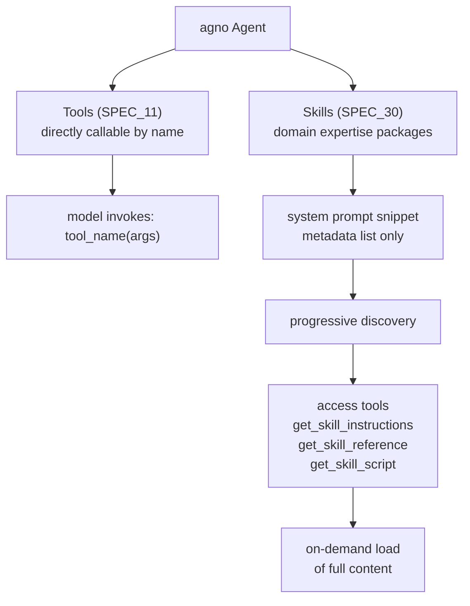
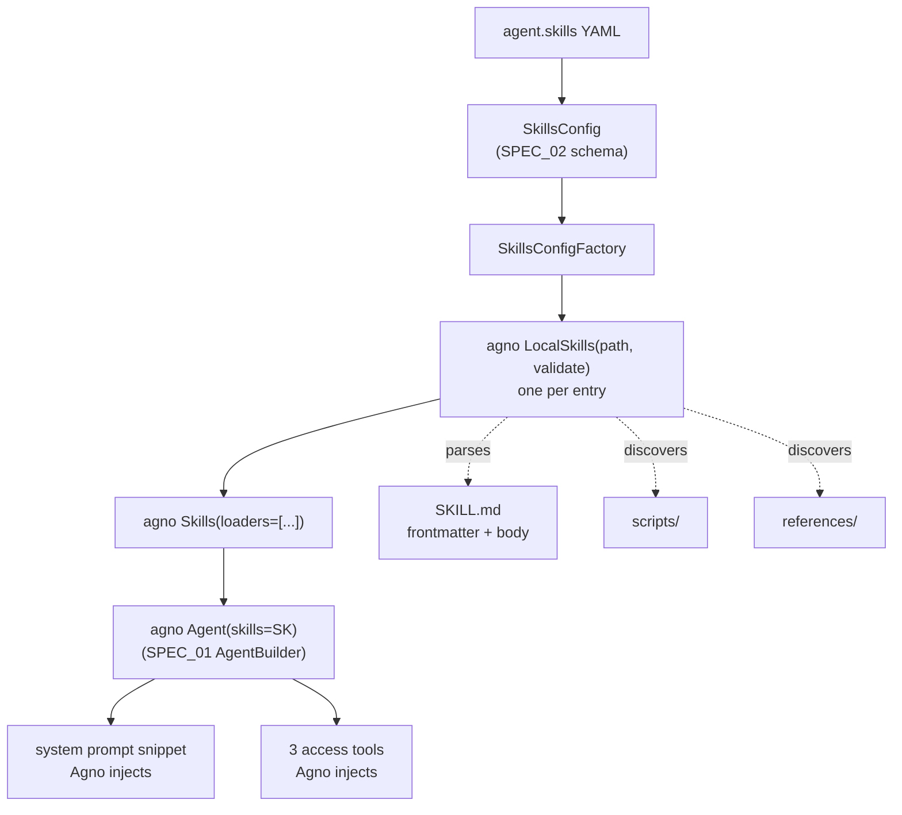

# SPEC_30_SKILLS_MANAGEMENT

> **Purpose**: Expose Agno's Skills system to YAML as a thin delegation layer. Skills are packages of downloadable domain expertise (instructions, scripts, references) that an agent loads **on demand** through access tools, NOT callable functions invoked by name. yaml-agno ONLY references filesystem paths to SKILL.md bundles and delegates loading, parsing, validation, and tool generation entirely to Agno's `LocalSkills` / `Skills` orchestrator. yaml-agno does NOT abstract, re-parse, or re-implement the content of a skill.

> @ai-directive: SPEC_30 is a DELEGATION spec. Skills are filesystem-based (SKILL.md + YAML frontmatter), which is inherently non-YAML-agent config. yaml-agno's only job is to map a YAML list of paths into `LocalSkills` loaders, instantiate the `Skills` orchestrator, and forward it to `Agent(skills=...)`. Do NOT invent a parallel skill schema, do NOT parse SKILL.md from yaml-agno, do NOT generate the system-prompt snippet or the `get_skill_*` tools ourselves — Agno already does all of that. The boundary with Tools (SPEC_11) is absolute: Tools are directly callable; Skills are progressively discovered via access tools.

---

## 1. WHAT IS A SKILL (CONCEPTUAL MODEL)

### 1.1 Skills vs Tools — the hard boundary



| Dimension | Tools (SPEC_11) | Skills (SPEC_30) |
|-----------|-----------------|------------------|
| Invocation | Directly callable by name: `tool_name(args)` | NOT callable by name; loaded on-demand via access tools |
| Content type | Executable function | Domain expertise: instructions + scripts + references |
| Loaded into context | Always (function signature + description) | Only metadata (name + description) by default; full body lazy-loaded |
| Discovery model | Eager — all tools visible to model | Progressive — model browses summaries, loads detail when relevant |
| Source | Python code / MCP server / built-in toolkit | Filesystem: `SKILL.md` bundle folder |
| Agno object | `Toolkit` / `Function` / `MCPTools` | `Skill` dataclass loaded by `LocalSkills` |
| yaml-agno concern | Full abstraction (registry, adapters, MCP resolver) | Path delegation only |

### 1.2 Why the distinction matters

A Tool is a capability the agent performs (fetch a stock price, run shell). A Skill is **knowledge** the agent consults (how to structure a brand audit, how to follow a coding standard). Stuffing dozens of skill instructions into the system prompt would bloat tokens and degrade reasoning; Agno's progressive discovery injects only a lightweight metadata index and lets the agent pull the full instructions through `get_skill_instructions` only when the task matches.

### 1.3 The Skill bundle on disk

```
./skills/brand-audit/
├── SKILL.md              # frontmatter + instructions body (REQUIRED)
├── scripts/              # executable code templates (OPTIONAL)
│   ├── extract_palette.py
│   └── generate_report.sh
└── references/           # supporting documentation (OPTIONAL)
    ├── tone_guide.md
    └── checklist.pdf
```

A single folder with `SKILL.md` is one skill; a parent folder containing many such subfolders is a skills directory.

---

## 2. AGNO SKILLS API (VERIFIED)

### 2.1 The `Skill` dataclass

Source: `agno/skills/skill.py`

```python
@dataclass
class Skill:
    name: str                              # from folder name or SKILL.md frontmatter "name"
    description: str                       # from frontmatter "description"
    instructions: str                      # full SKILL.md body (after frontmatter)
    source_path: str                       # filesystem path to the skill folder
    scripts: List[str] = []                # discovered filenames in scripts/
    references: List[str] = []             # discovered filenames in references/
    metadata: Optional[Dict[str, Any]]     # from frontmatter "metadata"
    license: Optional[str]                 # from frontmatter "license"
    compatibility: Optional[str]           # from frontmatter "compatibility"
    allowed_tools: Optional[List[str]]     # from frontmatter "allowed-tools"

    def to_dict(self) -> Dict[str, Any]: ...
    @classmethod
    def from_dict(cls, data: Dict[str, Any]) -> "Skill": ...
```

> yaml-agno never constructs `Skill` instances directly. `LocalSkills` does.

### 2.2 The `Skills` orchestrator

Source: `agno/skills/agent_skills.py`

```python
class Skills:
    def __init__(self, loaders: List[SkillLoader]): ...
    def reload(self) -> None: ...                       # clear + re-load from all loaders
    def get_skill(self, name: str) -> Optional[Skill]: ...
    def get_all_skills(self) -> List[Skill]: ...
    def get_skill_names(self) -> List[str]: ...
    def get_system_prompt_snippet(self) -> str: ...     # XML metadata index for the model
    def get_tools(self) -> List[Function]: ...          # the 3 access tools
```

On construction, `Skills` immediately iterates loaders and loads all skills into an internal dict keyed by `skill.name` (duplicate names log a warning and overwrite). The orchestrator exposes exactly three tools:

1. `get_skill_instructions(skill_name)` — load the full SKILL.md instructions + metadata.
2. `get_skill_reference(skill_name, reference_path)` — load a reference document.
3. `get_skill_script(skill_name, script_path, execute=False, args: Optional[List[str]] = None, timeout=30)` — read or execute a script (signature mirrors `agno/skills/agent_skills.py:273`).

All three tools return JSON strings (error payloads include `available_skills` / `available_references` / `available_scripts` for self-correction).

### 2.3 The `LocalSkills` loader

Source: `agno/skills/loaders/local.py`

```python
class LocalSkills(SkillLoader):
    def __init__(self, path: str, validate: bool = True): ...
    def load(self) -> List[Skill]: ...
```

Behavior:
- `path` resolves to absolute. If the folder contains `SKILL.md`, it is treated as a **single skill**; otherwise it is treated as a **directory of skill folders** (each non-hidden subfolder with a `SKILL.md` is loaded).
- `validate=True` (default) runs `validate_skill_directory(folder)`; any validation error raises `SkillValidationError` (hard failure). `validate=False` skips structural validation.
- `SKILL.md` frontmatter is parsed with YAML (`---\n...\n---` delimiters). `name` defaults to the folder name; `description` defaults to empty string. Optional keys: `license`, `metadata`, `compatibility`, `allowed-tools`.
- `scripts/` and `references/` subdirectories are auto-discovered (non-hidden files, sorted).

### 2.4 Agent integration

```python
Agent(skills: Optional[Skills] = None)
```

Constructor param `skills` (agent.py:432) is stored on the **public** `self.skills`
attribute (agent.py:588) — NOT a private `_skills`. When an `Agent` receives a `Skills` instance, Agno:
- Appends `skills.get_system_prompt_snippet()` to the agent's system prompt (the XML metadata index).
- Adds `skills.get_tools()` (the three access tools) to the agent's tool set.

yaml-agno merely constructs the `Skills` object and passes it to the `Agent` built in SPEC_01.

### 2.5 Security: path traversal protection

The access tools resolve `reference_path` and `script_path` via `safe_join_relative_path` against the skill's `source_path/references` or `/scripts` directory. A traversal attempt (`../etc/passwd`) raises `PathSecurityError` and returns a JSON error instead of reading the file. This is Agno-owned; yaml-agno does not reimplement it.

---

## 3. YAML CONFIGURATION MODEL

### 3.1 SkillsConfig aggregate

```python
# yaml-agno/src/yaml_agno/skills/schema.py  (PEP 695)
from typing import Annotated, Literal
from pydantic import BaseModel, Field

class LocalSkillEntry(BaseModel):
    """A filesystem path to one skill bundle or a directory of bundles."""
    model_config = {"extra": "forbid"}
    path: str = Field(..., min_length=1, max_length=1024,
                      description="Absolute or project-relative path to a SKILL.md folder or a skills directory.")
    validate: bool = Field(default=True,
                           description="If true, Agno runs validate_skill_directory and fails hard on invalid skills.")

class SkillsConfig(BaseModel):
    """SSOT for the skills block in an agent document."""
    model_config = {"extra": "forbid"}
    enabled: bool = Field(default=True)
    entries: list[LocalSkillEntry] = Field(default_factory=list,
                                           description="Filesystem paths delegated to LocalSkills loaders.")
```

> `SkillsConfig` is referenced from the `AgentConfig` aggregate (SPEC_02 SSOT) as `skills: SkillsConfig | None = None`. yaml-agno imports the `*Config` schemas from SPEC_02; it does not redefine the agent aggregate.

### 3.2 YAML — single skill folder

```yaml
agent:
  name: "brand_strategist"
  model:
    provider: openai
    id: gpt-4o
  skills:
    enabled: true
    entries:
      - path: ./skills/brand-audit
        validate: true
```

### 3.3 YAML — directory of skills

```yaml
agent:
  name: "fullstack_engineer"
  skills:
    entries:
      - path: ./skills          # directory containing many SKILL.md subfolders
        validate: true
      - path: ./company/skills  # a second source, merged
```

Multiple entries are merged into one `Skills` orchestrator; duplicate skill names across sources log a warning and the later one overwrites.

### 3.4 YAML — disabled (explicit)

```yaml
agent:
  name: "no_skills_agent"
  skills:
    enabled: false              # Agent receives skills=None; no snippet, no access tools
```

### 3.5 Relationship to Tools

Skills and Tools are independent. An agent may declare both; the three skill access tools simply appear alongside any SPEC_11 tools in the agent's tool set.

```yaml
agent:
  name: "analyst"
  tools:
    - kind: builtin
      name: yfinance
  skills:
    entries:
      - path: ./skills/equity-research
```

---

## 4. ARCHITECTURE — DELEGATION LAYER

### 4.1 Component map



### 4.2 Clean Architecture layers

| Layer | Component | Responsibility |
|-------|-----------|----------------|
| Domain | `SkillsConfig`, `LocalSkillEntry` (imported from SPEC_02) | Validate the YAML delegation contract |
| Ports | `SkillsFactoryPort` | Contract: `SkillsConfig -> agno.skills.Skills` |
| Adapters | `SkillsConfigFactory` | Translate entries into `LocalSkills` loaders, build `Skills` |
| Infra | `agno.skills.Skills`, `agno.skills.loaders.local.LocalSkills`, `agno.skills.skill.Skill` | All real work: parsing, validation, tool generation |

### 4.3 Ports

```python
# yaml-agno/src/yaml_agno/skills/ports.py
from typing import Protocol
from agno.skills import Skills
from yaml_agno.skills.schema import SkillsConfig

class SkillsFactoryPort(Protocol):
    """Build an agno Skills orchestrator from a validated SkillsConfig."""
    def build(self, config: SkillsConfig | None) -> Skills | None: ...
```

### 4.4 Adapter — SkillsConfigFactory

```python
# yaml-agno/src/yaml_agno/skills/factory.py
from agno.skills import Skills
from agno.skills.loaders.local import LocalSkills
from yaml_agno.skills.schema import SkillsConfig

class SkillsConfigFactory:
    """Delegates skill loading to Agno's LocalSkills.

    yaml-agno never parses SKILL.md itself. It only maps YAML path entries
    to LocalSkills loaders and constructs the agno Skills orchestrator.
    """

    def build(self, config: SkillsConfig | None) -> Skills | None:
        if config is None or not config.enabled or not config.entries:
            return None
        loaders = [
            LocalSkills(path=entry.path, validate=entry.validate)
            for entry in config.entries
        ]
        return Skills(loaders=loaders)
```

### 4.5 Integration with AgentBuilder (SPEC_01)

The `AgentBuilder` (SPEC_01) injects the `Skills` instance into the `Agent` constructor:

```python
skills = SkillsConfigFactory().build(agent_config.skills)
agent = Agent(
    ...,
    skills=skills,   # None if disabled/empty
)
```

`Agent(skills=None)` is the safe default — Agno simply adds no snippet and no access tools.

---

## 5. PROGRESSIVE DISCOVERY FLOW

### 5.1 What the model sees at rest

With `skills` configured, the agent's system prompt gains an XML block like:

```xml
<skills_system>

## What are Skills?
Skills are packages of domain expertise ...

## IMPORTANT: How to Use Skills
**Skill names are NOT callable functions.** ...

1. `get_skill_instructions(skill_name)` ...
2. `get_skill_reference(skill_name, reference_path)` ...
3. `get_skill_script(skill_name, script_path, execute=False)` ...

## Available Skills
<skill>
  <name>brand-audit</name>
  <description>Run a structured brand audit ...</description>
  <scripts>extract_palette.py, generate_report.sh</scripts>
  <references>tone_guide.md, checklist.pdf</references>
</skill>

</skills_system>
```

Only name + description + script/reference filenames are present. The full instructions body is NOT in the prompt.

### 5.2 On-demand load

When the task matches a skill, the model calls `get_skill_instructions("brand-audit")`, which returns the full SKILL.md body as JSON. The agent then reads scripts or references as needed. This keeps the resting token footprint proportional to the number of skills' metadata, not to the total volume of expertise.

### 5.3 Hot reload

`Skills.reload()` clears the internal dict and re-runs all loaders. yaml-agno exposes this via the AgentBuilder lifecycle (SPEC_01 resync path, SPEC_12 hot-reload) so that editing a SKILL.md bundle on disk is picked up without restarting the process:

```python
# Agno 2.8.3 stores skills on the PUBLIC agent.skills attribute
# (agno/agent/agent.py:432 constructor param, :588 self.skills = skills).
# Skills.reload() is a public method (agno/skills/agent_skills.py:54).
# yaml-agno wraps this in the lifecycle hook yaml_agno/runtime/skills_reload.py
# (TASK_008) so callers do not import Agno internals directly.
if agent.skills is not None:
    agent.skills.reload()
```

---

## 6. ASSUMPTIONS ADOPTED

### 6.1 [Decision] DELEGATE, do not abstract skill content
**Justification**: Skills are filesystem bundles with a SKILL.md spec defined by Anthropic's Agent Skills standard and implemented by Agno's `LocalSkills`. Re-parsing or re-validating them in yaml-agno would duplicate Agno logic, drift from the spec, and add no value. yaml-agno's only contract is: a YAML list of filesystem paths -> `LocalSkills` loaders -> `Skills` orchestrator.

### 6.2 [Decision] Skills are NOT Tools
**Justification**: The hard boundary (SPEC_11 owns callable Tools; SPEC_30 owns expertise packages) prevents confusion. A skill is never registered in the SPEC_11 ToolRegistry and is never invoked by name. The three `get_skill_*` access tools are generated by Agno, not by yaml-agno.

### 6.3 [Decision] `validate` defaults to true
**Justification**: `LocalSkills(validate=True)` catches malformed bundles at load time with `SkillValidationError` (hard failure). For dev workflows that tolerate broken bundles, the user sets `validate: false`. The default protects production.

### 6.4 [Decision] Empty or disabled skills yields `Agent(skills=None)`
**Justification**: If `enabled: false` or no entries, the factory returns `None` and the AgentBuilder passes `skills=None`. Agno adds no snippet and no access tools. No special-casing downstream.

### 6.5 [Decision] Multiple entries are merged, last-write-wins on name clash
**Justification**: `Skills.__init__` already merges all loaders into one dict, logging a warning and overwriting on duplicate skill names. yaml-agno inherits this behavior rather than enforcing uniqueness itself.

### 6.6 [Decision] Path resolution is delegated; yaml-agno only validates the string
**Justification**: `LocalSkills` calls `Path(path).resolve()` and raises `FileNotFoundError` on a missing path. yaml-agno validates that `path` is a non-empty string (schema constraint) but does not pre-stat the directory — Agno owns filesystem semantics, including the single-folder vs directory-of-folders heuristic.

### 6.7 [Decision] `extra="forbid"` on SkillsConfig and LocalSkillEntry
**Justification**: There are only two meaningful knobs (`path`, `validate`). Any other key in YAML is a user error (e.g., trying to inline a skill body). Forbidding extras surfaces mistakes early.

---

## 7. BEHAVIOR DELTA — BDD SCENARIOS

### 7.1 Acceptance scenarios

#### Scenario 1: Golden path — single skill folder loaded
```gherkin
GIVEN a YAML agent.skills with enabled=true and one entry path=./skills/brand-audit validate=true
WHEN SkillsConfigFactory.build(config) runs
THEN one LocalSkills(path=./skills/brand-audit, validate=True) is created
AND a Skills orchestrator is constructed with that loader
AND Skills.get_all_skills() returns one Skill whose name is brand-audit
AND the Agent receives skills=<that Skills instance>
```

#### Scenario 2: get_skill_instructions returns full body
```gherkin
GIVEN a loaded Skills orchestrator containing skill brand-audit
WHEN the model calls get_skill_instructions("brand-audit")
THEN a JSON string is returned with keys skill_name, description, instructions, available_scripts, available_references
AND instructions equals the full SKILL.md body
```

#### Scenario 3: System prompt snippet is injected
```gherkin
GIVEN an Agent built with a non-empty Skills instance
WHEN the agent prepares its system prompt
THEN get_system_prompt_snippet() output is appended
AND the snippet lists each skill with name, description, scripts, references
AND the snippet states that skill names are NOT callable functions
```

#### Scenario 4: Directory of skills loads multiple
```gherkin
GIVEN a YAML entry path=./skills where ./skills contains three subfolders each with SKILL.md
WHEN LocalSkills(path=./skills).load() runs
THEN three Skill objects are returned
AND all three are merged into the Skills orchestrator
```

#### Scenario 5: Validation fails hard when validate=true
```gherkin
GIVEN a malformed skill bundle missing required frontmatter and validate=true
WHEN LocalSkills(path=..., validate=True).load() runs
THEN SkillValidationError is raised
AND the SkillsConfigFactory propagates the error (no Agent is built)
```

#### Scenario 6: validate=false tolerates the same bundle
```gherkin
GIVEN the same malformed bundle but validate=false
WHEN LocalSkills(path=..., validate=False).load() runs
THEN no SkillValidationError is raised
AND the skill is either loaded leniently or skipped per Agno behavior
```

#### Scenario 7: Hot reload picks up edits
```gherkin
GIVEN a running Agent whose Skills loaded brand-audit at t0
WHEN brand-audit/SKILL.md is edited on disk and Skills.reload() is called
THEN the internal skill dict is cleared and rebuilt
AND get_skill_instructions("brand-audit") returns the updated body
```

#### Scenario 8: Disabled skills yields None
```gherkin
GIVEN a YAML agent.skills with enabled=false
WHEN SkillsConfigFactory.build(config) runs
THEN None is returned
AND the Agent is built with skills=None
AND no skill snippet and no access tools are added
```

#### Scenario 9: Path traversal is blocked by Agno
```gherkin
GIVEN a loaded skill brand-audit and a malicious request get_skill_reference("brand-audit", "../../etc/passwd")
WHEN the access tool resolves the path
THEN Agno's safe_join_relative_path raises PathSecurityError
AND a JSON error payload is returned (no file content leaks)
```

#### Scenario 10: Skills and Tools coexist
```gherkin
GIVEN a YAML agent declaring both tools (yfinance builtin) and skills (one entry)
WHEN the Agent is built
THEN the agent tool set contains the yfinance tools AND the three skill access tools
AND the system prompt contains both tool instructions and the skills snippet
```

#### Scenario 11: Script execution via get_skill_script
```gherkin
GIVEN a loaded skill whose scripts/ contains generate_report.sh
WHEN the model calls get_skill_script("brand-audit", "generate_report.sh", execute=True, timeout=30)
THEN the script runs with a 30s timeout
AND a JSON string with stdout, stderr, returncode is returned
```

#### Scenario 12: Duplicate skill names across entries warn and overwrite
```gherkin
GIVEN two entries whose bundles both define a skill named research
WHEN Skills.__init__ merges the loaders
THEN a warning is logged about the duplicate name research
AND the second loader's version overwrites the first
```

---

## 8. TDD MICRO-TASK EXECUTION PROTOCOL

### 8.1 Cascading task checklist

#### TASK_001: SkillsConfig + LocalSkillEntry schema
- **File**: `yaml-agno/src/yaml_agno/skills/schema.py`
- **Test**: `tests/unit/skills/test_schema.py`
- **RED**:
```python
def test_skills_config_single_entry():
    sc = SkillsConfig.model_validate({
        "enabled": True,
        "entries": [{"path": "./skills/brand-audit", "validate": True}],
    })
    assert sc.enabled is True
    assert sc.entries[0].validate is True

def test_skills_config_forbids_unknown_keys():
    import pytest
    from pydantic import ValidationError
    with pytest.raises(ValidationError):
        SkillsConfig.model_validate({"entries": [{"path": ".", "body": "inline not allowed"}]})
```
- **GREEN**: implement `SkillsConfig` and `LocalSkillEntry` with `extra="forbid"`.
- **Commit**: `feat(skills): add SkillsConfig and LocalSkillEntry schemas`

#### TASK_002: SkillsConfigFactory builds LocalSkills loaders
- **File**: `yaml-agno/src/yaml_agno/skills/factory.py`
- **Test**: `tests/unit/skills/test_factory_build.py`
- **RED**: given a `SkillsConfig` with two entries, `build()` returns a `Skills` whose `get_skill_names()` reflects the union of both loaders (use temp dirs with real SKILL.md fixtures).
- **GREEN**: instantiate `LocalSkills(path, validate)` per entry, wrap in `Skills`.
- **Commit**: `feat(skills): add SkillsConfigFactory delegating to LocalSkills`

#### TASK_003: Factory returns None when disabled or empty
- **File**: `yaml-agno/src/yaml_agno/skills/factory.py`
- **Test**: `tests/unit/skills/test_factory_none.py`
- **RED**: `build(None) is None`; `build(SkillsConfig(enabled=False, ...)) is None`; `build(SkillsConfig(entries=[])) is None`.
- **GREEN**: guard clauses.
- **Commit**: `feat(skills): return None for disabled/empty skills`

#### TASK_004: Validation error propagates (validate=true)
- **File**: `yaml-agno/src/yaml_agno/skills/factory.py`
- **Test**: `tests/unit/skills/test_validate_error.py`
- **RED**: a malformed bundle with `validate=True` causes `build()` to raise `SkillValidationError`.
- **GREEN**: no swallow; let Agno's exception propagate.
- **Commit**: `feat(skills): propagate SkillValidationError from LocalSkills`

#### TASK_005: AgentBuilder integration (SPEC_01 wiring)
- **File**: `yaml-agno/src/yaml_agno/runtime/agent_builder.py` (extend)
- **Test**: `tests/unit/skills/test_agent_wiring.py`
- **RED**: an `AgentConfig` with a populated `skills` block produces an `Agent` whose `agent.skills` (PUBLIC Agno attribute, agent.py:588) is the built `Skills` and whose system prompt contains `<skills_system>`.
- **GREEN**: call `SkillsConfigFactory().build(config.skills)`, pass to `Agent(skills=...)`.
- **Commit**: `feat(skills): wire Skills into AgentBuilder`

#### TASK_006: System prompt snippet presence (contract test)
- **File**: `tests/unit/skills/test_snippet_contract.py`
- **RED**: with skills configured, `agent.get_system_message(...)` (or equivalent) includes the snippet text `Skill names are NOT callable functions`.
- **GREEN**: relies on Agno injection; test guards the integration boundary.
- **Commit**: `test(skills): assert skill snippet injected into system prompt`

#### TASK_007: Access tools presence
- **File**: `tests/unit/skills/test_access_tools.py`
- **RED**: with skills configured, the agent's tool set contains functions named `get_skill_instructions`, `get_skill_reference`, `get_skill_script`.
- **GREEN**: contract test against Agno-provided tools.
- **Commit**: `test(skills): assert three access tools are registered`

#### TASK_008: Hot reload
- **File**: `yaml-agno/src/yaml_agno/runtime/skills_reload.py`
- **Test**: `tests/unit/skills/test_reload.py`
- **RED**: load a skill, edit the SKILL.md fixture, call the reload entrypoint, assert `get_skill_instructions` returns the new body.
- **GREEN**: delegate to `Skills.reload()`.
- **Commit**: `feat(skills): expose Skills.reload via lifecycle`

#### TASK_009: Path traversal is rejected
- **File**: `tests/unit/skills/test_traversal.py`
- **RED**: calling the access tool with a `../` reference returns a JSON error (no file leak).
- **GREEN**: contract test — Agno's `safe_join_relative_path` provides the guard.
- **Commit**: `test(skills): assert path traversal blocked`

#### TASK_010: Directory-of-skills vs single-folder heuristic
- **File**: `tests/unit/skills/test_loader_heuristic.py`
- **RED**: a path with a direct `SKILL.md` yields one skill; a parent folder of three skill subfolders yields three.
- **GREEN**: contract test against `LocalSkills` behavior.
- **Commit**: `test(skills): verify single-folder and directory loading heuristic`

#### TASK_011: Integration test — agent answers using a skill
- **File**: `tests/integration/test_skills_e2e.py`
- **Test**: build an agent with one real skill bundle, run a prompt that matches the skill, assert the model called `get_skill_instructions` (mock the LLM to force the tool call) and the instructions body was loaded.
- **RED**: assert the tool-call trace.
- **GREEN**: `@pytest.mark.integration`.
- **Commit**: `test(skills): add e2e integration test`

---

## 9. CALIBRATION QUESTIONS

### 9.1 [Question] Remote skills (URL / git)?
**Should yaml-agno support non-local skill sources (a git URL, an HTTP bundle) in addition to filesystem paths?**
Implication: Agno's current loader is `LocalSkills` (filesystem only). Remote support would require either an upstream Agno loader or a yaml-agno adapter that fetches+clones to a temp dir before delegating to `LocalSkills`. Proposal: out of scope for MVP; track as a post-MVP `RemoteSkillEntry` with a fetcher port. Surface a clear "not supported" error if a URL is passed to `path`.

### 9.2 [Question] Per-skill `validate` vs global?
**Should `validate` live per-entry (current design) or once at the `SkillsConfig` level?**
Implication: per-entry allows mixed dev (lenient) + prod (strict) sources in one agent. Global is simpler. Proposal: keep per-entry (matches `LocalSkills(path, validate)` arity 1:1) and let a global default be a future convenience flag if users ask for it.

### 9.3 [Question] Skills at the Team level?
**Agno supports Team skills (leader-level access). Should yaml-agno expose `team.skills` in addition to `agent.skills`?**
Implication: SPEC_05 (Workflows and Teams) would need a `TeamSkillsConfig` mirror. Proposal: yes, but as a thin reuse of `SkillsConfigFactory` — the same config block, forwarded to `Team(skills=...)`. Coordinate with SPEC_05 before adding.

### 9.4 [Question] Should yaml-agno pin a Skills spec version?
**Anthropic's Agent Skills standard may evolve. Should yaml-agno declare a supported spec version?**
Implication: pinning protects against breaking changes but delays new features. Proposal: do not pin in yaml-agno (we delegate parsing to Agno); document the Agno version that ships the supported spec in SPEC_01's pinned dependency.

### 9.5 [Question] Skill discovery UI / introspection endpoint?
**Should the AgentOS control plane (SPEC_12) expose a `/agents/{id}/skills` read-only endpoint listing loaded skill names?**
Implication: useful for dashboards (SPEC_07) and debugging; cheap because `Skills.get_skill_names()` already exists. Proposal: add as a read-only endpoint in a later iteration; out of MVP scope but design `SkillsConfigFactory` to keep the `Skills` instance reachable from the agent.
