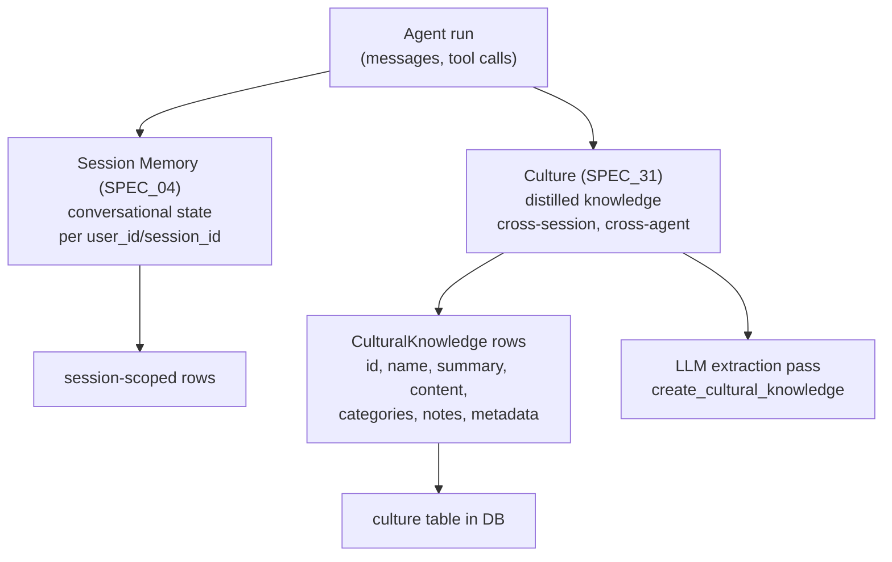
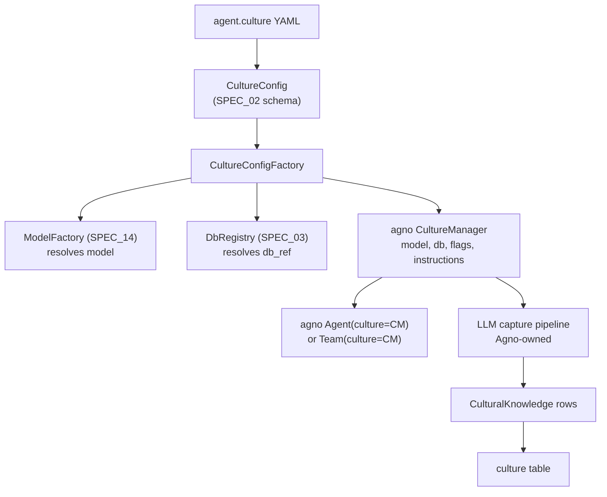

# SPEC_31_CULTURE_MANAGER

> **Purpose**: Expose Agno's `CultureManager` to YAML as a thin reference layer. Culture is **experimental** in Agno (the source docstring states verbatim: "Culture is an experimental feature and is subject to change"). It captures shared, cross-session knowledge (best practices, guardrails, patterns, lessons) by running an LLM extraction pass over run messages and persisting `CulturalKnowledge` rows in a database. yaml-agno only CONFIGURES the manager (model, db, CRUD toggles, custom capture instructions) and delegates the LLM extraction pipeline entirely to Agno.

> @ai-directive: SPEC_31 is a REFERENCE-to-experimental spec. Because Agno marks Culture unstable, yaml-agno MUST (a) flag it as experimental in every schema and error path, (b) avoid building any abstraction over the LLM capture pipeline (`create_or_update_cultural_knowledge`, the system-message builder, the db-tool generator are all Agno-owned), and (c) document the hard boundary with SPEC_04 (Memory): Memory is per-session conversational state; Culture is cross-session distilled knowledge. yaml-agno constructs the `CultureManager` dataclass and forwards it; nothing more.

---

## 1. WHAT IS CULTURE (CONCEPTUAL MODEL)

### 1.1 Culture vs Memory — the hard boundary



| Dimension | Memory (SPEC_04) | Culture (SPEC_31) |
|-----------|------------------|-------------------|
| Scope | One session (user_id + session_id) | Cross-session, shared across agents/teams |
| Content | Conversational state: messages, working memory, learnings | Distilled knowledge: best practices, guardrails, patterns, principles |
| Origin | Direct run state + Agno `LearningMachine`/`MemoryManager` | LLM extraction over run messages |
| Stability | Stable Agno feature | **Experimental** (Agno docstring warning) |
| Agno object | `MemoryManager` / `LearningMachine` | `CultureManager` |
| yaml-agno concern | Configure native memory (SPEC_04) | Configure `CultureManager` + flag experimental |

### 1.2 Why the distinction matters

Memory answers "what happened in this conversation and what did this user learn?" Culture answers "what should every agent in this organization know going forward?" Culture is the long-lived, distilled layer; Memory is the per-session substrate. They share a database backend but use different tables and different lifecycle hooks.

### 1.3 Experimental status — mandatory surfacing

Source: `agno/culture/manager.py`, `CultureManager` class docstring:

> Notice: Culture is an experimental feature and is subject to change.

Consequences for yaml-agno:
- Every `culture:` block in YAML MUST carry an implicit experimental marker surfaced in tooling (logs, validation warnings).
- The schema MUST be permissive enough to absorb upstream churn (forward-compatible field handling).
- Documentation MUST warn users not to build business-critical logic on Culture alone until it stabilizes.

---

## 2. AGNO CULTURE API (VERIFIED)

### 2.1 The `CultureManager` dataclass

Source: `agno/culture/manager.py`

```python
@dataclass
class CultureManager:
    """Culture Manager

    Notice: Culture is an experimental feature and is subject to change.
    """
    model: Optional[Model] = None
    system_message: Optional[str] = None
    culture_capture_instructions: Optional[str] = None
    additional_instructions: Optional[str] = None
    db: Optional[Union[AsyncBaseDb, BaseDb]] = None

    # ----- Db tools ---------
    add_knowledge: bool = True
    update_knowledge: bool = True
    delete_knowledge: bool = True       # dataclass default; __init__ overrides to False
    clear_knowledge: bool = True

    # ----- Internal ---------
    knowledge_updated: bool = False
    debug_mode: bool = False
```

Constructor signature (the `__init__` re-declares defaults):

```python
def __init__(
    self,
    model: Optional[Union[Model, str]] = None,
    db: Optional[Union[BaseDb, AsyncBaseDb]] = None,
    system_message: Optional[str] = None,
    culture_capture_instructions: Optional[str] = None,
    additional_instructions: Optional[str] = None,
    add_knowledge: bool = True,
    update_knowledge: bool = True,
    delete_knowledge: bool = False,     # NOTE: __init__ default is False
    clear_knowledge: bool = True,
    debug_mode: bool = False,
): ...
```

> **Verified gotcha**: the dataclass field `delete_knowledge` defaults to `True`, but the explicit `__init__` overrides the default to `False`. Because Python uses `__init__` for construction, the effective default is `delete_knowledge=False`. yaml-agno's schema mirrors the effective `__init__` default, not the dataclass field default.

### 2.2 Model resolution

`get_model()` lazily resolves `model`:
- If `model` is a `str` or `Model`, `get_model(model)` normalizes it.
- If `model` is `None`, it falls back to `OpenAIChat(id="gpt-4o")` (requires the `openai` extra; exits with a clear error if missing).

yaml-agno resolves the model via the SPEC_14 `ModelConfig`/`ModelFactory` and passes a resolved `Model` instance. yaml-agno does NOT rely on the `gpt-4o` fallback in production paths.

### 2.3 CulturalKnowledge schema

Source: `agno/db/schemas/culture.py`

```python
@dataclass
class CulturalKnowledge:
    id: str
    name: str
    content: str
    categories: list
    notes: list
    summary: str
    metadata: dict
    input: str
    created_at, updated_at
    agent_id, team_id
```

yaml-agno **references** `CulturalKnowledge` only — it never constructs rows itself. All persistence goes through the `CultureManager`'s db tools.

### 2.4 Public methods (sync + async pairs)

```python
# Capture (LLM extraction)
def create_cultural_knowledge(self, message=None, messages=None, run_metrics=None) -> str: ...
async def acreate_cultural_knowledge(self, message=None, messages=None, run_metrics=None) -> str: ...

# Direct CRUD
def add_cultural_knowledge(self, knowledge: CulturalKnowledge) -> Optional[str]: ...
def update_cultural_knowledge(self, knowledge: CulturalKnowledge) -> Optional[str]: ...
def delete_cultural_knowledge(self, id: str) -> None: ...
def get_knowledge(self, id: str) -> Optional[CulturalKnowledge]: ...
async def aget_knowledge(self, id: str) -> Optional[CulturalKnowledge]: ...
def get_all_knowledge(self, name: Optional[str] = None) -> Optional[List[CulturalKnowledge]]: ...
async def aget_all_knowledge(self, name: Optional[str] = None) -> Optional[List[CulturalKnowledge]]: ...
def clear_all_knowledge(self) -> None: ...

> Note: `add_cultural_knowledge`, `update_cultural_knowledge`, `delete_cultural_knowledge` are ALSO generated as LLM tools inside the capture pipeline (see §2.6, §5.3) — the same names appear both as direct Python methods (consumers may call them to bypass the LLM pass) and as model-callable functions gated by the boolean flags. yaml-agno only forwards the flags; it does not reimplement either surface.

# Maintenance task (delete/update/clear via LLM)
def update_culture_task(self, task: str) -> str: ...
async def aupdate_culture_task(self, task: str) -> str: ...
```

### 2.5 DB operations (delegated to the db backend)

The `db` object (a `BaseDb` or `AsyncBaseDb`) provides: `db.get_cultural_knowledge(id=...)`, `db.get_all_cultural_knowledge(name=...)`, `db.upsert_cultural_knowledge(cultural_knowledge=...)`, `db.clear_cultural_knowledge()`, `db.delete_cultural_knowledge(id=...)`. yaml-agno reuses the same DB instance configured for the agent (SPEC_03 persistence); it does not open a separate connection for culture.

### 2.6 The capture pipeline (Agno-owned)

`create_cultural_knowledge`:
1. Loads existing knowledge via `get_all_knowledge()`.
2. Builds a system message with `get_system_message(existing_knowledge, ...)` instructing the model to add/update/delete using db tools.
3. Generates the db tools (`add_cultural_knowledge`, `update_cultural_knowledge`, `delete_cultural_knowledge`, `clear_cultural_knowledge`) gated by the four boolean flags.
4. Runs `model.response(messages=[system, *messages], tools=_tools)`.
5. If `response.tool_calls` is non-empty, sets `knowledge_updated=True`.

yaml-agno NEVER reimplements steps 1–5. It only supplies `model`, `db`, the flags, and optional instruction overrides.

---

## 3. YAML CONFIGURATION MODEL

### 3.1 CultureConfig aggregate

```python
# yaml-agno/src/yaml_agno/culture/schema.py  (PEP 695)
from typing import Annotated, Literal
from pydantic import BaseModel, Field

class CultureConfig(BaseModel):
    """Configuration for the experimental CultureManager.

    Agno marks Culture as experimental ("subject to change").
    yaml-agno surfaces this instability to users and remains forward-compatible.
    """
    model_config = {"extra": "ignore"}   # forward-compat: tolerate upstream field churn

    enabled: bool = Field(default=False,
                          description="Culture is experimental and OFF by default.")
    experimental_acknowledged: bool = Field(
        default=False,
        description="Must be true when enabled=true. Confirms the user accepts Culture instability."
    )

    # Model: a reference resolved via SPEC_14 ModelConfig (provider+id) or inline.
    model: "ModelRef | None" = Field(default=None,
        description="Model used for cultural knowledge extraction. Falls back to Agno's OpenAIChat(gpt-4o).")

    # DB: reference to a db defined in the persistence catalog (SPEC_03), or inline.
    db_ref: str | None = Field(default=None,
        description="Name/id of the DB in the persistence catalog used to store CulturalKnowledge.")

    # Capture tuning (all optional; Agno supplies defaults).
    system_message: str | None = None
    culture_capture_instructions: str | None = None
    additional_instructions: str | None = None

    # CRUD toggles — mirror CultureManager.__init__ effective defaults.
    add_knowledge: bool = True
    update_knowledge: bool = True
    delete_knowledge: bool = False     # mirrors __init__ default (NOT the dataclass field default)
    clear_knowledge: bool = True

    debug_mode: bool = False
```

> `CultureConfig` is referenced from the agent/team aggregate (SPEC_02 SSOT) as `culture: CultureConfig | None = None`. `ModelRef` is the shared model reference VO from SPEC_14. yaml-agno imports these; it does not redefine them.

### 3.2 Forward declaration stub (PEP 695)

```python
type ModelRef = str | dict   # resolved to a Model by the ModelFactory (SPEC_14)
```

### 3.3 YAML — culture enabled with a catalog db

```yaml
agent:
  name: "ops_advisor"
  model:
    provider: openai
    id: gpt-4o
  culture:
    enabled: true
    experimental_acknowledged: true
    model:
      provider: openai
      id: gpt-4o
    db_ref: "primary_pg"          # resolved against the persistence catalog (SPEC_03)
    add_knowledge: true
    update_knowledge: true
    delete_knowledge: false
    clear_knowledge: true
    additional_instructions: "Prefer deprecating over deleting outdated practices."
```

### 3.4 YAML — custom capture instructions

```yaml
agent:
  name: "support_agent"
  culture:
    enabled: true
    experimental_acknowledged: true
    db_ref: "primary_pg"
    culture_capture_instructions: |
      Capture recurring support patterns, escalation triggers, and tone guidelines
      that improve first-contact resolution across the support team.
```

### 3.5 YAML — disabled (default)

```yaml
agent:
  name: "stateless_agent"
  culture:
    enabled: false          # no CultureManager constructed; agent.culture is None
```

### 3.6 Validation rule: experimental acknowledgment

```python
@model_validator(mode="after")
def _require_acknowledgment(self):
    if self.enabled and not self.experimental_acknowledged:
        raise ValueError(
            "Culture is an experimental Agno feature. Set experimental_acknowledged: true "
            "to enable it. See SPEC_31."
        )
    return self
```

---

## 4. ARCHITECTURE — REFERENCE LAYER

### 4.1 Component map



### 4.2 Clean Architecture layers

| Layer | Component | Responsibility |
|-------|-----------|----------------|
| Domain | `CultureConfig` (imported from SPEC_02), experimental validator | Validate YAML, enforce acknowledgment |
| Ports | `CultureFactoryPort`, `ModelResolverPort`, `DbResolverPort` | Contracts for building the manager |
| Adapters | `CultureConfigFactory`, delegates to SPEC_14 + SPEC_03 | Resolve model + db, construct `CultureManager` |
| Infra | `agno.culture.manager.CultureManager`, `agno.db.schemas.culture.CulturalKnowledge`, db backend | All extraction and persistence |

### 4.3 Ports

```python
# yaml-agno/src/yaml_agno/culture/ports.py
from typing import Protocol
from agno.culture.manager import CultureManager
from yaml_agno.culture.schema import CultureConfig

class CultureFactoryPort(Protocol):
    """Build an agno CultureManager from a validated CultureConfig."""
    def build(self, config: CultureConfig | None) -> CultureManager | None: ...
```

### 4.4 Adapter — CultureConfigFactory

```python
# yaml-agno/src/yaml_agno/culture/factory.py
import logging
from agno.culture.manager import CultureManager
from yaml_agno.culture.schema import CultureConfig
from yaml_agno.models.factory import ModelFactory        # SPEC_14
from yaml_agno.persistence.registry import DbRegistry    # SPEC_03

_log = logging.getLogger(__name__)

class CultureConfigFactory:
    """Constructs a CultureManager, delegating the LLM pipeline to Agno.

    Culture is EXPERIMENTAL in Agno. yaml-agno only configures it.
    """

    def __init__(self, db_registry: DbRegistry):
        self._db_registry = db_registry

    def build(self, config: CultureConfig | None) -> CultureManager | None:
        if config is None or not config.enabled:
            return None

        # Experimental warning at construction time.
        _log.warning(
            "Culture is an experimental Agno feature and is subject to change (SPEC_31)."
        )

        model = ModelFactory().build(config.model) if config.model is not None else None
        db = None
        if config.db_ref is not None:
            db = self._db_registry.get(config.db_ref)
            if db is None:
                raise ValueError(
                    f"Culture db_ref '{config.db_ref}' not found in persistence catalog (SPEC_03)."
                )

        return CultureManager(
            model=model,
            db=db,
            system_message=config.system_message,
            culture_capture_instructions=config.culture_capture_instructions,
            additional_instructions=config.additional_instructions,
            add_knowledge=config.add_knowledge,
            update_knowledge=config.update_knowledge,
            delete_knowledge=config.delete_knowledge,
            clear_knowledge=config.clear_knowledge,
            debug_mode=config.debug_mode,
        )
```

### 4.5 Integration with AgentBuilder / TeamBuilder

The builder (SPEC_01 / SPEC_05) forwards the constructed manager:

```python
culture = CultureConfigFactory(db_registry).build(agent_config.culture)
agent = Agent(
    ...,
    culture=culture,   # None if disabled
)
```

`Agent(culture=None)` (or unset) means no culture capture runs.

---

## 5. CAPTURE FLOW (REFERENCE — AGNO-OWNED)

### 5.1 When capture runs

`create_cultural_knowledge(message=..., run_metrics=...)` is invoked by Agno's agent run lifecycle at the end of a run when a `CultureManager` is attached. yaml-agno does not schedule this call; Agno does.

### 5.2 What the model receives

A system message built by `get_system_message(...)` containing:
- The role ("Cultural Knowledge Manager").
- Criteria for what to capture (from `culture_capture_instructions` or the Agno default).
- The existing knowledge as `<existing_knowledge>` context.
- Tool-permission lines gated by the four flags (`add_knowledge`, `update_knowledge`, `delete_knowledge`, `clear_knowledge`).
- A no-op contract: respond "No changes needed" when nothing valuable emerged.
- A privacy guardrail: never include secrets or personal data.

### 5.3 Tool gating

The four boolean flags control which db tools are exposed to the extraction model:

| Flag | Default (effective) | Tool exposed |
|------|---------------------|--------------|
| `add_knowledge` | `True` | `add_cultural_knowledge(name, summary, content, categories)` |
| `update_knowledge` | `True` | `update_cultural_knowledge(knowledge_id, name, summary, content, categories)` |
| `delete_knowledge` | `False` | `delete_cultural_knowledge(knowledge_id)` |
| `clear_knowledge` | `True` | `clear_cultural_knowledge()` |

> `delete_knowledge` defaults to `False` (conservative: the model cannot destroy existing cultural knowledge unless explicitly enabled). yaml-agno preserves this default.

### 5.4 Metrics

When `run_metrics` is passed, the capture model's usage is accumulated under `ModelType.CULTURE_MODEL` via `accumulate_model_metrics`. yaml-agno surfaces these in the observability layer (SPEC_09 / SPEC_18) without re-deriving them.

---

## 6. ASSUMPTIONS ADOPTED

### 6.1 [Decision] REFERENCIAR experimental, do not abstract the LLM pipeline
**Justification**: Agno owns `create_or_update_cultural_knowledge`, `get_system_message`, the db-tool generator, and the `Function.from_callable` wrapping. Reimplementing any of it would drift from upstream and duplicate the extraction prompt. yaml-agno constructs the `CultureManager` dataclass and forwards it; that is the entire yaml-agno responsibility.

### 6.2 [Decision] Culture is OFF by default; requires explicit acknowledgment
**Justification**: Agno marks Culture experimental and "subject to change." Enabling it silently would expose users to breaking upstream changes. `enabled: false` is the safe default; `experimental_acknowledged: true` is required to flip it on. This surfaces the instability at config-validation time, not at runtime.

### 6.3 [Decision] `delete_knowledge` mirrors the `__init__` default (`False`)
**Justification**: The `CultureManager` dataclass field defaults to `True`, but the explicit `__init__` overrides it to `False` (verified in source). Effective default is `False`. yaml-agno mirrors the effective behavior to avoid surprise destructive deletes by the extraction model.

### 6.4 [Decision] Model is resolved via SPEC_14, not the gpt-4o fallback
**Justification**: `get_model()` falls back to `OpenAIChat(id="gpt-4o")` when `model` is `None`, which exits the process if the `openai` extra is missing. yaml-agno resolves the model explicitly through `ModelFactory` (SPEC_14) so the dependency and provider are intentional, not accidental.

### 6.5 [Decision] DB is shared with the agent's persistence catalog (SPEC_03)
**Justification**: `CulturalKnowledge` rows live in the same DB the agent uses for sessions (separate table). Opening a dedicated culture connection would fragment state and complicate multi-tenant isolation (SPEC_19). `db_ref` resolves against the existing `DbRegistry`.

### 6.6 [Decision] `extra="ignore"` on CultureConfig for forward compatibility
**Justification**: Because Culture is experimental, upstream may add/rename fields. `extra="ignore"` lets yaml-agno absorb additive changes without breaking existing YAMLs. Unknown keys are logged at debug level, not rejected. (Contrast with SPEC_30's `extra="forbid"` — Skills is stable, Culture is not.)

### 6.7 [Decision] Boundary with Memory (SPEC_04) is documented, not enforced in code
**Justification**: yaml-agno cannot prevent a user from enabling both Culture and Memory on the same agent (they serve different layers). The spec documents the conceptual boundary; code only ensures each is configured correctly. No cross-validation between the two blocks.

---

## 7. BEHAVIOR DELTA — BDD SCENARIOS

### 7.1 Acceptance scenarios

#### Scenario 1: Golden path — culture enabled and acknowledged
```gherkin
GIVEN a YAML agent.culture with enabled=true experimental_acknowledged=true db_ref=primary_pg
AND a model block provider=openai id=gpt-4o
WHEN CultureConfigFactory.build(config) runs
THEN a CultureManager is constructed with the resolved Model and the DB from the catalog
AND add_knowledge=true update_knowledge=true delete_knowledge=false clear_knowledge=true
AND the Agent is built with culture=<that CultureManager>
```

#### Scenario 2: create_cultural_knowledge extracts via LLM
```gherkin
GIVEN a CultureManager with a configured model and db
WHEN create_cultural_knowledge(message="We learned to always paginate large result sets.") runs
THEN the model receives the system message with existing knowledge context
AND the db tools gated by the flags are exposed
AND if the model calls add_cultural_knowledge a CulturalKnowledge row is upserted
AND knowledge_updated becomes true
```

#### Scenario 3: get_all_knowledge returns persisted rows
```gherkin
GIVEN a CultureManager whose db contains three CulturalKnowledge rows
WHEN get_all_knowledge() runs
THEN a list of three CulturalKnowledge objects is returned
AND get_all_knowledge(name="pagination") filters by name
```

#### Scenario 4: No-op when nothing valuable emerges
```gherkin
GIVEN a CultureManager and a run whose message contains no new insight
WHEN create_cultural_knowledge runs
THEN the model responds "No changes needed"
AND no tool calls are made
AND knowledge_updated remains false
```

#### Scenario 5: delete_knowledge=False hides the delete tool
```gherkin
GIVEN a CultureConfig with delete_knowledge=false
WHEN the capture pipeline builds the db tools
THEN delete_cultural_knowledge is NOT in the tool set
AND the model cannot destroy existing cultural knowledge
```

#### Scenario 6: Experimental acknowledgment required
```gherkin
GIVEN a YAML agent.culture with enabled=true and experimental_acknowledged omitted (false)
WHEN CultureConfig.model_validate runs
THEN ValidationError is raised with a message referencing the experimental status
AND no CultureManager is constructed
```

#### Scenario 7: Disabled yields None
```gherkin
GIVEN a YAML agent.culture with enabled=false
WHEN CultureConfigFactory.build(config) runs
THEN None is returned
AND the Agent is built with culture=None
AND no capture pass runs during the agent run
```

#### Scenario 8: Missing db_ref raises a clear error
```gherkin
GIVEN a CultureConfig with enabled=true and db_ref=nonexistent
WHEN CultureConfigFactory.build(config) runs
THEN ValueError is raised indicating db_ref not found in the persistence catalog
```

#### Scenario 9: Model fallback to gpt-4o when omitted
```gherkin
GIVEN a CultureConfig with enabled=true and no model block
WHEN CultureConfigFactory.build(config) passes model=None to CultureManager
THEN Agno's get_model() lazily resolves OpenAIChat(id=gpt-4o) on first capture
AND the capture proceeds with the OpenAI model
```

#### Scenario 10: Custom capture instructions override default
```gherkin
GIVEN a CultureConfig with culture_capture_instructions set to custom text
WHEN the capture pipeline builds the system message
THEN the custom instructions appear in the knowledge_to_capture section
AND the Agno default capture criteria are replaced
```

#### Scenario 11: Async path mirrors sync
```gherkin
GIVEN an async CultureManager (AsyncBaseDb)
WHEN acreate_cultural_knowledge(message=...) runs
THEN the same extraction pipeline executes asynchronously
AND aget_all_knowledge returns rows from the async db
```

#### Scenario 12: Forward-compatible unknown keys are tolerated
```gherkin
GIVEN a YAML agent.culture with an unknown key future_field=value
WHEN CultureConfig.model_validate runs
THEN no ValidationError is raised (extra=ignore)
AND the known fields are parsed normally
```

---

## 8. TDD MICRO-TASK EXECUTION PROTOCOL

### 8.1 Cascading task checklist

#### TASK_001: CultureConfig schema with experimental validator
- **File**: `yaml-agno/src/yaml_agno/culture/schema.py`
- **Test**: `tests/unit/culture/test_schema.py`
- **RED**:
```python
def test_culture_requires_acknowledgment():
    import pytest
    from pydantic import ValidationError
    with pytest.raises(ValidationError):
        CultureConfig.model_validate({"enabled": True})

def test_culture_default_flags():
    cc = CultureConfig.model_validate({
        "enabled": True, "experimental_acknowledged": True, "db_ref": "pg"
    })
    assert cc.add_knowledge is True
    assert cc.update_knowledge is True
    assert cc.delete_knowledge is False
    assert cc.clear_knowledge is True
```
- **GREEN**: implement `CultureConfig` + `_require_acknowledgment` validator + `extra="ignore"`.
- **Commit**: `feat(culture): add CultureConfig with experimental acknowledgment`

#### TASK_002: CultureConfigFactory builds the manager
- **File**: `yaml-agno/src/yaml_agno/culture/factory.py`
- **Test**: `tests/unit/culture/test_factory_build.py`
- **RED**: given a config with a resolved model and a catalog db, `build()` returns a `CultureManager` whose `db` is the catalog instance and whose `add_knowledge`/`delete_knowledge` flags match the config.
- **GREEN**: resolve model via `ModelFactory`, db via `DbRegistry`, construct `CultureManager`.
- **Commit**: `feat(culture): add CultureConfigFactory delegating to Agno CultureManager`

#### TASK_003: Factory returns None when disabled
- **File**: `yaml-agno/src/yaml_agno/culture/factory.py`
- **Test**: `tests/unit/culture/test_factory_none.py`
- **RED**: `build(None) is None`; `build(CultureConfig(enabled=False)) is None`.
- **GREEN**: guard clause.
- **Commit**: `feat(culture): return None when culture disabled`

#### TASK_004: Missing db_ref raises clear error
- **File**: `yaml-agno/src/yaml_agno/culture/factory.py`
- **Test**: `tests/unit/culture/test_db_ref_missing.py`
- **RED**: a config with an unknown `db_ref` raises `ValueError` naming the catalog.
- **GREEN**: look up in `DbRegistry`; raise if absent.
- **Commit**: `feat(culture): validate db_ref against persistence catalog`

#### TASK_005: Flag forwarding matches __init__ defaults
- **File**: `tests/unit/culture/test_flag_forwarding.py`
- **RED**: the constructed `CultureManager.delete_knowledge is False` (not the dataclass field default True).
- **GREEN**: pass `delete_knowledge=config.delete_knowledge` explicitly.
- **Commit**: `test(culture): assert delete_knowledge mirrors __init__ default`

#### TASK_006: Experimental warning is logged
- **File**: `tests/unit/culture/test_experimental_warning.py`
- **RED**: when `build()` runs on an enabled config, a warning containing "experimental" is logged.
- **GREEN**: `_log.warning(...)` in the factory.
- **Commit**: `test(culture): assert experimental warning logged at build`

#### TASK_007: AgentBuilder / TeamBuilder wiring
- **File**: `yaml-agno/src/yaml_agno/runtime/agent_builder.py` (extend)
- **Test**: `tests/unit/culture/test_agent_wiring.py`
- **RED**: an `AgentConfig` with a culture block produces an `Agent` whose culture attribute is the built manager.
- **GREEN**: call `CultureConfigFactory(db_registry).build(config.culture)`, forward to `Agent(culture=...)`.
- **Commit**: `feat(culture): wire CultureManager into AgentBuilder`

#### TASK_008: Capture pipeline is delegated (contract test)
- **File**: `tests/unit/culture/test_capture_delegated.py`
- **RED**: spy on `CultureManager.create_cultural_knowledge`; assert yaml-agno never reimplements the system-message builder or db-tool generator (no calls to construct `Function.from_callable` for culture tools in yaml-agno code).
- **GREEN**: static/contract test guarding the delegation boundary.
- **Commit**: `test(culture): assert capture pipeline not reimplemented`

#### TASK_009: Model resolution via SPEC_14
- **File**: `tests/unit/culture/test_model_resolution.py`
- **RED**: a config with a `provider: openai id: gpt-4o` model block produces a `CultureManager.model` that is the resolved OpenAIChat instance.
- **GREEN**: delegate to `ModelFactory`.
- **Commit**: `test(culture): assert model resolved via ModelFactory`

#### TASK_010: Async parity
- **File**: `tests/unit/culture/test_async_parity.py`
- **RED**: with an `AsyncBaseDb` in the catalog, the built manager supports `acreate_cultural_knowledge` (call signature present).
- **GREEN**: contract test against Agno async methods.
- **Commit**: `test(culture): assert async capture path available`

#### TASK_011: Forward compatibility (unknown keys tolerated)
- **File**: `tests/unit/culture/test_forward_compat.py`
- **RED**: a config with `future_field: x` validates without error.
- **GREEN**: `extra="ignore"` (already set); test guards it.
- **Commit**: `test(culture): assert unknown keys tolerated for forward compat`

#### TASK_012: Integration test — end-to-end capture (mocked LLM)
- **File**: `tests/integration/test_culture_e2e.py`
- **Test**: build an agent with culture enabled, run a message, mock the extraction model to emit an `add_cultural_knowledge` tool call, assert a `CulturalKnowledge` row appears in the (test) db and `knowledge_updated` is true.
- **RED**: assert the persisted row.
- **GREEN**: `@pytest.mark.integration`.
- **Commit**: `test(culture): add e2e integration test with mocked extraction`

---

## 9. CALIBRATION QUESTIONS

### 9.1 [Question] When does Culture stop being experimental?
**What is the migration plan when Agno stabilizes Culture — should yaml-agno drop the `experimental_acknowledged` requirement automatically, or keep it behind a feature flag?**
Implication: Agno's docstring is the source of truth for "experimental." yaml-agno cannot detect stabilization programmatically. Proposal: monitor the Agno changelog; when the docstring notice is removed, deprecate `experimental_acknowledged` (keep accepting it, stop requiring it) in a minor bump. Document the dependency pin in SPEC_01.

### 9.2 [Question] Multi-tenant isolation of cultural knowledge?
**Should cultural knowledge be scoped per tenant (SPEC_19 multi-tenant = core infra), or is it intentionally global to the DB?**
Implication: `CulturalKnowledge` carries `agent_id` and `team_id` but no explicit tenant column in the verified schema. If Culture is meant to be shared org-wide, tenant isolation is the DB's responsibility (separate schemas/databases per tenant). Proposal: treat Culture as tenant-scoped at the DB level (one catalog db per tenant) rather than adding a yaml-agno tenant filter, consistent with SPEC_03/SPEC_19.

### 9.3 [Question] Should yaml-agno expose `update_culture_task`?
**Agno exposes `update_culture_task(task)` / `aupdate_culture_task(task)` for LLM-driven maintenance (delete/update/clear via a task prompt). Should yaml-agno surface a way to invoke it, or leave it to direct Agno API usage?**
Implication: it is a runtime operation, not a config concern. Proposal: out of scope for the config layer (SPEC_31 only configures the manager). If users need it, expose via a thin runtime helper in a later spec; do not block MVP.

### 9.4 [Question] Cost controls for the extraction model?
**`create_cultural_knowledge` runs an LLM pass on (potentially) every run. Should yaml-agno add throttling/sampling on top of Agno's invocation?**
Implication: unbounded extraction is costly. Agno controls when capture runs; yaml-agno does not see the run boundary easily. Proposal: coordinate with SPEC_15 (context engineering) and SPEC_09 (observability) to surface `CULTURE_MODEL` token cost; consider a post-MVP `capture_frequency` knob if Agno exposes a hook.

### 9.5 [Question] Privacy/PII guardrail ownership?
**The Agno system message includes a "never include secrets or personal data" instruction. Is that sufficient, or should yaml-agno add a SPEC_16-style PII mask before the message reaches the extraction model?**
Implication: the extraction model sees raw run messages. A prompt-level guardrail is soft; a code-level mask is hard. Proposal: rely on Agno's prompt guardrail for MVP (it is explicit in source); track a hardening task under SPEC_16 if sensitive workloads require masking the message before extraction.
