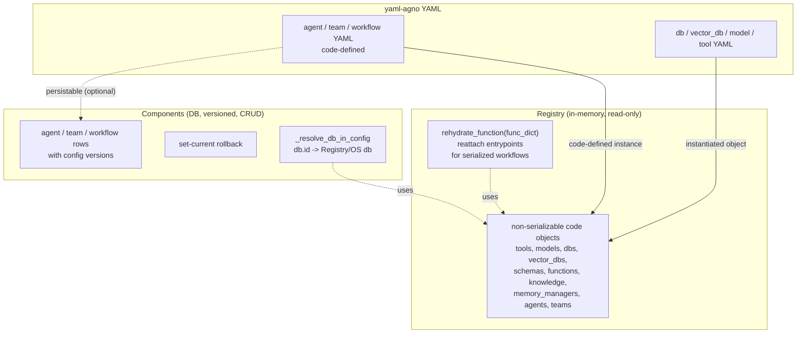
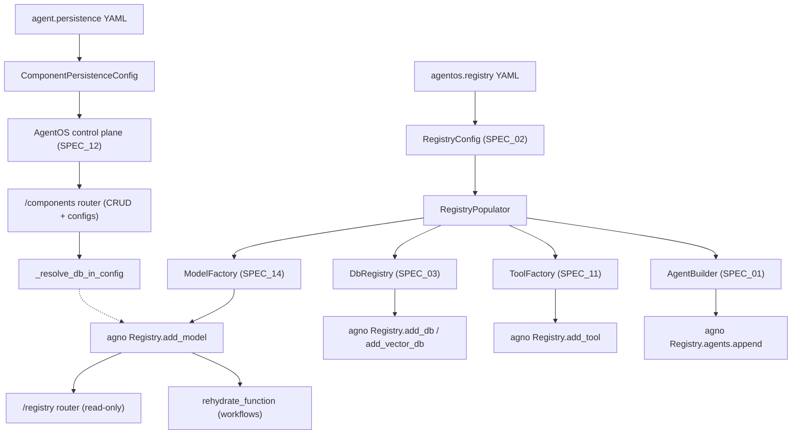

# SPEC_32_REGISTRY_AND_COMPONENTS

> **Purpose**: Expose Agno's two complementary catalogs to YAML. The **Registry** is an in-memory catalog of non-serializable, code-defined objects (tools, models, dbs, vector_dbs, schemas, functions, knowledge, memory managers, agents, teams) used for runtime introspection and workflow rehydration — it is **read-only**. **Components** is a DB-backed, versioned catalog (agent/team/workflow) supporting full CRUD, config versioning, and rollback — it holds **dynamically persisted** agents. yaml-agno's job is to populate the Registry with objects instantiated from YAML (code-defined) and to route persistable YAML agents into Components; it references both by name/id and delegates all storage and rehydration to Agno.

> @ai-directive: SPEC_32 is a DELEGATION spec with a critical frontier. Registry = runtime in-memory catalog of CODE-DEFINED objects (read-only, introspection, `rehydrate_function` for serialized workflows). Components = PERSISTENT versioned DB catalog (CRUD, configs, rollback, dynamic agents). yaml-agno MUST NOT persist to Components directly from the config layer — Components CRUD is an AgentOS control-plane concern (SPEC_12). yaml-agno only: (1) populates the Registry from its factories, (2) declares which YAML agents are code-defined (Registry) vs persistable (Components), and (3) references db ids and function names for Agno to resolve. Do not reimplement `rehydrate_function`, `_resolve_db_in_config`, or the `/registry` and `/components` routers.

---

## 1. THE TWO CATALOGS (CONCEPTUAL MODEL)

### 1.1 Registry vs Components — the critical frontier



| Dimension | Registry | Components |
|-----------|----------|------------|
| Storage | In-memory (process lifetime) | Database (persistent, cross-restart) |
| Mutability | **Read-only** (populated at boot) | Full CRUD (create/update/delete) |
| Object kind | Non-serializable code objects | Serializable agent/team/workflow configs |
| Versioning | None (live objects) | Config versions, current pointer, rollback |
| Endpoint | `GET /registry` (introspection only) | `/components` (CRUD + `/configs` + `set-current`) |
| yaml-agno role | Populate from factories (code-defined) | Route persistable YAML agents; reference by id |
| Dedupe | Yes (model by provider+id, db by id, tool by identity) | By component_id |

### 1.2 Why both exist

The Registry holds objects that **cannot be serialized** (a `Toolkit` with live callables, a `Model` with credentials, a `BaseDb` connection). Serialized workflows reference these by name; `rehydrate_function` reattaches the live entrypoint so a deserialized workflow can run. Components holds agent/team/workflow **definitions** that are serializable and must persist across restarts with audit history (config versions) and rollback capability. `list_components` excludes IDs owned by the Registry so a code-defined agent is never duplicated as a Component row.

### 1.3 The dedupe contract (verified)

| Object | Dedupe key | Behavior on duplicate |
|--------|-----------|----------------------|
| Tool | Object identity (`existing is tool`) | Both distinct instances kept; only same instance skipped |
| Model | `(provider, id)` tuple | Collapsed (interchangeable catalog entries) |
| DB | `db.id` (or instance identity if no id) | Collapsed by id |
| Vector DB | `id` or `name` (or identity) | Collapsed by key |

> **Verified gotcha**: tools dedupe by **object identity, never by name**. Two distinct tools sharing a name (two toolkit instances, or multiple `<lambda>`/`functools.partial` callables) are BOTH kept — dropping one would break `rehydrate_function` for the agent that uses it. Adding a tool invalidates the cached `_entrypoint_lookup`.

---

## 2. AGNO REGISTRY API (VERIFIED)

### 2.1 The `Registry` dataclass

Source: `agno/registry/registry.py`

```python
@dataclass
class Registry:
    name: Optional[str] = None
    description: Optional[str] = None
    id: str = field(default_factory=lambda: str(uuid4()))
    tools: List[Any] = field(default_factory=list)
    models: List[Model] = field(default_factory=list)
    dbs: List[BaseDb] = field(default_factory=list)
    vector_dbs: List[VectorDb] = field(default_factory=list)
    schemas: List[Type[BaseModel]] = field(default_factory=list)
    functions: List[Callable] = field(default_factory=list)
    knowledge: List[Any] = field(default_factory=list)
    memory_managers: List[Any] = field(default_factory=list)
    session_summary_managers: List[Any] = field(default_factory=list)
    agents: List[Agent] = field(default_factory=list)         # code-defined, for workflow rehydration
    teams: List[Team] = field(default_factory=list)
```

### 2.2 Add methods (dedupe-aware)

```python
def add_model(self, model: Any) -> None: ...      # dedupe by (provider, id); non-Model ignored
def add_tool(self, tool: Any) -> None: ...        # dedupe by object identity; invalidates _entrypoint_lookup
def add_db(self, db: Any) -> None: ...            # dedupe by db.id (or identity); BaseDb only
def add_vector_db(self, vector_db: Any) -> None: ...  # dedupe by id/name (or identity)
```

### 2.3 Get / lookup methods

```python
def get_schema(self, name: str) -> Optional[Type[BaseModel]]: ...
def get_db(self, db_id: str) -> Optional[BaseDb]: ...
def get_function(self, name: str) -> Optional[Callable]: ...
def get_knowledge(self, name: str) -> Optional[Any]: ...
def get_agent(self, agent_id: str) -> Optional[Agent]: ...
def get_team(self, team_id: str) -> Optional[Team]: ...
def get_memory_manager(self, manager_id: str) -> Optional[Any]: ...
def get_session_summary_manager(self, manager_id: str) -> Optional[Any]: ...
def get_all_component_ids(self) -> Set[str]: ...  # agent ids ∪ team ids
```

### 2.4 `rehydrate_function` — workflow rehydration

```python
@cached_property
def _entrypoint_lookup(self) -> Dict[str, Callable]: ...   # name -> entrypoint, rebuilt on tool add

def rehydrate_function(self, func_dict: Dict[str, Any]) -> Function:
    """Reconstruct a Function from dict, reattaching its entrypoint."""
    func = Function.from_dict(func_dict)
    func.entrypoint = self._entrypoint_lookup.get(func.name)
    return func
```

Serialized workflows store `Function` objects as dicts (no live entrypoint). On rehydration, `rehydrate_function` rebuilds the `Function` and reattaches the entrypoint looked up by name from the registry's tools. This is **critical for workflows** (SPEC_05): without it, a deserialized workflow's tool calls would have no executable target.

> **Verified gotcha**: `_entrypoint_lookup` is a `cached_property` keyed by name only. Two distinct tools sharing a name collapse to one slot (last wins) — Agno logs a warning and asks users to give tools distinct names. `add_tool` pops the cache so the lookup rebuilds.

---

## 3. THE `/registry` ENDPOINT (READ-ONLY)

Source: `agno/os/routers/registry/registry.py`

### 3.1 Single GET, paginated, filtered

```python
GET /registry?resource_type=TOOL&name=yfinance&page=1&limit=20
```

- `resource_type`: `RegistryResourceType` enum — `TOOL | MODEL | DB | VECTOR_DB | SCHEMA | FUNCTION | AGENT | TEAM | KNOWLEDGE | MEMORY_MANAGER | SESSION_SUMMARY_MANAGER`. `None` returns all types.
- `name`: partial, case-insensitive match on resource name.
- `page` (>=1), `limit` (1..100).
- Response: `PaginatedResponse[RegistryContentResponse]`.

### 3.2 RegistryContentResponse (rich metadata)

Each resource carries type-specific metadata:
- **Tool**: `class_path`, `is_toolkit`, per-function `CallableMetadata` (module, qualname, signature, parameters, `requires_confirmation`, `external_execution`, return annotation).
- **Model**: `class_path`, `provider`, `model_id`.
- **DB**: `class_path`, `db_id`.
- **Vector DB**: `class_path`, `vector_db_id`, `collection`, `table_name`.
- **Schema**: `class_path`, JSON schema (via `model_json_schema()`).
- **Function**: `class_path`, module, qualname, signature, parameters.
- **Agent / Team**: `id`, `class_path`, name, description.
- **Knowledge**: `class_path`, `vector_db_class`, `contents_db_class`, `max_results`, `num_readers`.
- **Memory / Session summary managers**: dedicated metadata builders.

Resources are sorted by `(type, name)` for stable pagination.

> The `/registry` router is **read-only** — only `GET /registry` exists. No POST/PATCH/DELETE.

---

## 4. THE `/components` ENDPOINT (CRUD + VERSIONED CONFIGS)

Source: `agno/os/routers/components/components.py`

### 4.1 Component CRUD

```python
GET    /components?component_type=agent&page=1&limit=20   # paginated; EXCLUDES registry-owned ids
POST   /components                                        # create (ComponentCreate) -> 201
GET    /components/{component_id}                         # read
PATCH  /components/{component_id}                         # partial update (name/description/metadata/current_version/type)
DELETE /components/{component_id}                         # delete -> 204
```

`ComponentType` enum: `agent | team | workflow`. Requires a **sync** `BaseDb` (the router raises if given an `AsyncBaseDb`).

### 4.2 `list_components` excludes registry-owned IDs

```python
exclude_ids = registry.get_all_component_ids() if registry else None
components, total_count = db.list_components(..., exclude_component_ids=exclude_ids or None)
```

A code-defined agent (in the Registry) never appears in `/components` — the two catalogs are mutually exclusive by id.

### 4.3 Config versioning and rollback

```python
GET    /components/{id}/configs?include_config=true       # list all config versions
POST   /components/{id}/configs                           # create NEW version (ConfigCreate)
PATCH  /components/{id}/configs/{version}                 # update DRAFT only (cannot update published)
GET    /components/{id}/configs/current                   # current config
GET    /components/{id}/configs/{version}                 # specific version
DELETE /components/{id}/configs/{version}                 # delete draft (not published/current)
POST   /components/{id}/configs/{version}/set-current     # set published version as current (ROLLBACK)
```

`set-current` is the rollback mechanism: point the component's `current_version` at any previously published config version.

### 4.4 `_resolve_db_in_config` — db reference resolution

```python
def _resolve_db_in_config(config, os_db, registry=None) -> dict:
    # If config["db"] has an "id":
    #   1. match os_db.id -> use os_db
    #   2. else registry.get_db(id) -> use registry db
    #   3. merge resolved db.to_dict() with caller-provided TABLE-NAME overrides only
    # Connection-defining fields (type, db_url, ...) always come from resolved db.
```

A component config references a db by `id`; the router resolves it against the OS db or the Registry and merges only whitelisted table-name overrides (`DB_TABLE_NAME_KEYS`). This prevents a component from redirecting a referenced db to a different backend.

---

## 5. YAML CONFIGURATION MODEL

### 5.1 RegistryConfig aggregate

```python
# yaml-agno/src/yaml_agno/registry/schema.py  (PEP 695)
from typing import Annotated, Literal
from pydantic import BaseModel, Field

class RegistryEntry(BaseModel):
    """A reference to a code-defined object to register by name/id.

    yaml-agno resolves these to live Agno objects via its factories and
    registers them in the agno Registry. The Registry is read-only.
    """
    model_config = {"extra": "forbid"}
    kind: Literal["tool", "model", "db", "vector_db", "schema",
                  "function", "knowledge", "memory_manager",
                  "session_summary_manager", "agent", "team"]
    ref: str = Field(..., min_length=1, max_length=256,
                     description="Catalog name/id of a code-defined object built by a yaml-agno factory.")

class RegistryConfig(BaseModel):
    """SSOT for the registry block. yaml-agno populates the agno Registry from these references."""
    model_config = {"extra": "forbid"}
    name: str | None = None
    description: str | None = None
    entries: list[RegistryEntry] = Field(default_factory=list)
```

### 5.2 ComponentPersistenceConfig (declaration, not storage)

```python
class ComponentPersistenceConfig(BaseModel):
    """Declares that a YAML-defined agent/team/workflow SHOULD be persisted
    as a Component via the AgentOS control plane (SPEC_12).

    yaml-agno does NOT write to the DB from the config layer. This block only
    flags intent and supplies metadata for the control plane to use at CRUD time.
    """
    model_config = {"extra": "forbid"}
    persist: bool = Field(default=False,
                          description="If true, the AgentOS persists this as a Component (SPEC_12).")
    component_id: str | None = Field(default=None,
        description="Explicit component id; if omitted, Agno derives one from the name.")
    label: str | None = None
    stage: str = Field(default="draft")    # draft | published | ...
    notes: str | None = None
```

> `RegistryConfig` and `ComponentPersistenceConfig` are referenced from the SPEC_02 SSOT. An agent document may carry a `persistence: ComponentPersistenceConfig` block; an `agentos:` document (SPEC_12) carries a `registry: RegistryConfig` block.

### 5.3 YAML — registry population (agentos document)

```yaml
agentos:
  api: true
  registry:
    name: "production-registry"
    description: "Code-defined objects shared across agents"
    entries:
      - kind: model
        ref: default_openai          # built by SPEC_14 ModelFactory
      - kind: db
        ref: primary_pg              # built by SPEC_03 DbRegistry
      - kind: vector_db
        ref: kb_vectors
      - kind: tool
        ref: yfinance
      - kind: function
        ref: myapp.selectors.route_by_cost
      - kind: agent
        ref: router_agent            # code-defined agent for workflow rehydration
```

### 5.4 YAML — persistable agent (component intent)

```yaml
agent:
  name: "support_bot"
  model:
    provider: openai
    id: gpt-4o
  persistence:
    persist: true
    component_id: "support_bot"
    label: "Support v1"
    stage: "draft"
    notes: "Initial support agent; persisted via AgentOS."
```

### 5.5 YAML — code-defined agent (registry, NOT persisted)

```yaml
agent:
  name: "router_agent"
  model:
    provider: openai
    id: gpt-4o
  # No persistence block -> code-defined instance registered in the Registry,
  # available for workflow rehydration, excluded from /components.
```

### 5.6 Boundary rule (validation)

A single agent MUST NOT be both code-defined (Registry) and persistable (Components).

<!-- @ai-directive: this rule CANNOT be a Pydantic model_validator on the agent
     model. The `registry_entry_ids` set comes from the `agentos:` document (a
     SIBLING document), not from the agent's own fields, and a Pydantic
     model_validator only sees the model's own validated fields — it cannot
     reach cross-document sibling state. The check is therefore a CompositionRoot
     post-load validator: after BOTH the agent document and the agentos registry
     document are loaded, the root walks every agent and rejects any that is
     both registry-listed (its id/name appears in a registry entry of kind=agent)
     and has persistence.persist=true. -->

```python
# yaml-agno/src/yaml_agno/registry/composition_root.py
"""CompositionRoot post-load validators (run after all docs are parsed)."""

def validate_no_dual_catalog(
    agents: list,           # list[AgentConfig] (SPEC_02), each with .persistence
    registry_entry_ids: set[str],   # ids/names from agentos.registry kind=agent entries
) -> None:
    """Reject agents that are BOTH registry-listed AND persisted.

    Args:
        agents: every loaded AgentConfig.
        registry_entry_ids: the set of ids declared as kind=agent in the
            agentos.registry block (empty if there is no registry block).

    Raises:
        ValueError: naming the first agent that violates the rule.
    """
    for agent in agents:
        identity = agent.component_id or agent.name
        in_registry = identity in registry_entry_ids
        persisted = agent.persistence is not None and agent.persistence.persist
        if in_registry and persisted:
            raise ValueError(
                f"Agent '{agent.name}' is both registry-listed and persist=true. "
                "Choose one: code-defined (Registry) OR persisted (Components). See SPEC_32."
            )
```

> This validator is invoked by the CompositionRoot (SPEC_01 runtime) once the
> full document set (agents + agentos) is loaded and validated in isolation.
> It is NOT a field on any single Pydantic model.

---

## 6. ARCHITECTURE — DELEGATION LAYER

### 6.1 Component map



### 6.2 Clean Architecture layers

| Layer | Component | Responsibility |
|-------|-----------|----------------|
| Domain | `RegistryConfig`, `RegistryEntry`, `ComponentPersistenceConfig` (SPEC_02) | Validate references + dual-catalog rule |
| Ports | `RegistryPopulatorPort` | Contract: `RegistryConfig + factories -> agno.Registry` |
| Adapters | `RegistryPopulator` | Resolve refs via factories, call `add_*` with Agno dedupe |
| Infra | `agno.registry.Registry`, `/registry` router, `/components` router, db backend | Introspection, persistence, rehydration |

### 6.3 Ports

```python
# yaml-agno/src/yaml_agno/registry/ports.py
from typing import Protocol
from agno.registry import Registry
from yaml_agno.registry.schema import RegistryConfig

class RegistryPopulatorPort(Protocol):
    """Populate an agno Registry from validated references resolved via factories."""
    def populate(self, config: RegistryConfig | None) -> Registry: ...
```

### 6.4 Adapter — RegistryPopulator

```python
# yaml-agno/src/yaml_agno/registry/populator.py
from agno.registry import Registry
from yaml_agno.registry.schema import RegistryConfig, RegistryEntry
from yaml_agno.models.factory import ModelFactory          # SPEC_14
from yaml_agno.persistence.registry import DbRegistry      # SPEC_03
from yaml_agno.tools.factory import ToolFactory            # SPEC_11

class RegistryPopulator:
    """Resolves YAML refs to live Agno objects and registers them.

    yaml-agno NEVER re-implements dedupe or rehydrate_function.
    It calls Registry.add_model/add_tool/add_db/etc. and lets Agno dedupe.
    """

    def __init__(self, db_registry: DbRegistry, model_factory: ModelFactory):
        self._db_registry = db_registry
        self._model_factory = model_factory

    def populate(self, config: RegistryConfig | None) -> Registry:
        registry = Registry(
            name=config.name if config else None,
            description=config.description if config else None,
        )
        if config is None:
            return registry
        for entry in config.entries:
            self._register(registry, entry)
        return registry

    def _register(self, registry: Registry, entry: RegistryEntry) -> None:
        match entry.kind:
            case "model":
                registry.add_model(self._model_factory.get(entry.ref))
            case "db":
                db = self._db_registry.get(entry.ref)
                if db is None:
                    raise ValueError(f"Registry db ref '{entry.ref}' not found (SPEC_03).")
                registry.add_db(db)
            case "vector_db":
                vdb = self._db_registry.get_vector_db(entry.ref)
                if vdb is None:
                    raise ValueError(f"Registry vector_db ref '{entry.ref}' not found (SPEC_03).")
                registry.add_vector_db(vdb)
            case "tool":
                for tool in self._resolve_tools(entry.ref):
                    registry.add_tool(tool)
            case "agent":
                registry.agents.append(self._resolve_agent(entry.ref))
            case "team":
                registry.teams.append(self._resolve_team(entry.ref))
            # function / schema / knowledge / memory_manager / session_summary_manager:
            # resolved via their respective factories (SPEC_11 / SPEC_10 / SPEC_04).
            case _:
                raise ValueError(f"Registry kind '{entry.kind}' resolver not implemented yet.")
```

### 6.5 Integration with AgentOSFactory (SPEC_12)

The `AgentOSFactory` (SPEC_12) receives the populated `Registry` and passes it to `AgentOS(registry=...)`. Agno wires both the `/registry` and `/components` routers with the same `Registry` instance so that `list_components` can exclude registry-owned ids and `_resolve_db_in_config` can look up dbs.

### 6.6 Persistence routing (Components)

When a YAML agent declares `persistence.persist: true`, the `AgentOSFactory` (SPEC_12) does NOT persist it during config load. Persistence happens via the control-plane `/components` endpoint at runtime (an operator or CI step POSTs the component). yaml-agno's `ComponentPersistenceConfig` only supplies the metadata (component_id, label, stage, notes) that the POST uses. This keeps the config layer side-effect-free.

---

## 7. REHYDRATION FLOW (WORKFLOWS)

### 7.1 Serialized workflow with function refs

A workflow (SPEC_05) serialized to the DB stores its step functions as `Function` dicts (name, description, parameters) without live entrypoints. On load:

```python
for step in serialized_workflow.steps:
    step.function = registry.rehydrate_function(step.function_dict)
```

`rehydrate_function` rebuilds the `Function` and reattaches `entrypoint` from `_entrypoint_lookup[func.name]`. The lookup is built from all registered tools' entrypoints (Toolkit functions, Function objects, plain callables).

### 7.2 Why tools dedupe by identity

If two distinct tools shared a name and dedupe dropped one, the dropped tool's entrypoint would vanish from `_entrypoint_lookup`, and `rehydrate_function` for the workflow using it would return a `Function` with `entrypoint=None` — a silent breakage. Agno keeps both distinct instances and warns. yaml-agno inherits this; it never dedupes tools itself.

### 7.3 yaml-agno responsibility

yaml-agno ensures that every function/tool referenced by a serialized workflow is present in the Registry (via `RegistryConfig.entries`). If a ref is missing, `rehydrate_function` yields `entrypoint=None` and the workflow run fails with a clear error. yaml-agno validates ref completeness at config load where possible.

---

## 8. ASSUMPTIONS ADOPTED

### 8.1 [Decision] DELEGATE storage and rehydration to Agno
**Justification**: `Registry.add_*` (dedupe), `rehydrate_function`, `_entrypoint_lookup`, the `/registry` and `/components` routers, and `_resolve_db_in_config` are all Agno-owned and non-trivial. Reimplementing any of them would duplicate logic, drift from upstream, and risk silent rehydration breakage. yaml-agno resolves refs via its factories and calls `add_*`; that is the entire yaml-agno responsibility.

### 8.2 [Decision] Registry is read-only from yaml-agno's perspective
**Justification**: The `/registry` endpoint exposes only `GET`. yaml-agno populates the Registry once at AgentOS boot from code-defined YAML; there is no runtime mutation API. Persistable agents go to Components, not the Registry.

### 8.3 [Decision] A single agent is EITHER Registry OR Components, never both
**Justification**: `list_components` excludes registry-owned ids, so an agent in both would be hidden from `/components` yet not introspectable as code-defined consistently. The dual-catalog validator (5.6) makes the user choose at config time. This keeps the two catalogs mutually exclusive by id.

### 8.4 [Decision] yaml-agno does NOT write to Components from the config layer
**Justification**: Components CRUD is a control-plane operation (SPEC_12) requiring auth, audit, and DB writes. Performing it during YAML load would couple config parsing to DB state and break the side-effect-free config principle. yaml-agno declares intent (`ComponentPersistenceConfig`) and supplies metadata; the AgentOS persists via `/components` at runtime.

### 8.5 [Decision] Tool dedupe by identity is preserved (never by name in yaml-agno)
**Justification**: Agno's identity-based dedupe is load-bearing for `rehydrate_function`. If yaml-agno deduped tools by name before registering, it would break workflow rehydration for multi-instance toolkits. yaml-agno registers all resolved tools and lets Agno dedupe.

### 8.6 [Decision] db refs resolve against the OS db OR the Registry
**Justification**: `_resolve_db_in_config` checks `os_db.id` first, then `registry.get_db(id)`, and merges only table-name overrides. yaml-agno ensures the referenced db is registered (via `RegistryConfig.entries`) so resolution succeeds; connection-defining fields always come from the resolved db to prevent backend redirection.

### 8.7 [Decision] `extra="forbid"` on RegistryConfig/RegistryEntry/ComponentPersistenceConfig
**Justification**: The registry contract is narrow (kind + ref). Unknown keys indicate user confusion (e.g., trying to inline an object body). Forbidding extras surfaces mistakes early, unlike the experimental Culture spec which uses `ignore`.

### 8.8 [Decision] Components require a sync BaseDb
**Justification**: The `/components` router explicitly raises on an `AsyncBaseDb`. yaml-agno's AgentOS (SPEC_12) must provision a sync OS db for the components router. This constraint is documented and surfaced in the AgentOSFactory.

---

## 9. BEHAVIOR DELTA — BDD SCENARIOS

### 9.1 Acceptance scenarios

#### Scenario 1: Golden path — populate Registry from YAML
```gherkin
GIVEN an agentos.registry YAML with entries kind=model ref=default_openai, kind=db ref=primary_pg, kind=tool ref=yfinance
WHEN RegistryPopulator.populate(config) runs
THEN the Registry contains one model (deduped by provider+id)
AND one db (deduped by id)
AND the yfinance tool(s) registered by object identity
AND get_all_component_ids() is empty (no agents/teams registered yet)
```

#### Scenario 2: GET /registry filters by resource_type and name
```gherkin
GIVEN a populated Registry with tools, models, and dbs
WHEN GET /registry?resource_type=MODEL&name=openai runs
THEN a paginated RegistryContentResponse list is returned
AND every item has type=MODEL
AND every item name contains "openai" (case-insensitive)
AND metadata includes provider and model_id
```

#### Scenario 3: /registry is read-only
```gherkin
GIVEN a running AgentOS with the registry router attached
WHEN a client attempts POST /registry
THEN the route does not exist (405 or 404)
AND the Registry object is not mutated
```

#### Scenario 4: POST /components persists a component
```gherkin
GIVEN an AgentOS with a sync OS db and a Registry
WHEN POST /components with name=support_bot component_type=agent and a config referencing db.id=primary_pg
THEN _resolve_db_in_config resolves primary_pg against the Registry
AND a component row is created with an initial config version
AND the response is 201 with the ComponentResponse
```

#### Scenario 5: list_components excludes registry-owned ids
```gherkin
GIVEN a Registry containing agent router_agent (id=router-1) and a DB with component rows including router-1
WHEN GET /components?component_type=agent runs
THEN router-1 does NOT appear in the results
AND the total_count reflects the exclusion
```

#### Scenario 6: Config rollback via set-current
```gherkin
GIVEN a component support_bot with current_version=3 and prior published versions 1 and 2
WHEN POST /components/support_bot/configs/2/set-current runs
THEN db.set_current_version(support_bot, 2) succeeds
AND GET /components/support_bot returns current_version=2
AND the agent now runs with the v2 config
```

#### Scenario 7: rehydrate_function reattaches entrypoint
```gherkin
GIVEN a Registry with a registered tool yfinance whose function get_stock_price has a live entrypoint
AND a serialized workflow step whose function_dict name=get_stock_price has entrypoint=None
WHEN registry.rehydrate_function(func_dict) runs
THEN the returned Function has entrypoint equal to the live yfinance callable
AND a deserialized workflow run can execute the step
```

#### Scenario 8: Missing function ref yields entrypoint=None (clear failure)
```gherkin
GIVEN a serialized workflow step name=missing_fn not present in the Registry
WHEN rehydrate_function runs
THEN the returned Function.entrypoint is None
AND a subsequent workflow run raises a clear error that missing_fn is not registered
```

#### Scenario 9: db.id redirect is blocked
```gherkin
GIVEN a component config with db.id=primary_pg but caller-provided db_url pointing to a different backend
WHEN _resolve_db_in_config runs
THEN the resolved db's db_url (from Registry/OS) is used, NOT the caller-provided one
AND only whitelisted table-name overrides from the caller are applied
```

#### Scenario 10: Dual-catalog validation rejects both
```gherkin
GIVEN an agent listed in agentos.registry.entries kind=agent ref=router_agent AND the same agent with persistence.persist=true
WHEN the CompositionRoot runs validate_no_dual_catalog AFTER both the agent doc and the agentos registry doc are loaded
THEN ValueError is raised (NOT a pydantic ValidationError — the check needs sibling state from two documents)
AND the message references the dual-catalog rule (SPEC_32 §5.6)
AND no Registry or Component is created
```

#### Scenario 11: Tool dedupe keeps distinct same-named instances
```gherkin
GIVEN two distinct Toolkit instances both named shell_tools
WHEN both are added to the Registry
THEN both are kept (identity dedupe)
AND a warning is logged about the shared name in _entrypoint_lookup
```

#### Scenario 12: Async OS db rejected by components router
```gherkin
GIVEN an AgentOS provisioned with an AsyncBaseDb as the OS db
WHEN the components router is attached
THEN a ValueError is raised indicating a sync BaseDb is required
```

---

## 10. TDD MICRO-TASK EXECUTION PROTOCOL

### 10.1 Cascading task checklist

#### TASK_001: RegistryConfig + RegistryEntry schema
- **File**: `yaml-agno/src/yaml_agno/registry/schema.py`
- **Test**: `tests/unit/registry/test_schema.py`
- **RED**:
```python
def test_registry_config_entries():
    rc = RegistryConfig.model_validate({
        "name": "prod",
        "entries": [{"kind": "model", "ref": "default_openai"}],
    })
    assert rc.entries[0].kind == "model"

def test_registry_forbids_inline_body():
    import pytest
    from pydantic import ValidationError
    with pytest.raises(ValidationError):
        RegistryEntry.model_validate({"kind": "model", "ref": "x", "provider": "openai"})
```
- **GREEN**: implement `RegistryConfig`, `RegistryEntry` with `extra="forbid"` and the `kind` Literal.
- **Commit**: `feat(registry): add RegistryConfig and RegistryEntry schemas`

#### TASK_002: ComponentPersistenceConfig + CompositionRoot dual-catalog validator
- **File**: `yaml-agno/src/yaml_agno/registry/schema.py` (ComponentPersistenceConfig) and `yaml-agno/src/yaml_agno/registry/composition_root.py` (`validate_no_dual_catalog`)
- **Test**: `tests/unit/registry/test_no_dual_catalog.py`
- **RED**: after BOTH docs are loaded, an agent whose id/name is in `registry_entry_ids` (kind=agent entries) AND has `persistence.persist=true` raises `ValueError` from `validate_no_dual_catalog(agents, registry_entry_ids)`. Note: this is NOT a pydantic `ValidationError` — `registry_entry_ids` is sibling state from the `agentos:` document, unreachable from any single agent model_validator, so the check is a post-load CompositionRoot function (see §5.6).
- **GREEN**: implement `ComponentPersistenceConfig` (schema) + `validate_no_dual_catalog(agents, registry_entry_ids)` (CompositionRoot) raising `ValueError` naming the offending agent.
- **Commit**: `feat(registry): add ComponentPersistenceConfig + CompositionRoot dual-catalog guard`

#### TASK_003: RegistryPopulator resolves refs and registers
- **File**: `yaml-agno/src/yaml_agno/registry/populator.py`
- **Test**: `tests/unit/registry/test_populator.py`
- **RED**: given a config with model + db + tool entries, `populate()` returns a `Registry` whose `models`, `dbs`, `tools` contain the resolved objects (use factory fakes).
- **GREEN**: resolve via ModelFactory/DbRegistry/ToolFactory, call `add_*`.
- **Commit**: `feat(registry): add RegistryPopulator delegating to Agno add_*`

#### TASK_004: Dedupe is delegated (identity for tools)
- **File**: `tests/unit/registry/test_dedupe.py`
- **RED**: registering the same tool object twice keeps one; registering two distinct same-named toolkits keeps both.
- **GREEN**: contract test against `Registry.add_tool` behavior.
- **Commit**: `test(registry): assert tool dedupe by identity preserved`

#### TASK_005: Missing ref raises clear error
- **File**: `yaml-agno/src/yaml_agno/registry/populator.py`
- **Test**: `tests/unit/registry/test_missing_ref.py`
- **RED**: a `db` ref absent from DbRegistry raises `ValueError` naming the ref.
- **GREEN**: look up and raise if None.
- **Commit**: `feat(registry): raise clear error on missing ref`

#### TASK_006: rehydrate_function integration (contract)
- **File**: `tests/unit/registry/test_rehydrate.py`
- **RED**: register a tool, build a func_dict for its function, `rehydrate_function` returns a Function with non-None entrypoint; a missing name yields entrypoint=None.
- **GREEN**: contract test against `Registry.rehydrate_function`.
- **Commit**: `test(registry): assert rehydrate_function reattaches entrypoint`

#### TASK_007: AgentOSFactory wiring (SPEC_12)
- **File**: `yaml-agno/src/yaml_agno/os/agentos_factory.py` (extend)
- **Test**: `tests/unit/registry/test_agentos_wiring.py`
- **RED**: an `agentos.registry` block produces an `AgentOS` whose `/registry` GET returns the registered resources and `/components` GET excludes registry-owned ids.
- **GREEN**: call `RegistryPopulator.populate`, pass `Registry` to `AgentOS(registry=...)`.
- **Commit**: `feat(registry): wire populated Registry into AgentOSFactory`

#### TASK_008: /registry filtering contract
- **File**: `tests/unit/registry/test_registry_endpoint.py`
- **RED**: GET `/registry?resource_type=TOOL&name=yfin` returns only matching tools.
- **GREEN**: contract test against the Agno router (TestClient).
- **Commit**: `test(registry): assert /registry filtering and pagination`

#### TASK_009: /components CRUD contract (references SPEC_12)
- **File**: `tests/unit/registry/test_components_crud.py`
- **RED**: POST `/components`, GET it, PATCH, DELETE; verify versions created.
- **GREEN**: contract test using a test sync DB and the Agno router.
- **Commit**: `test(registry): assert /components CRUD against test db`

#### TASK_010: set-current rollback
- **File**: `tests/unit/registry/test_rollback.py`
- **RED**: create two config versions, set-current to v1, assert current_version changed and the agent reads v1.
- **GREEN**: contract test against `db.set_current_version`.
- **Commit**: `test(registry): assert config rollback via set-current`

#### TASK_011: _resolve_db_in_config backend-redirect block
- **File**: `tests/unit/registry/test_resolve_db.py`
- **RED**: a config with `db.id` and a caller `db_url` override keeps the resolved db's db_url.
- **GREEN**: contract test against `_resolve_db_in_config`.
- **Commit**: `test(registry): assert db.id redirect blocked`

#### TASK_012: list_components excludes registry ids
- **File**: `tests/unit/registry/test_exclusion.py`
- **RED**: a registry agent id absent from `/components` results even if a row exists in the DB.
- **GREEN**: contract test against `db.list_components(..., exclude_component_ids=...)`.
- **Commit**: `test(registry): assert list_components excludes registry-owned ids`

#### TASK_013: Integration test — populate, rehydrate, run workflow
- **File**: `tests/integration/test_registry_e2e.py`
- **Test**: build an AgentOS with a registry containing a tool and a code-defined agent, serialize a trivial workflow, reload it, assert `rehydrate_function` reattached the entrypoint and the workflow runs.
- **RED**: assert the workflow executes the rehydrated function.
- **GREEN**: `@pytest.mark.integration`.
- **Commit**: `test(registry): add e2e populate-rehydrate-run integration test`

---

## 11. CALIBRATION QUESTIONS

### 11.1 [Question] Mixing Registry + Components for one logical agent?
**Should yaml-agno support a hybrid where a code-defined agent (Registry) is also snapshot-persisted as a Component for audit, while runtime uses the code-defined instance?**
Implication: `list_components` would hide it (excluded by id), so the audit snapshot is invisible in the standard listing. Proposal: keep the dual-catalog rule strict (8.3). If audit of code-defined agents is needed, expose it via `/registry` metadata only, not as a Component. Revisit if users request explicit audit-trail versioning of code-defined agents.

### 11.2 [Question] Registry hot-update after boot?
**Should yaml-agno support adding objects to the Registry at runtime (post-boot), or is boot-time population the only path?**
Implication: Agno's `add_*` works anytime, but the `/registry` router snapshots the live Registry, and `add_tool` invalidates `_entrypoint_lookup` (cache rebuild). Runtime mutation could race with in-flight rehydration. Proposal: boot-time population only for MVP (resync via SPEC_12 reloads the whole Registry). Document runtime mutation as unsupported.

### 11.3 [Question] Who triggers Component persistence?
**When a YAML agent declares `persistence.persist: true`, who actually POSTs to `/components` — a CI step, an operator, or the AgentOS on boot?**
Implication: yaml-agno declares intent only (8.4). The AgentOS boot is side-effect-free. Proposal: an explicit control-plane step (operator or CI) POSTs using the metadata from `ComponentPersistenceConfig`. Document the recommended flow in SPEC_12; consider an optional `auto_persist_on_boot` flag post-MVP if users want boot-time persistence.

### 11.4 [Question] Config version stage transitions?
**Should yaml-agno encode the stage lifecycle (draft -> published -> current) in the schema, or leave it to the control plane?**
Implication: `stage` is a free string in the Agno API. A yaml-agno enum (draft/published) would add validation but reduce flexibility. Proposal: keep `stage` as a string in MVP (matches Agno); add an enum in a later iteration if conventions stabilize.

### 11.5 [Question] Multi-tenant Registry and Components?
**In a multi-tenant deployment (SPEC_19), is the Registry shared across tenants or per-tenant? And are Components rows tenant-scoped?**
Implication: the Registry is in-memory per process; if one process serves multiple tenants, code-defined objects are shared. Components rows would need tenant isolation at the DB level. Proposal: one AgentOS process per tenant (Registry is tenant-scoped by process), and Components tenant-scoped via the OS db (SPEC_03/SPEC_19). Document the deployment topology; do not add tenant filtering to yaml-agno config.
