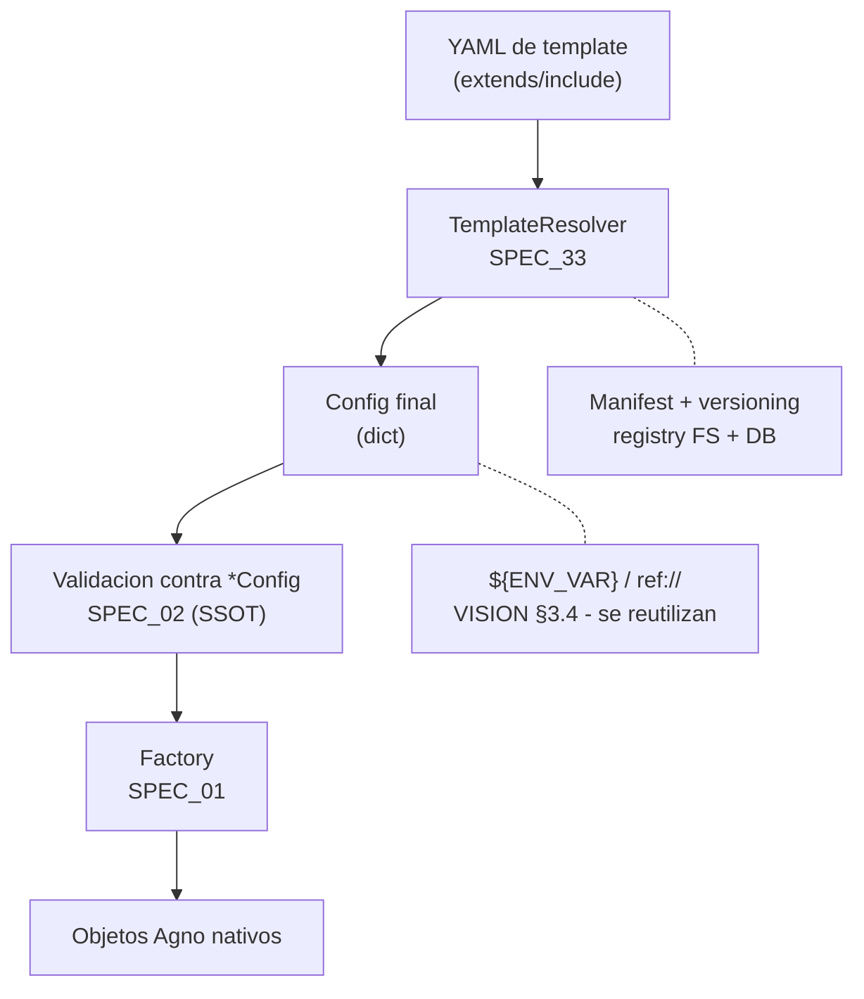
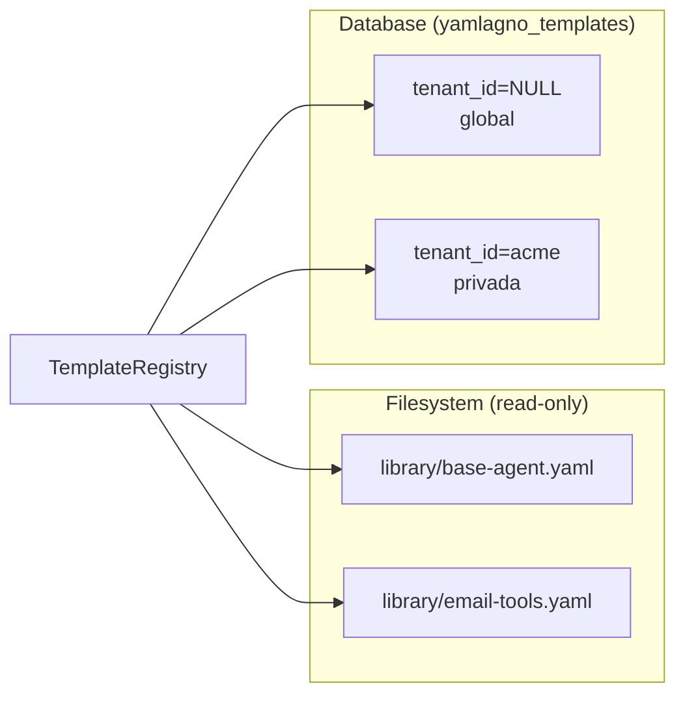
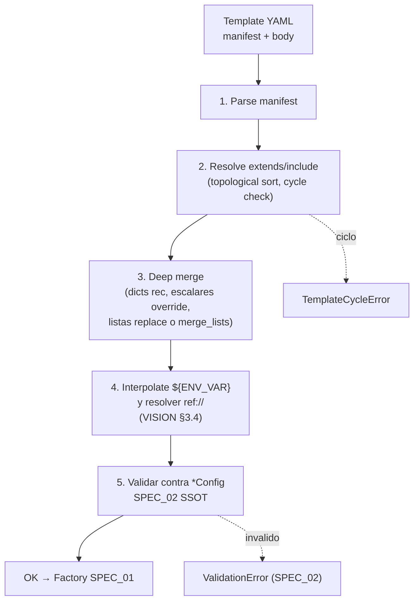

# SPEC_33_TEMPLATES

> **Propósito**: Especificar el sistema de **templates** de yaml-agno — conjuntos de plantillas YAML preconfiguradas y heredables que permiten no reconstruir desde cero cada agente/equipo/workflow. Las templates son **el valor diferencial del proyecto**: una capa de reuso y composición jerárquica (estilo herencia de código) sobre los schemas `*Config` de SPEC_02.

> **@ai-directive (templates es valor diferencial legítimo)**: Agno **no tiene** un sistema de templates. Esta capa es invención propia de yaml-agno y constituye uno de sus aportes diferenciales. NO se está reimplementando nada que Agno traiga — Agno no ofrece reuso declarativo de configuraciones vía herencia.

> **@ai-directive (opera sobre *Config, NO redefine)**: Templates **resuelve y genera** instancias de `AgentConfig`, `TeamConfig`, `WorkflowConfig` (SSOT = SPEC_02). Una template no introduce un nuevo schema de runtime; el resultado de su resolución debe validar contra los schemas SSOT existentes. La única estructura nueva que introduce este SPEC es la **envoltura de template** (`TemplateManifest`, `yamlagno_templates` row), no un `*Config` paralelo.

> **@ai-directive (reuso, no reinventa)**: Templates **consume** mecanismos ya existentes: la interpolación `${ENV_VAR}` y la inyección `${provider.key}` (DIReference, SPEC_02 §2), y el URI scheme `ref://` del registry (VISION §3.4) para referenciar equipos/agentes llamables. Las templates **no** reinventan esos mecanismos; los usan como consumidores.

---

## 1. ALCANCE Y RESPONSABILIDAD

### 1.1 Qué hace Templates vs qué delega



### 1.2 Principios

- **Valor diferencial**: templates no existe en Agno; es aporte propio de yaml-agno.
- **Agnóstico al dominio**: la arquitectura NO hardcodea dominios (facturación, email, etc.). Esos son **ejemplos** de plantillas, no código del core (§5).
- **SSOT respetado**: el resultado de resolver una template valida contra `*Config` de SPEC_02; no se crea un schema de configuración paralelo.
- **Reuso de mecanismos existentes**: `${ENV_VAR}`, `${provider.key}`, `ref://` se consumen, no se reinventan.
- **Multi-tenant nativo**: templates globales (`tenant_id = NULL`) vs privadas (`tenant_id = X`), con aislamiento por `WHERE` explícito (DECISIONES §2 regla 9).
- **DRY/SSOT**: una sola envoltura de template (`TemplateManifest`), una sola tabla (`yamlagno_templates`), un solo resolver.

---

## 2. MECANISMO DE HERENCIA YAML

### 2.1 Palabras clave de una template

Una template es un archivo YAML con un **manifest** y un **cuerpo** de configuración. El manifest declara metadatos y relaciones de herencia; el cuerpo es la configuración parcial o completa de un `AgentConfig` / `TeamConfig` / `WorkflowConfig`.

| Palabra clave | Scope | Función |
|---|---|---|
| `template:` | manifest raíz | Declara que el archivo es una template + metadatos (name, version, mission, kind, etc.). |
| `extends:` | manifest | Lista de templates base de las que se hereda (merge en orden). |
| `include:` | manifest o cuerpo | Fragmentos reutilizables a incluir (ej: un bloque `tools` compartido). |
| `merge_lists:` | flag (default `false`) | Si `true`, las listas del hijo se **appendan** a las del padre; si `false` (default), las listas del hijo **reemplazan** a las del padre. |
| `body:` | cuerpo | La configuración parcial/completa que será mergeada y luego validada contra `*Config`. |

> **@ai-directive (kind es opaque al resolver)**: el campo `kind` del manifest indica (`agent` / `team` / `workflow`) a qué `*Config` se validará el cuerpo resuelto. El resolver NO interpreta `kind` para mergear distinto; el merge es estructural sobre dicts, independiente del `kind`.

### 2.2 Estrategia de merge (deep merge con precedencia explícita)

Cuando una template `T` declara `extends: [B1, B2]`, el resolver:

1. Carga y resuelve `B1` y `B2` recursivamente (resolución topológica, §4).
2. Mergea los cuerpos resueltos en el orden declarado: `B1` como base, `B2` encima de `B1`, `T` encima de `B2`. El último gana en escalares.
3. El merge es **deep merge** sobre dicts:
   - **dict**: recursivo (cada clave se mergea profundamente).
   - **escalar (str/int/bool/None)**: el hijo reemplaza al padre.
   - **lista**: por default **se reemplaza**; si el padre o el hijo declara `merge_lists: true` en ese contexto, las listas se **appendan** (padre primero, hijo después, sin dedup automático — el autor controla el orden y los duplicados).

**Justificación (SOTA)**: el comportamiento por defecto "listas se reemplazan" evita la sorpresa de heredar listas largas no deseadas (ej: `tools`, `tags`, `members`) y da control explícito al autor. El flag `merge_lists: true` opt-in cubre el caso legítimo de append (ej: sumar un tool a los heredados). Deep-merge de dicts es el estándar para configs jerárquicas (Helm, Kustomize, Argo CD).

### 2.3 `include` — fragmentos reutilizables

`include:` inserta un **fragmento** (snippet YAML) en la posición declarada. Caso de uso típico: un bloque `tools` compartido por varios agentes, sin que ese bloque sea una template `agent` completa.

- Los fragmentos viven en el mismo registry (FS + DB) pero con `kind: fragment`.
- Un fragmento **no** valida contra `*Config` por sí solo; solo lo hace el cuerpo final ya mergeado.
- `include` es **puro** (sin side-effects): insertar el mismo fragmento dos veces inserta dos copias idénticas.
- Los fragmentos **pueden** declarar `extends:` (herencia de fragmentos), sujeto a la misma detección de ciclos.

### 2.4 Detección de ciclos

Tanto `extends` como `include` forman un grafo dirigido. El resolver:

1. Construye el grafo de dependencias a partir del manifest.
2. Ejecuta un ordenamiento topológico (Kahn). Si queda alguna arista → **ciclo detectado**.
3. Error explícito: `TemplateCycleError: cycle detected: A -> B -> A`, incluyendo el camino para diagnóstico.

> **@ai-directive (sin límite mágico de profundidad)**: la protección es **estructural** (detección de ciclo), no un depth-limit arbitrario. Una herencia legítima de 5 niveles pasa; un ciclo de 2 se rechaza. No inventar `max_depth`.

---

## 3. REGISTRY DE TEMPLATES

### 3.1 Doble almacén: filesystem (paquete) + DB (multi-tenant)

Las templates viven en **dos** stores complementarios:

| Store | Contenido | Mutabilidad | Multi-tenant |
|---|---|---|---|
| **Filesystem** (`src/yaml_agno/templates/library/`) | Templates base del paquete (curadas, versionadas con el release). | Solo lectura en runtime (se actualizan por release del paquete). | Globales (todas las ven). |
| **DB** (`yamlagno_templates` table) | Templates creadas por tenants en runtime (import, editor, API). | CRUD por tenant. | `tenant_id NULL` = global; `tenant_id = X` = privada de ese tenant. |



### 3.2 Tabla `yamlagno_templates`

ORM row persistido vía `core-cenf GenericRepository` + `DeclarativeBase`. Auto-provisioning con `create_all(checkfirst=True)` (DECISIONES §2 regla 7).

```python
# src/yaml_agno/templates/models/template_record.py
"""ORM record for the yamlagno_templates table. Persisted via core-cenf
GenericRepository on the yamlagno schema. tenant_id NULL means global."""

from datetime import datetime
from typing import Any

from sqlalchemy import JSON, DateTime, Integer, String, Text
from sqlalchemy.orm import Mapped, mapped_column

# @ai-directive: core_infrastructure is a pip dependency; IMPORTED, never copied.
from core_infrastructure.persistence.base import DeclarativeBase


class TemplateRecord(DeclarativeBase):
    """Row in yamlagno_templates. One template version per row.

    Attributes:
        tenant_id: NULL = global template; non-NULL = private to that tenant.
        name: Stable template name (unique per tenant + name + version).
        kind: 'agent' | 'team' | 'workflow' | 'fragment'.
        version: SemVer string (e.g. '1.2.0').
        content_hash: SHA256 of the resolved manifest+body (dedup, integrity).
        body_yaml: Raw YAML source (manifest + body) as stored.
        mission: Human-readable mission (discovery metadata).
        capabilities: List of capability tags (cognitive_profile-style, VISION §6).
        created_at: Row creation timestamp.
    """

    __tablename__ = "yamlagno_templates"
    __table_args__ = {"schema": "yamlagno"}

    id: Mapped[int] = mapped_column(Integer, primary_key=True)
    tenant_id: Mapped[str | None] = mapped_column(String(100), nullable=True, index=True)
    name: Mapped[str] = mapped_column(String(200), nullable=False, index=True)
    kind: Mapped[str] = mapped_column(String(20), nullable=False)
    version: Mapped[str] = mapped_column(String(40), nullable=False)
    content_hash: Mapped[str] = mapped_column(String(64), nullable=False)
    body_yaml: Mapped[str] = mapped_column(Text, nullable=False)
    mission: Mapped[str | None] = mapped_column(Text, nullable=True)
    capabilities: Mapped[list[Any]] = mapped_column(JSON, default=list)
    created_at: Mapped[datetime] = mapped_column(DateTime, default=datetime.utcnow)
```

> **@ai-directive (uniqueness)**: la unicidad es `(tenant_id, name, version)`. Permite coexistir `global/email-agent@1.0.0` con `acme/email-agent@2.0.0` sin colisión. Resolución de colisión global-vs-privada: la **privada del tenant sombrea a la global** del mismo nombre (precedencia de tenant).

### 3.3 Versionamiento

- **SemVer** (`MAJOR.MINOR.PATCH`) en el campo `version`.
- **`content_hash`** (SHA256 del manifest+body resuelto) para detección de drift e integridad.
- Una template se referencia como `name@version` (ej: `email-agent@1.2.0`) o `name` (resuelve a la última patch de la última minor de la última major disponible — *latest*). El resolver **no** asume latest implícito en `extends:` para evitar drift silencioso; en `extends` se exige `name@version` explícito (§9 pregunta abierta).

### 3.4 Hot-reload

Consistente con VISION §3.4 (hot-reload feature) y SPEC_23 (hot-reload de config). El registry:

- En filesystem: mtime-based watch (lib `watchfiles` o equivalente) sobre `templates/library/`.
- En DB: invalidation cache via timestamp comparison o evento de write (el `GenericRepository` expone el hook).
- On-change: invalida la cache de templates resueltas y re-valida contra `*Config`. Templates ya instanciadas en runtime **no** se mutan (principio de inmutabilidad de Agno); el cambio aplica al próximo `factory.build()`.

> **@ai-directive (no muta vivos)**: hot-reload **re-valida y cachea**, no destruye objetos Agno vivos. Una template modificada afecta builds futuros, no runs en curso.

### 3.5 Discovery

El registry expone:

- `list_templates(tenant_id, kind=None, capability=None)` → metadatos sin el cuerpo (paginado).
- `get_manifest(tenant_id, name, version)` → manifest completo para inspección.
- Metadatos reutilizan el concepto de **`cognitive_profile`** de VISION §6: `mission` (string) + `capabilities` (lista de tags) describen para qué sirve la template sin exponer el YAML completo.

---

## 4. PIPELINE DE RESOLUCIÓN



### 4.1 Pasos normativos

1. **Parse manifest** — `yaml.safe_load`; validar que tenga `template:`, `name`, `version`, `kind`.
2. **Resolve extends/include** — orden topológico (Kahn); detectar ciclo (`TemplateCycleError`).
3. **Deep merge** — reglas de §2.2. Flag `merge_lists` respetado por contexto.
4. **Interpolate `${ENV_VAR}` y resolver `ref://`** — mecanismos existentes (VISION §3.4). NO reinventar.
5. **Validar contra `*Config`** — el dict final se instancia contra `AgentConfig` / `TeamConfig` / `WorkflowConfig` (SPEC_02). Si falla, `ValidationError` nativo de Pydantic V2.
6. **Handoff al factory** — el `*Config` validado entra al `AgentFactory` / `TeamFactory` / `WorkflowFactory` de SPEC_01.

### 4.2 Precedencia en resolución de nombres

Cuando una template referencia `extends: [base-agent@1.0.0]`, el resolver busca en este orden:

1. DB privada del tenant (`tenant_id = X`).
2. DB global (`tenant_id = NULL`).
3. Filesystem `library/`.

La primera coincidencia gana; no se mezclan versiones. Esto da a un tenant la capacidad de **sombrear** una template global con su propia versión.

---

## 5. PLANTILLAS BASE POR DOMINIO (EJEMPLOS ILUSTRATIVOS)

> **@ai-directive (NO son código hardcodeado)**: los siguientes son **ejemplos** de cómo se verían plantillas base por dominio. La arquitectura del resolver y registry es **agnóstica al dominio**. Estos ejemplos ilustran patrones de uso; NO se empaquetan como dependencia obligatoria ni como enum en código.

### 5.1 Patrón: template base abstracta + especialización

```yaml
# library/communication/base-email-sender.yaml
template:
  name: base-email-sender
  version: 1.0.0
  kind: agent
  mission: "Base agent for sending emails; specialists extend this."
  capabilities: ["email", "communication"]
extends: []
body:
  agent:
    name: base-email-sender
    model: openai/gpt-4o
    instructions: "You draft and send emails professionally."
    tools:
      - type: smtp_send
        config: { host: "${SMTP_HOST}", port: 587 }
```

```yaml
# library/communication/invoice-emailer.yaml
template:
  name: invoice-emailer
  version: 1.1.0
  kind: agent
  mission: "Emails invoices to clients; extends base-email-sender."
extends:
  - base-email-sender@1.0.0
body:
  agent:
    name: invoice-emailer
    instructions: "You email invoices with PDF attachments."
    tools:
      - type: pdf_generate
      - type: invoice_lookup
```

Resolución: `invoice-emailer` hereda `model: openai/gpt-4o` (escalar: override implícito = mismo valor), reemplaza `instructions`, y dado que `merge_lists` no está seteado, **reemplaza** la lista `tools` con `[pdf_generate, invoice_lookup]`. Para appendar, el autor setea `merge_lists: true`.

### 5.2 Patrón: fragmento compartido via `include`

```yaml
# library/fragments/observability-tools.yaml
template:
  name: observability-tools
  version: 1.0.0
  kind: fragment
body:
  tools:
    - type: log_sink
    - type: metric_emit
```

```yaml
# library/ops/audited-agent.yaml
template:
  name: audited-agent
  version: 1.0.0
  kind: agent
include:
  - observability-tools@1.0.0
body:
  agent:
    name: audited-agent
    model: openai/gpt-4o
```

El fragmento inserta su `tools` en el cuerpo durante el merge; luego el cuerpo propio puede agregar más tools o reemplazar.

### 5.3 Dominios ilustrativos (no exhaustivos, no hardcoded)

- **Facturación**: `invoice-parser`, `invoice-emailer`, `dunning-agent`.
- **Email**: `base-email-sender`, `inbox-triage`, `reply-drafter`.
- **Meeting**: `transcription-summarizer`, `action-extractor`, `followup-scheduler`.
- **Estudio contable**: `bank-reconciler`, `tax-filing-drafter`, `balance-sheet-reviewer`.

> **@ai-directive**: ninguno de los anteriores se envía como enum ni como código obligatorio en `src/yaml_agno/templates/`. Son datos YAML en `library/`, agregables/removibles por release sin tocar el core.

---

## 6. MULTI-TENANT

### 6.1 Global vs privada

- `tenant_id = NULL` → **global**: visible y usable por todos los tenants.
- `tenant_id = X` → **privada de X**: solo X la ve/edita/usá.

### 6.2 Aislamiento por `WHERE` explícito

Consistente con DECISIONES §2 regla 9 (no RLS, WHERE explícito). Toda consulta del registry filtra:

```sql
WHERE tenant_id IS NULL OR tenant_id = :current_tenant_id
```

- **List**: un tenant ve sus privadas + todas las globales.
- **Read**: igual — un tenant **no puede** leer el cuerpo YAML de una template privada ajena.
- **Write**: un tenant solo puede escribir filas con `tenant_id = :current_tenant_id`. Escribir `tenant_id = NULL` (crear global) es operación privilegiada (admin), validada en la capa de servicio, no confiado al cliente.

### 6.3 Sombreado (shadowing)

Si `acme` crea `email-agent@1.0.0` privada, y existe `email-agent@1.0.0` global, el resolver entrega la **privada** a `acme` (precedencia §4.2). Otros tenants siguen viendo la global. No hay colisión: la unicidad es `(tenant_id, name, version)`.

---

## 7. BEHAVIOR DELTA - BDD SCENARIOS

### 7.1 Escenarios de aceptación

#### Scenario 1: Herencia simple funciona

```gherkin
DADA una template "child@1.0.0" que declara extends: ["parent@1.0.0"]
Y la template "parent@1.0.0" define body.agent.instructions: "base"
Y la template "child@1.0.0" define body.agent.name: "child"
CUANDO se resuelve "child@1.0.0"
ENTONCES el resultado tiene agent.name = "child"
Y el resultado tiene agent.instructions = "base" (heredado)
Y el resultado valida contra AgentConfig (SPEC_02)
```

#### Scenario 2: Override de escalar respeta precedencia del hijo

```gherkin
DADA una template "child" que extends ["parent"]
Y "parent" define body.agent.model: "openai/gpt-4o"
Y "child" define body.agent.model: "anthropic/claude-3-5"
CUANDO se resuelve "child"
ENTONCES el resultado tiene agent.model = "anthropic/claude-3-5"
```

#### Scenario 3: Listas se reemplazan por default

```gherkin
DADA una template "child" que extends ["parent"]
Y "parent" define body.agent.tools: [{type: "a"}, {type: "b"}]
Y "child" define body.agent.tools: [{type: "c"}]
Y "child" NO declara merge_lists: true
CUANDO se resuelve "child"
ENTONCES el resultado tiene agent.tools = [{type: "c"}]
```

#### Scenario 4: Listas se appendan con merge_lists

```gherkin
DADA una template "child" que extends ["parent"]
Y "parent" define body.agent.tools: [{type: "a"}]
Y "child" define body.agent.tools: [{type: "c"}] y merge_lists: true
CUANDO se resuelve "child"
ENTONCES el resultado tiene agent.tools = [{type: "a"}, {type: "c"}]
```

#### Scenario 5: Ciclo en extends se detecta

```gherkin
DADAS templates "A@1.0.0" extends ["B@1.0.0"] y "B@1.0.0" extends ["A@1.0.0"]
CUANDO se intenta resolver "A@1.0.0"
ENTONCES se lanza TemplateCycleError
Y el mensaje lista el camino "A@1.0.0 -> B@1.0.0 -> A@1.0.0"
```

#### Scenario 6: Template final valida contra AgentConfig

```gherkin
DADA una template resuelta con agent.name = "x" y agent.model = "no-slash"
CUANDO se valida el resultado contra AgentConfig (SPEC_02)
ENTONCES se lanza ValidationError de Pydantic V2
Y el error menciona "Invalid model format"
```

#### Scenario 7: Template privada NO visible a otro tenant

```gherkin
DADA una template "acme/invoice-emailer@1.0.0" con tenant_id = "acme"
CUANDO el tenant "beta" llama list_templates()
ENTONCES la lista NO incluye "invoice-emailer"
Y si "beta" intenta get_manifest("invoice-emailer", "1.0.0") se rechaza con NotFound
```

#### Scenario 8: Hot-reload re-valida y cachea

```gherkin
DADA una template global "base@1.0.0" cargada en cache
Y un build previo que la usó exitosamente
CUANDO el archivo "library/base.yaml" cambia en disco
ENTONCES el registry invalida su cache para "base@1.0.0"
Y la próxima resolución re-valida contra AgentConfig
Y los objetos Agno ya construidos NO mutan
```

#### Scenario 9: include inserta fragmento

```gherkin
DADA una template "agent" que include ["obs-tools@1.0.0"]
Y el fragmento "obs-tools@1.0.0" define body.tools: [{type: "log_sink"}]
CUANDO se resuelve "agent"
ENTONCES el resultado contiene tools con al menos [{type: "log_sink"}]
```

#### Scenario 10: Sombreado — tenant privada sombra global

```gherkin
DADA una template global "email@1.0.0" (tenant_id NULL)
Y una template privada "acme/email@1.0.0" (tenant_id acme)
CUANDO el tenant "acme" resuelve "email@1.0.0"
ENTONCES obtiene la versión privada "acme"
Y cuando el tenant "beta" resuelve "email@1.0.0"
ENTONCES obtiene la versión global
```

---

## 8. TDD MICRO-TASKS

### 8.1 Protocolo (RED / GREEN / REFACTOR / COMMIT)

1. **RED**: test que falla con implementación vacía.
2. **GREEN**: mínima implementación para pasar.
3. **REFACTOR**: limpieza sin cambiar comportamiento.
4. **COMMIT**: mensaje convencional.

### 8.2 Cascading task checklist

#### TASK_001: TemplateManifest schema (Pydantic V2)

- **File**: `src/yaml_agno/templates/manifest.py`
- **Test**: `tests/unit/templates/test_manifest.py`
- **RED**:
  ```python
  def test_manifest_creation():
      m = TemplateManifest(name="base", version="1.0.0", kind="agent", mission="x")
      assert m.name == "base"
      assert m.kind == "agent"

  def test_invalid_kind_rejected():
      with pytest.raises(ValidationError):
          TemplateManifest(name="x", version="1.0.0", kind="robot")
  ```
- **GREEN**: `TemplateManifest(BaseModel)` con `kind` literal `agent|team|workflow|fragment`, `extends: list[str] = []`, `include: list[str] = []`, `merge_lists: bool = False`.
- **Commit**: `feat(templates): add TemplateManifest schema`

#### TASK_002: Merge engine (deep merge dict, override escalar, listas)

- **File**: `src/yaml_agno/templates/merge_engine.py`
- **Test**: `tests/unit/templates/test_merge_engine.py`
- **RED**:
  ```python
  def test_deep_merge_dicts():
      assert deep_merge({"a": {"b": 1}}, {"a": {"c": 2}}) == {"a": {"b": 1, "c": 2}}

  def test_scalar_override():
      assert deep_merge({"x": 1}, {"x": 2}) == {"x": 2}

  def test_list_replace_default():
      assert deep_merge({"t": [1]}, {"t": [2]}) == {"t": [2]}

  def test_list_append_with_flag():
      assert deep_merge({"t": [1]}, {"t": [2]}, merge_lists=True) == {"t": [1, 2]}
  ```
- **GREEN**: `deep_merge(base, override, merge_lists=False)` recursivo.
- **Commit**: `feat(templates): add deep merge engine`

#### TASK_003: Cycle detector (Kahn topological)

- **File**: `src/yaml_agno/templates/cycle_detector.py`
- **Test**: `tests/unit/templates/test_cycle_detector.py`
- **RED**:
  ```python
  def test_no_cycle_passes():
      order = topological_sort({"A": ["B"], "B": []})
      assert order == ["B", "A"]

  def test_cycle_raises():
      with pytest.raises(TemplateCycleError):
          topological_sort({"A": ["B"], "B": ["A"]})
  ```
- **GREEN**: `topological_sort(graph)` lanza `TemplateCycleError(path=...)` con el camino.
- **Commit**: `feat(templates): add cycle detector`

#### TASK_004: TemplateResolver (orchestrates manifest + merge + interpolation hook + validation)

- **File**: `src/yaml_agno/templates/resolver.py`
- **Test**: `tests/unit/templates/test_resolver.py`
- **RED**:
  ```python
  def test_resolve_simple_template():
      yaml_src = '''
      template: {name: base, version: "1.0.0", kind: agent}
      body: {agent: {name: x, model: openai/gpt-4o}}
      '''
      cfg = TemplateResolver(registry=stub).resolve(yaml_src)
      assert isinstance(cfg, AgentConfig)

  def test_resolve_with_extends():
      # stub registry returns parent body
      cfg = TemplateResolver(registry=stub_with_parent).resolve(child_yaml)
      assert cfg.instructions == "base"
  ```
- **GREEN**: `TemplateResolver.resolve(raw)` → parse → resolve extends/include (topo) → deep merge → interpolación delegada a DIFactory (SPEC_00) → validar contra `*Config`.
- **Commit**: `feat(templates): add TemplateResolver`

#### TASK_005: TemplateRegistry (DB-backed via core-cenf GenericRepository)

- **File**: `src/yaml_agno/templates/registry.py`
- **Test**: `tests/unit/templates/test_registry.py`
- **RED**:
  ```python
  def test_list_filters_by_tenant():
      rows = registry.list_templates(tenant_id="beta")
      assert all(r.tenant_id in (None, "beta") for r in rows)

  def test_private_invisible_to_other_tenant():
      with pytest.raises(NotFound):
          registry.get_manifest("beta", "invoice-emailer", "1.0.0")
  ```
- **GREEN**: `TemplateRegistry` con `GenericRepository[TemplateRecord]`; todas las queries con `WHERE tenant_id IS NULL OR tenant_id = :tid`.
- **Commit**: `feat(templates): add DB-backed TemplateRegistry`

#### TASK_006: Hot-reload (mtime watch + cache invalidation)

- **File**: `src/yaml_agno/templates/hot_reload.py`
- **Test**: `tests/unit/templates/test_hot_reload.py`
- **RED**:
  ```python
  def test_mtime_change_invalidates_cache(tmp_path):
      f = tmp_path / "base.yaml"
      f.write_text("...")
      cache = TemplateCache()
      cache.load(f)
      assert cache.has("base")
      f.write_text("...changed")
      cache.check_invalidate()
      assert not cache.has("base")
  ```
- **GREEN**: `TemplateCache` con mtime tracking + watcher opt-in.
- **Commit**: `feat(templates): add hot-reload cache`

#### TASK_007: Auto-provisioning `yamlagno_templates`

- **File**: `src/yaml_agno/templates/models/__init__.py`
- **Test**: `tests/integration/templates/test_provisioning.py`
- **RED**:
  ```python
  def test_table_created():
      engine = build_test_engine()
      provision(engine)
      assert engine.has_table("yamlagno_templates", schema="yamlagno")
  ```
- **GREEN**: `create_all(checkfirst=True)` desde el `DeclarativeBase` de `TemplateRecord`.
- **Commit**: `feat(templates): add yamlagno_templates auto-provisioning`

#### TASK_008: Include resolver (fragmentos)

- **File**: `src/yaml_agno/templates/resolver.py` (extiende TASK_004)
- **Test**: `tests/unit/templates/test_include.py`
- **RED**:
  ```python
  def test_include_inserts_fragment():
      yaml_src = '''
      template: {name: a, version: "1.0.0", kind: agent}
      include: [obs-tools@1.0.0]
      body: {agent: {name: a, model: openai/gpt-4o}}
      '''
      cfg = TemplateResolver(registry=stub_with_fragment).resolve(yaml_src)
      assert any(t.get("type") == "log_sink" for t in cfg.tools)
  ```
- **GREEN**: `include` resuelve fragmentos antes del merge e inserta sus bodies.
- **Commit**: `feat(templates): add include/fragment resolver`

---

## 9. DECISIONES TÉCNICAS ASUMIDAS

### [D1] Deep merge con listas replace por default + flag `merge_lists`

**Justificación**: el comportamiento por defecto "reemplazar listas" evita heredar listas no deseadas y da control explícito al autor. Append opt-in via `merge_lists: true`. Es el SOTA (Helm, Kustomize).

### [D2] Almacén dual: filesystem (read-only, paquete) + DB (CRUD multi-tenant)

**Justificación**: filesystem da templates curadas y versionadas con el release; DB da mutabilidad por tenant en runtime. Ambas son consultadas con precedencia tenant → global → library (§4.2).

### [D3] `tenant_id NULL = global`; sombreado tenant > global

**Justificación**: consistente con DECISIONES §2 regla 9 (multi-tenant). Permite a un tenant customizar una template sin romper a otros.

### [D4] SemVer + `content_hash` SHA256

**Justificación**: SemVer permite resolver rangos futuros; `content_hash` detecta drift y asegura integridad. El `extends` exige `name@version` explícito (anti-drift silencioso).

### [D5] Validación final contra `*Config` SSOT (SPEC_02)

**Justificación**: la template es un generador de configs, no un schema paralelo. El dict final debe validar contra `AgentConfig`/`TeamConfig`/`WorkflowConfig` antes de pasar al factory. Cumple el principio "opera sobre *Config, no redefine".

### [D6] Hot-reload re-valida y cachea, NO muta objetos vivos

**Justificación**: Agno objects son inmutables post-build. Hot-reload afecta próximos builds, no runs en curso — consistente con SPEC_23.

### [D7] `kind` es metadata, no afecta el merge

**Justificación**: el merge es estructural sobre dicts, independiente de `kind`. `kind` solo determina contra qué `*Config` se valida al final. Mantiene el resolver simple y agnóstico al dominio.

### [D8] Ciclos por detección estructural, no depth-limit

**Justificación**: un depth-limit arbitrario rechazaría herencias legítimas profundas. La detección topológica (Kahn) es correcta y diagnostica con el camino exacto.

---

## 10. PREGUNTAS ESTRATÉGICAS ABIERTAS

1. **Versionado en `extends`**: ¿exigir siempre `name@version` explícito (anti-drift, default propuesto) o permitir `name` suelto que resuelve a *latest* (más flexible pero drift-prone)?
2. **Marketplace de templates**: ¿exponer un endpoint/dominio donde tenants publiquen templates globales para otros tenants (estilo Helm Hub)? ¿Con moderación/review?
3. **Override granular por tenant sin crear versión nueva**: ¿permitir que un tenant declare "para `base@1.0.0`, en mi contexto, override este campo" sin crear su propia `base@1.0.0`? (estilo strategic patch / Kustomize).
4. **Migración automática entre minors**: si una template `base@1.0.0` se rompe por un cambio y existe `base@2.0.0`, ¿el resolver ofrece migración automática, warning, o falla?
5. **Namespaces de templates**: ¿soportar `domain/name` (ej: `comms/email-sender`) para evitar colisiones entre tenants que publican al marketplace?
6. **Fragmentos con conflictos de merge**: cuando dos `include` definen la misma key de dict, ¿regla de precedencia por orden declarado, o error explícito?

---

*Deseas profundizar la especificación técnica al **Nivel 6** de algún componente (resolver, merge engine, registry DB) o autorizar la ejecución de las tareas TDD por parte del equipo de agentes?*
